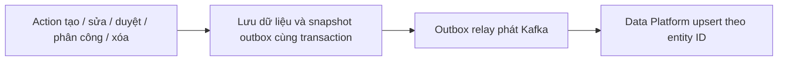

# BDSKD-9819 — Mapping dữ liệu NOXH sang Data Platform

> Bản thảo để thảo luận trước khi code. Nguồn: [Jira BDSKD-9819](https://vin3s.atlassian.net/browse/BDSKD-9819), file `[VHM Datamart]  O2O Datamart Mapping.xlsx`, sheet `Ticket NOXH 09_2026` (58 metric), đối chiếu code ngày 25/09/2026. Ticket chưa nêu cách đồng bộ, tần suất, SLA hoặc hợp đồng nhận dữ liệu.

## 1. Phạm vi và nguyên tắc

Sheet đích ghi schema `mart_o2o`, gồm 36 metric quản lý hồ sơ, 13 metric báo cáo, 4 metric loại giấy tờ và 5 metric checklist. `dossier-core` sở hữu hồ sơ; `v-definition-center-service` sở hữu `document_templates` và `document_template_sets`. Data Platform cần xác nhận mô hình bảng đích và cơ chế ingest trước khi triển khai. Không suy diễn rằng 58 cột cùng nằm trong một bảng: một hồ sơ có nhiều checklist và một checklist có nhiều giấy tờ.

Grain đã xác minh ở nguồn: một `dossier.id` là một hồ sơ; một `document_templates.id` là một loại giấy tờ; một `document_template_sets.id` là một checklist. Chỉ xuất hồ sơ có `product_code=SOCIAL_HOUSING`. Giá trị từ `form_data` đi kèm `schema_version`; không đổi mã nguồn thành nhãn khi chưa xác minh danh mục.

## 2. Mapping 58 metric

**Đã xác minh** nghĩa là field và ý nghĩa trong code/schema khớp metric. **Đã chốt** là quyết định mapping của người dùng. **Cần biến đổi** là cần lookup hoặc tính toán. **Quy tắc chọn; cần đối soát** là cách mình chọn để triển khai nhưng chưa có đủ bằng chứng dữ liệu/nghiệp vụ; chưa được coi là mapping đã xác minh. Mỗi dòng khớp một STT trong sheet.

`Cần biến đổi` có hai dạng: **lookup** tên từ master data (metric 3 và 57) và **tính toán** SLA/hạn quá ngày từ rule pipeline, lịch nghỉ và thời điểm tính (metric 20–23). Lookup không nhất thiết phải gọi service đồng bộ cho từng Kafka event: Data Platform có thể join dimension đã đồng bộ. Cách triển khai lookup phải bảo đảm tên và ID cùng thời điểm hiệu lực.

### Bảng mapping hợp nhất

Cột **Trạng thái** phân biệt field đã xác minh, hai rule `updated_at` đã được chốt, phép biến đổi, và các rule mình chọn nhưng vẫn cần đối soát với dữ liệu/BA trước khi xuất. `Thiếu nguồn` nghĩa là phải để null, không lấy field gần giống.

| STT | Metric Datamart | Cột/JSON path nguồn | Quy tắc mapping | Trạng thái |
| --- | --- | --- | --- | --- |
| 1 | `NOXH_profile_id` | `dossier.id` | UUID, người dùng đã chốt | Đã xác minh |
| 2 | `NOXH_customer_name` | `dossier.form_data.applicant.fullName` | Lấy trực tiếp | Đã xác minh |
| 3 | `NOXH_project_name` | `dossier.form_data.projectRegistration.projectId` | nguồn chỉ là ID, tên thuộc project master | Cần biến đổi |
| 4 | `NOXH_agency_name` | `dossier.form_data.projectRegistration.agencyId` | Resolve team name từ agencyId qua Profile MW; không có tên thì null, vẫn giữ agencyId. | Quy tắc chọn; cần đối soát |
| 5 | `NOXH_proposed_unit_info` | `dossier.form_data.projectRegistration.proposedUnitCode` | Dùng proposedUnitCode làm thông tin căn nguyện vọng; không tự ghép thuộc tính căn chưa có nguồn. | Quy tắc chọn; cần đối soát |
| 6 | `NOXH_assigned_unit_code` | `dossier.form_data.projectRegistration.assignedUnitCode` | Lấy trực tiếp | Đã xác minh |
| 7 | `NOXH_marital_status` | `dossier.form_data.applicant.maritalStatus` | Lấy trực tiếp raw value; nhãn cần lookup | Đã xác minh |
| 8 | `NOXH_housing_status` | `dossier.form_data.applicant.housingStatus` | Lấy trực tiếp raw value; nhãn cần lookup | Đã xác minh |
| 9 | `NOXH_customer_eligible_group` | `dossier.form_data.subjectGroup` | Lấy trực tiếp raw value; nhãn cần lookup | Đã xác minh |
| 10 | `NOXH_spouse_eligible_group` | Chưa có field đúng trong form schema | Để null. Cần bổ sung field nhóm chính sách của vợ/chồng tại nguồn; subjectCoApplicant là quan hệ. | Thiếu nguồn |
| 11 | `NOXH_created_date` | `dossier.created_at` | Lấy trực tiếp | Đã xác minh |
| 12 | `NOXH_updated_date` | `dossier.updated_at` | Lấy trực tiếp. | Đã chốt |
| 13 | `NOXH_approver_sales_dept` | `outbox_event.payload.actorId` của APPROVE từ SALES; reviewer row | ActorId của APPROVE gần nhất từ salesUnderReview; resolve tên qua Profile MW. | Quy tắc chọn; cần đối soát |
| 14 | `NOXH_approver_procedure_dept` | `outbox_event.payload.actorId` của APPROVE từ PROCEDURE; reviewer row | ActorId của APPROVE gần nhất từ procedurePending; resolve tên qua nguồn user phù hợp. | Quy tắc chọn; cần đối soát |
| 15 | `NOXH_profile_status` | `dossier.status`, `dossier.current_stage_code` | Lấy trực tiếp raw state; nhãn cần state map | Đã xác minh |
| 16 | `NOXH_created_source` | `dossier.source` | Lấy trực tiếp: AGENT/MARKET | Đã xác minh |
| 17 | `NOXH_profile_progress` | `dossier.current_stage_code`, pipeline definition | Dùng current_stage_code làm tiến độ dạng stage code/label; không phát phần trăm chưa có quy tắc. | Quy tắc chọn; cần đối soát |
| 18 | `NOXH_sale_owner` | `dossier.owner` | Lấy trực tiếp owner ID; tên cần Profile MW | Đã xác minh |
| 19 | `NOXH_reject_supplement_reason` | Reason code trên dossier; reasonCode/comment trong transition outbox | Lấy REJECT/REQUEST_REVISION gần nhất theo occurredAt; reasonCode để raw và resolve label, comment là trường riêng; thiếu reasonCode thì null. | Quy tắc chọn; cần đối soát |
| 20 | `NOXH_first_deadline_date` | `dossier.entered_stage_at` + pipeline SLA + lịch nghỉ | Tính theo `RevisionSlaView.firstDueAt`; không có cột lưu sẵn | Cần biến đổi |
| 21 | `NOXH_first_overdue_days` | `firstDueAt` + thời điểm tính | Tính theo `RevisionSlaView.firstOverdueDays` | Cần biến đổi |
| 22 | `NOXH_second_deadline_date` | `dossier.entered_stage_at` + pipeline SLA + lịch nghỉ | Tính theo `RevisionSlaView.secondDueAt` | Cần biến đổi |
| 23 | `NOXH_second_overdue_days` | `secondDueAt` + thời điểm tính | Tính theo `RevisionSlaView.secondOverdueDays` | Cần biến đổi |
| 24 | `NOXH_submitter_name` | `outbox_event.payload.actorId` của SUBMIT/RESUBMIT | Lấy actorId của SUBMIT đầu tiên; resolve tên. RESUBMIT không thay người nộp ban đầu. | Quy tắc chọn; cần đối soát |
| 25 | `NOXH_submitted_date` | `dossier.submitted_at` | Lấy trực tiếp field; semantics resubmit cần kiểm | Đã xác minh |
| 26 | `NOXH_supplement_request_date` | `outbox_event.payload.occurredAt` của REQUEST_REVISION | Lấy occurredAt của REQUEST_REVISION gần nhất đưa hồ sơ tới agentUpdateAtSales. | Quy tắc chọn; cần đối soát |
| 27 | `NOXH_assignment_date` | `dossier_stage_reviewer.assigned_at` với `stage_code=SALES` | Lấy trực tiếp ngày phân công hiện tại | Đã xác minh |
| 28 | `NOXH_customer_dob` | `dossier.form_data.applicant.dateOfBirth` | Lấy trực tiếp | Đã xác minh |
| 29 | `NOXH_customer_gender` | `dossier.form_data.applicant.gender` | Lấy trực tiếp | Đã xác minh |
| 30 | `NOXH_customer_id_number` | `dossier.form_data.applicant.idNumber` | PII | Đã xác minh |
| 31 | `NOXH_id_issue_date` | `dossier.form_data.applicant.idIssueDate` | Lấy trực tiếp | Đã xác minh |
| 32 | `NOXH_id_issue_place` | `dossier.form_data.applicant.idIssuePlace` | Lấy trực tiếp | Đã xác minh |
| 33 | `NOXH_customer_phone` | `dossier.form_data.applicant.phone` | PII | Đã xác minh |
| 34 | `NOXH_customer_email` | `dossier.form_data.applicant.email` | PII | Đã xác minh |
| 35 | `NOXH_permanent_address` | `dossier.form_data.applicant.permanentAddress` | PII | Đã xác minh |
| 36 | `NOXH_contact_address` | `dossier.form_data.applicant.contactAddress` | PII | Đã xác minh |
| 37 | `NOXH_report_proposed_unit_info` | `dossier.form_data.projectRegistration.proposedUnitCode` | Cùng proposedUnitCode và quy tắc metric 5. | Quy tắc chọn; cần đối soát |
| 38 | `NOXH_report_assigned_unit_code` | `dossier.form_data.projectRegistration.assignedUnitCode` | Lấy trực tiếp như 6 | Đã xác minh |
| 39 | `NOXH_report_agency_name` | `dossier.form_data.projectRegistration.agencyId` | Cùng lookup agencyId và quy tắc metric 4. | Quy tắc chọn; cần đối soát |
| 40 | `NOXH_report_customer_name` | `dossier.form_data.applicant.fullName` | Lấy trực tiếp như 2 | Đã xác minh |
| 41 | `NOXH_report_created_date` | `dossier.created_at` | Lấy trực tiếp như 11 | Đã xác minh |
| 42 | `NOXH_report_updated_date` | `dossier.updated_at` | Lấy trực tiếp, cùng metric 12. | Đã chốt |
| 43 | `NOXH_report_sxd_approved_date` | SXD reviewer decision/time; APPROVE → approved event time | Lấy occurredAt của APPROVE gần nhất chuyển tới approved; đối soát decision APPROVED của SXD. | Quy tắc chọn; cần đối soát |
| 44 | `NOXH_report_arrival_date` | `dossier_note.occurred_at` của HARDCOPY_SUBMISSION/RECEIPT | Lấy occurred_at đầu tiên của HARDCOPY_RECEIPT chưa bị xóa; null nếu không có bản cứng được xác nhận nhận. | Quy tắc chọn; cần đối soát |
| 45 | `NOXH_report_due_date_1` | `entered_stage_at` + pipeline SLA/lịch nghỉ | Dùng RevisionSlaView.firstDueAt của chu kỳ bổ sung hiện tại. | Quy tắc chọn; cần đối soát |
| 46 | `NOXH_report_overdue_days_1` | `firstDueAt` + thời điểm tính | Dùng RevisionSlaView.firstOverdueDays tại as_of_at; null khi không có chu kỳ bổ sung hiện tại. | Quy tắc chọn; cần đối soát |
| 47 | `NOXH_report_due_date_2` | `entered_stage_at` + pipeline SLA/lịch nghỉ | Dùng RevisionSlaView.secondDueAt của chu kỳ bổ sung hiện tại. | Quy tắc chọn; cần đối soát |
| 48 | `NOXH_report_overdue_days_2` | `secondDueAt` + thời điểm tính | Dùng RevisionSlaView.secondOverdueDays tại as_of_at; null khi không có chu kỳ bổ sung hiện tại. | Quy tắc chọn; cần đối soát |
| 49 | `NOXH_report_status` | `dossier.status`, `dossier.current_stage_code` | Lấy trực tiếp raw state như 15 | Đã xác minh |
| 50 | `NOXH_doc_template_id` | `document_templates.id` (Definition Center DB) | không ở dossier DB | Đã xác minh |
| 51 | `NOXH_doc_template_name` | `document_templates.name` (Definition Center DB) | Lấy trực tiếp | Đã xác minh |
| 52 | `NOXH_doc_template_description` | `document_templates.description` (Definition Center DB) | Lấy trực tiếp | Đã xác minh |
| 53 | `NOXH_doc_template_file` | `document_templates.s3_file_paths` | Xuất JSON array các S3 path nội bộ, giữ đủ phần tử; không tạo presigned URL. | Quy tắc chọn; cần đối soát |
| 54 | `NOXH_checklist_id` | `document_template_sets.id` (Definition Center DB) | Lấy trực tiếp | Đã xác minh |
| 55 | `NOXH_checklist_group_name` | `document_template_sets.properties.registrationGroupId`; Definition Center `master_data_items` | Resolve registrationGroupId sang master_data_items.name trong cùng tenant/org; thiếu match thì null. | Quy tắc chọn; cần đối soát |
| 56 | `NOXH_checklist_target_group` | `document_template_sets.properties.applicantTypeId`; Definition Center `master_data_items` | Resolve applicantTypeId sang master_data_items.name trong cùng tenant/org; thiếu match thì null. | Quy tắc chọn; cần đối soát |
| 57 | `NOXH_checklist_project_name` | `document_template_sets.project_id` | project master name | Cần biến đổi |
| 58 | `NOXH_checklist_quantity` | `document_template_sets.document_templates` | Đếm tất cả phần tử trong document_template_sets.document_templates, không chỉ isRequired. | Quy tắc chọn; cần đối soát |

## 3. Cách implement

1. **Dossier Core:** Sau mỗi action làm thay đổi một metric NOXH, lấy trạng thái hồ sơ **sau khi cập nhật** cùng reviewer/history liên quan, map thành payload theo bảng trên, rồi ghi một row vào `dossier_db.outbox_event` trong cùng transaction. Các action cần bao phủ: create, update form/owner, submit/resubmit, chuyển trạng thái, assign/reassign, duyệt/từ chối/yêu cầu bổ sung, phân căn và delete. Delete phát tombstone với `dossier.id`.
2. **Kafka:** `OutboxRelay` hiện có đọc row pending và phát Kafka với key `dossier.id`; chỉ đánh dấu đã phát sau Kafka ACK. Dùng topic Datamart riêng theo contract với Data Platform. Mỗi event có ID ổn định để consumer bỏ qua lần phát lặp.
3. **Definition Center:** Tại `DocumentTemplateServiceImpl` và `DocumentTemplateSetServiceImpl`, ghi snapshot template/checklist vào bảng `outbox_event` **đã có** trong schema khi create/update/status đổi. Relay của service phát sang topic tương ứng với key là template/checklist ID.
4. **Data Platform:** Consume event, upsert theo `(entity type, ID)` và map 58 metric. Tên từ master data được lookup theo ID; 4 số liệu quá hạn phụ thuộc thời điểm tính nên được tính lại hằng ngày. Backfill các row hiện có một lần bằng cùng payload trước khi chỉ nhận event mới.

`NOXH_profile_id` luôn là `dossier.id`; metric 12 và 42 luôn là `dossier.updated_at`. Metric 10 hiện **không có field nguồn đúng** nên để `null`, không dùng `spouse.subjectCoApplicant`. Những dòng ghi “cần đối soát” trong bảng không được đổi thành mapping đã xác minh chỉ vì event đã gửi thành công.
