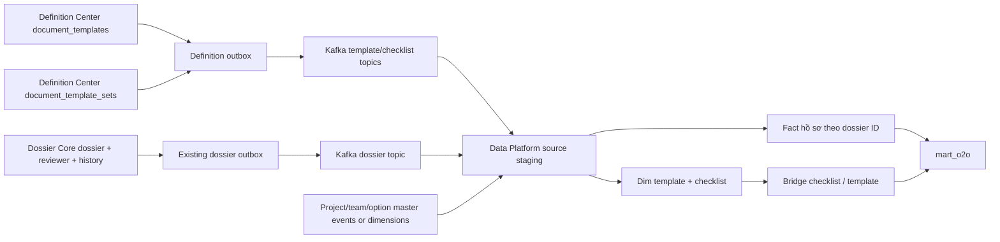

# BDSKD-9819 — Mapping dữ liệu NOXH sang Data Platform

> Bản thảo để thảo luận trước khi code. Nguồn: [Jira BDSKD-9819](https://vin3s.atlassian.net/browse/BDSKD-9819), file `[VHM Datamart]  O2O Datamart Mapping.xlsx`, sheet `Ticket NOXH 09_2026` (58 metric), đối chiếu code ngày 25/09/2026. Ticket chưa nêu cách đồng bộ, tần suất, SLA hoặc hợp đồng nhận dữ liệu.

## 1. Phạm vi và nguyên tắc

Sheet đích ghi schema `mart_o2o`, gồm 36 metric quản lý hồ sơ, 13 metric báo cáo, 4 metric loại giấy tờ và 5 metric checklist. `dossier-core` sở hữu hồ sơ; `v-definition-center-service` sở hữu `document_templates` và `document_template_sets`. Data Platform cần xác nhận mô hình bảng đích và cơ chế ingest trước khi triển khai. Không suy diễn rằng 58 cột cùng nằm trong một bảng: một hồ sơ có nhiều checklist và một checklist có nhiều giấy tờ.

Grain đã xác minh ở nguồn: một `dossier.id` là một hồ sơ; một `document_templates.id` là một loại giấy tờ; một `document_template_sets.id` là một checklist. Chỉ xuất hồ sơ có `product_code=SOCIAL_HOUSING`. Giá trị từ `form_data` đi kèm `schema_version`; không đổi mã nguồn thành nhãn khi chưa xác minh danh mục.

## 2. Mapping 58 metric

**Đã xác minh** nghĩa là field và ý nghĩa trong code/schema khớp metric. **Đã chốt** là quyết định mapping của người dùng. **Cần biến đổi** là cần lookup hoặc tính toán. **Quy tắc chọn; cần đối soát** là cách mình chọn để triển khai nhưng chưa có đủ bằng chứng dữ liệu/nghiệp vụ; chưa được coi là mapping đã xác minh. Mỗi dòng khớp một STT trong sheet.

`Cần biến đổi` có hai dạng: **lookup** tên từ master data (metric 3 và 57) và **tính toán** SLA/hạn quá ngày từ rule pipeline, lịch nghỉ và thời điểm tính (metric 20–23). Lookup không nhất thiết phải gọi service đồng bộ cho từng Kafka event: Data Platform có thể join dimension đã đồng bộ. Cách triển khai lookup phải bảo đảm tên và ID cùng thời điểm hiệu lực.

### Bảng mapping hợp nhất

Cột **Trạng thái** phân biệt field đã xác minh, hai rule `updated_at` đã được chốt, phép biến đổi, và các rule mình chọn nhưng vẫn cần đối soát với dữ liệu/BA trước khi xuất. `Thiếu nguồn` nghĩa là phải để null, không lấy field gần giống.

| STT | Metric Datamart | Cột/JSON path nguồn | Quy tắc mapping | Trạng thái |
| --- | --- | --- | --- | --- |
| 1 | `NOXH_profile_id` | `dossier.id` | UUID, người dùng đã chốt | Đã xác minh |
| 2 | `NOXH_customer_name` | `dossier.form_data.applicant.fullName` | Lấy trực tiếp | Đã xác minh |
| 3 | `NOXH_project_name` | `dossier.form_data.projectRegistration.projectId` | nguồn chỉ là ID, tên thuộc project master | Cần biến đổi |
| 4 | `NOXH_agency_name` | `dossier.form_data.projectRegistration.agencyId` | Resolve team name từ agencyId qua Profile MW; không có tên thì null, vẫn giữ agencyId. | Quy tắc chọn; cần đối soát |
| 5 | `NOXH_proposed_unit_info` | `dossier.form_data.projectRegistration.proposedUnitCode` | Dùng proposedUnitCode làm thông tin căn nguyện vọng; không tự ghép thuộc tính căn chưa có nguồn. | Quy tắc chọn; cần đối soát |
| 6 | `NOXH_assigned_unit_code` | `dossier.form_data.projectRegistration.assignedUnitCode` | Lấy trực tiếp | Đã xác minh |
| 7 | `NOXH_marital_status` | `dossier.form_data.applicant.maritalStatus` | Lấy trực tiếp raw value; nhãn cần lookup | Đã xác minh |
| 8 | `NOXH_housing_status` | `dossier.form_data.applicant.housingStatus` | Lấy trực tiếp raw value; nhãn cần lookup | Đã xác minh |
| 9 | `NOXH_customer_eligible_group` | `dossier.form_data.subjectGroup` | Lấy trực tiếp raw value; nhãn cần lookup | Đã xác minh |
| 10 | `NOXH_spouse_eligible_group` | Chưa có field đúng trong form schema | Để null. Cần bổ sung field nhóm chính sách của vợ/chồng tại nguồn; subjectCoApplicant là quan hệ. | Thiếu nguồn |
| 11 | `NOXH_created_date` | `dossier.created_at` | Lấy trực tiếp | Đã xác minh |
| 12 | `NOXH_updated_date` | `dossier.updated_at` | Lấy trực tiếp. | Đã chốt |
| 13 | `NOXH_approver_sales_dept` | `outbox_event.payload.actorId` của APPROVE từ SALES; reviewer row | ActorId của APPROVE gần nhất từ salesUnderReview; resolve tên qua Profile MW. | Quy tắc chọn; cần đối soát |
| 14 | `NOXH_approver_procedure_dept` | `outbox_event.payload.actorId` của APPROVE từ PROCEDURE; reviewer row | ActorId của APPROVE gần nhất từ procedurePending; resolve tên qua nguồn user phù hợp. | Quy tắc chọn; cần đối soát |
| 15 | `NOXH_profile_status` | `dossier.status`, `dossier.current_stage_code` | Lấy trực tiếp raw state; nhãn cần state map | Đã xác minh |
| 16 | `NOXH_created_source` | `dossier.source` | Lấy trực tiếp: AGENT/MARKET | Đã xác minh |
| 17 | `NOXH_profile_progress` | `dossier.current_stage_code`, pipeline definition | Dùng current_stage_code làm tiến độ dạng stage code/label; không phát phần trăm chưa có quy tắc. | Quy tắc chọn; cần đối soát |
| 18 | `NOXH_sale_owner` | `dossier.owner` | Lấy trực tiếp owner ID; tên cần Profile MW | Đã xác minh |
| 19 | `NOXH_reject_supplement_reason` | Reason code trên dossier; reasonCode/comment trong transition outbox | Lấy REJECT/REQUEST_REVISION gần nhất theo occurredAt; reasonCode để raw và resolve label, comment là trường riêng; thiếu reasonCode thì null. | Quy tắc chọn; cần đối soát |
| 20 | `NOXH_first_deadline_date` | `dossier.entered_stage_at` + pipeline SLA + lịch nghỉ | Tính theo `RevisionSlaView.firstDueAt`; không có cột lưu sẵn | Cần biến đổi |
| 21 | `NOXH_first_overdue_days` | `firstDueAt` + thời điểm tính | Tính theo `RevisionSlaView.firstOverdueDays` | Cần biến đổi |
| 22 | `NOXH_second_deadline_date` | `dossier.entered_stage_at` + pipeline SLA + lịch nghỉ | Tính theo `RevisionSlaView.secondDueAt` | Cần biến đổi |
| 23 | `NOXH_second_overdue_days` | `secondDueAt` + thời điểm tính | Tính theo `RevisionSlaView.secondOverdueDays` | Cần biến đổi |
| 24 | `NOXH_submitter_name` | `outbox_event.payload.actorId` của SUBMIT/RESUBMIT | Lấy actorId của SUBMIT đầu tiên; resolve tên. RESUBMIT không thay người nộp ban đầu. | Quy tắc chọn; cần đối soát |
| 25 | `NOXH_submitted_date` | `dossier.submitted_at` | Lấy trực tiếp field; semantics resubmit cần kiểm | Đã xác minh |
| 26 | `NOXH_supplement_request_date` | `outbox_event.payload.occurredAt` của REQUEST_REVISION | Lấy occurredAt của REQUEST_REVISION gần nhất đưa hồ sơ tới agentUpdateAtSales. | Quy tắc chọn; cần đối soát |
| 27 | `NOXH_assignment_date` | `dossier_stage_reviewer.assigned_at` với `stage_code=SALES` | Lấy trực tiếp ngày phân công hiện tại | Đã xác minh |
| 28 | `NOXH_customer_dob` | `dossier.form_data.applicant.dateOfBirth` | Lấy trực tiếp | Đã xác minh |
| 29 | `NOXH_customer_gender` | `dossier.form_data.applicant.gender` | Lấy trực tiếp | Đã xác minh |
| 30 | `NOXH_customer_id_number` | `dossier.form_data.applicant.idNumber` | PII | Đã xác minh |
| 31 | `NOXH_id_issue_date` | `dossier.form_data.applicant.idIssueDate` | Lấy trực tiếp | Đã xác minh |
| 32 | `NOXH_id_issue_place` | `dossier.form_data.applicant.idIssuePlace` | Lấy trực tiếp | Đã xác minh |
| 33 | `NOXH_customer_phone` | `dossier.form_data.applicant.phone` | PII | Đã xác minh |
| 34 | `NOXH_customer_email` | `dossier.form_data.applicant.email` | PII | Đã xác minh |
| 35 | `NOXH_permanent_address` | `dossier.form_data.applicant.permanentAddress` | PII | Đã xác minh |
| 36 | `NOXH_contact_address` | `dossier.form_data.applicant.contactAddress` | PII | Đã xác minh |
| 37 | `NOXH_report_proposed_unit_info` | `dossier.form_data.projectRegistration.proposedUnitCode` | Cùng proposedUnitCode và quy tắc metric 5. | Quy tắc chọn; cần đối soát |
| 38 | `NOXH_report_assigned_unit_code` | `dossier.form_data.projectRegistration.assignedUnitCode` | Lấy trực tiếp như 6 | Đã xác minh |
| 39 | `NOXH_report_agency_name` | `dossier.form_data.projectRegistration.agencyId` | Cùng lookup agencyId và quy tắc metric 4. | Quy tắc chọn; cần đối soát |
| 40 | `NOXH_report_customer_name` | `dossier.form_data.applicant.fullName` | Lấy trực tiếp như 2 | Đã xác minh |
| 41 | `NOXH_report_created_date` | `dossier.created_at` | Lấy trực tiếp như 11 | Đã xác minh |
| 42 | `NOXH_report_updated_date` | `dossier.updated_at` | Lấy trực tiếp, cùng metric 12. | Đã chốt |
| 43 | `NOXH_report_sxd_approved_date` | SXD reviewer decision/time; APPROVE → approved event time | Lấy occurredAt của APPROVE gần nhất chuyển tới approved; đối soát decision APPROVED của SXD. | Quy tắc chọn; cần đối soát |
| 44 | `NOXH_report_arrival_date` | `dossier_note.occurred_at` của HARDCOPY_SUBMISSION/RECEIPT | Lấy occurred_at đầu tiên của HARDCOPY_RECEIPT chưa bị xóa; null nếu không có bản cứng được xác nhận nhận. | Quy tắc chọn; cần đối soát |
| 45 | `NOXH_report_due_date_1` | `entered_stage_at` + pipeline SLA/lịch nghỉ | Dùng RevisionSlaView.firstDueAt của chu kỳ bổ sung hiện tại. | Quy tắc chọn; cần đối soát |
| 46 | `NOXH_report_overdue_days_1` | `firstDueAt` + thời điểm tính | Dùng RevisionSlaView.firstOverdueDays tại as_of_at; null khi không có chu kỳ bổ sung hiện tại. | Quy tắc chọn; cần đối soát |
| 47 | `NOXH_report_due_date_2` | `entered_stage_at` + pipeline SLA/lịch nghỉ | Dùng RevisionSlaView.secondDueAt của chu kỳ bổ sung hiện tại. | Quy tắc chọn; cần đối soát |
| 48 | `NOXH_report_overdue_days_2` | `secondDueAt` + thời điểm tính | Dùng RevisionSlaView.secondOverdueDays tại as_of_at; null khi không có chu kỳ bổ sung hiện tại. | Quy tắc chọn; cần đối soát |
| 49 | `NOXH_report_status` | `dossier.status`, `dossier.current_stage_code` | Lấy trực tiếp raw state như 15 | Đã xác minh |
| 50 | `NOXH_doc_template_id` | `document_templates.id` (Definition Center DB) | không ở dossier DB | Đã xác minh |
| 51 | `NOXH_doc_template_name` | `document_templates.name` (Definition Center DB) | Lấy trực tiếp | Đã xác minh |
| 52 | `NOXH_doc_template_description` | `document_templates.description` (Definition Center DB) | Lấy trực tiếp | Đã xác minh |
| 53 | `NOXH_doc_template_file` | `document_templates.s3_file_paths` | Xuất JSON array các S3 path nội bộ, giữ đủ phần tử; không tạo presigned URL. | Quy tắc chọn; cần đối soát |
| 54 | `NOXH_checklist_id` | `document_template_sets.id` (Definition Center DB) | Lấy trực tiếp | Đã xác minh |
| 55 | `NOXH_checklist_group_name` | `document_template_sets.properties.registrationGroupId`; Definition Center `master_data_items` | Resolve registrationGroupId sang master_data_items.name trong cùng tenant/org; thiếu match thì null. | Quy tắc chọn; cần đối soát |
| 56 | `NOXH_checklist_target_group` | `document_template_sets.properties.applicantTypeId`; Definition Center `master_data_items` | Resolve applicantTypeId sang master_data_items.name trong cùng tenant/org; thiếu match thì null. | Quy tắc chọn; cần đối soát |
| 57 | `NOXH_checklist_project_name` | `document_template_sets.project_id` | project master name | Cần biến đổi |
| 58 | `NOXH_checklist_quantity` | `document_template_sets.document_templates` | Đếm tất cả phần tử trong document_template_sets.document_templates, không chỉ isRequired. | Quy tắc chọn; cần đối soát |

### Các điểm phải dò lại trước khi xuất giá trị

| STT | Cần đối soát với ai/nguồn nào | Bằng chứng cần có |
| --- | --- | --- |
| 3, 4, 39, 57 | Chủ sở hữu project/team master và BA | API/bảng tên tương ứng ID, phạm vi agency hay phòng kinh doanh, quy tắc tên hiện tại hay tên snapshot |
| 5, 37 | BA và service quỹ căn | “Thông tin căn” chỉ là mã căn hay gồm tòa/tầng/diện tích; trường nguồn cho từng thuộc tính |
| 10 | BA, Agent API, schema form | Field lưu **nhóm chính sách của vợ/chồng**; không dùng `subjectCoApplicant` vì field đó là quan hệ |
| 13, 14, 43 | BA duyệt hồ sơ và audit/reviewer data | Người thực duyệt và thời điểm duyệt qua các lần assign/reassign, reject rồi duyệt lại; so với `dossier_stage_reviewer` hiện tại |
| 17 | BA và pipeline definition | Bảng trạng thái → tiến độ, kiểu giá trị và xử lý vòng bổ sung/quay lui |
| 18 | Profile MW | ID owner được resolve thành tên nào, thời điểm lấy tên |
| 19, 26 | BA và status history | Ưu tiên reject hay supplement, reason code hay comment, chọn occurrence đầu/cuối |
| 20–23, 45–48 | BA SLA, pipeline rule và lịch nghỉ | Mốc T1/T2, loại ngày được trừ, thời điểm chốt `as_of`, dừng đếm quá hạn khi hồ sơ rời trạng thái; hai nhóm deadline có cùng nghĩa không |
| 24, 25, 44 | BA luồng nộp hồ sơ | Submit đầu/resubmit, người nộp là actor nào, “đến nộp” vật lý hay nộp điện tử |
| 53 | Chủ sở hữu Definition Center và Data Platform | File metric là một path, mảng path, metadata hay link; không phát link tạm |
| 55, 56, 58 | BA checklist và Definition Center | Nghĩa `registrationGroupId`/`applicantTypeId`, bảng tên tương ứng, quantity đếm tất cả hay required |

Với các dòng **Chưa xác minh**, triển khai phải để `null` hoặc chưa xuất metric sau khi thống nhất contract; không điền bằng field “gần đúng”. Với dòng **Cần biến đổi**, lưu ID/raw value và chỉ xuất tên/số tính khi phép lookup hoặc công thức đã được đối soát bằng dữ liệu thực tế. Mỗi quyết định sau đối soát cần cập nhật bảng trên cùng bằng chứng (field/schema, rule nghiệp vụ, ví dụ đầu vào/đầu ra), rồi mới đổi trạng thái thành **Đã xác minh**.

### Đối soát trực tiếp staging DB ngày 25/09/2026

Đã chạy **SELECT tổng hợp**, kết nối `vhmmarket_db` với `current_schema=dossier_db`; không đọc ra giá trị tên, CCCD, điện thoại, email hoặc địa chỉ. Số lượng bên dưới là hiện trạng staging tại thời điểm kiểm tra, không phải ràng buộc dữ liệu hay số liệu production.

| Kiểm tra | Kết quả | Kết luận |
| --- | --- | --- |
| Hồ sơ `product_code=SOCIAL_HOUSING` | 542: AGENT 256, MARKET 286 | Cần bao phủ cả hai nguồn |
| JSON `applicant` / `projectRegistration` / `spouse` | 436 / 417 / 67 hồ sơ có object | Các metric JSON có thể null; không được ép default hoặc lấy field từ hồ sơ khác |
| `applicant.fullName` / `idNumber` | 370 / 368 hồ sơ có key | Path tồn tại thật; không đồng nghĩa tất cả hồ sơ đã đủ dữ liệu |
| `projectRegistration.projectId` / `agencyId` / `proposedUnitCode` / `assignedUnitCode` | 417 / 248 / 302 / 25 hồ sơ có key | Bốn field khác nhau, không dùng mã căn nguyện vọng thay mã căn đã cấp |
| `spouse.subjectCoApplicant` | 67 hồ sơ có key; không thấy key khác về nhóm chính sách trong object `spouse` | Củng cố kết luận metric 10 chưa có nguồn đúng |
| `created_at` / `updated_at` / `last_event_at` / `submitted_at` | 542 / 542 / 542 / 291 hồ sơ có giá trị | `submitted_at` null hợp lệ với hồ sơ chưa nộp |
| `updated_at = last_event_at` | 315 bằng nhau, 227 khác nhau | Metric 12/42 **đã chốt dùng `updated_at`**; không dùng `last_event_at` dù report cũ đang dùng |
| Reviewer SALES / PROCEDURE / SXD | 291 / 94 / 36 row; có `reviewed_at` lần lượt 217 / 54 / 33 | Không thể dùng reviewer row không có decision như “người duyệt” |
| SXD approved | 6/6 hồ sơ hiện `APPROVED` có reviewer SXD `decision=APPROVED` và `reviewed_at` | Mẫu staging ủng hộ điều kiện của metric 43, vẫn cần xác nhận business rule và lịch sử các lần duyệt |
| `dossier_status_history` | 157 transition đến ADD_INFO_REQUESTED; 19 đến APPROVED; 173 đến REJECTED | Có lịch sử mốc trạng thái, nhưng chưa đủ để xác định “nộp/đến nộp” hay chu kỳ bổ sung cần chọn |
| `dossier_note` | HARDCOPY_RECEIPT 75 row/45 hồ sơ; HARDCOPY_SUBMISSION 29 row/19 hồ sơ; HARDCOPY_REQUEST 31 row/24 hồ sơ | Có `occurred_at` cho sự kiện bản cứng; metric 44 phải chốt chọn nộp hay nhận, và chọn lần nào |
| `outbox_event` với `registration.transitioned` | 291 SUBMIT, 130 RESUBMIT, 157 REQUEST_REVISION → agentUpdateAtSales; event có `actorId`, `occurredAt`, `fromState`, `toState` | Có nguồn sự kiện chính xác hơn status history cho metric 24/26, nhưng còn phải chốt occurrence và lookup tên |
| `outbox_event` với `registration.transitioned` | APPROVE → procedurePending 129, → sxdPending 42, → approved 19 | Có actor/time cho hành động duyệt; không tự suy ra người duyệt từ reviewer row hiện tại |
| `review_case` | 0 row liên kết hồ sơ NOXH hiện hữu | Không dùng bảng này để lấp các metric còn thiếu |

Kiểm tra chất lượng bắt buộc khi triển khai: đối chiếu số event/fact theo `dossier.id`, `source` và `status`; kiểm tra tỷ lệ null theo từng field và theo AGENT/MARKET; đối chiếu timestamp/reviewer trên các hồ sơ đã duyệt; kiểm tra duplicate, replay, hard delete; đối soát dữ liệu Definition Center bằng quyền đọc của service đó. Không đánh dấu metric đã xác minh chỉ dựa vào việc JSON key xuất hiện.

Đã dò metadata của các bảng khác mà `dossier_db_user` nhìn thấy: không có bảng nguồn riêng cho nhóm chính sách vợ/chồng, phần trăm tiến độ hoặc ngày đến nộp dùng chung cho mọi hồ sơ. `dossier_note` và `outbox_event` là nguồn sự kiện bổ sung, không thay được quyết định về nghĩa metric. Chưa có quyền đọc dữ liệu Definition Center trong kết nối này; repo của service đó có `master_data`, `master_data_items` và `outbox_event` theo migration, nhưng liên kết ID/giá trị thực tế cần kiểm bằng DB của service.

## 3. Luồng Kafka đã chốt về mặt phương thức

```text
dossier-core transaction: mutate dossier + INSERT outbox_event
     → OutboxRelay → Kafka → Data Platform consumer → fact NOXH
definition-center transaction: mutate document_templates/document_template_sets
     → outbox_event đã có trong schema; cần kiểm producer/relay cho hai entity → Kafka
     → Data Platform consumer → dimensions + bridge → mart_o2o
```

Tham chiếu `IdentityVerificationHistoricalService` trong cobroker là **consumer/materializer**, không phải nơi phát Kafka. Cặp write-side tương ứng là `IdentityVerificationHistoryEnqueuer` → `HistoricalOutboxService` → relay: ghi event trong cùng transaction, publish sau commit, consumer dedup theo định danh event. `dossier-core` đã có `outbox_event` và `OutboxRelay`; nên mở rộng outbox này, không gọi Kafka trực tiếp trong transaction. `v-definition-center-service` **đã có bảng `outbox_event` trong baseline migration**; cần kiểm code producer/relay và tái sử dụng nếu phù hợp. Các service `DocumentTemplateServiceImpl` và `DocumentTemplateSetServiceImpl` hiện gọi `notifyChanges`, chưa thấy ghi outbox Datamart ở hai đường create/update.

Payload đề xuất theo cùng envelope: `objectId`, `timestamp`, `action` (`create`/`update`/`delete`), `performSource`, `performer`, `oldData`, `updateData`, `data`. `data` là **snapshot sau thay đổi** theo grain nguồn, gồm ID, schema version, timestamp và các field raw; `updateData` mô tả sự kiện/field đổi. Topic, version payload, event ID để dedup, key partition, retention và quyền consumer cần Data Platform xác nhận. Với topic hồ sơ, key là `dossier.id`; với template/checklist dùng ID của entity. Không chứa presigned URL hay toàn bộ `form_data` nếu chỉ 58 metric cần dùng vì form có dữ liệu và file nhạy cảm khác.

Backfill ban đầu cần phát snapshot `create` cho các row hiện hữu với quy trình chống trùng khi live event chạy song song; consumer upsert theo `(entity_type, objectId)` và version/updated timestamp để không ghi đè dữ liệu mới bằng backfill cũ. Xử lý inactive/delete cho template/checklist và xóa hồ sơ theo semantics nguồn. Với SLA động và `overdue_days`, event hồ sơ không phát mỗi ngày nếu không có mutation: Data Platform phải tính lại theo `as_of_at` hoặc có scheduled refresh event; cần chốt một cách. Tên dự án/đại lý và option label cũng có thể đổi mà hồ sơ không đổi, nên consumer cần join dimension hoặc nhận event master data. Không lấy báo cáo Excel hiện tại làm nguồn đồng bộ vì report có fallback ID, định dạng ngày thành chuỗi và cột tính tại thời điểm gọi API.

CCCD, điện thoại, email và địa chỉ là dữ liệu cá nhân. Chỉ đưa sang Data Platform nếu có quyền truy cập, mục đích sử dụng, chính sách lưu giữ và cơ chế bảo vệ được phê duyệt; tránh đưa presigned URL hoặc nội dung file mẫu vào mart. `s3_file_paths` là tham chiếu nội bộ, không phải link tải công khai.

## 4. Cần chốt trước khi code

1. Kafka đã được chọn: chốt tên topic, cluster, quyền publish/consume, partition key, envelope/payload version, event ID, retention, DLQ, retry, SLA và trách nhiệm backfill.
2. Thiết kế bảng đích và grain cho 4 nhóm metric; tên cột, kiểu dữ liệu, khóa, nullable, múi giờ (`Asia/Ho_Chi_Minh` để hiển thị hay UTC timestamp) và chính sách cập nhật lịch sử.
3. `profile_id` đã chốt là `dossier.id` UUID; metric 12/42 đã chốt là `dossier.updated_at`. Các metric người duyệt, người nộp và ngày đến nộp dùng quy tắc đã chọn trong bảng, cần đối soát trên dữ liệu thực tế trước khi coi là xác minh.
4. Hai bộ deadline có cùng SLA bổ sung không; lấy chu kỳ mới nhất hay giữ từng lần yêu cầu; `overdue_days` dừng tính sau khi đã bổ sung hay tiếp tục tăng?
5. Quy tắc resolve tên dự án, đại lý, Sale, option label; trường hợp lookup thất bại xuất null hay mã nguồn; quy tắc snapshot tên.
6. Nguồn thực sự cho nhóm đối tượng chính sách của vợ/chồng (metric 10). `subjectCoApplicant` hiện chỉ là quan hệ. Cách xuất `s3_file_paths` nhiều giá trị, số lượng giấy tờ checklist, tên nhóm/đối tượng; xác nhận danh sách template/checklist NOXH khi Definition Center dùng chung nhiều sản phẩm.
7. Phạm vi dữ liệu cá nhân (đặc biệt CCCD) và phân quyền Data Platform; có cần mask/hash hay bỏ cột ở từng consumer.

## 5. Điểm cần lưu ý khi triển khai

- `SocialHousingReportExportServiceImpl` đã có mapping tham khảo cho tên dự án/agency, label, reviewer và SLA; cần dùng lại rule nghiệp vụ nhưng không phụ thuộc vào chuỗi hiển thị Excel.
- Report hiện map `spouse.subjectCoApplicant` qua danh mục nhóm đối tượng; schema định nghĩa đây là quan hệ đồng đăng ký. Đây là mismatch cần BA xác nhận, không copy sang event datamart.
- `dossier_stage_reviewer` là một row trên dossier và stage. Nếu tái phân công nhiều lần, row hiện tại không tự thể hiện toàn bộ lịch sử; các metric cần “lần đầu” phải dùng audit/event riêng.
- `dossier_status_history` là append-only và có `at`, `actor_id`, `to_status`; nên xác định rõ quy tắc chọn occurrence trước khi truy vấn.
- Tài liệu này là hợp đồng mapping dự thảo. Chưa thay đổi schema, API, event hay job đồng bộ.

## 6. Thiết kế triển khai theo repo

### 6.1 Dossier producer — `vhm-dossier-core`

**Điểm chèn:** thêm `NoxhDatamartEventEnqueuer`/mapper riêng, gọi trong cùng transaction ở các đường thay đổi `DossierEntity`: create, update form, update owner, submit/resubmit/status transition, approve/reject/request revision, assign/reassign reviewer, allocate unit và delete draft. Cần rà soát toàn bộ nơi `dossierRepo.save`, `stageReviewerRepo.save` và thao tác trực tiếp form JSON để không sót một metric. Không tái sử dụng nguyên payload các event `dossier.created.v1`, `dossier.form_updated.v1`, `dossier.status_changed.v1`: chúng chỉ là delta, không có đủ 36 metric và reviewer/SLA. Mỗi lần thay đổi liên quan, enqueue snapshot sau mutation; delete phát tombstone từ snapshot trước khi hard delete.

**Outbox:** dùng `dossier_db.outbox_event` đang có. `OutboxRelay` hiện tạo topic từ `aggregate_type.aggregate_type.event_type.event_version`, không cho cấu hình topic tự do. Có hai phương án implementation, chọn một trước khi code: (A) quy ước topic Datamart theo công thức hiện tại, ví dụ `dossier_datamart.dossier_datamart.snapshot.v1`; (B) thêm `topic` nullable/configured vào outbox và relay, migration giữ nguyên hành vi các event cũ. Ưu tiên B nếu Data Platform cấp topic cố định. Bất kể phương án, Kafka key = dossier UUID. Không publish trực tiếp bằng `KafkaTemplate` từ business transaction.

**Snapshot payload:** project/agency ID, owner ID/team/region, schema version, source, code hiển thị, applicant 9 field cá nhân, subject group, spouse relation (đặt tên đúng nghĩa), proposed/assigned unit, status + stage, `created_at`/`updated_at`/`last_event_at`/`submitted_at`, reviewer của SALES/PROCEDURE/SXD (`reviewer_id`, `reviewer_name`, `decision`, `assigned_at`, `reviewed_at`, `comment`), reason codes, `entered_stage_at`. Chỉ xuất các trường đã được Data Platform chấp thuận; không gửi `metadata`, `documents`, S3 path hồ sơ hoặc nguyên `form_data`. Nếu dùng event snapshot, consumer có thể tái dựng cột trực tiếp mà không gọi API về core.

**Lịch sử/timing:** supplement request date lấy `dossier_status_history` tại occurrence đã chọn, nhưng `delete()` hiện xóa history của draft. Dùng event tombstone để xóa fact tương ứng. `assigned_at` trong `dossier_stage_reviewer` là lần phân công đang còn trên row; nếu cần lịch sử phân công phải phát event riêng hoặc thêm audit. `updated_at` do JPA auditing tạo lúc flush; mapper chạy trước flush có thể thấy giá trị cũ, nên dùng thời điểm mutation được xác định rõ (`occurredAt`) và/hoặc flush trước snapshot, sau đó kiểm thử tính nhất quán. `version` cũng có thể tăng khi flush: consumer nên dùng sequence outbox/event revision rõ ràng thay vì ngầm tin version trong entity trước flush.

### 6.2 Template/checklist producer — `v-definition-center-service`

**Điểm chèn:** `DocumentTemplateServiceImpl.create/update` và `DocumentTemplateSetServiceImpl.create/update` sau `save`, trước khi transaction kết thúc. Update status `INACTIVE` phát update snapshot với status, không mặc định là delete. Hai bảng `document_templates` và `document_template_sets` có thể chứa nhiều sản phẩm; chỉ lọc NOXH khi có rule project/org/tenant được BA chốt. Không suy đoán tất cả template là NOXH.

**Outbox:** baseline Definition Center đã tạo `outbox_event` với UUID `id`, `aggregate_type`, `aggregate_id`, `event_type`, `payload` text, `topic`, `shard_id`, `dispatched_at`, `attempt_count`, `last_error`. Kiểm tra bean/repository/relay đang dùng ở runtime; nếu chưa có thì triển khai trên **bảng hiện hữu**, không tạo bảng trùng. Dùng transaction hiện có của create/update để ghi outbox atomic; relay retry và chỉ mark `dispatched_at` khi Kafka ack. Cần metric pending/failed và DLQ/alert theo contract vận hành.

**Payload:** template gồm `id`, `code`, `name`, `description`, `s3_file_paths`, `tenant_id`, `org_id`, `status`, audit timestamps; checklist gồm `id`, `code`, `project_id`, `properties.applicantTypeId`, `properties.registrationGroupId`, `document_templates[]` (`documentTemplateId`, `name`, `isRequired`, `displayOrder`) và audit timestamps. Consumer upsert bridge checklist-template bằng cách thay toàn bộ members của **một checklist** trên event snapshot mới; không append từng member vì update có thể xóa giấy tờ khỏi set.

### 6.3 Contract event đề xuất

Ví dụ minh họa, chưa phải topic/contract đã được Data Platform phê duyệt:

```json
{
  "eventId": "<producer + outbox ID ổn định>",
  "eventVersion": 1,
  "entityType": "NOXH_DOSSIER",
  "objectId": "<dossier UUID>",
  "action": "update",
  "timestamp": 0,
  "performSource": "vhm-dossier-core",
  "performer": "<actor ID hoặc SYSTEM>",
  "updateData": { "event": "SNAPSHOT", "reason": "ASSIGN_REVIEWER" },
  "data": {
    "productCode": "SOCIAL_HOUSING",
    "schemaVersion": "v1",
    "source": "AGENT",
    "status": "UNDER_REVIEW",
    "currentStageCode": "salesUnderReview",
    "applicant": { "fullName": "<giá trị được cho phép>" },
    "projectRegistration": { "projectId": "<ID>", "proposedUnitCode": "<mã căn>" }
  }
}
```

`oldData` chỉ cần nếu Data Platform thực sự dùng diff; snapshot `data` đầy đủ và tombstone `data=null` giảm độ lớn payload, tránh nhân đôi dữ liệu cá nhân. `dossier_db.outbox_event.id` hiện là BIGINT, nên có thể dùng `eventId = vhm-dossier-core:<outbox-id>`; Definition Center dùng cùng quy tắc theo ID outbox của nó. Nếu phải giống nguyên shape `HistoricalEvent` của cobroker, đặt `eventId` ở header Kafka hoặc trong `updateData` (vì DTO tham chiếu không có field này). Consumer dedup theo `eventId`, không theo `(objectId,timestamp)` vì nhiều thay đổi có thể cùng millisecond. Topic riêng cho dossier, template và checklist; không trộn grain. Contract `data` nên được lưu dưới schema/version có kiểm soát và kiểm thử tương thích.

### 6.4 Consumer và backfill — phía Data Platform

Consumer validate version, chỉ nhận `SOCIAL_HOUSING` cho dossier, dedup event ID, upsert nguồn theo `(entityType, objectId)` và thứ tự revision/sequence. Với delete, ghi tombstone/tình trạng đã xóa để replay hoặc backfill cũ không hồi sinh row. Stage raw giữ code và timestamp; transform sang 58 metric ở tầng mart. Lookup tên/label từ master dimension có quản lý thời điểm hiệu lực. Event payload không nên chứa tên lookup từ API sống tại thời điểm publish vì phụ thuộc service khác và tên có thể đổi sau đó.

Backfill chạy keyset pagination theo ID từ các bảng nguồn, phát snapshot cùng format event live, ghi `snapshotAt` và `sourceUpdatedAt`. Consumer phải ưu tiên bản có source revision mới hơn; không dựa vào thời điểm Kafka nhận. Chạy backfill trong khi live stream hoạt động, đối soát count theo product/status và checksum/cột trọng yếu, sau đó replay thử một khoảng event. Dossier đã bị hard delete trước backfill không thể phục hồi từ bảng hiện tại; chỉ có thể lấy từ event/audit còn lưu nếu có.

### 6.5 Flow nghiệp vụ và vận hành

```mermaid
sequenceDiagram
    autonumber
    participant API as Agent API / command
    participant Core as Dossier Core
    participant DB as Dossier DB
    participant Relay as OutboxRelay
    participant Kafka as Kafka
    participant DP as Data Platform
    API->>Core: Tạo/cập nhật/duyệt/phân công hồ sơ
    Core->>DB: BEGIN + lưu dossier/reviewer/history
    Core->>DB: INSERT outbox snapshot cùng transaction
    DB-->>Core: COMMIT
    Relay->>DB: SELECT pending FOR UPDATE SKIP LOCKED
    Relay->>Kafka: publish(key=dossierId, eventId)
    Kafka-->>Relay: ACK
    Relay->>DB: mark published_at
    Kafka->>DP: at-least-once delivery
    DP->>DP: validate, dedup, upsert source, map mart
```





**Failure:** business transaction rollback thì không có event; Kafka lỗi thì outbox giữ pending để retry. Sau Kafka ACK nhưng trước mark published có thể gửi lại, vì vậy consumer dedup bắt buộc. Poison payload vào DLQ kèm event ID và lý do, có khả năng replay. `outbox.relay.publish-enabled=false` hiện vẫn mark row là published; không dùng cờ này như cơ chế tạm dừng Datamart trên môi trường cần giữ event — cần sửa semantics hoặc dùng cờ riêng chỉ ngăn enqueue trước rollout.

### 6.6 Trình tự làm khi bắt đầu code

1. Chốt các quyết định ở mục 4 và lưu JSON schema/topic contract mẫu có version trong repo liên quan. Chốt đặc biệt metric 10, grain của report fields, PII và cách tính SLA động.
2. Viết mapper thuần cho dossier snapshot và test bằng fixture `AGENT`, `MARKET`, hồ sơ thiếu field, reviewer đổi người, revision cycle, approve SXD, delete draft. Đối chiếu từng cột với sheet; metric chưa có nguồn phải là `null`/không publish, tuyệt đối không gán sai nghĩa.
3. Ghi event vào outbox ở tất cả write path của dossier, test transaction rollback, event count và snapshot sau mutation. Sửa routing topic theo contract đã chốt; đảm bảo event cũ không đổi topic/payload.
4. Thêm outbox/migration/producer/relay cho Definition Center và test create/update/status `INACTIVE`, thay membership checklist, rollback, retry.
5. Implement consumer/mart và backfill, chạy reconciliation theo cả 58 metric. Kiểm thử at-least-once, replay, out-of-order, backfill chồng live, thay master name và ngày trôi qua làm thay `overdue_days`.
6. Triển khai consumer và quyền topic trước producer; bật producer sau khi giám sát pending outbox/DLQ, đối soát dữ liệu, rồi chạy backfill và xác nhận kết quả với BA/Data Platform.
