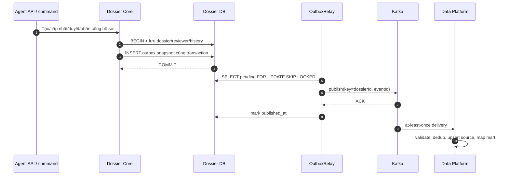
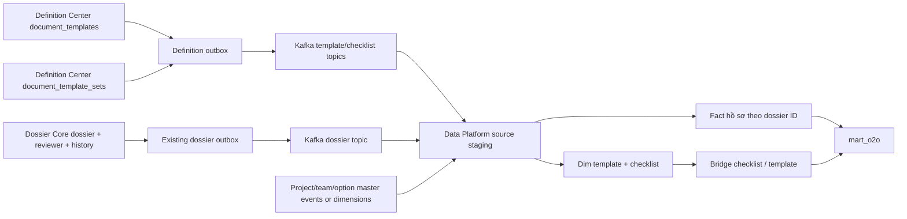

# BDSKD-9819 — Mapping dữ liệu NOXH sang Data Platform

> Bản thảo để thảo luận trước khi code. Nguồn: [Jira BDSKD-9819](https://vin3s.atlassian.net/browse/BDSKD-9819), file `[VHM Datamart]  O2O Datamart Mapping.xlsx`, sheet `Ticket NOXH 09_2026` (58 metric), đối chiếu code ngày 25/09/2026. Ticket chưa nêu cách đồng bộ, tần suất, SLA hoặc hợp đồng nhận dữ liệu.

## 1. Phạm vi và nguyên tắc

Sheet đích ghi schema `mart_o2o`, gồm 36 metric quản lý hồ sơ, 13 metric báo cáo, 4 metric loại giấy tờ và 5 metric checklist. `dossier-core` sở hữu hồ sơ; `v-definition-center-service` sở hữu `document_templates` và `document_template_sets`. Data Platform cần xác nhận mô hình bảng đích và cơ chế ingest trước khi triển khai. Không suy diễn rằng 58 cột cùng nằm trong một bảng: một hồ sơ có nhiều checklist và một checklist có nhiều giấy tờ.

Đề xuất grain nguồn: `dossier.id` cho fact hồ sơ; `document_templates.id` cho dimension giấy tờ; `document_template_sets.id` cho checklist; `(set_id, document_template_id)` cho danh sách giấy tờ trong checklist. Chỉ xuất dữ liệu NOXH (`product_code` tương ứng social housing), có `source=AGENT|MARKET`. Các giá trị `form_data` phải dùng schema version và giữ nguyên raw code bên cạnh nhãn hiển thị nếu Data Platform cần phân tích ổn định.

## 2. Mapping 58 metric

Ký hiệu: **S** = có nguồn trực tiếp; **D** = cần tính/lookup; **Q** = cần chốt nghiệp vụ hoặc chưa có nguồn chắc chắn. Các số là STT trong sheet.

| STT | Metric | Nguồn đề xuất | Mức |
| --- | --- | --- | --- |
| 1 | `NOXH_profile_id` | `dossier.id` UUID; cần chốt có muốn mã hiển thị `form_data.code` thay thế | Q |
| 2 | `NOXH_customer_name` | `dossier.form_data.applicant.fullName` | S |
| 3 | `NOXH_project_name` | `form_data.projectRegistration.projectId` → project master name; report hiện fallback ID | D |
| 4 | `NOXH_agency_name` | `form_data.projectRegistration.agencyId` → team/agency name; định nghĩa “bộ phận kinh doanh” cần chốt | Q |
| 5 | `NOXH_proposed_unit_info` | `form_data.projectRegistration.proposedUnitCode`; nếu cần thông tin căn chi tiết, lookup quỹ căn | Q |
| 6 | `NOXH_assigned_unit_code` | `form_data.projectRegistration.assignedUnitCode` | S |
| 7 | `NOXH_marital_status` | `form_data.applicant.maritalStatus`, lookup label nếu cần | D |
| 8 | `NOXH_housing_status` | `form_data.applicant.housingStatus`, lookup label nếu cần | D |
| 9 | `NOXH_customer_eligible_group` | `form_data.subjectGroup`, lookup label nhóm đối tượng | D |
| 10 | `NOXH_spouse_eligible_group` | **Chưa có nguồn đúng**. `form_data.spouse.subjectCoApplicant` là *quan hệ người đồng đăng ký* (`V/C`, `CON`, `KHAC`) theo JSON schema, không phải nhóm đối tượng chính sách. Report hiện đang lookup giá trị này bằng danh mục nhóm đối tượng, cần sửa riêng sau khi BA xác nhận field mới/nguồn upstream | Q |
| 11–12 | `NOXH_created_date`, `NOXH_updated_date` | `dossier.created_at`, `dossier.updated_at`; phân biệt `last_event_at` đang dùng ở report | Q |
| 13–14 | `NOXH_approver_sales_dept`, `NOXH_approver_procedure_dept` | `dossier_stage_reviewer` theo stage `SALES`/`PROCEDURE`; `reviewer_name` là người được phân công, chỉ coi là người duyệt khi có `reviewed_at` và decision phù hợp | Q |
| 15–16 | `NOXH_profile_status`, `NOXH_created_source` | `dossier.status` + `current_stage_code` cho nhãn chi tiết; `dossier.source` | D/S |
| 17 | `NOXH_profile_progress` | Chưa có trường phần trăm/tiến độ; cần quy tắc map từ pipeline state | Q |
| 18 | `NOXH_sale_owner` | `dossier.owner` (ID); tên hiển thị cần lookup Profile MW | D |
| 19 | `NOXH_reject_supplement_reason` | `revision_reason_code`/`latest_reject_reason_code`, `dossier_stage_reviewer.comment`; cần chốt ưu tiên lý do và có xuất free text không | Q |
| 20–23 | `NOXH_first_deadline_date`, `NOXH_first_overdue_days`, `NOXH_second_deadline_date`, `NOXH_second_overdue_days` | `RevisionSlaView` tính từ `entered_stage_at`, rule pipeline, loại ngày lễ và thời điểm `as_of`; không có 4 cột lưu sẵn | D |
| 24 | `NOXH_submitter_name` | `dossier_status_history.actor_id` tại submit hoặc `created_by` + lookup tên; cần chốt lần nộp đầu hay lần nộp lại | Q |
| 25 | `NOXH_submitted_date` | `dossier.submitted_at`; cần xác nhận semantics khi resubmit | S |
| 26 | `NOXH_supplement_request_date` | transition mới nhất sang `agentUpdateAtSales`/trạng thái bổ sung trong `dossier_status_history.at`; chốt chu kỳ nào | Q |
| 27 | `NOXH_assignment_date` | `dossier_stage_reviewer.assigned_at` stage `SALES`; `claimed_at` là sự kiện khác | S |
| 28–36 | `NOXH_customer_dob`, `NOXH_customer_gender`, `NOXH_customer_id_number`, `NOXH_id_issue_date`, `NOXH_id_issue_place`, `NOXH_customer_phone`, `NOXH_customer_email`, `NOXH_permanent_address`, `NOXH_contact_address` | lần lượt `form_data.applicant.dateOfBirth`, `gender`, `idNumber`, `idIssueDate`, `idIssuePlace`, `phone`, `email`, `permanentAddress`, `contactAddress` | S |
| 37–42 | `NOXH_report_proposed_unit_info`, `NOXH_report_assigned_unit_code`, `NOXH_report_agency_name`, `NOXH_report_customer_name`, `NOXH_report_created_date`, `NOXH_report_updated_date` | cùng nguồn 5, 6, 4, 2, 11, 12; dùng một phép biến đổi để tránh lệch giữa hồ sơ và báo cáo | D |
| 43 | `NOXH_report_sxd_approved_date` | `dossier_stage_reviewer.reviewed_at` stage `SXD` **chỉ khi** decision `APPROVED`, hoặc transition sang `approved`; report hiện lấy `reviewed_at` không kiểm decision | Q |
| 44 | `NOXH_report_arrival_date` | Chưa thấy trường “đến nộp” riêng; `submitted_at` chỉ là nộp điện tử, cần BA định nghĩa | Q |
| 45–48 | `NOXH_report_due_date_1`, `NOXH_report_overdue_days_1`, `NOXH_report_due_date_2`, `NOXH_report_overdue_days_2` | report hiện dùng cùng `RevisionSlaView` như 20–23; sheet gọi “đến hạn xử lý”, cần xác nhận có cùng nghĩa “bổ sung” không | Q |
| 49 | `NOXH_report_status` | cùng mapping 15; báo cáo hiện dùng label từ `status` + `current_stage_code` | D |
| 50–53 | `NOXH_doc_template_id`, `NOXH_doc_template_name`, `NOXH_doc_template_description`, `NOXH_doc_template_file` | Definition Center `document_templates.id`, `name`, `description`, `s3_file_paths` (mảng, cần chốt format file/link) | S/Q |
| 54 | `NOXH_checklist_id` | Definition Center `document_template_sets.id`; `code` là mã nghiệp vụ khác ID | S |
| 55–56 | `NOXH_checklist_group_name`, `NOXH_checklist_target_group` | `document_template_sets.properties.registrationGroupId`, `applicantTypeId`; lookup tên từ definition tương ứng và chốt chiều nào là “group” | Q |
| 57 | `NOXH_checklist_project_name` | `document_template_sets.project_id` → project master name | D |
| 58 | `NOXH_checklist_quantity` | `cardinality(document_template_sets.document_templates)`; chốt đếm tất cả hay chỉ `isRequired=true` | Q |

## 3. Luồng Kafka đã chốt về mặt phương thức

```text
dossier-core transaction: mutate dossier + INSERT outbox_event
     → OutboxRelay → Kafka → Data Platform consumer → fact NOXH
definition-center transaction: mutate document_templates/document_template_sets
     → transactional outbox cần bổ sung ở service này → Kafka
     → Data Platform consumer → dimensions + bridge → mart_o2o
```

Tham chiếu `IdentityVerificationHistoricalService` trong cobroker là **consumer/materializer**, không phải nơi phát Kafka. Cặp write-side tương ứng là `IdentityVerificationHistoryEnqueuer` → `HistoricalOutboxService` → relay: ghi event trong cùng transaction, publish sau commit, consumer dedup theo định danh event. `dossier-core` đã có `outbox_event` và `OutboxRelay`; nên mở rộng outbox này, không gọi Kafka trực tiếp trong transaction. `v-definition-center-service` có dữ liệu template/checklist nhưng chưa thấy outbox tương đương trong phần code đã khảo sát, cần thiết kế bổ sung ở repo đó.

Payload đề xuất theo cùng envelope: `objectId`, `timestamp`, `action` (`create`/`update`/`delete`), `performSource`, `performer`, `oldData`, `updateData`, `data`. `data` là **snapshot sau thay đổi** theo grain nguồn, gồm ID, schema version, timestamp và các field raw; `updateData` mô tả sự kiện/field đổi. Topic, version payload, event ID để dedup, key partition, retention và quyền consumer cần Data Platform xác nhận. Với topic hồ sơ, key là `dossier.id`; với template/checklist dùng ID của entity. Không chứa presigned URL hay toàn bộ `form_data` nếu chỉ 58 metric cần dùng vì form có dữ liệu và file nhạy cảm khác.

Backfill ban đầu cần phát snapshot `create` cho các row hiện hữu với quy trình chống trùng khi live event chạy song song; consumer upsert theo `(entity_type, objectId)` và version/updated timestamp để không ghi đè dữ liệu mới bằng backfill cũ. Xử lý inactive/delete cho template/checklist và xóa hồ sơ theo semantics nguồn. Với SLA động và `overdue_days`, event hồ sơ không phát mỗi ngày nếu không có mutation: Data Platform phải tính lại theo `as_of_at` hoặc có scheduled refresh event; cần chốt một cách. Tên dự án/đại lý và option label cũng có thể đổi mà hồ sơ không đổi, nên consumer cần join dimension hoặc nhận event master data. Không lấy báo cáo Excel hiện tại làm nguồn đồng bộ vì report có fallback ID, định dạng ngày thành chuỗi và cột tính tại thời điểm gọi API.

CCCD, điện thoại, email và địa chỉ là dữ liệu cá nhân. Chỉ đưa sang Data Platform nếu có quyền truy cập, mục đích sử dụng, chính sách lưu giữ và cơ chế bảo vệ được phê duyệt; tránh đưa presigned URL hoặc nội dung file mẫu vào mart. `s3_file_paths` là tham chiếu nội bộ, không phải link tải công khai.

## 4. Cần chốt trước khi code

1. Kafka đã được chọn: chốt tên topic, cluster, quyền publish/consume, partition key, envelope/payload version, event ID, retention, DLQ, retry, SLA và trách nhiệm backfill.
2. Thiết kế bảng đích và grain cho 4 nhóm metric; tên cột, kiểu dữ liệu, khóa, nullable, múi giờ (`Asia/Ho_Chi_Minh` để hiển thị hay UTC timestamp) và chính sách cập nhật lịch sử.
3. `profile_id` là UUID hay mã hồ sơ hiển thị? “Người duyệt” là reviewer được phân công hay người thực hiện decision? “Nộp” và “đến nộp” là cùng sự kiện không?
4. Hai bộ deadline có cùng SLA bổ sung không; lấy chu kỳ mới nhất hay giữ từng lần yêu cầu; `overdue_days` dừng tính sau khi đã bổ sung hay tiếp tục tăng?
5. Quy tắc resolve tên dự án, đại lý, Sale, option label; trường hợp lookup thất bại xuất null hay mã nguồn; quy tắc snapshot tên.
6. Nguồn thực sự cho nhóm đối tượng chính sách của vợ/chồng (metric 10). `subjectCoApplicant` hiện chỉ là quan hệ. Cách xuất `s3_file_paths` nhiều giá trị, số lượng giấy tờ checklist, tên nhóm/đối tượng; xác nhận danh sách template/checklist NOXH khi Definition Center dùng chung nhiều sản phẩm.
7. Phạm vi dữ liệu cá nhân (đặc biệt CCCD) và phân quyền Data Platform; có cần mask/hash hay bỏ cột ở từng consumer.

## 5. Điểm cần lưu ý khi triển khai

- `SocialHousingReportExportServiceImpl` đã có mapping tham khảo cho tên dự án/agency, label, reviewer và SLA; cần dùng lại rule nghiệp vụ nhưng không phụ thuộc vào chuỗi hiển thị Excel.
- Report hiện map `spouse.subjectCoApplicant` qua danh mục nhóm đối tượng; schema định nghĩa đây là quan hệ đồng đăng ký. Đây là mismatch cần BA xác nhận, không copy sang event datamart.
- `dossier_stage_reviewer` là một row trên dossier và stage. Nếu tái phân công nhiều lần, row hiện tại không tự thể hiện toàn bộ lịch sử; các metric cần “lần đầu” phải dùng audit/event riêng.
- `dossier_status_history` là append-only và có `at`, `actor_id`, `to_status`; nên xác định rõ quy tắc chọn occurrence trước khi truy vấn.
- Tài liệu này là hợp đồng mapping dự thảo. Chưa thay đổi schema, API, event hay job đồng bộ.

## 6. Thiết kế triển khai theo repo

### 6.1 Dossier producer — `vhm-dossier-core`

**Điểm chèn:** thêm `NoxhDatamartEventEnqueuer`/mapper riêng, gọi trong cùng transaction ở các đường thay đổi `DossierEntity`: create, update form, update owner, submit/resubmit/status transition, approve/reject/request revision, assign/reassign reviewer, allocate unit và delete draft. Cần rà soát toàn bộ nơi `dossierRepo.save`, `stageReviewerRepo.save` và thao tác trực tiếp form JSON để không sót một metric. Không tái sử dụng nguyên payload các event `dossier.created.v1`, `dossier.form_updated.v1`, `dossier.status_changed.v1`: chúng chỉ là delta, không có đủ 36 metric và reviewer/SLA. Mỗi lần thay đổi liên quan, enqueue snapshot sau mutation; delete phát tombstone từ snapshot trước khi hard delete.

**Outbox:** dùng `dossier_db.outbox_event` đang có. `OutboxRelay` hiện tạo topic từ `aggregate_type.aggregate_type.event_type.event_version`, không cho cấu hình topic tự do. Có hai phương án implementation, chọn một trước khi code: (A) quy ước topic Datamart theo công thức hiện tại, ví dụ `dossier_datamart.dossier_datamart.snapshot.v1`; (B) thêm `topic` nullable/configured vào outbox và relay, migration giữ nguyên hành vi các event cũ. Ưu tiên B nếu Data Platform cấp topic cố định. Bất kể phương án, Kafka key = dossier UUID. Không publish trực tiếp bằng `KafkaTemplate` từ business transaction.

**Snapshot payload:** project/agency ID, owner ID/team/region, schema version, source, code hiển thị, applicant 9 field cá nhân, subject group, spouse relation (đặt tên đúng nghĩa), proposed/assigned unit, status + stage, `created_at`/`updated_at`/`last_event_at`/`submitted_at`, reviewer của SALES/PROCEDURE/SXD (`reviewer_id`, `reviewer_name`, `decision`, `assigned_at`, `reviewed_at`, `comment`), reason codes, `entered_stage_at`. Chỉ xuất các trường đã được Data Platform chấp thuận; không gửi `metadata`, `documents`, S3 path hồ sơ hoặc nguyên `form_data`. Nếu dùng event snapshot, consumer có thể tái dựng cột trực tiếp mà không gọi API về core.

**Lịch sử/timing:** supplement request date lấy `dossier_status_history` tại occurrence đã chọn, nhưng `delete()` hiện xóa history của draft. Dùng event tombstone để xóa fact tương ứng. `assigned_at` trong `dossier_stage_reviewer` là lần phân công đang còn trên row; nếu cần lịch sử phân công phải phát event riêng hoặc thêm audit. `updated_at` do JPA auditing tạo lúc flush; mapper chạy trước flush có thể thấy giá trị cũ, nên dùng thời điểm mutation được xác định rõ (`occurredAt`) và/hoặc flush trước snapshot, sau đó kiểm thử tính nhất quán. `version` cũng có thể tăng khi flush: consumer nên dùng sequence outbox/event revision rõ ràng thay vì ngầm tin version trong entity trước flush.

### 6.2 Template/checklist producer — `v-definition-center-service`

**Điểm chèn:** `DocumentTemplateServiceImpl.create/update` và `DocumentTemplateSetServiceImpl.create/update` sau `save`, trước khi transaction kết thúc. Update status `INACTIVE` phát update snapshot với status, không mặc định là delete. Hai bảng `document_templates` và `document_template_sets` có thể chứa nhiều sản phẩm; chỉ lọc NOXH khi có rule project/org/tenant được BA chốt. Không suy đoán tất cả template là NOXH.

**Outbox cần thêm:** migration bảng outbox (`event_id` UUID, `aggregate_type`, `aggregate_id`, `topic`, `payload`, `created_at`, `published_at`, retry metadata), repository/enqueuer và relay theo mẫu cobroker. Definition Center đã có `KafkaTemplate` nhưng chưa có historical transactional outbox cho hai entity này trong code đã xem. Dùng transaction hiện có của create/update để ghi outbox atomic; relay retry và chỉ mark published khi Kafka ack. Nên có metric pending/failed và DLQ/alert theo contract vận hành.

**Payload:** template gồm `id`, `code`, `name`, `description`, `s3_file_paths`, `tenant_id`, `org_id`, `status`, audit timestamps; checklist gồm `id`, `code`, `project_id`, `properties.applicantTypeId`, `properties.registrationGroupId`, `document_templates[]` (`documentTemplateId`, `name`, `isRequired`, `displayOrder`) và audit timestamps. Consumer upsert bridge checklist-template bằng cách thay toàn bộ members của **một checklist** trên event snapshot mới; không append từng member vì update có thể xóa giấy tờ khỏi set.

### 6.3 Contract event đề xuất

Ví dụ minh họa, chưa phải topic/contract đã được Data Platform phê duyệt:

```json
{
  "eventId": "<producer + outbox ID ổn định>",
  "eventVersion": 1,
  "entityType": "NOXH_DOSSIER",
  "objectId": "<dossier UUID>",
  "action": "update",
  "timestamp": 0,
  "performSource": "vhm-dossier-core",
  "performer": "<actor ID hoặc SYSTEM>",
  "updateData": { "event": "SNAPSHOT", "reason": "ASSIGN_REVIEWER" },
  "data": {
    "productCode": "SOCIAL_HOUSING",
    "schemaVersion": "v1",
    "source": "AGENT",
    "status": "UNDER_REVIEW",
    "currentStageCode": "salesUnderReview",
    "applicant": { "fullName": "<giá trị được cho phép>" },
    "projectRegistration": { "projectId": "<ID>", "proposedUnitCode": "<mã căn>" }
  }
}
```

`oldData` chỉ cần nếu Data Platform thực sự dùng diff; snapshot `data` đầy đủ và tombstone `data=null` giảm độ lớn payload, tránh nhân đôi dữ liệu cá nhân. `dossier_db.outbox_event.id` hiện là BIGINT, nên có thể dùng `eventId = vhm-dossier-core:<outbox-id>`; Definition Center dùng cùng quy tắc theo ID outbox của nó. Nếu phải giống nguyên shape `HistoricalEvent` của cobroker, đặt `eventId` ở header Kafka hoặc trong `updateData` (vì DTO tham chiếu không có field này). Consumer dedup theo `eventId`, không theo `(objectId,timestamp)` vì nhiều thay đổi có thể cùng millisecond. Topic riêng cho dossier, template và checklist; không trộn grain. Contract `data` nên được lưu dưới schema/version có kiểm soát và kiểm thử tương thích.

### 6.4 Consumer và backfill — phía Data Platform

Consumer validate version, chỉ nhận `SOCIAL_HOUSING` cho dossier, dedup event ID, upsert nguồn theo `(entityType, objectId)` và thứ tự revision/sequence. Với delete, ghi tombstone/tình trạng đã xóa để replay hoặc backfill cũ không hồi sinh row. Stage raw giữ code và timestamp; transform sang 58 metric ở tầng mart. Lookup tên/label từ master dimension có quản lý thời điểm hiệu lực. Event payload không nên chứa tên lookup từ API sống tại thời điểm publish vì phụ thuộc service khác và tên có thể đổi sau đó.

Backfill chạy keyset pagination theo ID từ các bảng nguồn, phát snapshot cùng format event live, ghi `snapshotAt` và `sourceUpdatedAt`. Consumer phải ưu tiên bản có source revision mới hơn; không dựa vào thời điểm Kafka nhận. Chạy backfill trong khi live stream hoạt động, đối soát count theo product/status và checksum/cột trọng yếu, sau đó replay thử một khoảng event. Dossier đã bị hard delete trước backfill không thể phục hồi từ bảng hiện tại; chỉ có thể lấy từ event/audit còn lưu nếu có.

### 6.5 Flow nghiệp vụ và vận hành





**Failure:** business transaction rollback thì không có event; Kafka lỗi thì outbox giữ pending để retry. Sau Kafka ACK nhưng trước mark published có thể gửi lại, vì vậy consumer dedup bắt buộc. Poison payload vào DLQ kèm event ID và lý do, có khả năng replay. `outbox.relay.publish-enabled=false` hiện vẫn mark row là published; không dùng cờ này như cơ chế tạm dừng Datamart trên môi trường cần giữ event — cần sửa semantics hoặc dùng cờ riêng chỉ ngăn enqueue trước rollout.

### 6.6 Trình tự làm khi bắt đầu code

1. Chốt các quyết định ở mục 4 và lưu JSON schema/topic contract mẫu có version trong repo liên quan. Chốt đặc biệt metric 10, grain của report fields, PII và cách tính SLA động.
2. Viết mapper thuần cho dossier snapshot và test bằng fixture `AGENT`, `MARKET`, hồ sơ thiếu field, reviewer đổi người, revision cycle, approve SXD, delete draft. Đối chiếu từng cột với sheet; metric chưa có nguồn phải là `null`/không publish, tuyệt đối không gán sai nghĩa.
3. Ghi event vào outbox ở tất cả write path của dossier, test transaction rollback, event count và snapshot sau mutation. Sửa routing topic theo contract đã chốt; đảm bảo event cũ không đổi topic/payload.
4. Thêm outbox/migration/producer/relay cho Definition Center và test create/update/status `INACTIVE`, thay membership checklist, rollback, retry.
5. Implement consumer/mart và backfill, chạy reconciliation theo cả 58 metric. Kiểm thử at-least-once, replay, out-of-order, backfill chồng live, thay master name và ngày trôi qua làm thay `overdue_days`.
6. Triển khai consumer và quyền topic trước producer; bật producer sau khi giám sát pending outbox/DLQ, đối soát dữ liệu, rồi chạy backfill và xác nhận kết quả với BA/Data Platform.
