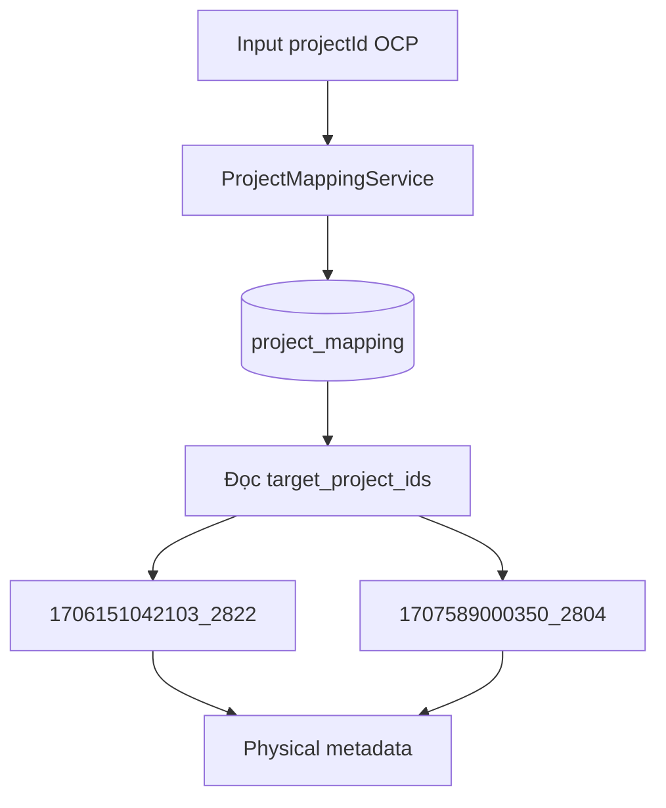
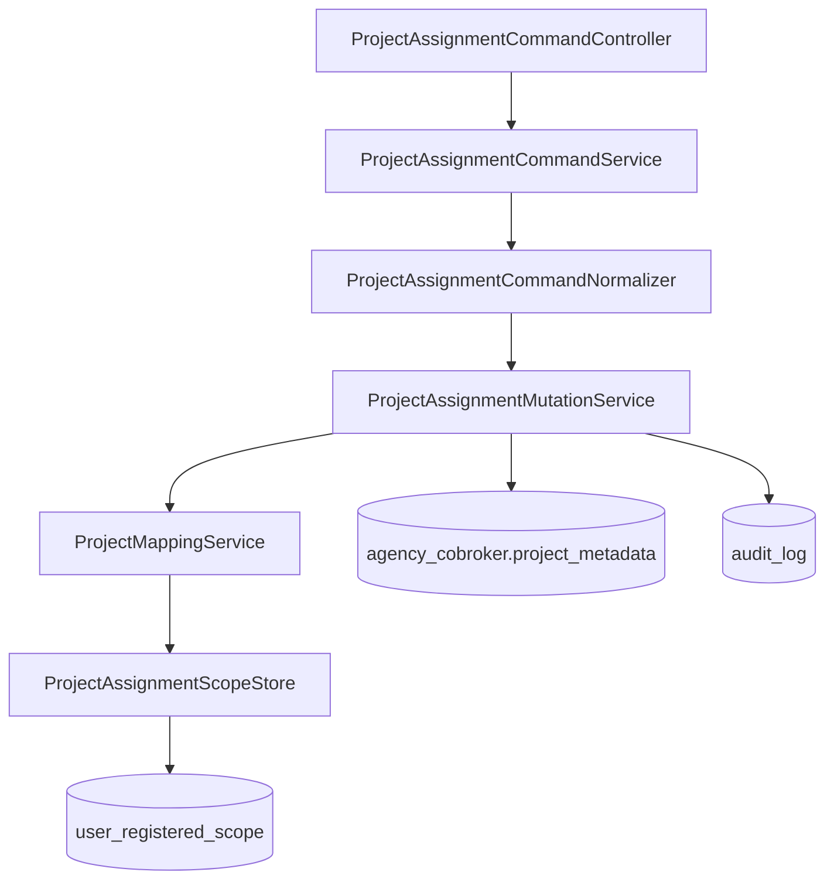
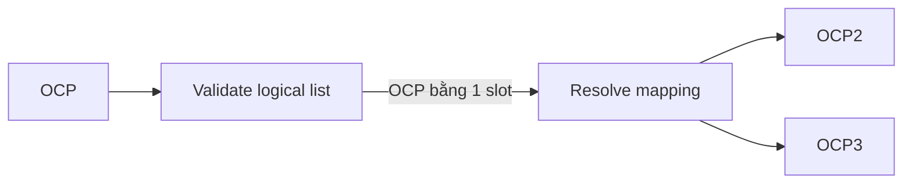
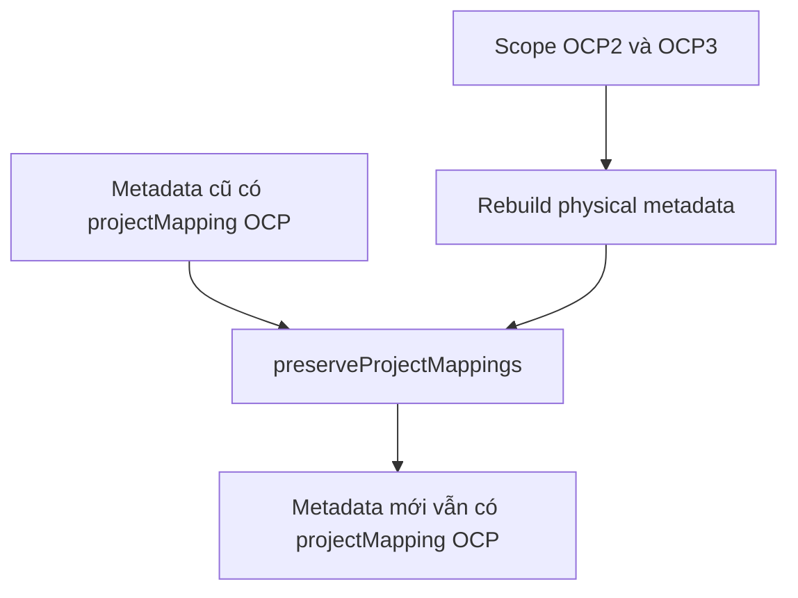
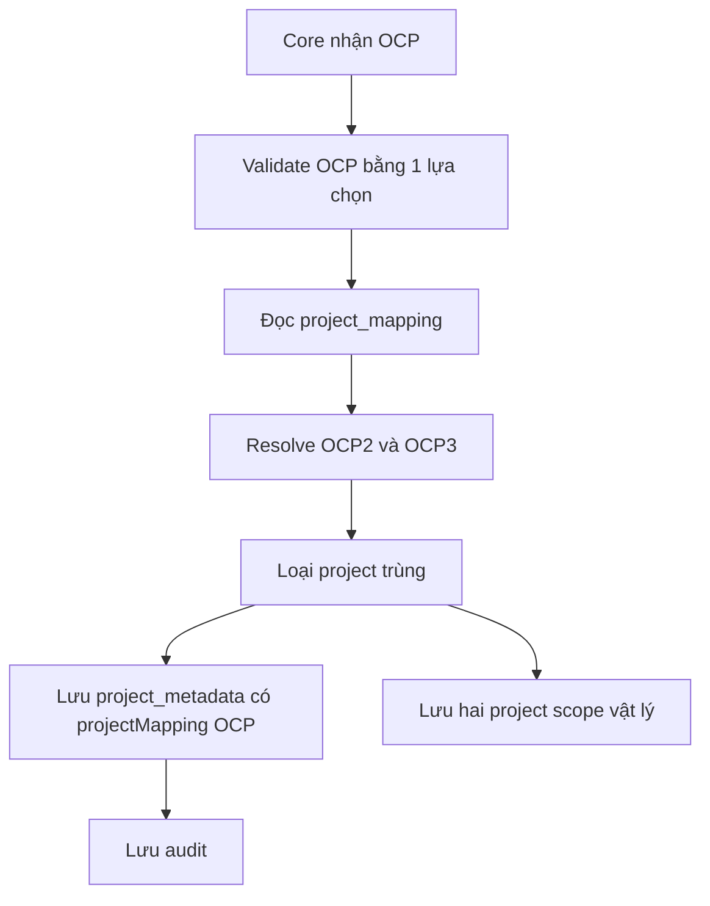

# BDSKD-6590 - Các thay đổi trong vhm-cobroker-core

## 1. Phạm vi

Tài liệu này chỉ mô tả code đã sửa trong repository `vhm-cobroker-core`.

Mục tiêu:

```text
Input logic: OCP
Output vật lý: OCP2 + OCP3
```

OCP1 là dự án độc lập, không thuộc mapping.

## 2. Database

### File

```text
src/main/resources/db.changelog/ddl/changelog-0051-project-mapping.sql
```

### Bảng mới

```sql
CREATE TABLE cobroker_db.project_mapping (
    code VARCHAR(64) PRIMARY KEY,
    name VARCHAR(255) NOT NULL UNIQUE,
    target_project_ids VARCHAR[] NOT NULL,
    created_at TIMESTAMPTZ NOT NULL DEFAULT CURRENT_TIMESTAMP,
    updated_at TIMESTAMPTZ NOT NULL DEFAULT CURRENT_TIMESTAMP,
    CONSTRAINT ck_project_mapping_targets_not_empty
        CHECK (cardinality(target_project_ids) > 0)
);
```

### Dữ liệu seed staging

```sql
INSERT INTO cobroker_db.project_mapping (code, name, target_project_ids)
VALUES (
    'OCP',
    'Vinhomes Ocean Park 2+3',
    ARRAY[
        '1706151042103_2822',
        '1707589000350_2804'
    ]::VARCHAR[]
);
```

| Dự án | ID staging | Xử lý |
|---|---|---|
| OCP1 | `1706151042103_1784` | Không mapping |
| OCP2 | `1706151042103_2822` | Target của OCP |
| OCP3 | `1707589000350_2804` | Target của OCP |

## 3. Các class mới

### `ProjectMappingEntity`

```text
src/main/java/vn/vinhomes/cobroker/core/entity/projectassignment/ProjectMappingEntity.java
```

Map với bảng `project_mapping`:

```java
private String code;
private String name;
private List<String> targetProjectIds;
private Instant createdAt;
private Instant updatedAt;
```

### `ProjectMappingRepository`

```text
src/main/java/vn/vinhomes/cobroker/core/repository/ProjectMappingRepository.java
```

Dùng JPA để đọc cấu hình mapping từ PostgreSQL.

### `ProjectMappingService`

```text
src/main/java/vn/vinhomes/cobroker/core/service/projectassignment/ProjectMappingService.java
```

Khai báo các nghiệp vụ:

```java
findAll();
findByCode(code);
resolveMetadata(selections);
logicalSelections(metadata);
preserveProjectMappings(physical, previousMetadata);
```

### `ProjectMappingServiceImpl`

```text
src/main/java/vn/vinhomes/cobroker/core/service/projectassignment/ProjectMappingServiceImpl.java
```

Đây là nơi xử lý mapping chính.

## 4. Luồng resolve OCP



Input:

```json
{
  "projectId": "OCP",
  "type": "ASSIGNED"
}
```

Output của `resolveMetadata()`:

```json
[
  {
    "projectId": "1706151042103_2822",
    "type": "ASSIGNED",
    "projectMapping": "OCP"
  },
  {
    "projectId": "1707589000350_2804",
    "type": "ASSIGNED",
    "projectMapping": "OCP"
  }
]
```

Service hỗ trợ tìm mapping bằng:

```text
code: OCP
name: Vinhomes Ocean Park 2+3
```

Giá trị được trim và so sánh không phân biệt chữ hoa, chữ thường.

## 5. Metadata đã sửa

### File

```text
src/main/java/vn/vinhomes/cobroker/core/model/jsonb/AgencyCobrokerProjectJsonb.java
```

Field mới:

```java
private String projectMapping;
```

Ý nghĩa:

```text
projectMapping = OCP
```

cho biết OCP2 và OCP3 được sinh ra từ một lựa chọn logic OCP.

Dự án được chọn riêng không có field này:

```json
{
  "projectId": "1706151042103_1784",
  "type": "ASSIGNED"
}
```

## 6. API batch trong core

### Endpoint

```http
PUT /internal/v1/agencies/{agencyId}/project-assignments/batch
```

### Controller

```text
src/main/java/vn/vinhomes/cobroker/core/controller/ProjectAssignmentCommandController.java
```

### DTO

```text
src/main/java/vn/vinhomes/cobroker/core/dto/projectassignment/ProjectAssignmentCommandDtos.java
```

```java
public record BatchRequest(
    List<String> usernames,
    List<String> assignedProjects,
    List<String> additionalProjects
) {}
```

Ví dụ request:

```json
{
  "usernames": ["sale01"],
  "assignedProjects": ["OCP"],
  "additionalProjects": []
}
```

### Luồng code



## 7. `ProjectAssignmentCommandService`

### File

```text
src/main/java/vn/vinhomes/cobroker/core/service/projectassignment/ProjectAssignmentCommandService.java
```

Trách nhiệm:

1. Normalize username.
2. Normalize danh sách project.
3. Kiểm tra quyền thao tác với đại lý.
4. Kiểm tra thời gian/policy phân dự án.
5. Tìm Sale theo username.
6. Gọi `ProjectAssignmentMutationService.replace()` cho từng Sale.

Batch chạy trong một transaction. Một Sale lỗi thì toàn bộ batch rollback.

## 8. `ProjectAssignmentMutationService`

### File

```text
src/main/java/vn/vinhomes/cobroker/core/service/projectassignment/ProjectAssignmentMutationService.java
```

Thay đổi đã thực hiện:

```java
List<AgencyCobrokerProjectJsonb> afterMetadata =
        projectMappingService.resolveMetadata(toMetadata(desired));
```

Thứ tự xử lý:

```text
1. Validate danh sách logic
2. Resolve OCP thành OCP2 và OCP3
3. Chuyển kết quả thành danh sách project vật lý
4. Replace scope
5. Lưu project_metadata
6. Lưu audit log
```

## 9. Xử lý limit

Code mapping không thay đổi giá trị limit hiện có.

Limit nằm tại:

```text
src/main/java/vn/vinhomes/cobroker/core/config/ProjectAssignmentProperties.java
```

```java
private int maxAssignedProjectsPerUser = 20;
private int maxAdditionalProjectsPerUser = 1;
```

Code kiểm tra nằm tại:

```text
src/main/java/vn/vinhomes/cobroker/core/service/projectassignment/ProjectAssignmentCommandNormalizer.java
```

Điểm thay đổi liên quan BDSKD-6590 là thứ tự xử lý:



Ví dụ hợp lệ:

```json
{
  "assignedProjects": [],
  "additionalProjects": ["OCP"]
}
```

```text
Số lựa chọn additional = 1
Limit additional = 1
Kết quả = hợp lệ
```

Sau khi validate mới resolve thành hai project vật lý. Không kiểm tra lại limit trên OCP2/OCP3 vì chúng cùng đại diện cho một lựa chọn OCP.

Ví dụ không hợp lệ:

```json
{
  "assignedProjects": [],
  "additionalProjects": ["OCP", "PROJECT-X"]
}
```

```text
Số lựa chọn additional = 2
Limit additional = 1
Kết quả = PROJECT_ASSIGNMENT_PROJECT_LIMIT_EXCEEDED
```

Lưu ý: hai giá trị limit hiện dùng default trong Java; thay đổi BDSKD-6590 chưa thêm property tương ứng vào `application.properties` và chưa thêm API trả limit cho FE.

## 10. Luồng tạo hoặc cập nhật dữ liệu Sale

### `AgencyProfileServiceImpl`

```text
src/main/java/vn/vinhomes/cobroker/core/service/impl/AgencyProfileServiceImpl.java
```

Hai hàm đã gọi mapping:

```java
buildProjectMetadata(data);
projectIdsByType(data, type);
```

`buildProjectMetadata()` resolve dữ liệu trước khi lưu `agency_cobroker.project_metadata`.

`projectIdsByType()` resolve dữ liệu trước khi gửi `assignedProjects` và `additionalProjects` sang Profile MW.

### `ProjectScopeLifecycleService`

```text
src/main/java/vn/vinhomes/cobroker/core/service/projectassignment/ProjectScopeLifecycleService.java
```

Thứ tự xử lý:

```text
requested metadata
  -> logicalSelections
  -> validate limit trên logical list
  -> resolveMetadata
  -> lưu physical scope
  -> lưu physical metadata
```

## 11. Khôi phục lựa chọn logic

`logicalSelections()` chuyển:

```text
OCP2 projectMapping=OCP
OCP3 projectMapping=OCP
```

thành:

```text
OCP
```

Mục đích:

- Tính lại đúng một slot.
- Không hiểu nhầm OCP2 và OCP3 là hai lựa chọn riêng.
- Giữ được lựa chọn logic khi cập nhật lại Sale.

## 12. Giữ mapping khi rebuild metadata

### Các file

```text
src/main/java/vn/vinhomes/cobroker/core/service/projectassignment/ProjectAssignmentMetadataService.java
src/main/java/vn/vinhomes/cobroker/core/service/projectassignment/CobrokerProjectMetadataSyncer.java
```

`user_registered_scope` chỉ lưu project ID vật lý, không lưu `projectMapping`.

Khi rebuild metadata từ scope, code gọi:

```java
projectMappingService.preserveProjectMappings(
    physicalMetadata,
    previousMetadata
);
```

Luồng:



## 13. Dữ liệu cuối cùng được lưu

### `agency_cobroker.project_metadata`

```json
[
  {
    "projectId": "1706151042103_2822",
    "type": "ASSIGNED",
    "projectMapping": "OCP"
  },
  {
    "projectId": "1707589000350_2804",
    "type": "ASSIGNED",
    "projectMapping": "OCP"
  }
]
```

### `user_registered_scope`

```text
scope_type = PROJECT
scope_id = 1706151042103_2822

scope_type = PROJECT
scope_id = 1707589000350_2804
```

Không lưu `scope_id = OCP`.

## 14. Các file đã sửa

| File | Nội dung thay đổi |
|---|---|
| `changelog-0051-project-mapping.sql` | Tạo bảng và seed mapping OCP |
| `ProjectMappingEntity.java` | Entity cho bảng mapping |
| `ProjectMappingRepository.java` | Repository đọc mapping |
| `ProjectMappingService.java` | Interface nghiệp vụ mapping |
| `ProjectMappingServiceImpl.java` | Resolve, deduplicate, logical selection và preserve marker |
| `AgencyCobrokerProjectJsonb.java` | Thêm `projectMapping` |
| `AgencyProfileServiceImpl.java` | Resolve khi tạo/lưu Sale và đồng bộ Profile MW |
| `ProjectAssignmentMutationService.java` | Resolve trước khi replace scope |
| `ProjectScopeLifecycleService.java` | Validate logical list và lưu physical list |
| `ProjectAssignmentMetadataService.java` | Giữ mapping khi rebuild metadata |
| `CobrokerProjectMetadataSyncer.java` | Giữ mapping khi sync metadata |
| Các unit/integration test | Kiểm tra resolve, deduplicate, schema và seed |

## 15. Những gì không thay đổi

- Không thêm OCP1 vào mapping.
- Không hard-code OCP2/OCP3 trong Java.
- Không thay schema `user_registered_scope`.
- Không thêm cột riêng vào `agency_cobroker`.
- Không thay giá trị limit `20/1`.
- Không thêm API config trả limit cho FE.
- Không backfill dữ liệu OCP2/OCP3 cũ.

## 16. Tóm tắt


