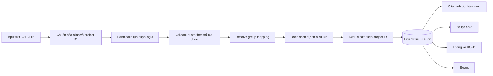
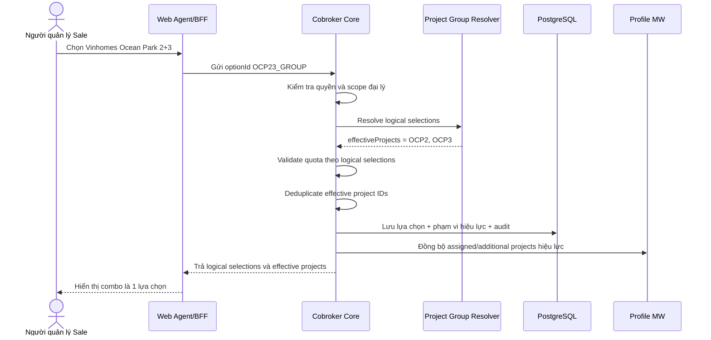

# BDSKD-6590 — Mapping nhóm dự án OCP 2+3 cho Sale đại lý

> Trạng thái tài liệu: Dev-ready draft — cần BA xác nhận các điểm tại mục 13  
> Jira: [BDSKD-6590](https://vin3s.atlassian.net/browse/BDSKD-6590)  
> SRS liên quan: [FRS — Quản lý định danh và kiểm soát tài khoản Sale đại lý](https://vin3s.atlassian.net/wiki/spaces/BMAS/pages/2874024939/FRS+-+Qu+n+l+nh+danh+v+ki+m+so+t+t+i+kho+n+Sale+i+l)  
> Tài liệu UC-05 đã chuẩn hóa: [uc05-sale-account-management-spec.md](./uc05-sale-account-management-spec.md)

## 1. Mục tiêu

Cho phép người dùng chọn một option logic **“Vinhomes Ocean Park 2+3”** khi thiết lập dự án cho Sale. Hệ thống phải:

- Tính option này là **01 lượt/slot đăng ký**.
- Ghi nhận Sale có phạm vi tham gia hiệu lực tại cả **OCP2** và **OCP3**.
- Không tạo trùng OCP2 hoặc OCP3 nếu Sale đã có một trong hai dự án.
- Áp dụng thống nhất cho nhập trên giao diện, import file, cấu hình đợt bán hàng, bộ lọc, báo cáo và xuất dữ liệu.

## 2. Quan hệ với SRS quản lý Sale đại lý

| Use case SRS | Quan hệ với BDSKD-6590 | Yêu cầu bổ sung |
|---|---|---|
| UC-05 — CRUD/quản lý Sale | Tạo, cập nhật và import Sale có dữ liệu dự án | Input phải nhận option OCP 2+3 và áp dụng cùng một rule mapping |
| UC-10 — Thiết lập dự án đồng loạt | Phạm vi chính của ticket | Tính quota theo lựa chọn logic, resolve phạm vi theo dự án vật lý |
| UC-11 — Thống kê đại lý đăng ký quỹ theo dự án | Consumer downstream | Sale chọn combo phải xuất hiện ở thống kê OCP2 và OCP3 |
| Cấu hình đợt bán hàng | Consumer downstream | Sale chọn combo đủ điều kiện cho đợt OCP2 lẫn OCP3 |
| Export | Consumer downstream | Xuất OCP2 và OCP3, không tạo dự án trùng |

Ticket này không thay đổi thông tin định danh, tài khoản, trạng thái làm việc hoặc phân quyền quản lý Sale trong UC-05.

## 3. Thuật ngữ

| Thuật ngữ | Định nghĩa |
|---|---|
| Lựa chọn logic | Option người dùng chọn và được dùng để tính quota. Ví dụ `OCP23_GROUP` |
| Dự án hiệu lực | Dự án thực tế dùng cho phân quyền tham gia, đợt bán hàng, lọc và báo cáo |
| Nhóm OCP 2+3 | Một lựa chọn logic được resolve thành hai dự án hiệu lực OCP2 và OCP3 |
| Quota/slot | Số lượng lựa chọn dự án được phép theo SRS/catalog |
| Deduplicate | Loại bỏ dự án vật lý trùng nhau sau khi resolve mapping |

## 4. Quy tắc nghiệp vụ

| ID | Quy tắc |
|---|---|
| BR-01 | `Vinhomes Ocean Park 2+3` là một lựa chọn logic và chiếm 01 slot. |
| BR-02 | Lựa chọn OCP 2+3 được resolve thành hai dự án hiệu lực OCP2 và OCP3. |
| BR-03 | Danh sách dự án hiệu lực không được có project ID trùng. |
| BR-04 | Sale chọn riêng OCP2 rồi chọn OCP 2+3 vẫn hợp lệ; kết quả hiệu lực là OCP2 và OCP3. |
| BR-05 | Sale chọn riêng OCP3 rồi chọn OCP 2+3 vẫn hợp lệ; kết quả hiệu lực là OCP2 và OCP3. |
| BR-06 | Quota được tính trên danh sách lựa chọn logic, không tính trên danh sách dự án hiệu lực đã mở rộng. |
| BR-07 | Cùng một rule mapping phải dùng cho UI, API đơn, API batch và import file. |
| BR-08 | Query theo OCP2 hoặc OCP3 đều phải tìm thấy Sale đã chọn OCP 2+3. |
| BR-09 | Sale chọn OCP 2+3 phải được xác định đủ điều kiện tham gia đợt OCP2 và đợt OCP3. |
| BR-10 | Export phải thể hiện OCP2 và OCP3 nhưng không xuất trùng cùng một project ID. |
| BR-11 | Mapping phải thực hiện tại backend hoặc domain dùng chung; không chỉ triển khai ở FE. |
| BR-12 | Thay đổi phải giữ được audit: lựa chọn trước, lựa chọn sau và phạm vi hiệu lực sau resolve. |

## 5. Mô hình xử lý



### Ví dụ

```text
Lựa chọn logic:   [OCP23_GROUP, PROJECT_X]
Quota sử dụng:    2

Resolve:
OCP23_GROUP       -> [OCP2, OCP3]
PROJECT_X         -> [PROJECT_X]

Dự án hiệu lực:   [OCP2, OCP3, PROJECT_X]
```

## 6. Bảng quyết định

Giả định quota của loại dự án đang thao tác là 2 lựa chọn, phù hợp mô tả ticket “combo + thêm 01 dự án khác”.

| Dữ liệu hiện tại | Lựa chọn mới | Lựa chọn logic sau cập nhật | Dự án hiệu lực | Quota dùng | Kết quả |
|---|---|---|---|---:|---|
| Rỗng | OCP 2+3 | OCP 2+3 | OCP2, OCP3 | 1 | Thành công; còn 1 slot |
| Rỗng | OCP2 | OCP2 | OCP2 | 1 | Thành công; còn 1 slot |
| OCP2 | OCP 2+3 | OCP2, OCP 2+3 | OCP2, OCP3 | 2 | Thành công; hết slot |
| OCP3 | OCP 2+3 | OCP3, OCP 2+3 | OCP2, OCP3 | 2 | Thành công; hết slot |
| OCP 2+3 | Project X | OCP 2+3, Project X | OCP2, OCP3, Project X | 2 | Thành công; hết slot |
| Project X, Project Y | OCP 2+3 | Không đổi | Không đổi | 3 | Từ chối vượt quota |
| OCP2 | OCP2 | OCP2 | OCP2 | 1 | Idempotent; không tạo trùng |
| OCP 2+3 | OCP 2+3 | OCP 2+3 | OCP2, OCP3 | 1 | Idempotent; không tạo trùng |

## 7. Luồng cập nhật từ UI/API



## 8. Contract đề xuất

### 8.1. Catalog dự án

Catalog nên trả rõ option nhóm thay vì bắt FE suy ra từ tên hiển thị:

```json
{
  "id": "OCP23_GROUP",
  "name": "Vinhomes Ocean Park 2+3",
  "type": "PROJECT_GROUP",
  "members": ["OCP2", "OCP3"],
  "quotaCost": 1,
  "active": true
}
```

Không dùng chuỗi tên `Vinhomes Ocean Park 2+3` làm khóa mapping vì tên có thể thay đổi và file import dễ phát sinh sai khác dấu cách/hoa thường.

### 8.2. Command cập nhật dự án

Khuyến nghị request truyền lựa chọn logic:

```json
{
  "assignedSelections": [],
  "additionalSelections": ["OCP23_GROUP", "PROJECT_X"]
}
```

Response trả cả hai lớp để FE và consumer không phải tự suy luận:

```json
{
  "assignedSelections": [],
  "additionalSelections": ["OCP23_GROUP", "PROJECT_X"],
  "assignedProjects": [],
  "additionalProjects": ["OCP2", "OCP3", "PROJECT_X"],
  "quota": {
    "additionalUsed": 2,
    "additionalMax": 2
  }
}
```

### 8.3. Import file

File có thể nhận một trong các giá trị được catalog công bố:

- Mã chuẩn: `OCP23_GROUP` — khuyến nghị.
- Tên hiển thị: `Vinhomes Ocean Park 2+3` — chỉ dùng nếu template nghiệp vụ bắt buộc.

Backend phải chuẩn hóa về `OCP23_GROUP` trước khi validate quota và resolve OCP2/OCP3. Giá trị không nhận diện được phải trả lỗi theo dòng, không được silently ignore.

## 9. Lưu trữ dữ liệu

### 9.1. Hiện trạng code

`AgencyCobrokerProjectJsonb` hiện chỉ lưu:

```json
{
  "projectId": "OCP2",
  "type": "ADDITIONAL_REGISTERED"
}
```

Nếu chỉ lưu OCP2 và OCP3, hệ thống không biết chúng đến từ combo hay hai lựa chọn riêng; do đó không thể tính lại quota chính xác khi chỉnh sửa.

### 9.2. Phương án khuyến nghị

Lưu lựa chọn logic cùng nguồn mapping, đồng thời duy trì projection dự án hiệu lực phục vụ query:

```json
{
  "selectionId": "OCP23_GROUP",
  "type": "ADDITIONAL_REGISTERED",
  "effectiveProjectIds": ["OCP2", "OCP3"],
  "mappingVersion": 1
}
```

Có thể triển khai bằng một trong hai cách:

1. Mở rộng `project_metadata` để lưu selection/group và rebuild projection scope.
2. Tạo bảng selection riêng, giữ `project_metadata`/registered scope là projection vật lý.

Ưu tiên cách 2 nếu mapping sẽ mở rộng cho nhiều nhóm dự án hoặc cần version/audit độc lập. Không khuyến nghị hard-code OCP23 rải rác trong validator, report và exporter.

## 10. Tác động code trong repository hiện tại

| Thành phần | Hiện trạng | Thay đổi cần thiết |
|---|---|---|
| Project catalog | Trả project vật lý | Bổ sung group option/mapping hoặc adapter đọc cấu hình |
| `ProjectAssignmentProjectCapValidator` | Đếm distinct project ID đầu vào | Đếm `quotaCost` của logical selection |
| `ProjectAssignmentCommandNormalizer` | Trim, distinct, chống overlap trên project ID | Chuẩn hóa selection trước; chống trùng/overlap sau resolve theo rule đã chốt |
| `ProjectAssignmentMutationService` | Lưu flat OCP2/OCP3 vào `project_metadata` | Lưu được nguồn selection hoặc tham chiếu selection store |
| `ProjectAssignmentScopeStore` | Replace scope theo project vật lý | Nhận effective projects sau resolve |
| `ProjectAssignmentLists` | Projection distinct project ID | Tiếp tục dùng cho effective projects; bổ sung projection logical selections |
| Luồng tạo/cập nhật Sale UC-05 | Nhận `projects` dạng flat | Dùng chung resolver với project-assignment command |
| Import Sale | Chưa thấy endpoint trong module agency | Khi xây dựng phải gọi cùng normalizer/resolver, không tự mapping riêng |
| Sale report/UC-11 | Query theo project scope | Xác nhận query dùng effective OCP2/OCP3 |
| Export | Chưa có rule combo trong core | Xuất distinct effective project IDs |
| Audit | Có audit project assignment | Bổ sung before/after của logical selections và effective projects |

## 11. Acceptance Criteria viết lại

### AC-01 — Chọn combo lần đầu

**Given** Sale chưa có dự án trong nhóm tương ứng  
**When** người dùng chọn `Vinhomes Ocean Park 2+3` và lưu  
**Then** hệ thống lưu một lựa chọn logic, tính một slot và tạo phạm vi hiệu lực cho OCP2 và OCP3.

### AC-02 — Import combo

**Given** dòng import có giá trị `OCP23_GROUP` hoặc alias hợp lệ  
**When** hệ thống xử lý dòng  
**Then** kết quả giống hoàn toàn luồng nhập trên UI: một slot, hai dự án hiệu lực.

### AC-03 — Combo cộng một dự án khác

**Given** quota tối đa là hai lựa chọn và Sale đã chọn OCP 2+3  
**When** chọn thêm Project X  
**Then** hệ thống cho phép, quota đã dùng là hai và phạm vi hiệu lực gồm OCP2, OCP3, Project X.

### AC-04 — Đã có OCP2 rồi chọn combo

**Given** Sale đã chọn riêng OCP2  
**When** chọn thêm OCP 2+3  
**Then** hệ thống cho phép, tính hai lựa chọn, dự án hiệu lực là OCP2 và OCP3, OCP2 chỉ xuất hiện một lần.

### AC-05 — Đã có OCP3 rồi chọn combo

**Given** Sale đã chọn riêng OCP3  
**When** chọn thêm OCP 2+3  
**Then** hệ thống cho phép, tính hai lựa chọn, dự án hiệu lực là OCP2 và OCP3, OCP3 chỉ xuất hiện một lần.

### AC-06 — Chặn vượt quota

**Given** Sale đã sử dụng hết quota lựa chọn  
**When** người dùng chọn thêm OCP 2+3  
**Then** hệ thống từ chối trước khi thay đổi DB/Profile MW và trả lỗi vượt giới hạn dự án.

### AC-07 — Tham gia đợt OCP2

**Given** Sale có lựa chọn OCP 2+3 và đang ACTIVE  
**When** hệ thống tìm Sale đủ điều kiện cho đợt OCP2  
**Then** Sale được trả về đúng một lần.

### AC-08 — Tham gia đợt OCP3

**Given** Sale có lựa chọn OCP 2+3 và đang ACTIVE  
**When** hệ thống tìm Sale đủ điều kiện cho đợt OCP3  
**Then** Sale được trả về đúng một lần.

### AC-09 — Bộ lọc và thống kê

**Given** Sale có lựa chọn OCP 2+3  
**When** lọc hoặc thống kê theo OCP2 hay OCP3  
**Then** Sale được tính trong từng dự án tương ứng, không nhân đôi trong cùng một dự án.

### AC-10 — Export

**Given** Sale có OCP2 riêng và OCP 2+3  
**When** xuất dữ liệu  
**Then** kết quả thể hiện OCP2 và OCP3; OCP2 không bị xuất trùng.

### AC-11 — Idempotency

**Given** Sale đã có OCP 2+3  
**When** cùng command được gửi lại  
**Then** dữ liệu không thay đổi, không tạo scope trùng và không ghi audit thay đổi giả.

### AC-12 — Đồng nhất giữa các kênh

**Given** cùng một bộ lựa chọn  
**When** cập nhật qua form đơn, batch hoặc import  
**Then** quota và effective projects phải giống nhau.

## 12. Test matrix tối thiểu

| Nhóm test | Trường hợp bắt buộc |
|---|---|
| Resolver unit test | Combo → OCP2/OCP3; project thường → chính nó; mapping không tồn tại |
| Quota unit test | Combo tính 1; combo + X tính 2; vượt quota bị chặn |
| Deduplicate unit test | OCP2 + combo; OCP3 + combo; combo gửi lặp |
| Overlap test | Combo ở assigned và OCP2/OCP3 ở additional theo quyết định BA |
| Mutation integration test | Lưu selection và effective scopes atomically |
| Retry/idempotency test | Gửi lại command không tạo scope/audit trùng |
| Import test | Alias hợp lệ, sai alias, mixed valid/invalid rows |
| Query test | Lọc OCP2/OCP3 đều tìm thấy Sale combo |
| Batch eligibility test | Sale combo tham gia đúng đợt OCP2 và OCP3 |
| Report test | UC-11 đếm đúng theo từng dự án và tổng Sale |
| Export test | OCP2/OCP3 đầy đủ, không trùng |
| Migration test | Dữ liệu OCP2/OCP3 cũ không bị tự động suy nhầm thành combo |

## 13. Điểm BA/PO phải xác nhận trước khi dev chốt thiết kế

1. Combo áp dụng cho **Dự án phụ trách**, **Dự án đăng ký thêm**, hay cả hai?
2. SRS UC-10 hiện ghi “Dự án phụ trách tối đa 2, dự án đăng ký thêm tối đa 1”, nhưng ticket nói combo vẫn được đăng ký thêm một dự án khác. Quota chính xác của từng loại là bao nhiêu?
3. Khi OCP2 nằm ở `assigned` còn combo nằm ở `additional`, đây là hợp lệ hay vi phạm rule “không trùng giữa hai loại”?
4. Nếu người dùng bỏ OCP2 riêng nhưng giữ combo, quota phải giảm từ 2 xuống 1 và effective OCP2/OCP3 vẫn được giữ — cần xác nhận.
5. ID chuẩn của OCP2, OCP3 và combo trong catalog từng môi trường là gì?
6. Mapping là cấu hình động hay cố định? Ai có quyền thay đổi và mapping có hiệu lực từ thời điểm nào?
7. Export cần hai dòng, hai cột hay một cell chứa hai project ID?
8. UC-11: tổng số Sale phải distinct theo Sale, còn cột OCP2/OCP3 mỗi cột đều tăng 1 — cần xác nhận.
9. Có backfill dữ liệu cũ hay chỉ áp dụng cho cập nhật mới? Không được suy rằng mọi Sale có đồng thời OCP2 và OCP3 đều từng chọn combo.

## 14. Definition of Done

- BA xác nhận toàn bộ câu hỏi blocking tại mục 13.
- Có một resolver/mapping dùng chung ở backend cho single, batch và import.
- Quota được tính theo logical selections; quyền tham gia được tính theo effective projects.
- Lưu giữ được nguồn lựa chọn để chỉnh sửa và tính quota về sau.
- Filter, cấu hình đợt, UC-11 và export đọc đúng effective projects.
- Không có project scope trùng; thao tác retry idempotent.
- Có migration/backfill strategy được phê duyệt.
- Hoàn thành unit test, integration test và regression test theo mục 12.
- API contract/OpenAPI và tài liệu SRS UC-05/UC-10/UC-11 được cập nhật đồng bộ.

## 15. Traceability tới code hiện tại

| Trách nhiệm | File |
|---|---|
| API batch/dynamic project assignment | `ProjectAssignmentCommandController.java` |
| Chuẩn hóa và giới hạn | `ProjectAssignmentCommandNormalizer.java` |
| Đọc quota từ catalog | `ProjectAssignmentProjectCapValidator.java` |
| Ghi project metadata/scope/audit | `ProjectAssignmentMutationService.java` |
| Project metadata hiện tại | `AgencyCobrokerProjectJsonb.java` |
| Projection assigned/additional | `ProjectAssignmentLists.java` |
| Đồng bộ Profile MW | `AsaAccountProvisioner.java` |
| Báo cáo đăng ký dự án | `SaleReportServiceImpl.java` |

---

### Tóm tắt cho developer

Không triển khai ticket bằng cách đơn thuần thay `OCP 2+3` thành mảng `[OCP2, OCP3]`. Cách đó đáp ứng quyền tham gia nhưng làm mất thông tin combo và có thể tính quota sai. Thiết kế cần giữ **lựa chọn logic** để tính slot/hiển thị, đồng thời sinh **dự án hiệu lực** để phục vụ scope, đợt bán hàng, filter, báo cáo và export.
