# BDSKD-6590 - Luồng xử lý Project Mapping

## 1. Mục tiêu

Khi người dùng chọn `Vinhomes Ocean Park 2+3`, hệ thống coi đây là **một lựa chọn logic**, nhưng quyền dự án thực tế phải được ghi cho cả OCP2 và OCP3.

```text
OCP  -> OCP2 + OCP3
```

OCP1 là một dự án độc lập và không thuộc mapping này.

| Dự án | Project ID staging | Cách xử lý |
|---|---|---|
| OCP1 | `1706151042103_1784` | Giữ nguyên |
| OCP2 | `1706151042103_2822` | Target của mapping `OCP` |
| OCP3 | `1707589000350_2804` | Target của mapping `OCP` |

## 2. Hai lớp dữ liệu

Hệ thống phân biệt hai khái niệm:

| Lớp dữ liệu | Ví dụ | Mục đích |
|---|---|---|
| Lựa chọn logic | `OCP` | Hiển thị và tính số lượng lựa chọn |
| Dự án vật lý | OCP2, OCP3 | Lưu scope, lọc dữ liệu và đồng bộ hệ thống khác |

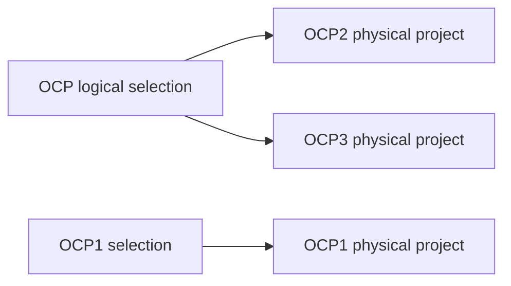

## 3. Cấu hình database

Mapping được lưu trong bảng `project_mapping`, không hard-code trong Java.

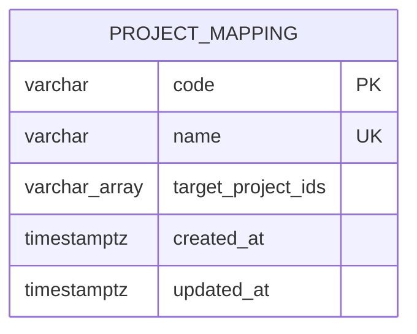

Migration tạo bảng và seed dữ liệu nằm tại:

```text
src/main/resources/db.changelog/ddl/changelog-0051-project-mapping.sql
```

Dữ liệu seed:

```sql
INSERT INTO cobroker_db.project_mapping (code, name, target_project_ids)
VALUES (
    'OCP',
    'Vinhomes Ocean Park 2+3',
    ARRAY['1706151042103_2822', '1707589000350_2804']::VARCHAR[]
);
```

Ý nghĩa các cột:

| Cột | Ý nghĩa |
|---|---|
| `code` | Mã lựa chọn logic mà API/UI gửi vào |
| `name` | Tên hiển thị; cũng có thể dùng để nhận diện dữ liệu import |
| `target_project_ids` | Danh sách project ID vật lý sau khi resolve |
| `created_at` | Thời điểm tạo mapping |
| `updated_at` | Thời điểm cập nhật mapping |

## 4. Luồng xử lý tổng thể

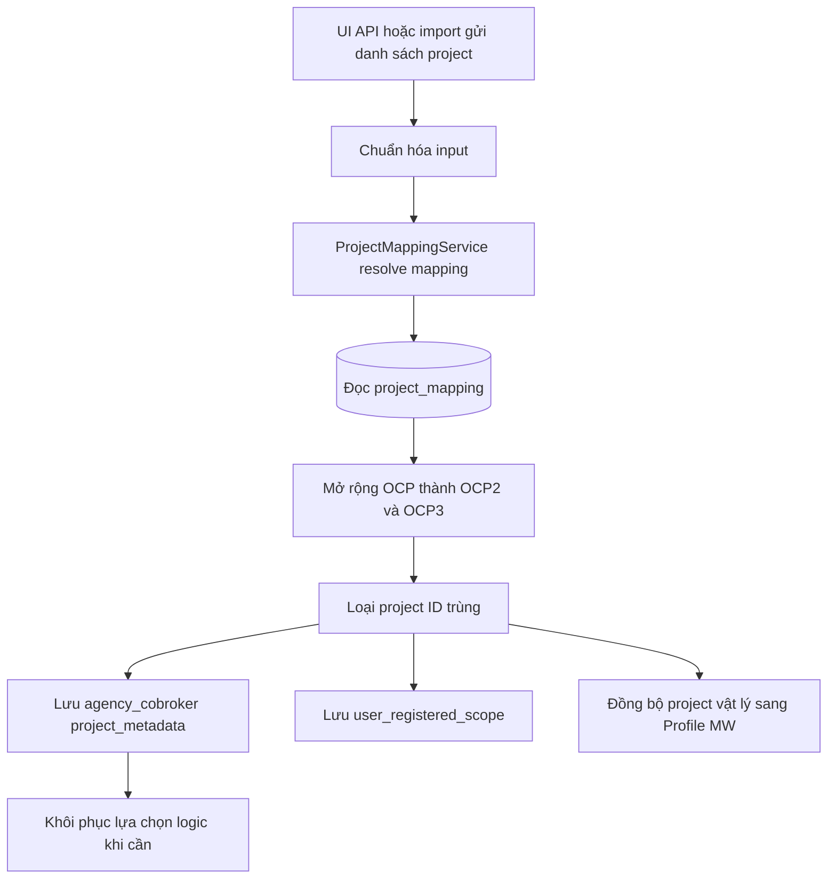

## 5. Thành phần code

| Thành phần | Trách nhiệm |
|---|---|
| `ProjectMappingEntity` | Map bảng `project_mapping` |
| `ProjectMappingRepository` | Đọc mapping từ PostgreSQL |
| `ProjectMappingService` | Khai báo nghiệp vụ resolve và khôi phục mapping |
| `ProjectMappingServiceImpl` | Cài đặt logic mapping, deduplicate và giữ logical marker |
| `AgencyCobrokerProjectJsonb` | Lưu project vật lý cùng mã mapping nguồn |
| `ProjectAssignmentMutationService` | Áp dụng mapping cho API phân dự án |
| `ProjectScopeLifecycleService` | Áp dụng mapping cho luồng tạo/cập nhật Sale |
| `ProjectAssignmentMetadataService` | Rebuild metadata và giữ lại mapping nguồn |
| `CobrokerProjectMetadataSyncer` | Giữ mapping khi đồng bộ metadata từ Profile MW |

## 6. Logic resolve

Điểm xử lý chính:

```java
ProjectMappingService.resolveMetadata(selections)
```

Service đọc các mapping và tạo lookup theo cả `code` lẫn `name`.

```text
OCP                         -> nhận diện theo code
Vinhomes Ocean Park 2+3     -> nhận diện theo name
```

Giá trị được trim và so sánh không phân biệt hoa thường.

### 6.1. Dự án không có mapping

Nếu input không khớp `code` hoặc `name` trong bảng, project được giữ nguyên.

```text
OCP1       -> OCP1
PROJECT-X  -> PROJECT-X
```

### 6.2. Dự án có mapping

Nếu input là `OCP`, service thay nó bằng các phần tử trong `target_project_ids`.

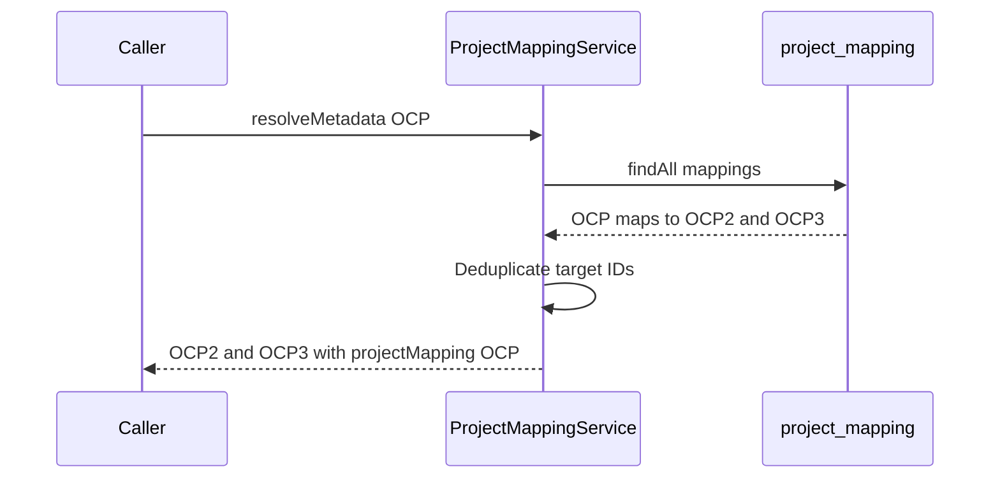

Kết quả metadata:

```json
[
  {
    "projectId": "1706151042103_2822",
    "type": "ADDITIONAL_REGISTERED",
    "projectMapping": "OCP"
  },
  {
    "projectId": "1707589000350_2804",
    "type": "ADDITIONAL_REGISTERED",
    "projectMapping": "OCP"
  }
]
```

`projectMapping` cho biết hai project vật lý được sinh ra từ cùng một lựa chọn logic.

## 7. Deduplicate

Service dùng tập project ID đã xử lý để tránh tạo project vật lý trùng.

```text
Input:     OCP2 + OCP
Expand:    OCP2 + OCP2 + OCP3
Kết quả:   OCP2 + OCP3
```

Điều này đáp ứng trường hợp người dùng đã chọn riêng OCP2 rồi tiếp tục chọn OCP 2+3.

## 8. Luồng tạo hoặc cập nhật Sale

`AgencyProfileServiceImpl` gọi `ProjectMappingService.resolveMetadata()` khi dựng `project_metadata` và khi lấy danh sách project gửi sang Profile MW.

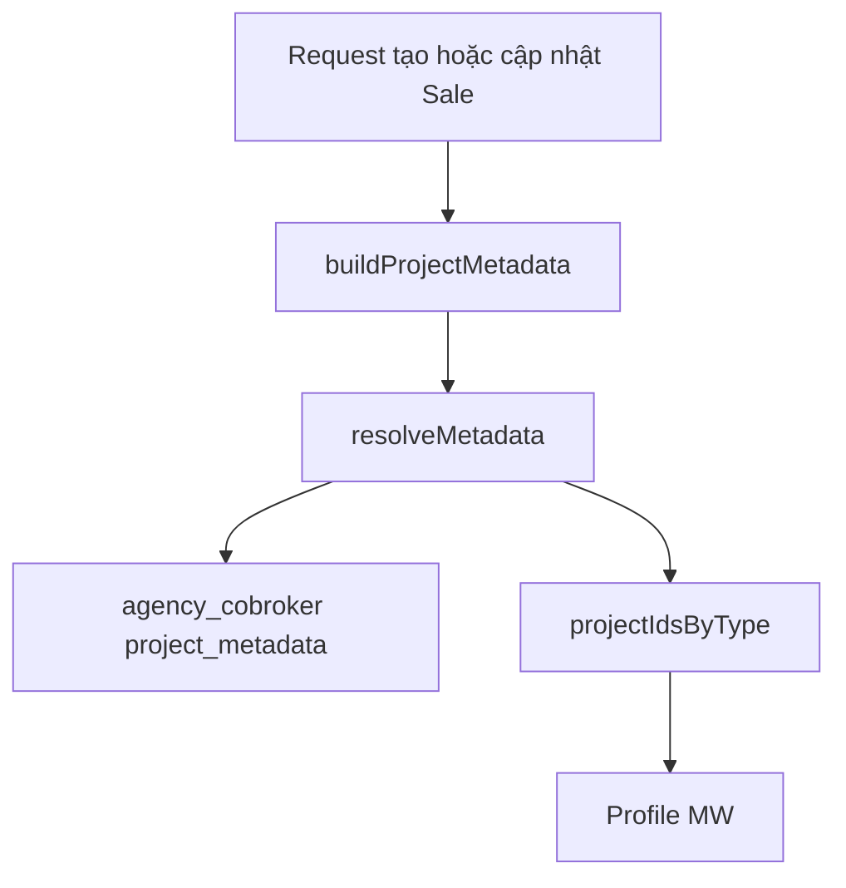

Kết quả:

- `agency_cobroker.project_metadata` lưu OCP2 và OCP3 kèm `projectMapping = OCP`.
- Profile MW nhận project ID vật lý OCP2 và OCP3.
- OCP1 vẫn giữ nguyên nếu được chọn riêng.

## 9. Luồng API phân dự án

`ProjectAssignmentMutationService.replace()` xử lý theo thứ tự:

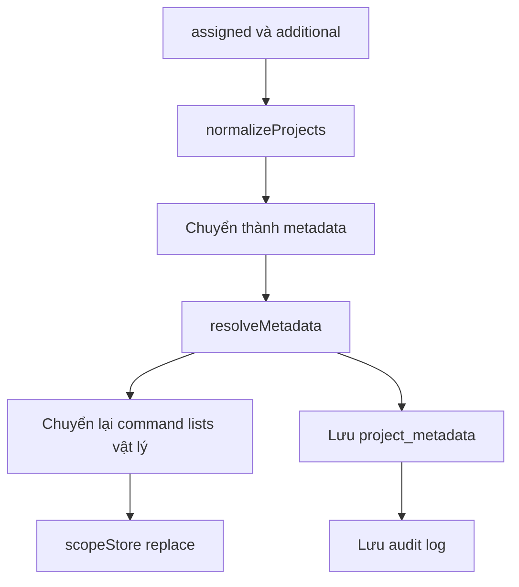

Ví dụ scope được lưu:

```text
user_registered_scope
- 1706151042103_2822
- 1707589000350_2804
```

Không lưu `OCP` vào `user_registered_scope`, vì đây không phải project ID vật lý.

## 10. Khôi phục lựa chọn logic

Khi cần validate hoặc dựng lại input, `logicalSelections()` dựa vào `projectMapping` để gộp hai project vật lý thành một lựa chọn.

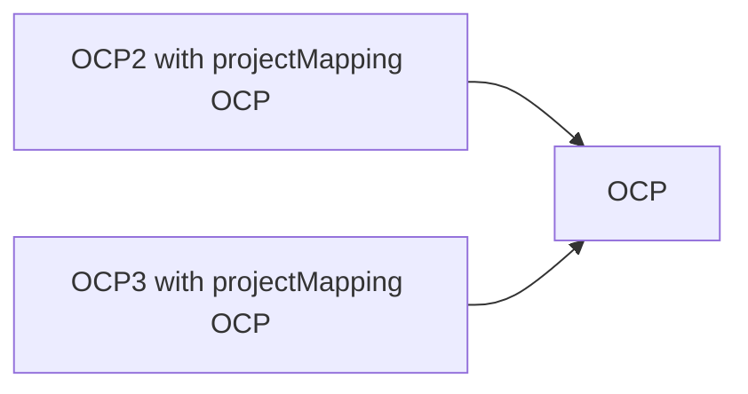

```text
OCP2 projectMapping OCP
OCP3 projectMapping OCP
             |
             v
           OCP
```

Nhờ vậy OCP2 và OCP3 sinh từ mapping vẫn được hiểu là một lựa chọn logic.

## 11. Giữ mapping khi rebuild metadata

`user_registered_scope` chỉ lưu project ID vật lý và không có `projectMapping`. Khi metadata được rebuild từ scope, marker `OCP` có thể bị mất.

`preserveProjectMappings()` lấy metadata trước đó và gắn marker trở lại theo cặp:

```text
project type + project ID
```

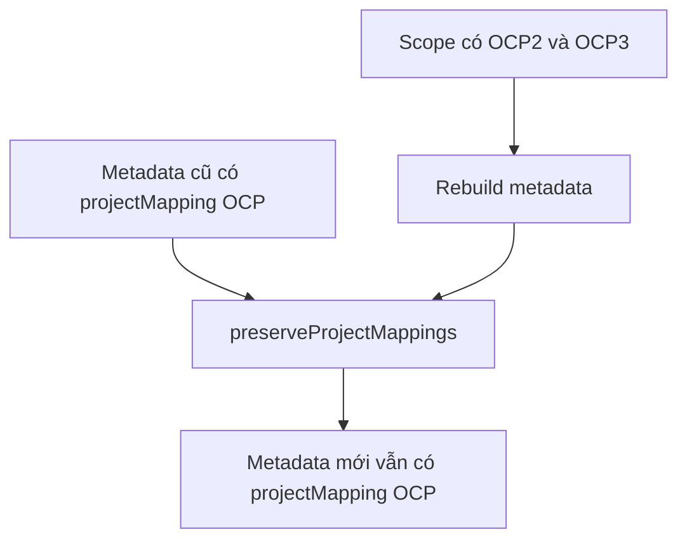

## 12. Trường hợp xử lý

| Input | Kết quả vật lý | Mapping metadata |
|---|---|---|
| OCP | OCP2, OCP3 | Cả hai mang `projectMapping = OCP` |
| OCP1 | OCP1 | Không có `projectMapping` |
| OCP2 | OCP2 | Không có `projectMapping` |
| OCP3 | OCP3 | Không có `projectMapping` |
| OCP2 + OCP | OCP2, OCP3 | Không tạo OCP2 trùng |
| Project X | Project X | Không có `projectMapping` |

## 13. Cách thêm mapping mới

Không sửa Java. Chỉ thêm dữ liệu DB bằng Liquibase.

```sql
INSERT INTO cobroker_db.project_mapping (code, name, target_project_ids)
VALUES (
    'NEW_MAPPING',
    'Tên lựa chọn mới',
    ARRAY['PROJECT_ID_A', 'PROJECT_ID_B']::VARCHAR[]
);
```

Sau đó toàn bộ luồng dùng `ProjectMappingService` sẽ tự nhận mapping mới.

## 14. Danh sách API liên quan

| API | Request DTO | Mapping chạy khi nào? | Kiểu xử lý |
|---|---|---|---|
| `POST /internal/v1/agencies/{agencyId}/cobrokers` | `CreateCobrokerRequest` | Khi `roleType = SALE_MEMBER` | Đồng bộ |
| `POST /internal/v1/agencies/cobrokers` | `CreateCobrokerRequest` | Khi `roleType = SALE_MEMBER` | Đồng bộ |
| `POST /internal/v1/agencies/{agencyId}/cobrokers?requestId={requestId}` | `CobrokerOpData` | Khi ARM duyệt và apply yêu cầu | Stage rồi apply |
| `PUT /internal/v1/agencies/{agencyId}/project-assignments/batch` | `BatchRequest` | Trong từng mutation của Sale | Đồng bộ, atomic |
| `POST /internal/v1/project-assignments/dynamic-range` | `DynamicRangeRequest` | Khi worker xử lý từng Sale | Bất đồng bộ |
| `POST /internal/v1/migration/project-scopes` | Multipart CSV | Phụ thuộc dữ liệu job import | Bất đồng bộ |
| `POST /internal/v1/migration/project-scopes/from-storage` | `CreateFromStorageRequest` | Phụ thuộc dữ liệu job import | Bất đồng bộ |

Các API đọc job, hủy job và đọc chi tiết Sale không tạo mapping mới. Chúng chỉ đọc trạng thái hoặc dữ liệu đã lưu.

## 15. API CRUD Sale/CVKD

### 15.1. Tạo CVKD theo agency ID

```http
POST /internal/v1/agencies/{agencyId}/cobrokers
Content-Type: application/json
```

Controller:

```text
AgencyProfileInternalController.createCobroker
```

Request DTO:

```text
CreateCobrokerRequest
```

Payload rút gọn:

```json
{
  "roleType": "SALE_MEMBER",
  "fullName": "Nguyễn Văn A",
  "phone": "+84901234567",
  "email": "sale@example.com",
  "identityNo": "001234567890",
  "dateOfBirth": "1995-01-01",
  "projects": [
    {
      "projectId": "OCP",
      "type": "ADDITIONAL_REGISTERED"
    }
  ]
}
```

DTO `CreateCobrokerRequest.projects` có kiểu:

```java
List<AgencyCobrokerProjectJsonb>
```

Mỗi phần tử gồm:

| Field | Kiểu | Ý nghĩa |
|---|---|---|
| `projectId` | `String` | Project ID vật lý hoặc mapping code như `OCP` |
| `type` | `CobrokerProjectType` | `ASSIGNED` hoặc `ADDITIONAL_REGISTERED` |
| `projectMapping` | `String` | Không cần truyền từ client; backend tự gắn sau khi resolve |

Luồng gọi:

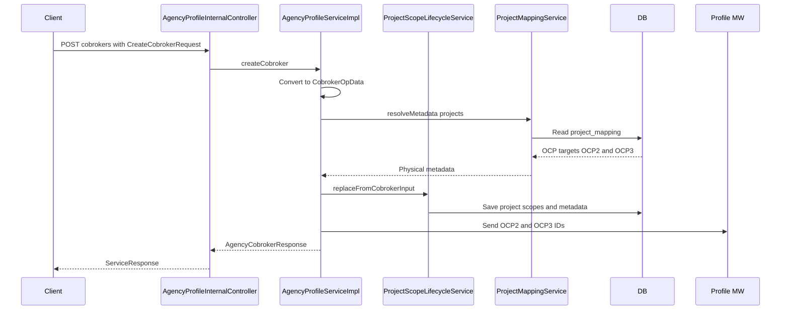

Trong service, `CreateCobrokerRequest` được chuyển sang `CobrokerOpData` bằng `toCobrokerOpData()`. Field `projects` được copy nguyên để xử lý chung với các luồng CVKD khác.

Lưu ý: nếu `roleType` là `SALE_ADMIN`, code đi vào nhánh tạo Admin. Luồng mapping dự án trong tài liệu này áp dụng cho `SALE_MEMBER`.

### 15.2. Tạo CVKD theo team

```http
POST /internal/v1/agencies/cobrokers
Content-Type: application/json
```

API dùng cùng `CreateCobrokerRequest`, nhưng có thêm `teamId` khi caller là ARM:

```json
{
  "roleType": "SALE_MEMBER",
  "teamId": 123,
  "fullName": "Nguyễn Văn A",
  "phone": "+84901234567",
  "email": "sale@example.com",
  "identityNo": "001234567890",
  "dateOfBirth": "1995-01-01",
  "projects": [
    {
      "projectId": "Vinhomes Ocean Park 2+3",
      "type": "ASSIGNED"
    }
  ]
}
```

`ProjectMappingService` hỗ trợ tìm theo cả `code = OCP` và `name = Vinhomes Ocean Park 2+3`. Tuy nhiên API nên ưu tiên gửi `OCP`; tên hiển thị phù hợp hơn cho import file.

Luồng service:

```text
createCobrokerByTeam
  -> resolve agency từ teamId hoặc caller
  -> createCobroker
  -> createCvkd
  -> doCreateCvkd
  -> ProjectScopeLifecycleService
  -> ProjectMappingService
```

### 15.3. Stage tạo CVKD trong yêu cầu cập nhật

```http
POST /internal/v1/agencies/{agencyId}/cobrokers?requestId={requestId}
Content-Type: application/json
```

Request DTO là `CobrokerOpData`, trong đó:

```java
private List<AgencyCobrokerProjectJsonb> projects;
```

Ở bước stage, hệ thống lưu `CobrokerOpData` vào yêu cầu chờ duyệt. Mapping thực sự được áp dụng khi ARM duyệt và code chạy `doCreateCvkd()`.

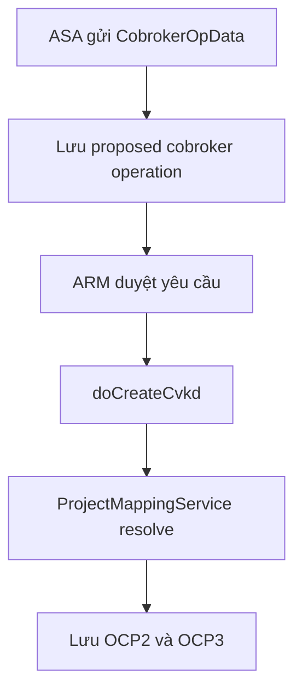

### 15.4. API update trực tiếp không sửa projects

```http
PUT /internal/v1/agencies/{agencyId}/cobrokers/{cobrokerProfileId}
```

Request DTO là `CobrokerUpdateData`. DTO này **không có field `projects`** và cố ý không cập nhật `project_metadata`.

Do đó không dùng endpoint này để triển khai BDSKD-6590 hoặc thay danh sách dự án của Sale. Muốn gán dự án hàng loạt phải dùng API project-assignment.

## 16. API project assignment

### 16.1. Batch theo danh sách username

```http
PUT /internal/v1/agencies/{agencyId}/project-assignments/batch
X-AgentUser-Id: <actor>
X-User-Type: <user-type>
Content-Type: application/json
```

Request DTO:

```java
public record BatchRequest(
    List<String> usernames,
    List<String> assignedProjects,
    List<String> additionalProjects
)
```

Ví dụ:

```json
{
  "usernames": ["sale01", "sale02"],
  "assignedProjects": ["OCP"],
  "additionalProjects": ["1777975655420_2417"]
}
```

Ở request này:

- `OCP` là lựa chọn logic.
- `1777975655420_2417` là project ID vật lý bình thường.
- `assignedProjects` và `additionalProjects` không được null.
- `usernames` không được rỗng; mỗi username tối đa 100 ký tự.

Luồng xử lý:

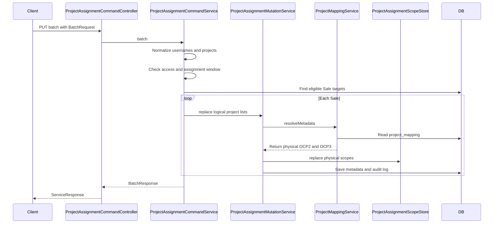

Response DTO:

```java
public record BatchResponse(
    UUID agencyProfileId,
    List<String> assignedProjects,
    List<String> additionalProjects,
    int processedCount,
    int updatedCount,
    int noChangeCount,
    List<BatchItemResult> results
)
```

`BatchResponse.assignedProjects` và `additionalProjects` phản ánh input logic đã normalize. Dữ liệu vật lý được lưu trong scope và `project_metadata`.

API batch chạy trong một transaction. Một Sale lỗi thì toàn bộ batch rollback.

### 16.2. Dynamic range

```http
POST /internal/v1/project-assignments/dynamic-range
X-AgentUser-Id: <actor>
X-User-Type: <user-type>
Idempotency-Key: <unique-key>
Content-Type: application/json
```

Request DTO:

```java
public record DynamicRangeRequest(
    List<String> assignedProjects,
    List<String> additionalProjects,
    AssignmentFilter filter
)
```

Ví dụ:

```json
{
  "assignedProjects": ["OCP"],
  "additionalProjects": [],
  "filter": {
    "queries": [
      {
        "operator": "eq",
        "field": "agencyProfileId",
        "values": ["11111111-1111-1111-1111-111111111111"]
      }
    ]
  }
}
```

Luồng xử lý bất đồng bộ:

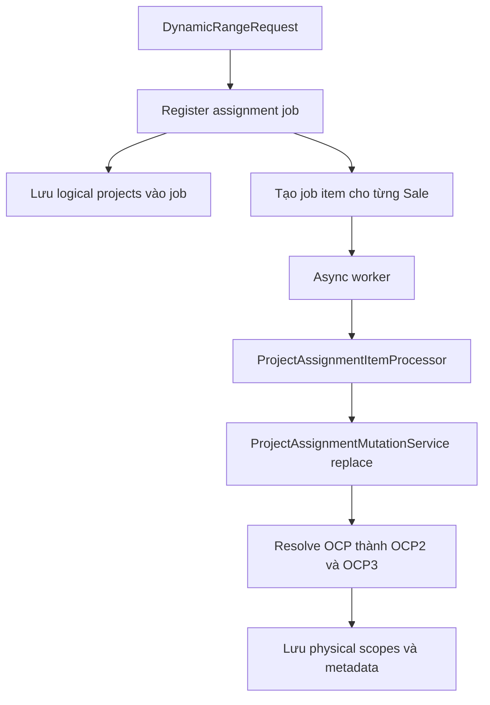

Job giữ `assignedProjects = [OCP]` ở dạng logic. Khi worker xử lý từng item, `ProjectAssignmentMutationService` mới resolve thành project vật lý.

Nếu job còn `PENDING` hoặc `IN_PROGRESS`, API trả HTTP `202 Accepted` cùng `Location` để đọc trạng thái:

```http
GET /internal/v1/agencies/{agencyId}/project-assignment-jobs/{jobId}
```

DTO trả về là `JobResponse`, gồm trạng thái, project input, số lượng đã resolve/xử lý/thành công/thất bại và version.

API hủy job:

```http
POST /internal/v1/agencies/{agencyId}/project-assignment-jobs/{jobId}/cancel
```

Hai API đọc/hủy job không gọi `ProjectMappingService`.

## 17. API import migration

### 17.1. Upload CSV trực tiếp

```http
POST /internal/v1/migration/project-scopes
X-Migration-Key: <migration-key>
Content-Type: multipart/form-data
```

Form data:

| Field | Kiểu | Ý nghĩa |
|---|---|---|
| `file` | Multipart file | File CSV cần import |
| `requireS3` | Boolean | Có bắt buộc chuyển qua storage hay không |

Response DTO:

```java
public record CreateResponse(
    UUID importGroupId,
    List<UUID> jobIds,
    int totalRows,
    int jobCount
)
```

### 17.2. Upload file lớn qua object storage

Bước 1 lấy presigned URL:

```http
POST /internal/v1/migration/project-scopes/prepare-upload
```

```json
{
  "fileName": "project-scopes.csv",
  "contentType": "text/csv",
  "fileSize": 102400
}
```

DTO:

```java
public record PrepareUploadRequest(
    String fileName,
    String contentType,
    long fileSize
)
```

Bước 2 tạo import từ file đã upload:

```http
POST /internal/v1/migration/project-scopes/from-storage
```

```json
{
  "fileRef": "project-scope-migration/.../project-scopes.csv",
  "fileName": "project-scopes.csv",
  "fileSize": 102400
}
```

Bước 3 đọc trạng thái:

```http
GET /internal/v1/migration/project-scopes/jobs/{jobId}
```

Lưu ý phạm vi: controller này là công cụ migration scope hiện có. BDSKD-6590 không bổ sung DTO riêng cho mapping vào các API upload. Nếu file nghiệp vụ cần nhận `OCP` như một lựa chọn logic, parser/import handler phải chuyển dòng đó qua `ProjectAssignmentMutationService` hoặc `ProjectMappingService`; không được tự hard-code OCP2/OCP3 trong parser.

## 18. Contract DTO và dữ liệu lưu

### 18.1. DTO client gửi vào

```json
{
  "projectId": "OCP",
  "type": "ASSIGNED"
}
```

Client không cần gửi `projectMapping`.

### 18.2. Metadata backend lưu

```json
[
  {
    "projectId": "1706151042103_2822",
    "type": "ASSIGNED",
    "projectMapping": "OCP"
  },
  {
    "projectId": "1707589000350_2804",
    "type": "ASSIGNED",
    "projectMapping": "OCP"
  }
]
```

### 18.3. Scope backend lưu

```text
registration_type = ASSIGNED
scope_type         = PROJECT
scope_id           = 1706151042103_2822

registration_type = ASSIGNED
scope_type         = PROJECT
scope_id           = 1707589000350_2804
```

### 18.4. Payload gửi Profile MW

```json
{
  "assignedProjects": [
    "1706151042103_2822",
    "1707589000350_2804"
  ]
}
```

Profile MW không cần hiểu `OCP` hoặc đọc bảng `project_mapping`.

## 19. Điểm cần chú ý khi tích hợp

1. FE/API nên gửi `code = OCP`, không gửi project ID giả.
2. Không gửi `projectMapping` từ client; field này do backend quản lý.
3. `OCP1` không nằm trong mapping và luôn được giữ nguyên.
4. Scope và payload downstream luôn dùng project ID vật lý.
5. Job bất đồng bộ giữ input logic; mapping chạy khi worker xử lý từng Sale.
6. API update trực tiếp dùng `CobrokerUpdateData` không hỗ trợ sửa danh sách dự án.
7. Thêm mapping mới bằng Liquibase; không thêm constant hoặc `if OCP` trong Java.
8. Import nghiệp vụ mới phải tái sử dụng service chung, không tự viết mapping riêng.

## 20. Đối chiếu với repo vhm-cobroker-api

Repo đã kiểm tra:

```text
/home/huynv106/Documents/o2o/vhm-cobroker-api
```

### 20.1. Kết luận

`vhm-cobroker-api` hiện không expose và không gọi các API ghi project sau của core:

```text
POST /internal/v1/agencies/{agencyId}/cobrokers
POST /internal/v1/agencies/cobrokers
PUT  /internal/v1/agencies/{agencyId}/project-assignments/batch
POST /internal/v1/project-assignments/dynamic-range
```

Do đó BDSKD-6590 chưa cần sửa DTO hoặc controller trong `vhm-cobroker-api` để thực hiện mapping. Các API quản lý Sale/phân dự án nhiều khả năng được gọi từ BFF quản trị khác, không phải BFF mobile này.

### 20.2. API có liên quan gián tiếp

`vhm-cobroker-api` có API đọc hồ sơ Sale:

```http
GET /v1/profile
Authorization: Bearer <token>
```

Luồng gọi thực tế:

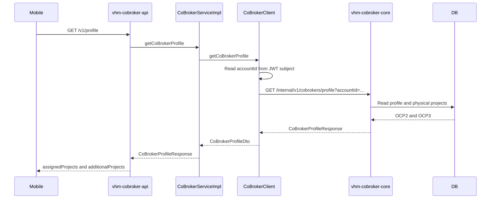

Mapping endpoint:

| vhm-cobroker-api | vhm-cobroker-core |
|---|---|
| `GET /v1/profile` | `GET /internal/v1/cobrokers/profile?accountId={jwtSub}` |

Code path phía API:

```text
CoBrokerProfileController.getProfile
  -> CoBrokerServiceImpl.getCoBrokerProfile
  -> CoBrokerClient.getCoBrokerProfile
  -> RestClientCommon.exchange
```

URL core được khai báo trong `CoBrokerClient`:

```java
private static final String URI_GET_CO_BROKER_PROFILE =
        "/internal/v1/cobrokers/profile";
```

Base URL và Basic Auth lấy từ cấu hình:

```properties
integration.co-broker-core-service.endpoint=${INTEGRATION_COBROKER_CORE_ENDPOINT}
integration.co-broker-core-service.username=${INTEGRATION_COBROKER_CORE_USERNAME}
integration.co-broker-core-service.password=${INTEGRATION_COBROKER_CORE_PASSWORD}
```

`CoBrokerClient` lấy subject từ JWT làm `accountId` rồi gọi:

```text
{INTEGRATION_COBROKER_CORE_ENDPOINT}
    + /internal/v1/cobrokers/profile
    + ?accountId={JWT_SUB}
```

### 20.3. DTO giữa hai service

DTO nhận dữ liệu core trong `vhm-cobroker-api` là `CoBrokerProfileDto`:

```java
public class CoBrokerProfileDto {
    private List<String> assignedProjects;
    private List<String> additionalProjects;
}
```

Hai danh sách này nhận project ID vật lý:

```json
{
  "assignedProjects": [
    "1706151042103_2822",
    "1707589000350_2804"
  ],
  "additionalProjects": []
}
```

`vhm-cobroker-api` không nhận `projectMapping = OCP` và không tự resolve OCP. Việc resolve đã hoàn tất ở core trước khi dữ liệu được ghi và đọc lại.

### 20.4. Các API khác của vhm-cobroker-api

Repo này chủ yếu gọi các API core sau:

| Public API | Core API |
|---|---|
| `GET /v1/profile` | `GET /internal/v1/cobrokers/profile` |
| `GET /v1/onboarding/config` | `GET /internal/v1/cobrokers/onboarding/config` |
| `POST /v1/onboarding/prepare-upload` | `POST /internal/v1/cobrokers/onboarding/{accountId}/prepare-upload` |
| `POST /v1/onboarding/validate-identity-document` | `POST /internal/v1/cobrokers/onboarding/{accountId}/validate-identity-document` |
| `PATCH /v1/onboarding/identity-data` | `PATCH /internal/v1/cobrokers/onboarding/{accountId}/identity-data` |
| `PATCH /v1/onboarding/broker-license` | `PATCH /internal/v1/cobrokers/onboarding/{accountId}/broker-license` |
| `PATCH /v1/onboarding/avatar` | `PATCH /internal/v1/cobrokers/onboarding/{accountId}/avatar` |
| `POST /v1/onboarding/submit` | `POST /internal/v1/cobrokers/onboarding/{accountId}/submit` |
| `PATCH /v1/onboarding/team` | `POST /internal/v1/cobrokers/onboarding/{accountId}/team` |
| `GET /v1/teams` | `GET /internal/v1/cobrokers/teams` |

Không API nào trong nhóm onboarding trên gửi `projects` hoặc gọi `ProjectMappingService`.

### 20.5. Nếu muốn mobile hiển thị lại lựa chọn OCP

Hiện mobile chỉ nhận OCP2 và OCP3 dưới dạng project ID vật lý. Nếu yêu cầu UI cần hiển thị lại đúng một lựa chọn `Vinhomes Ocean Park 2+3`, có hai phương án:

1. Core bổ sung logical project selections vào response profile.
2. BFF gọi một catalog/mapping API và tự dựng display model.

Khuyến nghị phương án 1: core trả thêm field read-only, ví dụ `projectSelections`, vì core đang sở hữu `projectMapping` và có thể khôi phục chính xác bằng `logicalSelections()`. Không nên để mobile suy luận rằng cứ có cả OCP2 và OCP3 thì người dùng từng chọn OCP; hai project đó có thể đã được chọn riêng.

## 21. Đối chiếu với repo vhm-agent-api

Repo đã kiểm tra:

```text
/home/huynv106/Documents/o2o/noxh/social-housing/vhm-agent-api
```

### 21.1. Kết luận

`vhm-agent-api` là BFF quản trị đang expose và gọi trực tiếp các API của BDSKD-6590 trong `vhm-cobroker-core`.

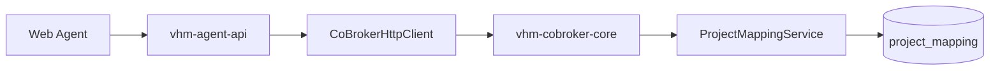

Các DTO project-assignment của hai repo đang tương thích về tên field:

```text
assignedProjects
additionalProjects
usernames
filter
```

### 21.2. API batch assignment

Public API trên `vhm-agent-api`:

```http
PUT /v1/agencies/{agencyId}/project-assignments/batch
```

API core được gọi:

```http
PUT /internal/v1/agencies/{agencyId}/project-assignments/batch
```

Code path:

```text
ProjectAssignmentCommandController.batch
  -> ProjectAssignmentServiceImpl.batch
  -> CoBrokerHttpClient.batchProjectAssignments
  -> vhm-cobroker-core ProjectAssignmentCommandController.batch
  -> ProjectAssignmentCommandService.batch
  -> ProjectAssignmentMutationService.replace
  -> ProjectMappingService.resolveMetadata
```

Payload đi xuyên suốt không đổi:

```json
{
  "usernames": ["sale01", "sale02"],
  "assignedProjects": ["OCP"],
  "additionalProjects": []
}
```

`vhm-agent-api` không resolve `OCP`. Core chịu trách nhiệm mở rộng thành OCP2 và OCP3.

### 21.3. API dynamic-range assignment

Public API:

```http
POST /v1/project-assignments/dynamic-range
Idempotency-Key: <key>
```

API core:

```http
POST /internal/v1/project-assignments/dynamic-range
Idempotency-Key: <key>
```

Code path:

```text
ProjectAssignmentCommandController.dynamicRange
  -> ProjectAssignmentServiceImpl.dynamicRange
  -> CoBrokerHttpClient.assignProjectDynamicRange
  -> core đăng ký project_assignment_job
  -> async worker xử lý từng item
  -> ProjectAssignmentMutationService.replace
  -> ProjectMappingService.resolveMetadata
```

Nếu client không gửi `Idempotency-Key`, BFF hiện tự sinh UUID. BFF trả HTTP `202` khi job còn `PENDING` hoặc `IN_PROGRESS`.

### 21.4. API tạo CVKD

Public API:

```http
POST /v1/agencies/{agencyId}/cobrokers
```

API core:

```http
POST /internal/v1/agencies/{agencyId}/cobrokers
```

Code path:

```text
CoBrokerAgencyController.createCobroker
  -> AgencyManagementServiceImpl.createCobroker
  -> CobrokerProjectValidator.validate
  -> CoBrokerHttpClient.createAgencyCobroker
  -> core AgencyProfileInternalController.createCobroker
  -> AgencyProfileServiceImpl.createCobroker
  -> ProjectMappingService.resolveMetadata
```

DTO BFF:

```java
public class CreateCobrokerRequest {
    private AgencyCobrokerRoleType roleType;
    private List<AgencyCobrokerProject> projects;
}
```

Project DTO:

```java
public class AgencyCobrokerProject {
    private String projectId;
    private AgencyCobrokerProjectType type;
}
```

Payload cho OCP:

```json
{
  "roleType": "SALE_MEMBER",
  "fullName": "Nguyễn Văn A",
  "phone": "+84901234567",
  "email": "sale@example.com",
  "identityNo": "001234567890",
  "dateOfBirth": "1995-01-01",
  "projects": [
    {
      "projectId": "OCP",
      "type": "ASSIGNED"
    }
  ]
}
```

### 21.5. API tạo CVKD theo team

Public API:

```http
POST /v1/agencies/cobrokers
```

API core:

```http
POST /internal/v1/agencies/cobrokers
```

Luồng này dùng cùng `CreateCobrokerRequest` và cùng `CobrokerProjectValidator`.

### 21.6. API stage tạo CVKD

Public API:

```http
POST /v1/agencies/{agencyId}/cobrokers?requestId={requestId}
```

API core:

```http
POST /internal/v1/agencies/{agencyId}/cobrokers?requestId={requestId}
```

Code path:

```text
CoBrokerAgencyController.stageCvkdCreate
  -> AgencyManagementServiceImpl.stageCvkdCreate
  -> CobrokerProjectValidator.validate
  -> CoBrokerHttpClient.stageAgencyCvkdCreate
  -> core stage request
  -> ARM approve
  -> core doCreateCvkd
  -> ProjectMappingService.resolveMetadata
```

Request DTO là `AgencyCobrokerOpData`, field dự án:

```java
private List<AgencyCobrokerProject> projects;
```

### 21.7. Điểm chặn tại CobrokerProjectValidator

Ba luồng sau đều chạy `CobrokerProjectValidator` trước khi gọi core:

```text
createCobroker
createCobrokerByTeam
stageCvkdCreate
```

Validator đọc catalog `profile-mw` theo hai alias:

```text
ASSIGNED              -> assigned_projects
ADDITIONAL_REGISTERED -> additional_projects
```

Sau đó validator yêu cầu từng `projectId` phải khớp chính xác với:

```text
extraData.data_type_define.options[].internal_value
```

Luồng hiện tại:

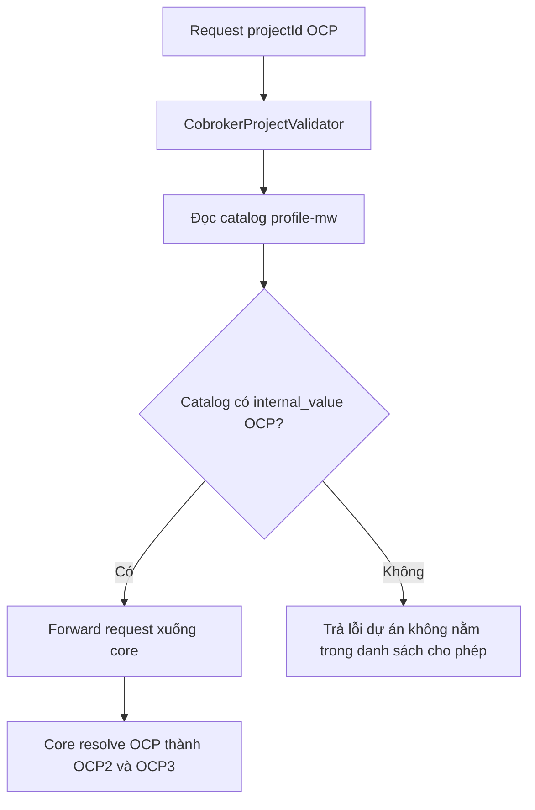

Đây là điểm còn thiếu quan trọng. Nếu catalog staging chưa công bố option `OCP`, request tạo/stage CVKD sẽ bị chặn ở BFF và không bao giờ tới `ProjectMappingService`.

### 21.8. Cách xử lý validator đề xuất

Phương án ưu tiên là bổ sung option logic vào catalog `profile-mw`:

```json
{
  "internal_value": "OCP",
  "display_value": "Vinhomes Ocean Park 2+3"
}
```

Option này phải tồn tại trong catalog tương ứng với loại dự án mà UI cho phép chọn:

```text
assigned_projects
additional_projects
```

Ưu điểm:

- UI lấy được option OCP từ cùng catalog hiện có.
- `CobrokerProjectValidator` tự chấp nhận OCP.
- OCP chỉ chiếm một phần tử khi validator kiểm tra `max_size`.
- BFF không cần hard-code OCP2/OCP3.
- Core vẫn là nơi duy nhất resolve sang project vật lý.

Nếu không thể sửa catalog, BFF phải đọc mapping logic từ core rồi hợp nhất với catalog trước khi validate. Không nên thêm ngoại lệ kiểu:

```java
if ("OCP".equals(projectId)) {
    return true;
}
```

vì cách này tạo thêm một nguồn cấu hình hard-code và sẽ phải sửa Java mỗi khi có mapping mới.

### 21.9. Project-assignment không bị validator này chặn

Hai API sau không gọi `CobrokerProjectValidator`:

```text
PUT  /v1/agencies/{agencyId}/project-assignments/batch
POST /v1/project-assignments/dynamic-range
```

Chúng forward `assignedProjects` và `additionalProjects` trực tiếp xuống core. Vì vậy `OCP` sẽ được core nhận và resolve, miễn là policy/quota hiện hành cho phép request.

### 21.10. DTO projectMapping ở BFF

`AgencyCobrokerProject` của BFF hiện chỉ có:

```text
projectId
type
```

Thiết kế này đúng cho request. Không cần bổ sung `projectMapping` vào request DTO vì field đó là metadata nội bộ do core sinh ra.

Các response đang trả `assignedProjects` và `additionalProjects` dưới dạng project ID vật lý. Chỉ cần thêm DTO logical selection nếu UI có yêu cầu hiển thị lại combo OCP như một lựa chọn duy nhất.

### 21.11. Header và kết nối xuống core

`CoBrokerHttpClient` có base path:

```java
@HttpExchange(url = "/internal/v1")
```

Base URL lấy từ:

```properties
client.co-broker-core-service.base-url=${INTEGRATION_COBROKER_CORE_ENDPOINT}
```

HTTP client tự gắn:

- Basic Auth giữa BFF và core.
- Identity của người thao tác.
- `X-User-Type` tương ứng ARM hoặc ASA.
- `X-Organization-Id` từ cấu hình single-org.

### 21.12. Kết luận triển khai liên repository

```text
Web Agent
  -> gửi projectId OCP
vhm-agent-api
  -> validate OCP phải tồn tại trong catalog profile-mw
  -> forward nguyên OCP
vhm-cobroker-core
  -> đọc project_mapping
  -> resolve OCP thành OCP2 và OCP3
  -> lưu physical scope và project metadata
Profile MW và báo cáo
  -> nhận project ID vật lý OCP2 và OCP3
```

Phần cần xác nhận trước khi release là catalog `assigned_projects` và `additional_projects` trên staging có `internal_value = OCP` hay chưa.

## 22. Tóm tắt

```text
Người dùng chọn OCP
        |
        v
ProjectMappingService đọc DB
        |
        v
Resolve thành OCP2 và OCP3
        |
        +--> Lưu scope vật lý
        +--> Đồng bộ Profile MW
        +--> Lưu metadata có projectMapping OCP
                                  |
                                  v
                    Khôi phục thành một lựa chọn OCP
```
