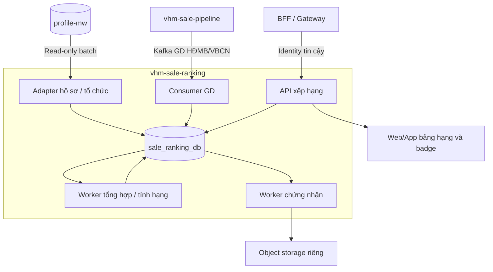

# BDSKD-9531 — TDD service xếp hạng sale theo doanh số

Cập nhật 05/10/2026. Nguồn nghiệp vụ và luật chưa chốt xem [phân tích SRS](BDSKD-9531-xep-hang-sale-theo-doanh-so-phan-tich-SRS.md). Đây là thiết kế đề xuất từ SRS local, chưa đối chiếu được bản online; không có migration/application code đã triển khai.

## 1. Kiến trúc và phạm vi

Service đề xuất `vhm-sale-ranking`, DB PostgreSQL riêng `sale_ranking_db`; repository, deployment, migration, API, scheduler và worker riêng. Không đọc/ghi DB, gọi API hay import module core-broker; không đọc kết quả sale-cycle của 9533 để tính hạng.

Hai nguồn dữ liệu theo định hướng bộ 9533: **profile-mw** cho sale/role/tổ chức, datasource MySQL chỉ đọc; **sale-pipeline Kafka** cho GD. 9531 cần pipeline cung cấp milestone và net revenue phù hợp, không mặc định payload của 9533 đã có đủ. Công nghệ/phiên bản framework chưa chốt; không lấy DTO/controller/worker từ repo core-broker.



BFF/web/app gọi API mới để đọc bảng, badge và tải chứng nhận. Không cần ghi user.sale_score hoặc sales_member_tier trên profile-mw. Nếu frontend chưa nối API, service vẫn tính và cung cấp kết quả; nghiệm thu UI là hạng mục tích hợp riêng.

## 2. Ownership và định danh

| Dữ liệu | Chủ sở hữu | Service mới làm gì? |
| --- | --- | --- |
| User/role/tổ chức và trạng thái tài khoản | profile-mw | Đọc batch, lưu bản đọc tối thiểu cho scope/search/report |
| Sale attribution, milestone, giá và tính hợp lệ GD | pipeline/nguồn GD | Nhận event, lưu ledger; không cho sửa attribution qua API xếp hạng |
| Policy, score, rank, kỳ quý và audit | vhm-sale-ranking | Tự ghi DB riêng |
| Badge/cert và file chứng nhận | vhm-sale-ranking | Cung cấp API; frontend hiển thị |

### Người được xếp hạng khác tài khoản Agent

PRD yêu cầu chuyển đại lý không reset tích lũy. Một `sale_ranking_profiles` đại diện **người được xếp hạng**, không phải một Agent ID. `sale_ranking_accounts` nối các Agent ID nguồn về người đó và lưu snapshot báo cáo từng tài khoản. GD lưu Agent ID và đại lý lúc phát sinh, sau resolve gắn với profile người ổn định.

Nguồn phải cung cấp khóa người ổn định hoặc mapping kế nhiệm đã được xác nhận. Không tự gộp theo tên/điện thoại/CCCD; không mặc định user.id, employee_id hoặc cobroker_profile_id luôn là khóa xuyên tài khoản. Mapping chưa rõ thì giữ unresolved và chưa chốt phần kết quả bị ảnh hưởng. Một account thuộc tối đa một người trong mapping hiện hành.

Đề xuất báo cáo một dòng/người, hiển thị Agent ID/tổ chức hiện tại có quyền xem; còn attribution lịch sử nằm trong ledger. Cách SRS hiển thị ID duy nhất và quyền xem khi đổi đại lý phải PO chốt trước rollout mapping này. Không áp nguyên mô hình một Agent ID/một chu kỳ của 9533.

## 3. DB riêng: bảng nào lưu gì?

| Bảng | Một row đại diện cho | Field cốt lõi |
| --- | --- | --- |
| sale_ranking_profiles | Một người được xếp hạng | id, tenant_id, stable_source_identity, source, mapping_status, current_account_id, input_version |
| sale_ranking_accounts | Một Agent ID của người đó | id, tenant_id, profile_id nullable, agent_profile_id, external_user_id, audience, organization_id, agency_external_id; tên/mã nhân viên/mã định danh/phone/email/account_status; snapshot_hash, synced_at, source_updated_at |
| sale_ranking_organizations | Một nút cây tổ chức nguồn | id, tenant_id, external_org_id, parent_id, name, type, source_status, snapshot_hash, synced_at |
| sale_ranking_transactions | Một GD nghiệp vụ nhận từ pipeline | id, tenant_id, source, business_transaction_id, source_sale_id, account_id/profile_id nullable, agency_at_transaction, project_id, confirmed_at, business_date, net_revenue, currency, recognition_status, business_status, source_revision, event_id, received_at, resolution_status |
| sale_ranking_policy | Một lần lưu cấu hình bất biến | id, tenant_id, version_no, request_id, request_hash, actor, created_at, origin UI/BOOTSTRAP |
| sale_ranking_policy_rule | Quy tắc của một audience trong một quý | id, policy_id, quarter_start, audience, weight_previous, weight_current; diamond/platinum/gold_min_score và quota; algorithm_version |
| sale_ranking_quarters | Trạng thái dữ liệu và kết quả hiện hành của một quý | id, tenant_id, quarter_start, quarter_end, report_enabled, state, input_revision, source_complete_through, published_run_id, final_run_id, data_as_of |
| sale_ranking_runs | Một lần dựng toàn bộ kết quả của quý | id, quarter_id, input_revision, generation, mode PROVISIONAL/FINAL/CORRECTION, status, source_watermark, policy_set_hash, scope_definition, algorithm_version, started_at, completed_at |
| sale_ranking_results | Một người trong một run quý | id, run_id, profile_id, rule_id, identity_snapshot, account_snapshot, audience_snapshot, organization_snapshot, agency_snapshot, previous_revenue, current_revenue, transaction_count, score_raw, numeric_rank nullable, tier nullable, data_status |
| sale_ranking_task | Một việc sync/resolve/rebuild/close có retry | id, tenant_id, type, ref_id, dedupe_key, payload, status, attempts, available_at, lease_until, error |
| sale_ranking_certificates | Một certificate của kết quả được công nhận | id, result_id, owner_profile_id, template_version, format, content_hash, file_reference, status PENDING/GENERATING/READY/FAILED/SUPERSEDED, attempts, next_attempt_at, lease_until, generated_at |
| sale_ranking_audit_logs | Thay đổi, bootstrap, chốt/correction hoặc export | id, tenant_id, actor, action, entity_type/id, before/after JSON, metadata JSON, correlation_id, occurred_at |

Policy/rule tách vì một lần lưu chọn nhiều quý và nhiều audience. Ba hạng cố định nên field ngưỡng/quota nằm trên rule; không thêm danh mục hạng hoặc bảng tier động. Quarter giữ con trỏ kết quả publish, run giữ từng lần dựng, result giữ kết quả từng người: ba bảng phục vụ ba cấp khác nhau.

Certificate vừa là lịch sử file vừa là queue tạo file; không thêm certificate outbox. Task dùng cho tính/đối soát dữ liệu, không nhân thêm bảng request, import hay room không thuộc SRS 9531. Badge được suy ra từ final result, không cần bảng badge riêng. Chi tiết quan hệ/field/transaction xem [luồng DB](BDSKD-9531-xep-hang-sale-theo-doanh-so-luong-du-lieu-va-lo-trinh.md).

### Constraint và kiểu dữ liệu

- Mọi query/mutation có tenant. Account UNIQUE tenant + Agent ID; profile UNIQUE tenant + source + stable identity khi đã resolve; organization UNIQUE tenant + external org ID. Không FK xuyên DB.
- GD UNIQUE tenant + source + business_transaction_id; nếu nguồn hỗ trợ nhiều attribution cho một GD, phải đặc tả khóa/giá trị phân bổ trước migration.
- Rule UNIQUE policy_id + quarter_start + audience. Policy request_id UNIQUE tenant + request_id. Chọn rule đang áp dụng theo resolver phiên bản rõ ràng, không lấy row tùy ý.
- Quarter UNIQUE tenant + quarter_start; run UNIQUE quarter + generation; result UNIQUE run + profile. Final result bất biến; correction tạo run mới.
- Certificate UNIQUE result + template_version + format; task UNIQUE dedupe_key theo phạm vi tenant.
- Tiền và score dùng DECIMAL, không dùng float/double. Đề xuất net_revenue NUMERIC(24,4), weights NUMERIC(9,6), score_raw NUMERIC(38,10): đủ scale tích 4+6 trong giới hạn contract. Không làm tròn trước xếp hạng. Currency phải VND hoặc có quy tắc chuyển đổi được duyệt, không tự cộng nhiều currency.
- Ngày nghiệp vụ DATE; timestamp UTC TIMESTAMPTZ; timezone phân quý Asia/Ho_Chi_Minh. Ranh giới quý `[đầu quý, đầu quý sau)`. Confirmed_at giữ timestamp nguồn; business_date là ngày đã chuẩn hóa.

## 4. Luồng nguồn vào DB

### 4.1. Profile-mw

Đọc user + user_roles/role, resolve tổ chức qua team, đồng bộ account/org và mapping người. Dùng field whitelist, không đọc password/token/session hoặc copy properties toàn bộ. Adapter có datasource chỉ đọc và secret riêng; datasource nghiệp vụ chỉ ghi DB mới.

Bootstrap batch theo khóa ổn định; mỗi lượt sync không chạy chồng. Hash snapshot phát hiện thay đổi; cập nhật role/team phải được quét đối soát dù user.updated_time không đổi. Nguồn lỗi giữ bản đọc cũ, ghi synced_at/dataAsOf. Inactive không xóa. Tên/contact đổi không chấm lại hạng; đổi identity/audience ảnh hưởng đầu vào thì tăng input revision quý cần tính theo luật đã chốt. Không tự rewrite kết quả chốt khi sync profile.

### 4.2. Kafka GD

```text
Nhận event → validate ID/mốc/ngày/net revenue/revision
  → transaction upsert GD + audit + invalidate quý liên quan + task
  → commit → acknowledge Kafka
```

Upsert theo khóa GD và source_revision: duplicate cùng nội dung no-op; revision cũ bỏ qua; cùng revision khác nội dung vào đường lỗi. Chưa resolve người thì lưu GD PENDING, ack sau commit; resolver gắn khi mapping có và giao task. Payload không hợp lệ chuyển DLT bền vững, chỉ ack sau khi publish lỗi thành công; DB lỗi retry chưa ack.

Recognition 9531 lưu riêng với business_status. Khi đã tới milestone xác nhận, hủy sau đó chỉ cập nhật business_status, **không loại ghi nhận**. Event correction riêng nếu source xác nhận sửa sai fact; không dùng cancellation chung của 9533 làm revoke cho 9531.

GD quý Q thay đổi doanh số ảnh hưởng score quý Q **và Q+1**. Sửa ngày sang quý R thì invalidate Q,Q+1,R,R+1; chuyển sale thì xử lý cả người cũ/mới. Quý đã FINAL đánh pending correction và giữ kết quả đang công nhận; không tự publish lại trước khi luật correction được duyệt.

### Contract pipeline cần chốt

Tenant, eventId/time, source_revision, ID GD ổn định, ID sale/mapping người, agency_at_transaction, project_id, primary_purchase flag, milestone customer_confirmed HĐMB/VBCN, mốc tính quý, net_revenue không VAT/KPBT, currency, business_status và loại correction. Nguồn giữ attribution sau ký theo PRD; ledger phản ánh attribution nguồn, API ranking không chỉnh.

## 5. Chính sách — US-04

API xác thực 11/100 → kiểm tra quý current/future, audience không trùng box → validate tỷ lệ/ngưỡng/quota → transaction insert policy + rule từng audience/quý + audit + invalidate quý chưa chốt → commit. Request_id/hash dùng retry. Hai request cấu hình cùng quý/audience được serialize ở quarter; phiên bản thắng theo resolver đã quy định, không chỉ dựa timestamp.

Đề xuất tỷ lệ tổng 1, từng tỷ lệ 0..1; ngưỡng không âm và theo Kim cương ≥ Bạch kim ≥ Vàng; quota nguyên không âm/bắt buộc khi engine cần giới hạn. Các validation này cần PO xác nhận vì SRS quota không đánh dấu bắt buộc rõ. Không cho client tự sửa tên hạng.

UI không ghi quý đã qua. Bootstrap Q3/2026 qua tool/job nội bộ có policy được duyệt, actor/reason/hash và audit, không SQL sửa tay không truy nguyên. Snapshot policy của run giữ nguyên. API current/future dùng phiên bản mới, không update rule đã được final result tham chiếu.

## 6. Tổng hợp, tính điểm và chốt hạng

### Tạm tính trong quý

Worker đọc ledger theo người: `current_revenue = SUM(net_revenue Q)`, `previous_revenue = SUM(net_revenue Q−1)`, count Q theo ID GD hợp lệ. Dùng dữ liệu nguồn đã đủ; điểm raw là weight_previous × previous_revenue + weight_current × current_revenue.

Run PROVISIONAL phục vụ chỉ số/điểm, tier=null và trạng thái chưa chốt; không ghi NONE hoặc cấp certificate. Không coi sale mới không có Q−1 giống source history chưa đủ. Q3 báo cáo cần Q2 input, quarter Q2 được tạo report_enabled=false.

### Phạm vi cạnh tranh và quota

Hạng tính trên tập đầy đủ đã định nghĩa của quý, không theo scope/filter người xem. Không tạo pool theo từng agency/project. **Đề xuất cần PO chốt:** pool theo audience vì cấu hình riêng từng nhóm; nếu PO yêu cầu toàn ba audience chung, phải đặc tả so sánh score và quota giữa các policy khác nhau trước bật final.

Thuật toán đề xuất trong một pool: xét Kim cương trước → lọc người đạt min_score → lấy quota đầu theo score_raw giảm → mở rộng những người bằng đúng score_raw tại biên → loại người đã được cấp hạng → xét Bạch kim rồi Vàng trên phần còn lại. Không đủ ngưỡng/quota thì tier=NONE. Quota bỏ trống chưa có nghĩa rõ nên không tự hiểu là vô hạn.

Đây là thuật toán đề xuất theo ví dụ SRS, **chưa phê duyệt**. Cách tính quota còn lại khi tie vượt quota hoặc không đủ ứng viên cần BO chốt. Numeric rank đề xuất competition rank (1,2,2,4), lưu riêng tier; ID chỉ dùng làm thứ tự hiển thị ổn định, không phá hòa nghiệp vụ.

### Chốt và publish toàn quý

Sau kết thúc ngày cuối quý, scheduler tạo CLOSE_QUARTER; chờ mapping/policy/history/watermark đủ Q−1 và Q. Cho phép nguồn T−1 đến trễ, không chốt lúc 00:00 từ dữ liệu còn thiếu. Cutoff/completeness và hạn công bố cần thống nhất với pipeline/PO.

Worker dựng run + results BUILDING từ snapshot đầu vào nhất quán. Trong transaction publish: khóa quarter → kiểm tra input_revision/policy_set_hash còn đúng → chuyển run mode FINAL/status PUBLISHED → đổi published_run_id/final_run_id → audit → tạo certificates PENDING cho sale đạt hạng → hoàn tất task → commit. Nếu revision đã đổi, bỏ run cũ và dựng lại. Không gọi object storage/renderer trong transaction.

Run mode PROVISIONAL/FINAL/CORRECTION; status BUILDING/READY/PUBLISHED/STALE/FAILED/SUPERSEDED. Quarter state OPEN/WAITING_DATA/CLOSING/FINAL/CORRECTION_PENDING. Kết quả chính thức hiện hành đọc qua final_run_id, kể cả run mode CORRECTION đã được duyệt.

Các kết quả cùng pool phải publish cùng run; không publish lần lượt theo sale vì quota của người này phụ thuộc người khác. Chi tiết concurrency và example ở [luồng DB](BDSKD-9531-xep-hang-sale-theo-doanh-so-luong-du-lieu-va-lo-trinh.md).

## 7. Báo cáo, export, badge và chứng nhận

### Báo cáo / Excel — US-01/02/03

API scope tenant/role/org trước đọc, nhưng đọc tier đã tính trên toàn pool. Query snapshot account + results qua quarter pointer; search/filter/sort rồi paging 20. Current quarter chỉ chỉ số/điểm tạm tính. Phân biệt FINAL tier NONE với PENDING_DATA/PROVISIONAL, không đổ null về Không xếp hạng.

Chọn tối đa 4 quý từ Q3/2026 tới current; cột quý tăng dần. Mặc định previous quarter; nếu nằm trước mốc hỗ trợ thì báo chưa có kỳ báo cáo, không tự kéo Q2 lên UI. Sort numeric cần sortQuarter; filter nhiều quý cần rankMatch ANY/ALL hoặc rankQuarter được PO thống nhất.

Filter dự án nếu triển khai chỉ recompute count/revenue trong dự án; score/tier từ kết quả toàn dự án giữ nguyên. Project_ids có thể nhận trong GD; danh mục tên dự án từ CMS cần nguồn phù hợp, không thêm dependency core-broker.

Export kiểm tra quyền lại, dùng cùng scope/filter/sort và snapshot dữ liệu nhất quán, lấy tối đa 50.000 sale rows theo SRS; trả total/exported/truncated, audit actor/filter/file. Chỉ role 21 bị chặn; role 25 chưa tự yêu cầu. Template cần đối chiếu khi nhận file PO.

### Badge — US-05

Endpoint `/me/badge` tính quý trước từ ngày server, đọc result qua final_run_id của đúng quý đó; hạng hợp lệ thì trả badge. Qua quý mới tự đổi quarter reference, không sửa hàng loạt profile hoặc giữ hạng Q−2 khi Q−1 chưa có. Chưa chốt trả PENDING; đã chốt tier NONE trả không có badge. Không phụ thuộc cache kết quả quý cũ: cache key gồm tenant/person/previousQuarter/final run version.

### Certificate — US-06

Worker claim certificates PENDING bằng lease → đọc result đang được công nhận qua final_run_id và template version → render PNG/JPEG → upload theo object key gồm tenant/result/template/format → lưu READY/hash/reference. Retry idempotent cùng result/template; lỗi render/upload giữ FAILED hoặc hẹn retry, không đổi hạng đã chốt.

`/me/certificates` và endpoint tải xác thực người gọi sở hữu profile kết quả; signed URL ngắn hạn sau kiểm tra quyền. Không trả object path public hoặc tin account ID request là actor. API tạo file không tùy ý truyền tên/hạng từ client. Khi có correction được duyệt, giữ file cũ/audit nhưng đánh SUPERSEDED và không trả như chứng nhận hiện hành.

Retention/download lịch sử và template chính thức chưa có nội dung local, cần PO xác nhận. Chứng nhận không ghi vào bảng notification hay import của core-broker; SRS 9531 không có US gửi push nhắc chu kỳ.

## 8. API, identity và lỗi

Base path đề xuất `/internal/v1/sale-rankings`. Gateway/BFF truyền JWT/chữ ký identity được service kiểm tra. Role/org unresolved hoặc quá hạn tin cậy từ chối; không mở toàn hệ thống. Credentials DB nguồn/storage/Kafka lấy secret riêng.

| API | Mục đích | Quyền |
| --- | --- | --- |
| GET `/reports`, `/filter-options` | Báo cáo/quý và options trong scope | Theo bảng role SRS, gồm 21 |
| POST `/exports` | Xuất Excel tối đa 50.000 dòng | Nhóm quản lý có export; chỉ 21 bị chặn |
| POST `/policies` | Lưu cấu hình quý current/future | 11/100 |
| GET `/policies`, `/policies/{id}` | History/detail read-only | 11/100 |
| GET `/me/badge` | Badge đúng quý trước | Sale chính chủ theo mapping |
| GET `/me/certificates`, `/me/certificates/{id}/download` | Trạng thái/tải chứng nhận | Owner profile của result |

Close/correction/bootstrap là tác vụ vận hành có service identity/actor/reason, không là nút reset rank tùy ý trên UI. List trả `{data,page,pageSize,total,quarters,dataAsOf}`; từng quý có state/runVersion/completeness. Lỗi 400 validation, 401 identity, 403 permission, 409 version/conflict, 503 nguồn quyền không khả dụng; correlationId để truy nguyên. OPEN quarter không phải lỗi HTTP.

## 9. Vận hành và triển khai

Worker dùng lease/CAS, hết lease được lấy lại; task dedupe tenant/type/quarter/input revision. Certificate queue riêng có lease/retry. DB lock ngắn ở publish; source/Kafka/renderer ngoài transaction. Theo dõi consumer lag, profile sync age, unresolved GD/identity, quarterly completeness, queue age và certificate failures.

Backup DB/object storage; restore và replay Kafka theo watermark, kiểm tra pointer/file trước mở đọc. Không restore bằng copy bảng core-broker. Feature flags ingest/preview/finalize/certificate riêng; rollout shadow ledger → kiểm score → PO xác nhận thuật toán → final một quý → badge/cert/export.

Test tối thiểu: duplicates/out-of-order; confirmed rồi cancel vẫn tính; correction ảnh hưởng Q và Q+1; Q3 cần Q2; stable identity qua chuyển đại lý; decimal/ties/quota; rebuild khi input đổi; ACL 21/export và chính chủ tải; >50.000 dòng cắt ổn định; reset badge đầu quý khi kết quả chưa sẵn sàng; storage retry không tạo chứng nhận khác nội dung.

Lộ trình từng bước và điều kiện hoàn thành xem [luồng DB](BDSKD-9531-xep-hang-sale-theo-doanh-so-luong-du-lieu-va-lo-trinh.md#10-triển-khai-từng-tính-năng). Các luật chờ PO ở [SRS mục 9](BDSKD-9531-xep-hang-sale-theo-doanh-so-phan-tich-SRS.md#9-những-điểm-cần-chốt-trước-bật-chức-năng-phụ-thuộc) chặn final/award phần tương ứng, không chặn nền adapter/ledger.
