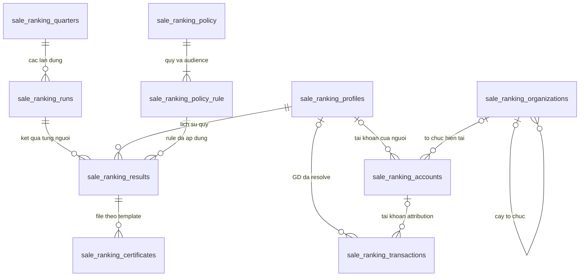
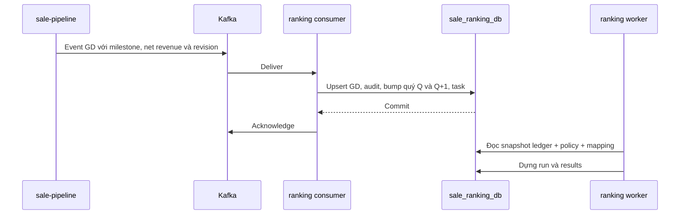

# BDSKD-9531 — Luồng DB và lộ trình triển khai xếp hạng sale

Cập nhật 05/10/2026. [TDD](BDSKD-9531-xep-hang-sale-theo-doanh-so-TDD.md) định nghĩa kiến trúc; tài liệu này đi theo từng lần đọc/ghi DB. Mọi bảng sale_ranking_* thuộc DB riêng sale_ranking_db. Profile-mw chỉ đọc; pipeline Kafka là nguồn GD; không có transaction chung hoặc FK tới core-broker/profile-mw.

## 1. Dữ liệu đi qua những lớp nào?

```text
profile-mw → accounts/organizations → resolve người → profiles
pipeline Kafka → transactions ─────────────────────────────┐
policy API → policy/rules ─────────────────────────────────┤
                                                         ↓
                                   quarter + run + results
                                                         ↓
                         report/export    badge    certificates
```

Ledger là từng GD, result là tổng hợp theo người/quý. Policy là đầu vào tính; run là một lần dựng toàn tập. Báo cáo và badge chỉ đọc run được quarter trỏ tới, không đọc run đang xây dở.

## 2. Bảng, field và quan hệ cần hiểu trước

### 2.1. Người, tài khoản và tổ chức

| Field | Ý nghĩa |
| --- | --- |
| profiles.id | ID nội bộ của người được xếp hạng, giữ qua các tài khoản nếu mapping được xác nhận |
| profiles.stable_source_identity/source | Khóa người ổn định do nguồn/mapping được duyệt cung cấp; không tự suy từ tên/phone |
| profiles.current_account_id | Account chính dùng hiển thị hiện tại; cách chọn khi nhiều tài khoản phải có mapping rõ |
| accounts.agent_profile_id/external_user_id | Agent ID và ID user nguồn; có thể khác nhau |
| accounts.profile_id | Nối account với người; null nếu chưa resolve |
| accounts.audience/organization_id/agency_external_id | Nhóm và tổ chức hiện tại từ bản đọc nguồn |
| accounts.snapshot_hash/synced_at/source_updated_at | Nhận diện nội dung/thời điểm sync; updated_time nguồn không mặc định là revision event |
| organizations.external_org_id/parent_id | ID nguồn và nút cha nội bộ của cây tổ chức; FK chỉ trong DB riêng |

Account giữ field whitelist phục vụ SRS: tên, mã nhân viên/mã định danh, phone/email, status. Không lưu password/token. Source properties chỉ resolve đúng key đã xác nhận, không copy cả JSON. Mã vùng và loại cấp tổ chức cần mapping, không coi office là phòng KD.

### 2.2. Ledger GD

| Field | Ý nghĩa |
| --- | --- |
| source + business_transaction_id | Khóa chuẩn hóa chống trùng GD; eventId không thay khóa này |
| source_sale_id, account_id, profile_id | Sale nguồn, account tương ứng và người hưởng điểm đã resolve |
| agency_at_transaction | Đại lý tại thời điểm phát sinh, giữ khi người đổi đại lý |
| project_id | Dự án để thống kê/filter; không tạo pool xếp hạng riêng |
| confirmed_at/business_date | Timestamp milestone nguồn và ngày phân quý đã chuẩn hóa |
| net_revenue/currency | Giá trị không VAT/KPBT; DECIMAL VND theo contract |
| recognition_status | PENDING/RECOGNIZED/INVALID_CORRECTION: đủ mốc tính hạng hay ghi nhận sai được sửa |
| business_status | Tình trạng vận hành GD như confirmed/canceled; canceled sau xác nhận không loại RECOGNIZED |
| source_revision/event_id/received_at | Bản cập nhật nguồn và dấu vết tiếp nhận |
| resolution_status | PENDING/RESOLVED/FAILED mapping; GD chưa resolve chưa được cộng |

INVALID_CORRECTION chỉ dùng cho correction đã thống nhất, không nhận từ event hủy thông thường. Nếu nguồn chỉ gửi trạng thái GD hiện hành mà không chứng minh từng tới milestone, contract phải bổ sung lịch sử milestone; không suy cancel trước xác nhận thành GD được tính.

### 2.3. Chính sách

Policy header lưu một lần submit, actor, request_id/hash, version. Rule lưu một audience và một quý: hai weights, ba cặp min_score/quota và algorithm_version. Một submit hai audience/hai quý tạo tối đa bốn rule, không bốn policy header.

Ba hạng cố định là field của rule. Không cần bảng master rank hoặc bảng tier động. Lịch sử rule được giữ; result tham chiếu đúng rule đã dùng. Resolver chọn phiên bản đang áp dụng cho mỗi tenant/audience/quý, serialize cập nhật cùng quarter và invalidate run chưa chốt.

### 2.4. Quarter, run và result

| Cấp | Field cần nhớ | Ý nghĩa |
| --- | --- | --- |
| Quarter | state, input_revision, source_complete_through, published_run_id, final_run_id | Kỳ quý và con trỏ kết quả được phép đọc |
| Run | generation, mode, status, input_revision, source_watermark, policy_set_hash, scope_definition | Một lần dựng toàn tập dựa trên đúng snapshot dữ liệu/cấu hình |
| Result | profile_id, previous_revenue, current_revenue, transaction_count, score_raw, numeric_rank, tier | Số liệu/điểm/hạng của người trong run |
| Result snapshot | identity/account/audience/org/agency snapshot, rule_id | Dữ liệu tại lần tính, dùng giải thích hạng và tạo chứng nhận nhất quán |

Quarter state đề xuất OPEN/WAITING_DATA/CLOSING/FINAL/CORRECTION_PENDING. Run mode PROVISIONAL/FINAL/CORRECTION; status BUILDING/READY/PUBLISHED/STALE/FAILED/SUPERSEDED. Không dùng FINAL vừa làm status vừa làm mode.

PROVISIONAL tier=null, FINAL tier=DIAMOND/PLATINUM/GOLD/NONE. Data_status mô tả thiếu dữ liệu riêng. NONE là kết luận sau xét hạng, không phải thay thế thiếu policy/mapping/backfill.

### Quan hệ nội bộ



FK phải cùng tenant. Account/org/profile nguồn không FK xuyên DB. Task/audit dùng entity reference cho nhiều loại việc, không cần FK tới mọi bảng. Index ledger theo tenant/profile/business_date/recognition; report theo run/profile, account/org/search; queue theo status + due time. Result UNIQUE run/profile, account UNIQUE tenant/Agent ID; các unique còn lại theo mục 3 TDD.

## 3. Bootstrap và sync profile-mw

1. Đọc user/user_roles/role và team bằng datasource chỉ đọc. Một user nhiều role phải gom về một account, không nhân dòng khi join.
2. Resolve role/audience/org và khóa Agent ID; gom aliases về người chỉ khi có mapping ổn định được xác nhận.
3. Transaction DB riêng upsert org/account/profile, so snapshot hash và audit thay đổi mapping/đầu vào quan trọng. Chưa resolve giữ account.profile_id null.
4. Nếu mapping mới gắn được GD pending, tạo RESOLVE_TRANSACTIONS task. Nếu đầu vào tính đổi, tăng input_revision và giao việc rebuild các quý cần thiết.
5. Commit rồi cập nhật checkpoint lượt sync. Nguồn gián đoạn giữ bản đọc cũ, không xóa account vì thiếu một trang.

Batch có thứ tự khóa ổn định, không chạy chồng lượt. Quét đối soát toàn bộ vì thay role/team không nhất thiết cập nhật user.updated_time. Không assume enum status/type hoặc user.team varchar chính là team.id int. Tổ chức thiếu parent giữ pending, không nâng quyền toàn hệ thống.

Source name/contact thay đổi không sửa result FINAL hoặc certificate đã phát hành. Đổi đại lý giữ agency_at_transaction trên GD cũ. Quyền đọc hiện tại khác attribution lịch sử; policy quyền khi chuyển tổ chức cần BO xác nhận, không tự làm lộ sale đại lý cũ.

## 4. Ghi policy — US-04

### Một transaction lưu cấu hình

```text
Kiểm tra actor/scope và request_id/hash
  → validate quý current/future, box audience và tỷ lệ/ngưỡng/quota
  → khóa quarter cần thay cấu hình theo thứ tự ngày tăng dần
  → insert policy + rules
  → audit + tăng input_revision + task REBUILD_QUARTER chưa chốt
  → commit
```

Cùng request_id/nội dung trả bản đã tạo, khác nội dung 409. Khóa quarter bảo đảm hai request cùng quý không publish cấu hình tùy ý. Resolver phải có version order xác định; snapshot rule của run không đổi.

Bootstrap policy Q3/2026 bằng job/tool có quyền vận hành và cấu hình BO duyệt, ghi origin BOOTSTRAP/reason/audit. Không mở khả năng sửa quý quá khứ cho UI thường. Thay đổi quý đã chốt chỉ đi qua quy trình correction được chốt riêng.

## 5. Kafka GD: transaction và ảnh hưởng hai quý



Validate ID sale/GD, loại mua sơ cấp, ngày/mốc, giá không VAT/KPBT, currency và revision. Event sai gửi DLT có reason/source reference; ack sau publish DLT thành công. DB lỗi chưa ack. Không tăng count theo message.

Với event hợp lệ, kiểm tra bản hiện hành theo khóa GD; serialize các cập nhật cùng GD. Transaction xác định các quý ảnh hưởng, khóa quarter theo thứ tự ổn định → ghi revision mới/audit → tăng input_revision các quý → tạo task dedupe theo quý/revision → commit. Mọi writer policy/mapping/GD ảnh hưởng cùng quarter dùng cùng cơ chế revision để worker nhận biết thay đổi.

| Thay đổi GD | Quý phải xem lại |
| --- | --- |
| Ghi GD doanh số trong Q | Q và Q+1 |
| Sửa net revenue trong Q | Q và Q+1 |
| Đổi ngày từ Q sang R | Q, Q+1, R, R+1 |
| Đổi người A sang B qua correction | Các quý trên cho cả A và B; xét lại toàn pool vì quota |
| Hủy sau xác nhận, milestone/giá/người không đổi | Giữ doanh số/count; chỉ audit business_status, không rebuild score |
| Duplicate hoặc revision cũ | No-op số liệu; không tạo task mới |

GD chưa resolve vẫn được lưu; quarter bị ảnh hưởng có completeness gap cho tới khi resolve. Không chốt tier NONE từ GD chưa gắn được sale. Khi resolve, khóa GD/quarter, ghi profile/account, tăng revision và task trong một transaction.

Quarter Q2/2026 tồn tại với report_enabled=false để lưu trạng thái completeness và hỗ trợ Q3. Các quarter header còn ngoài phạm vi báo cáo được tạo khi cần invalidate, không tự mở trên UI.

## 6. Tổng hợp và tính điểm

Worker claim task bằng CAS/lease. Đọc DB snapshot nhất quán (đề xuất transaction REPEATABLE READ) để lấy revision, rule set, mapping và tổng doanh số hai quý; ghi input snapshot vào run. Với tác vụ dài, không giữ lock quarter lâu; kết quả BUILDING không được đọc.

Một profile gồm GD của mọi account đã resolve về người đó. Tổng Q theo business_date nằm `[quarter_start, next_quarter_start)`, chỉ RECOGNIZED, RESOLVED, mua sơ cấp đúng contract. Count DISTINCT ID GD nghiệp vụ, SUM net_revenue không nhân dòng qua role/account joins.

```text
score_raw = previous_revenue × weight_previous
          + current_revenue × weight_current
```

Không lấy score quý trước để nhân tiếp; phải lấy **doanh số gốc** quý trước. Không lấy số đã làm tròn ở UI. Sale không có GD trong nguồn đã đủ vẫn có result count/revenue=0 để xuất hiện trong toàn tập cần báo cáo.

Tập người được đưa vào run và audience dùng khi tính cần snapshot theo luật đã chốt. Đề xuất dùng audience ở thời điểm chốt, cộng GD hai quý xuyên tài khoản; việc chuyển audience có thay policy áp dụng không cần BO xác nhận. Quý đã chốt không tự đổi hạng do account mới đổi team/audience.

## 7. Xét hạng và chốt quý

### Thuật toán đề xuất, chưa tự bật production

Cạnh tranh trên pool đã được BO xác nhận, toàn bộ dự án/đại lý; không dựa trên scope/filter người gọi. Có policy riêng audience chưa đủ kết luận quota riêng audience; phải chốt pool_definition trước FINAL.

Trong một pool, phương án đề xuất xét hạng cao xuống thấp, min_score trước rồi quota, mở rộng mọi tie tại score biên, bỏ người đã được cấp khỏi các tầng sau. Lưu algorithm_version/cutoff score của mỗi tầng trong run metadata để giải thích kết quả. Cách quota tầng sau dịch chuyển khi tầng trước vượt do ties và khi ít người đủ ngưỡng cần BO phê duyệt.

Numeric rank có thể lưu competition rank; tier là danh hiệu, không phải số thứ tự STT trên bảng. Không phá tie score bằng tên/Agent ID. Sort tên chỉ phục vụ UI.

### Gate trước chốt

Kết thúc quý không tự bảo đảm nguồn đủ. Phải có policy, mapping người, đủ dữ liệu Q−1/Q và source completeness/watermark theo SLA T−1. Nếu source báo missing hoặc previous quarter có correction ảnh hưởng chưa xử lý, giữ WAITING_DATA/CORRECTION_PENDING và không phát certificate mới sai dữ liệu.

### Transaction publish

1. Dựng run/results BUILDING với snapshot đầu vào; kiểm tra số row, tổng count/revenue và tier distribution.
2. Khi sẵn sàng, khóa quarter, so input_revision và policy_set_hash với snapshot. Sai thì đánh run STALE và giao việc lại.
3. Đúng thì chuyển run mode FINAL/status PUBLISHED; result của run bất biến. Quarter state FINAL và published_run_id/final_run_id cùng trỏ run.
4. Ghi audit chốt, tạo certificate PENDING cho DIAMOND/PLATINUM/GOLD, đánh task hoàn tất; commit tất cả cùng transaction.
5. Certificate worker tạo file sau commit. Không gọi renderer/storage trong transaction chốt.

Run cũ giữ phục vụ truy nguyên. Một run quý gồm toàn tập pool; không publish từng phần/20 người theo trang. Crash trước publish chỉ để run chưa được trỏ tới, không để bảng công khai có hạng nửa cũ nửa mới.

### Sửa dữ liệu sau chốt

Ledger correction được lưu/audit, quarter CORRECTION_PENDING giữ final_run cũ. Không tự đổi badge/cert ngay khi nhận Kafka. Nếu PO cho phép hồi tố, tác vụ có actor/reason dựng CORRECTION run và publish nguyên tử, đổi final_run_id/published_run_id và quarter về FINAL, đánh certificates cũ SUPERSEDED và tạo bản mới. Không xóa lịch sử quý/chứng nhận cũ. Quy định tải và thu hồi các file cũ cần PO chốt.

## 8. Dữ liệu được đọc thế nào?

### List/filter/export

Identity/tenant/scope → account snapshot hiện tại được phép xem → result từ quarter pointer của từng quý → search/filter → sort toàn tập → paging. Một người nhiều account không nhân hai dòng. Khi chọn tối đa bốn quý, quarter cũ trước, thứ tự kết quả ổn định bằng tên + profile ID; numeric sort có sortQuarter.

Không gọi profile-mw cho từng dòng; nguồn chậm trả synced_at/dataAsOf. Quyền cần scope tin cậy chưa resolve hoặc quá hạn thì từ chối. Việc dùng tổ chức hiện tại để xem kết quả lịch sử qua chuyển đại lý phải theo scope rule được chốt, không bỏ kiểm tra vì đã có file/cached result.

Filter dự án nếu bật: count/revenue từ ledger trong project được chọn; score/tier giữ từ result toàn dự án. Không dùng scope hẹp hoặc filter status để chạy lại quota. Filter tier đa quý theo ANY/ALL/rankQuarter sau khi PO chốt.

Export dùng cùng query, snapshot đọc nhất quán cho file và row count, giới hạn 50.000 sale rows theo sort; trên giới hạn thì cắt và ghi truncated=true. Audit ghi total/exported/filter/quarters/run versions/file reference. File không chứa số liệu ngoài scope; re-check quyền khi tải nếu dùng link lưu trữ.

### Badge

Server tính quý trước: đầu Q4/2026 → Q3/2026, đầu Q1/2027 → Q4/2026. Đọc final_run_id đúng quý + profile chính chủ. Nếu chưa FINAL thì PENDING/no badge; không trả badge quý cũ thay thế. Cache key có quý và run version.

### Chứng nhận

Queue là certificate rows. Worker claim PENDING hoặc retry đến hạn bằng lease → kiểm tra result còn được công nhận → render snapshot tên/quý/hạng và template version → upload object key idempotent → transaction lưu READY/hash/reference. Nếu run bị correction thay thế trong lúc render, kiểm tra lại trước READY; bản cũ đánh SUPERSEDED, không trả như hiện hành.

Crash sau upload trước DB commit thì retry cùng object key/nội dung; không tạo certificate mới cho cùng result/template/format. Lỗi file không làm mất tier đã chốt. Download kiểm owner profile và trạng thái hiện hành, tạo signed URL ngắn hạn; format PNG/JPEG, không tự đổi PDF.

## 9. Ví dụ đọc row trước–sau

Ví dụ minh họa, không là cấu hình production. A có account X ở đại lý D1 và Y ở D2; nguồn đã xác nhận cùng stable profile P. Policy Q3 tỷ lệ 30/70.

| Mốc | Ledger/mapping | Result/quarter | Badge/cert |
| --- | --- | --- | --- |
| Bootstrap | X,Y → P; Q2 doanh số 10 tỷ qua X | Q2 chỉ input, report_enabled=false | Chưa công nhận |
| Q3 có GD G1 | G1 qua Y, agency_at_transaction=D2, 20 tỷ | Q3 PROVISIONAL: doanh số 20 tỷ, điểm 17 tỷ, count=1 | Không có badge Q3 |
| G1 bị hủy sau xác nhận | RECOGNIZED giữ nguyên, business_status=CANCELED | Score/count giữ nguyên | Không thu hồi vì cancellation |
| Nguồn đủ sau 30/09 | Policy/pool/ties đã duyệt, Q2/Q3 đầy đủ | FINAL run F1; giả sử P đạt GOLD | Trong Q4 badge Q3=GOLD, cert PENDING→READY |
| G1 được correction giá 18 tỷ | Revision mới, ledger 18 tỷ | Q3 CORRECTION_PENDING; điểm đề nghị mới 15,6 tỷ; Q4 cũng invalidate | Giữ F1 đến khi correction được duyệt |
| Đầu Q1/2027 | Không tự đổi ledger | Badge tham chiếu Q4/2026 | Q4 chưa FINAL thì chờ; không giữ badge Q3 |

Ví dụ biên quota: quota Kim cương=2, score A=100, B=90, C=90 và đều đạt ngưỡng. Theo đề xuất tie-inclusive, cả ba Kim cương; quota có thể vượt. BO cần duyệt và chốt cách xét Bạch kim sau đó. D không đạt min_score vẫn không được Kim cương dù còn quota trống.

## 10. Triển khai từng tính năng

| Bước | Phần làm trong service/DB riêng | Kiểm chứng trước đi tiếp |
| --- | --- | --- |
| 1 | Repo/deployment/DB/identity/secret | Không datasource/API/dependency core-broker; tenant/scope fail closed |
| 2 | Profile adapter + accounts/org/profiles | User nhiều role không trùng, sync retry, inactive giữ lại, mapping người xuyên Agent ID |
| 3 | Kafka GD + ledger/audit/task | Milestone/giá đúng; duplicate/revision/cancel/correction/DLT/resolution đúng |
| 4 | Policy/history — US-04 | Quý current/future, version/rule audience, idempotency; bootstrap Q3 có audit |
| 5 | Tổng hợp hai quý/điểm tạm tính | Q3 cần Q2, score từ doanh số gốc, DECIMAL, count không nhân join |
| 6 | List/search/filter — US-01/02 | Scope, page20, đa quý/sortQuarter, trạng thái provisional/pending rõ |
| 7 | Excel — US-03 | Chỉ 21 không export, full filter, 50.000/50.001 cắt đúng, template đã đối chiếu |
| 8 | Chốt/quota/ties/rebuild | BO duyệt pool/algorithm; nguồn đủ; publish nguyên tử và input đổi không publish cũ |
| 9 | Badge — US-05 | Đúng quý trước/owner, reset đầu quý khi kết quả chưa có |
| 10 | Certificate — US-06 | Template chính thức, PNG/JPEG, owner ACL, retry/storage/correction không trả file cũ |
| 11 | Shadow đối soát/UAT/rollout | Ba nhóm, đổi đại lý, nguồn Q2/Q3 đủ, số liệu/certificate được BO nghiệm thu |

Task/file/source backfill dùng môi trường test/fixture phù hợp; không chèn GD giả vào staging. Chưa làm code trong đợt viết tài liệu này. Thông số quota/ngưỡng/tỷ lệ production phải được duyệt, không lấy từ ví dụ tài liệu.
