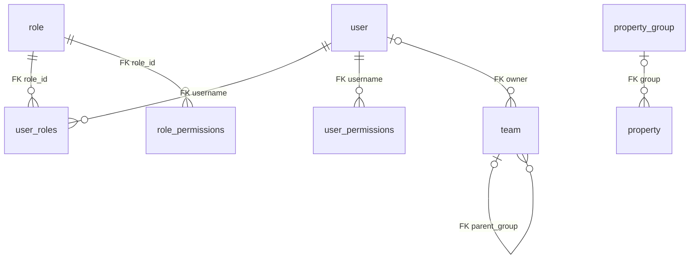

# BDSKD-9531 — Schema profile-mw và luồng đọc hồ sơ cho xếp hạng

Cập nhật 05/10/2026. Dùng lại metadata MySQL vhm-profile đã khảo sát trong bộ 9533: 24 bảng, 231 cột, 9 FK vật lý tại 7 bảng. Không đọc lại row tài khoản hoặc kết nối DB trong đợt 9531.

[Cột, kiểu dữ liệu, index, generated expression và FK đầy đủ của 24 bảng](../9533/BDSKD-9533-theo-doi-chu-ky-ban-hang-schema-vhm-profile.md#10-schema-chi-tiết-danh-sách-bảng) nằm trong snapshot nguồn đã có. Liên kết này chỉ tái sử dụng tài liệu metadata, không tạo runtime dependency tới service 9533. Bản 9531 dưới đây giải thích phần phục vụ ranking, tránh chép lại schema 899 dòng rồi hai bản lệch nhau.

## 1. Những bảng cần cho adapter 9531

| Bảng | Một row là gì? | Field/quan hệ liên quan |
| --- | --- | --- |
| user | Một tài khoản nguồn | id bigint PK, username UNIQUE, full_name generated, employee_id UNIQUE nullable, phone/email, status, properties, team/region/department varchar, cobroker_profile_id |
| user_roles | Một role gán cho username | PK role_id + username; FK tới user.username và role.role_id |
| role | Một role nguồn | role_id PK, role_name/title/status; mã enum theo SRS cần đối chiếu |
| team | Một đơn vị tổ chức | id int PK, alias UNIQUE, parent_group FK → team.id, owner FK → user.username, type/status, region/department, tax_code/properties |
| permission_setting | Cấu hình action/scope nguồn | teams/roles/users/list_team_manage JSON; không FK tới các phần tử JSON |
| user_permissions | Quyền gán trực tiếp cho user | username FK → user.username, permission; priority với role/action chưa xác minh |
| role_permissions | Quyền theo role | role_id FK → role.role_id, permission |
| property/property_group | Định nghĩa field động | alias/entity_type/section, group FK → property_group.id; giá trị nằm trong user.properties |
| team_distribute_setting | Setting theo team | team_id UNIQUE và project_ids/managed_team_ids/owners JSON; liên kết logic với team, chưa có FK |

Các bảng session/OAuth/token/password không cần cho báo cáo. Identity service kiểm tra JWT/chữ ký theo hợp đồng, không đọc session hoặc mật khẩu user để xác thực request ranking.

## 2. Quan hệ vật lý và quan hệ cần mapping



user.team/region/department không có FK tới team trong metadata. user.cobroker_profile_id không có FK xuyên service. permission_setting JSON và project_ids không có FK danh mục. Không vẽ những liên kết này thành quan hệ đã bảo đảm vật lý.

Team tree có parent_group, nhưng owner không tự cho phép xem mọi dữ liệu subtree. Mã type/status chưa có enum mapping đầy đủ; không tự dùng status=1 nghĩa Active nếu nguồn chưa xác nhận.

## 3. Flow đọc và đồng bộ

```text
user → gom role qua user_roles/role → lọc tập sale SRS
     → resolve user.team/region/department theo mã/ID đúng
     → team.parent_group xác định bộ phận/vùng
     → resolve Agent ID và stable person mapping
     → upsert accounts/org/profiles trong sale_ranking_db
```

Đọc datasource MySQL chỉ đọc, ghi datasource PostgreSQL riêng. Không join xuyên DB. Mỗi user nhiều role tạo một account. Dùng field whitelist, không SELECT * toàn bộ user hoặc properties vì nguồn có credential/field không phục vụ SRS.

Full_name/name_slug là generated nên adapter đọc giá trị nguồn, không cập nhật generated column. user.updated_time và team.updated_time là bigint, phải xác nhận đơn vị trước cursor incremental; thay role/team có thể không đổi user.updated_time. Vì vậy batch sync có quét đối soát đầy đủ, snapshot hash và lượt không chồng nhau.

Chỉ cập nhật snapshot người/tổ chức từ nguồn; result FINAL và certificate dùng snapshot đã công nhận. Snapshot nguồn chậm có synced_at; quyền không resolve không mở global.

## 4. Field dễ bị hiểu sai

| Field | Không tự coi là |
| --- | --- |
| user.username | Khóa người ổn định xuyên mọi Agent ID; cần mapping |
| user.employee_id | Khóa mọi sale đại lý và nội bộ; nullable và semantics cần xác nhận |
| user.cobroker_profile_id | ID tài khoản Agent, mã định danh CCCD hoặc ID đại lý |
| user.sale_score JSON | Lịch sử điểm/hạng quý 9531 có policy/version |
| user.sales_member_tier | Kim cương/Bạch kim/Vàng; comment nguồn là 1=A, 2=B, 3=C, 4=D |
| user.hire_date | Ngày phát sinh GD hay điều kiện xếp hạng |
| team_distribute_setting.project_ids | Danh mục tên dự án đầy đủ; đây chỉ là JSON ID |
| permission_setting.list_team_manage | Quyền không giới hạn; cần rule allow/deny/priority |

Không ghi score/tier/badge vào các field nguồn này. Badge/certificate đọc kết quả API service xếp hạng.

## 5. Liên hệ với DB mới

| Nguồn | Bản đọc trong DB mới | Không đồng bộ |
| --- | --- | --- |
| user + user_roles/role | Account snapshot, audience/mapping và scope tối thiểu cần dùng | password/token/session, toàn bảng role/permissions |
| team | organizations và organization reference của account | Setting phân phối không cần cho ranking |
| properties + property definitions | Các key mã định danh/đại lý được xác nhận theo SRS | Toàn bộ JSON hoặc field secret không cần thiết |

Ledger GD, policy, quarters/runs/results và certificates hoàn toàn do service mới sở hữu. Schema profile không thay các bảng này; metadata nguồn chỉ giúp adapter lấy thông tin sale đúng.

[Mapping field 9531](BDSKD-9531-xep-hang-sale-theo-doanh-so-doi-chieu-DB.md) ghi những key/mã/contract còn cần đặc tả. [Luồng DB](BDSKD-9531-xep-hang-sale-theo-doanh-so-luong-du-lieu-va-lo-trinh.md) mô tả transaction đồng bộ và mapping.
