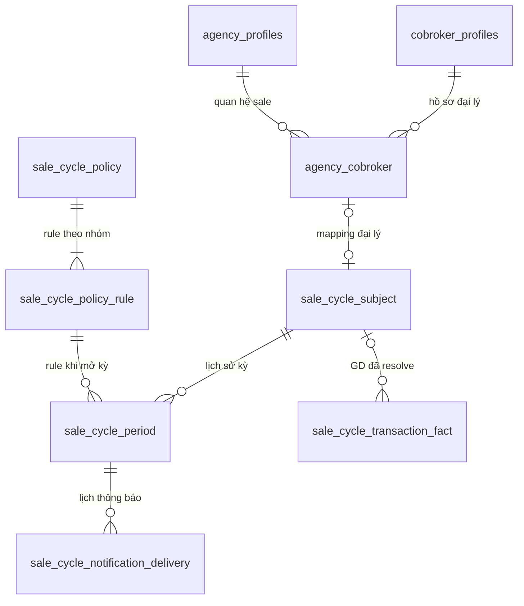

# BDSKD-9533 — Phân tích DB và lộ trình triển khai từng tính năng

Ngày cập nhật: 05/10/2026.

**Đọc tài liệu này trước khi implement.** Mục tiêu là hiểu dữ liệu đến từ đâu, lưu ở đâu, thay đổi thế nào và tính năng nào làm trước. Schema chi tiết, API và hợp đồng tích hợp nằm trong [thiết kế kỹ thuật](BDSKD-9533-thiet-ke-ky-thuat.md); nghiệp vụ nằm trong [guide SRS](BDSKD-9533-dev-guide.md).

Đối chiếu code staging `31444ce6` và kết quả kiểm tra chỉ đọc schema `cobroker_db` ngày 05/10/2026. Chưa kiểm tra DB CMS/SAP/Housing. Tất cả bảng `sale_cycle_*` dưới đây là **đề xuất mới**, chưa có trong DB hiện tại. Các luật D01–D10 vẫn cần xác nhận như mục 2 tài liệu kỹ thuật.

## 1. Kết luận về dữ liệu trước khi viết code

Để tính chu kỳ cho một sale, cần đủ ba đầu vào:

1. **Sale nào và bắt đầu bán ngày nào:** định danh tài khoản, nhóm đối tượng, ngày bắt đầu bán.
2. **Áp dụng chính sách nào:** số tháng và chỉ tiêu chính thức/thử thách, ngày hiệu lực, cơ chế áp dụng.
3. **Sale có những GD hợp lệ nào:** mã GD chống trùng, người hưởng chỉ tiêu, ngày nghiệp vụ và trạng thái/revision.

Chu kỳ là **kết quả được tính từ các đầu vào đó**, không phải trường để admin nhập thủ công. Room và thông báo dùng kết quả đã tính.

DB hiện tại có nhiều dữ liệu hồ sơ/đại lý/room, nhưng chưa đủ ba đầu vào trên. Vì vậy không bắt đầu bằng cron chuyển trạng thái hoặc query đếm căn SOLD rồi coi đó là số GD của sale.

## 2. DB hiện tại có gì và thiếu gì?

| Dữ liệu cần | Bảng/nguồn hiện có | Có thể dùng | Phần còn thiếu |
| --- | --- | --- | --- |
| Hồ sơ cá nhân | `cobroker_profiles` | ID hồ sơ, tên, liên hệ, mã định danh, trạng thái, liên kết submission | Chưa có ngày bắt đầu bán chuyên biệt |
| Tài khoản sale tại đại lý | `agency_cobroker` | `agent_profile_id`, `cobroker_profile_id`, `agency_profile_id`, role dạng mảng, trạng thái quan hệ | Chưa có dữ liệu chu kỳ |
| Đại lý/vùng | `agency_profiles` | Tên đại lý, team/vùng theo cấu trúc hiện có | Phải xác nhận mapping vùng chủ quản và quyền người xem |
| Quá trình xác thực | `cobroker_applicant_agencies_submission`, `identity_verification_history` | Dấu vết approve/OCR/eKYC/manual | Phải xác định sự kiện đầu tiên thực sự chuyển sang Đã xác thực; không lấy mọi lần approve làm ngày bắt đầu mới |
| O2O/Tự doanh | CMS/profile, nguồn ngoài core | Cần nhận tài khoản, role, org, ngày bắt đầu bán | Chưa xác minh hợp đồng nguồn và field Ngày BC; DB core hiện tại không chứng minh đã có đủ đối tượng |
| GD bán căn | `sale_batch_units` và luồng `PropertySoldProcessor` | Trạng thái căn, thời điểm ký/bán, đại lý ghi nhận | Chưa có attribution từng sale trong DTO đang xử lý; chưa xác nhận khóa GD chuẩn hóa TTĐC/TTKQ |
| Sale đăng ký dự án | `user_registered_scope` | Username, dự án, trạng thái scope phục vụ room | Đăng ký dự án không phải GD bán |
| Room | Bảng/luồng phân phối hiện tại, `RoomServiceImpl` | Công thức room theo số sale hợp lệ | Chưa loại sale thử thách theo chu kỳ |
| Thông báo | Notification outbox hiện tại | Hẹn giờ, handler, retry theo convention repo | Row gửi xong bị xóa; cần lịch sử gửi bền vững chống enqueue lại |

### Ba định danh không được trộn

| Khóa | Đại diện cho | Dùng trong tính năng này |
| --- | --- | --- |
| `cobroker_profiles.id` | Hồ sơ con người | Đọc thông tin cá nhân |
| `agency_cobroker.id` | Quan hệ con người với đại lý | Đọc role/đại lý/trạng thái việc làm |
| `agency_cobroker.agent_profile_id` | Tài khoản Agent tại quan hệ đó | Khóa đối chiếu GD, receiver thông báo và subject theo dõi |

`cobroker_profiles.account_id` không được mặc định coi là `agent_profile_id`. Code hiện tại mô tả chuyển đại lý sẽ tạo Agent profile mới. Đề xuất D02 theo dõi theo tài khoản Agent; việc nối lịch sử khi chuyển đại lý phải được PO xác nhận.

## 3. Cần thêm những bảng nào?

Chia thành ba lớp để biết bảng nào là đầu vào, bảng nào là kết quả và bảng nào giao việc.

| Lớp | Bảng đề xuất | Một row là gì? | Ai ghi? |
| --- | --- | --- | --- |
| Đầu vào | `sale_cycle_subject` | Một tài khoản sale được theo dõi; thông tin tổ chức/ngày bắt đầu và các con trỏ kết quả | Profile/CMS sync, start-date service; engine chỉ ghi phần kết quả |
| Đầu vào | `sale_cycle_policy` | Một lần lưu cấu hình, có ngày hiệu lực và cơ chế áp dụng | Policy service, operator có quyền khi nhập chính sách ban đầu |
| Đầu vào | `sale_cycle_policy_rule` | Quy tắc cho một nhóm trong một policy | Policy service |
| Đầu vào | `sale_cycle_transaction_fact` | Một GD đã chuẩn hóa, với revision mới nhất và sale hưởng chỉ tiêu | Adapter nguồn GD |
| Kết quả | `sale_cycle_period` | Một giai đoạn chính thức hoặc thử thách của một sale | Cycle engine/rebuild |
| Kết quả | Các field classification/pointers/revision trên subject | Hiện trạng báo cáo và room đã publish | Cycle engine/rebuild |
| Giao việc | `sale_cycle_task` | Một việc evaluate/rebuild/recalc-room có retry | Service ghi cùng transaction; worker xử lý |
| Giao việc | `sale_cycle_notification_delivery` | Một lần thông báo dự kiến/đã gửi/hủy | Planner và delivery handler |
| Truy nguyên | `sale_cycle_audit` | Một thay đổi và before/after | Các service thay đổi dữ liệu |
| Truy nguyên | `sale_cycle_export_log` | Một lần tạo file xuất | Export service |

Subject có hai phần: **đầu vào** như ngày bắt đầu/tổ chức và **kết quả** như classification/con trỏ kỳ. Không cho sync hồ sơ cập nhật nhầm phần kết quả của engine.

### Quan hệ dữ liệu



Sơ đồ biểu diễn quan hệ logic; FK cụ thể theo thiết kế kỹ thuật. Subject O2O/Tự doanh không bắt buộc có `agency_cobroker`. Fact chưa resolve có thể chưa có subject, nhưng phải được lưu để đối soát.

### Ràng buộc DB cần có ngay từ bước nền tảng

- UNIQUE subject theo `agent_profile_id`.
- UNIQUE fact theo `(source, business_transaction_id)`; không dùng eventId làm khóa GD.
- UNIQUE rule theo `(policy_id,audience)` và `(audience,effective_date)`; ngày rule phải khớp policy cha qua composite FK.
- UNIQUE period theo `(subject_id,generation,sequence_no)`; partial UNIQUE mỗi subject chỉ có một kỳ CURRENT.
- UNIQUE task/delivery theo dedupe key; retry không tạo thêm side effect tương đương.
- Ngày nghiệp vụ dùng `date`; thời điểm sự kiện/audit dùng `timestamptz`. Số ngày còn lại tính khi đọc, không lưu rồi trừ bằng cron.

## 4. Luồng DB: dữ liệu đi vào và thay đổi như thế nào?

### 4.1. Luồng một sale được đưa vào theo dõi

```text
Đại lý: agency_cobroker + cobroker_profiles + agency_profiles
O2O/Tự doanh: snapshot profile/org từ CMS
                  ↓ resolve tài khoản + audience
sale_cycle_subject: upsert theo agent_profile_id
                  ↓ chưa có ngày hoặc policy
monitoring_status = MISSING_START_DATE / MISSING_POLICY
                  ↓ đã có đủ đầu vào
sale_cycle_task: EVALUATE_SUBJECT
                  ↓ engine
sale_cycle_period + kết quả trên subject
```

Upsert giữ `id` subject ổn định và không nhân bản theo mỗi lần sync. Account inactive vẫn có subject và vẫn chạy chu kỳ theo SRS. Chỉ đổi audience/ra khỏi phạm vi khi có dữ liệu nguồn và luật đã xác nhận, không xóa lịch sử để làm mới.

**Kiểm chứng DB:** mỗi Agent ID có tối đa một subject; đọc lại được hồ sơ/đại lý nguồn; thiếu ngày thì chưa có kỳ và chưa bị phân loại thất bại.

### 4.2. Luồng ghi và sửa ngày bắt đầu bán — US-06

**Ghi lần đầu:** sự kiện hoàn thành xác thực đại lý/CMS/import → resolve subject → ghi `start_date`, `start_date_source` → audit → enqueue evaluate, trong cùng transaction.

**Admin sửa ngày:** khóa subject → kiểm tra quyền/version → ghi ngày mới và manual override → audit before/after → đặt REBUILDING → enqueue rebuild → commit.

Worker dựng lại các kỳ từ facts và policy history, rồi publish kết quả mới. Trong lúc tính lại, báo cáo chỉ rõ stale/rebuilding và giữ projection cũ; chưa tác động room theo kết quả dở dang.

Không lấy `created_at` hồ sơ làm ngày bắt đầu nếu chưa có nghiệp vụ xác nhận. Xác thực lại không tự reset ngày; CMS sync không ghi đè manual override của đại lý. Cần xác nhận mapping xác thực lần đầu trước backfill từ lịch sử.

### 4.3. Luồng lưu cấu hình — US-04

```text
POST policy → validate + khóa cấp version
            → insert sale_cycle_policy
            → insert từng sale_cycle_policy_rule
            → insert audit → commit
Ngày tới hiệu lực → policy scheduler enqueue subject thuộc audience
```

Một box chọn hai nhóm tạo hai rule. Kỳ đã mở giữ rule/target/date đã chốt khi mở; không join rule mới nhất rồi đổi thời hạn của kỳ cũ. Lookup rule theo audience và ngày bắt đầu kỳ.

Nếu ngày bắt đầu sale nằm trước policy sớm nhất đã nhập: MISSING_POLICY, cần operator nhập chính sách lịch sử có audit. Không đem cấu hình tương lai áp ngược để lấp dữ liệu thiếu.

### 4.4. Luồng nhận GD cá nhân

```text
Nguồn GD → chuẩn hóa khóa GD + sale + ngày + qualification + revision
         → upsert sale_cycle_transaction_fact
         → audit thay đổi
         → enqueue task cho sale bị ảnh hưởng → commit → acknowledge
```

Cùng GD qua TTĐC/TTKQ phải có một businessTransactionId chuẩn hóa. Revision thấp hơn bị bỏ qua; cùng revision khác nội dung đưa vào conflict. Hủy GD giữ tombstone/revision, không xóa row để event cũ có thể khôi phục GD.

Nếu chưa tìm thấy sale: lưu UNRESOLVED và chưa cộng vào chỉ tiêu. Nếu đổi người hưởng: giao việc cho cả subject cũ và mới. Nếu ngày GD thuộc kỳ đã đóng: rebuild theo D06; không chỉ cập nhật kỳ hiện tại.

**Điều kiện trước adapter thật:** có mẫu payload và xác nhận khóa chống trùng, attribution, ngày tính chỉ tiêu, trạng thái đủ điều kiện, revision và luật hủy. Có thể kiểm thử engine bằng fixtures ở DB test trong lúc chờ, nhưng không coi fixtures là tích hợp SAP hoàn tất.

### 4.5. Luồng engine ghi kết quả — US-01

Trong một transaction cho từng subject: khóa subject → đọc startDate/policy/facts → tính → ghi period → cập nhật pointers/classification/revision → ghi audit/task/delivery intent → commit.

| Sự kiện | Ghi `sale_cycle_period` | Ghi subject |
| --- | --- | --- |
| Đủ dữ liệu lần đầu | Tạo OFFICIAL CURRENT | Con trỏ chính thức, chưa đạt/đạt theo GD |
| Chính thức đạt giữa kỳ | Cập nhật count; giữ ngày kết thúc | OFFICIAL_MET; chưa tạo kỳ mới |
| Hết chính thức đạt | Đóng kỳ cũ COMPLETED, tạo OFFICIAL mới | Pointers mới, reset count theo khoảng ngày mới |
| Hết chính thức chưa đạt | Đóng kỳ cũ, tạo CHALLENGE | CHALLENGE, room_excluded theo luật D10 |
| Thử thách đạt ngày D | Ghi achieved/effectiveEnd=D; giữ CURRENT hết ngày D | Vẫn CHALLENGE trong ngày D |
| Ngày D+1 sau đạt thử thách | Đóng thử thách, tạo OFFICIAL | Phân loại chính thức, phục hồi điều kiện room |
| Hết thử thách chưa đạt | Đóng thử thách, không sinh kỳ mới | TERMINATION_PROPOSED; current=null, giữ latest pointers |

Các luật trên theo baseline D01/D05/D10. Khi chuyển kỳ phải đóng CURRENT cũ trước khi tạo CURRENT mới để partial UNIQUE không lỗi. Job trễ phải đi qua toàn bộ mốc đã qua; không chỉ đổi một trạng thái.

Count được tính lại từ facts hợp lệ trong khoảng ngày inclusive hai đầu. Không dùng `count = count + 1` theo mỗi message vì duplicate/hủy/chuyển sale sẽ làm sai.

### 4.6. Luồng rebuild để sửa kết quả quá khứ

Rebuild dùng generation mới. Mỗi checkpoint lưu period BUILDING và input revision; report/room/noti chỉ đọc generation đã publish.

Khi tính xong: khóa subject, kiểm tra input revision → supersede generation cũ → promote generation mới → đổi pointers/classification → audit diff → hủy delivery PENDING cũ → enqueue room nếu exclusion đổi → commit.

Nếu đầu vào đã đổi, dựng lại thay vì publish kết quả cũ. Ledger SENT vẫn giữ; không gửi lại toàn bộ thông báo lịch sử. Luật thay terminal/room vì GD hồi tố phụ thuộc D06.

### 4.7. Luồng báo cáo, room và thông báo

| Chức năng | Đọc dữ liệu | Ghi dữ liệu |
| --- | --- | --- |
| List/filter US-01/02 | Subject + các kỳ qua pointers, trong scope user | Không ghi và không tự chạy engine |
| Export US-03 | Cùng query/scope/sort với list; tối đa 50.000 | Export log |
| Room | Query sale đủ điều kiện cũ + loại subject có room_excluded=true | Room hiện tại qua worker RECALC_AGENCY_ROOM |
| Thông báo US-05 | Period đã publish, policy schedule, delivery chưa gửi | Delivery + outbox; SENT được giữ trong ledger |

Query room hiện tại đếm DISTINCT `user_registered_scope.username`, join `agency_cobroker.agent_profile_id`, lọc link ACTIVE/SALE_MEMBER và profile hợp lệ. Thêm điều kiện chu kỳ vào **query room riêng**, không sửa shared `ACTIVE_LINK_JOIN` khiến các report/điểm khác đổi theo.

Sale chưa có subject không tự bị loại vì JOIN thiếu row. Subject đang rebuild vẫn dùng room projection cũ đến khi publish. Việc room đã cấp/manual room thay đổi ra sao cần PO chốt D10 trước bật.

Room task và notification outbox được giao bền vững từ transaction, worker mới gọi side effect. Gửi thông báo xong giữ delivery SENT; muốn chống duplicate ở khoảng crash sau gửi/trước ghi SENT cần provider idempotency key.

## 5. Ví dụ đọc các row DB xuyên suốt

Giả sử tài khoản `sale-A`, bắt đầu 01/01/2026, policy 4 tháng chính thức/6 tháng thử thách, target mỗi kỳ=1. Đây là dữ liệu minh họa.

| Thời điểm | Facts | Period được publish | Subject |
| --- | --- | --- | --- |
| 01/01 | Chưa có GD | P1 OFFICIAL 01/01–30/04 CURRENT, count=0 | current=P1, official=P1, challenge=null, OFFICIAL_NOT_MET |
| 01/05, hết kỳ chưa đạt | Chưa có GD | P1 COMPLETED NOT_MET; P2 CHALLENGE 01/05–31/10 CURRENT | current=P2, official=P1, challenge=P2, CHALLENGE, excluded=true |
| 10/06, nhận GD hợp lệ | F1 của sale-A ngày 10/06 | P2 count=1, achieved=10/06, effectiveEnd=10/06; vẫn CURRENT | Vẫn CHALLENGE và excluded=true |
| 11/06 | F1 vẫn nằm ngày cuối P2 | P2 COMPLETED MET; P3 OFFICIAL 11/06–10/10 CURRENT, count=0 | current=P3, official=P3, classification=OFFICIAL_NOT_MET, excluded=false |

Báo cáo tại 11/06 trả chính thức P3 và thử thách `-`; P2 vẫn còn trong DB để audit nhưng không hiện ở nhóm thử thách khi sale đang chính thức.

Nếu F1 bị hủy sau đó, fact chuyển REVOKED với revision cao hơn, rồi rebuild theo luật hồi tố đã chốt. Không sửa tay P3 count hoặc xóa P2 để làm dữ liệu trông đúng.

## 6. Triển khai dần: mỗi bước là một phần có thể review độc lập

Thứ tự này đi theo phụ thuộc dữ liệu, **không theo số US**. Có thể làm UI draft song song, nhưng chỉ nối dữ liệu thật khi bước backend tương ứng đã kiểm chứng.

| Bước | Tính năng và phạm vi code | Bảng đọc → ghi | Hoàn thành bước khi |
| --- | --- | --- | --- |
| 1 | Nền subject đại lý: migration subject/audit/task, mapping và upsert; chưa mở kỳ | Hồ sơ/link/đại lý → subject/audit | Chống trùng account; inactive vẫn tồn tại; thiếu ngày hiện đúng lý do; sync không ghi phần kết quả |
| 2 | Ngày bắt đầu — US-06: xem/sửa, nguồn xác thực, preview/import cũ | Xác thực/profile/import → subject/audit/task | Quyền 11/100 sửa, 64 xem; manual override; import retry không trùng; không mặc định ngày tạo profile |
| 3 | Chính sách — US-04: lưu cấu hình, history và operator nhập policy lịch sử | Request cấu hình → policy/rule/audit | Ngày tương lai UI; audience không trùng; bất biến; conflict đồng thời; tìm được rule cho ngày mở kỳ |
| 4 | Danh sách nền: danh tính/ngày/chính sách và scope; chu kỳ chưa tính trả `-` | Subject + policy → response | Scope list/options đúng; dữ liệu thiếu không bị hiển thị thất bại; chưa coi US-01 hoàn tất |
| 5 | Ledger GD cá nhân: migration fact, adapter nguồn, revision/mapping/hủy | Nguồn GD → fact/audit/task | Payload thật đã chốt; replay không đếm đôi; unresolved không cộng; attribution/hủy đúng |
| 6 | Engine kỳ chính thức: tạo/đếm/đạt/đóng/mở chính thức tiếp | Subject/policy/fact → period/subject/task/audit | Đếm từ fact; đạt giữa kỳ giữ hạn; ranh giới ngày và partial UNIQUE đúng; dùng DB test riêng |
| 7 | Engine thử thách/terminal và catch-up | Period/fact/policy → period/subject/task/audit | Fail official mở trial; đạt trial hôm sau official; terminal không mở tiếp; downtime nhiều kỳ tính đúng |
| 8 | Rebuild/hồi tố/reset policy | Input lịch sử → generation mới/subject/audit/task | BUILDING không lộ ra report; publish atomic; không mất thay đổi đồng thời; D04/D06 đã chốt trước bật tác động |
| 9 | Hoàn thiện báo cáo — US-01/02, export — US-03 | Subject/pointers/period → response/XLSX/export log | Hai nhóm kỳ đúng trạng thái; search/sort/paging; cùng scope export; 50.000/50.001 dòng và snapshot |
| 10 | Tích hợp room | Subject/exclusion + scopes/link → room qua task | Có đối soát trước/sau; retry số tuyệt đối; không đổi shared query/điểm; D10 và allocated/manual room đã chốt |
| 11 | Thông báo — US-05 | Period/policy → delivery/outbox | Bốn loại, lịch nhắc, hủy stale, không flood backfill; ledger và crash boundary kiểm chứng |
| 12 | Mở rộng dữ liệu O2O/Tự doanh và rollout toàn scope | CMS/org/GD → cùng subject/fact/engine | Không tạo engine riêng; đúng role/subtree/ngày nguồn; đối soát đủ đối tượng; xác nhận owner room nếu có |

Adapter CMS có thể làm sớm ngay khi hợp đồng nguồn rõ; bước 12 là điều kiện nghiệm thu toàn phạm vi, không có nghĩa mặc định chỉ giao đại lý. Chính sách ở bước 3 vẫn thiết kế đủ ba audience từ đầu.

**Quy tắc làm từng bước:** PR chỉ mang migration/service/API/test cần cho bước đó; mô tả dữ liệu trước/sau và câu query đối soát. Bước chưa có engine chạy thật không được bật room/noti. Test fixtures dùng DB test riêng, không chèn GD giả vào staging.

## 7. Đối soát DB trước khi đi bước tiếp

| Kiểm tra | Kết quả mong đợi |
| --- | --- |
| Group subject theo Agent ID | Không có count > 1 |
| Mapping subject đại lý về link/profile | Không trỏ nhầm người/đại lý; trường hợp thiếu có lý do |
| Subject thiếu startDate hoặc policy lịch sử | Có thống kê riêng, không bị classify không đạt |
| Fact unresolved/conflict | Có danh sách đối soát nguồn và retry, không biến thành GD hợp lệ |
| Count fact qualified trong kỳ so với period count | Khớp theo ngày và generation publish |
| CURRENT period theo subject | Tối đa 1; terminal có 0 |
| Pointers subject | Trỏ đúng subject, đúng kind và generation đã publish |
| Subject đủ dữ liệu nhưng evaluatedDate cũ | Có task/catch-up hoặc lỗi vận hành được theo dõi |
| Room trước/sau exclusion | Chênh lệch giải thích được bằng danh sách sale bị loại |
| Delivery/outbox | SENT có ledger; PENDING có lịch/đường retry; không còn gửi generation đã supersede |

Query đối soát phải dựa trên schema cuối của từng PR, chỉ đọc. Migration production không tự đưa sale vào thử thách; backfill chạy dry-run, xuất diff để kiểm chứng trước bật side effect.

## 8. Những điểm phải chốt, nhưng không cần chặn toàn bộ bước nền

- **Định danh chuyển đại lý/tái gia nhập:** ảnh hưởng việc nối lịch sử; bước 1 có thể làm mapping theo account như D02, phải ghi rõ baseline.
- **Nguồn GD:** thiếu attribution/revision/ngày tính chỉ tiêu thì chưa tích hợp và nghiệm thu bước 5; vẫn làm subject/ngày/policy và engine với fixtures.
- **Ngày 29/30/31, đạt giữa kỳ, trial có GD nhưng chưa đủ:** chốt trước nghiệm thu engine thật.
- **Policy tức thì/hồi tố:** chốt trước bật reset/rebuild có ảnh hưởng nghiệp vụ; không tự biến mode tức thì thành tuần tự.
- **Role vùng/role export/CMS org:** scope chưa resolve thì từ chối quyền đó, không fallback global.
- **Room đã cấp/manual room và nhắc sale đã đạt:** chốt trước bước 10/11 production.

Bước implement đầu tiên là **subject + mapping + audit/task nền**, rồi làm ngày bắt đầu bán. Chưa cần viết toàn bộ engine, room và notification trong cùng một đợt.
