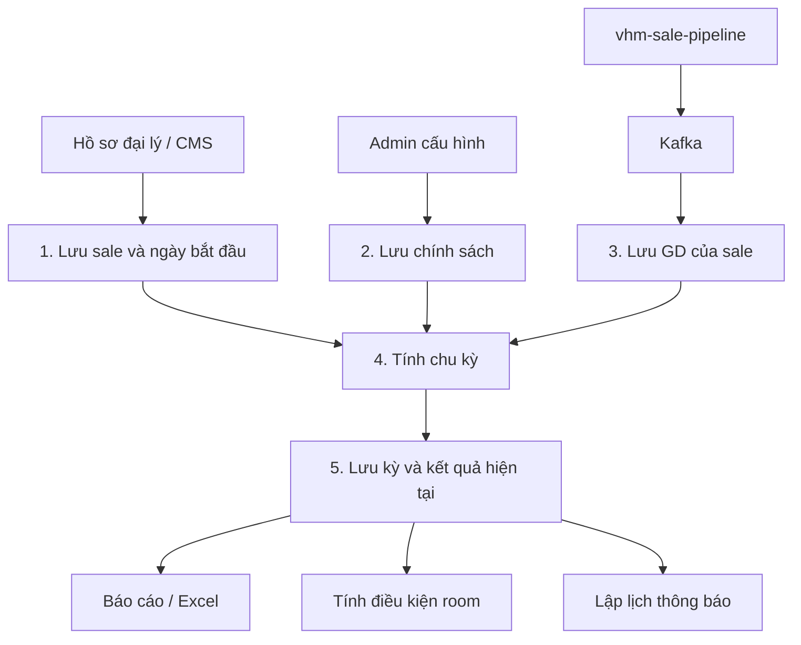
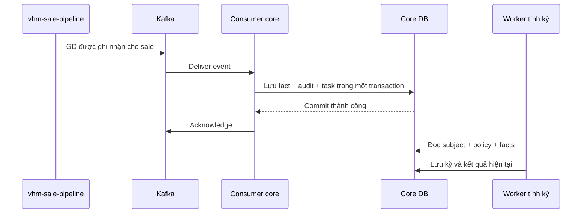

# BDSKD-9533 — TDD triển khai theo luồng dữ liệu

Cập nhật: 05/10/2026. Phạm vi: sáu US trong [SRS](https://vin3s.atlassian.net/wiki/spaces/BMAS/pages/3174532173).

**Thiết kế chính:** core lưu sale, chính sách và GD; tính kết quả chu kỳ từ ba nguồn đó. Báo cáo, room và thông báo đọc kết quả đã tính.

**Nguồn GD đã xác nhận:** `vhm-sale-pipeline` xác định sale có GD, phát Kafka; cobroker-core nhận và lưu. Tên topic/payload cụ thể chưa được cung cấp.

Các bảng `sale_cycle_*` bên dưới là đề xuất mới. Bảng hiện có được đối chiếu code staging `31444ce6` và DB `cobroker_db` ngày 05/10/2026; chi tiết trong [mapping DB](BDSKD-9533-mapping-bang-db.md).

## 1. Luồng tổng thể



Ví dụ: sale A bắt đầu bán 01/01, chính thức 4 tháng và cần 1 GD. Core mở kỳ 01/01–30/04. Pipeline gửi GD của A ngày 10/03; core lưu GD, tính A đã đạt. A vẫn ở kỳ đó đến 30/04, hôm sau mở chính thức mới theo baseline SRS.

## 2. Dữ liệu hiện tại dùng thế nào?

| Bảng/nguồn | Ý nghĩa | Dùng cho 9533 |
| --- | --- | --- |
| `cobroker_profiles` | Hồ sơ một người: tên, định danh, liên hệ | Thông tin cá nhân sale đại lý |
| `agency_profiles` | Hồ sơ một đại lý | Tên đại lý, vùng và liên kết room |
| `agency_cobroker` | Người làm tại đại lý nào; role, trạng thái, tài khoản Agent | Xác định sale đại lý cần theo dõi |
| CMS/profile | Nguồn sale O2O/Tự doanh | Cần lấy tài khoản, role, bộ phận và ngày bắt đầu bán |
| Submission/history xác thực | Quá trình OCR/eKYC/manual | Xác định ngày đầu tiên hoàn thành xác thực đại lý |
| `vhm-sale-pipeline` qua Kafka | GD được ghi nhận cho sale | Đầu vào số GD để tính chu kỳ |
| `user_registered_scope` | Sale đăng ký dự án | Giữ điều kiện đếm sale cho room hiện tại |
| `notification_outbox` | Các thông báo chờ gửi | Dùng lại cơ chế gửi thông báo |

### Khóa nối sale

```text
agency_cobroker.cobroker_profile_id → cobroker_profiles.id
agency_cobroker.agency_profile_id  → agency_profiles.id
agency_cobroker.agent_profile_id   → tài khoản Agent được theo dõi
```

**Đề xuất:** mỗi `agent_profile_id` có một đối tượng theo dõi. Không dùng tên, CCCD hoặc UUID đại lý để nối GD vào sale. Nếu pipeline gửi sale ID thuộc hệ khác thì cần mapping sang Agent ID.

`allocated_to_agency_profile_id`, `distributed_agency_profile_id`, `sold_by_agency_profile_id` trên bảng căn đều là **ID đại lý**, không phải sale cá nhân. Luồng GD của 9533 nhận từ pipeline, không đếm row SOLD trong `sale_batch_units`.

## 3. Cần lưu những bảng nào?

Chia thành dữ liệu đầu vào, kết quả và bảng hỗ trợ. Core không cần tạo tất cả bảng trong PR đầu tiên.

### 3.1. Dữ liệu đầu vào

| Bảng mới | Một row đại diện cho | Field chính |
| --- | --- | --- |
| `sale_cycle_subject` | Một tài khoản sale được theo dõi | `id`, `agent_profile_id`, `audience`, liên kết hồ sơ/đại lý, thông tin tổ chức, `activity_status`, `start_date`, `start_date_source`, `start_date_override` |
| `sale_cycle_policy` | Một phiên bản cấu hình | `id`, `version_no`, `effective_date`, `application_mode`, lịch nhắc, người/thời gian tạo |
| `sale_cycle_policy_rule` | Quy tắc của một nhóm trong policy | `id`, `policy_id`, `audience`, tháng/chỉ tiêu chính thức, tháng/chỉ tiêu thử thách |
| `sale_cycle_transaction_fact` | Một GD pipeline ghi nhận cho sale | `id`, `business_transaction_id`, `agent_profile_id`, `subject_id`, ngày GD, trạng thái ghi nhận/hủy, revision nguồn, event reference |

`audience`: Đại lý, O2O hoặc Tự doanh. Một box cấu hình chọn hai nhóm tạo hai rule. Policy đã lưu giữ nguyên để truy lại cấu hình áp dụng trong quá khứ.

### 3.2. Kết quả tính

| Bảng | Lưu gì? |
| --- | --- |
| `sale_cycle_period` | Một kỳ của sale: chính thức/thử thách, rule áp dụng, ngày đầu/cuối, chỉ tiêu, số GD, ngày đạt, trạng thái đang chạy/đã đóng và kết quả |
| Phần kết quả trên `sale_cycle_subject` | Phân loại hiện tại, con trỏ kỳ hiện tại/chính thức gần nhất/thử thách gần nhất, điều kiện loại khỏi room, thời điểm tính |

Ngày/tổ chức của subject do service hồ sơ/ngày bắt đầu ghi. Kỳ, số GD và phân loại do engine ghi. Không để API hồ sơ sửa trực tiếp kết quả engine.

### 3.3. Bảng hỗ trợ

| Bảng mới | Lý do cần |
| --- | --- |
| `sale_cycle_task` | Lưu việc tính/tính lại/room để có thể retry sau lỗi hoặc restart |
| `sale_cycle_notification_delivery` | Lưu từng mốc thông báo và trạng thái đã gửi; outbox hiện tại gửi xong xóa row |
| `sale_cycle_audit` | Lưu ai sửa ngày/chính sách, GD thay đổi và kết quả trước–sau |
| `sale_cycle_export_log` | Ghi nhận người xuất, filter, số dòng và trạng thái tạo file |
| `sale_cycle_request` | Chống thực hiện lại mutation/import khi cùng request được gửi lại |

### 3.4. Ràng buộc DB tối thiểu

- Một subject duy nhất theo Agent ID.
- Một fact duy nhất theo nguồn + ID GD nghiệp vụ; eventId/Kafka offset không thay ID GD.
- Một rule cho mỗi audience trong policy; đề xuất không trùng audience/ngày hiệu lực giữa các policy.
- Mỗi subject tối đa một kỳ đang chạy; kỳ cũ phải đóng trước khi mở kỳ mới.
- GD countable phải có subject, ngày nghiệp vụ và trạng thái hợp lệ.
- Ngày nghiệp vụ lưu `date`; thời điểm nhận/gửi/audit lưu `timestamptz`; ID bảng mới dùng UUID.

Quan hệ bảng và giải thích chi tiết xem [phân tích DB](BDSKD-9533-db-va-lo-trinh.md#3-cần-thêm-những-bảng-nào).

## 4. Luồng dữ liệu chi tiết

### 4.1. Tạo đối tượng theo dõi sale

```text
Hồ sơ đại lý / snapshot CMS
    → resolve Agent ID và nhóm đối tượng
    → upsert sale_cycle_subject
    → có ngày + policy thì giao việc tính kỳ
```

Đại lý lấy từ link có role SALE_MEMBER, kể cả link kiêm SALE_ADMIN. O2O/Tự doanh lấy từ CMS/profile theo role và tổ chức SRS.

Chưa có ngày bắt đầu hoặc policy phù hợp thì ghi lý do chưa tính, chưa mở kỳ và chưa gán Không đạt. Sale inactive vẫn tiếp tục theo dõi chu kỳ. Sync hồ sơ không tạo subject mới cho mỗi lần cập nhật.

### 4.2. Ghi hoặc sửa ngày bắt đầu bán — US-06

| Nguồn | Cách ghi |
| --- | --- |
| Đại lý mới | Ngày lần đầu hoàn thành toàn bộ điều kiện Đã xác thực |
| O2O/Tự doanh | Ngày CMS cung cấp; field “Ngày BC” chỉ dùng nếu xác nhận đúng nghĩa |
| Tài khoản cũ | Import file Chính sách cung cấp |
| Admin sửa đại lý | Role 11/100; lưu ngày mới, lý do và manual override |

**Cùng một DB transaction:** khóa subject → ghi ngày/nguồn → ghi audit → tạo task tính lại → commit.

Khi sửa ngày, đầu vào đã mới nhưng kỳ cũ chưa tự đúng theo. API trả **Đang tính lại**; worker tính xong mới thay kỳ/phân loại/room. Trong lúc chờ, báo cáo ghi rõ kết quả cũ đang chờ cập nhật.

Không dùng ngày tạo hồ sơ hoặc ngày HĐLĐ thay ngày bán. Xác thực lại không tự reset ngày. Sync tự động không ghi đè ngày đại lý đã được admin sửa.

### 4.3. Lưu chính sách — US-04

```text
Admin lưu cấu hình
    → validate ngày tương lai, nhóm, tháng, chỉ tiêu
    → insert policy
    → insert rule từng nhóm
    → ghi audit → commit
```

**Tuần tự:** kỳ đang chạy giữ quy tắc cũ; kỳ mới chọn rule có hiệu lực tại ngày mở kỳ.

**Tức thì:** baseline đề xuất reset tại ngày hiệu lực, mở chính thức mới; đối tượng reset và GD được giữ lại cần PO chốt trước bật chức năng này.

Nếu sale bắt đầu trước policy sớm nhất đã nhập, cần nhập policy lịch sử. Không lấy cấu hình tương lai áp ngược cho dữ liệu cũ.

### 4.4. Nhận GD từ pipeline qua Kafka



Consumer xử lý theo thứ tự:

1. Kiểm tra payload có ID GD, ID sale, ngày nghiệp vụ và thông tin ghi nhận hợp lệ.
2. Resolve sale nguồn sang `subject_id` bằng Agent ID hoặc mapping đã thống nhất.
3. Upsert fact theo ID GD. Gửi lại cùng GD không tạo thêm GD.
4. Ghi audit và task evaluate/rebuild cho sale bị ảnh hưởng trong cùng transaction.
5. Commit DB xong mới acknowledge Kafka.

Nếu DB lỗi thì retry, chưa ack. Nếu subject chưa có thì lưu fact **chưa resolve**, ack sau commit và gắn lại khi hồ sơ tới. Payload sai đưa vào đường lỗi có lưu bền vững, không bỏ âm thầm.

**Không làm:** mỗi message Kafka tăng count lên 1. Kafka có thể gửi lại; count phải được tính từ những fact hợp lệ đã lưu.

#### Payload cần thống nhất với pipeline

| Thông tin | Dùng để |
| --- | --- |
| ID GD ổn định | Chống đếm trùng khi resend/cập nhật |
| ID sale | Gắn đúng subject; xác nhận có phải Agent ID không |
| Ngày/thời điểm GD được tính | Xác định GD thuộc kỳ nào |
| Ghi nhận hay thu hồi GD | Cộng hoặc loại GD khỏi dữ liệu tính |
| Revision/version cập nhật | Không để event cũ ghi đè bản mới khi replay |
| Event ID và timestamp | Truy nguyên lần phát và theo dõi độ trễ |

Topic, consumer group và tên field chưa có; đây là danh sách thông tin cần chốt, không là payload thực tế. Thiết kế đề xuất event **theo từng GD**. Nếu pipeline gửi tổng GD theo sale thì phải đổi cách nhận/lưu, không coi tổng count là một fact.

### 4.5. Tính kỳ và ghi kết quả — US-01

Worker đọc ba nguồn: **subject + policy/rule + facts**.

Trong một transaction: khóa subject → tính theo ngày xét → đóng/mở/cập nhật period → cập nhật kết quả subject → ghi audit/task room/lịch thông báo → commit. Worker không gọi provider HTTP trong transaction này.

| Điều kiện | Thay đổi period | Kết quả subject |
| --- | --- | --- |
| Chính thức chưa đủ GD, chưa hết hạn | Cập nhật count, giữ kỳ | Chính thức — Chưa đạt |
| Chính thức đủ GD giữa kỳ | Cập nhật count, giữ hạn | Chính thức — Đạt |
| Hết chính thức đã đạt | Đóng kỳ, mở chính thức mới | Phân loại theo kỳ mới |
| Hết chính thức chưa đạt | Đóng kỳ, mở thử thách hôm sau | Thử thách; loại khỏi số sale tính room |
| Thử thách đủ GD ngày D | Ghi ngày đạt D; đóng hết ngày D | Ngày D vẫn thử thách |
| Ngày D+1 | Mở chính thức mới | Khôi phục điều kiện room |
| Hết thử thách chưa đạt | Đóng kỳ, không mở tiếp | Đề xuất chấm dứt; giữ hai kỳ cuối |

Baseline ngày kết thúc = ngày bắt đầu + số tháng − 1 ngày. Count theo GD hợp lệ trong khoảng ngày của kỳ, bao gồm hai đầu. Kỳ mới không mang count của kỳ cũ sang.

Job ngày mới chuyển kỳ dù không có event. Nếu job trễ, tính qua toàn bộ mốc đã qua, không chỉ chuyển một bước. Trước chạy dữ liệu thật phải đối soát GD lịch sử; nguồn chưa backfill không đồng nghĩa sale có 0 GD.

### 4.6. Hủy GD, sửa ngày và tính lại

Pipeline cập nhật/thu hồi GD → core cập nhật fact theo revision → giao task cho subject bị ảnh hưởng. Chuyển GD từ A sang B thì tính lại cả hai.

Rebuild đọc lại ngày bắt đầu, policy lịch sử và facts để dựng chuỗi kỳ mới. Giữ chuỗi cũ phục vụ báo cáo trong lúc dựng. Khi xong, **một transaction** thay con trỏ/phân loại, lưu audit, hủy lịch thông báo cũ chưa gửi và giao việc room nếu điều kiện đổi.

Nếu đầu vào thay đổi trong lúc dựng thì tính lại, không publish kết quả cũ. Giữ lịch sử kỳ và thông báo đã gửi; không tự gửi lại mọi thông báo quá khứ. Quyền hồi tố terminal/room cần PO chốt.

### 4.7. Ví dụ dữ liệu trước–sau

Sale A bắt đầu 01/01/2026; chính thức 4 tháng/1 GD, thử thách 6 tháng/1 GD. P1/P2/P3 là tên minh họa các row kỳ.

| Mốc | Fact | Period | Subject |
| --- | --- | --- | --- |
| 01/01 | Chưa GD, nguồn đã đối soát | P1 chính thức 01/01–30/04, count=0 | Chính thức — Chưa đạt |
| 01/05 | Chưa GD | P1 đóng không đạt; P2 thử thách 01/05–31/10 | Thử thách, excluded=true |
| 10/06 | Pipeline gửi G1 hợp lệ | P2 count=1, ngày đạt=10/06 | Vẫn thử thách hết ngày |
| 11/06 | G1 vẫn thuộc P2 | P2 đóng đạt; P3 chính thức 11/06–10/10, count=0 | Chính thức — Chưa đạt, excluded=false |

Nếu G1 bị thu hồi sau đó, lưu bản thu hồi rồi dựng lại chuỗi kỳ. Theo đề xuất hồi tố, A có thể trở về P2 thử thách. Đây là **thay đổi kết quả nghiệp vụ**, cần luật PO xác nhận; không chỉ trừ count của P3 vì G1 vốn thuộc P2.

## 5. Các tính năng đọc kết quả thế nào?

| Tính năng | Đọc | Ghi / hành động |
| --- | --- | --- |
| List/filter US-01/02 | Subject và period qua con trỏ, trong scope user | Trả trang tối đa 20; GET không tự tính kỳ |
| Export US-03 | Cùng scope/filter/sort của list | Tạo XLSX tối đa 50.000 dòng; ghi export log |
| History US-04 | Policy + rules + lịch nhắc của đúng phiên bản | Chỉ đọc bản đã lưu |
| Room | Điều kiện sale hợp lệ hiện tại + exclusion đã tính | Worker tính lại room theo số tuyệt đối |
| Thông báo US-05 | Period, policy schedule, delivery chưa gửi | Gửi web/app và lưu SENT |

### Quy tắc hiển thị kỳ

- Đang chính thức: hiển thị kỳ chính thức hiện tại; thử thách `-`.
- Đang thử thách: hiển thị chính thức thất bại trước đó và thử thách hiện tại.
- Đề xuất chấm dứt: hiển thị hai kỳ cuối; không có kỳ đang chạy.

### Room

Thêm điều kiện loại sale thử thách vào **query đếm sale cho room riêng**, giữ predicate cũ và DISTINCT Agent ID. Không đổi trạng thái link thành INACTIVE, không sửa shared query làm các báo cáo/điểm khác đổi theo.

Kết quả exclusion được lưu ngay cả khi chưa bật room integration. Khi bật phải recalc các đại lý liên quan. Trong rebuild dùng kết quả đã publish cũ đến lúc thay kết quả mới. Room đã cấp/manual room cần chốt trước rollout.

### Thông báo

Bốn loại: nhắc chính thức, chính thức thất bại sang trial, nhắc trial, trial thất bại đề xuất chấm dứt. Mỗi mốc có delivery riêng; outbox gửi xong thì xóa nhưng delivery SENT giữ lại.

Thử thách đạt sớm thì hủy lịch nhắc/thất bại chưa gửi. Backfill không gửi hàng loạt nhắc quá khứ. Chống gửi trùng sau timeout cần idempotency key phía provider; ledger chỉ chống tạo lại lần gửi đã ghi SENT.

## 6. API và quyền

Base path internal đề xuất: `/internal/v1/sale-cycles`. BFF xác thực user và truyền actor tin cậy; core kiểm tra role/scope server-side.

| API | Chức năng | Quyền |
| --- | --- | --- |
| GET `/` | List/search/sort/filter | 11/100 toàn bộ; 64 đại lý mình; 20/23/60 subtree theo SRS |
| GET `/filter-options` | Tổ chức/trạng thái trong phạm vi xem | Cùng scope list |
| POST `/exports/preview`, `/exports` | Xác nhận số dòng và xuất XLSX | Cùng scope list; role export cần chốt |
| POST `/policies` | Lưu cấu hình | 11/100 theo baseline |
| GET `/policies`, `/policies/{id}` | Lịch sử/chi tiết | 11/100 |
| PATCH `/subjects/{id}/start-date` | Sửa ngày sale đại lý | 11/100; 64 chỉ xem qua profile |
| Import preview/commit | Nhập ngày cũ | Operator/service riêng |

Search tên/Agent ID/mã nhân viên/mã định danh; sort whitelist, mặc định tên A–Z và ID tie-break. Export kiểm tra quyền lại, không tin preview trước đó là quyền xuất.

Trả `ServiceResponse`/`PageDto` theo repo; page 1-based, tối đa 20. File trả XLSX trực tiếp. Các mutation có requestId chống thực hiện lại và expectedVersion khi sửa subject. Lỗi role/org không resolve thì từ chối, không mở global.

## 7. Implement từng bước

| Bước | Làm gì? | Kiểm chứng trước bước tiếp |
| --- | --- | --- |
| 1 | Subject, mapping sale và audit/task nền | Agent ID không trùng; inactive không mất; thiếu dữ liệu có lý do |
| 2 | Ngày bắt đầu — US-06 | Nguồn ngày đúng, ACL/override/import retry; không dùng ngày tạo profile |
| 3 | Policy/history — US-04 | Version/ngày/audience đúng; có policy lịch sử cho sale cũ |
| 4 | Kafka consumer pipeline + fact | Lưu trước ack; resend không đếm đôi; ID sale/GD/ngày đúng; lỗi/mapping thiếu có đường xử lý |
| 5 | Engine chính thức | Count từ fact; đạt giữa kỳ giữ hạn; đúng ranh giới ngày |
| 6 | Trial/terminal + rebuild | Hôm sau trial đạt mới official; không tự sinh kỳ sau terminal; tính lại không lộ kết quả dở dang |
| 7 | List/filter/export — US-01/02/03 | Hai nhóm kỳ đúng; scope/search/sort/paging20; export 50.000/50.001 |
| 8 | Room | Đối soát ngân sách trước/sau; retry không trừ nhiều lần; luật manual/allocated đã chốt |
| 9 | Notification — US-05 | Đúng receiver/mốc/nội dung; SENT giữ ledger; không flood backfill |
| 10 | Đối soát toàn scope và rollout | Đại lý/O2O/Tự doanh đủ dữ liệu; source backfill đủ; engine/room/noti được xác nhận |

Adapter CMS có thể làm sớm khi hợp đồng nguồn rõ; cả ba nhóm dùng cùng engine. Mỗi bước tách PR có migration/service/API/test cần thiết; không bật room/noti trước khi engine và nguồn dữ liệu được đối soát.

Migration chỉ tạo cấu trúc. Nhập ngày/policy/GD cũ chạy job có audit/dry-run; test dùng DB riêng. Giữ feature flags engine/ingest/room/noti; rollback room cần recalc, không chỉ tắt flag.

## 8. Những điểm cần chốt

| Điểm | Ảnh hưởng |
| --- | --- |
| Topic/payload pipeline, per-GD hay tổng count, ID sale/GD, ngày, revision/hủy/replay | Consumer và fact |
| Ngày xác thực lần đầu; nguồn ngày O2O/Tự doanh; ngày 29/30/31 | StartDate và lịch kỳ |
| SRS còn ghi chú đạt official reset hay giữ hạn; trial có GD nhưng chưa đủ | State machine; TDD đang theo baseline giữ official đến hạn và fail khi count < target |
| Policy tức thì reset ai/GD nào; trial mới theo rule nào | Policy resolver |
| Hủy GD/sửa ngày có hồi tố terminal và room không | Rebuild và side effects |
| Chuyển đại lý/tái gia nhập có nối lịch sử không | Subject theo Agent ID |
| Role vùng/role export; lịch nhắc và nhắc sale đã đạt | ACL/notification |
| Room đã cấp/manual room, owner room O2O/Tự doanh | Room rollout |

Nguồn service **đã chốt là vhm-sale-pipeline**; phần chờ là hợp đồng Kafka cụ thể. Các điểm chưa chốt không chặn việc làm nền DB, nhưng phải được xác nhận trước bật tính năng phụ thuộc trên dữ liệu thật.
