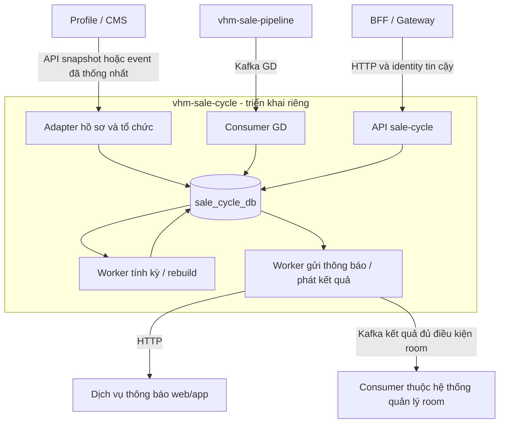
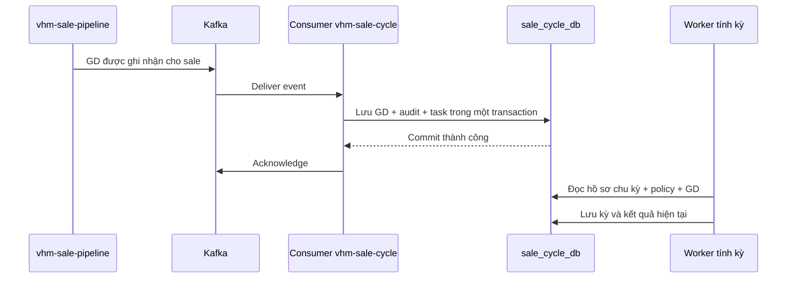

# BDSKD-9533 — TDD theo dõi chu kỳ bán hàng và cảnh báo ngưng hợp tác

Cập nhật: 05/10/2026. Phạm vi: sáu US trong [SRS](https://vin3s.atlassian.net/wiki/spaces/BMAS/pages/3174532173).

**Kiến trúc đã chốt:** triển khai một service riêng, tên đề xuất `vhm-sale-cycle`, có repository, artifact, cấu hình, DB, migration và worker riêng. Service không import code/thư viện nghiệp vụ, không gọi API và không đọc/ghi DB của core-broker. Các tài liệu nằm trong repo này chỉ để bàn giao; vị trí file không quyết định nơi triển khai.

**Nguồn tích hợp:** profile/CMS cung cấp sale, tổ chức và ngày bắt đầu; `vhm-sale-pipeline` gửi GD qua Kafka. Hợp đồng API/event profile, topic và payload pipeline chưa được cung cấp. Không coi schema đã khảo sát là API đã tồn tại.

**Đề xuất nền tảng:** PostgreSQL riêng cho dữ liệu chu kỳ; Kafka cho GD và phát kết quả; HTTP cho API báo cáo/cấu hình và tích hợp nguồn. Framework, phiên bản và quy chuẩn response được chọn tại repository mới, không kế thừa mặc định từ core-broker.

## 1. Ranh giới và luồng tổng thể



Room là bên sử dụng kết quả, không phải module trong service mới. Khi bên quản lý room chưa tích hợp, service vẫn nhận dữ liệu, tính kỳ, phục vụ báo cáo và lưu kết quả loại khỏi room. Service không tính ngân sách căn hoặc cập nhật bảng room.

Ví dụ: sale A bắt đầu 01/01, chính thức 4 tháng và cần 1 GD. Service mở kỳ 01/01–30/04. Pipeline gửi GD ngày 10/03; service lưu GD, tính A đã đạt. A vẫn ở kỳ đó đến 30/04, hôm sau mở chính thức mới theo baseline SRS.

## 2. Nguồn dữ liệu và quyền sở hữu

| Dữ liệu | Hệ thống sở hữu | Service mới nhận và lưu gì? |
| --- | --- | --- |
| Danh tính sale, Agent ID, mã nhân viên, trạng thái tài khoản | Profile/CMS | Khóa nguồn và bản đọc phục vụ báo cáo; không tạo tài khoản hoặc mật khẩu |
| Nhóm Đại lý/O2O/Tự doanh, tổ chức, role, phạm vi quản lý | Profile/CMS hoặc nguồn hồ sơ được chỉ định | Nhóm áp dụng, tổ chức phục vụ lọc; quyền người gọi phải lấy từ identity/scope tin cậy |
| Ngày bán nguồn; mốc lần đầu hoàn thành xác thực đại lý | Hệ thống sở hữu hồ sơ/xác thực | Ngày nguồn, ngày áp dụng và nguồn/version; không tự suy ra từ ngày tạo user |
| GD hợp lệ, sửa/thu hồi, ngày nghiệp vụ và sale hưởng GD | vhm-sale-pipeline | Ledger GD nhận qua Kafka để tính và replay |
| Chính sách, ngày nhập/sửa được phép, kỳ và kết quả | vhm-sale-cycle | Dữ liệu nghiệp vụ chính trong DB riêng |
| Room, đăng ký dự án, phân bổ/giữ/bán căn | Hệ thống quản lý room | Chỉ xuất kết quả `room_excluded`; không nhận toàn bộ các bảng căn/room |
| Phân phối thông báo tới web/app | Dịch vụ thông báo | Service mới sở hữu lịch gửi và lịch sử delivery |

Schema [vhm-profile](BDSKD-9533-theo-doi-chu-ky-ban-hang-schema-vhm-profile.md) có `user`, `team`, `user_roles`, `role`. Chưa xác minh nguồn này đã cung cấp đủ sale đại lý, Agent ID, mốc xác thực và API cần dùng. Nếu chưa đủ, phải chốt/bổ sung hợp đồng với nguồn sở hữu dữ liệu trước rollout nhóm đó; không đặt core-broker thành đường dự phòng trong thiết kế này.

Nhóm áp dụng theo SRS: Đại lý role 21; O2O/Tự doanh role 21/20/23/60, phân nhóm theo cây tổ chức. Mã role và root nguồn phải được adapter kiểm chứng theo hợp đồng; không suy ra đủ membership từ metadata schema.

### 2.1. Khóa nhận diện

Mỗi Agent ID là một đối tượng theo dõi, với UNIQUE `(tenant_id, agent_profile_id)`. ID user của profile/CMS có thể khác Agent ID: cần hợp đồng mapping rõ; không dùng tên, CCCD, ID đại lý hoặc `cobroker_profile_id` thay khóa sale. ID nguồn là tham chiếu ngoài service, không có FK xuyên DB.

Chuyển đại lý có thể làm đổi Agent ID. Việc nối lịch sử giữa hai tài khoản cần PO chốt; không tự gộp hai sale vì cùng hồ sơ người.

### 2.2. Bản đọc cục bộ để báo cáo hoạt động độc lập

Service lưu snapshot tối thiểu tên/mã nhân viên/mã định danh được phép dùng, trạng thái tài khoản, tổ chức và đại lý trong `sale_cycle_profiles`; cây tổ chức trong `sale_cycle_organizations`. Đây là bản đọc từ nguồn, chỉ adapter được cập nhật, có source revision và thời điểm đồng bộ. Không có API sửa hồ sơ cá nhân tại service này.

Cách này cho phép search/filter/sort cùng kết quả chu kỳ trước khi phân trang và xuất Excel từ một DB. Không gọi profile cho từng dòng, không ghép hai trang phân trang độc lập. Chỉ lưu những field cần báo cáo/scope; không sao chép password, token, toàn bộ properties hoặc schema user/role/session.

Ngày nguồn và ngày áp dụng tách biệt để giữ manual override. `hire_date`/“Ngày BC” chỉ dùng sau khi xác nhận đúng nghĩa bắt đầu bán. Snapshot cũ có cờ dữ liệu chậm; phân quyền chưa resolve hoặc quá hạn tin cậy phải từ chối, không mở rộng scope.

## 3. Cần lưu những bảng nào?

Tất cả bảng dưới đây thuộc DB riêng của `vhm-sale-cycle`. Không tái sử dụng bảng audit/import/outbox hay migration từ một service khác. Chỉ tạo bảng khi triển khai tính năng cần nó.

### 3.1. Dữ liệu đầu vào

| Bảng mới | Một row đại diện cho | Field chính |
| --- | --- | --- |
| `sale_cycle_profiles` | Đầu vào và hiện trạng chu kỳ của một Agent ID | `id`, `agent_profile_id`, nhóm áp dụng `audience`, `source_start_date`, `applied_start_date`, `start_date_source`, `manual_override`, `input_revision`, snapshot báo cáo tối thiểu và source revision |
| `sale_cycle_organizations` | Một tổ chức nguồn trong bản đọc | `id`, `tenant_id`, `source`, `external_org_id`, `parent_id`, tên, loại, source revision, synced_at; UNIQUE tenant/source/external_org_id |
| `sale_cycle_policy` | Một phiên bản cấu hình | `id`, `version_no`, `effective_date`, `application_mode`, lịch nhắc, `request_id`, `request_hash`, người/thời gian tạo |
| `sale_cycle_policy_rule` | Quy tắc của một nhóm trong policy | `id`, `policy_id`, `audience`, tháng/chỉ tiêu chính thức, tháng/chỉ tiêu thử thách |
| `sale_cycle_transactions` | Một GD của sale nhận từ pipeline qua Kafka, dùng đếm số GD hợp lệ trong kỳ | `id`, `business_transaction_id`, `agent_profile_id`, `sale_cycle_profile_id`, ngày GD, trạng thái ghi nhận/hủy, revision nguồn, event reference |

`audience`: Đại lý, O2O hoặc Tự doanh. Một box cấu hình chọn hai nhóm tạo hai rule. Policy đã lưu giữ nguyên để truy lại cấu hình áp dụng trong quá khứ.

### 3.2. Kết quả tính

| Bảng | Lưu gì? |
| --- | --- |
| `sale_cycle_period` | Một kỳ của sale: chính thức/thử thách, rule áp dụng, ngày đầu/cuối, chỉ tiêu, số GD, ngày đạt, trạng thái đang chạy/đã đóng và kết quả |
| Phần kết quả trên `sale_cycle_profiles` | Phân loại hiện tại, con trỏ kỳ hiện tại/chính thức gần nhất/thử thách gần nhất, điều kiện loại khỏi room, thời điểm tính |

Ngày/nhóm áp dụng trên hồ sơ chu kỳ được cập nhật từ nguồn hoặc thao tác ngày bán được phép. Adapter cập nhật snapshot tổ chức/thông tin cá nhân theo nguồn; quyền người gọi lấy qua identity/scope tin cậy. Kỳ, số GD và phân loại do engine ghi; API hồ sơ không sửa trực tiếp kết quả engine.

### 3.3. Bảng hỗ trợ do service mới sở hữu

| Bảng | Một row lưu gì? |
| --- | --- |
| `sale_cycle_task` | Việc evaluate/rebuild/resolve GD/sync nguồn; trạng thái, attempts, available_at, lease_until, lỗi, dedupe key |
| `sale_cycle_import_jobs` | Một lần import ngày bán: file reference/hash, actor, tenant, trạng thái và số dòng |
| `sale_cycle_start_date_import_items` | Một dòng: job_id, số dòng, Agent ID/profile ID, ngày nhập, expectedVersion, VALID/FAILED/APPLIED, lỗi và applied_at |
| `sale_cycle_notification_delivery` | Một người nhận/kênh/mốc thông báo của một kỳ: lịch gửi, idempotency key, trạng thái, attempts, next_attempt_at, lease_until, provider reference, sent_at |
| `sale_cycle_audit_logs` | Một thay đổi hoặc lần xuất: tenant, actor, action, entity, before/after hoặc filter/số dòng/file reference, correlation_id, timestamp |
| `sale_cycle_outbox` | Một event kết quả cần phát: event_id, aggregate_id, result_revision, topic dự kiến, payload, trạng thái, attempts, next_attempt_at, lease_until, published_at |

Delivery là hàng đợi bền vững và lịch sử gửi; worker gửi trực tiếp tới dịch vụ thông báo. Không cần thêm một notification outbox giống delivery. Outbox ở đây chỉ phục vụ **phát event Kafka kết quả** cùng transaction publish kết quả kỳ.

Audit dùng append-only; không lưu password/token hoặc bản payload hồ sơ chứa field không cần thiết. File import/export nằm ở object storage được cấu hình cho service mới, DB chỉ lưu reference; quyền tải file phải được kiểm tra.

### 3.4. Ràng buộc DB tối thiểu

- Một hồ sơ chu kỳ duy nhất theo tenant + Agent ID; mọi query/mutation có tenant scope.
- Một GD duy nhất theo tenant + nguồn + ID GD nghiệp vụ; eventId/Kafka offset không thay ID GD.
- Một rule cho mỗi audience trong policy; policy thuộc tenant; đề xuất không trùng audience/ngày hiệu lực giữa các policy.
- Mỗi hồ sơ chu kỳ tối đa một kỳ đang chạy; kỳ cũ phải đóng trước khi mở kỳ mới.
- GD được đếm phải có hồ sơ chu kỳ, ngày nghiệp vụ và trạng thái hợp lệ. Theo dõi watermark/backfill_complete_through_date trên hồ sơ chu kỳ hoặc trạng thái nguồn gắn với phạm vi sync; chỉ chốt kết quả thất bại khi lịch sử đã đủ tới ngày xét.
- Ngày nghiệp vụ lưu `date`; thời điểm nhận/gửi/audit lưu `timestamptz`; ID bảng mới dùng UUID.

FK chỉ tham chiếu các bảng trong DB riêng; profile nguồn/username/ID tổ chức ngoài service không có FK xuyên DB. Index theo tenant + các field lọc/sort, task/delivery/outbox theo trạng thái + giờ xử lý. UNIQUE import `(job_id,row_number)` và delivery `(period_id,recipient_id,channel,type,milestone,generation)`; outbox UNIQUE event_id. Chi tiết field và transaction xem [luồng DB](BDSKD-9533-theo-doi-chu-ky-ban-hang-luong-du-lieu-va-lo-trinh.md).

## 4. Luồng dữ liệu chi tiết

### 4.1. Tạo đối tượng theo dõi sale

```text
API snapshot / event profile-CMS
    → resolve Agent ID và nhóm đối tượng
    → upsert sale_cycle_profiles
    → có ngày + policy thì giao việc tính kỳ
```

Adapter nhận tập sale Đại lý/O2O/Tự doanh theo role và tổ chức SRS qua hợp đồng nguồn. Adapter chỉ truy cập hợp đồng API/event được nguồn cung cấp. Nguồn phải mô tả role sale đại lý tương ứng, kể cả người kiêm quản lý.

Bootstrap đọc snapshot có cursor/watermark; xử lý cập nhật theo revision. Nguồn phải bảo đảm snapshot + delta không mất sự kiện, hoặc cung cấp đối soát định kỳ. Không xóa sale vì thiếu trong một trang/đợt sync lỗi; inactive vẫn được theo dõi. Mỗi batch commit snapshot + task; nguồn lỗi giữ dữ liệu đã nhận, đánh dấu độ trễ và retry. Khi org/source thay đổi, cập nhật bản đọc nhưng không tự reset kỳ.

Chưa có ngày bắt đầu hoặc policy phù hợp thì ghi lý do chưa tính, chưa mở kỳ và chưa gán Không đạt. Sale inactive vẫn tiếp tục theo dõi chu kỳ. Sync hồ sơ không tạo hồ sơ chu kỳ mới cho mỗi lần cập nhật.

### 4.2. Ghi hoặc sửa ngày bắt đầu bán — US-06

| Nguồn | Cách ghi |
| --- | --- |
| Đại lý mới | Ngày lần đầu hoàn thành toàn bộ điều kiện Đã xác thực |
| O2O/Tự doanh | Ngày CMS cung cấp; field “Ngày BC” chỉ dùng nếu xác nhận đúng nghĩa |
| Tài khoản cũ | Import file Chính sách cung cấp |
| Admin sửa đại lý | Role 11/100; lưu ngày mới, lý do và manual override |

**Cùng một DB transaction:** khóa hồ sơ chu kỳ → ghi ngày/nguồn → ghi audit → tạo task tính lại → commit.

Khi sửa ngày, đầu vào đã mới nhưng kỳ cũ chưa tự đúng theo. API trả **Đang tính lại**; worker tính xong mới publish kỳ/phân loại và điều kiện room. Trong lúc chờ, báo cáo ghi rõ kết quả cũ đang chờ cập nhật.

Không dùng ngày tạo hồ sơ hoặc ngày HĐLĐ thay ngày bán. Xác thực lại không tự reset ngày. Sync tự động không ghi đè ngày đại lý đã được admin sửa.

### 4.3. Lưu chính sách — US-04

```text
Admin lưu cấu hình
    → validate ngày tương lai, nhóm, tháng, chỉ tiêu
    → insert policy
    → insert rule từng nhóm
    → ghi audit → commit
```

**Tuần tự:** kỳ đang chạy giữ quy tắc cũ; kỳ mới chọn rule có hiệu lực tại ngày mở kỳ.

**Tức thì:** baseline đề xuất reset tại ngày hiệu lực, mở chính thức mới; đối tượng reset và GD được giữ lại cần PO chốt trước bật chức năng này.

Nếu sale bắt đầu trước policy sớm nhất đã nhập, cần nhập policy lịch sử. Không lấy cấu hình tương lai áp ngược cho dữ liệu cũ.

### 4.4. Nhận GD từ pipeline qua Kafka



Consumer xử lý theo thứ tự:

1. Kiểm tra payload có ID GD, ID sale, ngày nghiệp vụ và thông tin ghi nhận hợp lệ.
2. Resolve sale nguồn sang `sale_cycle_profile_id` bằng Agent ID hoặc mapping đã thống nhất.
3. Upsert GD theo ID GD. Gửi lại cùng GD không tạo thêm GD.
4. Ghi audit và task evaluate/rebuild cho sale bị ảnh hưởng trong cùng transaction.
5. Commit DB xong mới acknowledge Kafka.

Nếu DB lỗi thì retry, chưa ack. Nếu hồ sơ chu kỳ chưa có thì lưu GD **chưa resolve**, ack sau commit và gắn lại khi hồ sơ tới. Payload sai đưa vào đường lỗi có lưu bền vững, không bỏ âm thầm.

**Không làm:** mỗi message Kafka tăng count lên 1. Kafka có thể gửi lại; count phải được tính từ những GD hợp lệ đã lưu.

#### Payload cần thống nhất với pipeline

| Thông tin | Dùng để |
| --- | --- |
| ID GD ổn định | Chống đếm trùng khi resend/cập nhật |
| ID sale | Gắn đúng hồ sơ chu kỳ; xác nhận có phải Agent ID không |
| Ngày/thời điểm GD được tính | Xác định GD thuộc kỳ nào |
| Ghi nhận hay thu hồi GD | Cộng hoặc loại GD khỏi dữ liệu tính |
| Revision/version cập nhật | Không để event cũ ghi đè bản mới khi replay |
| Event ID và timestamp | Truy nguyên lần phát và theo dõi độ trễ |

Topic, consumer group và tên field chưa có; đây là danh sách thông tin cần chốt, không là payload thực tế. Thiết kế đề xuất event **theo từng GD**. Nếu pipeline gửi tổng GD theo sale thì phải đổi cách nhận/lưu, không coi tổng count là một GD.

### 4.5. Tính kỳ và ghi kết quả — US-01

Worker đọc ba nguồn: **hồ sơ chu kỳ + policy/rule + GD**.

Trong một transaction: khóa hồ sơ chu kỳ → tính theo ngày xét → đóng/mở/cập nhật period → cập nhật kết quả hồ sơ chu kỳ → ghi audit/outbox kết quả/lịch thông báo → commit. Worker không gọi provider HTTP trong transaction này.

| Điều kiện | Thay đổi period | Kết quả hồ sơ chu kỳ |
| --- | --- | --- |
| Chính thức chưa đủ GD, chưa hết hạn | Cập nhật count, giữ kỳ | Chính thức — Chưa đạt |
| Chính thức đủ GD giữa kỳ | Cập nhật count, giữ hạn | Chính thức — Đạt |
| Hết chính thức đã đạt | Đóng kỳ, mở chính thức mới | Phân loại theo kỳ mới |
| Hết chính thức chưa đạt | Đóng kỳ, mở thử thách hôm sau | Thử thách; loại khỏi số sale tính room |
| Thử thách đủ GD ngày D | Ghi ngày đạt D; đóng hết ngày D | Ngày D vẫn thử thách |
| Ngày D+1 | Mở chính thức mới | Khôi phục điều kiện room |
| Hết thử thách chưa đạt | Đóng kỳ, không mở tiếp | Đề xuất chấm dứt; giữ hai kỳ cuối |

Baseline ngày kết thúc = ngày bắt đầu + số tháng − 1 ngày. Count theo GD hợp lệ trong khoảng ngày của kỳ, bao gồm hai đầu. Kỳ mới không mang count của kỳ cũ sang.

Job ngày mới chuyển kỳ dù không có event. Nếu job trễ, tính qua toàn bộ mốc đã qua, không chỉ chuyển một bước. Trước chạy dữ liệu thật phải đối soát GD lịch sử; nguồn chưa backfill không đồng nghĩa sale có 0 GD.

### 4.6. Hủy GD, sửa ngày và tính lại

Pipeline cập nhật/thu hồi GD → service cập nhật GD theo revision → giao task cho hồ sơ chu kỳ bị ảnh hưởng. Chuyển GD từ A sang B thì tính lại cả hai.

Rebuild đọc lại ngày bắt đầu, policy lịch sử và ledger GD để dựng chuỗi kỳ mới. Giữ chuỗi cũ phục vụ báo cáo trong lúc dựng. Khi xong, **một transaction** thay con trỏ/phân loại, lưu audit, hủy lịch thông báo cũ chưa gửi và ghi event kết quả vào outbox nếu điều kiện đổi.

Nếu đầu vào thay đổi trong lúc dựng thì tính lại, không publish kết quả cũ. Giữ lịch sử kỳ và thông báo đã gửi; không tự gửi lại mọi thông báo quá khứ. Quyền hồi tố terminal/room cần PO chốt.

### 4.7. Xử lý nền và import

**Task:** ghi sale_cycle_task cùng transaction thay đổi dữ liệu. Worker lấy task đến hạn, đánh đang chạy, xử lý rồi hoàn tất; lỗi thì tăng attempts và hẹn lại, quá ngưỡng giữ FAILED để vận hành xử lý. Task đang chạy bị kẹt được lấy lại khi hết thời hạn giữ việc. Khóa chống trùng evaluate/rebuild gồm profile + revision + ngày xét. Phát kết quả room qua outbox với revision tăng dần, không tạo task sửa room.

**Import:** preview lưu file/job và từng dòng đã kiểm tra. Confirm chỉ lấy dòng VALID, khóa row và kiểm tra lại version hồ sơ. Ghi ngày + audit + task + APPLIED/applied_at trong cùng transaction. Retry bỏ qua APPLIED; hồ sơ đã thay đổi sau preview thì báo lỗi dòng để kiểm tra lại, không ghi đè ngày mới bằng file cũ.

### 4.8. Ví dụ dữ liệu trước–sau

Sale A bắt đầu 01/01/2026; chính thức 4 tháng/1 GD, thử thách 6 tháng/1 GD. P1/P2/P3 là tên minh họa các row kỳ.

| Mốc | GD | Period | Hồ sơ chu kỳ |
| --- | --- | --- | --- |
| 01/01 | Chưa GD, nguồn đã đối soát | P1 chính thức 01/01–30/04, count=0 | Chính thức — Chưa đạt |
| 01/05 | Chưa GD | P1 đóng không đạt; P2 thử thách 01/05–31/10 | Thử thách, excluded=true |
| 10/06 | Pipeline gửi G1 hợp lệ | P2 count=1, ngày đạt=10/06 | Vẫn thử thách hết ngày |
| 11/06 | G1 vẫn thuộc P2 | P2 đóng đạt; P3 chính thức 11/06–10/10, count=0 | Chính thức — Chưa đạt, excluded=false |

Nếu G1 bị thu hồi sau đó, lưu bản thu hồi rồi dựng lại chuỗi kỳ. Theo đề xuất hồi tố, A có thể trở về P2 thử thách. Đây là **thay đổi kết quả nghiệp vụ**, cần luật PO xác nhận; không chỉ trừ count của P3 vì G1 vốn thuộc P2.

## 5. Các tính năng đọc kết quả thế nào?

| Tính năng | Đọc | Ghi / hành động |
| --- | --- | --- |
| List/filter US-01/02 | Hồ sơ chu kỳ và period qua con trỏ, trong scope user | Trả trang tối đa 20; GET không tự tính kỳ |
| Export US-03 | Cùng scope/filter/sort của list | Tạo XLSX tối đa 50.000 dòng; ghi export log |
| History US-04 | Policy + rules + lịch nhắc của đúng phiên bản | Chỉ đọc bản đã lưu |
| Room | Kết quả exclusion đã publish | Phát event và cung cấp API batch cho bên quản lý room |
| Thông báo US-05 | Period, policy schedule, delivery chưa gửi | Gửi web/app và lưu SENT |

### Quy tắc hiển thị kỳ

- Đang chính thức: hiển thị kỳ chính thức hiện tại; thử thách `-`.
- Đang thử thách: hiển thị chính thức thất bại trước đó và thử thách hiện tại.
- Đề xuất chấm dứt: hiển thị hai kỳ cuối; không có kỳ đang chạy.

### Room: chỉ xuất kết quả qua hợp đồng

Event đề xuất `SaleCycleEligibilityChanged`: tenant, eventId, Agent ID, `room_excluded`, classification, effective_date, result_revision, occurred_at. Tên topic và schema là đề xuất, phải thống nhất với bên tiêu thụ. Ghi outbox cùng transaction publish kết quả; worker phát Kafka rồi đánh PUBLISHED. Có thể phát lại sau crash, consumer xử lý theo eventId/revision, không cộng/trừ room theo mỗi message.

Cung cấp API batch đọc trạng thái mới nhất và API snapshot có watermark để bên quản lý room khôi phục/đối soát khi bỏ lỡ event. Kết quả `room_excluded=false` chỉ nói chu kỳ không loại sale; không khẳng định sale đã thỏa tất cả điều kiện room khác. Thiếu đầu vào trả UNKNOWN cùng lý do, không mặc định false.

Bên quản lý room tự kết hợp kết quả với đăng ký dự án, trạng thái hợp lệ và công thức hạn mức hiện hữu. Service mới chỉ phát eligibility, không tính ngân sách hoặc cập nhật DB bên quản lý room. Nếu chưa có consumer room, outbox vẫn được phát theo hợp đồng đã cấu hình; tích hợp room chưa được coi là nghiệm thu hoàn tất. Room đã cấp/manual room cần PO và bên sở hữu room chốt trước rollout tích hợp.

### Thông báo

Bốn loại: nhắc chính thức, chính thức thất bại sang trial, nhắc trial, trial thất bại đề xuất chấm dứt. Mỗi người nhận/kênh/mốc có delivery riêng. Worker claim bằng lease, kiểm tra lại kỳ/generation trước gửi, gọi dịch vụ thông báo ngoài DB transaction rồi lưu SENT/provider reference. Lỗi thì retry có backoff; quá ngưỡng giữ FAILED để vận hành xử lý. Delivery SENT được giữ theo chính sách lưu trữ.

Thử thách đạt sớm thì hủy lịch nhắc/thất bại chưa gửi. Backfill không gửi hàng loạt nhắc quá khứ. Chống gửi trùng sau timeout cần idempotency key phía provider; ledger chỉ chống tạo lại lần gửi đã ghi SENT.

## 6. API và quyền

Base path internal đề xuất: `/internal/v1/sale-cycles`. BFF xác thực user và truyền actor tin cậy; service mới kiểm tra role/scope server-side. Xác thực JWT hoặc chữ ký theo hợp đồng identity/gateway; không tin header actor tùy ý theo hợp đồng identity đã thống nhất.

| API | Chức năng | Quyền |
| --- | --- | --- |
| GET `/` | List/search/sort/filter | 11/100 toàn bộ; 64 đại lý mình; 20/23/60 subtree theo SRS |
| GET `/filter-options` | Tổ chức/trạng thái trong phạm vi xem | Cùng scope list |
| POST `/exports/preview`, `/exports` | Xác nhận số dòng và xuất XLSX | Cùng scope list; role export cần chốt |
| POST `/policies` | Lưu cấu hình | 11/100 theo baseline |
| GET `/policies`, `/policies/{id}` | Lịch sử/chi tiết | 11/100 |
| PATCH `/profiles/{id}/start-date` | Sửa ngày sale đại lý | 11/100; 64 chỉ xem qua profile |
| POST `/start-date-imports/preview`, `/start-date-imports/{jobId}/confirm`; GET `/start-date-imports/{jobId}` | Nhập ngày cũ và xem tiến độ | Operator có quyền và tenant scope |
| POST `/eligibility/batch`; GET `/eligibility/snapshot` | Kết quả room hiện tại/đối soát | Service identity của bên tiêu thụ được cấp quyền |

Search tên/Agent ID/mã nhân viên/mã định danh; sort whitelist, mặc định tên A–Z và ID tie-break. Export kiểm tra quyền lại, không tin preview trước đó là quyền xuất.

Response riêng đề xuất: `{data, page, pageSize, total, dataAsOf, calculationStatus}` cho list; lỗi `{code, message, correlationId}`. Page 1-based, tối đa 20; lỗi validation 400, thiếu identity 401, không đủ quyền 403, version conflict 409, nguồn quyền không khả dụng 503. File trả XLSX hoặc file reference có kiểm soát quyền. Lỗi role/org không resolve thì từ chối, không mở global. OpenAPI và DTO thuộc repository service mới.

Chống xử lý lặp ngay tại dữ liệu nghiệp vụ, không cần bảng request riêng:

- **Tạo policy:** `request_id` UNIQUE và `request_hash` trên policy. Gửi lại cùng ID/nội dung trả policy đã tạo; khác nội dung trả conflict. Kiểm tra quyền trước trả kết quả.
- **Sửa ngày:** kiểm tra `expectedVersion`; ngày/override không đổi thì không ghi thêm thay đổi hoặc giao task mới. Request dùng version cũ có thể trả conflict để FE đọc lại, không cần lưu response riêng.
- **Import:** dùng job ID và trạng thái APPLIED trên sale_cycle_start_date_import_items; retry bỏ qua dòng đã áp dụng.
- **Task:** dùng dedupe key trên sale_cycle_task như mục 4.7; giao lại cùng công việc không tạo task trùng.

## 7. Implement từng bước

| Bước | Làm gì? | Kiểm chứng trước bước tiếp |
| --- | --- | --- |
| 1 | Repository/service/DB riêng, identity, adapter profile, hồ sơ chu kỳ và task nền | Agent ID không trùng; inactive không mất; thiếu dữ liệu có lý do |
| 2 | Ngày bắt đầu — US-06 | Nguồn ngày đúng, ACL/override/import retry; không dùng ngày tạo profile |
| 3 | Policy/history — US-04 | Version/ngày/audience đúng; có policy lịch sử cho sale cũ |
| 4 | Kafka consumer pipeline + ledger GD | Lưu trước ack; resend không đếm đôi; ID sale/GD/ngày đúng; lỗi/mapping thiếu có đường xử lý |
| 5 | Engine chính thức | Count từ GD; đạt giữa kỳ giữ hạn; đúng ranh giới ngày |
| 6 | Trial/terminal + rebuild | Hôm sau trial đạt mới official; không tự sinh kỳ sau terminal; tính lại không lộ kết quả dở dang |
| 7 | List/filter/export — US-01/02/03 | Hai nhóm kỳ đúng; scope/search/sort/paging20; export 50.000/50.001 |
| 8 | Event/API eligibility và consumer bên quản lý room | Service mới chạy khi consumer room tắt; snapshot/replay/revision đúng; bên room đối soát ngân sách trước/sau |
| 9 | Notification — US-05 | Đúng receiver/mốc/nội dung; SENT giữ ledger; không flood backfill |
| 10 | Đối soát toàn scope và rollout | Đại lý/O2O/Tự doanh đủ dữ liệu; source backfill đủ; engine/room/noti được xác nhận |

Adapter profile/CMS là phần nền để cả ba nhóm có dữ liệu; cả ba nhóm dùng cùng engine. Mỗi bước tách PR có migration/service/API/test cần thiết; không bật room/noti trước khi engine và nguồn dữ liệu được đối soát.

Migration chỉ tạo cấu trúc trong DB riêng; deployment không chạy migration hoặc truy cập DB core-broker. Nhập ngày/policy/GD cũ chạy job có audit/dry-run; test dùng DB riêng. Giữ feature flags engine/ingest/eligibility-publish/noti; rollback kết quả cần phát phiên bản điều chỉnh và đối soát bên room, không chỉ tắt flag. Tách cờ phát event và gửi thông báo khỏi engine.

### Vận hành và kiểm chứng độc lập

- API và worker có thể scale riêng từ cùng artifact; claim task/delivery/outbox bằng row lock/CAS + lease; khóa theo profile khi tính để tránh hai worker publish đồng thời.
- Scheduler dùng timezone `Asia/Ho_Chi_Minh`; lưu timestamp UTC, ngày nghiệp vụ kiểu date. Job hằng ngày phát evaluate cho sale đến mốc; không dựa vào event GD để chuyển ngày.
- Health phân biệt DB/Kafka/nguồn quyền; theo dõi consumer lag, source watermark, tuổi task/outbox, số GD chưa resolve, lỗi notification và rebuild. Log có correlationId, Agent ID được bảo vệ theo chính sách dữ liệu.
- Backup/restore DB và object storage, sau restore đối soát nguồn + replay theo watermark. Không restore bằng copy bảng core-broker.
- Test hợp đồng profile/pipeline với stub; integration test dùng PostgreSQL/Kafka riêng; kiểm tra chạy API/engine khi core-broker không có kết nối. Test duplicate/out-of-order/revoke/move-sale, ngày cuối tháng, boundary chính thức/thử thách, rebuild concurrent, ACL và import retry.
- Rollout: shadow tính và đối soát dữ liệu đầy đủ → mở báo cáo → mở event room đã có consumer → mở thông báo. Khi profile/pipeline chưa hoàn tất backfill, không phát thất bại hoặc thông báo chấm dứt từ count=0.

## 8. Những điểm cần chốt

| Điểm | Ảnh hưởng |
| --- | --- |
| API/event profile cho cả ba nhóm, mapping Agent ID, mốc xác thực, snapshot/delta và org/scope | Adapter, bootstrap và quyền |
| Topic/payload pipeline, per-GD hay tổng count, ID sale/GD, attribution, ngày, revision/hủy/replay | Consumer và GD |
| Ngày xác thực lần đầu; nguồn ngày O2O/Tự doanh; ngày 29/30/31 | StartDate và lịch kỳ |
| SRS còn ghi chú đạt official reset hay giữ hạn; trial có GD nhưng chưa đủ | State machine; TDD đang theo baseline giữ official đến hạn và fail khi count < target |
| Policy tức thì reset ai/GD nào; trial mới theo rule nào | Policy resolver |
| Hủy GD/sửa ngày có hồi tố terminal và room không | Rebuild và side effects |
| Chuyển đại lý/tái gia nhập có nối lịch sử không | Hồ sơ chu kỳ theo Agent ID |
| Role vùng/role export; lịch nhắc và nhắc sale đã đạt | ACL/notification |
| Hợp đồng eligibility/notification, bên tiêu thụ room, room đã cấp/manual room, owner O2O/Tự doanh | Rollout tích hợp bên ngoài |

Nguồn service **đã chốt là vhm-sale-pipeline**; phần chờ là hợp đồng Kafka cụ thể. Các điểm chưa chốt không chặn việc làm nền DB, nhưng phải được xác nhận trước bật tính năng phụ thuộc trên dữ liệu thật.
