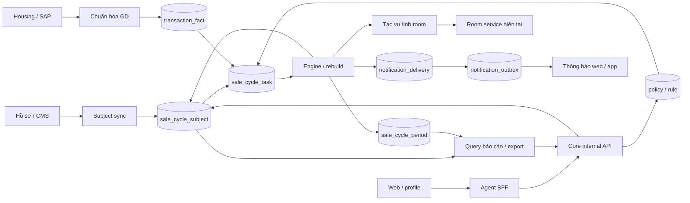
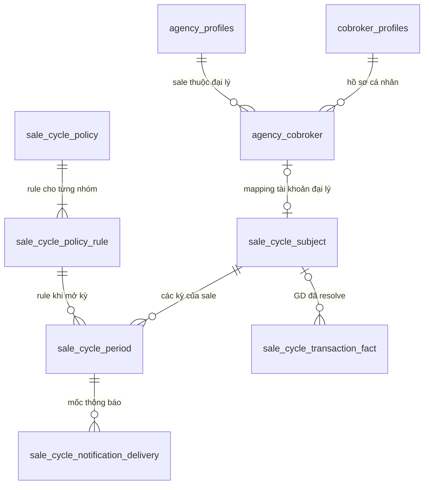
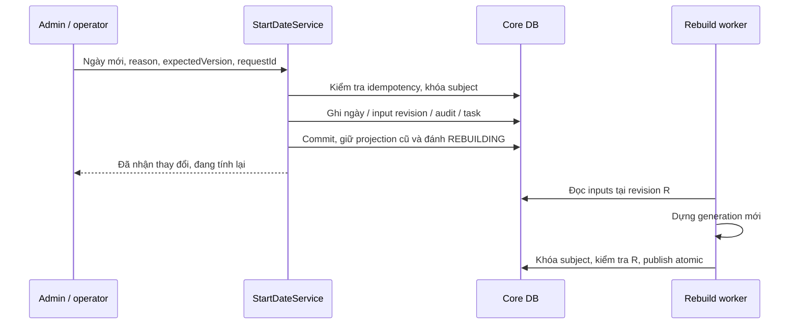

# BDSKD-9533 — Technical Design Document (TDD)

**Theo dõi chu kỳ bán hàng và cảnh báo ngưng hợp tác**

| Thuộc tính | Nội dung |
| --- | --- |
| Phiên bản tài liệu | 2.0 — thiết kế theo luồng dữ liệu |
| Ngày cập nhật | 05/10/2026 |
| Trạng thái | Đề xuất kỹ thuật để review; các quyết định nghiệp vụ chưa chốt được ghi tại mục 13 |
| Phạm vi | US-01 đến US-06; core, tích hợp nguồn, BFF và frontend liên quan |
| Hiện trạng đối chiếu | Code staging `31444ce6`; kết quả kiểm tra chỉ đọc DB staging `cobroker_db` ngày 05/10/2026 |
| Chưa xác minh | Schema/payload đầy đủ bên CMS, profile-mw, Housing và SAP; hợp đồng GD cá nhân |

Nguồn yêu cầu: [SRS Confluence bản 7](https://vin3s.atlassian.net/wiki/spaces/BMAS/pages/3174532173), cập nhật 01/10/2026, nội dung Under approve; [demo PO](Demo_theo_doi_chu_ky_bán_final.html); [guide phân tích SRS](BDSKD-9533-dev-guide.md). Kết quả đối chiếu DB: [mapping bảng/cột hiện tại](BDSKD-9533-mapping-bang-db.md).

TDD này đọc độc lập. Tên bảng, API và class mới là đề xuất triển khai, không phải thành phần đã tồn tại. Tài liệu không chứa thông tin kết nối DB.

## Mục lục

1. [Mục tiêu, phạm vi và thuật ngữ](#1-mục-tiêu-phạm-vi-và-thuật-ngữ)
2. [Dữ liệu hiện tại và các khóa định danh](#2-dữ-liệu-hiện-tại-và-các-khóa-định-danh)
3. [Kiến trúc và trách nhiệm dữ liệu](#3-kiến-trúc-và-trách-nhiệm-dữ-liệu)
4. [Thiết kế DB](#4-thiết-kế-db)
5. [Luồng dữ liệu chi tiết](#5-luồng-dữ-liệu-chi-tiết)
6. [Engine và các quy tắc tính](#6-engine-và-các-quy-tắc-tính)
7. [API, phân quyền và hợp đồng nguồn](#7-api-phân-quyền-và-hợp-đồng-nguồn)
8. [Room và thông báo](#8-room-và-thông-báo)
9. [Báo cáo, Excel và frontend](#9-báo-cáo-excel-và-frontend)
10. [Đồng thời, retry và vận hành](#10-đồng-thời-retry-và-vận-hành)
11. [Triển khai từng tính năng](#11-triển-khai-từng-tính-năng)
12. [Kiểm thử và đối soát DB](#12-kiểm-thử-và-đối-soát-db)
13. [Quyết định cần chốt và điều kiện nghiệm thu](#13-quyết-định-cần-chốt-và-điều-kiện-nghiệm-thu)
14. [Tham chiếu code hiện có](#14-tham-chiếu-code-hiện-có)

## 1. Mục tiêu, phạm vi và thuật ngữ

Hệ thống tính từng sale có đạt chỉ tiêu giao dịch trong thời gian quy định hay không. Kết quả phục vụ quản lý, nhắc nhở và điều kiện tính hạn mức căn. Không tự chấm dứt hợp đồng hoặc đổi trạng thái tài khoản khi sale thất bại.

| SRS | Kết quả cần có |
| --- | --- |
| US-01 | Theo dõi sale đại lý/O2O/Tự doanh; tính chính thức, thử thách và đề xuất chấm dứt; báo cáo đúng hai nhóm kỳ; điều kiện room |
| US-02 | Search, sort, filter tổ chức/trạng thái/phân loại và phân trang trong quyền người xem |
| US-03 | XLSX toàn bộ kết quả đang lọc, đủ cột, giới hạn 50.000 và ghi nhận lần xuất |
| US-04 | Cấu hình có phiên bản/ngày hiệu lực, áp dụng tuần tự/tức thì và lịch sử chi tiết |
| US-05 | Bốn loại thông báo nhắc/kết quả chính thức/thử thách tới sale web/app |
| US-06 | Ngày bắt đầu bán từ xác thực/CMS/import, quyền xem/sửa và tính lại khi ngày đổi |

| Thuật ngữ | Cách hiểu trong TDD |
| --- | --- |
| Subject | Một tài khoản sale được đưa vào theo dõi; không phải hồ sơ người hoặc hồ sơ đại lý |
| Policy | Một phiên bản cấu hình được lưu |
| Rule | Thời hạn/chỉ tiêu cho một nhóm đối tượng trong policy |
| Fact | Một GD đã chuẩn hóa để kiểm tra và tính chỉ tiêu cho sale |
| Period | Một kỳ chính thức hoặc thử thách cụ thể của một subject |
| Projection | Kết quả hiện tại đã tính và lưu để báo cáo/room đọc |
| Publish | Transaction đưa kết quả đã tính vào projection chính thức |
| Rebuild | Tính lại chuỗi kỳ từ đầu vào lịch sử, giữ bản cũ để audit |
| Generation | Số phiên bản của cả chuỗi kỳ khi rebuild; khác policy version |
| Room | Hạn mức căn theo công thức của đại lý; thử thách không được cộng vào số sale dùng công thức |
| GD được tính cho sale | Người được hưởng chỉ tiêu từ GD; không suy ra từ đại lý giữ/bán căn |

Baseline: chính thức đạt giữa kỳ giữ đến hết hạn; thất bại sang thử thách; thử thách đủ chỉ tiêu đóng trong ngày đạt, hôm sau mở chính thức; hết thử thách chưa đạt thì terminal. Các điểm SRS còn mâu thuẫn và đề xuất chi tiết được đánh mã D01–D10 tại mục 13.

## 2. Dữ liệu hiện tại và các khóa định danh

### 2.1. Bảng hiện có có thể tái sử dụng

| Nhu cầu | Bảng/nguồn hiện có | Dữ liệu dùng được | Giới hạn |
| --- | --- | --- | --- |
| Hồ sơ người | `cobroker_profiles` | UUID hồ sơ, tên, CCCD, liên hệ, trạng thái, liên kết submission | Chưa có cột ngày bắt đầu bán chuyên biệt |
| Sale tại đại lý | `agency_cobroker` | Tài khoản Agent, người, đại lý, role dạng mảng, trạng thái việc làm | Không có kỳ/chính sách chu kỳ |
| Đại lý/vùng | `agency_profiles` | UUID đại lý, tên, team/vùng snapshot | Chưa chứng minh có đầy đủ cây tổ chức và quyền vùng |
| Xác thực | `cobroker_applicant_agencies_submission`, `identity_verification_history` | Tiến trình, quyết định OCR/eKYC/manual và thời điểm | Phải xác định lần đầu hoàn thành toàn bộ điều kiện Đã xác thực |
| O2O/Tự doanh | CMS/profile | Nguồn cần xác minh tài khoản, role, tổ chức và ngày bắt đầu bán | Chưa xác nhận core đã có đủ dữ liệu hay cách sync; “Ngày BC” chỉ dùng khi xác nhận đúng nghĩa |
| Căn bán | `sale_batch_units`, luồng `PropertySoldProcessor` | Trạng thái căn, đại lý phân phối/bán, ngày ký/bán | Entity/DTO hiện tại chưa lưu/map sale cá nhân hưởng GD |
| Sale đăng ký dự án | `user_registered_scope` | Username, dự án, loại và trạng thái đăng ký | Đăng ký dự án không phải GD |
| Room | `sale_batch_agency_rooms`, `room_ledger`, các bảng đợt bán | Quỹ room và biến động room | Chưa tích hợp exclusion theo chu kỳ |
| Thông báo | `notification_outbox` | Hẹn giờ, payload, handler, retry | Row xử lý xong bị xóa; không phải lịch sử gửi lâu dài |

Không kết luận Housing không có sale ID chỉ từ DTO core: DTO hiện tại bỏ qua field chưa map. Cần kiểm tra bảng `sale_orders` và payload nguồn Housing trước khi bổ sung adapter.

### 2.2. Khóa hồ sơ, tài khoản và đại lý

| Khóa | Đại diện cho | Cách dùng |
| --- | --- | --- |
| `cobroker_profiles.id` | Một hồ sơ con người | Đọc tên/liên hệ; không dùng làm receiver Agent |
| `cobroker_profiles.account_id` | IAM account | Không mặc định đồng nhất với Agent profile ID |
| `agency_cobroker.id` | Quan hệ người với đại lý | Đọc role/đại lý/trạng thái quan hệ |
| `agency_cobroker.agent_profile_id` | Tài khoản Agent của quan hệ đó | Mapping subject/GD/thông báo theo baseline D02 |
| `agency_profiles.id` | Hồ sơ một đại lý | Liên kết room và scope đại lý |

```text
agency_cobroker.cobroker_profile_id → cobroker_profiles.id
agency_cobroker.agency_profile_id   → agency_profiles.id
user_registered_scope.username     → agency_cobroker.agent_profile_id
```

Các liên kết nguồn trên là quan hệ logic code sử dụng; kết quả kiểm tra metadata không có FK vật lý cưỡng chế trên các liên kết hồ sơ/link này. Khi ingest phải phát hiện orphan, không âm thầm mất row do INNER JOIN. Số orphan staging đã ghi trong mapping DB là snapshot, không là giả định cố định cho rollout.

Role là mảng: kiểm tra `'SALE_MEMBER' = ANY(role_type)`. Link chỉ giữ SALE_ADMIN không tự thuộc diện sale; link giữ cả SALE_ADMIN/SALE_MEMBER vẫn xét SALE_MEMBER. Chu kỳ tiếp tục chạy khi tài khoản inactive theo SRS.

### 2.3. Ba ID đại lý trên căn không phải sale ID

| Field trên `sale_batch_units` | Nghĩa |
| --- | --- |
| `allocated_to_agency_profile_id` | Đại lý được cấp/giữ căn qua phân bổ nội bộ |
| `distributed_agency_profile_id` | Đại lý đang được phân phối căn theo market-core |
| `sold_by_agency_profile_id` | Đại lý thực tế ghi nhận bán |

Cả ba là ID đại lý. Một đại lý có nhiều sale nên không thể dùng chúng để chọn người hưởng chỉ tiêu. `allocated_by` là người thao tác phân bổ, cũng không chứng minh người bán.

### 2.4. Đầu vào tối thiểu để tính kỳ

Một subject cần: tài khoản đã resolve, audience, ngày bắt đầu bán và policy lịch sử phù hợp. Engine có thể tính 0 GD nếu nguồn GD đã được xác nhận đồng bộ đủ tới thời điểm xét; **không đồng nhất nguồn chưa hoạt động với thực tế không có GD**. Trước rollout cần đối soát độ phủ/backfill GD và bật engine có tác động chỉ khi nguồn đạt yêu cầu.

GD tối thiểu cần khóa businessTransactionId, sale hưởng GD, ngày nghiệp vụ, qualification và revision. Không fallback từ thiếu sale sang “mọi sale của đại lý”; không fallback thiếu ngày GD sang ngày nhận message.

## 3. Kiến trúc và trách nhiệm dữ liệu



| Thành phần | Sở hữu/trách nhiệm |
| --- | --- |
| CMS/profile | Org/role/employee code và ngày O2O/Tự doanh theo hợp đồng cần chốt |
| Hồ sơ/xác thực core | Dữ liệu đại lý và sự kiện đầu tiên đủ điều kiện xác thực |
| Housing/SAP adapter | Chuẩn hóa GD và người hưởng; giữ khả năng truy nguyên nguồn |
| Subject sync/start-date service | Ghi phần đầu vào subject; không ghi classification/pointers |
| Policy service | Lưu policy/rule bất biến, version và audit |
| Engine/rebuild | Ghi period và projection subject; sinh ý định room/noti |
| Task worker | Retry evaluate/rebuild/recalc-room, không tạo GD thay nguồn |
| Report/export | Chỉ đọc projection đã publish trong scope; không tự chạy engine |
| Notification handler | Kiểm tra delivery hợp lệ, gọi provider, lưu bằng chứng gửi |
| BFF | Xác thực, actor tin cậy, public routing và truyền file/header |

## 4. Thiết kế DB

Toàn bộ bảng mới thuộc `cobroker_db`. Dùng UUID, `date` cho ngày nghiệp vụ, `timestamptz` cho thời điểm sự kiện/audit. Enum lưu string. Không lưu bộ đếm số ngày rồi trừ 1 mỗi lần cron.

### 4.1. `sale_cycle_subject` — một tài khoản được theo dõi

| Field | Kiểu / ý nghĩa |
| --- | --- |
| id | UUID PK |
| agent_profile_id | varchar, NOT NULL, UNIQUE; khóa tài khoản theo D02 |
| cobroker_profile_id, agency_cobroker_id, agency_profile_id | UUID nullable; chỉ đại lý có các liên kết tương ứng |
| audience | AGENCY / O2O / SELF_BUSINESS |
| employee_code, identity_no, full_name, phone, email | Thông tin phục vụ query/export; theo chính sách dữ liệu hiện hành |
| department_id, region_id | varchar nullable, ID tổ chức; không ép chung kiểu integer từ CMS |
| department_name, region_name | Snapshot phục vụ báo cáo; cập nhật khi sync org |
| activity_status | ACTIVE / INACTIVE / PENDING_VERIFICATION / DRAFT; mapping rõ FROZEN/REQUEST_UPDATE trước khi ghi |
| start_date, start_date_source | date nullable; VERIFICATION / CMS / MANUAL / IMPORT |
| start_date_override | boolean; ngăn sync tự động ghi đè ngày do admin sửa |
| monitoring_status | READY / MISSING_START_DATE / FUTURE_START_DATE / MISSING_POLICY / IDENTITY_UNRESOLVED / REBUILDING / OUT_OF_SCOPE |
| cycle_classification | OFFICIAL_NOT_MET / OFFICIAL_MET / CHALLENGE / TERMINATION_PROPOSED; nullable nếu chưa tính |
| current_cycle_id, latest_official_cycle_id, latest_challenge_cycle_id | UUID nullable; pointers do engine ghi |
| room_excluded | boolean NOT NULL default false; kết quả nghiệp vụ theo D10; room flag quyết định có áp dụng khi đếm room |
| last_qualified_transaction_at | timestamptz nullable; đề xuất toàn bộ lịch sử GD hợp lệ, PO xác nhận phạm vi cột này |
| input_revision, evaluated_input_revision | bigint NOT NULL default 0; revision đầu vào và revision đã tính |
| active_generation | bigint NOT NULL default 0; generation đã publish |
| calculation_revision, version | bigint NOT NULL; revision kết quả đã publish và optimistic lock |
| source_revision | varchar nullable; version snapshot profile/org theo hợp đồng nguồn, không so sánh lexical tùy ý |
| source_updated_at, evaluated_at, evaluated_date | Thời điểm sync nguồn, tính kết quả và ngày nghiệp vụ đã xét |
| created_at/by, updated_at/by | Audit theo convention repo |

`monitoring_status` là trạng thái dữ liệu nội bộ. FE không trộn nó vào filter bốn nhãn SRS. Subject chưa từng publish hiển thị phân loại `-` và lý do chưa tính theo D07; subject đã có projection giữ phân loại cũ kèm stale/rebuilding khi đầu vào mới chưa được áp dụng.

Ngày bắt đầu bán được lưu ở subject; API profile đại lý bổ sung field đọc qua subject. Không lưu hai nguồn master khác nhau ở subject và profile. Không xóa subject khi account inactive, vì SRS vẫn chạy chu kỳ.

### 4.2. `sale_cycle_policy` và `sale_cycle_policy_rule`

**Policy:** `id`, `version_no` UNIQUE, `effective_date`, `application_mode` SEQUENTIAL/IMMEDIATE, `status` SCHEDULED/EFFECTIVE, `notification_config` jsonb, `request_id` UNIQUE, `created_at/by`.

**Rule:** `id`, `policy_id`, `effective_date`, `audience`, `official_months`, `official_target`, `challenge_months`, `challenge_target`. UNIQUE `(policy_id, audience)` và `(audience, effective_date)`.

Một box UI chọn O2O + Tự doanh tạo hai rule cùng tham số. Không lưu nhiều audience trong một field để khỏi mập mờ rule áp dụng. Cho phép chỉ cập nhật một số nhóm: nhóm không có rule ở policy mới tiếp tục dùng rule hiệu lực gần nhất của chính nhóm đó.

Đề xuất mỗi ngày chỉ có một policy chứa cùng audience. Rule lưu thêm `effective_date` để enforce UNIQUE ở DB; thêm UNIQUE `(id,effective_date)` trên policy và composite FK rule `(policy_id,effective_date)` tới policy `(id,effective_date)` để ngày không lệch với policy cha. Service vẫn khóa khi cấp version và trả lỗi conflict dễ hiểu.

Policy đã lưu bất biến; không cập nhật trực tiếp nội dung policy cũ. Sửa/hủy policy tương lai chưa thuộc hợp đồng V1, cần bổ sung riêng khi PO yêu cầu.

Ví dụ `notification_config` theo D08:

```json
{
  "zoneId": "Asia/Ho_Chi_Minh",
  "official": {"remindDays": [1, 3, 7], "remindAt": "09:00", "endAt": "17:00"},
  "challenge": {"remindDays": [1, 3], "remindAt": "09:00", "endAt": "17:00"}
}
```

Thông báo là optional: danh sách nhắc rỗng đi cùng remindAt=null nghĩa không bật nhắc; endAt=null nghĩa không bật kết quả. Danh sách có phần tử nhưng thiếu giờ là lỗi validation. Nếu chọn lịch riêng từng nhóm, chuyển config xuống rule và cập nhật hợp đồng FE trước implement.

### 4.3. `sale_cycle_period` — các kỳ đã tính

Fields: `id`, `subject_id` FK, `generation`, `sequence_no`, `kind` OFFICIAL/CHALLENGE, `policy_rule_id` FK, `policy_id` FK, `start_date`, `scheduled_end_date`, `effective_end_date`, `target`, `transaction_count`, `achieved_date`, `lifecycle` BUILDING/CURRENT/COMPLETED/SUPERSEDED, `result` null/MET/NOT_MET/RESET, `closed_at`, `created_at/by`.

- `scheduled_end_date` là hạn dự kiến theo tháng.
- `effective_end_date` là ngày đóng thực tế: bằng hạn dự kiến, ngày đạt thử thách hoặc ngày trước reset tức thì.
- Snapshot chỉ tiêu/policy rule khi mở kỳ; không đọc rule mới nhất để đổi kỳ đang chạy.
- `transaction_count` là số từ facts, không tăng trực tiếp theo từng Kafka event.
- `generation` đổi khi rebuild; kỳ cũ chuyển SUPERSEDED để giữ audit.
- BUILDING dành cho generation đang dựng qua checkpoint; list/room/notification không đọc các row này. Task lưu generation, input revision và checkpoint trong payload; lúc publish đổi chúng thành COMPLETED/CURRENT theo kết quả cuối.

Ràng buộc: UNIQUE `(subject_id,generation,sequence_no)`; partial UNIQUE `(subject_id)` WHERE lifecycle = CURRENT; CHECK ngày hợp lệ và target > 0 theo validation đề xuất. Subject terminal không có current period nhưng giữ latest pointers.

Trong ngày thử thách đạt: ghi achieved_date/effective_end_date=today nhưng vẫn CURRENT đến hết ngày; current classification vẫn CHALLENGE. Hôm sau chuyển COMPLETED và tạo OFFICIAL. Cách này bảo đảm room chỉ khôi phục hôm sau, không ngay giữa ngày.

### 4.4. `sale_cycle_transaction_fact` — giao dịch chuẩn hóa

Fields: `id`, `source`, `business_transaction_id`, `source_revision`, `source_updated_at`, `agent_profile_id`, `subject_id` nullable FK, `business_at`, `business_date`, `qualification` QUALIFIED/REVOKED/PENDING, `mapping_status` RESOLVED/UNRESOLVED/CONFLICT, `source_trans_code/status`, `raw_reference`, `payload_hash`, `received_at`.

UNIQUE `(source,business_transaction_id)`. `business_transaction_id` phải là khóa chuẩn hóa xuyên các bước TTĐC/TTKQ của cùng GD, không dùng mặc định mỗi document SAP là một GD. V1 giả định một GD hưởng chỉ tiêu cho một sale; nếu BO xác nhận nhiều người được hưởng, cần bảng attribution trước tích hợp.

Sai mapping vẫn lưu fact unresolved, không cộng vào sale bất kỳ. Event cũ hơn revision đã lưu bị bỏ qua; cùng revision nhưng payload khác đưa vào conflict và cảnh báo. Delete/hủy phải có tombstone revision để event cũ không phục hồi GD.

Lưu before/after fact trong audit để truy nguyên hủy/chuyển sale. Nguồn phải hỗ trợ revision hoặc cách xác định thứ tự tương đương; không dùng `received_at` làm thứ tự nghiệp vụ.

### 4.5. `sale_cycle_task` — tác vụ có retry

Fields: `id`, `type` EVALUATE_SUBJECT/REBUILD_SUBJECT/RECALC_AGENCY_ROOM, `aggregate_key`, `dedupe_key` UNIQUE, `target_revision`, `payload` jsonb, `status` PENDING/RUNNING/DONE/FAILED, `available_at`, `attempts`, `lease_owner`, `lease_token`, `lease_until`, `last_error`, audit timestamps.

Tác vụ được tạo cùng transaction thay đổi dữ liệu. Worker claim theo batch với `FOR UPDATE SKIP LOCKED`, có lease/retry/backoff; lease hết phải được lấy lại. Dedupe theo aggregate + revision và ngày nghiệp vụ/trigger tương ứng, không chỉ aggregate để khỏi mất cập nhật hoặc mất lần chuyển kỳ ngày mới. Quy tắc khóa/lease tại mục 10.

Không coi callback afterCommit trong RAM là bảo đảm tác vụ room đã được giao. Sau crash phải còn row pending để retry.

### 4.6. `sale_cycle_notification_delivery`

Fields: `id`, `subject_id`, `period_id`, `generation`, `type`, `scheduled_at`, `dedupe_key` UNIQUE, `status` PENDING/SENT/CANCELED, `provider_message_id`, `sent_at`, `skip_reason`, audit timestamps.

Một row là một lần nhắc/kết quả. ObjectId của notification outbox bằng delivery.id. Giữ row SENT sau khi outbox bị xóa; đây là bằng chứng chống enqueue lại sau scheduler restart/replay.

### 4.7. Audit và export

`sale_cycle_audit`: `id`, `subject_id/policy_id/fact_id` nullable, `action`, `actor`, `reason`, `before_snapshot`, `after_snapshot`, `calculation_revision`, `request_id`, `created_at`. Ghi sửa ngày, import, đổi policy, hủy/chuyển fact, chuyển kỳ và rebuild. Không cần màn lịch sử kỳ ở V1.

`sale_cycle_export_log`: `id`, `actor`, `normalized_filter`, `scope_summary`, `sort`, `total_matched`, `exported_rows`, `truncated`, `snapshot_at`, `status` STARTED/GENERATED/FAILED, `created_at`, `error_code`. GENERATED nghĩa server đã tạo file, không khẳng định người dùng đã tải xong.

### 4.8. Index và migration

- Subject: audience/activity/classification, agency_profile_id, department_id, region_id, evaluated_date; name search/sort key. Search contains có thể cần pg_trgm sau khi kiểm tra extension và query plan.
- Period: `(subject_id,generation,start_date)` và current partial index.
- Fact: `(subject_id,business_date)` WHERE qualification=QUALIFIED AND mapping_status=RESOLVED; unresolved/revision index.
- Policy rule: index `(audience,effective_date)` từ UNIQUE phục vụ lookup rule mới nhất; dùng composite FK như mục 4.2.
- Task: `(status,available_at)`; Delivery: `(status,scheduled_at)`.
- Pointer FK subject → period có thể thêm sau khi tạo hai bảng; chỉ ghi pointers sau khi period đã tồn tại trong transaction.

Migration chỉ tạo schema/ràng buộc, không kích hoạt engine hoặc đưa toàn bộ sale vào thử thách. Không hardcode ID khối staging trong data migration.

### 4.9. `sale_cycle_request` — idempotency API/import

Fields: `id` UUID PK, `operation` varchar NOT NULL, `request_id` varchar NOT NULL, `payload_hash` varchar NOT NULL, `status` ACCEPTED/COMPLETED, `resource_id` varchar nullable, `response_snapshot` jsonb nullable, `created_at`, `updated_at` timestamptz NOT NULL. UNIQUE `(operation,request_id)`.

Registry ghi cùng transaction với mutation; request thất bại rollback thì không có row hoàn tất giả. Async accepted lưu task/import reference để retry trả lại cùng công việc. Thông tin kết quả từng dòng import có thể dùng `import_job/import_job_item` hiện có nếu review xác nhận đúng type/handler; không bắt buộc thêm ledger import thứ hai.

### 4.10. Quan hệ và ý nghĩa từng bảng



`||`: đúng một; `o|`: không có hoặc một; `o{`: không có hoặc nhiều; `|{`: ít nhất một. Đây là quan hệ logic; ba bảng nguồn không được ghi nhầm thành có FK cưỡng chế khi metadata chưa có.

- Hồ sơ người + đại lý được nối bởi agency_cobroker; một người có thể có nhiều link trong lịch sử.
- Một subject theo dõi một Agent ID. Subject đại lý resolve về một link; O2O/Tự doanh có thể không có link đại lý.
- Một policy chứa ít nhất một rule audience. Một rule có thể áp dụng cho nhiều period của nhiều sale.
- Một subject có nhiều period lịch sử nhưng tối đa một CURRENT; subject thiếu đầu vào chưa có period.
- Fact chưa resolve chưa có subject. Baseline mỗi GD được tính cho tối đa một subject; nhiều người hưởng cần attribution table và quyết định riêng.
- Một period có nhiều mốc delivery; task/audit/request/export không hiển thị trong ERD để sơ đồ nghiệp vụ dễ đọc, quan hệ đã mô tả trong bảng tương ứng.

### 4.11. Nullability, ownership và tính nhất quán

Quy ước schema mới: id/PK, audience, các revision, boolean exclusion/override, enum trạng thái, thời điểm tạo là NOT NULL có default hợp lý. Dữ liệu danh tính/org/startDate chưa có được phép NULL và phải có lý do. Fact chưa resolve được phép subject_id/agent_profile_id hoặc ngày NULL, nhưng **fact được tính** phải QUALIFIED + RESOLVED + có subject/business_date. Không chuyển row thiếu ngày thành hợp lệ.

Period bắt buộc subject/rule/policy/generation/sequence/kind/start/scheduledEnd/target/count/lifecycle; achieved/effectiveEnd/result/closedAt nullable khi chưa đóng. CHECK tháng/target > 0, count >= 0, scheduledEnd >= start, effectiveEnd nếu có nằm trong khoảng kỳ. Reset ngày đầu xử lý không tạo row rỗng. Delivery bắt buộc subject/period/generation/type/scheduledAt/dedupe/status; SENT có sentAt, CANCELED có skipReason.

FK mới không cascade-delete lịch sử khi hồ sơ nguồn đổi. Có thể để liên kết UUID nguồn nullable và kiểm tra logic khi nguồn chưa có constraint ổn định. Subject.agency_cobroker_id nếu có phải unique. Các con trỏ period bảo đảm đúng subject qua composite FK `(pointer_id,subject.id)` → period `(id,subject_id)` với UNIQUE tương ứng; kind/generation được engine kiểm tra dưới lock. Period.policy_rule_id/policy_id phải cùng policy, enforce composite FK rule `(id,policy_id)`.

Pointers và count là projection, chỉ engine/rebuild ghi. Full name/org/startDate là input, chỉ owner/sync/start-date service ghi. Activity status và cycle classification luôn độc lập. GET/list/export không sửa projection.

### 4.12. Quy ước kiểu cột cho schema mới

Danh sách field ở mục 4.1–4.9 cùng quy ước dưới đây tạo data dictionary V1; giới hạn text/enum được đưa vào migration theo convention repo.

| Nhóm field | Kiểu PostgreSQL đề xuất | Ghi chú |
| --- | --- | --- |
| id, subject_id, period_id, policy_id, policy_rule_id, fact_id và UUID nguồn đại lý | uuid | UUID nội bộ, không cast Agent ID thành UUID |
| agent_profile_id, employee_code, department_id, region_id và khóa nguồn | varchar | Preserve nguyên định danh; unique/search theo key đã normalize có quy tắc |
| start_date, effective_date, business_date, scheduled/effective_end_date, achieved_date, evaluated_date | date | Ngày nghiệp vụ trong Asia/Ho_Chi_Minh |
| business_at, source_updated_at, received_at, scheduled_at, lease_until, sent_at và audit timestamps | timestamptz | Thời điểm tuyệt đối; API ISO-8601 |
| version_no, generation, sequence_no, revisions, version | bigint | Không dùng thời gian nhận event làm revision nguồn |
| official/challenge_months, target, attempts, exported_rows | integer | Months/target > 0; attempts/exported_rows >= 0; validate giới hạn trước lưu |
| transaction_count, total_matched | bigint | Count >= 0; SQL COUNT trả bigint, DTO dùng long |
| status/kind/audience/classification/type/source | varchar + CHECK hoặc enum mapping string | Java enum không lưu ordinal; nullable classification trước lần tính đầu |
| notification_config, payload, snapshot/filter/response | jsonb | Có DTO/schema validate ở BE; JSON không thay khóa relational |
| override/exclusion/truncated | boolean NOT NULL | False mặc định, nhưng không dùng false để che nguồn thiếu |
| dedupe_key/request_id/hash/error/reason | varchar hoặc text | Dedupe/request có unique; reason/error không chứa credentials |

`source_revision` của fact baseline bigint monotonic; nguồn dùng token khác phải chốt comparator/ordering trước adapter, không ép token thành số hoặc so lexicographic. `source_revision` snapshot profile có thể khác kiểu, được adapter so theo hợp đồng riêng.

## 5. Luồng dữ liệu chi tiết

Mỗi luồng mô tả tác nhân, bảng đọc/ghi, ranh giới transaction, đầu ra và lỗi. Mũi tên trong ERD là quan hệ giữa row; thứ tự xử lý được mô tả ở phần này.

### 5.1. F01 — Đưa sale vào danh sách theo dõi

**Tác nhân:** snapshot hồ sơ đại lý, sự kiện hồ sơ thay đổi hoặc snapshot CMS. **Đầu vào:** tài khoản Agent, audience, định danh nguồn, trạng thái và tổ chức.

| Bước | Đọc/kiểm tra | Ghi/kết quả |
| --- | --- | --- |
| 1 | Đại lý: link, profile, agency; CMS: snapshot đã xác thực nguồn | Resolve Agent ID và audience; mapping thiếu ghi lỗi đối soát, không tạo account giả |
| 2 | UNIQUE Agent ID, source revision của snapshot | Khóa/upsert subject ổn định; event nguồn cũ không ghi đè snapshot mới |
| 3 | Role/audience, ngày nguồn và override | Cập nhật danh tính/tổ chức/activity; ngày nguồn chỉ cập nhật theo owner và override |
| 4 | So sánh đầu vào có ảnh hưởng tính kỳ | Tăng input_revision và enqueue task nếu cần; thay tên/liên hệ đơn thuần không rebuild toàn chuỗi |
| 5 | Ngày/policy đã có hay thiếu | Ghi monitoring status; audit thay đổi cần truy nguyên; commit |

**Transaction:** bước 2–5 cùng transaction. **Sau commit:** worker xử lý nếu đủ dữ liệu. Chưa có ngày → MISSING_START_DATE, classification=null với subject chưa từng publish; không tạo kỳ fail.

Inactive chỉ đổi activity, không đóng kỳ. Mất profile/link do lỗi nguồn không xóa lịch sử; giữ projection đã publish, ghi lỗi mapping và đối soát. Nguồn snapshot có cơ chế full/delta và version phải chốt; không coi “không thấy trong một page” là OUT_OF_SCOPE.

### 5.2. F02 — Ghi ngày bắt đầu bán lần đầu

**Tác nhân:** hoàn thành xác thực đại lý; CMS cập nhật ngày O2O/Tự doanh; import một lần tài khoản cũ.

1. Resolve đúng tài khoản/quan hệ. Với xác thực, xác nhận toàn bộ điều kiện Đã xác thực lần đầu, không lấy APPROVED của riêng một leg.
2. Chuyển thời điểm nguồn sang business date theo timezone đã xác nhận. Timestamp legacy không có timezone cần mapping rõ.
3. Khóa subject. Nếu có manual override, không ghi đè. Nếu sự kiện xác thực lặp lại và ngày đã có, xử lý idempotent.
4. Ghi start_date/source, tăng input_revision, ghi audit before/after và task evaluate trong cùng transaction.
5. Worker chọn policy hiệu lực tại start_date, mở kỳ đầu hoặc catch-up tới ngày hiện tại.

Không tự lấy created_at hoặc ngày HĐLĐ để lấp thiếu dữ liệu. Sale cũ theo file Chính sách cung cấp; suy từ history chỉ dùng khi nguồn/mốc đã được xác nhận.

### 5.3. F03 — Admin sửa ngày / import ngày cũ

**API sửa ngày:** role 11/100, chỉ audience AGENCY theo D09. **Import:** operator/service riêng; không mặc định mọi role cấu hình có quyền backdate policy/import.



Ngay sau API commit: **ngày đầu vào đã mới nhưng kỳ vẫn là kết quả cũ**; response phải có stale=true, không thông báo “tính lại thành công”. Worker xong mới đổi classification/pointers/room projection.

Import preview không ghi subject. Commit nhận batch requestId/checksum; ghi nhận từng dòng qua idempotency registry, audit và task. Retry tiếp tục dòng chưa commit, không ghi lại dòng đã xong. Validate theo Agent ID, audience, ISO date, duplicate; không nối bằng họ tên/SĐT. Batch có lỗi trả số thành công/lỗi và row result, không báo toàn bộ thành công.

### 5.4. F04 — Lưu và áp dụng policy

**Lưu cấu hình:** validate role/ngày tương lai/audience/tháng/target/lịch → khóa cấp version → insert policy + rules + audit + idempotency response → commit. Một box hai audience tạo hai rule; rule và policy cùng ngày hiệu lực qua composite FK.

**Chưa tới hiệu lực:** policy tồn tại trong history, không đổi kỳ hiện tại. **Tới hiệu lực:** scheduler giao việc cho audience liên quan; resolver luôn xét effective_date, không phụ thuộc status đã được cron cập nhật chưa.

| Mode | Thay đổi dữ liệu |
| --- | --- |
| SEQUENTIAL | Kỳ đang chạy giữ rule cũ. Khi mở kỳ mới, chọn rule audience có effective_date lớn nhất nhưng <= ngày bắt đầu kỳ mới |
| IMMEDIATE | Sau khi D04 chốt: đóng kỳ cũ ngày trước hiệu lực với result RESET, mở OFFICIAL từ ngày hiệu lực; GD ngày hiệu lực thuộc kỳ mới |

Nếu reset đúng ngày đầu kỳ thì chọn rule mới trực tiếp, không tạo period ngày cuối < ngày đầu. Terminal không tự phục hồi theo baseline D04. Policy không có rule cho audience X thì X tiếp tục rule hiệu lực gần nhất; lịch notification của period pin theo policy chứa rule đã chọn, không lấy global “bản mới nhất” tùy lúc gửi.

Nếu thiếu policy ở ngày đầu lịch sử, ghi MISSING_POLICY và dừng publish kết quả mới; không dùng policy tương lai hồi tố.

### 5.5. F05 — Nhận và chuẩn hóa GD

**Nguồn:** event/API snapshot Housing/SAP đã chốt. `sale_batch_units` hỗ trợ đối soát căn/đại lý; không làm ledger GD cá nhân.

| Bước | Xử lý | Ghi DB |
| --- | --- | --- |
| 1 | Validate nguồn, mã GD chuẩn hóa, revision, ngày, trạng thái và sale | Payload hỏng vào quarantine/DLQ theo hạ tầng nguồn |
| 2 | Serialize cùng khóa GD bằng advisory transaction lock; đọc fact hiện có | Event cũ bỏ qua; cùng revision/cùng hash là no-op |
| 3 | Resolve subject cũ/mới, khóa subject theo UUID tăng dần | Đồng bộ với engine, tránh deadlock khi đổi người hưởng |
| 4 | Chỉ nhận revision mới hơn; chuẩn hóa business_date | Insert/update một fact; không tạo một fact cho mỗi message |
| 5 | Xác định ảnh hưởng count/lịch sử | Tăng input_revision các subject bị ảnh hưởng; audit before/after; enqueue tasks |
| 6 | Commit thành công rồi acknowledge message | Crash trước commit: không có partial fact/task; sau commit trước ack: replay idempotent |

**Thiếu mapping:** lưu fact UNRESOLVED với Agent ID/reference nếu có; không cộng vào sale khác. Có mapping sau thì resolver cập nhật fact, revision đầu vào và enqueue evaluate/rebuild trong một transaction. Qualification và mapping là hai thuộc tính khác nhau: GD có thể đủ điều kiện nhưng chưa xác định được người hưởng.

**Cùng revision khác payload:** không overwrite accepted fact bằng payload mới. Ghi conflict audit/quarantine, giữ accepted version cho đến reconciliation có nguồn đáng tin cậy. Fact mới chưa có accepted version có thể ở mapping CONFLICT, không được tính.

**Thiếu businessAt:** chưa tạo qualified countable fact; lưu lỗi đối soát. Không dùng received_at thay ngày GD. `objectId` sale_orders chỉ làm businessTransactionId nếu nguồn xác nhận nó duy nhất xuyên các bước nghiệp vụ.

### 5.6. F06 — Engine mở kỳ và cập nhật count

**Tác nhân:** task từ thay đổi đầu vào hoặc daily scheduler. **Đọc:** subject, policies/rules bất biến, facts hợp lệ. **Ghi:** period, projection subject, audit, room task và notification delivery/outbox khi bật.

1. Khóa subject; đọc input_revision, active generation và ngày xét từ Clock.
2. Kiểm tra tài khoản/ngày/policy/nguồn GD đủ điều kiện vận hành. Chưa đủ: ghi lý do, giữ projection cũ nếu có.
3. Subject mới: mở OFFICIAL từ start_date. Catch-up qua các mốc theo thứ tự thời gian.
4. Count facts có đúng subject, QUALIFIED, RESOLVED và business_date thuộc kỳ; không count theo số row căn SOLD.
5. Cập nhật classification và kỳ theo bảng chuyển trạng thái ở mục 6.
6. Chỉ tăng calculation_revision khi publish kết quả mới; lưu evaluated_input_revision để biết đã tính tới đầu vào nào.
7. Nếu exclusion đổi: giao task room cho đại lý liên quan. Lập/cancel notification intent theo kết quả và flags.
8. Commit toàn bộ. HTTP provider và room recalc chạy sau commit qua worker.

**Không có sự kiện nhưng qua ngày mới:** daily scheduler vẫn evaluate để chuyển kỳ. **Job dừng nhiều tháng:** chạy tới kỳ phủ asOfDate hoặc terminal, không chỉ chuyển một lần.

### 5.7. F07 — GD hủy, nhận trễ hoặc đổi người hưởng

| Tình huống | Fact thay đổi | Subject/period xử lý |
| --- | --- | --- |
| GD lặp | Không đổi | Không tăng input revision/task |
| Hủy GD | REVOKED với revision cao hơn; giữ tombstone | Recount/rebuild subject từng được hưởng |
| Đổi sale A → B | Lưu before/after subject và attribution mới | Tăng revision/enqueue cả A và B |
| Sửa ngày GD | Ghi business_date mới | Xét cả khoảng ngày cũ và mới; rebuild nếu ảnh hưởng kỳ đã đóng/đạt trial |
| GD đến trễ | Ngày nhận mới, business_date cũ | Đưa vào đúng lịch sử nghiệp vụ, không đẩy sang kỳ hiện tại |
| GD sau trial đã kết thúc | Lưu GD hợp lệ nếu nguồn xác nhận | Không tự cứu kỳ cũ bằng GD nằm ngoài hạn |

Ngay cả khi fact nằm trong trial đang CURRENT, xóa/thay GD đã tạo achieved_date cũng có thể đổi ngày chuyển kỳ: phải tính lại từ facts, không chỉ trừ count và giữ achieved_date cũ.

Trong khi D06 chưa chốt hồi tố, accepted facts vẫn lưu và diff có thể tính dry-run; không tự publish thay terminal/room hoặc gửi thông báo sửa sai. Ghi tình trạng pending reconciliation để vận hành thấy đầu vào mới chưa áp dụng.

### 5.8. F08 — Rebuild và publish generation mới

**Baseline V1:** rebuild toàn chuỗi từ start_date, đọc policy lịch sử và mọi reset IMMEDIATE đã duyệt. Không tái sử dụng nửa chuỗi cũ khi chưa có checkpoint nghiệp vụ tin cậy.

**Pha dựng:** đọc inputs bằng transaction REPEATABLE READ, chụp subject/facts/policies cùng input_revision, policy catalog revision và asOfDate; dựng generation G+1. Nếu dài, lưu snapshot inputs chuẩn hóa và checkpoint vào task payload hoặc storage bền vững được task tham chiếu; các checkpoint tiếp tục dùng cùng snapshot, không đọc facts mutable mỗi lần. Không giữ DB snapshot transaction xuyên nhiều lần chạy worker. Snapshot riêng được bảo vệ/retention như dữ liệu nguồn. Không cập nhật latest/current pointers sang BUILDING.

**Pha publish, một transaction:**

1. Lấy catalog lock rồi khóa subject; đối chiếu input_revision, policy catalog revision và ngày xét với snapshot. Revision thay đổi hoặc ngày mới cần catch-up thì bỏ/cập nhật candidate và enqueue lại theo mốc mới, không publish kết quả ngày cũ như đã tính hôm nay.
2. Chuyển các period generation G sang SUPERSEDED; CURRENT cũ được gỡ trước promote CURRENT mới.
3. Promote các period BUILDING của G+1 thành COMPLETED/CURRENT theo kết quả; terminal không có CURRENT.
4. Cập nhật active_generation, pointers, classification, room_excluded, lastTx và evaluated revisions; monitoring=READY nếu đủ đầu vào.
5. Ghi audit diff; cancel PENDING delivery G; giữ SENT; enqueue room khi projection thay đổi, tạo intent hợp lệ cho ngày hiện tại.
6. Commit: report/room thấy toàn bộ G hoặc toàn bộ G+1. Không đọc một phần cả hai generation.

**Lỗi giữa pha dựng:** giữ G đang phục vụ, task retry/checkpoint. **Lỗi giữa pha publish:** rollback toàn bộ. Row BUILDING bị bỏ sau conflict được đánh SUPERSEDED/cleanup theo retention; không xóa period đã phục vụ report/audit.

### 5.9. F09 — Room đọc kết quả sau publish

Luồng: engine publish exclusion → room task bền vững → worker đọc projection committed → query sale đủ điều kiện → công thức room hiện tại → ghi room/ledger theo convention có sẵn.

Task payload mang đại lý bị ảnh hưởng và calculation revision để truy nguyên; recalc dùng số tuyệt đối mới nhất, không trừ 1 mỗi lần task chạy. Nếu mapping agency đổi, giao việc cả agency cũ/mới.

`room_excluded` là kết quả nghiệp vụ đã publish, vẫn được engine tính khi flag room off. Flag chỉ quyết định room query/worker có áp dụng kết quả đó hay không. Khi bật flag cần recalc toàn bộ agency liên quan, không chờ một lần chuyển trạng thái tương lai.

Trong rebuild, monitoring có thể REBUILDING nhưng room vẫn đọc exclusion đã publish cũ. Không thêm điều kiện chỉ READY làm sale đang rebuild đột ngột được tính lại vào room.

### 5.10. F10 — Lập lịch và gửi thông báo

Mỗi mốc gửi tạo một delivery có dedupe key theo subject/period/generation/type/scheduledAt. Delivery và outbox được insert cùng transaction với period publish, sử dụng objectId=delivery.id.

Đến giờ: handler đọc delivery và period → kiểm tra loại thông báo còn hợp lệ → gọi provider ngoài transaction dài → ghi SENT/providerMessageId → scheduler xóa outbox. Delivery SENT vẫn giữ.

Nhắc chỉ hợp lệ khi kỳ còn hiện hành và chưa đạt theo D08. Thông báo thất bại gắn với **kỳ vừa đóng NOT_MET**: không yêu cầu period còn CURRENT, nếu không sẽ làm mất OFFICIAL_FAILED sau chuyển trial. Với rebuild làm kết quả cũ sai, cancel intent cũ. Nội dung kết quả phản ánh mốc chuyển đã xác nhận; luật có gửi khi sale đã đổi trạng thái tiếp trước giờ gửi cần PO xác nhận.

Timeout provider: retry cùng idempotency key. Crash sau provider nhận/trước ghi SENT có thể duplicate nếu provider không hỗ trợ idempotency; ledger riêng không tự giải quyết khoảng crash này.

Cancel PENDING chỉ bảo đảm các lần gửi chưa bắt đầu. Rebuild xảy ra sau handler kiểm tra và provider đã nhận có thể khiến thông báo kết quả cũ vẫn được giao; giữ ledger/audit để truy nguyên, không ghi CANCELED thay bằng chứng provider đã nhận. Muốn thu hồi thông báo đang gửi cần hợp đồng provider riêng. Không giữ subject DB lock xuyên HTTP chỉ để cố che khoảng race này.

### 5.11. F11 — List/filter và export đọc DB

**List:** xác thực actor → resolve scope → normalize filter/sort → query subject trong scope → join period qua pointers → map DTO → page tối đa 20. Không join toàn bộ facts/history vào mỗi row làm nhân dòng.

**Projection mapping:** chính thức trả current official và challenge=null; trial trả official thất bại liền trước/current trial; terminal trả hai kỳ cuối. Period SUPERSEDED/BUILDING không được lấy làm kết quả mới.

**Export:** kiểm tra scope lại → tạo export log STARTED → snapshot count/data cùng filter/sort → lấy tối đa 50.001 để phát hiện cắt → tạo 50.000 row XLSX → cập nhật GENERATED/FAILED → trả file/header. GENERATED nghĩa tạo file thành công, không khẳng định browser đã tải xong.

### 5.12. Ví dụ row trước–sau qua cả chu kỳ

Các ID S1/R1/P1/F1 dưới đây là alias để đọc, DB thực tế dùng UUID. Giả sử startDate=01/01/2026, rule R1: chính thức 4 tháng/1 GD, trial 6 tháng/1 GD.

| Mốc | Fact | Period | Subject projection |
| --- | --- | --- | --- |
| 01/01 | Chưa GD, nguồn đã đối soát | P1 OFFICIAL, 01/01–30/04, target=1, count=0, CURRENT | current=P1; official=P1; challenge=null; OFFICIAL_NOT_MET; excluded=false |
| 01/05 | Chưa GD | P1 COMPLETED NOT_MET; P2 CHALLENGE, 01/05–31/10, CURRENT | current=P2; official=P1; challenge=P2; CHALLENGE; excluded=true |
| 10/06 nhận F1 | F1: S1, ngày 10/06, QUALIFIED, revision=1 | P2 count=1, achieved=10/06, effectiveEnd=10/06; CURRENT hết ngày | Vẫn CHALLENGE, excluded=true |
| 11/06 | F1 vẫn ngày cuối trial | P2 COMPLETED MET; P3 OFFICIAL, 11/06–10/10, count=0, CURRENT | current=P3; official=P3; latestChallenge=P2; OFFICIAL_NOT_MET; excluded=false |

Tại 11/06 report trả official=P3 và challenge=null, dù latest_challenge_cycle_id vẫn lưu P2 để audit.

**Giả sử F1 bị hủy ngày 20/06 và D06 đã duyệt áp hồi tố:** fact F1 revision=2 REVOKED; input_revision tăng; subject REBUILDING, projection P3 còn phục vụ tạm. Rebuild G+1 tính lại thấy chưa đạt trial, tạo P2 mới 01/05–31/10 count=0 CURRENT; không có P3 mới. Publish đổi classification về CHALLENGE/excluded=true, giao recalc room, cancel delivery pending cũ và giữ ledger SENT. G cũ giữ SUPERSEDED để giải thích vì sao ngày 11/06 từng hiển thị chính thức.

Nếu D06 chưa duyệt: chỉ lưu fact/audit và diff dry-run, không tự thực hiện thay đổi projection/room như ví dụ.

## 6. Engine và các quy tắc tính

### 6.1. Các invariant

- Một subject tối đa một CURRENT period.
- Cùng GD không được cộng hai lần do nhiều trạng thái SAP/replay.
- Giao dịch thuộc khoảng ngày của kỳ, inclusive hai đầu; kỳ kế tiếp không chồng ngày.
- Chính sách của kỳ được đóng băng khi mở, chỉ reset/rebuild theo quyết định riêng mới thay.
- Engine không đổi activity_status hoặc role để phản ánh classification.
- Terminal không tự phục hồi vì GD mới hoặc policy tuần tự; hồi tố/reset terminal là quyết định D04/D06.

### 6.2. Thuật toán theo thứ tự ngày nghiệp vụ

`evaluate(subjectId, asOfDate)` dùng Clock inject và zone thống nhất:

1. Khóa subject (`SELECT ... FOR UPDATE`), kiểm tra đầu vào ngày/mapping/policy.
2. Nếu thiếu dữ liệu: ghi monitoring_status, audit cần thiết; giữ projection room đã publish nếu có; subject mới không loại chỉ vì thiếu dữ liệu theo D07, không tạo kỳ thất bại.
3. Với subject mới, tạo kỳ chính thức từ start_date theo rule hiệu lực tại ngày đó. Ngày ở tương lai chưa mở kỳ.
4. Lấy facts hợp lệ đã resolve, sort `(business_date, business_at, business_transaction_id)`.
5. Xét tuần tự các mốc: ngày hiệu lực IMMEDIATE đã duyệt, ngày đạt chỉ tiêu, ngày hết kỳ và ngày bắt đầu kỳ tiếp. Reset tức thì có hiệu lực từ đầu ngày, nên GD trong ngày hiệu lực thuộc kỳ mới.
6. Chính thức: tính GD đến min(asOfDate,endDate); gán classification OFFICIAL_MET/OFFICIAL_NOT_MET, result kỳ chưa đóng vẫn null. Khi asOfDate > endDate, đóng kỳ rồi mở chính thức nếu đạt, thử thách nếu không.
7. Thử thách: trong facts có business_date <= min(asOfDate,scheduledEndDate), tìm ngày GD thứ `target` được xác nhận. Nếu đã đạt, effectiveEnd=achievedDate; chỉ mở chính thức khi asOfDate > achievedDate. Nếu hết hạn chưa đạt thì terminal.
8. Lặp tới kỳ bao phủ asOfDate hoặc terminal. Job trễ nhiều tháng phải đi qua mọi mốc, không chỉ chuyển một bước.
9. Cập nhật period/pointers/classification/lastTx/revision và tasks/notification intents trong cùng transaction.
10. Commit; các side effect được worker xử lý sau, không gọi HTTP delivery khi đang giữ DB lock.

Khi đạt thử thách, GD khác cùng ngày vẫn thuộc ngày cuối thử thách; chính thức mới bắt đầu hôm sau. Không chuyển những GD đó sang chính thức mới.

Giới hạn số mốc xử lý mỗi lần có checkpoint/resume để tránh transaction quá lớn với dữ liệu nhiều năm. Nếu vượt giới hạn, giữ REBUILDING và chưa publish kết quả một phần làm kết quả cuối.

### 6.3. Đổi policy

SEQUENTIAL chọn rule hiệu lực tại mỗi ngày bắt đầu kỳ theo D03. Sale bắt đầu đúng effectiveDate dùng rule mới (`effective_date <= start_date`).

IMMEDIATE, nếu D04 đã duyệt: tại effectiveDate đóng kỳ trước bằng effectiveDate - 1 (result RESET), mở OFFICIAL mới từ effectiveDate theo rule mới. Tránh tạo kỳ rỗng khi reset đúng startDate; chọn rule mới trực tiếp. Subject terminal không được tự phục hồi theo baseline; nếu PO chọn khác phải cập nhật đặc tả/tests.

### 6.4. Rebuild/hồi tố

Sửa startDate/fact quá khứ khiến kết quả có thể khác chuỗi đã ghi. V1 dựng generation mới từ start_date; chỉ tối ưu từ mốc ảnh hưởng khi có checkpoint tin cậy; nếu mốc trước policy lịch sử bị thiếu, dừng và báo MISSING_POLICY, không lấy policy mới nhất hồi tố toàn bộ.

Rebuild phải xử lý các policy IMMEDIATE lịch sử theo thứ tự ngày, không chỉ lặp phép cộng tháng. Với terminal bị ảnh hưởng bởi GD cũ, D06 quyết định có được thay kết quả terminal; giao dịch có businessDate sau thử thách kết thúc không tự cứu kỳ cũ.

Publish trong một transaction có khóa subject: kiểm tra revision đầu vào còn đúng, chuyển generation cũ sang SUPERSEDED trước khi insert/promote CURRENT mới để không vi phạm partial UNIQUE, rồi đổi pointers/classification, ghi audit, hủy delivery PENDING cũ và tạo room task khi exclusion đổi. Nếu dựng dữ liệu qua nhiều checkpoint, giữ generation mới ở BUILDING cho tới khi publish; không supersede kết quả cũ từ checkpoint đầu. Input revision thay đổi thì bỏ kết quả dựng cũ và enqueue lại. Giữ ledger SENT; không tự gửi lại mọi thông báo lịch sử. Dry-run trả diff phân loại/room/chu kỳ trước khi import lớn áp dụng side effects.

### 6.5. Đóng kỳ, kết quả và phân loại hiện tại

| Điều kiện | Kỳ hiện tại | Projection subject sau xử lý |
| --- | --- | --- |
| Official count < target, chưa hết hạn | CURRENT, result=null | OFFICIAL_NOT_MET |
| Official count >= target, chưa hết hạn | CURRENT, result=null; ghi achieved_date lần đầu đủ chỉ tiêu nếu cần | OFFICIAL_MET |
| Official hết hạn đạt | COMPLETED/MET; mở official mới | Classification theo GD của kỳ mới, không mang count kỳ cũ sang |
| Official hết hạn thiếu | COMPLETED/NOT_MET; mở trial | CHALLENGE; excluded=true theo D10 |
| Trial đạt hôm nay | CURRENT, achieved/effectiveEnd=today, result=null đến đóng | CHALLENGE hết ngày, excluded=true |
| Hôm sau trial đạt | COMPLETED/MET; mở official | Official mới, excluded=false |
| Trial hết hạn thiếu | COMPLETED/NOT_MET; không mở tiếp | TERMINATION_PROPOSED, current=null |

Result trên period là kết quả đóng kỳ; classification subject là hiện trạng. Không ghi NOT_MET vào result của official còn thời gian bán rồi hiểu là đã thất bại.

## 7. API, phân quyền và hợp đồng nguồn

### 7.1. API nội bộ và phân quyền

#### 7.1.1. Convention

Base path đề xuất: `/internal/v1/sale-cycles`.

Response JSON theo `ServiceResponse<T>`; danh sách dùng `PageDto<T>`/`Pagination`. API mới thống nhất page 1-based, default 1; pageSize default 20, nhận 1..20 và reject ngoài khoảng. Không để Pageable tự nhận page 0-based ở endpoint này.

Request từ BFF phải có `X-VHMAgent-UserId` được BFF suy từ session, qua cơ chế xác thực nội bộ hiện hành. Không dùng `RequestActorUtil.resolveCurrentActorId()` làm ACL vì có fallback header/principal; guard mới chỉ tin actor header được internal boundary bảo vệ. Browser không được gọi internal API trực tiếp.

#### 7.1.2. Endpoint

| Method / path sau base | Mục đích | Quyền |
| --- | --- | --- |
| GET `/` | US-01/02 list/search/sort/filter | Scope theo role SRS |
| GET `/filter-options` | Nhóm, tổ chức, trạng thái và phân loại được phép | Cùng scope list |
| POST `/exports/preview` | Số kết quả, số xuất và cắt giới hạn | Quyền export D09 |
| POST `/exports` | Tạo XLSX theo cùng filter | Quyền export D09 |
| POST `/policies` | Tạo phiên bản policy | Role 11/100 theo D09 |
| GET `/policies` | Lịch sử policy | Role 11/100 |
| GET `/policies/{policyId}` | Chi tiết đầy đủ một bản | Role 11/100 |
| PATCH `/subjects/{subjectId}/start-date` | Sửa ngày đại lý | Role 11/100; chỉ subject AGENCY |
| POST `/start-date-imports/preview` | Validate file CSV, chưa ghi | Tác vụ IT, không expose menu reset |
| POST `/start-date-imports` | Import đã kiểm chứng, enqueue rebuild | Service/operator đã phân quyền riêng |

Luồng event CMS/SAP dùng consumer/service integration, không mở quyền cho role quản trị UI gọi ingestion.

#### 7.1.3. Scope truy cập

`SaleCycleAccessGuard` resolve role qua `AuthUserRoleService`. `SaleCycleScopeResolver` resolve đại lý/vùng/subtree qua link active và org adapter.

- 11/100: global theo D09.
- 64: đại lý của actor, resolve server-side; không lấy agencyId body làm quyền.
- 20/23/60: subtree quản lý hợp lệ từ CMS/profile, có thể gồm chính actor.
- Role vùng: chỉ bật sau khi mapping role/region được xác nhận.
- Nhiều role: hợp nhất scope được cấp; filter luôn giao với scope. Nếu client cố chọn tổ chức ngoài scope, trả forbidden, không để lọc rỗng biến thành global.
- Service role/org lỗi hoặc scope chưa xác định: fail closed, không dùng cache rỗng làm global.

Dùng cùng `ScopedSaleCycleQuery` cho list, options, preview, export. Kiểm tra lại quyền lúc export; không tin kết quả preview trước đó là giấy phép.

#### 7.1.4. Filter và sort

Query: `keyword`, `audiences`, `activityStatuses`, `classifications`, `departmentLevel`, `departmentIds`, `agencyProfileIds`, `regionIds`, `page`, `pageSize`, `sortBy`, `sortDirection`.

- Keyword OR theo fullName/agentProfileId/employeeCode/identityNo; trim, escape wildcard, giới hạn độ dài đề xuất 200.
- Search tên không phân biệt hoa thường; đề xuất không phân biệt dấu qua normalized name. Chốt collator Vietnamese và sort key, không giả định ORDER BY raw name là A–Z tiếng Việt.
- Sort whitelist: name, officialStartDate/EndDate/RemainingDays/TransactionCount, challengeStartDate/EndDate/RemainingDays/TransactionCount, lastTransactionAt. Nulls last cả hai hướng, tie-break bằng subject.id.
- Department filter chọn cấp và subtree server-side; đại lý/vùng là dimensions riêng, không giả bộ tên đại lý là phòng KD.
- Không thêm filter doanh thu/xếp hạng trước khi PO xác nhận nội dung thừa US-02.

#### 7.1.5. Row response

Ví dụ `data.items[0]` (các ngày/số dưới đây minh họa nhất quán tại 05/10):

```json
{
  "subjectId": "00000000-0000-0000-0000-000000000001",
  "agentProfileId": "demo-sale-001",
  "fullName": "Sale A",
  "audience": "AGENCY",
  "employeeCode": null,
  "identityNo": "demo-id",
  "phone": null,
  "email": null,
  "department": {"id": "agency-01", "name": "Đại lý A"},
  "region": {"id": "region-01", "name": "Vùng 1"},
  "activityStatus": "ACTIVE",
  "startDate": "2026-08-01",
  "cycleLabel": "4 tháng - 6 tháng",
  "monitoringStatus": "READY",
  "classification": "OFFICIAL_NOT_MET",
  "official": {
    "startDate": "2026-08-01", "endDate": "2026-11-30",
    "remainingDays": 56, "transactionCount": 0, "target": 1
  },
  "challenge": null,
  "lastTransactionAt": null,
  "evaluatedAt": "2026-10-05T02:00:00Z",
  "calculationRevision": 1,
  "inputRevision": 3,
  "evaluatedInputRevision": 3,
  "stale": false
}
```

FE map enum sang nhãn SRS, null thành `-`. Đang chính thức thì challenge=null dù có latest_challenge pointer. Đang thử thách/terminal trả hai kỳ liền kề cuối cùng. `remainingDays = max(0, DAYS.between(today,endDate))`; với kỳ đã đóng sớm hiển thị effective end theo đề xuất, cần PO xác nhận cách hiển thị hạn gốc khi thoát thử thách.

`cycleLabel` lấy rule của kỳ hiện tại; nếu hai kỳ khác rule, trả thêm policy version từng nhóm để không giấu khác biệt. `evaluatedAt` cho biết độ mới; GET không tự chạy engine hoặc phát thông báo.

#### 7.1.6. Tạo policy

```json
{
  "requestId": "00000000-0000-0000-0000-000000000002",
  "effectiveDate": "2026-11-01",
  "applicationMode": "SEQUENTIAL",
  "groups": [
    {"audiences": ["O2O", "SELF_BUSINESS"], "officialMonths": 3,
     "officialTarget": 1, "challengeMonths": 3, "challengeTarget": 1},
    {"audiences": ["AGENCY"], "officialMonths": 4,
     "officialTarget": 1, "challengeMonths": 6, "challengeTarget": 1}
  ],
  "notificationConfig": {
    "zoneId": "Asia/Ho_Chi_Minh",
    "official": {"remindDays": [1, 3, 7], "remindAt": "09:00", "endAt": "17:00"},
    "challenge": {"remindDays": [1, 3], "remindAt": "09:00", "endAt": "17:00"}
  }
}
```

Validation cả FE và BE: ngày > businessToday; group nonempty, audience không trùng trong request; tháng/GD là integer > 0 theo đề xuất (PO chốt giới hạn trên); giờ hợp lệ; nhắc ngày integer >= 0, dedupe/sort; lịch optional phải đi theo cặp danh sách + giờ. RequestId cùng payload trả bản đã tạo, khác payload trả conflict.

Backend khóa hàng quản lý policy hoặc advisory transaction lock trước kiểm tra/truyền version để tránh hai request cùng ngày/audience. Hệ thống xét hiệu lực bằng effective_date, không chỉ status do job có thể chậm.

Lịch sử chi tiết phải trả ngày hiệu lực, cơ chế áp dụng, người/thời gian tạo, từng nhóm/rule và lịch nhắc. Không lặp lỗi demo mọi data-id mở một bản.

#### 7.1.7. Sửa ngày bắt đầu bán

Request: `startDate`, `reason`, `expectedVersion`, `requestId`. Không cho null/xóa ngày ở V1; ngày tương lai chưa được PO duyệt thì reject. Import/service backdated riêng, không dùng quyền UI cấu hình policy để bỏ qua mọi kiểm tra.

Trong transaction: khóa subject, kiểm tra version/quyền, ghi ngày mới + override + audit, đặt monitoring_status=REBUILDING, enqueue REBUILD. Trả trạng thái đang tính lại, không báo chu kỳ đã cập nhật khi job chưa xong. Rebuild xong atomically thay pointers/classification; trong lúc rebuild giữ kết quả cũ với cờ stale và giữ room cũ cho đến khi kết quả mới được kiểm chứng theo D06.

API profile đại lý hiện có cần thêm read field ngày, source và `canEditStartDate`. FE gọi endpoint này khi lưu; không sửa ngày trong nhiều service rồi mất nguồn master.

#### 7.1.8. Lỗi

Thêm symbolic AppErrorCode theo convention hiện tại, cấp số khi implement: `SALE_CYCLE_FORBIDDEN`, `INVALID_FILTER`, `INVALID_START_DATE`, `INVALID_POLICY`, `POLICY_CONFLICT`, `VERSION_CONFLICT`, `SOURCE_MAPPING_UNRESOLVED`, `DECISION_NOT_CONFIGURED`, `REBUILD_IN_PROGRESS`.

Không trả stacktrace. Lỗi quyền theo cơ chế exception/response repo; BFF thống nhất map HTTP 400/403/409 trước chốt public contract. File download dùng MIME XLSX, filename ASCII, không bọc bytes trong ServiceResponse JSON.

### 7.2. Nguồn dữ liệu và hợp đồng tích hợp

#### 7.2.1. Subject/profile adapter

Đại lý: mapping `agency_cobroker.agent_profile_id` tới hồ sơ con người/đại lý; giữ account inactive trong theo dõi. Không lấy query chỉ đếm ACTIVE làm danh sách mọi đối tượng báo cáo.

O2O/Tự doanh: adapter cung cấp agentProfileId, roleIds, audience theo tổ tiên khối, mã nhân viên, org leaf/region, trạng thái và startDate. ID khối cấu hình theo môi trường; role allowlist gồm 21/20/23/60. Không lấy `ReportIngestProperties` đang phục vụ report khác làm bằng chứng đã ingest đủ đối tượng.

Profile/org sync chỉ cập nhật snapshot khi sourceVersion mới hơn. Không ghi đè startDate manual override từ sync tự động. CMS là owner ngày O2O/Tự doanh; manual UI core chỉ áp dụng đại lý.

#### 7.2.2. Giao dịch SAP/Housing

Hợp đồng **chuẩn hóa đề xuất**, không phải topic/payload đã tồn tại:

```json
{
  "eventId": "source-event-123",
  "source": "HOUSING_SAP",
  "businessTransactionId": "normalized-tx-123",
  "sourceRevision": 4,
  "agentProfileId": "demo-sale-001",
  "businessAt": "2026-10-05T01:30:00Z",
  "qualification": "QUALIFIED",
  "sourceTransCode": "TO_BE_CONFIRMED",
  "sourceTransStatus": "TO_BE_CONFIRMED",
  "sourceUpdatedAt": "2026-10-05T01:31:00Z"
}
```

Phải nhận mẫu thật và chốt mapping mã TTĐC/TTKQ trước viết adapter. Không suy ra KPI bằng status map của PropertySoldProcessor; map đó phục vụ trạng thái căn, có quy tắc khác.

Flow: validate → upsert fact theo revision → audit before/after → enqueue EVALUATE/REBUILD cho subject bị ảnh hưởng → commit → acknowledge event. Nếu đổi attribution, enqueue cả subject cũ và mới. Unresolved lưu để retry khi mapping có; poison event vào cơ chế dead-letter/quarantine vận hành, không ghi nhận GD giả.

Đề xuất nguồn timestamp tính businessDate theo D05. Không fallback ngày nhận event khi businessAt thiếu vì có thể chuyển GD sang kỳ sai. Trạng thái thiếu ngày ghi unresolved và có metric.

## 8. Room và thông báo

### 8.1. Tích hợp room

**Ý nghĩa triển khai:** subject thử thách không được cộng vào số sale dùng công thức cấp room đại lý. Không đồng nghĩa tự cấm mọi hoạt động bán của sale.

Tạo query riêng `countRoomEligibleSalesByAgency`: giữ predicate sale hợp lệ hiện có, thêm điều kiện không có subject với `room_excluded=true`. LEFT JOIN/NOT EXISTS để sale chưa được khởi tạo không bị loại vì NULL theo D07.

Feature flag room=false: query giữ hành vi cũ. room=true: chỉ subject thuộc audience AGENCY có projection đã publish mới tác động theo D10; REBUILDING vẫn giữ exclusion cũ. Đề xuất terminal tiếp tục bị loại; cần PO duyệt.

Khi exclusion hoặc agency mapping đổi, trong cùng transaction ghi RECALC_AGENCY_ROOM cho cả đại lý cũ/mới. Worker gọi room recalc từ dữ liệu committed, tính lại số tuyệt đối; retry không cộng/trừ thủ công nhiều lần. Chỉ đổi các đợt đang hoạt động theo luồng room hiện hành.

Không gọi nguyên `AgencyRoomRecalcHook` nếu chưa muốn thay điểm lực lượng: hook hiện còn mark `AgencyScoreDirtySet`. Xác nhận tác động điểm trước khi dùng hook này; nếu chưa, dùng room-only task gọi `RoomService.recalcBatchesForTeam` và kiểm tra side effects của service ở bước implement.

Trước bật room flag phải test trường hợp allocated/used room lớn hơn ngân sách mới và manual room. Nếu service hiện tại có hành vi thu hồi căn không phù hợp, bổ sung rule riêng sau PO xác nhận; không giả định recalc là vô hại.

O2O/Tự doanh cần adapter tới owner room tương ứng nếu có, không dùng UUID agency giả. Không tuyên bố hoàn thành toàn bộ scope room khi chỉ làm co-broke.

### 8.2. Thông báo

#### 8.2.1. Lập lịch

Bốn loại: OFFICIAL_REMINDER, OFFICIAL_FAILED, CHALLENGE_REMINDER, CHALLENGE_FAILED.

- Nhắc: `max(period.startDate, scheduledEndDate.minusDays(offset))` tại remindAt/zone.
- Nhiều offset cùng rơi một thời điểm: gộp một thông báo theo đề xuất D08.
- Kết quả: effectiveEndDate + 1 tại endAt; OFFICIAL_FAILED chỉ khi chuyển thử thách, CHALLENGE_FAILED chỉ khi terminal.
- Thử thách đạt sớm: hủy nhắc/kết quả thất bại chưa gửi. Chưa thêm thông báo thành công vì SRS không định nghĩa.
- Catch-up/import không gửi một loạt nhắc đã qua. Đề xuất chỉ gửi thông báo đến hạn trong ngày hiện tại; cửa sổ gửi bù khác cần PO chốt.

Dedupe key: `subjectId:periodId:generation:type:scheduledAt`. Mọi reminder có objectId delivery riêng nên không bị overwrite vì outbox unique theo object/type.

#### 8.2.2. Dùng outbox hiện tại

Thêm `OutboxObjectType.SALE_CYCLE_NOTIFICATION`, enum loại tương ứng và `SaleCycleNotificationOutboxHandler`. Đăng ký handler cùng rollout enum, vì scheduler hiện xóa row không có handler.

Baseline enqueue delivery/outbox cùng transaction publish qua planner không gọi HTTP; nếu tách planner async phải thêm task type có retry trước khi đổi thiết kế. Trước gửi, handler đọc generation/classification và delivery status; delivery đã SENT/CANCELED hoặc generation đã supersede thì SKIP; flag off thì giữ RETRY theo mục 10. Khi gửi thành công đánh SENT/ghi provider id; scheduler hiện sẽ xóa row outbox, ledger vẫn giữ.

Outbox hiện có enqueueIfAbsent chỉ chống trùng khi row còn tồn tại; không đủ chống gửi lại sau row đã bị drain. Ledger SENT giải quyết enqueue lại, nhưng còn crash sau provider nhận và trước DB ghi SENT. Muốn chống trùng end-to-end cần provider hỗ trợ idempotency key=delivery.id. Nếu không, delivery là at-least-once và phải báo rõ khả năng duplicate; không hứa exactly-once.

#### 8.2.3. Nội dung và receiver

Receiver đề xuất lấy agentProfileId subject; xác nhận key receiver với provider trước nối handler, không dùng accountId/agencyId thay thế mặc định. Giữ nội dung bốn thông báo của US-05, thay ngày dd/MM/yyyy theo kỳ. Chốt channel/event code với MessageDeliveryClient hiện có. Không thêm email/SMS hoặc màn xem tiến độ cá nhân ngoài SRS.

## 9. Báo cáo, Excel và frontend

### 9.1. Export

Preview trả `totalMatched`, `exportRows=min(totalMatched,50000)`, `truncated`, filter/sort đã normalize; FE popup dùng số đó thay rowData.length.

Export kiểm tra lại scope/filter; truy vấn tối đa 50.001 để phát hiện truncation, viết 50.000 bằng SXSSF hoặc cách stream tương đương đã có dependency. Giữ cùng whitelist sort/tie-break với list. Dùng một DB snapshot read-only REPEATABLE READ cho count/data trong export nếu nguồn query local; không gọi nguồn external mỗi dòng.

Preview và export là hai thời điểm khác nhau nên số có thể đổi. Header trả `X-Export-Row-Count`, `X-Export-Truncated`, `X-Export-Snapshot-At`; BFF expose các header này cho FE. Null và định dạng ngày/số thống nhất với báo cáo. Ô định danh/SĐT ghi kiểu text để giữ số 0 đầu và tránh Excel coi dữ liệu đầu `=` là công thức.

Thêm export_log trước generate; GENERATED/FAILED sau generate. Stream theo batch và dispose temp workbook trong finally. Không nạp 50.000 entity đầy đủ cộng N+1 tên tổ chức vào heap. Template cuối cần đối chiếu Excel PO cung cấp.

### 9.2. UI theo sáu US

- List giữ đủ cột; không ẩn ID hệ thống trong search. Mặc định sort tên; nút sort thể hiện hướng.
- Filter gọi options scoped và list thật; clear nghĩa bỏ filter trong scope, không mở quyền.
- Pagination 20/page và tổng từ API, không hiển thị rowData.length.
- Policy form minDate=tomorrow theo businessToday server; vẫn validate BE. Month/target riêng chính thức/thử thách; cảnh báo group trống/trùng.
- History dùng policyId đúng bản, hiển thị mode/group/lịch nhắc; không lấy cùng detail tĩnh.
- Hủy chỉnh sửa không mutate bản policy đã lưu; draft chỉ thuộc FE cho đến POST thành công.
- Profile đại lý đọc ngày và canEdit; 64 chỉ xem. Ngày CMS không sửa qua form đại lý.
- Đồng nhất “Chu kỳ thử thách”, giải thích room bằng tooltip “không cộng vào số sale tính hạn mức căn cho đại lý”.
- State loading/empty/error/stale/rebuilding; không coi danh sách trống do upstream lỗi là không có sale.

### 9.3. Mapping cột báo cáo tới DB

| Cột UI/Excel | Nguồn query |
| --- | --- |
| STT | Offset trang + vị trí row; export chạy từ 1, không lưu DB |
| Họ tên, ID hệ thống, mã nhân viên, mã định danh, SĐT/email | Subject snapshot full_name/agent_profile_id/employee_code/identity_no/phone/email |
| Bộ phận/vùng | Subject org snapshot; audience AGENCY hiển thị đại lý theo mapping SRS, không sửa org ID thành UUID giả |
| Trạng thái hoạt động, ngày bắt đầu bán | Subject activity_status/start_date |
| Loại chu kỳ x–y tháng | Rule gắn kỳ hiện tại; response có rule/policy ID cho hai nhóm khi khác version |
| Kỳ chính thức / thử thách | Period qua pointers theo trạng thái, không lấy MAX(created_at) tùy ý |
| Số GD | Period.transaction_count của generation đã publish |
| Số ngày còn lại | max(0, DAYS.between(businessToday, displayEndDate)); không cron decrement |
| Ngày GD gần nhất | Subject.last_qualified_transaction_at, baseline GD hợp lệ toàn lịch sử tới asOfDate; cần PO xác nhận phạm vi |
| Phân loại | Subject.cycle_classification; mapping sang bốn nhãn SRS |
| Độ mới / stale | evaluatedAt/evaluatedDate, input vs evaluated input revision, monitoring và policy/time checkpoint |

Sau sửa ngày, start_date mới có thể khác ngày đầu period cũ trong lúc REBUILDING. UI hiện rõ đang tính lại thay vì giấu khác biệt hoặc lấy đầu vào mới ghép một kỳ giả. Không tự thay tên/trạng thái theo enum nguồn chưa được mapping.

## 10. Đồng thời, retry và vận hành

### 10.1. Scheduler, đồng thời và tính mới dữ liệu

- `SaleCycleDailyScheduler`: sau 00:00 business zone (đề xuất 00:05), enqueue subjects có kỳ cần chuyển hoặc evaluatedDate < today. Có catch-up sau downtime.
- `SaleCyclePolicyScheduler`: tìm policy tới hiệu lực, đánh dấu EFFECTIVE, enqueue đúng audience; IMMEDIATE theo D04. Đừng dựa vào job để lookup policy duy nhất.
- `SaleCycleTaskScheduler`: drain EVALUATE/REBUILD/ROOM theo batch, ShedLock điều phối cron + DB lease bảo vệ tác vụ. Mỗi subject một transaction, lỗi subject này không dừng toàn bộ.
- Event mới enqueue evaluate ngay; không chờ cron ngày mới cập nhật số GD giữa ngày. Đề xuất mục tiêu cập nhật vài phút, phải chốt SLA với nguồn, không hứa real-time khi nguồn trễ.
- Job full reconciliation định kỳ so sánh facts/classification/room, bù tasks mất hoặc stale. Không dùng GET để bù state.

Lock order cụ thể tại mục 10.2; evaluate khóa subject rồi đọc policy bất biến, không lấy catalog lock sau subject. Room worker chỉ lấy committed projection và khóa room theo convention hiện tại, không giữ subject lock khi tính toàn bộ agency.

Task mới hơn có thể xuất hiện khi worker chạy. Worker kết thúc chỉ đánh DONE chính revision đã claim; không xóa task aggregate mới. Nếu revision đọc khác, enqueue/drain lại tới kết quả hiện tại.

### 10.2. Revision, khóa và worker lease

Có ba loại version khác nhau, không dùng thay thế nhau:

| Field | Tăng khi | Dùng để |
| --- | --- | --- |
| input_revision | StartDate/audience/GD/mapping có ảnh hưởng tính thay đổi | Phát hiện evaluate/rebuild đã dùng inputs cũ |
| calculation_revision | Publish kết quả tính mới | Audit/projection, task room và độ mới report |
| version | Update row subject theo optimistic lock | Reject API sửa bằng expectedVersion cũ |

Policy catalog revision có thể dùng max(version_no) của policy đã commit; candidate rebuild lưu giá trị snapshot và kiểm tra lại lúc publish. Policy bất biến nhưng policy mới có thể làm thay đổi kết quả lịch sử nếu operator backdate. Policy service và publish rebuild dùng cùng advisory lock catalog khi kiểm tra/commit để tránh policy chen giữa lúc kiểm tra và publish.

**Thứ tự khóa:** mutation GD lấy advisory theo khóa fact → khóa subject bị ảnh hưởng theo ID tăng dần → cập nhật fact; engine khóa subject và chỉ đọc facts, không lấy fact advisory lock. Mutation policy lấy catalog lock, không khóa subject trong cùng transaction; enqueue theo batch sau qua scheduler. Rebuild publish lấy catalog lock → subject. Không có đường subject → catalog lock.

Fact mutation phải cập nhật input_revision/task trong cùng transaction. Engine đã khóa subject thì writer fact cần chờ; engine publish snapshot trước writer, sau đó writer tăng revision và task mới. Vì vậy không mất cập nhật. Resolve attribution cũ/mới lại dưới fact lock trước lấy subject locks.

**Task key:** evaluate theo subject + inputRevision + businessDate + policyCatalogRevision; rebuild theo subject + inputRevision + policyCatalogRevision + requestId nếu cần; room theo agency + subject/calculationRevision hoặc trigger rollout riêng. Chỉ dùng revision mà bỏ businessDate sẽ bỏ mất evaluate của ngày mới khi inputs không đổi.

Worker claim batch bằng SKIP LOCKED, lưu lease_owner/token, lease_until và attempts. Finish/update chỉ khi token còn khớp, tránh worker mất lease đánh DONE task của worker mới. Heartbeat cho việc dài; hết lease được claim lại. Retry dùng backoff có giới hạn và trạng thái FAILED hiển thị được, reconciliation/requeue tạo lần thử có audit.

### 10.3. Idempotency cho mutation API và import

Bảng `sale_cycle_request` trong mục 4 lưu `(operation,request_id)`, hash request đã normalize, status và response/resource ID. Việc ghi registry và mutation thuộc cùng transaction cho thao tác đồng bộ; operation async lưu resource/task ID đã được nhận.

Cùng key/cùng hash trả response cũ; khác hash trả conflict. Request đồng thời chờ UNIQUE/lock rồi đọc kết quả đã commit. Không chỉ tìm requestId trong audit vì audit nhiều event không tự enforce một mutation. Dòng import dùng operation + batchId + row number/checksum; retry không tăng input_revision lần nữa cho row đã commit.

### 10.4. Hiệu năng và lưu trữ

List page tối đa 20; tránh N+1 external lookup, snapshot tên tổ chức tại sync. Count facts có index subject/businessDate và qualification/mapping predicate. Engine batch theo subject, không mở transaction giữ lock toàn bộ sale.

Daily enqueue chia batch/checkpoint, đánh dấu reconciliation watermark để có thể resume; không load toàn bộ subjects vào heap. Export giới hạn 50.000, stream workbook/temp files và measure thời gian trên dataset UAT.

Chưa có số sale/GD và SLA production xác nhận, nên không ghi một ngưỡng throughput giả định thành cam kết. Đề xuất cập nhật trong vài phút sau sự kiện nguồn, chuyển kỳ từ đầu ngày qua job 00:05; chốt SLA và notification endAt để job có thời gian catch-up.

Retention facts tombstone, period superseded, audit/request/export log phải theo chính sách dữ liệu và thời hạn replay nguồn. Không xóa tombstone/dedupe khi message cũ vẫn có thể replay. Có metric row growth và cleanup có audit; không drop lịch sử khi rollback.

### 10.5. Feature flags và rollback

Đề xuất flags: enabled, ingest-enabled, scheduler-enabled, notification-enabled, room-enabled, immediate-policy-enabled dưới prefix `feature.sale-cycle`. Mặc định off; handler/worker phải kiểm tra flags vì queued row có thể tồn tại khi cron off.

Engine vẫn tính room_excluded như projection khi room flag off; query room chỉ áp dụng khi flag on. Bật/tắt room phải enqueue reconciliation các đại lý bị ảnh hưởng, không chỉ đổi boolean runtime rồi coi room đã lưu tự đổi.

Off notification phải RETRY/giữ pending theo kế hoạch hoặc cancel có lý do; không trả SKIP vô điều kiện làm scheduler xóa thông báo cần giữ. Khi bật lại chỉ gửi trong cửa sổ đã xác nhận, không flood backfill.

Rollback giữ tables/history, tắt side effects, khôi phục room theo luật đã chốt và recalc. Không tự thu hồi căn hoặc xóa audit để rollback.

### 10.6. Quan sát và xử lý sự cố

| Dấu hiệu | Kiểm tra | Cách xử lý |
| --- | --- | --- |
| Subject lâu chưa tính | evaluated_input_revision so với input_revision, evaluated_date, pending/failed task | Requeue/catch-up; giữ stale rõ ràng |
| GD không cộng | qualification, mapping, business date, revision, subject ID | Đối soát nguồn/mapping, không sửa count tay |
| Policy thiếu lịch sử | Rule audience tại startDate | Operator nhập policy lịch sử có audit rồi rebuild |
| Rebuild lặp mãi | Inputs/source biến động, checkpoint/lease | Kiểm tra nguồn/lease; giới hạn retry và báo vận hành |
| Room chưa đổi | Pending/failed recalc, flag, query eligibility | Retry số tuyệt đối, đối soát agency/batch/project |
| Noti không gửi | Delivery/outbox, handler registered, scheduledAt, flag, provider | Retry cùng delivery key; không enqueue delivery mới để né lỗi |
| Export lỗi | Log FAILED/error code/temp cleanup | Retry request xuất mới, cùng ACL; không lộ stacktrace |

Metrics: source lag/backfill coverage, unresolved/conflict/orphan, subject monitoring/classification, task age/retries/lease expiry, evaluate/rebuild duration, delivery lag/duplicates, room failure và export duration/rows. Log correlationId/subjectId/policyId/revision; không log credentials/CCCD/raw payload đầy đủ.

## 11. Triển khai từng tính năng

Thứ tự dựa trên phụ thuộc DB, không theo số US. Mỗi bước là phần review độc lập với migration, service/API và test phù hợp; room/noti giữ off đến khi dữ liệu và engine được đối soát.

| Bước | Phạm vi | Migration / đọc → ghi | Điều kiện hoàn thành |
| --- | --- | --- | --- |
| 1 | Nền subject đại lý và mapping | Subject/audit/task/request nền; hồ sơ/link → subject | UNIQUE account; orphan có lỗi; inactive không mất; sync không ghi projection |
| 2 | Ngày bắt đầu — US-06 | Ngày/xác thực/import → subject/audit/task/request | Xác thực lần đầu đúng mốc, manual override, ACL, import retry; trả REBUILDING nếu đã có projection |
| 3 | Policy/history — US-04 | Policy/rule; request/operator → policy/rule/audit | Immutable/version/date/audience; conflict concurrent; rule lịch sử lookup đúng |
| 4 | List nền + scope | Subject → response, dữ liệu kỳ chưa có trả null | Actor/org scope chính xác; missing data không thành không đạt; chưa nghiệm thu US-01 đầy đủ |
| 5 | Ledger GD + adapter | Fact/index; nguồn → fact/audit/task | Payload thật chốt sale/date/key/revision; qualified đúng mã; trùng/hủy/chuyển sale được đối soát |
| 6 | Engine chính thức | Period/pointers/FK; inputs → period/projection | Tạo/count/đạt/đóng kỳ đúng ngày; locks và một CURRENT; fixtures trên DB test |
| 7 | Trial/terminal/catch-up | Dùng cùng engine/tables | Trial đạt hôm sau official; insufficient target fail; terminal không sinh tiếp; nhiều kỳ catch-up |
| 8 | Rebuild/hồi tố/reset policy | BUILDING/generation/checkpoint | Snapshot/revision/publish atomic; lịch sử policy; D04/D06 chốt trước tác động thật |
| 9 | Báo cáo đầy đủ — US-01/02 và Excel — US-03 | Projection → list/filter/XLSX/export log | Nhóm kỳ đúng, search/sort/paging20; ACL export; 50.000/50.001; DB snapshot |
| 10 | Room integration | Eligibility query riêng/task → rooms/ledger | Số tuyệt đối trước/sau; shared reports/score không đổi ngoài scope; allocated/manual room chốt |
| 11 | Notification — US-05 | Delivery/outbox → provider/ledger SENT | Bốn loại, lịch/receiver đúng; stale/catch-up/dedupe/crash; handler không làm mất row |
| 12 | O2O/Tự doanh và rollout toàn scope | CMS/org/source → cùng subject/fact/engine | Đủ role/subtree/ngày/GD; không engine riêng; owner room nếu có; dữ liệu thật đối soát |

Adapter CMS có thể làm sớm khi nguồn rõ. Bước 12 là nghiệm thu toàn scope, không là quyết định bỏ O2O/Tự doanh khỏi đợt bàn giao. Policy thiết kế đủ ba audience từ đầu.

### 11.1. Thứ tự migration

- Nền subject/audit/task/request trước; các con trỏ period để nullable, thêm FK sau khi period tồn tại.
- Policy/rule và constraints trước engine; fact trước adapter nhận GD thật.
- Period + indexes + composite pointers FK trước publish chu kỳ.
- Delivery/enum/handler/outbox hỗ trợ trước enqueue thông báo; export log trước API xuất.
- Recheck migration cuối lúc implement; code snapshot hiện tại tới 0084. Không tạo tất cả migration với dữ liệu production giả định.

Liquibase chỉ tạo cấu trúc/constraints; backfill/import là job có audit và dry-run. Hạ tầng audit/import chung có thể tái sử dụng sau review khả năng enforce/idempotency, nhưng không giả định handler 9533 đã tồn tại.

### 11.2. Quy trình backfill

1. Thống kê scope và mapping/orphan; thống nhất người xử lý lỗi nguồn.
2. Nhập policy lịch sử và file ngày bắt đầu bán đã xác nhận; chưa bật room/noti.
3. Backfill GD nguồn từ ngày sớm nhất cần tính; xác nhận độ phủ/watermark và missing attribution.
4. Dry-run engine, xuất diff period/classification/count/exclusion; BO xác nhận mẫu.
5. Publish projection theo batch có checkpoint; đối soát SQL mục 12.
6. Nối UI/list/export; chỉ sau đó bật room và notification theo phạm vi đã kiểm chứng.
7. Reconciliation full sau rollout, theo dõi task/source/room/delivery lag.

Không áp cấu hình hiện tại cho toàn lịch sử để né policy thiếu; không biến nguồn GD chưa backfill thành count=0 và fail hàng loạt.

### 11.3. Cấu trúc code đề xuất

Dưới `vn.vinhomes.cobroker.core`: controller/DTO salecycle; entities/repositories theo bảng; services SubjectSync, StartDate, Policy, TransactionFact, Query/Export; engine DatePolicy/PolicyResolver/TransactionCounter/Rebuild; access ScopeResolver/Guard; integration CMS/GD/Room; notification Planner/Handler; schedulers Daily/Policy/Task.

Theo convention package entity/model hiện tại khi implement. Engine tính thuần nhận inputs/policies/asOfDate; orchestration giữ transaction/revision/locks và giao tasks. Không nhét query ACL, provider HTTP và state machine vào controller.

## 12. Kiểm thử và đối soát DB

### 12.1. Kiểm thử cần có khi implement

| Nhóm | Tình huống và điều cần chứng minh |
| --- | --- |
| Ngày | 1/1+3 tháng; 29/30/31; năm nhuận; timezone; hết ngày mới chuyển kỳ |
| Chính thức | Đạt giữa kỳ giữ hạn; hết đạt mở chính thức; hết chưa đạt mở thử thách |
| Thử thách | Đạt đủ chỉ tiêu đóng trong ngày, room hôm sau; 1 GD/target2 chưa đạt; hết thử thách terminal |
| Policy | Tuần tự đúng rule mỗi kỳ; exact effectiveDate; instant giữa kỳ/đúng start; terminal; hai request policy đồng thời |
| Facts | Trùng event/TTĐC+TTKQ cùng GD; revision cũ; tombstone; cùng revision khác payload; đổi attribution cả hai sale |
| Hồi tố | GD trễ/hủy, sửa ngày, thiếu policy cũ, rebuild generation/pointers; không gửi lại SENT |
| Catch-up | Job dừng nhiều ngày/tháng, nhiều kỳ, đạt thử thách sớm; checkpoint không publish partial |
| Đồng thời | Hai worker cùng subject không tạo hai CURRENT; update fact khi evaluate chạy không mất nhiệm vụ |
| ACL | 11/100, 64 own/other agency, 20/23/60 subtree, role vùng, nhiều role, org lỗi; list/options/export/sửa ngày đều kiểm tra |
| Import/profile | Manual override không bị sync đè; xác thực lại không tự reset; ngày cũ import idempotent; thiếu mapping |
| Room | Chỉ trial/terminal bị loại theo D10; sale thiếu dữ liệu không bị loại; nhiều dự án đếm một; inactive vẫn giữ điều kiện cũ; allocated/manual room; retry số tuyệt đối |
| Notification | Mốc vượt độ dài kỳ, mốc trùng, trial đạt sớm, generation cũ, catch-up, provider timeout/crash boundary; thiếu handler không được mất thông báo |
| UI | Đủ nhóm cột, challenge null khi official, tên thống nhất, default sort, search ID, paging20, date validation, history đúng policyId |
| Export | Toàn bộ filter, 0/20/50000/50001 dòng, stable sort, snapshot, scope thay đổi, leading zero/formula-like text, cleanup workbook |

Unit test engine dùng fixed Clock và facts/policies cụ thể. Integration test repository/lock/outbox bằng DB test riêng (theo convention test repo), không mock DB để kết luận chống race. Test tích hợp adapter dùng payload thật đã ẩn dữ liệu nhạy cảm và hợp đồng source revision đã chốt.

Chạy test phù hợp từng module thay đổi; xác nhận Maven/test profile từ repo trước chạy. Không cần chạy application hay migration chỉ để kiểm tra tài liệu này.

### 12.2. Đối soát projection và dữ liệu đầu vào

Các SQL sau chỉ dùng **sau khi đã migration schema mới**; không chạy trên DB hiện tại chưa có bảng. Đây là minh họa read-only theo schema đề xuất, không là migration.

```sql
-- Không có hai CURRENT cho một subject.
SELECT subject_id, COUNT(*)
FROM cobroker_db.sale_cycle_period
WHERE lifecycle = 'CURRENT'
GROUP BY subject_id HAVING COUNT(*) > 1;

-- Pointer current không trỏ nhầm subject/generation/kỳ đã supersede.
SELECT s.id
FROM cobroker_db.sale_cycle_subject s
LEFT JOIN cobroker_db.sale_cycle_period p ON p.id = s.current_cycle_id
WHERE s.current_cycle_id IS NOT NULL
  AND (p.id IS NULL OR p.subject_id <> s.id
       OR p.generation <> s.active_generation OR p.lifecycle <> 'CURRENT');

-- Kết quả READY chưa tính đủ đầu vào: cần xem lại task/reconciliation.
SELECT id, input_revision, evaluated_input_revision, evaluated_date
FROM cobroker_db.sale_cycle_subject
WHERE monitoring_status = 'READY'
  AND evaluated_input_revision < input_revision;
```

Đối soát thêm: count fact QUALIFIED/RESOLVED theo business_date so với period.transaction_count; latest pointers đúng kind/subject/generation; terminal current=null; nguồn GD đạt watermark; READY không thiếu ngày/rule; subject mới thiếu dữ liệu không excluded; room chênh lệch giải thích bằng sale list; SENT ledger có sentAt và không bị enqueue lại.

Đối soát count phải dùng cùng snapshot/thời điểm evaluate, không kết luận lỗi từ facts vừa cập nhật mà engine còn pending. Nếu trial đạt sớm trong ngày, count tới asOfDate inclusive toàn ngày đã nhận, period effectiveEnd là achievedDate; không cộng GD ngày hôm sau vào trial.

## 13. Quyết định cần chốt và điều kiện nghiệm thu

### 13.1. Các lựa chọn nghiệp vụ dùng để thiết kế

Các lựa chọn dưới đây giúp thiết kế nhất quán. Chỉ D01 dựa trực tiếp phần nguyên tắc SRS nhưng còn ghi chú BO; các lựa chọn khác là đề xuất xử lý chi tiết. Phải được chốt trước khi kích hoạt phần phụ thuộc ở production.

| Mã | Lựa chọn đề xuất | Trạng thái / phần phụ thuộc |
| --- | --- | --- |
| D01 | Chính thức đạt giữa kỳ vẫn giữ đến hết kỳ; thử thách thất bại khi GD < chỉ tiêu | SRS còn ghi chú/mâu thuẫn; chốt trước engine production |
| D02 | Một subject theo dõi ứng với một tài khoản Agent `agentProfileId`; hồ sơ con người chỉ là liên kết bổ sung | Chốt luật chuyển đại lý/tái gia nhập; không tự nối GD giữa hai account |
| D03 | Tuần tự: mỗi giai đoạn mới chọn rule mới nhất có hiệu lực tại ngày bắt đầu giai đoạn; giai đoạn đang chạy giữ rule cũ | Chốt chính thức thất bại chuyển thử thách dùng rule nào |
| D04 | Tức thì: reset tại ngày hiệu lực; GD trước ngày đó không cộng vào kỳ mới; không tự phục hồi trạng thái đề xuất chấm dứt | PO cần chốt đối tượng reset và GD giữ lại; chưa chốt thì từ chối lưu mode IMMEDIATE, không âm thầm đổi sang tuần tự |
| D05 | Dùng ngày nghiệp vụ Asia/Ho_Chi_Minh; cộng tháng theo LocalDate.plusMonths rồi trừ 1 ngày; bắt đầu kỳ tiếp bằng ngày kết thúc + 1 | Chốt ngày 29/30/31 và timezone; có thể thay DatePolicy trước rollout |
| D06 | Nhận GD trễ/hủy: cập nhật số GD và dựng lại kết quả từ thời điểm bị ảnh hưởng | Chốt hồi tố, room và thông báo; trước đó chỉ dry-run, không tự gửi thông báo sửa sai |
| D07 | Thiếu ngày/rule/mapping: ghi lý do chưa tính; không gán không đạt và không loại khỏi room chỉ vì thiếu dữ liệu | Chốt cách hiển thị; trạng thái kỹ thuật không thay bốn nhãn SRS |
| D08 | Lịch thông báo chung theo một phiên bản cấu hình, tách chính thức/thử thách; nhắc trước chỉ khi chưa đạt | UI gợi ý lịch chung; chốt chung/từng nhóm và nhắc sale đã đạt |
| D09 | Role 11/100 được cấu hình và sửa ngày; export theo quyền xem, có công tắc yêu cầu thêm role 25 | Chốt role 100/25 và role vùng; không tự cấp quyền cho role 212/216 từ module phân phối |
| D10 | Chỉ loại thử thách/đề xuất chấm dứt khỏi công thức room theo sale; không tự thu hồi căn, không sửa account status | Chốt xử lý room đã cấp, manual room và tác động điểm lực lượng |

Ví dụ D05: 31/01/2026 + 1 tháng - 1 ngày = 27/02/2026, kỳ tiếp bắt đầu 28/02. Đây là hệ quả cụ thể phải đưa BO xác nhận, không giả định tháng nào cũng kết thúc cuối tháng.

Không tạo hàng chục công tắc để che các luật chưa chốt. Sau khi PO xác nhận, cập nhật bảng quyết định và expected result của test tương ứng.

### 13.2. Điều kiện hoàn thành

- Sáu US có API/UI hoặc integration tương ứng; không tuyên bố hoàn thành O2O/Tự doanh khi mới ingest đại lý.
- Mapping GD tới từng sale và policy history được xác nhận; D01–D10 cập nhật quyết định cuối.
- Engine, facts, rebuild và side effects có audit/retry và test ranh giới.
- List/export phân quyền nhất quán; history thể hiện đúng mode/groups/lịch.
- Ngày bắt đầu sale cũ được đối soát và không dùng ngày tạo profile thay thế tùy ý.
- BO xác nhận mẫu chu kỳ và room trước/sau; thông báo đúng receiver/ngày/giờ.
- Có rollout flags và cách phục hồi room/noti, không chỉ một nút bật engine.

Tài liệu này là thiết kế triển khai. Các luật chờ chốt được giữ rõ trong mục 13.1; sau khi có quyết định, sửa thiết kế và expected result trước khi bật production.

## 14. Tham chiếu code hiện có

Đường dẫn tính từ gốc repo:

| Khu vực | File có sẵn | Cách sử dụng |
| --- | --- | --- |
| Hồ sơ/quan hệ đại lý | `src/main/java/vn/vinhomes/cobroker/core/model/CoBrokerProfile.java`, `AgencyCobroker.java` | Mapping subject, định danh account và tổ chức |
| Xác thực | `src/main/java/vn/vinhomes/cobroker/core/service/applicant/ApplicantEkycCompletionService.java` | Rà thêm OCR/manual approval, phát sự kiện lần đầu đã xác thực |
| Role | `src/main/java/vn/vinhomes/cobroker/core/service/AuthUserRoleService.java` | Resolve role actor, không lấy role từ request body |
| Mẫu ACL nội bộ | `src/main/java/vn/vinhomes/cobroker/core/service/distribution/impl/UnitAllocationAccessGuard.java` | Tham khảo trusted actor, cache role; viết guard riêng vì role khác |
| Paging/envelope | `src/main/java/vn/vinhomes/cobroker/core/dto/paging/PageDto.java`, `Pagination.java`, `src/main/java/vn/vinhomes/cobroker/core/dto/ServiceResponse.java` | Giữ shape response hiện tại |
| GD căn | `src/main/java/vn/vinhomes/cobroker/core/dto/distribution/event/SaleOrderChangeEvent.java`, `src/main/java/vn/vinhomes/cobroker/core/processor/PropertySoldProcessor.java` | Tham khảo đường nguồn; DTO chưa có saleId, không dùng ngay SOLD làm KPI |
| Room | `src/main/java/vn/vinhomes/cobroker/core/repository/UserRegisteredScopeRepository.java`, `src/main/java/vn/vinhomes/cobroker/core/service/distribution/impl/RoomServiceImpl.java` | Bổ sung điều kiện chu kỳ trong query room, giữ điều kiện cũ |
| Hook room hiện có | `src/main/java/vn/vinhomes/cobroker/core/service/distribution/helpers/AgencyRoomRecalcHook.java` | Hook hiện còn mark dirty điểm; không tái sử dụng mù quáng nếu điểm chưa được PO cho đổi |
| Notification | `src/main/java/vn/vinhomes/cobroker/core/service/notification/outbox/NotificationOutboxService.java`, `src/main/java/vn/vinhomes/cobroker/core/service/scheduler/NotificationOutboxScheduler.java` | Mở rộng enum/handler; cần thêm ledger gửi bền vững |
| XLSX | `src/main/java/vn/vinhomes/cobroker/core/controller/support/ExcelDownload.java` | Tham khảo MIME/header download |
| Migration | `src/main/resources/db.changelog/db.changelog-master.yaml` | includeAll ddl/data; tạo migration tiếp theo sau 0084, kiểm tra số mới nhất lúc implement |

Không thay `ACTIVE_LINK_JOIN` dùng chung cho mọi report để thêm điều kiện chu kỳ: có thể làm biến đổi cả số sale/điểm hiện tại. Tách query đếm sale cho room nếu chưa chốt tác động các report khác.
