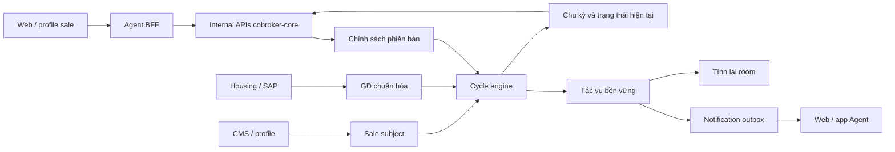

# BDSKD-9533 — Thiết kế kỹ thuật triển khai sáu US

Ngày lập: 05/10/2026. Trạng thái: **Đề xuất kỹ thuật để review và triển khai**, chưa phải quyết định nghiệp vụ được PO/BO phê duyệt.

Nguồn: [SRS Confluence bản 7](https://vin3s.atlassian.net/wiki/spaces/BMAS/pages/3174532173), cập nhật 01/10/2026; [guide yêu cầu](BDSKD-9533-dev-guide.md); [demo UI của PO](Demo_theo_doi_chu_ky_bán_final.html). Hiện trạng: code `staging` commit `31444ce6`, schema DB staging `cobroker_db` đã kiểm tra chỉ đọc.

Tên API, bảng và class **mới** trong tài liệu là hợp đồng đề xuất, chưa tồn tại trong code. Các file đang có được ghi riêng ở mục 3. Không chứa thông tin kết nối DB.

## 1. Kết quả cần bàn giao

| SRS | Backend | Frontend / hệ thống liên quan |
| --- | --- | --- |
| US-01 | Danh sách sale, dữ liệu chu kỳ, phân loại, phạm vi xem; engine chuyển kỳ; tích hợp điều kiện room | Bảng đủ cột, pin STT/họ tên, hiển thị hai nhóm chu kỳ đúng trạng thái |
| US-02 | Search/sort/filter, danh mục tổ chức trong quyền, phân trang | Bộ lọc nhiều lựa chọn, sort và điều hướng trang |
| US-03 | Xuất XLSX toàn bộ kết quả lọc, giới hạn 50.000, audit thao tác | Xác nhận số dòng xuất, tải file, thông tin giới hạn |
| US-04 | Chính sách có phiên bản/ngày hiệu lực, tức thì/tuần tự, lịch sử cấu hình | Form cấu hình và xem từng bản lịch sử |
| US-05 | Lập lịch, hủy, gửi và chống trùng thông báo | Web/app nhận thông báo qua hạ tầng Agent hiện có |
| US-06 | Ghi/sửa ngày bắt đầu bán, đồng bộ CMS, import dữ liệu cũ và tái tính | Profile đại lý có trường ngày; CMS quản lý ngày O2O/Tự doanh |

Không bổ sung API reset thủ công riêng từng sale, màn toàn bộ lịch sử chu kỳ hoặc hành động tự chấm dứt hợp đồng.

## 2. Các lựa chọn nghiệp vụ dùng để thiết kế

Các lựa chọn dưới đây giúp thiết kế nhất quán. Chỉ D01 dựa trực tiếp phần nguyên tắc SRS nhưng còn ghi chú BO; các lựa chọn khác là đề xuất xử lý chi tiết. Phải được chốt trước khi kích hoạt phần phụ thuộc ở production.

| Mã | Lựa chọn đề xuất | Trạng thái / phần phụ thuộc |
| --- | --- | --- |
| D01 | Chính thức đạt giữa kỳ vẫn giữ đến hết kỳ; thử thách thất bại khi GD < chỉ tiêu | SRS còn ghi chú/mâu thuẫn; chốt trước engine production |
| D02 | Một subject theo dõi ứng với một tài khoản Agent `agentProfileId`; hồ sơ con người chỉ là liên kết bổ sung | Chốt luật chuyển đại lý/tái gia nhập; không tự nối GD giữa hai account |
| D03 | Tuần tự: mỗi giai đoạn mới chọn rule mới nhất có hiệu lực tại ngày bắt đầu giai đoạn; giai đoạn đang chạy giữ rule cũ | Chốt chính thức thất bại chuyển thử thách dùng rule nào |
| D04 | Tức thì: reset tại ngày hiệu lực; GD trước ngày đó không cộng vào kỳ mới; không tự phục hồi trạng thái đề xuất chấm dứt | PO cần chốt đối tượng reset và GD giữ lại; chưa chốt thì từ chối lưu mode IMMEDIATE, không âm thầm đổi sang tuần tự |
| D05 | Dùng ngày nghiệp vụ Asia/Ho_Chi_Minh; cộng tháng theo LocalDate.plusMonths rồi trừ 1 ngày; bắt đầu kỳ tiếp bằng ngày kết thúc + 1 | Chốt ngày 29/30/31 và timezone; có thể thay DatePolicy trước rollout |
| D06 | Nhận GD trễ/hủy: cập nhật số GD và dựng lại kết quả từ thời điểm bị ảnh hưởng | Chốt hồi tố, room và thông báo; trước đó chỉ dry-run, không tự gửi thông báo sửa sai |
| D07 | Thiếu ngày/rule/mapping: ghi lý do chưa tính; không gán không đạt và không loại khỏi room chỉ vì thiếu dữ liệu | Chốt cách hiển thị; trạng thái kỹ thuật không thay bốn nhãn SRS |
| D08 | Lịch thông báo chung theo một phiên bản cấu hình, tách chính thức/thử thách; nhắc trước chỉ khi chưa đạt | UI gợi ý lịch chung; chốt chung/từng nhóm và nhắc sale đã đạt |
| D09 | Role 11/100 được cấu hình và sửa ngày; export theo quyền xem, có công tắc yêu cầu thêm role 25 | Chốt role 100/25 và role vùng; không tự cấp quyền cho role 212/216 từ module phân phối |
| D10 | Chỉ loại thử thách/đề xuất chấm dứt khỏi công thức room theo sale; không tự thu hồi căn, không sửa account status | Chốt xử lý room đã cấp, manual room và tác động điểm lực lượng |

Ví dụ D05: 31/01/2026 + 1 tháng - 1 ngày = 27/02/2026, kỳ tiếp bắt đầu 28/02. Đây là hệ quả cụ thể phải đưa BO xác nhận, không giả định tháng nào cũng kết thúc cuối tháng.

Không tạo hàng chục công tắc để che các luật chưa chốt. Sau khi PO xác nhận, cập nhật bảng quyết định và expected result của test tương ứng.

## 3. Kiến trúc và điểm tái sử dụng

### 3.1. Phân công hệ thống

- **Frontend web:** báo cáo, cấu hình, lịch sử, export và trường ngày trên profile. Sửa các điểm lệch của demo ở mục 11 guide.
- **Agent BFF/API:** xác thực user, đưa actor tin cậy xuống internal API, định tuyến và trả file XLSX. Public path phải chốt trong repo BFF; tài liệu này chỉ định nghĩa internal path core.
- **Cobroker-core:** lưu subject/chính sách/GD chuẩn hóa/chu kỳ, query báo cáo, engine, room integration và notification handler.
- **CMS/profile:** danh sách O2O/Tự doanh, mã nhân viên, org chart, ngày bắt đầu bán, danh mục và scope quản lý.
- **Housing/SAP adapter:** cung cấp GD cá nhân chuẩn hóa, trạng thái và revision. Không cho frontend gửi GD để tính chỉ tiêu.
- **Message delivery/Agent notification:** nhận thông báo cho đúng tài khoản web/app.



### 3.2. Các file hiện có

Đường dẫn tính từ gốc repo:

| Khu vực | File có sẵn | Cách sử dụng |
| --- | --- | --- |
| Hồ sơ/quan hệ đại lý | `src/main/java/vn/vinhomes/cobroker/core/model/CoBrokerProfile.java`, `AgencyCobroker.java` | Mapping subject, định danh account và tổ chức |
| Xác thực | `src/main/java/vn/vinhomes/cobroker/core/service/applicant/ApplicantEkycCompletionService.java` | Rà thêm OCR/manual approval, phát sự kiện lần đầu đã xác thực |
| Role | `src/main/java/vn/vinhomes/cobroker/core/service/AuthUserRoleService.java` | Resolve role actor, không lấy role từ request body |
| Mẫu ACL nội bộ | `src/main/java/vn/vinhomes/cobroker/core/service/distribution/impl/UnitAllocationAccessGuard.java` | Tham khảo trusted actor, cache role; viết guard riêng vì role khác |
| Paging/envelope | `src/main/java/vn/vinhomes/cobroker/core/dto/paging/PageDto.java`, `Pagination.java`, `src/main/java/vn/vinhomes/cobroker/core/dto/ServiceResponse.java` | Giữ shape response hiện tại |
| GD căn | `src/main/java/vn/vinhomes/cobroker/core/dto/distribution/event/SaleOrderChangeEvent.java`, `src/main/java/vn/vinhomes/cobroker/core/processor/PropertySoldProcessor.java` | Tham khảo đường nguồn; DTO chưa có saleId, không dùng ngay SOLD làm KPI |
| Room | `src/main/java/vn/vinhomes/cobroker/core/repository/UserRegisteredScopeRepository.java`, `src/main/java/vn/vinhomes/cobroker/core/service/distribution/impl/RoomServiceImpl.java` | Bổ sung điều kiện chu kỳ trong query room, giữ điều kiện cũ |
| Hook room hiện có | `src/main/java/vn/vinhomes/cobroker/core/service/distribution/helpers/AgencyRoomRecalcHook.java` | Hook hiện còn mark dirty điểm; không tái sử dụng mù quáng nếu điểm chưa được PO cho đổi |
| Notification | `src/main/java/vn/vinhomes/cobroker/core/service/notification/outbox/NotificationOutboxService.java`, `src/main/java/vn/vinhomes/cobroker/core/service/scheduler/NotificationOutboxScheduler.java` | Mở rộng enum/handler; cần thêm ledger gửi bền vững |
| XLSX | `src/main/java/vn/vinhomes/cobroker/core/controller/support/ExcelDownload.java` | Tham khảo MIME/header download |
| Migration | `src/main/resources/db.changelog/db.changelog-master.yaml` | includeAll ddl/data; tạo migration tiếp theo sau 0084, kiểm tra số mới nhất lúc implement |

Không thay `ACTIVE_LINK_JOIN` dùng chung cho mọi report để thêm điều kiện chu kỳ: có thể làm biến đổi cả số sale/điểm hiện tại. Tách query đếm sale cho room nếu chưa chốt tác động các report khác.

## 4. Mô hình dữ liệu đề xuất

Toàn bộ bảng mới thuộc `cobroker_db`. Dùng UUID, `date` cho ngày nghiệp vụ, `timestamptz` cho thời điểm sự kiện/audit. Enum lưu string. Không lưu bộ đếm số ngày rồi trừ 1 mỗi lần cron.

### 4.1. `sale_cycle_subject` — một tài khoản được theo dõi

| Field | Kiểu / ý nghĩa |
| --- | --- |
| id | UUID PK |
| agent_profile_id | varchar, NOT NULL, UNIQUE; khóa tài khoản theo D02 |
| cobroker_profile_id, agency_cobroker_id, agency_profile_id | UUID nullable; chỉ đại lý có các liên kết tương ứng |
| audience | AGENCY / O2O / SELF_BUSINESS |
| employee_code, identity_no, full_name, phone, email | Thông tin phục vụ query/export; theo chính sách dữ liệu hiện hành |
| department_id, region_id | varchar nullable, ID tổ chức; không ép chung kiểu integer từ CMS |
| department_name, region_name | Snapshot phục vụ báo cáo; cập nhật khi sync org |
| activity_status | ACTIVE / INACTIVE / PENDING_VERIFICATION / DRAFT; mapping rõ FROZEN/REQUEST_UPDATE trước khi ghi |
| start_date, start_date_source | date nullable; VERIFICATION / CMS / MANUAL / IMPORT |
| start_date_override | boolean; ngăn sync tự động ghi đè ngày do admin sửa |
| monitoring_status | READY / MISSING_START_DATE / FUTURE_START_DATE / MISSING_POLICY / IDENTITY_UNRESOLVED / REBUILDING / OUT_OF_SCOPE |
| cycle_classification | OFFICIAL_NOT_MET / OFFICIAL_MET / CHALLENGE / TERMINATION_PROPOSED; nullable nếu chưa tính |
| current_cycle_id, latest_official_cycle_id, latest_challenge_cycle_id | UUID nullable; pointers do engine ghi |
| room_excluded | boolean, default false; chỉ bật theo D10 và flag room |
| last_qualified_transaction_at | timestamptz nullable; đề xuất toàn bộ lịch sử GD hợp lệ, PO xác nhận phạm vi cột này |
| calculation_revision, version | bigint; revision kết quả và optimistic lock |
| source_updated_at, evaluated_at, evaluated_date | Thời điểm sync nguồn, tính kết quả và ngày nghiệp vụ đã xét |
| created_at/by, updated_at/by | Audit theo convention repo |

`monitoring_status` là trạng thái dữ liệu nội bộ. FE không trộn nó vào filter bốn nhãn SRS; hiển thị phân loại `-` và lý do chưa tính theo D07.

Ngày bắt đầu bán được lưu ở subject; API profile đại lý bổ sung field đọc qua subject. Không lưu hai nguồn master khác nhau ở subject và profile. Không xóa subject khi account inactive, vì SRS vẫn chạy chu kỳ.

### 4.2. `sale_cycle_policy` và `sale_cycle_policy_rule`

**Policy:** `id`, `version_no` UNIQUE, `effective_date`, `application_mode` SEQUENTIAL/IMMEDIATE, `status` SCHEDULED/EFFECTIVE, `notification_config` jsonb, `request_id` UNIQUE, `created_at/by`.

**Rule:** `id`, `policy_id`, `effective_date`, `audience`, `official_months`, `official_target`, `challenge_months`, `challenge_target`. UNIQUE `(policy_id, audience)` và `(audience, effective_date)`.

Một box UI chọn O2O + Tự doanh tạo hai rule cùng tham số. Không lưu nhiều audience trong một field để khỏi mập mờ rule áp dụng. Cho phép chỉ cập nhật một số nhóm: nhóm không có rule ở policy mới tiếp tục dùng rule hiệu lực gần nhất của chính nhóm đó.

Đề xuất mỗi ngày chỉ có một policy chứa cùng audience. Rule lưu thêm `effective_date` để enforce UNIQUE ở DB; thêm UNIQUE `(id,effective_date)` trên policy và composite FK rule `(policy_id,effective_date)` tới policy `(id,effective_date)` để ngày không lệch với policy cha. Service vẫn khóa khi cấp version và trả lỗi conflict dễ hiểu.

Policy đã lưu bất biến; không cập nhật trực tiếp nội dung policy cũ. Sửa/hủy policy tương lai chưa thuộc hợp đồng V1, cần bổ sung riêng khi PO yêu cầu.

Ví dụ `notification_config` theo D08:

```json
{
  "zoneId": "Asia/Ho_Chi_Minh",
  "official": {"remindDays": [1, 3, 7], "remindAt": "09:00", "endAt": "17:00"},
  "challenge": {"remindDays": [1, 3], "remindAt": "09:00", "endAt": "17:00"}
}
```

Thông báo là optional: null giờ hoặc danh sách rỗng nghĩa không bật loại đó. Nếu chọn lịch riêng từng nhóm, chuyển config xuống rule và cập nhật hợp đồng FE trước implement.

### 4.3. `sale_cycle_period` — các kỳ đã tính

Fields: `id`, `subject_id` FK, `generation`, `sequence_no`, `kind` OFFICIAL/CHALLENGE, `policy_rule_id` FK, `policy_id` FK, `start_date`, `scheduled_end_date`, `effective_end_date`, `target`, `transaction_count`, `achieved_date`, `lifecycle` BUILDING/CURRENT/COMPLETED/SUPERSEDED, `result` null/MET/NOT_MET/RESET, `closed_at`, `created_at/by`.

- `scheduled_end_date` là hạn dự kiến theo tháng.
- `effective_end_date` là ngày đóng thực tế: bằng hạn dự kiến, ngày đạt thử thách hoặc ngày trước reset tức thì.
- Snapshot chỉ tiêu/policy rule khi mở kỳ; không đọc rule mới nhất để đổi kỳ đang chạy.
- `transaction_count` là số từ facts, không tăng trực tiếp theo từng Kafka event.
- `generation` đổi khi rebuild; kỳ cũ chuyển SUPERSEDED để giữ audit.
- BUILDING dành cho generation đang dựng qua checkpoint; list/room/notification không đọc các row này. Task lưu generation, input revision và checkpoint trong payload; lúc publish đổi chúng thành COMPLETED/CURRENT theo kết quả cuối.

Ràng buộc: UNIQUE `(subject_id,generation,sequence_no)`; partial UNIQUE `(subject_id)` WHERE lifecycle = CURRENT; CHECK ngày hợp lệ và target > 0 theo validation đề xuất. Subject terminal không có current period nhưng giữ latest pointers.

Trong ngày thử thách đạt: ghi achieved_date/effective_end_date=today nhưng vẫn CURRENT đến hết ngày; current classification vẫn CHALLENGE. Hôm sau chuyển COMPLETED và tạo OFFICIAL. Cách này bảo đảm room chỉ khôi phục hôm sau, không ngay giữa ngày.

### 4.4. `sale_cycle_transaction_fact` — giao dịch chuẩn hóa

Fields: `id`, `source`, `business_transaction_id`, `source_revision`, `source_updated_at`, `agent_profile_id`, `subject_id` nullable FK, `business_at`, `business_date`, `qualification` QUALIFIED/REVOKED/PENDING, `mapping_status` RESOLVED/UNRESOLVED/CONFLICT, `source_trans_code/status`, `raw_reference`, `payload_hash`, `received_at`.

UNIQUE `(source,business_transaction_id)`. `business_transaction_id` phải là khóa chuẩn hóa xuyên các bước TTĐC/TTKQ của cùng GD, không dùng mặc định mỗi document SAP là một GD. V1 giả định một GD hưởng chỉ tiêu cho một sale; nếu BO xác nhận nhiều người được hưởng, cần bảng attribution trước tích hợp.

Sai mapping vẫn lưu fact unresolved, không cộng vào sale bất kỳ. Event cũ hơn revision đã lưu bị bỏ qua; cùng revision nhưng payload khác đưa vào conflict và cảnh báo. Delete/hủy phải có tombstone revision để event cũ không phục hồi GD.

Lưu before/after fact trong audit để truy nguyên hủy/chuyển sale. Nguồn phải hỗ trợ revision hoặc cách xác định thứ tự tương đương; không dùng `received_at` làm thứ tự nghiệp vụ.

### 4.5. `sale_cycle_task` — tác vụ có retry

Fields: `id`, `type` EVALUATE_SUBJECT/REBUILD_SUBJECT/RECALC_AGENCY_ROOM, `aggregate_key`, `dedupe_key` UNIQUE, `target_revision`, `payload` jsonb, `status` PENDING/RUNNING/DONE/FAILED, `available_at`, `attempts`, `lease_until`, `last_error`, audit timestamps.

Tác vụ được tạo cùng transaction thay đổi dữ liệu. Worker claim theo batch với `FOR UPDATE SKIP LOCKED`, có lease/retry/backoff; lease hết phải được lấy lại. Dedupe theo aggregate + revision, không chỉ aggregate để khỏi mất cập nhật xảy ra khi worker đang chạy.

Không coi callback afterCommit trong RAM là bảo đảm tác vụ room đã được giao. Sau crash phải còn row pending để retry.

### 4.6. `sale_cycle_notification_delivery`

Fields: `id`, `subject_id`, `period_id`, `generation`, `type`, `scheduled_at`, `dedupe_key` UNIQUE, `status` PENDING/SENT/CANCELED, `provider_message_id`, `sent_at`, `skip_reason`, audit timestamps.

Một row là một lần nhắc/kết quả. ObjectId của notification outbox bằng delivery.id. Giữ row SENT sau khi outbox bị xóa; đây là bằng chứng chống enqueue lại sau scheduler restart/replay.

### 4.7. Audit và export

`sale_cycle_audit`: `id`, `subject_id/policy_id/fact_id` nullable, `action`, `actor`, `reason`, `before_snapshot`, `after_snapshot`, `calculation_revision`, `request_id`, `created_at`. Ghi sửa ngày, import, đổi policy, hủy/chuyển fact, chuyển kỳ và rebuild. Không cần màn lịch sử kỳ ở V1.

`sale_cycle_export_log`: `id`, `actor`, `normalized_filter`, `scope_summary`, `sort`, `total_matched`, `exported_rows`, `truncated`, `snapshot_at`, `status` STARTED/GENERATED/FAILED, `created_at`, `error_code`. GENERATED nghĩa server đã tạo file, không khẳng định người dùng đã tải xong.

### 4.8. Index và migration

- Subject: audience/activity/classification, agency_profile_id, department_id, region_id, evaluated_date; name search/sort key. Search contains có thể cần pg_trgm sau khi kiểm tra extension và query plan.
- Period: `(subject_id,generation,start_date)` và current partial index.
- Fact: `(subject_id,business_date)` WHERE qualification=QUALIFIED AND mapping_status=RESOLVED; unresolved/revision index.
- Policy rule: index `(audience,effective_date)` từ UNIQUE phục vụ lookup rule mới nhất; dùng composite FK như mục 4.2.
- Task: `(status,available_at)`; Delivery: `(status,scheduled_at)`.
- Pointer FK subject → period có thể thêm sau khi tạo hai bảng; chỉ ghi pointers sau khi period đã tồn tại trong transaction.

Migration chỉ tạo schema/ràng buộc, không kích hoạt engine hoặc đưa toàn bộ sale vào thử thách. Không hardcode ID khối staging trong data migration.

## 5. API nội bộ và phân quyền

### 5.1. Convention

Base path đề xuất: `/internal/v1/sale-cycles`.

Response JSON theo `ServiceResponse<T>`; danh sách dùng `PageDto<T>`/`Pagination`. API mới thống nhất page 1-based, default 1; pageSize default 20, nhận 1..20 và reject ngoài khoảng. Không để Pageable tự nhận page 0-based ở endpoint này.

Request từ BFF phải có `X-VHMAgent-UserId` được BFF suy từ session, qua cơ chế xác thực nội bộ hiện hành. Không dùng `RequestActorUtil.resolveCurrentActorId()` làm ACL vì có fallback header/principal; guard mới chỉ tin actor header được internal boundary bảo vệ. Browser không được gọi internal API trực tiếp.

### 5.2. Endpoint

| Method / path sau base | Mục đích | Quyền |
| --- | --- | --- |
| GET `/` | US-01/02 list/search/sort/filter | Scope theo role SRS |
| GET `/filter-options` | Nhóm, tổ chức, trạng thái và phân loại được phép | Cùng scope list |
| POST `/exports/preview` | Số kết quả, số xuất và cắt giới hạn | Quyền export D09 |
| POST `/exports` | Tạo XLSX theo cùng filter | Quyền export D09 |
| POST `/policies` | Tạo phiên bản policy | Role 11/100 theo D09 |
| GET `/policies` | Lịch sử policy | Role 11/100 |
| GET `/policies/{policyId}` | Chi tiết đầy đủ một bản | Role 11/100 |
| PATCH `/subjects/{subjectId}/start-date` | Sửa ngày đại lý | Role 11/100; chỉ subject AGENCY |
| POST `/start-date-imports/preview` | Validate file CSV, chưa ghi | Tác vụ IT, không expose menu reset |
| POST `/start-date-imports` | Import đã kiểm chứng, enqueue rebuild | Service/operator đã phân quyền riêng |

Luồng event CMS/SAP dùng consumer/service integration, không mở quyền cho role quản trị UI gọi ingestion.

### 5.3. Scope truy cập

`SaleCycleAccessGuard` resolve role qua `AuthUserRoleService`. `SaleCycleScopeResolver` resolve đại lý/vùng/subtree qua link active và org adapter.

- 11/100: global theo D09.
- 64: đại lý của actor, resolve server-side; không lấy agencyId body làm quyền.
- 20/23/60: subtree quản lý hợp lệ từ CMS/profile, có thể gồm chính actor.
- Role vùng: chỉ bật sau khi mapping role/region được xác nhận.
- Nhiều role: hợp nhất scope được cấp; filter luôn giao với scope. Nếu client cố chọn tổ chức ngoài scope, trả forbidden, không để lọc rỗng biến thành global.
- Service role/org lỗi hoặc scope chưa xác định: fail closed, không dùng cache rỗng làm global.

Dùng cùng `ScopedSaleCycleQuery` cho list, options, preview, export. Kiểm tra lại quyền lúc export; không tin kết quả preview trước đó là giấy phép.

### 5.4. Filter và sort

Query: `keyword`, `audiences`, `activityStatuses`, `classifications`, `departmentLevel`, `departmentIds`, `agencyProfileIds`, `regionIds`, `page`, `pageSize`, `sortBy`, `sortDirection`.

- Keyword OR theo fullName/agentProfileId/employeeCode/identityNo; trim, escape wildcard, giới hạn độ dài đề xuất 200.
- Search tên không phân biệt hoa thường; đề xuất không phân biệt dấu qua normalized name. Chốt collator Vietnamese và sort key, không giả định ORDER BY raw name là A–Z tiếng Việt.
- Sort whitelist: name, officialStartDate/EndDate/RemainingDays/TransactionCount, challengeStartDate/EndDate/RemainingDays/TransactionCount, lastTransactionAt. Nulls last cả hai hướng, tie-break bằng subject.id.
- Department filter chọn cấp và subtree server-side; đại lý/vùng là dimensions riêng, không giả bộ tên đại lý là phòng KD.
- Không thêm filter doanh thu/xếp hạng trước khi PO xác nhận nội dung thừa US-02.

### 5.5. Row response

Ví dụ `data.items[0]` (các ngày/số dưới đây minh họa nhất quán tại 05/10):

```json
{
  "subjectId": "00000000-0000-0000-0000-000000000001",
  "agentProfileId": "demo-sale-001",
  "fullName": "Sale A",
  "audience": "AGENCY",
  "employeeCode": null,
  "identityNo": "demo-id",
  "phone": null,
  "email": null,
  "department": {"id": "agency-01", "name": "Đại lý A"},
  "region": {"id": "region-01", "name": "Vùng 1"},
  "activityStatus": "ACTIVE",
  "startDate": "2026-08-01",
  "cycleLabel": "4 tháng - 6 tháng",
  "monitoringStatus": "READY",
  "classification": "OFFICIAL_NOT_MET",
  "official": {
    "startDate": "2026-08-01", "endDate": "2026-11-30",
    "remainingDays": 56, "transactionCount": 0, "target": 1
  },
  "challenge": null,
  "lastTransactionAt": null,
  "evaluatedAt": "2026-10-05T02:00:00Z",
  "calculationRevision": 1
}
```

FE map enum sang nhãn SRS, null thành `-`. Đang chính thức thì challenge=null dù có latest_challenge pointer. Đang thử thách/terminal trả hai kỳ liền kề cuối cùng. `remainingDays = max(0, DAYS.between(today,endDate))`; với kỳ đã đóng sớm hiển thị effective end theo đề xuất, cần PO xác nhận cách hiển thị hạn gốc khi thoát thử thách.

`cycleLabel` lấy rule của kỳ hiện tại; nếu hai kỳ khác rule, trả thêm policy version từng nhóm để không giấu khác biệt. `evaluatedAt` cho biết độ mới; GET không tự chạy engine hoặc phát thông báo.

### 5.6. Tạo policy

```json
{
  "requestId": "00000000-0000-0000-0000-000000000002",
  "effectiveDate": "2026-11-01",
  "applicationMode": "SEQUENTIAL",
  "groups": [
    {"audiences": ["O2O", "SELF_BUSINESS"], "officialMonths": 3,
     "officialTarget": 1, "challengeMonths": 3, "challengeTarget": 1},
    {"audiences": ["AGENCY"], "officialMonths": 4,
     "officialTarget": 1, "challengeMonths": 6, "challengeTarget": 1}
  ],
  "notificationConfig": {
    "zoneId": "Asia/Ho_Chi_Minh",
    "official": {"remindDays": [1, 3, 7], "remindAt": "09:00", "endAt": "17:00"},
    "challenge": {"remindDays": [1, 3], "remindAt": "09:00", "endAt": "17:00"}
  }
}
```

Validation cả FE và BE: ngày > businessToday; group nonempty, audience không trùng trong request; tháng/GD là integer > 0 theo đề xuất (PO chốt giới hạn trên); giờ hợp lệ; nhắc ngày integer >= 0, dedupe/sort; lịch optional phải đi theo cặp danh sách + giờ. RequestId cùng payload trả bản đã tạo, khác payload trả conflict.

Backend khóa hàng quản lý policy hoặc advisory transaction lock trước kiểm tra/truyền version để tránh hai request cùng ngày/audience. Hệ thống xét hiệu lực bằng effective_date, không chỉ status do job có thể chậm.

Lịch sử chi tiết phải trả ngày hiệu lực, cơ chế áp dụng, người/thời gian tạo, từng nhóm/rule và lịch nhắc. Không lặp lỗi demo mọi data-id mở một bản.

### 5.7. Sửa ngày bắt đầu bán

Request: `startDate`, `reason`, `expectedVersion`, `requestId`. Không cho null/xóa ngày ở V1; ngày tương lai chưa được PO duyệt thì reject. Import/service backdated riêng, không dùng quyền UI cấu hình policy để bỏ qua mọi kiểm tra.

Trong transaction: khóa subject, kiểm tra version/quyền, ghi ngày mới + override + audit, đặt monitoring_status=REBUILDING, enqueue REBUILD. Trả trạng thái đang tính lại, không báo chu kỳ đã cập nhật khi job chưa xong. Rebuild xong atomically thay pointers/classification; trong lúc rebuild giữ kết quả cũ với cờ stale và giữ room cũ cho đến khi kết quả mới được kiểm chứng theo D06.

API profile đại lý hiện có cần thêm read field ngày, source và `canEditStartDate`. FE gọi endpoint này khi lưu; không sửa ngày trong nhiều service rồi mất nguồn master.

### 5.8. Lỗi

Thêm symbolic AppErrorCode theo convention hiện tại, cấp số khi implement: `SALE_CYCLE_FORBIDDEN`, `INVALID_FILTER`, `INVALID_START_DATE`, `INVALID_POLICY`, `POLICY_CONFLICT`, `VERSION_CONFLICT`, `SOURCE_MAPPING_UNRESOLVED`, `DECISION_NOT_CONFIGURED`, `REBUILD_IN_PROGRESS`.

Không trả stacktrace. Lỗi quyền theo cơ chế exception/response repo; BFF thống nhất map HTTP 400/403/409 trước chốt public contract. File download dùng MIME XLSX, filename ASCII, không bọc bytes trong ServiceResponse JSON.

## 6. Nguồn dữ liệu và hợp đồng tích hợp

### 6.1. Subject/profile adapter

Đại lý: mapping `agency_cobroker.agent_profile_id` tới hồ sơ con người/đại lý; giữ account inactive trong theo dõi. Không lấy query chỉ đếm ACTIVE làm danh sách mọi đối tượng báo cáo.

O2O/Tự doanh: adapter cung cấp agentProfileId, roleIds, audience theo tổ tiên khối, mã nhân viên, org leaf/region, trạng thái và startDate. ID khối cấu hình theo môi trường; role allowlist gồm 21/20/23/60. Không lấy `ReportIngestProperties` đang phục vụ report khác làm bằng chứng đã ingest đủ đối tượng.

Profile/org sync chỉ cập nhật snapshot khi sourceVersion mới hơn. Không ghi đè startDate manual override từ sync tự động. CMS là owner ngày O2O/Tự doanh; manual UI core chỉ áp dụng đại lý.

### 6.2. Giao dịch SAP/Housing

Hợp đồng **chuẩn hóa đề xuất**, không phải topic/payload đã tồn tại:

```json
{
  "eventId": "source-event-123",
  "source": "HOUSING_SAP",
  "businessTransactionId": "normalized-tx-123",
  "sourceRevision": 4,
  "agentProfileId": "demo-sale-001",
  "businessAt": "2026-10-05T01:30:00Z",
  "qualification": "QUALIFIED",
  "sourceTransCode": "TO_BE_CONFIRMED",
  "sourceTransStatus": "TO_BE_CONFIRMED",
  "sourceUpdatedAt": "2026-10-05T01:31:00Z"
}
```

Phải nhận mẫu thật và chốt mapping mã TTĐC/TTKQ trước viết adapter. Không suy ra KPI bằng status map của PropertySoldProcessor; map đó phục vụ trạng thái căn, có quy tắc khác.

Flow: validate → upsert fact theo revision → audit before/after → enqueue EVALUATE/REBUILD cho subject bị ảnh hưởng → commit → acknowledge event. Nếu đổi attribution, enqueue cả subject cũ và mới. Unresolved lưu để retry khi mapping có; poison event vào cơ chế dead-letter/quarantine vận hành, không ghi nhận GD giả.

Đề xuất nguồn timestamp tính businessDate theo D05. Không fallback ngày nhận event khi businessAt thiếu vì có thể chuyển GD sang kỳ sai. Trạng thái thiếu ngày ghi unresolved và có metric.

## 7. Engine tính và chuyển chu kỳ

### 7.1. Các invariant

- Một subject tối đa một CURRENT period.
- Cùng GD không được cộng hai lần do nhiều trạng thái SAP/replay.
- Giao dịch thuộc khoảng ngày của kỳ, inclusive hai đầu; kỳ kế tiếp không chồng ngày.
- Chính sách của kỳ được đóng băng khi mở, chỉ reset/rebuild theo quyết định riêng mới thay.
- Engine không đổi activity_status hoặc role để phản ánh classification.
- Terminal không tự phục hồi vì GD mới hoặc policy tuần tự; hồi tố/reset terminal là quyết định D04/D06.

### 7.2. Thuật toán theo thứ tự ngày nghiệp vụ

`evaluate(subjectId, asOfDate)` dùng Clock inject và zone thống nhất:

1. Khóa subject (`SELECT ... FOR UPDATE`), kiểm tra đầu vào ngày/mapping/policy.
2. Nếu thiếu dữ liệu: ghi monitoring_status, audit cần thiết; giữ room exclusion theo D07, không tạo kỳ thất bại.
3. Với subject mới, tạo kỳ chính thức từ start_date theo rule hiệu lực tại ngày đó. Ngày ở tương lai chưa mở kỳ.
4. Lấy facts hợp lệ đã resolve, sort `(business_date, business_at, business_transaction_id)`.
5. Xét tuần tự các mốc: ngày hiệu lực IMMEDIATE đã duyệt, ngày đạt chỉ tiêu, ngày hết kỳ và ngày bắt đầu kỳ tiếp. Reset tức thì có hiệu lực từ đầu ngày, nên GD trong ngày hiệu lực thuộc kỳ mới.
6. Chính thức: tính GD đến min(asOfDate,endDate); gán MET/NOT_MET hiện tại. Khi asOfDate > endDate, đóng kỳ rồi mở chính thức nếu đạt, thử thách nếu không.
7. Thử thách: tìm ngày GD thứ `target` được xác nhận. Nếu đã đạt, effectiveEnd=achievedDate; chỉ mở chính thức khi asOfDate > achievedDate. Nếu hết hạn chưa đạt thì terminal.
8. Lặp tới kỳ bao phủ asOfDate hoặc terminal. Job trễ nhiều tháng phải đi qua mọi mốc, không chỉ chuyển một bước.
9. Cập nhật period/pointers/classification/lastTx/revision và tasks/notification intents trong cùng transaction.
10. Commit; các side effect được worker xử lý sau, không gọi HTTP delivery khi đang giữ DB lock.

Khi đạt thử thách, GD khác cùng ngày vẫn thuộc ngày cuối thử thách; chính thức mới bắt đầu hôm sau. Không chuyển những GD đó sang chính thức mới.

Giới hạn số mốc xử lý mỗi lần có checkpoint/resume để tránh transaction quá lớn với dữ liệu nhiều năm. Nếu vượt giới hạn, giữ REBUILDING và chưa publish kết quả một phần làm kết quả cuối.

### 7.3. Đổi policy

SEQUENTIAL chọn rule hiệu lực tại mỗi ngày bắt đầu kỳ theo D03. Sale bắt đầu đúng effectiveDate dùng rule mới (`effective_date <= start_date`).

IMMEDIATE, nếu D04 đã duyệt: tại effectiveDate đóng kỳ trước bằng effectiveDate - 1 (result RESET), mở OFFICIAL mới từ effectiveDate theo rule mới. Tránh tạo kỳ rỗng khi reset đúng startDate; chọn rule mới trực tiếp. Subject terminal không được tự phục hồi theo baseline; nếu PO chọn khác phải cập nhật đặc tả/tests.

### 7.4. Rebuild/hồi tố

Sửa startDate/fact quá khứ khiến kết quả có thể khác chuỗi đã ghi. Dựng generation mới từ mốc sớm nhất cần tính; nếu mốc trước policy lịch sử bị thiếu, dừng và báo MISSING_POLICY, không lấy policy mới nhất hồi tố toàn bộ.

Rebuild phải xử lý các policy IMMEDIATE lịch sử theo thứ tự ngày, không chỉ lặp phép cộng tháng. Với terminal bị ảnh hưởng bởi GD cũ, D06 quyết định có được thay kết quả terminal; giao dịch có businessDate sau thử thách kết thúc không tự cứu kỳ cũ.

Publish trong một transaction có khóa subject: kiểm tra revision đầu vào còn đúng, chuyển generation cũ sang SUPERSEDED trước khi insert/promote CURRENT mới để không vi phạm partial UNIQUE, rồi đổi pointers/classification, ghi audit, hủy delivery PENDING cũ và tạo room task khi exclusion đổi. Nếu dựng dữ liệu qua nhiều checkpoint, giữ generation mới ở BUILDING cho tới khi publish; không supersede kết quả cũ từ checkpoint đầu. Input revision thay đổi thì bỏ kết quả dựng cũ và enqueue lại. Giữ ledger SENT; không tự gửi lại mọi thông báo lịch sử. Dry-run trả diff phân loại/room/chu kỳ trước khi import lớn áp dụng side effects.

## 8. Scheduler, đồng thời và tính mới dữ liệu

- `SaleCycleDailyScheduler`: sau 00:00 business zone (đề xuất 00:05), enqueue subjects có kỳ cần chuyển hoặc evaluatedDate < today. Có catch-up sau downtime.
- `SaleCyclePolicyScheduler`: tìm policy tới hiệu lực, đánh dấu EFFECTIVE, enqueue đúng audience; IMMEDIATE theo D04. Đừng dựa vào job để lookup policy duy nhất.
- `SaleCycleTaskScheduler`: drain EVALUATE/REBUILD/ROOM theo batch, ShedLock điều phối cron + DB lease bảo vệ tác vụ. Mỗi subject một transaction, lỗi subject này không dừng toàn bộ.
- Event mới enqueue evaluate ngay; không chờ cron ngày mới cập nhật số GD giữa ngày. Đề xuất mục tiêu cập nhật vài phút, phải chốt SLA với nguồn, không hứa real-time khi nguồn trễ.
- Job full reconciliation định kỳ so sánh facts/classification/room, bù tasks mất hoặc stale. Không dùng GET để bù state.

Lock order: policy/global config trước subject khi cùng thao tác; evaluate khóa subject rồi đọc policy bất biến; room worker chỉ lấy committed projection và khóa room theo convention hiện tại, không giữ subject lock khi tính toàn bộ agency.

Task mới hơn có thể xuất hiện khi worker chạy. Worker kết thúc chỉ đánh DONE chính revision đã claim; không xóa task aggregate mới. Nếu revision đọc khác, enqueue/drain lại tới kết quả hiện tại.

## 9. Tích hợp room

**Ý nghĩa triển khai:** subject thử thách không được cộng vào số sale dùng công thức cấp room đại lý. Không đồng nghĩa tự cấm mọi hoạt động bán của sale.

Tạo query riêng `countRoomEligibleSalesByAgency`: giữ predicate sale hợp lệ hiện có, thêm điều kiện không có subject với `room_excluded=true`. LEFT JOIN/NOT EXISTS để sale chưa được khởi tạo không bị loại vì NULL theo D07.

Feature flag room=false: query giữ hành vi cũ. room=true: chỉ subject thuộc audience AGENCY đã READY và kết quả được publish mới tác động theo D10. Đề xuất terminal tiếp tục bị loại; cần PO duyệt.

Khi exclusion hoặc agency mapping đổi, trong cùng transaction ghi RECALC_AGENCY_ROOM cho cả đại lý cũ/mới. Worker gọi room recalc từ dữ liệu committed, tính lại số tuyệt đối; retry không cộng/trừ thủ công nhiều lần. Chỉ đổi các đợt đang hoạt động theo luồng room hiện hành.

Không gọi nguyên `AgencyRoomRecalcHook` nếu chưa muốn thay điểm lực lượng: hook hiện còn mark `AgencyScoreDirtySet`. Xác nhận tác động điểm trước khi dùng hook này; nếu chưa, dùng room-only task gọi `RoomService.recalcBatchesForTeam` và kiểm tra side effects của service ở bước implement.

Trước bật room flag phải test trường hợp allocated/used room lớn hơn ngân sách mới và manual room. Nếu service hiện tại có hành vi thu hồi căn không phù hợp, bổ sung rule riêng sau PO xác nhận; không giả định recalc là vô hại.

O2O/Tự doanh cần adapter tới owner room tương ứng nếu có, không dùng UUID agency giả. Không tuyên bố hoàn thành toàn bộ scope room khi chỉ làm co-broke.

## 10. Thông báo

### 10.1. Lập lịch

Bốn loại: OFFICIAL_REMINDER, OFFICIAL_FAILED, CHALLENGE_REMINDER, CHALLENGE_FAILED.

- Nhắc: `max(period.startDate, scheduledEndDate.minusDays(offset))` tại remindAt/zone.
- Nhiều offset cùng rơi một thời điểm: gộp một thông báo theo đề xuất D08.
- Kết quả: effectiveEndDate + 1 tại endAt; OFFICIAL_FAILED chỉ khi chuyển thử thách, CHALLENGE_FAILED chỉ khi terminal.
- Thử thách đạt sớm: hủy nhắc/kết quả thất bại chưa gửi. Chưa thêm thông báo thành công vì SRS không định nghĩa.
- Catch-up/import không gửi một loạt nhắc đã qua. Đề xuất chỉ gửi thông báo đến hạn trong ngày hiện tại; cửa sổ gửi bù khác cần PO chốt.

Dedupe key: `subjectId:periodId:generation:type:scheduledAt`. Mọi reminder có objectId delivery riêng nên không bị overwrite vì outbox unique theo object/type.

### 10.2. Dùng outbox hiện tại

Thêm `OutboxObjectType.SALE_CYCLE_NOTIFICATION`, enum loại tương ứng và `SaleCycleNotificationOutboxHandler`. Đăng ký handler cùng rollout enum, vì scheduler hiện xóa row không có handler.

Enqueue delivery/outbox cùng transaction hoặc qua task đảm bảo retry. Trước gửi, handler đọc generation/classification và delivery status; stale/canceled thì SKIP. Khi gửi thành công đánh SENT/ghi provider id; scheduler hiện sẽ xóa row outbox, ledger vẫn giữ.

Outbox hiện có enqueueIfAbsent chỉ chống trùng khi row còn tồn tại; không đủ chống gửi lại sau row đã bị drain. Ledger SENT giải quyết enqueue lại, nhưng còn crash sau provider nhận và trước DB ghi SENT. Muốn chống trùng end-to-end cần provider hỗ trợ idempotency key=delivery.id. Nếu không, delivery là at-least-once và phải báo rõ khả năng duplicate; không hứa exactly-once.

### 10.3. Nội dung và receiver

Receiver lấy agentProfileId subject, không lấy accountId/agencyId làm username. Giữ nội dung bốn thông báo của US-05, thay ngày dd/MM/yyyy theo kỳ. Chốt channel/event code với MessageDeliveryClient hiện có. Không thêm email/SMS hoặc màn xem tiến độ cá nhân ngoài SRS.

## 11. Excel và frontend

### 11.1. Export

Preview trả `totalMatched`, `exportRows=min(totalMatched,50000)`, `truncated`, filter/sort đã normalize; FE popup dùng số đó thay rowData.length.

Export kiểm tra lại scope/filter; truy vấn tối đa 50.001 để phát hiện truncation, viết 50.000 bằng SXSSF hoặc cách stream tương đương đã có dependency. Giữ cùng whitelist sort/tie-break với list. Dùng một DB snapshot read-only REPEATABLE READ cho count/data trong export nếu nguồn query local; không gọi nguồn external mỗi dòng.

Preview và export là hai thời điểm khác nhau nên số có thể đổi. Header trả `X-Export-Row-Count`, `X-Export-Truncated`, `X-Export-Snapshot-At`; BFF expose các header này cho FE. Null và định dạng ngày/số thống nhất với báo cáo. Ô định danh/SĐT ghi kiểu text để giữ số 0 đầu và tránh Excel coi dữ liệu đầu `=` là công thức.

Thêm export_log trước generate; GENERATED/FAILED sau generate. Stream theo batch và dispose temp workbook trong finally. Không nạp 50.000 entity đầy đủ cộng N+1 tên tổ chức vào heap. Template cuối cần đối chiếu Excel PO cung cấp.

### 11.2. UI theo sáu US

- List giữ đủ cột; không ẩn ID hệ thống trong search. Mặc định sort tên; nút sort thể hiện hướng.
- Filter gọi options scoped và list thật; clear nghĩa bỏ filter trong scope, không mở quyền.
- Pagination 20/page và tổng từ API, không hiển thị rowData.length.
- Policy form minDate=tomorrow theo businessToday server; vẫn validate BE. Month/target riêng chính thức/thử thách; cảnh báo group trống/trùng.
- History dùng policyId đúng bản, hiển thị mode/group/lịch nhắc; không lấy cùng detail tĩnh.
- Hủy chỉnh sửa không mutate bản policy đã lưu; draft chỉ thuộc FE cho đến POST thành công.
- Profile đại lý đọc ngày và canEdit; 64 chỉ xem. Ngày CMS không sửa qua form đại lý.
- Đồng nhất “Chu kỳ thử thách”, giải thích room bằng tooltip “không cộng vào số sale tính hạn mức căn cho đại lý”.
- State loading/empty/error/stale/rebuilding; không coi danh sách trống do upstream lỗi là không có sale.

## 12. Package/class cần bổ sung

Tất cả nằm dưới `vn.vinhomes.cobroker.core`; tên đề xuất:

| Package | Thành phần |
| --- | --- |
| `controller.internal.salecycle` | SaleCycleReportController, SaleCyclePolicyController, SaleCycleStartDateController, SaleCycleImportController |
| `dto.salecycle` | Filter, ListItem, PolicyRequest/Response, StartDateRequest, ExportPreview, SourceTransactionEvent |
| `entity.salecycle`, `repository.salecycle` | Entities/repositories theo mục 4; scoped query và khóa subject/task |
| `service.salecycle` | SubjectSyncService, PolicyService, CycleQueryService, StartDateService, TransactionFactService, CycleExportService |
| `service.salecycle.engine` | CycleEngine, CycleDatePolicy, PolicyResolver, TransactionCounter, CycleRebuildService |
| `service.salecycle.access` | SaleCycleAccessGuard, SaleCycleScopeResolver |
| `service.salecycle.integration` | CmsSaleAdapter, QualifiedTransactionAdapter, CycleRoomIntegrationService |
| `service.salecycle.notification` | NotificationPlanner, DeliveryService, SaleCycleNotificationOutboxHandler |
| `service.scheduler` | Daily/Policy/Task schedulers, tận dụng convention ShedLock |

Engine tính ngày và điều kiện nên là hàm thuần nhận facts/policies/asOfDate; persistence orchestration giữ transaction và outbox. Không nhét tất cả vào controller hoặc service profile hiện tại.

## 13. Import, rollout và vận hành

### 13.1. Import ngày cũ

CSV đề xuất: `agentProfileId,startDate,audience,reason`. UTF-8, date ISO; preview resolve subject, phát hiện duplicate, sai nhóm/ngày và dữ liệu thiếu. Không match bằng họ tên/SĐT.

Preview trả từng dòng hợp lệ/lỗi và số subject cần rebuild. Operator chạy commit bằng requestId/file checksum; retry không tạo bản import trùng. Audit source=IMPORT, actor và before/after ngày. Cấu hình policy backdated qua operator job riêng, ghi nguồn và lý do; không bỏ validation ngày UI.

### 13.2. Feature flags đề xuất

`feature.sale-cycle.enabled`, `feature.sale-cycle.ingest-enabled`, `feature.sale-cycle.scheduler-enabled`, `feature.sale-cycle.notification-enabled`, `feature.sale-cycle.room-enabled`, `feature.sale-cycle.immediate-policy-enabled`.

Mặc định off, bật theo môi trường. Engine có thể chạy dry-run mà room/noti vẫn off. Flag off phải được worker/handler kiểm tra, không chỉ không đăng ký cron; queued tác vụ vẫn có thể còn.

### 13.3. Thứ tự triển khai

1. Chốt quyết định mục 2, nguồn org/GD và service owner. Tạo migration + API DTO/ACL.
2. Ingest subject/startDate/facts, nhập policy ban đầu; chạy đối soát mapping và missing data.
3. Engine + rebuild + tasks, bật dry-run và so ví dụ BO xác nhận.
4. List/filter/export/policy/history/profile UI và test scope.
5. Notification ledger/handler, bật trên tập UAT có kiểm soát.
6. Room query/task, đối soát ngân sách trước/sau và test allocated/manual room.
7. Backfill dữ liệu thật, BO xác nhận; bật chính thức theo scope đợt bàn giao.

Nếu tháng 10 chưa có UI cấu hình, engine vẫn dùng cùng policy tables do operator nhập có audit; không hardcode 4–6/3–3 vào engine.

### 13.4. Quan sát và phục hồi

Metrics: số subject theo monitoring/classification, oldest unevaluated/task, task retry/failure, unresolved facts, source lag, delivery lag/duplicates, room recalc failures, export duration/rows. Log correlationId, subjectId/policyId/revision; không log CCCD/token/raw payload cá nhân đầy đủ.

Notification gate off: giữ/hủy PENDING theo kế hoạch rollout, không tự tạo flood khi bật lại. Room gate off: query trở về điều kiện cũ và chạy recalc các agency đã bị ảnh hưởng để khôi phục ngân sách nếu đó là quyết định rollback; chỉ tắt flag không tự sửa room đã ghi.

Không drop bảng hoặc xóa audit để rollback. Kết quả chu kỳ đã tính có thể giữ phục vụ điều tra. Không chạy test/import ghi trực tiếp DB staging do người dùng cung cấp nếu task chỉ viết tài liệu.

## 14. Kiểm thử cần có khi implement

| Nhóm | Tình huống và điều cần chứng minh |
| --- | --- |
| Ngày | 1/1+3 tháng; 29/30/31; năm nhuận; timezone; hết ngày mới chuyển kỳ |
| Chính thức | Đạt giữa kỳ giữ hạn; hết đạt mở chính thức; hết chưa đạt mở thử thách |
| Thử thách | Đạt đủ chỉ tiêu đóng trong ngày, room hôm sau; 1 GD/target2 chưa đạt; hết thử thách terminal |
| Policy | Tuần tự đúng rule mỗi kỳ; exact effectiveDate; instant giữa kỳ/đúng start; terminal; hai request policy đồng thời |
| Facts | Trùng event/TTĐC+TTKQ cùng GD; revision cũ; tombstone; cùng revision khác payload; đổi attribution cả hai sale |
| Hồi tố | GD trễ/hủy, sửa ngày, thiếu policy cũ, rebuild generation/pointers; không gửi lại SENT |
| Catch-up | Job dừng nhiều ngày/tháng, nhiều kỳ, đạt thử thách sớm; checkpoint không publish partial |
| Đồng thời | Hai worker cùng subject không tạo hai CURRENT; update fact khi evaluate chạy không mất nhiệm vụ |
| ACL | 11/100, 64 own/other agency, 20/23/60 subtree, role vùng, nhiều role, org lỗi; list/options/export/sửa ngày đều kiểm tra |
| Import/profile | Manual override không bị sync đè; xác thực lại không tự reset; ngày cũ import idempotent; thiếu mapping |
| Room | Chỉ trial/terminal bị loại theo D10; sale thiếu dữ liệu không bị loại; nhiều dự án đếm một; inactive vẫn giữ điều kiện cũ; allocated/manual room; retry số tuyệt đối |
| Notification | Mốc vượt độ dài kỳ, mốc trùng, trial đạt sớm, generation cũ, catch-up, provider timeout/crash boundary; thiếu handler không được mất thông báo |
| UI | Đủ nhóm cột, challenge null khi official, tên thống nhất, default sort, search ID, paging20, date validation, history đúng policyId |
| Export | Toàn bộ filter, 0/20/50000/50001 dòng, stable sort, snapshot, scope thay đổi, leading zero/formula-like text, cleanup workbook |

Unit test engine dùng fixed Clock và facts/policies cụ thể. Integration test repository/lock/outbox bằng DB test riêng (theo convention test repo), không mock DB để kết luận chống race. Test tích hợp adapter dùng payload thật đã ẩn dữ liệu nhạy cảm và hợp đồng source revision đã chốt.

Chạy test phù hợp từng module thay đổi; xác nhận Maven/test profile từ repo trước chạy. Không cần chạy application hay migration chỉ để kiểm tra tài liệu này.

## 15. Điều kiện hoàn thành

- Sáu US có API/UI hoặc integration tương ứng; không tuyên bố hoàn thành O2O/Tự doanh khi mới ingest đại lý.
- Mapping GD tới từng sale và policy history được xác nhận; D01–D10 cập nhật quyết định cuối.
- Engine, facts, rebuild và side effects có audit/retry và test ranh giới.
- List/export phân quyền nhất quán; history thể hiện đúng mode/groups/lịch.
- Ngày bắt đầu sale cũ được đối soát và không dùng ngày tạo profile thay thế tùy ý.
- BO xác nhận mẫu chu kỳ và room trước/sau; thông báo đúng receiver/ngày/giờ.
- Có rollout flags và cách phục hồi room/noti, không chỉ một nút bật engine.

Tài liệu này là thiết kế triển khai. Các luật chờ chốt được giữ rõ trong mục 2; sau khi có quyết định, sửa thiết kế và expected result trước khi bật production.
