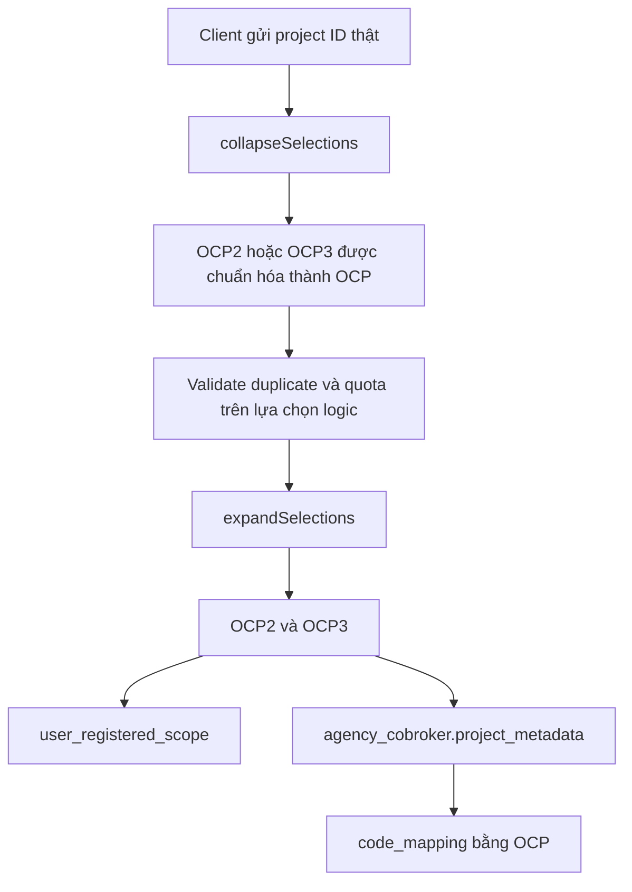

# MR 763 — BDSKD-6590 Project Mapping

> So sánh: `origin/staging...feat/huynv106/BDSKD-6590-ocp23-project-mapping`  
> Phạm vi tại thời điểm review: 18 file, 493 dòng thêm, 18 dòng xóa.  
> File này chỉ lưu local, không thuộc MR.

## 1. Mục tiêu

Cho phép OCP2 và OCP3 được xử lý như một lựa chọn khi kiểm tra giới hạn dự án của Sale, nhưng vẫn lưu và chuyển tiếp hai project ID thật cho scope, Profile MW và các consumer downstream.

OCP1 không nằm trong mapping và không bị ảnh hưởng.

| Giá trị | Ý nghĩa |
|---|---|
| `OCP` | Mã nội bộ tại `project_mapping.code` |
| `1706151042103_2822` | Project ID thật của OCP2 trên staging |
| `1707589000350_2804` | Project ID thật của OCP3 trên staging |
| `code_mapping` | Marker trong JSONB/response cho biết project vật lý được sinh từ mapping nào |

## 2. Luồng dữ liệu sau thay đổi



Ví dụ request hợp lệ:

```json
{
  "assignedProjects": [],
  "additionalProjects": ["1706151042103_2822"]
}
```

Kết quả metadata:

```json
[
  {
    "projectId": "1706151042103_2822",
    "type": "ADDITIONAL_REGISTERED",
    "code_mapping": "OCP"
  },
  {
    "projectId": "1707589000350_2804",
    "type": "ADDITIONAL_REGISTERED",
    "code_mapping": "OCP"
  }
]
```

Client không gửi `OCP` làm `projectId` và không cần gửi `code_mapping`.

## 3. Database và Liquibase

File mới: `src/main/resources/db.changelog/ddl/changelog-0051-project-mapping.sql`.

```sql
CREATE TABLE cobroker_db.project_mapping (
    code VARCHAR(64) PRIMARY KEY,
    name VARCHAR(255) NOT NULL UNIQUE,
    target_project_ids VARCHAR[] NOT NULL,
    created_at TIMESTAMPTZ NOT NULL DEFAULT CURRENT_TIMESTAMP,
    updated_at TIMESTAMPTZ NOT NULL DEFAULT CURRENT_TIMESTAMP,
    CONSTRAINT ck_project_mapping_targets_not_empty
        CHECK (cardinality(target_project_ids) > 0)
);
```

Seed được thêm bởi MR:

```text
code = OCP
name = Vinhomes Ocean Park 2+3
target_project_ids = [1706151042103_2822, 1707589000350_2804]
```

Rollback tách riêng cho phần tạo bảng và phần seed.

## 4. Thành phần mới

### `ProjectMappingEntity`

Map bảng `project_mapping` với các field `code`, `name`, `targetProjectIds`, `createdAt`, `updatedAt`. `target_project_ids` được map trực tiếp sang PostgreSQL `varchar[]`.

### `ProjectMappingRepository`

`JpaRepository<ProjectMappingEntity, String>`, khóa chính là `code`.

### `ProjectMappingService`

| Method | Nhiệm vụ |
|---|---|
| `findAll()` | Đọc toàn bộ cấu hình mapping |
| `findByCode(code)` | Tìm mapping theo khóa chính |
| `collapseSelections(metadata)` | Gom OCP2/OCP3 thành mã nội bộ `OCP` trước validation |
| `expandSelections(selections)` | Bung `OCP`, OCP2 hoặc OCP3 thành hai project ID vật lý |
| `preserveCodes(physical, previousMetadata)` | Gắn lại `code_mapping` sau khi metadata được rebuild từ scope |

`ProjectMappingServiceImpl` chỉ match theo `project_mapping.code` hoặc ID nằm trong `target_project_ids`. `name` không được dùng làm project ID.

## 5. Thay đổi trong JSONB

`AgencyCobrokerProjectJsonb` được bổ sung:

```java
@JsonProperty("code_mapping")
private String codeMapping;
```

- Java dùng camelCase: `codeMapping`.
- JSONB/API dùng snake_case: `code_mapping`.
- Project không thuộc mapping có giá trị `null` và field được bỏ khỏi JSON nhờ `@JsonInclude(NON_NULL)`.

## 6. Các luồng nghiệp vụ bị tác động

### Assignment batch và dynamic range

Các API liên quan:

```http
PUT  /internal/v1/agencies/{agencyId}/project-assignments/batch
POST /internal/v1/agencies/project-assignments/dynamic-range
```

`ProjectAssignmentMutationService.replace()` thay đổi từ validate trực tiếp project IDs sang:

```text
Kiểm tra collection không null
  -> collapseSelections
  -> normalizeProjects và kiểm tra quota/overlap
  -> expandSelections
  -> ghi physical scope
  -> ghi physical metadata kèm code_mapping
  -> audit
```

`ProjectAssignmentLists.toCommandLists()` được thêm để chuyển metadata đã collapse/expand về `ProjectLists` dùng bởi normalizer và scope store.

### Tạo và cập nhật CVKD

Các endpoint có dữ liệu `projects` đi qua `AgencyProfileServiceImpl` và `ProjectScopeLifecycleService`, gồm các luồng trực tiếp và staged update dưới `/internal/v1/agencies`.

`AgencyProfileServiceImpl` gọi `expandSelections()` khi:

- dựng `agency_cobroker.project_metadata`;
- dựng `assigned_projects` và `additional_projects` gửi Profile MW.

Profile MW chỉ nhận ID thật, không cần biết mã `OCP`.

### Đồng bộ scope và metadata

`ProjectScopeLifecycleService.replaceFromCobrokerInput()`:

1. Collapse project members về mapping code.
2. Validate trên lựa chọn logic.
3. Expand lại thành project IDs vật lý.
4. Ghi `user_registered_scope` bằng project IDs thật.
5. Ghi `project_metadata` kèm `code_mapping`.

`ProjectAssignmentMetadataService.rebuild()` gọi `preserveCodes()` vì `user_registered_scope` chỉ lưu project ID, không có `code_mapping`.

## 7. Danh sách file thay đổi

| File | Loại | Nội dung |
|---|---|---|
| `ProjectAssignmentLists.java` | Sửa | Thêm chuyển đổi sang `ProjectLists` |
| `ProjectMappingEntity.java` | Mới | Entity bảng mapping |
| `AgencyCobrokerProjectJsonb.java` | Sửa | Thêm `code_mapping` |
| `ProjectMappingRepository.java` | Mới | Repository mapping |
| `AgencyProfileServiceImpl.java` | Sửa | Expand project trước lưu/gửi Profile MW |
| `ProjectAssignmentCommandNormalizer.java` | Sửa | Tách kiểm tra collection null |
| `ProjectAssignmentMetadataService.java` | Sửa | Giữ mapping code khi rebuild |
| `ProjectAssignmentMutationService.java` | Sửa | Collapse, validate rồi expand |
| `ProjectMappingService.java` | Mới | Contract mapping |
| `ProjectMappingServiceImpl.java` | Mới | Logic lookup, collapse, expand, deduplicate |
| `ProjectScopeLifecycleService.java` | Sửa | Áp dụng mapping cho lifecycle CVKD |
| `changelog-0051-project-mapping.sql` | Mới | Tạo bảng và seed OCP |
| 6 file test hiện hữu | Sửa | Cập nhật dependency và assertion |
| `ProjectMappingServiceImplTest.java` | Mới | Test mapping bằng project ID thật |

## 8. Test coverage trong MR

Các trường hợp chính được kiểm tra:

- OCP2 được expand thành OCP2 và OCP3.
- Chọn cả OCP2 và OCP3 không tạo project vật lý trùng.
- OCP2/OCP3 collapse thành một selection `OCP`.
- Project bình thường giữ nguyên.
- `code_mapping` do client tự truyền không được tin cậy.
- JSON serialize đúng tên `code_mapping`.
- Mapping mới trong DB không cần sửa Java.
- Liquibase tạo đúng bảng, seed đúng hai ID và chặn array rỗng.

Bộ unit test liên quan đã chạy thành công: 168 test.

## 9. Điểm cần xử lý hoặc xác nhận trước khi merge

### 9.1. Catalog cap đang được kiểm tra trước khi collapse

`ProjectAssignmentCommandController` hiện gọi:

```java
projectCapValidator.validate(
        request.assignedProjects(),
        request.additionalProjects());
```

Lệnh này chạy trước `ProjectAssignmentMutationService.collapseSelections()`.

Hệ quả: nếu request gửi đồng thời OCP2 và OCP3, `ProjectAssignmentProjectCapValidator` có thể tính hai project, dù mutation phía sau tính một mapping slot. Gap này chỉ xuất hiện khi `project-assignment.project-catalog-cap-check-enabled=true`.

Khuyến nghị: cap validator cần collapse project IDs trước khi đếm, hoặc controller truyền danh sách đã collapse cho validator.

### 9.2. Quy tắc một project chỉ thuộc một mapping

Service phát hiện runtime nếu một project ID nằm trong nhiều bản ghi `project_mapping`, nhưng DB chưa có constraint bảo đảm uniqueness giữa các phần tử của nhiều array.

Cần quy định dữ liệu vận hành: một project ID chỉ được xuất hiện trong một mapping. Nếu số mapping tăng nhiều, cân nhắc chuẩn hóa thành bảng member riêng để tạo unique constraint.

### 9.3. Hành vi dữ liệu cũ

`preserveCodes()` chỉ copy marker từ metadata trước đó. Nó không tự gắn `code_mapping` cho scope legacy chưa từng có marker. Cần xác nhận có yêu cầu backfill dữ liệu OCP2/OCP3 cũ hay chỉ áp dụng cho lần ghi mới.

## 10. Kết luận review

MR đã xây dựng đúng nền tảng DB-driven và giữ project ID thật ở các hệ thống downstream. Luồng mutation chính đã collapse trước khi kiểm tra giới hạn và expand trước khi ghi scope.

Trước khi merge nên xử lý hoặc có quyết định rõ cho gap catalog cap tại controller. Đây là điểm có thể làm cùng một request được tính một slot ở mutation nhưng hai slot ở lớp kiểm tra phía ngoài.
