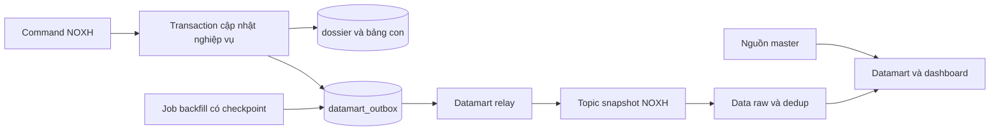

# NOXH — Mapping dữ liệu và đề xuất tích hợp Datamart


**Trạng thái:** tài liệu khảo sát và đề xuất implement; chưa thay đổi service hoặc triển khai luồng đồng bộ mới.


**Nguồn yêu cầu:** CSV `Ticket NOXH 09_2026`, gồm 58 metric.


**Nguồn đối chiếu:** source `vhm-dossier-core`, nhánh `staging`, commit `aaf3cbd`; DB staging `vhmmarket_db`, schema `dossier_db`, kiểm tra ngày 09/10/2026 bằng truy vấn chỉ đọc.


## 1. Kết quả xác minh


- DB có **571 hồ sơ SOCIAL_HOUSING**, trong đó **272 DRAFT**. Tỷ lệ có dữ liệu ở phụ lục dùng toàn bộ hồ sơ; chưa thể dùng tỷ lệ này để kết luận hồ sơ đã nộp bị thiếu.
- Có **12 loại event** trong `dossier_db.outbox_event`. Tên topic dưới đây được suy ra từ code relay, chưa xác nhận topic tồn tại hoặc đang có traffic trên Kafka broker.
- Tất cả event quan sát đã có `published_at`, nhưng `OutboxRelay` vẫn đánh dấu khi `publish-enabled=false`. Vì vậy dấu này chưa chứng minh Kafka đã nhận message. Cấu hình staging/prod mặc định publish là `false` nếu không có env override.
- Event tạo/cập nhật hiện tại không chứa toàn bộ `form_data`, nên chưa đủ để dựng tất cả 58 metric chỉ bằng cách subscribe các topic hiện có.
- `applicant.permanentAddress` có dữ liệu thực tế ở staging, dù JSON schema trong repo chưa khai báo.
- Account đã dùng nhìn thấy 19 bảng trong `dossier_db`; chưa xác nhận được bảng master dự án, đại lý, người dùng, template và checklist.


## 2. Mapping 58 metric


`mart_o2o` là schema đích do Data yêu cầu. Các bảng bắt đầu bằng `dossier_db.` thuộc database nguồn `vhmmarket_db`. Các biểu thức JSON là đường dẫn lấy giá trị từ cột `form_data`, không phải tên cột vật lý độc lập.


### 2.1. Hồ sơ


| STT | Metric | Bảng nguồn | Cột / JSON path / input | Ghi chú |
| --- | --- | --- | --- | --- |
| 1 | NOXH_profile_id | dossier_db.dossier | id | UUID khóa hồ sơ. Mã hiển thị BO nằm tại form_data.code; cần chốt UUID hay mã hiển thị. |
| 2 | NOXH_customer_name | dossier_db.dossier | form_data #>> '{applicant,fullName}' | Có mapping trong code; cần kiểm tra độ đầy đủ dữ liệu thực tế. |
| 3 | NOXH_project_name | dossier_db.dossier | form_data #>> '{projectRegistration,projectId}' | Chỉ lưu projectId; tên resolve qua Market. Bảng/cột master cần owner Market xác nhận. |
| 4 | NOXH_agency_name | dossier_db.dossier | form_data #>> '{projectRegistration,agencyId}' | Chỉ lưu agencyId; tên resolve qua AgentProfile. Bảng/cột master cần owner xác nhận. |
| 5 | NOXH_proposed_unit_info | dossier_db.dossier | form_data #>> '{projectRegistration,proposedUnitCode}' | Có mã căn đề xuất; nếu cần diện tích/tòa/tầng/giá phải lấy master căn và chốt trường. |
| 6 | NOXH_assigned_unit_code | dossier_db.dossier | form_data #>> '{projectRegistration,assignedUnitCode}' | Có mapping trong code; cần kiểm tra độ đầy đủ dữ liệu thực tế. |
| 7 | NOXH_marital_status | dossier_db.dossier | form_data #>> '{applicant,maritalStatus}' | Có mapping trong code; cần kiểm tra độ đầy đủ dữ liệu thực tế. |
| 8 | NOXH_housing_status | dossier_db.dossier | form_data #>> '{applicant,housingStatus}' | Có mapping trong code; cần kiểm tra độ đầy đủ dữ liệu thực tế. |
| 9 | NOXH_customer_eligible_group | dossier_db.dossier | form_data ->> 'subjectGroup' | Có mapping trong code; cần kiểm tra độ đầy đủ dữ liệu thực tế. |
| 10 | NOXH_spouse_eligible_group | dossier_db.dossier | form_data #>> '{spouse,subjectCoApplicant}' | Export BO dùng subjectCoApplicant cho spouseSubjectGroup; schema mô tả quan hệ đồng đăng ký. Cần xác nhận nghiệp vụ với TUHS. |
| 11 | NOXH_created_date | dossier_db.dossier | created_at | Có mapping trong code; cần kiểm tra độ đầy đủ dữ liệu thực tế. |
| 12 | NOXH_updated_date | dossier_db.dossier | updated_at | Cập nhật bản ghi. Report BO hiện dùng last_event_at; cần chốt nghĩa updated_date. |
| 13 | NOXH_approver_sales_dept | dossier_db.dossier_stage_reviewer | reviewer_id; reviewer_name; decision; reviewed_at | JOIN dossier_id=id AND stage_code=SALES. Reviewer được phân công khác người đã duyệt; nếu metric là người đã duyệt phải lọc decision/reviewed_at và chốt lịch sử. |
| 14 | NOXH_approver_procedure_dept | dossier_db.dossier_stage_reviewer | reviewer_id; reviewer_name; decision; reviewed_at | JOIN dossier_id=id AND stage_code=PROCEDURE. Reviewer được phân công khác người đã duyệt; nếu metric là người đã duyệt phải lọc decision/reviewed_at và chốt lịch sử. |
| 15 | NOXH_profile_status | dossier_db.dossier | status; current_stage_code | Status tổng quát + state pipeline; label hiển thị cần map như BO. |
| 16 | NOXH_created_source | dossier_db.dossier | source | AGENT hoặc MARKET. |
| 17 | NOXH_profile_progress | dossier_db.dossier | form_data -> 'documents'; current_stage_code | Cần chốt tiến độ pipeline hay % hoàn thiện giấy tờ. DocumentCompletionCalculator tính round(completed*100/required); completed là required có s3PathFile và OCR không FAILED/ERROR; required=0 thì 0%. |
| 18 | NOXH_sale_owner | dossier_db.dossier | owner | Username sale; tên resolve AgentProfile; owner_team/owner_department/owner_region là snapshot. |
| 19 | NOXH_reject_supplement_reason | dossier_db.dossier_status_history | reason; at; to_status | Yêu cầu bổ sung: reason của ADD_INFO_REQUESTED mới nhất khi đang bổ sung. Reject report: comment của reviewer PROCEDURE/SALES có decision=REJECTED. Có revision_reason_code/latest_reject_reason_code ở dossier. |
| 20 | NOXH_first_deadline_date | dossier_db.dossier | entered_stage_at; pipeline_code; pipeline_version; current_stage_code | Derived revisionSla: 2 OWNER reminder rules đầu sau override dự án, deadlineAtHoursOrSend + loại ngày lễ/Chủ Nhật. overdueDays=ceil((now-dueAt)/86400), min 1 nếu quá hạn, còn lại 0. Chỉ trả trong revision hợp lệ; không phải cột vật lý. Lần 1/2 là hai mốc trong một chu kỳ, cần TUHS xác nhận. |
| 21 | NOXH_first_overdue_days | dossier_db.dossier | entered_stage_at; pipeline_code; pipeline_version; current_stage_code | Derived revisionSla: 2 OWNER reminder rules đầu sau override dự án, deadlineAtHoursOrSend + loại ngày lễ/Chủ Nhật. overdueDays=ceil((now-dueAt)/86400), min 1 nếu quá hạn, còn lại 0. Chỉ trả trong revision hợp lệ; không phải cột vật lý. Lần 1/2 là hai mốc trong một chu kỳ, cần TUHS xác nhận. |
| 22 | NOXH_second_deadline_date | dossier_db.dossier | entered_stage_at; pipeline_code; pipeline_version; current_stage_code | Derived revisionSla: 2 OWNER reminder rules đầu sau override dự án, deadlineAtHoursOrSend + loại ngày lễ/Chủ Nhật. overdueDays=ceil((now-dueAt)/86400), min 1 nếu quá hạn, còn lại 0. Chỉ trả trong revision hợp lệ; không phải cột vật lý. Lần 1/2 là hai mốc trong một chu kỳ, cần TUHS xác nhận. |
| 23 | NOXH_second_overdue_days | dossier_db.dossier | entered_stage_at; pipeline_code; pipeline_version; current_stage_code | Derived revisionSla: 2 OWNER reminder rules đầu sau override dự án, deadlineAtHoursOrSend + loại ngày lễ/Chủ Nhật. overdueDays=ceil((now-dueAt)/86400), min 1 nếu quá hạn, còn lại 0. Chỉ trả trong revision hợp lệ; không phải cột vật lý. Lần 1/2 là hai mốc trong một chu kỳ, cần TUHS xác nhận. |
| 24 | NOXH_submitter_name | dossier_db.dossier | created_by; dossier_status_history.actor_id | Chưa có trường tên người nộp riêng. Cần chốt applicant hay actor SUBMIT; created_by không mặc định là submitter. Tên actor cần user master. |
| 25 | NOXH_submitted_date | dossier_db.dossier | submitted_at | Nộp hồ sơ online. Nếu nộp bản cứng: dossier_note.occurred_at, kind HARDCOPY_SUBMISSION; cần chốt nghĩa. |
| 26 | NOXH_supplement_request_date | dossier_db.dossier | entered_stage_at; dossier_status_history.at | entered_stage_at chỉ ứng với chu kỳ bổ sung hiện tại; lịch sử lấy at khi to_status=ADD_INFO_REQUESTED. |
| 27 | NOXH_assignment_date | dossier_db.dossier_stage_reviewer | assigned_at; claimed_at | stage_code=SALES; assigned_at cho phân công, claimed_at cho tự nhận. Bảng là latest projection mỗi stage, không có mọi lần phân công. |
| 28 | NOXH_customer_dob | dossier_db.dossier | form_data #>> '{applicant,dateOfBirth}' | Có mapping trong code; cần kiểm tra độ đầy đủ dữ liệu thực tế. |
| 29 | NOXH_customer_gender | dossier_db.dossier | form_data #>> '{applicant,gender}' | Có mapping trong code; cần kiểm tra độ đầy đủ dữ liệu thực tế. |
| 30 | NOXH_customer_id_number | dossier_db.dossier | form_data #>> '{applicant,idNumber}' | Có mapping trong code; cần kiểm tra độ đầy đủ dữ liệu thực tế. |
| 31 | NOXH_id_issue_date | dossier_db.dossier | form_data #>> '{applicant,idIssueDate}' | Có mapping trong code; cần kiểm tra độ đầy đủ dữ liệu thực tế. |
| 32 | NOXH_id_issue_place | dossier_db.dossier | form_data #>> '{applicant,idIssuePlace}' | Có mapping trong code; cần kiểm tra độ đầy đủ dữ liệu thực tế. |
| 33 | NOXH_customer_phone | dossier_db.dossier | form_data #>> '{applicant,phone}' | Có mapping trong code; cần kiểm tra độ đầy đủ dữ liệu thực tế. |
| 34 | NOXH_customer_email | dossier_db.dossier | form_data #>> '{applicant,email}' | Có mapping trong code; cần kiểm tra độ đầy đủ dữ liệu thực tế. |
| 35 | NOXH_permanent_address | dossier_db.dossier | form_data #>> '{applicant,permanentAddress}' | Đã thấy key permanentAddress và dữ liệu thật trong DB staging; schema JSON trong repo hiện chưa khai báo. Không dùng contactAddress thay thế. |
| 36 | NOXH_contact_address | dossier_db.dossier | form_data #>> '{applicant,contactAddress}' | Có mapping trong code; cần kiểm tra độ đầy đủ dữ liệu thực tế. |


### 2.2. Báo cáo


| STT | Metric | Bảng nguồn | Cột / JSON path / input | Ghi chú |
| --- | --- | --- | --- | --- |
| 37 | NOXH_report_proposed_unit_info | dossier_db.dossier | form_data #>> '{projectRegistration,proposedUnitCode}' | Có mã căn đề xuất; nếu cần diện tích/tòa/tầng/giá phải lấy master căn và chốt trường. |
| 38 | NOXH_report_assigned_unit_code | dossier_db.dossier | form_data #>> '{projectRegistration,assignedUnitCode}' | Có mapping trong code; cần kiểm tra độ đầy đủ dữ liệu thực tế. |
| 39 | NOXH_report_agency_name | dossier_db.dossier | form_data #>> '{projectRegistration,agencyId}' | Chỉ lưu agencyId; tên resolve qua AgentProfile. Bảng/cột master cần owner xác nhận. |
| 40 | NOXH_report_customer_name | dossier_db.dossier | form_data #>> '{applicant,fullName}' | Có mapping trong code; cần kiểm tra độ đầy đủ dữ liệu thực tế. |
| 41 | NOXH_report_created_date | dossier_db.dossier | created_at | Có mapping trong code; cần kiểm tra độ đầy đủ dữ liệu thực tế. |
| 42 | NOXH_report_updated_date | dossier_db.dossier | last_event_at | Report BO dùng last_event_at, không dùng updated_at. |
| 43 | NOXH_report_sxd_approved_date | dossier_db.dossier_stage_reviewer | reviewed_at | stage_code=SXD. Export BO hiện lấy reviewed_at chưa lọc decision; nếu yêu cầu ngày duyệt cần xác nhận decision=APPROVED. |
| 44 | NOXH_report_arrival_date | dossier_db.dossier | submitted_at; dossier_note.occurred_at | Chưa có arrival_date riêng. Cần chốt online SUBMIT hay HARDCOPY_SUBMISSION/HARDCOPY_RECEIPT; không tự coi chúng tương đương. |
| 45 | NOXH_report_due_date_1 | dossier_db.dossier | entered_stage_at; pipeline_code; pipeline_version; current_stage_code | Derived revisionSla: 2 OWNER reminder rules đầu sau override dự án, deadlineAtHoursOrSend + loại ngày lễ/Chủ Nhật. overdueDays=ceil((now-dueAt)/86400), min 1 nếu quá hạn, còn lại 0. Chỉ trả trong revision hợp lệ; không phải cột vật lý. Lần 1/2 là hai mốc trong một chu kỳ, cần TUHS xác nhận. |
| 46 | NOXH_report_overdue_days_1 | dossier_db.dossier | entered_stage_at; pipeline_code; pipeline_version; current_stage_code | Derived revisionSla: 2 OWNER reminder rules đầu sau override dự án, deadlineAtHoursOrSend + loại ngày lễ/Chủ Nhật. overdueDays=ceil((now-dueAt)/86400), min 1 nếu quá hạn, còn lại 0. Chỉ trả trong revision hợp lệ; không phải cột vật lý. Lần 1/2 là hai mốc trong một chu kỳ, cần TUHS xác nhận. |
| 47 | NOXH_report_due_date_2 | dossier_db.dossier | entered_stage_at; pipeline_code; pipeline_version; current_stage_code | Derived revisionSla: 2 OWNER reminder rules đầu sau override dự án, deadlineAtHoursOrSend + loại ngày lễ/Chủ Nhật. overdueDays=ceil((now-dueAt)/86400), min 1 nếu quá hạn, còn lại 0. Chỉ trả trong revision hợp lệ; không phải cột vật lý. Lần 1/2 là hai mốc trong một chu kỳ, cần TUHS xác nhận. |
| 48 | NOXH_report_overdue_days_2 | dossier_db.dossier | entered_stage_at; pipeline_code; pipeline_version; current_stage_code | Derived revisionSla: 2 OWNER reminder rules đầu sau override dự án, deadlineAtHoursOrSend + loại ngày lễ/Chủ Nhật. overdueDays=ceil((now-dueAt)/86400), min 1 nếu quá hạn, còn lại 0. Chỉ trả trong revision hợp lệ; không phải cột vật lý. Lần 1/2 là hai mốc trong một chu kỳ, cần TUHS xác nhận. |
| 49 | NOXH_report_status | dossier_db.dossier | status; current_stage_code | Status tổng quát + state pipeline; label hiển thị cần map như BO. |


### 2.3. Cấu hình template và checklist


| STT | Metric | Bảng nguồn | Cột / JSON path / input | Ghi chú |
| --- | --- | --- | --- | --- |
| 50 | NOXH_doc_template_id | Chưa xác nhận | Chưa xác nhận | Cấu hình master ngoài dossier-core (Definition Center); chưa xác minh bảng/cột nguồn. Snapshot form_data.documents không thay thế master cấu hình. |
| 51 | NOXH_doc_template_name | Chưa xác nhận | Chưa xác nhận | Cấu hình master ngoài dossier-core (Definition Center); chưa xác minh bảng/cột nguồn. Snapshot form_data.documents không thay thế master cấu hình. |
| 52 | NOXH_doc_template_description | Chưa xác nhận | Chưa xác nhận | Cấu hình master ngoài dossier-core (Definition Center); chưa xác minh bảng/cột nguồn. Snapshot form_data.documents không thay thế master cấu hình. |
| 53 | NOXH_doc_template_file | Chưa xác nhận | Chưa xác nhận | Cấu hình master ngoài dossier-core (Definition Center); chưa xác minh bảng/cột nguồn. Snapshot form_data.documents không thay thế master cấu hình. |
| 54 | NOXH_checklist_id | dossier_db.dossier | form_data ->> 'documentTemplateSetId' | Snapshot ID bộ checklist gắn hồ sơ; cấu hình gốc qua DefinitionCenter /internal/v1/document-template-sets. Cần xác nhận metric muốn bộ hay item checklist. |
| 55 | NOXH_checklist_group_name | Chưa xác nhận | Chưa xác nhận | Cấu hình master ngoài dossier-core (Definition Center); chưa xác minh bảng/cột nguồn. Snapshot form_data.documents không thay thế master cấu hình. |
| 56 | NOXH_checklist_target_group | Chưa xác nhận | Chưa xác nhận | Cấu hình master ngoài dossier-core (Definition Center); chưa xác minh bảng/cột nguồn. Snapshot form_data.documents không thay thế master cấu hình. |
| 57 | NOXH_checklist_project_name | Chưa xác nhận | Chưa xác nhận | Cấu hình master ngoài dossier-core (Definition Center); chưa xác minh bảng/cột nguồn. Snapshot form_data.documents không thay thế master cấu hình. |
| 58 | NOXH_checklist_quantity | Chưa xác nhận | Chưa xác nhận | Cấu hình master ngoài dossier-core (Definition Center); chưa xác minh bảng/cột nguồn. Snapshot form_data.documents không thay thế master cấu hình. |


### 2.4. Khóa join và grain


- Một hồ sơ hiện tại: `dossier.id` (UUID). Mã hiển thị: `form_data ->> 'code'`; không dùng mã hiển thị thay UUID khi chưa chốt với Data.
- Reviewer: `dossier_stage_reviewer.dossier_id = dossier.id`, thêm `stage_code` bằng `SALES`, `PROCEDURE` hoặc `SXD`. Bảng lưu projection hiện tại mỗi stage; không đại diện toàn bộ lịch sử phân công.
- Lịch sử: `dossier_status_history.dossier_id = dossier.id`; chọn record theo nghĩa metric, sắp xếp `at` và thêm `id` để phân định khi trùng timestamp.
- Note: `dossier_note.dossier_id = dossier.id`; lọc `kind` theo nghiệp vụ và `deleted_at IS NULL` khi lấy trạng thái hiện tại.
- Project/agency/user: join bằng ID/username với master từ owner nguồn; không tự gán tên theo ID.
- Hồ sơ × checklist item, lịch sử và reviewer là quan hệ một-nhiều. Aggregate hoặc chọn record trước khi join vào bảng một dòng/hồ sơ để tránh nhân số hồ sơ.


## 3. Topic và schema hiện tại


Công thức đang thực thi trong `OutboxRelay`:

```text
topic = aggregate_type + "." + aggregate_type + "." + event_type + "." + event_version
key   = aggregate_id (UUID dạng string)
value = payload JSON (StringSerializer), không tự bọc thêm outbox metadata
```

Một số `event_type` đã chứa `.v1`; tên topic suy ra vì vậy có hậu tố `.v1.v1`. Cần xác nhận tên thực tế với DevOps; tên ghi trong comment/controller không thay thế công thức relay.


| Topic suy ra / config | Vai trò | Số outbox | Đã đánh dấu published | Giới hạn |
| --- | --- | --- | --- | --- |
| dossier.dossier.dossier.created.v1 | Producer candidate / có outbox | 601 | 601 | Suy ra từ code relay + DB; chưa xác minh broker. published_at không chứng minh đã gửi. |
| dossier.dossier.dossier.deleted.v1 | Producer candidate / có outbox | 30 | 30 | Suy ra từ code relay + DB; chưa xác minh broker. published_at không chứng minh đã gửi. |
| dossier.dossier.dossier.document_approval_updated.v1 | Producer candidate / có outbox | 1122 | 1122 | Suy ra từ code relay + DB; chưa xác minh broker. published_at không chứng minh đã gửi. |
| dossier.dossier.dossier.form_updated.v1 | Producer candidate / có outbox | 1834 | 1834 | Suy ra từ code relay + DB; chưa xác minh broker. published_at không chứng minh đã gửi. |
| dossier.dossier.dossier.hardcopy_received.v1.v1 | Producer candidate / có outbox | 75 | 75 | Suy ra từ code relay + DB; chưa xác minh broker. published_at không chứng minh đã gửi. |
| dossier.dossier.dossier.hardcopy_submitted.v1.v1 | Producer candidate / có outbox | 29 | 29 | Suy ra từ code relay + DB; chưa xác minh broker. published_at không chứng minh đã gửi. |
| dossier.dossier.dossier.owner_changed.v1 | Producer candidate / có outbox | 63 | 63 | Suy ra từ code relay + DB; chưa xác minh broker. published_at không chứng minh đã gửi. |
| dossier.dossier.dossier.reviewer_auto_assigned.v1.v1 | Producer candidate / có outbox | 56 | 56 | Suy ra từ code relay + DB; chưa xác minh broker. published_at không chứng minh đã gửi. |
| dossier.dossier.registration.initialized.v1 | Producer candidate / có outbox | 601 | 601 | Suy ra từ code relay + DB; chưa xác minh broker. published_at không chứng minh đã gửi. |
| dossier.dossier.registration.transitioned.v1 | Producer candidate / có outbox | 1689 | 1689 | Suy ra từ code relay + DB; chưa xác minh broker. published_at không chứng minh đã gửi. |
| dossier.dossier.reminder.due.v1 | Producer candidate / có outbox | 49 | 49 | Suy ra từ code relay + DB; chưa xác minh broker. published_at không chứng minh đã gửi. |
| dossier.dossier.revision.reminder.email_skipped.v1 | Producer candidate / có outbox | 8 | 8 | Suy ra từ code relay + DB; chưa xác minh broker. published_at không chứng minh đã gửi. |
| dossier.dossier.dossier.hardcopy_requested.v1.v1 | Có code, chưa thấy outbox | 0 | 0 | event_type đã có .v1 nên topic theo code có thêm .v1; cần xác nhận đúng tên với DevOps. |
| vap.historical.inquiry | Consumer đầu vào đồng bộ owner |  |  | Tên mặc định config; có thể override bằng env. Không phải event NOXH producer cấp dashboard. |
| vap.historical.special_day | Consumer đầu vào invalidation lịch ngày lễ |  |  | Tên mặc định config; có thể override bằng env. Không phải event NOXH producer cấp dashboard. |


### 3.1. Payload quan sát trong staging


Các field/type dưới đây là hợp của dữ liệu lịch sử trong DB, **chưa phải JSON Schema/Avro contract chính thức**. Field có mặt ở một số event không có nghĩa là required ở mọi message. `number` chưa xác nhận precision; array/object cần contract cấu trúc bên trong. `registration.initialized` theo code không có `dossierId` trong payload; consumer lấy khóa hồ sơ từ Kafka key.


#### `dossier.created`


| Field | JSON type quan sát |
| --- | --- |
| dossierId | string |
| occurredAt | string |
| owner | null / string |
| ownerDepartment | null / string |
| ownerRegion | null / string |
| ownerTeam | null / string |
| productCode | string |
| schemaVersion | string |
| source | string |
| sourceId | null |
| status | string |


#### `dossier.deleted`


| Field | JSON type quan sát |
| --- | --- |
| actorId | string |
| dossierId | string |
| occurredAt | string |
| productCode | string |
| reason | string |
| schemaVersion | string |
| version | number |


#### `dossier.document_approval_updated`


| Field | JSON type quan sát |
| --- | --- |
| actorId | string |
| decision | string |
| department | null / string |
| documentTargets | array |
| documentTemplateIds | array |
| dossierId | string |
| occurredAt | string |
| productCode | string |
| schemaVersion | string |
| stage | null / string |
| status | string |
| version | number |


#### `dossier.form_updated`


| Field | JSON type quan sát |
| --- | --- |
| actorId | string |
| dossierId | string |
| editMode | string |
| fieldsChanged | array |
| occurredAt | string |
| owner | null / string |
| ownerDepartment | null / string |
| ownerRegion | null / string |
| ownerTeam | null / string |
| productCode | string |
| schemaVersion | string |
| source | string |
| sourceId | null / string |
| status | string |
| version | number |


#### `dossier.hardcopy_received.v1`


| Field | JSON type quan sát |
| --- | --- |
| action | string |
| actorId | string |
| comment | null / string |
| department | string |
| dossierId | string |
| fromState | string |
| noteId | string |
| occurredAt | string |
| payload | object |
| stage | string |
| stateDepartment | string |
| stateStage | string |
| toState | string |


#### `dossier.hardcopy_submitted.v1`


| Field | JSON type quan sát |
| --- | --- |
| action | string |
| actorId | string |
| comment | null / string |
| department | string |
| dossierId | string |
| fromState | string |
| noteId | string |
| occurredAt | string |
| payload | object |
| stage | string |
| stateDepartment | string |
| stateStage | string |
| toState | string |


#### `dossier.owner_changed`


| Field | JSON type quan sát |
| --- | --- |
| actorId | string |
| dossierId | string |
| occurredAt | string |
| owner | string |
| ownerDepartment | null / string |
| ownerRegion | string |
| ownerTeam | string |
| previousOwner | null / string |
| previousOwnerDepartment | null / string |
| previousOwnerRegion | null / string |
| previousOwnerTeam | null / string |
| version | number |


#### `dossier.reviewer_auto_assigned.v1`


| Field | JSON type quan sát |
| --- | --- |
| assignedBy | string |
| dossierId | string |
| occurredAt | string |
| reviewerId | string |
| stage | string |
| triggerAction | string |


#### `registration.initialized`


| Field | JSON type quan sát |
| --- | --- |
| initialState | string |
| occurredAt | string |
| pipelineCode | string |
| pipelineVersion | number |


#### `registration.transitioned`


| Field | JSON type quan sát |
| --- | --- |
| action | string |
| actorId | string |
| comment | null / string |
| dossierId | string |
| fromState | string |
| occurredAt | string |
| pipelineCode | string |
| reasonCode | string |
| stage | null / string |
| toState | string |


#### `reminder.due`


| Field | JSON type quan sát |
| --- | --- |
| atHoursAfterEntry | number |
| context | object |
| deadlineHours | number |
| dossierId | string |
| dueAt | string |
| enteredStageAt | string |
| occurredAt | string |
| pipelineCode | string |
| pipelineVersion | number |
| recipients | array |
| stageCode | string |
| thresholdCode | string |


#### `revision.reminder.email_skipped`


| Field | JSON type quan sát |
| --- | --- |
| atHoursAfterEntry | number |
| auditOnly | boolean |
| createdBy | string |
| deadlineHours | number |
| displayDeadlineHoursAfterEntry | number |
| dossierId | string |
| dueAt | string |
| enteredStageAt | string |
| mailSkipped | boolean |
| occurredAt | string |
| pipelineCode | string |
| pipelineVersion | number |
| recipients | array |
| sendAt | string |
| skipReason | string |
| stageCode | string |
| thresholdCode | string |


## 4. Đề xuất hướng implement


### 4.1. Phương án đề xuất

**Đề xuất một luồng snapshot NOXH dành riêng cho Data, dùng transactional outbox và Kafka, nếu yêu cầu là service chủ động cấp topic.** Payload là trạng thái đầy đủ của phần hồ sơ do dossier-core sở hữu, có version để Data upsert. Cấu hình template/checklist và tên từ master phải lấy thêm từ owner nguồn; luồng mới không tự giải quyết đủ 58 metric khi nguồn còn thiếu.

Nếu Data đã có nền tảng CDC PostgreSQL vận hành sẵn, có thể ưu tiên **snapshot + CDC các bảng nguồn** để giảm thay đổi service. Khi đó Data vẫn phải xử lý JSON, join master, delete và logic SLA. Cần Data/DevOps xác nhận khả năng CDC và cách bootstrap nhất quán trước khi chọn phương án này; DB account hiện có không chứng minh đã có quyền replication.

Không dùng polling riêng `dossier.updated_at` làm nguồn duy nhất: thay đổi ở reviewer/note hoặc hard delete có thể không được phản ánh đầy đủ qua cột này. Không mở lại `published_at` của toàn bộ outbox cũ để backfill.

### 4.2. Luồng snapshot đề xuất



1. Thay đổi hồ sơ và ghi outbox trong **cùng transaction**. Payload được dựng từ trạng thái sau thay đổi; rollback nghiệp vụ thì rollback cả outbox.
2. Dùng outbox/relay riêng cho Datamart để có topic, trạng thái publish và quy trình replay rõ ràng. Tên đề xuất: `dossier_db.datamart_outbox`; đây là bảng **chưa có**, cần migration.
3. Topic đề xuất: `vhm.noxh.dossier.snapshot.v1`, cấu hình bằng property riêng, Kafka key là `dossierId`. Đây là **topic mới đề xuất**, chưa được tạo/đăng ký trên broker.
4. Consumer Data lưu raw event và upsert một dòng/hồ sơ theo `projectionRevision`; xử lý `DELETE` để hồ sơ đã xóa không xuất hiện lại do retry/backfill.
5. Có job backfill toàn bộ hồ sơ hiện hữu và job reconciliation định kỳ. Danh mục master có luồng riêng do hệ thống sở hữu cung cấp.

### 4.3. Contract v1 đề xuất

Envelope phải có schema chính thức được Dev và Data thống nhất trước triển khai:

| Field | Kiểu đề xuất | Ý nghĩa |
| --- | --- | --- |
| `eventId` | UUID string | Khóa dedup, giữ nguyên khi retry |
| `schemaVersion` | integer, giá trị 1 | Version contract |
| `operation` | enum `UPSERT`, `DELETE` | Cập nhật snapshot hoặc xóa |
| `dossierId` | UUID string | Khóa hồ sơ và Kafka key |
| `projectionRevision` | int64 | Tăng đơn điệu theo dossier cho mọi thay đổi ảnh hưởng projection |
| `occurredAt` | RFC3339 UTC string | Thời điểm nghiệp vụ/outbox được ghi |
| `snapshotAt` | RFC3339 UTC string | Thời điểm dựng snapshot |
| `sourceSystem` | string | `vhm-dossier-core` |
| `sourceEnvironment` | string | Tách staging/production trong vận hành |
| `data` | object hoặc null | Snapshot đủ các field thuộc contract khi UPSERT; null khi DELETE |

`data` nên gồm các nhóm sau, với tên/kiểu từng field khai báo trong JSON Schema:

- `identity`: UUID, mã hiển thị, productCode, source, sourceId, inquiryId.
- `applicant`, `spouse`: các trường có trong mapping; ngày sinh/ngày cấp dạng `YYYY-MM-DD`, CCCD và điện thoại dạng string để giữ số 0 đầu. Chỉ đưa các field cần cho 58 metric, không sao chép URL ảnh/OCR hoặc toàn bộ JSON không kiểm soát.
- `registration`: projectId, agencyId, proposedUnitCode, assignedUnitId, assignedUnitCode, subjectGroup, documentTemplateSetId.
- `lifecycle`: status, currentStageCode, currentStageGroup, createdAt, updatedAt, lastEventAt, submittedAt, enteredStageAt, mã/lý do bổ sung và từ chối theo nghĩa đã chốt.
- `owner`: username, team, department, region. Tên hiển thị do nguồn user master cấp.
- `reviewers`: các stage SALES/PROCEDURE/SXD cùng reviewerId, reviewerName, assignedAt, claimedAt, reviewedAt, decision, comment.
- `documentCompletion`: completedCount, requiredCount, percentage, calculatedAt; tính bằng calculator hiện tại sau khi TUHS chốt metric progress.
- `revisionSla`: requestedAt, firstDueAt, secondDueAt, calculationVersion, calculatedAt; null khi hồ sơ không thuộc trạng thái bổ sung hợp lệ.
- Các mốc bản cứng được chọn từ note theo nghĩa đã chốt; không gửi cả lịch sử note/comment vào một snapshot nếu dashboard không cần.

Ví dụ envelope minh họa, phần `data` rút gọn và dùng dữ liệu giả:

```json
{
  "eventId": "00000000-0000-4000-8000-000000000001",
  "schemaVersion": 1,
  "operation": "UPSERT",
  "dossierId": "00000000-0000-4000-8000-000000000002",
  "projectionRevision": 12,
  "occurredAt": "2026-10-09T10:00:00Z",
  "snapshotAt": "2026-10-09T10:00:00Z",
  "sourceSystem": "vhm-dossier-core",
  "sourceEnvironment": "staging",
  "data": {
    "lifecycle": {"status": "UNDER_REVIEW", "currentStageCode": "salesUnderReview"},
    "registration": {"projectId": "PROJECT_DEMO", "agencyId": "AGENCY_DEMO"},
    "revisionSla": null
  }
}
```

Không dùng trực tiếp `dossier.version` làm version duy nhất cho projection trước khi bảo đảm thay đổi bảng con cũng làm tăng version. Code hiện có các payload đọc version trước flush, và note có transaction theo từng item. Đề xuất bảng `datamart_projection_state(dossier_id, revision, deleted)` không FK cascade theo dossier; lock/tăng revision trong cùng transaction cho mọi đường ghi liên quan. Mọi đường ghi phải dùng cùng thứ tự lock và lấy lock trước khi đọc/dựng trạng thái snapshot để tránh ghi revision mới cho snapshot cũ. Khi xóa vẫn giữ revision/tombstone để chặn sự kiện cũ làm sống lại hồ sơ.

### 4.4. Các phần cần thay đổi trong service

| Hạng mục | Vị trí hiện tại / thành phần mới đề xuất | Cách làm |
| --- | --- | --- |
| Schema form | `src/main/resources/schemas/social_housing.v1.json` | Khai báo permanentAddress phù hợp dữ liệu thực tế và thống nhất nghĩa subjectCoApplicant trước khi xuất contract |
| Migration | `src/main/resources/db/migration/` | Thêm datamart_outbox và datamart_projection_state; index hàng pending, unique eventId và khóa dossier/revision; timestamp UTC |
| Snapshot mapper | Mới: `NoxhDatamartSnapshotMapper` | Mapper riêng cho dữ liệu Data, lấy dossier + reviewers + mốc note cần thiết, kiểm soát field/null/type |
| Ghi event | Mới: `NoxhDatamartPublisher` | Chỉ ghi outbox trong transaction, chưa gọi Kafka trực tiếp từ command |
| Tạo/sửa/owner/duyệt giấy tờ/status/delete | `DossierServiceImpl` | Ghi snapshot sau thay đổi cuối cùng; delete ghi event có revision trước khi mất dữ liệu nguồn |
| Pipeline/claim/assign/auto-assign/hardcopy | `LocalPipelineOrchestrator`, `PkdAutoAssignService`, `PttAutoAssignService` | Rà mọi đường sửa reviewer/state; chọn một điểm publish ở transaction ngoài cùng để tránh emit trùng cùng thay đổi |
| Note | `DossierNoteServiceImpl` | Hook ngay trong transaction từng item nếu note thay đổi metric; không đợi cuối batch vì batch có thể thành công một phần |
| Tiến độ giấy tờ | `DossierDocumentCompletionCalculator` | Dùng lại công thức backend, không tạo công thức thứ hai ở mapper |
| SLA | `DossierServiceImpl.buildRevisionSlaView`, `SlaHolidayExclusionService`, reminder-rule resolver | Tách phần tính thành service dùng chung cho BO và Datamart; giữ guard, override dự án và lịch nghỉ |
| Relay | Mới: `DatamartOutboxRelay` | Topic cấu hình rõ; chỉ mark published sau broker ACK; publish-disabled thì để pending; retry không đổi eventId |
| Backfill/reconcile | Job nội bộ mới | Keyset pagination + checkpoint, có rate limit, dùng chung mapper/revision và kiểm tra delete |

Không gọi master API từng hồ sơ trong transaction ghi nghiệp vụ. Dossier-core phát ID/snapshot sẵn có; Data join master. Với SLA cần thông tin cấu hình ngoài DB, dùng nguồn đã resolve/cache có version; nếu phải xử lý bất đồng bộ thì worker cần snapshot nhất quán và recheck revision trước ghi kết quả. Thiếu nguồn SLA phải ghi trạng thái chưa tính được và retry, không tự lấy 0 ngày nghỉ rồi coi là kết quả đã xác nhận.

Phần relay cũ có vấn đề về nghĩa `published_at`: tắt publish vẫn đánh dấu. Nếu sửa relay cũ, cần đánh giá backlog/lưu lượng của các event hiện hữu trước khi rollout. Luồng mới phải có hành vi pause giữ pending ngay từ đầu. Không đổi tên topic cũ trong cùng task tích hợp nếu chưa có kế hoạch migration consumer.

### 4.5. SLA và những metric thay đổi theo thời gian

- Backend chỉ tạo `revisionSla` khi `status=ADD_INFO_REQUESTED`, `currentStageCode=agentUpdateAtSales`, có enteredStageAt và đủ hai rule OWNER hợp lệ.
- Hai hạn lấy từ hai rule OWNER đầu theo sendAtHoursAfterEntry, sau khi áp override dự án; dùng deadlineAtHoursOrSend để tính hạn hiển thị và cùng logic lịch nghỉ với BO.
- `overdueDays` được tính tại thời điểm truy vấn/dashboard: 0 khi chưa quá hạn; khi quá hạn, `max(1, ceil((asOf - dueAt)/86400 seconds))`, theo logic hiện tại của SlaReminderUtils. Không persist giá trị overdue rồi chờ event hồ sơ vì số ngày tự tăng khi hồ sơ không thay đổi.
- Ngày lễ hoặc cấu hình reminder đổi có thể làm dueAt đổi dù hồ sơ đứng yên. Cần trigger reproject các hồ sơ đang bổ sung khi config/calendar đổi, kèm reconciliation dự phòng.
- UTC cho timestamp nguồn; ngày hiển thị báo cáo theo Asia/Ho_Chi_Minh. So sánh BO và Data tại cùng `asOf`; không chỉ so chuỗi ngày đã format.

### 4.6. Backfill, retry và dữ liệu đến sai thứ tự

1. Deploy hook/outbox mới trước, ban đầu có thể pause relay nhưng **giữ hàng pending**.
2. Backfill bằng keyset theo dossier.id, checkpoint sau batch; không giữ transaction quét toàn DB. Trong mỗi hồ sơ, dùng cùng lock/revision và đọc lại trạng thái hiện tại trước emit.
3. Hồ sơ bị xóa trước khi batch đọc thì bỏ qua; delete đang đồng thời phải được serialize bằng cùng lock. Không phát lại bản snapshot đã đọc trước delete.
4. Mở relay và cho phép incremental/backfill xen kẽ. Consumer upsert chỉ khi revision lớn hơn revision đã áp dụng; eventId trùng được dedup. Cùng revision mà khác payload là lỗi cần điều tra.
5. Retry dùng lại eventId và payload, không sinh revision mới cho mỗi lần gửi. Kafka key theo dossier giúp cùng partition nhưng consumer vẫn phải kiểm tra revision vì nhiều relay worker có thể publish lệch thứ tự.
6. Lưu tombstone logic DELETE ở Data với revision; nếu dùng Kafka compacted topic thì thống nhất thêm cách phát tombstone và retention với Data/DevOps.
7. Sau backfill so count theo status/project/source và đối chiếu từng nhóm metric. Chốt checkpoint, sai lệch và thời điểm chuyển dashboard sang nguồn mới.

### 4.7. Nguồn template/checklist và mô hình Data

Nhóm 50–58 là cấu hình master, có grain khác hồ sơ. Owner Definition Center cần cung cấp mapping bảng/cột và contract riêng cho template, bộ checklist, item, đối tượng và dự án áp dụng. `form_data.documents[].s3PathFile` là file hồ sơ upload, không tự coi là file mẫu của template.

Mô hình đề xuất ở Data:

- `fact_noxh_dossier_current`: một dòng/dossier UUID, upsert/delete theo revision.
- `fact_noxh_status_history`: một dòng/history ID nếu tracking yêu cầu từng lần chuyển trạng thái; snapshot current không thay thế lịch sử.
- `dim_noxh_document_template`, `dim_noxh_checklist`, `bridge_noxh_checklist_item`: lấy từ master, khóa và grain chốt theo schema nguồn.
- Dimension dự án/đại lý/user/căn lấy từ nguồn hiện hữu của Data. Chốt dùng tên hiện tại hay tên tại thời điểm nghiệp vụ.

Nếu cần phân tích mọi lần phân công, bảng reviewer hiện tại chưa đủ lịch sử. Cần thêm audit/event assignment từ thời điểm triển khai; không suy diễn lại lịch sử đã mất từ bản ghi latest.

### 4.8. Kế hoạch triển khai và nghiệm thu

| Bước | Deliverable | Chủ trì |
| --- | --- | --- |
| 1 | Chốt các metric còn mơ hồ, grain, dictionary và scope hồ sơ DRAFT | TUHS + Data + Dev |
| 2 | Chốt CDC có sẵn hay topic snapshot mới; topic/schema/broker/ACL/retention | Data + DevOps + Dev |
| 3 | Contract v1, migration outbox/revision, mapper, hooks, relay | Dev dossier-core |
| 4 | Nguồn master template/checklist/project/agency/user, mapping bổ sung | Owner từng service + Data |
| 5 | Backfill staging, consumer upsert/delete, mô hình mart | Dev + Data |
| 6 | Đối chiếu BO, xử lý sai lệch, rollout production với checkpoint/replay | TUHS + Data + DevOps |

Kiểm thử cần có trước nghiệm thu:

- Rollback transaction không để lại outbox; retry không tạo hiệu ứng kép ở Data.
- Publish-disabled giữ pending; lỗi Kafka không đánh dấu published; ACK thành công mới đánh dấu.
- Create/update/owner/duyệt giấy tờ/transition/assign/note/delete đều phản ánh đúng snapshot.
- Hai thay đổi đồng thời, thay đổi bảng con, event đảo thứ tự và backfill xen incremental đều không làm snapshot cũ ghi đè mới.
- Delete đang backfill không làm hồ sơ xuất hiện lại.
- SLA khớp BO tại các biên trước hạn/đúng hạn/quá hạn, ngày nghỉ, override dự án và thay đổi chu kỳ.
- Join reviewer/history/checklist không nhân số hồ sơ; phân biệt null, chưa áp dụng và thực sự thiếu dữ liệu.
- Đối chiếu count theo status/project/source và các mẫu đầy đủ 58 metric sau khi owner master cung cấp nguồn. Ngưỡng độ trễ và lịch reconciliation cần Data chốt; chưa có SLO được xác nhận trong yêu cầu.

Quan sát vận hành tối thiểu: số pending, tuổi event pending lớn nhất, publish failure, consumer lag, duplicate/out-of-order, checkpoint backfill và sai lệch reconciliation. Các metric này phải phân biệt staging/production.


## 5. Những điểm cần TUHS / Data / owner nguồn xác nhận


| ID | Phạm vi | Câu hỏi / việc cần làm | Owner đề xuất |
| --- | --- | --- | --- |
| P01 | NOXH_profile_id | UUID dossier.id hay mã hiển thị form_data.code? | TUHS + Data |
| P02 | NOXH_spouse_eligible_group | BO dùng spouse.subjectCoApplicant nhưng schema mô tả quan hệ đồng đăng ký; xác nhận đúng nhóm đối tượng. | TUHS |
| P03 | NOXH_profile_progress | % giấy tờ hoàn thiện hay bước xử lý pipeline? | TUHS |
| P04 | submitter / submitted / arrival | Applicant hay actor SUBMIT? Online, gửi bản cứng hay nhận bản cứng? | TUHS |
| P05 | approver / assignment | Người được phân công hay thực sự duyệt; latest hay lịch sử? assigned_at khác claimed_at. | TUHS |
| P06 | deadline lần 1/2 | Hai mốc nhắc trong cùng chu kỳ hay hai lần yêu cầu bổ sung? Backend hiện tính hai mốc cùng chu kỳ. | TUHS |
| P07 | updated_date | updated_at cho bản ghi; BO report lấy last_event_at. | TUHS + Data |
| P08 | report_sxd_approved_date | BO hiện lấy reviewed_at của SXD không lọc decision; metric ngày duyệt có yêu cầu APPROVED không? | TUHS |
| P09 | template / checklist 50-58 | Cần bảng/cột master Definition Center; snapshot ID/documents của dossier không thay master. | Owner Definition Center |
| P10 | project / agency / owner / unit | Cần master tên/thuộc tính từ Market, AgentProfile; account hiện chỉ thấy 19 bảng dossier_db. | Owner Market + AgentProfile |
| P11 | Kafka đang bắn | Xác nhận env OUTBOX_RELAY_PUBLISH_ENABLED, tên topic thực tế, traffic, broker, ACL, retention. Topic có lặp dossier và một số tên có v1.v1 theo code. | DevOps / owner Kafka |
| P12 | Backfill + cập nhật | Event created/form_updated không chứa formData đầy đủ. Chốt CDC hoặc mở rộng contract; snapshot ban đầu, khóa join, delete, timezone và so sánh BO. | Data + Dev |


## 6. Nội dung có thể gửi lại group


> Anh đã đối chiếu 58 metric với source NOXH và DB staging, gửi kèm mapping bảng/cột/JSON path cùng các trường cần join hoặc tính như BO. Hiện DB có 12 loại event outbox; cần DevOps xác nhận topic đang publish thực tế. Payload hiện tại chưa chứa đủ dữ liệu dashboard. Anh đề xuất luồng snapshot NOXH riêng qua outbox/Kafka, có backfill và xử lý update/delete; nếu Data đã có CDC thì có thể dùng snapshot + CDC các bảng nguồn. Nhờ TUHS chốt các metric tiến độ/người nộp/ngày đến nộp/hạn lần 1–2, và owner nguồn bổ sung master template/checklist, dự án/đại lý/user. Các bước implement và nghiệm thu đã ghi trong tài liệu.


## Phụ lục A. Độ phủ dữ liệu staging


| JSON path | Total dossiers | Nonempty dossiers | Coverage percent |
| --- | --- | --- | --- |
| applicant.fullName | 571 | 385 | 67.43 |
| applicant.dateOfBirth | 571 | 379 | 66.37 |
| applicant.gender | 571 | 379 | 66.37 |
| applicant.idNumber | 571 | 383 | 67.08 |
| applicant.idIssueDate | 571 | 379 | 66.37 |
| applicant.idIssuePlace | 571 | 379 | 66.37 |
| applicant.phone | 571 | 449 | 78.63 |
| applicant.email | 571 | 383 | 67.08 |
| applicant.permanentAddress | 571 | 379 | 66.37 |
| applicant.contactAddress | 571 | 347 | 60.77 |
| applicant.maritalStatus | 571 | 384 | 67.25 |
| applicant.housingStatus | 571 | 382 | 66.9 |
| spouse.subjectCoApplicant | 571 | 67 | 11.73 |
| subjectGroup | 571 | 447 | 78.28 |
| code | 571 | 299 | 52.36 |
| documentTemplateSetId | 571 | 229 | 40.11 |
| projectRegistration.projectId | 571 | 446 | 78.11 |
| projectRegistration.agencyId | 571 | 253 | 44.31 |
| projectRegistration.proposedUnitCode | 571 | 330 | 57.79 |
| projectRegistration.assignedUnitCode | 571 | 22 | 3.85 |


## Phụ lục B. Phân bố trạng thái staging


| product_code | status | source | count |
| --- | --- | --- | --- |
| SOCIAL_HOUSING | ADD_INFO_REQUESTED | AGENT | 18 |
| SOCIAL_HOUSING | ADD_INFO_REQUESTED | MARKET | 10 |
| SOCIAL_HOUSING | APPROVED | AGENT | 6 |
| SOCIAL_HOUSING | DRAFT | AGENT | 118 |
| SOCIAL_HOUSING | DRAFT | MARKET | 154 |
| SOCIAL_HOUSING | REJECTED | AGENT | 95 |
| SOCIAL_HOUSING | REJECTED | MARKET | 91 |
| SOCIAL_HOUSING | UNDER_REVIEW | AGENT | 21 |
| SOCIAL_HOUSING | UNDER_REVIEW | MARKET | 58 |


## Phụ lục C. Schema DB đã xác minh


| table_schema | table_name | column_name | data_type | is_nullable |
| --- | --- | --- | --- | --- |
| dossier_db | dossier | id | uuid | NO |
| dossier_db | dossier | product_code | text | NO |
| dossier_db | dossier | status | text | NO |
| dossier_db | dossier | schema_version | text | NO |
| dossier_db | dossier | form_data | jsonb | NO |
| dossier_db | dossier | metadata | jsonb | NO |
| dossier_db | dossier | priority | text | NO |
| dossier_db | dossier | idempotency_key | text | YES |
| dossier_db | dossier | pipeline_code | text | YES |
| dossier_db | dossier | pipeline_version | integer | YES |
| dossier_db | dossier | current_stage_code | text | YES |
| dossier_db | dossier | entered_stage_at | timestamp with time zone | YES |
| dossier_db | dossier | submitted_at | timestamp with time zone | YES |
| dossier_db | dossier | last_event_at | timestamp with time zone | NO |
| dossier_db | dossier | version | integer | YES |
| dossier_db | dossier | created_at | timestamp with time zone | YES |
| dossier_db | dossier | created_by | text | YES |
| dossier_db | dossier | updated_at | timestamp with time zone | YES |
| dossier_db | dossier | updated_by | text | YES |
| dossier_db | dossier | current_stage_group | text | YES |
| dossier_db | dossier | source | character varying | NO |
| dossier_db | dossier | owner | text | YES |
| dossier_db | dossier | owner_team | text | YES |
| dossier_db | dossier | owner_department | text | YES |
| dossier_db | dossier | owner_region | text | YES |
| dossier_db | dossier | source_id | character varying | YES |
| dossier_db | dossier | revision_reason_code | character varying | YES |
| dossier_db | dossier | latest_reject_reason_code | character varying | YES |
| dossier_db | dossier | inquiry_id | character varying | YES |
| dossier_db | dossier_note | id | uuid | NO |
| dossier_db | dossier_note | dossier_id | uuid | NO |
| dossier_db | dossier_note | kind | text | NO |
| dossier_db | dossier_note | stage_code | text | YES |
| dossier_db | dossier_note | subject_id | text | YES |
| dossier_db | dossier_note | subject_name | text | YES |
| dossier_db | dossier_note | occurred_at | timestamp with time zone | NO |
| dossier_db | dossier_note | comment | text | YES |
| dossier_db | dossier_note | metadata | jsonb | YES |
| dossier_db | dossier_note | version | integer | YES |
| dossier_db | dossier_note | created_at | timestamp with time zone | YES |
| dossier_db | dossier_note | created_by | text | YES |
| dossier_db | dossier_note | updated_at | timestamp with time zone | YES |
| dossier_db | dossier_note | updated_by | text | YES |
| dossier_db | dossier_note | deleted_at | timestamp with time zone | YES |
| dossier_db | dossier_note | deleted_by | text | YES |
| dossier_db | dossier_stage_reviewer | dossier_id | uuid | NO |
| dossier_db | dossier_stage_reviewer | stage_code | text | NO |
| dossier_db | dossier_stage_reviewer | reviewer_id | text | YES |
| dossier_db | dossier_stage_reviewer | reviewer_name | text | YES |
| dossier_db | dossier_stage_reviewer | reviewer_role | text | YES |
| dossier_db | dossier_stage_reviewer | claimed_at | timestamp with time zone | YES |
| dossier_db | dossier_stage_reviewer | reviewed_at | timestamp with time zone | YES |
| dossier_db | dossier_stage_reviewer | decision | text | YES |
| dossier_db | dossier_stage_reviewer | comment | text | YES |
| dossier_db | dossier_stage_reviewer | assigned_by | text | YES |
| dossier_db | dossier_stage_reviewer | assigned_at | timestamp with time zone | YES |
| dossier_db | dossier_stage_reviewer | reviewer_email | character varying | YES |
| dossier_db | dossier_status_history | id | bigint | NO |
| dossier_db | dossier_status_history | dossier_id | uuid | NO |
| dossier_db | dossier_status_history | from_status | text | YES |
| dossier_db | dossier_status_history | to_status | text | NO |
| dossier_db | dossier_status_history | reason | text | YES |
| dossier_db | dossier_status_history | actor_id | text | YES |
| dossier_db | dossier_status_history | at | timestamp with time zone | NO |
| dossier_db | outbox_event | id | bigint | NO |
| dossier_db | outbox_event | aggregate_id | uuid | NO |
| dossier_db | outbox_event | aggregate_type | text | NO |
| dossier_db | outbox_event | event_type | text | NO |
| dossier_db | outbox_event | event_version | text | NO |
| dossier_db | outbox_event | payload | jsonb | NO |
| dossier_db | outbox_event | trace_id | text | YES |
| dossier_db | outbox_event | created_at | timestamp with time zone | NO |
| dossier_db | outbox_event | published_at | timestamp with time zone | YES |


## Phụ lục D. Source code cần tham chiếu


- `src/main/java/vn/vinhomes/agent/dossier/core/model/DossierEntity.java`

- `src/main/resources/schemas/social_housing.v1.json`

- `src/main/java/vn/vinhomes/agent/dossier/core/service/impl/SocialHousingReportExportServiceImpl.java`

- `src/main/java/vn/vinhomes/agent/dossier/core/service/impl/DossierServiceImpl.java`

- `src/main/java/vn/vinhomes/agent/dossier/core/service/LocalPipelineOrchestrator.java`

- `src/main/java/vn/vinhomes/agent/dossier/core/service/OutboxRelay.java`

- `src/main/java/vn/vinhomes/agent/dossier/core/constant/DossierConstants.java`

- `src/main/java/vn/vinhomes/agent/dossier/core/service/DossierDocumentCompletionCalculator.java`

- `src/main/java/vn/vinhomes/agent/dossier/core/utils/SlaReminderUtils.java`

- `src/main/resources/application-stag.properties`

- `src/main/resources/application-prod.properties`
