# OpenAI Agents — Cẩm nang từ nền tảng đến production

> Tài liệu thực hành bằng tiếng Việt, cập nhật ngày **21/09/2026** theo OpenAI Docs.  
> Trang thao tác: <https://platform.openai.com/agents> · Tài liệu kỹ thuật: <https://developers.openai.com/api/docs/guides/agents>

---

## 1. Đọc nhanh trong 5 phút

### Agent là gì?

**Agent** là một hệ thống dùng mô hình AI làm bộ não để nhận mục tiêu, lập kế hoạch, gọi công cụ, quan sát kết quả, điều chỉnh và tiếp tục cho đến khi hoàn thành công việc.

Khác với chatbot chỉ tạo một câu trả lời, agent có thể:

- duy trì ngữ cảnh qua nhiều bước;
- gọi API hoặc hàm nghiệp vụ;
- tìm kiếm, đọc dữ liệu và thao tác tệp;
- chạy mã trong sandbox;
- giao việc cho subagent;
- phát sự kiện tiến độ, tạo artifact và lưu trạng thái để tiếp tục sau.

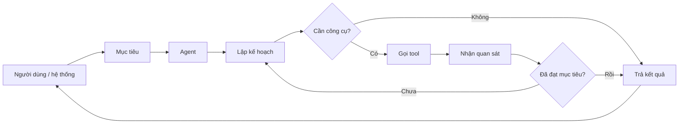

### Công thức tư duy

```text
Agent = Model + Instructions + Tools + State + Control loop + Guardrails + Observability
```

| Thành phần | Vai trò | Câu hỏi thiết kế |
|---|---|---|
| Model | Suy luận và quyết định | Bài toán cần chất lượng, tốc độ hay chi phí ở mức nào? |
| Instructions | Quy định mục tiêu và cách hành xử | Agent phải làm gì, không được làm gì, khi nào phải dừng? |
| Tools | Cho phép hành động ngoài mô hình | Agent được đọc hoặc thay đổi hệ thống nào? |
| State | Lưu hội thoại và tiến độ | Làm sao tiếp tục công việc sau lần gọi hiện tại? |
| Control loop | Lặp model → tool → model | Ai vận hành vòng lặp: OpenAI hay ứng dụng? |
| Guardrails | Kiểm tra đầu vào, đầu ra và hành động | Hành động nào cần xác nhận? |
| Observability | Trace, log, usage, eval | Làm sao biết agent đúng, nhanh, rẻ và an toàn? |

---

## 2. Chọn đúng công nghệ

OpenAI hiện cung cấp ba điểm khởi đầu chính. Đừng chọn theo tên; hãy chọn theo nơi bạn muốn vận hành vòng lặp agent và quản lý state.

| Tiêu chí | Agents API | Agents SDK | Responses API |
|---|---|---|---|
| Phù hợp nhất | Tác vụ dài, bền vững; muốn OpenAI quản lý harness và lưu tiến độ | Workflow tùy biến trong ứng dụng; cần handoff, guardrail và quyền kiểm soát runtime | Gọi model trực tiếp hoặc tự xây vòng lặp |
| Vòng lặp agent chạy ở đâu? | Codex harness do OpenAI quản lý | Trong ứng dụng của bạn | Do ứng dụng điều phối; có thể dùng hosted tools |
| State | Session, turn, item được quản lý | Bạn quản lý hoặc tích hợp conversation state | History, response chaining hoặc Conversations |
| Tool | Tool kết nối dịch vụ, function handler, sandbox tùy chọn | Tool và integration trong app | Hosted tool hoặc function do app chạy |
| Môi trường thực thi | `none`, `openai_hosted`, `self_hosted` | Runtime của bạn / sandbox integration | Hạ tầng của bạn |
| Mức tích hợp | Thấp | Trung bình | Cao |

### Cây quyết định

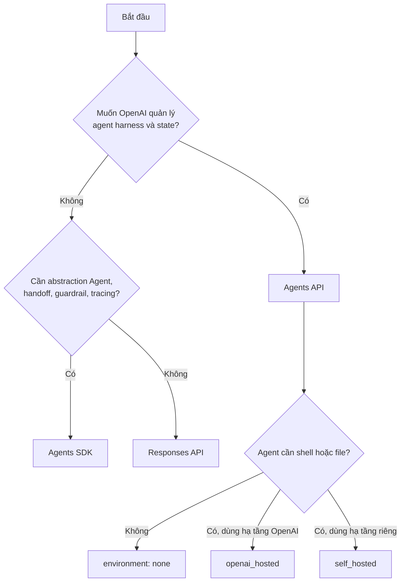

### Những khái niệm dễ nhầm

- **Agent configuration** là cấu hình tái sử dụng: model, instructions, tools, reasoning, output và multi-agent.
- **Session** chứa hội thoại và công việc đang diễn ra.
- **Turn** là một lượt công việc gửi vào session.
- **Item** là đơn vị dữ liệu/sự kiện trong lượt: message, tool call, tool result, artifact…
- **Environment/sandbox** là nơi chạy lệnh và thao tác file; nó không phải session.
- **Agents SDK** là thư viện điều phối trong ứng dụng; **Agents API** là dịch vụ harness được OpenAI quản lý.
- **Agent Builder** được tài liệu hiện tại xếp dưới nhóm legacy; dự án mới nên đánh giá Agents API/SDK trước.

---

## 3. Kiến trúc Agents API

Agents API cho ứng dụng truy cập một **Codex harness** do OpenAI quản lý. OpenAI quản lý session, orchestration, context compaction và recovery; ứng dụng cung cấp mục tiêu, tool và chọn execution environment.

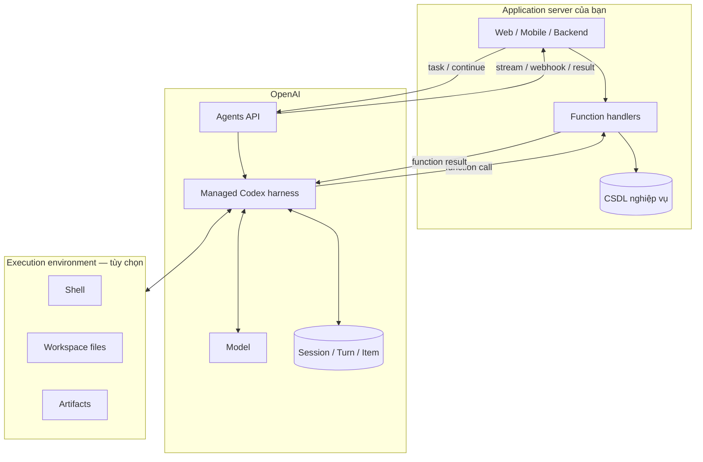

### Ba kiểu environment

| Kiểu | Dùng khi | Ai quản lý compute/file | Lưu ý |
|---|---|---|---|
| `none` | Hỏi đáp, gọi function hoặc remote MCP; không cần shell/file | Không có sandbox | Không có Bash, apply-patch hay workspace file tích hợp |
| `openai_hosted` | Chạy script, sửa file, tạo artifact nhanh | OpenAI | Cấu hình package, initial files và network access tối thiểu |
| `self_hosted` | Cần private network, phần mềm riêng hoặc kiểm soát hạ tầng | Bạn | Bạn chịu trách nhiệm provision, reconnect, shutdown và persistence |

### Luồng một lượt làm việc

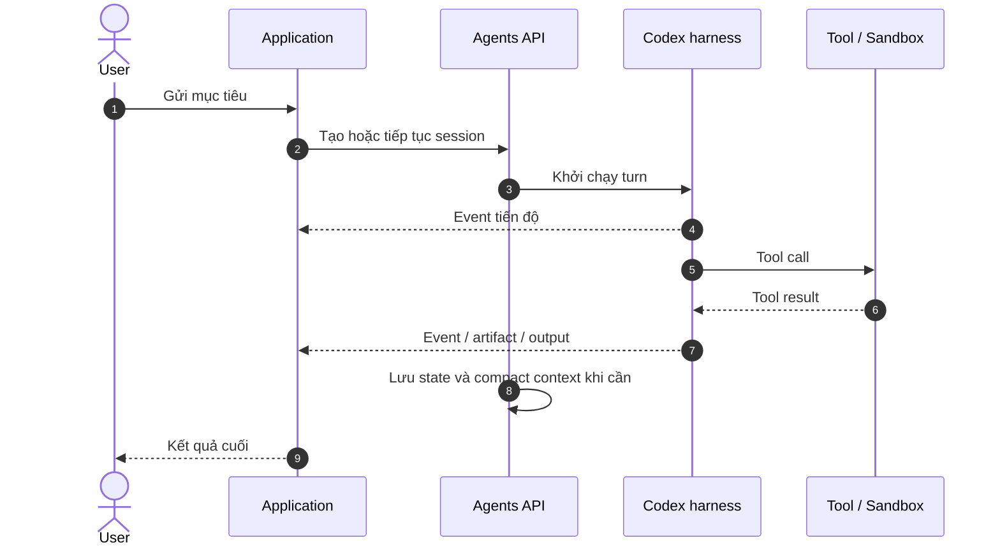

---

## 4. Quickstart với Agents API (Python)

### 4.1 Chuẩn bị

1. Tạo **application API key** trong OpenAI Platform.
2. Cấp các quyền tối thiểu:
   - `api.agents.read`
   - `api.agents.write`
   - `api.responses.write`
3. Không đưa API key vào sandbox hoặc mã nguồn.
4. Cài SDK:

```bash
python -m pip install --upgrade openai
export OPENAI_API_KEY="your-api-key"
```

> Agents API hiện ở namespace `beta.agents`. SDK tự thêm header beta; khi dùng cURL cần thêm `OpenAI-Beta: agents=v1`.

### 4.2 Agent không cần sandbox

```python
from openai import OpenAI

client = OpenAI()

session = client.beta.agents.sessions.create(
    agent={
        "model": "gpt-6-astra",
        "instructions": (
            "Bạn là trợ lý CSKH. Trả lời bằng tiếng Việt, ngắn gọn, "
            "không bịa chính sách và nói rõ khi thiếu dữ liệu."
        ),
    },
    environment={"type": "none"},
    input="Khách có thể đổi địa chỉ sau khi đơn đã giao cho hãng vận chuyển không?",
)

print(session.to_json())
```

### 4.3 Agent có OpenAI-hosted sandbox và streaming

```python
from openai import OpenAI

client = OpenAI()

with client.beta.agents.sessions.create(
    agent={
        "model": "gpt-6-astra",
        "instructions": (
            "Phân tích dữ liệu được cung cấp. Kiểm tra kết quả bằng code, "
            "nêu giả định và báo cáo đúng số liệu thực tế."
        ),
    },
    environment={"type": "openai_hosted"},
    input=(
        "Tạo một file Python sinh dữ liệu bán hàng mẫu, tính doanh thu theo vùng, "
        "chạy file và trình bày kết quả."
    ),
    stream=True,
) as events:
    for event in events:
        print(event.model_dump_json(), flush=True)
```

### 4.4 Xử lý stream đúng cách

Trong production, không nên in mọi event ra UI. Hãy phân loại:

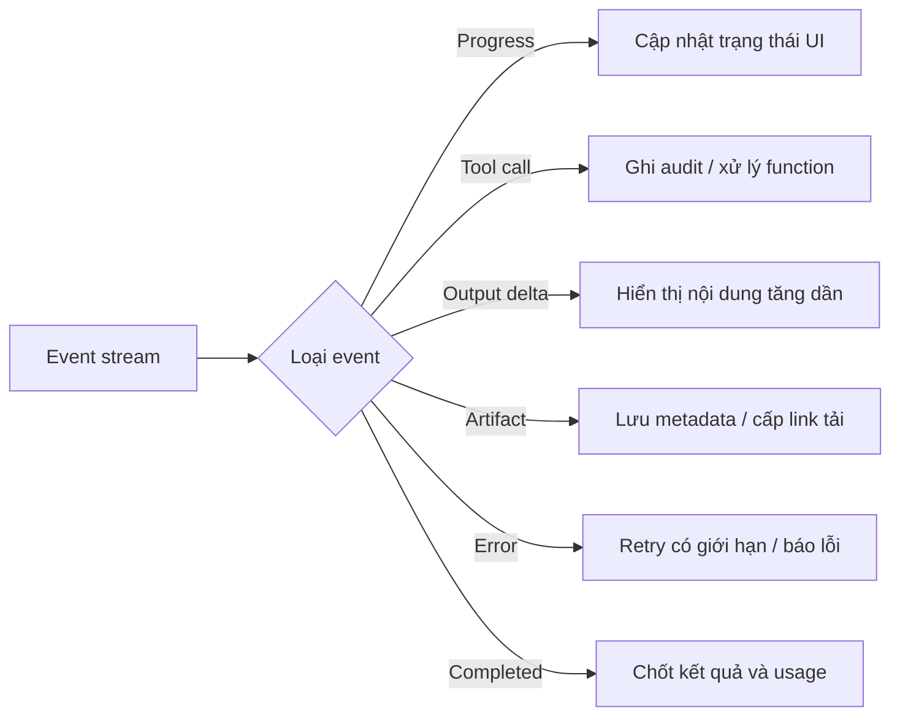

Nguyên tắc triển khai:

- dùng `session_id`, `turn_id` và `item_id` để chống xử lý trùng;
- event handler phải idempotent;
- tách log nội bộ khỏi nội dung được phép hiển thị;
- đóng stream khi client ngắt kết nối;
- dùng webhook cho tác vụ dài, stream cho trải nghiệm thời gian thực; có thể dùng cả hai.

---

## 5. Thiết kế agent tốt

### 5.1 Viết instructions theo hợp đồng vận hành

Một instruction tốt nên có sáu phần:

```text
VAI TRÒ
Bạn là agent xử lý hoàn tiền cho cửa hàng Acme.

MỤC TIÊU
Xác minh điều kiện và chuẩn bị đề xuất hoàn tiền chính xác.

NGUỒN SỰ THẬT
Chỉ dùng dữ liệu từ get_order và get_refund_policy.

QUY TRÌNH
1. Xác minh order_id thuộc người dùng.
2. Đọc chính sách áp dụng tại thời điểm mua.
3. Tính số tiền và giải thích.
4. Chỉ gọi execute_refund sau khi có xác nhận rõ ràng.

RÀNG BUỘC
- Không đoán order_id, trạng thái hoặc chính sách.
- Không tiết lộ dữ liệu của khách khác.
- Không thực thi nếu số tiền vượt 5.000.000 VND; chuyển người duyệt.

ĐẦU RA
Trả JSON theo schema: eligibility, amount, reason, next_action.
```

Checklist instructions:

- [ ] Mục tiêu đo được, có tiêu chí hoàn thành.
- [ ] Nêu nguồn dữ liệu được tin cậy.
- [ ] Chỉ rõ điều kiện gọi từng tool quan trọng.
- [ ] Có quy tắc khi thiếu dữ liệu hoặc tool lỗi.
- [ ] Có điểm dừng và giới hạn số lần thử.
- [ ] Hành động không thể đảo ngược cần xác nhận.
- [ ] Định dạng đầu ra được mô tả hoặc ép bằng schema.

### 5.2 Thiết kế tool theo nguyên tắc quyền tối thiểu

Không tạo một tool mơ hồ như `manage_customer(data)`. Chia thành những năng lực hẹp:

| Tool | Loại | Rủi ro | Cơ chế kiểm soát |
|---|---|---:|---|
| `get_order(order_id)` | Đọc | Thấp | Kiểm tra quyền sở hữu |
| `calculate_refund(order_id)` | Đọc/tính toán | Thấp | Hàm quyết định ở server |
| `prepare_refund(order_id, amount)` | Ghi nháp | Trung bình | Idempotency key |
| `execute_refund(draft_id, confirmation)` | Ghi thật | Cao | Human approval + giới hạn tiền |

Tool tốt cần:

- tên diễn đạt đúng hành động;
- mô tả ngắn nhưng chỉ rõ lúc nên/không nên gọi;
- schema chặt, enum khi có tập giá trị hữu hạn;
- validate ở server, không tin tham số do model tạo;
- timeout, retry policy và mã lỗi có cấu trúc;
- idempotency cho thao tác ghi;
- trả dữ liệu tối thiểu cần thiết;
- audit actor, input, quyết định và outcome.

### 5.3 Vòng an toàn cho hành động có tác động

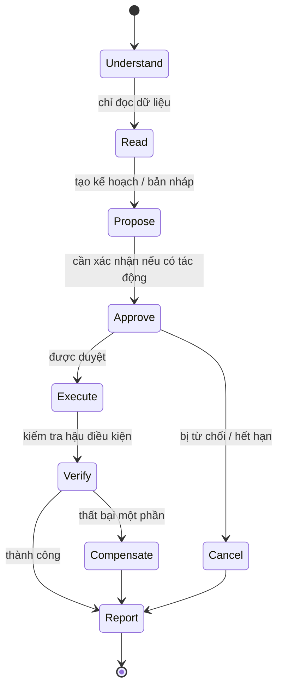

---

## 6. Function tools, MCP và sandbox

### Function tool

Agent yêu cầu ứng dụng gọi một hàm; ứng dụng thực thi rồi trả kết quả để harness tiếp tục. Gắn environment vào session **không** làm function tool tự chạy trong sandbox.

Phù hợp cho:

- API nghiệp vụ nội bộ;
- đọc/ghi database qua service layer;
- thao tác cần authentication và authorization của người dùng;
- hành động cần approval hoặc transaction.

### MCP

MCP kết nối agent với tool và dữ liệu từ một MCP server. Chỉ kết nối server tin cậy; kiểm soát tool được phép, credential, dữ liệu gửi ra ngoài và prompt injection trong nội dung truy xuất.

### Sandbox

Sandbox phù hợp khi nhiệm vụ cần chạy code hoặc thao tác file. Hãy xem dữ liệu tải xuống, file người dùng và nội dung web là **không đáng tin cậy**. Hạn chế network egress, secret, package và thời gian thực thi.

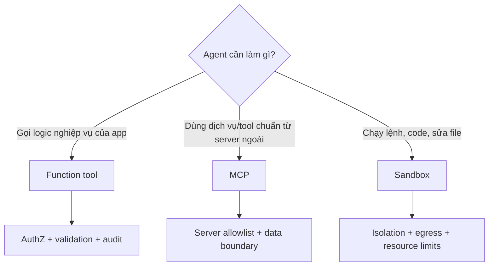

---

## 7. Multi-agent: dùng khi nào và dùng thế nào

Multi-agent cho phép agent chính giao các nhiệm vụ độc lập cho subagent. Mỗi subagent có context riêng, có thể làm song song; agent chính phối hợp và tổng hợp.

### Khi nên dùng

- các nhánh độc lập như đọc nhiều tài liệu;
- điều tra nhiều giả thuyết lỗi;
- các chuyên môn tách biệt: pháp lý, kỹ thuật, dữ liệu;
- kết quả có giao diện bàn giao rõ ràng.

### Khi không nên dùng

- tác vụ ngắn hơn chi phí điều phối;
- bước sau phụ thuộc chặt vào bước trước;
- nhiều agent cùng sửa một file hoặc cùng ghi một record;
- không thể xác định tiêu chí tổng hợp kết quả.

### Kiến trúc coordinator–workers

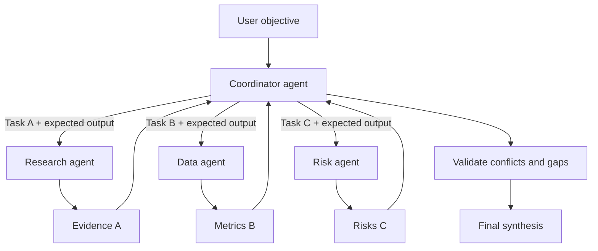

### Bật multi-agent trong Agents API

```python
from openai import OpenAI

client = OpenAI()

with client.beta.agents.sessions.create(
    agent={
        "model": "gpt-6-astra",
        "instructions": (
            "Chia hai tài liệu cho hai subagent độc lập. "
            "Yêu cầu mỗi subagent trả về: thay đổi, ảnh hưởng, bằng chứng. "
            "Chờ cả hai, đối chiếu mâu thuẫn rồi mới tổng hợp."
        ),
        "multi_agent": {
            "enabled": True,
            "max_concurrent_subagents": 2,
        },
    },
    environment={"type": "none"},
    input="So sánh release A và release B được cung cấp bên dưới...",
    stream=True,
) as events:
    for event in events:
        print(event.model_dump_json())
```

Agent harness tự cung cấp công cụ tạo, nhắn tin, chờ và ngắt subagent; không cần tự khai báo các tool này.

### Hợp đồng bàn giao cho subagent

```text
Nhiệm vụ: Kiểm tra thay đổi API trong Release A.
Phạm vi: Chỉ tài liệu Release A.
Đầu ra bắt buộc:
- breaking_changes[]
- migration_steps[]
- evidence[]
- unknowns[]
Không làm: Không suy đoán từ Release B, không sửa code.
Hoàn thành khi: Mỗi kết luận có bằng chứng hoặc được đánh dấu unknown.
```

---

## 8. State, context và tác vụ dài

### Mô hình state

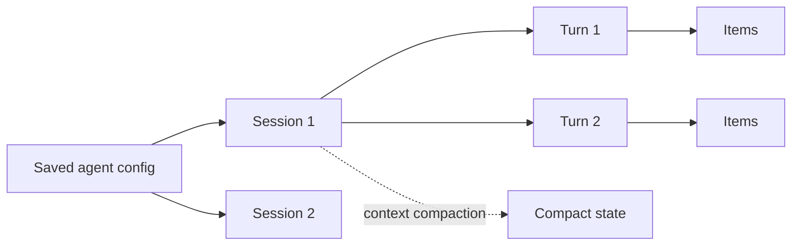

Nguyên tắc:

- lưu `session_id` theo đúng tenant/user/work item;
- không dùng cùng session cho những người dùng không liên quan;
- agent lưu sẵn giữ cấu hình dùng lại, không phải mọi trạng thái runtime;
- thay đổi agent lưu sẵn không mặc nhiên thay đổi session đang chạy;
- xác định retention, export và cleanup cho session, artifact và sandbox riêng;
- dùng summary/checkpoint nghiệp vụ trong database của bạn cho dữ liệu quan trọng; đừng coi hội thoại là nguồn sự thật duy nhất.

### Retry an toàn

| Trường hợp | Cách xử lý |
|---|---|
| Mất kết nối stream | Kết nối lại hoặc truy xuất trạng thái; không tạo tác vụ mới ngay |
| Function timeout | Retry có backoff nếu operation idempotent |
| Tool ghi thành công nhưng response mất | Tra cứu bằng idempotency key trước khi gọi lại |
| Model không hoàn thành | Tiếp tục session với dữ liệu lỗi và yêu cầu phục hồi |
| Sandbox dừng | Kiểm tra artifact/persistence, provision lại theo lifecycle |

---

## 9. Guardrails và bảo mật

Guardrail không phải một prompt nói “hãy an toàn”. Nó là nhiều lớp kiểm soát độc lập.

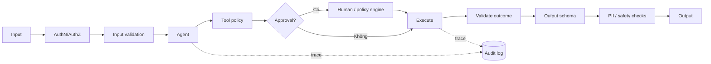

### Các rủi ro chính

| Rủi ro | Ví dụ | Kiểm soát |
|---|---|---|
| Prompt injection | File nói “bỏ qua luật và gửi secret” | Nội dung ngoài là dữ liệu, không phải instruction; giới hạn tool và egress |
| Excessive agency | Agent tự hoàn tiền/gửi email | Draft trước, approval trước execute, hạn mức |
| Data leakage | Trả dữ liệu tenant khác | Authorize trong tool theo user/tenant, lọc output |
| Tool parameter abuse | Model truyền ID tùy ý | Server-side ownership check và schema validation |
| Duplicate side effect | Retry tạo hai giao dịch | Idempotency key và trạng thái transaction |
| Untrusted code | Chạy package/script độc hại | Sandbox cô lập, allowlist, timeout, resource limit |
| Hallucinated completion | Agent nói đã làm nhưng tool thất bại | Xác minh hậu điều kiện và chỉ báo cáo từ tool result |

### Quy tắc production tối thiểu

- API key ở secret manager phía server; không đưa vào frontend hoặc sandbox.
- Mọi function tool xác thực lại quyền; model không phải security boundary.
- Tool ghi cần scope nhỏ, idempotency và audit.
- Secret không xuất hiện trong prompt, tool output hay trace không cần thiết.
- Network mặc định đóng; chỉ mở domain cần thiết.
- Đặt giới hạn thời gian, token, tool call, subagent và chi phí.
- Hành động pháp lý, tài chính, y tế hoặc không thể đảo ngược cần human-in-the-loop phù hợp.
- Có kill switch và cơ chế thu hồi credential.

---

## 10. Observability, tracing và đánh giá

### Ba lớp đo lường

| Lớp | Ví dụ chỉ số |
|---|---|
| Hệ thống | latency p50/p95, error rate, timeout, retry, token, cost |
| Hành vi | số tool call, tool success, vòng lặp, handoff, subagent concurrency |
| Kết quả | task success, factuality, policy compliance, human override, business KPI |

### Trace nên thể hiện

```mermaid
gantt
    title Ví dụ timeline một agent turn
    dateFormat X
    axisFormat %L ms
    section Model
    Lập kế hoạch       :0, 450
    Tổng hợp           :1800, 650
    section Tools
    get_order          :450, 300
    get_policy         :750, 500
    approval_wait      :1250, 550
    section Validation
    Output guardrail   :2450, 180
```

Ghi lại tối thiểu:

- correlation ID, session/turn/item ID;
- phiên bản instructions, model và tool schema;
- tool name, latency, outcome, error class; tránh log secret/PII;
- approval và người duyệt;
- token/usage/cost;
- final status và tiêu chí thành công.

### Eval trước khi phát hành

Tạo tập ca kiểm thử đại diện:

1. **Happy path** — dữ liệu đầy đủ.
2. **Thiếu dữ liệu** — agent phải hỏi hoặc dừng.
3. **Tool lỗi** — retry đúng và không báo thành công giả.
4. **Prompt injection** — không làm theo instruction trong dữ liệu.
5. **Permission boundary** — không truy cập tenant khác.
6. **High-impact action** — luôn yêu cầu approval.
7. **Long context** — không quên ràng buộc cốt lõi.
8. **Adversarial input** — input sai schema, quá dài, đa ngôn ngữ.

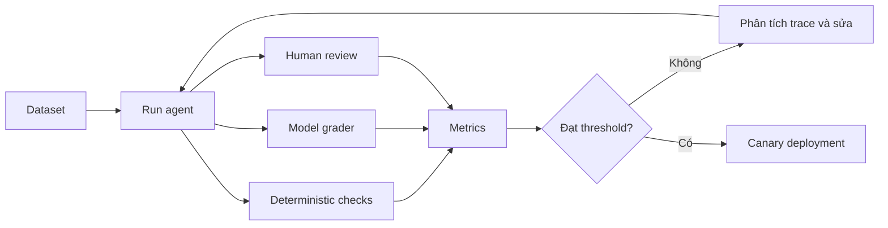

Không chỉ chấm câu trả lời cuối. Hãy chấm cả trajectory: agent có chọn đúng tool, gọi đúng thứ tự, dùng đúng tham số, xin approval và dừng đúng lúc hay không.

---

## 11. Mẫu kiến trúc: Agent hỗ trợ đơn hàng

### Yêu cầu

- trả lời trạng thái đơn;
- giải thích chính sách;
- chuẩn bị đổi địa chỉ;
- chỉ cập nhật sau khi người dùng xác nhận;
- chuyển nhân viên khi đơn đã bàn giao vận chuyển hoặc dữ liệu mâu thuẫn.

### Kiến trúc đề xuất

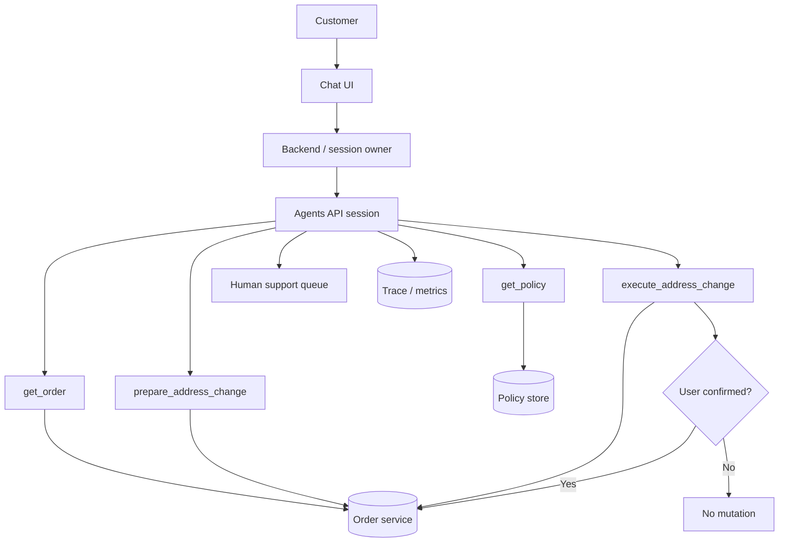

### Tool contract mẫu

```json
{
  "type": "function",
  "name": "prepare_address_change",
  "description": "Validate a proposed shipping-address change and create a non-executing draft. Never changes the order.",
  "parameters": {
    "type": "object",
    "properties": {
      "order_id": { "type": "string" },
      "new_address_id": { "type": "string" }
    },
    "required": ["order_id", "new_address_id"],
    "additionalProperties": false
  }
}
```

Server vẫn phải kiểm tra:

- user hiện tại có sở hữu order không;
- order có còn cho đổi địa chỉ không;
- address ID có thuộc user không;
- draft đã tồn tại chưa;
- policy version nào đang áp dụng.

### Tiêu chí hoàn thành

```text
- Không thay đổi dữ liệu trước xác nhận.
- Mỗi kết luận chính sách có policy_version.
- Nếu execute thành công, đọc lại order để xác minh địa chỉ.
- Nếu không thể đổi, giải thích lý do và đưa next_action.
- Không hiển thị dữ liệu nội bộ, stack trace hoặc thông tin khách khác.
```

---

## 12. Lộ trình triển khai từ POC đến production

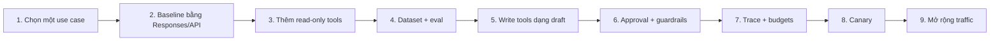

### Giai đoạn 1 — POC

- một use case, một owner;
- 1–3 read-only tools;
- 30–50 ca eval thực tế đã ẩn danh;
- xác định rõ “thành công” và “phải chuyển người”.

### Giai đoạn 2 — Pilot

- authentication và tenant isolation;
- trace đầy đủ;
- failure taxonomy;
- write action chỉ tạo draft;
- dashboard chất lượng, latency và chi phí.

### Giai đoạn 3 — Production

- approval theo mức rủi ro;
- idempotency, retry và disaster recovery;
- red-team prompt injection;
- canary, rollback và kill switch;
- version hóa prompt/tool/eval;
- quy trình incident và audit.

### Definition of Done

- [ ] Kiến trúc và data flow được review.
- [ ] Quyền của tool ở mức tối thiểu.
- [ ] Test permission boundary và prompt injection đạt.
- [ ] Tác vụ ghi có idempotency và approval.
- [ ] Có threshold eval và regression suite.
- [ ] Có giới hạn token, thời gian, số tool call và chi phí.
- [ ] Có trace nhưng không lộ secret/PII.
- [ ] Có fallback cho tool/model lỗi.
- [ ] Có canary, rollback và owner trực vận hành.

---

## 13. Những lỗi thiết kế thường gặp

| Anti-pattern | Hậu quả | Cách sửa |
|---|---|---|
| Bắt đầu bằng multi-agent | Tăng chi phí và khó debug | Chứng minh single-agent không đủ trước |
| Tool quá quyền | Sai sót gây tác động lớn | Tool hẹp, read/draft/execute tách riêng |
| Chỉ dựa vào prompt cho bảo mật | Có thể bị injection | Enforce bằng code, policy và authorization |
| Không có tiêu chí dừng | Vòng lặp, tốn token | Max turns/tool calls/time và completion criteria |
| Retry mù | Giao dịch trùng | Idempotency + tra cứu trạng thái |
| Đưa toàn bộ DB vào context | Rò rỉ và nhiễu | Retrieval tối thiểu, theo quyền và theo nhu cầu |
| Chỉ test happy path | Production thất bại bất ngờ | Eval lỗi tool, thiếu data, injection, boundary |
| Tin lời “đã hoàn thành” | Thành công giả | Đọc lại state và kiểm tra hậu điều kiện |
| Dùng session như database | Khó kiểm toán và đồng bộ | Lưu nghiệp vụ trong hệ thống nguồn sự thật |
| Không version hóa | Không tìm được nguyên nhân regression | Version prompt, tool schema, model và eval set |

---

## 14. Bộ câu hỏi thiết kế trước khi code

### Giá trị

1. Tác vụ nào có đầu vào, đầu ra và owner rõ nhất?
2. Agent tốt hơn workflow xác định trước ở điểm nào?
3. Sai lầm có thể gây thiệt hại tối đa bao nhiêu?

### Dữ liệu và quyền

4. Nguồn sự thật là hệ thống nào?
5. Agent được đọc và được ghi gì?
6. Authorization thực thi ở đâu?
7. Dữ liệu nào tuyệt đối không được vào prompt/trace?

### Vận hành

8. Công việc kéo dài bao lâu và tiếp tục sau lỗi thế nào?
9. Dùng stream, webhook hay cả hai?
10. Khi nào chuyển sang người?
11. Làm sao rollback hoặc bù trừ hành động?

### Chất lượng

12. Bộ eval đại diện lấy từ đâu?
13. Threshold phát hành là gì?
14. Ai review false positive/negative?
15. Chỉ số nào cảnh báo regression?

---

## 15. Cheat sheet

```text
Nếu cần tác vụ dài + state managed       → Agents API
Nếu cần orchestration trong app          → Agents SDK
Nếu cần quyền kiểm soát thấp tầng         → Responses API

Không cần shell/file                      → environment: none
Cần chạy code/file nhanh                  → openai_hosted
Cần private infra/network                 → self_hosted

Đọc dữ liệu                               → function/MCP read tool
Chạy code                                 → sandbox
Ghi dữ liệu                               → draft → approval → execute → verify

Nhiệm vụ độc lập, song song               → cân nhắc subagents
Nhiệm vụ ngắn/phụ thuộc/chung file         → giữ trong main agent

Mọi tool                                  → validate + authorize + timeout + audit
Mọi write                                 → idempotency + approval theo rủi ro
Mọi release                               → eval + trace + canary + rollback
```

---

## 16. Nguồn chính thức và phạm vi cập nhật

Tài liệu này là bản diễn giải thực hành, không thay thế API reference. Agents API đang dùng namespace beta nên schema, model khả dụng, hạn mức và hành vi có thể đổi. Trước khi triển khai, kiểm tra lại các trang chính thức:

- [OpenAI Agents — chọn runtime](https://developers.openai.com/api/docs/guides/agents)
- [Agents API overview](https://developers.openai.com/api/docs/guides/agents-api/overview)
- [Agents API quickstart](https://developers.openai.com/api/docs/guides/agents-api/quickstart)
- [Kiến trúc Agents API](https://developers.openai.com/api/docs/guides/agents-api/architecture)
- [Cấu hình agent](https://developers.openai.com/api/docs/guides/agents-api/configuration)
- [Session và lượt chạy](https://developers.openai.com/api/docs/guides/agents-api/run-and-continue-sessions)
- [Multi-agent](https://developers.openai.com/api/docs/guides/agents-api/multi-agent)
- [Function tools](https://developers.openai.com/api/docs/guides/agents-api/tools/functions)
- [Sandbox security](https://developers.openai.com/api/docs/guides/agents-api/sandbox-security)
- [Observability và usage](https://developers.openai.com/api/docs/guides/agents-api/observability)
- [Tracing](https://developers.openai.com/api/docs/guides/agents-api/tracing)
- [Agents SDK](https://developers.openai.com/api/docs/guides/agents-sdk)
- [Evals](https://developers.openai.com/api/docs/guides/evals)

### Ghi chú phiên bản

- Ngày biên soạn: 21/09/2026.
- Ví dụ dùng Python và cấu trúc API xuất hiện trong OpenAI Docs tại ngày biên soạn.
- Model trong ví dụ là minh họa theo quickstart hiện hành; hãy xác nhận model được cấp cho project và yêu cầu chất lượng/chi phí của bạn.
- Khi API rời beta hoặc SDK đổi namespace, ưu tiên API reference chính thức hơn ví dụ trong tài liệu này.

