# TỰ ĐỘNG HÓA SOFTWARE ENGINEERING VỚI OPENAI CODEX VÀ AGENTS API

> **Mục tiêu:** Thiết kế hệ thống trong đó AI tự nhận việc từ ticket, CI, PR hoặc alert; tự đọc repository, triển khai thay đổi, kiểm thử, review và tạo Merge Request/Pull Request. Con người chỉ tham gia tại các điểm phê duyệt hoặc rủi ro cao.

**Phiên bản:** 2.0  
**Cập nhật:** 21/09/2026  
**Phạm vi:** Codex CLI, `codex exec`, CI/CD automation, Agents API và Engineering Agent Platform.

---

## 1. Executive Summary

Quy trình thủ công:

```text
Developer → mở terminal → chạy Codex → mô tả task → kiểm tra → commit → tạo MR
```

Kiến trúc mục tiêu:

```text
Ticket / CI / PR / Alert
        ↓
Event-driven Orchestrator
        ↓
Coding Agent
        ↓
Isolated repository workspace
        ↓
Implement → Test → Fix
        ↓
Commit → Push → Create MR
        ↓
Independent Review Agent
        ↓
CI + Policy Gate
        ↓
Human Approval
```

Ba mức triển khai:

| Mức | Công nghệ | Phù hợp |
|---|---|---|
| Level 1 | `codex exec` | One-shot task trong script/CI |
| Level 2 | Codex + CI/CD + webhook | Ticket, PR hoặc CI event tự kích hoạt workflow |
| Level 3 | Agents API + Orchestrator | Persistent session, resume, multi-agent và tool integration |

**Khuyến nghị:** chứng minh workflow end-to-end bằng Level 1 trước; chỉ chuyển sang Agents API khi thực sự cần state, resume và orchestration tập trung.

---

## 2. Tư duy cốt lõi: Event → Agent

Thay vì:

```text
Human → Agent
```

ta chuyển thành:

```text
Event → Policy → Agent → Verification → Result → Approval
```

Event có thể đến từ:

- Jira ticket đổi trạng thái;
- GitHub/GitLab issue được gắn label;
- Pull Request/Merge Request được tạo;
- CI build fail;
- dependency/security scan;
- Grafana, Sentry hoặc Alertmanager;
- cron/release preparation.

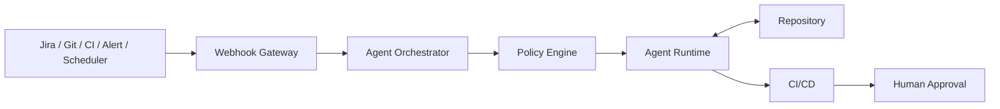

---

## 3. Codex và Agents API đóng vai trò gì?

### 3.1 Codex tương tác

```bash
cd my-service
codex
```

Phù hợp khi developer trực tiếp làm việc: đọc repository, sửa file, chạy command/test và review thay đổi.

### 3.2 `codex exec`

`codex exec` là non-interactive mode dành cho script, CI và automation:

```bash
codex exec --sandbox workspace-write "
Read AGENTS.md and specs/ABC-123.md.
Implement the task with the smallest relevant change.
Run ./scripts/verify.sh.
Do not weaken or disable tests.
Report changed files, verification and remaining risks.
"
```

Tiến độ được ghi vào `stderr`; final message được ghi vào `stdout`, nên có thể lưu kết quả:

```bash
codex exec --sandbox workspace-write "generate release notes" \
  > agent-result.md
```

Không nên đặt `OPENAI_API_KEY` hoặc `CODEX_API_KEY` ở cấp toàn bộ CI job nếu job checkout/chạy code do repository kiểm soát. Dùng credential ngắn hạn hoặc chỉ cấp key cho đúng tiến trình cần thiết.

### 3.3 Agents API

Agents API phù hợp khi cần một agent platform thay vì một command:

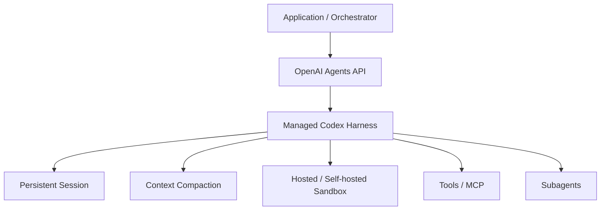

Agents API quản lý harness, session, context, sandbox orchestration và subagents. Ứng dụng vẫn phải quản lý trigger, authorization, routing, policy, approval, audit và repository access.

```text
codex exec = chạy một coding-agent automation
Agents API = xây một nền tảng agent bền vững
```

---

## 4. Kiến trúc mục tiêu

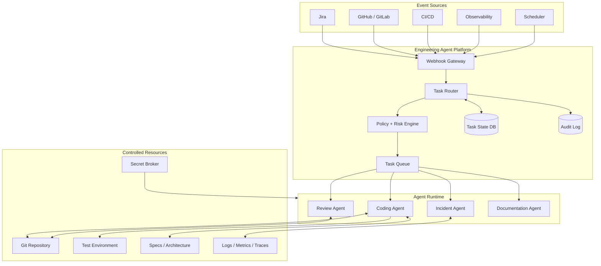

Orchestrator không cần “thông minh”. Nó thực thi deterministic control plane:

- xác thực và chuẩn hóa event;
- chống xử lý trùng;
- phân loại risk;
- chọn agent/executor;
- tạo isolated workspace;
- cấp short-lived credential;
- enforce state transition và retry limit;
- yêu cầu approval;
- lưu audit và cleanup.

---

## 5. Repository readiness

```text
repository/
├── AGENTS.md
├── docs/
│   ├── architecture.md
│   ├── domain-glossary.md
│   ├── coding-conventions.md
│   ├── security.md
│   ├── testing.md
│   └── adr/
├── specs/
│   └── ABC-123.md
├── scripts/
│   ├── verify.sh
│   ├── lint.sh
│   └── integration-test.sh
├── src/
└── build.gradle
```

### `AGENTS.md`

```markdown
# Engineering Instructions

## Technology
- Java 21
- Spring Boot
- PostgreSQL
- Gradle

## Architecture
- Controller chỉ xử lý HTTP.
- Business logic đặt trong service.
- Persistence logic đặt trong repository.
- Domain rules không phụ thuộc HTTP model.

## Coding Rules
- Không thêm dependency nếu thiếu justification.
- Không refactor code ngoài phạm vi task.
- Dùng convention hiện có.

## Testing
Mọi thay đổi hành vi phải có test.
Trước khi hoàn thành chạy: ./scripts/verify.sh

## Security
Không log password, token, API key hoặc PII.

## Completion
Chỉ hoàn thành khi implementation khớp spec, verification pass,
không sửa code không liên quan và mọi risk/assumption đã được ghi lại.
```

Không nhét toàn bộ kiến thức vào một prompt dài. Phân lớp context:

```text
AGENTS.md        → policy toàn repository
docs/            → architecture/domain/conventions
specs/           → requirement theo task
source + history → implementation thực tế
CI evidence      → lỗi cần sửa
```

---

## 6. Specification machine-readable

Ticket “làm giống bên cũ” không đủ để automation.

```markdown
# ABC-123 Assign Lead

## Goal
Cho phép một sale hợp lệ được assign vào lead chưa được assign.

## API
POST /api/v1/leads/{leadId}/assign

## Rules
1. Lead phải tồn tại.
2. Sale phải tồn tại và đủ điều kiện.
3. Lead đã assign trả HTTP 409.
4. Phải lưu assignment history.

## Acceptance Criteria
- Thành công trả 200.
- Duplicate trả 409.
- Ineligible sale trả 422.
- Có unit test và integration test.

## Out of Scope
- Bulk assignment.
- Reassignment.
```

---

## 7. Workflow: Ticket → Code → Merge Request

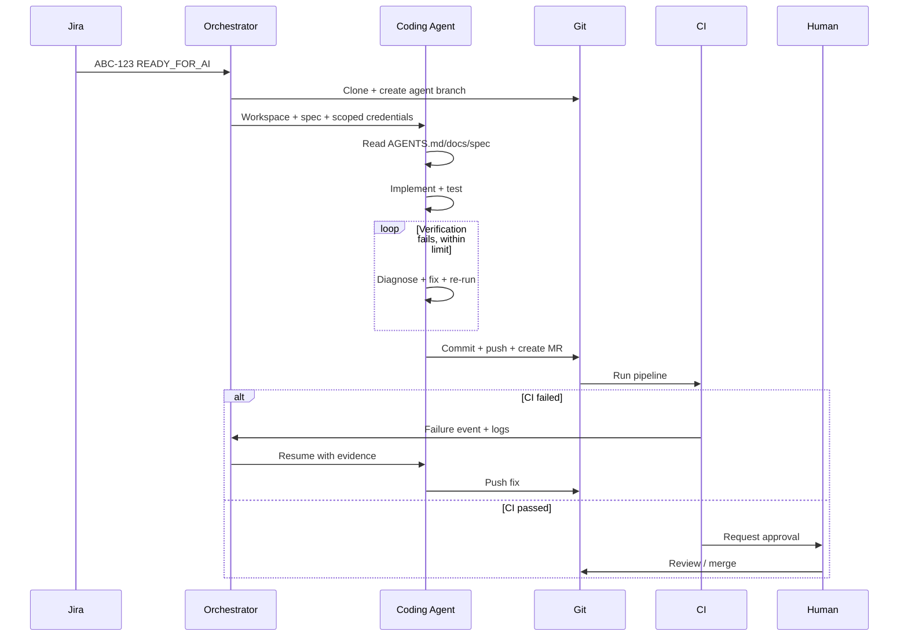

### State machine

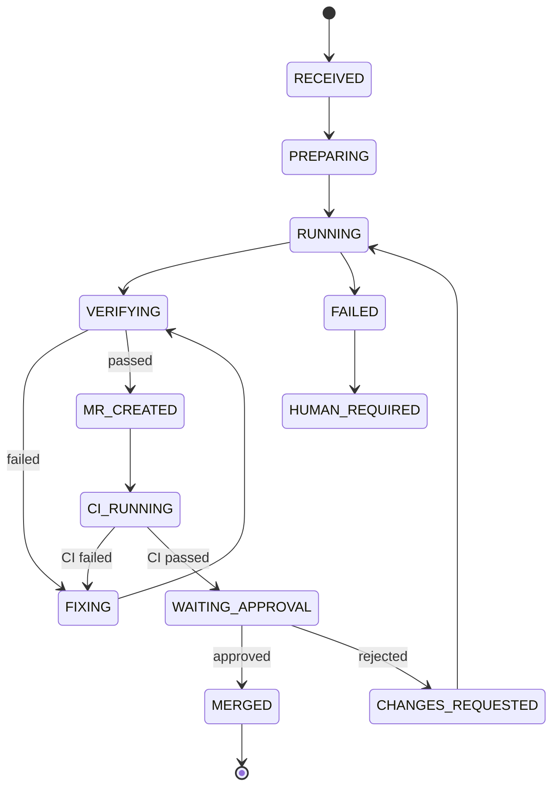

---

## 8. Workflow: CI fail → Agent sửa

Agent phải nhận pipeline ID, branch, commit SHA, failed job, log và session trước đó nếu có.

```text
You are fixing a CI failure.

Read AGENTS.md, repository docs and ci-failure.log.

Goals:
1. Determine the actual root cause.
2. Fix only relevant code.
3. Run ./scripts/verify.sh.
4. Stop if a safe fix would violate repository policy.

Never delete, skip or weaken tests.
Never lower coverage, lint or compiler thresholds.
Return root cause, changed files, verification and risks.
```

CI là source of truth. Câu “tests passed” của agent không có giá trị nếu pipeline thực tế đang fail.

---

## 9. Workflow: Independent Code Review

Coding Agent và Review Agent phải là hai execution context độc lập.

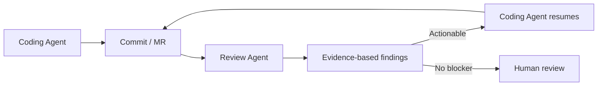

Review prompt:

```text
Review this merge request as a senior backend engineer.
Read AGENTS.md, architecture and security documentation.

Focus on correctness, regressions, transactions, concurrency,
security, database performance, API compatibility and missing tests.

For each issue return severity, file, line/range, evidence,
concrete failure scenario and recommended fix.
Do not approve/reject the MR. Do not report formatting handled by tools.
```

---

## 10. Workflow: Incident Investigation

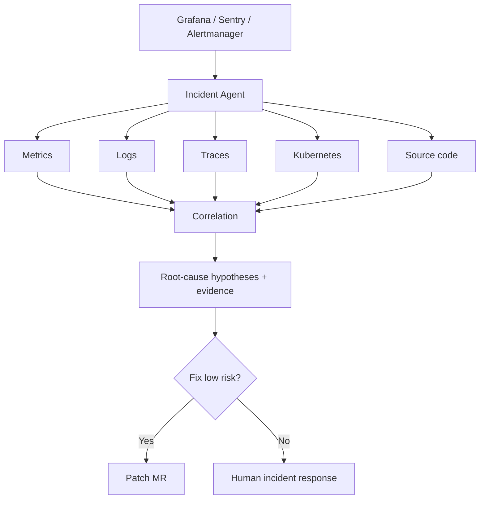

Production remediation vẫn phải human-gated. Incident Agent mặc định chỉ có quyền đọc observability và tạo patch branch.

---

## 11. Permission boundary

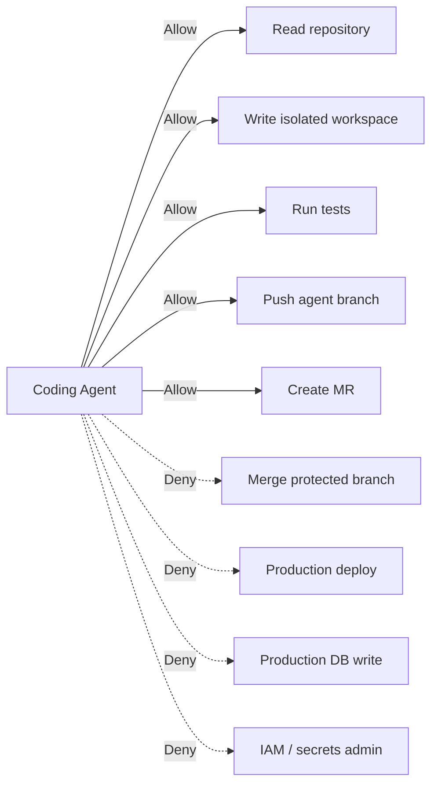

```text
AI thực thi.
Con người giữ authority.
```

| Risk | Ví dụ | Automation |
|---|---|---|
| LOW | test, docs, refactor nhỏ | Auto implement + MR |
| MEDIUM | API feature, query change | AI implement + mandatory review |
| HIGH | DB migration, auth | Plan hoặc gated implementation |
| CRITICAL | delete prod data, IAM, secret | Analysis only |

Risk gate phải là deterministic policy, không hỏi model “có được merge không?”.

---

## 12. MVP không cần Agents API

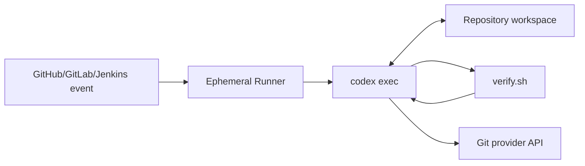

### Shell wrapper

```bash
#!/usr/bin/env bash
set -euo pipefail

task_file="$1"
test -f "$task_file" || { echo "Task not found: $task_file"; exit 1; }

codex exec --ephemeral --sandbox workspace-write "
You are an autonomous software engineering agent.
Read AGENTS.md, docs/ and ${task_file}.
Modify only files required by the task.
Never disable tests or security controls.
Run ./scripts/verify.sh.
If verification fails, diagnose and fix within the configured retry limit.
Stop and report if the task cannot be completed safely.
Return status, changed files, tests, risks and assumptions.
" > agent-result.md
```

### GitLab pipeline concept

```yaml
stages: [agent, verify, publish]

agent_implement:
  stage: agent
  script:
    - ./scripts/run-agent.sh "$TASK_SPEC"
  artifacts:
    paths: [agent-result.md]
  rules:
    - if: '$RUN_AI_AGENT == "true"'

verify:
  stage: verify
  script:
    - ./scripts/verify.sh

publish_branch:
  stage: publish
  script:
    - ./scripts/push-agent-branch.sh
```

Runner phải ephemeral; Git token có scope nhỏ; secret không hard-code trong YAML.

GitHub nên ưu tiên official Codex GitHub Action thay vì tự cài CLI và làm lộ API key trong shell.

---

## 13. Khi nào chuyển sang Agents API?

Chuyển khi có tổ hợp nhu cầu:

```text
multiple event sources + persistent sessions + resume + long-running tasks
+ subagents + multiple tools/MCP + central audit + task routing
```

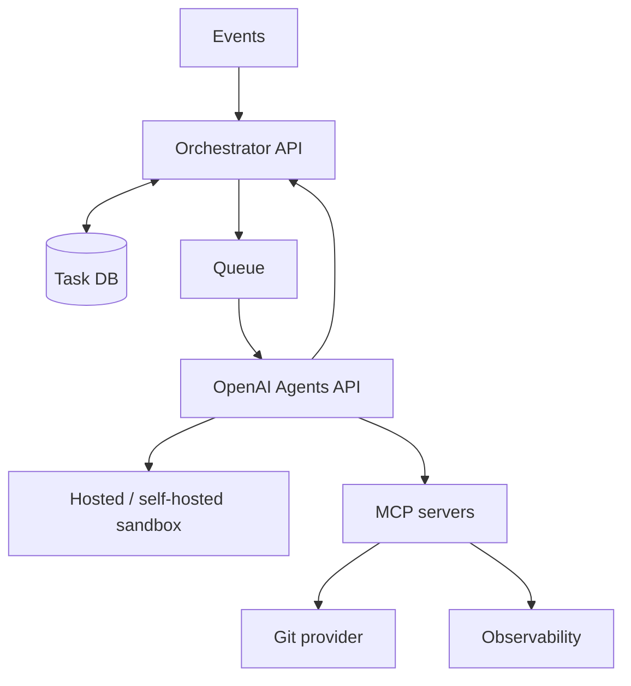

### Python concept

```python
from openai import OpenAI

client = OpenAI()

with client.beta.agents.sessions.create(
    agent={
        "model": "<supported-coding-model>",
        "instructions": """
        You are a senior software engineer.
        Follow repository AGENTS.md and architecture documentation.
        Do not weaken tests. Verify every change.
        """,
    },
    environment={"type": "openai_hosted"},
    input="Implement ABC-123 and run ./scripts/verify.sh.",
    stream=True,
) as events:
    for event in events:
        print(event.model_dump_json())
```

Không hard-code một model tưởng tượng. Chọn model thực sự khả dụng trong project tại thời điểm triển khai.

---

## 14. Hosted và self-hosted execution

| Chế độ | Dùng khi | Trách nhiệm |
|---|---|---|
| OpenAI-hosted | Source được phép xử lý trên hosted sandbox | OpenAI quản lý compute; bạn quản lý quyền, file và network policy |
| Self-hosted | Private Git/network, compliance hoặc phần mềm đặc thù | Bạn provision, kết nối executor, persistence và cleanup |

Agent session có thể tồn tại lâu hơn sandbox. Với self-hosted environment, orchestrator phải lưu mapping giữa session và compute resource, đồng thời chống provision trùng khi nhận webhook lặp.

---

## 15. Tool và MCP layer

Tool phải theo use case, không cấp một token “làm mọi thứ”:

```text
GitTool: clone, createBranch, commit, pushAgentBranch, createMR
JiraTool: getTicket, addComment, transitionAllowedState
CITool: getPipeline, getFailedLogs, retryAllowedJob
ObservabilityTool: queryMetrics, queryLogs, getTrace
DatabaseTool: explainQuery, queryReadReplica
```

MCP phù hợp khi nhiều agent dùng cùng integration, cần schema chuẩn, auth tập trung và lifecycle tách khỏi agent.

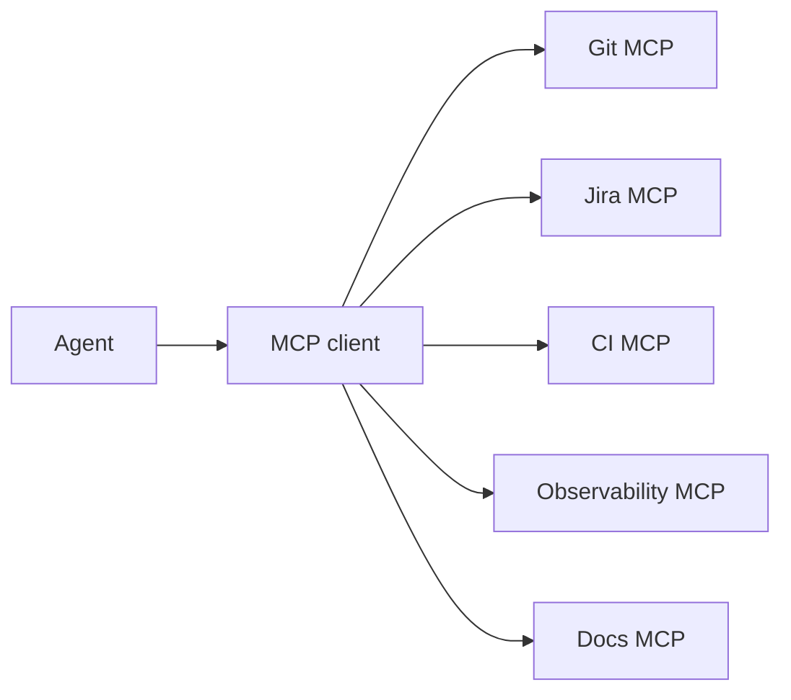

Không expose root shell và toàn bộ cloud credentials nếu task chỉ cần đọc ticket.

---

## 16. Verification và completion contract

```text
No verification = Not completed
```

`scripts/verify.sh` chuẩn hóa entrypoint:

```bash
#!/usr/bin/env bash
set -euo pipefail

./gradlew clean test
./gradlew check
```

Kết quả máy đọc được:

```json
{
  "status": "completed",
  "task": "ABC-123",
  "changed_files": ["LeadAssignmentService.java"],
  "verification": {
    "command": "./scripts/verify.sh",
    "result": "passed"
  },
  "risks": [],
  "assumptions": []
}
```

Orchestrator phải kiểm tra exit code, CI status và artifact thực tế; không chỉ parse lời khẳng định của model.

---

## 17. Retry, idempotency và failure modes

```text
MAX_AGENT_ITERATIONS = 10
MAX_CI_FIX_ATTEMPTS = 3
MAX_TASK_RUNTIME = policy-defined
```

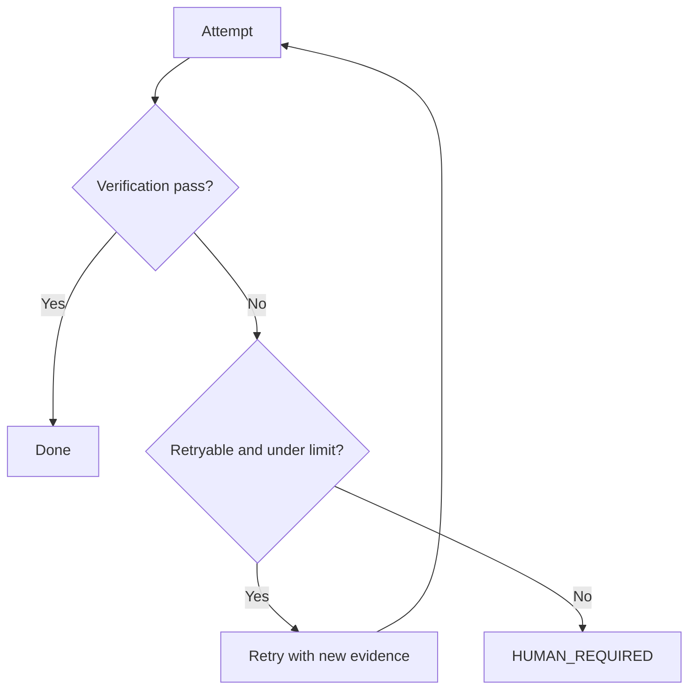

Failure controls:

- spec mơ hồ → yêu cầu clarification;
- diff vượt threshold → mandatory human review;
- test bị skip/xóa/weakening → block pipeline;
- lặp sửa vô hạn → retry limit;
- duplicate webhook → idempotency key;
- agent nói pass nhưng CI fail → CI thắng;
- side effect không rõ trạng thái → query state trước retry.

---

## 18. Security architecture

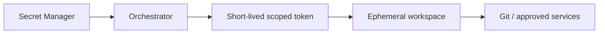

Nguyên tắc:

- default-deny network + allowlist;
- mỗi task một workspace/sandbox;
- application API key nằm ngoài agent environment;
- credential bên thứ ba đi qua trusted broker/proxy khi có thể;
- agent chỉ push branch của nó;
- protected branch, deployment và production DB bị chặn bằng policy;
- không log secret hoặc raw sensitive payload;
- cleanup workspace và revoke token sau task.

---

## 19. Audit và observability

Lưu tối thiểu:

```text
task_id, trigger, actor, repository, base SHA, agent/model version,
instructions version, tool calls, commands, changed files, test results,
session ID, attempts, MR, approvals, final status
```

Metrics:

```text
agent_tasks_total
agent_tasks_success_total
agent_task_duration_seconds
agent_retry_total
agent_ci_fix_attempts
agent_human_escalation_total
agent_token_usage
agent_cost
```

KPI hữu ích: lead time, cycle time, human intervention, rework, escaped defects, MR acceptance, CI pass rate và cost/completed task. Không dùng “số dòng code AI viết” làm KPI chính.

---

## 20. Roadmap triển khai

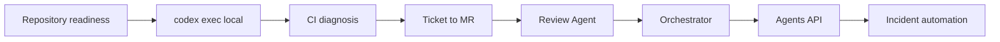

### Phase 0 — Repository readiness

`AGENTS.md`, architecture docs, domain glossary, structured specs và một verification command đáng tin cậy.

### Phase 1 — Local automation

`spec → codex exec → code → verify → structured result`.

### Phase 2 — CI integration

Bắt đầu bằng CI fail → agent **chỉ chẩn đoán**. Sau khi đáng tin cậy mới cho phép sửa và push agent branch.

### Phase 3 — Ticket → MR

Một repository, một task type, một agent, một CI pipeline và một approval gate.

### Phase 4 — Independent review

Review Agent phân tích MR trong execution context độc lập.

### Phase 5 — Orchestrator

Thêm state DB, queue, policy/risk engine, audit và API approve/retry/cancel.

### Phase 6 — Agents API

Thay hoặc bổ sung execution engine sau abstraction:

```text
AgentExecutor
├── CodexCliExecutor
└── AgentsApiExecutor
```

### Phase 7 — Incident automation

Chỉ triển khai sau khi coding lifecycle ổn định; production remediation luôn gated.

---

## 21. MVP được khuyến nghị

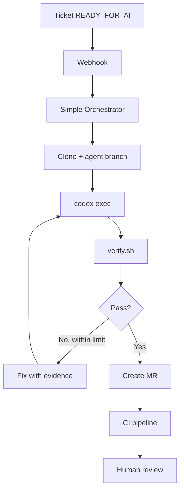

Stack tối thiểu:

```text
GitHub/GitLab/Jenkins
+ codex exec hoặc Codex GitHub Action
+ AGENTS.md
+ scripts/verify.sh
+ small webhook/orchestrator
```

Không cần ngay Kafka, Kubernetes, vector DB, custom memory, nhiều microservice hoặc một đội multi-agent phức tạp.

---

## 22. Definition of Done cho MVP

Một ticket đi từ `READY_FOR_AI` tới `MR Ready for Review` mà developer không cần mở Codex, gõ prompt, sửa code, chạy test, commit, push hay tạo MR.

Developer chỉ review MR.

Không tự động ngay:

- merge protected branch;
- production deployment;
- destructive database migration;
- IAM/secrets change;
- infrastructure destroy;
- production rollback.

---

## 23. Nguyên tắc quan trọng nhất

```text
Policy = deterministic code
Reasoning = agent
```

Không hỏi agent “có được merge không?”. Code phải kiểm tra:

```text
CI == PASS
AND approvals >= required
AND security_scan == PASS
AND branch_protection == PASS
```

Bắt đầu bằng:

```text
ONE EVENT
+ ONE AGENT
+ ONE REPOSITORY
+ ONE VERIFICATION COMMAND
+ ONE OUTPUT
```

---

## 24. Checklist triển khai

### Repository

- [ ] Có `AGENTS.md`, architecture, conventions và domain glossary.
- [ ] Spec có acceptance criteria và out-of-scope.
- [ ] Có `scripts/verify.sh` ổn định.
- [ ] Test chạy tự động và deterministic đủ mức cần thiết.

### Agent

- [ ] Completion contract machine-readable.
- [ ] Prohibited actions rõ ràng.
- [ ] Max retry/runtime/diff threshold.
- [ ] Independent review context.

### Security

- [ ] Ephemeral workspace.
- [ ] Short-lived, least-privilege token.
- [ ] Không cấp production credential.
- [ ] Protected branch và human approval.
- [ ] Network allowlist và secret isolation.

### CI/Orchestrator

- [ ] CI là source of truth.
- [ ] Webhook validation + idempotency.
- [ ] State machine chi tiết, không chỉ running/done.
- [ ] Failure evidence được trả lại agent.
- [ ] Audit, cleanup và human escalation.

---

## 25. Nguồn OpenAI chính thức

- [Codex non-interactive mode](https://learn.chatgpt.com/docs/non-interactive-mode)
- [Codex GitHub Action](https://learn.chatgpt.com/docs/github-action)
- [Custom instructions với AGENTS.md](https://learn.chatgpt.com/docs/agent-configuration/agents-md)
- [Agents API overview](https://developers.openai.com/api/docs/guides/agents-api/overview)
- [Agents API quickstart](https://developers.openai.com/api/docs/guides/agents-api/quickstart)
- [Agents API architecture](https://developers.openai.com/api/docs/guides/agents-api/architecture)
- [Sandbox security](https://developers.openai.com/api/docs/guides/agents-api/environments/security)
- [Sandbox lifecycle](https://developers.openai.com/api/docs/guides/agents-api/environments/lifecycle)
- [Multi-agent](https://developers.openai.com/api/docs/guides/agents-api/multi-agent)
- [MCP connections](https://developers.openai.com/api/docs/guides/agents-api/tools/mcp)

> API, model availability và CLI flags có thể thay đổi. Trước khi triển khai production, đối chiếu OpenAI Docs và quyền thực tế của project.

