# VHM - Nền tảng OCR & eKYC SDK

> **TÀI LIỆU MẬT**  
> Tài liệu mô tả thiết kế kỹ thuật cho năng lực OCR và xác thực danh tính điện tử
> dùng chung trong hệ sinh thái VHM. Không chia sẻ ra ngoài phạm vi dự án khi chưa
> được phê duyệt.

| **Team** | Team Dự án: **TBD** \| Team Kiến trúc: **TBD** \| Team Data Privacy: **TBD** \| Team ANBM: **TBD** \| SDK Technical Contact: **TBD** |
| --- | --- |
| **Status** | **DRAFT** / IN REVIEW / APPROVED |
| **Approval Date** | TBD |
| **Document Owner** | TBD |
| **System Owner** | TBD |

| **VERSION** | **DATE** | **CHANGES** | **UPDATED BY** |
| --- | --- | --- | --- |
| 0.1 | 06/08/2026 | Khởi tạo TDD nền tảng OCR & eKYC SDK dùng chung cho VHM | TBD |
| 0.2 | 06/08/2026 | Chốt baseline, Mermaid diagram, Mobile fail-fast/manual evidence và external-input gates | TBD |
| 1.0 | TBD | Bản được phê duyệt | TBD |

> **Quy ước trong tài liệu**
>
> - **VHM Application**: ứng dụng Mobile và Web của VHM tích hợp eKYC SDK tương ứng nền tảng.
> - **Identity Verification Platform**: thành phần backend dùng chung quản lý phiên,
>   tích hợp SDK Backend, chuẩn hóa kết quả và cung cấp kết quả cho Domain System.
> - **Domain System**: mọi hệ thống nghiệp vụ VHM đã đăng ký consumer và được phê
>   duyệt sử dụng OCR/eKYC cho purpose cụ thể.
> - **eKYC SDK**: SDK chạy trên thiết bị người dùng, điều khiển camera/NFC và hành trình xác thực.
> - **SDK Backend**: hệ thống xử lý OCR, NFC, liveness và face matching mà SDK giao tiếp.
> - **Provider Adapter**: lớp cô lập chi tiết SDK/API/payload/error khỏi Domain System.
> - **Canonical Result**: mô hình kết quả chuẩn nội bộ, không phụ thuộc SDK/provider cụ thể.
> - **Verification Pipeline**: chuỗi step versioned, ví dụ `OCR_DOCUMENT → LIVENESS_FACE`,
>   được resolve theo domain/use case và có thể chạy tự động hoặc manual.
> - **Verification Step**: đơn vị xử lý trong pipeline, có thể chứa nhiều sub-step
>   như nhiều ảnh giấy tờ hoặc nhiều pose liveness.
> - **Manual Evidence Completion**: luồng Mobile thu bổ sung evidence còn thiếu
>   sau khi automatic flow đã fail-fast; không phải automatic retry và không tự gọi
>   lại OCR/provider cho sub-step còn lại.
> - Nội dung đánh dấu **TBD** phải được xác nhận trước khi tài liệu được APPROVED.
> - Các quyết định kỹ thuật trong bản DRAFT là baseline triển khai. Mọi thay đổi
>   phải cập nhật TDD/ADR, đánh giá tác động và được phê duyệt theo governance.

---

# **1. System Overview**

## 1.1 Tên hệ thống

**VHM Identity Verification Platform - OCR & eKYC SDK**.

Đây là capability dùng chung cho toàn hệ sinh thái VHM, không thuộc riêng một
domain nghiệp vụ. Giải pháp bao gồm các thành phần logic sau:

1. **VHM Application (Mobile/Web)**
   - Thu thập consent trước khi bắt đầu xác thực.
   - Gọi backend VHM để tạo phiên và nhận SDK bootstrap.
   - Khởi chạy eKYC SDK và hiển thị hành trình cho người dùng.
   - Gửi các trạng thái phía client về backend phục vụ UX và vận hành.
2. **Identity Verification Platform**
   - Quản lý phiên OCR/eKYC dùng chung.
   - Resolve policy theo tenant, domain, use case và journey.
   - Cấp thông tin bootstrap ngắn hạn cho SDK.
   - Nhận official result từ callback đã xác thực.
   - Chủ động gọi Get Result chỉ khi reconciliation phát hiện callback quá SLA hoặc session treo.
   - Chuẩn hóa kết quả thành Canonical Result.
   - Ánh xạ kết quả kỹ thuật thành quyết định xác minh nội bộ.
   - Orchestrate pipeline nhiều step, async outbox và manual review theo cấu hình.
   - Phân phối kết quả cho Domain System qua API/event.
   - Ghi audit, cung cấp reconciliation và khả năng truy vết.
3. **eKYC SDK**
   - Điều khiển camera và hướng dẫn người dùng chụp giấy tờ.
   - Hỗ trợ đọc NFC khi journey yêu cầu.
   - Thực hiện liveness và face matching theo cấu hình.
4. **SDK Backend**
   - Xử lý OCR, NFC, liveness và face matching.
   - Gửi official result qua callback.
   - Cung cấp Get Result API cho reconciliation khi callback quá SLA hoặc thất lạc;
     polling không phải happy path.
5. **Domain System**
   - Sở hữu business object và trạng thái nghiệp vụ.
   - Quyết định cách sử dụng kết quả: auto-fill, chấp nhận, yêu cầu thử lại,
     chuyển hậu kiểm hoặc từ chối theo policy đã được phê duyệt.

> **Quyết định kiến trúc:** `Identity Verification Platform` được thiết kế là
> capability dùng chung. Domain System không tích hợp trực tiếp SDK Backend và
> không lưu credential/payload đặc thù của SDK.

## 1.2 Vấn đề giải quyết/Mục đích của hệ thống

### **1.2.1. Vấn đề hiện tại**

Nhiều hành trình trong VHM cần đọc giấy tờ và xác minh người thực hiện có đúng là
chủ thể trên giấy tờ hay không:

- Onboarding người dùng/đối tác trước khi kích hoạt tài khoản hoặc quyền nghiệp vụ.
- Xác minh người đại diện và nhân sự Đại lý.
- Đọc giấy tờ định danh của chủ thể và người liên quan trong quy trình hồ sơ.
- Xác minh khách hàng tại các bước Booking/Hợp đồng có yêu cầu định danh.
- Các hành trình khách hàng/cư dân khác được Product và Risk phê duyệt.

Nếu chỉ nhập tay hoặc upload ảnh thông thường, hệ thống gặp các vấn đề:

- Sai họ tên, số giấy tờ, ngày sinh, ngày cấp và địa chỉ.
- Dữ liệu không đồng nhất về Unicode, dấu tiếng Việt, kiểu ngày và cách viết địa chỉ.
- Ảnh mờ, chói, mất góc, sai mặt hoặc hai mặt không cùng giấy tờ.
- Không có bằng chứng đáng tin cậy rằng người thao tác là người thật.
- Không có cơ chế so khớp khuôn mặt người thao tác với ảnh trên giấy tờ.

Nếu từng domain tự tích hợp SDK, phát sinh thêm các rủi ro:

- Credential bị phân tán trên nhiều service/application.
- Mỗi domain hiểu mã lỗi, score và payload SDK theo một cách khác nhau.
- Cùng một thay đổi SDK phải sửa và kiểm thử ở nhiều hệ thống.
- Callback retry có thể tạo side effect lặp nếu không idempotent.
- Callback thất lạc làm phiên treo nếu không có reconciliation.
- Dữ liệu OCR/sinh trắc bị sao chép vào DB, log, Kafka hoặc analytics ngoài kiểm soát.
- Không có một nơi quản lý consent, quota, retention, audit và chi phí tập trung.

### **1.2.2. Mục đích**

Xây dựng một nền tảng xác minh danh tính dùng chung nhằm:

- Chuẩn hóa hai journey độc lập:
  - **OCR_ONLY**: đọc và chuẩn hóa giấy tờ, không khẳng định danh tính người thực hiện.
  - **FULL_EKYC**: OCR/NFC → liveness → face matching.
- Quản lý vòng đời phiên từ khởi tạo đến quyết định cuối cùng.
- Chỉ sử dụng kết quả server-to-server làm nguồn tin cậy.
- Chuẩn hóa payload SDK thành Canonical Result trước khi Domain System sử dụng.
- Cung cấp field projection theo scope, tránh domain lấy dữ liệu không cần thiết.
- Bảo đảm callback, retry, reconciliation và event là idempotent.
- Phân biệt lỗi kỹ thuật với kết quả người dùng không đạt.
- Không lưu media sinh trắc của automatic SDK flow tại VHM; manual evidence sau
  fail-fast là ngoại lệ có purpose, encryption và TTL riêng.
- Quản lý tập trung policy, cấu hình SDK, quota, retention, audit và monitoring.
- Cho phép thay SDK/provider trong tương lai mà không đổi contract của Domain System.

### **1.2.3. Nguyên tắc thiết kế**

1. **Không phát triển lại thuật toán AI**  
   VHM không tự xây OCR engine, liveness engine hoặc face matching engine trong phạm vi này.

2. **Client không phải nguồn kết quả cuối cùng**  
   Kết quả SDK trả về ứng dụng chỉ phục vụ UX. Quyết định cuối cùng phải dựa trên
   callback server-to-server đã xác thực. Get Result chỉ là cơ chế reconciliation
   fallback khi callback quá SLA hoặc session treo.

3. **OCR khác eKYC**  
   `OCR=PASSED` không đồng nghĩa `eKYC=VERIFIED`. Hai kết quả được lưu và công bố độc lập.

4. **Provider result không phải domain model**  
   Provider Adapter phải ánh xạ payload sang Canonical Result trước khi áp policy.

5. **Mỗi phiên có correlation ID do VHM sở hữu**  
   `verificationId` do backend VHM sinh. `providerSessionId` chỉ là external reference.

6. **Domain-agnostic core**  
   Platform sử dụng `tenantId + domain + businessRef + subjectRef + purpose`, không
   đặt foreign key tới bảng nghiệp vụ của domain.

7. **Idempotent by design**  
   Create, callback, retry, reconciliation và event delivery không được tạo side effect lặp.

8. **Pipeline execution phải durable**  
   Business transaction chỉ enqueue step. Executor sau commit là fast path;
   scheduler sweep là recovery path. Không dựa duy nhất vào in-memory task.

9. **Fail closed về bảo mật, fail safe về trải nghiệm**  
   Callback không xác thực phải bị từ chối; lỗi kỹ thuật không được biến thành `REJECTED`.

10. **Data minimization**  
   Chỉ lưu field cần thiết cho purpose đã phê duyệt. Không lưu raw callback, ảnh
   giấy tờ, selfie, video liveness hoặc raw NFC của automatic flow; manual evidence
   chỉ lưu theo contract tại mục 4.2.8 và retention tại mục 7.2.

11. **Configuration as controlled change**  
    Flow, threshold, retry, retention và security setting phải version hóa, có owner,
    phê duyệt và rollback plan.

### **1.2.4. Phạm vi thực hiện**

- Tích hợp eKYC SDK trên Mobile và Web được phê duyệt.
- Consumer registry và policy theo domain/use case.
- Consent guard trước khi tạo phiên.
- Tạo session, sinh `verificationId`, quản lý active session và retry chain.
- Hỗ trợ journey `OCR_ONLY` và `FULL_EKYC`.
- Hỗ trợ OCR giấy tờ, NFC, liveness và face matching theo khả năng SDK.
- Callback server-to-server là luồng nhận official result chính; Get Result API chỉ
  phục vụ reconciliation fallback.
- Canonical Result và error taxonomy dùng chung.
- State machine, idempotency, callback inbox và transactional outbox.
- Configurable pipeline, step/sub-step, identity-version guard và manual-review fan-out.
- Reconciliation cho callback thất lạc hoặc session treo.
- API field projection cho Domain System theo scope.
- Audit, metrics, alert và runbook vận hành.
- Bảo vệ credential, PII và dữ liệu sinh trắc.

### **1.2.5. Ngoài phạm vi**

- Huấn luyện/tinh chỉnh model OCR, liveness hoặc face matching.
- Xây dựng kho dữ liệu sinh trắc học dài hạn.
- Xây dựng hệ thống nhận diện khuôn mặt dùng ngoài purpose eKYC đã phê duyệt.
- Cho Domain System truy cập raw provider payload.
- Tự động áp một decision policy duy nhất cho mọi domain.
- Đồng bộ/sửa dữ liệu master của domain ngoài contract đã thống nhất.
- Tự động fallback sang provider khác.
- Manual review console đầy đủ nếu chưa được Product phê duyệt trong phạm vi.

### **1.2.6. Giả định và ràng buộc**

| **ID** | **Giả định/Ràng buộc** | **Trạng thái** | **Ảnh hưởng nếu thay đổi** |
| --- | --- | --- | --- |
| A-01 | Giải pháp sử dụng một eKYC SDK/provider chính | External scope input — Product | Thêm provider routing, cost/risk policy và consent nếu scope thay đổi |
| A-02 | Kết quả chính thức luôn lấy server-to-server | Quyết định thiết kế | Client result không được dùng cho business decision |
| A-03 | `verificationId` do VHM sinh; external ID không phải primary key | Quyết định thiết kế | External ID chỉ dùng correlation/provider mapping |
| A-04 | Callback có JWS/JWT và replay protection theo baseline | Provider capability input — go-live blocker | Provider không đáp ứng phải có ANBM exception trước production |
| A-05 | FULL_EKYC production luôn có liveness | Quyết định thiết kế/Security gate | Tắt liveness phải đổi journey và có risk acceptance riêng |
| A-06 | SDK Backend giữ kết quả đủ lâu để reconciliation | Provider/Privacy contract input | Retention quá ngắn làm mất khả năng phục hồi callback |
| A-07 | VHM không lưu video liveness/face template | Quyết định Data Minimization | Thay đổi yêu cầu DPIA, encryption, access và retention riêng |
| A-08 | Domain System sử dụng opaque `businessRef/subjectRef` | Quyết định thiết kế | Tránh coupling DB giữa platform và domain |
| A-09 | SDK platform/version và compatibility matrix Mobile/Web được pin theo implementation baseline | Implementation manifest input | Thiếu manifest thì không được tạo build để triển khai |
| A-10 | Volume, peak TPS và dependency SLA phải được cung cấp | Capacity/SLO input | Thiếu input thì không qua production readiness review |
| A-11 | Mỗi domain có owner chịu trách nhiệm business decision | Quyết định ownership | Platform không tự định nghĩa risk rule thay domain |
| A-12 | Một use case cấu hình 0..N active step; không có active step nghĩa là skip có audit | Quyết định pipeline | Governance ngăn vô tình tắt xác minh |
| A-13 | Retry cap, term và sub-step mode được snapshot lúc enqueue | Quyết định pipeline | Giữ deterministic behavior nếu config đổi khi task đang chờ |
| A-14 | Domain hook như identity lock/notification được xử lý ngoài Platform | Quyết định ownership | Platform chỉ phát event, không hard-code domain-specific roles |
| A-15 | Với `SEQUENTIAL_FAIL_FAST`, SDK/provider có thể dừng trước khi thu đủ front/back | Quyết định Mobile flow | VHM Secure Evidence Capture thu phần còn thiếu cho manual review |
| A-16 | Evidence dùng cho manual review chỉ lưu tạm tại Private Object Storage theo purpose/TTL | Privacy/Security go-live gate | Không có approval thì tắt manual evidence và dùng whole-step retry |

## 1.3 Đối tượng sử dụng

- **Người dùng cuối**: thực hiện OCR/eKYC trong VHM Application.
- **Người dùng/đối tác/đại diện pháp lý**: thực hiện định danh cho onboarding hoặc hồ sơ được phân quyền.
- **Business Operator/Reviewer**: tra cứu kết quả đã mask và xử lý hậu kiểm theo assignment.
- **Customer Support/Operation**: tra cứu phiên, hỗ trợ lỗi và kích hoạt tác vụ retry/reprocess có kiểm soát.
- **Domain System**: tạo phiên, nhận event, query field theo scope và áp business rule.
- **Platform Administrator**: quản lý consumer, policy, cấu hình và vận hành nền tảng.
- **Security/Data Privacy/Auditor**: kiểm soát consent, retention, access và audit.
- **SDK Backend**: hệ thống ngoài trust boundary gửi callback/cung cấp result API.

## 1.4 Thu thập & xử lý dữ liệu cá nhân

[X] **Có:** Hệ thống xử lý dữ liệu cá nhân và có thể xử lý dữ liệu sinh trắc học.

Các nhóm dữ liệu dự kiến:

- Họ tên, số giấy tờ, ngày sinh, giới tính, quốc tịch.
- Địa chỉ thường trú, quê quán, ngày cấp, nơi cấp, ngày hết hạn.
- Ảnh mặt trước/mặt sau giấy tờ.
- Dữ liệu NFC được chuẩn hóa theo field được duyệt.
- Ảnh chân dung hoặc video/frame phục vụ liveness.
- Kết quả OCR và confidence theo field.
- Kết quả liveness, spoof/deepfake signal nếu SDK cung cấp.
- Kết quả face match và similarity score.
- Warning chất lượng/rủi ro giấy tờ.
- Thông tin thiết bị ở mức tối thiểu phục vụ compatibility và phòng chống gian lận.
- Consent: chủ thể, purpose, version nội dung, channel và thời điểm đồng ý.

Mục **7.2 Data Privacy** phải được APPROVED trước production.

## 1.5 Mức độ quan trọng của hệ thống

- **Cấp độ hệ thống:** Tier 2 - Business Critical.
- **Mô tả:** OCR/eKYC nằm trên các hành trình onboarding/xác minh quan trọng.
  Gián đoạn ngắn có thể chấp nhận nếu người dùng lưu được trạng thái nghiệp vụ và
  thử lại sau; sai kết quả hoặc mất tính toàn vẹn không được chấp nhận.
- **Nguyên tắc ưu tiên:**
  - Bảo mật và toàn vẹn cao hơn tốc độ hoàn tất.
  - Không biến lỗi kỹ thuật thành kết luận người dùng không đạt.
  - Không bypass eKYC khi domain bắt buộc, trừ exception có thẩm quyền và audit.

## 1.6 Non-Functional Requirements tổng quát

| **Nhóm** | **Baseline** | **Trạng thái** |
| --- | --- | --- |
| Availability | Platform >= 99.9% theo tháng; dependency SDK Backend theo SLA riêng | Baseline |
| Create session | p95 <= 1 giây không tính external call; p95 <= 3 giây end-to-end | Baseline |
| Status/result query | p95 <= 300 ms với dữ liệu đã persist | Baseline |
| Callback acknowledgement | Durable receive và trả 2xx <= 2 giây; xử lý nặng async | Baseline |
| Event delivery | p95 <= 5 giây sau khi result được xác minh | Baseline |
| Scalability | Horizontal scale; không giữ session trong memory local | Bắt buộc |
| Data integrity | Idempotency, optimistic locking, append-only history, outbox | Bắt buộc |
| Security | TLS, secret manager, callback auth, schema validation, masking | Bắt buộc |
| Observability | Metrics, structured log đã mask, trace/correlation | Bắt buộc |
| Recovery | Reconcile non-terminal session; không phụ thuộc callback duy nhất | Bắt buộc |
| Compatibility | Device/OS/browser/app/SDK matrix và phased rollout | Implementation manifest bắt buộc trước build |
| Maintainability | Domain contract không phụ thuộc SDK payload; policy versioned | Bắt buộc |

---

# **2. Application Architecture**

## 2.1. Application Architecture Diagram

### 2.1.1. System Context Diagram (L1)

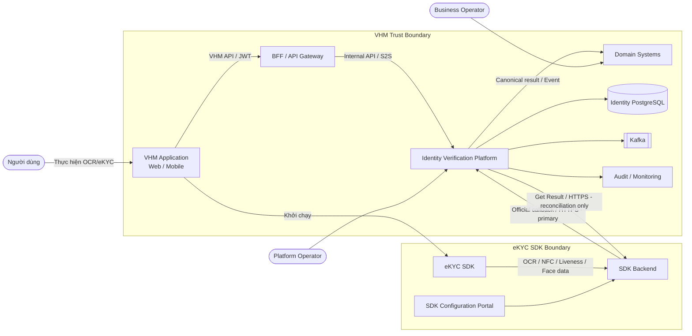

### 2.1.2. Container Diagram (L2)

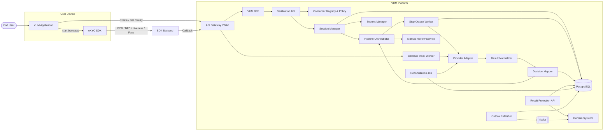

### 2.1.3. Danh sách module và trách nhiệm

| **STT** | **Module** | **Mục đích** | **Không chịu trách nhiệm** |
| --- | --- | --- | --- |
| 1 | **VHM Application (Mobile/Web)** | Hiển thị consent; kiểm tra capability; gọi create session; khởi chạy SDK; báo started/submitted/cancel/error; hiển thị trạng thái trung tính | Không giữ secret; không tự quyết định VERIFIED; không gửi OCR result tin cậy |
| 2 | **eKYC SDK** | Camera/NFC UX; thu nhận dữ liệu; giao tiếp SDK Backend | Không sở hữu trạng thái nghiệp vụ VHM |
| 3 | **BFF/API Gateway** | Xác thực user; authorize business object; rate limit; route API | Không map provider payload hoặc lưu session |
| 4 | **Verification API** | API nội bộ; validate request; orchestration application-level | Không thực hiện thuật toán OCR/liveness |
| 5 | **Consumer Registry & Policy** | Quản lý domain/use case/journey/field scope/quota/policy version | Không chứa secret SDK |
| 6 | **Session Manager** | Tạo session; active guard; state machine; expiry; retry chain; optimistic locking | Không phụ thuộc raw SDK payload |
| 7 | **Pipeline Orchestrator** | Resolve first/next active step; advance/skip/complete; snapshot config; phát domain hook | Không gửi notification hoặc lock identity trực tiếp |
| 8 | **Step Outbox Worker** | Chạy step async; after-commit fast path + scheduler fallback; row lock/version guard; retry/backoff | Không phụ thuộc in-memory execution duy nhất |
| 9 | **Provider Adapter** | Auth/callback/result API; timeout; error translation; cô lập SDK contract | Không áp business rule domain |
| 10 | **Result Normalizer** | Chuyển document/liveness/face/warning thành Canonical Result | Không cập nhật business object |
| 11 | **Decision Mapper** | Ánh xạ Canonical Result thành decision theo versioned policy | Không hard-code threshold chưa phê duyệt |
| 12 | **Manual Review Service** | Tạo 1..N review theo term; authorize reviewer; approve/reject/re-run; audit | Không hard-code business role hoặc recipient |
| 13 | **Callback Inbox** | Durable receive, authentication metadata, dedupe, quarantine/reprocess | Chỉ lưu envelope/hash; raw payload không persist |
| 14 | **Reconciliation Job** | Tìm session treo, lấy result, backoff và hoàn tất idempotent | Không polling mọi session liên tục |
| 15 | **Result Projection API** | Trả normalized field theo consumer scope và masking policy | Không trả raw provider response |
| 16 | **Outbox Publisher** | Phát completion/status/step/review event không mất/trùng side effect | Không chứa raw PII trong event |
| 17 | **Domain System** | Áp rule nghiệp vụ, identity lock, notification, auto-fill, block/review/retry | Không tích hợp trực tiếp SDK Backend |
| 18 | **PostgreSQL** | Session, pipeline, step, check, field, inbox, manual review, history, outbox | Không lưu binary media trực tiếp |
| 19 | **Private Object Storage** | Lưu manual evidence đã được phê duyệt, TTL ngắn | Không public; không lưu presigned URL dài hạn |

### 2.1.4. Luồng dữ liệu OCR/eKYC

eKYC SDK trên Mobile/Web gửi dữ liệu OCR, NFC, liveness và face tới SDK Backend.

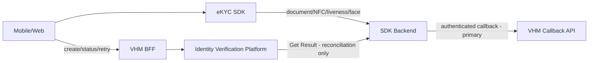

Ràng buộc triển khai bắt buộc:

- Dữ liệu document, selfie, video và NFC raw của automatic SDK flow được truyền
  giữa eKYC SDK và SDK Backend; VHM BFF/Identity Verification Platform chỉ xử lý
  control-plane, session và official result.
- Manual evidence sau fail-fast là luồng riêng: Mobile upload trực tiếp tới Private
  Object Storage bằng one-time instruction; BFF/Identity Platform quản lý
  metadata/checksum.
- VHM chỉ cấp bootstrap/configuration ngắn hạn; API key/app secret không đi xuống client.
- Kết quả phía client chỉ phục vụ UX. Official result phải đến từ callback
  server-to-server đã xác thực. Reconciliation Job chỉ gọi Get Result khi callback
  quá SLA hoặc session treo.
- Mobile/Web không log SDK payload, media reference, token hoặc dữ liệu định danh raw.
- Network allowlist, TLS, SDK integrity và callback authentication tuân theo mục Security.
- Data location, retention, subprocessor và incident handling phải được kiểm soát
  bằng hợp đồng và là gate bắt buộc trước production.

### 2.1.5. Trust Boundary

| **Boundary** | **Luồng** | **Mức tin cậy** | **Kiểm soát bắt buộc** |
| --- | --- | --- | --- |
| Device → VHM | Create/get/start/submit/retry | Untrusted client | JWT, object authorization, rate limit, idempotency, schema validation |
| Device → SDK Backend | SDK data-plane | External dependency | TLS, SDK integrity, short-lived bootstrap, device security |
| SDK Backend → VHM | Callback | External server | Strong auth/signature, WAF, timestamp/replay guard, schema, idempotency |
| VHM → SDK Backend | Create session; Get Result chỉ từ Reconciliation Job sau callback SLA | External dependency | Secret Manager, TLS, timeout, circuit breaker, audit |
| Identity Platform → Domain | Internal S2S/event | Zero Trust internal | Workload identity, domain scope, schema, event ACL |
| Platform → DB/S3/Kafka | Restricted storage | Restricted | Private subnet, IAM, encryption, least privilege |

### 2.1.6. Journey Policy Model

| **Journey** | **Step bắt buộc** | **Kết quả Platform** | **Quy tắc sử dụng** |
| --- | --- | --- | --- |
| `OCR_ONLY` | `OCR_DOCUMENT` | OCR fields, quality/warning và `ekycOutcome=NOT_PERFORMED` | Không được diễn giải là đã xác minh danh tính |
| `FULL_EKYC` | `OCR_DOCUMENT → LIVENESS_FACE`; NFC bật bằng versioned policy | OCR fields + eKYC decision + identity reference | Bắt buộc liveness; không silent downgrade khi thiếu capability |

Platform không hard-code journey theo tên domain. Mỗi consumer registration bắt buộc
khai báo `domain + useCase + subjectType + journey + documentTypes + nfcRequired +
fieldScopes + enforcementPoint + policyVersion` trước khi được phép tạo session.

### 2.1.7. Channel Capability Matrix

| **Capability** | **Mobile App** | **Mobile Web** | **Desktop Web** | **Quy tắc** |
| --- | --- | --- | --- | --- |
| Camera OCR | Native SDK | Web SDK trên browser allowlist | Web SDK + webcam trên browser allowlist | Permission/camera quality phải pass trước start |
| Upload giấy tờ | Không cho FULL_EKYC; OCR_ONLY theo explicit policy | Không cho FULL_EKYC; OCR_ONLY theo explicit policy | Không cho FULL_EKYC; OCR_ONLY theo explicit policy | Live capture là baseline verification journey |
| NFC | Mobile App trên device/OS allowlist | Không hỗ trợ | Không hỗ trợ | `nfcRequired=true` trên Web bắt buộc handoff Mobile |
| Liveness | Native SDK | Web SDK trên browser allowlist | Web SDK + webcam trên browser allowlist | Thiếu capability trả `CHANNEL_CAPABILITY_REQUIRED` |
| Face matching | Qua SDK Backend | Qua SDK Backend | Qua SDK Backend | Backend-only official result |
| Resume | Query backend status; SDK run resume theo compatibility manifest | Query backend status sau refresh | Query backend status sau refresh | Không lưu bootstrap token dài hạn; unsupported resume chuyển retry/handoff |
| Handoff QR/deep link | Nhận/claim và khởi chạy Mobile run | Phát handoff khi thiếu capability | Phát handoff khi thiếu capability | One-time token, bind cùng verification session/subject |

Backend resolve flow từ `requestedJourney + channel + capability + domain policy`:

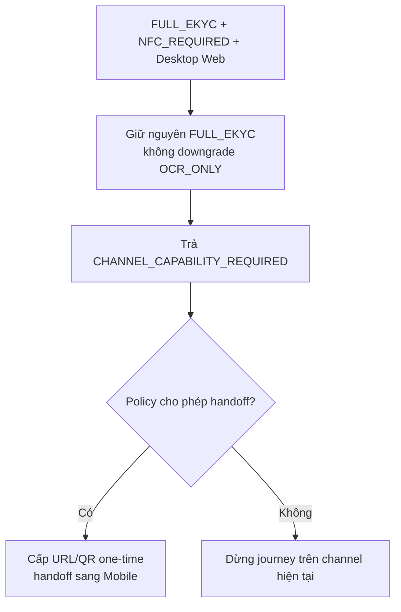

Handoff tạo một Mobile channel run mới trong cùng verification session. Nếu provider
không cho reuse external session, Provider Adapter tạo external session mới và map
vào cùng `verificationId`; mọi liên kết được audit và token không chứa PII.

### 2.1.8. Thông tin dữ liệu

| **Loại dữ liệu** | **Ví dụ** | **Phân loại** | **Quy tắc lưu trữ** | **Bảo mật/Logic** |
| --- | --- | --- | --- | --- |
| Internal session | `verificationId`, domain, purpose | L2 | PostgreSQL | UUID random; tenant/domain isolation |
| Business references | `businessRef`, `subjectRef` | L2 | PostgreSQL | Opaque; không nhúng PII |
| Provider session | `providerSessionId` | L2/Internal | PostgreSQL, unique theo provider | External correlation, không dùng làm PK |
| State/timestamps | status, attempts, expiry | L2 | PostgreSQL | Guard + optimistic lock + append-only history |
| OCR fields | document number, name, DOB, address | L3 | Field-level encrypted; chỉ field approved | Mask; projection theo scope |
| Confidence/warnings | score, reason code | L2/L3 | Check table/JSONB | Versioned mapping, hạn chế UI |
| Liveness/face result | status, score | L3/Biometric-related | Status/score tối thiểu | Không lưu video/template tại VHM |
| Resource URL | front/back/video URL | L3 | Không persist | Không log; không fetch tự động |
| Raw callback | Payload gốc | L3/L4 | Không persist; quarantine chỉ bật bằng incident ticket, mã hóa và TTL | Audited access, automatic purge |
| Consent | purpose/version/time | L3 | Consent system + reference | Purpose-bound, audit được |
| Credential/token | API key, callback key, SDK token | Secret | VHM Secret Manager; workload memory khi sử dụng | Không DB/log/client binary |

## 2.2. Session Configuration

### 2.2.1. User Authentication Session

- Do IAM/BFF quản lý qua OIDC/JWT.
- Identity Platform không tự quản lý login session.
- Backend phải xác minh user/service có quyền với `businessRef` trước mọi mutation/read.

### 2.2.2. Verification Session

| **Thuộc tính** | **Baseline** |
| --- | --- |
| Internal ID | `verificationId` UUIDv7 do VHM sinh |
| External correlation | `providerSessionId`, unique theo provider/environment |
| Active uniqueness | Một session active trên `(tenant, domain, businessRef, subjectRef, purpose, journey)` |
| Idempotency | `Idempotency-Key` bắt buộc khi create/retry |
| Timeout | 30 phút; backend và SDK config dùng cùng versioned policy |
| Retry | Tạo session mới, link `retryOfVerificationId`; không reuse external session |
| Resume | Chỉ khi SDK contract hỗ trợ; backend không giả định resume |
| Client completion | Chỉ là `SUBMITTED`, không phải verified |
| Provider completion | Callback hợp lệ; Get Result chỉ hoàn tất qua reconciliation fallback |
| Business completion | Sau normalize + decision policy + durable event |
| Channel | `MOBILE_APP`, `MOBILE_WEB`, `DESKTOP_WEB`; ghi nhận tại session/run |
| Capability | Camera/NFC/liveness capability được client khai báo và backend validate theo compatibility policy |

### 2.2.3. State Machine

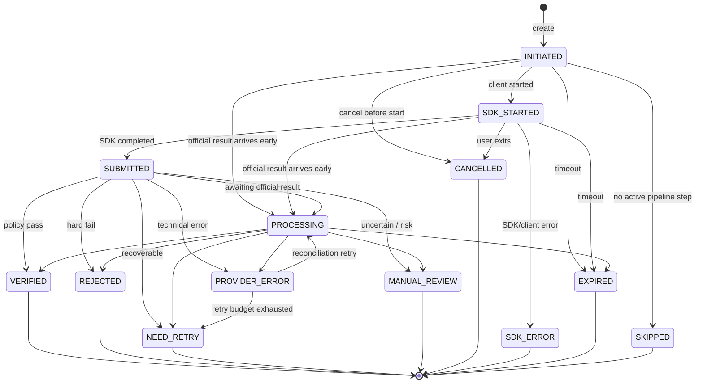

### 2.2.4. State Transition Guard

| **From** | **To** | **Điều kiện** | **Tác động** |
| --- | --- | --- | --- |
| INITIATED | SDK_STARTED | Chưa expire; caller đúng owner; bootstrap hợp lệ | Ghi startedAt/platform/app/sdk version |
| INITIATED | SKIPPED | Pipeline không có active step theo versioned config | Audit + domain event; không coi là VERIFIED |
| SDK_STARTED | SUBMITTED | Client báo SDK hoàn tất; external reference match | Ghi submittedAt; không cập nhật decision |
| SUBMITTED | PROCESSING | Official result chưa final hoặc processing async | Lập reconciliation schedule |
| INITIATED/SDK_STARTED/SUBMITTED/PROCESSING | VERIFIED | Official result hợp lệ + policy pass | Persist check/field/history/outbox; chấp nhận callback đến trước client event |
| INITIATED/SDK_STARTED/SUBMITTED/PROCESSING | REJECTED | Hard fail theo policy approved | Lưu canonical reasons; không nhầm timeout |
| INITIATED/SDK_STARTED/SUBMITTED/PROCESSING | NEED_RETRY | Recoverable quality/user error | Đóng attempt; cho tạo session mới nếu còn quota |
| INITIATED/SDK_STARTED/SUBMITTED/PROCESSING | MANUAL_REVIEW | Kết quả không chắc/risk rule | Tạo review task/event nếu capability tồn tại |
| Any non-terminal | EXPIRED | `expiresAt < now`, chưa final | History + retry eligibility |
| Terminal | Any | Không cho chuyển ngược | Correction qua operation workflow riêng |

## 2.3. Internal Component Design

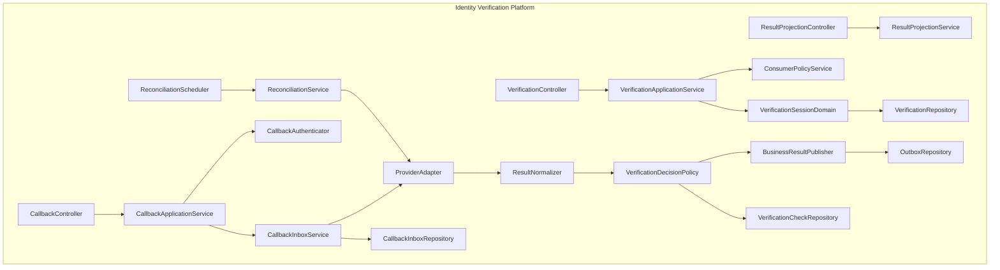

### 2.3.1. VerificationApplicationService

- Kiểm tra consumer/domain/use case đã đăng ký.
- Kiểm tra business reference và quyền caller qua domain authorization contract.
- Validate consent đúng subject, purpose và version.
- Resolve journey, timeout, quota và decision policy version.
- Bảo đảm unique active session và create idempotent.
- Sinh `verificationId`, tạo provider session qua adapter nếu contract yêu cầu.
- Trả SDK bootstrap tối thiểu; không trả credential dài hạn.

### 2.3.2. ConsumerPolicyService

Consumer config tối thiểu:

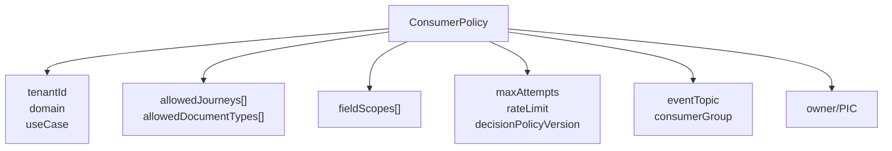

- Config versioned và environment-scoped.
- Thay đổi field scope/decision policy cần Data Privacy/Risk approval tương ứng.
- Secret không nằm trong consumer config.

### 2.3.3. CallbackAuthenticator

- Callback bắt buộc dùng chữ ký bất đối xứng JWS/JWT với `keyId`, timestamp,
  audience và nonce/event ID. mTLS được áp dụng thêm khi SDK Backend hỗ trợ.
- Fixed token không đáp ứng baseline production; provider không hỗ trợ chữ ký phải
  có security exception được ANBM phê duyệt trước tích hợp.
- Validate timestamp, audience, key ID và replay window cho mọi callback.
- IP allowlist chỉ là lớp bổ sung, không thay authentication.
- Reject trước khi parse sâu nếu payload quá lớn.
- Hỗ trợ key rotation overlap, không gây gián đoạn callback đang bay.

### 2.3.4. CallbackInboxService

- Idempotency key dùng `providerEventId`; chỉ fallback external session + result
  version/payload hash khi provider contract xác nhận không cung cấp event ID.
- Lưu metadata callback trước khi xử lý business.
- Duplicate đã nhận durable trả 2xx, không chạy side effect lần hai.
- Inbox states: `RECEIVED`, `PROCESSING`, `PROCESSED`, `FAILED`, `QUARANTINED`.
- Raw payload không persist. Quarantine chỉ bật theo incident ticket, encrypted,
  TTL ngắn, audited access và automatic purge.

### 2.3.5. ResultNormalizer

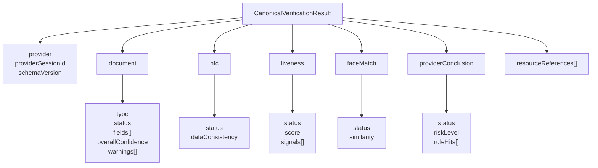

Normalizer phải:

- Chịu được optional field, null, `N/A` và provider thêm field mới.
- Parse score/boolean/date an toàn, validate range.
- Quarantine khi thiếu external session, schema không hỗ trợ hoặc payload sai type nghiêm trọng.
- Giữ provider code phục vụ audit nhưng chỉ trả canonical code cho domain.
- Không fetch resource URL tự động.

### 2.3.6. VerificationDecisionPolicy

Decision model:

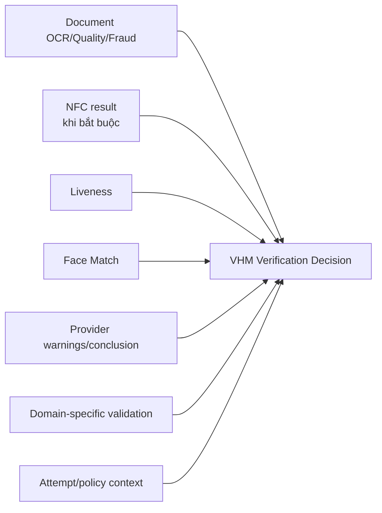

- Sử dụng mapping policy versioned, không tự xây fraud engine phức tạp.
- Threshold không hard-code trong Java.
- Provider conclusion là input, không tự động là business decision.
- Lưu `decisionPolicyVersion` và canonical reason codes tại thời điểm quyết định.

### 2.3.7. ResultProjectionService

- Kiểm tra service identity, tenant, domain và approved field scopes.
- Trả field projection, không trả schema field bị cấm dưới dạng null.
- Mask theo role/use case; unmask cần elevated permission + reason + audit.
- Không expose resource URL, raw warning hoặc threshold có thể hỗ trợ gian lận.

### 2.3.8. BusinessResultPublisher

- Nếu Platform tách service: dùng transactional outbox + Kafka.
- Event chỉ chứa routing/outcome, không chứa raw PII.
- Consumer idempotent theo `eventId`.
- Nếu domain cần field: gọi Result Projection API với S2S authorization.

## 2.4. Data Model

### 2.4.1. ERD

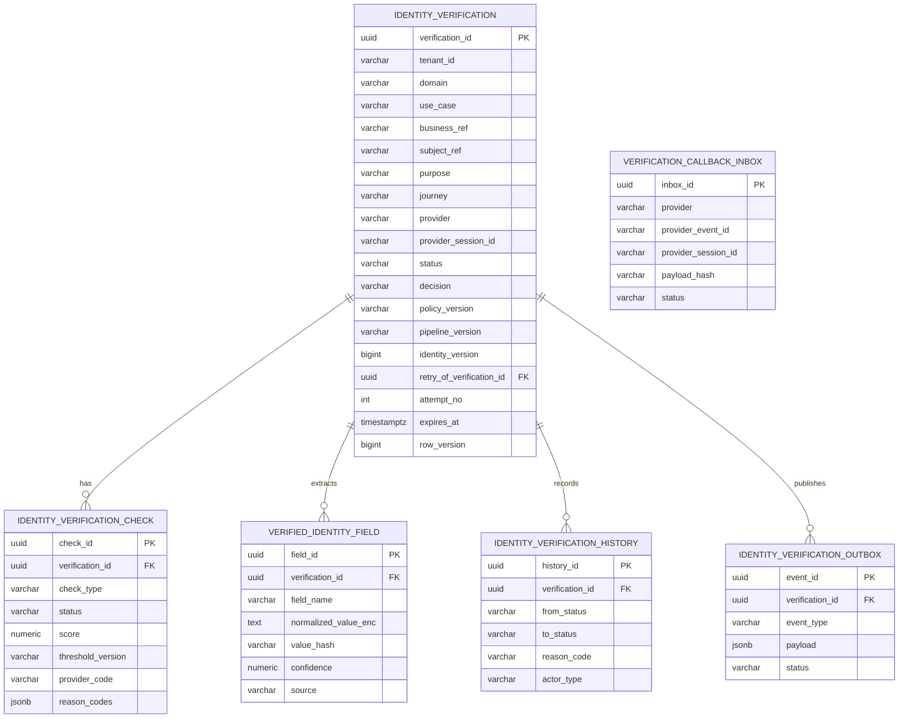

### 2.4.2. Bảng `identity_verification`

```sql
CREATE TABLE identity_verification (
    verification_id             uuid PRIMARY KEY,
    tenant_id                    varchar(50)  NOT NULL,
    domain                       varchar(50)  NOT NULL,
    use_case                     varchar(80)  NOT NULL,
    business_ref                 varchar(150) NOT NULL,
    subject_ref                  varchar(150) NOT NULL,
    purpose                      varchar(80)  NOT NULL,
    journey                      varchar(40)  NOT NULL,
    document_type                varchar(40),
    provider                     varchar(40)  NOT NULL,
    provider_session_id          varchar(150),
    status                       varchar(30)  NOT NULL,
    decision                     varchar(30),
    decision_reason_codes        jsonb        NOT NULL DEFAULT '[]',
    policy_version               varchar(80)  NOT NULL,
    pipeline_version             varchar(80)  NOT NULL,
    identity_version             bigint       NOT NULL DEFAULT 1,
    retry_of_verification_id     uuid,
    attempt_no                   integer      NOT NULL DEFAULT 1,
    sdk_platform                 varchar(30),
    sdk_version                  varchar(50),
    app_version                  varchar(50),
    expires_at                   timestamptz  NOT NULL,
    started_at                   timestamptz,
    submitted_at                 timestamptz,
    completed_at                 timestamptz,
    created_by                   varchar(150) NOT NULL,
    created_at                   timestamptz  NOT NULL,
    updated_at                   timestamptz  NOT NULL,
    row_version                  bigint       NOT NULL DEFAULT 0,
    CONSTRAINT fk_iv_retry_of FOREIGN KEY (retry_of_verification_id)
      REFERENCES identity_verification(verification_id),
    CONSTRAINT uk_iv_provider_session UNIQUE (provider, provider_session_id)
);

CREATE INDEX idx_iv_business_ref
  ON identity_verification(tenant_id, domain, business_ref, created_at DESC);

CREATE INDEX idx_iv_subject_ref
  ON identity_verification(tenant_id, domain, subject_ref, created_at DESC);

CREATE INDEX idx_iv_reconciliation
  ON identity_verification(status, updated_at)
  WHERE status IN ('SUBMITTED', 'PROCESSING', 'PROVIDER_ERROR');

CREATE UNIQUE INDEX uk_iv_active_subject
  ON identity_verification(
    tenant_id, domain, business_ref, subject_ref, purpose, journey
  )
  WHERE status IN ('INITIATED', 'SDK_STARTED', 'SUBMITTED', 'PROCESSING');
```

`provider_session_id` có thể null trước khi provider session được tạo. PostgreSQL
cho phép nhiều null dưới unique constraint; adapter phải bổ sung validation khi bind.

### 2.4.3. Bảng `identity_verification_check`

```sql
CREATE TABLE identity_verification_check (
    check_id               uuid PRIMARY KEY,
    verification_id        uuid        NOT NULL
      REFERENCES identity_verification(verification_id),
    check_type              varchar(40) NOT NULL,
    status                  varchar(30) NOT NULL,
    score                   numeric(12,6),
    threshold_version       varchar(80),
    provider_code           varchar(80),
    reason_codes            jsonb       NOT NULL DEFAULT '[]',
    warning_data            jsonb       NOT NULL DEFAULT '[]',
    checked_at              timestamptz,
    created_at              timestamptz NOT NULL,
    updated_at              timestamptz NOT NULL,
    CONSTRAINT uk_iv_check UNIQUE (verification_id, check_type)
);
```

`check_type` baseline:

- `DOCUMENT_OCR`
- `DOCUMENT_QUALITY`
- `DOCUMENT_FRAUD`
- `NFC_READING`
- `NFC_CONSISTENCY`
- `LIVENESS`
- `FACE_MATCH`
- `PROVIDER_CONCLUSION`

### 2.4.4. Bảng `verified_identity_field`

```sql
CREATE TABLE verified_identity_field (
    field_id                  uuid PRIMARY KEY,
    verification_id           uuid         NOT NULL
      REFERENCES identity_verification(verification_id),
    field_name                varchar(80)  NOT NULL,
    normalized_value_enc      text,
    value_hash                varchar(128),
    confidence                numeric(12,6),
    source                    varchar(30)   NOT NULL,
    created_at                timestamptz   NOT NULL,
    CONSTRAINT uk_iv_field UNIQUE (verification_id, field_name)
);
```

- `normalized_value_enc`: application/column-level encryption theo platform standard.
- `value_hash`: chỉ tạo cho field exact-match/dedup; dùng HMAC-SHA256 với key riêng,
  không dùng plain SHA-256 cho CCCD.
- Không index plaintext PII.
- Retention field có thể ngắn hơn session metadata và phải có deletion job riêng.

### 2.4.5. Bảng Callback Inbox

```sql
CREATE TABLE verification_callback_inbox (
    inbox_id                 uuid PRIMARY KEY,
    provider                 varchar(40)  NOT NULL,
    provider_event_id        varchar(150),
    provider_session_id      varchar(150) NOT NULL,
    result_version           varchar(80),
    payload_hash             varchar(128) NOT NULL,
    auth_subject             varchar(150),
    status                   varchar(30)  NOT NULL,
    received_at              timestamptz  NOT NULL,
    processing_started_at    timestamptz,
    processed_at             timestamptz,
    failure_code             varchar(80),
    failure_message_masked   varchar(500),
    CONSTRAINT uk_callback_event UNIQUE(provider, provider_event_id),
    CONSTRAINT uk_callback_payload UNIQUE(provider, provider_session_id, payload_hash)
);
```

Nếu provider không có event ID, uniqueness fallback theo external session + payload hash.
Không lưu raw payload; bảng chỉ chứa envelope metadata và payload hash.

## 2.5. Concurrency, Idempotency và Transaction

### 2.5.1. Tạo phiên đồng thời

Rủi ro: double-click/mobile retry tạo hai session.

Kiểm soát:

- `Idempotency-Key` bắt buộc.
- Lưu request fingerprint; cùng key khác body trả conflict.
- Partial unique active index.
- Nếu cùng idempotency và fingerprint, trả session hiện hữu.

### 2.5.2. Callback đồng thời/trùng lặp

- Insert inbox với unique event/payload key.
- Request thắng insert thực hiện durable receive.
- Duplicate `PROCESSED/PROCESSING` trả 2xx để tránh retry storm.
- Completion outbox unique theo `(verificationId, eventType, decisionVersion)`.

### 2.5.3. Callback và reconciliation cùng chạy

- Cả hai gọi chung `processOfficialResult()`.
- Callback/reconciliation khóa session bằng `SELECT ... FOR UPDATE` trong transaction
  ngắn; API mutation thông thường dùng optimistic `rowVersion`.
- Nếu terminal, chỉ append audit duplicate/late source, không phát event lại.
- Provider correction sau terminal phải qua flow correction riêng, không overwrite im lặng.

### 2.5.4. Transaction boundary

Trong một local transaction:

1. Upsert verification checks.
2. Lưu normalized fields được phép.
3. Chuyển session state/decision.
4. Append history.
5. Insert outbox.

Không gọi Domain System, Kafka hoặc SDK Backend bên trong DB transaction.

## 2.6. Configurable Verification Pipeline

### 2.6.1. Pipeline model

Một verification session có thể chạy theo pipeline cấu hình:

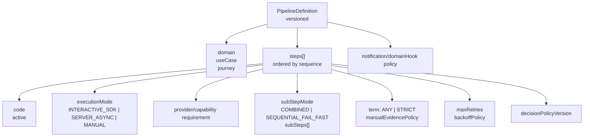

Baseline:

- `firstActiveStep()` khởi tạo step đầu tiên.
- `nextActiveStep(current)` advance sau khi pass/manual approve.
- Không còn active step → session `VERIFIED`.
- Không có active step ngay từ đầu → `SKIPPED`/no-verification outcome có audit;
  Domain System quyết định business state tương ứng.
- Pipeline definition/version được snapshot trên session để config mới không đổi
  hành vi của phiên đang chạy.

Execution modes:

| **Mode** | **Mô tả** | **Trigger/Execution** |
| --- | --- | --- |
| `INTERACTIVE_SDK` | Người dùng thao tác trực tiếp trên Mobile/Web SDK | Platform tạo SDK run và chờ official callback; Reconciliation Job gọi Get Result nếu callback quá SLA hoặc session treo rồi apply vào step |
| `SERVER_ASYNC` | Ảnh/document refs đã tồn tại; backend gọi provider không cần user online | Enqueue step outbox, after-commit fast path + scheduler fallback |
| `MANUAL` | Provider/channel không hỗ trợ hoặc policy yêu cầu hậu kiểm | Tạo manual review trực tiếp; không phát genuine-failure event |

Outbox execution pattern bên dưới áp dụng trực tiếp cho `SERVER_ASYNC`. Với
`INTERACTIVE_SDK`, callback đưa Canonical Result vào cùng step decision, advance và
manual-review pipeline. Khi callback quá SLA hoặc session treo, Reconciliation Job
gọi Get Result và đưa kết quả qua đúng pipeline này; không tạo một provider call nền
trùng với SDK flow.

### 2.6.2. Step/Sub-step states

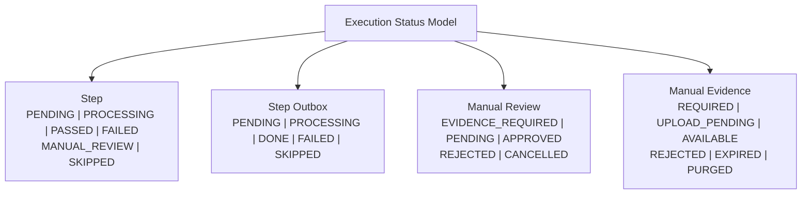

### 2.6.3. Async execution pattern

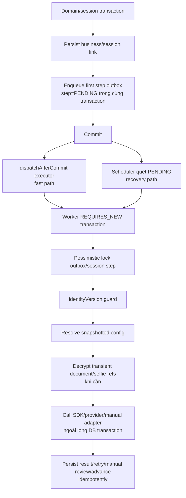

Fast path không phải delivery guarantee. Scheduler sweep là cơ chế bảo đảm task đã
commit nhưng executor crash/restart vẫn được xử lý.

### 2.6.4. Identity-version guard

Khi giấy tờ/ảnh/chủ thể được thay đổi, Domain hoặc Platform tăng `identityVersion`.
Mỗi step outbox lưu `identityVersionSnapshot` lúc enqueue.

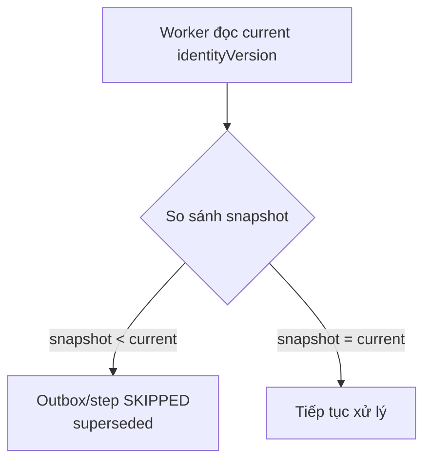

Guard ngăn task cũ ghi kết quả OCR/liveness lên bộ dữ liệu mới. Việc tăng version
phải nằm cùng transaction với thay đổi document references.

### 2.6.5. Sub-step execution

| **Mode** | **Cách chạy** | **Khi dùng** | **Trade-off** |
| --- | --- | --- | --- |
| COMBINED | Một provider call mang toàn bộ document/sub-step | Provider tối ưu multi-document | Nhanh nhưng khó isolate lỗi từng item |
| SEQUENTIAL_FAIL_FAST | Gọi từng sub-step theo sequence; dừng ở lỗi đầu | Cần trace/result từng document/pose | Nhiều call hơn, latency cao hơn |

- Rerun baseline là **whole-step**, không rerun tùy ý một sub-step, trừ khi provider
  contract và policy version tương lai định nghĩa rõ.
- Passed sub-step được ghi nhận để manual-review fan-out biết item nào đã đạt.
- `SEQUENTIAL_FAIL_FAST` áp dụng cả luồng tương tác trên Mobile: nếu thứ tự là
  `DOCUMENT_FRONT → DOCUMENT_BACK` và front có official failure, SDK/provider được
  phép dừng automatic processing, không gọi OCR cho back.
- Fail-fast không được làm manual review thiếu evidence. Platform tạo requirement
  cho mọi sub-step phải review nhưng chưa được thu nhận; Mobile nhận
  `nextAction=CAPTURE_MANUAL_EVIDENCE` và thu bổ sung back bằng VHM Secure Evidence
  Capture. Thiết kế không phụ thuộc khả năng tiếp tục capture của SDK provider.
- Evidence completion chỉ thu/upload evidence cho người review, không đổi failed
  result của front, không chạy back OCR tự động và không tạo attempt mới. Muốn chạy
  lại provider phải dùng whole-step `RE_RUN`/retry theo policy.
- Nếu user không hoàn tất evidence trước TTL, review giữ `EVIDENCE_REQUIRED` và
  session chuyển `NEED_RETRY`/`EXPIRED` theo policy; reviewer không được approve bộ
  chứng từ thiếu trừ khi có exception policy được phê duyệt.

### 2.6.6. Retry semantics

- Chỉ lỗi thrown/technical/transient như timeout, network, 5xx/429 phù hợp mới retry tự động.
- Validation failure, mismatch hoặc quality fail có official result là terminal cho
  attempt hiện tại; chuyển manual review/NEED_RETRY theo policy, không retry kỹ thuật.
- Outbox snapshot cả `maxRetries` và `totalRetries`; config thay đổi sau enqueue không
  làm task đang chờ đổi retry cap.
- Retry dùng `nextAttemptAt`, exponential backoff + jitter và scheduler sweep.
- Hết retry cap → canonical `PROVIDER_ERROR` hoặc manual review theo step policy;
  không tự chuyển thành identity rejected.

### 2.6.7. Manual-review fan-out term

Một step có nhiều sub-step có thể tạo 1..N review:

| **Term** | **Fan-out khi fail ở sub-step k** |
| --- | --- |
| `ANY` | Tạo review cho sub-step fail và các sub-step phía sau chưa chạy; sub-step đã pass được chấp nhận |
| `STRICT` | Tạo review cho toàn bộ sub-step của step |

Evidence readiness theo cách provider xử lý:

| **Case** | **Evidence tại thời điểm fail** | **Hành vi bắt buộc** |
| --- | --- | --- |
| `COMBINED(front, back)` | Front và back đã được thu trước một provider call | Tạo review theo term; dùng evidence refs được phép truy cập |
| `SEQUENTIAL_FAIL_FAST`, front pass, back fail | Front và back đã được thu | `ANY`: review back; `STRICT`: review front + back |
| `SEQUENTIAL_FAIL_FAST`, front fail | Chỉ có front; back chưa được SDK thu | Tạo review front và back theo term; back=`EVIDENCE_REQUIRED`; Mobile thu bổ sung back rồi mới chuyển review về `PENDING` |

Review queue chỉ phân công cho reviewer khi mọi evidence bắt buộc của review đã
`AVAILABLE`. Task `EVIDENCE_REQUIRED` được hiển thị cho Mobile như một user action,
không tính vào reviewer SLA.

Mỗi manual review lưu:

- `verificationId`, `stepExecutionId`, `subStepCode`.
- `termSnapshot`, `pipelineVersion`, `identityVersion`.
- Canonical reason/warning/evidence refs đã kiểm soát.
- `requiredEvidenceTypes`, `evidenceReadiness` và evidence TTL.
- Reviewer assignment/scope.
- Decision, reason, actor, timestamps.

### 2.6.8. Manual resolution

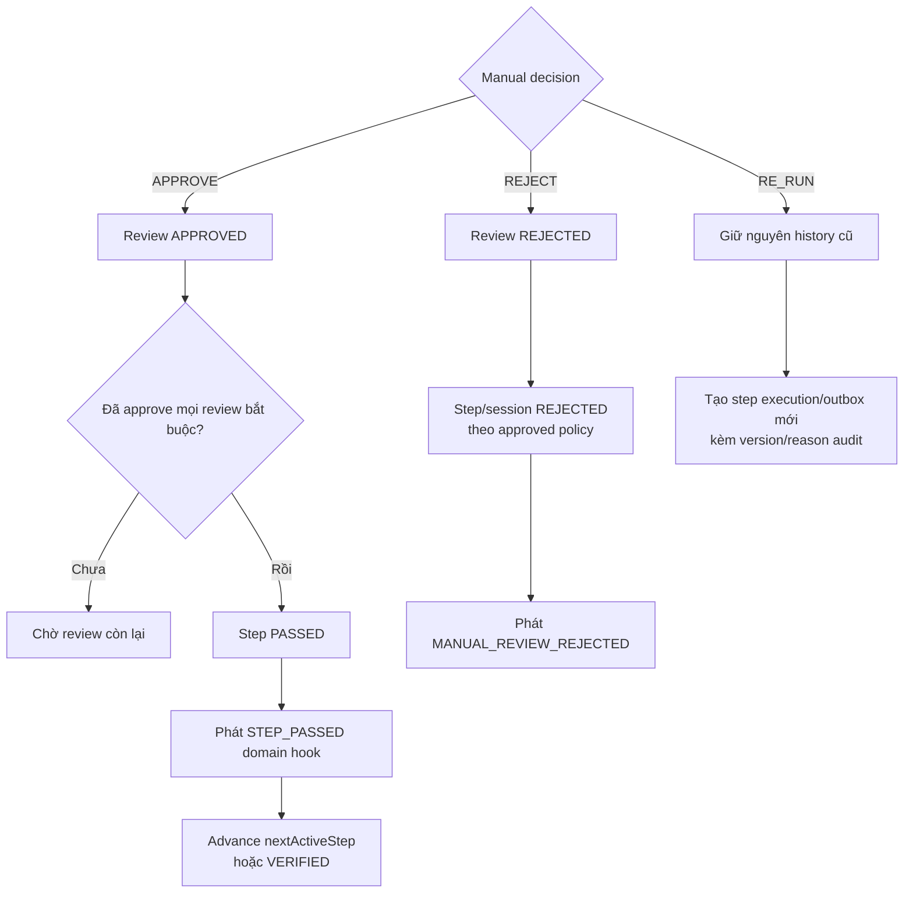

- Platform sử dụng generic `VERIFICATION_REVIEWER` scope. Domain map business role
  bên ngoài Platform; core không hard-code role theo từng domain.
- Resolve review đã terminal trả `IV_MANUAL_ALREADY_REVIEWED`.
- Domain notification cho subject/representative được kích hoạt qua event; Platform
  không chứa template/recipient business-specific.

### 2.6.9. Pipeline data model bổ sung

```sql
CREATE TABLE identity_verification_step (
    step_execution_id          uuid PRIMARY KEY,
    verification_id            uuid NOT NULL REFERENCES identity_verification(verification_id),
    step_code                   varchar(50) NOT NULL,
    sequence_no                 integer NOT NULL,
    execution_no                integer NOT NULL DEFAULT 1,
    execution_mode              varchar(30) NOT NULL,
    status                      varchar(30) NOT NULL,
    pipeline_version            varchar(80) NOT NULL,
    identity_version            bigint NOT NULL,
    term_snapshot               varchar(20) NOT NULL,
    sub_step_mode_snapshot      varchar(40) NOT NULL,
    started_at                  timestamptz,
    completed_at                timestamptz,
    created_at                  timestamptz NOT NULL,
    updated_at                  timestamptz NOT NULL,
    CONSTRAINT uk_iv_step UNIQUE (
      verification_id, sequence_no, identity_version, execution_no
    )
);

CREATE TABLE identity_verification_step_outbox (
    outbox_id                   uuid PRIMARY KEY,
    step_execution_id           uuid NOT NULL REFERENCES identity_verification_step(step_execution_id),
    status                      varchar(30) NOT NULL,
    total_retries               integer NOT NULL DEFAULT 0,
    max_retries_snapshot        integer NOT NULL,
    next_attempt_at             timestamptz NOT NULL,
    locked_at                   timestamptz,
    locked_by                   varchar(100),
    last_error_code             varchar(80),
    created_at                  timestamptz NOT NULL,
    updated_at                  timestamptz NOT NULL
);

CREATE INDEX idx_iv_step_outbox_due
  ON identity_verification_step_outbox(status, next_attempt_at)
  WHERE status = 'PENDING';

CREATE TABLE identity_verification_manual_review (
    review_id                   uuid PRIMARY KEY,
    verification_id             uuid NOT NULL REFERENCES identity_verification(verification_id),
    step_execution_id           uuid NOT NULL REFERENCES identity_verification_step(step_execution_id),
    sub_step_code               varchar(80),
    status                      varchar(30) NOT NULL,
    term_snapshot               varchar(20) NOT NULL,
    reason_codes                jsonb NOT NULL DEFAULT '[]',
    evidence_refs               jsonb NOT NULL DEFAULT '[]',
    required_evidence_types     jsonb NOT NULL DEFAULT '[]',
    evidence_ready_at           timestamptz,
    reviewer_scope              varchar(100),
    resolved_by                 varchar(150),
    resolution_reason           varchar(1000),
    created_at                  timestamptz NOT NULL,
    resolved_at                 timestamptz
);

CREATE TABLE identity_verification_manual_evidence (
    evidence_id                 uuid PRIMARY KEY,
    review_id                   uuid NOT NULL REFERENCES identity_verification_manual_review(review_id),
    verification_id             uuid NOT NULL REFERENCES identity_verification(verification_id),
    step_execution_id           uuid NOT NULL REFERENCES identity_verification_step(step_execution_id),
    sub_step_code               varchar(80) NOT NULL,
    evidence_type               varchar(40) NOT NULL,
    status                      varchar(30) NOT NULL,
    identity_version            bigint NOT NULL,
    object_key_enc              text,
    content_sha256              varchar(64),
    mime_type                   varchar(100),
    size_bytes                  bigint,
    expires_at                  timestamptz NOT NULL,
    uploaded_at                 timestamptz,
    purged_at                   timestamptz,
    created_at                  timestamptz NOT NULL,
    updated_at                  timestamptz NOT NULL,
    CONSTRAINT uk_iv_manual_evidence UNIQUE
      (review_id, sub_step_code, evidence_type, identity_version)
);
```

`object_key_enc` là object key nội bộ đã mã hóa, không phải public/presigned URL.
Binary evidence không lưu trong PostgreSQL. Upload intent/token có TTL ngắn, one-time,
bind với `verificationId + reviewId + subStepCode + evidenceType + identityVersion`.

`iv_configuration` và pipeline definition được lưu trong PostgreSQL dưới dạng
append-only versioned records có effective dates và audit. Không cho sửa in-place
version đang được session tham chiếu; thay đổi tạo version mới.

---

# **3. Feature List**

## 3.1. OCR & eKYC Platform

| **STT** | **Nhóm chức năng** | **Mô tả** |
| --- | --- | --- |
| 1 | **Consumer Registry** | Đăng ký tenant/domain/use case, owner, allowed journey, field scope, quota, event consumer và policy version. Domain chưa đăng ký không được tạo session. |
| 2 | **Policy Resolution** | Resolve journey, document type, channel capability, NFC/liveness requirement, timeout, retry và decision policy theo environment. |
| 3 | **Consent Guard** | Kiểm tra consent đúng subject, purpose, version, channel và thời hạn trước khi tạo phiên. |
| 4 | **Khởi tạo phiên** | Tạo `verificationId`, external session, active-session guard, expiry và SDK bootstrap. Hỗ trợ `Idempotency-Key`. |
| 5 | **Capability Preflight** | Kiểm tra camera, NFC, browser/OS/SDK support trước khi start; trả handoff requirement khi channel thiếu capability bắt buộc. |
| 6 | **Mobile SDK Integration** | Hỗ trợ native/hybrid Mobile, permission, app lifecycle, deep link, resume và device security signal. |
| 7 | **Web SDK Integration** | Hỗ trợ Mobile Web/Desktop Web, camera/webcam permission, browser lifecycle, tab refresh/close và compatibility policy. |
| 8 | **Cross-channel Handoff** | Tạo one-time handoff token/QR/deep link từ Web sang Mobile khi journey cần capability Mobile-only; giữ correlation/audit. |
| 9 | **OCR giấy tờ** | Thu nhận mặt trước/sau, trích xuất field, confidence, document quality và warning; chuẩn hóa trước khi trả domain. |
| 10 | **Đọc NFC** | Thực hiện khi journey/document/channel hỗ trợ; không silent skip nếu policy bắt buộc. |
| 11 | **Liveness** | Thực hiện liveness theo policy; FULL_EKYC không được tắt liveness ở production nếu chưa có risk acceptance. |
| 12 | **Face Matching** | Chuẩn hóa match result/score/reason; không dùng score đơn lẻ khi threshold chưa được duyệt. |
| 13 | **Document Risk/Quality** | Chuẩn hóa warning chất lượng/gian lận thành canonical reason/risk category. |
| 14 | **Callback Reception** | Endpoint server-to-server, auth, timestamp/replay guard, schema/body limit, durable inbox và idempotency. |
| 15 | **Reconciliation/Get Result Fallback** | Reconciliation Job chỉ lấy official result khi callback quá SLA hoặc session treo; bounded batch, backoff, circuit breaker. |
| 16 | **Result Normalization** | Chuyển payload SDK Backend thành Canonical Result, tolerant với optional/new fields và nghiêm ngặt với critical fields. |
| 17 | **Decision Mapping** | Ánh xạ canonical checks thành `VERIFIED/REJECTED/NEED_RETRY/MANUAL_REVIEW/PROVIDER_ERROR`; lưu policy version. |
| 18 | **Result Projection** | Domain query field theo approved scope; mask/unmask theo role và audit. |
| 19 | **Domain Event** | Publish completion/status event qua transactional outbox; event không chứa raw PII. |
| 20 | **Retry Chain** | Tạo attempt mới với external session mới; giữ liên kết phiên trước, reason và attempt count. |
| 21 | **Expiry Management** | Expire session/run theo policy; xử lý late callback và grace reconciliation có audit. |
| 22 | **Manual Exception** | Quyết định vận hành riêng, maker-checker, reason/evidence bắt buộc; không sửa provider result gốc. |
| 23 | **Audit & Traceability** | State history, result source, policy/config version, actor, access/unmask và domain event. |
| 24 | **Operations** | Search theo internal reference, reprocess inbox/DLQ/outbox, disable create khi incident; không expose raw media. |
| 25 | **Monitoring & Cost Control** | Funnel, latency, error taxonomy, callback/reconcile backlog, quota, attempt và estimated cost. |
| 26 | **Configuration Governance** | Version flow/security/retention/threshold/compatibility; change ticket, approval, evidence và rollback. |
| 27 | **Pipeline Orchestration** | Resolve first/next active step theo versioned config; skip/advance/complete deterministic. |
| 28 | **Async Step Outbox** | Enqueue cùng transaction; dispatch after commit; scheduler sweep; worker lock/version guard. |
| 29 | **Sub-step Processing** | Hỗ trợ combined hoặc sequential fail-fast; lưu kết quả từng document/pose; whole-step rerun baseline. |
| 30 | **Manual Review Fan-out** | Tạo 1..N review theo `ANY/STRICT`, assignment scope và evidence refs. |
| 31 | **Manual Review Resolution** | Approve tiếp tục pipeline; reject kết thúc; re-run tạo execution mới; mọi action audit. |
| 32 | **Domain Hook/Notification Event** | Phát event step pass/fail/review/final để domain lock identity hoặc gửi notification, không hard-code recipient/template. |
| 33 | **Manual Evidence Completion** | Khi Mobile SDK/provider fail-fast trước khi thu đủ front/back, trả danh sách evidence còn thiếu; Mobile thu/upload bảo mật để hoàn thiện bộ manual review mà không gọi lại automatic OCR. |

## 3.2. Business Rules tổng quát

| **Rule ID** | **Quy tắc** |
| --- | --- |
| BR-001 | Một `(tenant, domain, businessRef, subjectRef, purpose, journey)` chỉ có tối đa một session active. |
| BR-002 | `verificationId` do VHM sinh, unique, không chứa PII và không tái sử dụng. |
| BR-003 | External session ID không được dùng làm public/internal primary key. |
| BR-004 | Kết quả client/SDK callback phía UI không được chuyển trực tiếp thành `VERIFIED`. |
| BR-005 | Chỉ official result server-to-server đã xác thực mới được hoàn tất session. |
| BR-006 | `OCR_ONLY` luôn có `ekycOutcome=NOT_PERFORMED`, không phải `VERIFIED`. |
| BR-007 | OCR pass và eKYC pass là hai kết quả độc lập. |
| BR-008 | Callback trùng không được cập nhật state, tạo event hoặc side effect lặp. |
| BR-009 | Timeout/network/SDK Backend unavailable là `PROVIDER_ERROR`, không phải `REJECTED`. |
| BR-010 | Lỗi ảnh, permission hoặc thao tác recoverable có thể chuyển `NEED_RETRY`. |
| BR-011 | Hard fraud/reject chỉ áp dụng khi policy được PO/Risk/ANBM phê duyệt. |
| BR-012 | Provider/SDK `NEED_REVIEW` luôn chuyển `MANUAL_REVIEW`; manual-review capability là dependency bắt buộc của hệ thống. |
| BR-013 | Domain chỉ nhận normalized fields thuộc approved field scope. |
| BR-014 | Auto-fill chỉ ghi field trống; overwrite field đã xác nhận cần explicit confirmation/rule. |
| BR-015 | Retry tạo session/provider transaction mới và không ghi đè lịch sử attempt trước. |
| BR-016 | Terminal state không chuyển ngược qua API thông thường. Correction dùng workflow riêng. |
| BR-017 | Không persist/log resource URL, raw callback, automatic-flow image/video hoặc token. Manual evidence chỉ lưu theo BR-041/BR-042. |
| BR-018 | Client không được gọi external Get Result. Reconciliation Job của Platform là thành phần duy nhất được phép thực hiện thao tác này. |
| BR-019 | Mọi threshold/decision/config thay đổi phải version hóa và có change ticket. |
| BR-020 | Nếu channel thiếu capability bắt buộc, không silent downgrade journey. |
| BR-021 | Web → Mobile handoff token one-time, TTL ngắn, bind session/subject và không chứa PII. |
| BR-022 | Multi-tab Web không được tạo nhiều SDK run cho cùng session; run lease/nonce phải được kiểm soát. |
| BR-023 | Refresh/close tab không tự cancel phiên; trạng thái được reconcile theo SDK/session policy. |
| BR-024 | Device/browser capability do client khai báo là untrusted hint; backend đối chiếu compatibility policy. |
| BR-025 | Domain không được dùng eKYC result cho purpose khác purpose đã consent. |
| BR-026 | Pipeline config/version, max retry, term và sub-step mode được snapshot khi session/step enqueue. |
| BR-027 | Step đã superseded bởi `identityVersion` mới phải `SKIPPED`, không apply result cũ. |
| BR-028 | Executor after-commit chỉ là fast path; scheduler phải nhặt được mọi outbox `PENDING` đến hạn. |
| BR-029 | Chỉ lỗi kỹ thuật/transient retry tự động; validation fail/mismatch không retry kỹ thuật. |
| BR-030 | `SEQUENTIAL_FAIL_FAST` dừng ở sub-step fail đầu tiên; rerun baseline là whole-step. |
| BR-031 | Term `ANY` review failed + remaining sub-steps; `STRICT` review toàn bộ sub-steps. |
| BR-032 | Manual approve chỉ advance khi mọi review bắt buộc của step đã được approve. |
| BR-033 | Manual reject kết thúc theo policy; review terminal không resolve lần hai. |
| BR-034 | Provider/capability route-to-manual không được coi là genuine failure và không phát notification “failed”. |
| BR-035 | Identity lock và business notification là Domain hook, không phải side effect trực tiếp trong Platform transaction. |
| BR-036 | `INTERACTIVE_SDK` nhận official result từ callback. Get Result chỉ do Reconciliation Job gọi khi callback quá SLA hoặc session treo; không đồng thời enqueue provider call `SERVER_ASYNC` cho cùng step execution. |
| BR-037 | `SEQUENTIAL_FAIL_FAST` tại front được phép kết thúc automatic flow nhưng không được đóng manual review khi back evidence còn thiếu. |
| BR-038 | Mobile phải hỗ trợ `CAPTURE_MANUAL_EVIDENCE` cho sub-step chưa chạy bằng VHM Secure Evidence Capture. |
| BR-039 | Manual evidence completion không gọi lại OCR/provider, không sửa official result và không được tính là automatic retry/attempt mới. |
| BR-040 | Review thiếu evidence bắt buộc ở trạng thái `EVIDENCE_REQUIRED`; chỉ chuyển `PENDING` và bắt đầu reviewer SLA sau khi evidence hợp lệ đã `AVAILABLE`. |
| BR-041 | Manual evidence upload phải one-time, TTL ngắn, bind subject/session/review/sub-step/identityVersion; không lưu hoặc log presigned URL. |
| BR-042 | Evidence hết TTL, sai loại, sai checksum hoặc thuộc identityVersion cũ không được đưa vào review; Platform yêu cầu capture lại hoặc whole-step retry theo policy. |
| BR-043 | Trang kết quả của SDK phải được cấu hình `OFF` trên SDK Configuration Portal cho mọi profile Mobile/Web production. |
| BR-044 | Khi SDK phát completion/close event, VHM Application chỉ gửi `submitted` và hiển thị trạng thái trung tính “Đang xử lý kết quả”; không hiển thị SDK result như quyết định cuối cùng. |
| BR-045 | VHM Application chỉ hiển thị outcome/next action lấy từ Identity Verification Platform sau khi official result đã được xử lý. |

## 3.3. Ma trận trạng thái và hành động

| **Status** | Get status | Start SDK | Client submit | Retry | Domain result | Reconcile |
| --- | --- | --- | --- | --- | --- | --- |
| INITIATED | ✔️ | ✔️ | ❌ | ❌ | ❌ | ❌ |
| SDK_STARTED | ✔️ | Idempotent/same run | ✔️ | ❌ | ❌ | Gần timeout theo policy |
| SUBMITTED | ✔️ | ❌ | Idempotent | ❌ | ❌ | ✔️ sau initial delay |
| PROCESSING | ✔️ | ❌ | Ignore/late audit | ❌ | ❌ | ✔️ |
| VERIFIED | ✔️ | ❌ | Ignore | ❌ | Đã publish một lần | ❌ |
| REJECTED | ✔️ | ❌ | Ignore | Theo policy | Đã publish một lần | ❌ |
| NEED_RETRY | ✔️ | ❌ | Ignore | ✔️ nếu còn attempt/quota | Interim/final theo domain | ❌ |
| MANUAL_REVIEW | ✔️ | ❌ | Ignore | Theo reviewer | Review event | ❌ |
| PROVIDER_ERROR | ✔️ | ❌ | Ignore | Sau reconcile budget | ❌ | ✔️ |
| CANCELLED | ✔️ | ❌ | Ignore | ✔️ | ❌ | Grace check nếu provider đã final |
| SDK_ERROR | ✔️ | ❌ | Ignore | ✔️ | ❌ | ❌ |
| EXPIRED | ✔️ | ❌ | Ignore | ✔️ | ❌ | Grace reconcile theo policy |
| SKIPPED | ✔️ | ❌ | Ignore | Theo domain/config correction | Skip event, không phải identity verified | ❌ |

## 3.4. Channel Rules

| **Rule ID** | **Mobile** | **Web** |
| --- | --- | --- |
| CH-01 Permission | Camera/NFC permission qua OS/native SDK | Camera permission qua browser; NFC không hỗ trợ trên Web |
| CH-02 Lifecycle | Background/foreground, force-close, deep link | Refresh, close tab, multi-tab, browser storage |
| CH-03 Token storage | Chỉ giữ bootstrap token trong memory; secure storage chỉ dùng cho opaque resume handle có TTL | Chỉ giữ bootstrap token trong memory; không lưu token trong localStorage/sessionStorage |
| CH-04 Capability | Device model/OS/SDK matrix | Browser/version/camera/Web SDK matrix |
| CH-05 Handoff | Nhận one-time deep link/QR | Phát QR/deep link khi cần Mobile capability |
| CH-06 Upload | Live capture bắt buộc cho verification journey; không chọn ảnh có sẵn | Webcam/live capture bắt buộc; file upload chỉ áp dụng OCR_ONLY use case được policy cho phép |
| CH-07 Anti-tamper | Root/jailbreak/debugger/emulator signal | CSP, SRI khi phù hợp, anti-XSS, browser support policy |
| CH-08 Fail-fast evidence | Sau front fail, VHM Secure Evidence Capture thu bổ sung back và giữ correlation với cùng review | Web không thu manual evidence; bắt buộc handoff sang Mobile |

---

# **4. Integration Architecture**

## 4.1. Danh sách Interfaces

> Endpoint dưới đây là **contract nội bộ bắt buộc của VHM**. Chi tiết
> API/auth/callback bên ngoài được cô lập trong Provider Adapter theo integration pack.

| **STT** | **Miêu tả** | **Endpoint/Topic** | **From** | **To** | **Mode** | **Data chính** |
| --- | --- | --- | --- | --- | --- | --- |
| 1 | Tạo session | `POST /internal/v1/identity-verifications` | BFF/Domain | Verification API | REST Sync | Domain context, journey, channel, consent, capability |
| 2 | Lấy chi tiết/status | `GET /internal/v1/identity-verifications/{verificationId}` | BFF/Domain | Verification API | REST Sync | Status, decision, retry, masked summary |
| 3 | Lấy active session | `GET /internal/v1/identity-verifications/active?...` | BFF | Verification API | REST Sync | Existing active session |
| 4 | Ghi SDK started | `POST /internal/v1/identity-verifications/{id}/started` | BFF | Verification API | REST Sync | runId, channel, platform/browser, versions |
| 5 | Ghi client submitted | `POST /internal/v1/identity-verifications/{id}/submitted` | BFF | Verification API | REST Sync | runId, untrusted completion code |
| 6 | Ghi client cancel | `POST /internal/v1/identity-verifications/{id}/cancelled` | BFF | Verification API | REST Sync | reason |
| 7 | Ghi SDK/client error | `POST /internal/v1/identity-verifications/{id}/sdk-error` | BFF | Verification API | REST Sync | canonical error + masked SDK code |
| 8 | Tạo retry | `POST /internal/v1/identity-verifications/{id}/retry` | BFF/Ops | Verification API | REST Sync | retry reason, channel/capability |
| 9 | Tạo handoff | `POST /internal/v1/identity-verifications/{id}/handoffs` | Web BFF | Verification API | REST Sync | targetChannel=MOBILE_APP |
| 10 | Claim handoff | `POST /internal/v1/identity-verifications/handoffs/{token}/claim` | Mobile BFF | Verification API | REST Sync | One-time token + authenticated subject |
| 11 | Callback SDK Backend | `POST /integration/v1/ekyc/callback` | SDK Backend | Callback API | REST Async | Authenticated official result/event |
| 12 | Lấy result chủ động | Provider-specific, internal adapter only | Reconciliation | SDK Backend | REST Sync | External session ID |
| 13 | Lấy normalized result | `GET /internal/v1/identity-verifications/{id}/result` | Authorized Domain | Projection API | REST Sync | Field projection theo scope |
| 14 | Lấy history | `GET /internal/v1/identity-verifications/{id}/history` | Ops/Audit | Verification API | REST Sync | State/access history theo quyền |
| 15 | Manual decision | `POST /internal/v1/identity-verifications/{id}/manual-decisions` | Reviewer/Ops | Verification API | REST Sync | decision, reason, evidenceRef |
| 16 | Completion event | `identity.verification.completed.v1` | Outbox Publisher | Domain Kafka | Async | Routing/outcome, không raw PII |
| 17 | Status event | `identity.verification.status-changed.v1` | Outbox Publisher | Domain Kafka | Async | State transition metadata |
| 18 | Danh sách manual review | `GET /internal/v1/identity-verification-reviews` | Reviewer UI/BFF | Manual Review API | REST Sync | status, domain, assignee, page; org/data scope |
| 19 | Chi tiết manual review | `GET /internal/v1/identity-verification-reviews/{reviewId}` | Reviewer UI/BFF | Manual Review API | REST Sync | Masked evidence/checks/history |
| 20 | Resolve manual review | `PUT /internal/v1/identity-verification-reviews/{reviewId}` | Reviewer UI/BFF | Manual Review API | REST Sync | action APPROVE/REJECT/RE_RUN + reason |
| 21 | Step/domain hook event | `identity.verification.step-events.v1` | Pipeline Outbox | Domain Kafka | Async | STEP_PASSED/FAILED/REVIEW_REQUIRED/RESOLVED |
| 22 | Tạo manual evidence upload intent | `POST /internal/v1/identity-verifications/{id}/manual-evidence/uploads` | Mobile BFF | Verification API | REST Sync | reviewId, subStepCode, evidenceType, checksum/size metadata |
| 23 | Hoàn tất manual evidence | `POST /internal/v1/identity-verifications/{id}/manual-evidence/{evidenceId}/complete` | Mobile BFF | Verification API | REST Sync | upload receipt, checksum; chuyển review EVIDENCE_REQUIRED → PENDING khi đủ evidence |

## 4.2. Internal API Contract

### 4.2.1. Tạo phiên xác thực

```http
POST /internal/v1/identity-verifications
Authorization: Bearer <user-or-service-token>
Idempotency-Key: 6a2ac410-8f08-4c86-bfb6-8f142169483c
X-Correlation-Id: 38de4a70-513a-4f61-80ff-3ea914137f65
Content-Type: application/json
```

```json
{
  "domain": "DOMAIN_CODE",
  "useCase": "SALE_ONBOARDING",
  "businessRef": "registration-20260806-000001",
  "subjectRef": "applicant-01",
  "purpose": "IDENTITY_VERIFICATION",
  "requestedJourney": "FULL_EKYC",
  "documentType": "NATIONAL_ID_CHIP",
  "channel": "DESKTOP_WEB",
  "client": {
    "platform": "WEB",
    "appVersion": "2026.08.06",
    "browser": "CHROME",
    "browserVersion": "<browser-version>"
  },
  "capabilities": {
    "camera": true,
    "nfc": false,
    "liveness": true
  },
  "consentReferenceId": "consent-20260806-000001"
}
```

Validation:

- Domain/use case tồn tại trong Consumer Registry.
- Business/subject reference tồn tại và caller được quyền.
- Consent đúng subject/purpose/version và chưa bị rút.
- Journey/document/channel nằm trong allowlist.
- Capability phù hợp compatibility policy.
- Không có active session khác hoặc trả session cùng idempotency.
- Không vượt rate/attempt/cost quota.

Response khi channel đáp ứng journey:

```json
{
  "verificationId": "f47ed948-600b-4cbb-8f72-1306ccae1cf1",
  "status": "INITIATED",
  "resolvedJourney": "FULL_EKYC",
  "resolvedFlow": "DOCUMENT_LIVENESS",
  "channel": "DESKTOP_WEB",
  "expiresAt": "2026-08-06T11:15:00+07:00",
  "sdkBootstrap": {
    "token": "opaque-short-lived-token",
    "tokenExpiresAt": "2026-08-06T10:55:00+07:00",
    "configurationRef": "web-full-ekyc-v3"
  }
}
```

`configurationRef` là opaque reference tới profile đã publish trên SDK Configuration
Portal. Profile production bắt buộc tắt trang kết quả SDK. VHM không truyền UI
toggle trong runtime bootstrap khi field đó chưa thuộc SDK contract được phê duyệt.

Response `422` khi capability bắt buộc thiếu nhưng cho phép handoff:

```json
{
  "code": "IV_CHANNEL_CAPABILITY_REQUIRED",
  "message": "Journey yêu cầu capability không khả dụng trên channel hiện tại",
  "requiredCapabilities": ["NFC"],
  "availableActions": ["HANDOFF_TO_MOBILE"]
}
```

Không trả xuống client:

- API key, app secret hoặc pre-shared key.
- Callback credential/private key.
- Internal fraud threshold/rule detail.
- Provider raw configuration không cần cho SDK bootstrap.

### 4.2.2. SDK started

```http
POST /internal/v1/identity-verifications/{verificationId}/started
```

```json
{
  "runId": "44a59fd2-c4ee-4b10-996a-68b880ce1ea8",
  "channel": "MOBILE_APP",
  "platform": "ANDROID",
  "sdkVersion": "<sdk-version>",
  "osOrBrowserVersion": "15",
  "appVersion": "1.20.0"
}
```

- `runId` ngăn multi-tab/multi-instance cùng start session.
- Start idempotent với cùng `runId`.
- Run khác khi lease còn active trả `409 IV_SDK_RUN_ACTIVE`.
- Session expire trả `409 IV_SESSION_EXPIRED`.

### 4.2.3. Client submitted

```http
POST /internal/v1/identity-verifications/{verificationId}/submitted
```

```json
{
  "runId": "44a59fd2-c4ee-4b10-996a-68b880ce1ea8",
  "sdkCompletionStatus": "COMPLETED",
  "sdkCompletionCode": "OPTIONAL_UNTRUSTED_CODE"
}
```

- Chuyển `SDK_STARTED → SUBMITTED` nếu chưa terminal.
- Không nhận/lưu OCR fields từ client.
- Không đánh dấu `VERIFIED`.
- Sau completion/close event, Mobile/Web hiển thị “Đang xử lý kết quả” và query
  trạng thái từ Identity Verification Platform; không hiển thị result page của SDK.
- Chỉ render outcome/next action do API VHM trả về sau khi official result được xử lý.
- Nếu callback đã final trước đó, giữ terminal state và audit late client event.

### 4.2.4. Lấy trạng thái

```http
GET /internal/v1/identity-verifications/{verificationId}
```

```json
{
  "verificationId": "f47ed948-600b-4cbb-8f72-1306ccae1cf1",
  "domain": "DOMAIN_CODE",
  "businessRef": "registration-20260806-000001",
  "subjectRef": "applicant-01",
  "journey": "FULL_EKYC",
  "status": "NEED_RETRY",
  "decision": "RETRY",
  "reasonCodes": ["DOCUMENT_IMAGE_BLURRED"],
  "retryAllowed": true,
  "remainingAttempts": 2,
  "completedAt": "2026-08-06T10:51:34+07:00"
}
```

Không trả raw SDK message, resource URL, full document number hoặc internal threshold.

Khi automatic OCR fail-fast và manual review còn thiếu evidence, status API trên
`MOBILE_APP` trả user action tường minh thay vì `retryAllowed=true` chung chung.

Mobile response:

```json
{
  "verificationId": "f47ed948-600b-4cbb-8f72-1306ccae1cf1",
  "status": "MANUAL_REVIEW",
  "nextAction": "CAPTURE_MANUAL_EVIDENCE",
  "manualEvidenceRequirements": [
    {
      "reviewId": "13de574f-532e-40ea-a24e-bc193db36154",
      "subStepCode": "DOCUMENT_BACK",
      "evidenceType": "DOCUMENT_BACK_IMAGE",
      "captureMode": "LIVE_CAPTURE",
      "expiresAt": "2026-08-06T12:30:00+07:00"
    }
  ]
}
```

Web response không trả upload requirement trực tiếp:

```json
{
  "verificationId": "f47ed948-600b-4cbb-8f72-1306ccae1cf1",
  "status": "MANUAL_REVIEW",
  "nextAction": "HANDOFF_TO_MOBILE",
  "requiredCapabilities": ["MANUAL_EVIDENCE_CAPTURE"]
}
```

Response không chứa object key/presigned URL. Mobile chỉ xin upload intent khi user
bắt đầu capture để giảm thời gian token tồn tại.

### 4.2.5. Web → Mobile handoff

Create handoff:

```http
POST /internal/v1/identity-verifications/{verificationId}/handoffs
```

```json
{
  "targetChannel": "MOBILE_APP",
  "reason": "NFC_REQUIRED"
}
```

```json
{
  "handoffToken": "opaque-one-time-token",
  "handoffUrl": "https://approved-vhm-domain.example/verify/handoff/<opaque>",
  "qrPayload": "same-approved-url",
  "expiresAt": "2026-08-06T10:58:00+07:00"
}
```

Claim trên Mobile:

```http
POST /internal/v1/identity-verifications/handoffs/{handoffToken}/claim
Authorization: Bearer <same-subject-authenticated-token>
```

Rules:

- Token one-time, TTL 5 phút, lưu hash chứ không lưu plaintext.
- Bind `verificationId + tenant + subjectRef + targetChannel`.
- Claim yêu cầu authenticated subject/domain context khớp.
- Handoff URL chỉ dùng domain/app link allowlist; không chứa PII.
- Claim thành công invalidate token và trả Mobile SDK bootstrap mới.

### 4.2.6. Error contract

| **HTTP** | **Canonical Code** | **Ý nghĩa** | **Retry** |
| --- | --- | --- | --- |
| 400 | `IV_INVALID_REQUEST` | Sai schema/enum/range | Không, sửa request |
| 401 | `IV_UNAUTHENTICATED` | Token không hợp lệ | Re-authenticate |
| 403 | `IV_ACCESS_DENIED` | Không có quyền business object/domain | Không |
| 403 | `IV_FIELD_SCOPE_DENIED` | Consumer không được đọc field | Không |
| 404 | `IV_REFERENCE_NOT_FOUND` | Business/session không tồn tại trong scope | Không |
| 409 | `IV_ACTIVE_SESSION_EXISTS` | Đã có active session | Dùng existing session |
| 409 | `IV_IDEMPOTENCY_CONFLICT` | Cùng key nhưng request khác | Không |
| 409 | `IV_SDK_RUN_ACTIVE` | Run/tab/device khác đang giữ lease | Chờ/resolve theo UX |
| 409 | `IV_SESSION_EXPIRED` | Session hết hạn | Tạo session mới |
| 410 | `IV_HANDOFF_EXPIRED` | Handoff token hết hạn/đã dùng | Tạo token mới |
| 422 | `IV_CONSENT_REQUIRED` | Consent thiếu/sai purpose | Ghi consent mới |
| 422 | `IV_CHANNEL_CAPABILITY_REQUIRED` | Channel thiếu capability bắt buộc | Handoff/đổi channel |
| 422 | `IV_UNSUPPORTED_CLIENT` | OS/browser/SDK không tương thích | Upgrade/đổi thiết bị |
| 429 | `IV_RATE_LIMITED` | Vượt attempt/quota | Theo `retryAfter` |
| 502 | `IV_PROVIDER_BAD_RESPONSE` | Official result sai contract | Internal retry/quarantine |
| 503 | `IV_PROVIDER_UNAVAILABLE` | Circuit open/dependency lỗi | Thử lại sau |
| 504 | `IV_PROVIDER_TIMEOUT` | Dependency timeout | Reconciliation/backoff |

### 4.2.7. Manual Review Contract

List:

```http
GET /internal/v1/identity-verification-reviews?status=PENDING&domain=DOMAIN_CODE&page=0&size=20
Authorization: Bearer <reviewer-token>
```

- Reviewer scope lấy từ principal/assignment, không tin org/domain filter để authorize.
- Role không có `VERIFICATION_REVIEWER` trả `403 IV_REVIEW_ACCESS_DENIED`.
- Response mặc định mask PII/evidence; unmask theo permission + reason + audit.

Resolve:

```http
PUT /internal/v1/identity-verification-reviews/{reviewId}
Idempotency-Key: <uuid>
Content-Type: application/json
```

```json
{
  "action": "APPROVE",
  "reason": "Đã đối chiếu giấy tờ và dữ liệu hợp lệ"
}
```

Rules:

- `reason` bắt buộc cho mọi action `APPROVE/REJECT/RE_RUN`.
- Lock review/step trong transaction ngắn; review không còn `PENDING` trả
  `409 IV_MANUAL_ALREADY_REVIEWED`.
- Approve một review chưa chắc advance step nếu vẫn còn review bắt buộc khác.
- Reject phát event domain và kết thúc step/session theo policy snapshot.
- `RE_RUN` tạo step execution/outbox mới, yêu cầu maker-checker permission và không
  sửa history cũ.
- Reviewer không được sửa official provider result hoặc normalized field gốc.

### 4.2.8. Manual Evidence Completion Contract

Luồng này chỉ dùng khi manual review yêu cầu sub-step mà automatic SDK flow chưa thu
được evidence do `SEQUENTIAL_FAIL_FAST`.

Tạo upload intent sau khi Mobile đã capture và có metadata file:

```http
POST /internal/v1/identity-verifications/{verificationId}/manual-evidence/uploads
Idempotency-Key: <uuid>
Authorization: Bearer <user-token>
Content-Type: application/json
```

```json
{
  "reviewId": "13de574f-532e-40ea-a24e-bc193db36154",
  "subStepCode": "DOCUMENT_BACK",
  "evidenceType": "DOCUMENT_BACK_IMAGE",
  "contentType": "image/jpeg",
  "sizeBytes": 1245821,
  "contentSha256": "<hex-sha256>",
  "runId": "44a59fd2-c4ee-4b10-996a-68b880ce1ea8"
}
```

Response trả `evidenceId`, one-time upload instruction và `expiresAt`. Upload target
chỉ được dùng qua TLS, đúng `contentType/size/checksum`; client không log URL/token.

Hoàn tất sau khi binary đã upload thành công:

```http
POST /internal/v1/identity-verifications/{verificationId}/manual-evidence/{evidenceId}/complete
Idempotency-Key: <uuid>
```

Platform kiểm tra object tồn tại, checksum/size/type, malware/content validation tối
thiểu, subject ownership, review/sub-step và `identityVersion`. Khi đủ evidence:

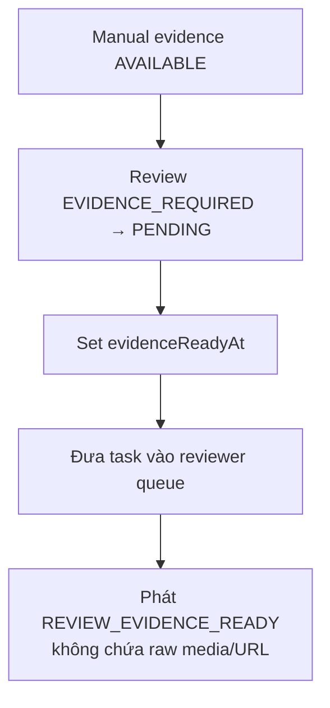

Không cho phép:

- Upload `DOCUMENT_FRONT_IMAGE` vào requirement `DOCUMENT_BACK_IMAGE`.
- Complete evidence của review đã terminal hoặc identity version đã superseded.
- Mobile gửi base64/binary qua JSON API hoặc lưu presigned URL để resume dài hạn.
- Dùng completion endpoint để thay official provider result hoặc tự đánh dấu review pass.

Lỗi bổ sung:

| **HTTP** | **Code** | **Ý nghĩa** | **Client action** |
| --- | --- | --- | --- |
| 409 | `IV_EVIDENCE_ALREADY_COMPLETED` | Evidence đã complete idempotently | Refresh status |
| 409 | `IV_EVIDENCE_VERSION_CONFLICT` | Identity/version đã đổi | Refresh hoặc whole-step retry |
| 410 | `IV_EVIDENCE_UPLOAD_EXPIRED` | Upload intent hết TTL | Xin intent mới và capture/upload lại theo policy |
| 422 | `IV_EVIDENCE_TYPE_MISMATCH` | Sai sub-step/type/content | Không retry cùng payload |
| 422 | `IV_EVIDENCE_INTEGRITY_FAILED` | Sai checksum/size/content validation | Capture/upload lại |

## 4.3. Callback SDK Backend

### 4.3.1. Endpoint

```http
POST /integration/v1/ekyc/callback
Authorization: <provider-specific-auth>
Content-Type: application/json
```

Baseline:

| **Hạng mục** | **Yêu cầu** |
| --- | --- |
| Authentication | JWS/JWT bất đối xứng bắt buộc; mTLS bổ sung khi provider hỗ trợ; không dùng fixed token nếu chưa có ANBM exception |
| Replay | Timestamp + nonce/event ID + replay window |
| Payload | Body/depth/content-type limit; schema validation |
| Ack | Durable inbox rồi trả 2xx <= 2 giây |
| Retry | Provider retry contract phải được load/capacity test |
| Processing | Async inbox; lỗi mapping nội bộ không buộc provider retry vô hạn |
| Rotation | Key/token rotation có overlap và runbook |

### 4.3.2. Processing pipeline

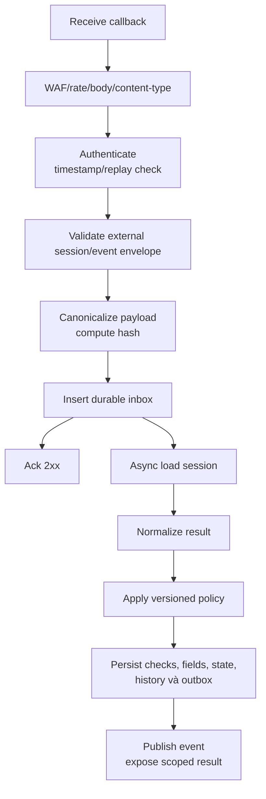

### 4.3.3. Idempotency key

Thứ tự idempotency bắt buộc:

1. `provider + providerEventId`.
2. `provider + providerSessionId + resultVersion`.
3. `provider + providerSessionId + SHA-256(canonicalized payload)`.

Không chỉ dùng external session ID vì provider có thể gửi processing/final/correction
khác nhau cho cùng session.

### 4.3.4. Callback response

- `200 OK`: đã nhận durable hoặc duplicate đã nhận.
- `400`: envelope thiếu critical field.
- `401/403`: authentication/signature thất bại.
- Không trả `409` cho duplicate; duplicate đã durable luôn trả `200`.
- `413`: payload quá lớn.
- `429`: hạn chế dùng vì dễ tạo retry storm.
- `500/503`: chưa durable, provider được phép retry.

Lỗi mapping sau durable receive: trả 200, inbox `FAILED/QUARANTINED`, alert nội bộ.

## 4.4. Provider Adapter API

```java
public interface EkycProviderClient {
    ProviderSession createSession(ProviderSessionRequest request);
    ProviderVerificationResult getResult(String providerSessionId);
    void cancelSession(String providerSessionId);
}
```

Yêu cầu:

- Credential từ Secret Manager, không log header/request secret.
- Base URL theo environment, không hard-code.
- Connect/read timeout cấu hình riêng.
- Retry chỉ network/5xx/429 phù hợp và phải idempotent.
- Không retry 4xx auth/business vô hạn.
- Circuit breaker/bulkhead theo operation.
- External session/result identity phải khớp request/session binding.
- Callback là result ingress chính. Kết quả Get Result từ reconciliation phải đi qua
  cùng normalizer/decision pipeline với kết quả callback.

### 4.4.1. Timeout/Retry Baseline

| **Tham số** | **Giá trị ban đầu** | **Ghi chú** |
| --- | --- | --- |
| Connect timeout | 2 giây | Baseline |
| Read timeout | 10 giây | Tránh giữ thread lâu |
| Synchronous retry | Tối đa 2 | Exponential backoff + jitter |
| Reconcile initial delay | 2 phút | Baseline |
| Reconcile interval | 1 phút | Batch bounded |
| Max reconcile attempts | 5 | Sau đó operation/NEED_RETRY theo policy |
| Circuit open threshold | 50% failure, minimum 10 calls | Có thể tune bằng versioned config sau load test |

## 4.5. Canonical Result Contract

```json
{
  "provider": "DEFAULT_EKYC",
  "providerSessionId": "external-session-reference",
  "schemaVersion": "1.0",
  "document": {
    "status": "PASSED",
    "type": "NATIONAL_ID_CHIP",
    "fields": [
      {
        "name": "DOCUMENT_NUMBER",
        "value": "<encrypted-or-transient>",
        "confidence": 0.9866,
        "source": "NFC"
      }
    ],
    "warnings": [
      {
        "code": "DOCUMENT_SIDES_MISMATCH",
        "providerCode": "opaque-provider-code",
        "riskLevel": "MEDIUM"
      }
    ]
  },
  "nfc": {
    "status": "PASSED",
    "dataConsistency": "MATCH"
  },
  "liveness": {
    "status": "PASSED",
    "score": 0.97,
    "signals": []
  },
  "faceMatch": {
    "status": "PASSED",
    "similarity": 0.95
  },
  "providerConclusion": {
    "status": "PASSED",
    "riskLevel": "LOW",
    "ruleHits": []
  }
}
```

### 4.5.1. Normalization rules

| **Input category** | **Canonical field** | **Quy tắc** |
| --- | --- | --- |
| External transaction ID | `providerSessionId` | Bắt buộc và bind đúng internal session |
| Overall/provider code | Provider metadata | Giữ raw code cho audit; domain dùng canonical category |
| OCR fields | `document.fields[]` | Normalize Unicode/whitespace/date; encrypt/transient value |
| Score | `confidence/score/similarity` | Decimal 0..1; invalid/N/A → null + reason |
| Warning/rule hit | `warnings/ruleHits` | Map versioned catalogue; giữ providerCode |
| Boolean string | Canonical enum/status | Parse strict allowlist, không truthy coercion |
| Resource reference | Internal transient model | Không persist/log; chỉ Provider Adapter gọi allowlisted authenticated API, không fetch URL tùy ý |
| Unknown optional field | Ignore + schema metric | Không fail toàn callback |
| Missing critical identity | Quarantine/fail mapping | Không tự đoán session/result |

## 4.6. Decision Mapping

### 4.6.1. Baseline

| **Điều kiện** | **VHM Decision** | **Ghi chú** |
| --- | --- | --- |
| OCR_ONLY: document pass, đủ field bắt buộc | Session `VERIFIED`, decision `OCR_VERIFIED` | Không phải identity verified; `ekycOutcome=NOT_PERFORMED` |
| FULL_EKYC: document + required NFC + liveness + face pass, không hard warning | VERIFIED | PO/Risk duyệt threshold/rules |
| Ảnh mờ/chói/mất góc và còn attempt | NEED_RETRY | Hướng dẫn user-friendly |
| Camera permission/SDK init lỗi | SDK_ERROR | Không phải identity failure |
| Provider timeout/5xx | PROVIDER_ERROR | Reconcile trước user retry |
| Face mismatch | MANUAL_REVIEW | Không auto-reject chỉ từ similarity score |
| Provider conclusion uncertain | MANUAL_REVIEW | Manual-review capability bắt buộc |
| Hard document fraud warning | MANUAL_REVIEW | Reviewer/Risk quyết định; không auto-reject từ raw provider warning |
| Callback không tới trong SLA; reconciliation Get Result có final | Xử lý qua cùng official-result pipeline | `resultSource=RECONCILIATION` |
| Không có result sau reconciliation budget | PROVIDER_ERROR, `userAction=CONTACT_SUPPORT` | Operation xử lý; không reject hoặc bắt user retry mù |

### 4.6.2. Reason Code Catalogue

| **Code** | **Mô tả** | **Retryable** |
| --- | --- | --- |
| `VERIFICATION_PASSED` | Các check bắt buộc đạt | Không áp dụng |
| `OCR_PASSED` | Journey OCR-only đọc đủ dữ liệu | Không áp dụng |
| `DOCUMENT_OCR_FAILED` | Không đọc được giấy tờ | Có |
| `DOCUMENT_QUALITY_FAILED` | Ảnh không đạt chất lượng | Có |
| `DOCUMENT_SIDES_MISMATCH` | Hai mặt không cùng giấy tờ | Có/Review |
| `DOCUMENT_EXPIRED` | Giấy tờ hết hạn | Theo nghiệp vụ |
| `DOCUMENT_FRAUD_SUSPECTED` | Warning gian lận mức policy | Review/Không |
| `NFC_READ_FAILED` | Không đọc được NFC | Có |
| `NFC_REQUIRED` | Journey bắt buộc NFC chưa hoàn tất | Có/đổi channel |
| `LIVENESS_FAILED` | Không đạt liveness | Có giới hạn |
| `FACE_MISMATCH` | Khuôn mặt không khớp | Review/Không |
| `PROVIDER_NEED_REVIEW` | SDK Backend yêu cầu review | Không tự retry |
| `PROVIDER_UNAVAILABLE` | Dependency lỗi kỹ thuật | Có sau |
| `PROVIDER_AUTH_FAILED` | Credential/integration lỗi | Không cho user retry liên tục |
| `SESSION_EXPIRED` | Phiên hết hạn | Có |
| `ATTEMPT_LIMIT_REACHED` | Vượt số lần cho phép | Không self-service |
| `CHANNEL_CAPABILITY_REQUIRED` | Channel thiếu camera/NFC/liveness | Handoff/đổi channel |
| `UNSUPPORTED_CLIENT` | Browser/OS/SDK không tương thích | Upgrade/đổi client |
| `BUSINESS_DATA_MISMATCH` | OCR khác dữ liệu domain theo rule | Review/Retry theo domain |

## 4.7. Event Contract

Topic: `identity_verification_events.v1`, partition key=`verificationId`.

```json
{
  "eventId": "8ca8c998-bcc9-4dc6-acf7-f10fe7bb50fb",
  "eventType": "IDENTITY_VERIFICATION_COMPLETED",
  "schemaVersion": "1.0",
  "occurredAt": "2026-08-06T10:52:10+07:00",
  "tenantId": "vhm",
  "domain": "DOMAIN_CODE",
  "useCase": "SALE_ONBOARDING",
  "verificationId": "f47ed948-600b-4cbb-8f72-1306ccae1cf1",
  "businessRef": "registration-20260806-000001",
  "subjectRef": "applicant-01",
  "journey": "FULL_EKYC",
  "channel": "MOBILE_APP",
  "decision": "VERIFIED",
  "ocrOutcome": "PASSED",
  "ekycOutcome": "VERIFIED",
  "reasonCodes": [],
  "policyVersion": "co-broker-ekyc-1.0"
}
```

Không đưa vào event:

- Ảnh/video/NFC raw.
- Resource URL.
- Họ tên, CCCD, ngày sinh, địa chỉ.
- Raw provider payload/code/message không cần routing.
- SDK/provider credential hoặc bootstrap token.

Domain cần field gọi Result Projection API và consumer phải idempotent theo `eventId`.

---

# **5. Data Flow**

## **5.1. Data Flow Diagram tổng quát**

### 5.1.1. Control-plane VHM

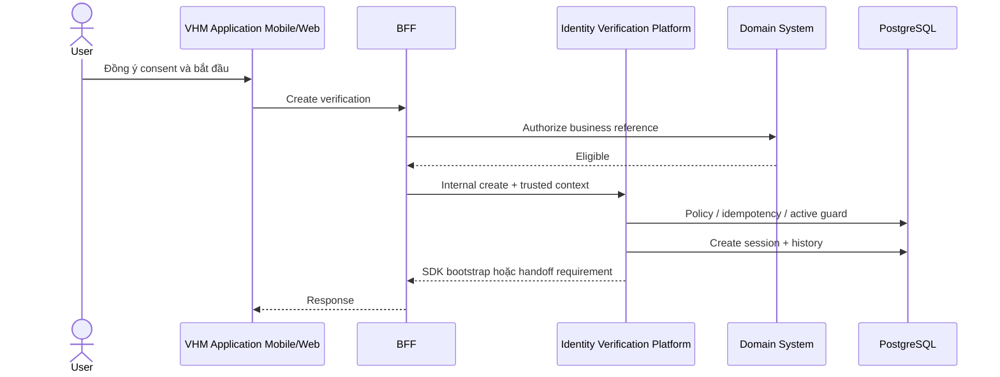

### 5.1.2. Data-plane SDK

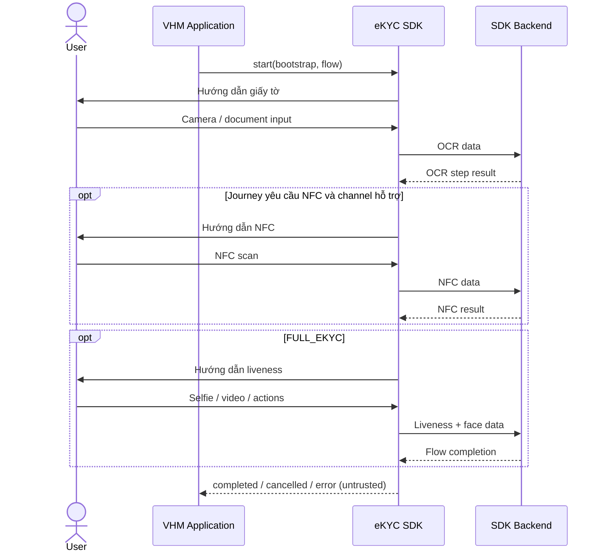

### 5.1.3. Official result

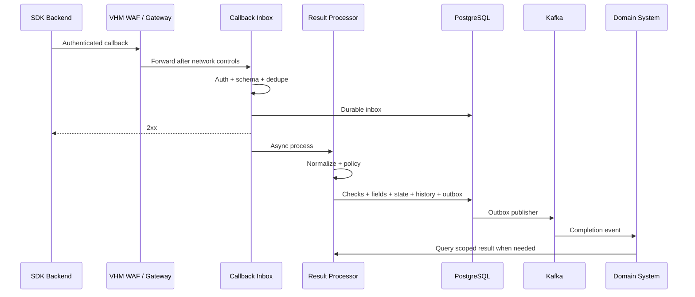

## 5.2. Data Flow quan trọng

### **5.2.1. Khởi tạo session**

```mermaid
sequenceDiagram
    actor User
    participant APP
    participant BFF
    participant DOMAIN
    participant IV as Identity Platform
    participant POLICY as Policy Registry
    participant ADAPTER as Provider Adapter
    participant PG
    User->>APP: Chọn xác minh
    APP->>APP: Hiển thị consent
    User->>APP: Đồng ý
    APP->>BFF: POST create + Idempotency-Key
    BFF->>DOMAIN: Authorize reference / subject
    DOMAIN-->>BFF: Allowed
    BFF->>IV: Create + security context
    IV->>POLICY: Resolve consumer / journey / channel
    POLICY-->>IV: Policy + field scopes + quota
    IV->>PG: Check idempotency / active session
    alt Existing same request
        PG-->>IV: Existing session
    else New session
        IV->>ADAPTER: Create provider session if required
        ADAPTER-->>IV: External ref + short-lived bootstrap
        IV->>PG: Insert session / history
    end
    IV-->>BFF: Bootstrap or capability-required
    BFF-->>APP: Response
```

Điểm kiểm soát:

- User/tenant/domain lấy từ security principal, không tin body.
- Consent tồn tại trước external session creation.
- Provider credential chỉ tồn tại backend memory trong thời gian ngắn.
- Bootstrap token TTL ngắn và không log.

### **5.2.2. OCR_ONLY trên Web**

```mermaid
sequenceDiagram
    actor User
    participant WEB as Web App
    participant SDK as Web eKYC SDK
    participant PROVIDER as SDK Backend
    participant IV as Identity Platform
    participant DOMAIN as Domain
    WEB->>WEB: Preflight browser + camera
    WEB->>IV: Create OCR_ONLY, channel=WEB
    IV-->>WEB: Web SDK bootstrap
    WEB->>SDK: Start OCR flow
    SDK->>User: Camera / upload theo policy
    User->>SDK: Document capture
    SDK->>PROVIDER: OCR data
    PROVIDER-->>SDK: Client completion
    SDK-->>WEB: COMPLETED (untrusted)
    WEB->>WEB: Show "Đang xử lý kết quả"
    WEB->>IV: submitted
    PROVIDER->>IV: Official callback
    IV->>IV: Normalize document result
    IV->>DOMAIN: Event OCR completed
    WEB->>IV: GET status/result
    IV-->>WEB: VHM outcome/nextAction
    WEB->>WEB: Render VHM-owned result
    DOMAIN->>IV: Get scoped identity fields
```

Kết quả:

- `ocrOutcome=PASSED/MISMATCH/INSUFFICIENT_DATA/FAILED`.
- `ekycOutcome=NOT_PERFORMED`.
- Domain không được hiển thị “Đã xác minh danh tính” cho OCR_ONLY.

### **5.2.3. FULL_EKYC trên Mobile**

```mermaid
sequenceDiagram
    actor User
    participant APP as Mobile App
    participant SDK as Native eKYC SDK
    participant PROVIDER as SDK Backend
    participant IV as Identity Platform
    participant STORE as Private Evidence Storage
    participant DOMAIN as Domain
    APP->>IV: Create FULL_EKYC
    IV-->>APP: Native bootstrap + subStepMode
    APP->>SDK: start(resolved flow)
    alt COMBINED provider call
        SDK->>User: Capture front + back
        User->>SDK: Front + back
        SDK->>PROVIDER: OCR(front, back)
        PROVIDER-->>IV: Official combined result
    else SEQUENTIAL_FAIL_FAST
        SDK->>User: Capture front
        User->>SDK: Front
        SDK->>PROVIDER: OCR(front)
        alt Front passed
            PROVIDER-->>SDK: Continue
            SDK->>User: Capture back
            User->>SDK: Back
            SDK->>PROVIDER: OCR(back)
            PROVIDER-->>IV: Official sequential result
        else Front failed
            PROVIDER-->>SDK: Stop automatic flow
            PROVIDER-->>IV: Official front failure
            IV->>IV: Create front review + back EVIDENCE_REQUIRED
            IV-->>APP: nextAction=CAPTURE_MANUAL_EVIDENCE(back)
            APP->>User: Capture missing back for manual review
            User->>APP: Back image
            APP->>IV: Create one-time evidence upload intent
            IV-->>APP: Upload instruction + evidenceId
            APP->>STORE: Upload encrypted back evidence
            APP->>IV: Complete evidence(checksum)
            IV->>IV: Back AVAILABLE, reviews PENDING
            IV->>DOMAIN: REVIEW_EVIDENCE_READY
        end
    end
    opt Automatic OCR step passed
        SDK->>User: NFC/liveness actions per journey
        User->>SDK: NFC/selfie/video input
        SDK->>PROVIDER: NFC/liveness/face data
        PROVIDER-->>IV: Official final result
        IV->>IV: Verify + normalize + decide
        IV->>DOMAIN: VERIFIED / other event
    end
    SDK-->>APP: Completion/close event (untrusted)
    APP->>APP: Show "Đang xử lý kết quả"
    APP->>IV: submitted
    APP->>IV: GET status/result
    IV-->>APP: VHM outcome/nextAction
    APP->>APP: Render VHM-owned result
```

Nhánh manual evidence sử dụng VHM Secure Evidence Capture và không gọi provider SDK
để OCR back. Component giữ `verificationId/reviewId/subStepCode/identityVersion`,
upload trực tiếp bằng one-time instruction và không expose ảnh/token qua log.

### **5.2.4. FULL_EKYC trên Web**

```mermaid
sequenceDiagram
    actor User
    participant WEB as Web App
    participant SDK as Web eKYC SDK
    participant PROVIDER as SDK Backend
    participant IV as Identity Platform
    WEB->>WEB: Check browser / camera / liveness
    WEB->>IV: Create FULL_EKYC + capabilities
    alt Web supported
        IV-->>WEB: Web SDK bootstrap
        WEB->>SDK: start
        SDK->>User: Document + liveness via camera
        User->>SDK: Captures / actions
        SDK->>PROVIDER: eKYC data
        PROVIDER-->>SDK: Client completion
        SDK-->>WEB: COMPLETED (untrusted)
        WEB->>WEB: Show "Đang xử lý kết quả"
        WEB->>IV: submitted
        PROVIDER->>IV: Official callback
        IV->>IV: Normalize + decide
        WEB->>IV: GET status/result
        IV-->>WEB: VHM outcome/nextAction
        WEB->>WEB: Render VHM-owned result
    else Missing mandatory capability
        IV-->>WEB: CHANNEL_CAPABILITY_REQUIRED
        WEB->>IV: Create Mobile handoff
        IV-->>WEB: QR / deep-link token
    end
```

Web baseline:

- Chỉ browser/version có trong compatibility allowlist được publish trong deployment;
  browser ngoài allowlist bị chặn trước khi tạo SDK run.
- Camera tối thiểu 720p, permission phải được cấp trước start; mất permission chuyển
  `SDK_ERROR` và không silent fallback sang file upload.
- FULL_EKYC bắt buộc live camera. OCR_ONLY chỉ cho file upload khi use-case policy
  bật rõ ràng; mặc định tắt.
- Refresh/close tab không auto-cancel. Khi mở lại, Web query backend status; chỉ
  resume SDK nếu SDK contract hỗ trợ cùng run, nếu không hiển thị retry/handoff.
- Private mode bị chặn nếu browser không bảo đảm camera/storage capability tối thiểu.
- CSP `script-src/connect-src/frame-src`, iframe origin và SDK artifact integrity
  phải nằm trong versioned Web security baseline trước rollout.

### **5.2.5. Web → Mobile handoff**

```mermaid
sequenceDiagram
    actor User
    participant WEB as Desktop Web
    participant IV as Identity Platform
    participant MOBILE as Mobile App
    participant PG
    WEB->>IV: Create FULL_EKYC session
    IV-->>WEB: NFC_REQUIRED / handoff allowed
    WEB->>IV: POST handoffs
    IV->>PG: Store token hash + binding + expiry
    IV-->>WEB: QR / deep link
    User->>MOBILE: Scan QR / open app link
    MOBILE->>IV: Claim token + authenticated subject
    IV->>PG: Validate unused / not expired / binding
    IV->>PG: Mark used + create channel run
    IV-->>MOBILE: Mobile SDK bootstrap
    MOBILE->>MOBILE: Run SDK
    WEB->>IV: Poll session status
    IV-->>WEB: PROCESSING / VERIFIED
```

Không dùng QR payload chứa business ID, CCCD, email hoặc phone.

### **5.2.6. Callback thành công và duplicate**

```mermaid
sequenceDiagram
    participant PROVIDER
    participant API as Callback API
    participant Inbox
    participant Verification
    participant Outbox
    PROVIDER->>API: Callback #1
    API->>API: Auth + replay / schema checks
    API->>Inbox: INSERT unique key
    Inbox-->>API: Inserted
    API-->>PROVIDER: 200 after durable receive
    API->>Verification: Lock + apply official result
    API->>Outbox: INSERT completion event
    PROVIDER->>API: Callback duplicate
    API->>API: Auth + replay / schema checks
    API->>Inbox: INSERT same key
    Inbox-->>API: Unique conflict / existing
    API-->>PROVIDER: 200
    Note right of API: No state update<br/>No duplicate event
```

### **5.2.7. Callback đến trước client submitted**

```mermaid
sequenceDiagram
    participant PROVIDER
    participant IV as Identity Platform
    participant CLIENT as Mobile / Web BFF
    participant PG
    PROVIDER->>IV: Official final callback
    IV->>PG: INITIATED/SDK_STARTED → PROCESSING → final
    IV-->>PROVIDER: 200
    CLIENT->>IV: submitted arrives late
    IV->>PG: Keep terminal state + late-event audit
    IV-->>CLIENT: 200 + current terminal state
```

Terminal state không được chuyển ngược về `SUBMITTED`.

### **5.2.8. Callback thất lạc - Reconciliation**

```mermaid
sequenceDiagram
    participant JOB as Reconciliation Job
    participant PG
    participant ADAPTER as Provider Adapter
    participant PROVIDER as SDK Backend
    participant RP as Result Processor
    JOB->>PG: Find due SUBMITTED / PROCESSING / PROVIDER_ERROR
    PG-->>JOB: Bounded batch
    loop Each eligible session
        JOB->>ADAPTER: getResult(externalSession)
        ADAPTER->>PROVIDER: Provider-specific request
        alt Final result
            PROVIDER-->>ADAPTER: Result
            ADAPTER-->>RP: Official payload
            RP->>PG: Finalize idempotently + outbox
        else Pending
            PROVIDER-->>ADAPTER: Pending
            ADAPTER->>PG: Increment count + nextAttemptAt
        else Timeout / 5xx / 429
            PROVIDER-->>ADAPTER: Technical error
            ADAPTER->>PG: Backoff + circuit metric
        else Auth / schema permanent
            PROVIDER-->>ADAPTER: Permanent error
            ADAPTER->>PG: Provider error / quarantine
            ADAPTER->>ADAPTER: Alert
        end
    end
```

### **5.2.9. User cancel/tab close/app kill**

| **Tình huống** | **Client event** | **Backend action** |
| --- | --- | --- |
| User xác nhận cancel | `cancelled` | Chuyển CANCELLED nếu chưa có provider final |
| Mobile app force-close | Có thể không có event | Giữ active đến expiry/reconcile |
| Web tab close/refresh | Có thể beacon best-effort, không tin cậy | Không auto cancel; poll/reconcile |
| Browser crash/network loss | Không có event | Session timeout/reconcile |
| Provider final sau cancel | Late result | Lưu late-result audit; giữ `CANCELLED`, không phát completion event; correction qua operator workflow |

### **5.2.10. Retry session**

```mermaid
sequenceDiagram
    actor User
    participant APP
    participant BFF
    participant IV
    participant PG
    User->>APP: Thử lại
    APP->>BFF: POST /oldId/retry
    BFF->>IV: Retry + channel / capability
    IV->>PG: Load chain + reason + attempts
    IV->>IV: Validate retryable / quota / policy
    alt Allowed
        IV->>IV: New verification / provider session
        IV->>PG: INSERT retryOf=old, attemptNo+1
        IV-->>APP: New bootstrap / handoff
    else Not allowed
        IV-->>APP: RETRY_NOT_ALLOWED / LIMIT_REACHED
    end
```

### **5.2.11. Outbox → Domain**

```mermaid
sequenceDiagram
    participant RP as Result Processor
    participant PG
    participant OP as Outbox Publisher
    participant Kafka
    participant DOMAIN as Domain Consumer
    RP->>PG: BEGIN
    RP->>PG: State / check / field / history
    RP->>PG: Insert unique outbox event
    RP->>PG: COMMIT
    OP->>PG: Lock unpublished batch
    OP->>Kafka: Publish keyed event
    Kafka-->>OP: Ack
    OP->>PG: Mark published
    Kafka->>DOMAIN: At-least-once delivery
    DOMAIN->>DOMAIN: Dedupe eventId + update state
```

### **5.2.12. Async pipeline enqueue và execution**

```mermaid
flowchart TD
    A["Domain/session transaction"] --> B{"firstActiveStep()?"}
    B -->|none| SKIP["verification SKIPPED / no active step<br/>audit + domain event"]
    B -->|step exists| C["persist step + step outbox PENDING<br/>same transaction"]
    C --> COMMIT["commit"]
    COMMIT --> FAST["dispatchAfterCommit executor<br/>fast path"]
    COMMIT --> SWEEP["scheduler sweep due PENDING<br/>fallback/recovery"]
    FAST --> WORKER["StepOutboxWorker<br/>REQUIRES_NEW + row lock"]
    SWEEP --> WORKER
    WORKER --> VERSION{"identityVersion snapshot current?"}
    VERSION -->|no| OLD["step/outbox SKIPPED<br/>superseded"]
    VERSION -->|yes| RUN["resolve snapshotted config<br/>process sub-steps"]
    RUN --> RESULT{"result"}
    RESULT -->|transient| RETRY{"totalRetries < maxRetriesSnapshot?"}
    RETRY -->|yes| BACKOFF["increment + nextAttemptAt<br/>outbox PENDING"]
    RETRY -->|no| MANUAL["provider error/manual policy"]
    RESULT -->|validation fail| MANUAL
    RESULT -->|pass| ADV["step PASSED<br/>domain hook + nextActiveStep"]
```

### **5.2.13. OCR step sub-step và term fan-out**

```mermaid
flowchart TD
    S["OCR_DOCUMENT step picked"] --> V{"identityVersion current?"}
    V -->|no| SK["SKIPPED"]
    V -->|yes| CFG["load pipeline/step snapshot<br/>provider, subStepMode, term, retry cap"]
    CFG --> DEC["decrypt transient document refs"]
    DEC --> MODE{"subStepMode"}
    MODE -->|COMBINED| ONE["one call with all documents"]
    MODE -->|SEQUENTIAL_FAIL_FAST| SEQ["call each document sequentially<br/>stop at first failure"]
    ONE --> VALIDATE["normalize + validate identity fields<br/>DOB/min-age/expiry/issue/match rules"]
    SEQ --> SEQRESULT{"sub-step result"}
    SEQRESULT -->|pass, has next| SEQ
    SEQRESULT -->|all pass| VALIDATE
    SEQRESULT -->|front/back fail| TERM{"term"}
    VALIDATE -->|pass| PASS["step PASSED<br/>emit STEP_PASSED"]
    VALIDATE -->|fail/mismatch| TERM{"term"}
    TERM -->|ANY| ANY["manual review: failed + remaining sub-steps"]
    TERM -->|STRICT| STRICT["manual review: all sub-steps"]
    ANY --> EVIDENCE{"required review evidence available?"}
    STRICT --> EVIDENCE
    EVIDENCE -->|no| CAPTURE["Mobile nextAction:<br/>CAPTURE_MANUAL_EVIDENCE"]
    CAPTURE --> UPLOAD["secure one-time upload<br/>no automatic OCR call"]
    UPLOAD --> READY["missing evidence AVAILABLE"]
    EVIDENCE -->|yes| READY
    READY --> MR["reviews PENDING<br/>step MANUAL_REVIEW"]
```

Provider/network exceptions đi retry/backoff. Validation fail/mismatch là official
business result, không retry kỹ thuật. Identity lock nếu cần chỉ được Domain thực
hiện idempotent sau `STEP_PASSED` hoặc final event.

Ví dụ bắt buộc: sequence `DOCUMENT_FRONT → DOCUMENT_BACK`, front fail thì automatic
flow dừng ngay. Review front được tạo từ evidence hiện có; review back ở
`EVIDENCE_REQUIRED`. Mobile thu thêm back cho manual review, upload one-time và chỉ
khi back `AVAILABLE` thì task mới vào reviewer queue.

### **5.2.14. Liveness step**

```mermaid
flowchart TD
    S["LIVENESS_FACE step picked"] --> V{"identityVersion current?"}
    V -->|no| SK["SKIPPED"]
    V -->|yes| CFG["load poses/sub-steps, term, provider capability"]
    CFG --> CAP{"provider/channel supports automatic step?"}
    CAP -->|no, manual policy| ROUTE["route MANUAL_REVIEW<br/>not a genuine failure"]
    CAP -->|yes| RUN["liveness per pose<br/>sequential fail-fast or SDK flow"]
    RUN -->|transient| RETRY["retry/backoff under snapshot cap"]
    RUN -->|genuine fail| FAIL["emit STEP_FAILED<br/>manual fan-out by term"]
    RUN -->|pass| PASS["step PASSED<br/>emit STEP_PASSED"]
    PASS --> NEXT{"nextActiveStep()?"}
    NEXT -->|yes| ENQ["enqueue next step PENDING"]
    NEXT -->|none| VERIFIED["session VERIFIED<br/>emit completion"]
```

Route-to-manual do provider/capability không hỗ trợ automatic check không phát event
“liveness failed”; chỉ genuine official FAIL mới phát failure hook.

### **5.2.15. Manual review resolution**

```mermaid
flowchart TD
    A["Reviewer lists PENDING reviews<br/>authorized scope"] --> B["PUT review action + reason"]
    B --> C{"review still PENDING?"}
    C -->|no| ALREADY["IV_MANUAL_ALREADY_REVIEWED"]
    C -->|yes| ACTION{"action"}
    ACTION -->|APPROVE| AP["review APPROVED"]
    AP --> ALL{"all required reviews approved?"}
    ALL -->|no| WAIT["step remains MANUAL_REVIEW"]
    ALL -->|yes| ADV["step PASSED<br/>advance next step or VERIFIED"]
    ACTION -->|REJECT| RJ["review/step/session REJECTED<br/>per policy"]
    ACTION -->|RE_RUN| RR["create new step execution/outbox<br/>keep old history"]
    ADV --> EVENT["emit review/step/final domain events"]
    RJ --> EVENT
    RR --> EVENT
```

Domain consumer quyết định notification recipient/template. Platform event chỉ mang
routing metadata, decision, reason category và secure evidence reference nếu được phép.

## 5.3. Failure Handling Matrix

| **Tình huống** | **Phát hiện** | **State/Decision** | **Retry** | **Alert** |
| --- | --- | --- | --- | --- |
| Camera permission denied | SDK/browser error | SDK_ERROR | User action | Metric/P3 nếu spike |
| Browser unsupported | Compatibility policy | SDK_ERROR/unsupported | Đổi browser/device | Metric |
| Ảnh mờ/chói/mất góc | Canonical warning | NEED_RETRY | Có giới hạn | Metric |
| Hai mặt không cùng giấy tờ | Document warning | MANUAL_REVIEW | Không automatic retry | Fraud metric |
| NFC không khả dụng trên Web | Capability preflight | Không start flow | Handoff Mobile | Không/P3 spike |
| NFC read fail recoverable | SDK/provider result | NEED_RETRY khi còn attempt; hết attempt → MANUAL_REVIEW | User retry có giới hạn | Metric |
| Liveness quality/action fail recoverable | Official result | NEED_RETRY khi còn attempt; hết attempt → MANUAL_REVIEW | User retry có giới hạn | Fraud watch |
| Liveness genuine spoof signal | Official result | MANUAL_REVIEW | Không automatic retry | Fraud watch |
| Face mismatch | Official result | MANUAL_REVIEW | Không automatic retry | Fraud watch |
| SDK init/script load fail | Client error | SDK_ERROR | Có | Alert nếu spike/version-specific |
| Callback auth fail | Gateway/auth | Không đổi session | Provider retry có thể xảy ra | P1/P2 |
| Callback duplicate | Inbox unique | Giữ nguyên | Không | Metric |
| Callback schema đổi | Mapping error | PROCESSING/QUARANTINED | Internal reprocess | P1/P2 |
| Provider timeout/5xx | Adapter | PROVIDER_ERROR | Backoff/reconcile | P2 nếu vượt threshold |
| Provider 401/403 | Adapter | PROVIDER_ERROR | Không retry vô hạn | P1 |
| DB lỗi trước durable inbox | Exception | Chưa nhận | Provider retry | P1 |
| DB lỗi sau inbox | Inbox FAILED | PROCESSING | Worker retry | P1/P2 |
| Kafka unavailable | Outbox pending | Final đã lưu | Publisher retry | P2 |
| Domain consumer lỗi | DLQ/retry | Verification final | Consumer retry | Domain alert |
| Handoff token replay | Claim conflict | Không đổi session | Tạo token mới nếu hợp lệ | Security metric |
| Multi-tab run conflict | Lease/run ID | Existing run | Dùng tab đang chạy | UX metric |
| After-commit executor mất task | Scheduler thấy outbox PENDING | Giữ PENDING | Scheduler process | Alert theo oldest age |
| Worker xử lý task superseded | Identity version mismatch | Step/outbox SKIPPED | Không | Metric/audit |
| Worker crash khi PROCESSING | Lock timeout/lease recovery | Reset/reclaim theo policy | Có | Backlog alert |
| Config đổi khi task đang chờ | Snapshot khác current config | Dùng snapshot cũ | Không | Config audit |
| Missing/invalid capture quality | Canonical validation | NEED_RETRY khi còn attempt; hết attempt → MANUAL_REVIEW | Không technical retry | Domain metric |
| Identity/business mismatch | Canonical validation | MANUAL_REVIEW | Không automatic retry | Domain metric |
| Front fail-fast, back chưa capture | Sub-step result + evidence readiness | MANUAL_REVIEW; back EVIDENCE_REQUIRED | Không automatic OCR retry; Mobile capture bổ sung | Evidence-age/abandon metric |
| Manual evidence upload hết TTL/sai checksum | Upload completion validation | Giữ EVIDENCE_REQUIRED | Xin intent mới/capture lại theo policy | Security/quality metric |
| Manual review duplicate resolve | Row state/optimistic lock | Giữ decision đầu | Không | Audit |
| Một trong N review chưa xong | Review aggregate | Step MANUAL_REVIEW | Không | SLA reminder |
| Domain notification lỗi | Domain outbox/consumer | Verification giữ nguyên | Domain retry | Domain alert |

## 5.4. Data Normalization

- Unicode NFC, trim và collapse whitespace.
- Họ tên uppercase/no-accent chỉ dùng compare; giữ display value đã chuẩn hóa.
- Document number chỉ nhận character set/length theo document policy.
- Date parse strict ISO-8601; không tự đảo ngày/tháng.
- Address ưu tiên administrative code; fuzzy compare chỉ tạo warning.
- Score canonical range `0..1`; out-of-range bị reject/quarantine.
- Field source: `OCR`, `NFC`, `MRZ`, `QR`, `USER_CONFIRMED` theo allowlist.
- Threshold theo field/journey/model và version; không dùng một ngưỡng chung toàn hệ thống.

---

# **6. Deployment Architecture**

## **6.1. Deployment Diagram**

```mermaid
flowchart LR
    subgraph DEVICE["User Device"]
        MOBILE["VHM Mobile App"]
        WEB["VHM Web App"]
        SDK["Native / Web eKYC SDK"]
    end
    subgraph PROVIDERCLOUD["SDK Provider Cloud"]
        PROVIDER["SDK Backend"]
        PORTAL["Configuration Portal"]
    end
    subgraph VHM["VHM Cloud Region"]
        WAF["CDN / WAF / API Gateway"] --> LB["Load Balancer / Ingress"]
        subgraph K8S["Kubernetes - Private Subnets"]
            BFF["VHM BFFs"] --> IV["Identity Verification API"]
            WORKER["Inbox / Step / Reconciliation / Outbox Workers"]
        end
        RDS[(PostgreSQL Multi-AZ)]
        KAFKA[[Kafka]]
        S3["Private Object Storage<br/>optional evidence"]
        SM["Secrets Manager / KMS"]
        OBS[Observability]
        NAT["Controlled Egress"]
        LB --> BFF
        IV --> RDS
        WORKER --> RDS
        WORKER --> KAFKA
        IV --> S3
        IV --> SM
        IV --> OBS
        IV --> NAT
    end
    MOBILE -->|VHM APIs| WAF
    WEB -->|VHM APIs| WAF
    MOBILE --> SDK
    WEB --> SDK
    SDK -->|SDK data-plane| PROVIDER
    PROVIDER -->|Callback only| WAF
    NAT -->|Control-plane / result API| PROVIDER
    PORTAL --> PROVIDER
```

### 6.1.1. Network topology

- Mobile/Web API đi qua CDN/WAF/API Gateway hiện hữu.
- Callback expose path riêng; không route tới toàn bộ internal API.
- Identity Platform chạy private subnet, không public IP.
- Outbound SDK Backend qua controlled egress.
- DB/Kafka/Object Storage/Secret qua private endpoint/network control.
- Web SDK script/artifact chỉ tải từ origin được duyệt; CSP/SRI áp dụng khi SDK hỗ trợ.
- Nếu có IP allowlist ổn định, dùng như lớp bổ sung, không thay callback auth.

### 6.1.2. Network Flow Matrix

| **From** | **To** | **Protocol** | **Purpose** | **Control** |
| --- | --- | --- | --- | --- |
| Mobile/Web | API Gateway/BFF | HTTPS 443 | Session/status/retry/handoff | JWT, WAF, rate limit |
| Native/Web SDK | SDK Backend | HTTPS 443 | OCR/NFC/liveness/face data | TLS, SDK bootstrap/integrity |
| SDK Backend | Callback Gateway | HTTPS 443 | Official result | Auth/signature, WAF, replay guard |
| Platform | SDK Backend | HTTPS 443 | Create/get/cancel result | Secret, egress, timeout/circuit |
| Platform/Worker | PostgreSQL | TLS | Session/result/audit/outbox | SG/network policy, DB role |
| Worker | Kafka | TLS/SASL | Domain event | ACL/workload identity |
| Platform | Object Storage | HTTPS | Manual evidence | IAM, SSE-KMS, private bucket |
| Platform | Secret Manager | HTTPS/private | Credential/key | Workload identity |

## 6.2. Thành phần lưu trữ dữ liệu

| **Thành phần** | **Công nghệ baseline** | **Lưu trữ** | **Kiểm soát** |
| --- | --- | --- | --- |
| Verification DB | PostgreSQL Multi-AZ | Session, checks, fields, history, inbox, outbox | TLS, at-rest encryption, PITR, RBAC |
| Kafka | Platform Kafka | Event routing/outcome | Replication, ACL, no raw PII |
| Object Storage | Private Object Storage | Manual evidence sau fail-fast | Block public, SSE-KMS, lifecycle, audited access |
| SDK Backend | External | Media/result theo contract retention | DPA, residency, deletion evidence |
| Secrets | Vault/Secrets Manager | Credential, callback key, encryption key refs | Rotation, least privilege, no ConfigMap |
| Browser storage | Không dùng cho PII/token dài hạn | Chỉ ephemeral state tối thiểu | Clear on completion/expiry, XSS controls |

## 6.3. Capacity & Scaling

### 6.3.1. Capacity inputs bắt buộc trước production

- Sessions/ngày theo domain/journey/channel.
- Peak create/status/callback requests/phút.
- Concurrent SDK sessions Mobile/Web.
- Callback payload p50/p95/max và burst behavior.
- Retry rate OCR/NFC/liveness và handoff conversion.
- Provider quota/rate limit và cost unit.
- Number of consumer domains và event throughput.

### 6.3.2. Scaling design

| **Component** | **Scaling** | **Metric** |
| --- | --- | --- |
| Verification API | HPA | CPU, RPS, p95 latency, in-flight |
| Callback worker | HPA/queue based | Inbox backlog/age, processing rate |
| Step outbox worker | HPA/queue based | Due outbox count/age, retry rate, lock wait |
| Reconciliation | Bounded concurrency | Due sessions, provider rate limit |
| Outbox publisher | Worker scale | Pending count/oldest age |
| PostgreSQL | Multi-AZ + bounded pool | CPU, IOPS, connections, lock wait |
| Web delivery | CDN/cache static artifacts | Error rate, SDK load latency, CSP violation |

Không dùng verification ID, business ref, subject ref hoặc PII làm metric label.

## 6.4. CI/CD Architecture

### 6.4.1. DevSecOps gates

- SAST, SCA, secret scan, container/IaC scan.
- SBOM backend, Mobile và Web.
- License/distribution check cho native/Web SDK artifact.
- SDK binary/package lưu repository private theo license; không commit tùy tiện.
- Web dependency integrity, CSP review và dependency lock.

### 6.4.2. Quality gates

| **Layer** | **Nội dung** | **Gate** |
| --- | --- | --- |
| Unit | State machine, policy, mapping, masking, handoff, idempotency | Critical branch >= 80% |
| Pipeline | first/next step, version guard, retry snapshot, ANY/STRICT fan-out, manual aggregate | Bắt buộc pass |
| DB Integration | Constraint/index/locking/inbox/outbox | Bắt buộc pass |
| Provider Contract | Callback primary, Get Result reconciliation và create-session fixtures | Bắt buộc pass |
| Mobile SDK | Permission, lifecycle, deep link, real-device matrix | Bắt buộc |
| Web SDK | Browser/camera, refresh/multi-tab, CSP, responsive | Bắt buộc |
| E2E | Mobile/Web ↔ SDK Backend staging ↔ VHM | Happy + failure paths |
| Performance | Create/status/callback burst/reconciliation | Đạt threshold |
| Security | Auth/replay/IDOR/PII/SSRF/XSS/CSP | Không High/Critical |
| Resilience | Provider/DB/Kafka errors/duplicate callbacks | Bắt buộc |

### 6.4.3. Deployment strategy

- Backend rolling/canary theo platform.
- Callback schema backward-compatible tối thiểu một version.
- Mobile SDK phased rollout theo app version/device/OS.
- Web SDK rollout theo feature flag/cohort/browser; rollback static bundle nhanh.
- Feature flag tắt **create session mới** khi incident nhưng giữ callback/reconciliation.
- Promote immutable artifact qua environments; không rebuild.
- Migration forward-compatible với rolling deployment.

## 6.5. Tech Stack

| **Layer** | **Technology** |
| --- | --- |
| Backend | Java 25, Spring Boot 4.0.4, Spring Data JPA, Maven |
| Frontend | React (Web), Flutter (Mobile), Native/Web eKYC SDK được pin version |
| Database | Amazon RDS PostgreSQL 17 (Multi-AZ) |
| Cache | Amazon ElastiCache Redis 7.4 (Sentinel); chỉ dùng cho rate limit/replay/ephemeral cache, không phải source of truth của verification state |
| Message Queue | Amazon MSK Kafka + Transactional Outbox |
| File Storage | Amazon S3; chỉ lưu manual evidence đã được phê duyệt, mã hóa và có lifecycle TTL |
| Authentication & Authorization | OIDC/JWT qua Core IAM, validate tại BFF; internal service-to-service dùng workload identity/JWT hoặc mTLS theo security baseline |
| CI/CD | Azure DevOps (TFS) |
| Container Orchestration | Amazon EKS (Kubernetes) + Nginx Ingress Controller |
| DevSecOps Tools | SCA scan, container vulnerability scan, secret scan và IaC scan tích hợp trong Azure DevOps pipeline |
| Secret Management | AWS Secrets Manager + KMS; Kubernetes ConfigMap chỉ chứa non-secret configuration |
| Monitoring & Logging | Micrometer + Prometheus + Grafana + APM + Fluentd + Elasticsearch |
| Circuit Breaker | Resilience4j |
| Deployment Environment | AWS Singapore (`ap-southeast-1`) — V-App EKS Cluster |

## 6.6. Configuration Management

### 6.6.1. Application config mẫu

```yaml
identity-verification:
  provider: DEFAULT_EKYC
  session:
    timeout: 30m
    reconciliation-initial-delay: 3m
    reconciliation-max-attempts: 5
  retry:
    max-attempts-default: 3
  handoff:
    token-ttl: 5m
  provider-client:
    base-url: ${EKYC_BASE_URL}
    credential-secret-ref: ${EKYC_CREDENTIAL_SECRET_REF}
    connect-timeout: 2s
    read-timeout: 10s
  callback:
    max-payload-bytes: 2097152
    processing-mode: ASYNC_INBOX
  decision:
    default-policy-version: identity-policy-1.0
```

- Không đặt secret value trong YAML/ConfigMap.
- Startup validate production secret refs và critical config.
- Sensitive threshold/rule không public qua actuator.
- Consumer policy/config có schema validation và version.

### 6.6.2. SDK configuration baseline

| **Nhóm** | **Cấu hình** | **Baseline** | **Owner** |
| --- | --- | --- | --- |
| Journey | OCR/FULL eKYC flow | Theo use case + channel policy | Product/Risk |
| Liveness | Disable/skip | OFF cho FULL_EKYC production | ANBM/Risk |
| NFC | Retry/mandatory/fallback | Tối đa 3 lần; không silent skip | Product/UX/Risk |
| Capture | Automatic SDK/manual evidence | SDK automatic capture; VHM manual capture chỉ sau fail-fast | UX/Mobile |
| Screenshot | Block | ON production nơi SDK hỗ trợ | ANBM |
| Device | Debug/root/jailbreak/emulator | Detect/block theo channel/env | ANBM/Mobile |
| Web | Browser allowlist | Versioned compatibility matrix | Web/SDK Team |
| Guidance | OCR/liveness guide/progress | ON | UX |
| Result page | Hiển thị trang kết quả SDK | OFF trên SDK Configuration Portal; màn hình sau SDK do VHM Application sở hữu | Product/UX |
| Session | Timeout | 30 phút, cùng policy version trên backend/SDK | Platform/SDK Team |
| Callback | Auth/retry/timeout | Strong auth, ack nhanh | Backend/ANBM |
| Retention | SDK Backend data | Ngắn nhất đáp ứng reconciliation | Privacy/Legal |

### 6.6.3. Change governance

Mọi production change cần:

1. Ticket và owner.
2. Before/after value.
3. Mục đích, risk assessment và approver.
4. SIT/UAT evidence trên Mobile/Web liên quan.
5. Compatibility/impact analysis.
6. Rollback value/plan.
7. KPI/error monitoring sau thay đổi.

## 6.7. Observability

### 6.7.1. Metrics

| **Metric** | **Type** | **Labels cho phép** |
| --- | --- | --- |
| `identity_verification_sessions_total` | Counter | provider, journey, channel, status, domain |
| `identity_verification_duration_seconds` | Histogram | provider, journey, channel, final_status |
| `identity_verification_step_total` | Counter | step, outcome, channel |
| `identity_verification_callback_total` | Counter | auth_result, processing_result |
| `identity_verification_callback_latency_seconds` | Histogram | provider |
| `identity_verification_callback_duplicate_total` | Counter | provider |
| `identity_verification_provider_request_total` | Counter | operation, outcome |
| `identity_verification_provider_latency_seconds` | Histogram | operation |
| `identity_verification_reconciliation_due` | Gauge | provider |
| `identity_verification_need_retry_total` | Counter | reason_category, journey, channel |
| `identity_verification_handoff_total` | Counter | source_channel, outcome |
| `identity_verification_step_total` | Counter | step_code, status, execution_mode |
| `identity_verification_step_duration_seconds` | Histogram | step_code, outcome |
| `identity_verification_step_outbox_due` | Gauge | step_code |
| `identity_verification_step_retry_total` | Counter | step_code, reason_category |
| `identity_verification_step_superseded_total` | Counter | step_code |
| `identity_verification_manual_review_total` | Counter | step_code, status, term |
| `identity_verification_manual_review_age_seconds` | Histogram | step_code, status |
| `identity_verification_browser_unsupported_total` | Counter | browser_family, reason |
| `identity_verification_outbox_pending` | Gauge | event_type |
| `identity_verification_inbox_failed` | Gauge | failure_category |

### 6.7.2. Logging

Cho phép: timestamp, service/env/version, trace/correlation, internal verification ID
theo access policy, operation, canonical error code, provider HTTP status, duration,
channel, app/browser/SDK version.

Không cho phép: credential/token, raw callback, OCR fields, CCCD, ảnh/video/resource
URL, consent text đầy đủ, business PII hoặc biometric score gắn với danh tính.

### 6.7.3. Alerts

| **Alert** | **Trigger** | **Severity** |
| --- | --- | --- |
| Callback auth/replay failure | Bất kỳ production hoặc tăng đột biến | Critical/High |
| Provider auth failure | 401/403 liên tục | Critical |
| Provider availability | Error rate vượt threshold 5 phút | High |
| Mapping/schema error | >0 kéo dài/sau provider change | High |
| Inbox/reconciliation backlog | Oldest age vượt SLA | High |
| Outbox backlog | Event age vượt SLA | High |
| Unsupported browser spike | Tăng sau Web deployment | Medium |
| SDK crash/init error spike | Theo app/sdk/browser version | High/Medium |
| Handoff conversion drop | So với baseline | Medium |
| Step outbox backlog | Oldest due age vượt SLA | High |
| Manual review backlog | Oldest PENDING vượt domain SLA | Medium/High |
| Superseded step spike | Tăng bất thường theo domain/version | Medium |
| Liveness/face mismatch spike | Theo journey/channel/version | Security review |

---

# **7. Security**

Yêu cầu tuân thủ tiêu chuẩn ANBM, bảo vệ dữ liệu cá nhân và secure SDLC nội bộ
hiện hành tại thời điểm phê duyệt.

## 7.1. Security Layers

### 7.1.1. Infrastructure & Network Security

- Callback đi qua WAF/API Gateway/integration gateway được phê duyệt.
- Chỉ expose callback/token path cần thiết; deny mặc định path khác.
- TLS 1.2+, ưu tiên TLS 1.3 khi hai bên hỗ trợ.
- Identity Platform, DB, Kafka, Object Storage và Secret không public.
- Network Policy/Security Group theo least privilege.
- Controlled egress chỉ tới SDK Backend endpoint cần thiết khi khả thi.
- IP allowlist chỉ là lớp bổ sung, không thay authentication.
- Rate limit riêng cho create/status/retry/handoff/callback.
- Request body size, JSON depth, content type và timeout limit.
- Production data không dùng ở DEV/SIT; dùng synthetic/approved test data.
- DDoS/bot protection theo risk của hành trình public Web/Mobile.

### 7.1.2. Identity & Access Management

#### Authentication

**User → VHM:**

- OIDC/JWT theo IAM hiện hữu.
- BFF validate issuer, audience, signature, expiry và token type.
- Không tin `userId`, `tenantId`, `domain` từ header/body nếu không đối chiếu principal.

**Internal S2S:**

- Workload identity, service JWT hoặc mTLS theo platform standard.
- Credential riêng theo service/environment; không shared key rộng.
- Kafka ACL theo producer/consumer group/topic.

**SDK Backend → Callback:**

- JWS/JWT bất đối xứng là cơ chế xác thực bắt buộc; key rotation hỗ trợ overlap.
- Validate key ID, issuer, audience, expiry, timestamp và nonce/event ID.
- mTLS là lớp bổ sung khi provider hỗ trợ. Fixed token chỉ được dùng khi có ANBM
  exception ghi rõ compensating controls, rotation và thời hạn loại bỏ.

**VHM → SDK Backend:**

- Credential lấy từ Secret Manager bằng workload identity.
- Không đưa API key/app secret xuống Mobile/Web.
- Rotation hỗ trợ overlap/version để không làm hỏng session active.

#### Authorization

| **Role/Service** | Create | Get status | Retry | Scoped fields | Full audit | Config |
| --- | --- | --- | --- | --- | --- | --- |
| End User | Qua BFF, own business object | Own only | Policy | UX fields, masked | ❌ | ❌ |
| Domain Service | Approved use case | Domain scope | Authorized | Approved scopes | Limited | ❌ |
| Reviewer | ❌ | Assigned cases | Theo quyền | Review-required only | Limited | ❌ |
| Operation Support | ❌ | Search có reason | Controlled | Masked default | Operational | ❌ |
| Security Auditor | ❌ | Audit scope | ❌ | Không cần PII mặc định | Read-only | Read baseline |
| Config Admin | ❌ | ❌ | ❌ | ❌ | Config audit | Dual control |
| Callback Principal | ❌ | ❌ | ❌ | Chỉ callback write | ❌ | ❌ |

### 7.1.3. Application Security & Data Protection

#### Zero Trust cho client result

- Mobile/Web `COMPLETED` chỉ báo UX, không phải official result.
- Không nhận OCR fields/decision do client gửi để apply nghiệp vụ.
- Official result phải bind đúng provider session/internal session/environment.
- Late/duplicate/out-of-order result xử lý theo version/timestamp/state guard.

#### Callback Security

- Authenticate trước khi parse sâu.
- Timestamp/replay window và event/payload dedupe.
- Canonicalize trước khi hash; reject ambiguous duplicate critical JSON keys.
- Validate external session tồn tại, provider/environment match.
- Payload lớn hoặc schema critical sai đưa quarantine/alert.

#### Mobile Security

- Screenshot blocking nếu SDK/platform hỗ trợ và ANBM phê duyệt.
- Detect debugger/emulator/root/jailbreak theo environment policy.
- App hardening/obfuscation theo Mobile standard.
- Không lưu media vào gallery/cache không mã hóa.
- Xóa temporary files sau flow.
- Certificate pinning chỉ khi có rotation/emergency bypass an toàn.
- Deep link/app link dùng verified domain và one-time token.

#### Web Security

- CSP chặt chẽ; hạn chế `script-src`, `connect-src`, `frame-src`, `media-src` đúng origin cần thiết.
- SRI cho SDK artifact khi cơ chế phân phối/version hỗ trợ.
- Không đặt bootstrap/access token dài hạn trong localStorage/sessionStorage.
- Chống XSS/CSRF/clickjacking theo kiến trúc authentication.
- SDK chạy iframe chỉ khi contract yêu cầu; cấu hình sandbox/allow permission tối thiểu.
- Camera permission chỉ xin khi người dùng bắt đầu; giải thích purpose rõ ràng.
- Multi-tab/run lease ngăn hai flow đồng thời.
- Handoff QR/deep link không chứa PII và chống open redirect.
- Browser unsupported phải fail có hướng dẫn, không fallback upload tùy ý.

#### Client Handoff Security

1. Web tạo token random đủ entropy; DB chỉ lưu hash.
2. Token bind verification, tenant, subject, target channel và expiry.
3. Mobile claim qua authenticated session cùng subject/authorized actor.
4. Atomic consume token; replay trả `410`/conflict.
5. Token không xuất hiện trong analytics/referrer/server access log nếu có thể.
6. URL dùng HTTPS + verified app/universal link; `Referrer-Policy: no-referrer`.

#### Manual Review Security

- Reviewer query bắt buộc organization/data scope và assignment authorization.
- Platform dùng generic reviewer scope; domain role mapping nằm ngoài core.
- Evidence mặc định masked; unmask/download cần reason và audit.
- Resolve dùng idempotency + row lock/optimistic version; không cho decision overwrite.
- Maker-checker bắt buộc cho terminal override/re-run nếu policy yêu cầu.
- Reviewer không sửa official result; manual decision được lưu như lớp quyết định riêng.

#### Transmission & Storage Encryption

- TLS in transit; DB/Object Storage/backup mã hóa at rest bằng KMS.
- Field-level/application encryption cho normalized identity fields theo classification.
- HMAC-SHA256 với secret riêng cho exact-match index; không hash plain CCCD.
- Không log ciphertext/key envelope không cần thiết.
- Key rotation có version và re-encryption/dual-read plan.

#### Data Masking

- Document number mask theo role/use case.
- Họ tên/địa chỉ chỉ trả khi purpose thật sự cần.
- Support screen mặc định masked; unmask yêu cầu elevated permission, reason và audit.
- Domain event không chứa PII.
- Presigned/resource URL không log và TTL ngắn.

#### Input/Output Security

- Allowlist enum/length/range; parser limit depth/array size.
- Không phản chiếu raw provider message/code nhạy cảm ra UI.
- Không server-side fetch URL do payload cung cấp; Provider Adapter chỉ gọi
  allowlisted authenticated endpoint đã cấu hình.
- Nếu tải evidence: allowlist host/scheme, chặn private IP/redirect, size/type limit,
  malware scan và lưu private.
- Response projection omit field không có scope, không trả null schema hint.

#### Logging & Audit

- Application log kỹ thuật tách khỏi audit log.
- Audit append-only gồm Who/What/When/Where/Result/Purpose.
- Audit state transition, result source, policy/config version, handoff, unmask,
  manual decision, reprocess và secret/config rotation.
- Không log raw PII, media, token, raw callback hoặc resource URL.
- Đồng bộ thời gian NTP; log/audit retention theo security policy.

### 7.1.4. Governance & Compliance

- Xác định controller/processor role giữa VHM và SDK provider trong DPA.
- Xác nhận data residency, subprocessor, transfer mechanism và breach notification.
- DPIA/PIA bắt buộc nếu policy nội bộ yêu cầu cho dữ liệu sinh trắc.
- Consent tách theo purpose OCR_ONLY/FULL_EKYC nếu mức xử lý khác nhau.
- Thay flow/liveness/NFC/retention/field scope phải qua governance.
- Không dùng dữ liệu cho model training, analytics hoặc purpose mới khi chưa có legal basis/consent.
- Có quy trình quyền chủ thể dữ liệu và xóa dữ liệu ở cả VHM/SDK Backend.

## **7.2. Data Privacy**

### 7.2.1. Data inventory

| **Data Type** | **Nguồn** | **Purpose** | **VHM Persist** | **SDK Backend Persist** | **Retention** |
| --- | --- | --- | --- | --- | --- |
| Session metadata | VHM/SDK Backend | Correlation/operation | Có | Metadata theo contract | Audit/business policy |
| Consent | VHM | Legal basis/purpose proof | Có/reference | Không cần | Legal policy |
| OCR normalized fields | Official result | Auto-fill/compare | Approved fields only | Theo provider retention | Theo domain purpose |
| Raw OCR payload | SDK Backend | Mapping/troubleshoot | Không persist tại VHM | Theo provider | Ngắn nhất có thể |
| ID images | SDK | OCR/verification | Không persist automatic-flow media tại VHM | Theo provider | Ngắn nhất có thể |
| NFC raw/DG2 | SDK | Chip verification | Không | Theo provider/contract | Ngắn nhất có thể |
| Selfie/video/frame | SDK | Liveness/face match | Không persist tại VHM | Theo provider | Ngắn nhất có thể |
| Liveness/face status | Official result | Decision/audit | Tối thiểu | Theo provider | Verification record policy |
| Warning/rule hit | Official result | Quality/risk decision | Canonical only | Theo provider | Verification record policy |
| Resource URL | SDK Backend | Optional evidence | Không dài hạn | Trong provider result | Không log/expire nhanh |
| Device/browser metadata | Client | Compatibility/fraud | Tối thiểu | SDK-dependent | Ops/security policy |
| Audit/access log | VHM | Traceability | Có | Portal audit riêng | Security policy |
| Manual review | VHM | Hậu kiểm/exception | Decision, reason, scoped evidence refs | Không cần | Domain/audit policy |
| Manual evidence bổ sung | Mobile secure capture | Hoàn thiện bộ evidence sau automatic fail-fast | Private Object Storage, object key mã hóa; không DB binary | Không gửi provider | TTL ngắn theo review purpose; purge sau resolve/expiry |
| Step execution/outbox | VHM | Durable pipeline/retry | Metadata, snapshot, errors đã mask | Không | Operational retention |

### 7.2.2. Data lifecycle

```mermaid
flowchart TD
    CONSENT["Consent"] --> SESSION["Create session metadata"]
    SESSION --> COLLECT["SDK collects document/biometric data"]
    COLLECT --> PROCESS["SDK Backend processes"]
    PROCESS --> RESULT["VHM receives official result"]
    RESULT --> NORMALIZE["Normalize + minimize + encrypt"]
    NORMALIZE --> MISSING{"Fail-fast còn thiếu review evidence?"}
    MISSING -->|Có| CAPTURE["Secure capture"]
    CAPTURE --> STORAGE["Short-lived object storage"]
    STORAGE --> DOMAIN["Domain consumes approved result"]
    MISSING -->|Không| DOMAIN
    DOMAIN --> DELETE["Delete temporary/raw data"]
    DELETE --> RETAIN["Retain approved business/audit record"]
    RETAIN --> END["Archive/anonymize/delete<br/>at end of retention"]
```

### 7.2.3. Retention principles

- SDK Backend retention đủ cho callback recovery nhưng ngắn nhất có thể.
- VHM không lưu raw payload/media của automatic SDK flow.
- Manual evidence là ngoại lệ có purpose rõ ràng: chỉ thu đúng loại còn thiếu, mã hóa,
  TTL ngắn, xóa sau review/expiry và lưu deletion audit; không tái sử dụng cho purpose khác.
- Normalized field retention theo purpose/domain record và có expiry bắt buộc.
- Session metadata/check/audit có retention riêng, không đồng nhất với identity field.
- Quarantine raw payload bị tắt trong vận hành bình thường. Chỉ incident ticket đã
  phê duyệt mới được bật tạm thời với encryption, TTL rất ngắn và audited access.
- Backup expiry phải bảo đảm dữ liệu đã hết retention không tồn tại vô thời hạn.

Giá trị ngày cụ thể là **TBD**, cần PO/Data Privacy/Legal/System Owner phê duyệt.

### 7.2.4. Data subject request

Runbook phải bao gồm:

1. Tiếp nhận và xác minh chủ thể.
2. Tìm verification chain theo internal/business references an toàn.
3. Tổng hợp dữ liệu VHM đang giữ.
4. Gửi yêu cầu provider export/delete nếu dữ liệu còn retention.
5. Kiểm tra legal hold/nghĩa vụ lưu trữ.
6. Export định dạng mã hóa/watermark/TTL.
7. Xóa/anonymize và ghi audit đầy đủ.

### 7.2.5. Access controls

- Production DB không phải công cụ tra cứu PII cho Support.
- Evidence/normalized field truy cập qua API có authorization/masking/audit.
- Break-glass access có approval, TTL và post-review.
- Export có encryption, watermark, expiry và download audit.
- Không chia sẻ production sample qua chat/ticket/email không được phê duyệt.

## 7.3. Threat Model

| **Threat** | **Kịch bản** | **Mitigation** |
| --- | --- | --- |
| Client giả VERIFIED | App/Web bị sửa gửi result giả | Server-to-server official result only |
| Lộ credential | Secret trong mobile/web/repo/log | Secret Manager; bootstrap short-lived; scanning/rotation |
| Callback giả | Attacker gọi callback | Strong auth, WAF, timestamp, correlation |
| Replay callback | Payload hợp lệ gửi nhiều lần | Inbox dedupe, replay window, terminal guard |
| IDOR | User A đọc session user B | Object authorization, tenant/domain binding |
| Handoff theft/replay | QR/token bị chụp và claim | TTL, one-time, subject binding, atomic consume |
| XSS lấy Web token/camera flow | Script độc hại trên Web | CSP, output encoding, dependency security, no long-lived storage |
| Clickjacking | Nhúng eKYC page vào iframe độc hại | CSP frame-ancestors/X-Frame-Options |
| Open redirect/deep link abuse | Handoff chuyển sang app/site giả | Allowlist verified links, opaque token |
| Multi-tab race | Hai tab start cùng session | Run lease/nonce + server guard |
| Stale async step | Task cũ apply lên giấy tờ mới | Identity-version snapshot guard + SKIPPED |
| Review privilege abuse | Reviewer ngoài scope approve/reject | Data scope, assignment, reason, audit, maker-checker |
| Config race | Task dùng retry/term mới ngoài dự kiến | Snapshot config/version at enqueue |
| PII trong log/APM | DTO/raw callback bị log | Log filter, DTO toString control, PII scan tests |
| SSRF resource URL | Backend fetch URL attacker kiểm soát | No auto fetch; host/IP/redirect controls |
| JSON bomb/oversize | Callback làm cạn CPU/memory | WAF/body/depth/timeout limits |
| Provider schema drift | Type/field đổi hàng loạt | Tolerant parser, contract monitor, quarantine/alert |
| Insider access | Support unmask không cần thiết | RBAC, reason, audit, dual control |
| Compromised device | Root/debugger/emulator | SDK checks, app hardening, server policy |
| Config drift | Flow/retention bị đổi ngoài change process | Baseline, change audit, periodic reconciliation |
| Over-retention | Media/PII giữ quá purpose | Lifecycle, deletion verification, DPIA |

## 7.4. Security Test Cases tối thiểu

- Callback thiếu/sai/hết hạn credential hoặc signature.
- Callback replay cùng event/payload và cùng external session payload khác.
- Callback external session không tồn tại hoặc thuộc environment khác.
- JSON quá size/depth, duplicate critical keys, invalid numeric/boolean/date.
- API create/get/retry IDOR và tenant/domain spoofing.
- Concurrent create/retry bypass attempt limit.
- Multi-tab Web start conflict và stale lease.
- Web XSS/CSP/clickjacking/CSRF theo auth model.
- Handoff expired, reused, wrong subject, open redirect/deep link spoof.
- Mobile root/jailbreak/emulator/debugger và screenshot behavior.
- SDK token/credential scan trong mobile binary, JS bundle, source map và logs.
- PII scan log/APM/browser analytics/crash report.
- Resource URL SSRF/private IP/redirect/oversize/malware.
- Key/credential rotation khi có active sessions.
- Outbox/inbox duplicate/replay và DB restore behavior.
- Identity-version superseded step không apply result.
- After-commit dispatch mất nhưng scheduler vẫn xử lý outbox.
- `ANY/STRICT` manual-review fan-out và concurrent resolve.
- Unauthorized reviewer/org scope và terminal override controls.

---

# **8. Backup & Recovery**

## 8.1. Phạm vi backup

Backup:

- `identity_verification`.
- `identity_verification_check`.
- `verified_identity_field` trong thời hạn retention.
- `verification_callback_inbox` metadata.
- `identity_verification_step`.
- `identity_verification_step_outbox` chưa hết operational retention.
- `identity_verification_manual_review`.
- `identity_verification_history`.
- `identity_verification_outbox` chưa hết retention.
- Consent reference/data tại hệ thống sở hữu.
- Optional evidence được phê duyệt.
- Configuration repository, policy versions và deployment manifests.

Không backup như business data:

- SDK bootstrap/access token.
- Presigned/resource URL.
- Secret plaintext.
- Temporary Mobile/Web/SDK cache.
- Raw/quarantine payload đã hết TTL.

## 8.2. Backup strategy

- PostgreSQL automated backup + PITR theo platform standard.
- Multi-AZ phục vụ availability, không thay backup.
- Backup mã hóa bằng KMS; key access tách biệt.
- Object Storage lifecycle/versioning phù hợp retention và quyền xóa.
- Cross-region DR theo Tier/SLA được phê duyệt.
- Restore test định kỳ, không chỉ kiểm tra backup job thành công.
- Secret khôi phục qua Secret Manager/PKI, không export plaintext vào DB backup.

## 8.3. Recovery Flow

```mermaid
sequenceDiagram
    participant Operation
    participant BACKUP as DB Backup / PITR
    participant DB as Restored DB
    participant IV as Identity Platform
    participant PROVIDER as SDK Backend
    participant OUTBOX as Outbox Worker
    Operation->>BACKUP: Select approved restore point
    BACKUP->>DB: Restore / PITR
    Operation->>IV: Deploy / connect restored environment
    IV->>DB: Validate schema / constraints / integrity
    IV->>DB: Find non-terminal sessions
    loop Eligible session within provider retention
        IV->>PROVIDER: Get official result
        PROVIDER-->>IV: Final / pending / not found
        IV->>DB: Reconcile idempotently
    end
    OUTBOX->>DB: Resume unpublished events
    OUTBOX->>OUTBOX: Publish with event idempotency
    Operation->>Operation: Domain reconciliation + evidence
```

## 8.4. RTO & RPO

| **Chỉ số** | **Baseline** | **Ghi chú** |
| --- | --- | --- |
| RTO | <= 4 giờ | Tier 2 baseline; System Owner phê duyệt |
| RPO | <= 15 phút/PITR | Session/result nhạy với mất dữ liệu |
| Provider result recovery | Trong provider retention window | Retention phải lớn hơn recovery/reconcile window |
| Event recovery | Outbox + consumer idempotency | Không mất/nhân đôi side effect |
| Configuration recovery | Versioned repo + approved baseline | Bao gồm Mobile/Web SDK compatibility |

## 8.5. Recovery verification checklist

- DB schema/version/index/constraint đúng.
- Encryption/secret/key version đúng environment.
- Callback route/auth hoạt động.
- Create session có thể vẫn bị disable trong khi recovery.
- Non-terminal sessions được reconcile bounded.
- Terminal event không publish trùng.
- Outbox/inbox backlog giảm theo SLA.
- Domain state và verification state được đối soát.
- Handoff token cũ/hết hạn không sống lại sau restore.
- Retention/deletion jobs được resume đúng.
- Restore log không chứa PII/secret.

---

# **Glossary**

| **Term** | **Definition** |
| --- | --- |
| OCR | Optical Character Recognition - trích xuất dữ liệu từ ảnh giấy tờ. |
| eKYC | Electronic Know Your Customer - xác minh danh tính điện tử. |
| OCR_ONLY | Journey đọc giấy tờ, không xác minh người thao tác là chủ giấy tờ. |
| FULL_EKYC | Journey gồm document verification, liveness và face matching; NFC tùy policy. |
| Liveness | Kiểm tra người thực hiện là người thật đang hiện diện. |
| Face Matching | So khớp khuôn mặt người thao tác với ảnh giấy tờ/NFC. |
| NFC | Near Field Communication - đọc chip giấy tờ trên thiết bị hỗ trợ. |
| Verification ID | Correlation ID nội bộ do VHM sinh cho một attempt xác minh. |
| Provider Session ID | External reference của SDK Backend. |
| Canonical Result | Mô hình kết quả chuẩn nội bộ, không phụ thuộc SDK/provider. |
| Provider Adapter | Lớp cô lập SDK API/auth/payload/error. |
| Business Reference | Opaque ID của aggregate/giao dịch do Domain System sở hữu. |
| Subject Reference | Opaque ID của chủ thể cần xác minh trong business context. |
| Result Projection | Cơ chế chỉ trả field domain được cấp scope. |
| Reconciliation | Cơ chế fallback chủ động gọi Get Result khi callback quá SLA hoặc session treo; không phải happy path. |
| Callback Inbox | Durable record chống trùng và hỗ trợ reprocess callback. |
| Transactional Outbox | Lưu event cùng DB transaction rồi publish async. |
| Handoff | Chuyển journey giữa Web và Mobile bằng token one-time có binding. |
| Decision Policy | Rule versioned ánh xạ canonical checks thành quyết định VHM. |
| Verification Pipeline | Chuỗi step có thứ tự được resolve theo domain/use case/journey. |
| Step Outbox | Durable work item để xử lý verification step bất đồng bộ. |
| Identity Version | Version của bộ giấy tờ/chủ thể dùng để loại task superseded. |
| Sub-step Term | `ANY/STRICT` xác định phạm vi fan-out manual review khi step fail. |
| Manual Review | Hậu kiểm có assignment, evidence, decision, reason và audit. |
| PII | Dữ liệu định danh cá nhân. |
| Data Minimization | Chỉ xử lý/lưu dữ liệu tối thiểu cho purpose xác định. |

---

# **Appendix A. External Inputs & Confirmations**

Các mục dưới đây không phải lựa chọn kiến trúc. Đây là input bắt buộc từ owner tương
ứng để cấu hình, kiểm thử và phê duyệt production theo baseline đã quyết định trong TDD.

## A.1. Business & Scope Inputs

| **Input bắt buộc** | **Owner** | **Gate** |
| --- | --- | --- |
| Danh sách domain/use case được phê duyệt và owner của từng use case | Product/System Owner | Trước implementation scope freeze |
| Journey `OCR_ONLY/FULL_EKYC`, enforcement và channel cho từng use case | Product/Risk | Trước config baseline |
| Subject types: customer, partner, employee, legal representative hoặc related party | Product/Domain | Trước API mapping |
| Document types được phép theo domain/use case | Product/Risk | Trước SDK flow config |
| NFC requirement theo use case/channel | Risk/Product | Trước UAT |
| Attempt quota theo subject/business/day/device | Product/Risk | Trước performance/security test |
| Manual review owner, UI, assignment scope, SLA và escalation | Operations/Product | Trước manual-review UAT |
| Incident bypass policy, approver, expiry và audit; mặc định không bypass | System Owner/ANBM | Trước go-live |
| Field projection scope và retention theo domain/purpose | Data Privacy/Domain | Trước result API UAT |
| Use case khởi chạy async và use case chờ user start SDK | Product/Domain | Trước pipeline config |
| Step sequence, active flag, sub-step mode và term theo use case | Product/Risk/Architect | Trước config baseline |
| Domain hook cần identity lock/notification tại từng outcome | Domain Owner | Trước event integration test |

## A.2. Mobile & Web SDK Inputs

| **Input bắt buộc** | **Owner** | **Gate** |
| --- | --- | --- |
| Mobile framework/platform và SDK package/version | Mobile/SDK Team | Trước integration build |
| Web framework, browser allowlist và Web SDK package/version | Web/SDK Team | Trước integration build |
| SDK license, distribution rule và private artifact repository | Procurement/SDK Team | Trước CI/CD |
| Camera/webcam requirement và permission behavior theo SDK version | SDK Team | Trước UX implementation |
| NFC capability matrix theo device/OS | Mobile/SDK Team | Trước device test matrix |
| Client callback/error catalogue và PII classification từng field | SDK Team/Data Privacy | Trước adapter/logging implementation |
| Resume behavior sau force-close, refresh, tab close và browser crash | SDK Team | Trước lifecycle implementation |
| SDK cache, analytics và crash-log behavior | SDK Team/ANBM | Trước security approval |
| Accessibility, localization, branding và device-security behavior | Mobile/Web/Product | Trước UAT |
| Web iframe/script/connect origins | SDK Team/Web/ANBM | Trước CSP baseline |
| Handoff UX, universal/app-link domain và association files | Mobile/Web Team | Trước handoff E2E test |
| Profile SDK Configuration Portal theo environment/channel; trang kết quả SDK đặt `OFF` | Product/SDK Team | Trước Mobile/Web UAT |
| Completion/close event vẫn được SDK phát khi trang kết quả đặt `OFF` | SDK Team | Trước client submitted integration test |

## A.3. SDK Backend Integration Inputs

| **Input bắt buộc** | **Owner** | **Gate** |
| --- | --- | --- |
| Chính thức create-session, Get Result reconciliation và cancel contracts | SDK Backend Team | Trước Provider Adapter implementation |
| Callback JWS/JWT fields, key distribution, event ID, result version và timestamp | SDK Backend/ANBM | Trước callback implementation |
| Callback acknowledgement, retry, timeout và ordering semantics | SDK Backend Team | Trước inbox/load test |
| Rate limit/quota từng operation | SDK Backend Team | Trước resilience/capacity config |
| Callback/result API SLA và incident escalation | Vendor Management/Ops | Trước go-live |
| Error/warning catalogue, versioning và change-notification process | SDK Backend Team | Trước normalization contract test |
| Data location, subprocessors, retention và deletion evidence | Provider/Data Privacy | Trước privacy approval |
| Encryption, key ownership và rotation procedure | Provider/ANBM | Trước security approval |
| Resource-reference authentication, TTL và host allowlist | SDK Backend/ANBM | Trước adapter security test |
| Staging fixtures, document samples và fraud/failure scenarios | SDK Backend/QA | Trước SIT/UAT |

## A.4. Security & Privacy Inputs

| **Input bắt buộc** | **Owner** | **Gate** |
| --- | --- | --- |
| Data classification cho từng biometric-related field | Data Privacy/ANBM | Trước schema approval |
| Consent text, version và legal basis cho từng journey/purpose | Legal/Product | Trước UAT |
| Provider retention và VHM retention theo domain | Data Privacy/System Owner | Trước production config |
| Manual evidence TTL và approved use cases | Data Privacy/ANBM/Product | Trước manual evidence UAT |
| Field-encryption/keyed-hash key owner và rotation | ANBM/Platform | Trước production deployment |
| Audit retention, unmask role và break-glass workflow | ANBM/Audit | Trước operations UAT |
| DPIA/DPA, data residency và subprocessors approval | Data Privacy/Legal | Go-live blocker |
| Provider data-subject export/delete API and runbook | Provider/Data Privacy | Go-live blocker |

## A.5. NFR & Operations Inputs

| **Input bắt buộc** | **Owner** | **Gate** |
| --- | --- | --- |
| Volume/ngày và peak TPS theo channel/domain | Product/Capacity | Trước load test |
| SDK Backend SLA dùng cho dependency SLO/error budget | Vendor Management/Ops | Trước SLO dashboard |
| Callback payload p50/p95/max và burst pattern | SDK Backend Team | Trước callback load test |
| Dashboard, alert và runbook owner | Operations | Trước production readiness review |
| Reconciliation interval phù hợp provider quota/retention | Backend/Ops | Trước resilience test |
| Cost model và abuse-control thresholds | Product/FinOps/Risk | Trước quota config |
| Step-outbox retry cap, backoff và processing SLA theo step | Architect/Ops/Product | Trước pipeline config |
| Manual-review queue capacity, assignment, SLA và escalation | Operations/Product | Trước manual-review UAT |
| `RE_RUN` maker-checker roles và reason catalogue | Risk/Operations | Trước reviewer UAT |

---

# **Appendix B. Design Decisions**

| **ID** | **Decision** | **Lý do** | **Hệ quả/Trade-off** | **Status** |
| --- | --- | --- | --- | --- |
| ADR-001 | Dùng eKYC SDK, không tự xây OCR/liveness | Time-to-market, model expertise | External dependency | Accepted |
| ADR-002 | Identity Platform dùng chung, domain không tích hợp trực tiếp | Central policy/security/audit | Thêm platform dependency | Accepted |
| ADR-003 | Server-to-server là official result | Chống giả mạo client | Cần callback inbox và reconciliation fallback | Accepted |
| ADR-004 | VHM sinh Verification ID, external ID chỉ reference | Correlation và provider portability | Cần mapping table | Accepted |
| ADR-005 | Provider Adapter + Canonical Result | Domain không lock vào SDK payload | Thêm mapping/contract tests | Accepted |
| ADR-006 | Callback Inbox idempotent | Callback retry/duplicate/schema lỗi | Thêm table/worker | Accepted |
| ADR-007 | Callback là luồng chính; Get Result chỉ dùng cho reconciliation | Realtime và recovery | Cần provider retention/quota | Accepted |
| ADR-008 | Không lưu raw payload/media automatic flow tại VHM | Privacy/minimization | Troubleshooting dựa canonical data/audit | Accepted |
| ADR-009 | Transactional Outbox cho domain event | Không mất event | Thêm worker/Kafka ops | Accepted |
| ADR-010 | OCR_ONLY và FULL_EKYC là journey khác nhau | Tránh hiểu sai OCR là verified identity | Domain phải chọn đúng journey | Accepted |
| ADR-011 | Web/Mobile là channel hạng nhất | Hỗ trợ đầy đủ hai kênh | Tăng compatibility/test matrix | Accepted |
| ADR-012 | Không silent downgrade khi thiếu capability | Giữ đúng risk assurance | Cần handoff/UX fallback | Accepted |
| ADR-013 | One-time Web→Mobile handoff | Hỗ trợ NFC/mobile-only securely | Thêm token lifecycle/deep link | Accepted |
| ADR-014 | Result field projection theo consumer scope | Data minimization | Thêm authorization/audit complexity | Accepted |
| ADR-015 | Configurable ordered verification pipeline | Dùng chung cho use case nhiều step | Thêm orchestrator/config governance | Accepted |
| ADR-016 | Step outbox + after-commit fast path + scheduler fallback | Durable async và phản hồi business nhanh | Thêm worker/outbox operations | Accepted |
| ADR-017 | Identity-version guard | Không apply task cũ lên document mới | Domain phải tăng version atomically | Accepted |
| ADR-018 | Snapshot retry/term/sub-step config lúc enqueue | Deterministic execution | Config mới chỉ áp task/session mới | Accepted |
| ADR-019 | Manual fan-out `ANY/STRICT` | Review linh hoạt theo sub-step | Tăng aggregate/assignment complexity | Accepted |
| ADR-020 | Domain hook cho identity lock/notification | Giữ core domain-neutral | Domain consumer phải idempotent | Accepted |
| ADR-021 | Mobile dùng VHM Secure Evidence Capture sau OCR fail-fast | Không phụ thuộc capture lifecycle của provider SDK | VHM lưu manual evidence TTL ngắn | Accepted |
| ADR-022 | Web không capture manual evidence; handoff sang Mobile | Giảm Web media/storage risk | Thêm cross-channel UX | Accepted |
| ADR-023 | Callback dùng JWS/JWT bất đối xứng; mTLS là lớp bổ sung | Auth mạnh và hỗ trợ rotation | Provider không đáp ứng cần ANBM exception | Accepted |

---

# **Appendix C. Go-live Checklist**

## C.1. Functional

- [ ] OCR_ONLY Mobile pass/retry/cancel/expire.
- [ ] OCR_ONLY Web pass/retry/refresh/tab-close.
- [ ] FULL_EKYC Mobile document/NFC/liveness/face pass.
- [ ] FULL_EKYC Web camera/liveness pass trên browser matrix.
- [ ] NFC mandatory và Web→Mobile handoff.
- [ ] Handoff expire/replay/wrong subject.
- [ ] Browser/device unsupported UX.
- [ ] Multi-tab/multi-device run conflict.
- [ ] Callback trước client submitted.
- [ ] Duplicate/out-of-order callback.
- [ ] Callback lost + reconciliation.
- [ ] Provider timeout/auth/schema error.
- [ ] Retry chain/attempt limit.
- [ ] Domain event/projection idempotency.
- [ ] OCR pass nhưng eKYC fail được hiển thị đúng.
- [ ] Pipeline 0 step/first step/next step/final VERIFIED.
- [ ] Outbox after-commit fast path và scheduler recovery.
- [ ] Identity-version task superseded → SKIPPED.
- [ ] Combined và sequential fail-fast sub-step mode.
- [ ] Sequential front fail → back `EVIDENCE_REQUIRED` → Mobile capture → review `PENDING`.
- [ ] Web gặp missing manual evidence → `HANDOFF_TO_MOBILE`, không upload trực tiếp.
- [ ] Manual evidence upload expired/checksum mismatch/duplicate complete/app-kill resume.
- [ ] Manual evidence thuộc identityVersion cũ bị reject.
- [ ] Reviewer không nhận/approve task trước khi đủ evidence bắt buộc.
- [ ] Retry technical-only, cap/backoff snapshot.
- [ ] Manual fan-out ANY/STRICT và aggregate approve.
- [ ] Manual reject/re-run/duplicate resolve.
- [ ] Domain step hooks/notification/identity-lock idempotency.

## C.2. Security

- [ ] Không secret trong Mobile binary/Web bundle/source map/repo/image/ConfigMap/log.
- [ ] Callback auth/signature/replay controls tested.
- [ ] WAF rate/body/depth/content-type limits.
- [ ] Object authorization/IDOR/tenant isolation.
- [ ] Mobile device security baseline approved.
- [ ] Web CSP/XSS/CSRF/clickjacking controls approved.
- [ ] Deep link/app link/handoff threat tests.
- [ ] PII scan clean trên log/APM/analytics/crash report.
- [ ] Resource URL SSRF controls.
- [ ] Manual evidence one-time upload, MIME/size/checksum/version binding tested.
- [ ] Credential/encryption key rotation runbook tested.
- [ ] ANBM approval.

## C.3. Data Privacy

- [ ] Consent text/version/purpose approved cho cả OCR_ONLY/FULL_EKYC.
- [ ] Data inventory và field scopes từng domain approved.
- [ ] Provider/VHM retention configured.
- [ ] DPA, data location, subprocessor confirmed.
- [ ] Media/evidence storage decision documented.
- [ ] Manual evidence TTL, purge và deletion audit tested.
- [ ] Data subject request/delete runbook tested.
- [ ] DPIA/PIA hoàn tất nếu yêu cầu.
- [ ] Data Privacy/Legal approval.

## C.4. Operations

- [ ] Mobile/Web/SDK compatibility matrix published.
- [ ] Step outbox/manual-review dashboards và alerts.
- [ ] Manual review assignment/SLA/escalation runbook.
- [ ] Dashboard và alerts routed đúng owner.
- [ ] SDK/provider escalation contact và SLA documented.
- [ ] Reconciliation/inbox/outbox/DLQ workers healthy.
- [ ] Runbook callback failure/provider outage/config rollback.
- [ ] Feature flag stop-create giữ callback/reconcile hoạt động.
- [ ] Backup/restore/PITR tested.
- [ ] Capacity/load/burst/cost test hoàn tất.
- [ ] Rollback Mobile/Web/backend/config tested.
- [ ] Production configuration baseline captured.

---

# **Appendix D. Tài liệu tham chiếu**

1. Mẫu TDD kiến trúc nội bộ VHM.
2. eKYC SDK Integration Pack: **TBD**.
3. Mobile SDK API/Compatibility Guide: **TBD**.
4. Web SDK API/Browser Compatibility Guide: **TBD**.
5. Callback/Auth Contract và Get Result Reconciliation Contract: **TBD**.
6. VHM IAM/S2S/Kafka/Observability platform standards: **TBD**.
7. VHM ANBM, Data Privacy, retention và secure SDLC standards: **TBD**.
8. Activity overview cho pipeline OCR → Liveness → Manual Review.
9. OCR step activity: async outbox, version guard, sub-step mode và retry semantics.
10. Liveness step activity: provider capability, pose sub-step, advance và manual route.
11. Manual-review activity: scoped list, approve/reject, advance và notification hook.

> Tài liệu không tự điền SDK/provider endpoint, threshold, version, SLA, retention
> pháp lý hoặc volume khi chưa có nguồn đã phê duyệt. Các nội dung đó được đánh dấu
> TBD và phải được chốt trong workshop Product - Mobile - Web - Backend - Architect -
> Risk - ANBM - Data Privacy - Operations - SDK Technical Team.
