# L2 - VHM - Nền tảng OCR & eKYC SDK

> **TÀI LIỆU MẬT**  
> Tài liệu mô tả thiết kế kỹ thuật cho năng lực OCR và xác thực danh tính điện tử
> dùng chung trong hệ sinh thái VHM. Không chia sẻ ra ngoài phạm vi dự án khi chưa
> được phê duyệt.

| **Team/PIC** | Team Dự án: **TBD** \| Team Kiến trúc: **TBD** \| Team Data Privacy: **TBD** \| Team ANBM: **TBD** \| SDK Technical Contact: **TBD** |
| --- | --- |
| **Status** | **BẢN NHÁP** / ĐANG THẨM ĐỊNH / PHÊ DUYỆT / TỪ CHỐI |
| **Owner** | **TBD — một cá nhân chịu trách nhiệm tài liệu** |
| **Reviewers/Approvers** | Product: TBD · Architecture: TBD · Integration: TBD · ANBM: TBD · Data Privacy/Legal: TBD · Operations: TBD |
| **Sign-off/Approval Date** | TBD theo từng reviewer/approver |
| **System Owner** | TBD |
| **L1 Document** | TBD — System Owner cung cấp trước Architecture Review |
| **L3 Documents** | API Specification: TBD · Mobile integration spec: TBD · Web integration spec: TBD · Provider integration pack: TBD · DB/Operations runbook: TBD |
| **Referenced Standards** | L2 SAD template — bản đối chiếu 06/08/2026 · STD-DIAG — bản đối chiếu 06/08/2026 · VHM IAM/ANBM/Data Privacy/Observability standards: TBD version |
| **Last Reviewed** | 06/08/2026 |

| **Reviewer/Approver role** | **Name** | **Decision** | **Sign-off date** |
| --- | --- | --- | --- |
| Product/Business Owner | TBD | Pending | TBD |
| Application/Solution Architecture | TBD | Pending | TBD |
| Integration Architecture | TBD | Pending | TBD |
| ANBM/Security | TBD | Pending | TBD |
| Data Privacy/Legal | TBD | Pending | TBD |
| Operations/Cloud/DBA | TBD | Pending | TBD |

## Mục lục

1. [Business Objectives & Scope](#1-business-objectives--scope)
2. [Architecture Overview & Principles](#2-architecture-overview--principles)
3. [Functional Requirements](#3-functional-requirements)
4. [Integration Architecture](#4-integration-architecture)
5. [Data Flow & Business Flow](#5-data-flow--business-flow)
6. [Deployment, Technology & Observability](#6-deployment-technology--observability)
7. [Security & Data Privacy](#7-security--data-privacy)
8. [Backup, Recovery & Operational Readiness](#8-backup-recovery--operational-readiness)
9. [Risks & Open Issues/Tech Debt](#9-risks--open-issuestech-debt)
10. [Glossary](#glossary)
11. [Appendix A — External Inputs & Confirmations](#appendix-a-external-inputs--confirmations)
12. [Appendix B — ADR Log](#appendix-b-adr-log)
13. [Appendix C — Go-live Checklist](#appendix-c-go-live-checklist)

### L2 template coverage index

| **Chương chuẩn L2** | **Vị trí trong tài liệu này** |
| --- | --- |
| 1. Business Objectives & Scope | Mục 1 |
| 2. Architecture Overview & Principles | Mục 2.1–2.3 |
| 3. Functional Requirements | Mục 3 |
| 4. Non-Functional Requirements | Mục 1.6 và 6.4 |
| 5. Technology Stack & Justification/ADR | Mục 6.6 và Appendix B |
| 6. Integration Architecture | Mục 2.1.2, 2.1.3 và 4 |
| 7. Data Architecture & Data Flow | Mục 2.4, 5.1 và 7.2 |
| 8. Business Flow Diagrams | Mục 5.2 |
| 9. Security & Compliance | Mục 2.1.5 và 7 |
| 10. Deployment & Infrastructure | Mục 6.1–6.5 |
| 11. Cost & Capacity/Performance | Mục 6.4 |
| 12. Scalability & Reliability | Mục 6.4.3 và 8.2.1 |
| 13. Observability & Monitoring | Mục 6.8 |
| 14. Operational Readiness | Mục 8.4–8.6 |
| 15. Testing & Quality Strategy | Mục 6.5.2, 7.4 và 8.7 |
| 16. Risks & Open Issues/Tech Debt | Mục 9 |

> **Quy ước trong tài liệu**
>
> - **VHM Application**: ứng dụng Mobile và Web của VHM tích hợp eKYC SDK.
> - **VHM Backend**: ranh giới logic gồm hai thành phần ứng dụng server-side trong
>   luồng OCR/eKYC: VHM BFF và Identity Verification Platform. Hạ tầng WAF/API
>   Gateway không được tính là một application component.
> - **Identity Verification Platform (IVP)**: dịch vụ control-plane và system of
>   record bên trong VHM Backend; quản lý session, policy, state, callback,
>   reconciliation và Canonical Result; đồng thời là integration/proxy point tới
>   eKYC Backend.
> - **eKYC SDK**: SDK chạy trên Mobile/Web, điều khiển camera, hỗ trợ kiểm tra chất
>   lượng đầu vào, thu thập dữ liệu và gọi endpoint eKYC qua VHM BFF.
> - **eKYC Backend**: hệ thống ngoài VHM khởi tạo/xử lý phiên SDK, OCR, liveness và
>   face matching; gửi official result về VHM Backend.
> - **Provider Adapter**: lớp cô lập chi tiết SDK/API/payload/error khỏi contract nội bộ VHM.
> - **Canonical Result**: mô hình kết quả chuẩn nội bộ, không phụ thuộc SDK/provider cụ thể.
> - Nội dung đánh dấu **TBD** phải được xác nhận trước khi tài liệu được APPROVED.
> - Các quyết định kỹ thuật trong bản DRAFT là baseline triển khai. Mọi thay đổi
>   phải cập nhật TDD/ADR, đánh giá tác động và được phê duyệt theo governance.

---

# **1. Business Objectives & Scope**

## 1.1 Tên hệ thống

**VHM Identity Verification Platform - OCR & eKYC SDK**.

Đây là capability dùng chung cho toàn hệ sinh thái VHM, không thuộc riêng một
domain nghiệp vụ. `VHM Backend` là ranh giới triển khai tổng thể, không đồng nghĩa
với `Identity Verification Platform`. Giải pháp gồm các thành phần logic sau:

1. **VHM Application (Mobile/Web)**
   - Thu thập consent trước khi bắt đầu xác thực.
   - Gọi backend VHM để tạo phiên và nhận SDK bootstrap.
   - Khởi chạy eKYC SDK và hiển thị hành trình cho người dùng.
   - Gửi các trạng thái phía client về backend phục vụ UX và vận hành.
2. **VHM BFF**
   - Xác thực người dùng/service và authorize business object.
   - Chuyển create/bootstrap/status/result/retry tới Identity Verification Platform.
   - Xác thực request SDK và stream data-plane tới Identity Verification Platform.
3. **Identity Verification Platform**
   - Quản lý phiên OCR/eKYC dùng chung.
   - Resolve policy theo domain, use case, journey và channel.
   - Sinh `verificationId` dùng làm Client UUID và integrity proof theo security contract.
   - Cấp SDK bootstrap/run context trước khi Mobile/Web được khởi chạy SDK.
   - Nhận official result từ callback đã xác thực.
   - Chủ động gọi Get Result chỉ khi reconciliation phát hiện callback quá SLA hoặc session treo.
   - Chuẩn hóa kết quả thành Canonical Result.
   - Ánh xạ kết quả kỹ thuật thành quyết định xác minh nội bộ.
   - Cung cấp Canonical Result cho VHM Application qua Result API và VHM BFF.
   - Ghi audit, cung cấp reconciliation và khả năng truy vết.
4. **eKYC SDK**
   - Điều khiển camera và hướng dẫn người dùng chụp giấy tờ.
   - Hướng dẫn/thu thập dữ liệu liveness, kiểm tra chất lượng đầu vào trên thiết bị.
   - Gửi init/OCR/liveness tới VHM BFF; BFF chuyển tiếp xuống IVP và IVP gọi eKYC
     Backend.
5. **eKYC Backend**
   - Khởi tạo/xử lý phiên SDK, OCR, liveness và face matching.
   - Gửi official result qua callback tới VHM BFF để route xuống IVP.
   - Cung cấp Get Result API cho reconciliation khi callback quá SLA hoặc thất lạc;
     polling không phải happy path.
> **Quyết định kiến trúc:** Identity Verification Platform là capability dùng chung
> và là control-plane bắt buộc trước khi SDK được khởi chạy. Cả control-plane và
> data-plane đều đi theo chuỗi `VHM Application/eKYC SDK → VHM BFF → Identity
> Verification Platform → eKYC Backend`. VHM Application không tích hợp trực tiếp
> eKYC Backend và không lưu credential/payload đặc thù của SDK.

## 1.2 Vấn đề giải quyết/Mục đích của hệ thống

### **1.2.1. Vấn đề hiện tại**

Nhiều hành trình trong VHM cần đọc giấy tờ và xác minh người thực hiện có đúng là
chủ thể trên giấy tờ hay không:

- Onboarding người dùng/đối tác trước khi kích hoạt tài khoản hoặc quyền nghiệp vụ.
- Xác minh người đại diện và nhân sự Đại lý.
- Đọc giấy tờ định danh của chủ thể và người liên quan trong quy trình hồ sơ.
- Xác minh khách hàng tại các bước Booking/Hợp đồng có yêu cầu định danh.
- Các hành trình khách hàng/cư dân khác được Product và Risk phê duyệt.

Nếu chỉ nhập tay hoặc upload ảnh thông thường, hệ thống gặp các vấn đề:

- Sai họ tên, số giấy tờ, ngày sinh, ngày cấp và địa chỉ.
- Dữ liệu không đồng nhất về Unicode, dấu tiếng Việt, kiểu ngày và cách viết địa chỉ.
- Ảnh mờ, chói, mất góc, sai mặt hoặc hai mặt không cùng giấy tờ.
- Không có bằng chứng đáng tin cậy rằng người thao tác là người thật.
- Không có cơ chế so khớp khuôn mặt người thao tác với ảnh trên giấy tờ.

Nếu từng domain tự tích hợp SDK, phát sinh thêm các rủi ro:

- Credential bị phân tán trên nhiều service/application.
- Mỗi domain hiểu mã lỗi, score và payload SDK theo một cách khác nhau.
- Cùng một thay đổi SDK phải sửa và kiểm thử ở nhiều hệ thống.
- Callback retry có thể tạo side effect lặp nếu không idempotent.
- Callback thất lạc làm phiên treo nếu không có reconciliation.
- Dữ liệu OCR/sinh trắc bị sao chép vào DB, log, message bus hoặc analytics ngoài kiểm soát.
- Không có một nơi quản lý consent, quota, retention, audit và chi phí tập trung.

### **1.2.2. Mục đích**

Xây dựng một nền tảng xác minh danh tính dùng chung nhằm:

- Chuẩn hóa hai journey độc lập:
  - **OCR_ONLY**: đọc và chuẩn hóa giấy tờ, không khẳng định danh tính người thực hiện.
  - **FULL_EKYC**: OCR mặt trước/sau → liveness → face matching.
- Quản lý vòng đời phiên từ khởi tạo đến quyết định cuối cùng.
- Chỉ sử dụng kết quả server-to-server làm nguồn tin cậy.
- Chuẩn hóa payload SDK thành Canonical Result trước khi VHM Application sử dụng.
- Cung cấp một Result API với bộ field cố định đã được phê duyệt.
- Bảo đảm callback, retry và reconciliation là idempotent.
- Phân biệt lỗi kỹ thuật với kết quả người dùng không đạt.
- Không lưu ảnh giấy tờ, selfie hoặc video/frame liveness của SDK flow tại VHM.
- Quản lý tập trung policy, cấu hình SDK, quota, retention, audit và monitoring.

### **1.2.3. Nguyên tắc thiết kế**

1. **Không phát triển lại thuật toán AI**  
   VHM không tự xây OCR engine, liveness engine hoặc face matching engine trong phạm vi này.

2. **Client không phải nguồn kết quả cuối cùng**  
   Mobile/Web phải nhận Client UUID/proof/run context từ VHM trước khi khởi chạy
   SDK; nguồn kết quả và reconciliation tuân thủ `RESULT-01`.

3. **OCR khác eKYC**  
   `OCR=PASSED` không đồng nghĩa `eKYC=VERIFIED`. Hai kết quả được lưu và công bố độc lập.

4. **Provider result không phải domain model**  
   Provider Adapter phải ánh xạ payload sang Canonical Result trước khi áp policy.

5. **Mỗi phiên có correlation ID do VHM sở hữu**  
   `verificationId` do Identity Verification Platform sinh và được dùng làm Client UUID khi khởi tạo
   SDK. `providerSessionId`, nếu eKYC Backend trả về, chỉ là external reference.

6. **Capability dùng chung**  
   Platform sử dụng `domain + useCase + businessRef + subjectRef + purpose`, không
   đặt foreign key tới bảng nghiệp vụ của domain.
   `domain` ở đây chỉ là mã phân loại business scope trong request/session, không
   đại diện cho một application component độc lập.

7. **Idempotent by design**  
   Create, callback, retry và reconciliation không được tạo side effect lặp.

8. **Fail closed về bảo mật, fail safe về trải nghiệm**  
   Callback không xác thực phải bị từ chối; lỗi kỹ thuật không được biến thành `REJECTED`.

9. **Data minimization**  
   Chỉ lưu field cần thiết cho purpose đã phê duyệt theo `DATA-01`.

10. **Configuration as controlled change**  
    Flow, threshold, retry, retention và security setting phải version hóa, có owner,
    phê duyệt và rollback plan.

11. **VHM-controlled data-plane**  
    Data-plane, media handling và credential ownership tuân thủ `DP-01`, `MEDIA-01`
    và `CRED-01`.

#### Normative cross-cutting controls

Bảng dưới đây là nguồn chuẩn duy nhất cho các quy tắc xuyên suốt. Những mục khác
tham chiếu control ID và chỉ mô tả chi tiết riêng của section.

| **Control ID** | **Yêu cầu bắt buộc** | **Owner** | **Evidence chính** |
| --- | --- | --- | --- |
| `DP-01` | SDK data-plane đi đúng chuỗi `SDK → VHM BFF → IVP → eKYC Backend`; SDK version trên từng Mobile/Web channel phải hỗ trợ override toàn bộ init/OCR/liveness endpoint và custom VHM session header. Không fallback ngầm sang direct/hybrid. | Client/BFF/IVP | SDK compatibility + proxy contract/E2E |
| `MEDIA-01` | BFF/IVP chỉ bounded-stream theo chunk và backpressure; cấm full-body buffering, decode/transform, disk spool, persist, request/response body log và transparent retry sau khi đã gửi body. | BFF/IVP/Ops | Load, memory/disk, DLP và failure-path test |
| `CRED-01` | Provider credential lưu trong Secret Manager và chỉ IVP eKYC Backend Adapter được đọc/inject; không truyền xuống BFF, Mobile/Web hoặc SDK. | IVP/ANBM | IAM policy, secret scan và rotation test |
| `RESULT-01` | Client/SDK result chỉ phục vụ UX; callback đã xác thực là official-result ingress chính. Get Result chỉ được gọi bởi Reconciliation Job khi callback quá SLA hoặc session treo. | IVP | Callback/reconciliation contract test |
| `CALLBACK-01` | Callback phải được token-authenticate, bind Client UUID/environment, replay/dedupe và durable inbox trước khi trả 2xx. | IVP/ANBM | Security, duplicate và crash-recovery test |
| `DATA-01` | VHM không lưu document image, selfie hoặc liveness video/frame; chỉ lưu canonical fixed fields và callback inbox tối thiểu, mã hóa, TTL ngắn theo approved purpose. | IVP/Data Privacy | Data inventory, DB scan, retention/purge evidence |
| `AUTH-01` | BFF authenticate caller, authorize `businessRef/subjectRef` và không tin business scope từ request body; IVP revalidate session/run/journey binding. | BFF/IVP | AuthN/AuthZ/IDOR test |
| `RETRY-01` | Front/back thuộc cùng run; lỗi một bước làm fail whole attempt. Retry tạo attempt/run mới và không tái sử dụng media/result cũ. | Client/IVP | State-machine và retry E2E |

### **1.2.4. Phạm vi thực hiện**

- Tích hợp eKYC SDK trên Mobile và Web.
- Sử dụng một SDK/provider đã được phê duyệt.
- Một loại giấy tờ `NATIONAL_ID_CHIP`, chụp mặt trước và mặt sau.
- Consent guard trước khi tạo phiên.
- Tạo session, sinh `verificationId`, quản lý active session và retry chain.
- Proxy SDK init/OCR/liveness theo chuỗi `SDK → VHM BFF → IVP → eKYC Backend`.
- Hỗ trợ journey `OCR_ONLY` và `FULL_EKYC`.
- Hỗ trợ OCR giấy tờ, liveness và face matching theo khả năng SDK.
- Official-result flow tuân thủ `RESULT-01`.
- Canonical Result và error taxonomy dùng chung.
- State machine, idempotency và callback inbox.
- Reconciliation cho callback thất lạc hoặc session treo.
- Result API với Canonical Result cơ bản và bộ field cố định đã được phê duyệt.
- Audit, metrics, alert và runbook vận hành.
- Bảo vệ credential, PII và dữ liệu sinh trắc.

### **1.2.5. Ngoài phạm vi**

- Huấn luyện/tinh chỉnh model OCR, liveness hoặc face matching.
- Xây dựng kho dữ liệu sinh trắc học dài hạn.
- Xây dựng hệ thống nhận diện khuôn mặt dùng ngoài purpose eKYC đã phê duyệt.
- Cho VHM Application hoặc caller truy cập raw provider payload.
- Tự động áp một decision policy duy nhất cho mọi domain.
- Đồng bộ/sửa dữ liệu master của domain ngoài contract đã thống nhất.

### **1.2.6. Giả định và ràng buộc**

| **ID** | **Giả định/Ràng buộc** | **Trạng thái** | **Ảnh hưởng nếu thay đổi** |
| --- | --- | --- | --- |
| A-01 | Giải pháp sử dụng một eKYC SDK/provider | Quyết định phạm vi | Mọi thay đổi phải cập nhật TDD và đánh giá lại contract/security/privacy |
| A-02 | Kết quả chính thức luôn lấy server-to-server | Quyết định thiết kế | Client result không được dùng cho business decision |
| A-03 | `verificationId` do VHM sinh; external ID không phải primary key | Quyết định thiết kế | External ID chỉ dùng correlation/provider mapping |
| A-04 | Callback hỗ trợ Dynamic Token; Fixed Token chỉ dùng khi có ANBM risk acceptance | Provider capability input — go-live blocker | Thiếu token expiry/scope/rotation làm tăng rủi ro spoof/replay |
| A-05 | FULL_EKYC production luôn có liveness | Quyết định thiết kế/Security gate | Tắt liveness phải đổi journey và có risk acceptance riêng |
| A-06 | eKYC Backend giữ kết quả đủ lâu để reconciliation | Provider/Privacy contract input | Retention quá ngắn làm mất khả năng phục hồi callback |
| A-07 | VHM không lưu video liveness/face template | Quyết định Data Minimization | Thay đổi yêu cầu DPIA, encryption, access và retention riêng |
| A-08 | VHM BFF sử dụng opaque `businessRef/subjectRef` | Quyết định thiết kế | Tránh coupling DB giữa IVP và dữ liệu nghiệp vụ |
| A-09 | SDK version và Mobile/Web compatibility matrix được pin theo implementation baseline | Implementation manifest input | Thiếu manifest thì không được tạo build để triển khai |
| A-10 | Volume, peak TPS và dependency SLA phải được cung cấp | Capacity/SLO input | Thiếu input thì không qua production readiness review |
| A-11 | Mỗi use case có Business Owner chịu trách nhiệm business decision | Quyết định ownership | Platform không tự định nghĩa risk rule thay Business Owner |
| A-12 | Mặt trước và mặt sau phải hoàn tất trong cùng một SDK run/attempt | Quyết định Mobile/Web flow | Lỗi ở bất kỳ mặt nào làm attempt thất bại và retry lại toàn bộ attempt |

## 1.3 Đối tượng sử dụng

- **Người dùng cuối**: thực hiện OCR/eKYC trong VHM Application.
- **Người dùng/đối tác/đại diện pháp lý**: thực hiện định danh cho onboarding hoặc hồ sơ được phân quyền.
- **Business Operator/Reviewer**: tra cứu kết quả đã mask và xử lý hậu kiểm theo assignment.
- **Customer Support/Operation**: tra cứu phiên, hỗ trợ lỗi và kích hoạt tác vụ retry/reprocess có kiểm soát.
- **Platform Administrator**: quản lý consumer, policy, cấu hình và vận hành nền tảng.
- **Security/Data Privacy/Auditor**: kiểm soát consent, retention, access và audit.
- **eKYC Backend**: hệ thống ngoài trust boundary gửi callback/cung cấp result API.

## 1.4 Thu thập & xử lý dữ liệu cá nhân

[X] **Có:** Hệ thống xử lý dữ liệu cá nhân và có thể xử lý dữ liệu sinh trắc học.

Các nhóm dữ liệu dự kiến:

- Họ tên, số giấy tờ, ngày sinh, giới tính, quốc tịch.
- Địa chỉ thường trú, quê quán, ngày cấp, nơi cấp, ngày hết hạn.
- Ảnh mặt trước/mặt sau giấy tờ.
- Ảnh chân dung hoặc video/frame phục vụ liveness.
- Kết quả OCR và confidence theo field.
- Kết quả liveness.
- Kết quả face match và similarity score.
- Warning chất lượng giấy tờ.
- Thông tin client ở mức tối thiểu phục vụ compatibility và vận hành.
- Consent: chủ thể, purpose, version nội dung, channel và thời điểm đồng ý.

Mục **7.2 Data Privacy** phải được APPROVED trước production.

## 1.5 Mức độ quan trọng của hệ thống

- **Cấp độ hệ thống:** Tier 2 - Business Critical.
- **Mô tả:** OCR/eKYC nằm trên các hành trình onboarding/xác minh quan trọng.
  Gián đoạn ngắn có thể chấp nhận nếu người dùng lưu được trạng thái nghiệp vụ và
  thử lại sau; sai kết quả hoặc mất tính toàn vẹn không được chấp nhận.
- **Nguyên tắc ưu tiên:**
  - Bảo mật và toàn vẹn cao hơn tốc độ hoàn tất.
  - Không biến lỗi kỹ thuật thành kết luận người dùng không đạt.
  - Không bypass eKYC khi domain bắt buộc, trừ exception có thẩm quyền và audit.

## 1.6 Non-Functional Requirements tổng quát

| **Nhóm** | **Baseline** | **Trạng thái** |
| --- | --- | --- |
| Availability | Platform >= 99.9% theo tháng; dependency eKYC Backend theo SLA riêng | Baseline |
| Create VHM session | p95 <= 1 giây; không có synchronous eKYC Backend call | Baseline |
| Status/result query | p95 <= 300 ms với dữ liệu đã persist | Baseline |
| Callback acknowledgement | Durable receive và trả 2xx <= 2 giây; xử lý nặng async | Baseline |
| Scalability | Horizontal scale; không giữ session trong memory local | Bắt buộc |
| Data integrity | Idempotency, optimistic locking và append-only history | Bắt buộc |
| Security | TLS, secret manager, callback auth, schema validation, masking | Bắt buộc |
| Observability | Metrics, structured log đã mask, trace/correlation | Bắt buộc |
| Recovery | Reconcile non-terminal session; không phụ thuộc callback duy nhất | Bắt buộc |
| Compatibility | Mobile/Web client/SDK matrix và phased rollout | Implementation manifest bắt buộc trước build |
| Maintainability | VHM contract không phụ thuộc SDK payload; policy versioned | Bắt buộc |

---

# **2. Architecture Overview & Principles**

## 2.1. Application Architecture Diagram

### 2.1.1. System Context Diagram (L1)

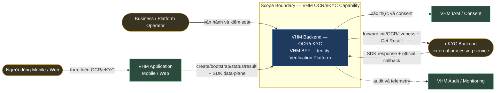
```mermaid
flowchart LR
    USER(["Người dùng Mobile / Web"]):::entity
    OPS(["Business / Platform Operator"]):::entity
    APP["VHM Application<br/>Mobile / Web"]:::owned
    IAM["VHM IAM / Consent"]:::owned
    OBS["VHM Audit / Monitoring"]:::owned
    PROVIDER(["eKYC Backend<br/>external processing service"]):::entity

    subgraph SCOPE["Scope Boundary — VHM OCR/eKYC Capability"]
        CORE["VHM Backend — OCR/eKYC<br/>VHM BFF · Identity Verification Platform"]:::bc
    end

    USER -->|thực hiện OCR/eKYC| APP
    OPS -->|vận hành và kiểm soát| CORE
    APP -->|create/bootstrap/status/result + SDK data-plane| CORE
    CORE -->|xác thực và consent| IAM
    CORE -->|forward init/OCR/liveness + Get Result| PROVIDER
    PROVIDER -->|SDK response + official callback| CORE
    CORE -.->|audit và telemetry| OBS

    style SCOPE stroke:#d9b84a,stroke-width:2px
    classDef bc fill:#1f3a5f,stroke:#4a90d9,color:#fff;
    classDef owned fill:#2d4a3e,stroke:#5fb37a,color:#fff;
    classDef entity fill:#3a3320,stroke:#d9b84a,color:#fff;
```

**Chú giải STD-DIAG:** xanh dương = hệ thống trọng tâm; xanh lá = hệ thống VHM
láng giềng/in-scope; vàng = actor hoặc hệ ngoài; nét liền = tương tác đồng bộ;
nét đứt = event/telemetry bất đồng bộ.

| **Tác nhân/Hệ thống** | **Loại** | **Internal** | **External** | **Vai trò** |
| --- | --- | --- | --- | --- |
| Người dùng Mobile/Web | Actor |  | ✓ | Thực hiện hành trình OCR/eKYC qua VHM Application. |
| Business/Platform Operator | Actor |  | ✓ | Theo dõi, hỗ trợ và kiểm soát vận hành theo quyền. |
| VHM Backend — OCR/eKYC | Software System | ✓ |  | Ranh giới backend gồm VHM BFF và IVP; kiểm soát cả control-plane và data-plane. |
| VHM Application | Software System | ✓ |  | Kênh Mobile/Web khởi chạy SDK và hiển thị kết quả VHM. |
| VHM IAM/Consent | Software System | ✓ |  | Xác thực principal và cung cấp bằng chứng consent. |
| VHM Audit/Monitoring | Software System | ✓ |  | Nhận audit và telemetry đã loại bỏ dữ liệu nhạy cảm. |
| eKYC Backend | External System |  | ✓ | Nhận data-plane từ IVP, xử lý OCR/liveness/face và trả official result. |

### 2.1.2. Context Map / Integration Diagram (L2)

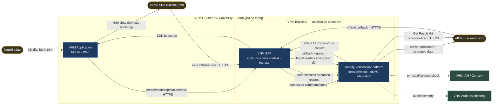
```mermaid
flowchart LR
    USER(["Người dùng"]):::entity
    SDK(["eKYC SDK runtime (ext)"]):::entity
    BACKEND(["eKYC Backend (ext)"]):::entity
    IAM["VHM IAM / Consent"]:::owned
    OBS["VHM Audit / Monitoring"]:::owned

    subgraph SYS["VHM OCR/eKYC Capability — ranh giới hệ thống"]
        APP["VHM Application<br/>Mobile / Web"]:::bc
        subgraph VHMBE["VHM Backend — application boundary"]
            BFF["VHM BFF<br/>auth · business context · ingress"]:::bc
            IVP["Identity Verification Platform<br/>session/result · eKYC integration"]:::bc
        end
    end

    USER -->|bắt đầu hành trình| APP
    APP -->|create/bootstrap/status/result · HTTPS| BFF
    BFF -->|authorized command/query| IVP
    IVP -->|Client UUID/proof/run context| BFF
    BFF -->|SDK bootstrap| APP
    APP -->|khởi chạy SDK sau bootstrap| SDK
    SDK -->|init/OCR/liveness · HTTPS| BFF
    BFF -->|authenticated streamed request| IVP
    IVP -->|server credential + streamed data| BACKEND
    BACKEND -->|official callback · HTTPS| BFF
    BFF -->|callback ingress · body/headers không biến đổi| IVP
    IVP -->|Get Result khi reconciliation · HTTPS| BACKEND
    IVP -->|principal/consent check| IAM
    IVP -.->|audit/telemetry| OBS

    classDef bc fill:#1f3a5f,stroke:#4a90d9,color:#fff;
    classDef owned fill:#2d4a3e,stroke:#5fb37a,color:#fff;
    classDef entity fill:#3a3320,stroke:#d9b84a,color:#fff;
    style VHMBE stroke:#d9b84a,stroke-width:2px
```

`VHM Backend` trong sơ đồ chỉ gồm hai application component. VHM BFF xử lý ingress,
identity và business context; IVP sở hữu trạng thái xác minh và tích hợp/proxy tới
eKYC Backend. Cấu trúc module bên trong IVP được mô tả riêng tại mục 2.3.

### 2.1.3. Danh sách module và trách nhiệm

| **STT** | **Component/Module** | **Responsibility** | **Data managed/processed** | **Technology** | **Storage** | **External exposure** | **Boundary** |
| --- | --- | --- | --- | --- | --- | --- | --- |
| 1 | **VHM Application (Mobile/Web)** | Consent UX, capability check, create session, SDK lifecycle và VHM result UX | Consent reference, bootstrap và trạng thái UX trong memory | VHM Mobile/Web client + eKYC SDK được pin version | Không lưu dữ liệu eKYC dài hạn | Có — user-facing và gọi VHM API/SDK runtime | Không giữ secret, không tự quyết định `VERIFIED` |
| 2 | **eKYC SDK** | Camera UX, front/back capture, liveness/face data và gọi init/OCR/liveness | Media/data-plane trong SDK flow | Provider SDK package cho Mobile/Web | Theo `DATA-01` và SDK contract | Có — chỉ gọi VHM BFF sau bootstrap | Không sở hữu trạng thái nghiệp vụ VHM |
| 3 | **VHM BFF** | User/service authentication, business-object authorization, request-size/rate policy và streaming route | Security context, business reference; media transit | VHM BFF standard — version TBD | `MEDIA-01`; không phải system of record | Có — VHM API và SDK ingress | Không map provider payload hoặc quyết định eKYC |
| 4 | **Identity Verification Platform** | System of record và integration/proxy point tới eKYC Backend | Session, policy, state, callback, Canonical Result; media transit | Java 25, Spring Boot 4.0.4 | PostgreSQL; `DATA-01` | Không public trực tiếp; chỉ qua BFF | Không thực hiện thuật toán OCR/liveness/face |
| 5 | **Verification API** | Validate contract và điều phối use case | Session command/query và canonical response | IVP module | Qua persistence port tới PostgreSQL | Không; qua BFF | Không thực hiện thuật toán OCR/liveness |
| 6 | **Session Manager** | Active guard, state machine, expiry, retry chain và optimistic locking | Verification session/run/state/history | IVP domain/application module | PostgreSQL | Không | Không phụ thuộc raw SDK payload |
| 7 | **eKYC Backend Adapter** | Stream init/OCR/liveness, inject server credential, Get Result và translate error | Media transient, provider reference/config và response tạm thời | IVP outbound adapter, streaming HTTP client, Resilience4j | `MEDIA-01` | Có — outbound tới eKYC Backend | Không áp business rule domain |
| 8 | **Callback Inbox** | Authenticate, durable receive, dedupe và xử lý callback | Encrypted minimal callback payload, hash và processing state | IVP Callback API/worker | PostgreSQL encrypted inbox, TTL ngắn | Không; callback qua BFF | Không lưu media hoặc raw payload dài hạn |
| 9 | **Result Normalizer** | Ánh xạ provider result sang Canonical Result | Fixed OCR fields, canonical checks/warnings | IVP application module | PostgreSQL qua persistence port | Không | Không cập nhật business object |
| 10 | **Decision Mapper** | Ánh xạ canonical checks theo fixed policy version | Decision, outcome, reason và policy version | IVP domain policy | PostgreSQL check/result/history | Không | Không hard-code threshold chưa phê duyệt |
| 11 | **Reconciliation Job** | Khôi phục callback thất lạc/session treo bằng bounded polling | Due schedule, recovery attempt và official result | IVP scheduler/worker, Resilience4j | PostgreSQL | Có — outbound Get Result | Không polling mọi session liên tục |
| 12 | **Result API** | Trả fixed Canonical Result với authorization, masking và audit | Authorized masked result projection | IVP module | PostgreSQL | Không; qua BFF | Không trả raw provider response/resource URL |
| 13 | **PostgreSQL** | System of record cho Identity Verification Platform | Session, run, check, field, inbox, result và history | Amazon RDS PostgreSQL 17 Multi-AZ | Encrypted RDS/PITR | Không — private data subnet | Không lưu binary media SDK flow |

### 2.1.4. Luồng dữ liệu OCR/eKYC

Mobile/Web luôn gọi VHM BFF để tạo phiên trước. Sau khi nhận Client UUID/proof và
run context, eKYC SDK gửi init/OCR/liveness qua BFF; BFF stream xuống IVP và IVP
gắn server credential trước khi gọi eKYC Backend.

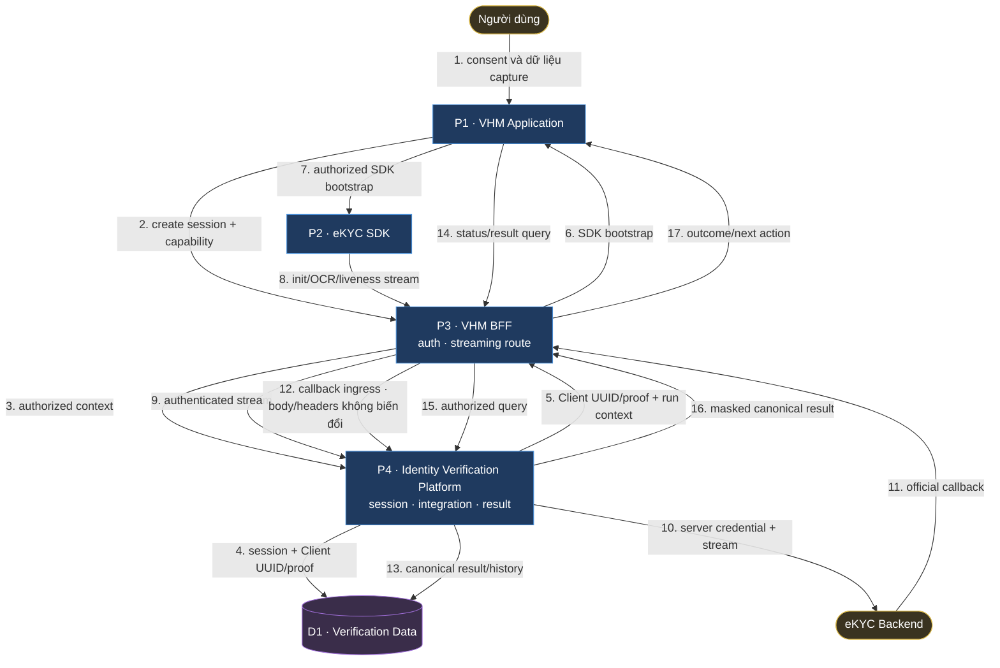
```mermaid
flowchart TB
    USER(["Người dùng"]):::entity
    BACKEND(["eKYC Backend"]):::entity
    APP["P1 · VHM Application"]:::process
    SDK["P2 · eKYC SDK"]:::process
    BFF["P3 · VHM BFF<br/>auth · streaming route"]:::process
    IVP["P4 · Identity Verification Platform<br/>session · integration · result"]:::process
    DB[("D1 · Verification Data")]:::datastore

    USER -->|"1. consent và dữ liệu capture"| APP
    APP -->|"2. create session + capability"| BFF
    BFF -->|"3. authorized context"| IVP
    IVP -->|"4. session + Client UUID/proof"| DB
    IVP -->|"5. Client UUID/proof + run context"| BFF
    BFF -->|"6. SDK bootstrap"| APP
    APP -->|"7. authorized SDK bootstrap"| SDK
    SDK -->|"8. init/OCR/liveness stream"| BFF
    BFF -->|"9. authenticated stream"| IVP
    IVP -->|"10. server credential + stream"| BACKEND
    BACKEND -->|"11. official callback"| BFF
    BFF -->|"12. callback ingress · body/headers không biến đổi"| IVP
    IVP -->|"13. canonical result/history"| DB
    APP -->|"14. status/result query"| BFF
    BFF -->|"15. authorized query"| IVP
    IVP -->|"16. masked canonical result"| BFF
    BFF -->|"17. outcome/next action"| APP

    classDef entity fill:#3a3320,stroke:#d9b84a,color:#fff;
    classDef process fill:#1f3a5f,stroke:#4a90d9,color:#fff;
    classDef datastore fill:#3a2d4a,stroke:#a06fd9,color:#fff;
```

Đây là DFD L2: mũi tên chỉ biểu diễn dữ liệu từ producer tới nơi nhận, không biểu
diễn thứ tự thực thi. Trình tự thời gian được mô tả tại mục 5.2.

Luồng này phải tuân thủ `DP-01`, `MEDIA-01`, `CRED-01`, `RESULT-01`, `DATA-01`
và `RETRY-01`. Network allowlist, TLS, SDK integrity, data location, retention,
subprocessor và incident handling là các gate được chi tiết tại mục 7 và Appendix A.

### 2.1.5. Trust Boundary

| **Boundary** | **Luồng** | **Mức tin cậy** | **Kiểm soát bắt buộc** |
| --- | --- | --- | --- |
| Mobile/Web/eKYC SDK → VHM BFF | Control API và SDK data-plane | Untrusted ingress | `AUTH-01`, `DP-01`, `MEDIA-01` |
| VHM BFF → IVP | Authorized control request hoặc media stream | Internal Zero Trust | `AUTH-01`, `MEDIA-01`, workload identity/timeout |
| IVP → eKYC Backend | Init/OCR/liveness và reconciliation | External dependency | `CRED-01`, `RESULT-01`, TLS/allowlist/circuit breaker |
| eKYC Backend → VHM BFF → IVP | Official callback | External server | `CALLBACK-01`, WAF/schema validation |
| IVP → VHM Application qua BFF | Result API | Zero Trust | User/session identity, object scope, fixed schema, masking |
| IVP → PostgreSQL | Restricted storage | Restricted | Private subnet, IAM, encryption, least privilege; cấm media |

#### Security / Zero-Trust Architecture (L2)

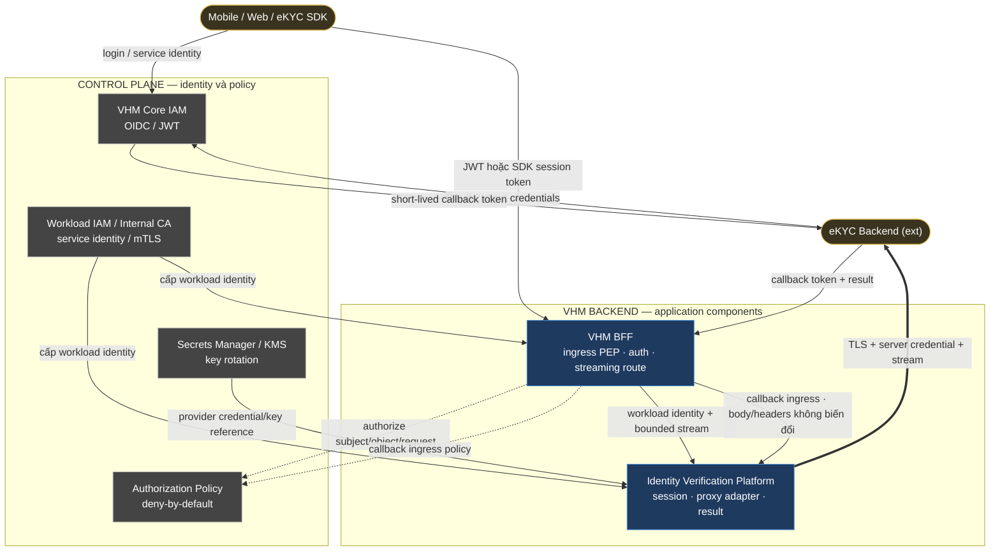
```mermaid
flowchart TB
    CALLER(["Mobile / Web / eKYC SDK"]):::entity
    BACKEND(["eKYC Backend (ext)"]):::entity

    subgraph CP["CONTROL PLANE — identity và policy"]
        IDP["VHM Core IAM<br/>OIDC / JWT"]:::infra
        WID["Workload IAM / Internal CA<br/>service identity / mTLS"]:::infra
        PDP["Authorization Policy<br/>deny-by-default"]:::infra
        KEY["Secrets Manager / KMS<br/>key rotation"]:::infra
    end

    subgraph DP["VHM BACKEND — application components"]
        BFF["VHM BFF<br/>ingress PEP · auth · streaming route"]:::bc
        IVP["Identity Verification Platform<br/>session · proxy adapter · result"]:::bc
    end

    CALLER -->|login / service identity| IDP
    BACKEND -->|OAuth2 client credentials| IDP
    IDP -->|short-lived callback token| BACKEND
    CALLER -->|JWT hoặc SDK session token| BFF
    BFF -.->|authorize subject/object/request| PDP
    BFF -->|workload identity + bounded stream| IVP
    WID -->|cấp workload identity| BFF
    WID -->|cấp workload identity| IVP
    KEY -->|provider credential/key reference| IVP
    IVP ==>|TLS + server credential + stream| BACKEND
    BACKEND -->|callback token + result| BFF
    BFF -.->|callback ingress policy| PDP
    BFF -->|callback ingress · body/headers không biến đổi| IVP

    classDef bc fill:#1f3a5f,stroke:#4a90d9,color:#fff;
    classDef entity fill:#3a3320,stroke:#d9b84a,color:#fff;
    classDef infra fill:#444,stroke:#aaa,color:#fff;
```

Caller identity, workload identity và object-level authorization là các kiểm tra
độc lập và tuân thủ `AUTH-01`/`CRED-01`. Với callback, BFF chỉ áp chính sách ingress
và route body/header; IVP thực thi `CALLBACK-01`.

### 2.1.6. Journey Policy Model

| **Journey** | **Step bắt buộc** | **Kết quả Platform** | **Quy tắc sử dụng** |
| --- | --- | --- | --- |
| `OCR_ONLY` | `OCR_DOCUMENT` | OCR fields, quality/warning và `ekycOutcome=NOT_PERFORMED` | Không được diễn giải là đã xác minh danh tính |
| `FULL_EKYC` | OCR front/back → liveness → face matching | OCR fields + eKYC decision + identity reference | Bắt buộc liveness; không silent downgrade khi thiếu capability |

Backend chỉ chấp nhận `OCR_ONLY` hoặc `FULL_EKYC`, document type
`NATIONAL_ID_CHIP` và channel `MOBILE_APP`/`WEB_APP`. Journey được resolve từ use
case đã được phê duyệt; client không được tự đổi flow.

### 2.1.7. Channel Capability Matrix

| **Capability** | **Mobile** | **Web** | **Quy tắc** |
| --- | --- | --- | --- |
| Camera OCR | SDK kiểm tra permission và chất lượng capture | SDK kiểm tra camera permission và chất lượng capture | Phải pass trước khi start |
| Document sides | Front và back trong cùng SDK run/attempt | Front và back trong cùng SDK run/attempt | Một mặt fail thì whole attempt fail |
| Liveness | SDK hướng dẫn/thu thập trong `FULL_EKYC` | SDK hướng dẫn/thu thập trong `FULL_EKYC` | eKYC Backend xử lý sâu; thiếu capability trả `CHANNEL_CAPABILITY_REQUIRED` |
| Face matching | Qua eKYC Backend | Qua eKYC Backend | Chỉ official result được dùng cho decision |
| Resume | Query backend status trước khi resume | Query backend status sau refresh/reopen | Không lưu VHM SDK session token dài hạn; unsupported resume chuyển retry |

### 2.1.8. Thông tin dữ liệu

| **Loại dữ liệu** | **Ví dụ** | **Phân loại** | **Quy tắc lưu trữ** | **Bảo mật/Logic** |
| --- | --- | --- | --- | --- |
| Internal session | `verificationId`, domain, purpose | L2 | PostgreSQL | UUID random; domain/object isolation |
| Business references | `businessRef`, `subjectRef` | L2 | PostgreSQL | Opaque; không nhúng PII |
| Provider correlation | `verificationId` truyền dưới dạng Client UUID; `providerSessionId` nếu có | L2/Internal | PostgreSQL | Client UUID do VHM sở hữu; provider session chỉ là optional external reference |
| State/timestamps | status, attempts, expiry | L2 | PostgreSQL | Guard + optimistic lock + append-only history |
| OCR fields | document number, name, DOB, address | L3 | Field-level encrypted; chỉ bộ field cố định đã phê duyệt | Mask theo Result API contract |
| Confidence/warnings | score, reason code | L2/L3 | Check table/JSONB | Versioned mapping, hạn chế UI |
| Liveness/face result | status, score | L3/Biometric-related | Status/score tối thiểu | Không lưu video/template tại VHM |
| Resource URL | front/back/video URL | L3 | Không persist | Không log; không fetch tự động |
| Callback payload | Payload tối thiểu phục vụ normalize | L3/L4 | Mã hóa trong Callback Inbox, TTL ngắn và purge sau xử lý | Không log; không lưu vào result/history |
| Consent | purpose/version/time | L3 | Consent system + reference | Purpose-bound, audit được |
| Credential/token | Provider API key, callback client secret, VHM SDK token-signing key | Secret | VHM Secret Manager/IAM; workload memory khi sử dụng | Không DB/log/client binary |

## 2.2. Session Configuration

### 2.2.1. User Authentication Session

- Do IAM/BFF quản lý qua OIDC/JWT.
- Identity Verification Platform không tự quản lý login session; VHM BFF xác thực
  user/service và truyền authorized context bằng workload identity.
- Backend phải xác minh user/service có quyền với `businessRef` trước mọi mutation/read.

### 2.2.2. Verification Session

| **Thuộc tính** | **Baseline** |
| --- | --- |
| Internal ID | `verificationId` UUIDv7 do VHM sinh |
| External correlation | `verificationId` dùng làm Client UUID; `providerSessionId` optional, unique theo provider/environment khi có |
| Active uniqueness | Một session active trên `(domain, useCase, businessRef, subjectRef, purpose, journey)` |
| Idempotency | `Idempotency-Key` bắt buộc khi create/retry |
| Timeout | 30 phút; backend và SDK config dùng cùng versioned policy |
| Retry | Tạo session mới, link `retryOfVerificationId`; không reuse external session |
| Resume | Chỉ khi SDK contract hỗ trợ; backend không giả định resume |
| Client completion | Chỉ là `SUBMITTED`, không phải verified |
| Provider completion | Callback hợp lệ; Get Result chỉ hoàn tất qua reconciliation fallback |
| Business completion | Sau normalize + fixed decision mapping + durable persistence |
| Channel | `MOBILE_APP` hoặc `WEB_APP`; ghi nhận tại session/run |
| Capability | Camera/liveness capability là client hint; backend validate theo Mobile/Web compatibility policy |

### 2.2.3. Verification Session State Machine (L3 supporting)

Đây là state machine chi tiết của một thực thể `IdentityVerification`. Các state
đều là trạng thái bền được lưu trong PostgreSQL; bảng transition ngay dưới sơ đồ
là path mapping bắt buộc cho các sequence tại mục 5.2.

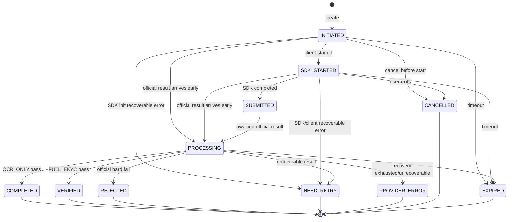
```mermaid
stateDiagram-v2
    [*] --> INITIATED: create
    INITIATED --> SDK_STARTED: client started
    INITIATED --> CANCELLED: cancel before start
    INITIATED --> EXPIRED: timeout
    INITIATED --> NEED_RETRY: SDK init recoverable error
    INITIATED --> PROCESSING: official result arrives early

    SDK_STARTED --> SUBMITTED: SDK completed
    SDK_STARTED --> CANCELLED: user exits
    SDK_STARTED --> NEED_RETRY: SDK/client recoverable error
    SDK_STARTED --> EXPIRED: timeout
    SDK_STARTED --> PROCESSING: official result arrives early

    SUBMITTED --> PROCESSING: awaiting official result
    PROCESSING --> COMPLETED: OCR_ONLY pass
    PROCESSING --> VERIFIED: FULL_EKYC pass
    PROCESSING --> REJECTED: official hard fail
    PROCESSING --> NEED_RETRY: recoverable result
    PROCESSING --> PROVIDER_ERROR: recovery exhausted/unrecoverable
    PROCESSING --> EXPIRED

    COMPLETED --> [*]
    VERIFIED --> [*]
    REJECTED --> [*]
    NEED_RETRY --> [*]
    PROVIDER_ERROR --> [*]
    CANCELLED --> [*]
    EXPIRED --> [*]
```

### 2.2.4. State Transition Guard

| **From** | **To** | **Điều kiện** | **Tác động** |
| --- | --- | --- | --- |
| INITIATED | SDK_STARTED | Chưa expire; caller đúng owner; bootstrap hợp lệ | Ghi startedAt/channel/app/sdk version |
| SDK_STARTED | SUBMITTED | Client báo SDK hoàn tất; external reference match | Ghi submittedAt; không cập nhật decision |
| SUBMITTED | PROCESSING | Official result chưa final hoặc processing async | Lập reconciliation schedule |
| INITIATED/SDK_STARTED/SUBMITTED/PROCESSING | COMPLETED | `OCR_ONLY` official result pass | Persist result/history; không diễn giải là đã xác minh danh tính |
| INITIATED/SDK_STARTED/SUBMITTED/PROCESSING | VERIFIED | `FULL_EKYC` official result hợp lệ + policy pass | Persist result/history; chấp nhận callback đến trước client event |
| INITIATED/SDK_STARTED/SUBMITTED/PROCESSING | REJECTED | Hard fail theo policy approved | Lưu canonical reasons; không nhầm timeout |
| INITIATED/SDK_STARTED/SUBMITTED/PROCESSING | NEED_RETRY | Recoverable quality/user error | Đóng attempt; cho tạo session mới nếu còn quota |
| PROCESSING | PROVIDER_ERROR | Hết reconciliation budget hoặc lỗi tích hợp không retryable | Đóng attempt; trả support/retry action theo policy |
| Any non-terminal | EXPIRED | `expiresAt < now`, chưa final | History + retry eligibility |
| Terminal | Any | Không cho chuyển ngược | Callback/client event trễ chỉ ghi audit |

## 2.3. Internal Component Design (L3 supporting)

Module view dưới đây chỉ mở cấu trúc bên trong Identity Verification Platform.
VHM BFF là component đứng trước IVP nên không nằm trong module view này. Mũi tên
biểu diễn phụ thuộc tĩnh của module, không biểu diễn thứ tự runtime.

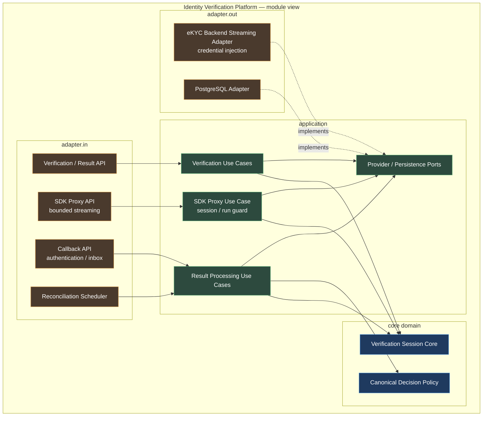
```mermaid
flowchart TD
    subgraph IVP["Identity Verification Platform — module view"]
        subgraph ADIN["adapter.in"]
            API["Verification / Result API"]:::ad
            PROXY["SDK Proxy API<br/>bounded streaming"]:::ad
            CALLBACK["Callback API<br/>authentication / inbox"]:::ad
            SCHEDULER["Reconciliation Scheduler"]:::ad
        end
        subgraph APP["application"]
            USECASES["Verification Use Cases"]:::ap
            PROXYUC["SDK Proxy Use Case<br/>session / run guard"]:::ap
            PROCESSOR["Result Processing Use Cases"]:::ap
            PORTS["Provider / Persistence Ports"]:::ap
        end
        subgraph CORE_DOMAIN["core domain"]
            SESSION["Verification Session Core"]:::dm
            POLICY["Canonical Decision Policy"]:::dm
        end
        subgraph ADOUT["adapter.out"]
            SDKOUT["eKYC Backend Streaming Adapter<br/>credential injection"]:::ad
            PERSIST["PostgreSQL Adapter"]:::ad
        end
    end

    API --> USECASES
    PROXY --> PROXYUC
    CALLBACK --> PROCESSOR
    SCHEDULER --> PROCESSOR
    USECASES --> SESSION
    PROXYUC --> SESSION
    PROCESSOR --> SESSION
    PROCESSOR --> POLICY
    USECASES --> PORTS
    PROXYUC --> PORTS
    PROCESSOR --> PORTS
    SDKOUT -.implements.-> PORTS
    PERSIST -.implements.-> PORTS

    classDef ad fill:#4a3a2d,stroke:#d99a4a,color:#fff;
    classDef ap fill:#2d4a3e,stroke:#5fb37a,color:#fff;
    classDef dm fill:#1f3a5f,stroke:#4a90d9,color:#fff;
```

**Chú giải Module L3:** nâu = adapter; xanh lá = application; xanh dương =
domain; nét đứt `implements` = adapter hiện thực port do application sở hữu.

### 2.3.1. VerificationApplicationService

- Kiểm tra domain/use case đã được phê duyệt.
- Kiểm tra business reference và quyền caller theo BFF-authorized context.
- Validate consent đúng subject, purpose và version.
- Resolve journey, timeout, quota và decision policy version.
- Bảo đảm unique active session và create idempotent.
- Sinh `verificationId`/Client UUID và integrity proof bằng secret phía server theo
  SDK security contract; persist trước khi trả cho client.
- Trả SDK bootstrap/run context tối thiểu; không gọi eKYC Backend để tạo phiên thay SDK.
- Credential boundary tuân thủ `CRED-01`.

### 2.3.2. CoreConfigurationService

Core config tối thiểu:

| **Nhóm cấu hình** | **Thuộc tính** |
| --- | --- |
| Identity context | `domain`, `useCase`, `purpose` |
| Journey/channel | `OCR_ONLY`, `FULL_EKYC`, `NATIONAL_ID_CHIP`, `MOBILE_APP`, `WEB_APP` |
| Result contract | `fixedResultSchemaVersion` |
| Control | `maxAttempts`, `rateLimit`, `decisionPolicyVersion` |
| Governance | `owner`, `PIC` |

- Config versioned và environment-scoped.
- Thay đổi bộ field cố định/decision policy cần Data Privacy/Risk approval tương ứng.
- Secret không nằm trong Core config.

### 2.3.3. SDKProxyService

- Nhận init/OCR/liveness từ BFF sau khi BFF đã xác thực caller/session token.
- Revalidate `verificationId`, `runId`, journey, endpoint order, expiry và request-size policy.
- Thực thi `DP-01`, `MEDIA-01` và `CRED-01` tại outbound adapter.
- Chỉ ghi metadata allowlist: correlation ID, verification/run ID, endpoint,
  content type/length, duration, upstream status và canonical error code.
- Provider response đồng bộ không finalize business state theo `RESULT-01`.

### 2.3.4. CallbackAuthenticator

- Baseline dùng Dynamic Token/Bearer token ngắn hạn do hệ thống VHM cấp theo callback
  contract; validate issuer/audience hoặc token endpoint contract, expiry và scope.
- Token issuance ủy quyền cho VHM IAM theo OAuth2 Client Credentials/platform
  standard; IVP không tự triển khai authorization server.
- Fixed Token chỉ được dùng khi eKYC Backend không hỗ trợ Dynamic Token và có risk
  acceptance, rotation/revocation runbook được ANBM phê duyệt.
- Validate callback token trước khi parse sâu; dedupe/replay dựa trên event ID hoặc
  fallback Client UUID + result version/payload hash đã được contract hóa.
- IP allowlist chỉ là lớp bổ sung, không thay authentication.
- Reject trước khi parse sâu nếu payload quá lớn.
- Hỗ trợ token/key rotation overlap, không gây gián đoạn callback đang bay.

### 2.3.5. CallbackInboxService

- Idempotency key dùng `providerEventId`; chỉ fallback Client UUID + result
  version/payload hash khi provider contract xác nhận không cung cấp event ID.
- Sau khi xác thực, lưu payload tối thiểu đã redaction và mã hóa trước khi xử lý business.
- Duplicate đã nhận durable trả 2xx, không chạy side effect lần hai.
- Inbox states: `RECEIVED`, `PROCESSING`, `PROCESSED`, `FAILED`, `QUARANTINED`.
- Encrypted payload chỉ tồn tại trong inbox theo TTL ngắn và được purge sau xử lý.
  Không lưu payload vào result/history/log; quarantine cần incident ticket và audit.

### 2.3.6. ResultNormalizer

| **Nhóm Canonical Result** | **Thuộc tính chính** |
| --- | --- |
| Metadata | `provider`, `clientUuid`, optional `providerSessionId`, `schemaVersion` |
| Document | `type`, `status`, `fields[]`, `overallConfidence`, `warnings[]` |
| Liveness | `status`, `score` |
| Face match | `status`, `similarity` |
| Provider conclusion | `status`, `reasonCodes[]` |

Normalizer phải:

- Chịu được optional field, null, `N/A` và provider thêm field mới.
- Parse score/boolean/date an toàn, validate range.
- Quarantine khi thiếu/không khớp Client UUID, schema không hỗ trợ hoặc payload sai type nghiêm trọng.
- Giữ provider code phục vụ audit nhưng chỉ trả canonical code cho BFF/VHM Application.
- Không fetch resource URL tự động.

### 2.3.7. VerificationDecisionPolicy

Decision model:

| **Input** | **Vai trò trong quyết định VHM** |
| --- | --- |
| Document OCR/quality | Xác định OCR pass, chất lượng và dữ liệu được phép chuẩn hóa. |
| Liveness | Bắt buộc đối với `FULL_EKYC`; không áp dụng cho `OCR_ONLY`. |
| Face match | Đầu vào xác minh khuôn mặt theo policy version. |
| Provider warning/conclusion | Tín hiệu tham khảo; luôn ánh xạ sang canonical code. |
| Attempt/policy context | Journey, attempt, config và decision policy version. |

- Sử dụng fixed mapping policy đã được phê duyệt và version hóa.
- Threshold không hard-code trong Java.
- Provider conclusion là input, không tự động là business decision.
- Lưu `decisionPolicyVersion` và canonical reason codes tại thời điểm quyết định.

### 2.3.8. ResultService

- Kiểm tra service identity, domain và business-object authorization.
- Trả một Canonical Result schema với bộ field cố định đã được phê duyệt.
- Mask mặc định; unmask cần elevated permission + reason + audit.
- Không expose resource URL, raw warning hoặc internal threshold.

## 2.4. Data Model

### 2.4.1. Logical Data Ownership (L2)

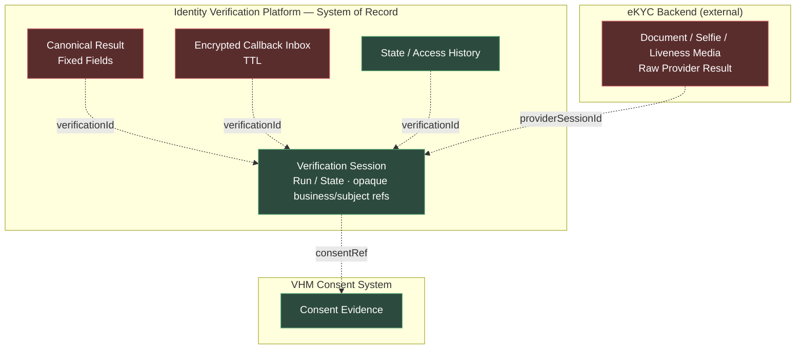
```mermaid
flowchart TB
    subgraph CONSENT["VHM Consent System"]
        CONSENT_DATA["Consent Evidence"]:::owned
    end
    subgraph IVP["Identity Verification Platform — System of Record"]
        SESSION["Verification Session<br/>Run / State · opaque business/subject refs"]:::owned
        RESULT["Canonical Result<br/>Fixed Fields"]:::sensitive
        INBOX["Encrypted Callback Inbox<br/>TTL"]:::sensitive
        HISTORY["State / Access History"]:::owned
    end
    subgraph PROVIDER["eKYC Backend (external)"]
        PROVIDER_DATA["Document / Selfie / Liveness Media<br/>Raw Provider Result"]:::sensitive
    end

    SESSION -.->|"consentRef"| CONSENT_DATA
    RESULT -.->|"verificationId"| SESSION
    INBOX -.->|"verificationId"| SESSION
    HISTORY -.->|"verificationId"| SESSION
    PROVIDER_DATA -.->|"providerSessionId"| SESSION

    classDef owned fill:#2d4a3e,stroke:#5fb37a,color:#fff;
    classDef sensitive fill:#5a2d2d,stroke:#d96f6f,color:#fff;
```

| **Chủ sở hữu/System of Record** | **Dữ liệu sở hữu** | **Năng lực lưu trữ** | **Đặc tính bắt buộc** |
| --- | --- | --- | --- |
| VHM Consent System | Consent evidence | Consent-owned storage | Platform lưu reference/version/time phục vụ audit. |
| Identity Verification Platform | Session, run, state, Canonical Result, inbox và history | PostgreSQL + encrypted inbox TTL | Transactional, idempotent, masking, retention và audit. |
| eKYC Backend | Media SDK flow và raw provider result | Provider-managed storage | Không lưu media tại VHM; retention/deletion theo hợp đồng được duyệt. |

`businessRef/subjectRef` là opaque context đã được BFF authorize trước khi gửi IVP;
IVP chỉ lưu reference trong session và không tạo FK vật lý tới dữ liệu nghiệp vụ.
Các cạnh nét đứt là tham chiếu logic bằng ID, không phải FK vật lý xuyên system.

### 2.4.2. Physical ERD (L3 supporting)

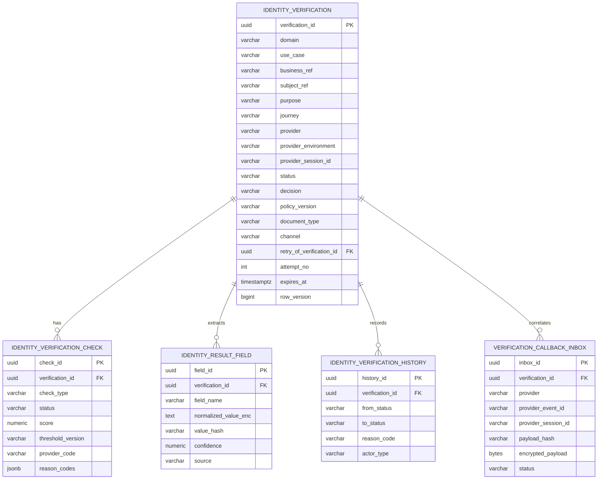
```mermaid
erDiagram
    IDENTITY_VERIFICATION {
        uuid verification_id PK
        varchar domain
        varchar use_case
        varchar business_ref
        varchar subject_ref
        varchar purpose
        varchar journey
        varchar provider
        varchar provider_environment
        varchar provider_session_id
        varchar status
        varchar decision
        varchar policy_version
        varchar document_type
        varchar channel
        uuid retry_of_verification_id FK
        int attempt_no
        timestamptz expires_at
        bigint row_version
    }
    IDENTITY_VERIFICATION_CHECK {
        uuid check_id PK
        uuid verification_id FK
        varchar check_type
        varchar status
        numeric score
        varchar threshold_version
        varchar provider_code
        jsonb reason_codes
    }
    IDENTITY_RESULT_FIELD {
        uuid field_id PK
        uuid verification_id FK
        varchar field_name
        text normalized_value_enc
        varchar value_hash
        numeric confidence
        varchar source
    }
    VERIFICATION_CALLBACK_INBOX {
        uuid inbox_id PK
        uuid verification_id FK
        varchar provider
        varchar provider_event_id
        varchar provider_session_id
        varchar payload_hash
        bytes encrypted_payload
        varchar status
    }
    IDENTITY_VERIFICATION_HISTORY {
        uuid history_id PK
        uuid verification_id FK
        varchar from_status
        varchar to_status
        varchar reason_code
        varchar actor_type
    }
    IDENTITY_VERIFICATION ||--o{ IDENTITY_VERIFICATION_CHECK : has
    IDENTITY_VERIFICATION ||--o{ IDENTITY_RESULT_FIELD : extracts
    IDENTITY_VERIFICATION ||--o{ IDENTITY_VERIFICATION_HISTORY : records
    IDENTITY_VERIFICATION ||--o{ VERIFICATION_CALLBACK_INBOX : correlates
```

### 2.4.3. Bảng `identity_verification`

```sql
CREATE TABLE identity_verification (
    verification_id             uuid PRIMARY KEY,
    domain                       varchar(50)  NOT NULL,
    use_case                     varchar(80)  NOT NULL,
    business_ref                 varchar(150) NOT NULL,
    subject_ref                  varchar(150) NOT NULL,
    purpose                      varchar(80)  NOT NULL,
    journey                      varchar(40)  NOT NULL,
    document_type                varchar(40)  NOT NULL,
    channel                      varchar(30)  NOT NULL,
    provider                     varchar(40)  NOT NULL,
    provider_environment         varchar(30)  NOT NULL,
    provider_session_id          varchar(150),
    status                       varchar(30)  NOT NULL,
    decision                     varchar(30),
    decision_reason_codes        jsonb        NOT NULL DEFAULT '[]',
    policy_version               varchar(80)  NOT NULL,
    result_schema_version        varchar(30),
    result_source                varchar(30),
    consent_reference_id         varchar(150) NOT NULL,
    retry_of_verification_id     uuid,
    attempt_no                   integer      NOT NULL DEFAULT 1,
    run_id                       uuid,
    run_lease_expires_at         timestamptz,
    sdk_version                  varchar(50),
    app_version                  varchar(50),
    expires_at                   timestamptz  NOT NULL,
    started_at                   timestamptz,
    submitted_at                 timestamptz,
    completed_at                 timestamptz,
    reconciliation_due_at       timestamptz,
    created_by                   varchar(150) NOT NULL,
    created_at                   timestamptz  NOT NULL,
    updated_at                   timestamptz  NOT NULL,
    row_version                  bigint       NOT NULL DEFAULT 0,
    CONSTRAINT fk_iv_retry_of FOREIGN KEY (retry_of_verification_id)
      REFERENCES identity_verification(verification_id),
    CONSTRAINT uk_iv_run UNIQUE (run_id),
    CONSTRAINT uk_iv_provider_session UNIQUE (
      provider, provider_environment, provider_session_id
    )
);

CREATE INDEX idx_iv_business_ref
  ON identity_verification(domain, business_ref, created_at DESC);

CREATE INDEX idx_iv_subject_ref
  ON identity_verification(domain, subject_ref, created_at DESC);

CREATE INDEX idx_iv_reconciliation
  ON identity_verification(status, reconciliation_due_at)
  WHERE status IN ('SUBMITTED', 'PROCESSING');

CREATE UNIQUE INDEX uk_iv_active_subject
  ON identity_verification(
    domain, use_case, business_ref, subject_ref, purpose, journey
  )
  WHERE status IN ('INITIATED', 'SDK_STARTED', 'SUBMITTED', 'PROCESSING');
```

`provider_session_id` có thể null trước khi provider session được tạo. PostgreSQL
cho phép nhiều null dưới unique constraint; adapter phải bổ sung validation khi bind.

### 2.4.4. Bảng `identity_verification_check`

```sql
CREATE TABLE identity_verification_check (
    check_id               uuid PRIMARY KEY,
    verification_id        uuid        NOT NULL
      REFERENCES identity_verification(verification_id),
    check_type              varchar(40) NOT NULL,
    status                  varchar(30) NOT NULL,
    score                   numeric(12,6),
    threshold_version       varchar(80),
    provider_code           varchar(80),
    reason_codes            jsonb       NOT NULL DEFAULT '[]',
    warning_data            jsonb       NOT NULL DEFAULT '[]',
    checked_at              timestamptz,
    created_at              timestamptz NOT NULL,
    updated_at              timestamptz NOT NULL,
    CONSTRAINT uk_iv_check UNIQUE (verification_id, check_type)
);
```

`check_type` baseline:

- `DOCUMENT_OCR`
- `DOCUMENT_QUALITY`
- `LIVENESS`
- `FACE_MATCH`
- `PROVIDER_CONCLUSION`

### 2.4.5. Bảng `identity_result_field`

```sql
CREATE TABLE identity_result_field (
    field_id                  uuid PRIMARY KEY,
    verification_id           uuid         NOT NULL
      REFERENCES identity_verification(verification_id),
    field_name                varchar(80)  NOT NULL,
    normalized_value_enc      text,
    value_hash                varchar(128),
    confidence                numeric(12,6),
    source                    varchar(30)   NOT NULL,
    created_at                timestamptz   NOT NULL,
    CONSTRAINT uk_iv_result_field UNIQUE (verification_id, field_name)
);
```

- `normalized_value_enc`: application/column-level encryption theo platform standard.
- `value_hash`: chỉ tạo cho field exact-match/dedup; dùng HMAC-SHA256 với key riêng,
  không dùng plain SHA-256 cho CCCD.
- Không index plaintext PII.
- Retention field có thể ngắn hơn session metadata và phải có deletion job riêng.

### 2.4.6. Bảng Callback Inbox

```sql
CREATE TABLE verification_callback_inbox (
    inbox_id                 uuid PRIMARY KEY,
    provider                 varchar(40)  NOT NULL,
    provider_event_id        varchar(150),
    provider_session_id      varchar(150),
    verification_id         uuid NOT NULL REFERENCES identity_verification(verification_id),
    result_version           varchar(80),
    payload_hash             varchar(128) NOT NULL,
    encrypted_payload        bytea        NOT NULL,
    auth_subject             varchar(150),
    status                   varchar(30)  NOT NULL,
    received_at              timestamptz  NOT NULL,
    processing_started_at    timestamptz,
    processed_at             timestamptz,
    failure_code             varchar(80),
    failure_message_masked   varchar(500),
    expires_at               timestamptz  NOT NULL,
    CONSTRAINT uk_callback_event UNIQUE(provider, provider_event_id),
    CONSTRAINT uk_callback_payload UNIQUE(provider, verification_id, payload_hash)
);
```

Nếu provider không có event ID, uniqueness fallback theo Client UUID/
`verification_id` + payload hash.
`encrypted_payload` chỉ chứa dữ liệu tối thiểu sau redaction để worker normalize,
có TTL và purge job; không được sao chép sang result/history/log.

## 2.5. Concurrency, Idempotency và Transaction

### 2.5.1. Tạo phiên đồng thời

Rủi ro: double-click/client retry tạo hai session.

Kiểm soát:

- `Idempotency-Key` bắt buộc.
- Lưu request fingerprint; cùng key khác body trả conflict.
- Partial unique active index.
- Nếu cùng idempotency và fingerprint, trả session hiện hữu.

### 2.5.2. Callback đồng thời/trùng lặp

- Insert inbox với unique event/payload key.
- Request thắng insert thực hiện durable receive.
- Duplicate `PROCESSED/PROCESSING` trả 2xx để tránh retry storm.

### 2.5.3. Callback và reconciliation cùng chạy

- Cả hai gọi chung `processOfficialResult()`.
- Callback/reconciliation khóa session bằng `SELECT ... FOR UPDATE` trong transaction
  ngắn; API mutation thông thường dùng optimistic `rowVersion`.
- Nếu terminal, chỉ append audit duplicate/late source, không finalize lần hai.

### 2.5.4. Transaction boundary

Trong một local transaction:

1. Upsert verification checks.
2. Lưu normalized fields được phép.
3. Chuyển session state/decision.
4. Append history.

Không gọi eKYC Backend hoặc dependency ngoài transaction boundary bên trong DB transaction.

# **3. Functional Requirements**

## 3.1. OCR & eKYC Platform

| **STT** | **Nhóm chức năng** | **Mô tả** |
| --- | --- | --- |
| 1 | **Core Configuration** | Quản lý domain/use case, owner, hai journey đã duyệt, một document type, quota và fixed decision policy version. |
| 2 | **Consent Guard** | Kiểm tra consent đúng subject, purpose, version, channel và thời hạn trước khi tạo phiên. |
| 3 | **Khởi tạo phiên** | Tạo `verificationId`/Client UUID, integrity proof, active-session guard, expiry và VHM SDK session token; hỗ trợ `Idempotency-Key`. |
| 4 | **Capability Preflight** | Kiểm tra camera, permission, Mobile/Web SDK compatibility và liveness capability trước khi start. |
| 5 | **Mobile/Web SDK Integration** | Quản lý permission, client lifecycle, SDK started/submitted/error, resume và security signal trên hai kênh. |
| 6 | **OCR giấy tờ** | SDK thu nhận front/back; IVP chuẩn hóa field, confidence, quality và warning theo `DP-01`/`RESULT-01`. |
| 7 | **Liveness** | SDK hướng dẫn/thu thập trong `FULL_EKYC`; eKYC Backend xử lý theo `RESULT-01`. |
| 8 | **Face Matching** | Chuẩn hóa match result/score/reason; không dùng score đơn lẻ khi threshold chưa được duyệt. |
| 9 | **Callback Reception** | Endpoint server-to-server, authentication, timestamp/replay guard, schema/body limit, durable inbox và dedupe. |
| 10 | **Reconciliation/Get Result** | Thực thi `RESULT-01` với bounded batch, backoff và circuit breaker. |
| 11 | **Result Normalization** | Chuyển payload eKYC Backend thành Canonical Result, tolerant với optional/new fields và strict với critical fields. |
| 12 | **Decision Mapping** | Ánh xạ canonical checks thành `COMPLETED/VERIFIED/REJECTED/NEED_RETRY/PROVIDER_ERROR`; lưu policy version. |
| 13 | **Result API** | Trả Canonical Result với bộ field cố định đã phê duyệt; authorize, mask và audit quyền truy cập. |
| 14 | **Retry Chain** | Tạo whole attempt mới với external session mới; giữ liên kết, reason và attempt count. |
| 15 | **Expiry Management** | Expire session/run theo policy; xử lý callback trễ và grace reconciliation có audit. |
| 16 | **Audit & Traceability** | Lưu state history, result source, config/policy version, actor và access/unmask audit. |
| 17 | **Operations** | Search theo internal reference, reprocess callback inbox và tạm dừng create khi dependency incident. |
| 18 | **Monitoring & Cost Control** | Funnel, latency, error taxonomy, callback/reconcile backlog, quota, attempt và estimated cost. |

## 3.2. Business Rules tổng quát

| **Rule ID** | **Quy tắc** |
| --- | --- |
| BR-001 | Một `(domain, useCase, businessRef, subjectRef, purpose, journey)` chỉ có tối đa một session active. |
| BR-002 | `verificationId` do VHM sinh, unique, không chứa PII và không tái sử dụng. |
| BR-003 | External session ID không được dùng làm public/internal primary key. |
| BR-004 | Kết quả client/SDK phía Mobile/Web không được chuyển trực tiếp thành `COMPLETED`, `VERIFIED` hoặc `REJECTED`. |
| BR-005 | Nguồn hoàn tất session tuân thủ `RESULT-01`. |
| BR-006 | `OCR_ONLY` thành công chuyển `COMPLETED`, có `ekycOutcome=NOT_PERFORMED` và không được hiển thị là đã xác minh danh tính. |
| BR-007 | Chỉ `FULL_EKYC` pass mới chuyển `VERIFIED`. |
| BR-008 | Callback trùng không được cập nhật state, result, history hoặc side effect lần hai. |
| BR-009 | Timeout/network/eKYC Backend unavailable giữ `PROCESSING` trong recovery budget; hết budget mới thành `PROVIDER_ERROR`, không phải `REJECTED`. |
| BR-010 | Lỗi ảnh, permission hoặc thao tác recoverable có thể chuyển `NEED_RETRY`. |
| BR-011 | VHM Application chỉ nhận bộ normalized fields cố định đã được Product/Privacy phê duyệt. |
| BR-012 | Auto-fill chỉ ghi field trống; overwrite field đã xác nhận cần explicit confirmation hoặc business rule được phê duyệt. |
| BR-013 | Retry tạo session/provider transaction mới và không ghi đè lịch sử attempt trước. |
| BR-014 | Mặt trước và mặt sau phải thuộc cùng một `runId`; lỗi một mặt làm whole attempt thất bại. |
| BR-015 | Không tái sử dụng ảnh mặt đã pass để ghép với attempt mới. |
| BR-016 | Terminal state không chuyển ngược qua API hoặc callback trễ. |
| BR-017 | Không persist/log resource URL, media SDK flow, token hoặc provider payload ngoài encrypted Callback Inbox TTL ngắn. |
| BR-018 | Client không được gọi external Get Result; chỉ Reconciliation Job được phép gọi khi callback quá SLA hoặc session treo. |
| BR-019 | Mọi threshold/decision/config thay đổi phải version hóa và có change ticket. |
| BR-020 | Mobile/Web capability là untrusted hint; backend đối chiếu compatibility policy. |
| BR-021 | OCR/eKYC result không được sử dụng cho purpose khác purpose đã consent. |
| BR-022 | Chỉ lỗi kỹ thuật/transient phù hợp mới retry tự động; validation fail/mismatch không retry kỹ thuật. |
| BR-023 | Trang kết quả của SDK phải đặt `OFF`; VHM Application sở hữu processing/result screen. |
| BR-024 | Khi SDK phát completion/close event, Mobile/Web chỉ gửi `submitted` và hiển thị “Đang xử lý kết quả”. |
| BR-025 | Mobile/Web chỉ hiển thị outcome/next action do IVP trả theo `RESULT-01`. |
| BR-026 | SDK init/OCR/liveness chỉ gọi VHM BFF; BFF chỉ xác thực/route/stream xuống IVP và không gọi trực tiếp eKYC Backend. |
| BR-027 | Credential boundary tuân thủ `CRED-01`. |
| BR-028 | Media handling tuân thủ `MEDIA-01`. |
| BR-029 | Response đồng bộ từ SDK proxy chỉ phục vụ SDK UX/trạng thái kỹ thuật; không finalize business state. |

## 3.3. Ma trận trạng thái và hành động

| **Status** | Get status | Start SDK | Client submit | Retry | Result API | Reconcile |
| --- | --- | --- | --- | --- | --- | --- |
| INITIATED | ✔️ | ✔️ | ❌ | ❌ | ❌ | ❌ |
| SDK_STARTED | ✔️ | Idempotent/same run | ✔️ | ❌ | ❌ | Gần timeout theo policy |
| SUBMITTED | ✔️ | ❌ | Idempotent | ❌ | Chưa final | ✔️ sau initial delay |
| PROCESSING | ✔️ | ❌ | Ignore/late audit | ❌ | Chưa final | ✔️ |
| COMPLETED | ✔️ | ❌ | Ignore | ❌ | OCR result | ❌ |
| VERIFIED | ✔️ | ❌ | Ignore | ❌ | eKYC result | ❌ |
| REJECTED | ✔️ | ❌ | Ignore | Theo policy | Canonical outcome | ❌ |
| NEED_RETRY | ✔️ | ❌ | Ignore | ✔️ nếu còn attempt/quota | Canonical outcome | ❌ |
| PROVIDER_ERROR | ✔️ | ❌ | Ignore | Sau recovery/Ops gate | Canonical technical outcome | ❌ |
| CANCELLED | ✔️ | ❌ | Ignore | ✔️ theo policy | ❌ | Grace check nếu provider đã final |
| EXPIRED | ✔️ | ❌ | Ignore | ✔️ theo policy | ❌ | Grace reconcile theo policy |

## 3.4. Channel Rules

| **Rule ID** | **Mobile** | **Web** |
| --- | --- | --- |
| CH-01 Permission | Camera permission và SDK capability phải được kiểm tra trước start | Camera permission và SDK capability phải được kiểm tra trước start |
| CH-02 Lifecycle | Background/foreground, force-close và resume query backend status | Refresh/reopen/multi-tab query backend status; không tự tạo run mới |
| CH-03 Token storage | Chỉ giữ VHM SDK session token trong memory | Chỉ giữ VHM SDK session token trong memory; không lưu browser storage dài hạn |
| CH-04 Compatibility | Mobile app/device/SDK matrix được pin version | Web client/SDK compatibility matrix được pin version |
| CH-05 Capture | Live capture theo SDK; không chọn ảnh có sẵn | Live capture theo SDK; không upload file có sẵn |
| CH-06 Two-side | Front/back thuộc cùng `runId`; fail một mặt kết thúc whole attempt | Áp dụng cùng quy tắc front/back và whole attempt |
| CH-07 Telemetry | Không gửi payload, OCR fields, media reference, token hoặc biometric score vào telemetry | Áp dụng cùng data policy cho log/analytics |
| CH-08 Result UX | SDK result page `OFF`; chỉ hiển thị VHM Result/Status API | Áp dụng cùng result rule |

---

# **4. Integration Architecture**

## 4.1. Danh sách Interfaces

> Endpoint dưới đây là **contract nội bộ bắt buộc của VHM**. Chi tiết
> API/auth/callback bên ngoài được cô lập trong Provider Adapter theo integration pack.

| **STT** | **Miêu tả** | **Endpoint** | **From** | **To** | **Mode** | **Data chính** |
| --- | --- | --- | --- | --- | --- | --- |
| 1 | Tạo session | `POST /internal/v1/identity-verifications` | BFF | Verification API | REST Sync | Business context, journey, channel, consent, client capability |
| 2 | Cấp lại SDK bootstrap | `POST /internal/v1/identity-verifications/{id}/bootstrap` | BFF | Verification API | REST Sync | App/SDK version và capability |
| 3 | Proxy SDK init session | `POST /internal/v1/identity-verifications/{id}/sdk/init` | BFF | SDK Proxy API | HTTP Stream | runId, Client UUID/proof và provider init payload |
| 4 | Proxy SDK OCR | `POST /internal/v1/identity-verifications/{id}/sdk/ocr` | BFF | SDK Proxy API | Multipart Stream | Front/back document media transit |
| 5 | Proxy SDK liveness | `POST /internal/v1/identity-verifications/{id}/sdk/liveness` | BFF | SDK Proxy API | Multipart Stream | Document reference + selfie/video/frame transit |
| 6 | Lấy status | `GET /internal/v1/identity-verifications/{id}` | BFF | Verification API | REST Sync | Status, next action, retry và masked summary |
| 7 | Ghi SDK started | `POST /internal/v1/identity-verifications/{id}/started` | BFF | Verification API | REST Sync | runId, appVersion, sdkVersion |
| 8 | Ghi client submitted | `POST /internal/v1/identity-verifications/{id}/submitted` | BFF | Verification API | REST Sync | runId, untrusted completion code |
| 9 | Ghi client cancel | `POST /internal/v1/identity-verifications/{id}/cancelled` | BFF | Verification API | REST Sync | runId, canonical reason |
| 10 | Ghi SDK/client error | `POST /internal/v1/identity-verifications/{id}/sdk-error` | BFF | Verification API | REST Sync | runId, canonical error, masked SDK code |
| 11 | Tạo retry | `POST /internal/v1/identity-verifications/{id}/retry` | BFF/Ops | Verification API | REST Sync | Whole-attempt retry reason |
| 12 | Lấy Canonical Result | `GET /internal/v1/identity-verifications/{id}/result` | BFF | Result API | REST Sync | Fixed fields, outcome và reason codes |
| 13 | Cấp callback access token | VHM IAM OAuth2 endpoint theo platform standard | eKYC Backend | VHM IAM | REST Sync | Client Credentials, short-lived access token |
| 14 | Callback eKYC Backend | `POST /integration/v1/ekyc/callback` | eKYC Backend qua BFF | Callback API | REST Async | Authenticated official result |
| 15 | Lấy result chủ động | Provider-specific, internal adapter only | Reconciliation | eKYC Backend | REST Sync | Client UUID/provider correlation ID |
| 16 | Lấy history | `GET /internal/v1/identity-verifications/{id}/history` | Ops/Audit | Verification API | REST Sync | State/access history theo quyền |

## 4.2. Internal API Contract

### 4.2.1. Tạo phiên xác thực

```http
POST /internal/v1/identity-verifications
Authorization: Bearer <user-or-service-token>
Idempotency-Key: 6a2ac410-8f08-4c86-bfb6-8f142169483c
X-Correlation-Id: 38de4a70-513a-4f61-80ff-3ea914137f65
Content-Type: application/json
```

```json
{
  "domain": "DOMAIN_CODE",
  "useCase": "SALE_ONBOARDING",
  "businessRef": "registration-20260806-000001",
  "subjectRef": "applicant-01",
  "purpose": "IDENTITY_VERIFICATION",
  "requestedJourney": "FULL_EKYC",
  "documentType": "NATIONAL_ID_CHIP",
  "channel": "MOBILE_APP",
  "client": {
    "appVersion": "<approved-version>",
    "sdkVersion": "<approved-version>"
  },
  "capabilities": {
    "camera": true,
    "liveness": true
  },
  "consentReferenceId": "consent-20260806-000001"
}
```

Validation:

- Domain code/use case đã được phê duyệt cho `OCR_ONLY` hoặc `FULL_EKYC`.
- Business/subject reference tồn tại và caller được quyền.
- Consent đúng subject/purpose/version và chưa bị rút.
- `documentType=NATIONAL_ID_CHIP`, `channel` thuộc `MOBILE_APP` hoặc `WEB_APP`.
- Capability và app/SDK version phù hợp compatibility policy của channel.
- Không có active session khác hoặc trả session cùng idempotency.
- Không vượt rate/attempt/quota.

```json
{
  "verificationId": "f47ed948-600b-4cbb-8f72-1306ccae1cf1",
  "status": "INITIATED",
  "resolvedJourney": "FULL_EKYC",
  "resolvedFlow": "DOCUMENT_LIVENESS_FACE",
  "documentType": "NATIONAL_ID_CHIP",
  "channel": "MOBILE_APP",
  "expiresAt": "2026-08-06T11:15:00+07:00",
  "sdkBootstrap": {
    "runId": "03d2866a-c267-47d0-8f49-64b06ef32218",
    "clientUuid": "f47ed948-600b-4cbb-8f72-1306ccae1cf1",
    "clientUuidProof": "opaque-integrity-proof",
    "vhmSdkSessionToken": "opaque-short-lived-token",
    "vhmSdkSessionTokenExpiresAt": "2026-08-06T10:50:00+07:00",
    "endpointBaseUrl": "https://<vhm-bff>/ekyc/sdk",
    "configurationRef": "mobile-full-ekyc-v1"
  }
}
```

Không trả provider API key/app secret, callback credential, raw provider configuration,
threshold hoặc policy detail xuống client. Create idempotency replay trả cùng
session; VHM SDK session token cũ hết hạn không được replay và client gọi Bootstrap API.

Ví dụ trên minh họa `MOBILE_APP`; `WEB_APP` dùng cùng contract và chỉ thay channel,
client version/capability tương ứng, không thay đổi official-result flow.

### 4.2.2. SDK Bootstrap

```http
POST /internal/v1/identity-verifications/{verificationId}/bootstrap
Authorization: Bearer <authorized-token>
Idempotency-Key: <uuid>
Content-Type: application/json
```

```json
{
  "appVersion": "<approved-version>",
  "sdkVersion": "<approved-version>",
  "capabilities": {
    "camera": true,
    "liveness": true
  }
}
```

Server chỉ cấp bootstrap khi session còn hiệu lực, chưa terminal, version/capability
nằm trong allowlist và không có run/bootstrap lease khác đang active. VHM SDK
session token bind với `verificationId`, `runId`, journey, document type, channel,
environment và expiry; Client UUID proof được IVP sinh bằng secret phía server.

### 4.2.3. SDK started

```http
POST /internal/v1/identity-verifications/{id}/started
```

```json
{
  "runId": "03d2866a-c267-47d0-8f49-64b06ef32218",
  "channel": "MOBILE_APP",
  "appVersion": "<approved-version>",
  "sdkVersion": "<approved-version>"
}
```

- `runId` do Create/Bootstrap API cấp và phải bind đúng session/token.
- Cùng `runId` xử lý idempotent.
- Run khác khi lease còn active trả `409 IV_SDK_RUN_ACTIVE` trên cả Mobile và Web.
- Session hết hạn trả `409 IV_SESSION_EXPIRED`.

### 4.2.4. Client submitted

```json
{
  "runId": "03d2866a-c267-47d0-8f49-64b06ef32218",
  "sdkCompletionStatus": "COMPLETED",
  "sdkCompletionCode": "OPTIONAL_UNTRUSTED_CODE"
}
```

- Chỉ chuyển `SDK_STARTED → SUBMITTED` nếu session chưa terminal.
- Không nhận OCR fields, score, provider result, media reference hoặc token từ Mobile/Web.
- Không đánh dấu `COMPLETED`, `VERIFIED` hoặc `REJECTED` từ client event.
- Sau completion/close event, VHM Application hiển thị “Đang xử lý kết quả” và query status.
- Nếu callback đã final, giữ terminal state và audit late client event.

### 4.2.5. SDK error và Cancel

SDK error:

```json
{
  "runId": "03d2866a-c267-47d0-8f49-64b06ef32218",
  "category": "CAMERA_PERMISSION_DENIED",
  "sdkCode": "MASKED_CLIENT_CODE",
  "retryable": true
}
```

`retryable` chỉ là client hint; backend resolve theo canonical policy. SDK error
không tạo identity decision. Không nhận raw message, stack trace chứa PII hoặc SDK payload.

Cancel:

```json
{
  "runId": "03d2866a-c267-47d0-8f49-64b06ef32218",
  "reason": "USER_CANCELLED"
}
```

Cancel hợp lệ từ `INITIATED`/`SDK_STARTED` chuyển `CANCELLED`. Cancel sau
`SUBMITTED` hoặc terminal chỉ được audit, không đảo state.

### 4.2.6. Lấy trạng thái

```json
{
  "verificationId": "f47ed948-600b-4cbb-8f72-1306ccae1cf1",
  "status": "PROCESSING",
  "journey": "FULL_EKYC",
  "documentType": "NATIONAL_ID_CHIP",
  "nextAction": "WAIT_FOR_RESULT",
  "expiresAt": "2026-08-06T11:15:00+07:00",
  "retry": {
    "allowed": false,
    "remainingAttempts": 2
  }
}
```

Status API không trả raw provider state hoặc PII không cần cho UX.

### 4.2.7. Whole-attempt retry

```http
POST /internal/v1/identity-verifications/{verificationId}/retry
Authorization: Bearer <authorized-token>
Idempotency-Key: <uuid>
Content-Type: application/json
```

```json
{
  "reason": "DOCUMENT_QUALITY_RETRY"
}
```

- Chỉ retry từ `NEED_RETRY`, `PROVIDER_ERROR` hoặc `EXPIRED` theo policy.
- Lỗi tích hợp không retryable chỉ cho retry sau khi Ops xác nhận nguyên nhân đã sửa.
- Sinh verification/provider session mới và link `retryOfVerificationId`.
- Không reuse result, history, bootstrap hoặc ảnh của attempt trước.
- Request retry trùng chỉ tạo một attempt mới.

### 4.2.8. Result API

```http
GET /internal/v1/identity-verifications/{verificationId}/result
Authorization: Bearer <authorized-token>
```

```json
{
  "verificationId": "f47ed948-600b-4cbb-8f72-1306ccae1cf1",
  "journey": "FULL_EKYC",
  "documentType": "NATIONAL_ID_CHIP",
  "status": "VERIFIED",
  "outcome": {
    "ocr": "PASSED",
    "ekyc": "VERIFIED"
  },
  "reasonCodes": [],
  "document": {
    "documentNumber": "******1234",
    "fullName": "NGUYEN V** A",
    "dateOfBirth": "1990-**-**"
  },
  "policyVersion": "identity-policy-1.0",
  "completedAt": "2026-08-06T10:46:30+07:00"
}
```

- Validate workload/user identity, domain và business-object ownership.
- Chỉ trả fixed approved field set; mask sensitive fields mặc định.
- Unmask cần explicit role/scope, reason và access audit.
- Không trả raw provider payload/code, resource URL, media hoặc threshold.
- `200` khi result đã final; `409 IV_RESULT_NOT_READY` khi session chưa final.

### 4.2.9. Error contract

| **HTTP** | **Code** | **Ý nghĩa** | **Retry** |
| --- | --- | --- | --- |
| 400 | `IV_INVALID_REQUEST` | Sai schema/business input | Không, sửa request |
| 401 | `IV_UNAUTHENTICATED` | Thiếu/sai identity | Re-auth |
| 403 | `IV_FORBIDDEN` | Không có quyền object/domain | Không |
| 404 | `IV_NOT_FOUND` | Không tồn tại trong caller scope | Không |
| 409 | `IV_ACTIVE_SESSION_EXISTS` | Đã có session active | Dùng session hiện hữu |
| 409 | `IV_IDEMPOTENCY_CONFLICT` | Cùng key khác payload | Key/request mới |
| 409 | `IV_INVALID_STATE` | Action không hợp lệ với state | Query status |
| 409 | `IV_SDK_RUN_ACTIVE` | Đã có SDK run active | Resume/query status |
| 409 | `IV_RESULT_NOT_READY` | Canonical Result chưa final | Query status |
| 422 | `IV_CHANNEL_CAPABILITY_REQUIRED` | Mobile/Web thiếu capability bắt buộc | Khắc phục permission hoặc dùng client phù hợp |
| 422 | `IV_UNSUPPORTED_CLIENT` | Client/SDK version không tương thích | Upgrade VHM Application |
| 429 | `IV_ATTEMPT_LIMIT_EXCEEDED` | Vượt quota/attempt | Không tự retry |
| 502 | `IV_PROVIDER_BAD_RESPONSE` | Provider response sai contract | Reconciliation/Ops |
| 503 | `IV_PROVIDER_UNAVAILABLE` | eKYC Backend unavailable | Retry có backoff |
| 504 | `IV_PROVIDER_TIMEOUT` | Dependency timeout | Retry có backoff |

## 4.3. Callback eKYC Backend

### 4.3.1. Endpoint

```http
POST /integration/v1/ekyc/callback
Content-Type: application/json
Authorization: Bearer <short-lived-callback-token>
```

```json
{
  "eventId": "provider-event-id",
  "eventTime": "2026-08-06T03:45:00Z",
  "clientUuid": "f47ed948-600b-4cbb-8f72-1306ccae1cf1",
  "providerSessionId": "external-session-reference",
  "resultVersion": "1",
  "status": "FINAL",
  "result": {}
}
```

Callback schema không nhận binary document/selfie/video. Resource URL nếu provider
vẫn trả phải được redaction trước khi lưu inbox và không được tự động fetch.
`clientUuid` bắt buộc và phải map đúng `verificationId`; `eventId` và
`providerSessionId` có thể optional nếu provider contract không cung cấp, khi đó
dedupe dùng Client UUID + result version/payload hash.

### 4.3.2. Callback Processing Activity (L3 supporting)

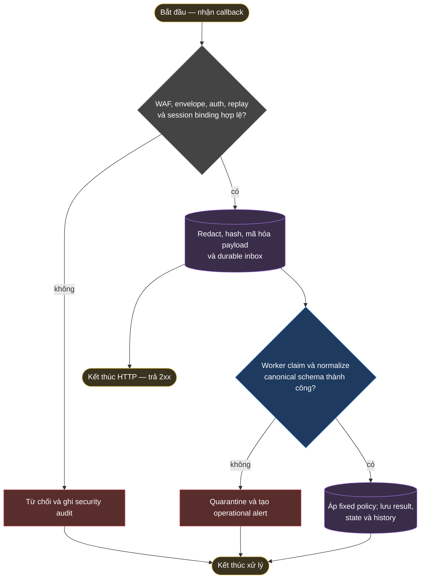
```mermaid
flowchart TD
    START(["Bắt đầu — nhận callback"]):::entity
    VERIFY{"WAF, envelope, auth, replay<br/>và session binding hợp lệ?"}:::infra
    REJECT["Từ chối và ghi security audit"]:::sensitive
    INBOX[("Redact, hash, mã hóa payload<br/>và durable inbox")]:::datastore
    ACK(["Kết thúc HTTP — trả 2xx"]):::entity
    NORMALIZE{"Worker claim và normalize<br/>canonical schema thành công?"}:::bc
    QUARANTINE["Quarantine và tạo operational alert"]:::sensitive
    PERSIST[("Áp fixed policy; lưu result,<br/>state và history")]:::datastore
    DONE(["Kết thúc xử lý"]):::entity

    START --> VERIFY
    VERIFY -->|không| REJECT --> DONE
    VERIFY -->|có| INBOX
    INBOX --> ACK
    INBOX --> NORMALIZE
    NORMALIZE -->|không| QUARANTINE --> DONE
    NORMALIZE -->|có| PERSIST --> DONE

    classDef bc fill:#1f3a5f,stroke:#4a90d9,color:#fff;
    classDef entity fill:#3a3320,stroke:#d9b84a,color:#fff;
    classDef datastore fill:#3a2d4a,stroke:#a06fd9,color:#fff;
    classDef sensitive fill:#5a2d2d,stroke:#d96f6f,color:#fff;
    classDef infra fill:#444,stroke:#aaa,color:#fff;
```

### 4.3.3. Authentication và Idempotency

| **Control** | **Yêu cầu** |
| --- | --- |
| Authentication | Dynamic Bearer Token ngắn hạn theo callback contract; Fixed Token cần ANBM risk acceptance |
| Token control | Validate token endpoint contract/issuer, audience hoặc resource scope, expiry và environment binding |
| Replay | Event ID/nonce nếu provider có; fallback result version/payload hash theo contract |
| Dedupe key 1 | `provider + providerEventId` |
| Dedupe key 2 | `provider + clientUuid + resultVersion/payloadHash` theo contract |
| Ack | Durable inbox trước 2xx |
| Token rotation | Overlap old/new token/key material, revoke và rollback runbook |

Authentication failure không insert business result và không thay đổi session.
Duplicate đã durable trả 2xx nhưng không normalize/finalize lần hai.

### 4.3.4. Callback response

| **HTTP** | **Khi dùng** | **Provider action kỳ vọng** |
| --- | --- | --- |
| 200/202 | Durable receive hoặc duplicate đã nhận | Dừng retry |
| 400 | Schema/envelope không hợp lệ | Không retry cùng payload |
| 401/403 | Callback token/scope/expiry sai | Sửa credential/config, security alert |
| 429 | VHM rate limit theo contract | Retry backoff |
| 500/503 | Chưa durable receive | Retry theo provider contract |

## 4.4. Provider Adapter API

```text
proxyInitSession(context, requestStream) -> responseStream
proxyOcr(context, multipartStream) -> responseStream
proxyLiveness(context, multipartStream) -> responseStream
getResult(clientUuid) -> ProviderResult
normalizeResult(providerResult) -> CanonicalVerificationResult
mapError(providerError) -> CanonicalProviderError
```

Provider Adapter phải:

- Cô lập endpoint, credential, timeout, payload và error code.
- Chỉ tích hợp một SDK/provider đã được phê duyệt.
- Không để DTO provider đi vào controller hoặc VHM internal contract.
- Không log request/response raw.
- Dùng streaming/backpressure, timeout, bounded retry phù hợp, circuit breaker và metrics.
- Không tự retry init/OCR/liveness sau khi đã bắt đầu gửi body; retry media là whole
  attempt do SDK/session policy điều khiển để tránh gửi lặp hoặc ghép chéo ảnh.
- Get Result chỉ được gọi bởi Reconciliation Job.

### 4.4.1. Timeout/Retry Baseline

| **Operation** | **Timeout** | **Retry** |
| --- | --- | --- |
| SDK init session proxy | Connect 2s; response timeout theo SDK contract | Chỉ retry trước khi gửi body và khi contract xác nhận idempotent |
| OCR/liveness streaming | Connect 2s; upload/upstream timeout theo provider contract | Không transparent retry sau khi body bắt đầu; whole-attempt retry |
| Get Result | Connect 2s, read 5s | Bounded theo reconciliation policy |
| Callback ack | `<= 2s` sau durable inbox | Provider retry nếu không nhận 2xx |

Không retry tự động cho 4xx business/schema. 401/403 phải alert Critical.

## 4.5. Canonical Result Contract

```json
{
  "provider": "DEFAULT_EKYC",
  "providerSessionId": "external-session-reference",
  "schemaVersion": "1.0",
  "journey": "FULL_EKYC",
  "document": {
    "type": "NATIONAL_ID_CHIP",
    "status": "PASSED",
    "fields": [
      {
        "name": "DOCUMENT_NUMBER",
        "value": "<encrypted-value>",
        "maskedValue": "******1234",
        "confidence": 0.98,
        "status": "VALID"
      }
    ],
    "qualityWarnings": []
  },
  "liveness": {
    "status": "PASSED"
  },
  "faceMatch": {
    "status": "MATCHED"
  },
  "providerConclusion": {
    "status": "PASSED",
    "reasonCodes": []
  },
  "decision": {
    "ocrOutcome": "PASSED",
    "ekycOutcome": "VERIFIED",
    "platformStatus": "VERIFIED",
    "policyVersion": "identity-policy-1.0"
  }
}
```

### 4.5.1. Normalization rules

- External session/environment phải khớp verification mapping.
- Critical fields thiếu hoặc sai type phải quarantine/alert.
- Optional/new fields được bỏ qua an toàn và không làm parser fail.
- Date/boolean/score parse strict và validate range trước khi lưu.
- Provider code chỉ lưu audit có kiểm soát; API trả canonical code.
- Không tự động fetch resource URL.
- Callback payload chỉ lưu mã hóa tạm thời trong inbox và purge theo TTL.
- `ocrOutcome` và `ekycOutcome` luôn tách riêng.

## 4.6. Decision Mapping

### 4.6.1. Baseline

| **Input/result condition** | **Platform status** | **Next action** |
| --- | --- | --- |
| OCR_ONLY: document pass và đủ fixed required fields | `COMPLETED`, `ocrOutcome=PASSED`, `ekycOutcome=NOT_PERFORMED` | Continue OCR-based flow; không hiển thị identity verified |
| FULL_EKYC: document/liveness/face pass | `VERIFIED` | Continue approved business flow |
| Ảnh mờ/chói/mất góc và còn attempt | `NEED_RETRY` | Retry whole attempt với hướng dẫn cụ thể |
| Camera permission hoặc SDK init lỗi | `NEED_RETRY` theo canonical error policy | User action/retry |
| Provider timeout/429/5xx | Giữ `PROCESSING`; hết recovery budget mới `PROVIDER_ERROR` | Reconciliation trước retry |
| Provider result không kết luận được nhưng không phải lỗi tích hợp | `NEED_RETRY` theo fixed mapping | Retry whole attempt nếu còn quota |
| Definitive official identity/document failure | `REJECTED` | VHM Application hiển thị canonical outcome |
| Callback schema/auth không hợp lệ | Không đổi business state | Operations/security xử lý |
| Không có final result sau recovery budget | `PROVIDER_ERROR` | `CONTACT_SUPPORT` hoặc retry theo policy |

Similarity/score đơn lẻ không đủ tạo `REJECTED`. Fixed mapping phải được
Product/Risk/Architect phê duyệt, version hóa và contract-test.

### 4.6.2. Reason Code Catalogue

| **Canonical reason** | **Ý nghĩa** | **Retryable** |
| --- | --- | --- |
| `DOCUMENT_BLUR` | Ảnh mờ | Có |
| `DOCUMENT_GLARE` | Ảnh chói | Có |
| `DOCUMENT_CROPPED` | Mất góc | Có |
| `DOCUMENT_SIDE_MISSING` | Thiếu front/back trong attempt | Có, whole attempt |
| `DOCUMENT_UNSUPPORTED` | Sai loại giấy tờ | Không |
| `DOCUMENT_EXPIRED` | Giấy tờ hết hạn | Theo policy |
| `LIVENESS_FAILED` | Không đạt liveness | Theo policy |
| `FACE_NOT_MATCHED` | Không khớp khuôn mặt | Theo policy |
| `PROVIDER_TIMEOUT` | eKYC Backend timeout | Có kỹ thuật |
| `PROVIDER_UNAVAILABLE` | eKYC Backend unavailable | Có kỹ thuật |
| `PROVIDER_AUTH_FAILED` | Credential/config lỗi | Không tự retry |
| `PROVIDER_SCHEMA_INVALID` | Payload sai contract | Không tự retry |
| `CALLBACK_AUTH_FAILED` | Callback không xác thực | Không |
| `CALLBACK_REPLAYED` | Callback replay | Không |
| `CAMERA_PERMISSION_DENIED` | Client thiếu quyền camera | User action |
| `UNSUPPORTED_CLIENT` | Mobile/Web SDK không tương thích | Upgrade VHM Application |

# **5. Data Flow & Business Flow**

## **5.1. Data Flow Diagram tổng quát**

### 5.1.1. Control-plane VHM

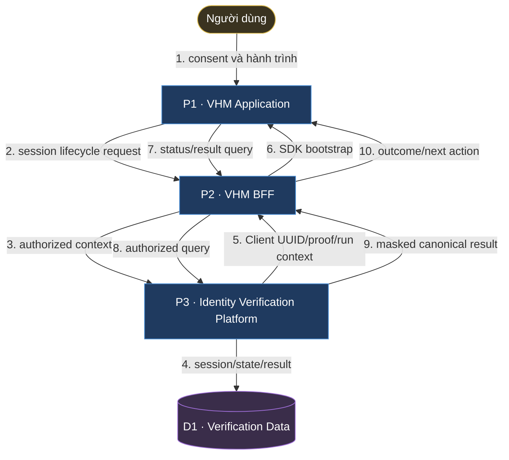
```mermaid
flowchart TB
    USER(["Người dùng"]):::entity
    APP["P1 · VHM Application"]:::process
    BFF["P2 · VHM BFF"]:::process
    IVP["P3 · Identity Verification Platform"]:::process
    DB[("D1 · Verification Data")]:::datastore

    USER -->|"1. consent và hành trình"| APP
    APP -->|"2. session lifecycle request"| BFF
    BFF -->|"3. authorized context"| IVP
    IVP -->|"4. session/state/result"| DB
    IVP -->|"5. Client UUID/proof/run context"| BFF
    BFF -->|"6. SDK bootstrap"| APP
    APP -->|"7. status/result query"| BFF
    BFF -->|"8. authorized query"| IVP
    IVP -->|"9. masked canonical result"| BFF
    BFF -->|"10. outcome/next action"| APP

    classDef entity fill:#3a3320,stroke:#d9b84a,color:#fff;
    classDef process fill:#1f3a5f,stroke:#4a90d9,color:#fff;
    classDef datastore fill:#3a2d4a,stroke:#a06fd9,color:#fff;
```

- VHM BFF xác thực user và authorize `businessRef/subjectRef`.
- Identity Verification Platform sở hữu `verificationId`, state, retry và result.
- Provider credential chỉ tồn tại trong IVP/Secret Manager; BFF không nhận credential.
- Mobile/Web không gọi Provider Get Result API.

### 5.1.2. Data-plane SDK

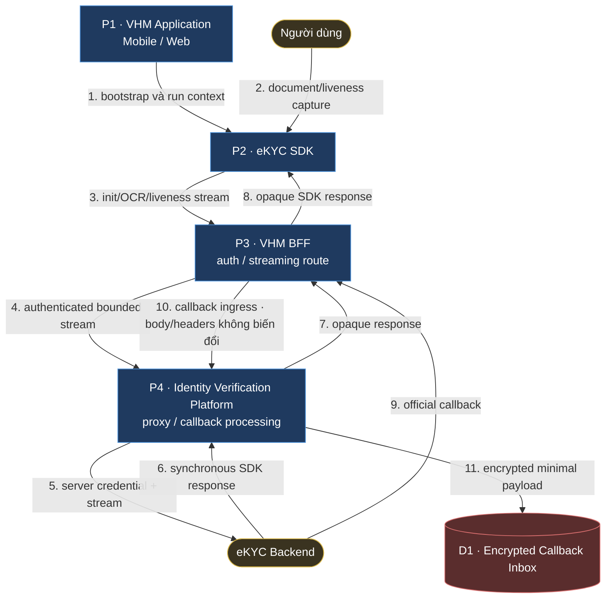
```mermaid
flowchart TB
    USER(["Người dùng"]):::entity
    BACKEND(["eKYC Backend"]):::entity
    APP["P1 · VHM Application<br/>Mobile / Web"]:::process
    SDK["P2 · eKYC SDK"]:::process
    BFF["P3 · VHM BFF<br/>auth / streaming route"]:::process
    IVP["P4 · Identity Verification Platform<br/>proxy / callback processing"]:::process
    INBOX[("D1 · Encrypted Callback Inbox")]:::sensitive

    APP -->|"1. bootstrap và run context"| SDK
    USER -->|"2. document/liveness capture"| SDK
    SDK -->|"3. init/OCR/liveness stream"| BFF
    BFF -->|"4. authenticated bounded stream"| IVP
    IVP -->|"5. server credential + stream"| BACKEND
    BACKEND -->|"6. synchronous SDK response"| IVP
    IVP -->|"7. opaque response"| BFF
    BFF -->|"8. opaque SDK response"| SDK
    BACKEND -->|"9. official callback"| BFF
    BFF -->|"10. callback ingress · body/headers không biến đổi"| IVP
    IVP -->|"11. encrypted minimal payload"| INBOX

    classDef entity fill:#3a3320,stroke:#d9b84a,color:#fff;
    classDef process fill:#1f3a5f,stroke:#4a90d9,color:#fff;
    classDef sensitive fill:#5a2d2d,stroke:#d96f6f,color:#fff;
```

Data-plane trong sơ đồ tuân thủ `DP-01`, `MEDIA-01`, `CRED-01`, `RESULT-01`,
`DATA-01` và `RETRY-01`.

### 5.1.3. Official Result Sequence (L3 supporting)

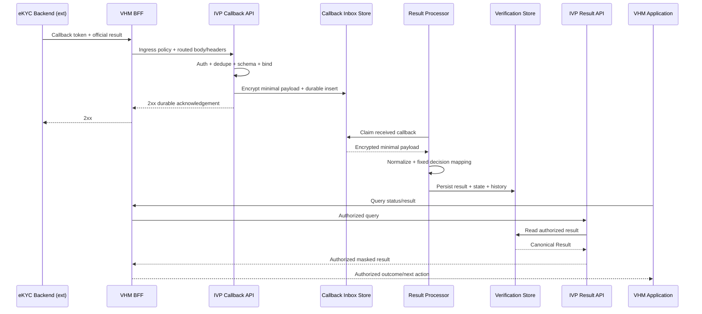
```mermaid
sequenceDiagram
    participant BACKEND as eKYC Backend (ext)
    participant BFF as VHM BFF
    participant CALLBACK as IVP Callback API
    participant INBOX as Callback Inbox Store
    participant PROCESSOR as Result Processor
    participant STORE as Verification Store
    participant RESULT as IVP Result API
    participant APP as VHM Application
    BACKEND->>BFF: Callback token + official result
    BFF->>CALLBACK: Ingress policy + routed body/headers
    CALLBACK->>CALLBACK: Auth + dedupe + schema + bind
    CALLBACK->>INBOX: Encrypt minimal payload + durable insert
    CALLBACK-->>BFF: 2xx durable acknowledgement
    BFF-->>BACKEND: 2xx
    PROCESSOR->>INBOX: Claim received callback
    INBOX-->>PROCESSOR: Encrypted minimal payload
    PROCESSOR->>PROCESSOR: Normalize + fixed decision mapping
    PROCESSOR->>STORE: Persist result + state + history
    APP->>BFF: Query status/result
    BFF->>RESULT: Authorized query
    RESULT->>STORE: Read authorized result
    STORE-->>RESULT: Canonical Result
    RESULT-->>BFF: Authorized masked result
    BFF-->>APP: Authorized outcome/next action
```

## 5.2. Data Flow quan trọng

| **Actor/System thực hiện** | **Hành động nghiệp vụ** | **Thành phần thực hiện** | **Mô tả** |
| --- | --- | --- | --- |
| Người dùng | Đồng ý và bắt đầu xác minh | VHM Application Mobile/Web | Chọn hành trình theo use case đã duyệt; client không tự đổi journey. |
| VHM Application | Khởi tạo phiên và SDK | BFF + Identity Verification Platform | Authorize business object, validate consent/capability và nhận bootstrap ngắn hạn. |
| Người dùng | Cung cấp ảnh giấy tờ/liveness | eKYC SDK | Front/back trong cùng run; `FULL_EKYC` bổ sung liveness/face capture. |
| eKYC SDK | Gửi init/OCR/liveness | VHM BFF → Identity Verification Platform | BFF xác thực/stream; IVP validate session/run, inject credential và stream tới eKYC Backend. |
| eKYC Backend | Xử lý OCR/eKYC | eKYC Backend | Xử lý data-plane và gửi token-authenticated official result. |
| Identity Verification Platform | Chuẩn hóa và hoàn tất kết quả | Callback/Result Processing | Authenticate, dedupe, normalize, áp fixed policy và persist idempotently. |
| VHM Application | Tra cứu và sử dụng kết quả | BFF + Result API | Nhận fixed, authorized, masked outcome/next action theo purpose. |
| Operations | Khôi phục callback thất lạc | Reconciliation Worker | Chỉ Get Result khi callback quá SLA/session treo, theo bounded backoff/quota. |

### **5.2.1. Khởi tạo session — Sequence L2**

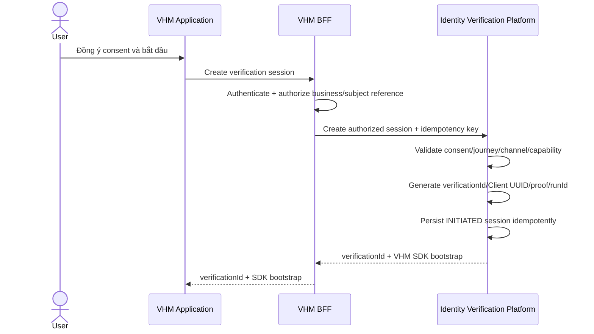
```mermaid
sequenceDiagram
    actor User
    participant APP as VHM Application
    participant BFF as VHM BFF
    participant IV as Identity Verification Platform
    User->>APP: Đồng ý consent và bắt đầu
    APP->>BFF: Create verification session
    BFF->>BFF: Authenticate + authorize business/subject reference
    BFF->>IV: Create authorized session + idempotency key
    IV->>IV: Validate consent/journey/channel/capability
    IV->>IV: Generate verificationId/Client UUID/proof/runId
    IV->>IV: Persist INITIATED session idempotently
    IV-->>BFF: verificationId + VHM SDK bootstrap
    BFF-->>APP: verificationId + SDK bootstrap
```

Create-session failure rules:

- Cùng idempotency key và fingerprint trả session hiện hữu.
- Cùng key khác fingerprint trả `IV_IDEMPOTENCY_CONFLICT`.
- DB/internal failure không được trả bootstrap nếu session chưa persist durable.
- VHM SDK session token ngắn hạn, bind session/run/journey/channel/environment.

### **5.2.2. OCR_ONLY trên Mobile/Web — Sequence L2**

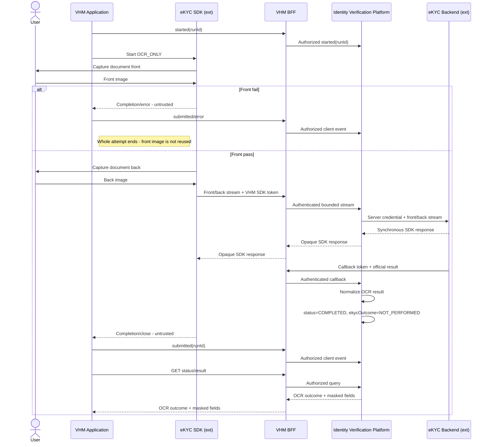
```mermaid
sequenceDiagram
    actor User
    participant APP as VHM Application
    participant SDK as eKYC SDK (ext)
    participant BFF as VHM BFF
    participant IV as Identity Verification Platform
    participant BACKEND as eKYC Backend (ext)
    APP->>BFF: started(runId)
    BFF->>IV: Authorized started(runId)
    APP->>SDK: Start OCR_ONLY
    SDK->>User: Capture document front
    User->>SDK: Front image
    alt Front fail
        SDK-->>APP: Completion/error - untrusted
        APP->>BFF: submitted/error
        BFF->>IV: Authorized client event
        Note right of APP: Whole attempt ends - front image is not reused
    else Front pass
        SDK->>User: Capture document back
        User->>SDK: Back image
        SDK->>BFF: Front/back stream + VHM SDK token
        BFF->>IV: Authenticated bounded stream
        IV->>BACKEND: Server credential + front/back stream
        BACKEND-->>IV: Synchronous SDK response
        IV-->>BFF: Opaque SDK response
        BFF-->>SDK: Opaque SDK response
        BACKEND->>BFF: Callback token + official result
        BFF->>IV: Authenticated callback
        IV->>IV: Normalize OCR result
        IV->>IV: status=COMPLETED, ekycOutcome=NOT_PERFORMED
        SDK-->>APP: Completion/close - untrusted
        APP->>BFF: submitted(runId)
        BFF->>IV: Authorized client event
        APP->>BFF: GET status/result
        BFF->>IV: Authorized query
        IV-->>BFF: OCR outcome + masked fields
        BFF-->>APP: OCR outcome + masked fields
    end
```

Mobile và Web dùng cùng result/state contract. Khác biệt lifecycle chỉ nằm ở client
integration; backend không thay đổi official-result rule.

Two-side processing là hành vi cố định theo contract của SDK/provider và không
được thay đổi động trong runtime:

| **Provider capability** | **Cách Mobile/Web xử lý** | **Failure rule** |
| --- | --- | --- |
| Một lần gửi front + back | SDK thu đủ hai mặt rồi gửi trong cùng `runId` | Bất kỳ mặt nào fail thì whole attempt `NEED_RETRY` |
| Một lần chỉ gửi một mặt | SDK xử lý front trước; front pass mới tiếp tục back trong cùng `runId` | Front fail thì dừng ngay; back không được capture/send. Back fail cũng đóng whole attempt |

Attempt sau phải capture lại từ đầu; không giữ front/back đã pass để ghép với ảnh
của attempt khác.

### **5.2.3. FULL_EKYC trên Mobile — Sequence L2**

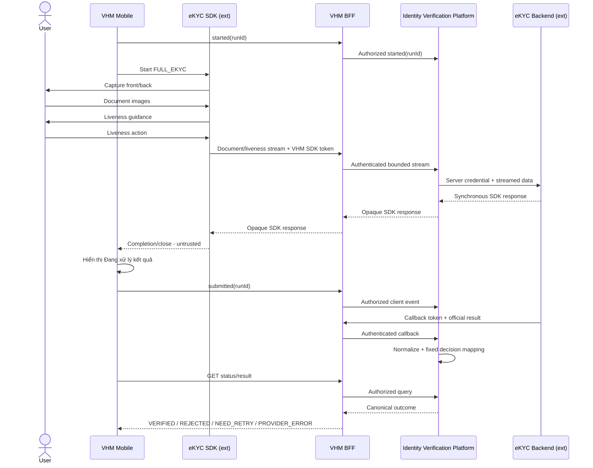
```mermaid
sequenceDiagram
    actor User
    participant APP as VHM Mobile
    participant SDK as eKYC SDK (ext)
    participant BFF as VHM BFF
    participant IV as Identity Verification Platform
    participant BACKEND as eKYC Backend (ext)
    APP->>BFF: started(runId)
    BFF->>IV: Authorized started(runId)
    APP->>SDK: Start FULL_EKYC
    SDK->>User: Capture front/back
    User->>SDK: Document images
    SDK->>User: Liveness guidance
    User->>SDK: Liveness action
    SDK->>BFF: Document/liveness stream + VHM SDK token
    BFF->>IV: Authenticated bounded stream
    IV->>BACKEND: Server credential + streamed data
    BACKEND-->>IV: Synchronous SDK response
    IV-->>BFF: Opaque SDK response
    BFF-->>SDK: Opaque SDK response
    SDK-->>APP: Completion/close - untrusted
    APP->>APP: Hiển thị Đang xử lý kết quả
    APP->>BFF: submitted(runId)
    BFF->>IV: Authorized client event
    BACKEND->>BFF: Callback token + official result
    BFF->>IV: Authenticated callback
    IV->>IV: Normalize + fixed decision mapping
    APP->>BFF: GET status/result
    BFF->>IV: Authorized query
    IV-->>BFF: Canonical outcome
    BFF-->>APP: VERIFIED / REJECTED / NEED_RETRY / PROVIDER_ERROR
```

### **5.2.4. FULL_EKYC trên Web — Sequence L2**

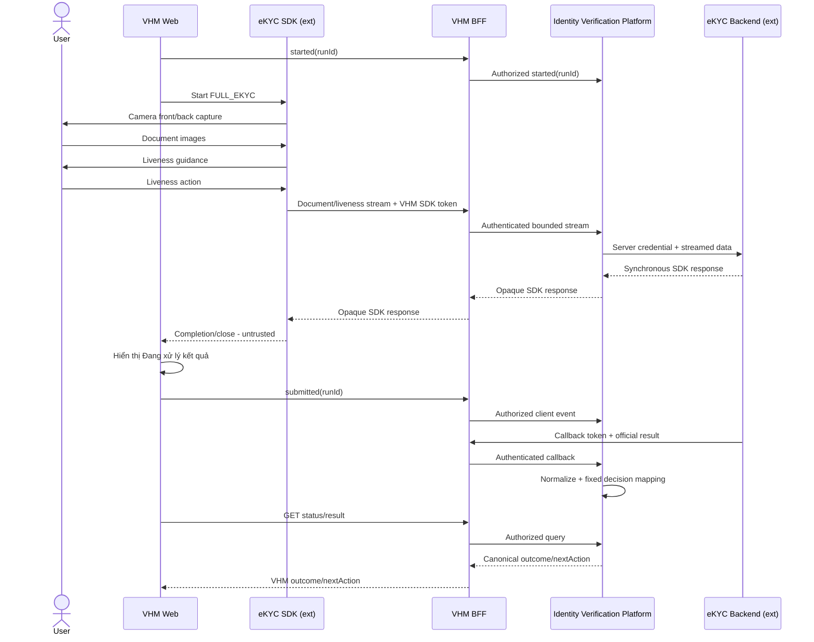
```mermaid
sequenceDiagram
    actor User
    participant WEB as VHM Web
    participant SDK as eKYC SDK (ext)
    participant BFF as VHM BFF
    participant IV as Identity Verification Platform
    participant BACKEND as eKYC Backend (ext)
    WEB->>BFF: started(runId)
    BFF->>IV: Authorized started(runId)
    WEB->>SDK: Start FULL_EKYC
    SDK->>User: Camera front/back capture
    User->>SDK: Document images
    SDK->>User: Liveness guidance
    User->>SDK: Liveness action
    SDK->>BFF: Document/liveness stream + VHM SDK token
    BFF->>IV: Authenticated bounded stream
    IV->>BACKEND: Server credential + streamed data
    BACKEND-->>IV: Synchronous SDK response
    IV-->>BFF: Opaque SDK response
    BFF-->>SDK: Opaque SDK response
    SDK-->>WEB: Completion/close - untrusted
    WEB->>WEB: Hiển thị Đang xử lý kết quả
    WEB->>BFF: submitted(runId)
    BFF->>IV: Authorized client event
    BACKEND->>BFF: Callback token + official result
    BFF->>IV: Authenticated callback
    IV->>IV: Normalize + fixed decision mapping
    WEB->>BFF: GET status/result
    BFF->>IV: Authorized query
    IV-->>BFF: Canonical outcome/nextAction
    BFF-->>WEB: VHM outcome/nextAction
```

Refresh/reopen/multi-tab phải query backend status. Web không lưu VHM SDK session token
dài hạn và không tự tạo run mới khi lease còn active.

### **5.2.5. Callback thành công và duplicate — Sequence L3 supporting**

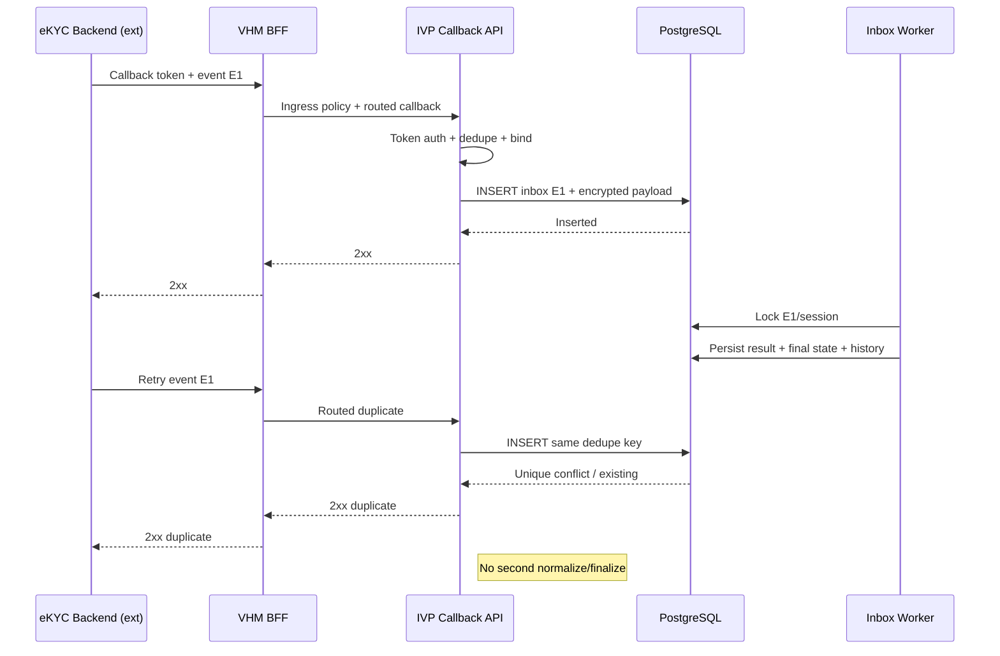
```mermaid
sequenceDiagram
    participant BACKEND as eKYC Backend (ext)
    participant BFF as VHM BFF
    participant CALLBACK as IVP Callback API
    participant DB as PostgreSQL
    participant WORKER as Inbox Worker
    BACKEND->>BFF: Callback token + event E1
    BFF->>CALLBACK: Ingress policy + routed callback
    CALLBACK->>CALLBACK: Token auth + dedupe + bind
    CALLBACK->>DB: INSERT inbox E1 + encrypted payload
    DB-->>CALLBACK: Inserted
    CALLBACK-->>BFF: 2xx
    BFF-->>BACKEND: 2xx
    WORKER->>DB: Lock E1/session
    WORKER->>DB: Persist result + final state + history
    BACKEND->>BFF: Retry event E1
    BFF->>CALLBACK: Routed duplicate
    CALLBACK->>DB: INSERT same dedupe key
    DB-->>CALLBACK: Unique conflict / existing
    CALLBACK-->>BFF: 2xx duplicate
    BFF-->>BACKEND: 2xx duplicate
    Note right of CALLBACK: No second normalize/finalize
```

### **5.2.6. Callback đến trước client submitted — Sequence L2**

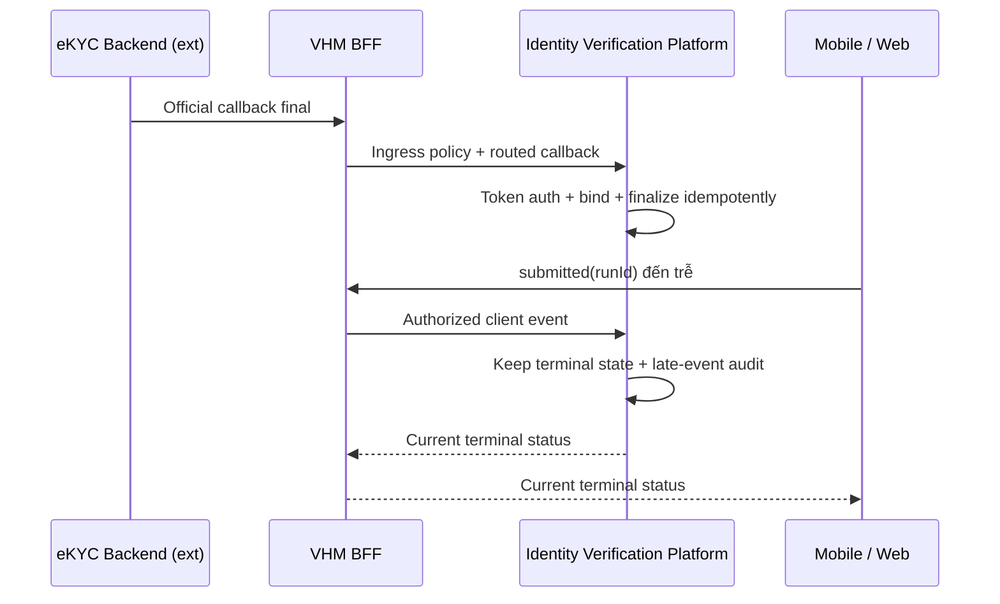
```mermaid
sequenceDiagram
    participant BACKEND as eKYC Backend (ext)
    participant BFF as VHM BFF
    participant IV as Identity Verification Platform
    participant CLIENT as Mobile / Web
    BACKEND->>BFF: Official callback final
    BFF->>IV: Ingress policy + routed callback
    IV->>IV: Token auth + bind + finalize idempotently
    CLIENT->>BFF: submitted(runId) đến trễ
    BFF->>IV: Authorized client event
    IV->>IV: Keep terminal state + late-event audit
    IV-->>BFF: Current terminal status
    BFF-->>CLIENT: Current terminal status
```

Client event không được đảo state hoặc ghi đè official result.

### **5.2.7. Callback thất lạc - Reconciliation — Sequence L3 supporting**

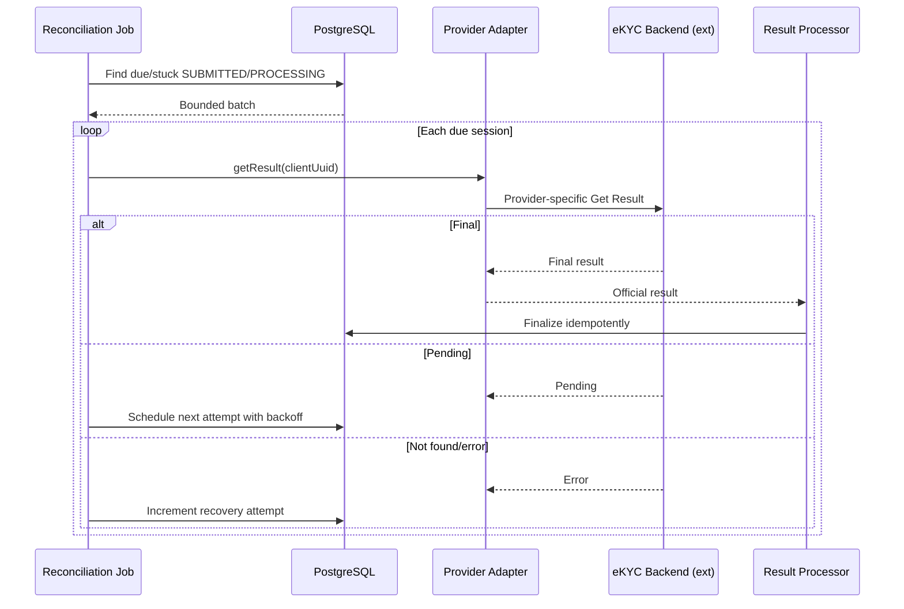
```mermaid
sequenceDiagram
    participant JOB as Reconciliation Job
    participant DB as PostgreSQL
    participant ADAPTER as Provider Adapter
    participant BACKEND as eKYC Backend (ext)
    participant PROCESSOR as Result Processor
    JOB->>DB: Find due/stuck SUBMITTED/PROCESSING
    DB-->>JOB: Bounded batch
    loop Each due session
        JOB->>ADAPTER: getResult(clientUuid)
        ADAPTER->>BACKEND: Provider-specific Get Result
        alt Final
            BACKEND-->>ADAPTER: Final result
            ADAPTER-->>PROCESSOR: Official result
            PROCESSOR->>DB: Finalize idempotently
        else Pending
            BACKEND-->>ADAPTER: Pending
            JOB->>DB: Schedule next attempt with backoff
        else Not found/error
            BACKEND-->>ADAPTER: Error
            JOB->>DB: Increment recovery attempt
        end
    end
```

Callback và reconciliation dùng chung normalizer/state guard và session lock ngắn.
Hết recovery budget mới chuyển `PROVIDER_ERROR`.

### **5.2.8. User cancel/client close**

| **Tình huống** | **Client event** | **Backend action** |
| --- | --- | --- |
| User cancel trước submitted | `cancelled` với canonical reason | Chuyển `CANCELLED` nếu state cho phép |
| Mobile force-close | Có thể không có event | Giữ active đến expiry/reconcile; khi mở lại query status |
| Web refresh/reopen | Có thể không có event | Không auto cancel; query status và kiểm tra run lease |
| Mất mạng | Có thể không có event | Session timeout/reconcile theo policy |
| Official result đến sau cancel | Late result | Lưu late-result audit; không đảo `CANCELLED` |

### **5.2.9. Retry session — Sequence L2**

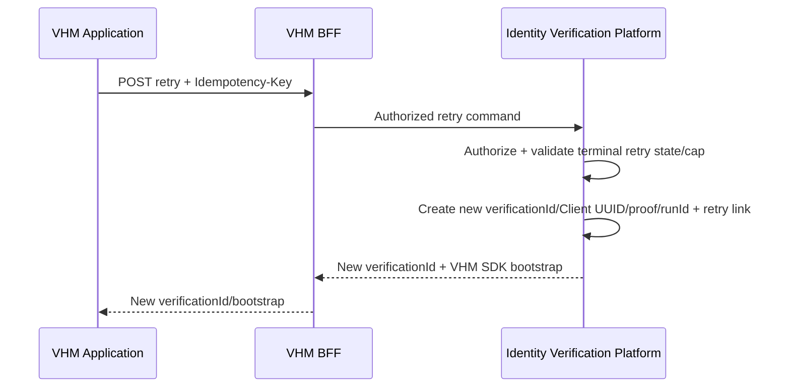
```mermaid
sequenceDiagram
    participant APP as VHM Application
    participant BFF as VHM BFF
    participant IV as Identity Verification Platform
    APP->>BFF: POST retry + Idempotency-Key
    BFF->>IV: Authorized retry command
    IV->>IV: Authorize + validate terminal retry state/cap
    IV->>IV: Create new verificationId/Client UUID/proof/runId + retry link
    IV-->>BFF: New verificationId + VHM SDK bootstrap
    BFF-->>APP: New verificationId/bootstrap
```

Attempt mới không reuse Client UUID, provider session, result, history, token hoặc
ảnh của attempt cũ.

## 5.3. Failure Handling Matrix

| **Tình huống** | **Detection** | **Platform state** | **Recovery/User action** | **Ops** |
| --- | --- | --- | --- | --- |
| Camera permission denied | Client canonical error | `NEED_RETRY` theo policy | Cấp quyền rồi whole-attempt retry | Metric/spike alert |
| Client/SDK unsupported | Compatibility policy | Không start SDK | Upgrade VHM Application | Metric |
| Front hoặc back quality fail | Official result/client error | `NEED_RETRY` | Retry whole attempt; không reuse ảnh pass | Quality metric |
| SDK init/crash | Client canonical error | `NEED_RETRY` | Retry có giới hạn | Alert nếu spike |
| Provider timeout/5xx | Adapter | Giữ `PROCESSING` trong recovery budget | Reconciliation/backoff | Dependency alert |
| Provider 401/403 | Adapter | `PROVIDER_ERROR` | Không tự retry; Ops sửa credential/config | Critical alert |
| Callback auth fail | CallbackAuthenticator | Không đổi business state | Provider sửa auth/retry | Security alert |
| Callback duplicate | Inbox unique key | Giữ state | Trả 2xx | Duplicate metric |
| Callback schema invalid | Schema validation | Không finalize | Provider sửa contract/payload | High alert |
| DB lỗi trước durable inbox | Insert failure | Chưa nhận callback | Provider retry | DB alert |
| DB lỗi sau durable inbox | Worker/inbox status | Giữ inbox pending/failed | Worker reprocess | Backlog alert |
| Callback lost | Reconciliation due | Giữ `SUBMITTED/PROCESSING` | Get Result bounded | Reconcile metric |
| Session stuck hết budget | Recovery counter | `PROVIDER_ERROR` | Contact support/retry theo policy | Incident review |
| Concurrent create | Unique/idempotency guard | Một active session | Trả session hiện hữu/conflict | Metric |
| Result API access sai scope | Authorization | Không đổi state | `403/404` | Security audit |

## 5.4. Data Normalization

- Unicode normalization, trim và collapse whitespace.
- Họ tên giữ dấu; có `searchValue` riêng nếu use case được phê duyệt.
- Date parse strict ISO-8601; không tự đảo ngày/tháng.
- Document number giữ string, không parse số.
- Address không tự suy diễn tỉnh/quận nếu provider không trả mã chuẩn.
- Field source chỉ thuộc fixed allowlist cho OCR result.
- Confidence validate `0..1`; ngoài range phải quarantine/mapping error.
- Boolean/string parse strict allowlist, không dùng truthy coercion.
- Không dùng `N/A`, empty string và null như cùng một nghĩa nếu contract không quy định.

# **6. Deployment, Technology & Observability**

## 6.1. Environments

| **Environment** | **Purpose** | **Availability** | **Infrastructure** | **Internet exposure** | **Data type** | **HA/DR** | **Key differences/constraints** |
| --- | --- | --- | --- | --- | --- | --- | --- |
| Development | Phát triển và unit/component integration | Theo giờ làm việc/platform standard | VHM non-production AWS/EKS | Không public; egress sandbox theo allowlist | Synthetic only | Không yêu cầu DR | Có thể dùng provider mock; không dùng production credential/data. |
| SIT | Contract, DB integration, callback và security integration | Theo test window được duyệt | Isolated non-production AWS/EKS | Ingress restricted; provider staging only | Synthetic/masked test data | Restore test theo kế hoạch | Callback key/endpoint riêng; cấu hình gần production. |
| UAT | Product/UX/Risk/Privacy acceptance trên Mobile và Web | Theo UAT plan | Production-like non-production environment | Restricted tester access | Synthetic hoặc approved masked data | Theo platform non-prod standard | Provider staging; fixed journey/document/profile như production candidate. |
| Pre-production | Performance, recovery, deployment và final release validation | Theo release plan | Production-like topology, capacity nhỏ hơn | Restricted | Synthetic/masked; cấm production PII nếu chưa phê duyệt | Multi-AZ/restore drill theo test scope | Cùng artifact/config schema với production; credential riêng. |
| Production | Vận hành OCR/eKYC chính thức | Theo SLA/SLO được phê duyệt | AWS Singapore, EKS, RDS/Redis managed services | WAF/API ingress; workload/data private | Production personal data theo approved purpose | Multi-AZ, PITR và DR policy | Provider production endpoint; mọi thay đổi qua approval/canary/rollback. |

Availability window chi tiết, quyền truy cập và platform-standard version là
approval input tại Appendix A; không được dùng production data ở non-production
nếu chưa có phê duyệt Data Privacy bằng văn bản.

## **6.2. Production Deployment Diagram**

```mermaid
flowchart TB
    CLIENT(["VHM Mobile / Web<br/>+ eKYC SDK"]):::entity
    PROVIDER(["eKYC Backend (ext)"]):::entity

    subgraph LZ["AWS Landing Zone — Singapore (ap-southeast-1)"]
        subgraph ACCOUNT["VHM Production Account"]
            subgraph VPC["V-App VPC — trust boundary · Multi-AZ"]
                subgraph AZ["Availability Zone đại diện (×2)"]
                    subgraph EDGE["DMZ / Public subnet"]
                        GATEWAY["CDN / WAF / API Gateway<br/>Nginx Ingress"]:::infra
                    end
                    subgraph APPZONE["Private subnet — Amazon EKS"]
                        BFF["VHM BFF<br/>control + streaming ingress"]:::bc
                        IVP["Identity Verification Platform<br/>API · SDK proxy adapter · Callback · Workers"]:::bc
                    end
                    subgraph DATAZONE["Data subnet — isolated"]
                        RDS[("Identity PostgreSQL<br/>RDS Multi-AZ")]:::datastore
                        REDIS[("ElastiCache Redis<br/>ephemeral only")]:::datastore
                    end
                end
            end
            subgraph SHARED["Regional shared managed services"]
                SECRET["Secrets Manager / KMS"]:::infra
                OBS["Metrics / Logs / APM"]:::infra
            end
        end
    end

    CLIENT -->|HTTPS ingress| GATEWAY
    PROVIDER -->|callback token + official result| GATEWAY
    GATEWAY -->|route VHM and SDK requests| BFF
    BFF -->|workload identity + bounded stream| IVP
    IVP -->|read/write/claim| RDS
    IVP -->|rate/replay state| REDIS
    IVP -->|provider credential/key ref| SECRET
    BFF -.->|metadata-only telemetry| OBS
    IVP -.->|masked telemetry| OBS
    IVP ==>|init/OCR/liveness stream + Get Result| PROVIDER

    classDef bc fill:#1f3a5f,stroke:#4a90d9,color:#fff;
    classDef entity fill:#3a3320,stroke:#d9b84a,color:#fff;
    classDef datastore fill:#3a2d4a,stroke:#a06fd9,color:#fff;
    classDef infra fill:#444,stroke:#aaa,color:#fff;
```

Sơ đồ vẽ một AZ đại diện; production trải tối thiểu hai AZ. RDS là datastore do
Identity Verification Platform sở hữu. `==>` biểu diễn egress từ VHM trust boundary
tới eKYC Backend; chi tiết giao thức/cổng nằm trong Network Flow Matrix.

### 6.2.1. Network topology

- VHM API và callback ingress đi qua WAF/API Gateway/Nginx Ingress.
- VHM BFF và IVP chạy private trong EKS; chỉ ingress được expose qua WAF/API Gateway.
- SDK data-plane và media transport tuân thủ `DP-01`/`MEDIA-01`.
- RDS, Redis và Secrets/KMS chỉ truy cập qua private network control.
- Chỉ callback route được public cho eKYC Backend và phải có strong authentication.
- Egress tới eKYC Backend dùng allowlist, timeout, circuit breaker và audit.

### 6.2.2. Network Flow Matrix

| **Source** | **Destination** | **Protocol** | **Data** | **Control** |
| --- | --- | --- | --- | --- |
| Mobile/Web | VHM BFF | HTTPS 443 | Session/status/retry/result | JWT, WAF, rate limit |
| Mobile/Web SDK | VHM BFF | HTTPS 443 | Init/OCR/liveness stream | `AUTH-01`, `DP-01`, `MEDIA-01` |
| VHM BFF | IVP | HTTPS/mTLS | Authorized command/query, media stream, callback | `AUTH-01`, `MEDIA-01`, workload identity/timeout |
| IVP | eKYC Backend | HTTPS 443 | Init/OCR/liveness stream, Get Result | `CRED-01`, `RESULT-01`, allowlist/circuit breaker |
| eKYC Backend | VHM BFF → IVP Callback API | HTTPS 443 | Official result | `CALLBACK-01`, WAF |
| IVP/Worker | PostgreSQL | TLS | Session/result/inbox/audit | Security group, DB role, KMS |
| IVP | Redis | TLS | Rate limit/replay/ephemeral cache | Private endpoint, auth, TTL |
| Services | Monitoring/Logging | TLS | Masked telemetry | No PII/secret, access control |

## 6.3. Thành phần lưu trữ dữ liệu

| **Thành phần** | **Công nghệ** | **Dữ liệu** | **Control** |
| --- | --- | --- | --- |
| Verification DB | PostgreSQL Multi-AZ | Session, run, checks, fixed fields, result, history, callback inbox | TLS, KMS, PITR, RBAC |
| Redis | Redis | Rate limit, replay cache và ephemeral state | TTL, private network; không source of truth |
| Secret storage | AWS Secrets Manager/KMS | Provider credential, callback token/client-secret refs, encryption keys | Rotation, workload identity, audit |
| Application memory | Process memory | VHM SDK session token và bounded network chunks | `MEDIA-01`; clear token sau completion/cancel/expiry |
| SDK-flow media | Không persist tại VHM; chỉ transit BFF/IVP | Document image, selfie, liveness video/frame | `MEDIA-01`, `DATA-01`; provider retention theo approved contract |

## 6.4. Cost & Capacity/Performance

### 6.4.1. Capacity/Performance targets

| **Metric** | **Target value** | **Status/remarks** |
| --- | --- | --- |
| Platform availability | `>= 99.9%` theo tháng | Baseline; provider SLA đo riêng. |
| Create session latency | p95 `<= 1s` qua BFF/IVP/DB; không có synchronous eKYC Backend call | Baseline. |
| Status/Result API latency | p95 `<= 300ms` với dữ liệu đã persist | Baseline. |
| Callback durable acknowledgement | `<= 2s` để durable receive và trả 2xx | Baseline; xử lý nặng async. |
| Concurrent sessions Mobile/Web | TBD | Product/Ops cung cấp trước load test. |
| Peak create/status/result TPS | TBD | Product/Ops cung cấp trước capacity sign-off. |
| Callback burst TPS/payload p95-p99 | TBD | eKYC Backend/Ops cung cấp trước callback load test. |
| Concurrent SDK media streams | TBD theo Mobile/Web peak | Bắt buộc đo riêng BFF và IVP trước capacity sign-off. |
| Media size/upload duration p95-p99 | TBD theo OCR/liveness method | Dùng để chốt body limit, timeout, bandwidth, HPA và memory budget. |
| Streaming memory per connection | Theo `MEDIA-01`, không tỷ lệ theo body size | Load/memory/disk evidence. |
| Data volume/growth | TBD theo retention và fixed field set | Data Privacy/Ops/DBA xác nhận. |

### 6.4.2. Capacity inputs bắt buộc trước production

- Daily/peak concurrent session cho Mobile và Web.
- Peak create/status/result TPS.
- Callback burst TPS và payload size p95/p99.
- Concurrent media stream, media size, upload duration và bandwidth p95/p99.
- Tỷ lệ `OCR_ONLY/FULL_EKYC`, retry và reconciliation.
- Provider quota, rate limit, SLA và maintenance window.
- Canonical result/inbox retention và DB growth.
- Mục tiêu p95/p99 theo từng interface.

### 6.4.3. Scaling design

| **Component** | **Scale** | **Signal** |
| --- | --- | --- |
| VHM BFF | HPA; route/pool riêng cho control và SDK data-plane | Request rate, active streams, network throughput, p95 latency, memory |
| Verification API | HPA | CPU, request rate, p95 latency |
| IVP SDK Proxy Adapter | HPA/pool riêng trong IVP deployment | Active streams, upstream latency, timeout, network throughput, bounded-buffer memory |
| Callback API | HPA độc lập | Callback TPS, ack latency, 5xx |
| Inbox Worker | Horizontal worker | Pending count, oldest age, processing latency |
| Reconciliation Worker | Horizontal + bounded lease | Due count/age, provider quota, lock wait |
| PostgreSQL | Multi-AZ + connection pool | CPU, IOPS, connection, lock wait, table/index growth |
| Redis | Managed scale | Memory, eviction, connection, command latency |

Worker claim batch bằng row lock/`SKIP LOCKED` hoặc lease tương đương. Mọi batch
phải bounded và tôn trọng provider quota; không dùng unbounded polling.

### 6.4.4. Cost estimate

| **Component** | **Description/mode** | **Capacity/count** | **Cost** | **Owner/status** |
| --- | --- | --- | --- | --- |
| EKS workload | VHM BFF, IVP API/SDK proxy adapter, Callback API và workers | TBD theo peak TPS + concurrent media streams | TBD | Platform/Ops — trước production readiness |
| RDS PostgreSQL | Multi-AZ, encrypted storage, PITR | TBD theo data volume/IOPS | TBD | DBA/Ops |
| ElastiCache Redis | Rate limit, replay và ephemeral cache | TBD theo peak request/replay window | TBD | Platform/Ops |
| WAF/API Gateway/Ingress | API, SDK media streaming và callback ingress | TBD theo request volume/bandwidth | TBD | Cloud/Ops |
| Network data transfer | Media transit SDK → BFF → IVP → eKYC Backend | TBD theo media size, retry và volume | TBD | Cloud/Ops/Finance |
| Secrets/KMS | Credential, callback key và field encryption | TBD theo key/request count | TBD | ANBM/Cloud |
| Monitoring/Logging/APM | Masked metrics, logs, traces và audit | TBD theo ingestion/retention | TBD | Ops/Data Privacy |
| SDK/provider usage | OCR/eKYC transaction theo journey/attempt | TBD theo volume và retry rate | TBD | Product/Procurement |
| **Total monthly estimate** | AWS + provider usage | — | **TBD** | Finance/Product approval gate |

**AWS Pricing Calculator link:** TBD — Cloud/Ops phải đính kèm estimate được duyệt;
provider commercial cost được quản lý riêng theo hợp đồng và usage quota.

## 6.5. CI/CD Architecture

### 6.5.1. DevSecOps gates

- Compile/unit test và dependency lock validation.
- SCA/license scan cho backend, Mobile, Web và SDK artifact.
- Secret scan, SAST và IaC scan.
- Container vulnerability scan.
- DB migration compatibility/integration test.
- API/provider contract test.
- Mobile/Web client E2E evidence.
- Security/privacy approval gates.
- Immutable artifact promotion; không rebuild giữa environment.

### 6.5.2. Quality gates

| **Layer** | **Nội dung** | **Gate** |
| --- | --- | --- |
| Unit | State guard, idempotency, mapping, masking, retry rules | Critical branches `>=80%` |
| DB Integration | Constraint, index, locking, inbox, history, reconciliation query | Bắt buộc pass |
| Provider Contract | SDK init/OCR/liveness proxy, callback, Get Result và error fixtures | Bắt buộc pass |
| Mobile SDK | Permission, lifecycle, front/back, result page OFF, compatibility matrix | Bắt buộc pass |
| Web SDK | Camera permission, refresh/reopen/multi-tab, front/back, result page OFF | Bắt buộc pass |
| API Security | Authn/authz, domain/object scope, SDK session token, masking, body/rate limit | Bắt buộc pass |
| E2E | Mobile/Web SDK ↔ BFF ↔ IVP ↔ eKYC Backend staging | Happy + failure paths |
| Performance | Control API + concurrent media streaming + callback burst/reconciliation | Đạt NFR và `MEDIA-01` |
| Recovery | DB/provider outage, callback lost, worker restart, PITR | Bắt buộc pass |

### 6.5.3. Deployment strategy

| **Component/service** | **Deployment type** | **Expected downtime** | **Rollback strategy** | **Deployment window** | **Approval required** |
| --- | --- | --- | --- | --- | --- |
| VHM BFF | Canary hoặc rolling | Không dự kiến | Stop rollout, route về immutable artifact trước; giữ route contract tương thích | Theo standard release window | BFF Owner/Ops |
| IVP Verification/Result/SDK Proxy API | Canary hoặc rolling | Không dự kiến | Stop rollout, route về immutable artifact trước; không retry media đang gửi | Theo standard release window | Service Owner/Ops |
| Callback API | Canary/rolling độc lập | Không dự kiến; callback ingress phải luôn available | Route về artifact trước, giữ inbox schema backward-compatible | Tránh provider maintenance window | Service Owner/Ops |
| Inbox/Reconciliation Workers | Rolling với bounded drain | Không ảnh hưởng API; backlog có kiểm soát | Dừng worker mới, deploy artifact trước, resume lease an toàn | Bất kỳ khi backlog trong threshold | Service Owner/Ops |
| Database schema | Expand/contract phased migration | Không hoặc minimal theo approved plan | Backward-compatible code/schema; restore chỉ là phương án cuối | Maintenance window nếu có lock risk | DBA + Architecture |
| Mobile/Web SDK/profile | Controlled cohort theo compatibility matrix | Không downtime backend | Dừng cohort, rollback app/web/config version | Client release window | Product + Client Owner |
| Provider credential/callback token | Overlap rotation | Không dự kiến | Giữ old/new material trong overlap, revoke sau evidence | Coordinated security window | ANBM + eKYC Backend |

Khi incident dependency, có thể dừng create session nhưng tiếp tục nhận callback và
reconciliation nếu các control bảo mật/toàn vẹn vẫn an toàn.

## 6.6. Technology Stack & Justification

| **Area** | **Selected approach** | **Rationale** | **Trade-off/alternative considered** | **Status** |
| --- | --- | --- | --- | --- |
| Backend | Java 25, Spring Boot 4.0.4, Spring Data JPA, Maven | Strong typing, transaction support và phù hợp state/idempotency-heavy service | Go/Node giảm footprint nhưng làm tăng divergence stack và không tạo lợi ích đủ lớn cho contract này | Selected |
| Client integration | VHM Mobile, VHM Web và eKYC SDK được pin version | Hỗ trợ hai kênh đã chốt và cô lập implementation trong SDK | Tự xây capture/liveness bị loại do tăng security, UX và certification scope | Selected |
| System of record | Amazon RDS PostgreSQL 17 Multi-AZ | ACID, unique constraint, locking, history và PITR phù hợp session/callback dedupe | DynamoDB/NoSQL giảm vận hành scale nhưng phức tạp transaction/query và consistency invariant | Selected |
| Ephemeral cache | Amazon ElastiCache Redis 7.4 | Rate limit, replay guard và short-lived cache tách khỏi source of truth | Chỉ dùng PostgreSQL đơn giản hơn nhưng tăng contention/load; Redis không được giữ official state | Selected with boundary |
| Runtime | Amazon EKS + Nginx Ingress Controller | Tách scale API/callback/worker, rolling/canary và dùng V-App cluster | VM/serverless giảm một số ops nhưng lệch runtime baseline và worker/connection model hiện tại | Selected |
| CI/CD | Azure DevOps (TFS) + immutable artifact promotion | Có quality/security gates và không rebuild giữa environment | Manual deployment bị loại do thiếu repeatability/audit | Selected |
| Secret/encryption | AWS Secrets Manager + KMS | Central lifecycle, workload access, encryption và audit | Secret trong ConfigMap/repo/image bị cấm | Selected |
| Observability | Micrometer, Prometheus, Grafana, APM, Fluentd, Elasticsearch | Bao phủ metric/log/trace và error funnel theo channel/journey | Vendor-specific telemetry chỉ được dùng nếu vẫn bảo đảm masking/retention | Selected |
| Resilience | Resilience4j + streaming HTTP client | Timeout, circuit breaker, bounded retry trước body và backpressure cho eKYC Backend Adapter | Transparent retry media bị cấm vì có thể gửi lặp/ghép sai attempt | Selected |
| Region | AWS Singapore (`ap-southeast-1`) — V-App | Bám hạ tầng đã xác định trong solution baseline | Data residency/cross-border vẫn là Data Privacy approval gate | Selected pending privacy evidence |

### 6.6.1. ADR index

Các quyết định kiến trúc chi tiết được lập chỉ mục tại [Appendix B — ADR Log](#appendix-b-adr-log).
ADR là record quản trị riêng; bảng trong tài liệu này chỉ là index/rationale summary.

## 6.7. Configuration Management

### 6.7.1. Application config mẫu

```yaml
identity-verification:
  provider: DEFAULT_EKYC
  document-type: NATIONAL_ID_CHIP
  allowed-channels:
    - MOBILE_APP
    - WEB_APP
  allowed-journeys:
    - OCR_ONLY
    - FULL_EKYC
  session-timeout: 30m
  callback:
    processing-mode: ASYNC_INBOX
    replay-window: 5m
    encrypted-payload-ttl: 24h
  reconciliation:
    initial-delay: 2m
    interval: 1m
    max-attempts: 5
  retry:
    max-whole-attempts: 3
```

Configuration nằm trong versioned repository, không chứa secret, có schema
validation, owner, approval, before/after evidence và rollback.

### 6.7.2. SDK configuration baseline

| **Nhóm** | **Baseline** | **Owner** |
| --- | --- | --- |
| Channels | Mobile và Web | Product/Client Teams |
| Journeys | `OCR_ONLY`, `FULL_EKYC` | Product/Risk |
| Document | `NATIONAL_ID_CHIP`, front/back | Product/SDK Team |
| Result page | `OFF`; VHM Application sở hữu post-SDK screen | Product/UX |
| Guidance/progress | `ON` | Product/UX |
| Liveness | Bắt buộc trong `FULL_EKYC` | Product/Risk/Security |
| Screenshot/capture security | Block/detect nơi SDK hỗ trợ | Security/Client Teams |
| Session timeout | 30 phút, đồng bộ backend | Backend/SDK Team |
| Client compatibility | Mobile/Web/SDK matrix được pin version | Client/SDK Teams |

### 6.7.3. Change governance

1. Tạo change ticket và mô tả business/security/privacy impact.
2. Update versioned config/schema/contract fixture.
3. Review Product/Risk/Architect/Security/Privacy theo loại thay đổi.
4. Test sandbox/SIT/UAT trên Mobile và Web liên quan.
5. Canary/controlled rollout và theo dõi metric.
6. Rollback về config/artifact version trước nếu breach threshold.
7. Lưu approval, evidence và effective time.

## 6.8. Observability

### 6.8.1. Metrics

| **Metric** | **Type** | **Labels cho phép** |
| --- | --- | --- |
| `identity_verification_sessions_total` | Counter | journey, channel, status, domain |
| `identity_verification_duration_seconds` | Histogram | journey, channel, final_status |
| `identity_verification_sdk_event_total` | Counter | channel, event, outcome, app_version, sdk_version |
| `identity_verification_callback_total` | Counter | auth_result, processing_result |
| `identity_verification_callback_latency_seconds` | Histogram | provider |
| `identity_verification_callback_duplicate_total` | Counter | provider |
| `identity_verification_provider_request_total` | Counter | operation, outcome |
| `identity_verification_provider_latency_seconds` | Histogram | operation |
| `identity_verification_sdk_proxy_active_streams` | Gauge | component, operation, channel |
| `identity_verification_sdk_proxy_bytes` | Histogram | direction, operation, channel |
| `identity_verification_sdk_proxy_duration_seconds` | Histogram | component, operation, outcome |
| `identity_verification_sdk_proxy_buffer_bytes` | Gauge | component |
| `identity_verification_reconciliation_due` | Gauge | provider |
| `identity_verification_retry_total` | Counter | journey, channel, reason_category |
| `identity_verification_inbox_failed` | Gauge | failure_category |

Không dùng verification ID, business/subject reference hoặc PII làm metric label.

### 6.8.2. Logging

Log cho phép: timestamp, service/environment/version, internal verification ID theo
access policy, trace ID, operation, canonical error, provider HTTP status/duration,
channel và app/SDK version. Không log credential, token, CCCD, normalized fields,
media, raw callback, resource URL hoặc biometric score gắn với danh tính.

### 6.8.3. Alerts

| **Alert** | **Trigger** | **Severity** |
| --- | --- | --- |
| Callback authentication/replay failure | Bất kỳ production hoặc tăng đột biến | Critical/High |
| Provider authentication failure | 401/403 liên tục | Critical |
| Provider availability | Error rate vượt threshold trong 5 phút | High |
| Callback schema/mapping error | Có lỗi kéo dài hoặc sau provider change | High |
| Callback Inbox backlog | Oldest age vượt SLA | High |
| Reconciliation backlog | Oldest due age vượt SLA | High |
| SDK init/crash spike | Tăng theo channel/app/sdk version | High/Medium |
| SDK proxy saturation | Active streams/network/memory hoặc timeout vượt threshold | High |
| Media control violation | Phát hiện body log, temp file/disk spool hoặc buffer vượt hard limit | Critical |
| Retry/error spike | Vượt journey/channel baseline | Medium/High |
| DB connection/lock saturation | Vượt infrastructure threshold | High |

### 6.8.4. Monitoring standard and SLI/SLO

Referenced VHM monitoring/logging standard và version phải được gắn tại metadata;
cho tới khi artefact này được cung cấp, các SLI/SLO dưới đây là solution baseline.

| **Critical journey/service** | **SLI** | **SLO/target** | **Measurement/exclusion** |
| --- | --- | --- | --- |
| Create verification session | Successful authorized requests và p95 latency | Availability theo platform `>=99.9%`; p95 theo mục 6.4.1 | Chỉ gồm BFF/IVP/DB; không có synchronous eKYC Backend call. |
| SDK data-plane proxy | Successful upstream response, active streams, upload/upstream latency và timeout | Target cụ thể theo mục 6.4.1/provider SLA | Đo riêng BFF và IVP; không dùng media/body/PII làm metric label. |
| Status/Result API | Success rate, p95/p99 và authorization deny rate | p95 `<=300ms` với persisted result | Không tính caller cancellation; 4xx business/auth đo riêng. |
| Callback ingress | Durable acknowledgement rate/latency | 2xx durable ack `<=2s`; auth failure luôn alert | Duplicate hợp lệ đo riêng, không tính là business failure. |
| Callback processing | Oldest inbox age, processing success và quarantine count | Threshold cụ thể TBD theo callback SLA | Không dùng PII/provider session làm metric label. |
| Reconciliation | Due backlog age, recovered-session rate và provider error rate | Hoàn tất trong provider retention/recovery budget | Threshold/budget do Ops/eKYC Backend duyệt. |
| Mobile/Web journey | Start→submit→official outcome funnel theo channel/version | Baseline và alert threshold TBD sau UAT/performance test | Không gửi OCR field/media/token vào analytics. |

Telemetry volume, retention và cost phải nằm trong cost estimate; sai lệch khỏi
monitoring standard cần Architecture/Ops/Data Privacy phê duyệt.

# **7. Security & Data Privacy**

> Security và Data Privacy là go-live gate. Tài liệu chỉ xác định baseline kỹ thuật;
> ANBM, Data Privacy và Legal phải phê duyệt control/evidence tương ứng.

## 7.1. Security Layers

### 7.1.1. Infrastructure & Network Security

- Mobile/Web API và callback ingress đi qua WAF/API Gateway.
- SDK init/OCR/liveness ingress có route/body-size/timeout riêng và được stream qua BFF/IVP.
- EKS workload, RDS, Redis và Secret Manager không public.
- Network policy/security group theo least privilege.
- Callback route tách rate/body limit với business API.
- Egress tới eKYC Backend theo destination allowlist, TLS và timeout.
- DDoS/bot protection áp dụng theo risk của hành trình public.
- Production không cho debug endpoint, directory listing hoặc default credential.

| **Security item** | **Solution/technology** | **Configuration baseline** | **Scope** |
| --- | --- | --- | --- |
| WAF/API protection | VHM WAF/API Gateway | Managed OWASP rules + SDK-stream/callback-specific rule; exact rule version TBD | Mobile/Web API, SDK data-plane và callback ingress |
| Network segmentation | VPC, public/private/data subnet, security group/network policy | RDS/Redis private; chỉ approved workload được kết nối | Toàn bộ VHM platform |
| Rate limiting | API Gateway/BFF + Redis | Threshold theo caller/interface: TBD trước performance/security test | Create/status/result/retry/callback |
| Request size/depth | WAF, ingress, BFF và schema validator | JSON depth/field-length; media content-type/size/part-count limit theo contract | Mọi JSON và SDK streaming endpoint |
| Bot/abuse protection | WAF/bot control theo risk | Không dùng CAPTCHA trong SDK flow nếu làm hỏng journey; rule cụ thể cần Product/ANBM duyệt | Public user-facing ingress |
| Egress control | Destination allowlist/NAT-egress control | Chỉ eKYC Backend endpoint, TLS và approved port | IVP eKYC Backend Adapter/Reconciliation |
| Secrets management | AWS Secrets Manager/KMS | Workload-based access, rotation/revocation và audit; chu kỳ TBD theo standard | DB/provider/callback/encryption keys |
| DDoS protection | AWS/VHM edge standard | Layer 3/4/7 protection; standard/version TBD | Public ingress |

### 7.1.2. Identity & Access Management

#### Authentication

| **Luồng** | **Cơ chế** |
| --- | --- |
| Mobile/Web → BFF | OIDC/JWT qua VHM Core IAM |
| eKYC SDK → BFF | VHM SDK session token bind `verificationId/runId/journey/channel/expiry` |
| BFF → IVP | Workload identity/JWT hoặc mTLS + authorized context |
| eKYC Backend → BFF → IVP Callback | Dynamic Bearer Token; Fixed Token cần ANBM risk acceptance |
| IVP → eKYC Backend | Provider credential lấy từ Secret Manager theo contract |
| IVP → RDS/Redis/Secrets | Workload role, private network và least privilege |

- Validate issuer/audience hoặc resource scope, expiry, token type và clock skew khi token contract cung cấp.
- Không dùng shared Basic Auth cho internal S2S.
- Không đưa provider API key/app secret xuống BFF, Mobile/Web hoặc SDK.
- VHM SDK session token TTL ngắn, bind session/run/journey/channel/environment.
- Callback token/key rotation phải overlap old/new material và có rollback runbook.

#### Authorization

- Caller phải đúng domain và có quyền với `businessRef/subjectRef`.
- BFF không được tin domain/subject từ body; lấy từ security principal/context.
- Result/status/history API enforce object-level authorization chống IDOR.
- Fixed result fields và mask policy áp thống nhất cho caller đã được phê duyệt.
- Unmask yêu cầu elevated scope, reason và access audit.
- Ops reprocess/retry cần role riêng và reason; không được sửa official result.

**Ma trận phân quyền chức năng**

| **Role/Principal** | **Create/Start** | **Status** | **Masked Result** | **Retry** | **Reprocess/Reconcile** | **Unmask/Export** | **Config/Policy** |
| --- | --- | --- | --- | --- | --- | --- | --- |
| End User qua VHM Application | Theo own subject/business object | Own scope | Chỉ UX field tối thiểu | Theo eligibility/cap | Không | Không | Không |
| Business Operator | Không | Assigned object scope | Masked only | Có reason nếu được giao | Không | Không | Không |
| Platform Operator | Không | Operational metadata | Không mặc định | Controlled operation + reason | Có role riêng + audit | Không | Không |
| Auditor/Security/Privacy Reviewer | Không | Read-only theo audit scope | Masked/audit view | Không | Không | Chỉ khi có elevated approval | Read-only approved evidence |
| Configuration Approver | Không | Không | Không | Không | Không | Không | Approve/version/rollback theo segregation of duties |

**Cơ chế enforcement theo component**

| **Module/component** | **Authorization mechanism** | **Mô tả enforcement** |
| --- | --- | --- |
| VHM BFF | JWT/VHM SDK session token validation, scope/rate/body-size policy | Thực thi `AUTH-01`; route control/media request. |
| Verification/Result API | Method policy + object-level authorization | Kiểm tra domain/use case, `businessRef/subjectRef`, purpose và caller scope trước read/write. |
| IVP SDK Proxy API | Workload identity + session/run/journey binding | Thực thi `AUTH-01`, `MEDIA-01` và `CRED-01`. |
| Callback API | Callback token + Client UUID/session/environment binding | Provider đã xác thực chỉ được ghi event khớp `verificationId`/Client UUID; không có quyền đọc Result API. |
| Ops endpoints/workers | Workload identity + privileged role + reason | Retry/reprocess/reconcile có audit; không cho sửa official result trực tiếp. |
| PostgreSQL/Redis/Secrets | Workload IAM/DB role/network policy | Least privilege theo workload; support/DBA không mặc định đọc plaintext sensitive field. |

### 7.1.3. Secrets & Credential Management

| **Secret/credential** | **Storage** | **Consumer** | **Rotation/revocation** | **Control** |
| --- | --- | --- | --- | --- |
| Provider API credential | AWS Secrets Manager | IVP eKYC Backend Adapter/Reconciliation | Theo provider contract; emergency revoke runbook | `CRED-01` |
| Callback token/client secret | Secrets Manager/config reference | Callback API/token endpoint | Old/new overlap, revoke sau evidence | Dynamic Token ưu tiên; Fixed Token cần exception và rotation chặt. |
| Workload/DB credential | Workload IAM và managed secret | API/Workers | Platform-managed rotation | Không shared identity; DB role riêng theo workload. |
| Field/inbox encryption key | KMS-CMK | Persistence/crypto adapter | Theo KMS/ANBM standard; version/period TBD | Encrypt/decrypt permission tách theo role, có Cloud audit. |
| VHM SDK session token | Chỉ process/client memory | VHM Application/eKYC SDK, BFF validation | TTL ngắn; hết hạn hoặc revoke theo session/run | Bind environment, journey, channel và run; không lưu dài hạn. |

### 7.1.4. Application Security & Data Protection

#### Zero Trust cho client result

- Không nhận OCR field, decision, provider score, resource URL hoặc media từ client event.
- Nguồn kết quả và điều kiện finalize tuân thủ `RESULT-01`.
- Client event tới sau terminal chỉ ghi audit và không đảo state.

#### Callback Security

- Áp `CALLBACK-01`; cơ chế token, replay key, durable-ack và rotation được định nghĩa
  tại mục 2.3.4 và 4.3.3.
- Callback body vẫn phải qua size/depth/content-type/schema validation trước xử lý business.

#### Mobile Security

- SDK/package/profile pin version và integrity theo Mobile release process.
- Camera permission chỉ yêu cầu khi user bắt đầu journey.
- VHM SDK session token chỉ giữ memory; clear khi completion/cancel/expiry.
- Device-security signal theo approved baseline; không dùng client signal làm identity decision duy nhất.
- Client logging tuân thủ `DATA-01`; token/PII/biometric score không được ghi telemetry.
- Result screen của SDK đặt `OFF`; Mobile hiển thị VHM outcome.

#### Web Security

- SDK artifact/origin được allowlist và pin version theo Web release process.
- Áp CSP, output encoding, dependency integrity và anti-XSS controls theo platform standard.
- Không lưu VHM SDK session/result token trong localStorage hoặc storage dài hạn.
- Refresh/reopen/multi-tab phải query backend status và tuân thủ run lease.
- Camera permission chỉ yêu cầu trong active journey; media handling tuân thủ `MEDIA-01`/`DATA-01`.
- CSRF protection áp dụng theo auth model; CORS chỉ cho origin được duyệt.
- Result screen của SDK đặt `OFF`; Web hiển thị VHM outcome.

#### Transmission & Storage Encryption

- TLS cho mọi network flow.
- RDS, Redis backup và encrypted callback inbox dùng KMS-backed encryption.
- Sensitive normalized fields dùng application/column-level encryption khi cần.
- Credential/key ở Secret Manager, không ở repo/image/ConfigMap/log.

| **Scope** | **Encryption mechanism** | **Algorithm/standard** | **Key/certificate management** |
| --- | --- | --- | --- |
| RDS/backup at rest | Managed volume/snapshot encryption | AES-256 managed encryption | AWS KMS-CMK, access audit; rotation period theo approved standard |
| Callback inbox/fixed sensitive fields | Application/column-level authenticated encryption | AES-256-GCM baseline | KMS envelope encryption; key version lưu cùng ciphertext, plaintext key không export |
| Redis at rest/in transit | Managed encryption + TLS | AWS managed at-rest; TLS 1.2 minimum | Managed certificate/key; Redis không là source of truth |
| Network in transit | HTTPS/mTLS theo hop | TLS 1.2 minimum, TLS 1.3 preferred | Approved CA/ACM, auto-renewal và certificate-expiry alert |
| Mobile/Web SDK → BFF → IVP | HTTPS/mTLS theo hop | TLS 1.2 minimum, TLS 1.3 preferred | VHM certificate/workload identity; `MEDIA-01` |
| IVP → eKYC Backend data-plane | HTTPS | TLS theo approved provider contract | Provider certificate chain, allowlist và credential từ Secret Manager |

#### Data Masking

- Document number mask mặc định, ví dụ `******1234`.
- Họ tên/ngày sinh/địa chỉ mask theo Result API contract và caller purpose.
- Provider code/warning chỉ trả canonical reason cần cho UX/business.
- Internal threshold, raw score và provider payload không expose.
- Support screen chỉ hiển thị dữ liệu tối thiểu và theo object scope.

| **Field/data** | **Default/API mask** | **End User** | **Business Operator** | **Platform Support/Log** | **Unmask rule** |
| --- | --- | --- | --- | --- | --- |
| Document number | `******1234` | Own result tối thiểu nếu UX cần | Masked theo purpose contract | Không log; masked support view | Elevated scope + reason + access audit |
| Full name | Giữ ký tự tối thiểu theo approved UX hoặc mask một phần | Own data theo UX được duyệt | Theo fixed field/purpose | Không log plaintext | Chỉ approved business purpose |
| Date of birth | `**/**/YYYY` hoặc rule được Data Privacy duyệt | Own data nếu cần xác nhận | Masked/default fixed field | Không log plaintext | Elevated scope + reason |
| Address | Chỉ phần cần thiết hoặc mask chi tiết nhà | Own data nếu UX cần | Purpose-bound fixed field | Không log plaintext | Elevated scope + reason |
| Liveness/face score | Không expose raw score | Chỉ outcome/next action | Canonical status/reason cần thiết | Metric aggregate, không identity label | Không hỗ trợ unmask mặc định |
| Raw provider payload/media/resource URL | Không trả | Không | Không | Không log/không support view | Không có quyền unmask qua Result API |
| Token/credential/secret | Redact toàn bộ | Không | Không | Không log | Không bao giờ unmask qua ứng dụng |

#### Input/Output Security

- JSON schema, enum/range/length/depth/content-type validation.
- Reject unknown critical field; optional provider field được bỏ qua an toàn.
- Output encode theo context; `Cache-Control: no-store` cho sensitive response.
- Không tự động fetch provider resource URL.
- Multipart media endpoint/part/metadata/size validation tuân thủ `DP-01`/`MEDIA-01`.
- Error response không chứa stack trace, secret, raw payload hoặc PII.

#### Logging & Audit

- Audit create/start/submit/cancel/retry, callback auth/dedupe, state transition,
  result source, config/policy version, Result API access/unmask và secret rotation.
- Audit append-only/tamper-evident theo platform standard.
- Log/APM/analytics/crash report không chứa PII, credential, token, media hoặc raw result.
- Internal verification ID chỉ được log theo approved access policy.

| **Audit dimension** | **Captured value** |
| --- | --- |
| Who | User/service/workload identity, role/scope và domain; không ghi secret/token. |
| Where | Channel, application/service, environment và correlation/verification ID được phép. |
| What | Create/start/submit/cancel/retry, callback auth/dedupe, state transition, result source, config/policy version, Result API access/unmask và secret rotation. |
| Outcome | Success/deny/error category và canonical reason; không ghi raw provider payload/PII. |
| Integrity | Append-only/tamper-evident storage, restricted access và retention theo audit standard. |

### 7.1.5. Governance & Compliance

- Consent phải purpose-bound, versioned và kiểm tra trước create session.
- DPA/DPIA, data location, subprocessor, retention và deletion evidence là go-live gates.
- SDK/config/decision/retention thay đổi phải version hóa, approval và rollback.
- Provider incident/breach notification SLA và contact matrix phải có trong contract/runbook.
- Không sử dụng OCR/eKYC data ngoài purpose đã consent.

## **7.2. Data Privacy**

### 7.2.1. PII declaration and classification

- [ ] Không xử lý dữ liệu cá nhân.
- [x] **Có xử lý dữ liệu cá nhân**, bao gồm dữ liệu cơ bản và dữ liệu sinh trắc
  học/định danh nhạy cảm trong hành trình `FULL_EKYC`.

| **Loại dữ liệu** | **Phân nhóm** | **Có xử lý?** | **Phạm vi** |
| --- | --- | --- | --- |
| Họ và tên | Dữ liệu cá nhân cơ bản | Có | Fixed OCR field nếu được Product/Data Privacy phê duyệt. |
| Ngày sinh | Dữ liệu cá nhân cơ bản | Có | Fixed OCR field, mã hóa/masking theo purpose. |
| Giới tính | Dữ liệu cá nhân cơ bản | TBD | Chỉ nhận nếu nằm trong approved fixed result set; mặc định không yêu cầu. |
| Địa chỉ/nơi cư trú/quê quán | Dữ liệu cá nhân cơ bản | Có | Fixed OCR field theo use case; không dùng ngoài purpose. |
| Số giấy tờ định danh | Dữ liệu cá nhân cơ bản có rủi ro cao | Có | Mã hóa, mask mặc định và object-level authorization. |
| Opaque subject/business/device-linked ID | Dữ liệu cá nhân nếu liên kết được cá nhân | Có | Dùng correlation/authorization; không nhúng PII vào ID. |
| Ảnh giấy tờ, selfie, liveness video/frame | Dữ liệu cá nhân nhạy cảm/sinh trắc học | Có transit tại BFF/IVP và xử lý tại eKYC Backend | `MEDIA-01`, `DATA-01`; provider xử lý theo contract. |
| Liveness/face-match status và score | Dữ liệu liên quan sinh trắc học | Có | VHM chỉ lưu canonical status/score tối thiểu theo policy được duyệt. |
| Chủng tộc, quan điểm chính trị, tôn giáo, sức khỏe | Dữ liệu cá nhân nhạy cảm | Không | Không thuộc contract OCR/eKYC này. |
| Điện thoại/email/payment data | Dữ liệu cá nhân/nghiệp vụ | Không trong capability này | Dữ liệu nằm ngoài IVP và không được đưa vào SDK result contract. |

Phân loại pháp lý cuối cùng, lawful basis và DPIA/DPA phải được Data Privacy/Legal
phê duyệt; mã hóa không làm dữ liệu mất tính chất dữ liệu cá nhân.

### 7.2.2. Data inventory

| **Data** | **Nguồn** | **Purpose** | **VHM persistence** | **Provider** | **Retention** |
| --- | --- | --- | --- | --- | --- |
| Business/subject opaque ref | VHM BFF | Correlation/authorization | Có | External ref nếu cần | Business/audit policy |
| Consent ref/version/time | VHM Application/Consent | Legal basis/audit | Có | Theo contract | Legal/privacy policy |
| Document fields | eKYC Backend | OCR/autofill/verification | Fixed fields, encrypted/masked | Có xử lý | Purpose-bound |
| Document image front/back | SDK | OCR/verification | Không persist; transit BFF/IVP | Có xử lý | Provider contract, ngắn nhất |
| Selfie/video/frame | SDK | Liveness/face matching | Không persist; transit BFF/IVP | Có xử lý | Provider contract, ngắn nhất |
| Liveness/face status | eKYC Backend | Identity decision | Canonical status tối thiểu | Có xử lý | Purpose/audit policy |
| Provider session/event refs | eKYC Backend | Correlation/dedupe | Có | Có | Operational retention |
| Callback payload | eKYC Backend | Async normalization | Encrypted inbox TTL ngắn; purge sau processing | N/A | Operational minimum |
| App/SDK/channel metadata | Client | Compatibility/operations | Tối thiểu | SDK-dependent | Ops/security policy |
| Audit/history | VHM | Traceability/compliance | Có | Không cần | Audit policy |

### 7.2.3. Data Privacy processing summary

| **Thông tin yêu cầu** | **Baseline của giải pháp** | **Owner/status** |
| --- | --- | --- |
| Chủ thể dữ liệu | Người dùng VHM thực hiện OCR/eKYC trên Mobile/Web | Product/Data Privacy — xác nhận theo use case |
| Vị trí VHM xử lý/lưu trữ | AWS Singapore `ap-southeast-1` | Data residency/cross-border approval: TBD |
| Vị trí eKYC Backend/subprocessor | Theo DPA và data-location evidence của eKYC Backend | Legal/Data Privacy — go-live blocker |
| Số lượng chủ thể/bản ghi | TBD theo forecast volume và retention | Product/Ops — trước capacity/privacy sign-off |
| Tổng dung lượng lưu trữ | TBD theo `DATA-01` và capacity input | DBA/Ops/Data Privacy |
| Truyền sang tổ chức khác | Có — eKYC Backend xử lý document/liveness/face data | DPA, purpose, subprocessor và incident SLA bắt buộc |
| Luồng vị trí | Mobile/Web SDK → VHM BFF → IVP → eKYC Backend; callback → BFF → IVP; kết quả → BFF → VHM Application | Architecture/Data Privacy review |
| Dữ liệu thu thập | Front/back document, selfie/liveness/face data tại SDK flow; fixed canonical fields tại VHM | Fixed field set: TBD approval |
| Mục đích | OCR/autofill và xác minh danh tính theo consented journey/use case | Product/Legal approval |
| Mã hóa lưu trữ | RDS/KMS và field/inbox encryption; media không lưu tại VHM | ANBM approval |
| Quản lý/xoay khóa | AWS KMS/Secrets Manager; rotation period theo approved standard | ANBM/Cloud — version TBD |
| Mã hóa đường truyền | TLS 1.2 minimum, TLS 1.3 preferred; mTLS nơi contract hỗ trợ/yêu cầu | ANBM/Integration |
| Masking | Document number `******1234`; field khác theo role/purpose matrix mục 7.1.4 | Data Privacy/Product approval |
| Retention và tự động xóa | Purpose-bound; inbox TTL ngắn; thời hạn cụ thể TBD theo DPA/business/audit policy | Go-live blocker |
| Data-subject request | Export/delete/anonymize qua BFF-authorized subject/business mapping và provider coordination | Data Privacy/Product/eKYC Backend |
| Anonymization | Chỉ giữ aggregate telemetry không định danh; canonical record xử lý theo retention/legal hold | Data Privacy/Ops |

### 7.2.4. Data Lifecycle DFD (L2)

```mermaid
flowchart TB
    USER(["Người dùng"]):::entity
    APP(["VHM Application"]):::entity
    BACKEND(["eKYC Backend"]):::entity
    CAPTURE["P1 · Mobile/Web SDK Capture"]:::process
    BFF["P2 · VHM BFF<br/>auth / bounded stream"]:::process
    IVP_PROXY["P3 · IVP SDK Proxy<br/>credential injection"]:::process
    CALLBACK["P4 · IVP Callback Processing"]:::process
    NORMALIZE["P5 · Result Normalization"]:::process
    RESULT_API["P6 · Authorized Result API"]:::process
    INBOX[("D1 · Encrypted Inbox<br/>TTL ngắn")]:::sensitive
    RESULT[("D2 · Canonical Result<br/>fixed fields")]:::sensitive

    USER -->|"1. consent-bound capture data"| CAPTURE
    CAPTURE -->|"2. media stream"| BFF
    BFF -->|"3. authenticated bounded stream"| IVP_PROXY
    IVP_PROXY -->|"4. server credential + stream"| BACKEND
    BACKEND -->|"5. callback token + official result"| BFF
    BFF -->|"6. callback ingress · body/headers không biến đổi"| CALLBACK
    CALLBACK -->|"7. encrypted minimal payload"| INBOX
    INBOX -->|"8. claimed provider result"| NORMALIZE
    NORMALIZE -->|"9. canonical fixed fields"| RESULT
    APP -->|"10. status/result query"| BFF
    BFF -->|"11. authorized result query"| RESULT_API
    RESULT -->|"12. scoped canonical fields"| RESULT_API
    RESULT_API -->|"13. masked canonical result"| BFF
    BFF -->|"14. outcome/next action"| APP

    classDef entity fill:#3a3320,stroke:#d9b84a,color:#fff;
    classDef process fill:#1f3a5f,stroke:#4a90d9,color:#fff;
    classDef sensitive fill:#5a2d2d,stroke:#d96f6f,color:#fff;
```

- Media lifecycle tuân thủ `MEDIA-01` và `DATA-01`.
- Provider retention phải đủ cho reconciliation nhưng ngắn nhất theo contract.
- Callback payload chỉ lưu mã hóa tạm thời để async process.
- Canonical sensitive field chỉ lưu nếu nằm trong fixed approved result set.

### 7.2.5. Retention principles

- Session/history retention theo approved business/audit purpose.
- Canonical sensitive fields có retention ngắn nhất theo approved business purpose.
- Callback inbox encrypted payload purge sớm sau processing; metadata/hash theo operational TTL.
- Provider result/media retention theo DPA, reconciliation window và deletion SLA.
- Backup retention không được làm dữ liệu sống lại ngoài policy; deletion có tombstone/evidence.
- Không kéo dài retention chỉ vì mục đích debug/analytics.

### 7.2.6. Data subject request

- Xác minh requester và scope trước export/delete.
- Tìm theo opaque subject/business mapping đã được BFF authorize.
- Export chỉ field được phép, đã mask theo legal/privacy rule.
- Delete/anonymize session/result theo retention/legal hold và ghi audit.
- Gửi provider deletion request khi contract/purpose yêu cầu.
- Backup deletion xử lý theo backup expiry/tombstone policy đã phê duyệt.

### 7.2.7. Access controls

- Service access theo least privilege và business-object scope.
- DBA không mặc định đọc plaintext sensitive fields.
- Unmask và bulk export cần elevated role, reason, approval/audit theo policy.
- Production support không được xem raw callback/media.
- Periodic access review và key/secret rotation evidence bắt buộc.

## 7.3. Threat Model

| **Threat** | **Vector** | **Mitigation** |
| --- | --- | --- |
| Client giả kết quả | Mobile/Web bị sửa gửi result giả | `RESULT-01` |
| Lộ credential | Secret trong client/repo/log | `CRED-01`, secret scanning/rotation |
| Callback spoof | Gọi public callback giả | `CALLBACK-01`, WAF |
| Callback replay/duplicate | Gửi lại event/result | `CALLBACK-01` |
| IDOR/cross-domain | Đổi verificationId/businessRef hoặc giả mạo domain | Object/domain authorization |
| Web XSS lấy token | Script độc hại | CSP, encoding, dependency security, memory-only token |
| Multi-tab/run race | Hai client run cho một session | Server-issued runId, lease, idempotency, state guard |
| Mobile tamper | Modified client/device | SDK integrity/security signal; server official result |
| PII leakage | Log/APM/analytics/crash report | Redaction, allowlist logging, DLP/PII scan |
| Media leakage | BFF/IVP vi phạm media handling | `MEDIA-01`, metadata allowlist, DLP test |
| Provider compromise | Payload/resource độc hại | Schema validation, no URL fetch, fixed mapping, incident runbook |
| Insider unmask | Lạm dụng quyền support | Elevated scope, reason, access audit, periodic review |
| DB restore duplicate | Inbox/result xử lý lại | Unique keys, terminal guard, idempotent worker |
| Dependency outage | Provider/DB unavailable | Circuit breaker, reconciliation, Multi-AZ, backup/recovery |

## 7.4. Security Test Cases tối thiểu

- Callback token thiếu/sai/hết hạn/sai scope và replay/duplicate.
- Duplicate/out-of-order callback và cùng event ID khác payload.
- Callback body quá size/depth, wrong content type và malicious resource URL.
- Cross-domain/business-object create/status/result/retry access.
- Client gửi OCR fields/decision/score/media/token trong submitted/error event.
- Concurrent create/run/retry và stale client event.
- Mobile token persistence, telemetry leakage và SDK integrity evidence.
- Web XSS/CSP/CSRF/CORS, storage leakage và multi-tab run conflict.
- Result API mask/unmask, cache-control và access audit.
- PII/secret scan repo/image/ConfigMap/log/APM/analytics/crash report.
- `DP-01`, `MEDIA-01`, `CRED-01`, `RESULT-01`, `CALLBACK-01`, `DATA-01`,
  `AUTH-01` và `RETRY-01` có automated evidence tương ứng.
- Callback inbox encryption, TTL, purge và backup behavior.
- Key/secret rotation overlap và revoked-key rejection.
- DB/provider outage, callback lost và worker restart.
- Restore test không finalize terminal result lần hai.

# **8. Backup, Recovery & Operational Readiness**

## 8.1. Phạm vi backup

Backup:

- `identity_verification` và retry links.
- Verification run, checks, fixed normalized fields và Canonical Result.
- Callback inbox metadata/encrypted payload còn trong TTL.
- State/access history và reconciliation schedule.
- Versioned non-secret configuration/policy metadata.
- Secret/key references và rotation metadata theo Secret Manager/KMS strategy.

Không backup như business source:

- Mobile/Web/SDK cache.
- Redis ephemeral rate-limit/replay entries.
- VHM SDK session/callback access token.
- Document image, selfie, video/frame liveness của SDK flow.
- Raw provider payload ngoài encrypted Callback Inbox TTL.

## 8.2. Backup strategy

- RDS Multi-AZ, automated backup và PITR.
- Backup encryption bằng KMS và access role riêng.
- Cross-account/cross-region copy theo VHM DR policy nếu được phê duyệt.
- Retention backup phù hợp Data Privacy; không giữ sensitive data vô hạn.
- Restore test định kỳ trên isolated environment với masked/synthetic validation.
- Config versioned repository và immutable artifact registry là nguồn phục hồi deployment.
- Secret/key recovery theo Secrets Manager/KMS runbook; không export plaintext key.

### 8.2.1. Reliability decisions

| **Component/service** | **Reliability pattern** | **Failure handling** | **Backup/recovery consideration** | **Approval required** |
| --- | --- | --- | --- | --- |
| Verification/Result API | Stateless horizontal replicas, readiness và circuit breaker | Timeout/bounded retry cho safe operation; không retry blind mutation | Artifact/config redeploy + RDS recovery | Không nếu theo platform standard |
| Callback API/Inbox | Durable inbox, dedupe key và independent scaling | Durable ack trước async processing; quarantine invalid schema | Inbox nằm trong RDS/PITR nhưng payload tuân thủ TTL | ANBM/Ops cho auth/TTL baseline |
| Reconciliation Worker | Lease/`SKIP LOCKED`, backoff và provider quota guard | Recover callback lost/stuck session; hết budget thành `PROVIDER_ERROR` | Schedule/state phục hồi từ PostgreSQL | eKYC Backend/Ops cho quota/recovery budget |
| PostgreSQL | RDS Multi-AZ, connection pool, PITR | Automatic failover; degrade create/read theo incident mode | Restore drill chứng minh RTO/RPO và idempotency | DBA/Ops |
| Redis | Managed service, TTL và không là source of truth | Cache/replay degradation không được làm sai official state | Có thể rebuild; không yêu cầu business restore | Không |
| eKYC Backend dependency | Timeout, circuit breaker, callback + Get Result reconciliation | Tạm dừng create khi dependency incident; không biến lỗi kỹ thuật thành `REJECTED` | Khôi phục result trong provider retention window | SLA/risk acceptance bắt buộc |

Single point of dependency còn lại là eKYC Backend của một provider; rủi ro và
acceptance được ghi tại Architecture Risk Register.

## 8.3. Recovery Sequence (L3 supporting)

```mermaid
sequenceDiagram
    participant OPS as Operations
    participant RDS as RDS Backup/PITR
    participant DB as Restored PostgreSQL
    participant API as Verification API
    participant INBOX as Inbox Worker
    participant RECON as Reconciliation Worker
    participant BACKEND as eKYC Backend (ext)
    OPS->>RDS: Chọn restore point đã phê duyệt
    RDS->>DB: Restore isolated instance
    OPS->>DB: Validate schema/index/constraint/data integrity
    OPS->>API: Deploy approved artifact/config + bind secrets
    OPS->>API: Smoke test auth/create/status/result
    OPS->>INBOX: Resume pending/failed inbox bounded
    INBOX->>DB: Process idempotently
    OPS->>RECON: Resume due non-terminal sessions
    RECON->>BACKEND: Get Result trong provider retention window
    RECON->>DB: Finalize idempotently
    OPS->>OPS: Verify dashboards/alerts and close recovery
```

Trong recovery có thể tạm dừng create session trong khi callback ingress/inbox và
reconciliation tiếp tục để bảo toàn result đang bay.

## 8.4. RTO & RPO

| **Hạng mục** | **Baseline** | **Ghi chú** |
| --- | --- | --- |
| RTO | `<= 4 giờ` | Bao gồm DB restore, service deploy, validation và worker resume |
| RPO | `<= 15 phút` | Theo PITR/backup configuration được Ops phê duyệt |
| Provider result recovery | Trong provider retention window | Get Result chỉ qua Reconciliation Job |
| Configuration recovery | Versioned repository + approved baseline | Bao gồm Mobile/Web SDK compatibility |
| Secret/key recovery | Secrets Manager/KMS runbook | Rotation/revocation evidence bắt buộc |

RTO/RPO cuối cùng phải được System Owner và Operations xác nhận bằng restore drill.

## 8.5. Recovery verification checklist

- Schema/version/index/constraint đúng.
- Callback route/auth/key hoạt động.
- Create/status/result authorization và masking hoạt động.
- Có thể dừng create trong khi callback/reconciliation vẫn chạy.
- Pending/failed inbox được xử lý bounded và không finalize trùng.
- Non-terminal session được reconcile trong provider retention window.
- Terminal state không bị đảo bởi callback/client event trễ.
- Retry chain, idempotency và active-session constraint còn đúng.
- Callback encrypted payload TTL/purge job resume đúng.
- Dashboard/alerts/incident routing hoạt động.
- Restore log không chứa PII/secret.
- Data retention/deletion job tiếp tục đúng policy.
- Đạt RTO/RPO trong evidence của restore drill.

## 8.6. Operational Readiness

| **Item** | **Baseline/decision** | **Evidence/approval** |
| --- | --- | --- |
| System criticality/security level | Tier 2 — Business Critical; xử lý dữ liệu định danh/sinh trắc học | System Owner + ANBM + Data Privacy |
| RTO/RPO | RTO `<=4h`, RPO `<=15m` | Restore drill và Ops sign-off |
| Blast radius — client channel | Mobile hoặc Web lỗi không được làm hỏng official result của channel còn lại | Channel dashboard/E2E evidence |
| Blast radius — provider | Có thể dừng create mới; callback/reconciliation tiếp tục trong safe mode | Incident mode/runbook và provider escalation |
| Blast radius — callback worker | API vẫn durable receive tới capacity; backlog được alert và bounded drain | Load/restart test |
| DR model | Multi-AZ HA + backup/PITR restore; cross-region/cross-account theo VHM DR approval | DBA/Cloud/Ops approval |
| Operational ownership | Service owner, incident route, on-call/escalation và provider contacts: TBD | Go-live blocker |
| Known exceptions | Một provider; provider SLA/location/retention và organizational-standard version chưa chốt | Risk acceptance hoặc đóng trước approval |

## 8.7. Testing & Quality Strategy

| **Test type** | **Scope** | **Environment** | **Success criterion/release gate** |
| --- | --- | --- | --- |
| System/Integration | State guard, DB constraint/locking, callback auth/dedupe, normalization, masking | Dev/SIT | Critical branches `>=80%`; toàn bộ contract/DB test pass. |
| Provider contract | SDK init/OCR/liveness, callback, Get Result, error/schema evolution fixtures | SIT/provider staging | Pass supported/unsupported/duplicate/timeout cases; no raw payload leakage. |
| Mobile/Web E2E | OCR_ONLY và FULL_EKYC; permission/lifecycle/front-back/result-page OFF | UAT/provider staging | Happy path và failure path cho cả Mobile/Web; official-result rule luôn đúng. |
| Performance/capacity | API p95/p99, callback burst, inbox/reconciliation backlog, DB lock/pool | Pre-production | Đạt NFR và capacity target mục 6.4; không mất/duplicate finalization. |
| Security | AuthN/AuthZ/IDOR, callback token/replay, SDK streaming route, WAF/input, secrets/masking | SIT/Pre-production | Không còn Critical/High finding chưa được risk acceptance. |
| Resilience/chaos | Provider/DB/Redis outage, callback lost, worker restart, stale/duplicate event | Pre-production | State toàn vẹn, bounded recovery, alert đúng và không blind retry. |
| OAT/Recovery | Deploy/rollback, key rotation, PITR restore, backlog drain, dashboard/runbook | Pre-production | Đạt RTO/RPO; Operations sign-off. |
| PAT/UAT | Purpose, consent, UX, fixed fields, decision/retry messages | UAT | Product/Risk/Legal/Data Privacy sign-off. |

Test case chi tiết, automation suite và test data thuộc L3/Test Plan; Appendix C là
release checklist và không thay thế evidence của từng quality gate.

# **9. Risks & Open Issues/Tech Debt**

## 9.1. Architecture Risk Register

| **Risk ID** | **Category** | **Description** | **Business impact** | **Likelihood** | **Severity** | **Mitigation strategy** | **Residual risk** | **Owner** | **Status** |
| --- | --- | --- | --- | --- | --- | --- | --- | --- | --- |
| AR-001 | Availability/Integration | eKYC Backend là một dependency/provider duy nhất | Không tạo mới hoặc hoàn tất eKYC trong thời gian dependency gián đoạn | Medium | High | Circuit breaker, safe-mode stop-create, callback inbox, reconciliation, SLA/escalation | Medium | Product/Ops/eKYC Backend | OPEN — SLA TBD |
| AR-002 | Security | Callback Dynamic/Fixed Token và retry contract chưa có evidence chính thức | Forged/replayed callback có thể làm sai quyết định xác minh | Medium | Critical | Dynamic Token baseline, scope/expiry, replay/dedupe, rotation overlap, contract/security test | Low sau sign-off | ANBM/eKYC Backend | OPEN — go-live blocker |
| AR-003 | Compliance/Data | Data location, subprocessor, retention và deletion SLA chưa được phê duyệt | Vi phạm privacy/cross-border requirement hoặc giữ biometric data quá hạn | Medium | Critical | `DATA-01`, DPA/DPIA, purpose-bound consent và deletion evidence | Medium | Legal/Data Privacy | OPEN — go-live blocker |
| AR-004 | Performance | Concurrent media streams, size/duration, TPS/callback burst và provider quota chưa chốt | Quá tải BFF/IVP/network/inbox hoặc vượt quota/cost | High | High | Capacity inputs, streaming load test, HPA/pool riêng, bounded buffer/worker, quota alert | Medium | Product/Ops | OPEN |
| AR-005 | Compatibility | Mobile/Web/SDK compatibility và lifecycle matrix chưa có evidence | Journey lỗi theo device/browser/version, tăng retry/drop-off | Medium | High | Pin version, preflight, cohort rollout, E2E matrix và rollback | Low/Medium | Client/SDK Teams | OPEN |
| AR-006 | Data/Security | Fixed result field, masking và retention chưa được chốt theo từng approved purpose | Over-collection hoặc lộ PII cho caller không đúng quyền | Medium | High | Fixed schema, allowlist, object authorization, masking/unmask audit | Low sau approval | Product/Business/Data Privacy | OPEN |
| AR-007 | Operations | Reconciliation vượt provider retention/quota khi callback backlog lớn | Session treo hoặc không thể lấy official result | Medium | High | Oldest-age alert, bounded lease/backoff, provider retention SLA, incident drain plan | Medium | Ops/eKYC Backend | OPEN |
| AR-008 | Security/Performance | BFF/IVP vi phạm media handling | Rò rỉ dữ liệu nhạy cảm, memory/disk exhaustion và tăng blast radius | Medium | Critical | `MEDIA-01`, metadata allowlist và load/DLP evidence | Low sau sign-off | BFF/IVP/Ops/ANBM | OPEN — go-live blocker |

## 9.2. Open Issues/Technical Debt Register

| **Debt/Issue ID** | **System** | **Description** | **Reason/trade-off** | **Impact** | **Priority** | **Remediation plan** | **Effort** | **Owner** | **Resolution date** | **Status** |
| --- | --- | --- | --- | --- | --- | --- | --- | --- | --- | --- |
| TD-001 | Identity Verification Platform | L1 và L3 artefact links chưa được cung cấp | L2 được soạn trước khi các spec triển khai hoàn tất | Reviewer/dev khó truy vết contract chi tiết | High | Tạo/link API, client, DB và operations L3 tại metadata | TBD | Document Owner/Tech Leads | Trước implementation sign-off | OPEN |
| TD-002 | Governance | VHM IAM/ANBM/Data Privacy/Observability standard version còn TBD | Chưa nhận canonical standard registry từ owner | Không chứng minh được compliance/deviation theo version | High | Cập nhật metadata và mapping control sau khi owner cung cấp | TBD | Architecture/ANBM/Data Privacy/Ops | Trước L2 approval | OPEN |
| TD-003 | Capacity/Cost | Capacity target, AWS calculator và provider commercial estimate còn TBD | Chưa có forecast volume/quota/retention | Không thể phê duyệt sizing, budget và performance gate | High | Chốt Appendix A inputs, chạy load model và đính kèm cost estimate | TBD | Product/Cloud/Ops/Finance | Trước production readiness | OPEN |

Các item chưa đóng không được ngầm coi là chấp nhận rủi ro. Risk acceptance cần
owner, phạm vi, thời hạn và approver tương ứng được ghi trong phiên bản phê duyệt.

# **Glossary**

| **Thuật ngữ** | **Định nghĩa** |
| --- | --- |
| OCR | Optical Character Recognition - đọc và chuẩn hóa dữ liệu từ ảnh giấy tờ. |
| eKYC | Xác minh danh tính điện tử bằng document verification, liveness và face matching. |
| OCR_ONLY | Journey chỉ đọc front/back; kết thúc `COMPLETED`, `ekycOutcome=NOT_PERFORMED`. |
| FULL_EKYC | Journey OCR front/back → liveness → face matching; pass mới thành `VERIFIED`. |
| VHM Application | Ứng dụng Mobile và Web của VHM tích hợp eKYC SDK. |
| VHM Backend | Ranh giới logic gồm đúng hai application component: VHM BFF và Identity Verification Platform. |
| VHM BFF | Điểm ingress từ Mobile/Web/SDK/eKYC Backend; xác thực, authorize, áp policy và stream request xuống IVP; không giữ provider credential hoặc xử lý eKYC result. |
| eKYC SDK | SDK chạy trên Mobile/Web để điều khiển capture và gửi init/OCR/liveness tới VHM BFF. |
| eKYC Backend | Hệ thống xử lý OCR, liveness và face matching; gửi callback/cung cấp Get Result. |
| Identity Verification Platform | System of record quản lý session/result và integration/proxy point duy nhất gọi eKYC Backend bằng server credential. |
| Provider Adapter | Lớp cô lập API/auth/payload/error của eKYC Backend khỏi VHM contract. |
| Official Result | Kết quả server-to-server từ callback đã xác thực hoặc Get Result qua reconciliation. |
| Canonical Result | Mô hình kết quả chuẩn VHM, không phụ thuộc raw provider payload. |
| Callback Inbox | Bảng durable receive/dedupe, lưu payload tối thiểu đã mã hóa theo TTL. |
| Reconciliation | Job khôi phục callback quá SLA hoặc session treo bằng Provider Get Result. |
| Whole-attempt Retry | Tạo verification/provider session mới; không tái sử dụng result/media của attempt trước. |
| Idempotency Key | Khóa chống tạo trùng khi request được gửi lại. |
| Replay Guard | Event ID/nonce hoặc result version/payload hash ngăn callback bị xử lý lặp theo provider contract. |
| Fixed Result Fields | Bộ field Canonical Result cố định đã được Product/Privacy phê duyệt. |
| Terminal State | `COMPLETED`, `VERIFIED`, `REJECTED`, `NEED_RETRY`, `PROVIDER_ERROR`, `CANCELLED`, `EXPIRED`. |

---

# **Appendix A. External Inputs & Confirmations**

> Các mục dưới đây là input/evidence bắt buộc để hoàn tất implementation và
> approval. Đây không phải lựa chọn kiến trúc còn để ngỏ; thiếu input tương ứng thì
> không được qua gate được ghi trong cột cuối.

## A.1. Business & Scope Inputs

| **Input cần xác nhận** | **Owner** | **Gate/Deadline** |
| --- | --- | --- |
| Domain code/use case/business object được phép tạo session | Product/Business Owner | Trước API contract sign-off |
| Hai journey `OCR_ONLY`, `FULL_EKYC` và channel áp dụng | Product/Risk | Trước SDK profile configuration |
| Document type `NATIONAL_ID_CHIP`, front/back và validation rules | Product/Risk/SDK Team | Trước OCR integration test |
| Fixed result field set và masking cho VHM Application | Product/Business/Data Privacy | Trước Result API contract test |
| Consent text/version/purpose/withdrawal behavior | Product/Legal/Data Privacy | Trước UAT |
| Fixed decision mapping, threshold và reason code UX | Product/Risk/Architect | Trước decision contract test |
| Whole-attempt retry cap, user message và support action | Product/Risk/Ops | Trước failure-path UAT |
| Business owner chịu trách nhiệm sử dụng result | Business Owner | Trước production readiness |

## A.2. Mobile & Web SDK Inputs

| **Input cần xác nhận** | **Owner** | **Gate/Deadline** |
| --- | --- | --- |
| SDK package/version cho Mobile và Web | SDK/Client Teams | Trước integration build |
| Mobile/Web client compatibility matrix | SDK/Client Teams | Trước build/UAT |
| Camera permission, capture UX và quality guidance | SDK/Product/UX | Trước journey UAT |
| Front/back gửi cùng call hay lần lượt; fail-fast semantics | SDK Technical Team | Trước two-side implementation |
| Completion/close/error event và payload contract | SDK Technical Team | Trước client lifecycle integration |
| Result page `OFF` nhưng completion/close event vẫn phát | SDK Technical Team | Trước submitted integration test |
| Liveness/face behavior trong `FULL_EKYC` | SDK/Product/Risk | Trước FULL_EKYC E2E |
| Mobile background/force-close/reopen behavior | Mobile/SDK Team | Trước lifecycle test |
| Web refresh/reopen/multi-tab behavior | Web/SDK Team | Trước lifecycle test |
| Branding, localization, accessibility và security behavior | Product/UX/Client Teams | Trước UAT |

## A.3. eKYC Backend Integration Inputs

| **Input cần xác nhận** | **Owner** | **Gate/Deadline** |
| --- | --- | --- |
| SDK init/OCR/liveness endpoint, multipart field, response và error contract | eKYC Backend/Backend Team | Trước eKYC Backend Adapter build |
| Streaming timeout/body-size/part-count và idempotency/retry semantics | eKYC Backend/Backend Team | Trước proxy/load test |
| Provider credential/header và Client UUID/proof contract | eKYC Backend/ANBM | Trước integration/security test |
| Callback Dynamic Token/Fixed Token, token endpoint, scope/expiry và event/version fields | eKYC Backend/ANBM | Trước callback implementation |
| Callback retry/backoff/ordering/duplicate semantics | eKYC Backend/Backend Team | Trước callback contract test |
| Get Result final/pending/not-found/error/quota contract | eKYC Backend/Ops | Trước reconciliation test |
| Provider result retention window | eKYC Backend/Data Privacy | Trước recovery sign-off |
| Canonical mapping fixtures cho success/failure/quality/technical errors | eKYC Backend/QA | Trước contract test |
| Staging credentials/endpoints/allowlist và certificate chain | eKYC Backend/DevOps/ANBM | Trước SIT |
| SLA, maintenance, incident contacts và escalation | eKYC Backend/Ops | Trước production readiness |

## A.4. Security & Privacy Inputs

| **Input cần xác nhận** | **Owner** | **Gate/Deadline** |
| --- | --- | --- |
| DPA/DPIA, data location và subprocessor list | Data Privacy/Legal | Go-live blocker |
| Consent lawful basis và approved purpose | Data Privacy/Legal/Product | Trước UAT |
| Provider media/result retention và deletion SLA/evidence | Data Privacy/Legal/eKYC Backend | Go-live blocker |
| Callback authentication/replay/key-rotation baseline | ANBM/eKYC Backend | Trước security test |
| Fixed field encryption/masking/unmask access | ANBM/Data Privacy/Business | Trước Result API UAT |
| Log/APM/analytics/crash-report data allowlist | ANBM/Data Privacy/Ops | Trước SIT |
| Mobile/Web security baseline và SDK integrity evidence | ANBM/Client Teams | Trước security sign-off |
| Data-subject export/delete và provider coordination | Data Privacy/Business/eKYC Backend | Trước go-live |

## A.5. NFR & Operations Inputs

| **Input cần xác nhận** | **Owner** | **Gate/Deadline** |
| --- | --- | --- |
| Daily volume, peak create/status/result TPS | Product/Ops | Trước capacity test |
| Concurrent SDK streams, media size/upload duration và bandwidth p95/p99 | Product/eKYC Backend/Ops | Trước streaming load test |
| Callback burst TPS/payload size và provider quota | eKYC Backend/Ops | Trước load test |
| p95/p99 target theo interface và availability SLA | System Owner/Ops | Trước NFR sign-off |
| Reconciliation delay/interval/batch/max attempts | Architect/Ops/eKYC Backend | Trước recovery test |
| Callback inbox TTL/purge và operational retention | Ops/Data Privacy | Trước DB migration sign-off |
| RTO/RPO, PITR, restore frequency và DR owner | System Owner/Ops | Trước production readiness |
| Dashboard/alert threshold, routing và on-call owner | Ops/Service Owners | Trước go-live |
| Cost quota/alert và stop-create rule khi incident | Product/Ops | Trước go-live |

---

# **Appendix B. ADR Log**

Đây là ADR index. Mỗi dòng phải liên kết tới ADR artefact độc lập có context,
options, decision, consequence và approver; trạng thái `Accepted` trong bản DRAFT
không thay thế sign-off chính thức.

| **ID** | **Decision** | **Rationale** | **Impact** | **Status** | **ADR artefact** |
| --- | --- | --- | --- | --- | --- |
| ADR-001 | Identity Verification Platform là capability dùng chung VHM | Tránh từng ứng dụng tích hợp eKYC Backend riêng | Cần ownership và governance tập trung | Accepted baseline | TBD link |
| ADR-002 | Sử dụng một SDK/provider | Giữ integration và operations rõ ràng | Provider contract là dependency chính | Accepted baseline | TBD link |
| ADR-003 | Hỗ trợ Mobile và Web | Đáp ứng hai kênh VHM đã chốt | Cần compatibility/E2E matrix cho cả hai | Accepted baseline | TBD link |
| ADR-004 | Chỉ document `NATIONAL_ID_CHIP`, front/back | Thu hẹp mapping, test và data scope | Loại giấy tờ khác cần cập nhật TDD | Accepted baseline | TBD link |
| ADR-005 | Hai journey `OCR_ONLY` và `FULL_EKYC` | Tách đọc giấy tờ khỏi xác minh danh tính | State/result phải tách OCR/eKYC outcome | Accepted baseline | TBD link |
| ADR-006 | Tuân thủ `RESULT-01` | Chống giả mạo client result | Mobile/Web phải có processing UX | Accepted baseline | TBD link |
| ADR-007 | Callback đã xác thực là official-result ingress chính | Server-to-server trust | Cần callback auth/dedupe/durable inbox | Accepted baseline | TBD link |
| ADR-008 | Get Result theo `RESULT-01` | Khôi phục callback lost/session stuck | Không polling mọi session | Accepted baseline | TBD link |
| ADR-009 | Provider Adapter + Canonical Result | Cô lập provider payload | VHM contract ổn định và fixed schema | Accepted baseline | TBD link |
| ADR-010 | OCR_ONLY pass thành `COMPLETED`, không `VERIFIED` | Tránh khẳng định sai về danh tính | UX/API phải tách outcome | Accepted baseline | TBD link |
| ADR-011 | Retry whole attempt | Giữ history và front/back correlation rõ ràng | Không reuse ảnh/result attempt cũ | Accepted baseline | TBD link |
| ADR-012 | Tuân thủ `MEDIA-01`/`DATA-01` | Kiểm soát data-plane và data minimization | Bắt buộc load/DLP/privacy evidence | Accepted baseline | TBD link |
| ADR-013 | Callback payload mã hóa tạm thời trong inbox | Async durable processing cần payload | TTL/purge/encryption bắt buộc | Accepted baseline | TBD link |
| ADR-014 | Result API dùng bộ field cố định | Đủ Core Integration, dễ phê duyệt | Thay field cần Product/Privacy approval | Accepted baseline | TBD link |
| ADR-015 | PostgreSQL là source of truth | Transaction, locking, dedupe và PITR | Cần index/retention/restore test | Accepted baseline | TBD link |
| ADR-016 | Tuân thủ `DP-01`/`CRED-01` | VHM kiểm soát auth, credential và network audit | BFF/IVP chịu media throughput và cần resource pool tách control/data | Accepted baseline | TBD link |

---

# **Appendix C. Go-live Checklist**

## C.1. Functional

- [ ] Create session idempotent và active-session concurrency.
- [ ] Bootstrap TTL/binding/lease và expired-token reissue.
- [ ] Mobile `OCR_ONLY` front/back pass/fail/whole-attempt retry.
- [ ] Web `OCR_ONLY` front/back pass/fail/whole-attempt retry.
- [ ] Mobile `FULL_EKYC` document/liveness/face pass và failure paths.
- [ ] Web `FULL_EKYC` document/liveness/face pass và failure paths.
- [ ] SDK result page `OFF`; completion/close event vẫn phát.
- [ ] Started/submitted/error/cancel idempotency và late-event handling.
- [ ] Callback trước/sau submitted, duplicate và out-of-order.
- [ ] Callback lost → reconciliation final/pending/not-found/error.
- [ ] `OCR_ONLY → COMPLETED`, `FULL_EKYC → VERIFIED` đúng contract.
- [ ] Definitive failure, recoverable quality và technical error mapping đúng.
- [ ] Result API fixed fields, `RESULT_NOT_READY` và authorization.
- [ ] Whole-attempt retry link/history/cap và không reuse media/result.
- [ ] Mobile background/force-close/reopen.
- [ ] Web refresh/reopen/multi-tab/run lease.
- [ ] `DP-01`, `MEDIA-01`, `CRED-01` pass trên từng Mobile/Web SDK version.

## C.2. Security

- [ ] Không secret trong Mobile/Web/repo/image/ConfigMap/log.
- [ ] `CRED-01` IAM/rotation/secret-scan evidence pass.
- [ ] `CALLBACK-01` auth/scope/expiry/replay/dedupe/rotation evidence pass.
- [ ] Business-scope/object IDOR tests pass.
- [ ] Result API mask/unmask/cache-control/access audit pass.
- [ ] Mobile SDK integrity/token/telemetry controls approved.
- [ ] Web CSP/XSS/CSRF/CORS/storage/multi-tab controls approved.
- [ ] Encrypted Callback Inbox, TTL, purge và backup behavior tested.
- [ ] PII/secret scan sạch trên log/APM/analytics/crash report.
- [ ] Không High/Critical security defect còn mở.

## C.3. Data Privacy

- [ ] Consent purpose/version/withdrawal approved và tested.
- [ ] Fixed result field set và retention được phê duyệt.
- [ ] `MEDIA-01`/`DATA-01` có load/DLP/DB-scan/DPIA/retention evidence đạt.
- [ ] Provider data location/subprocessor/DPA/DPIA approved.
- [ ] Provider retention/deletion SLA và evidence approved.
- [ ] Data-subject export/delete và backup behavior tested.
- [ ] Callback payload TTL/purge evidence đầy đủ.

## C.4. Operations

- [ ] Mobile/Web/SDK compatibility matrix published.
- [ ] Provider quota/SLA/maintenance/incident contacts confirmed.
- [ ] Dashboard/alerts có owner và routing.
- [ ] Capacity/load/callback burst/reconciliation test đạt baseline.
- [ ] Inbox/Reconciliation workers healthy và backlog dưới SLA.
- [ ] Stop-create/rollback/provider incident runbook đã diễn tập.
- [ ] Backup/PITR/restore test đạt RTO/RPO.
- [ ] Key/secret/config rotation runbook đã diễn tập.
- [ ] Retention/purge jobs hoạt động và có alert.
- [ ] Tất cả approval/evidence được lưu theo governance.
