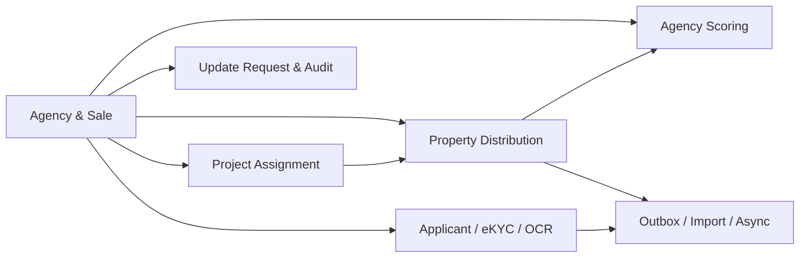
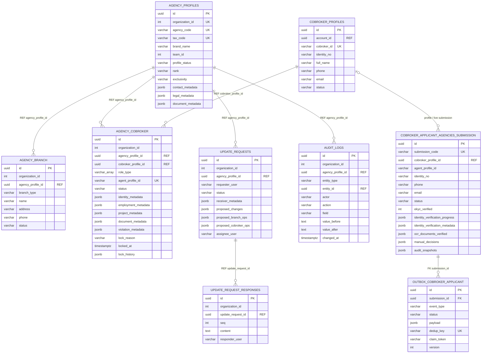
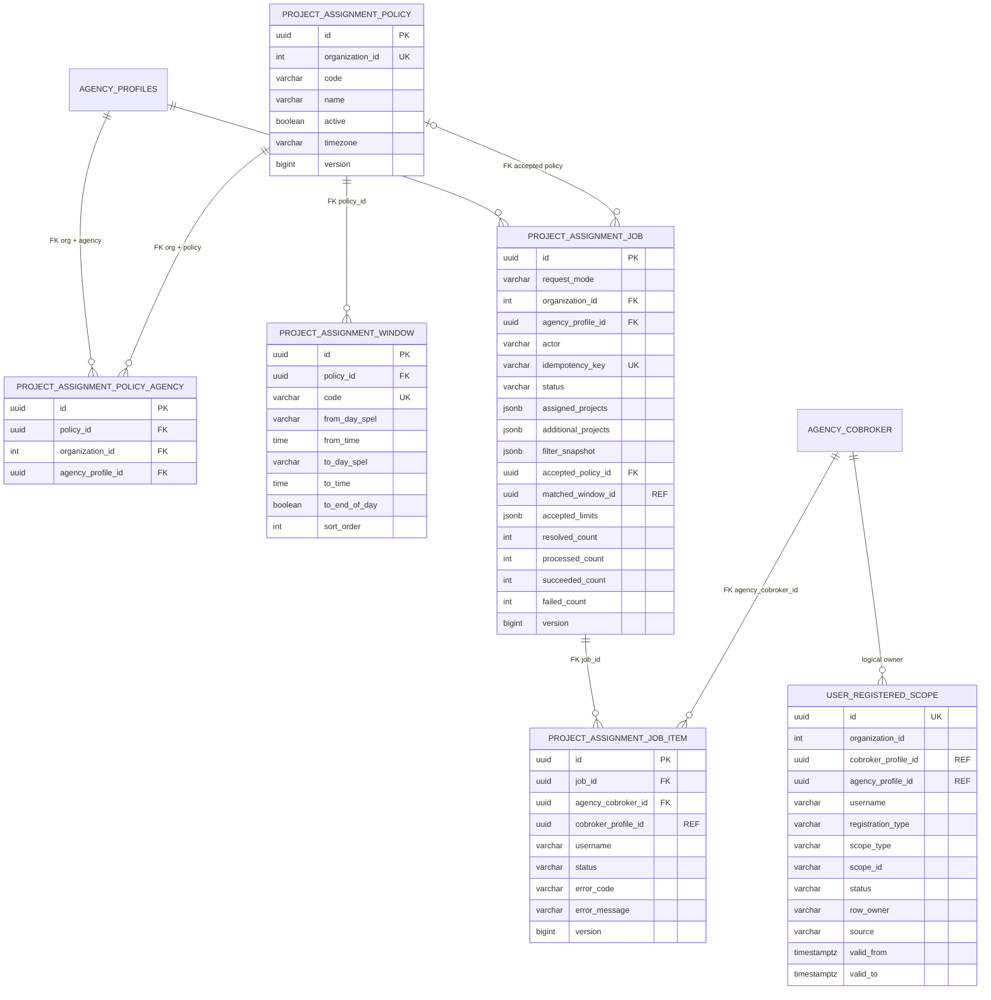
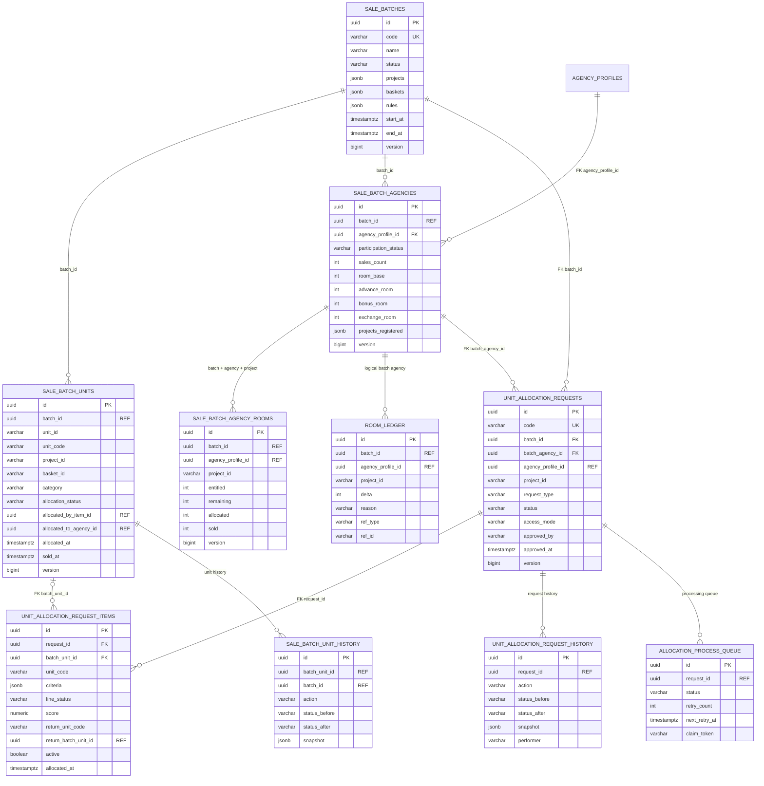
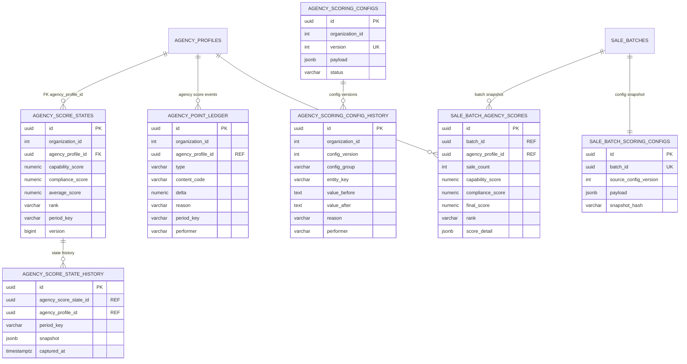
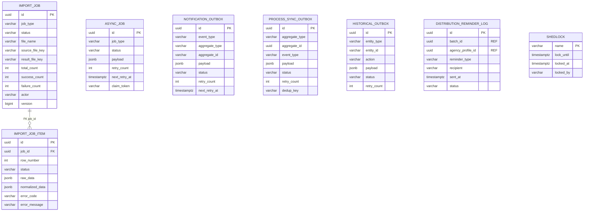
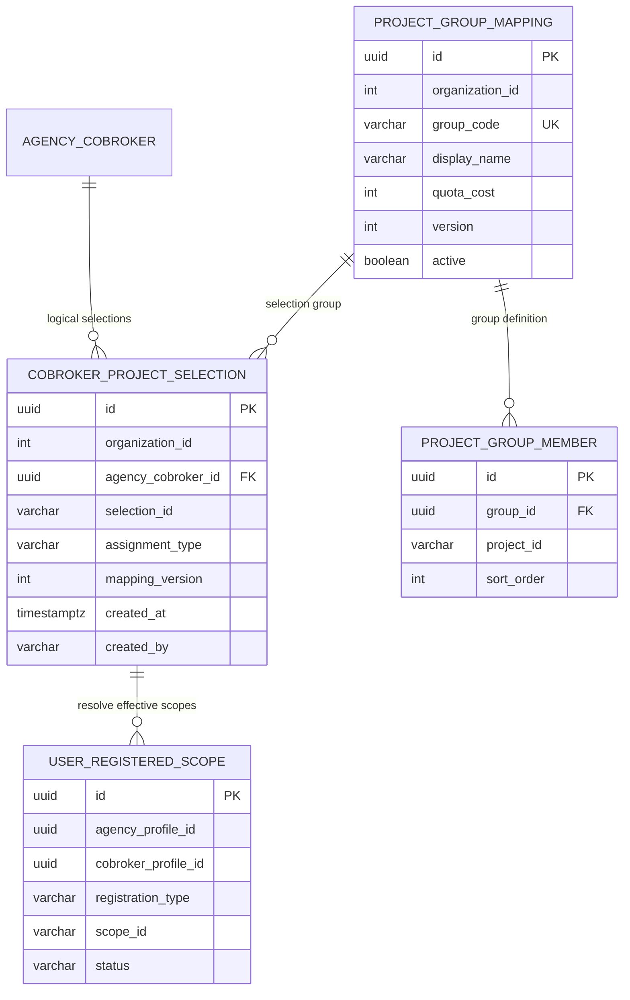

# Database ERD — vhm-cobroker-core

> As-built từ Liquibase migrations và JPA entities, ngày 14/09/2026.  
> PostgreSQL schema: `cobroker_db`.  
> Đây là logical ERD của schema cuối cùng sau toàn bộ changelog; bảng đã bị drop không xuất hiện.

## Quy ước

- `PK`: khóa chính vật lý.
- `FK`: khóa ngoại được khai báo trong database.
- `UK`: unique constraint/index quan trọng.
- `REF`: liên kết logic qua ID nhưng database không khai báo FK.
- Hầu hết bảng nghiệp vụ dùng UUID và có các cột audit `created_at`, `created_by`, `updated_at`, `updated_by`; sơ đồ lược bớt các cột này để dễ đọc.
- `organization_id` là tenant boundary và phải đi cùng các truy vấn nghiệp vụ.

## 1. Sơ đồ tổng quan domain



## 2. Agency, Sale và yêu cầu cập nhật



### Quan hệ quan trọng

- Một người trong `cobroker_profiles` có thể có nhiều liên kết làm việc lịch sử trong `agency_cobroker`; trạng thái làm việc nằm trên liên kết.
- `agency_cobroker.project_metadata` là projection JSONB dự án của Sale, liên quan trực tiếp BDSKD-6590.
- Nhiều quan hệ agency/profile là REF mềm trong code; không có FK vật lý nên service phải luôn kiểm tra tenant và scope.

## 3. Project assignment



`user_registered_scope` là projection phạm vi dự án hiệu lực dùng cho query/report; `agency_cobroker.project_metadata` là metadata trên liên kết Sale–đại lý. `ProjectAssignmentScopeStore` chịu trách nhiệm giữ hai nguồn nhất quán.

## 4. Property distribution — đợt, quỹ căn và phân bổ



Chi tiết state machine, constraint và index của domain này xem [Property Distribution Database ERD](./property-distribution/dataflows/08-database-erd.md).

## 5. Agency scoring



## 6. Import, async và outbox



Các bảng outbox độc lập, không nên nối FK tới aggregate nghiệp vụ vì phải giữ event kể cả khi trạng thái aggregate thay đổi và để tránh coupling transaction ngoài ý muốn.

## 7. Danh mục bảng đang hoạt động

| Domain | Bảng |
|---|---|
| Agency/Sale | `agency_profiles`, `agency_branch`, `agency_cobroker`, `cobroker_profiles` |
| Applicant/IV | `cobroker_applicant_agencies_submission`, `outbox_cobroker_applicant` |
| Change/Audit | `update_requests`, `update_request_responses`, `audit_logs` |
| Project assignment | `project_assignment_policy`, `project_assignment_policy_agency`, `project_assignment_window`, `project_assignment_job`, `project_assignment_job_item`, `user_registered_scope` |
| Distribution | `sale_batches`, `sale_batch_units`, `sale_batch_agencies`, `sale_batch_agency_rooms`, `room_ledger`, `unit_allocation_requests`, `unit_allocation_request_items`, `allocation_request_history`, `sale_batch_unit_history`, `allocation_process_queue` |
| Scoring | `agency_score_states`, `agency_score_state_history`, `agency_point_ledger`, `agency_scoring_configs`, `agency_scoring_config_history`, `sale_batch_agency_scores`, `sale_batch_scoring_configs` |
| Jobs/Integration | `import_job`, `import_job_item`, `async_job`, `notification_outbox`, `process_sync_outbox`, `historical_outbox`, `distribution_reminder_log`, `shedlock` |

## 8. Bảng đã retired

Các bảng dưới đây có migration tạo trong lịch sử nhưng đã bị drop bởi migration sau:

| Bảng | Trạng thái cuối |
|---|---|
| `identity_verification_manual` | Đã drop; manual decision chuyển vào JSONB của submission |
| `user_projection` | Đã drop; agency/cobroker trở thành nguồn chính |
| `team_projection` | Đã drop sau khi chuyển sang agency source |
| `agency_participation_logs` | Đã drop; thay bằng state history/ledger tương ứng |

## 9. Lưu ý dành cho BDSKD-6590

Hiện schema chỉ thể hiện dự án Sale qua hai projection:

```text
agency_cobroker.project_metadata
              |
              v
user_registered_scope(scope_type=PROJECT, scope_id=OCP2/OCP3)
```

Hai nguồn này chỉ lưu dự án vật lý, chưa có nơi biểu diễn rõ lựa chọn logic `OCP23_GROUP`. Nếu triển khai BDSKD-6590 bằng cách chỉ ghi OCP2 và OCP3, hệ thống sẽ không phân biệt được:

- Sale chọn hai dự án riêng; và
- Sale chọn một combo chiếm một slot.

ERD đề xuất bổ sung:



Đây là schema đề xuất, chưa tồn tại trong migrations hiện tại.

## 10. Nguồn đối chiếu

- Liquibase master: `src/main/resources/db.changelog/db.changelog-master.yaml`
- Migrations: `src/main/resources/db.changelog/ddl/`
- JPA models: `src/main/java/vn/vinhomes/cobroker/core/model/`
- JPA entities: `src/main/java/vn/vinhomes/cobroker/core/entity/`
- ERD distribution chi tiết: `docs/property-distribution/dataflows/08-database-erd.md`
