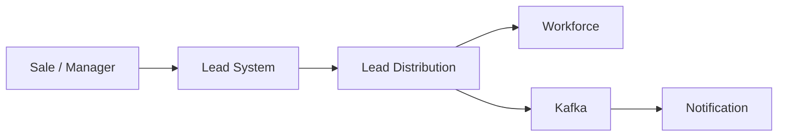
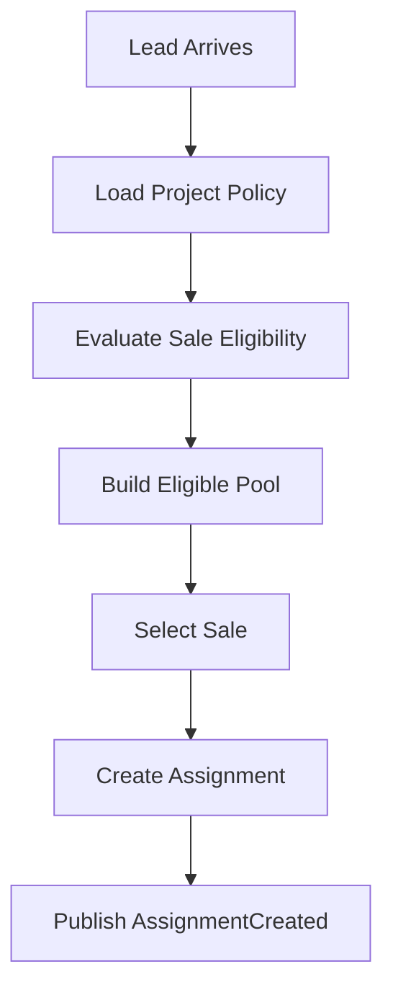
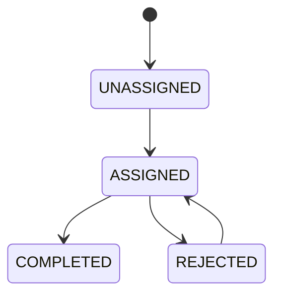
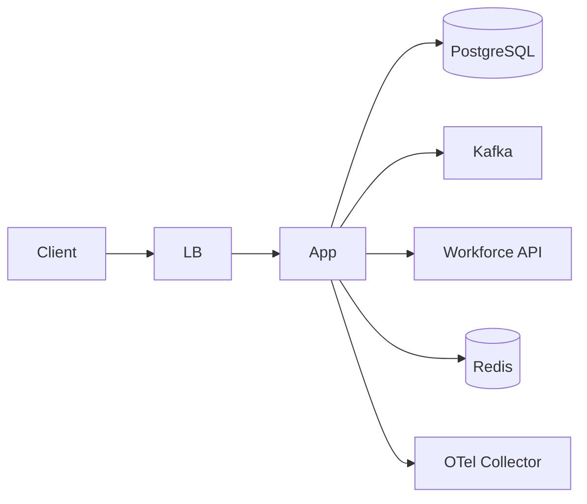

# Docs-First Architecture for Spring Boot + AI Agents
## Thiết kế thư mục `docs/` theo First Principles để Developer và AI Agent hiểu hệ thống trước khi đọc code

---

# 1. Tư tưởng gốc

Nếu mục tiêu của repository là:

> Developer và AI Agent phải hiểu hệ thống đúng trước khi sửa code,

thì `docs/` không thể chỉ là:

```text
README
architecture diagram
API note
```

mà phải đóng vai trò:

```text
SPECIFICATION
    +
KNOWLEDGE BASE
    +
ARCHITECTURE MAP
    +
BUSINESS MANUAL
    +
OPERATING MANUAL
    +
AI CONTEXT
```

Code chỉ là:

```text
Implementation of documented intent
```

---

# 2. First Principle: AI sai vì phải đoán

Một AI Agent khi nhận task:

```text
"Không cho Sale không eligible nhận Lead"
```

có thể hiểu sai ở rất nhiều điểm:

```text
Sale là gì?
Eligible nghĩa là gì?
Ai tính eligibility?
Rule hiện tại nằm đâu?
Eligibility được tính real-time hay precomputed?
Lead có thể được assign nhiều Sale không?
Assignment có transaction không?
Có race condition không?
Có event không?
Có API contract nào bị ảnh hưởng không?
Có retry không?
```

Nếu tất cả kiến thức đó chỉ nằm trong code:

```text
AI
 ↓
reverse engineer
 ↓
infer intent
 ↓
guess
```

Đó chính là nguồn hallucination lớn nhất.

Mục tiêu của `docs/` là biến flow thành:

```text
AI
 ↓
read explicit knowledge
 ↓
understand constraints
 ↓
locate code
 ↓
change safely
```

---

# 3. Nguyên tắc tối thượng của hệ thống tài liệu

## DOC-001 — One fact, one source of truth

Một fact quan trọng chỉ được có **một nơi authoritative**.

Ví dụ:

```text
Order cancellation business rule
```

Source of truth:

```text
docs/10-domain/business-rules.md
```

Feature README chỉ link:

```text
See BR-ORDER-007.
```

Không copy lại nguyên rule sang 5 file.

---

## DOC-002 — Docs phải phân loại theo loại knowledge

Không trộn:

```text
business rule
architecture decision
API contract
operational procedure
coding style
```

vào cùng một file.

Mỗi loại knowledge có lifecycle khác nhau.

---

## DOC-003 — Docs phải searchable

Mọi concept quan trọng phải có naming ổn định.

Ví dụ:

```text
BR-ORDER-001
INV-ORDER-003
ADR-021
ERR-ORDER-409-01
EVENT-ORDER-CANCELLED
```

AI Agent search được.

Developer review cũng refer được.

---

## DOC-004 — Docs phải gần với decision

Business rule:

```text
10-domain/
```

Data contract:

```text
40-data/
```

Technical decision:

```text
90-decisions/
```

Không đẩy mọi thứ vào một `architecture.md` dài 10.000 dòng.

---

## DOC-005 — Docs phải có lifecycle

Mỗi tài liệu quan trọng nên có metadata:

```yaml
---
title: Order Business Rules
status: active
owner: order-team
last-reviewed: 2026-10-04
review-cycle: 90d
source-of-truth: true
---
```

---

# 4. Cấu trúc tổng thể

```text
docs/
│
├── README.md
│
├── 00-context/
│   ├── product.md
│   ├── goals.md
│   ├── glossary.md
│   └── system-context.md
│
├── 10-domain/
│   ├── README.md
│   ├── domain-model.md
│   ├── business-rules.md
│   ├── invariants.md
│   ├── workflows.md
│   ├── state-machines.md
│   ├── permissions.md
│   └── edge-cases.md
│
├── 20-architecture/
│   ├── README.md
│   ├── principles.md
│   ├── module-boundaries.md
│   ├── dependency-rules.md
│   ├── runtime-architecture.md
│   ├── data-flow.md
│   └── deployment-architecture.md
│
├── 30-contracts/
│   ├── README.md
│   ├── api/
│   ├── events/
│   ├── integrations/
│   └── error-codes.md
│
├── 40-data/
│   ├── README.md
│   ├── data-model.md
│   ├── schema.md
│   ├── ownership.md
│   ├── consistency.md
│   ├── transaction-model.md
│   ├── migration-strategy.md
│   └── retention.md
│
├── 50-reliability/
│   ├── README.md
│   ├── failure-model.md
│   ├── timeout-retry.md
│   ├── idempotency.md
│   ├── concurrency.md
│   ├── capacity-model.md
│   ├── slo.md
│   └── observability.md
│
├── 60-security/
│   ├── README.md
│   ├── security-model.md
│   ├── authentication.md
│   ├── authorization.md
│   ├── secrets.md
│   └── sensitive-data.md
│
├── 70-testing/
│   ├── README.md
│   ├── strategy.md
│   ├── test-pyramid.md
│   ├── fixtures.md
│   ├── integration-tests.md
│   └── contract-tests.md
│
├── 80-operations/
│   ├── README.md
│   ├── local-development.md
│   ├── environments.md
│   ├── configuration.md
│   ├── deployment.md
│   ├── rollback.md
│   ├── runbook.md
│   └── incident-playbook.md
│
├── 90-decisions/
│   ├── README.md
│   └── ADR-xxxx-*.md
│
├── engineering/
│   ├── README.md
│   └── CONVENTIONS.md
│
└── ai/
    ├── README.md
    ├── AGENT-OPERATING-MANUAL.md
    ├── READ-ORDER.md
    ├── TASK-PROTOCOL.md
    ├── CHANGE-MATRIX.md
    ├── STOP-CONDITIONS.md
    └── VERIFICATION.md
```

---

# 5. `docs/README.md`

## Vai trò

Đây là:

> **Entry point duy nhất vào knowledge của repository.**

Developer mới hoặc AI Agent không nên phải tự đoán:

```text
nên đọc file nào trước?
```

`docs/README.md` trả lời câu đó.

---

## File này phải trả lời

```text
Hệ thống docs được tổ chức thế nào?
Source of truth ở đâu?
Task loại nào đọc phần nào?
Read order là gì?
Docs nào authoritative?
```

---

## Nội dung đề xuất

```md
# Documentation

## Purpose

This directory is the source of truth for:
- business meaning
- business rules
- architecture
- contracts
- data semantics
- reliability
- operations
- engineering conventions

Code implements these decisions.

## Read Order

New engineer / AI Agent:

1. `00-context/`
2. `10-domain/`
3. relevant feature README
4. `20-architecture/`
5. relevant contract/data docs
6. tests
7. code

## Source of Truth

Business rules:
`10-domain/business-rules.md`

Data ownership:
`40-data/ownership.md`

API contracts:
`30-contracts/api/`

Architecture decisions:
`90-decisions/`

Engineering conventions:
`engineering/CONVENTIONS.md`

## Rule

Do not duplicate authoritative content.
Link to the source of truth instead.
```

---

## Không được chứa

Không biến `docs/README.md` thành tài liệu 500 dòng.

Nó là:

```text
INDEX
+
ROUTER
```

không phải nơi chứa chi tiết.

---

# 6. `00-context/`

Đây là layer trả lời:

> **Hệ thống này tồn tại để làm gì?**

Trước khi hiểu code, phải hiểu context.

---

# 7. `00-context/product.md`

## Câu hỏi nó trả lời

```text
Sản phẩm/hệ thống này là gì?
Ai sử dụng?
Vấn đề business nào đang được giải quyết?
Value chính là gì?
```

---

## Ví dụ

```md
# Product

## Problem

Sales teams currently assign incoming leads manually.

This causes:
- slow response time
- unfair assignment
- inconsistent eligibility checking
- poor auditability

## Product

Marketplace Lead Distribution automatically:

1. evaluates Sale eligibility
2. creates an Eligible Pool
3. selects a Sale based on policy
4. records assignment
5. emits assignment events

## Primary Users

- Sale
- Sales Manager
- Operations
- Administrator

## Business Value

- reduce manual assignment
- improve lead response time
- enforce distribution rules
- provide complete audit trail
```

---

## Tại sao quan trọng với AI

Nếu AI không biết product intent, nó có thể tối ưu sai.

Ví dụ:

```text
"Fair Random"
```

không chỉ là random code.

Nó có business meaning:

```text
fair distribution among eligible sales
```

---

# 8. `00-context/goals.md`

## Vai trò

Xác định:

```text
GOALS
NON-GOALS
```

Đây cực kỳ quan trọng để chống over-engineering.

---

## Ví dụ

```md
# Goals

## Goals

G-001
Lead assignment must be deterministic and auditable.

G-002
A Sale must never receive a Lead if not eligible.

G-003
Concurrent assignment must not assign the same Lead twice.

## Non-Goals

NG-001
The system does not manage CRM customer lifecycle.

NG-002
The system does not calculate Sale commission.

NG-003
The system does not replace the HR workforce system.
```

---

## Tại sao cần Non-Goals

AI rất dễ scope creep.

Task:

```text
add sale eligibility
```

Agent có thể bắt đầu:

```text
implement employee hierarchy
```

nếu không biết đó thuộc hệ thống khác.

---

# 9. `00-context/glossary.md`

Đây là một trong những file quan trọng nhất.

## Vai trò

Định nghĩa:

> **Ubiquitous Language**

Một concept phải có một tên thống nhất.

---

## Ví dụ

```md
# Glossary

## Lead

A potential customer that can be assigned to a Sale.

Do not use:
- Prospect
- Customer Lead
- Candidate Customer

## Sale

An employee who can receive and process Leads.

Do not use:
- Seller
- Agent
- Salesman
- Consultant

## Eligible Sale

A Sale who satisfies every active eligibility rule
for a Project at evaluation time.

## Assignment

The relationship created when a Lead is allocated
to a Sale.
```

---

## Mỗi glossary entry nên có

```text
Term
Definition
Business meaning
Synonyms forbidden
Related concepts
```

---

## Rule

Nếu code dùng:

```text
Agent
Seller
SaleUser
```

cho cùng một concept:

```text
docs glossary wins
```

---

# 10. `00-context/system-context.md`

## Vai trò

Trả lời:

> Hệ thống này nằm ở đâu trong toàn ecosystem?

---

## Nên có C4 System Context style



---

## Mỗi external system phải ghi

```text
System name
Purpose
Owner
Protocol
Data exchanged
Source of truth
Failure impact
```

Ví dụ:

```md
## Workforce Service

Purpose:
Provides Sale organization and employment information.

Owner:
Workforce Platform Team

Protocol:
HTTP REST

Data used:
- saleId
- department
- status

Source of truth:
Workforce Service

Failure impact:
Eligibility evaluation requiring workforce data may fail.
```

---

# 11. `10-domain/`

Đây là phần quan trọng nhất của toàn bộ docs.

Nếu phải ưu tiên:

```text
10-domain > code
```

về mặt understanding.

Nó trả lời:

> **Business thực sự hoạt động thế nào?**

---

# 12. `10-domain/README.md`

## Vai trò

Index cho toàn business domain.

---

## Nội dung

```md
# Domain

## Core Domain

Lead Distribution

## Main Concepts

- Lead
- Project
- Sale
- SaleEligibility
- EligiblePool
- DistributionPolicy
- Assignment

## Read Order

1. domain-model.md
2. business-rules.md
3. invariants.md
4. workflows.md
5. state-machines.md
6. edge-cases.md
```

---

# 13. `10-domain/domain-model.md`

## Vai trò

Mô tả:

```text
business concepts
relationship
ownership
behavior
```

Không phải database schema.

---

## Ví dụ

```text
Project
  |
  +-- DistributionPolicy
  |
  +-- SaleEligibility
  |
  +-- Lead
        |
        +-- Assignment
              |
              +-- Sale
```

---

## Với mỗi domain object phải ghi

```text
Meaning
Identity
Important attributes
Lifecycle
Owned rules
Relations
Not responsible for
```

---

## Ví dụ

```md
## Assignment

### Meaning

Assignment represents the allocation of one Lead
to one Sale in one Project.

### Identity

AssignmentId

### Important Attributes

- leadId
- saleId
- projectId
- status
- assignedAt

### Owned Rules

- INV-ASSIGN-001
- BR-ASSIGN-003

### Not Responsible For

Assignment does not calculate Sale eligibility.
Eligibility belongs to Eligibility Engine.
```

---

# 14. `10-domain/business-rules.md`

Đây là:

> **Source of truth của business behavior.**

---

## Mỗi rule phải có ID

```text
BR-{DOMAIN}-{NUMBER}
```

Ví dụ:

```text
BR-ASSIGN-001
BR-ASSIGN-002
```

---

## Template

```md
## BR-ASSIGN-001 — Sale must be eligible

### Statement

A Lead MUST NOT be assigned to a Sale
unless the Sale is eligible for the Project
at assignment time.

### Inputs

- projectId
- saleId
- eligibility state

### Success

Assignment may continue.

### Failure

Reject with:

SALE_NOT_ELIGIBLE

### Exceptions

None.

### Related

- INV-ASSIGN-001
- WF-ASSIGN-001
```

---

## Tại sao rule cần nhiều field

Không chỉ:

```text
Sale phải eligible.
```

Vì AI cần hiểu:

```text
eligible lúc nào?
source ở đâu?
failure behavior gì?
exception nào?
```

---

# 15. `10-domain/invariants.md`

Business Rule và Invariant không hoàn toàn giống nhau.

## Business rule

Có thể là policy.

```text
Lead VIP ưu tiên Senior Sale.
```

## Invariant

Là điều:

> **không bao giờ được phép sai tại một consistency boundary.**

Ví dụ:

```text
Một Lead không được có hai active Assignment.
```

---

## Template

```md
# Invariants

## INV-ASSIGN-001

At most one ACTIVE assignment may exist for a Lead
within a Project.

### Scope

Strong consistency.

### Enforcement

Database unique constraint + application validation.

### Concurrency

Concurrent requests must not bypass this invariant.

### Verification

Integration test:
`AssignmentConcurrencyTest`
```

---

## Đây là file cực kỳ quan trọng

AI có thể nhìn invariant và biết:

```text
không được chỉ if exists rồi insert
```

vì race condition.

---

# 16. `10-domain/workflows.md`

## Vai trò

Mô tả:

> Một business process đi từ đầu đến cuối như thế nào?

---

## Ví dụ



---

## Mỗi workflow phải có

```text
Trigger
Preconditions
Steps
Business rules used
State changes
Side effects
Failure paths
Compensation
Outputs
```

---

## Ví dụ

```md
## WF-ASSIGN-001 — Assign Lead

### Trigger

New Lead is ready for distribution.

### Preconditions

- Lead is ACTIVE
- Project is ACTIVE
- Distribution policy exists

### Steps

1. Load project.
2. Evaluate eligibility.
3. Build eligible pool.
4. Select Sale.
5. Create Assignment.
6. Publish AssignmentCreated.

### Failure Paths

No eligible Sale:
    Lead remains UNASSIGNED.

Database conflict:
    reload assignment and stop duplicate processing.

Kafka unavailable:
    persist outbox event.
```

---

# 17. `10-domain/state-machines.md`

Business state phải explicit.

---

## Template



---

## Ngoài diagram phải có transition table

| From | Event | To | Allowed? | Rule |
|---|---|---|---|---|
| UNASSIGNED | assign | ASSIGNED | yes | BR-ASSIGN-001 |
| ASSIGNED | complete | COMPLETED | yes | BR-ASSIGN-010 |
| COMPLETED | assign | ASSIGNED | no | INV-ASSIGN-004 |

---

## Lý do

Diagram nhìn đẹp nhưng AI cần table để reason chính xác.

---

# 18. `10-domain/permissions.md`

## Vai trò

Business authorization.

Không chỉ:

```text
ROLE_ADMIN
```

mà:

```text
ai được làm hành động gì với resource nào?
```

---

## Ví dụ

| Actor | Action | Resource | Allowed |
|---|---|---|---|
| Sale | view | own assignment | yes |
| Sale | reassign | assignment | no |
| Manager | reassign | team assignment | yes |
| Admin | configure | distribution policy | yes |

---

## Phải phân biệt

```text
Authentication
    = bạn là ai?

Authorization
    = bạn được phép làm gì?

Business eligibility
    = nghiệp vụ có cho phép không?
```

---

# 19. `10-domain/edge-cases.md`

Đây là file AI rất cần.

Developer có kinh nghiệm thường giữ edge cases trong đầu.

AI thì không.

---

## Ví dụ

```md
## EC-ASSIGN-001 — No eligible sales

Expected:
Lead remains UNASSIGNED.

Do NOT:
- assign random inactive Sale
- fail entire ingestion pipeline

## EC-ASSIGN-002 — Same Lead delivered twice

Expected:
Processing is idempotent.

## EC-ASSIGN-003 — Sale becomes inactive after pool creation

Expected:
Eligibility MUST be revalidated at final assignment
if pool age exceeds configured threshold.
```

---

# 20. `20-architecture/`

Trả lời:

> **Phần mềm được chia thế nào để implement domain?**

Business nói:

```text
WHAT
```

Architecture nói:

```text
HOW AT SYSTEM STRUCTURE LEVEL
```

---

# 21. `20-architecture/README.md`

Index architecture.

Ví dụ:

```md
# Architecture

## Style

- package by feature
- modular monolith
- domain-oriented boundaries
- PostgreSQL
- Kafka integration
- OpenTelemetry

## Read Order

1. principles.md
2. module-boundaries.md
3. dependency-rules.md
4. runtime-architecture.md
5. data-flow.md
```

---

# 22. `20-architecture/principles.md`

Đây là:

> Những nguyên tắc kiến trúc lâu dài.

---

## Ví dụ

```text
ARCH-P-001
Business rules stay independent from infrastructure.

ARCH-P-002
Each business capability has one clear owner.

ARCH-P-003
Network failures are expected, not exceptional.

ARCH-P-004
Schema evolution must support rolling deployment.

ARCH-P-005
Observability is part of production behavior.
```

---

## Không để implementation cụ thể quá sâu ở đây

Sai:

```text
Use class FooAdapter.
```

Đó thuộc implementation.

Principle phải sống lâu hơn code.

---

# 23. `20-architecture/module-boundaries.md`

## Vai trò

Định nghĩa module nào sở hữu capability nào.

---

## Ví dụ

```text
lead/
eligibility/
distribution/
assignment/
policy/
```

---

## Với mỗi module

```md
## Assignment Module

### Owns

- Assignment lifecycle
- assignment persistence
- assignment events

### May Depend On

- eligibility public contract
- policy public contract

### Must Not Depend On

- eligibility persistence
- HR database

### Exposes

- AssignLeadUseCase
- AssignmentQuery
- AssignmentCreated event
```

---

# 24. `20-architecture/dependency-rules.md`

Đây là source of truth cho compile-time structure.

---

## Ví dụ

```text
api → application
application → domain
infrastructure → domain

domain ↛ Spring
domain ↛ JPA
domain ↛ Kafka
```

---

## Nên map với ArchUnit

```java
noClasses()
  .that().resideInAPackage("..domain..")
  .should().dependOnClassesThat()
  .resideInAPackage("org.springframework..");
```

---

# 25. `20-architecture/runtime-architecture.md`

Code structure khác runtime structure.

File này trả lời:

> Lúc chạy thật có những component nào?

---

## Diagram



---

## Mỗi component phải ghi

```text
role
protocol
availability assumption
stateful/stateless
scaling
failure impact
```

---

# 26. `20-architecture/data-flow.md`

## Vai trò

Cho thấy data đi từ đâu tới đâu.

---

## Ví dụ

```text
Lead API
  ↓
Lead Command
  ↓
Eligibility Engine
  ↓
Eligible Pool
  ↓
Distribution
  ↓
Assignment DB
  ↓
Outbox
  ↓
Kafka
```

---

## Phải ghi rõ

```text
sync vs async
source of truth
transformation
persistence
consistency
```

---

# 27. `20-architecture/deployment-architecture.md`

## Vai trò

Mô tả deployment topology.

---

## Ví dụ

```text
Kubernetes
 ├── app deployment
 ├── service
 ├── HPA
 ├── ConfigMap
 ├── Secret
 └── ServiceMonitor
```

---

## Không nên chứa YAML đầy đủ

YAML thuộc source.

Docs chỉ giải thích:

```text
why topology exists
scaling model
dependencies
resource assumptions
```

---

# 28. `30-contracts/`

Contract là thứ có consumer.

Nếu một thứ có consumer khác:

```text
HTTP client
Kafka consumer
external partner
other module
```

thì nó là contract.

---

# 29. `30-contracts/README.md`

Index toàn contract.

```md
# Contracts

## HTTP

See `api/`

## Events

See `events/`

## External Integrations

See `integrations/`

## Error Codes

See `error-codes.md`
```

---

# 30. `30-contracts/api/`

Mỗi API quan trọng nên có contract machine-readable.

Ví dụ:

```text
openapi.yaml
```

và docs narrative nếu cần.

---

## Không duplicate schema bằng prose

Prose chỉ giải thích:

```text
semantics
business meaning
compatibility
examples
```

Schema:

```text
OpenAPI
```

là source of truth cho shape.

---

# 31. `30-contracts/events/`

Mỗi event:

```text
OrderCreated
LeadAssigned
PaymentCompleted
```

phải có file hoặc schema.

---

## Template

```md
# LeadAssigned

## Meaning

Published after an Assignment is committed.

## Producer

Assignment Module

## Consumers

- Notification
- Analytics

## Delivery

At least once.

## Ordering

Per Lead ID.

## Idempotency Key

eventId

## Schema

...
```

---

## Đặc biệt phải ghi

```text
delivery semantics
ordering
duplicate possibility
compatibility
```

---

# 32. `30-contracts/integrations/`

Mỗi external dependency có contract riêng.

Ví dụ:

```text
workforce.md
payment-provider.md
crm.md
```

---

## Mỗi file phải có

```text
purpose
owner
base protocol
authentication
timeout
retry
rate limits
request/response
failure behavior
SLA assumption
```

---

# 33. `30-contracts/error-codes.md`

## Source of truth

Error code machine-readable cho client.

---

## Ví dụ

| Code | Meaning | HTTP | Retryable |
|---|---|---:|---|
| SALE_NOT_ELIGIBLE | Sale not eligible | 409 | no |
| LEAD_ALREADY_ASSIGNED | Lead already assigned | 409 | no |
| WORKFORCE_UNAVAILABLE | dependency unavailable | 503 | yes |

---

# 34. `40-data/`

Trả lời:

> **Data có nghĩa gì và consistency như thế nào?**

Không chỉ:

```text
table name
column name
```

---

# 35. `40-data/README.md`

Index:

```text
semantic model
physical schema
ownership
consistency
transactions
migration
retention
```

---

# 36. `40-data/data-model.md`

Đây là logical model.

---

## Không phải ERD thuần database

Ví dụ:

```text
Lead
 ├── belongs to Project
 └── may have Assignment

Assignment
 ├── points to Lead
 └── points to Sale
```

---

# 37. `40-data/schema.md`

Physical database model.

---

## Mỗi table

```text
purpose
primary key
important columns
unique constraints
foreign keys
indexes
expected access patterns
```

---

## Ví dụ

```md
## project_assignment

Purpose:
Stores assignment history.

Primary Key:
id

Important Constraints:

UNIQUE(project_id, lead_id)
WHERE status = 'ACTIVE'

Indexes:

(project_id, sale_id, status)

Reason:
Used by active assignment lookup.
```

---

# 38. `40-data/ownership.md`

Một trong những file quan trọng nhất.

---

## Ví dụ

| Data | Owner | Writers | Readers |
|---|---|---|---|
| Lead | Lead module | Lead module | Distribution |
| SaleEligibility | Eligibility | Eligibility | Distribution |
| Assignment | Assignment | Assignment | Reporting |

---

## Rule

```text
Writer ownership > read convenience
```

Không được vì JOIN dễ mà phá ownership.

---

# 39. `40-data/consistency.md`

Trả lời:

> Dữ liệu nào cần strong consistency, dữ liệu nào chấp nhận eventual consistency?

---

## Ví dụ

| Relationship | Consistency | Reason |
|---|---|---|
| Assignment + Lead assignment state | strong | avoid duplicate |
| Assignment + Notification | eventual | notification may lag |
| Assignment + Analytics | eventual | reporting can lag |

---

# 40. `40-data/transaction-model.md`

Đây là file cực quan trọng.

---

## Phải ghi

```text
transaction boundary
aggregate/consistency boundary
locking strategy
isolation assumptions
external calls
```

---

## Ví dụ

```md
# Assignment Transaction

Transaction includes:

1. validate current Lead state
2. create assignment
3. mark lead assigned
4. create outbox event

Transaction excludes:

- Notification API
- Kafka broker write
```

---

# 41. `40-data/migration-strategy.md`

Trả lời:

> Schema thay đổi thế nào mà không phá rolling deployment?

---

## Standard flow

```text
EXPAND
 ↓
DEPLOY COMPATIBLE CODE
 ↓
BACKFILL
 ↓
SWITCH
 ↓
CONTRACT
```

---

## Ví dụ

Không:

```text
rename column immediately
```

Mà:

```text
add new column
dual read/write
migrate
switch
remove old column later
```

---

# 42. `40-data/retention.md`

Data không tồn tại mãi mặc định.

---

## Mỗi loại data

```text
retention period
archive policy
deletion
PII consideration
audit requirement
```

---

# 43. `50-reliability/`

Đây là:

> Production reality.

Code chạy local có thể đúng nhưng production vẫn fail.

---

# 44. `50-reliability/README.md`

Index cho:

```text
failure
timeout/retry
idempotency
concurrency
capacity
SLO
observability
```

---

# 45. `50-reliability/failure-model.md`

Một trong những file có giá trị cao nhất.

---

## Với mỗi dependency

liệt kê:

```text
failure mode
detection
impact
handling
recovery
```

---

## Ví dụ

```md
## Workforce API

### F-WF-001 Connection Timeout

Detection:
HTTP client timeout.

Impact:
Eligibility cannot be calculated.

Handling:
Fail request.

Retry:
At most 2 retries with backoff.

### F-WF-002 Slow response

Impact:
May consume request threads.

Handling:
500ms timeout.
```

---

# 46. `50-reliability/timeout-retry.md`

Timeout/retry phải centralized.

---

## Table

| Dependency | Connect | Read | Retry | Backoff |
|---|---:|---:|---:|---:|
| Workforce | 200ms | 500ms | 2 | exponential |
| Kafka | n/a | 5s | producer config | bounded |
| Email | 300ms | 2s | async | consumer retry |

---

## Phải ghi WHY

Không chỉ con số.

Ví dụ:

```text
500ms because API request budget is 1000ms
and Workforce consumes at most 50% of budget.
```

---

# 47. `50-reliability/idempotency.md`

Trả lời:

> Operation nào có thể lặp lại mà không tạo duplicate side effect?

---

## Ví dụ

```text
Lead ingestion:
idempotency key = externalLeadId

Assignment event:
idempotency key = eventId

Payment:
idempotency key = clientRequestId
```

---

## Phải ghi

```text
scope
storage
TTL
conflict behavior
```

---

# 48. `50-reliability/concurrency.md`

Đây là nơi ghi rõ race condition.

---

## Ví dụ

```text
Race C-001:
Two workers assign the same Lead concurrently.

Protection:
DB unique constraint + transaction.

Not sufficient:
"check then insert" without constraint.
```

---

# 49. `50-reliability/capacity-model.md`

Trả lời:

> Load hệ thống là gì?

---

## Không viết

```text
high traffic
```

Mà:

```text
normal RPS
peak RPS
message rate
payload
DB connection
thread model
expected growth
```

---

## Ví dụ

```text
Normal:
200 RPS

Peak:
1000 RPS

Kafka:
500 msg/s average
2000 msg/s peak

Payload:
p50 3KB
p99 100KB
max 5MB
```

---

# 50. `50-reliability/slo.md`

SLO không phải alert rule.

Nó mô tả:

```text
service objective
```

---

## Ví dụ

```text
Availability:
99.9%

API latency:
p95 < 300ms
p99 < 700ms

Assignment success:
99.99% excluding invalid business requests
```

---

# 51. `50-reliability/observability.md`

Trả lời:

> Làm sao biết hệ thống đang hoạt động đúng?

---

## Phải map

```text
Business process
 ↓
metrics
logs
traces
alerts
```

---

## Ví dụ

```text
lead_received_total
lead_assigned_total
lead_unassigned_total

assignment_latency_seconds
distribution_pool_size

workforce_request_duration
workforce_error_total
```

---

# 52. `60-security/`

Security knowledge không nên nằm rải rác.

---

# 53. `60-security/security-model.md`

High-level security boundaries.

```text
external user
API gateway
service
database
Kafka
external services
```

---

# 54. `60-security/authentication.md`

Trả lời:

```text
identity đến từ đâu?
token format?
service-to-service identity?
```

Không trộn authorization vào đây.

---

# 55. `60-security/authorization.md`

Trả lời:

```text
ai có quyền gì?
resource ownership?
tenant isolation?
role/policy?
```

---

# 56. `60-security/secrets.md`

Trả lời:

```text
secret nằm đâu?
rotate thế nào?
app nhận thế nào?
không được log gì?
```

---

# 57. `60-security/sensitive-data.md`

Phân loại:

```text
PII
financial
credentials
internal
public
```

Và policy:

```text
encrypt
mask
log
retention
access
```

---

# 58. `70-testing/`

Trả lời:

> Hệ thống chứng minh correctness như thế nào?

---

# 59. `70-testing/strategy.md`

Đây là policy tổng.

---

## Ví dụ

```text
Domain rule
    → unit test

DB behavior
    → PostgreSQL integration test

HTTP contract
    → controller/contract test

Cross-service
    → contract test

Critical workflow
    → end-to-end test
```

---

# 60. `70-testing/test-pyramid.md`

Không nhất thiết đúng "pyramid" cổ điển cứng nhắc.

Mục tiêu:

```text
fast feedback
+
realistic infrastructure
```

---

## Ghi rõ project này dùng loại test nào

```text
unit
slice
integration
contract
e2e
architecture
```

---

# 61. `70-testing/fixtures.md`

Test data convention.

Tránh:

```text
random magic fixture
```

Mà:

```text
activeSale()
inactiveSale()
eligibleSale()
assignedLead()
```

Fixture phải nói business meaning.

---

# 62. `70-testing/integration-tests.md`

Ghi rõ:

```text
PostgreSQL via Testcontainers
Kafka strategy
external fake server
migration test
```

---

# 63. `70-testing/contract-tests.md`

Mô tả contract testing:

```text
OpenAPI
consumer-driven
event schema compatibility
```

---

# 64. `80-operations/`

Đây là tài liệu để:

```text
run
deploy
recover
```

system.

AI Agent sửa operational config cũng phải đọc phần này.

---

# 65. `80-operations/local-development.md`

Developer mới phải chạy được project từ file này.

---

## Phải có

```text
requirements
commands
dependencies
ports
local DB
Kafka
seed data
test
debug
```

---

# 66. `80-operations/environments.md`

Mô tả:

```text
local
dev
sit
uat
prod
```

hoặc convention thực tế của công ty.

---

## Với mỗi env

```text
purpose
data policy
external dependencies
deployment process
```

---

# 67. `80-operations/configuration.md`

Đây là source of truth về config precedence.

---

## Ví dụ

```text
application.yml
      ↓
profile config
      ↓
environment variables
      ↓
ConfigMap
      ↓
Secret/Vault
```

---

## Mỗi config quan trọng

```text
name
type
default
unit
required
secret
```

---

# 68. `80-operations/deployment.md`

Mô tả deployment process.

```text
build
test
image
deploy
health check
progressive rollout
verification
```

---

# 69. `80-operations/rollback.md`

Không thể chỉ biết deploy.

Phải biết:

> Nếu deployment fail thì quay lại thế nào?

---

## Phải lưu ý DB compatibility

Rollback app có thể thất bại nếu schema đã destructive change.

Do đó file này phải link:

```text
40-data/migration-strategy.md
```

---

# 70. `80-operations/runbook.md`

Runbook = thao tác khi system có vấn đề.

---

## Ví dụ

```md
## High API Error Rate

Check:

1. error rate by endpoint
2. downstream latency
3. DB connections
4. Kafka lag

Actions:

- dependency outage → disable affected workflow
- DB saturation → reduce concurrency
...
```

---

# 71. `80-operations/incident-playbook.md`

Runbook = technical steps.

Incident playbook = process tổng.

```text
detect
acknowledge
mitigate
communicate
recover
postmortem
```

---

# 72. `90-decisions/`

Đây là:

> **Memory của kiến trúc.**

Code cho biết hiện tại đang làm gì.

ADR cho biết:

> Tại sao lại làm như vậy?

---

# 73. `90-decisions/README.md`

Index ADR.

---

## Ví dụ

| ADR | Decision | Status |
|---|---|---|
| ADR-001 | package by feature | accepted |
| ADR-010 | use PostgreSQL | accepted |
| ADR-021 | transactional outbox | accepted |

---

# 74. `90-decisions/ADR-xxxx-*.md`

Template:

```md
# ADR-021 — Transactional Outbox

## Status

Accepted

## Context

...

## Problem

...

## Options

### Option 1

...

### Option 2

...

## Decision

...

## Consequences

Positive:

...

Negative:

...

## Migration

...

## Related

...
```

---

# 75. `engineering/`

Khác với architecture.

Architecture:

```text
system decisions
```

Engineering:

```text
how developers/AI write and change code
```

---

# 76. `engineering/README.md`

Index engineering standards.

---

# 77. `engineering/CONVENTIONS.md`

Đây chính là file chúng ta đã xây dựng.

Nó chứa:

```text
ARCH rules
JAVA
CODE
SPRING
API
DATA
TX
DIST
MSG
OBS
TEST
AI
```

---

# 78. `ai/`

Nếu repository coi AI Agent là first-class contributor thì đây là thư mục bắt buộc.

Nó không mô tả business.

Nó mô tả:

> AI phải sử dụng knowledge của repository thế nào.

---

# 79. `ai/README.md`

Entry point riêng cho AI.

```text
What AI may do
What AI must read
What AI must verify
When AI must stop
```

---

# 80. `ai/AGENT-OPERATING-MANUAL.md`

Đây là operating system manual cho Agent.

---

## Nội dung

```text
role
rules
workflow
tools
restrictions
definition of done
```

---

## Ví dụ

```md
Before editing:

1. Identify feature.
2. Read domain docs.
3. Find business rule.
4. Read relevant contract.
5. Read tests.
6. Read implementation.
7. Make minimal change.
8. Run verification.
```

---

# 81. `ai/READ-ORDER.md`

Cực quan trọng.

---

## Default read order

```text
Task
 ↓
00-context
 ↓
10-domain
 ↓
feature README
 ↓
business rules/invariants
 ↓
relevant architecture
 ↓
contract/data/reliability
 ↓
tests
 ↓
code
```

---

## Read order theo task

### API task

```text
10-domain
30-contracts/api
20-architecture
tests
code
```

### Database task

```text
10-domain
40-data
90-decisions
tests
code
```

### Kafka task

```text
10-domain
30-contracts/events
50-reliability/idempotency
40-data/transaction-model
code
```

---

# 82. `ai/TASK-PROTOCOL.md`

Biến AI workflow thành protocol.

---

## Ví dụ

```text
PHASE 1 — UNDERSTAND
PHASE 2 — LOCATE
PHASE 3 — PLAN
PHASE 4 — IMPLEMENT
PHASE 5 — VERIFY
PHASE 6 — REPORT
```

---

## PHASE 1

Agent phải xác định:

```text
business goal
affected feature
rule IDs
contracts
data
risk
```

---

# 83. `ai/CHANGE-MATRIX.md`

Đây là file rất mạnh.

Nó trả lời:

> Khi thay đổi X, những gì khác phải kiểm tra?

---

## Ví dụ

| Change | Must Check |
|---|---|
| API field | OpenAPI, compatibility, tests |
| DB column | migration, rollback, old app compatibility |
| Event field | producer, consumers, schema compatibility |
| Business rule | domain doc, tests, error code |
| Retry | idempotency, timeout budget, duplicate side effects |
| Transaction | locking, isolation, outbox |

---

# 84. `ai/STOP-CONDITIONS.md`

AI không được cố hoàn thành mọi task.

---

## Agent MUST stop khi

```text
business rule conflicts
source of truth unclear
destructive migration uncertain
security permission unclear
financial operation may duplicate
API breaking change not requested
event consumer impact unknown
transaction semantics unclear
```

---

## Ví dụ

```md
## STOP-007 — Destructive migration

Stop when:

- dropping column
- changing column type incompatibly
- deleting production data

unless an approved migration plan exists.
```

---

# 85. `ai/VERIFICATION.md`

Một Agent chỉ nên nói:

```text
DONE
```

khi verification policy thỏa.

---

## Ví dụ

```text
compile
unit tests
integration tests
architecture tests
format
contract validation
migration validation
```

---

## Output format

```text
Verified:
- ./gradlew test
- ./gradlew integrationTest
- ./scripts/verify.sh

Not verified:
- production migration
```

Không được claim quá khả năng.

---

# 86. Mối quan hệ giữa toàn bộ docs

Có thể nhìn như sau:

```text
00-context
    │
    │ WHY
    ▼
10-domain
    │
    │ BUSINESS TRUTH
    ▼
20-architecture
    │
    │ STRUCTURE
    ▼
30-contracts ──────┐
40-data ───────────┤
50-reliability ────┤
60-security ───────┤
                   │
                   ▼
              IMPLEMENTATION
                   │
                   ▼
70-testing
                   │
                   ▼
80-operations

90-decisions
    = WHY ARCHITECTURE CHANGED

engineering/
    = HOW TO WRITE

ai/
    = HOW AI MUST WORK
```

---

# 87. Source of Truth Matrix

Đây là bảng nên đưa vào `docs/README.md`.

| Knowledge | Source of Truth |
|---|---|
| Product purpose | `00-context/product.md` |
| Goals/non-goals | `00-context/goals.md` |
| Terminology | `00-context/glossary.md` |
| Business concept | `10-domain/domain-model.md` |
| Business rule | `10-domain/business-rules.md` |
| Invariant | `10-domain/invariants.md` |
| Workflow | `10-domain/workflows.md` |
| State transition | `10-domain/state-machines.md` |
| Permission | `10-domain/permissions.md` |
| Module ownership | `20-architecture/module-boundaries.md` |
| Dependency rule | `20-architecture/dependency-rules.md` |
| Runtime topology | `20-architecture/runtime-architecture.md` |
| HTTP shape | OpenAPI |
| Event contract | `30-contracts/events/` |
| Error code | `30-contracts/error-codes.md` |
| Data ownership | `40-data/ownership.md` |
| Data consistency | `40-data/consistency.md` |
| Transaction boundary | `40-data/transaction-model.md` |
| Schema evolution | `40-data/migration-strategy.md` |
| Failure behavior | `50-reliability/failure-model.md` |
| Timeout/retry | `50-reliability/timeout-retry.md` |
| Idempotency | `50-reliability/idempotency.md` |
| Concurrency | `50-reliability/concurrency.md` |
| Capacity | `50-reliability/capacity-model.md` |
| SLO | `50-reliability/slo.md` |
| AuthN | `60-security/authentication.md` |
| AuthZ | `60-security/authorization.md` |
| Testing policy | `70-testing/strategy.md` |
| Config precedence | `80-operations/configuration.md` |
| Architecture rationale | ADR |
| Coding conventions | `engineering/CONVENTIONS.md` |
| AI workflow | `ai/` |

---

# 88. File metadata convention

Mỗi file authoritative nên bắt đầu:

```yaml
---
title: Assignment Business Rules
status: active
owner: marketplace-platform
last-reviewed: 2026-10-04
review-cycle: 90d
source-of-truth: true
related:
  - ../domain-model.md
  - ../invariants.md
---
```

---

# 89. Status convention

```text
draft
active
deprecated
superseded
archived
```

---

# 90. Ownership convention

Không ghi:

```text
owner: backend
```

quá chung.

Nên:

```text
owner: marketplace-agent
```

hoặc team/domain owner thực.

---

# 91. Docs review rule

Docs phải được review khi:

```text
business rule changes
API changes
DB schema changes
event changes
architecture changes
operational behavior changes
failure handling changes
security model changes
```

---

# 92. Documentation update matrix

| Code Change | Required Doc Review |
|---|---|
| Business condition | `10-domain/business-rules.md` |
| New domain concept | `domain-model.md`, `glossary.md` |
| State change | `state-machines.md` |
| New endpoint | `30-contracts/api` |
| Event change | `30-contracts/events` |
| Table/column | `40-data/schema.md` |
| Ownership change | `40-data/ownership.md` |
| Transaction change | `transaction-model.md` |
| Retry | `timeout-retry.md`, `idempotency.md` |
| Locking | `concurrency.md` |
| Deployment | `80-operations/deployment.md` |
| Important architecture decision | ADR |

---

# 93. Docs phải tránh điều gì?

## 93.1. Copy code vào docs

Không copy 200 dòng Java.

Docs phải nói:

```text
intent
rule
boundary
decision
contract
```

Code vẫn là implementation.

---

## 93.2. Screenshot cho knowledge có thể biểu diễn text

Screenshot:

```text
khó search
khó diff
khó AI parse
dễ stale
```

Ưu tiên:

```text
Markdown
Mermaid
OpenAPI
SQL schema
machine-readable contract
```

---

## 93.3. Duplicate information

Không:

```text
README timeout = 1s
ADR timeout = 2s
config = 5s
```

---

## 93.4. Tài liệu không có owner

Không owner:

```text
eventually stale
```

---

# 94. Docs maturity levels

## Level 0

```text
README only
```

## Level 1

```text
README + API
```

## Level 2

```text
architecture + domain overview
```

## Level 3

```text
business rules
data ownership
contracts
operations
```

## Level 4

```text
invariants
failure model
consistency
idempotency
concurrency
ADR
```

## Level 5 — AI-ready

```text
all above
+
AI read order
change matrix
stop conditions
verification protocol
source-of-truth map
rule IDs
```

Mục tiêu repository này:

```text
LEVEL 5
```

---

# 95. Definition of Done cho documentation

Docs được coi là đủ cho một feature khi một engineer/AI mới có thể trả lời:

```text
Feature này giải quyết business gì?
Các concept chính là gì?
Rule nào bắt buộc?
Invariant nào không được phá?
State thay đổi thế nào?
Ai được thao tác?
Data do ai sở hữu?
Transaction boundary ở đâu?
Consistency là strong hay eventual?
External dependencies nào?
Failure nào có thể xảy ra?
Retry/idempotency thế nào?
API/event contract nào liên quan?
Làm sao test?
Làm sao vận hành?
Architecture decision tại sao như vậy?
```

Nếu không trả lời được một câu quan trọng:

```text
docs chưa đủ
```

---

# 96. Golden Path cho Developer

```text
Task
 ↓
docs/README.md
 ↓
context
 ↓
domain
 ↓
contract/data/reliability
 ↓
architecture
 ↓
tests
 ↓
code
 ↓
verify
 ↓
update docs
```

---

# 97. Golden Path cho AI Agent

```text
USER TASK
    ↓
READ-ORDER.md
    ↓
IDENTIFY BUSINESS CONCEPT
    ↓
FIND RULE / INVARIANT
    ↓
CHECK CONTRACT
    ↓
CHECK DATA OWNERSHIP
    ↓
CHECK FAILURE / CONCURRENCY
    ↓
READ TESTS
    ↓
READ CODE
    ↓
IMPLEMENT MINIMAL CHANGE
    ↓
CHANGE-MATRIX
    ↓
VERIFICATION
    ↓
REPORT
```

---

# 98. First Principle cuối cùng

Một repository docs-first tốt không cố:

> Viết thật nhiều tài liệu.

Nó cố:

> **Biến knowledge ngầm thành knowledge explicit.**

Developer giỏi thường có trong đầu:

```text
"cái này không được retry"
"table này service khác sở hữu"
"event này có thể duplicate"
"rule này apply trước khi assignment"
"API cũ vẫn còn consumer"
```

AI không có knowledge đó.

Do đó:

```text
Hidden knowledge
      ↓
Documentation
      ↓
Stable concepts
      ↓
Searchable rules
      ↓
Executable verification
```

---

# 99. Nguyên tắc quan trọng nhất

```text
DOCS SHOULD EXPLAIN INTENT.
TESTS SHOULD PROVE BEHAVIOR.
CODE SHOULD IMPLEMENT BOTH.
```

Và:

```text
DO NOT MAKE THE NEXT ENGINEER
— HUMAN OR AI —
REVERSE ENGINEER THE BUSINESS FROM CODE.
```

---

# Appendix A — Minimal mandatory docs cho một feature mới

Mỗi feature lớn tối thiểu phải có:

```text
feature/
├── README.md
└── code...
```

và trong `docs/` phải có:

```text
domain concept
business rule
invariant
workflow
data ownership
contract
failure behavior
tests
```

Nếu feature có:

```text
network
Kafka
concurrency
financial side effect
```

thì thêm:

```text
timeout
retry
idempotency
transaction
consistency
```

---

# Appendix B — Template feature README

```md
# Assignment

## Responsibility

Manage Lead → Sale assignment lifecycle.

## Domain

See:
`docs/10-domain/domain-model.md#assignment`

## Business Rules

- BR-ASSIGN-001
- BR-ASSIGN-002

## Invariants

- INV-ASSIGN-001

## Entry Points

- AssignLeadUseCase
- AssignmentController

## Data

Owner:
Assignment module.

Tables:
- project_assignment

## Events

Published:
- AssignmentCreated

Consumed:
- none

## External Dependencies

- Eligibility
- Workforce

## Reliability

See:
`docs/50-reliability/`

## Tests

- AssignmentDomainTest
- AssignmentConcurrencyTest
```

---

# Appendix C — Template authoritative document

```md
---
title: ...
status: active
owner: ...
last-reviewed: YYYY-MM-DD
review-cycle: 90d
source-of-truth: true
---

# Purpose

Why this document exists.

# Scope

What this document owns.

# Non-Scope

What this document does not own.

# Rules

Authoritative rules.

# Examples

Concrete examples.

# Edge Cases

Known edge cases.

# Verification

How correctness is checked.

# Related Documents

Links.
```

---

# Appendix D — Repository structure tổng thể

```text
project/
│
├── AGENTS.md
├── README.md
│
├── docs/
│   ├── README.md
│   ├── 00-context/
│   ├── 10-domain/
│   ├── 20-architecture/
│   ├── 30-contracts/
│   ├── 40-data/
│   ├── 50-reliability/
│   ├── 60-security/
│   ├── 70-testing/
│   ├── 80-operations/
│   ├── 90-decisions/
│   ├── engineering/
│   └── ai/
│
├── src/
│
├── scripts/
│
└── build.gradle.kts
```

Mental model:

```text
AGENTS.md
    ↓
How AI enters repository

docs/
    ↓
What the system means

tests/
    ↓
What behavior is proven

src/
    ↓
How behavior is implemented

scripts/
    ↓
How correctness is verified
```
