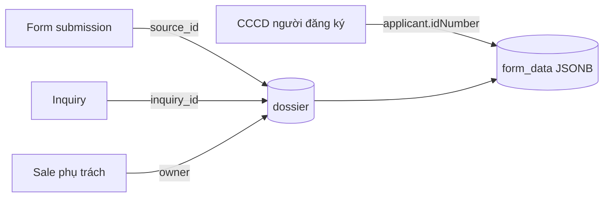
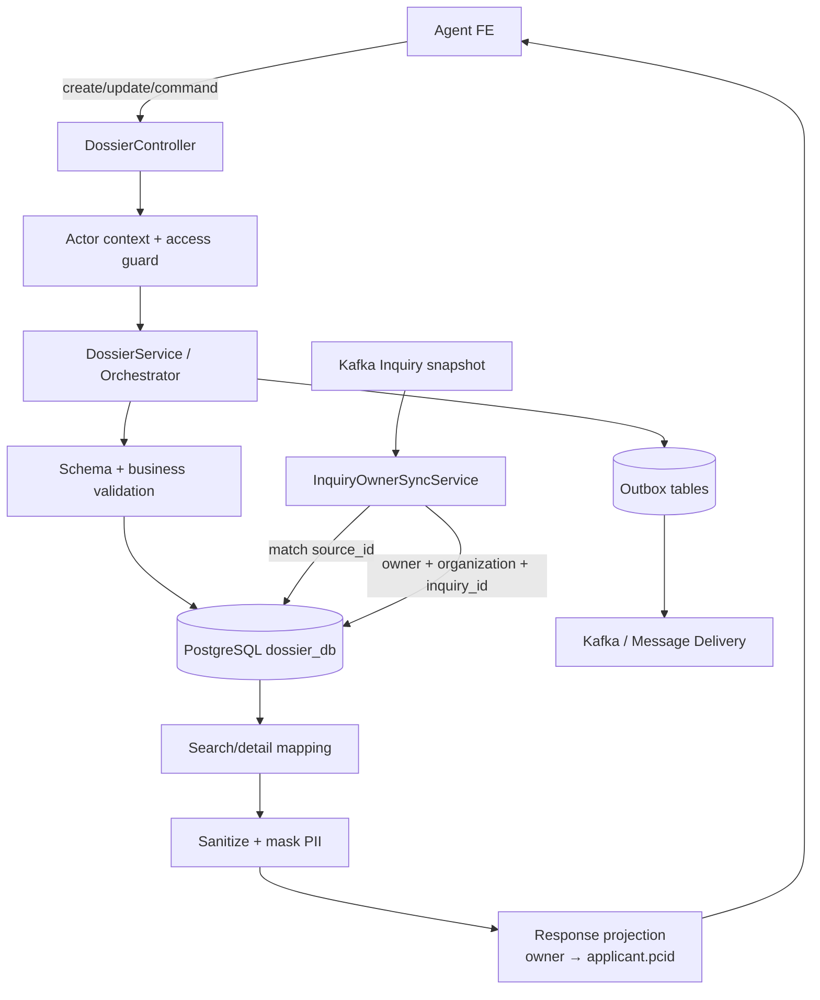
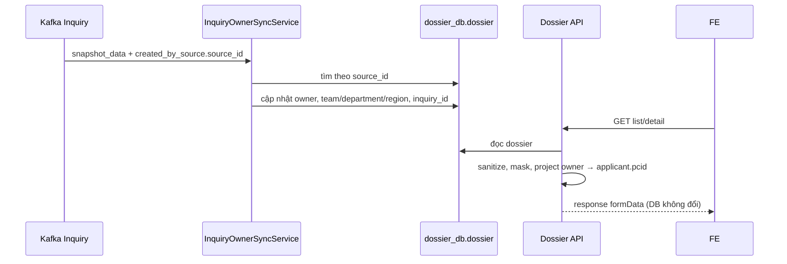
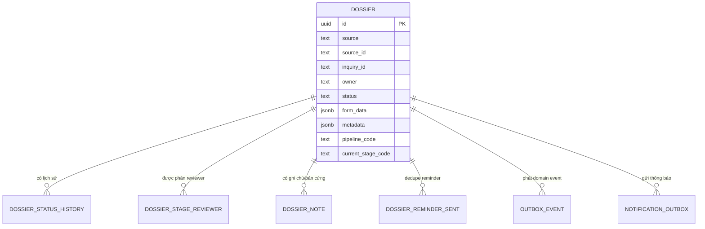
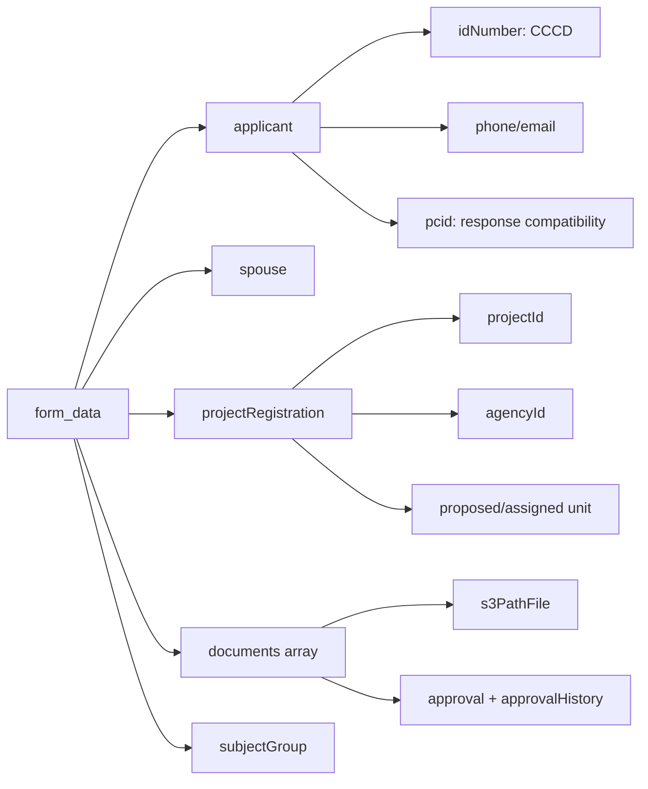

# vhm-dossier-core làm gì? — Hướng dẫn theo code hiện tại

> Tài liệu này trả lời câu hỏi: **hệ thống hiện đang chạy như thế nào?**
>
> Nguồn chính là pipeline, controller, service, entity và migration trong repo.
> `docs/noxh/tdd.md` chỉ dùng để hiểu bối cảnh. Khi TDD khác code, tài liệu này
> lấy **code hiện tại làm nguồn sự thật** và ghi chênh lệch ở cuối.

## 1. Hiểu repo trong một câu

`vhm-dossier-core` quản lý vòng đời hồ sơ đăng ký Nhà ở xã hội: tạo hồ sơ, lưu
thông tin và giấy tờ, phân Sale/reviewer, duyệt PKD → PTT → ghi nhận kết quả Sở
Xây dựng, nhắc bổ sung, gửi thông báo và xuất tài liệu/báo cáo.

Hãy hình dung service này gồm bốn phần:

```text
Hồ sơ + giấy tờ
       |
       v
State machine duyệt hồ sơ -----> Người phụ trách từng stage
       |                                  |
       +----------------+-----------------+
                        v
               Outbox / thông báo / báo cáo
```

Repo này không quản lý master data khách hàng, dự án hay thuật toán OCR. Nó gọi
các hệ thống khác để lấy hoặc xử lý các dữ liệu đó.

## 2. Sáu khái niệm phải phân biệt

### 2.1 Hồ sơ (`dossier`)

Một hồ sơ là một lần đăng ký NOXH của khách hàng cho một dự án. Thông tin nghiệp
vụ chính nằm trong JSONB `form_data`:

- `applicant`: người đứng tên, CCCD, SĐT, email, địa chỉ…
- `spouse`: người đồng đăng ký/vợ chồng.
- `subjectGroup`: nhóm đối tượng NOXH.
- `projectRegistration`: dự án, đại lý, căn nguyện vọng và căn được phân.
- `documents`: snapshot checklist và file đã nộp.

Các field cần lọc nhiều như status, source, owner và pipeline được tách thành cột
riêng trên bảng `dossier`.

### 2.2 Nguồn tạo (`source`)

- `AGENT`: hồ sơ được tạo trực tiếp từ Agent.
- `MARKET`: hồ sơ được đẩy từ Market.

`source` không được đổi sau khi tạo. Hồ sơ Market phải có `Idempotency-Key` để
tránh một request tạo trùng nhiều hồ sơ. `source_id` là ID hồ sơ tại hệ thống
nguồn; có thể gắn lúc tạo hoặc gắn một lần lúc submit. `inquiry_id` là ID của
Inquiry liên kết, được đồng bộ riêng từ `snapshot_data.id`; hai ID này không
thay thế cho nhau.

### 2.3 Người tạo và Sale phụ trách không phải một

- `created_by`: người thực hiện API tạo hồ sơ; đây là dữ liệu audit.
- `owner`: Sale đang phụ trách; có thể đổi khi phân phối/chuyển Sale.
- `owner_team`, `owner_department`, `owner_region`: snapshot tổ chức của owner.

Để tương thích FE, response list/detail ghi đè `formData.applicant.pcid` bằng
`owner` khi `owner` có giá trị. Đây chỉ là projection khi trả dữ liệu, không cập
nhật JSONB trong DB. Dữ liệu cũ có `owner` null/rỗng giữ nguyên `pcid`.

Điểm rất dễ nhầm: `ownershipRule: OWNER` trong pipeline hiện kiểm tra
`dossier.created_by`, không phải cột `dossier.owner`. Email nghiệp vụ và rule
hiển thị liên hệ khách hàng mới dùng Sale phụ trách (`dossier.owner`).

### 2.4 Status, state và stage là ba lớp khác nhau

| Lớp | Ví dụ | Ý nghĩa |
| --- | --- | --- |
| `status` | `DRAFT`, `UNDER_REVIEW`, `ADD_INFO_REQUESTED` | Trạng thái tổng quát, dùng cho filter và rule edit. |
| Pipeline state | `salesUnderReview`, `agentUpdateAtSales` | Vị trí chính xác trong flow. Đang lưu ở cột tên dễ gây nhầm là `current_stage_code`. |
| Stage group | `SALES`, `PROCEDURE`, `SXD` | Phòng/nhóm đang xử lý. Lưu ở `current_stage_group`. |

Ví dụ `procedurePending` và `sxdPending` đều có status `UNDER_REVIEW`, nhưng một
hồ sơ đang chờ PTT duyệt, hồ sơ kia đang chờ PTT ghi nhận kết quả SXD.

### 2.5 Role, visibility và ownership giải ba bài toán khác nhau

- **Role**: người này được phép bấm loại action nào?
- **Visibility**: người này nhìn thấy những hồ sơ nào?
- **Ownership rule**: trong những người có cùng role, ai được thao tác trên đúng
  hồ sơ/stage này?

Chỉ kiểm tra role chưa đủ để kết luận một người xem/sửa được hồ sơ.

### 2.6 Bốn định danh dễ bị nhầm



| Field | Đại diện cho | Nguồn | Dùng chính |
| --- | --- | --- | --- |
| `source_id` | ID hồ sơ ở hệ thống tạo nguồn | Request create/submit hoặc `created_by_source.source_id` | Ghép event nguồn với dossier. |
| `inquiry_id` | ID nhu cầu Inquiry | `snapshot_data.id` của event Inquiry | API `by-inquiry`, truy vết nhu cầu. |
| `owner` | Username/ID Sale đang phụ trách | Profile MW hoặc event phân phối | Quyền hiển thị contact, notification, phân công. |
| `applicant.idNumber` | Số CCCD/CMND của người đăng ký | OCR/form nhập | Chặn hồ sơ active trùng theo CCCD + dự án. |

`source_id` và `inquiry_id` có thể cùng xuất hiện trên một dossier nhưng không
cùng ý nghĩa và không được dùng thay thế nhau. `applicant.pcid` là field tương
thích FE: khi trả list/detail, nếu `owner` có giá trị thì response chiếu
`owner → applicant.pcid`; DB không bị sửa bởi bước chiếu này.

## 3. Ai làm gì?

| Role | Trách nhiệm chính |
| --- | --- |
| `APPLICANT_AGENT` | Tạo, cập nhật, submit và bổ sung hồ sơ do mình tạo. |
| `PKD` | Review giấy tờ, phân căn và quyết định tại stage Kinh doanh khi đang giữ hồ sơ. |
| `PKD_LEAD` | Có quyền của PKD và giao/giao lại reviewer Kinh doanh. |
| `PTT` | Review tại stage Thủ tục; ghi nhận kết quả SXD khi đang giữ hồ sơ. |
| `PTT_LEAD` | Có quyền của PTT và giao/giao lại reviewer Thủ tục/SXD. |

SXD là cơ quan ngoài hệ thống, nên code không có role `SXD`. Ở state
`sxdPending`, nhân sự PTT/Supervisor cập nhật kết quả SXD vào hệ thống.

## 4. Một hồ sơ đi qua hệ thống như thế nào?

### Toàn cảnh luồng ghi và đọc



Điểm quan trọng: luồng ghi lưu dữ liệu nghiệp vụ vào entity/JSONB; luồng đọc có
thể bổ sung field dẫn xuất cho FE. Field dẫn xuất không mặc nhiên là dữ liệu đã
được persist.

### Bước 1 — Tạo bản nháp

Client gọi `POST /internal/v1/dossiers`. Service sẽ:

1. Chọn product pack `SOCIAL_HOUSING` và schema version.
2. Kiểm tra cấu trúc JSON, type/format, kích thước và sanitize dữ liệu.
3. Kiểm tra file đã khai báo thực sự tồn tại trên file service.
4. Chặn một CCCD có nhiều hồ sơ active trong cùng dự án.
5. Lưu hồ sơ ở `DRAFT`, ghi history và outbox.
6. Gắn pipeline `socialHousingStandard`, state đầu là `draft`.

JSON Schema hiện là **soft validation**: chủ yếu chặn sai type, enum và format;
chưa bắt buộc đủ toàn bộ field nghiệp vụ.

### Bước 2 — Upload giấy tờ và OCR CCCD

```text
Client -> dossier-core xin presigned URL
Client -> upload trực tiếp lên private storage
Client -> gửi S3 path mặt trước + mặt sau để OCR
dossier-core -> gọi provider OCR -> trả dữ liệu trích xuất
```

- `POST /dossiers/prepare-upload` sinh path an toàn dạng
  `registrations/{dossierId}/{slug}_{uuid}.{ext}`.
- `POST /dossiers/validate-identity-document` kiểm tra hai mặt CCCD/CMND.
- Provider được chọn bằng `ocr-model-active`: `vinbigdata` hoặc `in_house`.
- Luồng hiện tại là **đồng bộ**, không phải Kafka job + polling/SSE.
- Hệ thống kiểm tra số giấy tờ, ngày sinh, tuổi ≥ 18, hạn giấy tờ, nơi/ngày cấp.
- Nếu path thuộc đúng dossier, `applicant.ocrStatus` được ghi `SUCCESS`/`FAILED`.

Code hiện chọn một provider theo config; chưa tự động thử VinBigData rồi fallback
sang internal OCR.

### Bước 3 — Cập nhật hồ sơ

`PUT /dossiers/{id}` là full replace `formData`/`metadata`:

- `DRAFT` hoặc `ADD_INFO_REQUESTED`: cho sửa đầy đủ nếu đúng role + ownership.
- `SUBMITTED` hoặc `UNDER_REVIEW`: chỉ sửa phone/email của applicant/spouse.
- Trạng thái khác: không cho sửa.
- `assignedUnitCode`/`assignedUnitId` được giữ lại nếu FE vô tình omit.
- `If-Match` dùng version để chống hai request ghi đè nhau.

Chỉ `DRAFT` được hard delete. Hồ sơ đã submit được giữ để audit.

### Bước 4 — Submit và giao Kinh doanh

```text
draft --SUBMIT--> salesUnderReview
```

Side effect:

- Sinh mã hồ sơ ban đầu từ SAP ID, đại lý, ngày submit và sequence.
- Ghi `submitted_at`, history và outbox.
- Thử auto-assign PKD dựa trên grant dự án.
- Auto-assign lỗi thì hồ sơ vẫn ở queue để Lead giao tay.
- Gửi ZNS xác nhận đang chờ Kinh doanh duyệt.

`PKD_LEAD` dùng `ASSIGN` lần đầu hoặc `REASSIGN` để đổi người. Reviewer dùng
`CLAIM` với hồ sơ trống. Quyết định duyệt yêu cầu reviewer đang claim hồ sơ.

### Bước 5 — Kinh doanh duyệt giấy tờ và phân căn

`POST /dossiers/{id}/documents/approve` duyệt nhiều giấy tờ atomically:

- `APPROVED`: chấp nhận.
- `REJECTED`: không đạt.
- `RESET`: về chưa có quyết định.

Mỗi lần duyệt append vào `approvalHistory`; `approval` là quyết định mới nhất.
Một document target sai thì cả batch không lưu.

Trước khi PKD approve stage, mọi giấy tờ bắt buộc phải được approve và hồ sơ phải
có căn:

- `ALLOCATE_UNIT`: chọn/đổi căn ở `salesUnderReview`.
- Hoặc truyền căn cùng `APPROVE` để phân căn + duyệt atomically.
- PKD approve lần đầu đổi mã hồ sơ sang `<sapId>-<seq5>`.

```text
salesUnderReview
  APPROVE          -> procedurePending
  REQUEST_REVISION -> agentUpdateAtSales
  REJECT           -> rejected
```

### Bước 6 — Đại lý bổ sung

```text
salesUnderReview -> agentUpdateAtSales
agentUpdateAtSales --UPDATE/RESUBMIT--> salesUnderReview
```

Hồ sơ được mở lại để người tạo cập nhật. Khi `RESUBMIT`, hồ sơ luôn quay lại PKD,
không đi thẳng tới phòng đã yêu cầu bổ sung.

Reminder có hai lớp:

- ZNS sau 24 giờ nếu vẫn chưa bổ sung.
- Email gửi ở V+6/V+18; hạn hiển thị T+9/T+21, có loại ngày lễ/ngày đặc biệt.

Mỗi reminder có khóa dedupe theo hồ sơ + state + rule + chu kỳ bổ sung. PKD có
endpoint trigger thủ công phục vụ QC.

### Bước 7 — Thủ tục duyệt

```text
procedurePending
  APPROVE          -> sxdPending
  REQUEST_REVISION -> salesRevisionIntake
  RETURN_TO_SALES  -> salesUnderReview
  REJECT           -> rejected
```

PTT được auto-assign round-robin từ roster TTOL; con trỏ lưu Redis. Lead vẫn có
thể giao tay/giao lại.

Nếu PTT yêu cầu bổ sung, hồ sơ về `salesRevisionIntake` để PKD tiếp nhận:

```text
salesRevisionIntake
  APPROVE          -> procedurePending
  REQUEST_REVISION -> agentUpdateAtSales
```

Rule quan trọng: **PKD luôn là đầu mối làm việc với đại lý**.

### Bước 8 — Ghi nhận kết quả Sở Xây dựng

```text
sxdPending
  APPROVE          -> approved
  REQUEST_REVISION -> procedureRevisionIntake
  REJECT           -> rejected

procedureRevisionIntake
  APPROVE          -> sxdPending
  REQUEST_REVISION -> salesRevisionIntake
```

PTT/Supervisor ghi nhận quyết định bên ngoài. Reviewer được giữ qua chu kỳ bổ
sung nếu đã có assignment trước đó (`sticky reviewer`).

### Bước 9 — Thu hồi căn

`REVOKE_UNIT` xóa căn và chuyển hồ sơ sang `rejected`:

- `procedurePending`: PKD hoặc PTT.
- `sxdPending`: chỉ PTT.
- `approved`: PKD hoặc PTT.

Vì vậy `approved` chưa phải terminal tuyệt đối. Hồ sơ chưa có căn không được gọi
action này.

### Bước 10 — Bản cứng và xuất file

Bản cứng không còn là state bắt buộc:

- `SUBMIT_HARDCOPY`: đại lý đã nộp.
- `CONFIRM_HARDCOPY_RECEIVED`: bộ phận xử lý đã nhận.

Hai action chỉ tạo `dossier_note` + outbox, không đổi state. Note hỗ trợ
`HARDCOPY_REQUEST`, `HARDCOPY_SUBMISSION`, `HARDCOPY_RECEIPT`, `GENERAL`.

Download/export hiện có:

- Hai template DOCX đóng gói ZIP: phiếu tiếp nhận + văn bản thỏa thuận.
- Gom toàn bộ file đính kèm thành ZIP.
- Báo cáo danh sách XLSX, tối đa 5.000 dòng/lần.

Code chưa render “hợp đồng PDF sau SXD duyệt” như TDD mô tả.

## 5. Sơ đồ state thực tế

```text
draft --SUBMIT--> salesUnderReview --APPROVE--> procedurePending
                     |     ^                       |
        REQUEST_REV  |     | RESUBMIT              | APPROVE
                     v     |                       v
              agentUpdateAtSales               sxdPending --APPROVE--> approved
                                                   |
                                            REQUEST_REVISION
                                                   v
                                      procedureRevisionIntake
                                                   |
                                            REQUEST_REVISION
                                                   v
                                         salesRevisionIntake
                                            |             |
                                        APPROVE      REQUEST_REVISION
                                            v             v
                                    procedurePending  agentUpdateAtSales

REJECT ở stage review ----------------------------------------------> rejected
REVOKE_UNIT khi đã phân căn ----------------------------------------> rejected
```

`rejected` là terminal. `approved` vẫn cho phép `REVOKE_UNIT`.

## 6. Search, dashboard và báo cáo

`GET /internal/v1/dossiers` hỗ trợ queue nghiệp vụ, status/state/phòng ban, dự
án/đại lý, reviewer, claim status, khoảng ngày, mã hồ sơ/căn/tên khách hàng,
exact phone, quá hạn bổ sung, sort và pagination.

Queue là một bộ filter đóng gói. Ví dụ `PKD_WAIT_ASSIGN` nghĩa là hồ sơ ở stage
PKD và chưa có người nhận. Khi dùng queue, API không cho truyền thêm primitive
filter cùng miền để tránh hai cách lọc mâu thuẫn.

`GET /internal/v1/dossiers/statistics` trả:

- Số hồ sơ theo queue.
- Hồ sơ bổ sung quá hạn theo đại lý.
- Khối lượng xử lý theo reviewer/phòng ban.

`GET /internal/v1/reports/social-housing/export` dùng bộ filter gần giống màn
danh sách, render XLSX, upload rồi trả URL tải xuống.

## 7. Quyền xem dữ liệu

Request nội bộ mang actor context đã ký từ upstream. Core không tin role/user ID
do client tự truyền trong body.

| Visibility | Phạm vi đọc |
| --- | --- |
| `ALL` | Tất cả hồ sơ. |
| `TEAM` | Hồ sơ thuộc dự án mà team có grant `SOCIAL_HOUSING`. |
| `SELF_CREATED` | Hồ sơ có `created_by` là actor. |
| `ASSIGNED` | Hồ sơ actor đang hoặc từng phụ trách, tùy capability. |
| `NONE` | Không thấy hồ sơ. |
| `REGION`, `DEPARTMENT` | Chưa triển khai query scope; hiện deny. |

`SELF_CREATED` có thể có capability tra exact SĐT Việt Nam để tìm hồ sơ khác
người tạo. Capability này chỉ mở exact-phone lookup, không mở toàn bộ dữ liệu.

`agent_project_permission` lưu grant `(teamId, projectId, scope)`. API permission
hỗ trợ tạo nhiều grant, sửa, soft delete, search, group theo dự án và list team.

### Masking phone/email

Ở checkout hiện tại, `ContactPiiMasker` mask `applicant.phone/email` nếu viewer
có role `PKD`/`PKD_LEAD`; role khác thấy nguyên văn. Đây là rule cũ dựa trên role.

Rule PO mới nằm ở branch `feat/huynv106/BDSKD-8760-contact-masking`:

- Sale phụ trách (`viewer.userId == dossier.owner`) được xem đầy đủ contact.
- Áp dụng cho cả nguồn `AGENT` và `MARKET` sau khi owner được resolve/phân phối.
- Người khác nhận dữ liệu đã mask.

Nói ngắn gọn: **được đọc hồ sơ** không đồng nghĩa **được xem contact nguyên
văn**. Đây là hai quyết định độc lập.

## 8. Owner và đồng bộ Market



Owner được cập nhật qua:

- `PUT /dossiers/{id}/owner`: chuyển Sale; Sale mới phải cùng team với người thao tác.
- Kafka `vap.historical.inquiry`: Inquiry đổi Sale thì consumer tìm hồ sơ theo
  `source_id`, sau đó cập nhật `owner`, snapshot tổ chức và `inquiry_id`.

Khi owner đổi, hệ thống ghi outbox. Thông báo sau đó gửi Sale mới; Sale cũ không
nhận mail “thu hồi”.

## 9. Thông báo

Thay đổi hồ sơ và intent gửi notification được ghi cùng transaction vào
`notification_outbox`. Relay gọi Message Delivery và cập nhật `SENT`/`FAILED`
hoặc retry với backoff.

ZNS chính: chờ KD duyệt, cần bổ sung, nhắc bổ sung 24h, PTT đã duyệt, SXD đã
duyệt, và bị từ chối/thu hồi căn.

Email chính: cập nhật trạng thái cho Sale phụ trách, nhắc bổ sung, báo reviewer
khi đại lý nộp lại, và báo người vừa được phân công.

Recipient được resolve qua Profile MW. Sale vùng đại lý ưu tiên email cá nhân;
Sale O2O ưu tiên email công ty. Recipient/error trong log được mask.

Ngoài notification outbox, service có generic `outbox_event`; `OutboxRelay` có
thể publish domain event lên Kafka khi feature flag được bật.

## 10. API chính

| Nhóm | API | Mục đích |
| --- | --- | --- |
| Hồ sơ | `POST /internal/v1/dossiers` | Tạo draft. |
| Hồ sơ | `PUT /internal/v1/dossiers/{id}` | Cập nhật form/metadata. |
| Owner | `PUT /internal/v1/dossiers/{id}/owner` | Chuyển Sale phụ trách. |
| Đọc | `GET /internal/v1/dossiers/{id}` | Chi tiết, timeline, action được bấm. |
| Search | `GET /internal/v1/dossiers` | List/filter/sort hồ sơ. |
| Dashboard | `GET /internal/v1/dossiers/statistics` | Queue, quá hạn, workload. |
| Workflow | `POST /internal/v1/dossiers/{id}/commands/{action}` | Submit, assign, claim, duyệt, bổ sung, phân/thu hồi căn… |
| Giấy tờ | `POST /internal/v1/dossiers/{id}/documents/approve` | Batch duyệt/reset giấy tờ. |
| Upload | `POST /internal/v1/dossiers/prepare-upload` | Presigned upload URL. |
| OCR | `POST /internal/v1/dossiers/validate-identity-document` | OCR + validate CCCD/CMND. |
| Notes | `/internal/v1/dossiers/{id}/notes` | Ghi nhận bản cứng/ghi chú. |
| Download | `GET /internal/v1/dossiers/{id}/download` | DOCX hoặc attachment ZIP. |
| Reminder | `POST /internal/v1/dossiers/{id}/revision-reminders/trigger` | Gửi reminder QC. |
| Lookup | `GET /internal/v1/dossiers/by-contact` | Tìm theo phone/pCid/cid. |
| Lookup | `GET /internal/v1/dossiers/by-inquiry` | Match chính xác tham số `inquiryId` với cột `dossier.inquiry_id`; không query `source_id`. |
| Permission | `/internal/v1/agent-project-permissions` | Team được làm dự án nào. |
| Report | `GET /internal/v1/reports/social-housing/export` | Xuất XLSX theo filter. |

Swagger annotations trong controller có contract/error/precondition chi tiết khi
cần tích hợp một API cụ thể.

## 11. Data model thực tế

### 11.1 Hai lớp schema

Từ “schema” trong repo có hai nghĩa khác nhau:

| Loại schema | Nơi định nghĩa | Mục đích |
| --- | --- | --- |
| PostgreSQL schema | `dossier_db` + Liquibase migration | Cấu trúc bảng, cột, index và constraint vật lý. |
| JSON Schema | `schemas/social_housing.v1.json` | Kiểm tra shape/type/format của `form_data` theo product. |

JSON Schema đang ở chế độ soft validation nên field hợp lệ về kiểu chưa chắc đã
đủ điều kiện submit. Business guard vẫn kiểm tra riêng giấy tờ, CCCD, dự án,
phân quyền và trạng thái.

### 11.2 Quan hệ giữa các bảng chính



### 11.3 Ý nghĩa từng nhóm dữ liệu trong `dossier`

| Nhóm | Field tiêu biểu | Ý nghĩa và nguyên tắc |
| --- | --- | --- |
| Identity | `id`, `source`, `source_id`, `inquiry_id` | `id` là khóa nội bộ; các ID ngoài hệ thống phải để đúng cột theo nguồn. |
| Ownership | `created_by`, `owner`, `owner_team`, `owner_department`, `owner_region` | `created_by` là audit; `owner` là Sale hiện tại; các field tổ chức là snapshot tại lúc phân công. |
| Lifecycle | `status`, `pipeline_code`, `pipeline_version`, `current_stage_code`, `current_stage_group` | `status` phục vụ filter tổng quát; state/stage xác định chính xác vị trí và người xử lý. |
| Payload | `form_data`, `metadata`, `schema_version` | `form_data` là dữ liệu nghiệp vụ; `metadata` là dữ liệu hỗ trợ; `schema_version` chọn JSON Schema. |
| Concurrency/audit | `version`, `created_at/by`, `updated_at/by`, `last_event_at`, `submitted_at` | `version` chống lost update; các timestamp phục vụ audit, sort và SLA. |

### 11.4 Cấu trúc `form_data`



| JSON path | Ý nghĩa | Lưu ý |
| --- | --- | --- |
| `applicant.idNumber` | CCCD/CMND thật | Dùng cùng `projectRegistration.projectId` để kiểm tra trùng hồ sơ active. |
| `applicant.phone/email` | Contact khách hàng | Có thể bị mask trong response tùy viewer. |
| `applicant.pcid` | Alias tương thích FE cho owner khi đọc | Owner null/blank thì không override giá trị cũ. |
| `projectRegistration.projectId` | ID master dự án | Rule trùng so sánh ID, không so sánh tên dự án. |
| `projectRegistration.agencyId` | Đại lý/team gắn hồ sơ | Có thể được sync theo owner team. |
| `documents[]` | Snapshot checklist và file | `approval` là latest; `approvalHistory[]` giữ lịch sử. |

### 11.5 Danh mục bảng

| Bảng | Vai trò |
| --- | --- |
| `dossier` | JSON form, status, source, `source_id`, `inquiry_id`, owner và pipeline projection. |
| `dossier_status_history` | Lịch sử chuyển trạng thái. |
| `dossier_stage_reviewer` | Assignment/decision mới nhất theo stage. |
| `dossier_note` | Ghi chú và sự kiện bản cứng; soft delete. |
| `dossier_reminder_sent` | Dedupe reminder theo chu kỳ bổ sung. |
| `agent_project_permission` | Grant team ↔ project ↔ product scope. |
| `outbox_event` | Domain event chờ publish Kafka. |
| `notification_outbox` | EMAIL/ZNS chờ Message Delivery. |
| `review_case` | Local aggregate cũ; không phải workflow truth chính. |

Quyết định giấy tờ nằm trong từng item `form_data.documents[]`: `approval` là
latest, `approvalHistory` là lịch sử append-only.

## 12. Tích hợp bên ngoài

| Hệ thống | Mục đích |
| --- | --- |
| File service/private file | Upload/download, check file, lưu bundle export. |
| VinBigData/internal OCR | OCR giấy tờ định danh. |
| Market Core | Dự án/căn và lịch ngày đặc biệt. |
| Profile MW (Thrift) | User/team/owner và email recipient. |
| TTOL roster | Danh sách PTT/Supervisor để auto-assign. |
| Redis | Round-robin, cache và replay guard. |
| Kafka | Sync owner Inquiry, invalidate lịch, domain outbox. |
| Message Delivery | Gửi EMAIL/ZNS. |

## 13. TDD khác code ở đâu?

| TDD mô tả | Code hiện tại |
| --- | --- |
| Camunda 8 + orchestrator service riêng. | YAML chạy trong app bằng `LocalPipelineOrchestrator`; `pom.xml` không có Camunda/Zeebe. |
| Definition Center resolve checklist động. | Core nhận và snapshot checklist trong `formData.documents[]`; không gọi Definition Center. |
| OCR async Kafka + polling/SSE + failover. | Endpoint gọi đồng bộ một provider chọn bằng config; chưa auto-failover. |
| Reminder 9h sáng, T+6/T+18. | Scanner fixed-delay; email V+6/V+18, deadline T+9/T+21, cộng ngày lễ; ZNS riêng 24h. |
| Export hợp đồng Word → PDF sau SXD approve. | DOCX ZIP, attachment ZIP và XLSX; chưa có PDF contract endpoint. |
| Bảng `applications`, `application_approvals`, `application_documents`. | Bảng thật là `dossier`, JSONB documents, reviewer/history/note/outbox. |
| SXD có actor duyệt riêng. | Không có role SXD; PTT proxy cập nhật kết quả. |

Không nên implement chỉ dựa vào TDD. Luôn kiểm tra pipeline YAML, controller và
migration trước khi sửa nghiệp vụ.

## 14. Người mới nên đọc code theo thứ tự nào?

1. [`social-housing-standard-v1.yaml`](../../src/main/resources/pipelines/social-housing-standard-v1.yaml):
   action, role, state và hướng chuyển.
2. [`DossierController`](../../src/main/java/vn/vinhomes/agent/dossier/core/controller/DossierController.java):
   API nhận gì, guard nào chạy.
3. [`LocalPipelineOrchestrator`](../../src/main/java/vn/vinhomes/agent/dossier/core/service/LocalPipelineOrchestrator.java):
   side effect của action workflow.
4. [`DossierServiceImpl`](../../src/main/java/vn/vinhomes/agent/dossier/core/service/impl/DossierServiceImpl.java):
   create/update/search/document approval/response.
5. [`DossierAccessGuard`](../../src/main/java/vn/vinhomes/agent/dossier/core/security/internal/DossierAccessGuard.java):
   actor nhìn thấy hồ sơ nào.
6. [`ContactPiiMasker`](../../src/main/java/vn/vinhomes/agent/dossier/core/security/masking/ContactPiiMasker.java):
   contact trả ra có bị mask không.
7. [`DossierEntity`](../../src/main/java/vn/vinhomes/agent/dossier/core/model/DossierEntity.java)
   và [`db/migration`](../../src/main/resources/db/migration): dữ liệu lưu ở đâu.
8. Thư mục [`notification`](../../src/main/java/vn/vinhomes/agent/dossier/core/notification):
   transition gửi gì cho ai.

### Khi sửa một action workflow

Kiểm tra đồng thời:

- Transition + role + ownership trong YAML.
- Precondition/side effect trong orchestrator.
- `availableActions` trả FE.
- Reviewer/history/outbox.
- EMAIL/ZNS.
- Queue/statistics.
- Test cho nhánh được phép và bị chặn.

### Khi sửa quyền hoặc masking

Kiểm tra riêng bốn lớp:

1. Actor context có hợp lệ không.
2. Visibility có cho đọc hồ sơ không.
3. Role/ownership có cho action không.
4. Sau khi đọc, response có cần mask PII không.

Không dùng role làm đại diện cho cả bốn lớp. Đây là lý do rule masking dựa thuần
role khó đáp ứng đúng trường hợp Sale thực sự phụ trách hồ sơ.
