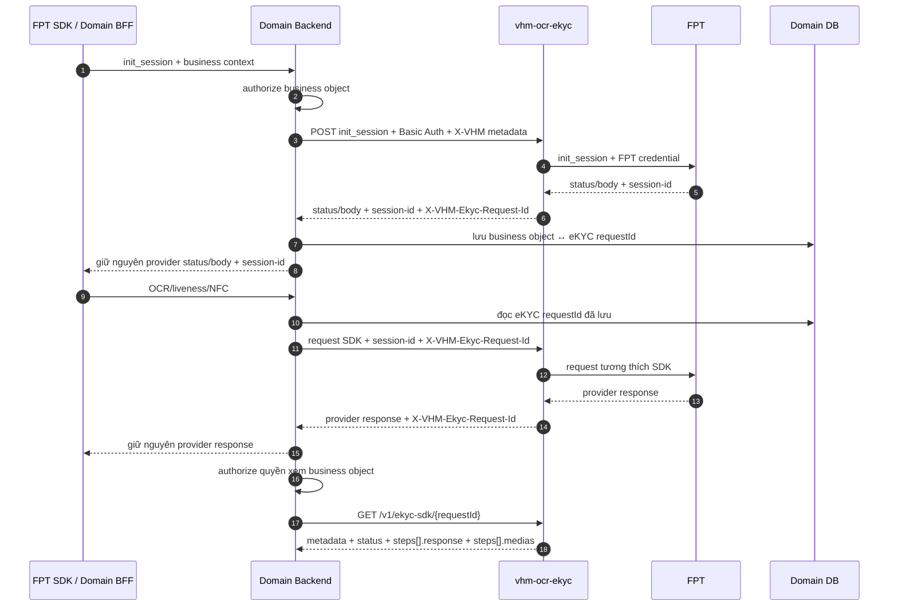

# Hướng dẫn Domain Backend tích hợp eKYC

## 1. Mục đích và phạm vi

Tài liệu này hướng dẫn Domain Backend Service gọi `vhm-ocr-ekyc` cho hành trình eKYC,
lưu định danh request do VHM cấp và lấy lại chi tiết eKYC đã lưu.

Các API Domain Backend được sử dụng:

| Mục đích | API |
| --- | --- |
| Khởi tạo phiên | `POST /v1/ekyc-sdk/init_session` |
| OCR giấy tờ | `POST /v1/ekyc-sdk/ocr` |
| Liveness và face match | `POST /v1/ekyc-sdk/face/liveness` |
| Kiểm tra NFC | `POST /v1/ekyc-sdk/check_chip` |
| Lấy chi tiết eKYC đã lưu | `GET /v1/ekyc-sdk/{requestId}` |

QR, SDK tracing, API danh sách và provider-call/raw-response không thuộc contract công
bố cho Domain Backend.

## 2. Xác thực và base URL

- Domain Backend gọi `vhm-ocr-ekyc` bằng Basic Authentication qua HTTPS; ingress/platform
  thực hiện kiểm tra credential, application không kiểm tra lại Basic Auth.
- Dùng credential riêng cho từng môi trường/caller và lấy từ Secret Manager tại runtime.
- Không ghi `Authorization`, request/response chứa PII, `session-id` hoặc media vào log.
- Không gửi FPT `api-key`/`api_key`; `vhm-ocr-ekyc` tự chèn credential FPT.
- Không hard-code base URL hoặc credential trong source code.

Ví dụ biến cấu hình trong các lệnh bên dưới:

```bash
EKYC_BASE_URL="https://<internal-host>/ocr-ekyc/api"
EKYC_BASIC_USER="<secret-manager-reference>"
EKYC_BASIC_PASSWORD="<secret-manager-reference>"
```

## 3. Ba định danh không được nhầm lẫn

| Giá trị | Nguồn | Mục đích | Cách xử lý tại Domain Backend |
| --- | --- | --- | --- |
| `X-VHM-Ekyc-Request-Id` | `vhm-ocr-ekyc` | UUID dùng để tương quan các bước của hành trình trong VHM | Không bắt buộc ở wire contract; cần lưu sau `init_session` và gửi lại nếu Domain Backend cần đối soát/lấy đầy đủ detail |
| `session-id` | FPT, trả qua `vhm-ocr-ekyc` | Duy trì phiên FPT giữa init/OCR/liveness/NFC | Chuyển tiếp đúng giá trị ở các bước sau; coi là dữ liệu nhạy cảm |
| `x-request-id` | FPT | Truy vết một lần gọi provider | Không dùng làm `{requestId}` khi gọi API detail |

`GET /v1/ekyc-sdk/{requestId}` nhận giá trị từ header
`X-VHM-Ekyc-Request-Id`, không nhận `session-id` hoặc `x-request-id`.

## 4. Luồng tích hợp phục vụ đối soát



Quy tắc triển khai khi Domain Backend cần đối soát dữ liệu:

1. Domain Backend gọi `init_session` trước và lấy
   `X-VHM-Ekyc-Request-Id` từ response header.
2. Lưu UUID này theo business object/hành trình eKYC ngay khi nhận được, kể cả khi
   FPT trả non-2xx nhưng header vẫn có mặt, để phục vụ truy vết.
3. Ở mọi bước tiếp theo, Domain Backend nên đọc UUID từ dữ liệu server-side và inject
   vào header `X-VHM-Ekyc-Request-Id`; không tin request ID do Mobile/Web tự gửi.
4. Đồng thời chuyển tiếp đúng `session-id` FPT của cùng phiên.
5. Đọc lại `X-VHM-Ekyc-Request-Id` trên response của mỗi bước và kiểm tra nó bằng ID
   đã lưu. Nếu khác nhau, không tự ghi đè mapping; dừng flow và xử lý như lỗi tương quan.
6. Trước khi gọi API detail, Domain Backend phải kiểm tra người dùng có quyền trên
   business object đang ánh xạ với `requestId`.

`X-VHM-Ekyc-Request-Id` không bắt buộc ở cấp API. Nếu header thiếu, sai định dạng hoặc
không trỏ tới request phù hợp, capability fallback theo `session-id`; khi không tìm thấy
phiên, capability tạo một audit request khác và trả ID hiệu lực mới trên response. Cơ chế
này giữ tương thích SDK nhưng có thể làm dữ liệu của một hành trình nằm ở nhiều request.
Vì vậy Domain Backend muốn đối soát/lấy đầy đủ detail không được dựa vào fallback.

## 5. Khởi tạo phiên và lưu request ID

### 5.1 Request

Các header metadata VHM chỉ gửi ở bước `init_session`:

| Header | Bắt buộc trong tích hợp Domain | Ràng buộc |
| --- | --- | --- |
| `X-VHM-Source` | Có | Tối đa 30 ký tự, ví dụ `DOSSIER` |
| `X-VHM-Reference-Id` | Có | Tối đa 150 ký tự; dùng định danh nghiệp vụ opaque |
| `X-VHM-Request-By` | Có | Tối đa 150 ký tự; không đưa PII không cần thiết |
| `X-VHM-Channel` | Có | `MOBILE` hoặc `WEB`, phải khớp `device-type` |
| `X-Correlation-Id` | Khuyến nghị | Chuỗi opaque tối đa 128 ký tự |
| `device-type` | Có | `android`, `ios` hoặc `web-sdk` |

```bash
curl --request POST "${EKYC_BASE_URL}/v1/ekyc-sdk/init_session" \
  --user "${EKYC_BASIC_USER}:${EKYC_BASIC_PASSWORD}" \
  --header "Content-Type: application/json" \
  --header "device-type: android" \
  --header "X-VHM-Source: DOSSIER" \
  --header "X-VHM-Reference-Id: <opaque-business-reference>" \
  --header "X-VHM-Request-By: <opaque-actor-reference>" \
  --header "X-VHM-Channel: MOBILE" \
  --header "X-Correlation-Id: <correlation-id>" \
  --data '{"memory":"10.8","nfc_support":"true"}' \
  --include
```

Ngoài các trường minh họa, Domain Backend phải giữ nguyên metadata/header do phiên
bản FPT SDK được phê duyệt tạo ra theo OpenAPI.

### 5.2 Response và lưu mapping

Các API mutation trả nguyên HTTP status/body tương thích FPT, không bọc trong envelope
VHM. Response của `init_session` có hai header cần lấy:

```http
X-VHM-Ekyc-Request-Id: 0198f0f0-7b42-7a18-8c54-4ad3a274be82
session-id: <provider-session-id>
```

Domain Backend phải:

- Parse `X-VHM-Ekyc-Request-Id` thành UUID và lưu theo business object.
- Không tự sinh UUID thay thế nếu header bị thiếu hoặc không hợp lệ.
- Chuyển `session-id`, status và body về tầng gọi theo đúng contract SDK.
- Không dùng `session-id` làm khóa nghiệp vụ lâu dài và không ghi nó vào log.

Pseudo-code:

```java
ProviderResponse response = ekycClient.initSession(request);

UUID ekycRequestId = requireUuidHeader(response, "X-VHM-Ekyc-Request-Id");
String providerSessionId = requireHeader(response, "session-id");

ekycJourneyRepository.attachRequestId(businessObjectId, ekycRequestId);
return preserveProviderResponse(response, providerSessionId);
```

## 6. Gọi các bước tiếp theo

Wire contract cho phép không gửi `X-VHM-Ekyc-Request-Id`. Tuy nhiên, Domain Backend
muốn đối soát cùng một hành trình nên gửi các header sau ở OCR, liveness và NFC:

```http
Authorization: Basic <service-credential>
X-VHM-Ekyc-Request-Id: <UUID đã lưu sau init_session>
session-id: <session-id của cùng phiên FPT>
device-type: <android|ios|web-sdk>
```

### 6.1 OCR giấy tờ

```bash
curl --request POST "${EKYC_BASE_URL}/v1/ekyc-sdk/ocr" \
  --user "${EKYC_BASIC_USER}:${EKYC_BASIC_PASSWORD}" \
  --header "X-VHM-Ekyc-Request-Id: ${EKYC_REQUEST_ID}" \
  --header "session-id: ${EKYC_SESSION_ID}" \
  --header "device-type: android" \
  --header "document-type: idr" \
  --header "lang: vi" \
  --form "files=@front.jpg;type=image/jpeg" \
  --form "files=@back.jpg;type=image/jpeg"
```

- Nếu gửi hai mặt trong một request, thứ tự `files` phải là mặt trước rồi mặt sau.
- Nếu gửi từng mặt, dùng `side-type: front` trước rồi `side-type: back`.
- Không parse rồi dựng lại multipart; giữ nguyên byte, thứ tự media và semantic SDK.

### 6.2 Liveness

Gửi một trong hai chế độ, không gửi đồng thời:

- Một hoặc nhiều part `selfies` dạng `image/jpeg` hoặc `image/png`.
- Một part `video` dạng `video/mp4`.

```bash
curl --request POST "${EKYC_BASE_URL}/v1/ekyc-sdk/face/liveness" \
  --user "${EKYC_BASIC_USER}:${EKYC_BASIC_PASSWORD}" \
  --header "X-VHM-Ekyc-Request-Id: ${EKYC_REQUEST_ID}" \
  --header "session-id: ${EKYC_SESSION_ID}" \
  --header "device-type: android" \
  --header "auto: True" \
  --header "lang: vi" \
  --form "selfies=@selfie.jpg;type=image/jpeg"
```

### 6.3 NFC

```bash
curl --request POST "${EKYC_BASE_URL}/v1/ekyc-sdk/check_chip" \
  --user "${EKYC_BASIC_USER}:${EKYC_BASIC_PASSWORD}" \
  --header "Content-Type: application/json" \
  --header "X-VHM-Ekyc-Request-Id: ${EKYC_REQUEST_ID}" \
  --header "session-id: ${EKYC_SESSION_ID}" \
  --header "device-type: android" \
  --header "auto: True" \
  --header "lang: vi" \
  --data '<NFC payload do SDK tạo>'
```

Domain Backend chuyển tiếp payload NFC do SDK tạo; không tự dựng lại data group và
không ghi payload vào log.

## 7. Lấy chi tiết eKYC đã lưu

### 7.1 Request

```bash
curl --request GET "${EKYC_BASE_URL}/v1/ekyc-sdk/${EKYC_REQUEST_ID}" \
  --user "${EKYC_BASIC_USER}:${EKYC_BASIC_PASSWORD}" \
  --header "X-Correlation-Id: <correlation-id>"
```

`EKYC_REQUEST_ID` phải được đọc từ mapping server-side của business object sau khi
Domain Backend đã authorize quyền xem.

### 7.2 Response

Khác với bốn API proxy đồng bộ, API detail dùng envelope VHM:

```json
{
  "code": 0,
  "msg": "success",
  "data": {
    "requestId": "0198f0f0-7b42-7a18-8c54-4ad3a274be82",
    "requestType": "EKYC",
    "source": "DOSSIER",
    "referenceId": "opaque-business-reference",
    "status": "COMPLETED",
    "currentStep": "LIVENESS",
    "outcome": "EKYC_CALL_COMPLETED",
    "lastErrorCode": null,
    "createdAt": "2026-09-03T03:00:00Z",
    "completedAt": "2026-09-03T03:02:00Z",
    "steps": [
      {
        "operation": "INIT_SESSION",
        "response": {
          "code": "200",
          "message": "success"
        }
      },
      {
        "operation": "OCR",
        "response": {
          "errorCode": "0",
          "errorMessage": "",
          "data": []
        },
        "medias": [
          {
            "mediaId": "0198f0f1-2248-75a9-b0d1-52fc32209bb8",
            "role": "ID_FRONT",
            "position": 1,
            "fileName": "<generated-media-id>.jpg",
            "downloadUrl": "https://<short-lived-private-url>"
          }
        ]
      }
    ]
  },
  "meta": null
}
```

Các trường trong `steps[].response` phụ thuộc operation và phiên bản FPT, được trả ở
dạng key camelCase. Domain Backend chỉ map các trường nghiệp vụ đã thống nhất; không
phụ thuộc toàn bộ payload provider.

Media OCR/liveness được upload bất đồng bộ. Ngay sau mutation thành công,
`steps[].medias` có thể chưa xuất hiện. Việc thiếu media tại thời điểm gọi đầu tiên
không đồng nghĩa eKYC thất bại.

## 8. Xử lý lỗi và retry

| Tình huống | Xử lý tại Domain Backend |
| --- | --- |
| `400` | Sửa request/header; không retry nguyên trạng |
| `401/403` | Kiểm tra Basic Auth/quyền; không gửi credential FPT |
| `404` khi lấy detail | Kiểm tra mapping business object → VHM request ID; không thử bằng `session-id` hoặc `x-request-id` |
| `413` | Payload vượt giới hạn; không retry nguyên trạng |
| `429` | Tuân theo `Retry-After` |
| Timeout/mất kết nối khi gọi mutation | Không tự retry vì không biết FPT đã nhận request hay chưa; thực hiện đối soát theo runbook |
| Timeout khi gọi `GET` detail | Có thể retry vì GET không làm thay đổi trạng thái; áp dụng backoff và rate limit |

Không biến lỗi lưu/audit/media thành một lần gọi lại mutation FPT. Response provider đã
trả về cho SDK và dữ liệu detail là hai trách nhiệm riêng.

## 9. Checklist bàn giao Domain Backend

- [ ] Cấu hình base URL và Basic Auth theo từng môi trường bằng Secret Manager.
- [ ] Authorize business object trước mọi lời gọi tới capability.
- [ ] Gửi metadata VHM tại `init_session`.
- [ ] Lưu `X-VHM-Ekyc-Request-Id` dạng UUID theo business object.
- [ ] Inject request ID server-side vào OCR/liveness/NFC.
- [ ] Chuyển tiếp đúng `session-id` của cùng phiên.
- [ ] Giữ nguyên status/body và header provider cần thiết cho SDK.
- [ ] Không tự retry mutation khi outcome chưa biết.
- [ ] Dùng request ID đã lưu để gọi `GET /v1/ekyc-sdk/{requestId}`.
- [ ] Không log credential, session, PII, provider response hoặc media.
- [ ] Xử lý `429` theo `Retry-After` và kiểm thử các nhánh `400/401/403/404/413/429/5xx`.
