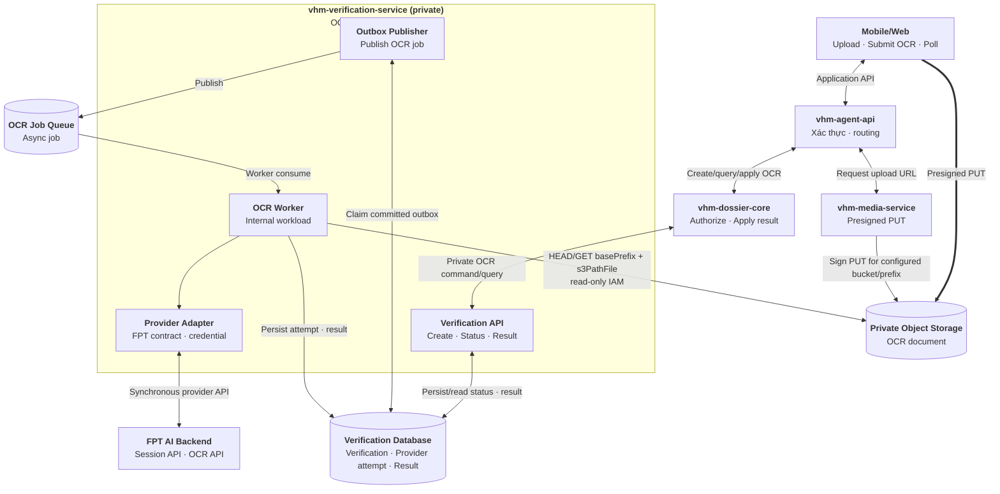
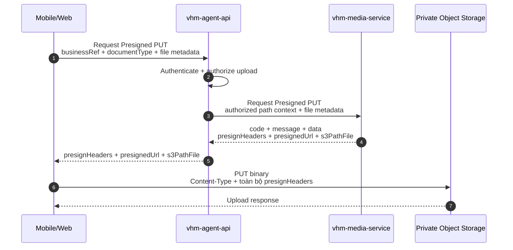
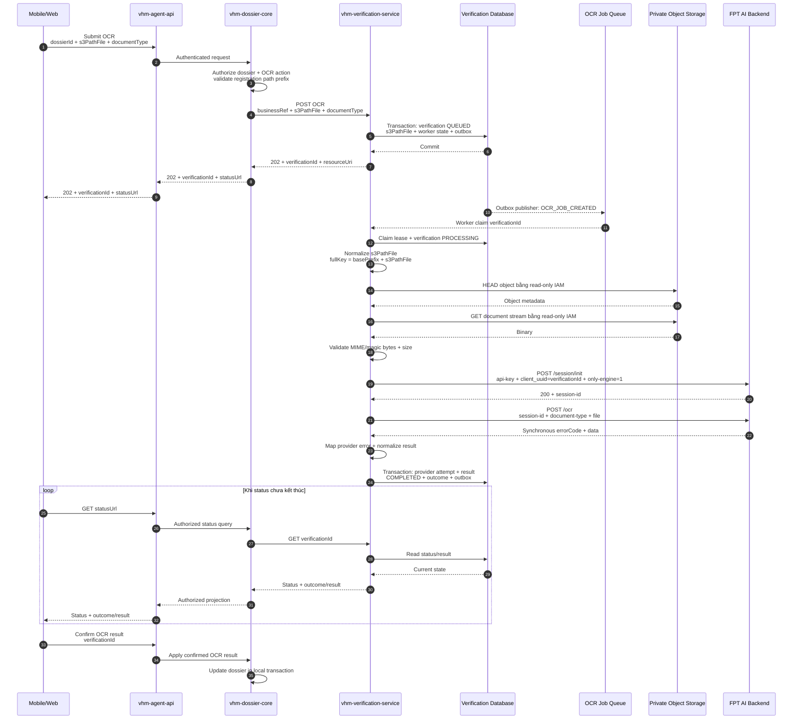
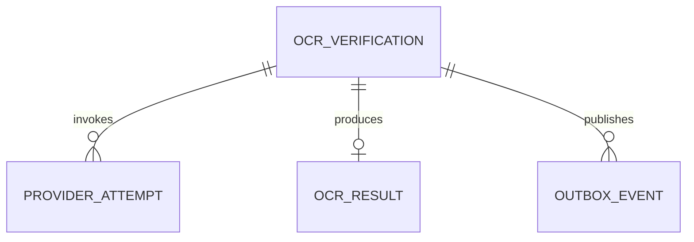
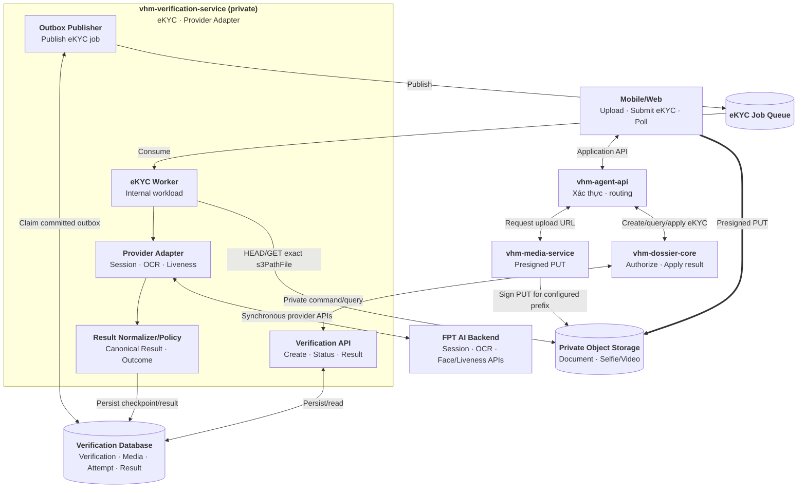
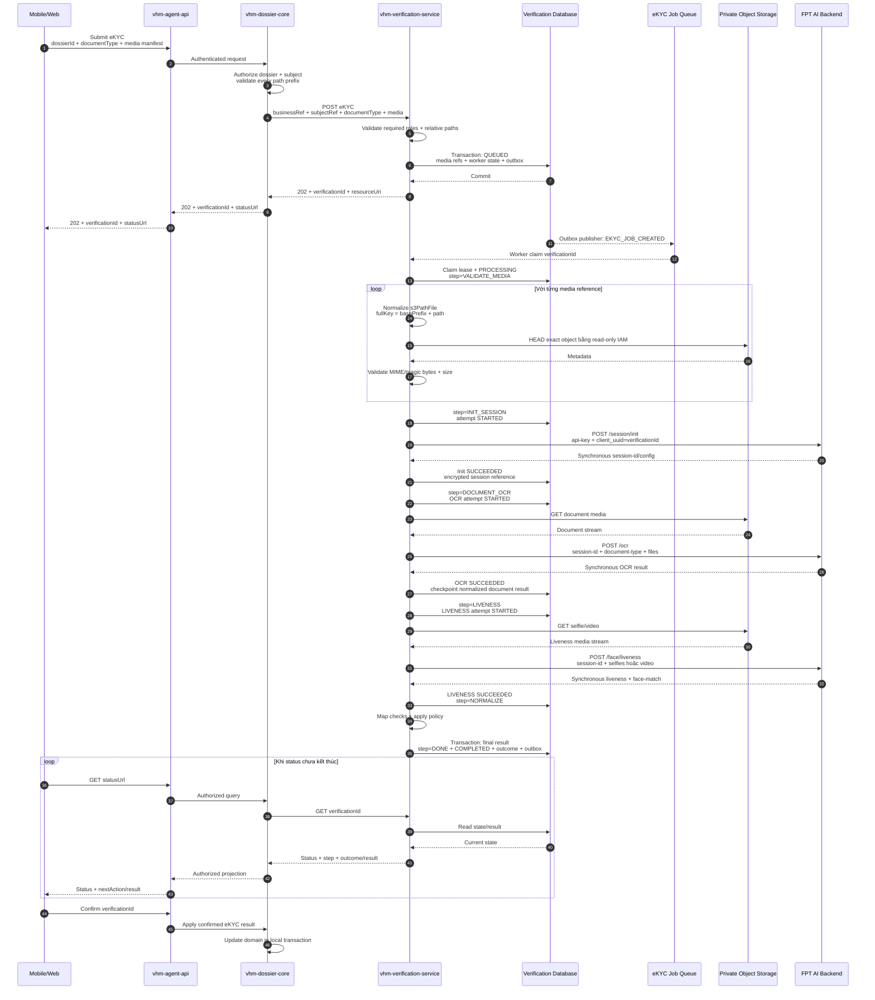
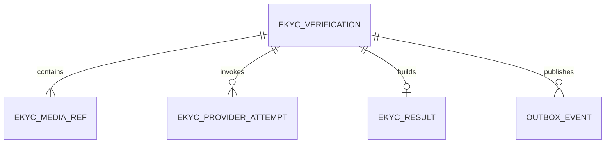

# Vấn đề 6: Thiết kế tích hợp OCR và eKYC tập trung

## Phần I — OCR bằng backend API

### 1. Phạm vi

Tài liệu này chỉ thiết kế **luồng OCR tích hợp bằng backend API**. Mobile/Web không tích hợp SDK của FPT và không gọi trực tiếp FPT AI.

Phạm vi bao gồm:

- Upload một tài liệu lên `vhm-media-service` bằng Presigned PUT.
- Tạo yêu cầu OCR qua `vhm-agent-api` và `vhm-dossier-core`.
- `vhm-verification-service` xử lý OCR bất đồng bộ bằng queue/worker.
- Worker gọi FPT AI bằng server credential, chuẩn hóa và lưu kết quả.
- Mobile/Web polling trạng thái/kết quả từ API của VHM và xác nhận dữ liệu trước khi apply vào hồ sơ.

Phần này chỉ mô tả OCR tài liệu. Luồng eKYC dùng cùng mô hình API + queue/worker được mô tả tại Phần II của tài liệu.

Các tài liệu nghiệp vụ dự kiến:

- CCCD/CMND khi API/model được chọn hỗ trợ đúng input contract.
- Giấy đăng ký kết hôn.
- Bản sao có chứng thực giấy chứng nhận hộ nghèo/cận nghèo.
- Các giấy tờ khác trong checklist hồ sơ NOXH sau khi có model/template và schema kết quả tương ứng.

Mỗi yêu cầu OCR xử lý **một logical document**, được tham chiếu bằng `s3PathFile` do `vhm-media-service` sinh. `documentType` chỉ dùng để chọn provider API/model và schema chuẩn hóa; nó không tạo một workflow khác.

OCR chỉ hỗ trợ số hóa và gợi ý dữ liệu. Kết quả OCR không xác minh người thao tác là chủ thể của giấy tờ và không tự quyết định hồ sơ đủ điều kiện NOXH. Người dùng phải xác nhận trước khi `vhm-dossier-core` cập nhật dữ liệu nghiệp vụ.

### 2. Quyết định kiến trúc

| **Hướng tiếp cận** | **Ưu điểm** | **Nhược điểm** | **Lựa chọn** |
| --- | --- | --- | --- |
| `vhm-dossier-core` gọi trực tiếp FPT AI | Ít thành phần ban đầu | Domain NOXH phụ thuộc credential, session, payload, error code và SLA của FPT; khó tái sử dụng cho domain khác | No |
| `vhm-verification-service` tích hợp FPT AI | Tập trung provider adapter, credential, queue/worker, retry, timeout và Canonical Result; domain chỉ authorize và apply | Thêm một service và hạ tầng job | **Yes** |

`vhm-verification-service` cung cấp contract OCR ổn định cho các domain. FPT `/ocr` là synchronous, nhưng API của VHM vẫn là asynchronous:

```text
Mobile/Web → VHM create OCR → 202 QUEUED
OCR Worker → FPT /session/init → FPT /ocr synchronous
OCR Worker → lưu Canonical Result
Mobile/Web → poll VHM status/result
```

Cách bọc này tránh giữ kết nối Mobile/Web trong thời gian upload media từ storage và chờ provider, đồng thời cô lập timeout/backlog của FPT khỏi `vhm-dossier-core`.

### 3. Kiến trúc OCR tập trung

#### 3.1. Thành phần

| **Thành phần** | **Trách nhiệm** |
| --- | --- |
| Mobile/Web | Upload tài liệu; tạo OCR; poll; hiển thị và cho người dùng xác nhận kết quả |
| `vhm-agent-api` | Xác thực/routing và authorize yêu cầu cấp Presigned PUT; không giữ FPT credential |
| `vhm-dossier-core` | Authorize hồ sơ, `businessRef`, yêu cầu OCR, query/apply kết quả |
| `vhm-media-service` | Chỉ tham gia upload: trả `presignHeaders + presignedUrl + s3PathFile` |
| Verification API | Private command/query API của `vhm-verification-service` |
| OCR Worker | Claim job, đọc tài liệu, gọi provider và persist kết quả; không mở public API |
| Provider Adapter | Ánh xạ `documentType` sang FPT API/model; inject credential; map response/error |
| Result Normalizer | Chuyển provider response thành Canonical Result có version |
| Verification Database + Outbox | Lưu lifecycle, `s3PathFile`, worker lease/retry, provider attempt, result và sự kiện |

`Verification API`, `OCR Worker`, `Provider Adapter` và `Result Normalizer` là module/workload trong cùng `vhm-verification-service`, không phải các service public riêng.

#### 3.2. Thành phần và hướng dữ liệu



Hai đường dữ liệu được tách rõ:

- Upload binary: `Mobile/Web → Presigned PUT → Object Storage`.
- OCR: `vhm-verification-service → Object Storage → FPT AI Backend`.

Mobile/Web không gửi binary qua `vhm-dossier-core` hoặc `vhm-verification-service` khi upload và không gọi trực tiếp FPT. Khi tạo OCR, Verification API persist `QUEUED` cùng outbox; Outbox Publisher đưa job vào `OCR Job Queue`, sau đó OCR Worker mới đọc media và gọi FPT. Các module nằm trong khung `vhm-verification-service` thuộc cùng một service/codebase; queue là hạ tầng messaging của workload này.

#### 3.3. Lifecycle và outcome

`status` mô tả vòng đời kỹ thuật:

```text
QUEUED → PROCESSING → COMPLETED
   └───────────────→ CANCELLED/EXPIRED
```

- `QUEUED`: verification đã lưu `s3PathFile`/worker state và có outbox để publish message.
- `PROCESSING`: worker đã claim job.
- `COMPLETED`: đã có kết luận cuối cùng, kể cả trường hợp provider lỗi sau khi hết recovery budget.
- `CANCELLED/EXPIRED`: kết thúc không có outcome.

`outcome` chỉ có khi `status=COMPLETED`:

| **Outcome** | **Ý nghĩa** |
| --- | --- |
| `OCR_COMPLETED` | Đã đọc và chuẩn hóa tài liệu; người dùng vẫn phải xác nhận |
| `NEED_REVIEW` | Kết quả có confidence/warning cần kiểm tra thủ công |
| `NEED_RETRY` | Input không đọc được hoặc chất lượng không đạt; cần upload tài liệu mới |
| `PROVIDER_ERROR` | Hết recovery budget hoặc provider không trả kết quả hợp lệ |

Lỗi transport/provider không được ánh xạ thành lỗi nghiệp vụ của hồ sơ.

### 4. Upload tài liệu

Upload diễn ra trước OCR và không tạo `verificationId`. `vhm-agent-api` gọi thẳng `vhm-media-service`; `vhm-dossier-core` và `vhm-verification-service` không nằm trong luồng upload. Contract hiện có không trả `mediaId` và không có bước finalize trong flow này.



Response hiện có của Media Service:

```json
{
  "code": 0,
  "message": "Thành công",
  "data": {
    "presignHeaders": {
      "x-amz-meta-vhm_performer": "dossier-svc",
      "x-amz-meta-vhm_performer_source": "http-internal",
      "x-amz-server-side-encryption": "aws:kms",
      "x-amz-server-side-encryption-aws-kms-key-id": "<kms-key-arn>"
    },
    "presignedUrl": "<temporary-presigned-put-url>",
    "s3PathFile": "registrations/9170c0b1-09ce-4016-b701-3626386abea0/document-c9eedd4c.png"
  }
}
```

Quy ước tích hợp:

- Client phải gửi đúng `Content-Type` và toàn bộ `presignHeaders`; thay đổi hoặc thiếu signed header làm S3 từ chối request.
- Sau khi S3 trả upload thành công, Mobile/Web submit OCR bằng `s3PathFile`; không có request finalize riêng.
- Chỉ `s3PathFile` được dùng làm durable reference. Không persist hoặc chuyển tiếp lại `presignedUrl` sau upload vì URL chứa credential tạm thời và sẽ hết hạn.
- `s3PathFile` phải là relative path do Media Service sinh trong business prefix đã authorize; không nhận full S3 URL, bucket hoặc path tùy ý từ client.
- Trước khi gọi FPT, worker chuẩn hóa `s3PathFile`, ghép với bucket/base prefix cấu hình, rồi HEAD/GET S3 bằng IAM read-only. Worker kiểm tra object tồn tại cùng MIME/magic bytes/kích thước trước khi đọc binary.
- Contract hiện tại không cung cấp `mediaId`, trạng thái `FINALIZED` hoặc bằng chứng object immutable; TDD không giả định các năng lực này.

### 5. Luồng OCR bằng API

#### 5.1. Luồng tổng quan trong `vhm-verification-service`

```mermaid
flowchart LR
    API["`**Verification API**
Validate request`"]
    ACCEPT["`**Database transaction**
QUEUED · s3PathFile · Outbox`"]
    QUEUE[("`**OCR Job Queue**`")]
    WORKER["`**OCR Worker**
PROCESSING`"]
    READ["`**Storage Reader**
Normalize path · HEAD/GET S3`"]
    INIT["`**FPT Session API**
POST /session/init`"]
    OCR["`**FPT OCR API**
POST /ocr · synchronous`"]
    NORMALIZE["`**Result Normalizer**
Canonical fields · warnings`"]
    DONE["`**Verification Database**
COMPLETED · outcome · result`"]
    STATUS["`**Verification API**
GET status/result`"]

    API --> ACCEPT -->|"Publish"| QUEUE --> WORKER
    WORKER --> READ --> INIT --> OCR --> NORMALIZE --> DONE
    DONE --> STATUS
```



Toàn bộ box từ `Verification API` đến `Result Normalizer` thuộc cùng `vhm-verification-service`. FPT không xử lý job bất đồng bộ trong contract `/ocr` đang dùng; worker chờ response synchronous rồi mới normalize và persist.

#### 5.2. Sequence diagram end-to-end



Hai call FPT có vai trò khác nhau:

- `/session/init` tạo phiên provider và trả `session-id` bắt buộc cho `/ocr`.
- `/ocr` nhận document và trả kết quả OCR đồng bộ.

VHM không trả `session-id` xuống Mobile/Web và không dùng nó làm `verificationId`.

### 6. API contract của `vhm-verification-service`

#### 6.1. Danh sách API

| **Use case** | **Private API** | **Response** |
| --- | --- | --- |
| Tạo OCR | `POST /v1/ocr-verifications` | `202 + verificationId + resourceUri` |
| Lấy trạng thái | `GET /v1/ocr-verifications/{verificationId}` | Status, outcome, next action |
| Lấy kết quả | `GET /v1/ocr-verifications/{verificationId}/result` | Canonical Result |
| Thử lại | `POST /v1/ocr-verifications/{verificationId}/retries` | `202`, tạo verification mới |

Các API trên chỉ được expose qua private ingress/DNS cho service caller có mTLS hoặc service token đúng scope. Prefix `/internal` không được sử dụng vì toàn bộ API của `vhm-verification-service` đã là private. URL không chứa khái niệm `dossierId`; domain caller truyền định danh nghiệp vụ bằng `businessRef.type + businessRef.id` trong command và tự lưu association với `verificationId`.

Các route `/dossiers/...` nếu có thuộc Application API của `vhm-agent-api`/`vhm-dossier-core`, không phải contract của service dùng chung. Tương tự, cấp Presigned PUT thuộc API hiện có của `vhm-media-service`, còn confirm/apply kết quả thuộc API và transaction của từng domain; các nhóm API này không được định nghĩa lại trong mục này.

`vhm-verification-service` trả service `resourceUri`. Domain caller ánh xạ URI này thành URL thuộc application của mình và authorize lại trên mỗi request từ Mobile/Web; URI của private service không được chuyển nguyên cho client.

#### 6.2. Tạo OCR

```http
POST /v1/ocr-verifications
Authorization: Bearer <service-token>
Idempotency-Key: 72aacfa4-97b8-4d0f-bb74-490f17352b1b
Content-Type: application/json

{
  "businessRef": { "type": "DOSSIER", "id": "dos-01" },
  "subjectRef": "customer-opaque-ref",
  "channel": "MOBILE",
  "documentType": "MARRIAGE_CERTIFICATE",
  "s3PathFile": "registrations/9170c0b1-09ce-4016-b701-3626386abea0/document-c9eedd4c.png"
}
```

```http
HTTP/1.1 202 Accepted
Retry-After: 3

{
  "verificationId": "ver-123",
  "status": "QUEUED",
  "resourceUri": "/v1/ocr-verifications/ver-123"
}
```

Create chỉ trả `202` sau khi verification chứa `s3PathFile`/worker state và outbox đã commit thành công. Nếu không thể persist an toàn, API trả lỗi; không trả `202` rồi để mất yêu cầu xử lý.

#### 6.3. Status và result

```json
{
  "verificationId": "ver-123",
  "status": "PROCESSING",
  "outcome": null,
  "resultAvailable": false,
  "nextAction": "POLL",
  "updatedAt": "2026-08-10T11:30:25+07:00"
}
```

Canonical Result không phụ thuộc tên field/error code của FPT:

```json
{
  "verificationId": "ver-123",
  "status": "COMPLETED",
  "outcome": "OCR_COMPLETED",
  "schemaVersion": "1.0",
  "document": {
    "type": "MARRIAGE_CERTIFICATE",
    "fields": {
      "certificateNumber": {
        "value": "01/2026",
        "confidence": 0.97
      },
      "registrationDate": {
        "value": "2026-08-01",
        "confidence": 0.95
      }
    },
    "warnings": []
  },
  "nextAction": "CONFIRM_AND_APPLY",
  "completedAt": "2026-08-10T11:31:12+07:00"
}
```

Kết quả chỉ chứa field nằm trong allowlist của `documentType`. Raw provider payload, API key, provider session, storage path và read-grant URL không được trả qua Application API.

#### 6.4. HTTP và error contract

| **HTTP** | **Sử dụng** |
| --- | --- |
| `200/201/202` | Query/create thành công hoặc command đã được persist để xử lý |
| `400` | Header/payload sai định dạng |
| `401/403` | Service identity hoặc scope không hợp lệ |
| `404` | Resource không tồn tại hoặc caller không được phép biết resource tồn tại |
| `409` | Idempotency conflict, state transition sai hoặc result chưa sẵn sàng |
| `413/415/422` | Media vượt giới hạn, sai loại hoặc không đúng contract của `documentType` |
| `429` | Admission control/quota nội bộ; trả `Retry-After` |
| `503` | Không thể persist/enqueue an toàn |

Error response của VHM chỉ dùng `code`, `message`, `retryable` và `correlationId`. Provider error phát sinh trong worker được lưu vào verification/provider attempt để Mobile/Web nhận khi poll, không trả raw FPT response.

### 7. Dữ liệu

#### 7.1. Schema logic

| **Bảng** | **Mục đích** |
| --- | --- |
| `ocr_verifications` | Aggregate root; chứa business binding, `s3PathFile`, lifecycle, idempotency và worker lease/retry |
| `ocr_provider_attempts` | Ghi từng lần init/OCR và trạng thái timeout không xác định |
| `ocr_results` | Canonical Result hiện hành, có version |
| `outbox_events` | Bảo đảm DB commit và enqueue/event không lệch nhau |

Baseline quy ước một verification có một `s3PathFile` và một workload OCR. Verification Database chỉ lưu relative path do `vhm-media-service` sinh; không lưu Presigned URL, bucket hoặc AWS credential. Worker dùng bucket/base prefix cấu hình và IAM read-only để HEAD/GET trực tiếp S3 trước khi gọi FPT. Chỉ tách bảng file reference khi một verification thực sự cần nhiều tài liệu.



#### 7.2. DDL baseline rút gọn

```sql
CREATE TABLE ocr_verifications (
    verification_id         UUID PRIMARY KEY,
    business_type           VARCHAR(30) NOT NULL,
    business_ref            VARCHAR(100) NOT NULL,
    subject_ref_ciphertext  BYTEA,
    channel                 VARCHAR(20) NOT NULL CHECK (channel IN ('MOBILE', 'WEB')),
    document_type           VARCHAR(50) NOT NULL,

    s3_path_file            TEXT NOT NULL,

    status                  VARCHAR(30) NOT NULL CHECK (status IN
                                ('QUEUED', 'PROCESSING', 'COMPLETED',
                                 'CANCELLED', 'EXPIRED')),
    outcome                 VARCHAR(30),
    attempt_count           INTEGER NOT NULL DEFAULT 0 CHECK (attempt_count >= 0),
    available_at            TIMESTAMPTZ NOT NULL DEFAULT now(),
    lease_owner             VARCHAR(100),
    lease_until             TIMESTAMPTZ,
    last_error_code         VARCHAR(80),

    retry_of                UUID REFERENCES ocr_verifications(verification_id),
    idempotency_key         VARCHAR(100) NOT NULL,
    request_fingerprint     CHAR(64) NOT NULL,
    terminal_reason_code    VARCHAR(80),
    row_version             BIGINT NOT NULL DEFAULT 0,
    created_at              TIMESTAMPTZ NOT NULL DEFAULT now(),
    updated_at              TIMESTAMPTZ NOT NULL DEFAULT now(),
    completed_at            TIMESTAMPTZ,
    CONSTRAINT uq_ocr_idempotency UNIQUE (business_type, idempotency_key),
    CONSTRAINT ck_ocr_status_outcome CHECK (
        (status = 'COMPLETED' AND outcome IN
            ('OCR_COMPLETED', 'NEED_REVIEW', 'NEED_RETRY', 'PROVIDER_ERROR')) OR
        (status <> 'COMPLETED' AND outcome IS NULL)
    ),
    CONSTRAINT ck_ocr_completed_at CHECK (
        (status = 'COMPLETED' AND completed_at IS NOT NULL) OR
        (status <> 'COMPLETED' AND completed_at IS NULL)
    )
);

CREATE INDEX ix_ocr_business
    ON ocr_verifications (business_type, business_ref, created_at DESC);
CREATE INDEX ix_ocr_dispatch
    ON ocr_verifications (status, available_at)
    WHERE status IN ('QUEUED', 'PROCESSING');

CREATE TABLE ocr_provider_attempts (
    provider_attempt_id      UUID PRIMARY KEY,
    verification_id         UUID NOT NULL REFERENCES ocr_verifications(verification_id),
    provider                 VARCHAR(30) NOT NULL,
    operation                VARCHAR(30) NOT NULL CHECK (operation IN ('INIT_SESSION', 'OCR')),
    attempt_no               INTEGER NOT NULL CHECK (attempt_no > 0),
    provider_session_ciphertext BYTEA,
    status                   VARCHAR(20) NOT NULL CHECK (status IN
                                ('STARTED', 'SUCCEEDED', 'FAILED', 'UNKNOWN')),
    delivery_state           VARCHAR(20) NOT NULL CHECK (delivery_state IN
                                ('NOT_SENT', 'SENDING', 'SENT', 'UNKNOWN')),
    error_class              VARCHAR(40),
    error_code               VARCHAR(80),
    started_at               TIMESTAMPTZ NOT NULL,
    finished_at              TIMESTAMPTZ,
    CONSTRAINT uq_ocr_provider_call_attempt
        UNIQUE (verification_id, provider, operation, attempt_no)
);

CREATE TABLE ocr_results (
    verification_id         UUID PRIMARY KEY REFERENCES ocr_verifications(verification_id),
    schema_version           VARCHAR(20) NOT NULL,
    canonical_payload_ciphertext BYTEA NOT NULL,
    payload_key_version      VARCHAR(40) NOT NULL,
    created_at               TIMESTAMPTZ NOT NULL DEFAULT now()
);

CREATE TABLE outbox_events (
    event_id                 UUID PRIMARY KEY,
    aggregate_id             UUID NOT NULL,
    event_type               VARCHAR(80) NOT NULL,
    payload                  JSONB NOT NULL,
    status                   VARCHAR(20) NOT NULL DEFAULT 'NEW' CHECK (status IN
                                ('NEW', 'PUBLISHING', 'PUBLISHED', 'FAILED')),
    available_at             TIMESTAMPTZ NOT NULL DEFAULT now(),
    lease_owner              VARCHAR(100),
    lease_until              TIMESTAMPTZ,
    published_at             TIMESTAMPTZ,
    attempt_count            INTEGER NOT NULL DEFAULT 0,
    created_at               TIMESTAMPTZ NOT NULL DEFAULT now(),
    CONSTRAINT ck_outbox_publishing_lease CHECK (
        (status = 'PUBLISHING' AND lease_owner IS NOT NULL AND lease_until IS NOT NULL) OR
        (status <> 'PUBLISHING' AND lease_owner IS NULL AND lease_until IS NULL)
    )
);

CREATE INDEX ix_outbox_publish
    ON outbox_events (available_at)
    WHERE status IN ('NEW', 'FAILED');
CREATE INDEX ix_outbox_lease_recovery
    ON outbox_events (lease_until)
    WHERE status = 'PUBLISHING';
```

Chỉ lưu relative `s3PathFile`; không lưu bucket, full object key, Presigned URL hoặc raw provider payload. Outbox chỉ chứa ID/reference tối thiểu, không chứa tài liệu hoặc Canonical Result.

Retry budget được lấy từ cấu hình theo provider/operation, không lưu `max_attempts` trên từng verification. Schema version chỉ lưu cùng Canonical Result trong `ocr_results.schema_version`. `nextAction` trong API response được tính từ `status + outcome`, không persist trong database. Mỗi verification có một result immutable nên không cần `result_version` hoặc `result_hash`; retry tạo `verificationId` mới.

### 8. Xử lý tin cậy và timeout

#### 8.1. Transaction và idempotency

- Domain caller chỉ gửi `s3PathFile` đã nhận từ upload flow và đã kiểm tra business prefix; Verification API validate đây là relative path hợp lệ, không nhận full URL/bucket.
- Sau đó insert `ocr_verifications` chứa `s3PathFile`/worker state và `outbox_events` trong một transaction ngắn.
- Cùng `Idempotency-Key` và fingerprint trả resource cũ; cùng key nhưng fingerprint khác trả `409 IDEMPOTENCY_CONFLICT`.
- Queue dùng at-least-once. Message chỉ chứa `verificationId`; worker claim aggregate bằng lease/CAS và không gọi provider lại nếu đã có provider attempt terminal thành công.
- Outbox Publisher claim event `NEW/FAILED` bằng `PUBLISHING + lease`; khi thành công chuyển `PUBLISHED`, khi lỗi chuyển `FAILED` và đặt `available_at` theo backoff. Event `PUBLISHING` có lease hết hạn được publisher khác phục hồi, vì vậy không bị kẹt khi process chết giữa chừng.
- Provider call và Object Storage HEAD/GET luôn nằm ngoài DB transaction.
- Persist result trong transaction ngắn: provider attempt, Canonical Result, lifecycle và outbox `OCR_COMPLETED`.

#### 8.2. Timeout FPT synchronous API

Timeout có thể xảy ra tại kết nối, gateway hoặc trong lúc FPT xử lý. Timeout chỉ có nghĩa worker không nhận response trước deadline; nó không chứng minh FPT chưa xử lý document.

| **Thời điểm lỗi** | **Xử lý** |
| --- | --- |
| Chưa gửi request/body tới FPT | Có thể retry có giới hạn với backoff |
| FPT trả `429/5xx` rõ ràng | Retry khi contract/SLA xác nhận operation retry-safe |
| Timeout sau khi body có thể đã gửi | Ghi `status=UNKNOWN`, `delivery_state=UNKNOWN`; không POST `/ocr` lại mù |
| FPT trả business OCR error | Map sang `NEED_RETRY` hoặc `NEED_REVIEW`; không coi là timeout |

Normal flow không polling FPT vì `/ocr` trả kết quả synchronous. Nếu timeout sau khi body có thể đã được gửi, worker không gọi lại `/ocr` một cách mù quáng; verification kết thúc `COMPLETED + PROVIDER_ERROR`, `nextAction=RETRY`. Retry từ người dùng tạo `verificationId` mới, không reset hoặc ghi đè attempt cũ.

Timeout outbound tới FPT phải ngắn hơn lease của worker. Giá trị cụ thể cần được chốt theo SLA và p95/p99 thực tế của từng endpoint; tài liệu này không giả định một con số timeout là SLA chính thức của FPT.

#### 8.3. Kết thúc xử lý

- Thành công: verification chuyển `COMPLETED` với outcome `OCR_COMPLETED/NEED_REVIEW/NEED_RETRY`, đồng thời xóa worker lease.
- Lỗi retry-safe: verification trở lại `QUEUED`, tăng `attempt_count` và đặt `available_at` theo backoff.
- Hết recovery budget: verification chuyển `COMPLETED + PROVIDER_ERROR`; client không bị poll vô hạn.

### 9. Kế hoạch triển khai và kiểm thử

#### 9.1. Thứ tự triển khai

1. Chốt bucket/base prefix, quy tắc `s3PathFile` và IAM read-only `HeadObject/GetObject` cho OCR Worker.
2. Chốt với FPT từng `documentType → API/model`, input contract, file limit, response/error, quota và timeout.
3. Xây Verification API, schema, idempotency và outbox/queue/worker skeleton bằng mock Provider Adapter.
4. Tích hợp FPT `/session/init → /ocr`, Result Normalizer và polling end-to-end.
5. Chỉ enable document type đã có provider contract và fixture được xác nhận.
6. Load/resilience test; chốt concurrency, retry/recovery budget và alert backlog trước production.

#### 9.2. Kiểm thử tối thiểu

| **Lớp test** | **Phạm vi** |
| --- | --- |
| Unit | Lifecycle/outcome guard, idempotency fingerprint, field mapping, confidence/warning và timeout classification |
| Contract | Media upload response; FPT init/OCR success, business error, malformed response, 429, 5xx và timeout fixture |
| Integration | PostgreSQL constraint/locking, outbox publish, queue duplicate, worker lease/recovery và authorized `s3PathFile` |
| End-to-end | Presigned PUT → create `202` bằng `s3PathFile` → processing → result → confirm/apply |
| Resilience | FPT slow/timeout, unknown-after-send, queue backlog, worker crash, DLQ và client polling không vô hạn |

#### 9.3. Điểm cần chốt

- API/model FPT cho giấy đăng ký kết hôn, giấy chứng nhận hộ nghèo/cận nghèo và tài liệu ngoài `idr/passport/dlr`.
- File type/size/page limit, request multipart contract và SLA/quota của từng model.
- Threshold confidence/warning theo từng `documentType`.
- Retention của Canonical Result, provider session metadata và centralized audit log.

`vhm-verification-service` chịu trách nhiệm OCR và cô lập FPT contract. `vhm-dossier-core` vẫn chịu trách nhiệm authorization, xác nhận người dùng và cập nhật hồ sơ NOXH.

## Phần II — eKYC bằng backend API

### 10. Phạm vi và quyết định kiến trúc

eKYC dùng cùng execution model với OCR: Mobile/Web upload media trước, Verification API persist job và trả `202`, eKYC Worker gọi chuỗi API đồng bộ của FPT, sau đó Mobile/Web polling kết quả VHM.

Phạm vi baseline gồm:

- Mobile/Web tự capture giấy tờ định danh và media liveness rồi upload bằng Presigned PUT.
- `vhm-dossier-core` authorize hồ sơ, chủ thể và toàn bộ media path trước khi tạo eKYC.
- eKYC Worker gọi tuần tự FPT session, OCR và liveness/face-match API.
- Worker chuẩn hóa kết quả thành Canonical Result; người dùng xác nhận trước khi domain apply.

Baseline không dùng FPT SDK, SDK Proxy, NFC hoặc QR. Mobile/Web phải tự xây capture UX và quality guidance tương ứng.

| **Hướng tiếp cận** | **Ưu điểm** | **Nhược điểm** | **Lựa chọn** |
| --- | --- | --- | --- |
| Mobile/Web dùng FPT SDK | Có sẵn capture guidance | Khác execution model OCR; cần SDK/Proxy riêng theo platform | No trong baseline |
| Mobile/Web gọi FPT trực tiếp | Ít hop backend | Lộ provider contract/credential; client phải điều phối session và lỗi | No |
| Verification API + queue/eKYC Worker | Đồng bộ kiến trúc OCR; cô lập latency/quota; lifecycle/result thuộc VHM | Client phải upload đủ media trước khi submit | **Yes** |

```text
Mobile/Web → upload document/liveness media
Mobile/Web → create eKYC → 202 QUEUED
eKYC Worker → FPT /session/init → /ocr → /face/liveness
eKYC Worker → persist Canonical Result
Mobile/Web → poll VHM status/result → confirm/apply
```

Queue/worker không biến FPT thành provider async. Mỗi call FPT vẫn synchronous với worker; job VHM mới là resource bất đồng bộ mà Mobile/Web polling.

### 11. Kiến trúc và media eKYC

#### 11.1. Thành phần

| **Thành phần** | **Trách nhiệm** |
| --- | --- |
| Mobile/Web | Capture/upload document và liveness media; submit, poll, confirm |
| `vhm-agent-api` | Xác thực/routing và authorize yêu cầu Presigned PUT |
| `vhm-dossier-core` | Authorize `businessRef`, chủ thể, media path, query/apply result |
| `vhm-media-service` | Chỉ tham gia upload, trả `presignHeaders + presignedUrl + s3PathFile` |
| Verification API | Private create/status/result API |
| eKYC Worker | Claim job, đọc media, điều phối provider steps và persist checkpoint/result |
| Provider Adapter | Inject server credential, map FPT request/response/error |
| Result Normalizer/Policy | Chuẩn hóa OCR/liveness/face-match và tính outcome |
| Verification Database + Outbox | Lưu lifecycle, media manifest, lease, attempt, result và event |

Verification API, eKYC Worker, Provider Adapter và Result Normalizer/Policy đều thuộc cùng `vhm-verification-service`.

#### 11.2. Kiến trúc tổng quan



Upload binary và processing vẫn là hai data path độc lập. `vhm-media-service` không nằm trong processing path; worker đọc S3 trực tiếp bằng base prefix cấu hình và IAM read-only.

#### 11.3. Media manifest

Một OCR verification có một logical document path. Một eKYC verification cần nhiều physical media, vì vậy command dùng manifest có role/order rõ ràng:

| **Role** | **Số lượng** | **Nội dung** |
| --- | --- | --- |
| `DOCUMENT_FRONT` | 1 | Mặt trước giấy tờ hoặc trang ảnh chính của hộ chiếu |
| `DOCUMENT_BACK` | 0..1 | Mặt sau nếu `documentType` yêu cầu |
| `LIVENESS_SELFIE` | 1..n | Selfie cho liveness/face match |
| `LIVENESS_VIDEO` | 0..1 | Video liveness; không dùng đồng thời với selfie nếu provider contract không cho phép |

Mỗi file dùng cùng upload sequence tại Phần I, nhận một `s3PathFile` rồi được gắn role trong eKYC command. Chỉ relative path được persist; không lưu Presigned URL, full S3 URL, bucket hoặc temporary credential.

Worker HEAD toàn bộ manifest trước khi init session, nhưng chỉ GET media đúng lúc thực hiện từng provider step. Không giữ toàn bộ document/video trong heap; nếu HTTP multipart client cần replay hoặc content length, chỉ spool vào vùng tạm mã hóa có quota và xóa ngay sau attempt.

#### 11.4. Lifecycle, step và outcome

Lifecycle kỹ thuật dùng chung với OCR:

```text
QUEUED → PROCESSING → COMPLETED
   └───────────────→ CANCELLED/EXPIRED
```

| **Current step** | **Ý nghĩa** |
| --- | --- |
| `VALIDATE_MEDIA` | Chuẩn hóa path, HEAD và kiểm tra media manifest |
| `INIT_SESSION` | Khởi tạo phiên FPT bằng `client_uuid=verificationId` |
| `DOCUMENT_OCR` | Gửi document files tới OCR API |
| `LIVENESS` | Gửi selfie/video tới liveness/face-match API |
| `NORMALIZE` | Áp policy và persist Canonical Result |
| `DONE` | Đã kết thúc verification |

`outcome` chỉ có khi `status=COMPLETED`:

| **Outcome** | **Ý nghĩa** |
| --- | --- |
| `EKYC_VERIFIED` | OCR, liveness và face-match đạt policy VHM |
| `EKYC_REJECTED` | Có check xác minh không đạt policy |
| `NEED_REVIEW` | Kết quả chưa đủ chắc chắn, cần kiểm tra thủ công |
| `NEED_RETRY` | Media/input không đạt, cần capture/upload lại |
| `PROVIDER_ERROR` | Không lấy được kết quả tin cậy sau recovery budget |

### 12. Luồng eKYC bằng API

#### 12.1. Luồng tổng quan trong `vhm-verification-service`

```mermaid
flowchart LR
    API["`**Verification API**
Validate command/media manifest`"]
    ACCEPT["`**Database transaction**
QUEUED · Media refs · Outbox`"]
    QUEUE[("`**eKYC Job Queue**`")]
    WORKER["`**eKYC Worker**
PROCESSING`"]
    READ["`**Storage Reader**
HEAD/GET media by role`"]
    INIT["`**FPT Session API**
POST /session/init`"]
    OCR["`**FPT OCR API**
POST /ocr`"]
    LIVENESS["`**FPT Face/Liveness API**
POST /face/liveness`"]
    NORMALIZE["`**Result Normalizer/Policy**
Document · Liveness · Face match`"]
    DONE["`**Verification Database**
COMPLETED · outcome · result`"]
    STATUS["`**Verification API**
GET status/result`"]

    API --> ACCEPT -->|"Publish"| QUEUE --> WORKER
    WORKER --> READ --> INIT --> OCR --> LIVENESS --> NORMALIZE --> DONE --> STATUS
```



#### 12.2. Sequence diagram end-to-end



Provider Adapter dùng các quy ước sau:

- `/session/init` khởi tạo full eKYC session, không gửi `only-engine=1` của OCR-only.
- `/ocr` gửi document files theo `documentType` và cùng `session-id`.
- `/face/liveness` gửi `auto=False`, map `device-type` từ `sourcePlatform`, và dùng một trong hai input `selfies` hoặc `video` theo policy.
- FPT `session-id` được lưu mã hóa; không trả xuống Mobile/Web. `verificationId` chỉ được dùng làm `client_uuid` correlation.

### 13. API contract eKYC

#### 13.1. Danh sách API

| **Use case** | **Private API** | **Response** |
| --- | --- | --- |
| Tạo eKYC | `POST /v1/ekyc-verifications` | `202 + verificationId + resourceUri` |
| Lấy trạng thái | `GET /v1/ekyc-verifications/{verificationId}` | Status, current step, outcome, next action |
| Lấy kết quả | `GET /v1/ekyc-verifications/{verificationId}/result` | Canonical Result |
| Thử lại | `POST /v1/ekyc-verifications/{verificationId}/retries` | `202`, tạo verification mới |

Đây là private service API, không chứa `/dossiers` hoặc prefix `/internal`. Domain caller truyền `businessRef.type + businessRef.id`, lưu association với `verificationId` và authorize lại mọi request từ Mobile/Web.

#### 13.2. Tạo eKYC

```http
POST /v1/ekyc-verifications
Authorization: Bearer <service-token>
Idempotency-Key: 72aacfa4-97b8-4d0f-bb74-490f17352b1b
Content-Type: application/json

{
  "businessRef": { "type": "DOSSIER", "id": "dos-01" },
  "subjectRef": "customer-opaque-ref",
  "channel": "MOBILE",
  "sourcePlatform": "ANDROID",
  "documentType": "IDR",
  "consentRef": "consent-20260810-01",
  "media": [
    { "role": "DOCUMENT_FRONT", "s3PathFile": "registrations/dos-01/front.png", "order": 1 },
    { "role": "DOCUMENT_BACK", "s3PathFile": "registrations/dos-01/back.png", "order": 1 },
    { "role": "LIVENESS_VIDEO", "s3PathFile": "registrations/dos-01/live.mp4", "order": 1 }
  ]
}
```

```http
HTTP/1.1 202 Accepted
Retry-After: 3

{
  "verificationId": "ver-456",
  "status": "QUEUED",
  "resourceUri": "/v1/ekyc-verifications/ver-456"
}
```

`channel` giữ phân loại Mobile/Web của VHM. `sourcePlatform` map header FPT `device-type`: `ANDROID → android`, `IOS → ios`, `WEB → web-sdk`.

Create chỉ trả `202` sau khi verification, media refs, worker state và outbox commit. Thiếu role bắt buộc, trùng role/order, path ngoài business prefix hoặc full URL bị từ chối trước enqueue.

#### 13.3. Status và Canonical Result

```json
{
  "verificationId": "ver-456",
  "status": "PROCESSING",
  "currentStep": "LIVENESS",
  "outcome": null,
  "progress": 75,
  "resultAvailable": false,
  "nextAction": "POLL"
}
```

```json
{
  "verificationId": "ver-456",
  "status": "COMPLETED",
  "outcome": "EKYC_VERIFIED",
  "schemaVersion": "1.0",
  "subject": {
    "documentType": "IDR",
    "fields": {
      "documentNumber": { "value": "<authorized-value>", "confidence": 0.99 },
      "fullName": { "value": "<authorized-value>", "confidence": 0.98 }
    }
  },
  "checks": {
    "documentQuality": "PASS",
    "liveness": "PASS",
    "faceMatch": "PASS"
  },
  "warnings": [],
  "nextAction": "CONFIRM_AND_APPLY"
}
```

Raw provider payload, provider session, API key, storage path và media không được trả qua Application API. HTTP/error contract dùng chung quy ước tại mục 6.4; lỗi provider trong worker được map vào attempt/outcome để client nhận khi poll.

### 14. Dữ liệu eKYC

#### 14.1. Schema logic

| **Bảng** | **Mục đích** |
| --- | --- |
| `ekyc_verifications` | Aggregate root; lifecycle, current step, idempotency và worker lease/retry |
| `ekyc_media_refs` | Relative `s3PathFile` theo role/order |
| `ekyc_provider_attempts` | Từng lần init/OCR/liveness, kể cả timeout không xác định |
| `ekyc_results` | Checkpoint Canonical Result sau OCR và khóa final sau liveness |
| `outbox_events` | Dùng chung với OCR cho enqueue/terminal event |



#### 14.2. DDL baseline rút gọn

```sql
CREATE TABLE ekyc_verifications (
    verification_id         UUID PRIMARY KEY,
    business_type           VARCHAR(30) NOT NULL,
    business_ref            VARCHAR(100) NOT NULL,
    subject_ref_ciphertext  BYTEA NOT NULL,
    consent_ref             VARCHAR(150) NOT NULL,
    channel                 VARCHAR(20) NOT NULL CHECK (channel IN ('MOBILE', 'WEB')),
    source_platform         VARCHAR(20) NOT NULL CHECK (source_platform IN
                                ('ANDROID', 'IOS', 'WEB')),
    document_type           VARCHAR(30) NOT NULL,

    status                  VARCHAR(30) NOT NULL CHECK (status IN
                                ('QUEUED', 'PROCESSING', 'COMPLETED',
                                 'CANCELLED', 'EXPIRED')),
    current_step            VARCHAR(30) NOT NULL CHECK (current_step IN
                                ('VALIDATE_MEDIA', 'INIT_SESSION', 'DOCUMENT_OCR',
                                 'LIVENESS', 'NORMALIZE', 'DONE')),
    outcome                 VARCHAR(30),
    attempt_count           INTEGER NOT NULL DEFAULT 0 CHECK (attempt_count >= 0),
    available_at            TIMESTAMPTZ NOT NULL DEFAULT now(),
    lease_owner             VARCHAR(100),
    lease_until             TIMESTAMPTZ,
    last_error_code         VARCHAR(80),

    retry_of                UUID REFERENCES ekyc_verifications(verification_id),
    idempotency_key         VARCHAR(100) NOT NULL,
    request_fingerprint     CHAR(64) NOT NULL,
    terminal_reason_code    VARCHAR(80),
    row_version             BIGINT NOT NULL DEFAULT 0,
    created_at              TIMESTAMPTZ NOT NULL DEFAULT now(),
    updated_at              TIMESTAMPTZ NOT NULL DEFAULT now(),
    completed_at            TIMESTAMPTZ,
    CONSTRAINT uq_ekyc_idempotency UNIQUE (business_type, idempotency_key),
    CONSTRAINT ck_ekyc_channel_platform CHECK (
        (channel = 'WEB' AND source_platform = 'WEB') OR
        (channel = 'MOBILE' AND source_platform IN ('ANDROID', 'IOS'))
    ),
    CONSTRAINT ck_ekyc_status_outcome CHECK (
        (status = 'COMPLETED' AND outcome IN
            ('EKYC_VERIFIED', 'EKYC_REJECTED', 'NEED_REVIEW',
             'NEED_RETRY', 'PROVIDER_ERROR')) OR
        (status <> 'COMPLETED' AND outcome IS NULL)
    ),
    CONSTRAINT ck_ekyc_completed_at CHECK (
        (status = 'COMPLETED' AND completed_at IS NOT NULL AND current_step = 'DONE') OR
        (status <> 'COMPLETED' AND completed_at IS NULL AND current_step <> 'DONE')
    )
);

CREATE INDEX ix_ekyc_business
    ON ekyc_verifications (business_type, business_ref, created_at DESC);
CREATE INDEX ix_ekyc_dispatch
    ON ekyc_verifications (status, available_at)
    WHERE status IN ('QUEUED', 'PROCESSING');

CREATE TABLE ekyc_media_refs (
    media_ref_id             UUID PRIMARY KEY,
    verification_id         UUID NOT NULL REFERENCES ekyc_verifications(verification_id),
    role                     VARCHAR(30) NOT NULL CHECK (role IN
                                ('DOCUMENT_FRONT', 'DOCUMENT_BACK',
                                 'LIVENESS_SELFIE', 'LIVENESS_VIDEO')),
    media_order              INTEGER NOT NULL DEFAULT 1 CHECK (media_order > 0),
    s3_path_file             TEXT NOT NULL,
    created_at               TIMESTAMPTZ NOT NULL DEFAULT now(),
    CONSTRAINT uq_ekyc_media_role_order
        UNIQUE (verification_id, role, media_order)
);

CREATE TABLE ekyc_provider_attempts (
    provider_attempt_id      UUID PRIMARY KEY,
    verification_id         UUID NOT NULL REFERENCES ekyc_verifications(verification_id),
    provider                 VARCHAR(30) NOT NULL,
    operation                VARCHAR(30) NOT NULL CHECK (operation IN
                                ('INIT_SESSION', 'OCR', 'LIVENESS')),
    attempt_no               INTEGER NOT NULL CHECK (attempt_no > 0),
    provider_session_ciphertext BYTEA,
    status                   VARCHAR(20) NOT NULL CHECK (status IN
                                ('STARTED', 'SUCCEEDED', 'FAILED', 'UNKNOWN')),
    delivery_state           VARCHAR(20) NOT NULL CHECK (delivery_state IN
                                ('NOT_SENT', 'SENDING', 'SENT', 'UNKNOWN')),
    error_class              VARCHAR(40),
    error_code               VARCHAR(80),
    started_at               TIMESTAMPTZ NOT NULL,
    finished_at              TIMESTAMPTZ,
    CONSTRAINT uq_ekyc_provider_call
        UNIQUE (verification_id, provider, operation, attempt_no)
);

CREATE TABLE ekyc_results (
    verification_id         UUID PRIMARY KEY REFERENCES ekyc_verifications(verification_id),
    result_version           INTEGER NOT NULL CHECK (result_version > 0),
    schema_version           VARCHAR(20) NOT NULL,
    canonical_payload_ciphertext BYTEA NOT NULL,
    payload_key_version      VARCHAR(40) NOT NULL,
    is_final                 BOOLEAN NOT NULL DEFAULT FALSE,
    created_at               TIMESTAMPTZ NOT NULL DEFAULT now(),
    updated_at               TIMESTAMPTZ NOT NULL DEFAULT now()
);
```

`outbox_events` dùng chung DDL tại mục 7.2. Event/message chỉ chứa `verificationId`, không chứa path, PII, binary hoặc result. `ekyc_results` cần `result_version/is_final` vì worker checkpoint document result trước liveness; khi `is_final=true`, retry phải tạo `verificationId` mới.

### 15. Tin cậy, timeout và kiểm thử eKYC

#### 15.1. Idempotency, lease và resume

- Insert verification, toàn bộ media refs và outbox trong một transaction ngắn.
- Queue at-least-once; worker claim aggregate bằng lease/CAS và không gọi lại operation đã terminal thành công.
- Object Storage/provider call luôn ở ngoài DB transaction.
- Sau mỗi provider call thành công, persist attempt, partial result cần thiết và step tiếp theo.
- Worker resume từ step đã commit. OCR đã thành công và session còn hiệu lực thì retry liveness không gọi lại OCR.
- Final result (`is_final=true`), `currentStep=DONE`, `COMPLETED` và terminal outbox commit cùng transaction.

#### 15.2. Timeout và rate limit

| **Thời điểm lỗi** | **Xử lý** |
| --- | --- |
| Chưa gửi request/body tới FPT | Retry giới hạn với backoff |
| FPT trả `429/5xx` rõ ràng | Retry khi operation được xác nhận retry-safe |
| Timeout sau khi body có thể đã gửi | Ghi attempt `UNKNOWN`; không POST lại mù |
| FPT trả lỗi OCR/liveness/face-match | Map `NEED_RETRY`, `NEED_REVIEW` hoặc `EKYC_REJECTED` theo policy |

Timeout mỗi FPT call phải ngắn hơn lease còn lại; worker renew lease giữa các step. eKYC Worker dùng token bucket/concurrency limit riêng theo FPT quota. Hết recovery budget chuyển `COMPLETED + PROVIDER_ERROR`, không để client poll vô hạn.

#### 15.3. Kiểm thử và điểm cần chốt

| **Lớp test** | **Phạm vi** |
| --- | --- |
| Unit | Lifecycle/step, media roles, policy/outcome, idempotency, canonical mapping |
| Contract | FPT init/OCR/liveness success, quality/fraud error, 429, 5xx, malformed response, timeout |
| Integration | DB constraint, outbox, duplicate queue, worker lease/resume, S3 path authorization |
| End-to-end | Upload all roles → create `202` → session/OCR/liveness → result → confirm/apply |
| Resilience | Large video/slow S3, crash giữa step, unknown-after-send, FPT outage, queue backlog |

Cần chốt trước production:

- FPT `documentType`, số ảnh document và API/model được enable cho VHM.
- Chọn selfie hay video; file size/duration/resolution/MIME và capture quality rule.
- Capture UX/guidance của Mobile/Web khi không dùng FPT SDK.
- Liveness/deepfake/face-match/need-review threshold và outcome mapping.
- Session TTL, SLA/quota/timeout, retry-safe matrix và retention media/PII/result.

`vhm-verification-service` điều phối kỹ thuật OCR/eKYC và cô lập FPT contract. `vhm-dossier-core` vẫn chịu trách nhiệm authorization, bind hồ sơ/chủ thể và apply kết quả được người dùng xác nhận.
