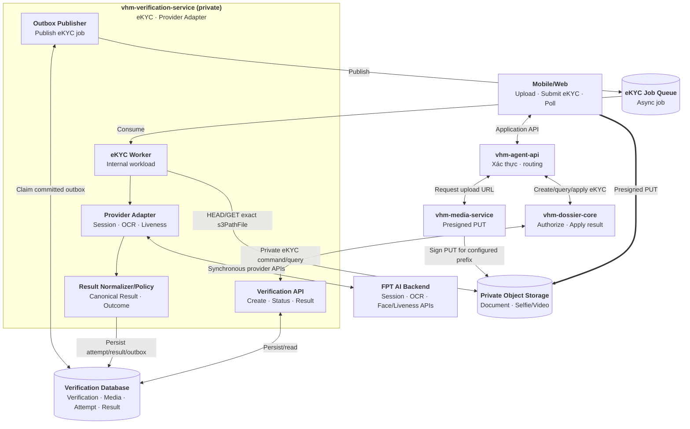
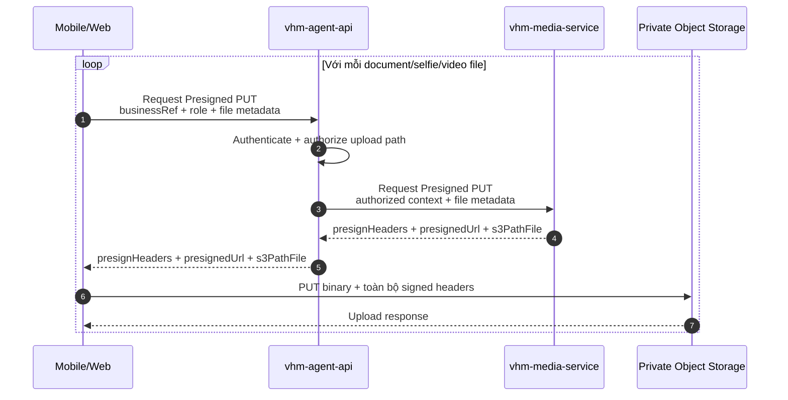
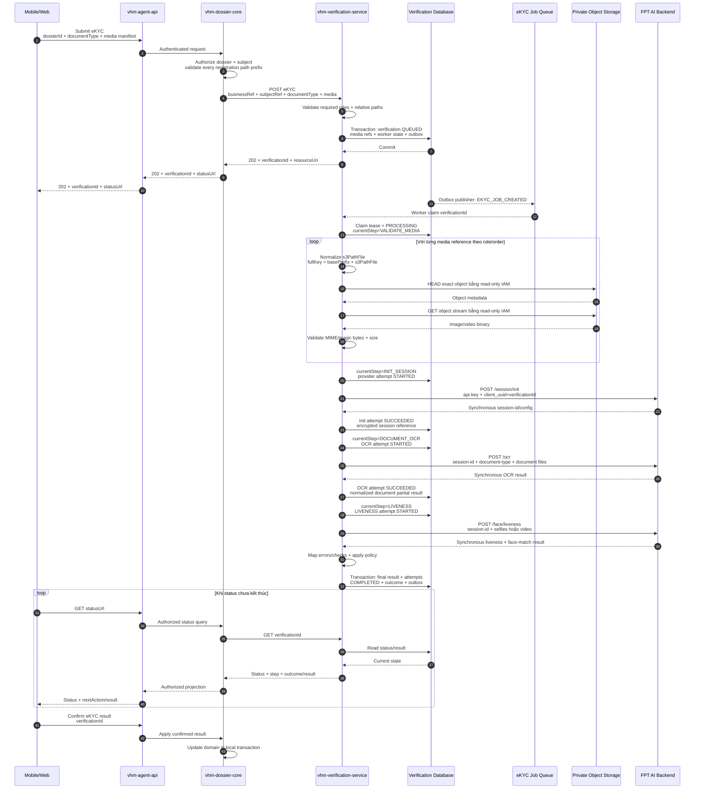
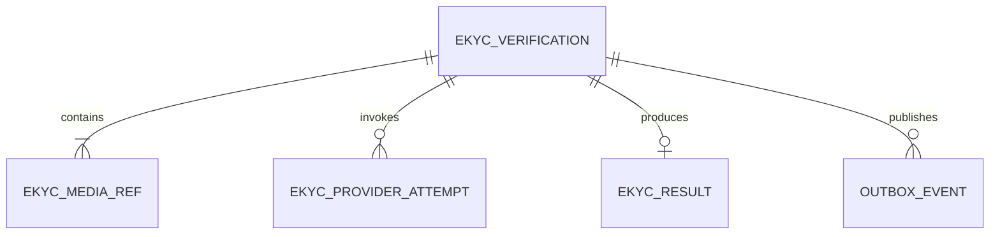

# Thiết kế eKYC tập trung bằng API

## 1. Phạm vi

Tài liệu này thiết kế luồng eKYC **tích hợp bằng backend API**, dùng cùng mô hình bất đồng bộ với OCR. Mobile/Web không tích hợp FPT SDK và không gọi trực tiếp FPT AI.

Phạm vi baseline gồm:

- Mobile/Web tự capture giấy tờ định danh và media liveness, sau đó upload bằng Presigned PUT qua `vhm-media-service`.
- `vhm-dossier-core` authorize hồ sơ, chủ thể và toàn bộ media path trước khi tạo eKYC.
- `vhm-verification-service` persist verification ở trạng thái `QUEUED`, ghi outbox và trả `202`.
- eKYC Worker đọc media từ Object Storage rồi gọi tuần tự FPT session, OCR và liveness/face-match API.
- Worker chuẩn hóa kết quả thành Canonical Result; Mobile/Web polling API của VHM và xác nhận trước khi apply vào hồ sơ.

Baseline không dùng FPT SDK, SDK Proxy, provider callback, NFC hoặc QR. Khi cần các năng lực đó, phải thiết kế contract và lifecycle riêng; không ghép ngầm vào luồng API này.

Các giấy tờ định danh chỉ được enable khi FPT xác nhận hỗ trợ đúng `documentType`, số mặt, định dạng/giới hạn file và response schema. Kết quả eKYC hỗ trợ xác minh danh tính nhưng không tự quyết định hồ sơ đủ điều kiện NOXH.

## 2. Quyết định kiến trúc

| **Hướng tiếp cận** | **Ưu điểm** | **Nhược điểm** | **Lựa chọn** |
| --- | --- | --- | --- |
| Mobile/Web dùng FPT SDK | Có sẵn capture guidance và SDK flow | Khác execution model OCR; cần SDK/Proxy riêng cho từng platform | No trong baseline |
| Mobile/Web gọi FPT API trực tiếp | Ít hop backend | Lộ provider contract/credential; client phải điều phối session và lỗi | No |
| `vhm-verification-service` dùng queue/worker gọi FPT API | Đồng bộ với OCR; cô lập provider latency/quota; lifecycle và result thuộc VHM | Mobile/Web phải tự làm capture UX; cần upload đủ media trước khi submit | **Yes** |

FPT session/OCR/liveness API trả kết quả đồng bộ cho từng call, nhưng VHM bọc toàn bộ journey trong một job bất đồng bộ:

```text
Mobile/Web → upload document/liveness media
Mobile/Web → VHM create eKYC → 202 QUEUED
eKYC Worker → FPT /session/init → /ocr → /face/liveness
eKYC Worker → persist Canonical Result
Mobile/Web → poll VHM status/result → confirm/apply
```

Queue/worker không biến FPT thành provider async. Nó chỉ tách thời gian đọc nhiều media và chờ chuỗi synchronous provider call khỏi kết nối Mobile/Web/BFF/domain service.

## 3. Kiến trúc eKYC tập trung

### 3.1. Thành phần

| **Thành phần** | **Trách nhiệm** |
| --- | --- |
| Mobile/Web | Capture, upload document/liveness media; tạo eKYC; poll và xác nhận kết quả |
| `vhm-agent-api` | Xác thực/routing, authorize yêu cầu cấp Presigned PUT; không giữ FPT credential |
| `vhm-dossier-core` | Authorize `businessRef`, chủ thể, media path, query và apply kết quả |
| `vhm-media-service` | Chỉ tham gia upload: trả `presignHeaders + presignedUrl + s3PathFile` |
| Verification API | Private command/query API của `vhm-verification-service` |
| eKYC Worker | Claim job; đọc media; điều phối session → OCR → liveness; persist kết quả |
| Provider Adapter | Inject server credential; ánh xạ FPT request/response/error |
| Result Normalizer/Policy | Tạo Canonical Result và outcome từ OCR, liveness, face-match |
| Verification Database + Outbox | Lưu lifecycle, media manifest, lease/retry, provider attempt, result và event |

`Verification API`, `eKYC Worker`, `Provider Adapter` và `Result Normalizer/Policy` là module/workload trong cùng `vhm-verification-service`, không phải các public service riêng.

### 3.2. Thành phần và hướng dữ liệu



Hai data path được tách rõ:

- Upload binary: `Mobile/Web → Presigned PUT → Object Storage`.
- eKYC processing: `eKYC Worker → Object Storage → FPT AI Backend`.

Mobile/Web không gửi binary qua `vhm-dossier-core` hoặc `vhm-verification-service`. `vhm-media-service` không nằm trong processing path; worker dùng bucket/base prefix cấu hình và IAM read-only để HEAD/GET trực tiếp S3.

### 3.3. Lifecycle và outcome

Lifecycle kỹ thuật dùng cùng cách hiểu với OCR:

```text
QUEUED → PROCESSING → COMPLETED
   └───────────────→ CANCELLED/EXPIRED
```

Trong `PROCESSING`, `currentStep` cho biết worker đang ở đâu:

| **Current step** | **Ý nghĩa** |
| --- | --- |
| `VALIDATE_MEDIA` | Chuẩn hóa path, HEAD/GET và kiểm tra toàn bộ media manifest |
| `INIT_SESSION` | Khởi tạo phiên FPT bằng `client_uuid=verificationId` |
| `DOCUMENT_OCR` | Gửi mặt giấy tờ tới OCR API |
| `LIVENESS` | Gửi selfie/video tới liveness và face-match API |
| `NORMALIZE` | Áp policy, tạo và persist Canonical Result |
| `DONE` | Đã kết thúc verification |

`outcome` chỉ có khi `status=COMPLETED`:

| **Outcome** | **Ý nghĩa** |
| --- | --- |
| `EKYC_VERIFIED` | OCR, liveness và face-match đạt policy của VHM |
| `EKYC_REJECTED` | Có check xác minh không đạt policy |
| `NEED_REVIEW` | Kết quả không đủ chắc chắn, cần kiểm tra thủ công |
| `NEED_RETRY` | Media/input không đạt; người dùng cần capture/upload lại |
| `PROVIDER_ERROR` | Không lấy được kết quả tin cậy sau khi hết recovery budget |

FPT error/result được map thành check và outcome nội bộ; không dùng trực tiếp error code của FPT làm trạng thái hồ sơ.

## 4. Chuẩn bị media eKYC

eKYC dùng lại đúng upload contract đã mô tả trong tài liệu OCR. Mỗi physical file được upload một lần và nhận một `s3PathFile`. Một eKYC verification chứa nhiều media reference có role rõ ràng; không hiểu “một eKYC” là “một file”.

Baseline media manifest:

| **Role** | **Số lượng** | **Nội dung** |
| --- | --- | --- |
| `DOCUMENT_FRONT` | 1 | Mặt trước giấy tờ, hoặc trang ảnh chính của hộ chiếu |
| `DOCUMENT_BACK` | 0..1 | Mặt sau nếu `documentType` yêu cầu |
| `LIVENESS_SELFIE` | 1..n | Selfie dùng cho liveness/face match |
| `LIVENESS_VIDEO` | 0..1 | Video liveness; không dùng đồng thời với selfie nếu provider contract không cho phép |



Sau khi upload đủ role theo `documentType/policy`, client submit media manifest. Chỉ lưu relative `s3PathFile`; không lưu Presigned URL, full S3 URL, bucket hoặc signed credential. Worker kiểm tra path prefix, object tồn tại, content length, MIME/magic bytes và giới hạn riêng cho image/video trước khi gọi FPT.

## 5. Luồng eKYC bằng API

### 5.1. Luồng tổng quan trong `vhm-verification-service`

```mermaid
flowchart LR
    API["`**Verification API**
Validate command/media manifest`"]
    ACCEPT["`**Database transaction**
QUEUED · Media refs · Outbox`"]
    QUEUE[("`**eKYC Job Queue**`")]
    WORKER["`**eKYC Worker**
PROCESSING`"]
    READ["`**Storage Reader**
HEAD/GET media by role`"]
    INIT["`**FPT Session API**
POST /session/init`"]
    OCR["`**FPT OCR API**
POST /ocr`"]
    LIVENESS["`**FPT Face/Liveness API**
POST /face/liveness`"]
    NORMALIZE["`**Result Normalizer/Policy**
Document · Liveness · Face match`"]
    DONE["`**Verification Database**
COMPLETED · outcome · result`"]
    STATUS["`**Verification API**
GET status/result`"]

    API --> ACCEPT -->|"Publish"| QUEUE --> WORKER
    WORKER --> READ --> INIT --> OCR --> LIVENESS --> NORMALIZE --> DONE --> STATUS
```



Tất cả box từ Verification API đến Result Normalizer/Policy thuộc cùng `vhm-verification-service`. Mỗi FPT call là synchronous đối với worker; Mobile/Web chỉ thấy job bất đồng bộ của VHM.

### 5.2. Sequence diagram end-to-end



FPT `session-id` chỉ lưu mã hóa trong Verification Database và không trả xuống Mobile/Web. `verificationId` của VHM được dùng làm `client_uuid` để correlation nhưng không thay thế provider session.

Quy ước Provider Adapter cho baseline API-only:

- `/session/init` khởi tạo full eKYC session; không gửi cờ `only-engine=1` của luồng OCR-only.
- `/ocr` gửi document files theo `documentType` và cùng `session-id`.
- `/face/liveness` gửi `auto=false`, `device-type` được map từ `sourcePlatform`, cùng một trong hai input `selfies` hoặc `video` theo policy đã chốt.

## 6. API contract của `vhm-verification-service`

### 6.1. Danh sách API

| **Use case** | **Private API** | **Response** |
| --- | --- | --- |
| Tạo eKYC | `POST /v1/ekyc-verifications` | `202 + verificationId + resourceUri` |
| Lấy trạng thái | `GET /v1/ekyc-verifications/{verificationId}` | Status, current step, outcome, next action |
| Lấy kết quả | `GET /v1/ekyc-verifications/{verificationId}/result` | Canonical Result |
| Thử lại | `POST /v1/ekyc-verifications/{verificationId}/retries` | `202`, tạo verification mới |

Các API trên là private service API, không chứa `/dossiers` hoặc prefix `/internal`. Domain caller truyền `businessRef.type + businessRef.id`, tự lưu association với `verificationId` và authorize lại mọi request từ Mobile/Web.

### 6.2. Tạo eKYC

```http
POST /v1/ekyc-verifications
Authorization: Bearer <service-token>
Idempotency-Key: 72aacfa4-97b8-4d0f-bb74-490f17352b1b
Content-Type: application/json

{
  "businessRef": { "type": "DOSSIER", "id": "dos-01" },
  "subjectRef": "customer-opaque-ref",
  "channel": "MOBILE",
  "sourcePlatform": "ANDROID",
  "documentType": "IDR",
  "consentRef": "consent-20260810-01",
  "media": [
    {
      "role": "DOCUMENT_FRONT",
      "s3PathFile": "registrations/dos-01/cccd-front-a1.png",
      "order": 1
    },
    {
      "role": "DOCUMENT_BACK",
      "s3PathFile": "registrations/dos-01/cccd-back-b1.png",
      "order": 1
    },
    {
      "role": "LIVENESS_VIDEO",
      "s3PathFile": "registrations/dos-01/liveness-c1.mp4",
      "order": 1
    }
  ]
}
```

```http
HTTP/1.1 202 Accepted
Retry-After: 3

{
  "verificationId": "ver-456",
  "status": "QUEUED",
  "resourceUri": "/v1/ekyc-verifications/ver-456"
}
```

`channel` giữ phân loại Mobile/Web của VHM. `sourcePlatform` cần để Provider Adapter map header `device-type` theo contract FPT (`android`, `ios`, `web-sdk`). Với `channel=WEB`, `sourcePlatform` phải là `WEB`; với `channel=MOBILE`, platform phải là `ANDROID` hoặc `IOS`.

Create chỉ trả `202` sau khi verification, toàn bộ media refs, worker state và outbox đã commit. Media manifest thiếu role bắt buộc, trùng role/order, path ngoài business prefix hoặc dùng full URL bị từ chối trước khi enqueue.

### 6.3. Status và result

```json
{
  "verificationId": "ver-456",
  "status": "PROCESSING",
  "currentStep": "LIVENESS",
  "outcome": null,
  "progress": 75,
  "resultAvailable": false,
  "nextAction": "POLL"
}
```

Canonical Result không phụ thuộc field/error code của FPT:

```json
{
  "verificationId": "ver-456",
  "status": "COMPLETED",
  "outcome": "EKYC_VERIFIED",
  "schemaVersion": "1.0",
  "subject": {
    "documentType": "IDR",
    "fields": {
      "documentNumber": { "value": "<authorized-value>", "confidence": 0.99 },
      "fullName": { "value": "<authorized-value>", "confidence": 0.98 }
    }
  },
  "checks": {
    "documentQuality": "PASS",
    "liveness": "PASS",
    "faceMatch": "PASS"
  },
  "warnings": [],
  "nextAction": "CONFIRM_AND_APPLY"
}
```

Raw provider payload, provider session, API key, storage path và media không được trả qua Application API.

### 6.4. HTTP và error contract

| **HTTP** | **Sử dụng** |
| --- | --- |
| `200/202` | Query thành công hoặc create đã persist để xử lý |
| `400` | Payload/media manifest sai định dạng |
| `401/403` | Service identity hoặc scope không hợp lệ |
| `404` | Resource không tồn tại hoặc caller không được phép biết resource tồn tại |
| `409` | Idempotency conflict, state transition sai hoặc result chưa sẵn sàng |
| `413/415/422` | Media vượt giới hạn, sai loại, thiếu role hoặc không đạt input contract |
| `429` | Admission control/quota nội bộ; trả `Retry-After` |
| `503` | Không thể persist/enqueue an toàn |

Provider error trong worker được map vào attempt/outcome để client nhận khi poll; không trả raw FPT response.

## 7. Dữ liệu

### 7.1. Schema logic

| **Bảng** | **Mục đích** |
| --- | --- |
| `ekyc_verifications` | Aggregate root; business binding, lifecycle, step, idempotency và worker lease/retry |
| `ekyc_media_refs` | Danh sách relative `s3PathFile` theo role/order của một eKYC |
| `ekyc_provider_attempts` | Ghi từng lần init/OCR/liveness và trạng thái timeout không xác định |
| `ekyc_results` | Canonical Result hiện hành, immutable sau khi verification hoàn tất |
| `outbox_events` | Dùng chung với OCR để bảo đảm DB commit và enqueue/event không lệch nhau |

OCR có một logical document nên `s3PathFile` nằm ngay trong `ocr_verifications`. eKYC cần nhiều physical media với role khác nhau, vì vậy tách `ekyc_media_refs` là cần thiết; không phải tách thêm service hay database.



### 7.2. DDL baseline rút gọn

```sql
CREATE TABLE ekyc_verifications (
    verification_id         UUID PRIMARY KEY,
    business_type           VARCHAR(30) NOT NULL,
    business_ref            VARCHAR(100) NOT NULL,
    subject_ref_ciphertext  BYTEA NOT NULL,
    consent_ref             VARCHAR(150) NOT NULL,
    channel                 VARCHAR(20) NOT NULL CHECK (channel IN ('MOBILE', 'WEB')),
    source_platform         VARCHAR(20) NOT NULL CHECK (source_platform IN
                                ('ANDROID', 'IOS', 'WEB')),
    document_type           VARCHAR(30) NOT NULL,

    status                  VARCHAR(30) NOT NULL CHECK (status IN
                                ('QUEUED', 'PROCESSING', 'COMPLETED',
                                 'CANCELLED', 'EXPIRED')),
    current_step            VARCHAR(30) NOT NULL CHECK (current_step IN
                                ('VALIDATE_MEDIA', 'INIT_SESSION', 'DOCUMENT_OCR',
                                 'LIVENESS', 'NORMALIZE', 'DONE')),
    outcome                 VARCHAR(30),
    attempt_count           INTEGER NOT NULL DEFAULT 0 CHECK (attempt_count >= 0),
    available_at            TIMESTAMPTZ NOT NULL DEFAULT now(),
    lease_owner             VARCHAR(100),
    lease_until             TIMESTAMPTZ,
    last_error_code         VARCHAR(80),

    retry_of                UUID REFERENCES ekyc_verifications(verification_id),
    idempotency_key         VARCHAR(100) NOT NULL,
    request_fingerprint     CHAR(64) NOT NULL,
    terminal_reason_code    VARCHAR(80),
    row_version             BIGINT NOT NULL DEFAULT 0,
    created_at              TIMESTAMPTZ NOT NULL DEFAULT now(),
    updated_at              TIMESTAMPTZ NOT NULL DEFAULT now(),
    completed_at            TIMESTAMPTZ,
    CONSTRAINT uq_ekyc_idempotency UNIQUE (business_type, idempotency_key),
    CONSTRAINT ck_ekyc_channel_platform CHECK (
        (channel = 'WEB' AND source_platform = 'WEB') OR
        (channel = 'MOBILE' AND source_platform IN ('ANDROID', 'IOS'))
    ),
    CONSTRAINT ck_ekyc_status_outcome CHECK (
        (status = 'COMPLETED' AND outcome IN
            ('EKYC_VERIFIED', 'EKYC_REJECTED', 'NEED_REVIEW',
             'NEED_RETRY', 'PROVIDER_ERROR')) OR
        (status <> 'COMPLETED' AND outcome IS NULL)
    ),
    CONSTRAINT ck_ekyc_completed_at CHECK (
        (status = 'COMPLETED' AND completed_at IS NOT NULL AND current_step = 'DONE') OR
        (status <> 'COMPLETED' AND completed_at IS NULL)
    )
);

CREATE INDEX ix_ekyc_business
    ON ekyc_verifications (business_type, business_ref, created_at DESC);
CREATE INDEX ix_ekyc_dispatch
    ON ekyc_verifications (status, available_at)
    WHERE status IN ('QUEUED', 'PROCESSING');

CREATE TABLE ekyc_media_refs (
    media_ref_id             UUID PRIMARY KEY,
    verification_id         UUID NOT NULL REFERENCES ekyc_verifications(verification_id),
    role                     VARCHAR(30) NOT NULL CHECK (role IN
                                ('DOCUMENT_FRONT', 'DOCUMENT_BACK',
                                 'LIVENESS_SELFIE', 'LIVENESS_VIDEO')),
    media_order              INTEGER NOT NULL DEFAULT 1 CHECK (media_order > 0),
    s3_path_file             TEXT NOT NULL,
    created_at               TIMESTAMPTZ NOT NULL DEFAULT now(),
    CONSTRAINT uq_ekyc_media_role_order
        UNIQUE (verification_id, role, media_order)
);

CREATE TABLE ekyc_provider_attempts (
    provider_attempt_id      UUID PRIMARY KEY,
    verification_id         UUID NOT NULL REFERENCES ekyc_verifications(verification_id),
    provider                 VARCHAR(30) NOT NULL,
    operation                VARCHAR(30) NOT NULL CHECK (operation IN
                                ('INIT_SESSION', 'OCR', 'LIVENESS')),
    attempt_no               INTEGER NOT NULL CHECK (attempt_no > 0),
    provider_session_ciphertext BYTEA,
    status                   VARCHAR(20) NOT NULL CHECK (status IN
                                ('STARTED', 'SUCCEEDED', 'FAILED', 'UNKNOWN')),
    delivery_state           VARCHAR(20) NOT NULL CHECK (delivery_state IN
                                ('NOT_SENT', 'SENDING', 'SENT', 'UNKNOWN')),
    error_class              VARCHAR(40),
    error_code               VARCHAR(80),
    started_at               TIMESTAMPTZ NOT NULL,
    finished_at              TIMESTAMPTZ,
    CONSTRAINT uq_ekyc_provider_call
        UNIQUE (verification_id, provider, operation, attempt_no)
);

CREATE TABLE ekyc_results (
    verification_id         UUID PRIMARY KEY REFERENCES ekyc_verifications(verification_id),
    schema_version           VARCHAR(20) NOT NULL,
    canonical_payload_ciphertext BYTEA NOT NULL,
    payload_key_version      VARCHAR(40) NOT NULL,
    created_at               TIMESTAMPTZ NOT NULL DEFAULT now()
);
```

`outbox_events` dùng lại bảng đã định nghĩa trong tài liệu OCR. Outbox/message chỉ chứa `verificationId`, không chứa path, PII, binary hoặc Canonical Result.

Retry budget lấy từ cấu hình theo provider/operation. `nextAction` và `progress` được tính từ `status + currentStep + outcome`, không persist. Mỗi verification có một final result immutable; retry tạo `verificationId` mới.

## 8. Xử lý tin cậy và timeout

### 8.1. Transaction, idempotency và resume theo step

- Insert `ekyc_verifications`, toàn bộ `ekyc_media_refs` và `outbox_events` trong một transaction ngắn.
- Cùng `Idempotency-Key` và fingerprint trả resource cũ; cùng key nhưng fingerprint khác trả `409`.
- Queue dùng at-least-once; message chỉ chứa `verificationId`. Worker claim aggregate bằng lease/CAS.
- Object Storage HEAD/GET và provider call luôn nằm ngoài DB transaction.
- Sau mỗi provider call thành công, persist attempt và `currentStep` kế tiếp trước khi tiếp tục.
- Worker được phép resume từ step cuối đã commit. Ví dụ OCR đã `SUCCEEDED` và session còn hợp lệ thì retry liveness không gọi lại OCR.
- Worker không gọi lại một operation đã có attempt terminal thành công.
- Final result, lifecycle `COMPLETED` và outbox terminal event được commit cùng transaction.

### 8.2. Timeout FPT synchronous API

| **Thời điểm lỗi** | **Xử lý** |
| --- | --- |
| Chưa gửi request/body tới FPT | Retry có giới hạn với backoff |
| FPT trả `429/5xx` rõ ràng | Retry khi contract/SLA xác nhận operation retry-safe |
| Timeout sau khi body có thể đã gửi | Ghi attempt `UNKNOWN`; không POST lại operation mù |
| FPT trả lỗi OCR/liveness/face-match | Map sang `NEED_RETRY`, `NEED_REVIEW` hoặc `EKYC_REJECTED` theo policy |

Timeout outbound của từng FPT call phải ngắn hơn worker lease. Worker phải renew lease giữa các step nếu tổng journey dài hơn lease ban đầu; không giữ một HTTP call vượt quá lease còn lại.

Nếu kết quả provider không xác định và không có recovery contract đã được xác nhận, verification kết thúc `COMPLETED + PROVIDER_ERROR`; người dùng tạo verification mới thay vì poll vô hạn.

### 8.3. Rate limit và kết thúc xử lý

- eKYC Worker dùng concurrency limit/token bucket riêng theo FPT quota; không để queue backlog tạo burst lên provider.
- Circuit breaker chặn claim job mới khi FPT lỗi diện rộng; job còn `QUEUED` và `available_at` được dời theo backoff.
- Thành công: `COMPLETED + EKYC_VERIFIED/EKYC_REJECTED/NEED_REVIEW/NEED_RETRY`, xóa lease.
- Lỗi retry-safe: trở lại `QUEUED`, tăng `attempt_count`, đặt `available_at`.
- Hết recovery budget: `COMPLETED + PROVIDER_ERROR`; client không poll vô hạn.

## 9. Kế hoạch triển khai và kiểm thử

### 9.1. Thứ tự triển khai

1. Chốt capture UX của Mobile/Web, media roles và giới hạn image/video trước upload.
2. Chốt với FPT `documentType`, session/OCR/liveness contract, `device-type`, quota, timeout và policy threshold.
3. Xây Verification API, schema, media manifest validation, outbox/queue/eKYC Worker bằng mock Provider Adapter.
4. Tích hợp `session/init → /ocr → /face/liveness`, step checkpoint và Canonical Result.
5. Tích hợp polling/confirm/apply với domain.
6. Load/resilience test; chốt worker concurrency, rate limit, lease, timeout và alert backlog trước production.

### 9.2. Kiểm thử tối thiểu

| **Lớp test** | **Phạm vi** |
| --- | --- |
| Unit | Lifecycle/current step, media-role validation, policy/outcome, idempotency và canonical mapping |
| Contract | FPT init/OCR/liveness success, quality/fraud error, 429, 5xx, malformed response và timeout |
| Integration | DB constraints, outbox, queue duplicate, worker lease/resume và S3 path authorization |
| End-to-end | Upload all roles → create `202` → session/OCR/liveness → result → confirm/apply |
| Resilience | Large video/slow S3, worker crash giữa step, unknown-after-send, FPT outage và queue backlog |

### 9.3. Điểm cần chốt

- FPT `documentType`, số ảnh document và input contract cho từng loại giấy tờ.
- Chọn selfie hay video cho liveness; file size/duration/resolution và MIME được phép.
- Cách Mobile/Web cung cấp capture guidance/chất lượng khi không dùng FPT SDK.
- Liveness, deepfake, face-match và `NEED_REVIEW` threshold theo policy nghiệp vụ.
- Session TTL, SLA/quota/timeout, retry-safe matrix và recovery contract của từng endpoint.
- Consent evidence, retention của media/Canonical Result/provider session và quy tắc xóa PII.

`vhm-verification-service` chịu trách nhiệm điều phối kỹ thuật eKYC, cô lập FPT contract và trả Canonical Result. `vhm-dossier-core` chịu trách nhiệm authorization, bind chủ thể/hồ sơ và apply kết quả đã được người dùng xác nhận.
