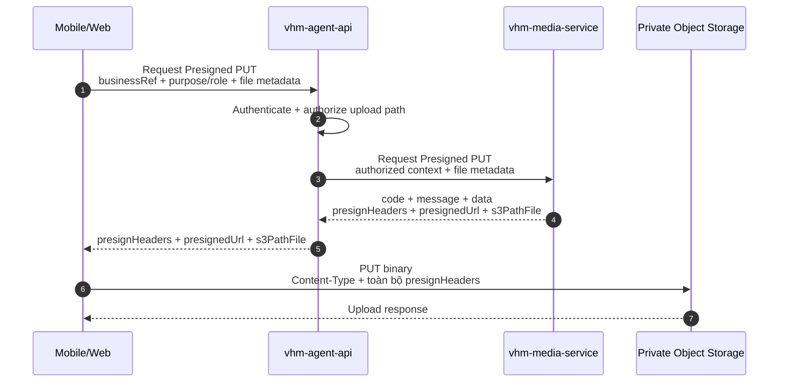
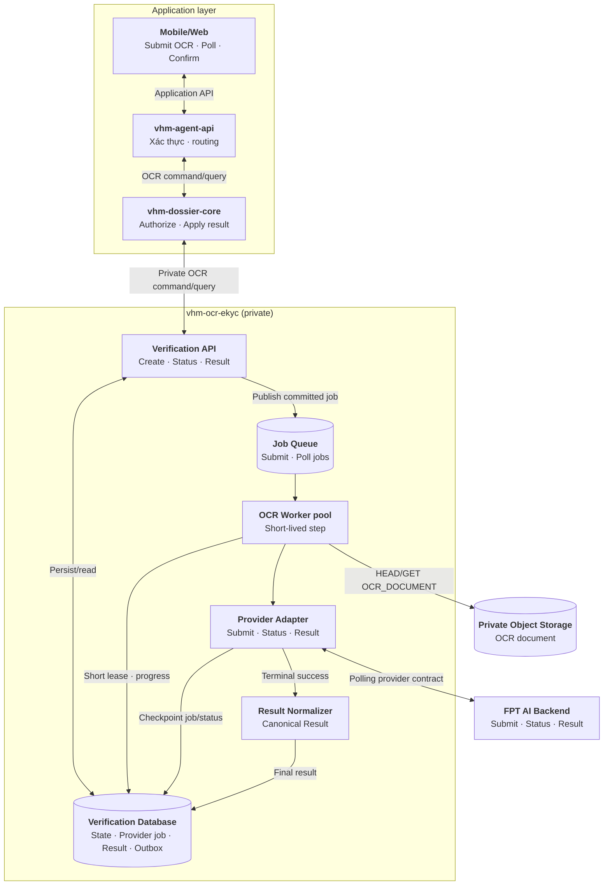
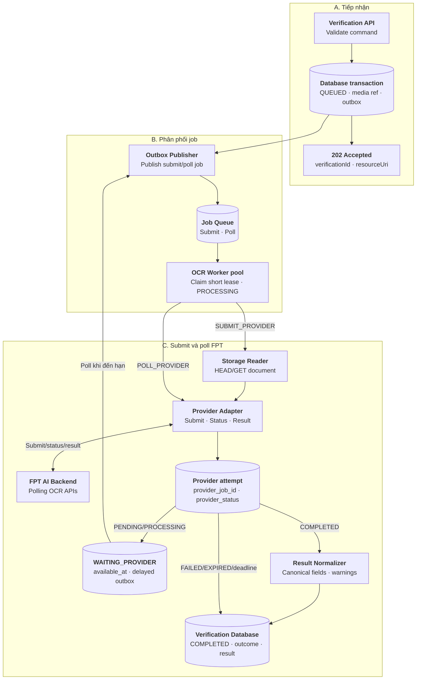
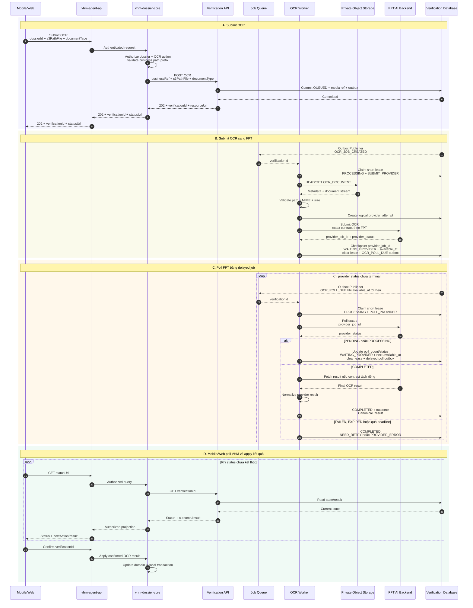
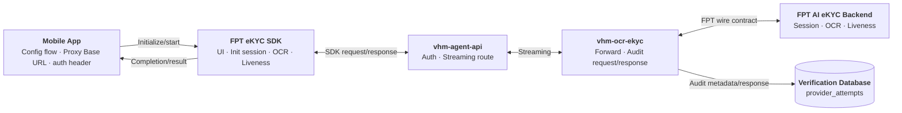
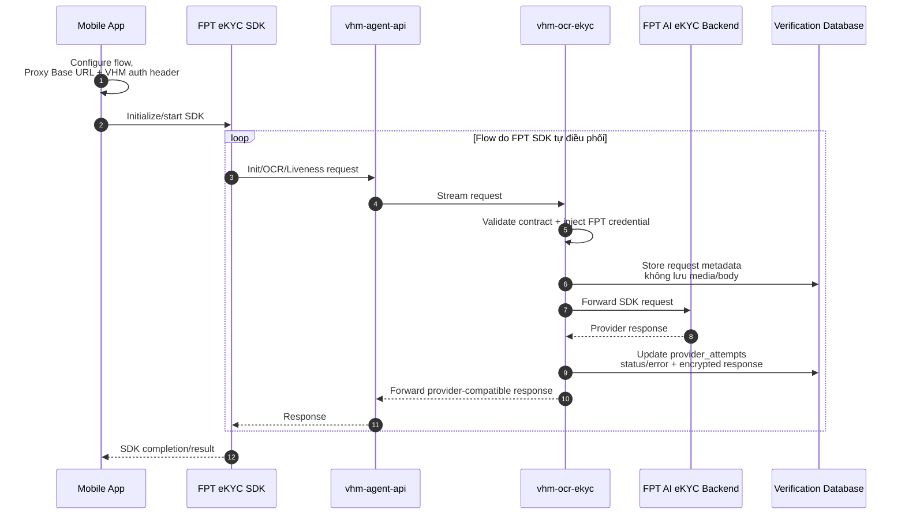
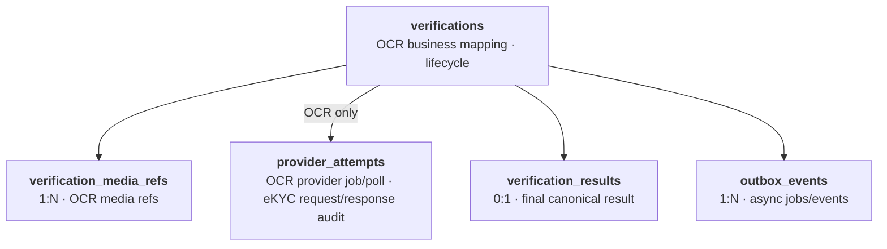

# Vấn đề 10: Thiết kế tích hợp OCR và eKYC tập trung

## 1. Phạm vi và quyết định kiến trúc

`vhm-ocr-ekyc` cung cấp capability OCR/eKYC tập trung cho nhiều domain. Mobile/Web không gọi trực tiếp FPT AI; domain service không phụ thuộc credential, session, payload hoặc error code của provider.

### 1.1. Phương án được chọn

Baseline dùng hai execution path tách biệt theo capability:

```text
DOCUMENT_OCR:
Upload document → create OCR → 202 QUEUED
→ OCR Worker submit OCR → FPT trả provider_job_id
→ WAITING_PROVIDER → delayed poll jobs
→ FPT terminal success → fetch result nếu cần → normalize
→ Canonical Result → Mobile/Web poll → confirm/apply

IDENTITY_EKYC:
Mobile tự cấu hình flow, Proxy Base URL và custom VHM auth header cho FPT SDK
→ SDK tự điều phối init session → OCR → liveness
→ mỗi request đi qua vhm-ocr-ekyc → FPT AI Backend
→ vhm-ocr-ekyc audit request metadata/response và forward nguyên response về SDK
→ SDK trả kết quả cho Mobile
```

OCR tài liệu nghiệp vụ vẫn dùng **backend API + outbox/queue/worker**. Chỉ eKYC định danh dùng **FPT SDK qua `vhm-ocr-ekyc`** để tận dụng capture UX, kiểm tra chất lượng đầu vào, liveness và device capability của SDK nhưng không cho SDK gọi trực tiếp FPT.

FPT OCR xử lý bất đồng bộ theo cơ chế polling. OCR Worker chỉ thực hiện từng call submit/status/result ngắn, checkpoint `provider_job_id` và trạng thái provider rồi giải phóng lease. Khi FPT chưa terminal, transaction chuyển verification sang `WAITING_PROVIDER`, đặt `available_at` và ghi delayed poll outbox; worker không giữ thread hoặc `sleep` chờ FPT.

Các eKYC SDK endpoint synchronous của `vhm-ocr-ekyc` nằm trên critical path của SDK; request init/OCR định danh/liveness không đi qua Queue hoặc eKYC Worker. Mobile tự chọn và cấu hình SDK flow. `vhm-agent-api` xác thực request; `vhm-ocr-ekyc` inject FPT credential, forward request/response và audit response, không cấp SDK config, không tạo FPT session và không điều phối step.

### 1.2. So sánh các hướng tích hợp FPT

FPT SDK là thư viện chạy trên ứng dụng Mobile để hướng dẫn capture và điều phối các bước eKYC. SDK không chạy trong Verification API hoặc worker. Nếu chọn SDK, kiến trúc client và đường truyền media phải thay đổi tương ứng.

| **Hướng tiếp cận** | **Luồng chính** | **Ưu điểm** | **Nhược điểm** | **Lựa chọn** |
| --- | --- | --- | --- | --- |
| Backend API tại từng domain | Mobile/Web gọi domain backend; mỗi domain tự quản lý media, session và gọi FPT API | Không cần thêm capability/service tập trung; domain chủ động tùy chỉnh luồng theo nghiệp vụ riêng | Lặp code tích hợp ở nhiều domain; phân tán credential, session, retry, quota và audit; kết quả/error contract dễ không đồng nhất; mỗi lần đổi provider phải sửa nhiều service | No |
| Backend API qua `vhm-ocr-ekyc` | Mobile/Web upload vào S3; domain gọi Verification API; Queue phân phối job để worker đọc media và gọi FPT API | Phù hợp tài liệu nghiệp vụ, file lớn và xử lý nền; domain không tự quản provider credential/session/retry; latency, quota và backlog được cô lập | Phải vận hành database, queue, Outbox Publisher và worker; VHM tự xây upload/capture UX | **Yes — chỉ `DOCUMENT_OCR`** |
| FPT SDK gọi trực tiếp FPT | SDK trên Mobile capture và gửi dữ liệu thẳng tới FPT; VHM nhận kết quả theo cơ chế tích hợp của FPT | Tích hợp eKYC phía VHM đơn giản hơn; ít hop và độ trễ truyền tải thấp; tận dụng capture UI, kiểm tra chất lượng thời gian thực, liveness và các capability SDK hỗ trợ | VHM không kiểm soát đường truyền media trước khi tới FPT; phụ thuộc SDK trên từng nền tảng và cơ chế nhận/đối soát kết quả; khó áp dụng contract upload/worker hiện tại; không phù hợp OCR tài liệu nghiệp vụ tổng quát | No |
| FPT SDK qua `vhm-ocr-ekyc` | Mobile tự cấu hình SDK gọi eKYC endpoint của `vhm-ocr-ekyc`; service inject credential, forward request/response với FPT và audit response | Tận dụng capture UX và kiểm tra chất lượng của SDK; VHM kiểm soát data flow và có dữ liệu audit; Mobile không giữ FPT credential | `vhm-ocr-ekyc` nằm trên synchronous streaming path nên phải HA, kiểm soát latency/bandwidth và tương thích chặt SDK protocol; không dùng queue để che lỗi trên interactive path | **Yes — chỉ `IDENTITY_EKYC`** |

Không chọn backend riêng tại từng domain vì phần tích hợp FPT là capability kỹ thuật lặp lại, không phải nghiệp vụ riêng của từng domain. `vhm-ocr-ekyc` quản lý provider contract và credential; eKYC response đi qua service chỉ được lưu phục vụ audit, chưa normalize hoặc apply vào nghiệp vụ trong baseline này.

Quyết định hybrid không dùng SDK cho OCR tài liệu nghiệp vụ. PDF/tài liệu dung lượng lớn đi qua S3 và OCR Worker; các eKYC SDK endpoint của `vhm-ocr-ekyc` chỉ nhận media định danh và liveness theo giới hạn contract FPT. Hai execution path phải có timeout, quota, capacity guard và observability độc lập.

OCR chỉ hỗ trợ số hóa/gợi ý dữ liệu. eKYC hỗ trợ kiểm tra giấy tờ, liveness và face match. Cả hai không tự quyết định hồ sơ đủ điều kiện NOXH; người dùng phải xác nhận trước khi domain apply kết quả.

## 2. Thành phần và quy ước nền tảng

### 2.1. Thành phần và trách nhiệm

| **Thành phần** | **Trách nhiệm** |
| --- | --- |
| Mobile/Web | OCR: upload tài liệu và poll; eKYC chỉ trên Mobile: cấu hình flow, Proxy Base URL và custom VHM auth header, khởi chạy SDK và nhận kết quả SDK |
| FPT eKYC SDK | Capture giấy tờ định danh/liveness, kiểm tra chất lượng trên thiết bị và gọi đúng eKYC endpoint của `vhm-ocr-ekyc` |
| `vhm-agent-api` | Xác thực/routing; authorize upload OCR và publish streaming route eKYC; không giữ FPT credential |
| Domain service, ví dụ `vhm-dossier-core` | Authorize `businessRef`, media path và apply kết quả OCR |
| `vhm-media-service` | Chỉ tham gia upload OCR tài liệu; trả `presignHeaders + presignedUrl + s3PathFile` |
| Verification API | OCR command/query và các endpoint forward request từ FPT SDK |
| Outbox Publisher + Job Queue | Dispatch OCR submit/poll job và event hậu xử lý sau commit; không dùng cho eKYC SDK call |
| OCR Worker pool | Thực hiện từng step ngắn: submit, poll status, fetch result nếu cần và normalize |
| Provider Adapter | OCR Worker: map FPT submit/status/result contract; eKYC SDK endpoint: inject credential và giữ wire contract tương thích SDK |
| Result Normalizer/Policy | Tạo Canonical Result và outcome ổn định cho OCR |
| Verification Database | Lưu OCR state/result và eKYC request metadata/response audit trong `provider_attempts` |

Verification API, eKYC SDK endpoint, OCR Worker, Provider Adapter và Result Normalizer/Policy đều thuộc `vhm-ocr-ekyc`. eKYC SDK endpoint được publish qua dedicated streaming route của `vhm-agent-api`; control-plane API vẫn private.

OCR Worker và eKYC SDK request path phải có bulkhead/capacity guard riêng. OCR backlog không được chiếm connection, memory hoặc FPT quota dành cho luồng eKYC tương tác; ngược lại, burst eKYC không làm chậm OCR queue.

### 2.2. Lifecycle verification

`status` dưới đây chỉ mô tả vòng đời resource OCR của VHM:

```text
OCR:
QUEUED → PROCESSING (SUBMIT_PROVIDER)
       → WAITING_PROVIDER
       → PROCESSING (POLL_PROVIDER)
       → WAITING_PROVIDER ...
       → PROCESSING (FETCH_RESULT/NORMALIZE)
       → COMPLETED
```

| **Status** | **Ý nghĩa** |
| --- | --- |
| `QUEUED` | OCR verification và outbox đã commit, chờ worker claim |
| `PROCESSING` | OCR Worker đang giữ lease để thực hiện một step submit/poll/fetch/normalize ngắn |
| `WAITING_PROVIDER` | FPT chưa terminal; đã giải phóng worker lease và lên lịch poll tiếp theo tại `available_at` |
| `COMPLETED` | Đã có outcome cuối, kể cả provider error sau hết recovery budget |
| `CANCELLED` | Bị hủy trước khi hoàn tất |
| `EXPIRED` | Quá processing deadline |

`currentStep` phục vụ OCR Worker resume, gồm `VALIDATE_MEDIA`, `SUBMIT_PROVIDER`, `POLL_PROVIDER`, `FETCH_RESULT`, `NORMALIZE`, `DONE`. `FETCH_RESULT` chỉ dùng nếu contract FPT tách status và result thành hai API. Mỗi eKYC request tạo một row `provider_attempts`, sau đó cập nhật response vào cùng row.

`outcome` chỉ có khi `status=COMPLETED` và được kiểm tra theo `type`:

| **Type** | **Outcome** |
| --- | --- |
| `OCR` | `OCR_COMPLETED`, `NEED_REVIEW`, `NEED_RETRY`, `PROVIDER_ERROR` |

### 2.3. Hai execution path

Với OCR, Verification API ghi verification, media refs và outbox trong cùng transaction rồi trả `202`. Outbox Publisher đưa job đã commit vào Queue; OCR Worker claim bằng status + lease/CAS trước từng step. Submit thành công phải checkpoint `provider_job_id`; poll non-terminal phải commit `WAITING_PROVIDER + available_at + outbox`, xóa lease rồi kết thúc worker invocation. Mobile/Web chỉ poll API của VHM và không nhận provider job ID.

Với eKYC, Mobile tự cấu hình và khởi chạy SDK. SDK gọi init/OCR/liveness qua eKYC endpoint của `vhm-ocr-ekyc`; service stream request tới FPT, audit response rồi forward nguyên response về SDK. Không có API bootstrap/config eKYC, eKYC lifecycle API, Worker/Queue hoặc backend orchestration giữa các step.

## 3. Luồng OCR

### 3.1. Upload media

Upload diễn ra trước create OCR verification. `s3PathFile` trong response của Media Service là durable reference dùng cho `DOCUMENT_OCR`; eKYC SDK không dùng contract upload này.



### 3.2. Kiến trúc tổng quan



### 3.3. Luồng xử lý trong `vhm-ocr-ekyc`



### 3.4. Sequence end-to-end



### 3.5. API contract

| **Use case** | **API** | **Response** |
| --- | --- | --- |
| Tạo OCR | `POST /v1/ocr-verifications` | `202 + verificationId + resourceUri` |
| Lấy OCR | `GET /v1/ocr-verifications/{verificationId}` | Status/outcome/next action |
| Lấy OCR result | `GET /v1/ocr-verifications/{verificationId}/result` | OCR Canonical Result |
| Retry OCR | `POST /v1/ocr-verifications/{verificationId}/retries` | `202`, verification mới |

Ví dụ create OCR:

```http
POST /v1/ocr-verifications
Authorization: Bearer <service-token>
Idempotency-Key: 72aacfa4-97b8-4d0f-bb74-490f17352b1b
Content-Type: application/json

{
  "businessRef": { "type": "DOSSIER", "id": "dos-01" },
  "subjectRef": "customer-opaque-ref",
  "channel": "MOBILE",
  "platform": "ANDROID",
  "documentType": "MARRIAGE_CERTIFICATE",
  "s3PathFile": "registrations/dos-01/marriage-certificate.png"
}
```

Verification API map `s3PathFile` thành media row có role `OCR_DOCUMENT`. Sau khi verification, media refs, worker state và outbox commit, API trả:

```http
HTTP/1.1 202 Accepted
Retry-After: 3

{
  "verificationId": "ver-123",
  "type": "OCR",
  "status": "QUEUED",
  "resourceUri": "/v1/ocr-verifications/ver-123"
}
```

Ví dụ status:

```json
{
  "verificationId": "ver-123",
  "type": "OCR",
  "status": "WAITING_PROVIDER",
  "currentStep": "POLL_PROVIDER",
  "outcome": null,
  "resultAvailable": false,
  "nextAction": "POLL",
  "updatedAt": "2026-08-10T11:30:25+07:00"
}
```

Ví dụ Canonical Result:

```json
{
  "verificationId": "ver-123",
  "type": "OCR",
  "status": "COMPLETED",
  "outcome": "OCR_COMPLETED",
  "schemaVersion": "1.0",
  "document": {
    "type": "MARRIAGE_CERTIFICATE",
    "fields": {
      "certificateNumber": { "value": "01/2026", "confidence": 0.97 }
    },
    "warnings": []
  },
  "nextAction": "CONFIRM_AND_APPLY"
}
```

`nextAction` và progress được tính từ `type + status + currentStep + outcome`, không persist. OCR provider error được lưu vào attempt/outcome để Mobile/Web nhận khi poll.

Có hai lớp polling độc lập: Mobile/Web poll status/result của `vhm-ocr-ekyc`; OCR Worker poll FPT bằng `provider_job_id`. Provider job ID và raw provider status là dữ liệu nội bộ, không trả cho Mobile/Web hoặc domain service.

## 4. Luồng eKYC

### 4.1. Phân chia trách nhiệm

Mobile khởi tạo FPT SDK với flow cần chạy. Khi SDK chạy, từng request đi theo cùng một cơ chế:

```text
FPT SDK
→ vhm-agent-api
→ vhm-ocr-ekyc
→ FPT AI eKYC Backend
→ vhm-ocr-ekyc audit response
→ trả nguyên response về FPT SDK
```

`vhm-agent-api` xác thực request trước khi stream. `vhm-ocr-ekyc` validate wire contract, forward dữ liệu SDK tới FPT, audit request metadata/response và trả response về SDK. Chi tiết xử lý request/response được mô tả tại mục 4.4.

### 4.2. Kiến trúc và luồng xử lý



### 4.3. Sequence end-to-end



### 4.4. API forwarding contract

| **Use case** | **API** | **Response** |
| --- | --- | --- |
| SDK init session | `POST /v1/ekyc-sdk/init-session` | Provider-compatible synchronous response |
| SDK OCR định danh | `POST /v1/ekyc-sdk/ocr` | Provider-compatible synchronous response |
| SDK liveness | `POST /v1/ekyc-sdk/liveness` | Provider-compatible synchronous response |

Tên/path cuối cùng phải khớp cấu hình endpoint mà FPT SDK hỗ trợ trên từng nền tảng. `vhm-ocr-ekyc` không expose generic relay và không nhận upstream URL từ request.

Ví dụ logical request; exact URL, multipart field và header phải giữ theo contract của FPT SDK:

```http
POST /v1/ekyc-sdk/ocr
Authorization: Bearer <vhm-app-token>
Content-Type: multipart/form-data; boundary=<sdk-boundary>
X-Correlation-Id: <request-id>

<FPT SDK multipart body streamed without transformation>
```

`vhm-agent-api` xác thực VHM token và chỉ forward request hợp lệ qua route eKYC. Khi nhận request đã được BFF xác thực, `vhm-ocr-ekyc`:

1. Kiểm tra operation/path, method, content type và input size theo contract đã allowlist.
2. Sau khi request hợp lệ và trước khi gọi FPT, insert một row `provider_attempts` với operation, attempt number, correlation ID, `started_at`, `status=STARTED` và `delivery_state=SENDING`.
3. Stream request body tới FPT và inject provider credential/header theo contract; khi gửi xong, cập nhật cùng row thành `delivery_state=SENT`.
4. Request body, ảnh giấy tờ và selfie/video chỉ được stream, không persist.

Khi nhận response từ FPT, `vhm-ocr-ekyc`:

1. Cập nhật chính row `provider_attempts` đã tạo khi nhận request với provider request ID, HTTP status, error code, `finished_at` và `status=SUCCEEDED|FAILED`.
2. Mã hóa response cần audit vào `provider_attempts.response_payload_ciphertext` theo retention policy.
3. Trả nguyên HTTP status, header và body tương thích về SDK.
4. Không normalize eKYC response và không ghi vào `verification_results`.

Nếu mất kết nối hoặc timeout sau khi request có thể đã gửi tới FPT, cập nhật row thành `status=UNKNOWN`, `delivery_state=UNKNOWN`.

Service không điều phối thứ tự init/OCR/liveness và không parse/rebuild multipart request body. Exact Android/iOS contract phải được FPT sign-off; đặc biệt iOS cần SDK build có endpoint override.

## 5. Schema dữ liệu

### 5.1. Mô hình logic

Giữ năm bảng dùng chung; eKYC chỉ dùng `provider_attempts` để audit request metadata/response, không dùng OCR lifecycle/media/result/outbox:

| **Bảng** | **Mục đích** |
| --- | --- |
| `verifications` | Business mapping, lifecycle và worker lease của OCR |
| `verification_media_refs` | Durable media ref của `DOCUMENT_OCR` |
| `provider_attempts` | Theo dõi một logical FPT OCR job xuyên suốt submit–poll; đồng thời audit request metadata/response của từng eKYC SDK call |
| `verification_results` | OCR Canonical Result cuối |
| `outbox_events` | OCR job dispatch và domain event sau commit |



eKYC rows trong `provider_attempts` được trace bằng `correlation_id`.

### 5.2. DDL baseline

```sql
CREATE TABLE verifications (
    id                      UUID PRIMARY KEY,
    type                    VARCHAR(20) NOT NULL CHECK (type = 'OCR'),
    business_type           VARCHAR(30) NOT NULL,
    business_ref            VARCHAR(100) NOT NULL,
    subject_ref_ciphertext  BYTEA,
    consent_ref             VARCHAR(150),
    channel                 VARCHAR(20) NOT NULL CHECK (channel IN ('MOBILE', 'WEB')),
    platform                VARCHAR(20) NOT NULL CHECK (platform IN
                                ('ANDROID', 'IOS', 'WEB')),
    document_type           VARCHAR(50) NOT NULL,
    status                  VARCHAR(30) NOT NULL CHECK (status IN
                                ('QUEUED', 'PROCESSING', 'WAITING_PROVIDER', 'COMPLETED',
                                 'CANCELLED', 'EXPIRED')),
    current_step            VARCHAR(30) CHECK (current_step IN
                                ('VALIDATE_MEDIA', 'SUBMIT_PROVIDER', 'POLL_PROVIDER',
                                 'FETCH_RESULT', 'NORMALIZE', 'DONE')),
    outcome                 VARCHAR(30),

    attempt_count           INTEGER NOT NULL DEFAULT 0 CHECK (attempt_count >= 0),
    available_at            TIMESTAMPTZ NOT NULL DEFAULT now(),
    processing_deadline_at  TIMESTAMPTZ NOT NULL,
    lease_owner             VARCHAR(100),
    lease_until             TIMESTAMPTZ,
    last_error_code         VARCHAR(80),

    retry_of                UUID REFERENCES verifications(id),
    idempotency_key         VARCHAR(100) NOT NULL,
    request_fingerprint     CHAR(64) NOT NULL,
    terminal_reason_code    VARCHAR(80),
    row_version             BIGINT NOT NULL DEFAULT 0,
    created_at              TIMESTAMPTZ NOT NULL DEFAULT now(),
    updated_at              TIMESTAMPTZ NOT NULL DEFAULT now(),
    completed_at            TIMESTAMPTZ,

    CONSTRAINT uq_verification_idempotency
        UNIQUE (type, business_type, idempotency_key),
    CONSTRAINT ck_verification_channel_platform CHECK (
        (channel = 'WEB' AND platform = 'WEB') OR
        (channel = 'MOBILE' AND platform IN ('ANDROID', 'IOS'))
    ),
    CONSTRAINT ck_verification_status_outcome CHECK (
        (status <> 'COMPLETED' AND outcome IS NULL) OR
        (status = 'COMPLETED' AND outcome IN
            ('OCR_COMPLETED', 'NEED_REVIEW', 'NEED_RETRY', 'PROVIDER_ERROR'))
    ),
    CONSTRAINT ck_verification_completed CHECK (
        (status = 'COMPLETED' AND completed_at IS NOT NULL AND
            current_step = 'DONE') OR
        (status <> 'COMPLETED' AND completed_at IS NULL)
    )
);

CREATE INDEX ix_verification_business
    ON verifications (business_type, business_ref, created_at DESC);
CREATE INDEX ix_ocr_dispatch
    ON verifications (status, available_at)
    WHERE type = 'OCR' AND status IN ('QUEUED', 'WAITING_PROVIDER');
CREATE INDEX ix_ocr_lease_recovery
    ON verifications (lease_until)
    WHERE type = 'OCR' AND status = 'PROCESSING';
CREATE TABLE verification_media_refs (
    id                      UUID PRIMARY KEY,
    verification_id         UUID NOT NULL REFERENCES verifications(id),
    role                     VARCHAR(30) NOT NULL CHECK (role = 'OCR_DOCUMENT'),
    position                INTEGER NOT NULL DEFAULT 1 CHECK (position > 0),
    s3_path_file             TEXT NOT NULL,
    created_at               TIMESTAMPTZ NOT NULL DEFAULT now(),
    CONSTRAINT uq_verification_media_role_position
        UNIQUE (verification_id, role, position)
);

CREATE INDEX ix_verification_media
    ON verification_media_refs (verification_id);

CREATE TABLE provider_attempts (
    id                      UUID PRIMARY KEY,
    verification_id         UUID REFERENCES verifications(id),
    provider                 VARCHAR(30) NOT NULL,
    operation                VARCHAR(30) NOT NULL CHECK (operation IN
                                ('INIT_SESSION', 'OCR', 'LIVENESS')),
    transport               VARCHAR(30) NOT NULL CHECK (transport IN
                                ('OCR_WORKER', 'EKYC_SDK_API')),
    attempt_no               INTEGER NOT NULL CHECK (attempt_no > 0),
    correlation_id           VARCHAR(150),
    provider_request_id      VARCHAR(150),
    provider_job_id          VARCHAR(150),
    provider_status          VARCHAR(50),
    provider_http_status     INTEGER,
    poll_count               INTEGER NOT NULL DEFAULT 0 CHECK (poll_count >= 0),
    last_polled_at           TIMESTAMPTZ,
    provider_completed_at    TIMESTAMPTZ,
    response_payload_ciphertext BYTEA,
    payload_key_version      VARCHAR(40),
    status                   VARCHAR(20) NOT NULL CHECK (status IN
                                ('STARTED', 'SUCCEEDED', 'FAILED', 'UNKNOWN')),
    delivery_state           VARCHAR(20) NOT NULL CHECK (delivery_state IN
                                ('NOT_SENT', 'SENDING', 'SENT', 'UNKNOWN')),
    error_class              VARCHAR(40),
    error_code               VARCHAR(80),
    started_at               TIMESTAMPTZ NOT NULL,
    finished_at              TIMESTAMPTZ,
    CONSTRAINT ck_provider_attempt_owner CHECK (
        (transport = 'OCR_WORKER' AND verification_id IS NOT NULL) OR
        (transport = 'EKYC_SDK_API' AND verification_id IS NULL AND correlation_id IS NOT NULL)
    ),
    CONSTRAINT ck_provider_attempt_response_key CHECK (
        (response_payload_ciphertext IS NULL AND payload_key_version IS NULL) OR
        (response_payload_ciphertext IS NOT NULL AND payload_key_version IS NOT NULL)
    )
);

CREATE INDEX ix_provider_attempt_verification
    ON provider_attempts (verification_id, operation, attempt_no DESC);
CREATE INDEX ix_provider_attempt_correlation
    ON provider_attempts (correlation_id, operation, attempt_no DESC)
    WHERE transport = 'EKYC_SDK_API';
CREATE UNIQUE INDEX uq_provider_attempt_job
    ON provider_attempts (provider, provider_job_id)
    WHERE provider_job_id IS NOT NULL;

CREATE TABLE verification_results (
    verification_id         UUID PRIMARY KEY REFERENCES verifications(id),
    version                 INTEGER NOT NULL CHECK (version > 0),
    schema_version           VARCHAR(20) NOT NULL,
    canonical_payload_ciphertext BYTEA NOT NULL,
    payload_key_version      VARCHAR(40) NOT NULL,
    is_final                 BOOLEAN NOT NULL DEFAULT FALSE,
    created_at               TIMESTAMPTZ NOT NULL DEFAULT now(),
    updated_at               TIMESTAMPTZ NOT NULL DEFAULT now()
);

CREATE TABLE outbox_events (
    id                      UUID PRIMARY KEY,
    aggregate_id             UUID NOT NULL REFERENCES verifications(id),
    type                    VARCHAR(80) NOT NULL,
    payload                  JSONB NOT NULL,
    status                   VARCHAR(20) NOT NULL DEFAULT 'NEW' CHECK (status IN
                                ('NEW', 'PUBLISHING', 'PUBLISHED', 'FAILED')),
    available_at             TIMESTAMPTZ NOT NULL DEFAULT now(),
    lease_owner              VARCHAR(100),
    lease_until              TIMESTAMPTZ,
    published_at             TIMESTAMPTZ,
    attempt_count            INTEGER NOT NULL DEFAULT 0,
    created_at               TIMESTAMPTZ NOT NULL DEFAULT now(),
    CONSTRAINT ck_outbox_publishing_lease CHECK (
        (status = 'PUBLISHING' AND lease_owner IS NOT NULL AND lease_until IS NOT NULL) OR
        (status <> 'PUBLISHING' AND lease_owner IS NULL AND lease_until IS NULL)
    )
);

CREATE INDEX ix_outbox_publish
    ON outbox_events (available_at)
    WHERE status IN ('NEW', 'FAILED');
CREATE INDEX ix_outbox_lease_recovery
    ON outbox_events (lease_until)
    WHERE status = 'PUBLISHING';

```

Quy ước schema:

- OCR insert một `verification_results` với `version=1`, `is_final=true` khi hoàn tất.
- Result OCR update dùng compare-and-set theo `version`; row đã `is_final=true` không được update.
- Mỗi lần submit OCR logic tạo một row `provider_attempts` với `operation=OCR` và `transport=OCR_WORKER`. Row giữ `status=STARTED` trong thời gian FPT còn xử lý; submit và các lần poll cập nhật cùng row bằng `provider_job_id`, `provider_status`, `provider_http_status`, `poll_count` và `last_polled_at`. Chỉ khi FPT terminal mới cập nhật `status=SUCCEEDED|FAILED`, `provider_completed_at` và `finished_at`; không tạo một row audit mới cho từng HTTP poll.
- Raw response FPT cần đối soát có thể lưu mã hóa trong `provider_attempts` theo retention policy; Canonical Result cuối cho nghiệp vụ chỉ lưu trong `verification_results`.
- `verifications.available_at` là thời điểm poll tiếp theo. Checkpoint non-terminal phải commit `WAITING_PROVIDER`, cập nhật provider attempt, xóa lease và ghi delayed poll outbox trong cùng transaction.
- `processing_deadline_at` giới hạn toàn bộ thời gian submit–poll; `provider_job_id` không được trả ra ngoài `vhm-ocr-ekyc`.
- `verification_media_refs` chỉ dùng cho OCR. Baseline eKYC không persist request media; service chỉ forward stream và audit response.
- eKYC response cần audit được lưu mã hóa trong `provider_attempts`, giới hạn quyền truy cập và áp dụng retention theo chính sách dữ liệu định danh.
- Không lưu VHM token hoặc FPT credential trong database/log.
- Outbox/message chỉ chứa ID/reference tối thiểu, không chứa PII, media path, binary hoặc Canonical Result.

## 6. Tin cậy, timeout và vận hành

### 6.1. OCR worker transaction và idempotency

- Create OCR insert verification, media ref và outbox trong một transaction ngắn.
- Cùng `Idempotency-Key` và request fingerprint trả resource cũ; cùng key nhưng fingerprint khác trả `409 IDEMPOTENCY_CONFLICT`.
- Queue xử lý theo at-least-once; message chỉ chứa reference/routing tối thiểu và OCR Worker phải idempotent.
- Worker claim aggregate bằng lease/CAS cho từng step ngắn; không giữ lease, thread hoặc connection trong thời gian chờ provider xử lý.
- Object Storage và provider calls luôn nằm ngoài DB transaction.
- Submit thành công phải checkpoint `provider_job_id` trước khi phát poll job. Worker không submit lại khi đã có logical provider attempt với job ID.
- Poll non-terminal cập nhật cùng provider attempt, tăng `poll_count`, chuyển `WAITING_PROVIDER`, đặt `available_at`, xóa lease và ghi delayed poll outbox trong cùng transaction.
- Poll job duplicate chỉ được gọi status cho cùng `provider_job_id`; checkpoint dùng row version/CAS để một poll result thắng.
- Lỗi retry-safe trước khi submit đưa OCR về `QUEUED`; lỗi retry-safe khi poll giữ `WAITING_PROVIDER`, áp dụng backoff/jitter và không tạo provider job mới.
- Final result, `DONE + COMPLETED + outcome` commit cùng transaction.
- Outbox Publisher claim `NEW/FAILED → PUBLISHING` bằng lease; stale `PUBLISHING` được phục hồi sau lease expiry.

### 6.2. eKYC synchronous critical path

- FPT SDK gọi trực tiếp eKYC SDK endpoint của `vhm-ocr-ekyc` qua route streaming của `vhm-agent-api`; không có service trung gian riêng.
- `vhm-agent-api` và `vhm-ocr-ekyc` phải stream request end-to-end, giữ backpressure và không buffer toàn bộ document/video trong memory hoặc local disk.
- Không đặt Queue, Outbox Publisher hoặc eKYC Worker giữa SDK và FPT. Init/OCR/liveness đều là synchronous request/response.
- Service chỉ forward fixed endpoint đã allowlist. Android/iOS SDK contract, method, headers, multipart field names, response body và error behavior phải được FPT sign-off theo exact SDK version.
- Request body do SDK tạo được forward nguyên trạng. Service chỉ thêm/thay credential/header được phê duyệt; không parse rồi rebuild multipart và không sửa business response mà SDK cần đọc.
- FPT phải xác nhận SDK không yêu cầu nhúng provider API key thật trên Mobile; SDK chỉ mang VHM auth header và `vhm-ocr-ekyc` inject credential server-side.
- Admission check phải hoàn tất trước khi đọc body. Khi database hoặc provider credential/config không sẵn sàng, fail fast trước khi mở upstream stream.
- Khi FPT trả response, service lưu audit data cần thiết rồi forward nguyên response tương thích về SDK.

### 6.3. Error và retry

- OCR submit lỗi chắc chắn trước khi gửi có thể retry. Nếu timeout/disconnect sau khi request có thể đã tới FPT, ghi attempt `UNKNOWN`; chỉ resume bằng provider idempotency/lookup contract đã được FPT xác nhận, không submit lại mù.
- Provider status `PENDING/PROCESSING` không phải lỗi. Worker checkpoint và lên lịch poll tiếp theo theo interval/backoff của FPT.
- Poll gặp 429/5xx/network error được retry bằng backoff + jitter nhưng không vượt `processing_deadline_at`. Cách xử lý 404/job expiry phải theo contract FPT.
- Provider terminal `FAILED/EXPIRED` hoặc quá deadline được map thành `NEED_RETRY` hay `PROVIDER_ERROR` theo policy và không poll tiếp.
- Provider business/error response được forward theo contract để SDK tự hiển thị hoặc retry flow.
- `vhm-ocr-ekyc` không tự retry init/OCR/liveness mutation vì SDK sở hữu session và retry behavior.
- Nếu timeout sau khi request có thể đã gửi, ghi attempt `UNKNOWN` và trả lỗi tương thích SDK; không replay body mù.

### 6.4. Timeout và cancellation

Timeout phải thỏa quan hệ:

```text
OCR: FPT submit/status/result call timeout < OCR worker lease
     poll interval/backoff < processing_deadline_at

eKYC: FPT outbound timeout < vhm-ocr-ekyc deadline < vhm-agent-api/SDK request timeout
```

Mỗi OCR submit/status/result call có connect timeout và response deadline ngắn. Tổng vòng đời provider job bị chặn bởi `processing_deadline_at`; worker không `sleep`, không giữ lease và không giữ DB transaction giữa hai lần poll. Khi verification bị cancel/expire, không phát poll mới; provider cancellation chỉ gọi nếu FPT có contract tương ứng.

Mỗi eKYC operation `INIT_SESSION`, `OCR`, `LIVENESS` có connect timeout, response-header timeout, streaming idle timeout và hard deadline riêng theo contract FPT. Client disconnect phải propagate cancellation xuống FPT khi transport cho phép, nhưng disconnect không chứng minh provider chưa xử lý; attempt vẫn có thể là `UNKNOWN`.

### 6.5. Quota, scaling và observability

- OCR dùng queue, worker concurrency và token bucket theo quota OCR.
- eKYC SDK route dùng admission control theo active streams, request/byte rate, tenant/flow và quota FPT; không dùng queue để giữ request tương tác.
- `vhm-ocr-ekyc` có route-level connection/concurrency limit giữa control-plane, eKYC streaming path và OCR Worker để cùng service nhưng không tranh hết tài nguyên.
- Circuit breaker OCR dừng submit mới nhưng vẫn phải có policy cho status poll của job đã nhận; poll bị trì hoãn phải cập nhật `available_at` mà không tạo provider job mới. Circuit breaker eKYC từ chối trước khi đọc body, trả lỗi SDK-compatible và không giữ connection treo.
- Metric/alert tối thiểu: OCR submit/poll latency, pending age, poll count, provider terminal status, due-poll queue age/depth, outbox lag, stale OCR lease, terminal outcome rate và eKYC active streams/bytes/latency/error/429/502/504.
- Không dùng `verificationId`, subject/business ref hoặc PII làm metric label.

### 6.6. Bảo mật và lưu media eKYC

- SDK request dùng VHM auth header do Mobile cấu hình; VHM credential không được dùng thay provider credential ở upstream.
- FPT credential chỉ tồn tại trong secret manager/runtime của `vhm-ocr-ekyc`; không trả về SDK, BFF response hoặc log.
- TLS bắt buộc ở cả hai hop.
- `vhm-ocr-ekyc` enforce method/path/content type/file count/size/timeout trước hoặc trong streaming; không cung cấp generic relay và không chấp nhận upstream URL từ client.
- Không log request/response body, multipart boundary content, FPT API key, session ID, ảnh giấy tờ hoặc selfie/video.
- Baseline không persist raw eKYC media chỉ vì media đi qua service. Nếu VHM cần lưu media cho audit/manual review, phải có consent/purpose/retention và pipeline lưu riêng bằng streaming hoặc presigned upload; không buffer media trong DB transaction hay local disk của service.

## 7. Kế hoạch triển khai và kiểm thử

### 7.1. Thứ tự triển khai

1. Chốt với FPT exact Android/iOS SDK version hỗ trợ trỏ Proxy Base URL về `vhm-ocr-ekyc` và request/response wire contract.
2. Chốt FPT OCR polling contract: submit response/job ID, status/result API, terminal status, poll interval, rate limit, idempotency/lookup và job TTL; đồng thời chốt `documentType → model/input limit`.
3. Xây OCR schema/Verification API, checkpoint provider job/poll state và mở rộng `provider_attempts` cho eKYC audit.
4. Xây OCR upload, submit worker, delayed poll worker và provider adapter như mục 3.
5. Tích hợp SDK trên Android/iOS; Mobile tự cấu hình flow, Proxy Base URL, custom VHM auth header và nhận SDK callback.
6. Xây eKYC SDK endpoint đồng bộ ngay trong `vhm-ocr-ekyc`, sau streaming route của `vhm-agent-api`.
7. Kiểm tra audit response eKYC và SDK callback success/failure.
8. Contract/load/security/resilience test và chốt timeout, active stream, bandwidth, quota, SLO/alert trước production.

### 7.2. Kiểm thử tối thiểu

| **Lớp test** | **Phạm vi** |
| --- | --- |
| Unit | OCR submit–poll state machine, idempotency, deadline, canonical mapping và eKYC audit mapping |
| FPT SDK contract | Exact Android/iOS Proxy Base URL, headers, multipart field/body và response/error parsing qua `vhm-ocr-ekyc` |
| Provider contract | OCR submit/status/result với pending/terminal/404/429/5xx/timeout; eKYC init/OCR/liveness success và error contract |
| Database | CHECK/unique/index, provider job checkpoint, optimistic lock, final result guard và outbox/worker lease recovery |
| Queue/Outbox | OCR submit/poll duplicate, delayed poll, publish-before-mark và worker restart; xác nhận SDK path không enqueue provider call |
| eKYC synchronous integration | End-to-end SDK init/OCR/liveness forwarding, streaming/backpressure, response audit, credential injection và fixed upstream allowlist |
| OCR end-to-end | Upload → create `202` → submit FPT → nhiều poll non-terminal → terminal result → confirm/apply |
| eKYC end-to-end | Mobile config → init SDK → SDK chạy init/OCR/liveness qua `vhm-ocr-ekyc` → audit response → SDK callback |
| Security | Token tamper/expiry/replay, session/context swap, cross-domain IDOR, generic-relay attempt, malicious multipart và PII-safe logs |
| Resilience | Unknown-after-submit, provider outage, lost/delayed poll, duplicate poll, job expiry, DB checkpoint failure, SDK resume và session expiry |
| Performance | Poll amplification/rate limit, provider pending age, OCR queue burst, active eKYC streams, bandwidth, p95/p99 và service memory |

`vhm-ocr-ekyc` sở hữu OCR control/worker path. Với eKYC, Mobile tự cấu hình FPT SDK; backend chỉ forward đồng bộ, inject FPT credential và audit response, không bootstrap config, không orchestration và không có eKYC Worker.
