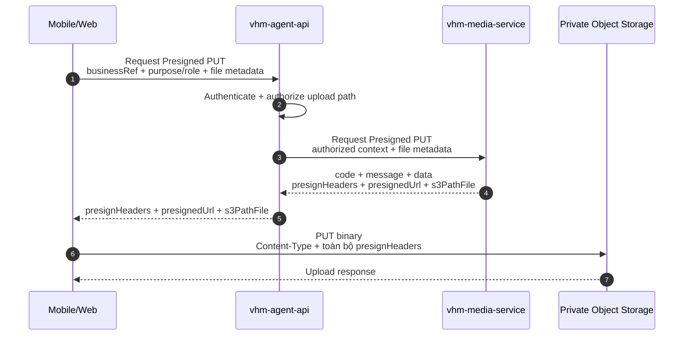
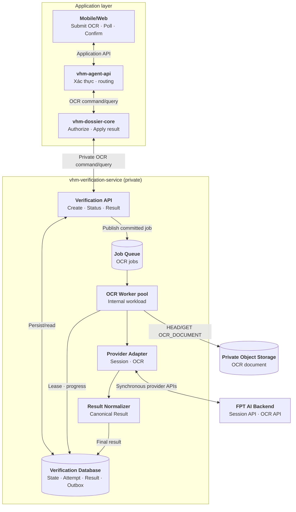
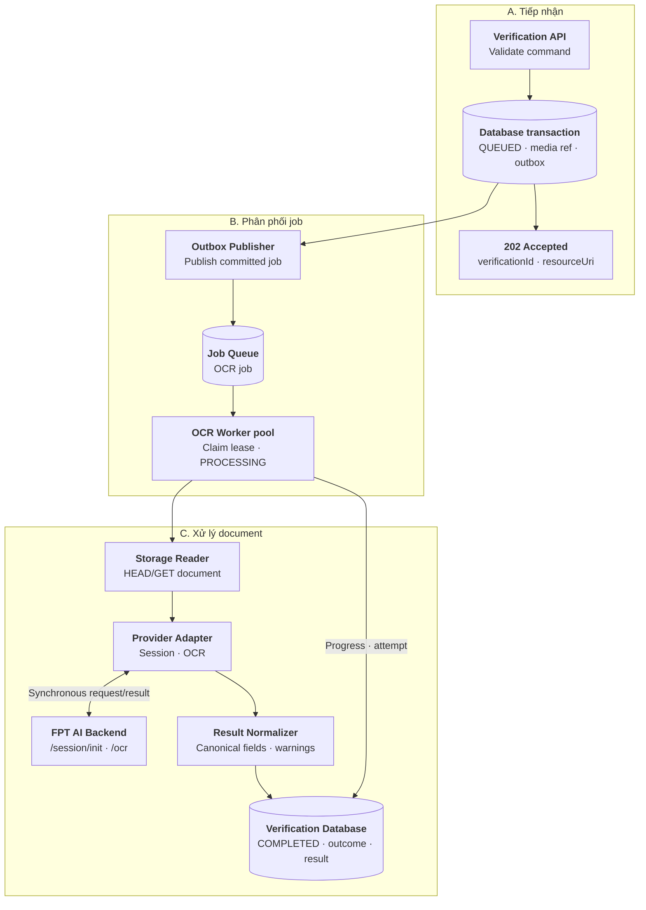
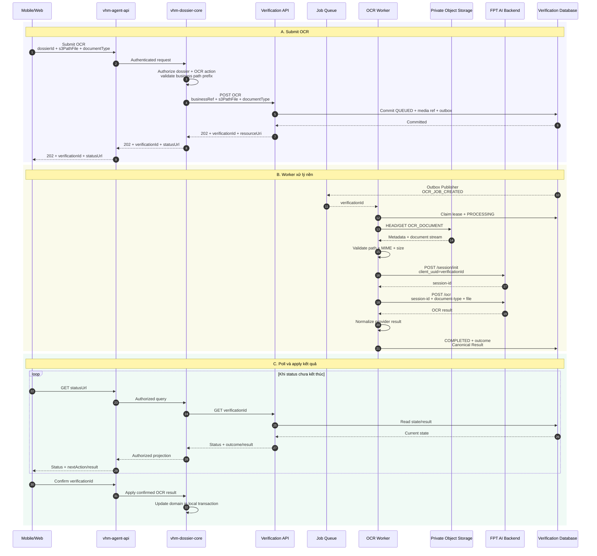
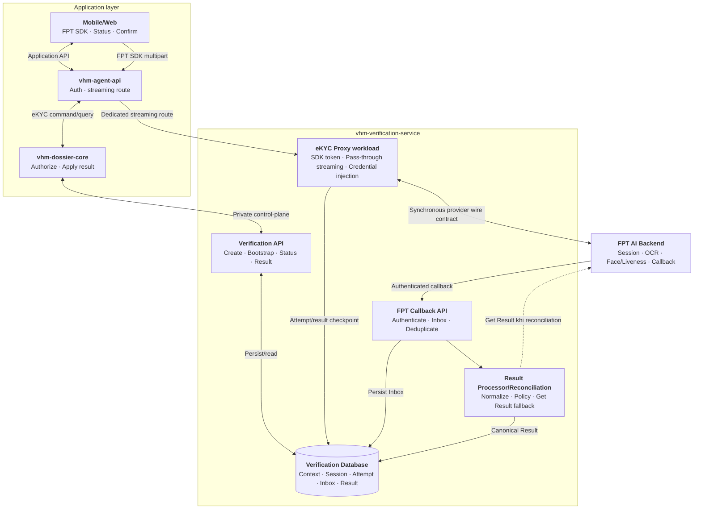
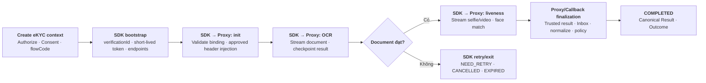
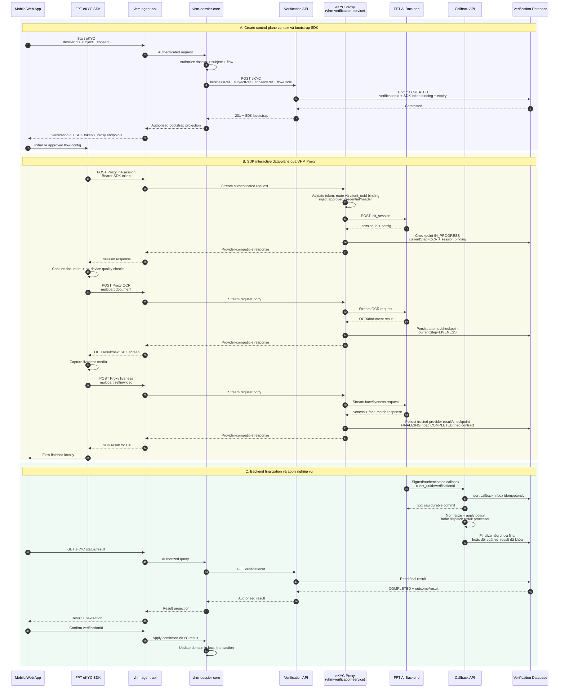
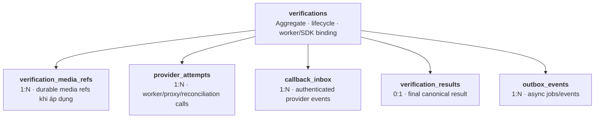

# Vấn đề 6: Thiết kế tích hợp OCR và eKYC tập trung

## 1. Phạm vi và quyết định kiến trúc

`vhm-verification-service` cung cấp capability OCR/eKYC tập trung cho nhiều domain. Mobile/Web không gọi trực tiếp FPT AI; domain service không phụ thuộc credential, session, payload hoặc error code của provider.

### 1.1. Phương án được chọn

Baseline dùng hai execution path tách biệt theo capability:

```text
DOCUMENT_OCR:
Upload document → create OCR → 202 QUEUED
→ OCR Worker → FPT session/init → OCR
→ Canonical Result → Mobile/Web poll → confirm/apply

IDENTITY_EKYC:
Create eKYC context → SDK bootstrap
→ FPT SDK capture document/liveness
→ SDK gọi synchronous VHM eKYC Proxy → FPT AI Backend
→ FPT callback/Proxy result → normalize Canonical Result
→ Mobile/Web query → confirm/apply
```

OCR tài liệu nghiệp vụ vẫn dùng **backend API + outbox/queue/worker**. Chỉ eKYC định danh dùng **FPT SDK + Proxy Server của VHM** để tận dụng capture UX, kiểm tra chất lượng đầu vào, liveness và device capability của SDK nhưng không cho SDK gọi trực tiếp FPT.

Proxy eKYC là synchronous streaming data-plane nằm trên critical path của SDK; request OCR định danh/liveness không đi qua Queue hoặc eKYC Worker. `vhm-verification-service` vẫn sở hữu control-plane, `verificationId`, authorization context, callback/reconciliation và Canonical Result. Mobile/Web và domain service không giữ FPT credential hoặc phụ thuộc raw provider result để apply nghiệp vụ.

### 1.2. So sánh các hướng tích hợp FPT

FPT SDK là thư viện chạy trên ứng dụng Mobile/Web để hướng dẫn capture và điều phối các bước eKYC. SDK không chạy trong Verification API hoặc worker. Nếu chọn SDK, kiến trúc client và đường truyền media phải thay đổi tương ứng.

| **Hướng tiếp cận** | **Luồng chính** | **Ưu điểm** | **Nhược điểm** | **Lựa chọn** |
| --- | --- | --- | --- | --- |
| Backend API tại từng domain | Mobile/Web gọi domain backend; mỗi domain tự quản lý media, session và gọi FPT API | Không cần thêm capability/service tập trung; domain chủ động tùy chỉnh luồng theo nghiệp vụ riêng | Lặp code tích hợp ở nhiều domain; phân tán credential, session, retry, quota và audit; kết quả/error contract dễ không đồng nhất; mỗi lần đổi provider phải sửa nhiều service | No |
| Backend API qua `vhm-verification-service` | Mobile/Web upload vào S3; domain gọi Verification API; Queue phân phối job để worker đọc media và gọi FPT API | Phù hợp tài liệu nghiệp vụ, file lớn và xử lý nền; domain không tự quản provider credential/session/retry; latency, quota và backlog được cô lập | Phải vận hành database, queue, Outbox Publisher và worker; VHM tự xây upload/capture UX | **Yes — chỉ `DOCUMENT_OCR`** |
| FPT SDK gọi trực tiếp FPT, không qua Proxy VHM | SDK trên Mobile/Web capture và gửi dữ liệu thẳng tới FPT; VHM nhận kết quả theo cơ chế tích hợp của FPT | Tích hợp eKYC phía VHM đơn giản hơn; ít hop và độ trễ truyền tải thấp; tận dụng capture UI, kiểm tra chất lượng thời gian thực, liveness và các capability SDK hỗ trợ | VHM không kiểm soát đường truyền media trước khi tới FPT; phụ thuộc SDK trên từng nền tảng và cơ chế nhận/đối soát kết quả; khó áp dụng contract upload/worker hiện tại; không phù hợp OCR tài liệu nghiệp vụ tổng quát | No |
| FPT SDK qua Proxy Server của VHM | SDK trên Mobile/Web gọi các endpoint Proxy được cấu hình; Proxy xác thực context, inject credential và relay request/response với FPT | Tận dụng capture UX và kiểm tra chất lượng của SDK; VHM kiểm soát data flow, session correlation, audit và kết quả; Mobile không giữ FPT credential | Phải vận hành public streaming/multipart proxy HA; thêm latency/bandwidth và coupling với SDK protocol; không dùng queue để che lỗi trên interactive path | **Yes — chỉ `IDENTITY_EKYC`** |

Không chọn backend riêng tại từng domain vì phần tích hợp FPT là capability kỹ thuật lặp lại, không phải nghiệp vụ riêng của từng domain. Domain chỉ authorize business context và apply Canonical Result; `vhm-verification-service` quản lý provider contract, credential, session correlation, callback/reconciliation và chuẩn hóa kết quả.

Quyết định hybrid không dùng SDK cho OCR tài liệu nghiệp vụ. PDF/tài liệu dung lượng lớn đi qua S3 và OCR Worker; eKYC SDK/Proxy chỉ nhận media định danh và liveness theo giới hạn contract FPT. Hai workload phải có ingress, timeout, quota, autoscaling và observability độc lập.

OCR chỉ hỗ trợ số hóa/gợi ý dữ liệu. eKYC hỗ trợ kiểm tra giấy tờ, liveness và face match. Cả hai không tự quyết định hồ sơ đủ điều kiện NOXH; người dùng phải xác nhận trước khi domain apply kết quả.

## 2. Thành phần và quy ước nền tảng

### 2.1. Thành phần và trách nhiệm

| **Thành phần** | **Trách nhiệm** |
| --- | --- |
| Mobile/Web | OCR: upload tài liệu và poll; eKYC: tích hợp FPT SDK, nhận bootstrap, hiển thị SDK và xác nhận kết quả |
| FPT eKYC SDK | Capture giấy tờ định danh/liveness, kiểm tra chất lượng trên thiết bị và gọi đúng endpoint Proxy VHM |
| `vhm-agent-api` | Xác thực/routing; authorize upload OCR và create/bootstrap eKYC; không giữ FPT credential |
| Domain service, ví dụ `vhm-dossier-core` | Authorize `businessRef`, chủ thể, media path; query và apply kết quả |
| `vhm-media-service` | Chỉ tham gia upload OCR tài liệu; trả `presignHeaders + presignedUrl + s3PathFile` |
| Verification API | Private control-plane API: create, SDK bootstrap, status, result, retry |
| eKYC Proxy | SDK-facing synchronous streaming workload; validate SDK token/context, inject FPT credential và relay allowlisted endpoint |
| FPT Callback API | Xác thực callback, bind `client_uuid=verificationId`, persist Inbox idempotently |
| Outbox Publisher + Job Queue | Dispatch OCR job và async result/finalization event; không nằm trên SDK Proxy request path |
| OCR Worker pool | Xử lý một logical document và gọi FPT OCR flow |
| eKYC Result Processor/Reconciliation | Normalize callback/result, xử lý duplicate/out-of-order và chủ động Get Result khi thiếu callback |
| Provider Adapter | OCR Worker: map provider API; eKYC Proxy: inject credential và giữ wire contract tương thích SDK |
| Result Normalizer/Policy | Tạo Canonical Result và outcome ổn định |
| Verification Database | Lưu aggregate, SDK/session binding, provider attempts, callback Inbox, results và outbox |

Verification API, eKYC Proxy, Callback API, OCR Worker, Result Processor/Reconciliation, Provider Adapter và Result Normalizer/Policy thuộc cùng capability `vhm-verification-service` nhưng được deploy thành workload phù hợp. Chỉ eKYC Proxy và Callback API cần provider/client-facing ingress; Verification API vẫn private.

OCR Worker và eKYC Proxy không chia sẻ capacity. OCR backlog không được chiếm connection, memory hoặc FPT quota dành cho luồng eKYC tương tác; ngược lại, burst eKYC không làm chậm OCR queue.

### 2.2. Lifecycle verification

`status` mô tả vòng đời kỹ thuật. OCR là job bất đồng bộ; eKYC là phiên SDK tương tác:

```text
OCR:
QUEUED → PROCESSING → COMPLETED

eKYC:
CREATED → IN_PROGRESS (SDK_INIT → OCR → LIVENESS)
        → FINALIZING (callback/result normalization)
        → COMPLETED
```

| **Status** | **Ý nghĩa** |
| --- | --- |
| `CREATED` | eKYC context đã commit và SDK bootstrap sẵn sàng nhưng SDK chưa bắt đầu provider session |
| `QUEUED` | OCR verification và outbox đã commit, chờ worker claim |
| `PROCESSING` | OCR Worker đang xử lý hoặc chờ retry step |
| `IN_PROGRESS` | SDK đang thực hiện init/OCR/liveness qua Proxy |
| `FINALIZING` | Đã nhận provider result từ Proxy/callback và đang đối soát, normalize hoặc chờ callback trong SLA |
| `COMPLETED` | Đã có outcome cuối, kể cả provider error sau hết recovery budget |
| `CANCELLED` | Bị hủy trước khi hoàn tất |
| `EXPIRED` | Quá processing deadline |

`currentStep` được chuẩn hóa thành: `VALIDATE_MEDIA`, `SDK_BOOTSTRAP`, `INIT_SESSION`, `OCR`, `LIVENESS`, `FINALIZE`, `NORMALIZE`, `DONE`. Với eKYC, SDK điều khiển UX giữa OCR và liveness; backend chỉ checkpoint step dựa trên Proxy/callback, không yêu cầu Mobile submit media bằng application API.

`outcome` chỉ có khi `status=COMPLETED` và được kiểm tra theo `type`:

| **Type** | **Outcome** |
| --- | --- |
| `OCR` | `OCR_COMPLETED`, `NEED_REVIEW`, `NEED_RETRY`, `PROVIDER_ERROR` |
| `EKYC` | `EKYC_VERIFIED`, `EKYC_REJECTED`, `NEED_REVIEW`, `NEED_RETRY`, `PROVIDER_ERROR` |

### 2.3. Hai execution path

Với OCR, Verification API ghi verification, media refs và outbox trong cùng transaction rồi trả `202`. Outbox Publisher đưa job đã commit vào Queue; OCR Worker claim bằng status + lease/CAS trước khi đọc media hoặc gọi FPT.

Với eKYC, create API commit `CREATED` rồi trả SDK bootstrap. SDK gọi trực tiếp eKYC Proxy bằng token ngắn hạn bind `verificationId`, domain, subject, flow và expiry. Proxy stream request tới FPT và trả response ngay cho SDK; không buffer toàn bộ body, không mở DB transaction trong lúc truyền media và không enqueue trước khi trả response. Provider attempt/checkpoint được ghi ngoài streaming transaction; callback được persist bằng Inbox rồi result processor normalize bất đồng bộ.

## 3. Luồng OCR

### 3.1. Upload media

Upload diễn ra trước create OCR verification. `s3PathFile` trong response của Media Service là durable reference dùng cho `DOCUMENT_OCR`; eKYC SDK/Proxy không dùng contract upload này.



### 3.2. Kiến trúc tổng quan



### 3.3. Luồng xử lý trong `vhm-verification-service`



### 3.4. Sequence end-to-end



## 4. Luồng eKYC

### 4.1. SDK bootstrap và provider flow

`vhm-verification-service` đồng thời đóng vai trò **VHM Proxy Server** trong mô hình tích hợp FPT SDK. Đây là một capability/service duy nhất nhưng tách thành các workload: Verification API cho control-plane, eKYC Proxy cho synchronous streaming data-plane và Callback/Result Processor cho finalization.

Mobile/Web không upload document/liveness qua API nghiệp vụ. Sau khi domain authorize và tạo eKYC context, ứng dụng nhận SDK bootstrap rồi khởi chạy FPT SDK. SDK capture media, kiểm tra chất lượng và gọi ba endpoint Proxy allowlisted:

```text
POST VHM Proxy /init-session → FPT /init_session
POST VHM Proxy /ocr          → FPT OCR
POST VHM Proxy /liveness     → FPT face/liveness
```

Proxy validate SDK token ngắn hạn, bind request với `verificationId`, bổ sung/thay credential hoặc header đúng contract FPT đã phê duyệt và stream multipart request/response. SDK hoặc caller không được truyền upstream URL hay FPT API key. `verificationId` do VHM sinh được cấu hình vào SDK làm `client_uuid`; Proxy validate giá trị này để correlate response, callback và reconciliation, không parse/rebuild body để tự thay UUID.

Biên customization theo tài liệu SDK public hiện tại:

| **Nền tảng** | **Cấu hình Proxy SDK công bố** | **Quyết định** |
| --- | --- | --- |
| Android | `BASE_URL` khi dùng Proxy và custom headers | SDK tạo request; VHM forward body, chỉ xử lý header/credential được FPT cho phép |
| Web | URL/header riêng cho init/OCR/liveness; một số multipart `form_names` | Chỉ cấu hình các field SDK công bố, không tạo arbitrary payload |
| iOS | Tài liệu public chưa thể hiện rõ base URL/Proxy override | FPT phải cung cấp exact SDK build/config và sign-off contract trước implementation |

Nếu SDK build bắt buộc nhúng FPT API key thật trên thiết bị hoặc không cho route qua VHM Proxy thì build đó không đạt baseline bảo mật này; FPT phải cung cấp Proxy mode cho phép dùng VHM token/custom header và inject provider credential ở server.

`flowCode` và SDK configuration do backend resolve theo domain/use case, không nhận arbitrary step list từ Mobile. Baseline hỗ trợ `FULL_EKYC_V1`; flow bỏ OCR hoặc liveness chỉ được mở khi FPT xác nhận exact SDK/session prerequisite và policy VHM cho phép.

Kết quả SDK trả về ứng dụng chỉ phục vụ UX tức thời. Trusted provider response quan sát trực tiếp tại Proxy có thể final hóa Canonical Result khi response contract chứa đủ outcome; callback đã xác thực là nguồn xác nhận/phục hồi độc lập. Nếu response Proxy chưa đủ hoặc outcome không xác định, backend chờ callback trong SLA rồi mới dùng `GET result` để reconciliation. Không lấy result closure trên thiết bị làm nguồn apply nghiệp vụ.

eKYC SDK/Proxy chỉ xử lý giấy tờ định danh và liveness theo input limit FPT. PDF/tài liệu nghiệp vụ dung lượng lớn không đi qua Proxy này mà dùng luồng OCR tại mục 3.

### 4.2. Kiến trúc tổng quan



`vhm-agent-api` và eKYC Proxy đều phải streaming end-to-end, không buffer toàn bộ multipart body. Tách eKYC Proxy thành deployment/autoscaling unit riêng không tạo microservice mới; nó vẫn dùng codebase, database, ownership và `verificationId` của `vhm-verification-service`.

### 4.3. Luồng xử lý trong `vhm-verification-service`



Không có `EKYC_DOCUMENT_JOB`, `EKYC_LIVENESS_JOB` hoặc `WAITING_LIVENESS`. SDK giữ flow tương tác; backend chỉ checkpoint `currentStep` và final hóa kết quả.

### 4.4. Sequence end-to-end



Sequence trên mô tả trường hợp backend cần callback để final hóa. Nếu liveness response qua Proxy đã chứa result đầy đủ, Result Processor có thể normalize và commit `COMPLETED` trước callback; callback đến sau chỉ deduplicate/đối soát, không tạo quyết định mới. Callback có thể duplicate, đến trước/sau Proxy response hoặc bị trễ; Inbox và finalization guard phải xử lý idempotently. Nếu cả Proxy outcome và callback chưa xác định sau SLA, Reconciliation dùng `verificationId/client_uuid` để query Get Result, không lấy SDK result trên thiết bị làm nguồn quyết định nghiệp vụ.

## 5. API contract

### 5.1. Danh sách API

API theo use case vẫn tách để contract rõ, nhưng đều map vào verification aggregate. Proxy endpoint là data-plane của chính `vhm-verification-service`, được publish cho SDK qua dedicated streaming route của `vhm-agent-api`.

| **Use case** | **Scope** | **API** | **Response** |
| --- | --- | --- | --- |
| Tạo OCR | Private control-plane | `POST /v1/ocr-verifications` | `202 + verificationId + resourceUri` |
| Lấy OCR | Private control-plane | `GET /v1/ocr-verifications/{verificationId}` | Status/outcome/next action |
| Lấy OCR result | Private control-plane | `GET /v1/ocr-verifications/{verificationId}/result` | OCR Canonical Result |
| Retry OCR | Private control-plane | `POST /v1/ocr-verifications/{verificationId}/retries` | `202`, verification mới |
| Tạo eKYC/bootstrap SDK | Private control-plane | `POST /v1/ekyc-verifications` | `201 + verificationId + sdkBootstrap` |
| Refresh SDK bootstrap | Private control-plane | `POST /v1/ekyc-verifications/{verificationId}/sdk-bootstrap` | Token/endpoints mới nếu session còn hợp lệ |
| SDK init session | SDK streaming data-plane | `POST /v1/ekyc-sdk-proxy/init-session` | Provider-compatible response |
| SDK OCR định danh | SDK streaming data-plane | `POST /v1/ekyc-sdk-proxy/ocr` | Provider-compatible response |
| SDK liveness | SDK streaming data-plane | `POST /v1/ekyc-sdk-proxy/liveness` | Provider-compatible response |
| FPT callback | Provider ingress | `POST /v1/provider-callbacks/fpt-ekyc` | `2xx` sau khi Inbox commit |
| Lấy eKYC | Private control-plane | `GET /v1/ekyc-verifications/{verificationId}` | Status/step/outcome/next action |
| Lấy eKYC result | Private control-plane | `GET /v1/ekyc-verifications/{verificationId}/result` | eKYC Canonical Result |
| Retry eKYC | Private control-plane | `POST /v1/ekyc-verifications/{verificationId}/retries` | `201`, verification/session mới |

Tên/path Proxy cuối cùng phải khớp cấu hình endpoint mà FPT SDK hỗ trợ trên từng nền tảng. Proxy không expose generic relay và không nhận upstream URL từ request.

### 5.2. Tạo OCR

```http
POST /v1/ocr-verifications
Authorization: Bearer <service-token>
Idempotency-Key: 72aacfa4-97b8-4d0f-bb74-490f17352b1b
Content-Type: application/json

{
  "businessRef": { "type": "DOSSIER", "id": "dos-01" },
  "subjectRef": "customer-opaque-ref",
  "channel": "MOBILE",
  "platform": "ANDROID",
  "documentType": "MARRIAGE_CERTIFICATE",
  "s3PathFile": "registrations/dos-01/marriage-certificate.png"
}
```

Verification API map `s3PathFile` thành media row có role `OCR_DOCUMENT`.

### 5.3. Tạo eKYC

```http
POST /v1/ekyc-verifications
Authorization: Bearer <service-token>
Idempotency-Key: a5ac2480-fdda-4474-a3f1-4e602c992f13
Content-Type: application/json

{
  "businessRef": { "type": "DOSSIER", "id": "dos-01" },
  "subjectRef": "customer-opaque-ref",
  "consentRef": "consent-20260810-01",
  "channel": "MOBILE",
  "platform": "ANDROID",
  "documentType": "IDR",
  "flowCode": "FULL_EKYC_V1"
}
```

Create eKYC không nhận document/selfie/video. Sau khi authorize context, API sinh `verificationId`, bind `client_uuid`, flow/version và SDK token ngắn hạn:

```http
HTTP/1.1 201 Created
Location: /v1/ekyc-verifications/ver-456
Content-Type: application/json
```

```json
{
  "verificationId": "ver-456",
  "type": "EKYC",
  "status": "CREATED",
  "currentStep": "SDK_BOOTSTRAP",
  "resourceUri": "/v1/ekyc-verifications/ver-456",
  "sdkBootstrap": {
    "token": "<short-lived-opaque-token>",
    "expiresAt": "2026-08-10T12:00:00+07:00",
    "flowCode": "FULL_EKYC_V1",
    "documentType": "IDR",
    "endpoints": {
      "initSession": "/v1/ekyc-sdk-proxy/init-session",
      "ocr": "/v1/ekyc-sdk-proxy/ocr",
      "liveness": "/v1/ekyc-sdk-proxy/liveness"
    }
  }
}
```

SDK bootstrap không chứa FPT API key, provider base URL hoặc raw policy bí mật. Token phải bind tối thiểu `verificationId`, authorized subject/domain, flow, platform, audience và expiry; refresh chỉ cấp khi verification chưa terminal và business authorization còn hiệu lực.

### 5.4. SDK Proxy contract

SDK gọi Proxy qua `vhm-agent-api` bằng token trong bootstrap. Ví dụ logical request; exact multipart field/header phải giữ theo contract của FPT SDK:

```http
POST /v1/ekyc-sdk-proxy/ocr
Authorization: Bearer <sdk-token>
Content-Type: multipart/form-data; boundary=<sdk-boundary>
X-Correlation-Id: <request-id>

<FPT SDK multipart body streamed without transformation>
```

Proxy xử lý theo thứ tự:

1. Xác thực token và bind request với verification đang active.
2. Chỉ cho phép operation/path, method, content type, size và flow transition đã khai báo.
3. Ghi correlation/attempt `STARTED` nhưng không giữ transaction trong lúc stream.
4. Stream nguyên body tới fixed FPT upstream; chỉ bổ sung/thay credential/header đã được FPT xác nhận. `client_uuid` do SDK gửi phải khớp `verificationId` đã bind.
5. Stream response tương thích SDK về client; không log body hoặc credential.
6. Checkpoint attempt/current step sau response; khi outcome không xác định, đánh dấu `UNKNOWN` để reconciliation thay vì blind retry.

Proxy không parse/rebuild multipart body hoặc normalize/mutate business result trên interactive response. Customization chỉ giới hạn ở base URL/endpoint, header và multipart field name mà từng SDK version công bố. Canonical mapping và policy chạy ở backend finalization để SDK protocol và quyết định nghiệp vụ không trộn lẫn. Exact Android/iOS/Web request/response contract phải được FPT sign-off trước implementation; đặc biệt iOS cần SDK build có hỗ trợ Proxy endpoint.

### 5.5. Create/status response

Create OCR trả `202` sau khi verification, media refs, worker state và outbox commit:

```http
HTTP/1.1 202 Accepted
Retry-After: 3

{
  "verificationId": "ver-123",
  "type": "OCR",
  "status": "QUEUED",
  "resourceUri": "/v1/ocr-verifications/ver-123"
}
```

```json
{
  "verificationId": "ver-123",
  "type": "OCR",
  "status": "PROCESSING",
  "currentStep": "OCR",
  "outcome": null,
  "resultAvailable": false,
  "nextAction": "POLL",
  "updatedAt": "2026-08-10T11:30:25+07:00"
}
```

`nextAction` và progress được tính từ `type + status + currentStep + outcome`, không persist.

eKYC status trong lúc SDK đang chạy:

```json
{
  "verificationId": "ver-456",
  "type": "EKYC",
  "status": "IN_PROGRESS",
  "currentStep": "LIVENESS",
  "outcome": null,
  "resultAvailable": false,
  "nextAction": "CONTINUE_SDK",
  "expiresAt": "2026-08-10T12:10:00+07:00",
  "updatedAt": "2026-08-10T11:55:25+07:00"
}
```

Khi Proxy đã nhận response cuối nhưng callback chưa được final hóa, status là `FINALIZING` và `nextAction=POLL`. `nextAction` được tính từ `type + status + currentStep + outcome`; với eKYC, SDK điều khiển capture screen nên application API không trả `CAPTURE_LIVENESS`.

### 5.6. Canonical Result

OCR result:

```json
{
  "verificationId": "ver-123",
  "type": "OCR",
  "status": "COMPLETED",
  "outcome": "OCR_COMPLETED",
  "schemaVersion": "1.0",
  "document": {
    "type": "MARRIAGE_CERTIFICATE",
    "fields": {
      "certificateNumber": { "value": "01/2026", "confidence": 0.97 }
    },
    "warnings": []
  },
  "nextAction": "CONFIRM_AND_APPLY"
}
```

eKYC result:

```json
{
  "verificationId": "ver-456",
  "type": "EKYC",
  "status": "COMPLETED",
  "outcome": "EKYC_VERIFIED",
  "schemaVersion": "1.0",
  "subject": {
    "documentType": "IDR",
    "fields": {
      "documentNumber": { "value": "<authorized-value>", "confidence": 0.99 },
      "fullName": { "value": "<authorized-value>", "confidence": 0.98 }
    }
  },
  "checks": {
    "documentQuality": "PASS",
    "liveness": "PASS",
    "faceMatch": "PASS"
  },
  "warnings": [],
  "nextAction": "CONFIRM_AND_APPLY"
}
```

Chỉ trả field nằm trong allowlist của `documentType`. Không trả raw provider payload, provider session, API key, storage path hoặc media.

### 5.7. HTTP và error contract

| **HTTP** | **Sử dụng** |
| --- | --- |
| `200/201/202` | Query thành công; eKYC context đã tạo; hoặc OCR đã persist để xử lý |
| `400` | Header/payload/media manifest sai định dạng |
| `401/403` | Service identity hoặc scope không hợp lệ |
| `404` | Resource không tồn tại hoặc caller không được biết resource tồn tại |
| `409` | Idempotency conflict, verification/session/step binding sai hoặc result chưa sẵn sàng |
| `413/415/422` | Media vượt giới hạn, sai loại, thiếu role hoặc sai document contract |
| `429` | Admission control/quota nội bộ; trả `Retry-After` |
| `502/504` | Proxy không nhận được provider response hợp lệ hoặc upstream timeout; response phải theo envelope SDK chấp nhận |
| `503` | Không thể persist/enqueue an toàn hoặc Proxy admission/circuit breaker đang đóng |

OCR provider error phát sinh trong worker được lưu vào attempt/outcome để Mobile/Web nhận khi poll. Trên eKYC data-plane, Proxy giữ HTTP/body tương thích SDK cho provider business error nhưng không lộ credential, internal upstream hoặc stack trace; Canonical Result không trả raw FPT payload/error.

## 6. Schema dữ liệu

### 6.1. Mô hình logic

Dùng sáu bảng cho aggregate OCR/eKYC; `callback_inbox` cung cấp nguồn xác nhận/phục hồi độc lập bên cạnh trusted provider response quan sát tại Proxy:

| **Bảng** | **Mục đích** |
| --- | --- |
| `verifications` | Aggregate chung: lifecycle, OCR worker lease hoặc eKYC flow/SDK/session binding |
| `verification_media_refs` | Durable media ref của OCR; eKYC chỉ có row khi VHM bật policy lưu media riêng |
| `provider_attempts` | Từng call qua OCR Worker, SDK Proxy hoặc Reconciliation |
| `callback_inbox` | Callback FPT đã xác thực, mã hóa payload và deduplicate trước khi xử lý |
| `verification_results` | Canonical Result cuối, không lưu raw SDK/provider response |
| `outbox_events` | OCR job dispatch và domain/result event sau commit; không dispatch SDK call |



### 6.2. DDL baseline

```sql
CREATE TABLE verifications (
    id                      UUID PRIMARY KEY,
    type                    VARCHAR(20) NOT NULL CHECK (type IN
                                ('OCR', 'EKYC')),
    business_type           VARCHAR(30) NOT NULL,
    business_ref            VARCHAR(100) NOT NULL,
    subject_ref_ciphertext  BYTEA,
    consent_ref             VARCHAR(150),
    channel                 VARCHAR(20) NOT NULL CHECK (channel IN ('MOBILE', 'WEB')),
    platform                VARCHAR(20) NOT NULL CHECK (platform IN
                                ('ANDROID', 'IOS', 'WEB')),
    document_type           VARCHAR(50) NOT NULL,
    flow_code               VARCHAR(50),
    flow_version            VARCHAR(30),

    status                  VARCHAR(30) NOT NULL CHECK (status IN
                                ('CREATED', 'QUEUED', 'PROCESSING', 'IN_PROGRESS',
                                 'FINALIZING', 'COMPLETED', 'CANCELLED', 'EXPIRED')),
    current_step            VARCHAR(30) NOT NULL CHECK (current_step IN
                                ('VALIDATE_MEDIA', 'SDK_BOOTSTRAP', 'INIT_SESSION', 'OCR',
                                 'LIVENESS', 'FINALIZE', 'NORMALIZE', 'DONE')),
    outcome                 VARCHAR(30),

    attempt_count           INTEGER NOT NULL DEFAULT 0 CHECK (attempt_count >= 0),
    available_at            TIMESTAMPTZ NOT NULL DEFAULT now(),
    lease_owner             VARCHAR(100),
    lease_until             TIMESTAMPTZ,
    last_error_code         VARCHAR(80),

    provider_session_id_ciphertext BYTEA,
    provider_session_expires_at TIMESTAMPTZ,
    sdk_token_jti_hash      CHAR(64),
    sdk_token_expires_at    TIMESTAMPTZ,
    finalization_deadline_at TIMESTAMPTZ,

    retry_of                UUID REFERENCES verifications(id),
    idempotency_key         VARCHAR(100) NOT NULL,
    request_fingerprint     CHAR(64) NOT NULL,
    terminal_reason_code    VARCHAR(80),
    row_version             BIGINT NOT NULL DEFAULT 0,
    created_at              TIMESTAMPTZ NOT NULL DEFAULT now(),
    updated_at              TIMESTAMPTZ NOT NULL DEFAULT now(),
    completed_at            TIMESTAMPTZ,

    CONSTRAINT uq_verification_idempotency
        UNIQUE (type, business_type, idempotency_key),
    CONSTRAINT ck_verification_channel_platform CHECK (
        (channel = 'WEB' AND platform = 'WEB') OR
        (channel = 'MOBILE' AND platform IN ('ANDROID', 'IOS'))
    ),
    CONSTRAINT ck_ekyc_required_fields CHECK (
        type <> 'EKYC' OR
        (subject_ref_ciphertext IS NOT NULL AND consent_ref IS NOT NULL AND
         flow_code IS NOT NULL AND flow_version IS NOT NULL AND
         sdk_token_jti_hash IS NOT NULL AND sdk_token_expires_at IS NOT NULL)
    ),
    CONSTRAINT ck_verification_type_status CHECK (
        (type = 'OCR' AND status IN
            ('QUEUED', 'PROCESSING', 'COMPLETED', 'CANCELLED', 'EXPIRED')) OR
        (type = 'EKYC' AND status IN
            ('CREATED', 'IN_PROGRESS', 'FINALIZING', 'COMPLETED',
             'CANCELLED', 'EXPIRED'))
    ),
    CONSTRAINT ck_verification_status_outcome CHECK (
        (status <> 'COMPLETED' AND outcome IS NULL) OR
        (status = 'COMPLETED' AND type = 'OCR' AND outcome IN
            ('OCR_COMPLETED', 'NEED_REVIEW', 'NEED_RETRY', 'PROVIDER_ERROR')) OR
        (status = 'COMPLETED' AND type = 'EKYC' AND outcome IN
            ('EKYC_VERIFIED', 'EKYC_REJECTED', 'NEED_REVIEW',
             'NEED_RETRY', 'PROVIDER_ERROR'))
    ),
    CONSTRAINT ck_verification_completed CHECK (
        (status = 'COMPLETED' AND completed_at IS NOT NULL AND current_step = 'DONE') OR
        (status <> 'COMPLETED' AND completed_at IS NULL AND current_step <> 'DONE')
    )
);

CREATE INDEX ix_verification_business
    ON verifications (business_type, business_ref, created_at DESC);
CREATE INDEX ix_ocr_dispatch
    ON verifications (status, available_at)
    WHERE type = 'OCR' AND status IN ('QUEUED', 'PROCESSING');
CREATE INDEX ix_ocr_lease_recovery
    ON verifications (lease_until)
    WHERE type = 'OCR' AND status = 'PROCESSING';
CREATE INDEX ix_ekyc_finalization
    ON verifications (finalization_deadline_at)
    WHERE type = 'EKYC' AND status = 'FINALIZING';

CREATE TABLE verification_media_refs (
    id                      UUID PRIMARY KEY,
    verification_id         UUID NOT NULL REFERENCES verifications(id),
    role                     VARCHAR(30) NOT NULL CHECK (role IN
                                ('OCR_DOCUMENT', 'DOCUMENT_FRONT', 'DOCUMENT_BACK',
                                 'LIVENESS_SELFIE', 'LIVENESS_VIDEO')),
    position                INTEGER NOT NULL DEFAULT 1 CHECK (position > 0),
    s3_path_file             TEXT NOT NULL,
    source                  VARCHAR(30) NOT NULL CHECK (source IN
                                ('OCR_UPLOAD', 'SDK_MEDIA_PERSISTENCE')),
    created_at               TIMESTAMPTZ NOT NULL DEFAULT now(),
    CONSTRAINT uq_verification_media_role_position
        UNIQUE (verification_id, role, position)
);

CREATE INDEX ix_verification_media
    ON verification_media_refs (verification_id);

CREATE TABLE provider_attempts (
    id                      UUID PRIMARY KEY,
    verification_id         UUID NOT NULL REFERENCES verifications(id),
    provider                 VARCHAR(30) NOT NULL,
    operation                VARCHAR(30) NOT NULL CHECK (operation IN
                                ('INIT_SESSION', 'OCR', 'LIVENESS', 'GET_RESULT')),
    transport               VARCHAR(30) NOT NULL CHECK (transport IN
                                ('OCR_WORKER', 'SDK_PROXY', 'RECONCILIATION')),
    attempt_no               INTEGER NOT NULL CHECK (attempt_no > 0),
    provider_request_id      VARCHAR(150),
    session_id_ciphertext    BYTEA,
    session_expires_at       TIMESTAMPTZ,
    status                   VARCHAR(20) NOT NULL CHECK (status IN
                                ('STARTED', 'SUCCEEDED', 'FAILED', 'UNKNOWN')),
    delivery_state           VARCHAR(20) NOT NULL CHECK (delivery_state IN
                                ('NOT_SENT', 'SENDING', 'SENT', 'UNKNOWN')),
    error_class              VARCHAR(40),
    error_code               VARCHAR(80),
    started_at               TIMESTAMPTZ NOT NULL,
    finished_at              TIMESTAMPTZ,
    CONSTRAINT uq_provider_call
        UNIQUE (verification_id, provider, operation, attempt_no)
);

CREATE INDEX ix_provider_attempt_verification
    ON provider_attempts (verification_id, operation, attempt_no DESC);

CREATE TABLE callback_inbox (
    id                      UUID PRIMARY KEY,
    verification_id         UUID NOT NULL REFERENCES verifications(id),
    provider                 VARCHAR(30) NOT NULL,
    event_fingerprint        CHAR(64) NOT NULL,
    payload_ciphertext       BYTEA NOT NULL,
    payload_key_version      VARCHAR(40) NOT NULL,
    status                   VARCHAR(20) NOT NULL CHECK (status IN
                                ('RECEIVED', 'PROCESSING', 'PROCESSED', 'FAILED')),
    received_at              TIMESTAMPTZ NOT NULL DEFAULT now(),
    processed_at             TIMESTAMPTZ,
    CONSTRAINT uq_callback_event
        UNIQUE (provider, event_fingerprint)
);

CREATE INDEX ix_callback_inbox_process
    ON callback_inbox (status, received_at)
    WHERE status IN ('RECEIVED', 'FAILED');

CREATE TABLE verification_results (
    verification_id         UUID PRIMARY KEY REFERENCES verifications(id),
    version                 INTEGER NOT NULL CHECK (version > 0),
    schema_version           VARCHAR(20) NOT NULL,
    canonical_payload_ciphertext BYTEA NOT NULL,
    payload_key_version      VARCHAR(40) NOT NULL,
    is_final                 BOOLEAN NOT NULL DEFAULT FALSE,
    created_at               TIMESTAMPTZ NOT NULL DEFAULT now(),
    updated_at               TIMESTAMPTZ NOT NULL DEFAULT now()
);

CREATE TABLE outbox_events (
    id                      UUID PRIMARY KEY,
    aggregate_id             UUID NOT NULL REFERENCES verifications(id),
    type                    VARCHAR(80) NOT NULL,
    payload                  JSONB NOT NULL,
    status                   VARCHAR(20) NOT NULL DEFAULT 'NEW' CHECK (status IN
                                ('NEW', 'PUBLISHING', 'PUBLISHED', 'FAILED')),
    available_at             TIMESTAMPTZ NOT NULL DEFAULT now(),
    lease_owner              VARCHAR(100),
    lease_until              TIMESTAMPTZ,
    published_at             TIMESTAMPTZ,
    attempt_count            INTEGER NOT NULL DEFAULT 0,
    created_at               TIMESTAMPTZ NOT NULL DEFAULT now(),
    CONSTRAINT ck_outbox_publishing_lease CHECK (
        (status = 'PUBLISHING' AND lease_owner IS NOT NULL AND lease_until IS NOT NULL) OR
        (status <> 'PUBLISHING' AND lease_owner IS NULL AND lease_until IS NULL)
    )
);

CREATE INDEX ix_outbox_publish
    ON outbox_events (available_at)
    WHERE status IN ('NEW', 'FAILED');
CREATE INDEX ix_outbox_lease_recovery
    ON outbox_events (lease_until)
    WHERE status = 'PUBLISHING';
```

Quy ước schema:

- OCR insert một `verification_results` với `version=1`, `is_final=true` khi hoàn tất.
- eKYC Proxy checkpoint attempt/session/current step và có thể final hóa từ trusted provider response đầy đủ; không dùng raw result do ứng dụng gửi lại. Callback hoặc reconciled Get Result xác nhận/phục hồi khi Proxy outcome thiếu hoặc `UNKNOWN`.
- Callback payload được mã hóa trong Inbox, deduplicate bằng fingerprint và xóa theo retention policy; raw payload không đi vào outbox/log.
- Result update dùng compare-and-set theo `version`; row đã `is_final=true` không được update. Retry eKYC tạo `verificationId`, provider session và SDK token mới.
- Raw SDK token không persist; chỉ lưu hash của token identifier và expiry. Provider session ID phải mã hóa at rest.
- `verification_media_refs` mặc định chỉ dùng cho OCR. Nếu eKYC cần giữ media tại VHM, phải có policy/purpose/retention rõ và pipeline riêng tạo `SDK_MEDIA_PERSISTENCE`; Proxy không buffer body để ghi file trong request transaction.
- Outbox/message chỉ chứa ID/reference tối thiểu, không chứa PII, media path, binary, callback payload hoặc Canonical Result.

## 7. Tin cậy, timeout và vận hành

### 7.1. OCR worker transaction và idempotency

- Create OCR insert verification, media ref và outbox trong một transaction ngắn.
- Cùng `Idempotency-Key` và request fingerprint trả resource cũ; cùng key nhưng fingerprint khác trả `409 IDEMPOTENCY_CONFLICT`.
- Queue xử lý theo at-least-once; message chỉ chứa reference/routing tối thiểu và OCR Worker phải idempotent.
- Worker claim aggregate bằng lease/CAS; không gọi lại operation đã có provider attempt terminal thành công.
- Object Storage và provider calls luôn nằm ngoài DB transaction.
- Lỗi retry-safe đưa OCR về `QUEUED`, tăng attempt, đặt `available_at`, xóa lease và ghi outbox mới trong cùng transaction.
- Final result, `DONE + COMPLETED + outcome` commit cùng transaction.
- Outbox Publisher claim `NEW/FAILED → PUBLISHING` bằng lease; stale `PUBLISHING` được phục hồi sau lease expiry.

### 7.2. eKYC Proxy synchronous critical path

- eKYC Proxy là workload thuộc `vhm-verification-service`, không phải microservice riêng; production tách deployment/autoscaling unit khỏi Verification API và OCR Worker.
- `vhm-agent-api` và eKYC Proxy phải stream end-to-end, giữ backpressure và không buffer toàn bộ document/video trong memory hoặc local disk.
- Không đặt Queue, Outbox Publisher hoặc eKYC Worker giữa SDK và FPT. Queue chỉ dùng sau callback/checkpoint cho normalization, notification hoặc reconciliation.
- Proxy chỉ relay fixed endpoint đã allowlist. Android/Web/iOS SDK contract, method, headers, multipart field names, response body và error behavior phải được FPT sign-off theo exact SDK version.
- Request body do SDK tạo được forward nguyên trạng. Proxy chỉ thêm/thay credential/header được phê duyệt; không parse rồi rebuild multipart và không sửa business response mà SDK cần đọc.
- FPT phải xác nhận Proxy mode không yêu cầu nhúng provider API key thật trên Mobile/Web; SDK chỉ mang short-lived VHM token/custom header và Proxy inject credential server-side.
- `verificationId` được truyền vào SDK làm `client_uuid`; Proxy validate token/UUID/session/step binding và từ chối cross-verification request.
- Admission check phải hoàn tất trước khi đọc body lớn. Khi DB/token service không sẵn sàng, fail fast trước khi mở upstream stream.
- Khi stream đã gửi tới FPT nhưng checkpoint DB lỗi, Proxy không được che provider response đã có; attempt được đánh dấu/recover bằng callback hoặc reconciliation theo `client_uuid`.

### 7.3. Retry, unknown outcome và callback

| **Tình huống** | **OCR Worker** | **eKYC SDK/Proxy** |
| --- | --- | --- |
| Chưa gửi request/body tới FPT | Retry giới hạn với backoff | Trả SDK-compatible technical error; SDK/user có thể retry theo policy |
| FPT trả `429/5xx` rõ ràng | Retry khi operation được xác nhận retry-safe | Relay provider-compatible error; Proxy không tự retry mutation nếu FPT chưa xác nhận an toàn |
| Timeout sau khi body có thể đã gửi | Ghi attempt `UNKNOWN`; không POST lại mù | Ghi `UNKNOWN`, chuyển/giữ `FINALIZING` và reconcile bằng `client_uuid`; không replay body mù |
| Input/chất lượng không đạt | Map `NEED_RETRY/NEED_REVIEW` | Relay cho SDK để hướng dẫn capture lại; backend chỉ final outcome theo policy |
| Session hết hạn | Tạo verification mới theo retry policy | SDK bootstrap/provider session mới; không reuse session hết hạn |

- Create eKYC idempotent theo `Idempotency-Key`; cùng key/fingerprint trả verification/bootstrap active tương ứng. Refresh bootstrap rotate token nhưng không đổi `verificationId` hoặc provider session còn hiệu lực.
- Whole-attempt retry tạo `verificationId`, `client_uuid`, provider session và SDK token mới; link `retry_of` để audit.
- Callback chỉ trả `2xx` sau khi payload đã được authenticate, bind đúng environment/client UUID và commit Inbox bền vững.
- Duplicate callback cùng fingerprint không tạo result version mới. Callback out-of-order chỉ được apply nếu transition hợp lệ; final result đã khóa không bị downgrade.
- Callback quá SLA hoặc Proxy attempt `UNKNOWN` tạo reconciliation task. `GET Result` là fallback có bounded retry, không phải polling happy path.
- Hết recovery budget chuyển `COMPLETED + PROVIDER_ERROR` hoặc `EXPIRED` theo policy để client không poll vô hạn.

### 7.4. Timeout và cancellation

Timeout phải thỏa quan hệ:

```text
FPT outbound timeout < eKYC Proxy deadline < vhm-agent-api/SDK request timeout
```

Mỗi operation `INIT_SESSION`, `OCR`, `LIVENESS` có connect timeout, response-header timeout, streaming idle timeout và hard deadline riêng theo contract FPT. Client disconnect phải propagate cancellation xuống Proxy/FPT khi transport cho phép, nhưng disconnect không chứng minh provider chưa xử lý; attempt vẫn có thể là `UNKNOWN`.

OCR outbound timeout phải ngắn hơn worker lease còn lại. OCR Worker renew lease giữa các step nếu cần; hard timeout phải hủy outbound request trước khi mất lease.

### 7.5. Quota, scaling và observability

- OCR dùng queue, worker concurrency và token bucket theo quota OCR.
- eKYC Proxy dùng admission control theo active streams, request/byte rate, tenant/flow và quota FPT; không dùng queue để giữ request tương tác.
- OCR Worker, eKYC Proxy, Verification API và Callback/Result Processor có connection pool, HPA và resource limit riêng. eKYC Proxy tối thiểu multi-AZ và stateless ngoài DB/session binding.
- Circuit breaker OCR dừng claim job mới và dời `available_at`. Circuit breaker eKYC từ chối trước khi đọc body, trả lỗi SDK-compatible và không giữ connection treo.
- Metric/alert tối thiểu: OCR queue age/depth, outbox lag, Proxy active streams/bytes/latency/error/429/502/504, callback auth failure/lag/duplicate, reconciliation due, stale OCR lease và terminal outcome rate.
- Không dùng `verificationId`, subject/business ref hoặc PII làm metric label.

### 7.6. Bảo mật và lưu media eKYC

- SDK token ngắn hạn, audience-restricted và bind verification/domain/subject/flow/platform/expiry; không dùng application access token dài hạn làm provider credential.
- FPT credential chỉ tồn tại trong secret manager/runtime của eKYC Proxy; không trả về SDK, BFF response hoặc log.
- TLS bắt buộc ở cả hai hop; callback cần cơ chế authentication/signature, replay protection và environment binding do FPT xác nhận.
- Proxy enforce method/path/content type/file count/size/timeout trước hoặc trong streaming; không là open proxy và không chấp nhận upstream URL từ client.
- Không log request/response body, multipart boundary content, FPT API key, session ID, ảnh giấy tờ, selfie/video hoặc raw callback payload.
- Baseline không persist raw eKYC media chỉ vì media đi qua Proxy. Nếu VHM cần lưu media cho audit/manual review, phải có consent/purpose/retention và pipeline lưu riêng bằng streaming hoặc presigned upload; không buffer media trong DB transaction hay local disk của Proxy.

## 8. Kế hoạch triển khai và kiểm thử

### 8.1. Thứ tự triển khai

1. Chốt với FPT exact Android/iOS/Web SDK version hỗ trợ Proxy, base URL/endpoint override, request/response wire contract, callback authentication và Get Result API.
2. Chốt hai policy độc lập: OCR `documentType → model/input limit`; eKYC `flowCode → SDK config/document/liveness/session TTL`.
3. Xây schema, Verification API core, create/bootstrap/token binding, Inbox/Outbox và Canonical Result guard.
4. Xây OCR upload/worker/provider flow như mục 3.
5. Tích hợp SDK trên từng nền tảng với `verificationId` làm UUID và short-lived Proxy token/header.
6. Xây eKYC Proxy module trong `vhm-verification-service`; deploy streaming workload riêng sau route của `vhm-agent-api`.
7. Xây Callback API, Result Processor, reconciliation và policy mapping.
8. Tích hợp status/result/confirm/apply với domain; không lấy SDK device result làm nguồn apply.
9. Contract/load/security/resilience test và chốt timeout, active stream, bandwidth, quota, SLO/alert trước production.

### 8.2. Kiểm thử tối thiểu

| **Lớp test** | **Phạm vi** |
| --- | --- |
| Unit | Type/status/step guard, SDK token binding, idempotency, callback final guard, canonical mapping |
| FPT SDK contract | Exact Android/iOS/Web base URL, headers, multipart field/body, response/error parsing qua Proxy |
| Provider contract | Init/OCR/liveness/Get Result success, business error, malformed response, 429, 5xx và timeout |
| Database | CHECK/unique/index, optimistic lock, Inbox dedupe, final result guard, outbox/worker lease recovery |
| Queue/Outbox | OCR duplicate/redelivery, publish-before-mark và worker restart; xác nhận SDK path không enqueue provider call |
| Proxy integration | End-to-end streaming/backpressure/cancellation, no-buffer memory profile, size limit, credential injection và fixed upstream allowlist |
| OCR end-to-end | Upload → create `202` → OCR Worker → result → confirm/apply |
| eKYC end-to-end | Create/bootstrap → SDK init/OCR/liveness qua Proxy → callback → Canonical Result → confirm/apply |
| Callback/Reconciliation | Duplicate/out-of-order/invalid callback, callback trước/sau Proxy response, callback missing và Get Result recovery |
| Security | Token tamper/expiry/replay, UUID/session swap, cross-domain IDOR, open-proxy attempt, malicious multipart và PII-safe logs |
| Resilience | Proxy/provider outage, disconnect giữa upload, unknown-after-send, DB checkpoint failure, SDK resume và session expiry |
| Performance | Active streams, bandwidth, p95/p99 từng operation, Proxy memory, Callback lag và OCR queue burst độc lập |

`vhm-verification-service` sở hữu cả OCR control/worker path và eKYC SDK Proxy/control/callback path, provider isolation và Canonical Result. Việc tách eKYC Proxy thành workload chỉ là deployment boundary để scale và cô lập failure, không phải service mới. Domain Service chịu trách nhiệm authorization, bind hồ sơ/chủ thể, xác nhận người dùng và apply kết quả nghiệp vụ.
