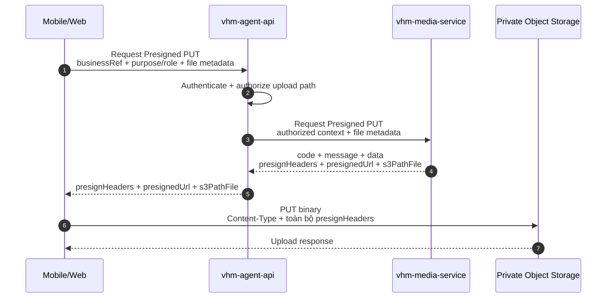
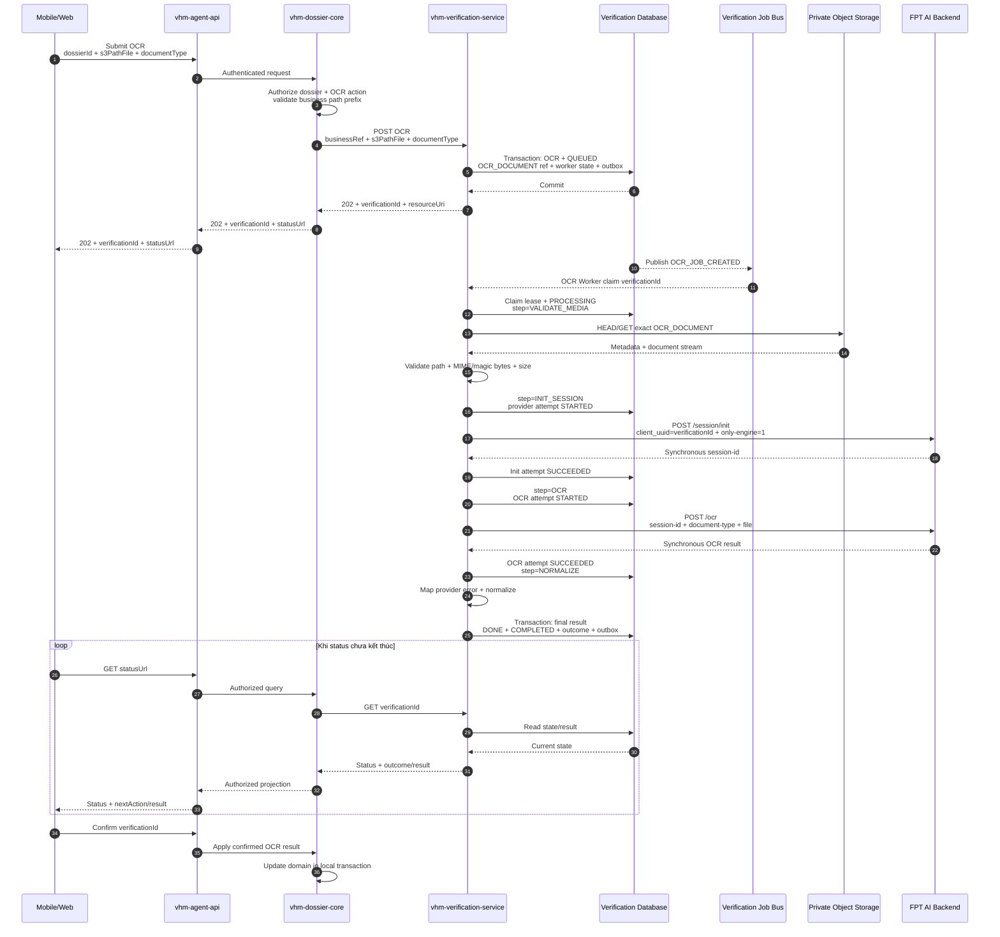
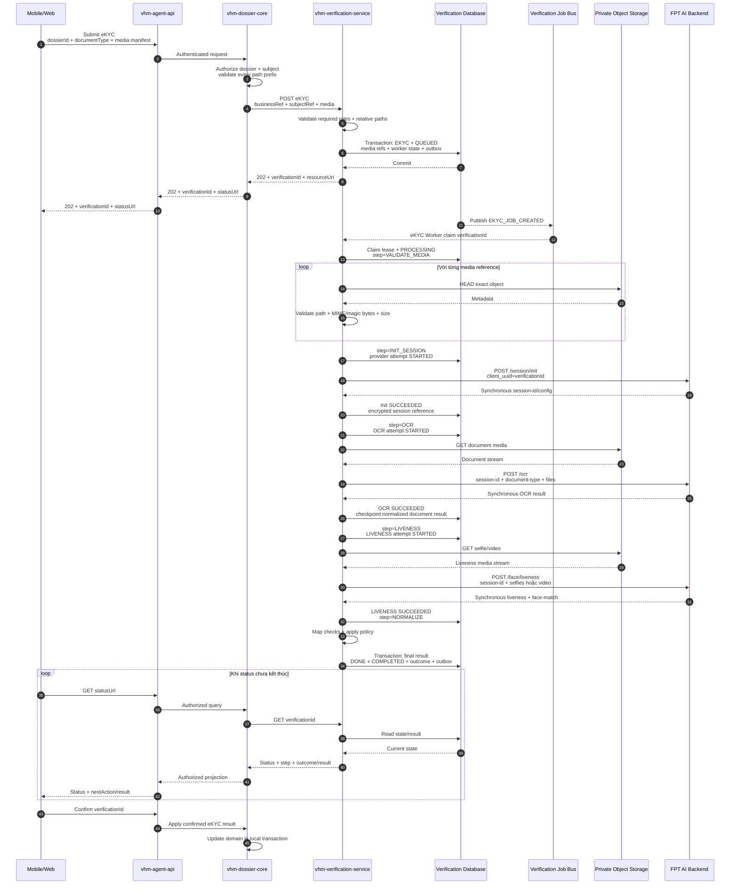
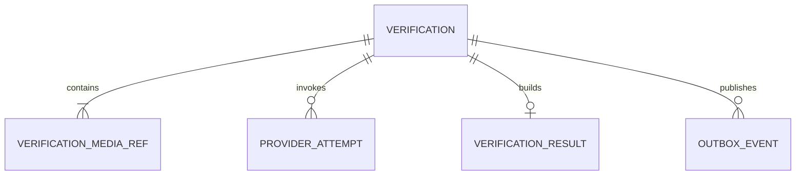

# Vấn đề 6: Thiết kế tích hợp OCR và eKYC tập trung

## 1. Phạm vi và quyết định kiến trúc

`vhm-verification-service` cung cấp capability OCR/eKYC dùng chung cho nhiều domain. Mobile/Web không gọi trực tiếp FPT AI; domain service không phụ thuộc credential, session, payload hoặc error code của provider.

Baseline dùng **backend API + queue/worker** cho cả hai loại verification:

```text
OCR:
Upload document → create OCR → 202 QUEUED
→ OCR Worker → FPT session/init → OCR
→ Canonical Result → Mobile/Web poll → confirm/apply

eKYC:
Upload document + selfie/video → create eKYC → 202 QUEUED
→ eKYC Worker → FPT session/init → OCR → face/liveness
→ Canonical Result → Mobile/Web poll → confirm/apply
```

Các call FPT trả kết quả đồng bộ cho worker. Resource của VHM vẫn bất đồng bộ để không giữ kết nối Mobile/Web/BFF trong lúc đọc media và chờ provider, đồng thời cô lập timeout, quota và backlog khỏi domain service.

| **Hướng tiếp cận** | **Ưu điểm** | **Nhược điểm** | **Lựa chọn** |
| --- | --- | --- | --- |
| Domain service gọi trực tiếp FPT | Ít thành phần ban đầu | Domain phụ thuộc provider contract, credential và SLA | No |
| Mobile/Web gọi FPT trực tiếp | Ít hop backend | Lộ provider contract/credential, khó kiểm soát dữ liệu và audit | No |
| `vhm-verification-service` + API/queue/worker | Contract tập trung, tái sử dụng, cô lập provider và vận hành thống nhất | Thêm job infrastructure và bước polling | **Yes** |

OCR chỉ hỗ trợ số hóa/gợi ý dữ liệu. eKYC hỗ trợ kiểm tra giấy tờ, liveness và face match. Cả hai không tự quyết định hồ sơ đủ điều kiện NOXH; người dùng phải xác nhận trước khi domain apply kết quả.

## 2. Kiến trúc dùng chung

### 2.1. Thành phần và trách nhiệm

| **Thành phần** | **Trách nhiệm** |
| --- | --- |
| Mobile/Web | Capture/upload media; tạo verification; poll, hiển thị và xác nhận kết quả |
| `vhm-agent-api` | Xác thực/routing; authorize yêu cầu cấp Presigned PUT; không giữ FPT credential |
| Domain service, ví dụ `vhm-dossier-core` | Authorize `businessRef`, chủ thể, media path; query và apply kết quả |
| `vhm-media-service` | Chỉ tham gia upload; trả `presignHeaders + presignedUrl + s3PathFile` |
| Verification API | Private command/query API của `vhm-verification-service` |
| Outbox Publisher + Job Bus | Publish job đã commit và route theo `verificationType` |
| OCR Worker pool | Xử lý một logical document và gọi FPT OCR flow |
| eKYC Worker pool | Xử lý document + liveness media và gọi full eKYC flow |
| Provider Adapter | Inject server credential, map provider request/response/error |
| Result Normalizer/Policy | Tạo Canonical Result và outcome ổn định |
| Verification Database | Lưu aggregate, media refs, provider attempts, results và outbox |

Verification API, Outbox Publisher, hai worker handler/pool, Provider Adapter và Result Normalizer/Policy là module/workload trong cùng `vhm-verification-service`, không phải các public service riêng.

Hai worker pool dùng chung code nền, schema và job contract nhưng cấu hình concurrency/quota riêng. OCR chậm hoặc backlog lớn không được chiếm toàn bộ capacity của eKYC và ngược lại.

### 2.2. Kiến trúc tổng quan

```mermaid
flowchart TB
    CLIENT["`**Mobile/Web**
Upload · Submit · Poll`"]
    BFF["`**vhm-agent-api**
Xác thực · routing`"]
    DOMAIN["`**Domain Service**
Authorize · Apply result`"]
    MEDIA_API["`**vhm-media-service**
Presigned PUT`"]
    STORAGE[("`**Private Object Storage**
Verification media`")]

    subgraph VERIFY["`**vhm-verification-service (private)**
OCR · eKYC · Provider Adapter`"]
        direction TB
        API["`**Verification API**
Create · Status · Result`"]
        OUTBOX["`**Outbox Publisher**
Committed jobs`"]
        OCR_WORKER["`**OCR Worker pool**
One document`"]
        EKYC_WORKER["`**eKYC Worker pool**
Document · Liveness`"]
        ADAPTER["`**Provider Adapter**
FPT contract · credential`"]
        NORMALIZE["`**Result Normalizer/Policy**
Canonical Result · Outcome`"]

        OCR_WORKER --> ADAPTER
        EKYC_WORKER --> ADAPTER
        ADAPTER --> NORMALIZE
    end

    JOB_BUS[("`**Verification Job Bus**
Route OCR · eKYC`")]
    FPT["`**FPT AI Backend**
Session · OCR · Face/Liveness`"]
    DB[("`**Verification Database**
Shared schema`")]

    CLIENT <-->|"Application API"| BFF
    BFF <-->|"Request upload URL"| MEDIA_API
    CLIENT ==>|"Presigned PUT"| STORAGE
    MEDIA_API -->|"Sign configured bucket/prefix"| STORAGE

    BFF <-->|"Create/query/apply"| DOMAIN
    DOMAIN <-->|"Private command/query"| API
    API <-->|"Persist/read"| DB
    OUTBOX <-->|"Claim outbox"| DB
    OUTBOX -->|"Publish by type"| JOB_BUS
    JOB_BUS -->|"OCR job"| OCR_WORKER
    JOB_BUS -->|"eKYC job"| EKYC_WORKER

    OCR_WORKER -->|"HEAD/GET exact media"| STORAGE
    EKYC_WORKER -->|"HEAD/GET exact media"| STORAGE
    ADAPTER <-->|"Synchronous provider API"| FPT
    NORMALIZE -->|"Checkpoint/final result"| DB
```



Ba trách nhiệm tách rõ:

- Upload binary: `Mobile/Web → Presigned PUT → Object Storage`.
- Verification processing: `Worker → Object Storage → FPT AI Backend`.
- Business authorization/apply: `Mobile/Web → BFF → Domain Service`.

### 2.3. Upload media dùng chung

Upload diễn ra trước create verification. Contract Media Service hiện có không trả `mediaId` và không có bước finalize; durable reference là `s3PathFile`.



Response rút gọn theo contract hiện có:

```json
{
  "code": 0,
  "message": "Thành công",
  "data": {
    "presignHeaders": {
      "x-amz-meta-vhm_performer": "dossier-svc",
      "x-amz-meta-vhm_performer_source": "http-internal",
      "x-amz-server-side-encryption": "aws:kms",
      "x-amz-server-side-encryption-aws-kms-key-id": "<kms-key-arn>"
    },
    "presignedUrl": "<temporary-presigned-put-url>",
    "s3PathFile": "registrations/<business-ref>/<generated-file-name>"
  }
}
```

Quy ước:

- Client phải gửi đúng `Content-Type` và toàn bộ signed headers.
- Chỉ relative `s3PathFile` được truyền vào command và persist; không lưu Presigned URL, full S3 URL, bucket hoặc temporary credential.
- Domain Service authorize path thuộc đúng business prefix trước khi gọi Verification API.
- Verification API chuẩn hóa/reject full URL, absolute path, traversal và path ngoài prefix cho phép.
- Worker ghép `basePrefix + s3PathFile`, HEAD/GET trực tiếp S3 bằng IAM read-only rồi kiểm tra object, MIME/magic bytes và kích thước.
- Contract hiện tại không cung cấp object version/finalized proof; thiết kế không giả định media immutable.

### 2.4. Lifecycle dùng chung

`status` mô tả vòng đời kỹ thuật:

```text
QUEUED → PROCESSING → COMPLETED
   └───────────────→ CANCELLED/EXPIRED
```

| **Status** | **Ý nghĩa** |
| --- | --- |
| `QUEUED` | Aggregate và outbox đã commit, chờ worker claim |
| `PROCESSING` | Worker đang xử lý hoặc chờ retry step |
| `COMPLETED` | Đã có outcome cuối, kể cả provider error sau hết recovery budget |
| `CANCELLED` | Bị hủy trước khi hoàn tất |
| `EXPIRED` | Quá processing deadline |

`currentStep` dùng chung: `VALIDATE_MEDIA`, `INIT_SESSION`, `OCR`, `LIVENESS`, `NORMALIZE`, `DONE`. OCR bỏ qua `LIVENESS`; eKYC phải đi qua bước này trong baseline.

`outcome` chỉ có khi `status=COMPLETED` và được kiểm tra theo `verificationType`:

| **Type** | **Outcome** |
| --- | --- |
| `OCR` | `OCR_COMPLETED`, `NEED_REVIEW`, `NEED_RETRY`, `PROVIDER_ERROR` |
| `EKYC` | `EKYC_VERIFIED`, `EKYC_REJECTED`, `NEED_REVIEW`, `NEED_RETRY`, `PROVIDER_ERROR` |

## 3. Luồng OCR

### 3.1. Media và provider flow

Mỗi OCR verification xử lý một logical document, được lưu thành một row `verification_media_refs` với role `OCR_DOCUMENT`. `documentType` chọn provider API/model và Canonical Result schema, không tạo workflow khác.

FPT OCR flow của worker:

```text
POST /session/init
  client_uuid = verificationId
  only-engine = 1

POST /ocr
  session-id + device-type + document-type + document file
```

`/ocr` trả response đồng bộ cho worker. VHM không trả provider `session-id` xuống Mobile/Web.

### 3.2. Flowchart OCR

```mermaid
flowchart LR
    API["`**Verification API**
Validate OCR command`"]
    ACCEPT["`**Database transaction**
OCR · QUEUED · Media ref · Outbox`"]
    BUS[("`**Verification Job Bus**
OCR_JOB_CREATED`")]
    WORKER["`**OCR Worker pool**
PROCESSING`"]
    READ["`**Storage Reader**
HEAD/GET OCR_DOCUMENT`"]
    INIT["`**FPT Session API**
POST /session/init`"]
    OCR["`**FPT OCR API**
POST /ocr`"]
    NORMALIZE["`**Result Normalizer**
Canonical fields · warnings`"]
    DONE["`**Verification Database**
COMPLETED · outcome · final result`"]

    API --> ACCEPT -->|"Publish"| BUS --> WORKER
    WORKER --> READ --> INIT --> OCR --> NORMALIZE --> DONE
```



### 3.3. Sequence OCR end-to-end



## 4. Luồng eKYC

### 4.1. Media manifest và provider flow

Một eKYC verification chứa nhiều physical media với role/order rõ ràng:

| **Role** | **Số lượng** | **Nội dung** |
| --- | --- | --- |
| `DOCUMENT_FRONT` | 1 | Mặt trước giấy tờ hoặc trang ảnh chính hộ chiếu |
| `DOCUMENT_BACK` | 0..1 | Mặt sau nếu `documentType` yêu cầu |
| `LIVENESS_SELFIE` | 1..n | Selfie cho liveness/face match |
| `LIVENESS_VIDEO` | 0..1 | Video liveness; không dùng đồng thời selfie nếu contract không cho phép |

Worker HEAD toàn bộ manifest trước khi init session và chỉ GET media khi thực hiện từng provider step. Không giữ toàn bộ video/document trong heap; nếu multipart client cần replay/content length, chỉ spool vào vùng tạm mã hóa có quota và xóa sau attempt.

FPT eKYC flow của worker:

```text
POST /session/init
  client_uuid = verificationId
  không dùng only-engine=1

POST /ocr
  session-id + device-type + document-type + document files

POST /face/liveness
  session-id + device-type + auto=False + selfies hoặc video
```

`sourcePlatform` map FPT `device-type`: `ANDROID → android`, `IOS → ios`, `WEB → web-sdk`.

### 4.2. Flowchart eKYC

```mermaid
flowchart LR
    API["`**Verification API**
Validate eKYC command/manifest`"]
    ACCEPT["`**Database transaction**
EKYC · QUEUED · Media refs · Outbox`"]
    BUS[("`**Verification Job Bus**
EKYC_JOB_CREATED`")]
    WORKER["`**eKYC Worker pool**
PROCESSING`"]
    READ["`**Storage Reader**
HEAD/GET media by role`"]
    INIT["`**FPT Session API**
POST /session/init`"]
    OCR["`**FPT OCR API**
POST /ocr`"]
    LIVE["`**FPT Face/Liveness API**
POST /face/liveness`"]
    POLICY["`**Result Normalizer/Policy**
Document · Liveness · Face match`"]
    DONE["`**Verification Database**
COMPLETED · outcome · final result`"]

    API --> ACCEPT -->|"Publish"| BUS --> WORKER
    WORKER --> READ --> INIT --> OCR --> LIVE --> POLICY --> DONE
```



### 4.3. Sequence eKYC end-to-end



## 5. API contract

### 5.1. Danh sách API

API theo use case vẫn tách để contract rõ, nhưng cùng map vào shared verification aggregate:

| **Use case** | **Private API** | **Response** |
| --- | --- | --- |
| Tạo OCR | `POST /v1/ocr-verifications` | `202 + verificationId + resourceUri` |
| Lấy OCR | `GET /v1/ocr-verifications/{verificationId}` | Status/outcome/next action |
| Lấy OCR result | `GET /v1/ocr-verifications/{verificationId}/result` | OCR Canonical Result |
| Retry OCR | `POST /v1/ocr-verifications/{verificationId}/retries` | `202`, verification mới |
| Tạo eKYC | `POST /v1/ekyc-verifications` | `202 + verificationId + resourceUri` |
| Lấy eKYC | `GET /v1/ekyc-verifications/{verificationId}` | Status/step/outcome/next action |
| Lấy eKYC result | `GET /v1/ekyc-verifications/{verificationId}/result` | eKYC Canonical Result |
| Retry eKYC | `POST /v1/ekyc-verifications/{verificationId}/retries` | `202`, verification mới |

Toàn bộ API của `vhm-verification-service` là private nên không thêm prefix `/internal`. Route không chứa `/dossiers`; domain caller truyền `businessRef`, lưu association với `verificationId` và authorize lại mỗi request từ Mobile/Web.

### 5.2. Tạo OCR

```http
POST /v1/ocr-verifications
Authorization: Bearer <service-token>
Idempotency-Key: 72aacfa4-97b8-4d0f-bb74-490f17352b1b
Content-Type: application/json

{
  "businessRef": { "type": "DOSSIER", "id": "dos-01" },
  "subjectRef": "customer-opaque-ref",
  "channel": "MOBILE",
  "sourcePlatform": "ANDROID",
  "documentType": "MARRIAGE_CERTIFICATE",
  "s3PathFile": "registrations/dos-01/marriage-certificate.png"
}
```

Verification API map `s3PathFile` thành media row có role `OCR_DOCUMENT`.

### 5.3. Tạo eKYC

```http
POST /v1/ekyc-verifications
Authorization: Bearer <service-token>
Idempotency-Key: a5ac2480-fdda-4474-a3f1-4e602c992f13
Content-Type: application/json

{
  "businessRef": { "type": "DOSSIER", "id": "dos-01" },
  "subjectRef": "customer-opaque-ref",
  "consentRef": "consent-20260810-01",
  "channel": "MOBILE",
  "sourcePlatform": "ANDROID",
  "documentType": "IDR",
  "media": [
    { "role": "DOCUMENT_FRONT", "s3PathFile": "registrations/dos-01/front.png", "order": 1 },
    { "role": "DOCUMENT_BACK", "s3PathFile": "registrations/dos-01/back.png", "order": 1 },
    { "role": "LIVENESS_VIDEO", "s3PathFile": "registrations/dos-01/live.mp4", "order": 1 }
  ]
}
```

### 5.4. Create/status response

Cả hai create API chỉ trả `202` sau khi verification, media refs, worker state và outbox commit:

```http
HTTP/1.1 202 Accepted
Retry-After: 3

{
  "verificationId": "ver-123",
  "type": "OCR",
  "status": "QUEUED",
  "resourceUri": "/v1/ocr-verifications/ver-123"
}
```

```json
{
  "verificationId": "ver-123",
  "type": "OCR",
  "status": "PROCESSING",
  "currentStep": "OCR",
  "outcome": null,
  "resultAvailable": false,
  "nextAction": "POLL",
  "updatedAt": "2026-08-10T11:30:25+07:00"
}
```

`nextAction` và progress được tính từ `verificationType + status + currentStep + outcome`, không persist.

### 5.5. Canonical Result

OCR result:

```json
{
  "verificationId": "ver-123",
  "type": "OCR",
  "status": "COMPLETED",
  "outcome": "OCR_COMPLETED",
  "schemaVersion": "1.0",
  "document": {
    "type": "MARRIAGE_CERTIFICATE",
    "fields": {
      "certificateNumber": { "value": "01/2026", "confidence": 0.97 }
    },
    "warnings": []
  },
  "nextAction": "CONFIRM_AND_APPLY"
}
```

eKYC result:

```json
{
  "verificationId": "ver-456",
  "type": "EKYC",
  "status": "COMPLETED",
  "outcome": "EKYC_VERIFIED",
  "schemaVersion": "1.0",
  "subject": {
    "documentType": "IDR",
    "fields": {
      "documentNumber": { "value": "<authorized-value>", "confidence": 0.99 },
      "fullName": { "value": "<authorized-value>", "confidence": 0.98 }
    }
  },
  "checks": {
    "documentQuality": "PASS",
    "liveness": "PASS",
    "faceMatch": "PASS"
  },
  "warnings": [],
  "nextAction": "CONFIRM_AND_APPLY"
}
```

Chỉ trả field nằm trong allowlist của `documentType`. Không trả raw provider payload, provider session, API key, storage path hoặc media.

### 5.6. HTTP và error contract

| **HTTP** | **Sử dụng** |
| --- | --- |
| `200/202` | Query thành công hoặc create đã persist để xử lý |
| `400` | Header/payload/media manifest sai định dạng |
| `401/403` | Service identity hoặc scope không hợp lệ |
| `404` | Resource không tồn tại hoặc caller không được biết resource tồn tại |
| `409` | Idempotency conflict, type/state sai hoặc result chưa sẵn sàng |
| `413/415/422` | Media vượt giới hạn, sai loại, thiếu role hoặc sai document contract |
| `429` | Admission control/quota nội bộ; trả `Retry-After` |
| `503` | Không thể persist/enqueue an toàn |

Provider error phát sinh trong worker được lưu vào attempt/outcome để Mobile/Web nhận khi poll; không trả raw FPT error.

## 6. Schema dữ liệu dùng chung

### 6.1. Mô hình logic

Chỉ dùng năm bảng cho cả OCR và eKYC:

| **Bảng** | **Mục đích** |
| --- | --- |
| `verifications` | Aggregate chung: type, business binding, lifecycle, idempotency và worker lease/retry |
| `verification_media_refs` | OCR có một `OCR_DOCUMENT`; eKYC có document/liveness roles |
| `provider_attempts` | Từng call `INIT_SESSION`, `OCR`, `LIVENESS` |
| `verification_results` | OCR ghi final v1; eKYC checkpoint sau OCR rồi khóa final sau liveness |
| `outbox_events` | Bảo đảm aggregate commit và enqueue/terminal event không lệch nhau |



### 6.2. DDL baseline

```sql
CREATE TABLE verifications (
    verification_id         UUID PRIMARY KEY,
    verification_type       VARCHAR(20) NOT NULL CHECK (verification_type IN
                                ('OCR', 'EKYC')),
    business_type           VARCHAR(30) NOT NULL,
    business_ref            VARCHAR(100) NOT NULL,
    subject_ref_ciphertext  BYTEA,
    consent_ref             VARCHAR(150),
    channel                 VARCHAR(20) NOT NULL CHECK (channel IN ('MOBILE', 'WEB')),
    source_platform         VARCHAR(20) NOT NULL CHECK (source_platform IN
                                ('ANDROID', 'IOS', 'WEB')),
    document_type           VARCHAR(50) NOT NULL,

    status                  VARCHAR(30) NOT NULL CHECK (status IN
                                ('QUEUED', 'PROCESSING', 'COMPLETED',
                                 'CANCELLED', 'EXPIRED')),
    current_step            VARCHAR(30) NOT NULL CHECK (current_step IN
                                ('VALIDATE_MEDIA', 'INIT_SESSION', 'OCR',
                                 'LIVENESS', 'NORMALIZE', 'DONE')),
    outcome                 VARCHAR(30),

    attempt_count           INTEGER NOT NULL DEFAULT 0 CHECK (attempt_count >= 0),
    available_at            TIMESTAMPTZ NOT NULL DEFAULT now(),
    lease_owner             VARCHAR(100),
    lease_until             TIMESTAMPTZ,
    last_error_code         VARCHAR(80),

    retry_of                UUID REFERENCES verifications(verification_id),
    idempotency_key         VARCHAR(100) NOT NULL,
    request_fingerprint     CHAR(64) NOT NULL,
    terminal_reason_code    VARCHAR(80),
    row_version             BIGINT NOT NULL DEFAULT 0,
    created_at              TIMESTAMPTZ NOT NULL DEFAULT now(),
    updated_at              TIMESTAMPTZ NOT NULL DEFAULT now(),
    completed_at            TIMESTAMPTZ,

    CONSTRAINT uq_verification_idempotency
        UNIQUE (verification_type, business_type, idempotency_key),
    CONSTRAINT ck_verification_channel_platform CHECK (
        (channel = 'WEB' AND source_platform = 'WEB') OR
        (channel = 'MOBILE' AND source_platform IN ('ANDROID', 'IOS'))
    ),
    CONSTRAINT ck_ekyc_required_fields CHECK (
        verification_type <> 'EKYC' OR
        (subject_ref_ciphertext IS NOT NULL AND consent_ref IS NOT NULL)
    ),
    CONSTRAINT ck_verification_status_outcome CHECK (
        (status <> 'COMPLETED' AND outcome IS NULL) OR
        (status = 'COMPLETED' AND verification_type = 'OCR' AND outcome IN
            ('OCR_COMPLETED', 'NEED_REVIEW', 'NEED_RETRY', 'PROVIDER_ERROR')) OR
        (status = 'COMPLETED' AND verification_type = 'EKYC' AND outcome IN
            ('EKYC_VERIFIED', 'EKYC_REJECTED', 'NEED_REVIEW',
             'NEED_RETRY', 'PROVIDER_ERROR'))
    ),
    CONSTRAINT ck_verification_completed CHECK (
        (status = 'COMPLETED' AND completed_at IS NOT NULL AND current_step = 'DONE') OR
        (status <> 'COMPLETED' AND completed_at IS NULL AND current_step <> 'DONE')
    )
);

CREATE INDEX ix_verification_business
    ON verifications (business_type, business_ref, created_at DESC);
CREATE INDEX ix_verification_dispatch
    ON verifications (verification_type, status, available_at)
    WHERE status IN ('QUEUED', 'PROCESSING');
CREATE INDEX ix_verification_lease_recovery
    ON verifications (lease_until)
    WHERE status = 'PROCESSING';

CREATE TABLE verification_media_refs (
    media_ref_id             UUID PRIMARY KEY,
    verification_id         UUID NOT NULL REFERENCES verifications(verification_id),
    role                     VARCHAR(30) NOT NULL CHECK (role IN
                                ('OCR_DOCUMENT', 'DOCUMENT_FRONT', 'DOCUMENT_BACK',
                                 'LIVENESS_SELFIE', 'LIVENESS_VIDEO')),
    media_order              INTEGER NOT NULL DEFAULT 1 CHECK (media_order > 0),
    s3_path_file             TEXT NOT NULL,
    created_at               TIMESTAMPTZ NOT NULL DEFAULT now(),
    CONSTRAINT uq_verification_media_role_order
        UNIQUE (verification_id, role, media_order)
);

CREATE INDEX ix_verification_media
    ON verification_media_refs (verification_id);

CREATE TABLE provider_attempts (
    provider_attempt_id      UUID PRIMARY KEY,
    verification_id         UUID NOT NULL REFERENCES verifications(verification_id),
    provider                 VARCHAR(30) NOT NULL,
    operation                VARCHAR(30) NOT NULL CHECK (operation IN
                                ('INIT_SESSION', 'OCR', 'LIVENESS')),
    attempt_no               INTEGER NOT NULL CHECK (attempt_no > 0),
    provider_session_ciphertext BYTEA,
    status                   VARCHAR(20) NOT NULL CHECK (status IN
                                ('STARTED', 'SUCCEEDED', 'FAILED', 'UNKNOWN')),
    delivery_state           VARCHAR(20) NOT NULL CHECK (delivery_state IN
                                ('NOT_SENT', 'SENDING', 'SENT', 'UNKNOWN')),
    error_class              VARCHAR(40),
    error_code               VARCHAR(80),
    started_at               TIMESTAMPTZ NOT NULL,
    finished_at              TIMESTAMPTZ,
    CONSTRAINT uq_provider_call
        UNIQUE (verification_id, provider, operation, attempt_no)
);

CREATE INDEX ix_provider_attempt_verification
    ON provider_attempts (verification_id, operation, attempt_no DESC);

CREATE TABLE verification_results (
    verification_id         UUID PRIMARY KEY REFERENCES verifications(verification_id),
    result_version           INTEGER NOT NULL CHECK (result_version > 0),
    schema_version           VARCHAR(20) NOT NULL,
    canonical_payload_ciphertext BYTEA NOT NULL,
    payload_key_version      VARCHAR(40) NOT NULL,
    is_final                 BOOLEAN NOT NULL DEFAULT FALSE,
    created_at               TIMESTAMPTZ NOT NULL DEFAULT now(),
    updated_at               TIMESTAMPTZ NOT NULL DEFAULT now()
);

CREATE TABLE outbox_events (
    event_id                 UUID PRIMARY KEY,
    aggregate_id             UUID NOT NULL REFERENCES verifications(verification_id),
    event_type               VARCHAR(80) NOT NULL,
    payload                  JSONB NOT NULL,
    status                   VARCHAR(20) NOT NULL DEFAULT 'NEW' CHECK (status IN
                                ('NEW', 'PUBLISHING', 'PUBLISHED', 'FAILED')),
    available_at             TIMESTAMPTZ NOT NULL DEFAULT now(),
    lease_owner              VARCHAR(100),
    lease_until              TIMESTAMPTZ,
    published_at             TIMESTAMPTZ,
    attempt_count            INTEGER NOT NULL DEFAULT 0,
    created_at               TIMESTAMPTZ NOT NULL DEFAULT now(),
    CONSTRAINT ck_outbox_publishing_lease CHECK (
        (status = 'PUBLISHING' AND lease_owner IS NOT NULL AND lease_until IS NOT NULL) OR
        (status <> 'PUBLISHING' AND lease_owner IS NULL AND lease_until IS NULL)
    )
);

CREATE INDEX ix_outbox_publish
    ON outbox_events (available_at)
    WHERE status IN ('NEW', 'FAILED');
CREATE INDEX ix_outbox_lease_recovery
    ON outbox_events (lease_until)
    WHERE status = 'PUBLISHING';
```

Quy ước schema:

- OCR insert một `verification_results` với `result_version=1`, `is_final=true` khi hoàn tất.
- eKYC checkpoint document result với `is_final=false`, sau liveness tăng version và đặt `is_final=true`.
- Result update dùng compare-and-set theo `result_version`; row đã `is_final=true` không được update. Retry tạo `verificationId` mới.
- Media-role combination được validate ở application layer theo `verificationType + documentType`; CHECK SQL chỉ bảo vệ enum cơ bản.
- Outbox/message chỉ chứa ID/reference tối thiểu, không chứa PII, media path, binary hoặc Canonical Result.

## 7. Tin cậy, timeout và vận hành worker

### 7.1. Transaction và idempotency

- Insert `verifications`, toàn bộ `verification_media_refs` và `outbox_events` trong một transaction ngắn.
- Cùng `Idempotency-Key` và request fingerprint trả resource cũ; cùng key nhưng fingerprint khác trả `409 IDEMPOTENCY_CONFLICT`.
- Queue dùng at-least-once; message chỉ chứa `verificationId` và `verificationType`.
- Worker claim aggregate bằng lease/CAS; không gọi lại operation đã có provider attempt terminal thành công.
- Object Storage và provider calls luôn nằm ngoài DB transaction.
- Sau mỗi provider call thành công, persist attempt, checkpoint cần thiết và `currentStep` tiếp theo.
- Final result, `DONE + COMPLETED + outcome` và terminal outbox commit cùng transaction.
- Outbox Publisher claim `NEW/FAILED → PUBLISHING` bằng lease; stale `PUBLISHING` được phục hồi sau lease expiry.

### 7.2. Retry và resume theo step

- Retry budget lấy từ cấu hình theo `verificationType + provider + operation`, không lưu `max_attempts` trên aggregate.
- Lỗi retry-safe: trở lại `QUEUED`, tăng `attempt_count`, đặt `available_at` theo backoff và xóa worker lease.
- OCR resume từ `INIT_SESSION/OCR/NORMALIZE` dựa trên attempt đã commit.
- eKYC OCR đã thành công và provider session còn hiệu lực thì resume liveness, không gọi lại OCR.
- Hết recovery budget: `COMPLETED + PROVIDER_ERROR`; client không poll vô hạn.

### 7.3. Timeout FPT synchronous API

| **Thời điểm lỗi** | **Xử lý** |
| --- | --- |
| Chưa gửi request/body tới FPT | Retry giới hạn với backoff |
| FPT trả `429/5xx` rõ ràng | Retry khi operation được xác nhận retry-safe |
| Timeout sau khi body có thể đã gửi | Ghi attempt `UNKNOWN`; không POST lại mù |
| FPT trả lỗi input/chất lượng | Map `NEED_RETRY/NEED_REVIEW` hoặc eKYC rejection theo policy |

Timeout outbound của từng FPT call phải ngắn hơn worker lease còn lại. Worker renew lease giữa các step nếu tổng journey dài hơn lease ban đầu; hard timeout phải hủy outbound request trước khi mất lease.

### 7.4. Quota và backlog

- OCR và eKYC dùng token bucket/concurrency limit riêng theo FPT quota.
- Job Bus route theo type tới consumer pool riêng; shared queue contract không có nghĩa dùng chung toàn bộ thread/capacity.
- Circuit breaker dừng claim job mới của flow đang lỗi diện rộng; job còn `QUEUED` và `available_at` được dời theo backoff.
- Alert tối thiểu: queue age/depth theo type, provider latency/error/429, stale lease, outbox lag, terminal outcome rate.

## 8. Kế hoạch triển khai và kiểm thử

### 8.1. Thứ tự triển khai

1. Chốt `s3PathFile` prefix, media roles, IAM read-only và input limit.
2. Chốt FPT `documentType → API/model`, request/response/error, quota, session TTL và timeout.
3. Xây shared schema, Verification API core, idempotency, outbox và Job Bus routing.
4. Xây OCR handler/provider flow và Canonical Result.
5. Xây eKYC handler/provider flow, step checkpoint và policy engine.
6. Tích hợp polling/confirm/apply với domain.
7. Load/resilience test và chốt concurrency/alert trước production.

### 8.2. Kiểm thử tối thiểu

| **Lớp test** | **Phạm vi** |
| --- | --- |
| Unit | Type-specific media/outcome guard, lifecycle/step, idempotency, canonical mapping |
| Provider contract | Init/OCR/liveness success, business error, malformed response, 429, 5xx, timeout |
| Database | CHECK/unique/index, optimistic lock, result final guard, outbox/worker lease recovery |
| Integration | Presigned upload contract, S3 path authorization, queue duplicate và step resume |
| OCR end-to-end | Upload → create `202` → OCR result → confirm/apply |
| eKYC end-to-end | Upload manifest → create `202` → OCR/liveness → result → confirm/apply |
| Resilience | Slow/large media, crash giữa step, unknown-after-send, provider outage, backlog burst |

### 8.3. Điểm cần chốt

- FPT API/model và input contract cho từng OCR/eKYC `documentType`.
- Image/video size, duration, resolution, MIME và capture quality rule.
- Capture UX/guidance của Mobile/Web khi không dùng FPT SDK.
- OCR confidence và eKYC liveness/deepfake/face-match/need-review thresholds.
- Session TTL, SLA/quota/timeout và retry-safe matrix của từng endpoint.
- Consent evidence, retention và quy tắc xóa media/PII/session/result/outbox/attempt.

`vhm-verification-service` chịu trách nhiệm điều phối kỹ thuật OCR/eKYC, provider isolation và Canonical Result. Domain Service chịu trách nhiệm authorization, bind hồ sơ/chủ thể, xác nhận người dùng và apply kết quả nghiệp vụ.
