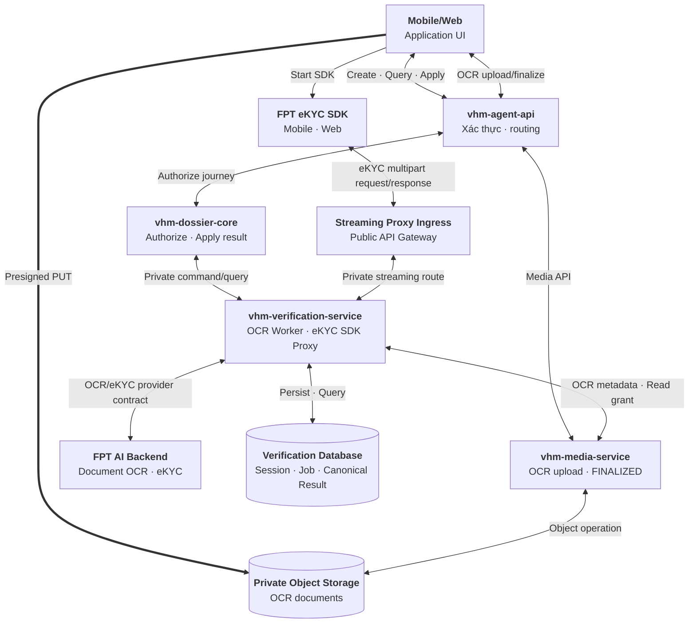
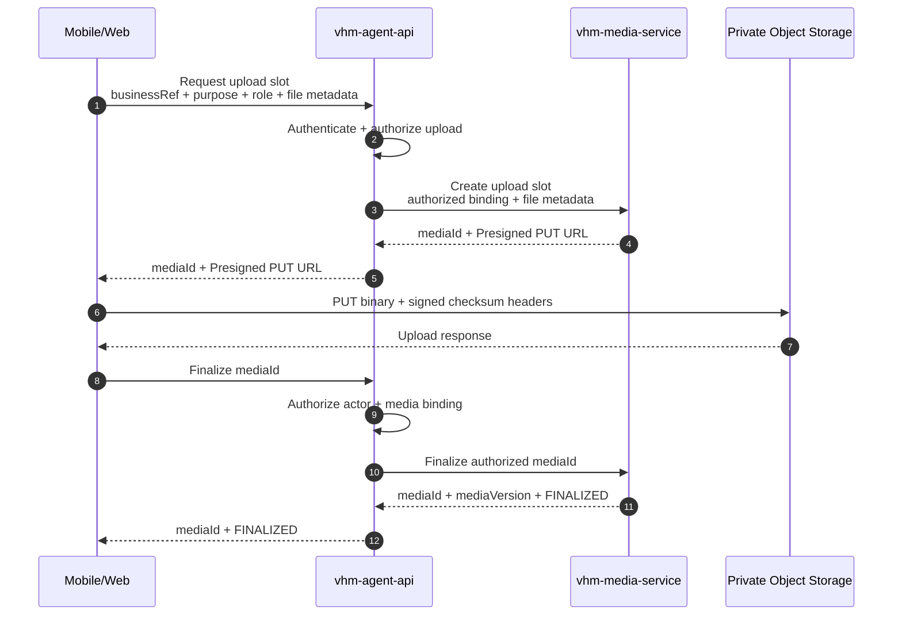
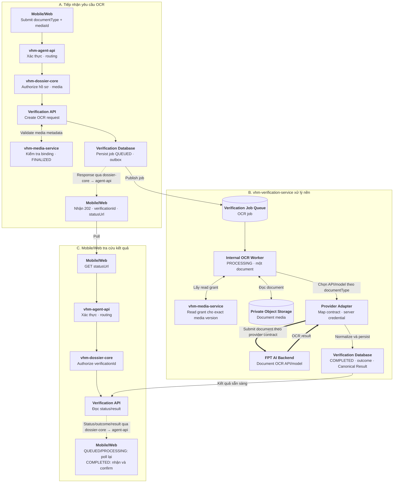
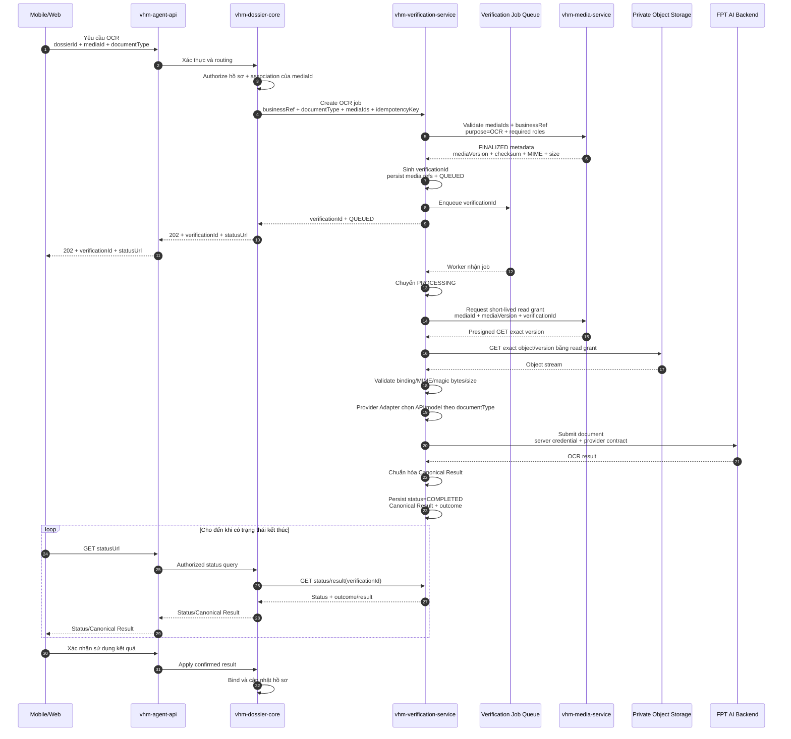
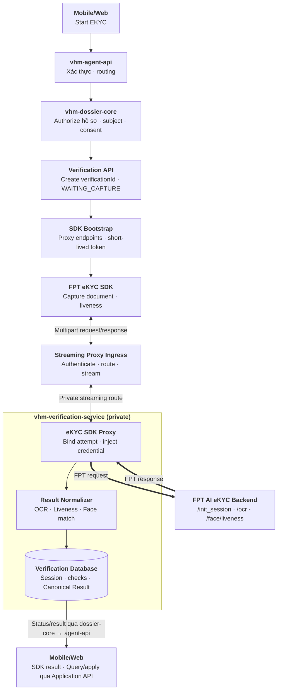
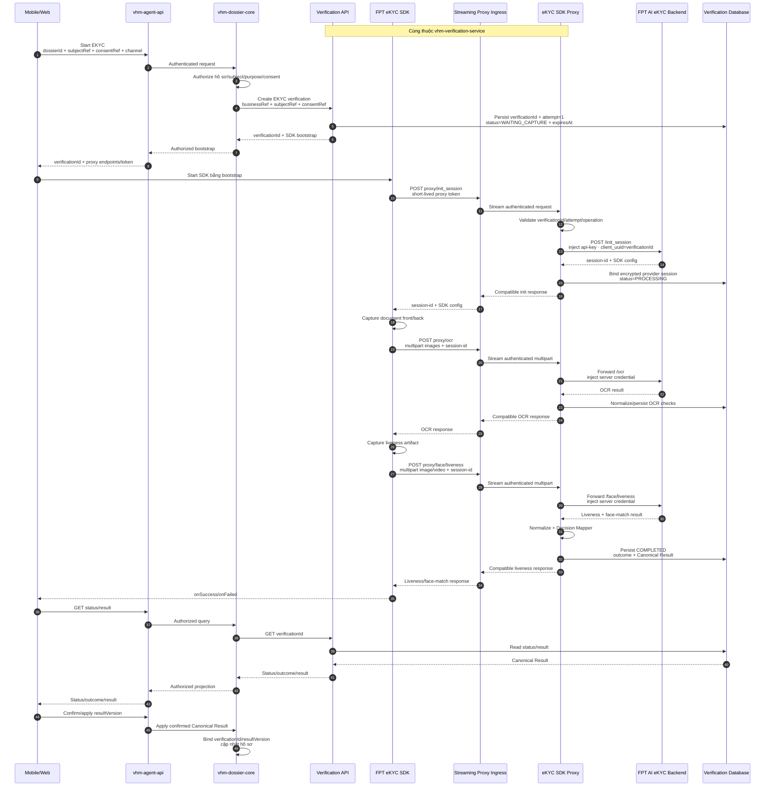
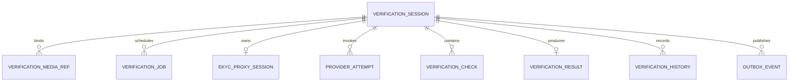

# Vấn đề 6: Lựa chọn nền tảng tích hợp OCR tập trung

## 1. Phạm vi

**User case:** Người dùng chụp hoặc upload giấy tờ trên Mobile/Web để hệ thống OCR, phân loại, gợi ý dữ liệu hoặc xác minh danh tính khi tạo hồ sơ NOXH.

**Hai journey được thiết kế độc lập:**

- **`OCR`:** Trích xuất và chuẩn hóa dữ liệu giấy tờ. Kết quả OCR không khẳng định người thao tác là chủ thể trên giấy tờ và luôn cần người dùng kiểm tra trước khi apply vào hồ sơ.
- **`EKYC`:** OCR giấy tờ định danh kết hợp liveness và face matching để xác minh người thao tác.

**Loại tài liệu dự kiến:**

- CCCD mặt trước/sau.
- Giấy đăng ký kết hôn.
- Bản sao có chứng thực giấy chứng nhận hộ gia đình nghèo/cận nghèo.
- Các giấy tờ khác trong checklist hồ sơ NOXH khi có mẫu OCR tương ứng.

`vhm-verification-service` là nền tảng verification dùng chung, điều phối cả `OCR` và `EKYC`, cô lập contract/credential của provider và chuẩn hóa kết quả. Quyết định cập nhật hồ sơ hoặc chấp nhận kết quả vẫn thuộc `vhm-dossier-core`.

Trong tài liệu này, `vhm-dossier-core` là domain caller của NOXH. Domain khác có nhu cầu OCR/eKYC sử dụng cùng private API và vẫn tự chịu trách nhiệm authorization nghiệp vụ trước khi gọi `vhm-verification-service`.

**Các use case:**

1. **OCR CCCD:** Người dùng chụp đủ mặt trước/sau. Hệ thống trích xuất số định danh, họ tên, ngày sinh, giới tính, quốc tịch, quê quán, nơi thường trú, ngày cấp/hết hạn và cảnh báo chất lượng hoặc hai mặt không khớp.
2. **OCR giấy đăng ký kết hôn:** Người dùng upload tài liệu. Hệ thống trích xuất số giấy chứng nhận, thông tin hai bên, ngày đăng ký, nơi đăng ký và thông tin người ký/cơ quan cấp nếu mẫu tài liệu hỗ trợ.
3. **OCR giấy chứng nhận hộ nghèo/cận nghèo:** Người dùng upload bản sao có chứng thực. Hệ thống trích xuất số văn bản/chứng thực, chủ hộ, địa chỉ, loại xác nhận, thời gian hiệu lực, cơ quan cấp và ngày cấp.
4. **OCR giấy tờ khác:** NOXH truyền `documentType`; `vhm-verification-service` chỉ xử lý khi đã có model/template và schema kết quả tương ứng. Tài liệu chưa được hỗ trợ hoặc có confidence thấp được chuyển sang nhập liệu/kiểm tra thủ công.
5. **EKYC:** Người dùng chụp giấy tờ định danh và thực hiện liveness. Hệ thống xử lý OCR, kiểm tra liveness, so khớp khuôn mặt và trả kết quả `VERIFIED/REJECTED/NEED_RETRY` theo policy; Mobile/Web chỉ sử dụng outcome do backend trả về.

OCR chỉ hỗ trợ số hóa và kiểm tra dữ liệu theo khả năng của model. Việc xác nhận bản sao có giá trị pháp lý, giấy tờ còn hiệu lực hoặc hồ sơ đáp ứng điều kiện NOXH vẫn do nghiệp vụ và người duyệt quyết định.

## 2. Quyết định kiến trúc

**Bối cảnh:** Nếu `vhm-dossier-core` tự tích hợp FPT AI, toàn bộ logic quản lý credential, provider session, async job, retry, error mapping, audit và dữ liệu định danh sẽ nằm trong service nghiệp vụ NOXH và phụ thuộc trực tiếp vào contract của provider.

| **Hướng tiếp cận** | **Ưu điểm** | **Nhược điểm** | **Lựa chọn (Yes/No)** |
| --- | --- | --- | --- |
| **`vhm-dossier-core` tích hợp trực tiếp FPT AI** | Ít thành phần; thời gian triển khai ban đầu ngắn | `vhm-dossier-core` phải xử lý credential, provider session, queue/worker, retry và mã lỗi riêng của FPT AI; thay đổi provider tác động trực tiếp nghiệp vụ NOXH; tăng rủi ro dữ liệu định danh trong service hồ sơ | **No** |
| **`vhm-verification-service`** | `vhm-dossier-core` chỉ authorize journey và sử dụng kết quả; OCR dùng async worker; eKYC dùng SDK streaming proxy; credential, provider session, error mapping và Canonical Result được quản lý tập trung; thay provider không tác động domain | Thêm một service; SDK Proxy nằm trên data path thời gian thực nên phải đáp ứng yêu cầu streaming, HA và latency | **Yes** |

**Phương án chọn:** Sử dụng **`vhm-verification-service`** làm capability tập trung cho cả OCR và eKYC, nhưng chọn phương thức tích hợp theo đặc tính từng journey:

- **OCR tài liệu hồ sơ:** Mobile/Web upload file qua `vhm-media-service`; verification service xử lý bất đồng bộ bằng queue/worker và gọi Document OCR API/model.
- **EKYC:** Mobile/Web tích hợp FPT eKYC SDK; SDK gọi FPT qua streaming proxy của VHM. `vhm-verification-service` bind phiên, inject server credential, chuyển tiếp request/response và lưu Canonical Result.

`vhm-dossier-core` vẫn authorize create/query/apply của journey. Hai hướng dùng chung `verificationId`, status/result contract, Result Normalizer và Verification Database.

**Nguyên tắc kiến trúc:**

- Giữ chung một service nhưng tách OCR async workload và eKYC SDK Proxy; không tách thành hai service OCR và eKYC.
- Command/query API của `vhm-verification-service` là private. SDK chỉ tới service qua streaming proxy route tại Public API Gateway; Mobile/Web không gọi trực tiếp địa chỉ nội bộ của service.
- `vhm-media-service` chỉ tham gia OCR tài liệu, cung cấp `mediaId`, trạng thái `FINALIZED`, immutable media metadata và short-lived read grant.
- Với OCR, `vhm-verification-service` chỉ nhận `mediaId` đã được domain authorize; không cấp Presigned URL và không nhận URL/object path từ client hoặc domain. Với eKYC, media do SDK capture được stream qua Proxy tới FPT và không đi qua upload flow của Media Service.
- Provider credential chỉ tồn tại tại Provider Adapter. Application API không trả credential, provider session hoặc raw provider payload; riêng eKYC Proxy chỉ trả response shape bắt buộc để FPT SDK tiếp tục flow.
- `status` mô tả vòng đời kỹ thuật; `outcome` mô tả kết luận OCR/eKYC. Lỗi kỹ thuật không được ánh xạ thành `REJECTED`.
- Mọi command create/retry/cancel phải idempotent. Riêng OCR chỉ trả `202` sau khi đã persist job và bảo đảm enqueue bằng transactional outbox hoặc cơ chế tương đương.

**Căn cứ chọn phương thức tích hợp:** FPT SDK có sẵn capture guidance, quality check, liveness và face matching nên phù hợp với eKYC tương tác thời gian thực. Phương án SDK qua Proxy cho phép VHM kiểm soát data path và lưu kết quả khi response đi qua hạ tầng VHM ([Kiến trúc SDK qua Proxy](https://docs-vision.fpt.ai/ekyc/III-integration/III-1-SDKs/kien-truc-tich-hop/)). Ngược lại, eKYC SDK chỉ công bố các giấy tờ định danh `idr/passport/dlr`, không phải kênh upload tài liệu hồ sơ tổng quát; vì vậy PDF/tài liệu lớn tiếp tục dùng Presigned PUT và backend OCR API ([FPT Web SDK](https://docs-vision.fpt.ai/en/ekyc/III-integration/III-1-SDKs/web-sdk/)).

## 3. Kiến trúc `vhm-verification-service`

### 3.1. Các module chính

| **Module** | **Trách nhiệm implementation** |
| --- | --- |
| Verification API | Nhận internal command/query từ domain; validate service caller, business binding và idempotency key; trả `verificationId/status/result` |
| Media Service Adapter | Chỉ phục vụ OCR: kiểm tra binding/trạng thái `FINALIZED`, lấy immutable media metadata và short-lived read grant; không chứa logic upload/storage |
| Journey Orchestrator | Điều khiển state transition dùng chung và phân phối `OCR` sang async worker, `EKYC` sang SDK Proxy |
| OCR Worker workload | Internal worker không mở API; đọc media đã finalize, chọn provider/model theo `documentType`, gọi OCR và chuẩn hóa một kết quả cho toàn bộ document |
| eKYC SDK Proxy | Validate short-lived proxy token bind `verificationId/attempt`, stream `/init_session`, `/ocr`, `/face/liveness`, không buffer media toàn phần và trả response tương thích SDK |
| Provider Adapter | Inject server credential; ánh xạ endpoint/request/response/error; quản lý timeout, quota, circuit breaker và provider session |
| Result Normalizer | Chuẩn hóa field, confidence, warning, liveness/face-match check thành Canonical Result có version |
| Decision Mapper | Ánh xạ canonical checks thành journey outcome; không chứa rule phê duyệt hồ sơ NOXH |
| Persistence + Outbox | Lưu session/provider call/media reference OCR/job/check/result/history; outbox chỉ publish OCR job và domain event; optimistic locking và dedupe |
| Security/Audit/Observability | Authorization defense-in-depth, masking, audit, metrics, trace và cảnh báo backlog/provider |

### 3.2. Thành phần và hướng dữ liệu



Application command/query luôn đi qua `vhm-agent-api` và `vhm-dossier-core`. OCR binary đi thẳng vào Object Storage bằng Presigned PUT; eKYC binary đi theo data path riêng `FPT SDK → Streaming Proxy Ingress → vhm-verification-service → FPT` và không được buffer toàn phần ở gateway/service.

OCR trả `202` sau khi persist `QUEUED`; worker xử lý và Mobile/Web polling VHM. eKYC là request/response thời gian thực do SDK điều khiển; Proxy lưu session/kết quả khi response FPT đi qua. `vhm-dossier-core` giữ authorization nghiệp vụ, association giữa hồ sơ với `verificationId` và quyết định apply kết quả.

### 3.3. Phân định trách nhiệm

| **Năng lực** | **`vhm-dossier-core`** | **`vhm-verification-service`** |
| --- | --- | --- |
| Nghiệp vụ và authorization | Authorize create/query/apply/cancel/retry của journey; quyết định sử dụng kết quả | Kiểm tra service caller và binding `businessRef/mediaId/verificationId/attempt`; không xử lý rule NOXH |
| Media integration | Không tham gia upload/finalize; chỉ nhận `mediaId` khi tạo OCR | OCR consume media `FINALIZED` qua Media Service Adapter; eKYC stream SDK artifact qua Proxy và không dùng Media Service |
| Journey | Với OCR, chỉ create sau khi media `FINALIZED`; với EKYC, authorize start/query/apply | Quản lý `verificationId`, OCR queue/worker và eKYC SDK session/attempt |
| Provider | Không gọi provider | OCR gọi Document OCR API/model từ worker; eKYC Proxy chuyển tiếp SDK API; quản lý credential/session, timeout, circuit breaker, quota và chuẩn hóa error |
| Kết quả | Authorize `status/result`; đối chiếu `resultVersion` và apply dữ liệu đã xác nhận | Lưu và trả status, outcome và Canonical Result có version; không trả raw provider payload |
| Dữ liệu và vận hành | Lưu `mediaId`, `verificationId/resultVersion` cần cho nghiệp vụ và audit apply | Lưu session, OCR job/media snapshot, eKYC proxy session, provider attempt, check và result tối thiểu; masking, audit và monitoring |

### 3.4. Lifecycle và outcome dùng chung

`status` chỉ thể hiện vòng đời kỹ thuật. `outcome` chỉ được gán khi `status=COMPLETED`; vì vậy một lần xác minh bị lỗi provider sau khi hết recovery budget vẫn là `COMPLETED + PROVIDER_ERROR`, không phải `REJECTED`.

- `OCR`: `QUEUED → PROCESSING → COMPLETED`; queue/worker chỉ tồn tại trong journey này.
- `EKYC`: `WAITING_CAPTURE → PROCESSING → COMPLETED`; chuyển `PROCESSING` khi SDK khởi tạo được FPT session. Không có trạng thái `QUEUED` vì SDK Proxy xử lý request/response thời gian thực.
- `CANCELLED/EXPIRED` là trạng thái kết thúc không có outcome. `CANCEL_REQUESTED` chỉ dùng khi đã có request provider đang chạy và hệ thống cần chờ điểm dừng an toàn.

| **Journey** | **Outcome khi `COMPLETED`** | **Ý nghĩa** |
| --- | --- | --- |
| `OCR` | `OCR_COMPLETED` | Đọc đủ tài liệu; vẫn cần người dùng xác nhận dữ liệu |
| `OCR` | `NEED_REVIEW` | Confidence/warning vượt ngưỡng cần kiểm tra thủ công |
| Cả hai | `NEED_RETRY` | Media hoặc thao tác người dùng có thể thực hiện lại |
| `EKYC` | `VERIFIED` | Document, liveness và face match đạt policy |
| `EKYC` | `REJECTED` | Check nghiệp vụ xác minh không đạt policy; không dùng cho lỗi transport/provider |
| Cả hai | `PROVIDER_ERROR` | Hết retry budget hoặc provider không trả kết quả hợp lệ |

## 4. Upload tài liệu OCR

Upload này chỉ phục vụ `OCR` tài liệu hồ sơ. `vhm-agent-api` xác thực và authorize upload/finalize; `vhm-dossier-core` và `vhm-verification-service` không tham gia. Binary đi thẳng tới Object Storage bằng Presigned PUT, không đi qua BFF hoặc backend service. Media eKYC do FPT SDK capture không sử dụng luồng này.



- Mobile/Web chỉ gọi `vhm-agent-api`. BFF xác thực actor, kiểm tra quyền upload theo `businessRef/purpose`, sau đó gọi thẳng `vhm-media-service` để create slot hoặc finalize.
- Media service tạo `mediaId` bind với `businessRef/purpose=documentType` nhưng chưa có `verificationId`; chỉ khi media `FINALIZED` và domain yêu cầu OCR thì verification service mới sinh `verificationId`.
- Sau PUT, Mobile/Web finalize `mediaId` qua `vhm-agent-api` và chỉ tạo OCR khi Media API trả `FINALIZED + mediaVersion`. Finalize không tự động khởi chạy OCR.
- Một file PDF/tài liệu upload được coi là một logical document với một `mediaId`; nếu contract của loại giấy tờ cần nhiều artifact như hai mặt CCCD, request OCR dùng một manifest gồm các `mediaId` nhưng vẫn chỉ tạo một job và một Canonical Result.

## 5. OCR

`OCR` chỉ được tạo sau khi verification media đã `FINALIZED`. Client nhận `202 + verificationId + statusUrl`, sau đó polling trong khi service xử lý bất đồng bộ.

### 5.1. Xử lý một document

- Mỗi yêu cầu `OCR` tương ứng với **một logical document** và chỉ tạo một `verificationId`, một job cùng một Canonical Result. Document có thể tham chiếu một hoặc nhiều `mediaId` theo contract, ví dụ hai mặt của cùng một CCCD, nhưng không bị tách thành page/batch job trong `vhm-verification-service`.
- `documentType` dùng để Provider Adapter chọn provider/model và ánh xạ schema kết quả; đây là chi tiết xử lý nội bộ, không tạo các luồng OCR nghiệp vụ khác nhau. Chỉ bật một `documentType` khi provider/model và contract đầu vào đã được xác nhận hỗ trợ.
- Với FPT eKYC, `/ocr` hiện xác nhận các giá trị `idr`, `passport` và `dlr`; adapter khởi tạo provider session rồi gọi OCR synchronous. Client vẫn sử dụng contract async `202 + polling` do VHM quản lý ([FPT eKYC backend API](https://docs-vision.fpt.ai/ekyc/III-integration/III-2-APIs/a-APIs%20of%20eKYC%20Flows/APIs-in-update-information-flow/)). Các `documentType` khác chỉ được cấu hình sau khi chốt model/API tương ứng với FPT.
- `vhm-verification-service` không nhận object path từ client hoặc domain. Service dùng `mediaId` để yêu cầu `vhm-media-service` kiểm tra `businessRef/purpose/status=FINALIZED`, lấy immutable `mediaVersion/checksum/MIME/size` và cấp read grant ngắn hạn cho exact version trước khi gửi provider.
- Không retry mù request sau khi body đã được gửi. Retry chỉ thực hiện theo idempotency contract của provider hoặc tạo verification attempt mới có kiểm soát để tránh tính phí và kết quả trùng.

### 5.2. Luồng tổng quan



`Verification API`, `Internal OCR Worker` và `Provider Adapter` đều là module/workload bên trong cùng `vhm-verification-service`, không phải ba public service. Đường nét đứt là response quay về Mobile/Web qua `vhm-dossier-core` và `vhm-agent-api`; service verification không trả trực tiếp cho client.

### 5.3. Sequence diagram



## 6. EKYC qua FPT SDK và Streaming Proxy

`EKYC` dùng FPT SDK trên Mobile/Web theo phương án tích hợp có Proxy Server. Application API tạo `verificationId` ở trạng thái `WAITING_CAPTURE`, trả SDK bootstrap gồm endpoint proxy, short-lived proxy token, `attempt` và thời gian hết hạn. SDK capture giấy tờ/liveness rồi gọi `/init_session`, `/ocr`, `/face/liveness` qua Streaming Proxy Ingress; `vhm-verification-service` inject FPT credential, bind `client_uuid=verificationId`, chuyển tiếp request/response và persist kết quả.

Luồng này không sử dụng `vhm-media-service`, Object Storage, queue hoặc worker. SDK cần response đồng bộ của từng FPT endpoint để tiếp tục UI flow; VHM không trả `202` thay cho các response này. Cách tích hợp và khả năng cấu hình proxy endpoint được FPT mô tả tại [Kiến trúc SDK qua Proxy](https://docs-vision.fpt.ai/ekyc/III-integration/III-1-SDKs/kien-truc-tich-hop/) và [FPT Web SDK](https://docs-vision.fpt.ai/en/ekyc/III-integration/III-1-SDKs/web-sdk/).

### 6.1. Luồng tổng quan



`Verification API`, `eKYC SDK Proxy`, Result Normalizer và database đều thuộc cùng `vhm-verification-service`. Chỉ Streaming Proxy Ingress là public boundary; service không mở trực tiếp địa chỉ nội bộ cho Mobile/Web. Proxy stream multipart end-to-end, không load toàn bộ ảnh/video vào memory và không ghi binary vào verification database.

### 6.2. Sequence diagram



Proxy token phải bind `verificationId + attempt + subjectRef + allowedOperations + expiresAt`; không chứa FPT API key hoặc provider session. Retry eKYC tạo attempt mới, token mới và FPT session mới. Request body chỉ được stream; proxy áp dụng endpoint-specific size limit, timeout, concurrency và không retry mù multipart request sau khi đã gửi body.

## 7. API và kết quả

### 7.1. Thiết kế API

Command/query API của `vhm-verification-service` chỉ mở private dưới `/internal/v1`; kết nối từ `vhm-dossier-core` dùng mTLS và service token có scope. `Idempotency-Key` bắt buộc với create, cancel và retry. Data plane eKYC sử dụng các route `/verification-proxy/v1` tại Streaming Proxy Ingress; route được bảo vệ bằng short-lived token và chỉ forward tới eKYC SDK Proxy private.

| **Use case** | **Public entry** | **Private/provider target** | **Kết quả** |
| --- | --- | --- | --- |
| Tạo OCR upload slot | `POST /dossiers/{dossierId}/media/upload-slots` qua `vhm-agent-api` | `vhm-media-service`: dùng contract hiện có | `201`, trả `mediaId` và thông tin upload |
| Finalize OCR media | `POST /dossiers/{dossierId}/media/{mediaId}/finalize` qua `vhm-agent-api` | `vhm-media-service`: dùng contract hiện có | `200`, trả `mediaId + mediaVersion + FINALIZED` |
| Tạo OCR | `POST /dossiers/{dossierId}/ocr-verifications` | `vhm-verification-service`: `POST /internal/v1/verifications/ocr` | `202`, tạo job ở `QUEUED` |
| Bắt đầu eKYC | `POST /dossiers/{dossierId}/ekyc-verifications` | `vhm-verification-service`: `POST /internal/v1/verifications/ekyc` | `201`, tạo `WAITING_CAPTURE` và trả SDK bootstrap |
| SDK init session | `POST /verification-proxy/v1/{id}/init-session` | FPT `POST /init_session` | Response tương thích FPT SDK |
| SDK OCR | `POST /verification-proxy/v1/{id}/ocr` | FPT `POST /ocr` | OCR response tương thích FPT SDK; VHM lưu normalized checks |
| SDK liveness | `POST /verification-proxy/v1/{id}/face/liveness` | FPT `POST /face/liveness` | Response tương thích FPT SDK; VHM hoàn tất Canonical Result |
| Lấy trạng thái | `GET /dossiers/{dossierId}/verifications/{id}` | `vhm-verification-service`: `GET /internal/v1/verifications/{id}` | Status, outcome, next action |
| Lấy kết quả | `GET /dossiers/{dossierId}/verifications/{id}/result` | `vhm-verification-service`: `GET /internal/v1/verifications/{id}/result` | Canonical Result đã lọc/mask |
| Xác nhận/apply OCR | `POST /dossiers/{dossierId}/verifications/{id}/apply` | `vhm-verification-service`: `GET /internal/v1/verifications/{id}/result`; không có command apply | `vhm-dossier-core` đối chiếu expected `resultVersion` rồi cập nhật nghiệp vụ trong local transaction |
| Hủy | `POST /dossiers/{dossierId}/verifications/{id}/cancel` | `vhm-verification-service`: `POST /internal/v1/verifications/{id}/cancel` | Hủy ngay khi chưa chạy hoặc best-effort khi đang xử lý |
| Thử lại | `POST /dossiers/{dossierId}/verifications/{id}/retries` | `vhm-verification-service`: `POST /internal/v1/verifications/{id}/retries` | Tạo attempt mới, không reset hoặc ghi đè attempt cũ |

`vhm-verification-service` trả `resourceUri` nội bộ. `vhm-dossier-core` ánh xạ URI này thành `statusUrl` thuộc dossier và authorize lại mỗi lần Mobile/Web poll; không chuyển nguyên internal URI cho client.

Upload/finalize OCR tuân theo OpenAPI hiện có của `vhm-media-service`. Media Service Adapter sử dụng hai contract: kiểm tra immutable metadata/binding của media `FINALIZED`, và cấp short-lived read grant bind `mediaId + mediaVersion + verificationId`. URL đọc không được persist hoặc trả về Mobile/Web/domain. eKYC SDK Proxy không dùng các API này.

Request tạo `OCR` sau khi verification media đã `FINALIZED`:

```http
POST /internal/v1/verifications/ocr
Authorization: Bearer <service-token>
Idempotency-Key: 72aacfa4-97b8-4d0f-bb74-490f17352b1b
Content-Type: application/json

{
  "businessRef": { "type": "DOSSIER", "id": "dos-01" },
  "subjectRef": "customer-opaque-ref",
  "channel": "MOBILE",
  "documentType": "MARRIAGE_CERTIFICATE",
  "media": [
    {
      "mediaId": "media-document-01",
      "role": "DOCUMENT"
    }
  ]
}
```

```http
HTTP/1.1 202 Accepted
Retry-After: 3

{
  "verificationId": "ver-123",
  "journey": "OCR",
  "status": "QUEUED",
  "resourceUri": "/internal/v1/verifications/ver-123"
}
```

Request bắt đầu `EKYC` tạo VHM verification session và SDK bootstrap:

```http
POST /internal/v1/verifications/ekyc
Idempotency-Key: 434f4412-9027-4fb4-8ad3-05d98f8e68e0

{
  "businessRef": { "type": "DOSSIER", "id": "dos-01" },
  "subjectRef": "customer-opaque-ref",
  "consentRef": "consent-opaque-ref",
  "channel": "MOBILE",
  "policyKey": "NOXH_IDENTITY_V1"
}
```

```http
HTTP/1.1 201 Created

{
  "verificationId": "ver-456",
  "journey": "EKYC",
  "status": "WAITING_CAPTURE",
  "attempt": 1,
  "expiresAt": "2026-08-10T12:00:00+07:00",
  "sdkBootstrap": {
    "proxyToken": "<short-lived-token>",
    "endpointInitSession": "/verification-proxy/v1/ver-456/init-session",
    "endpointOcr": "/verification-proxy/v1/ver-456/ocr",
    "endpointLiveness": "/verification-proxy/v1/ver-456/face/liveness",
    "selectableDocuments": ["idr"]
  }
}
```

SDK bootstrap không chứa FPT API key hoặc provider session. `proxyToken` bind đúng `verificationId/attempt/subjectRef/allowedOperations`, có TTL ngắn và không được reuse cho verification khác. Mobile/Web truyền endpoint/token vào FPT SDK; SDK media được stream qua proxy, không tạo `mediaId` trong `vhm-media-service`.

Trong journey OCR, `mediaId` vẫn là opaque ID do `vhm-media-service` phát hành, không chứa bucket/key. Khi create OCR, verification service kiểm tra `businessRef`, purpose, trạng thái `FINALIZED`, checksum và immutable `mediaVersion`; API không nhận URL hoặc object path do client/domain truyền.

Status response dùng chung cho hai journey:

```json
{
  "verificationId": "ver-123",
  "journey": "OCR",
  "status": "PROCESSING",
  "outcome": null,
  "resultAvailable": false,
  "nextAction": "POLL",
  "updatedAt": "2026-08-10T11:30:25+07:00"
}
```

Quy ước HTTP/error:

| **HTTP** | **Sử dụng** |
| --- | --- |
| `200/201/202` | Query thành công; tạo resource; command đã được persist và chấp nhận xử lý |
| `400` | Contract/header sai định dạng |
| `401/403` | Service identity hoặc scope không hợp lệ |
| `404` | Không tồn tại hoặc caller không được phép biết resource tồn tại |
| `409` | Idempotency key trùng nhưng fingerprint khác; state transition sai; result chưa sẵn sàng |
| `413/415/422` | Media vượt giới hạn, sai content type/magic bytes hoặc thiếu/sai logical part |
| `429` | Admission control/quota nội bộ; trả `Retry-After` |
| `503` | OCR không thể persist/enqueue an toàn; hoặc eKYC Proxy không kết nối được FPT |

Application API chỉ dùng canonical `code`, `message`, `retryable`, `correlationId`; không trả raw FPT payload, stack trace, media reference hoặc credential. Riêng `/verification-proxy/v1` phải giữ response contract mà FPT SDK yêu cầu để SDK tiếp tục flow, nhưng không chuyển FPT credential sang client. OCR provider error được xử lý trong worker; eKYC provider error được trả cho SDK đồng thời persist vào provider attempt/status của VHM.

### 7.2. Canonical Result

Canonical Result có `schemaVersion`, không phụ thuộc tên field hoặc error code của FPT. API Result chỉ trả field nằm trong allowlist theo purpose; PII được mask theo role và raw score chỉ dành cho rule engine/audit có quyền.

```json
{
  "verificationId": "ver-123",
  "journey": "EKYC",
  "status": "COMPLETED",
  "outcome": "VERIFIED",
  "resultVersion": 1,
  "schemaVersion": "1.0",
  "document": {
    "type": "IDR",
    "fields": {
      "identityNumber": { "value": "0012******89", "confidence": 0.99 },
      "fullName": { "value": "NGUYEN VAN A", "confidence": 0.98 }
    },
    "warnings": []
  },
  "checks": [
    { "type": "DOCUMENT_OCR", "result": "PASS", "reasonCode": null },
    { "type": "LIVENESS", "result": "PASS", "reasonCode": null },
    { "type": "FACE_MATCH", "result": "PASS", "reasonCode": null }
  ],
  "nextAction": "CONFIRM_AND_APPLY",
  "completedAt": "2026-08-10T11:31:12+07:00"
}
```

`vhm-dossier-core` lưu reference tới `verificationId/resultVersion` và dữ liệu đã được người dùng xác nhận; không copy toàn bộ raw Canonical Result. Apply phải gửi expected `resultVersion` để tránh dùng kết quả cũ sau retry.

## 8. Dữ liệu và xử lý tin cậy

### 8.1. Database schema

PostgreSQL của `vhm-verification-service` là system of record cho verification lifecycle. Với OCR, binary/media lifecycle thuộc `vhm-media-service` và verification database chỉ lưu immutable `mediaId + mediaVersion` snapshot. Với eKYC, SDK media chỉ được stream qua Proxy tới FPT và không lưu trong verification database; database chỉ lưu token hash, provider session/call metadata tối thiểu, checks và Canonical Result.

| **Bảng** | **Mục đích** | **Ràng buộc chính** |
| --- | --- | --- |
| `verification_sessions` | Aggregate root của một attempt OCR/eKYC | Unique idempotency; status/outcome guard; optimistic `row_version` |
| `verification_media_refs` | Snapshot OCR manifest đã được media service xác nhận | Chỉ dùng cho OCR; lưu `mediaId/mediaVersion/checksum` nhưng không lưu storage path/URL |
| `verification_jobs` | Theo dõi OCR job và retry | Chỉ dùng cho OCR; một job theo loại cho mỗi verification |
| `ekyc_proxy_sessions` | Bind VHM attempt với SDK Proxy/FPT session | Chỉ lưu proxy token hash, allowed operations và provider session được mã hóa |
| `provider_attempts` | Một lần gọi provider từ OCR worker hoặc eKYC Proxy | Luôn bind verification; `job_id` chỉ có với OCR worker |
| `verification_checks` | Document/quality/liveness/face check đã chuẩn hóa | Không lưu raw provider payload |
| `verification_results` | Canonical Result hiện hành | Một result/version hiện hành cho verification; payload PII mã hóa application-layer |
| `verification_history` | Lịch sử state/outcome append-only | Không update/delete trong business flow |
| `outbox_events` | Bảo đảm DB commit và enqueue/event không lệch nhau | Publisher at-least-once; consumer dedupe theo `event_id` |



DDL baseline rút gọn:

```sql
CREATE TABLE verification_sessions (
    verification_id         UUID PRIMARY KEY,
    journey                 VARCHAR(20) NOT NULL CHECK (journey IN ('OCR', 'EKYC')),
    business_type           VARCHAR(30) NOT NULL,
    business_ref            VARCHAR(100) NOT NULL,
    subject_ref_ciphertext  BYTEA,
    consent_ref             VARCHAR(150),
    channel                 VARCHAR(20) NOT NULL CHECK (channel IN ('MOBILE', 'WEB')),
    document_type           VARCHAR(40),
    status                  VARCHAR(30) NOT NULL CHECK (status IN
                                ('WAITING_CAPTURE', 'QUEUED', 'PROCESSING',
                                 'CANCEL_REQUESTED', 'COMPLETED', 'CANCELLED', 'EXPIRED')),
    outcome                 VARCHAR(30),
    attempt_no              INTEGER NOT NULL DEFAULT 1 CHECK (attempt_no > 0),
    retry_of                UUID REFERENCES verification_sessions(verification_id),
    policy_version          VARCHAR(40) NOT NULL,
    result_schema_version   VARCHAR(20) NOT NULL,
    idempotency_key         VARCHAR(100) NOT NULL,
    request_fingerprint     CHAR(64) NOT NULL,
    next_action             VARCHAR(40),
    terminal_reason_code    VARCHAR(80),
    row_version             BIGINT NOT NULL DEFAULT 0,
    expires_at              TIMESTAMPTZ,
    created_at              TIMESTAMPTZ NOT NULL DEFAULT now(),
    updated_at              TIMESTAMPTZ NOT NULL DEFAULT now(),
    completed_at            TIMESTAMPTZ,
    CONSTRAINT uq_verification_idempotency UNIQUE (business_type, idempotency_key),
    CONSTRAINT ck_status_outcome CHECK (
        (status = 'COMPLETED' AND outcome IS NOT NULL) OR
        (status <> 'COMPLETED' AND outcome IS NULL)
    ),
    CONSTRAINT ck_journey_status CHECK (
        (journey = 'OCR' AND status IN
            ('QUEUED', 'PROCESSING', 'CANCEL_REQUESTED',
             'COMPLETED', 'CANCELLED', 'EXPIRED')) OR
        (journey = 'EKYC' AND status IN
            ('WAITING_CAPTURE', 'PROCESSING', 'CANCEL_REQUESTED',
             'COMPLETED', 'CANCELLED', 'EXPIRED'))
    ),
    CONSTRAINT ck_ekyc_consent CHECK (
        journey <> 'EKYC' OR consent_ref IS NOT NULL
    ),
    CONSTRAINT ck_journey_outcome CHECK (
        outcome IS NULL OR
        (journey = 'OCR' AND outcome IN
            ('OCR_COMPLETED', 'NEED_REVIEW', 'NEED_RETRY', 'PROVIDER_ERROR')) OR
        (journey = 'EKYC' AND outcome IN
            ('VERIFIED', 'REJECTED', 'NEED_RETRY', 'PROVIDER_ERROR'))
    )
);

CREATE INDEX ix_verification_business
    ON verification_sessions (business_type, business_ref, created_at DESC);
CREATE INDEX ix_verification_active_status
    ON verification_sessions (status, updated_at)
    WHERE status IN ('WAITING_CAPTURE', 'QUEUED', 'PROCESSING', 'CANCEL_REQUESTED');

CREATE TABLE verification_media_refs (
    media_ref_id             UUID PRIMARY KEY,
    verification_id         UUID NOT NULL REFERENCES verification_sessions(verification_id),
    attempt_no               INTEGER NOT NULL CHECK (attempt_no > 0),
    media_id                 UUID NOT NULL,
    media_version            VARCHAR(200) NOT NULL,
    media_role               VARCHAR(40) NOT NULL,
    logical_part             VARCHAR(40) NOT NULL DEFAULT 'DEFAULT',
    checksum_sha256          CHAR(64) NOT NULL,
    content_type             VARCHAR(100) NOT NULL,
    size_bytes               BIGINT NOT NULL CHECK (size_bytes > 0),
    finalized_at             TIMESTAMPTZ NOT NULL,
    created_at               TIMESTAMPTZ NOT NULL DEFAULT now(),
    CONSTRAINT uq_verification_media UNIQUE (verification_id, media_id),
    CONSTRAINT uq_verification_media_part
        UNIQUE (verification_id, attempt_no, media_role, logical_part)
);

CREATE TABLE verification_jobs (
    job_id                   UUID PRIMARY KEY,
    verification_id         UUID NOT NULL REFERENCES verification_sessions(verification_id),
    job_kind                 VARCHAR(30) NOT NULL,
    status                   VARCHAR(20) NOT NULL CHECK (status IN
                                ('PENDING', 'RUNNING', 'RETRY_WAIT', 'SUCCEEDED', 'DEAD')),
    attempt_count            INTEGER NOT NULL DEFAULT 0,
    max_attempts             INTEGER NOT NULL,
    available_at             TIMESTAMPTZ NOT NULL DEFAULT now(),
    lease_owner              VARCHAR(100),
    lease_until              TIMESTAMPTZ,
    last_error_code          VARCHAR(80),
    created_at               TIMESTAMPTZ NOT NULL DEFAULT now(),
    updated_at               TIMESTAMPTZ NOT NULL DEFAULT now(),
    CONSTRAINT uq_verification_job_kind UNIQUE (verification_id, job_kind)
);

CREATE INDEX ix_job_dispatch ON verification_jobs (status, available_at);

CREATE TABLE ekyc_proxy_sessions (
    verification_id             UUID PRIMARY KEY REFERENCES verification_sessions(verification_id),
    attempt_no                   INTEGER NOT NULL CHECK (attempt_no > 0),
    proxy_token_hash             CHAR(64) NOT NULL UNIQUE,
    allowed_operations           JSONB NOT NULL,
    provider_session_ciphertext  BYTEA,
    provider_session_expires_at  TIMESTAMPTZ,
    token_expires_at             TIMESTAMPTZ NOT NULL,
    created_at                   TIMESTAMPTZ NOT NULL DEFAULT now(),
    updated_at                   TIMESTAMPTZ NOT NULL DEFAULT now()
);

CREATE TABLE provider_attempts (
    provider_attempt_id      UUID PRIMARY KEY,
    verification_id         UUID NOT NULL REFERENCES verification_sessions(verification_id),
    job_id                   UUID REFERENCES verification_jobs(job_id),
    provider                 VARCHAR(30) NOT NULL,
    operation                VARCHAR(30) NOT NULL,
    attempt_no               INTEGER NOT NULL,
    provider_request_ref     VARCHAR(150),
    status                   VARCHAR(20) NOT NULL CHECK (status IN
                                ('STARTED', 'SUCCEEDED', 'FAILED', 'UNKNOWN')),
    error_class              VARCHAR(30),
    error_code               VARCHAR(80),
    started_at               TIMESTAMPTZ NOT NULL,
    finished_at              TIMESTAMPTZ,
    CONSTRAINT uq_provider_operation_attempt
        UNIQUE (verification_id, provider, operation, attempt_no)
);

CREATE TABLE verification_checks (
    check_id                 UUID PRIMARY KEY,
    verification_id         UUID NOT NULL REFERENCES verification_sessions(verification_id),
    check_type               VARCHAR(40) NOT NULL,
    logical_part             VARCHAR(40) NOT NULL DEFAULT 'DEFAULT',
    result                   VARCHAR(20) NOT NULL CHECK (result IN
                                ('PASS', 'FAIL', 'WARN', 'ERROR', 'NOT_APPLICABLE')),
    reason_code              VARCHAR(80),
    restricted_detail_ciphertext BYTEA,
    created_at               TIMESTAMPTZ NOT NULL DEFAULT now(),
    CONSTRAINT uq_verification_check
        UNIQUE (verification_id, check_type, logical_part)
);

CREATE TABLE verification_results (
    verification_id         UUID PRIMARY KEY REFERENCES verification_sessions(verification_id),
    result_version           INTEGER NOT NULL,
    schema_version           VARCHAR(20) NOT NULL,
    canonical_payload_ciphertext BYTEA NOT NULL,
    payload_key_version      VARCHAR(40) NOT NULL,
    result_hash              CHAR(64) NOT NULL,
    created_at               TIMESTAMPTZ NOT NULL DEFAULT now()
);

CREATE TABLE verification_history (
    history_id               UUID PRIMARY KEY,
    verification_id         UUID NOT NULL REFERENCES verification_sessions(verification_id),
    from_status              VARCHAR(30),
    to_status                VARCHAR(30) NOT NULL,
    outcome                  VARCHAR(30),
    reason_code              VARCHAR(80),
    actor_type               VARCHAR(30) NOT NULL,
    correlation_id           VARCHAR(100) NOT NULL,
    created_at               TIMESTAMPTZ NOT NULL DEFAULT now()
);

CREATE INDEX ix_verification_history
    ON verification_history (verification_id, created_at);

CREATE TABLE outbox_events (
    event_id                 UUID PRIMARY KEY,
    aggregate_id             UUID NOT NULL,
    event_type               VARCHAR(80) NOT NULL,
    payload                  JSONB NOT NULL,
    status                   VARCHAR(20) NOT NULL DEFAULT 'NEW' CHECK (status IN
                                ('NEW', 'PUBLISHING', 'PUBLISHED', 'FAILED')),
    available_at             TIMESTAMPTZ NOT NULL DEFAULT now(),
    published_at             TIMESTAMPTZ,
    attempt_count            INTEGER NOT NULL DEFAULT 0,
    created_at               TIMESTAMPTZ NOT NULL DEFAULT now()
);

CREATE INDEX ix_outbox_publish ON outbox_events (status, available_at);
```

Không dùng `provider_session_id`, `businessRef`, media URL hoặc PII làm metric label. `outbox_events.payload` chỉ chứa ID/reference tối thiểu, không chứa Canonical Result, raw provider payload hoặc object path. Retention/purge chạy theo policy được phê duyệt; `verification_history` giữ tombstone không PII nếu cần chống xử lý lặp sau khi xóa payload.

### 8.2. Transaction, idempotency và worker

- **Create OCR:** kiểm tra media `FINALIZED` và lấy immutable metadata qua Media Service Adapter ngoài DB transaction. Sau đó insert `verification_sessions`, `verification_media_refs`, `verification_jobs` và `outbox_events` trong một transaction ngắn. Cùng `Idempotency-Key` + fingerprint trả resource cũ; cùng key khác fingerprint trả `409 IDEMPOTENCY_CONFLICT`.
- **Start EKYC:** insert `verification_sessions(status=WAITING_CAPTURE)` và `ekyc_proxy_sessions(proxy_token_hash, allowed_operations, token_expires_at)` trong một transaction ngắn. Raw proxy token chỉ trả một lần trong SDK bootstrap; không tạo media ref, job hoặc outbox job.
- **SDK Proxy authentication:** mỗi request validate chữ ký/token hash, TTL, `verificationId`, attempt và allowed operation trước khi đọc body. `/init_session` inject `client_uuid=verificationId`; response thành công được dùng để lưu provider session đã mã hóa và chuyển `WAITING_CAPTURE → PROCESSING`.
- **SDK Proxy streaming:** ingress/service stream multipart với backpressure, không buffer toàn bộ media và không mở DB transaction trong lúc gọi FPT. Áp dụng body-size, timeout và concurrency riêng cho `/ocr` và `/face/liveness`; không tự retry request sau khi body đã bắt đầu gửi.
- **Persist eKYC result:** sau mỗi provider response, ghi `provider_attempts` và normalized checks trong transaction ngắn. Response liveness/face-match cuối cùng chạy Decision Mapper rồi persist `COMPLETED + outcome + Canonical Result` trước khi trả response thành công cho SDK.
- **Claim OCR job:** queue dùng at-least-once. Worker dedupe theo `job_id`, claim bằng lease/CAS; message trùng không gọi provider lại nếu operation đã có terminal `provider_attempts`.
- **Read OCR media/provider call:** worker xin read grant ngay trước khi đọc media; grant URL chỉ giữ trong memory và không log/persist. Media API, Object Storage, KMS và provider call luôn nằm ngoài DB transaction; timeout, bulkhead, circuit breaker, quota và concurrency được cấu hình riêng theo dependency/operation.
- **Persist result:** normalize payload trước; trong transaction ngắn upsert checks/result, chuyển `status=COMPLETED`, gán `outcome`, append history và outbox `VerificationCompleted`.
- **Worker retry:** chỉ retry lỗi network trước khi gửi body hoặc lỗi provider được xác nhận retry-safe. Nếu timeout xảy ra sau khi body có thể đã tới FPT, ghi provider attempt là `UNKNOWN`, không POST lại mù và kết thúc `PROVIDER_ERROR` để tránh tính phí/kết quả trùng.
- **Journey retry API:** luôn tạo `verificationId/attempt` mới và liên kết `retry_of`. OCR chỉ được reuse immutable finalized media khi outcome là `PROVIDER_ERROR`; `NEED_RETRY` do chất lượng phải upload media mới. eKYC phát hành proxy token mới, tạo FPT session mới và SDK capture lại để chống replay.
- **Dead job:** khi hết recovery budget, worker persist `COMPLETED + PROVIDER_ERROR` và `nextAction=RETRY`; DLQ chỉ phục vụ vận hành, không để client polling vô hạn.
- **Cancel:** `WAITING_CAPTURE/QUEUED` chuyển `CANCELLED` ngay và vô hiệu proxy token. Khi `PROCESSING`, chuyển `CANCEL_REQUESTED`; OCR worker hoặc eKYC Proxy không phát sinh operation mới, kết thúc request đang chạy rồi bỏ result và chuyển `CANCELLED`.

OCR Worker có trạng thái riêng `PENDING/RUNNING/RETRY_WAIT/SUCCEEDED/DEAD`. `RETRY_WAIT` và `DEAD` là chi tiết vận hành của OCR job, không được trả trực tiếp thành lifecycle/outcome cho Mobile/Web. eKYC SDK Proxy không tạo worker job.

## 9. Kế hoạch triển khai và kiểm thử

### 9.1. Thứ tự triển khai

1. Chốt contract OCR với `vhm-media-service`, xây Media Service Adapter và contract test cho `FINALIZED` metadata/read grant.
2. Xây verification API/status model, PostgreSQL migration, idempotency, OCR outbox/queue/worker skeleton và mock Provider Adapter.
3. Triển khai OCR document end-to-end; cấu hình `documentType → provider/model`, Canonical Result và polling. Chỉ enable loại tài liệu có provider contract được xác nhận.
4. Xây Streaming Proxy Ingress, proxy token, eKYC SDK Proxy và contract test response tương thích FPT SDK trên Mobile/Web.
5. Tích hợp eKYC `/init_session → /ocr → /face/liveness`, persist checks/Canonical Result và query/apply end-to-end.
6. Load/chaos/security test riêng cho OCR worker và eKYC streaming proxy; chốt quota, retention, masking và alert threshold trước production.

### 9.2. Kiểm thử tối thiểu

| **Lớp test** | **Phạm vi bắt buộc** |
| --- | --- |
| Unit/domain | Mọi state transition, journey-outcome guard, decision mapping, masking, retry classification và idempotency fingerprint |
| Contract | Document OCR provider fixture; FPT SDK proxy fixture cho init/OCR/liveness và response tương thích SDK; tolerant optional field nhưng fail với critical field sai schema |
| Integration | PostgreSQL constraint/locking, OCR Media API/read-grant, outbox-to-queue/lease recovery; proxy token, multipart streaming, backpressure, client abort và FPT connection pool |
| End-to-end | OCR document supported/unsupported; eKYC Mobile/Web SDK verified/rejected/need-retry; cancel, expire, query và confirm/apply |
| Security/resilience | OCR media binding tamper/read-grant expiry; proxy token tamper/replay/cross-verification, body-size limit, log leakage, provider timeout/429/5xx, OCR backlog/DLQ và proxy overload |

### 9.3. Điểm cần chốt trước production

Các điểm cần chốt với platform: OCR immutable media/read-grant contract; Streaming Proxy Ingress routing, maximum body size, idle/request timeout, connection reuse và autoscaling. Các điểm cần xác nhận với FPT: SDK version cho Mobile/Web, proxy endpoint/header contract, liveness mode, ảnh/video limit; Document OCR provider/model và input limit theo `documentType`; timeout-unknown handling, result retention, SLA và quota.

`vhm-verification-service` chịu trách nhiệm capability OCR/eKYC và dữ liệu verification. Quyết định sử dụng kết quả, cập nhật khách hàng và phê duyệt hồ sơ NOXH vẫn thuộc `vhm-dossier-core`.
