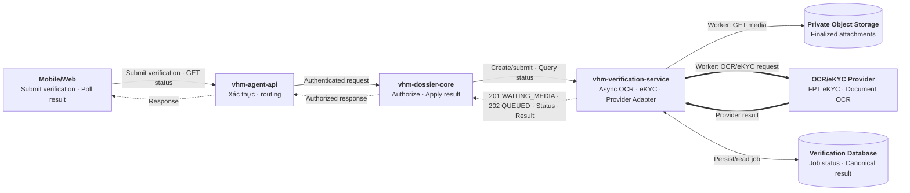
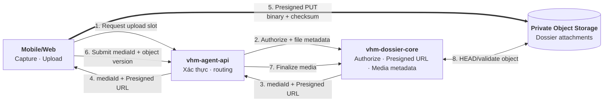
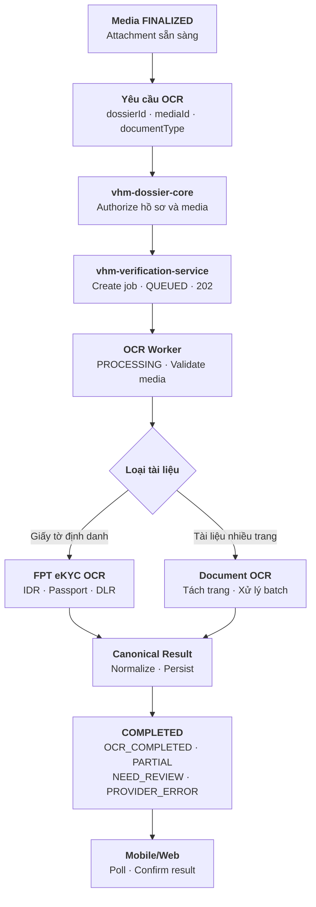
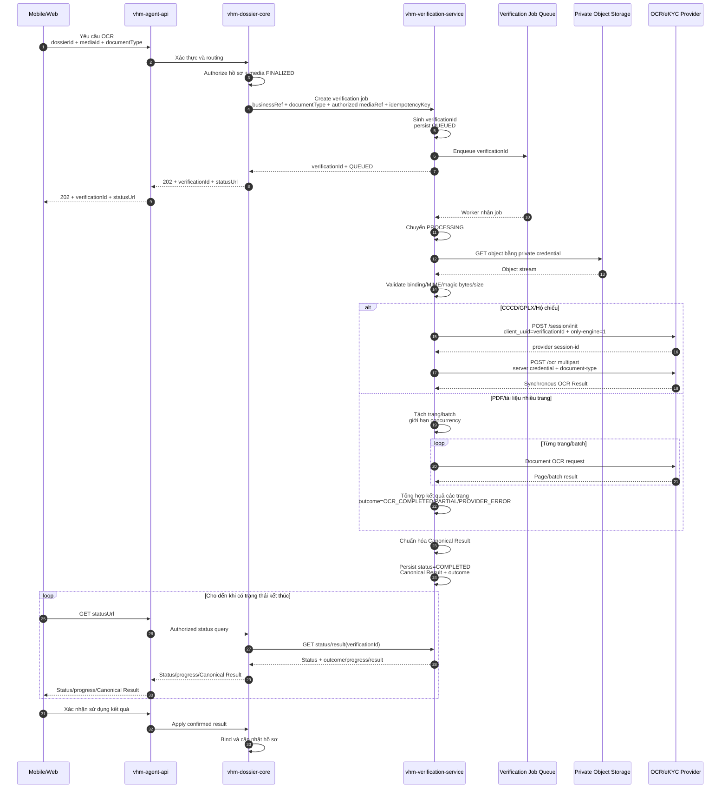
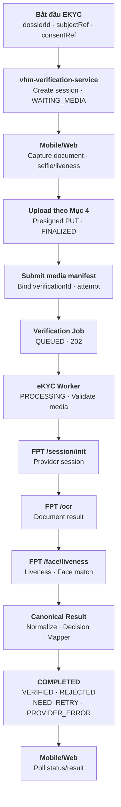
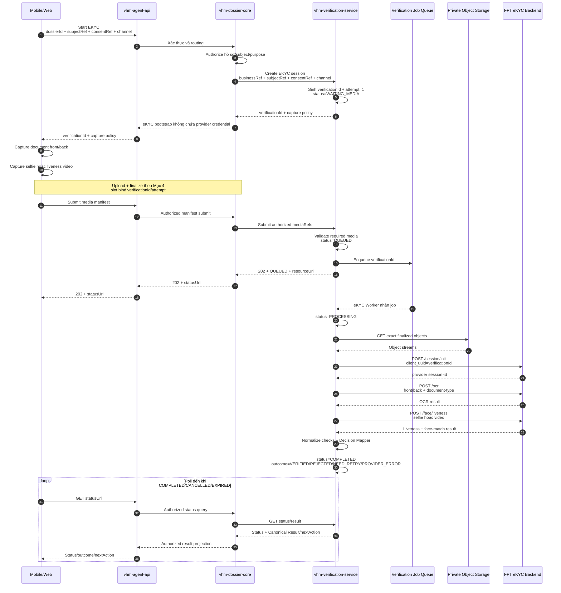
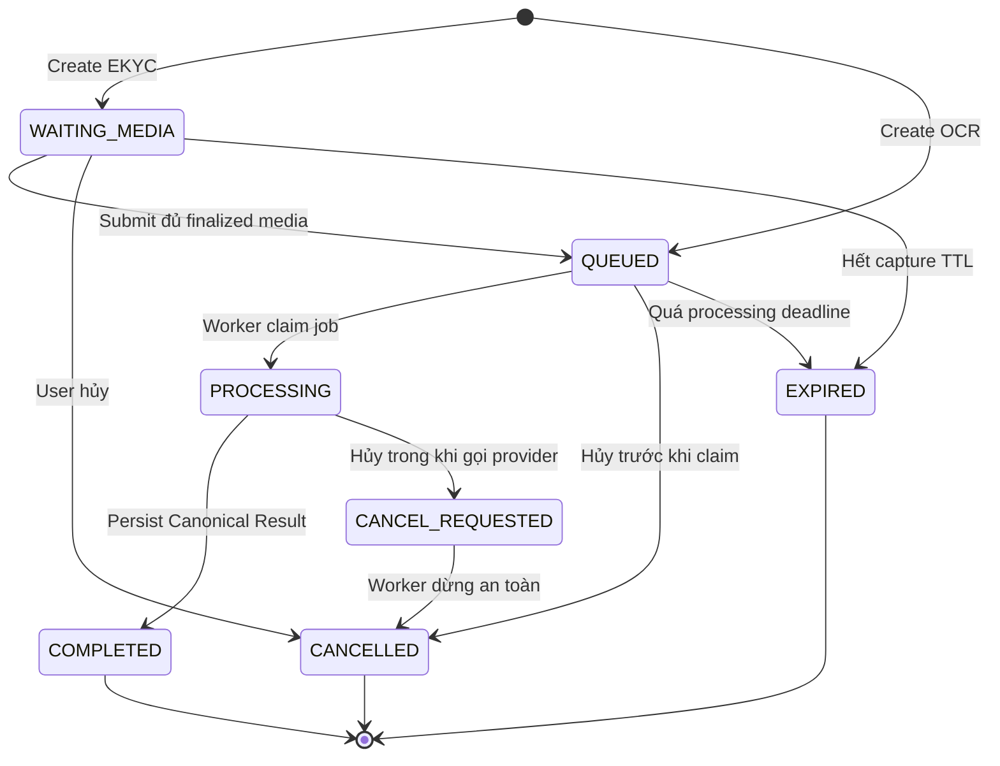
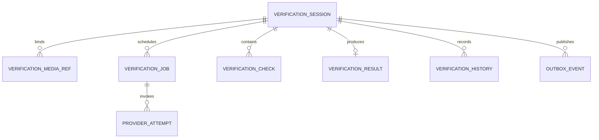

# Vấn đề 6: Lựa chọn nền tảng tích hợp OCR tập trung

## 1. Phạm vi

**User case:** Người dùng chụp hoặc upload giấy tờ trên Mobile/Web để hệ thống OCR, phân loại, gợi ý dữ liệu hoặc xác minh danh tính khi tạo hồ sơ NOXH.

**Hai journey được thiết kế độc lập:**

- **`OCR`:** Trích xuất và chuẩn hóa dữ liệu giấy tờ. Kết quả OCR không khẳng định người thao tác là chủ thể trên giấy tờ và luôn cần người dùng kiểm tra trước khi apply vào hồ sơ.
- **`EKYC`:** OCR giấy tờ định danh kết hợp liveness và face matching để xác minh người thao tác.

**Loại tài liệu dự kiến:**

- CCCD mặt trước/sau.
- Giấy đăng ký kết hôn.
- Bản sao có chứng thực giấy chứng nhận hộ gia đình nghèo/cận nghèo.
- Các giấy tờ khác trong checklist hồ sơ NOXH khi có mẫu OCR tương ứng.

`vhm-verification-service` là nền tảng verification dùng chung, điều phối cả `OCR` và `EKYC`, cô lập contract/credential của provider và chuẩn hóa kết quả. Quyết định cập nhật hồ sơ hoặc chấp nhận kết quả vẫn thuộc `vhm-dossier-core`.

**Các use case:**

1. **OCR CCCD:** Người dùng chụp đủ mặt trước/sau. Hệ thống trích xuất số định danh, họ tên, ngày sinh, giới tính, quốc tịch, quê quán, nơi thường trú, ngày cấp/hết hạn và cảnh báo chất lượng hoặc hai mặt không khớp.
2. **OCR giấy đăng ký kết hôn:** Người dùng upload đầy đủ các trang. Hệ thống trích xuất số giấy chứng nhận, thông tin hai bên, ngày đăng ký, nơi đăng ký và thông tin người ký/cơ quan cấp nếu mẫu tài liệu hỗ trợ.
3. **OCR giấy chứng nhận hộ nghèo/cận nghèo:** Người dùng upload bản sao có chứng thực. Hệ thống trích xuất số văn bản/chứng thực, chủ hộ, địa chỉ, loại xác nhận, thời gian hiệu lực, cơ quan cấp và ngày cấp.
4. **OCR giấy tờ khác:** NOXH truyền `documentType`; `vhm-verification-service` chỉ xử lý khi đã có model/template và schema kết quả tương ứng. Tài liệu chưa được hỗ trợ hoặc có confidence thấp được chuyển sang nhập liệu/kiểm tra thủ công.
5. **EKYC:** Người dùng chụp giấy tờ định danh và thực hiện liveness. Hệ thống xử lý OCR, kiểm tra liveness, so khớp khuôn mặt và trả kết quả `VERIFIED/REJECTED/NEED_RETRY` theo policy; Mobile/Web chỉ sử dụng outcome do backend trả về.

OCR chỉ hỗ trợ số hóa và kiểm tra dữ liệu theo khả năng của model. Việc xác nhận bản sao có giá trị pháp lý, giấy tờ còn hiệu lực hoặc hồ sơ đáp ứng điều kiện NOXH vẫn do nghiệp vụ và người duyệt quyết định.

## 2. Quyết định kiến trúc

**Bối cảnh:** Nếu `vhm-dossier-core` tự tích hợp FPT AI, toàn bộ logic quản lý credential, provider session, async job, retry, error mapping, audit và dữ liệu định danh sẽ nằm trong service nghiệp vụ NOXH và phụ thuộc trực tiếp vào contract của provider.

| **Hướng tiếp cận** | **Ưu điểm** | **Nhược điểm** | **Lựa chọn (Yes/No)** |
| --- | --- | --- | --- |
| **`vhm-dossier-core` tích hợp trực tiếp FPT AI** | Ít thành phần; thời gian triển khai ban đầu ngắn | `vhm-dossier-core` phải xử lý credential, provider session, queue/worker, retry và mã lỗi riêng của FPT AI; thay đổi provider tác động trực tiếp nghiệp vụ NOXH; tăng rủi ro dữ liệu định danh trong service hồ sơ | **No** |
| **`vhm-verification-service`** (vai trò Verification Provider Proxy) | `vhm-dossier-core` chỉ authorize media đã finalize, tạo yêu cầu xử lý và tra cứu Canonical Result; toàn bộ async job, provider integration, credential, session, retry, quota, lưu trữ kết quả, bảo mật, audit và chuẩn hóa được xử lý tại service; thay provider không yêu cầu sửa nghiệp vụ NOXH | Thêm một service và một network hop; `vhm-verification-service` phải đáp ứng HA/SLA vì là dependency của NOXH | **Yes** |

**Phương án chọn:** Sử dụng **`vhm-verification-service`** làm lớp tích hợp tập trung cho cả OCR và eKYC, với vai trò kiến trúc là Verification Provider Proxy. `vhm-dossier-core` kiểm tra quyền nghiệp vụ, quản lý attachment, gửi yêu cầu xử lý media đã finalize và cho phép tra cứu Canonical Result; không gọi trực tiếp hoặc phụ thuộc contract của FPT AI.

**Nguyên tắc kiến trúc:**

- Giữ chung một service nhưng tách handler và state transition của `OCR`/`EKYC`; không tách thành hai service OCR và eKYC.
- `vhm-verification-service` là private internal service. Mobile/Web chỉ đi qua `vhm-agent-api` và `vhm-dossier-core`.
- Provider credential chỉ tồn tại tại Provider Adapter. Không truyền credential, provider session hoặc raw provider payload về Mobile/Web, BFF hoặc `vhm-dossier-core`.
- `status` mô tả vòng đời kỹ thuật; `outcome` mô tả kết luận OCR/eKYC. Lỗi kỹ thuật không được ánh xạ thành `REJECTED`.
- Mọi create/retry/submit phải idempotent; job chỉ được trả thành công sau khi đã persist và bảo đảm enqueue bằng transactional outbox hoặc cơ chế tương đương.

**Căn cứ chọn phương thức tích hợp:** FPT hỗ trợ Mobile SDK, Web SDK và backend API. Thiết kế này chọn backend API để VHM chủ động upload, điều phối worker và giữ provider credential trong service private ([So sánh các phương thức tích hợp](https://docs-vision.fpt.ai/ekyc/III-integration/III-0-so-sanh/)). FPT trả kết quả theo từng request; trạng thái bất đồng bộ và polling của Mobile/Web do VHM quản lý.

## 3. Kiến trúc `vhm-verification-service`

### 3.1. Các module chính

| **Module** | **Trách nhiệm implementation** |
| --- | --- |
| Verification API | Nhận internal command/query từ `vhm-dossier-core`; validate contract, idempotency key và authorized media reference; trả `verificationId/status/result` |
| Journey Orchestrator | Chọn `OCR` hoặc `EKYC`, kiểm tra milestone bắt buộc và điều khiển state transition |
| OCR Worker | Đọc media đã finalize, xử lý ảnh định danh hoặc tách trang/batch cho tài liệu lớn, theo dõi progress và tổng hợp kết quả |
| eKYC Worker | Điều phối provider session, OCR front/back, liveness và face matching |
| Provider Adapter | Inject server credential; ánh xạ request/response/error; quản lý timeout, quota, circuit breaker và provider session |
| Result Normalizer | Chuẩn hóa field, confidence, warning, liveness/face-match check thành Canonical Result có version |
| Decision Mapper | Ánh xạ canonical checks thành journey outcome; không chứa rule phê duyệt hồ sơ NOXH |
| Persistence + Outbox | Lưu session/job/check/result/history; publish job/event an toàn; optimistic locking và dedupe |
| Security/Audit/Observability | Authorization defense-in-depth, masking, audit, metrics, trace và cảnh báo backlog/provider |

### 3.2. Thành phần và hướng dữ liệu



Đường liền thể hiện request/xử lý; đường nét đứt thể hiện response `201/202`, trạng thái và kết quả. Chart này chỉ mô tả thành phần và hướng dữ liệu; thứ tự end-to-end được thể hiện ở hai sequence diagram `OCR` và `EKYC` bên dưới.

Request tạo OCR chỉ chờ đến khi `vhm-verification-service` persist job và trả `verificationId + QUEUED`; việc đọc object và gọi provider diễn ra trong worker. Mobile/Web không giữ kết nối chờ provider mà tra cứu trạng thái/kết quả qua `vhm-agent-api` và `vhm-dossier-core`.

Giải pháp này tách nghiệp vụ NOXH khỏi chi tiết tích hợp provider. Chi phí của một service và một network hop được chấp nhận để async job, credential, quota, provider result, audit và vận hành provider được quản lý tập trung tại `vhm-verification-service`; attachment upload vẫn thuộc `vhm-dossier-core`.

### 3.3. Phân định trách nhiệm

| **Năng lực** | **`vhm-dossier-core`** | **`vhm-verification-service`** |
| --- | --- | --- |
| Nghiệp vụ và authorization | Authorize hồ sơ/media trên mọi create, submit, query và apply; quyết định sử dụng kết quả | Kiểm tra service caller và binding của `businessRef/mediaRef`; không xử lý rule NOXH |
| Upload và attachment | Sở hữu `mediaId`, object key, Presigned URL, HEAD/validate, finalize, orphan cleanup và retention | Không cấp Presigned URL hoặc sở hữu attachment; chỉ đọc exact object đã finalize bằng authorized media reference |
| Journey | Với OCR, chỉ create sau khi media `FINALIZED`; với EKYC, tạo session trước capture rồi submit đủ media | Quản lý `verificationId`, state machine, idempotency, queue/worker, attempt và progress |
| Provider | Không gọi hoặc retry trực tiếp với provider | Quản lý credential/session, model/template, timeout, retry, circuit breaker, quota và chuẩn hóa error |
| Kết quả | Authorize `status/result`; đối chiếu `resultVersion` và apply dữ liệu người dùng đã xác nhận | Lưu và trả status, progress, outcome và Canonical Result có version; không trả raw provider payload |
| Dữ liệu và vận hành | Lưu attachment metadata và audit việc apply | Lưu session/job/check/result cùng media reference đã mã hóa; masking, audit, monitoring và purge theo policy |

## 4. Upload media

Upload được mô tả duy nhất tại mục này và dùng chung cho cả hai journey. `vhm-dossier-core` sở hữu attachment; `vhm-verification-service` không cấp Presigned URL và không nhận binary qua API.



- Mobile/Web gọi `vhm-agent-api`; `vhm-dossier-core` authorize, sinh `mediaId`/exact object key và trả Presigned PUT URL.
- Với `OCR`, upload/finalize attachment xảy ra trước khi có `verificationId`. Với `EKYC`, upload slot được bind với `verificationId/attempt` đã tạo ở trạng thái `WAITING_MEDIA`.
- Presigned URL có TTL ngắn và bind exact object key, method, content type, content length, checksum và `mediaId`; client không được list/read object hoặc tự chọn object key.
- Sau PUT, Mobile/Web submit `mediaId`, checksum và object version. `vhm-dossier-core` HEAD/validate rồi chuyển attachment sang `FINALIZED`; finalize không tự động khởi chạy OCR/EKYC.
- Mobile/Web dùng SDK/capture component của VHM để tạo raw document/selfie/liveness artifact, sau đó upload trực tiếp vào Private Object Storage; không gọi FPT hoặc `vhm-verification-service` trực tiếp.
- `vhm-dossier-core` quản lý orphan cleanup và retention. Database dossier chỉ lưu protected object reference, checksum, object version và media metadata; binary không đi qua `vhm-agent-api`.

## 5. OCR

`OCR` chỉ được tạo sau khi attachment đã `FINALIZED`. Client nhận `202 + verificationId + statusUrl`, sau đó polling trong khi worker xử lý.

### 5.1. Xử lý theo loại tài liệu

- **Ảnh định danh:** FPT eKYC `/ocr` hỗ trợ `idr`, `passport` và `dlr`. Worker khởi tạo provider session sau khi nhận job, lấy ảnh đã finalize từ Object Storage và gọi provider synchronous; client vẫn sử dụng flow async `202 + polling` của VHM ([FPT eKYC backend API](https://docs-vision.fpt.ai/ekyc/III-integration/III-2-APIs/a-APIs%20of%20eKYC%20Flows/APIs-in-update-information-flow/)).
- **Giấy đăng ký kết hôn, giấy chứng nhận hộ nghèo/cận nghèo và PDF nhiều trang:** Không gửi trực tiếp vào FPT eKYC `/ocr`. Worker stream và tách trang/batch, sau đó chọn FPT AI Read hoặc Document OCR Provider/model đã được xác nhận hỗ trợ loại tài liệu. Retry và progress được quản lý theo từng trang/batch; kết quả có thể là `PARTIAL`.
- `vhm-verification-service` không tin object path từ client. Service chỉ đọc exact object do `vhm-dossier-core` ủy quyền, kiểm tra binding, MIME/magic bytes, kích thước, thứ tự mặt/trang và attempt trước khi gửi provider.
- Không retry mù request sau khi body đã được gửi. Retry chỉ thực hiện theo idempotency contract của provider hoặc tạo attempt/page job mới có kiểm soát để tránh tính phí và kết quả trùng.

### 5.2. Luồng tổng quan



### 5.3. Sequence diagram



## 6. EKYC

`EKYC` tạo `verificationId` ở trạng thái `WAITING_MEDIA` trước capture để trả capture policy và bind attempt. Sau khi media được upload/finalize theo Mục 4, worker gọi FPT theo thứ tự `/session/init → /ocr → /face/liveness`, sau đó chuẩn hóa kết quả OCR, liveness và face matching ([FPT eKYC backend API](https://docs-vision.fpt.ai/ekyc/III-integration/III-2-APIs/a-APIs%20of%20eKYC%20Flows/APIs-in-update-information-flow/)).

### 6.1. Luồng tổng quan



### 6.2. Sequence diagram



Mobile/Web sử dụng SDK/capture component của VHM để tạo raw document/selfie/liveness artifact và upload vào VHM Object Storage. Provider credential chỉ tồn tại trong `vhm-verification-service`; client không gọi FPT trực tiếp.

## 7. API, lifecycle và kết quả

### 7.1. Thiết kế API

`vhm-verification-service` chỉ mở API private dưới `/internal/v1`. Kết nối từ `vhm-dossier-core` dùng mTLS và service token có scope; `Idempotency-Key` bắt buộc với mọi command tạo mới, submit hoặc retry. Mobile/Web chỉ nhìn thấy API của `vhm-dossier-core`; `vhm-agent-api` làm nhiệm vụ xác thực và routing.

| **Use case** | **API của `vhm-dossier-core` cho Mobile/Web** | **API private của `vhm-verification-service`** | **Kết quả** |
| --- | --- | --- | --- |
| Tạo OCR | `POST /dossiers/{dossierId}/ocr-verifications` | `POST /internal/v1/verifications/ocr` | `202`, tạo job ở `QUEUED` |
| Bắt đầu eKYC | `POST /dossiers/{dossierId}/ekyc-verifications` | `POST /internal/v1/verifications/ekyc` | `201`, tạo session ở `WAITING_MEDIA` và trả capture policy |
| Submit media eKYC | `POST /dossiers/{dossierId}/verifications/{id}/media` | `POST /internal/v1/verifications/{id}/media-submissions` | `202`, validate manifest rồi chuyển `QUEUED` |
| Lấy trạng thái | `GET /dossiers/{dossierId}/verifications/{id}` | `GET /internal/v1/verifications/{id}` | Status, progress, outcome, next action |
| Lấy kết quả | `GET /dossiers/{dossierId}/verifications/{id}/result` | `GET /internal/v1/verifications/{id}/result` | Canonical Result đã lọc/mask |
| Xác nhận/apply OCR | `POST /dossiers/{dossierId}/verifications/{id}/apply` | `GET /internal/v1/verifications/{id}/result`; không có command apply ở verification service | `vhm-dossier-core` đối chiếu expected `resultVersion` rồi cập nhật nghiệp vụ trong local transaction |
| Hủy | `POST /dossiers/{dossierId}/verifications/{id}/cancel` | `POST /internal/v1/verifications/{id}/cancel` | Hủy ngay khi chưa chạy hoặc best-effort khi đang xử lý |
| Thử lại | `POST /dossiers/{dossierId}/verifications/{id}/retries` | `POST /internal/v1/verifications/{id}/retries` | Tạo attempt mới, không reset hoặc ghi đè attempt cũ |

`vhm-verification-service` trả `resourceUri` nội bộ. `vhm-dossier-core` ánh xạ URI này thành `statusUrl` thuộc dossier và authorize lại mỗi lần Mobile/Web poll; không chuyển nguyên internal URI cho client.

Request tạo `OCR` sau khi attachment đã `FINALIZED`:

```http
POST /internal/v1/verifications/ocr
Authorization: Bearer <service-token>
Idempotency-Key: 72aacfa4-97b8-4d0f-bb74-490f17352b1b
Content-Type: application/json

{
  "businessRef": { "type": "DOSSIER", "id": "dos-01" },
  "subjectRef": "customer-opaque-ref",
  "channel": "MOBILE",
  "documentType": "IDR",
  "media": [
    {
      "mediaId": "media-front-01",
      "role": "DOCUMENT_FRONT",
      "authorizedMediaRef": "opaque-signed-media-ref",
      "checksumSha256": "...",
      "objectVersion": "..."
    },
    {
      "mediaId": "media-back-01",
      "role": "DOCUMENT_BACK",
      "authorizedMediaRef": "opaque-signed-media-ref",
      "checksumSha256": "...",
      "objectVersion": "..."
    }
  ]
}
```

```http
HTTP/1.1 202 Accepted
Retry-After: 3

{
  "verificationId": "ver-123",
  "journey": "OCR",
  "status": "QUEUED",
  "resourceUri": "/internal/v1/verifications/ver-123"
}
```

Request bắt đầu và submit `EKYC` được tách làm hai bước:

```http
POST /internal/v1/verifications/ekyc
Idempotency-Key: 434f4412-9027-4fb4-8ad3-05d98f8e68e0

{
  "businessRef": { "type": "DOSSIER", "id": "dos-01" },
  "subjectRef": "customer-opaque-ref",
  "consentRef": "consent-opaque-ref",
  "channel": "MOBILE",
  "policyKey": "NOXH_IDENTITY_V1"
}
```

Response `201 Created` trả `verificationId`, `status=WAITING_MEDIA`, `attempt=1`, `expiresAt` và `capturePolicy.requiredMedia`; tuyệt đối không chứa FPT API key hoặc provider session.

```http
POST /internal/v1/verifications/ver-456/media-submissions
Idempotency-Key: 88367e76-e93d-40fb-82c9-619a11fb41a8

{
  "attempt": 1,
  "media": [
    { "mediaId": "m-front", "role": "DOCUMENT_FRONT", "authorizedMediaRef": "...", "checksumSha256": "...", "objectVersion": "..." },
    { "mediaId": "m-back", "role": "DOCUMENT_BACK", "authorizedMediaRef": "...", "checksumSha256": "...", "objectVersion": "..." },
    { "mediaId": "m-live", "role": "LIVENESS", "authorizedMediaRef": "...", "checksumSha256": "...", "objectVersion": "..." }
  ]
}
```

`authorizedMediaRef` là reference opaque do backend phát hành, bind với `mediaId`, exact object/version, checksum, business reference và caller. API không nhận bucket/key, URL hoặc path do client tự truyền. Với job bị trì hoãn quá thời hạn media grant, worker yêu cầu cấp lại grant nội bộ; không nới quyền đọc toàn bucket.

Status response dùng chung cho hai journey:

```json
{
  "verificationId": "ver-123",
  "journey": "OCR",
  "status": "PROCESSING",
  "outcome": null,
  "progress": {
    "totalUnits": 20,
    "processedUnits": 8,
    "failedUnits": 0
  },
  "resultAvailable": false,
  "nextAction": "POLL",
  "updatedAt": "2026-08-10T11:30:25+07:00"
}
```

Quy ước HTTP/error:

| **HTTP** | **Sử dụng** |
| --- | --- |
| `200/201/202` | Query thành công; tạo resource; command đã được persist và chấp nhận xử lý |
| `400` | Contract/header sai định dạng |
| `401/403` | Service identity hoặc scope không hợp lệ |
| `404` | Không tồn tại hoặc caller không được phép biết resource tồn tại |
| `409` | Idempotency key trùng nhưng fingerprint khác; state transition sai; result chưa sẵn sàng |
| `413/415/422` | Media vượt giới hạn, sai content type/magic bytes hoặc thiếu/sai logical part |
| `429` | Admission control/quota nội bộ; trả `Retry-After` |
| `503` | Không thể persist/enqueue an toàn; không trả `202` giả |

Error body chỉ dùng canonical `code`, `message`, `retryable`, `correlationId`; không trả raw FPT code/message, stack trace, media reference hoặc credential. Lỗi provider xảy ra trong worker được thể hiện bằng job retry và final `outcome`, không biến thành HTTP error của request polling.

### 7.2. Lifecycle và outcome

`status` chỉ thể hiện vòng đời kỹ thuật. `outcome` chỉ được gán khi `status=COMPLETED`; vì vậy một lần xác minh bị lỗi provider sau khi hết recovery budget vẫn là `COMPLETED + PROVIDER_ERROR`, không phải `REJECTED`.



| **Journey** | **Outcome khi `COMPLETED`** | **Ý nghĩa** |
| --- | --- | --- |
| `OCR` | `OCR_COMPLETED` | Đọc đủ tài liệu; vẫn cần người dùng xác nhận dữ liệu |
| `OCR` | `PARTIAL` | Chỉ một phần trang/field xử lý thành công |
| `OCR` | `NEED_REVIEW` | Confidence/warning vượt ngưỡng cần kiểm tra thủ công |
| Cả hai | `NEED_RETRY` | Media hoặc thao tác người dùng có thể thực hiện lại |
| `EKYC` | `VERIFIED` | Document, liveness và face match đạt policy |
| `EKYC` | `REJECTED` | Check nghiệp vụ xác minh không đạt policy; không dùng cho lỗi transport/provider |
| Cả hai | `PROVIDER_ERROR` | Hết retry budget hoặc provider không trả kết quả hợp lệ |

Worker có trạng thái riêng `PENDING/RUNNING/RETRY_WAIT/SUCCEEDED/DEAD`. `RETRY_WAIT` và `DEAD` là chi tiết vận hành của job, không được trả trực tiếp thành lifecycle/outcome cho Mobile/Web.

### 7.3. Canonical Result

Canonical Result có `schemaVersion`, không phụ thuộc tên field hoặc error code của FPT. API Result chỉ trả field nằm trong allowlist theo purpose; PII được mask theo role và raw score chỉ dành cho rule engine/audit có quyền.

```json
{
  "verificationId": "ver-123",
  "journey": "EKYC",
  "status": "COMPLETED",
  "outcome": "VERIFIED",
  "resultVersion": 1,
  "schemaVersion": "1.0",
  "document": {
    "type": "IDR",
    "fields": {
      "identityNumber": { "value": "0012******89", "confidence": 0.99 },
      "fullName": { "value": "NGUYEN VAN A", "confidence": 0.98 }
    },
    "warnings": []
  },
  "checks": [
    { "type": "DOCUMENT_OCR", "result": "PASS", "reasonCode": null },
    { "type": "LIVENESS", "result": "PASS", "reasonCode": null },
    { "type": "FACE_MATCH", "result": "PASS", "reasonCode": null }
  ],
  "nextAction": "CONFIRM_AND_APPLY",
  "completedAt": "2026-08-10T11:31:12+07:00"
}
```

`vhm-dossier-core` lưu reference tới `verificationId/resultVersion` và dữ liệu đã được người dùng xác nhận; không copy toàn bộ raw Canonical Result. Apply phải gửi expected `resultVersion` để tránh dùng kết quả cũ sau retry.

## 8. Dữ liệu và xử lý tin cậy

### 8.1. Database schema

PostgreSQL là system of record cho verification lifecycle. Binary media vẫn nằm trong Private Object Storage do `vhm-dossier-core` sở hữu; database verification chỉ giữ opaque/encrypted reference và metadata tối thiểu.

| **Bảng** | **Mục đích** | **Ràng buộc chính** |
| --- | --- | --- |
| `verification_sessions` | Aggregate root của một attempt OCR/eKYC | Unique idempotency; status/outcome guard; optimistic `row_version` |
| `verification_media_refs` | Media manifest đã authorize/finalize | Unique logical part trong một attempt; không lưu plaintext S3 path/URL |
| `verification_jobs` | Theo dõi orchestration/page job và retry | Unique job unit; lease/retry có giới hạn |
| `provider_attempts` | Một lần gọi operation của provider | Dedupe operation/attempt; provider session ref được mã hóa |
| `verification_checks` | Document/quality/liveness/face check đã chuẩn hóa | Không lưu raw provider payload |
| `verification_results` | Canonical Result hiện hành | Một result/version hiện hành cho verification; payload PII mã hóa application-layer |
| `verification_history` | Lịch sử state/outcome append-only | Không update/delete trong business flow |
| `outbox_events` | Bảo đảm DB commit và enqueue/event không lệch nhau | Publisher at-least-once; consumer dedupe theo `event_id` |



DDL baseline rút gọn:

```sql
CREATE TABLE verification_sessions (
    verification_id         UUID PRIMARY KEY,
    journey                 VARCHAR(20) NOT NULL CHECK (journey IN ('OCR', 'EKYC')),
    business_type           VARCHAR(30) NOT NULL,
    business_ref            VARCHAR(100) NOT NULL,
    subject_ref_ciphertext  BYTEA,
    consent_ref             VARCHAR(150),
    channel                 VARCHAR(20) NOT NULL CHECK (channel IN ('MOBILE', 'WEB')),
    document_type           VARCHAR(40),
    status                  VARCHAR(30) NOT NULL CHECK (status IN
                                ('WAITING_MEDIA', 'QUEUED', 'PROCESSING',
                                 'CANCEL_REQUESTED', 'COMPLETED', 'CANCELLED', 'EXPIRED')),
    outcome                 VARCHAR(30),
    attempt_no              INTEGER NOT NULL DEFAULT 1 CHECK (attempt_no > 0),
    retry_of                UUID REFERENCES verification_sessions(verification_id),
    policy_version          VARCHAR(40) NOT NULL,
    result_schema_version   VARCHAR(20) NOT NULL,
    idempotency_key         VARCHAR(100) NOT NULL,
    request_fingerprint     CHAR(64) NOT NULL,
    total_units             INTEGER,
    processed_units         INTEGER NOT NULL DEFAULT 0,
    failed_units            INTEGER NOT NULL DEFAULT 0,
    next_action             VARCHAR(40),
    terminal_reason_code    VARCHAR(80),
    row_version             BIGINT NOT NULL DEFAULT 0,
    expires_at              TIMESTAMPTZ,
    created_at              TIMESTAMPTZ NOT NULL DEFAULT now(),
    updated_at              TIMESTAMPTZ NOT NULL DEFAULT now(),
    completed_at            TIMESTAMPTZ,
    CONSTRAINT uq_verification_idempotency UNIQUE (business_type, idempotency_key),
    CONSTRAINT ck_status_outcome CHECK (
        (status = 'COMPLETED' AND outcome IS NOT NULL) OR
        (status <> 'COMPLETED' AND outcome IS NULL)
    ),
    CONSTRAINT ck_journey_status CHECK (
        journey = 'EKYC' OR status <> 'WAITING_MEDIA'
    ),
    CONSTRAINT ck_ekyc_consent CHECK (
        journey <> 'EKYC' OR consent_ref IS NOT NULL
    ),
    CONSTRAINT ck_progress CHECK (
        processed_units >= 0 AND failed_units >= 0 AND
        failed_units <= processed_units AND
        (total_units IS NULL OR
            (total_units >= 0 AND processed_units <= total_units AND failed_units <= total_units))
    ),
    CONSTRAINT ck_journey_outcome CHECK (
        outcome IS NULL OR
        (journey = 'OCR' AND outcome IN
            ('OCR_COMPLETED', 'PARTIAL', 'NEED_REVIEW', 'NEED_RETRY', 'PROVIDER_ERROR')) OR
        (journey = 'EKYC' AND outcome IN
            ('VERIFIED', 'REJECTED', 'NEED_RETRY', 'PROVIDER_ERROR'))
    )
);

CREATE INDEX ix_verification_business
    ON verification_sessions (business_type, business_ref, created_at DESC);
CREATE INDEX ix_verification_active_status
    ON verification_sessions (status, updated_at)
    WHERE status IN ('WAITING_MEDIA', 'QUEUED', 'PROCESSING', 'CANCEL_REQUESTED');

CREATE TABLE verification_media_refs (
    media_ref_id             UUID PRIMARY KEY,
    verification_id         UUID NOT NULL REFERENCES verification_sessions(verification_id),
    attempt_no               INTEGER NOT NULL,
    media_id                 VARCHAR(100) NOT NULL,
    media_role               VARCHAR(40) NOT NULL,
    logical_part             VARCHAR(40) NOT NULL DEFAULT 'DEFAULT',
    authorized_ref_ciphertext BYTEA NOT NULL,
    checksum_sha256          CHAR(64) NOT NULL,
    object_version           VARCHAR(200) NOT NULL,
    content_type             VARCHAR(100) NOT NULL,
    size_bytes               BIGINT NOT NULL CHECK (size_bytes > 0),
    finalized_at             TIMESTAMPTZ NOT NULL,
    created_at               TIMESTAMPTZ NOT NULL DEFAULT now(),
    CONSTRAINT uq_verification_media UNIQUE (verification_id, media_id),
    CONSTRAINT uq_verification_logical_part
        UNIQUE (verification_id, attempt_no, media_role, logical_part)
);

CREATE TABLE verification_jobs (
    job_id                   UUID PRIMARY KEY,
    verification_id         UUID NOT NULL REFERENCES verification_sessions(verification_id),
    job_kind                 VARCHAR(30) NOT NULL,
    unit_no                  INTEGER NOT NULL DEFAULT 0,
    status                   VARCHAR(20) NOT NULL CHECK (status IN
                                ('PENDING', 'RUNNING', 'RETRY_WAIT', 'SUCCEEDED', 'DEAD')),
    attempt_count            INTEGER NOT NULL DEFAULT 0,
    max_attempts             INTEGER NOT NULL,
    available_at             TIMESTAMPTZ NOT NULL DEFAULT now(),
    lease_owner              VARCHAR(100),
    lease_until              TIMESTAMPTZ,
    last_error_code          VARCHAR(80),
    created_at               TIMESTAMPTZ NOT NULL DEFAULT now(),
    updated_at               TIMESTAMPTZ NOT NULL DEFAULT now(),
    CONSTRAINT uq_verification_job_unit UNIQUE (verification_id, job_kind, unit_no)
);

CREATE INDEX ix_job_dispatch ON verification_jobs (status, available_at);

CREATE TABLE provider_attempts (
    provider_attempt_id      UUID PRIMARY KEY,
    job_id                   UUID NOT NULL REFERENCES verification_jobs(job_id),
    provider                 VARCHAR(30) NOT NULL,
    operation                VARCHAR(30) NOT NULL,
    attempt_no               INTEGER NOT NULL,
    provider_session_ciphertext BYTEA,
    provider_request_ref     VARCHAR(150),
    status                   VARCHAR(20) NOT NULL CHECK (status IN
                                ('STARTED', 'SUCCEEDED', 'FAILED', 'UNKNOWN')),
    error_class              VARCHAR(30),
    error_code               VARCHAR(80),
    started_at               TIMESTAMPTZ NOT NULL,
    finished_at              TIMESTAMPTZ,
    CONSTRAINT uq_provider_operation_attempt
        UNIQUE (job_id, provider, operation, attempt_no)
);

CREATE TABLE verification_checks (
    check_id                 UUID PRIMARY KEY,
    verification_id         UUID NOT NULL REFERENCES verification_sessions(verification_id),
    check_type               VARCHAR(40) NOT NULL,
    logical_part             VARCHAR(40) NOT NULL DEFAULT 'DEFAULT',
    result                   VARCHAR(20) NOT NULL CHECK (result IN
                                ('PASS', 'FAIL', 'WARN', 'ERROR', 'NOT_APPLICABLE')),
    reason_code              VARCHAR(80),
    restricted_detail_ciphertext BYTEA,
    created_at               TIMESTAMPTZ NOT NULL DEFAULT now(),
    CONSTRAINT uq_verification_check
        UNIQUE (verification_id, check_type, logical_part)
);

CREATE TABLE verification_results (
    verification_id         UUID PRIMARY KEY REFERENCES verification_sessions(verification_id),
    result_version           INTEGER NOT NULL,
    schema_version           VARCHAR(20) NOT NULL,
    canonical_payload_ciphertext BYTEA NOT NULL,
    payload_key_version      VARCHAR(40) NOT NULL,
    result_hash              CHAR(64) NOT NULL,
    created_at               TIMESTAMPTZ NOT NULL DEFAULT now()
);

CREATE TABLE verification_history (
    history_id               UUID PRIMARY KEY,
    verification_id         UUID NOT NULL REFERENCES verification_sessions(verification_id),
    from_status              VARCHAR(30),
    to_status                VARCHAR(30) NOT NULL,
    outcome                  VARCHAR(30),
    reason_code              VARCHAR(80),
    actor_type               VARCHAR(30) NOT NULL,
    correlation_id           VARCHAR(100) NOT NULL,
    created_at               TIMESTAMPTZ NOT NULL DEFAULT now()
);

CREATE INDEX ix_verification_history
    ON verification_history (verification_id, created_at);

CREATE TABLE outbox_events (
    event_id                 UUID PRIMARY KEY,
    aggregate_id             UUID NOT NULL,
    event_type               VARCHAR(80) NOT NULL,
    payload                  JSONB NOT NULL,
    status                   VARCHAR(20) NOT NULL DEFAULT 'NEW' CHECK (status IN
                                ('NEW', 'PUBLISHING', 'PUBLISHED', 'FAILED')),
    available_at             TIMESTAMPTZ NOT NULL DEFAULT now(),
    published_at             TIMESTAMPTZ,
    attempt_count            INTEGER NOT NULL DEFAULT 0,
    created_at               TIMESTAMPTZ NOT NULL DEFAULT now()
);

CREATE INDEX ix_outbox_publish ON outbox_events (status, available_at);
```

Không dùng `provider_session_id`, `businessRef`, media URL hoặc PII làm metric label. `outbox_events.payload` chỉ chứa ID/reference tối thiểu, không chứa Canonical Result, raw provider payload hoặc object path. Retention/purge chạy theo policy được phê duyệt; `verification_history` giữ tombstone không PII nếu cần chống xử lý lặp sau khi xóa payload.

### 8.2. Transaction, idempotency và worker

- **Create OCR:** trong một transaction ngắn, insert `verification_sessions`, media manifest, `verification_jobs` và `outbox_events`. **Start eKYC** chỉ insert session `WAITING_MEDIA`; job/outbox xử lý chỉ được tạo khi submit đủ media. Cùng `Idempotency-Key` + fingerprint trả resource cũ; cùng key khác fingerprint trả `409 IDEMPOTENCY_CONFLICT`.
- **Submit media:** HEAD/validate object được thực hiện ngoài transaction. Sau đó lock/CAS `verification_sessions.row_version`, upsert manifest idempotent, kiểm tra đủ logical part, chuyển `WAITING_MEDIA → QUEUED` và ghi outbox trong cùng transaction.
- **Claim job:** queue dùng at-least-once. Worker dedupe theo `job_id`, claim bằng lease/CAS; message trùng không gọi provider lại nếu operation đã có terminal `provider_attempts`.
- **Provider call:** S3/KMS/FPT call luôn nằm ngoài DB transaction. Timeout connect/read, bulkhead, circuit breaker, quota và concurrency được cấu hình riêng theo operation/provider.
- **Persist result:** normalize payload trước; trong transaction ngắn upsert checks/result, cập nhật progress, chuyển `status=COMPLETED`, gán `outcome`, append history và outbox `VerificationCompleted`.
- **Worker retry:** chỉ retry lỗi network trước khi gửi body hoặc lỗi provider được xác nhận retry-safe. Nếu timeout xảy ra sau khi body có thể đã tới FPT, ghi provider attempt là `UNKNOWN`, không POST lại mù và kết thúc `PROVIDER_ERROR` để tránh tính phí/kết quả trùng.
- **Journey retry API:** luôn tạo `verificationId/attempt` mới và liên kết `retry_of`. OCR chỉ được reuse immutable finalized media khi outcome là `PROVIDER_ERROR`; `NEED_RETRY` do chất lượng phải upload media mới. eKYC luôn capture/upload media mới để chống replay.
- **Tài liệu lớn:** tách `OCR_PAGE` job, giới hạn số trang chạy song song, retry từng trang; aggregator hoàn tất khi mọi unit terminal và cho outcome `PARTIAL` nếu policy cho phép.
- **Dead job:** khi hết recovery budget, worker persist `COMPLETED + PROVIDER_ERROR` và `nextAction=RETRY`; DLQ chỉ phục vụ vận hành, không để client polling vô hạn.
- **Cancel:** `WAITING_MEDIA/QUEUED` chuyển `CANCELLED` ngay. Khi `PROCESSING`, chuyển `CANCEL_REQUESTED`; worker không phát sinh call mới, kết thúc call đang chạy rồi bỏ result và chuyển `CANCELLED`.

## 9. Thiết kế triển khai và vận hành

### 9.1. Công nghệ và cấu trúc code

| **Hạng mục** | **Baseline đề xuất** |
| --- | --- |
| Runtime | Java 25, Spring Boot 4.0.4, Maven |
| Internal API | Spring MVC + OpenAPI 3; OAuth2 Resource Server; mTLS ở service mesh/ingress nội bộ |
| Provider client | Spring WebClient streaming + Resilience4j; không buffer toàn bộ PDF/video vào heap |
| Persistence | PostgreSQL, Flyway; Spring Data JPA cho aggregate và JDBC cho claim/lock/outbox hot path |
| Messaging | Kafka + transactional outbox; partition key là `verificationId` |
| Security | Secret Manager/KMS, application-layer envelope encryption và rotation theo key version |
| Observability | Micrometer + OpenTelemetry trace; structured log đã mask |

Kafka baseline dùng `vhm.verification.jobs.v1`, `vhm.verification.events.v1` và `vhm.verification.jobs.dlq.v1`. Outbox Publisher gửi at-least-once; consumer dedupe bằng `eventId/jobId`. Retry có delay được persist ở `verification_jobs.available_at` và Retry Scheduler chỉ republish job đến hạn, không giữ message/thread để chờ.

```text
vhm-verification-service
├── api/internal            # REST contract, authn/z, validation, error mapping
├── application             # create/submit/status/result/cancel/retry use cases
├── domain                  # journey, lifecycle, policy, outcome, invariants
├── worker                  # OCR/eKYC/page worker và page aggregator
├── provider/spi            # provider-neutral ports
├── provider/fpt            # FPT session/OCR/liveness adapters
├── media                   # validate/read opaque authorized media reference
├── persistence             # PostgreSQL repositories, locking, migrations
├── messaging               # outbox publisher, queue consumer, DLQ
└── security-observability  # KMS/secrets, masking, audit, metrics, tracing
```

API và Worker là hai deployment độc lập nhưng dùng chung codebase/domain contract. API scale theo request rate; Worker scale theo queue lag nhưng luôn bị chặn bởi provider quota. Outbox Publisher chạy trong Worker deployment với leader election hoặc consumer partitioning.

### 9.2. Bảo mật và vận hành

| **Nhóm** | **Implementation bắt buộc** |
| --- | --- |
| Network/IAM | Service private; mTLS + service token; S3 read exact object; egress allowlist chỉ tới Object Storage, KMS/Secret Manager và endpoint FPT |
| Secret/PII | API key/session reference trong Secret Manager/KMS; TLS in transit; DB/S3 encryption at rest; application-layer encryption cho Canonical Result; masking theo role |
| Input | Giới hạn type/size/page/duration; kiểm tra checksum, MIME + magic bytes, object version; malware scan nếu policy tài liệu yêu cầu |
| Logging/Audit | Không log body/media/PII/credential; audit create, submit, query result, retry, cancel, state/outcome transition và apply result |
| Resilience | Timeout, exponential backoff + jitter, circuit breaker, bulkhead, rate limit, queue/DLQ và retry budget theo operation |
| Metrics | API latency/error, queue depth/oldest age, processing duration, retry/DLQ, provider latency/error/quota, outcome count và stuck session; không dùng high-cardinality/PII label |
| Availability | API tối thiểu 2 replicas; Worker graceful shutdown/lease recovery; PostgreSQL Multi-AZ/PITR; queue durable; runbook provider outage/backlog recovery |

### 9.3. Thứ tự triển khai

1. Xây API/status model, PostgreSQL migration, idempotency, outbox, queue, worker skeleton, security/audit và mock Provider Adapter.
2. Triển khai `OCR` cho CCCD/GPLX/Hộ chiếu qua FPT `/session/init` → `/ocr`, Canonical Result và polling end-to-end.
3. Bổ sung Document OCR cho PDF/tài liệu nhiều trang sau khi chốt provider, input limit, SLA và sync/async contract.
4. Triển khai `EKYC` `/session/init` → `/ocr` → `/face/liveness` và polling end-to-end.
5. Load/chaos/security test; chốt retry budget, provider quota, retention, masking và alert threshold trước production.

### 9.4. Kiểm thử tối thiểu

| **Lớp test** | **Phạm vi bắt buộc** |
| --- | --- |
| Unit/domain | Mọi state transition, journey-outcome guard, decision mapping, masking, retry classification và idempotency fingerprint |
| Contract | Request/response/error fixture cho FPT session, OCR và liveness; tolerant optional field nhưng fail với critical field sai schema |
| Integration | PostgreSQL constraint/locking, outbox-to-queue, duplicate/out-of-order message, lease recovery, KMS và exact-object media access |
| End-to-end | OCR ảnh định danh, OCR nhiều trang partial, eKYC verified/rejected/need-retry, cancel, expire, poll và confirm/apply |
| Security/resilience | Media-ref tamper, object version/checksum mismatch, unauthorized result query, log leakage, provider timeout/429/5xx, backlog và DLQ recovery |

### 9.5. Điểm cần chốt trước production

Các điểm cần xác nhận với FPT: liveness mode/media requirement theo Mobile/Web; giới hạn và SLA của AI Read/Document OCR; provider idempotency, timeout-unknown handling, result retention và quota.

`vhm-verification-service` chịu trách nhiệm capability OCR/eKYC và dữ liệu verification. Quyết định sử dụng kết quả, cập nhật khách hàng và phê duyệt hồ sơ NOXH vẫn thuộc `vhm-dossier-core`.
