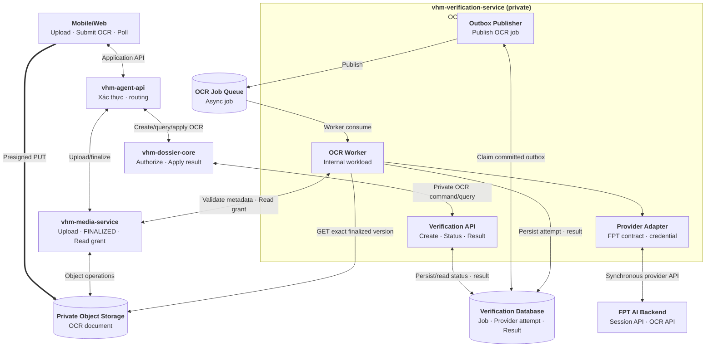
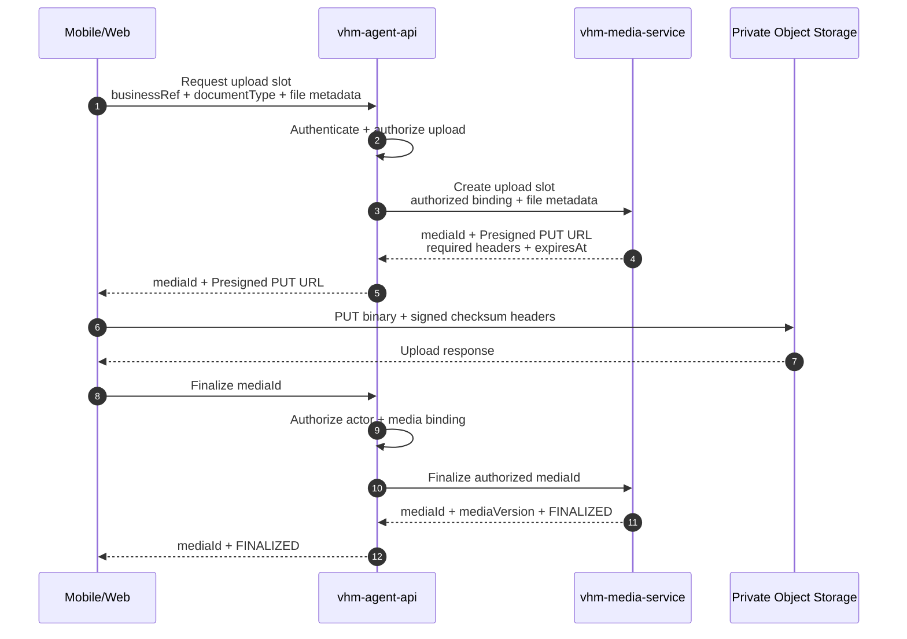
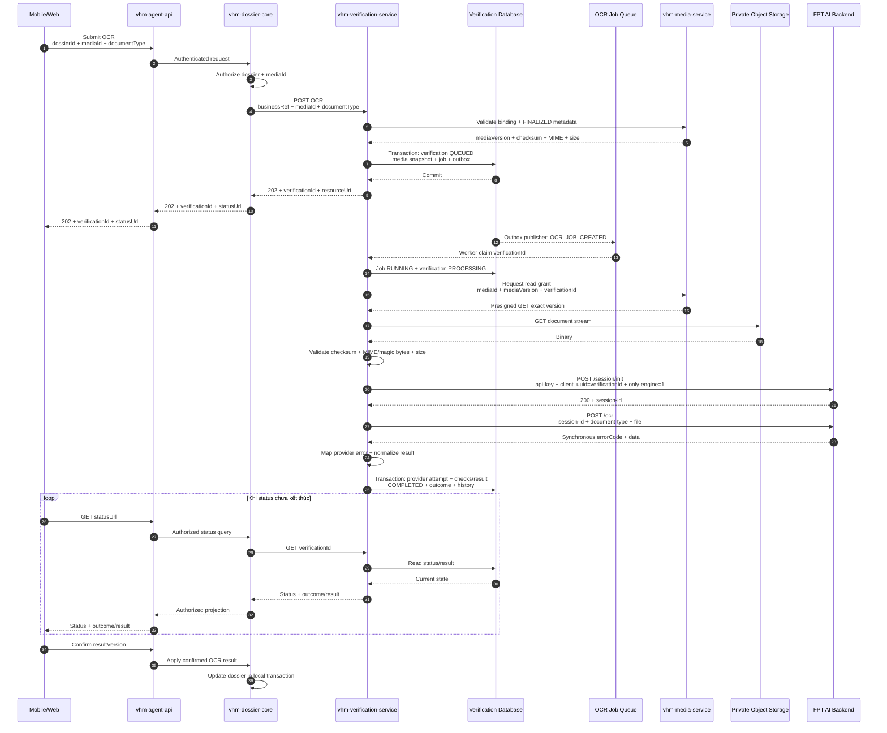
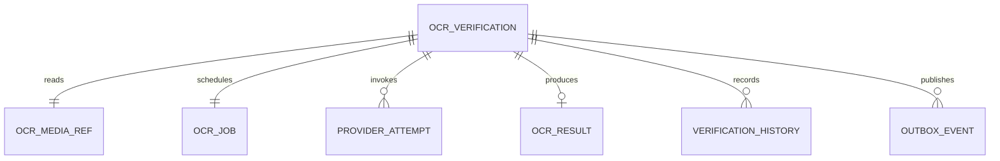

# Vấn đề 6: Lựa chọn nền tảng tích hợp OCR tập trung

## 1. Phạm vi

Tài liệu này chỉ thiết kế **luồng OCR tích hợp bằng backend API**. Mobile/Web không tích hợp SDK của FPT và không gọi trực tiếp FPT AI.

Phạm vi bao gồm:

- Upload một tài liệu lên `vhm-media-service` bằng Presigned PUT.
- Tạo yêu cầu OCR qua `vhm-agent-api` và `vhm-dossier-core`.
- `vhm-verification-service` xử lý OCR bất đồng bộ bằng queue/worker.
- Worker gọi FPT AI bằng server credential, chuẩn hóa và lưu kết quả.
- Mobile/Web polling trạng thái/kết quả từ API của VHM và xác nhận dữ liệu trước khi apply vào hồ sơ.

Phạm vi hiện tại **không bao gồm** eKYC, FPT SDK, liveness, face matching, NFC hoặc SDK Proxy. Các năng lực này sẽ được thiết kế riêng khi chốt phương án SDK.

Các tài liệu nghiệp vụ dự kiến:

- CCCD/CMND khi API/model được chọn hỗ trợ đúng input contract.
- Giấy đăng ký kết hôn.
- Bản sao có chứng thực giấy chứng nhận hộ nghèo/cận nghèo.
- Các giấy tờ khác trong checklist hồ sơ NOXH sau khi có model/template và schema kết quả tương ứng.

Mỗi yêu cầu OCR xử lý **một logical document**, được tham chiếu bằng một `mediaId`. `documentType` chỉ dùng để chọn provider API/model và schema chuẩn hóa; nó không tạo một workflow khác.

OCR chỉ hỗ trợ số hóa và gợi ý dữ liệu. Kết quả OCR không xác minh người thao tác là chủ thể của giấy tờ và không tự quyết định hồ sơ đủ điều kiện NOXH. Người dùng phải xác nhận trước khi `vhm-dossier-core` cập nhật dữ liệu nghiệp vụ.

## 2. Quyết định kiến trúc

| **Hướng tiếp cận** | **Ưu điểm** | **Nhược điểm** | **Lựa chọn** |
| --- | --- | --- | --- |
| `vhm-dossier-core` gọi trực tiếp FPT AI | Ít thành phần ban đầu | Domain NOXH phụ thuộc credential, session, payload, error code và SLA của FPT; khó tái sử dụng cho domain khác | No |
| `vhm-verification-service` tích hợp FPT AI | Tập trung provider adapter, credential, queue/worker, retry, timeout và Canonical Result; domain chỉ authorize và apply | Thêm một service và hạ tầng job | **Yes** |

`vhm-verification-service` cung cấp contract OCR ổn định cho các domain. FPT `/ocr` là synchronous, nhưng API của VHM vẫn là asynchronous:

```text
Mobile/Web → VHM create OCR → 202 QUEUED
OCR Worker → FPT /session/init → FPT /ocr synchronous
OCR Worker → lưu Canonical Result
Mobile/Web → poll VHM status/result
```

Cách bọc này tránh giữ kết nối Mobile/Web trong thời gian upload media từ storage và chờ provider, đồng thời cô lập timeout/backlog của FPT khỏi `vhm-dossier-core`.

## 3. Kiến trúc OCR tập trung

### 3.1. Thành phần

| **Thành phần** | **Trách nhiệm** |
| --- | --- |
| Mobile/Web | Upload tài liệu; tạo OCR; poll; hiển thị và cho người dùng xác nhận kết quả |
| `vhm-agent-api` | Xác thực/routing; authorize upload/finalize; không giữ FPT credential |
| `vhm-dossier-core` | Authorize hồ sơ, `businessRef`, `mediaId`, query/apply kết quả |
| `vhm-media-service` | Cấp upload slot, finalize media, cung cấp immutable metadata và exact-version read grant |
| Verification API | Private command/query API của `vhm-verification-service` |
| OCR Worker | Claim job, đọc tài liệu, gọi provider và persist kết quả; không mở public API |
| Provider Adapter | Ánh xạ `documentType` sang FPT API/model; inject credential; map response/error |
| Result Normalizer | Chuyển provider response thành Canonical Result có version |
| Verification Database + Outbox | Lưu lifecycle, media snapshot, job, provider attempt, result, history và sự kiện |

`Verification API`, `OCR Worker`, `Provider Adapter` và `Result Normalizer` là module/workload trong cùng `vhm-verification-service`, không phải các service public riêng.

### 3.2. Thành phần và hướng dữ liệu



Hai đường dữ liệu được tách rõ:

- Upload binary: `Mobile/Web → Presigned PUT → Object Storage`.
- OCR: `vhm-verification-service → Object Storage → FPT AI Backend`.

Mobile/Web không gửi binary qua `vhm-dossier-core` hoặc `vhm-verification-service` khi upload và không gọi trực tiếp FPT. Khi tạo OCR, Verification API persist `QUEUED` cùng outbox; Outbox Publisher đưa job vào `OCR Job Queue`, sau đó OCR Worker mới đọc media và gọi FPT. Các module nằm trong khung `vhm-verification-service` thuộc cùng một service/codebase; queue là hạ tầng messaging của workload này.

### 3.3. Lifecycle và outcome

`status` mô tả vòng đời kỹ thuật:

```text
QUEUED → PROCESSING → COMPLETED
   └───────────────→ CANCELLED/EXPIRED
```

- `QUEUED`: job đã được persist và có outbox để publish.
- `PROCESSING`: worker đã claim job.
- `COMPLETED`: đã có kết luận cuối cùng, kể cả trường hợp provider lỗi sau khi hết recovery budget.
- `CANCELLED/EXPIRED`: kết thúc không có outcome.

`outcome` chỉ có khi `status=COMPLETED`:

| **Outcome** | **Ý nghĩa** |
| --- | --- |
| `OCR_COMPLETED` | Đã đọc và chuẩn hóa tài liệu; người dùng vẫn phải xác nhận |
| `NEED_REVIEW` | Kết quả có confidence/warning cần kiểm tra thủ công |
| `NEED_RETRY` | Input không đọc được hoặc chất lượng không đạt; cần upload tài liệu mới |
| `PROVIDER_ERROR` | Hết recovery budget hoặc provider không trả kết quả hợp lệ |

Lỗi transport/provider không được ánh xạ thành lỗi nghiệp vụ của hồ sơ.

## 4. Upload tài liệu

Upload diễn ra trước OCR và không tạo `verificationId`. `vhm-agent-api` gọi thẳng `vhm-media-service`; `vhm-dossier-core` và `vhm-verification-service` không nằm trong luồng upload.



Quy ước tích hợp:

- Một tài liệu upload là một `mediaId`.
- OCR chỉ được tạo sau khi media có trạng thái `FINALIZED`.
- Finalize không tự động khởi chạy OCR.
- Client/domain chỉ truyền `mediaId`, không truyền bucket, object key, Presigned GET URL hoặc storage path.
- `vhm-verification-service` chỉ đọc exact finalized version thông qua read grant ngắn hạn do `vhm-media-service` cấp.

## 5. Luồng OCR bằng API

### 5.1. Luồng tổng quan trong `vhm-verification-service`

```mermaid
flowchart LR
    API["`**Verification API**
Validate request`"]
    ACCEPT["`**Database transaction**
QUEUED · Media snapshot · Outbox`"]
    QUEUE[("`**OCR Job Queue**`")]
    WORKER["`**OCR Worker**
PROCESSING`"]
    READ["`**Media Adapter**
Read exact media version`"]
    INIT["`**FPT Session API**
POST /session/init`"]
    OCR["`**FPT OCR API**
POST /ocr · synchronous`"]
    NORMALIZE["`**Result Normalizer**
Canonical fields · warnings`"]
    DONE["`**Verification Database**
COMPLETED · outcome · result`"]
    STATUS["`**Verification API**
GET status/result`"]

    API --> ACCEPT -->|"Publish"| QUEUE --> WORKER
    WORKER --> READ --> INIT --> OCR --> NORMALIZE --> DONE
    DONE --> STATUS
```



Toàn bộ box từ `Verification API` đến `Result Normalizer` thuộc cùng `vhm-verification-service`. FPT không xử lý job bất đồng bộ trong contract `/ocr` đang dùng; worker chờ response synchronous rồi mới normalize và persist.

### 5.2. Sequence diagram end-to-end



Hai call FPT có vai trò khác nhau:

- `/session/init` tạo phiên provider và trả `session-id` bắt buộc cho `/ocr`.
- `/ocr` nhận document và trả kết quả OCR đồng bộ.

VHM không trả `session-id` xuống Mobile/Web và không dùng nó làm `verificationId`.

## 6. API contract của VHM

### 6.1. Danh sách API

| **Use case** | **Application API** | **Private target** | **Response** |
| --- | --- | --- | --- |
| Tạo upload slot | `POST /dossiers/{dossierId}/media/upload-slots` | `vhm-media-service` | `201 + mediaId + upload information` |
| Finalize media | `POST /dossiers/{dossierId}/media/{mediaId}/finalize` | `vhm-media-service` | `200 + mediaVersion + FINALIZED` |
| Tạo OCR | `POST /dossiers/{dossierId}/ocr-verifications` | `POST /internal/v1/ocr-verifications` | `202 + verificationId + statusUrl` |
| Lấy trạng thái | `GET /dossiers/{dossierId}/ocr-verifications/{id}` | `GET /internal/v1/ocr-verifications/{id}` | Status, outcome, next action |
| Lấy kết quả | `GET /dossiers/{dossierId}/ocr-verifications/{id}/result` | `GET /internal/v1/ocr-verifications/{id}/result` | Canonical Result |
| Thử lại | `POST /dossiers/{dossierId}/ocr-verifications/{id}/retries` | `POST /internal/v1/ocr-verifications/{id}/retries` | Tạo verification mới |
| Xác nhận/apply | `POST /dossiers/{dossierId}/ocr-verifications/{id}/apply` | Domain đọc result rồi apply local | Dữ liệu hồ sơ đã cập nhật |

Private API chỉ mở cho service caller được cấp scope. `vhm-verification-service` trả `resourceUri` nội bộ; `vhm-dossier-core` ánh xạ thành `statusUrl` thuộc dossier và authorize lại trên mỗi query.

### 6.2. Tạo OCR

```http
POST /internal/v1/ocr-verifications
Authorization: Bearer <service-token>
Idempotency-Key: 72aacfa4-97b8-4d0f-bb74-490f17352b1b
Content-Type: application/json

{
  "businessRef": { "type": "DOSSIER", "id": "dos-01" },
  "subjectRef": "customer-opaque-ref",
  "channel": "MOBILE",
  "documentType": "MARRIAGE_CERTIFICATE",
  "mediaId": "d01ab6c8-3c0a-4be8-93b2-bd3df8bb15b7"
}
```

```http
HTTP/1.1 202 Accepted
Retry-After: 3

{
  "verificationId": "ver-123",
  "status": "QUEUED",
  "resourceUri": "/internal/v1/ocr-verifications/ver-123"
}
```

Create chỉ trả `202` sau khi verification, immutable media snapshot, job và outbox đã commit thành công. Nếu không thể persist an toàn, API trả lỗi; không trả `202` rồi để mất job.

### 6.3. Status và result

```json
{
  "verificationId": "ver-123",
  "status": "PROCESSING",
  "outcome": null,
  "resultAvailable": false,
  "nextAction": "POLL",
  "updatedAt": "2026-08-10T11:30:25+07:00"
}
```

Canonical Result không phụ thuộc tên field/error code của FPT:

```json
{
  "verificationId": "ver-123",
  "status": "COMPLETED",
  "outcome": "OCR_COMPLETED",
  "resultVersion": 1,
  "schemaVersion": "1.0",
  "document": {
    "type": "MARRIAGE_CERTIFICATE",
    "fields": {
      "certificateNumber": {
        "value": "01/2026",
        "confidence": 0.97
      },
      "registrationDate": {
        "value": "2026-08-01",
        "confidence": 0.95
      }
    },
    "warnings": []
  },
  "nextAction": "CONFIRM_AND_APPLY",
  "completedAt": "2026-08-10T11:31:12+07:00"
}
```

Kết quả chỉ chứa field nằm trong allowlist của `documentType`. Raw provider payload, API key, provider session, storage path và read-grant URL không được trả qua Application API.

### 6.4. HTTP và error contract

| **HTTP** | **Sử dụng** |
| --- | --- |
| `200/201/202` | Query/create thành công hoặc command đã được persist để xử lý |
| `400` | Header/payload sai định dạng |
| `401/403` | Service identity hoặc scope không hợp lệ |
| `404` | Resource không tồn tại hoặc caller không được phép biết resource tồn tại |
| `409` | Idempotency conflict, state transition sai hoặc result chưa sẵn sàng |
| `413/415/422` | Media vượt giới hạn, sai loại hoặc không đúng contract của `documentType` |
| `429` | Admission control/quota nội bộ; trả `Retry-After` |
| `503` | Không thể persist/enqueue an toàn |

Error response của VHM chỉ dùng `code`, `message`, `retryable` và `correlationId`. Provider error phát sinh trong worker được lưu vào trạng thái job/result để Mobile/Web nhận khi poll, không trả raw FPT response.

## 7. Dữ liệu

### 7.1. Schema logic

| **Bảng** | **Mục đích** |
| --- | --- |
| `ocr_verifications` | Aggregate root, lifecycle, idempotency và business binding |
| `ocr_media_refs` | Snapshot immutable của đúng `mediaId/mediaVersion` đã finalize |
| `ocr_jobs` | Trạng thái vận hành của worker |
| `provider_attempts` | Ghi từng lần init/OCR và trạng thái timeout không xác định |
| `ocr_results` | Canonical Result hiện hành, có version |
| `verification_history` | Lịch sử lifecycle append-only |
| `outbox_events` | Bảo đảm DB commit và enqueue/event không lệch nhau |



### 7.2. DDL baseline rút gọn

```sql
CREATE TABLE ocr_verifications (
    verification_id         UUID PRIMARY KEY,
    business_type           VARCHAR(30) NOT NULL,
    business_ref            VARCHAR(100) NOT NULL,
    subject_ref_ciphertext  BYTEA,
    channel                 VARCHAR(20) NOT NULL CHECK (channel IN ('MOBILE', 'WEB')),
    document_type           VARCHAR(50) NOT NULL,
    status                  VARCHAR(30) NOT NULL CHECK (status IN
                                ('QUEUED', 'PROCESSING', 'COMPLETED',
                                 'CANCELLED', 'EXPIRED')),
    outcome                 VARCHAR(30),
    retry_of                UUID REFERENCES ocr_verifications(verification_id),
    idempotency_key         VARCHAR(100) NOT NULL,
    request_fingerprint     CHAR(64) NOT NULL,
    result_schema_version   VARCHAR(20) NOT NULL,
    next_action             VARCHAR(40),
    terminal_reason_code    VARCHAR(80),
    row_version             BIGINT NOT NULL DEFAULT 0,
    created_at              TIMESTAMPTZ NOT NULL DEFAULT now(),
    updated_at              TIMESTAMPTZ NOT NULL DEFAULT now(),
    completed_at            TIMESTAMPTZ,
    CONSTRAINT uq_ocr_idempotency UNIQUE (business_type, idempotency_key),
    CONSTRAINT ck_ocr_status_outcome CHECK (
        (status = 'COMPLETED' AND outcome IN
            ('OCR_COMPLETED', 'NEED_REVIEW', 'NEED_RETRY', 'PROVIDER_ERROR')) OR
        (status <> 'COMPLETED' AND outcome IS NULL)
    )
);

CREATE INDEX ix_ocr_business
    ON ocr_verifications (business_type, business_ref, created_at DESC);
CREATE INDEX ix_ocr_active
    ON ocr_verifications (status, updated_at)
    WHERE status IN ('QUEUED', 'PROCESSING');

CREATE TABLE ocr_media_refs (
    verification_id         UUID PRIMARY KEY REFERENCES ocr_verifications(verification_id),
    media_id                 UUID NOT NULL,
    media_version            VARCHAR(200) NOT NULL,
    checksum_sha256          CHAR(64) NOT NULL,
    content_type             VARCHAR(100) NOT NULL,
    size_bytes               BIGINT NOT NULL CHECK (size_bytes > 0),
    finalized_at             TIMESTAMPTZ NOT NULL,
    created_at               TIMESTAMPTZ NOT NULL DEFAULT now(),
    CONSTRAINT uq_ocr_media UNIQUE (verification_id, media_id)
);

CREATE TABLE ocr_jobs (
    job_id                   UUID PRIMARY KEY,
    verification_id         UUID NOT NULL UNIQUE REFERENCES ocr_verifications(verification_id),
    status                   VARCHAR(20) NOT NULL CHECK (status IN
                                ('PENDING', 'RUNNING', 'RETRY_WAIT', 'SUCCEEDED', 'DEAD')),
    attempt_count            INTEGER NOT NULL DEFAULT 0,
    max_attempts             INTEGER NOT NULL,
    available_at             TIMESTAMPTZ NOT NULL DEFAULT now(),
    lease_owner              VARCHAR(100),
    lease_until              TIMESTAMPTZ,
    last_error_code          VARCHAR(80),
    created_at               TIMESTAMPTZ NOT NULL DEFAULT now(),
    updated_at               TIMESTAMPTZ NOT NULL DEFAULT now()
);

CREATE INDEX ix_ocr_job_dispatch ON ocr_jobs (status, available_at);

CREATE TABLE provider_attempts (
    provider_attempt_id      UUID PRIMARY KEY,
    verification_id         UUID NOT NULL REFERENCES ocr_verifications(verification_id),
    job_id                   UUID NOT NULL REFERENCES ocr_jobs(job_id),
    provider                 VARCHAR(30) NOT NULL,
    operation                VARCHAR(30) NOT NULL CHECK (operation IN ('INIT_SESSION', 'OCR')),
    attempt_no               INTEGER NOT NULL CHECK (attempt_no > 0),
    provider_session_ciphertext BYTEA,
    status                   VARCHAR(20) NOT NULL CHECK (status IN
                                ('STARTED', 'SUCCEEDED', 'FAILED', 'UNKNOWN')),
    delivery_state           VARCHAR(20) NOT NULL CHECK (delivery_state IN
                                ('NOT_SENT', 'SENDING', 'SENT', 'UNKNOWN')),
    error_class              VARCHAR(40),
    error_code               VARCHAR(80),
    started_at               TIMESTAMPTZ NOT NULL,
    finished_at              TIMESTAMPTZ,
    CONSTRAINT uq_provider_call_attempt
        UNIQUE (verification_id, provider, operation, attempt_no)
);

CREATE TABLE ocr_results (
    verification_id         UUID PRIMARY KEY REFERENCES ocr_verifications(verification_id),
    result_version           INTEGER NOT NULL,
    schema_version           VARCHAR(20) NOT NULL,
    canonical_payload_ciphertext BYTEA NOT NULL,
    payload_key_version      VARCHAR(40) NOT NULL,
    result_hash              CHAR(64) NOT NULL,
    created_at               TIMESTAMPTZ NOT NULL DEFAULT now()
);

CREATE TABLE verification_history (
    history_id               UUID PRIMARY KEY,
    verification_id         UUID NOT NULL REFERENCES ocr_verifications(verification_id),
    from_status              VARCHAR(30),
    to_status                VARCHAR(30) NOT NULL,
    outcome                  VARCHAR(30),
    reason_code              VARCHAR(80),
    actor_type               VARCHAR(30) NOT NULL,
    correlation_id           VARCHAR(100) NOT NULL,
    created_at               TIMESTAMPTZ NOT NULL DEFAULT now()
);

CREATE INDEX ix_ocr_history
    ON verification_history (verification_id, created_at);

CREATE TABLE outbox_events (
    event_id                 UUID PRIMARY KEY,
    aggregate_id             UUID NOT NULL,
    event_type               VARCHAR(80) NOT NULL,
    payload                  JSONB NOT NULL,
    status                   VARCHAR(20) NOT NULL DEFAULT 'NEW' CHECK (status IN
                                ('NEW', 'PUBLISHING', 'PUBLISHED', 'FAILED')),
    available_at             TIMESTAMPTZ NOT NULL DEFAULT now(),
    published_at             TIMESTAMPTZ,
    attempt_count            INTEGER NOT NULL DEFAULT 0,
    created_at               TIMESTAMPTZ NOT NULL DEFAULT now()
);

CREATE INDEX ix_outbox_publish ON outbox_events (status, available_at);
```

Không lưu object path, Presigned URL hoặc raw provider payload trong các bảng trên. Outbox chỉ chứa ID/reference tối thiểu, không chứa tài liệu hoặc Canonical Result.

## 8. Xử lý tin cậy và timeout

### 8.1. Transaction và idempotency

- Verification API kiểm tra media `FINALIZED` và lấy immutable metadata ngoài DB transaction.
- Sau đó insert `ocr_verifications`, `ocr_media_refs`, `ocr_jobs` và `outbox_events` trong một transaction ngắn.
- Cùng `Idempotency-Key` và fingerprint trả resource cũ; cùng key nhưng fingerprint khác trả `409 IDEMPOTENCY_CONFLICT`.
- Queue dùng at-least-once. Worker dedupe theo `jobId` và không gọi provider lại nếu đã có provider attempt terminal thành công.
- Provider call, Object Storage và Media API luôn nằm ngoài DB transaction.
- Persist result trong transaction ngắn: provider attempt, Canonical Result, lifecycle, history và outbox `OCR_COMPLETED`.

### 8.2. Timeout FPT synchronous API

Timeout có thể xảy ra tại kết nối, gateway hoặc trong lúc FPT xử lý. Timeout chỉ có nghĩa worker không nhận response trước deadline; nó không chứng minh FPT chưa xử lý document.

| **Thời điểm lỗi** | **Xử lý** |
| --- | --- |
| Chưa gửi request/body tới FPT | Có thể retry có giới hạn với backoff |
| FPT trả `429/5xx` rõ ràng | Retry khi contract/SLA xác nhận operation retry-safe |
| Timeout sau khi body có thể đã gửi | Ghi `status=UNKNOWN`, `delivery_state=UNKNOWN`; không POST `/ocr` lại mù |
| FPT trả business OCR error | Map sang `NEED_RETRY` hoặc `NEED_REVIEW`; không coi là timeout |

Normal flow không polling FPT vì `/ocr` trả kết quả synchronous. Nếu timeout sau khi body có thể đã được gửi, worker không gọi lại `/ocr` một cách mù quáng; verification kết thúc `COMPLETED + PROVIDER_ERROR`, `nextAction=RETRY`. Retry từ người dùng tạo `verificationId` mới, không reset hoặc ghi đè attempt cũ.

Timeout outbound tới FPT phải ngắn hơn lease của worker. Giá trị cụ thể cần được chốt theo SLA và p95/p99 thực tế của từng endpoint; tài liệu này không giả định một con số timeout là SLA chính thức của FPT.

### 8.3. Kết thúc job

- Thành công: `ocr_jobs=SUCCEEDED`, verification `COMPLETED` và outcome `OCR_COMPLETED/NEED_REVIEW/NEED_RETRY`.
- Hết recovery budget: `ocr_jobs=DEAD`, verification `COMPLETED + PROVIDER_ERROR`; client không bị poll vô hạn.
- `RETRY_WAIT/DEAD` là trạng thái nội bộ của worker, không trả trực tiếp cho Mobile/Web.

## 9. Kế hoạch triển khai và kiểm thử

### 9.1. Thứ tự triển khai

1. Chốt contract `FINALIZED metadata/read grant` với `vhm-media-service`.
2. Chốt với FPT từng `documentType → API/model`, input contract, file limit, response/error, quota và timeout.
3. Xây Verification API, schema, idempotency và outbox/queue/worker skeleton bằng mock Provider Adapter.
4. Tích hợp FPT `/session/init → /ocr`, Result Normalizer và polling end-to-end.
5. Chỉ enable document type đã có provider contract và fixture được xác nhận.
6. Load/resilience test; chốt concurrency, retry/recovery budget và alert backlog trước production.

### 9.2. Kiểm thử tối thiểu

| **Lớp test** | **Phạm vi** |
| --- | --- |
| Unit | Lifecycle/outcome guard, idempotency fingerprint, field mapping, confidence/warning và timeout classification |
| Contract | Media metadata/read grant; FPT init/OCR success, business error, malformed response, 429, 5xx và timeout fixture |
| Integration | PostgreSQL constraint/locking, outbox publish, queue duplicate, worker lease/recovery và exact media version |
| End-to-end | Upload → finalize → create `202` → processing → result → confirm/apply |
| Resilience | FPT slow/timeout, unknown-after-send, queue backlog, worker crash, DLQ và client polling không vô hạn |

### 9.3. Điểm cần chốt

- API/model FPT cho giấy đăng ký kết hôn, giấy chứng nhận hộ nghèo/cận nghèo và tài liệu ngoài `idr/passport/dlr`.
- File type/size/page limit, request multipart contract và SLA/quota của từng model.
- Threshold confidence/warning theo từng `documentType`.
- Retention của Canonical Result, provider session metadata và audit history.

`vhm-verification-service` chịu trách nhiệm OCR và cô lập FPT contract. `vhm-dossier-core` vẫn chịu trách nhiệm authorization, xác nhận người dùng và cập nhật hồ sơ NOXH.
