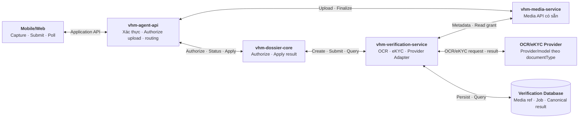
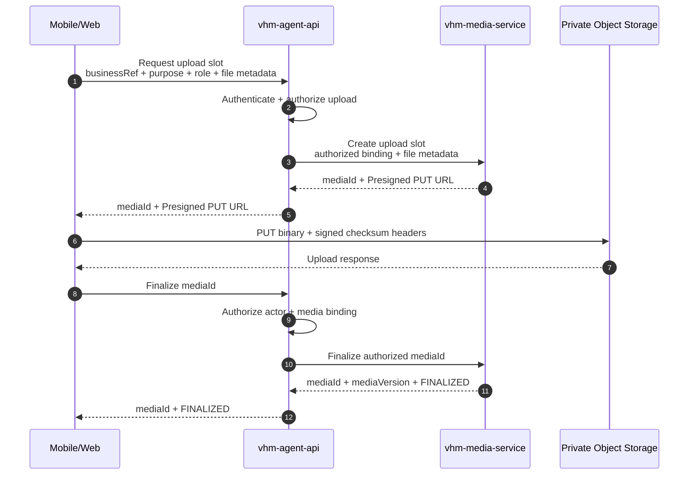
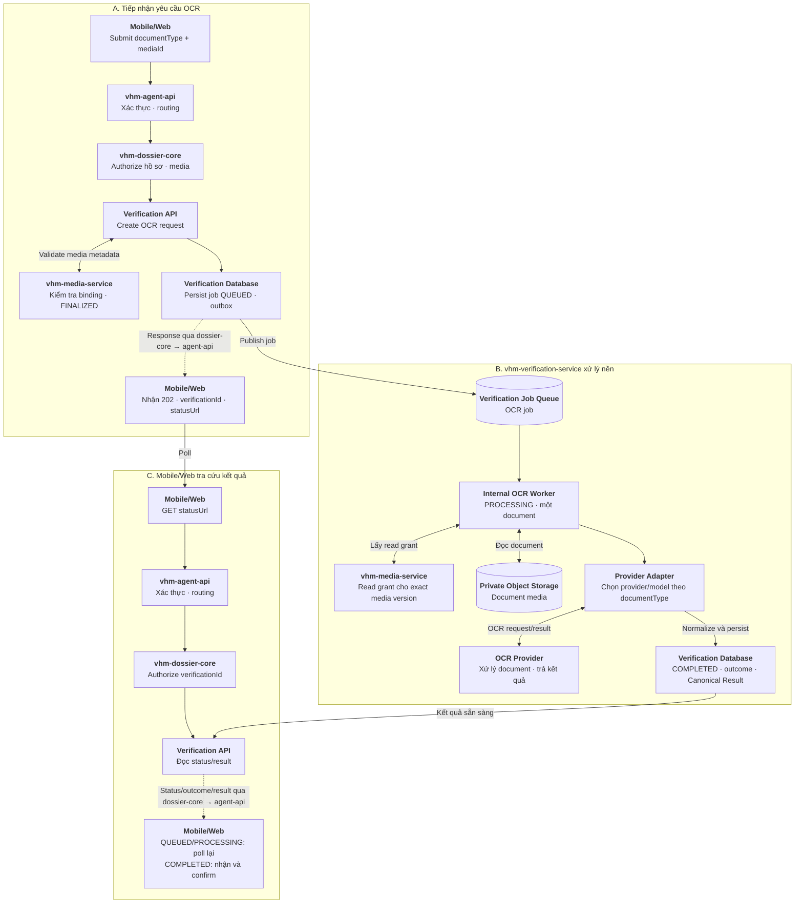
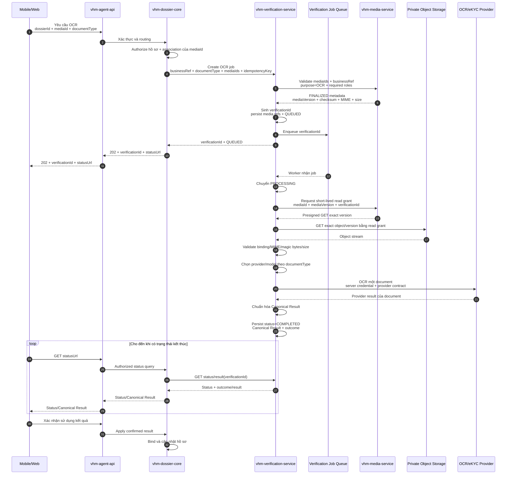
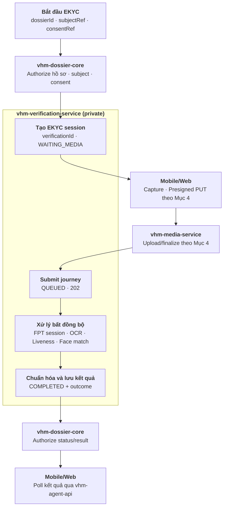
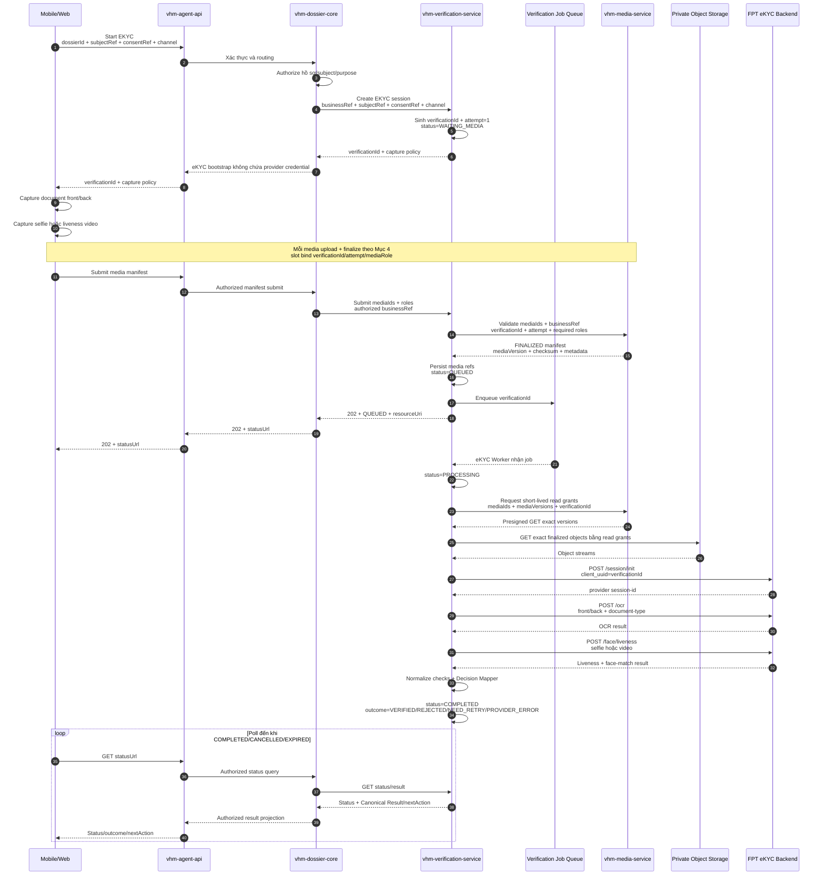
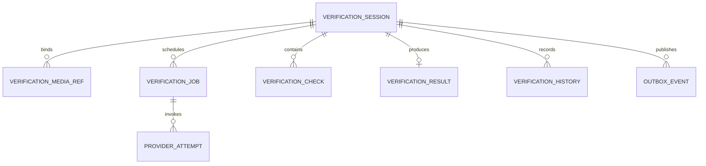

# Vấn đề 6: Lựa chọn nền tảng tích hợp OCR tập trung

## 1. Phạm vi

**User case:** Người dùng chụp hoặc upload giấy tờ trên Mobile/Web để hệ thống OCR, phân loại, gợi ý dữ liệu hoặc xác minh danh tính khi tạo hồ sơ NOXH.

**Hai journey được thiết kế độc lập:**

- **`OCR`:** Trích xuất và chuẩn hóa dữ liệu giấy tờ. Kết quả OCR không khẳng định người thao tác là chủ thể trên giấy tờ và luôn cần người dùng kiểm tra trước khi apply vào hồ sơ.
- **`EKYC`:** OCR giấy tờ định danh kết hợp liveness và face matching để xác minh người thao tác.

**Loại tài liệu dự kiến:**

- CCCD mặt trước/sau.
- Giấy đăng ký kết hôn.
- Bản sao có chứng thực giấy chứng nhận hộ gia đình nghèo/cận nghèo.
- Các giấy tờ khác trong checklist hồ sơ NOXH khi có mẫu OCR tương ứng.

`vhm-verification-service` là nền tảng verification dùng chung, điều phối cả `OCR` và `EKYC`, cô lập contract/credential của provider và chuẩn hóa kết quả. Quyết định cập nhật hồ sơ hoặc chấp nhận kết quả vẫn thuộc `vhm-dossier-core`.

Trong tài liệu này, `vhm-dossier-core` là domain caller của NOXH. Domain khác có nhu cầu OCR/eKYC sử dụng cùng private API và vẫn tự chịu trách nhiệm authorization nghiệp vụ trước khi gọi `vhm-verification-service`.

**Các use case:**

1. **OCR CCCD:** Người dùng chụp đủ mặt trước/sau. Hệ thống trích xuất số định danh, họ tên, ngày sinh, giới tính, quốc tịch, quê quán, nơi thường trú, ngày cấp/hết hạn và cảnh báo chất lượng hoặc hai mặt không khớp.
2. **OCR giấy đăng ký kết hôn:** Người dùng upload tài liệu. Hệ thống trích xuất số giấy chứng nhận, thông tin hai bên, ngày đăng ký, nơi đăng ký và thông tin người ký/cơ quan cấp nếu mẫu tài liệu hỗ trợ.
3. **OCR giấy chứng nhận hộ nghèo/cận nghèo:** Người dùng upload bản sao có chứng thực. Hệ thống trích xuất số văn bản/chứng thực, chủ hộ, địa chỉ, loại xác nhận, thời gian hiệu lực, cơ quan cấp và ngày cấp.
4. **OCR giấy tờ khác:** NOXH truyền `documentType`; `vhm-verification-service` chỉ xử lý khi đã có model/template và schema kết quả tương ứng. Tài liệu chưa được hỗ trợ hoặc có confidence thấp được chuyển sang nhập liệu/kiểm tra thủ công.
5. **EKYC:** Người dùng chụp giấy tờ định danh và thực hiện liveness. Hệ thống xử lý OCR, kiểm tra liveness, so khớp khuôn mặt và trả kết quả `VERIFIED/REJECTED/NEED_RETRY` theo policy; Mobile/Web chỉ sử dụng outcome do backend trả về.

OCR chỉ hỗ trợ số hóa và kiểm tra dữ liệu theo khả năng của model. Việc xác nhận bản sao có giá trị pháp lý, giấy tờ còn hiệu lực hoặc hồ sơ đáp ứng điều kiện NOXH vẫn do nghiệp vụ và người duyệt quyết định.

## 2. Quyết định kiến trúc

**Bối cảnh:** Nếu `vhm-dossier-core` tự tích hợp FPT AI, toàn bộ logic quản lý credential, provider session, async job, retry, error mapping, audit và dữ liệu định danh sẽ nằm trong service nghiệp vụ NOXH và phụ thuộc trực tiếp vào contract của provider.

| **Hướng tiếp cận** | **Ưu điểm** | **Nhược điểm** | **Lựa chọn (Yes/No)** |
| --- | --- | --- | --- |
| **`vhm-dossier-core` tích hợp trực tiếp FPT AI** | Ít thành phần; thời gian triển khai ban đầu ngắn | `vhm-dossier-core` phải xử lý credential, provider session, queue/worker, retry và mã lỗi riêng của FPT AI; thay đổi provider tác động trực tiếp nghiệp vụ NOXH; tăng rủi ro dữ liệu định danh trong service hồ sơ | **No** |
| **`vhm-verification-service`** | `vhm-dossier-core` chỉ authorize journey và sử dụng kết quả; luồng upload do `vhm-agent-api` gọi `vhm-media-service` có sẵn; verification service tập trung vào async job, provider integration, credential, session, retry, quota, audit và chuẩn hóa; thay provider không tác động domain | Thêm một service và network hop trên luồng xử lý; verification service phải đáp ứng HA/SLA vì là dependency dùng chung | **Yes** |

**Phương án chọn:** Sử dụng **`vhm-verification-service`** làm capability tập trung cho cả OCR và eKYC. `vhm-agent-api` xác thực và authorize upload/finalize trước khi gọi `vhm-media-service`; `vhm-dossier-core` authorize các thao tác create/submit/query/apply của journey; `vhm-verification-service` quản lý journey, xử lý bất đồng bộ và tích hợp provider.

**Nguyên tắc kiến trúc:**

- Giữ chung một service nhưng tách handler và state transition của `OCR`/`EKYC`; không tách thành hai service OCR và eKYC.
- `vhm-verification-service` là private internal service. Mobile/Web chỉ đi qua `vhm-agent-api` và `vhm-dossier-core`.
- `vhm-media-service` cung cấp `mediaId`, trạng thái `FINALIZED`, immutable media metadata và short-lived read grant.
- `vhm-verification-service` chỉ nhận `mediaId` đã được domain authorize; không cấp Presigned URL và không nhận URL/object path từ client hoặc domain.
- Provider credential chỉ tồn tại tại Provider Adapter. Không truyền credential, provider session hoặc raw provider payload về Mobile/Web, BFF hoặc `vhm-dossier-core`.
- `status` mô tả vòng đời kỹ thuật; `outcome` mô tả kết luận OCR/eKYC. Lỗi kỹ thuật không được ánh xạ thành `REJECTED`.
- Mọi command create/submit/retry/cancel của verification phải idempotent; command tạo job chỉ được trả thành công sau khi đã persist và bảo đảm enqueue bằng transactional outbox hoặc cơ chế tương đương.

**Căn cứ chọn phương thức tích hợp:** FPT cung cấp Mobile SDK, Web SDK và backend API như các phương thức tích hợp thay thế nhau. Thiết kế này chọn backend API: Mobile/Web chỉ capture và upload media vào VHM; `vhm-verification-service` dùng server credential để gọi FPT. Cách này giúp VHM chủ động data flow, worker và bảo mật credential ([So sánh các phương thức tích hợp](https://docs-vision.fpt.ai/ekyc/III-integration/III-0-so-sanh/)). FPT trả kết quả theo từng request; trạng thái bất đồng bộ và polling của Mobile/Web do VHM quản lý.

## 3. Kiến trúc `vhm-verification-service`

### 3.1. Các module chính

| **Module** | **Trách nhiệm implementation** |
| --- | --- |
| Verification API | Nhận internal command/query từ domain; validate service caller, business binding và idempotency key; trả `verificationId/status/result` |
| Media Service Adapter | Gọi contract có sẵn để kiểm tra binding/trạng thái `FINALIZED`, lấy immutable media metadata và short-lived read grant; không chứa logic upload/storage |
| Journey Orchestrator | Chọn `OCR` hoặc `EKYC`, kiểm tra milestone bắt buộc và điều khiển state transition |
| OCR Worker workload | Internal worker không mở API; đọc media đã finalize, chọn provider/model theo `documentType`, gọi OCR và chuẩn hóa một kết quả cho toàn bộ document |
| EKYC Worker workload | Internal worker không mở API; điều phối provider session, OCR front/back, liveness và face matching |
| Provider Adapter | Inject server credential; ánh xạ request/response/error; quản lý timeout, quota, circuit breaker và provider session |
| Result Normalizer | Chuẩn hóa field, confidence, warning, liveness/face-match check thành Canonical Result có version |
| Decision Mapper | Ánh xạ canonical checks thành journey outcome; không chứa rule phê duyệt hồ sơ NOXH |
| Persistence + Outbox | Lưu media reference/session/job/check/result/history; publish job/event an toàn; optimistic locking và dedupe |
| Security/Audit/Observability | Authorization defense-in-depth, masking, audit, metrics, trace và cảnh báo backlog/provider |

### 3.2. Thành phần và hướng dữ liệu



Mỗi dependency dùng một đường hai chiều để thể hiện request/response trên cùng kết nối. Presigned PUT và thứ tự end-to-end được thể hiện tại các sequence diagram bên dưới.

Request tạo OCR chỉ chờ đến khi `vhm-verification-service` persist job và trả `verificationId + QUEUED`; việc đọc object và gọi provider diễn ra trong worker. Mobile/Web không giữ kết nối chờ provider mà tra cứu trạng thái/kết quả qua `vhm-agent-api` và `vhm-dossier-core`.

Giải pháp này tái sử dụng Media API hiện có và giữ `vhm-verification-service` tập trung vào vòng đời OCR/eKYC cùng provider. `vhm-dossier-core` giữ authorization nghiệp vụ, association giữa hồ sơ với `mediaId/verificationId` và quyết định apply kết quả.

### 3.3. Phân định trách nhiệm

| **Năng lực** | **`vhm-dossier-core`** | **`vhm-verification-service`** |
| --- | --- | --- |
| Nghiệp vụ và authorization | Authorize create/submit/query/apply của journey; quyết định sử dụng kết quả | Kiểm tra service caller và binding `businessRef/mediaId/verificationId/attempt`; không xử lý rule NOXH |
| Media integration | Không tham gia upload/finalize; nhận `mediaId` khi domain xử lý yêu cầu OCR/eKYC | Chỉ consume media `FINALIZED` qua Media Service Adapter và lưu immutable snapshot; không triển khai upload/storage |
| Journey | Với OCR, chỉ create sau khi media `FINALIZED`; với EKYC, authorize start và submit đủ media | Quản lý `verificationId`, state machine, idempotency, queue/worker và attempt |
| Provider | Không gọi provider | Quản lý credential/session, model/template, timeout, retry, circuit breaker, quota và chuẩn hóa error |
| Kết quả | Authorize `status/result`; đối chiếu `resultVersion` và apply dữ liệu đã xác nhận | Lưu và trả status, outcome và Canonical Result có version; không trả raw provider payload |
| Dữ liệu và vận hành | Lưu `mediaId`, `verificationId/resultVersion` cần cho nghiệp vụ và audit apply | Lưu session/job/check/result cùng snapshot media metadata tối thiểu; masking, audit và monitoring |

### 3.4. Lifecycle và outcome dùng chung

`status` chỉ thể hiện vòng đời kỹ thuật. `outcome` chỉ được gán khi `status=COMPLETED`; vì vậy một lần xác minh bị lỗi provider sau khi hết recovery budget vẫn là `COMPLETED + PROVIDER_ERROR`, không phải `REJECTED`.

| **Journey** | **Outcome khi `COMPLETED`** | **Ý nghĩa** |
| --- | --- | --- |
| `OCR` | `OCR_COMPLETED` | Đọc đủ tài liệu; vẫn cần người dùng xác nhận dữ liệu |
| `OCR` | `NEED_REVIEW` | Confidence/warning vượt ngưỡng cần kiểm tra thủ công |
| Cả hai | `NEED_RETRY` | Media hoặc thao tác người dùng có thể thực hiện lại |
| `EKYC` | `VERIFIED` | Document, liveness và face match đạt policy |
| `EKYC` | `REJECTED` | Check nghiệp vụ xác minh không đạt policy; không dùng cho lỗi transport/provider |
| Cả hai | `PROVIDER_ERROR` | Hết retry budget hoặc provider không trả kết quả hợp lệ |

## 4. Upload media

Upload tái sử dụng flow có sẵn của `vhm-media-service`. `vhm-agent-api` xác thực và authorize upload/finalize; `vhm-dossier-core` và `vhm-verification-service` không tham gia luồng này. Binary không đi qua BFF hoặc backend service.



- Mobile/Web chỉ gọi `vhm-agent-api`. BFF xác thực actor, kiểm tra quyền upload theo `businessRef/purpose`, sau đó gọi thẳng `vhm-media-service` để create slot hoặc finalize.
- Với `OCR`, media service tạo `mediaId` bind với `businessRef/purpose/documentType` nhưng chưa có `verificationId`; chỉ khi media `FINALIZED` và domain yêu cầu OCR thì verification service mới sinh `verificationId`. Với `EKYC`, upload slot được bind với `verificationId/attempt/mediaRole` đã tạo ở trạng thái `WAITING_MEDIA`.
- Sau PUT, Mobile/Web finalize `mediaId` qua `vhm-agent-api` và chỉ tiếp tục OCR/EKYC khi Media API trả `FINALIZED + mediaVersion`. Finalize không tự động khởi chạy journey.
- Mobile/Web dùng camera/file capture component của ứng dụng để tạo raw document/selfie/liveness artifact rồi PUT trực tiếp vào Private Object Storage; không gọi FPT trực tiếp.

## 5. OCR

`OCR` chỉ được tạo sau khi verification media đã `FINALIZED`. Client nhận `202 + verificationId + statusUrl`, sau đó polling trong khi service xử lý bất đồng bộ.

### 5.1. Xử lý một document

- Mỗi yêu cầu `OCR` tương ứng với **một logical document** và chỉ tạo một `verificationId`, một job cùng một Canonical Result. Document có thể tham chiếu một hoặc nhiều `mediaId` theo contract, ví dụ hai mặt của cùng một CCCD, nhưng không bị tách thành page/batch job trong `vhm-verification-service`.
- `documentType` dùng để Provider Adapter chọn provider/model và ánh xạ schema kết quả; đây là chi tiết xử lý nội bộ, không tạo các luồng OCR nghiệp vụ khác nhau. Chỉ bật một `documentType` khi provider/model và contract đầu vào đã được xác nhận hỗ trợ.
- Với FPT eKYC, `/ocr` hiện xác nhận các giá trị `idr`, `passport` và `dlr`; adapter khởi tạo provider session rồi gọi OCR synchronous. Client vẫn sử dụng contract async `202 + polling` do VHM quản lý ([FPT eKYC backend API](https://docs-vision.fpt.ai/ekyc/III-integration/III-2-APIs/a-APIs%20of%20eKYC%20Flows/APIs-in-update-information-flow/)). Các `documentType` khác chỉ được cấu hình sau khi chốt model/API tương ứng với FPT.
- `vhm-verification-service` không nhận object path từ client hoặc domain. Service dùng `mediaId` để yêu cầu `vhm-media-service` kiểm tra `businessRef/purpose/status=FINALIZED`, lấy immutable `mediaVersion/checksum/MIME/size` và cấp read grant ngắn hạn cho exact version trước khi gửi provider.
- Không retry mù request sau khi body đã được gửi. Retry chỉ thực hiện theo idempotency contract của provider hoặc tạo verification attempt mới có kiểm soát để tránh tính phí và kết quả trùng.

### 5.2. Luồng tổng quan



`Verification API`, `Internal OCR Worker` và `Provider Adapter` đều là module/workload bên trong cùng `vhm-verification-service`, không phải ba public service. Đường nét đứt là response quay về Mobile/Web qua `vhm-dossier-core` và `vhm-agent-api`; service verification không trả trực tiếp cho client.

### 5.3. Sequence diagram



## 6. EKYC

`EKYC` tạo `verificationId` ở trạng thái `WAITING_MEDIA` trước capture để trả capture policy và bind attempt. Sau khi media được upload/finalize theo Mục 4, worker gọi FPT theo thứ tự `/session/init → /ocr → /face/liveness`, sau đó chuẩn hóa kết quả OCR, liveness và face matching ([FPT eKYC backend API](https://docs-vision.fpt.ai/ekyc/III-integration/III-2-APIs/a-APIs%20of%20eKYC%20Flows/APIs-in-update-information-flow/)).

### 6.1. Luồng tổng quan



Tương tự OCR, queue và EKYC Worker không phải service riêng; chúng là cơ chế xử lý nội bộ phía sau bước “Xử lý bất đồng bộ”.

### 6.2. Sequence diagram



Mobile/Web sử dụng camera/file capture component của ứng dụng để tạo raw document/selfie/liveness artifact và upload vào VHM Object Storage. Provider credential chỉ tồn tại trong `vhm-verification-service`; client không gọi FPT trực tiếp.

## 7. API và kết quả

### 7.1. Thiết kế API

`vhm-verification-service` chỉ mở API private dưới `/internal/v1`. Kết nối từ `vhm-dossier-core` dùng mTLS và service token có scope; `Idempotency-Key` bắt buộc với các command create, submit, cancel và retry. Mobile/Web chỉ gọi Application API của `vhm-agent-api`; BFF tự authorize upload/finalize và route các thao tác journey qua `vhm-dossier-core`.

| **Use case** | **Application API qua `vhm-agent-api`** | **Private downstream API (owner)** | **Kết quả** |
| --- | --- | --- | --- |
| Tạo upload slot | `POST /dossiers/{dossierId}/media/upload-slots` | `vhm-media-service`: dùng contract hiện có | `201`, trả `mediaId` và thông tin upload |
| Finalize media | `POST /dossiers/{dossierId}/media/{mediaId}/finalize` | `vhm-media-service`: dùng contract hiện có | `200`, trả `mediaId + mediaVersion + FINALIZED` |
| Tạo OCR | `POST /dossiers/{dossierId}/ocr-verifications` | `vhm-verification-service`: `POST /internal/v1/verifications/ocr` | `202`, tạo job ở `QUEUED` |
| Bắt đầu eKYC | `POST /dossiers/{dossierId}/ekyc-verifications` | `vhm-verification-service`: `POST /internal/v1/verifications/ekyc` | `201`, tạo session ở `WAITING_MEDIA` và trả capture policy |
| Submit media eKYC | `POST /dossiers/{dossierId}/verifications/{id}/media` | `vhm-verification-service`: `POST /internal/v1/verifications/{id}/media-submissions` | `202`, validate manifest rồi chuyển `QUEUED` |
| Lấy trạng thái | `GET /dossiers/{dossierId}/verifications/{id}` | `vhm-verification-service`: `GET /internal/v1/verifications/{id}` | Status, outcome, next action |
| Lấy kết quả | `GET /dossiers/{dossierId}/verifications/{id}/result` | `vhm-verification-service`: `GET /internal/v1/verifications/{id}/result` | Canonical Result đã lọc/mask |
| Xác nhận/apply OCR | `POST /dossiers/{dossierId}/verifications/{id}/apply` | `vhm-verification-service`: `GET /internal/v1/verifications/{id}/result`; không có command apply | `vhm-dossier-core` đối chiếu expected `resultVersion` rồi cập nhật nghiệp vụ trong local transaction |
| Hủy | `POST /dossiers/{dossierId}/verifications/{id}/cancel` | `vhm-verification-service`: `POST /internal/v1/verifications/{id}/cancel` | Hủy ngay khi chưa chạy hoặc best-effort khi đang xử lý |
| Thử lại | `POST /dossiers/{dossierId}/verifications/{id}/retries` | `vhm-verification-service`: `POST /internal/v1/verifications/{id}/retries` | Tạo attempt mới, không reset hoặc ghi đè attempt cũ |

`vhm-verification-service` trả `resourceUri` nội bộ. `vhm-dossier-core` ánh xạ URI này thành `statusUrl` thuộc dossier và authorize lại mỗi lần Mobile/Web poll; không chuyển nguyên internal URI cho client.

Upload/finalize tuân theo OpenAPI hiện có của `vhm-media-service`. Media Service Adapter sử dụng hai contract: kiểm tra immutable metadata/binding của media `FINALIZED`, và cấp short-lived read grant bind `mediaId + mediaVersion + verificationId`. URL đọc không được persist hoặc trả về Mobile/Web/domain.

Request tạo `OCR` sau khi verification media đã `FINALIZED`:

```http
POST /internal/v1/verifications/ocr
Authorization: Bearer <service-token>
Idempotency-Key: 72aacfa4-97b8-4d0f-bb74-490f17352b1b
Content-Type: application/json

{
  "businessRef": { "type": "DOSSIER", "id": "dos-01" },
  "subjectRef": "customer-opaque-ref",
  "channel": "MOBILE",
  "documentType": "IDR",
  "media": [
    {
      "mediaId": "media-front-01",
      "role": "DOCUMENT_FRONT"
    },
    {
      "mediaId": "media-back-01",
      "role": "DOCUMENT_BACK"
    }
  ]
}
```

```http
HTTP/1.1 202 Accepted
Retry-After: 3

{
  "verificationId": "ver-123",
  "journey": "OCR",
  "status": "QUEUED",
  "resourceUri": "/internal/v1/verifications/ver-123"
}
```

Request bắt đầu và submit `EKYC` được tách làm hai bước:

```http
POST /internal/v1/verifications/ekyc
Idempotency-Key: 434f4412-9027-4fb4-8ad3-05d98f8e68e0

{
  "businessRef": { "type": "DOSSIER", "id": "dos-01" },
  "subjectRef": "customer-opaque-ref",
  "consentRef": "consent-opaque-ref",
  "channel": "MOBILE",
  "policyKey": "NOXH_IDENTITY_V1"
}
```

Response `201 Created` trả `verificationId`, `status=WAITING_MEDIA`, `attempt=1`, `expiresAt` và `capturePolicy.requiredMedia`; tuyệt đối không chứa FPT API key hoặc provider session.

```http
POST /internal/v1/verifications/ver-456/media-submissions
Idempotency-Key: 88367e76-e93d-40fb-82c9-619a11fb41a8

{
  "attempt": 1,
  "media": [
    { "mediaId": "m-front", "role": "DOCUMENT_FRONT" },
    { "mediaId": "m-back", "role": "DOCUMENT_BACK" },
    { "mediaId": "m-live", "role": "LIVENESS" }
  ]
}
```

`mediaId` là opaque ID do `vhm-media-service` phát hành, không chứa bucket/key. Khi create/submit, `vhm-verification-service` gọi media service để kiểm tra `businessRef`, purpose, `verificationId/attempt/mediaRole`, trạng thái `FINALIZED`, checksum và immutable `mediaVersion`; API verification không nhận URL hoặc object path do client/domain truyền.

Status response dùng chung cho hai journey:

```json
{
  "verificationId": "ver-123",
  "journey": "OCR",
  "status": "PROCESSING",
  "outcome": null,
  "resultAvailable": false,
  "nextAction": "POLL",
  "updatedAt": "2026-08-10T11:30:25+07:00"
}
```

Quy ước HTTP/error:

| **HTTP** | **Sử dụng** |
| --- | --- |
| `200/201/202` | Query thành công; tạo resource; command đã được persist và chấp nhận xử lý |
| `400` | Contract/header sai định dạng |
| `401/403` | Service identity hoặc scope không hợp lệ |
| `404` | Không tồn tại hoặc caller không được phép biết resource tồn tại |
| `409` | Idempotency key trùng nhưng fingerprint khác; state transition sai; result chưa sẵn sàng |
| `413/415/422` | Media vượt giới hạn, sai content type/magic bytes hoặc thiếu/sai logical part |
| `429` | Admission control/quota nội bộ; trả `Retry-After` |
| `503` | Không thể persist/enqueue an toàn; không trả `202` giả |

Error body chỉ dùng canonical `code`, `message`, `retryable`, `correlationId`; không trả raw FPT code/message, stack trace, media reference hoặc credential. Lỗi provider xảy ra trong worker được thể hiện bằng job retry và final `outcome`, không biến thành HTTP error của request polling.

### 7.2. Canonical Result

Canonical Result có `schemaVersion`, không phụ thuộc tên field hoặc error code của FPT. API Result chỉ trả field nằm trong allowlist theo purpose; PII được mask theo role và raw score chỉ dành cho rule engine/audit có quyền.

```json
{
  "verificationId": "ver-123",
  "journey": "EKYC",
  "status": "COMPLETED",
  "outcome": "VERIFIED",
  "resultVersion": 1,
  "schemaVersion": "1.0",
  "document": {
    "type": "IDR",
    "fields": {
      "identityNumber": { "value": "0012******89", "confidence": 0.99 },
      "fullName": { "value": "NGUYEN VAN A", "confidence": 0.98 }
    },
    "warnings": []
  },
  "checks": [
    { "type": "DOCUMENT_OCR", "result": "PASS", "reasonCode": null },
    { "type": "LIVENESS", "result": "PASS", "reasonCode": null },
    { "type": "FACE_MATCH", "result": "PASS", "reasonCode": null }
  ],
  "nextAction": "CONFIRM_AND_APPLY",
  "completedAt": "2026-08-10T11:31:12+07:00"
}
```

`vhm-dossier-core` lưu reference tới `verificationId/resultVersion` và dữ liệu đã được người dùng xác nhận; không copy toàn bộ raw Canonical Result. Apply phải gửi expected `resultVersion` để tránh dùng kết quả cũ sau retry.

## 8. Dữ liệu và xử lý tin cậy

### 8.1. Database schema

PostgreSQL của `vhm-verification-service` là system of record cho verification lifecycle. Binary và media lifecycle thuộc `vhm-media-service`; verification database chỉ lưu immutable snapshot/reference cần để chứng minh journey đã xử lý đúng `mediaId + mediaVersion`, không lưu bucket/key hoặc read-grant URL.

| **Bảng** | **Mục đích** | **Ràng buộc chính** |
| --- | --- | --- |
| `verification_sessions` | Aggregate root của một attempt OCR/eKYC | Unique idempotency; status/outcome guard; optimistic `row_version` |
| `verification_media_refs` | Snapshot manifest đã được media service xác nhận | Unique logical part trong attempt; lưu `mediaId/mediaVersion/checksum` nhưng không lưu storage path/URL |
| `verification_jobs` | Theo dõi job xử lý document và retry | Một job theo loại cho mỗi verification; lease/retry có giới hạn |
| `provider_attempts` | Một lần gọi operation của provider | Dedupe operation/attempt; provider session ref được mã hóa |
| `verification_checks` | Document/quality/liveness/face check đã chuẩn hóa | Không lưu raw provider payload |
| `verification_results` | Canonical Result hiện hành | Một result/version hiện hành cho verification; payload PII mã hóa application-layer |
| `verification_history` | Lịch sử state/outcome append-only | Không update/delete trong business flow |
| `outbox_events` | Bảo đảm DB commit và enqueue/event không lệch nhau | Publisher at-least-once; consumer dedupe theo `event_id` |



DDL baseline rút gọn:

```sql
CREATE TABLE verification_sessions (
    verification_id         UUID PRIMARY KEY,
    journey                 VARCHAR(20) NOT NULL CHECK (journey IN ('OCR', 'EKYC')),
    business_type           VARCHAR(30) NOT NULL,
    business_ref            VARCHAR(100) NOT NULL,
    subject_ref_ciphertext  BYTEA,
    consent_ref             VARCHAR(150),
    channel                 VARCHAR(20) NOT NULL CHECK (channel IN ('MOBILE', 'WEB')),
    document_type           VARCHAR(40),
    status                  VARCHAR(30) NOT NULL CHECK (status IN
                                ('WAITING_MEDIA', 'QUEUED', 'PROCESSING',
                                 'CANCEL_REQUESTED', 'COMPLETED', 'CANCELLED', 'EXPIRED')),
    outcome                 VARCHAR(30),
    attempt_no              INTEGER NOT NULL DEFAULT 1 CHECK (attempt_no > 0),
    retry_of                UUID REFERENCES verification_sessions(verification_id),
    policy_version          VARCHAR(40) NOT NULL,
    result_schema_version   VARCHAR(20) NOT NULL,
    idempotency_key         VARCHAR(100) NOT NULL,
    request_fingerprint     CHAR(64) NOT NULL,
    next_action             VARCHAR(40),
    terminal_reason_code    VARCHAR(80),
    row_version             BIGINT NOT NULL DEFAULT 0,
    expires_at              TIMESTAMPTZ,
    created_at              TIMESTAMPTZ NOT NULL DEFAULT now(),
    updated_at              TIMESTAMPTZ NOT NULL DEFAULT now(),
    completed_at            TIMESTAMPTZ,
    CONSTRAINT uq_verification_idempotency UNIQUE (business_type, idempotency_key),
    CONSTRAINT ck_status_outcome CHECK (
        (status = 'COMPLETED' AND outcome IS NOT NULL) OR
        (status <> 'COMPLETED' AND outcome IS NULL)
    ),
    CONSTRAINT ck_journey_status CHECK (
        journey = 'EKYC' OR status <> 'WAITING_MEDIA'
    ),
    CONSTRAINT ck_ekyc_consent CHECK (
        journey <> 'EKYC' OR consent_ref IS NOT NULL
    ),
    CONSTRAINT ck_journey_outcome CHECK (
        outcome IS NULL OR
        (journey = 'OCR' AND outcome IN
            ('OCR_COMPLETED', 'NEED_REVIEW', 'NEED_RETRY', 'PROVIDER_ERROR')) OR
        (journey = 'EKYC' AND outcome IN
            ('VERIFIED', 'REJECTED', 'NEED_RETRY', 'PROVIDER_ERROR'))
    )
);

CREATE INDEX ix_verification_business
    ON verification_sessions (business_type, business_ref, created_at DESC);
CREATE INDEX ix_verification_active_status
    ON verification_sessions (status, updated_at)
    WHERE status IN ('WAITING_MEDIA', 'QUEUED', 'PROCESSING', 'CANCEL_REQUESTED');

CREATE TABLE verification_media_refs (
    media_ref_id             UUID PRIMARY KEY,
    verification_id         UUID NOT NULL REFERENCES verification_sessions(verification_id),
    attempt_no               INTEGER NOT NULL CHECK (attempt_no > 0),
    media_id                 UUID NOT NULL,
    media_version            VARCHAR(200) NOT NULL,
    media_role               VARCHAR(40) NOT NULL,
    logical_part             VARCHAR(40) NOT NULL DEFAULT 'DEFAULT',
    checksum_sha256          CHAR(64) NOT NULL,
    content_type             VARCHAR(100) NOT NULL,
    size_bytes               BIGINT NOT NULL CHECK (size_bytes > 0),
    finalized_at             TIMESTAMPTZ NOT NULL,
    created_at               TIMESTAMPTZ NOT NULL DEFAULT now(),
    CONSTRAINT uq_verification_media UNIQUE (verification_id, media_id),
    CONSTRAINT uq_verification_media_part
        UNIQUE (verification_id, attempt_no, media_role, logical_part)
);

CREATE TABLE verification_jobs (
    job_id                   UUID PRIMARY KEY,
    verification_id         UUID NOT NULL REFERENCES verification_sessions(verification_id),
    job_kind                 VARCHAR(30) NOT NULL,
    status                   VARCHAR(20) NOT NULL CHECK (status IN
                                ('PENDING', 'RUNNING', 'RETRY_WAIT', 'SUCCEEDED', 'DEAD')),
    attempt_count            INTEGER NOT NULL DEFAULT 0,
    max_attempts             INTEGER NOT NULL,
    available_at             TIMESTAMPTZ NOT NULL DEFAULT now(),
    lease_owner              VARCHAR(100),
    lease_until              TIMESTAMPTZ,
    last_error_code          VARCHAR(80),
    created_at               TIMESTAMPTZ NOT NULL DEFAULT now(),
    updated_at               TIMESTAMPTZ NOT NULL DEFAULT now(),
    CONSTRAINT uq_verification_job_kind UNIQUE (verification_id, job_kind)
);

CREATE INDEX ix_job_dispatch ON verification_jobs (status, available_at);

CREATE TABLE provider_attempts (
    provider_attempt_id      UUID PRIMARY KEY,
    job_id                   UUID NOT NULL REFERENCES verification_jobs(job_id),
    provider                 VARCHAR(30) NOT NULL,
    operation                VARCHAR(30) NOT NULL,
    attempt_no               INTEGER NOT NULL,
    provider_session_ciphertext BYTEA,
    provider_request_ref     VARCHAR(150),
    status                   VARCHAR(20) NOT NULL CHECK (status IN
                                ('STARTED', 'SUCCEEDED', 'FAILED', 'UNKNOWN')),
    error_class              VARCHAR(30),
    error_code               VARCHAR(80),
    started_at               TIMESTAMPTZ NOT NULL,
    finished_at              TIMESTAMPTZ,
    CONSTRAINT uq_provider_operation_attempt
        UNIQUE (job_id, provider, operation, attempt_no)
);

CREATE TABLE verification_checks (
    check_id                 UUID PRIMARY KEY,
    verification_id         UUID NOT NULL REFERENCES verification_sessions(verification_id),
    check_type               VARCHAR(40) NOT NULL,
    logical_part             VARCHAR(40) NOT NULL DEFAULT 'DEFAULT',
    result                   VARCHAR(20) NOT NULL CHECK (result IN
                                ('PASS', 'FAIL', 'WARN', 'ERROR', 'NOT_APPLICABLE')),
    reason_code              VARCHAR(80),
    restricted_detail_ciphertext BYTEA,
    created_at               TIMESTAMPTZ NOT NULL DEFAULT now(),
    CONSTRAINT uq_verification_check
        UNIQUE (verification_id, check_type, logical_part)
);

CREATE TABLE verification_results (
    verification_id         UUID PRIMARY KEY REFERENCES verification_sessions(verification_id),
    result_version           INTEGER NOT NULL,
    schema_version           VARCHAR(20) NOT NULL,
    canonical_payload_ciphertext BYTEA NOT NULL,
    payload_key_version      VARCHAR(40) NOT NULL,
    result_hash              CHAR(64) NOT NULL,
    created_at               TIMESTAMPTZ NOT NULL DEFAULT now()
);

CREATE TABLE verification_history (
    history_id               UUID PRIMARY KEY,
    verification_id         UUID NOT NULL REFERENCES verification_sessions(verification_id),
    from_status              VARCHAR(30),
    to_status                VARCHAR(30) NOT NULL,
    outcome                  VARCHAR(30),
    reason_code              VARCHAR(80),
    actor_type               VARCHAR(30) NOT NULL,
    correlation_id           VARCHAR(100) NOT NULL,
    created_at               TIMESTAMPTZ NOT NULL DEFAULT now()
);

CREATE INDEX ix_verification_history
    ON verification_history (verification_id, created_at);

CREATE TABLE outbox_events (
    event_id                 UUID PRIMARY KEY,
    aggregate_id             UUID NOT NULL,
    event_type               VARCHAR(80) NOT NULL,
    payload                  JSONB NOT NULL,
    status                   VARCHAR(20) NOT NULL DEFAULT 'NEW' CHECK (status IN
                                ('NEW', 'PUBLISHING', 'PUBLISHED', 'FAILED')),
    available_at             TIMESTAMPTZ NOT NULL DEFAULT now(),
    published_at             TIMESTAMPTZ,
    attempt_count            INTEGER NOT NULL DEFAULT 0,
    created_at               TIMESTAMPTZ NOT NULL DEFAULT now()
);

CREATE INDEX ix_outbox_publish ON outbox_events (status, available_at);
```

Không dùng `provider_session_id`, `businessRef`, media URL hoặc PII làm metric label. `outbox_events.payload` chỉ chứa ID/reference tối thiểu, không chứa Canonical Result, raw provider payload hoặc object path. Retention/purge chạy theo policy được phê duyệt; `verification_history` giữ tombstone không PII nếu cần chống xử lý lặp sau khi xóa payload.

### 8.2. Transaction, idempotency và worker

- **Create OCR:** kiểm tra media `FINALIZED` và lấy immutable metadata qua Media Service Adapter ngoài DB transaction. Sau đó insert `verification_sessions`, `verification_media_refs`, `verification_jobs` và `outbox_events` trong một transaction ngắn. Cùng `Idempotency-Key` + fingerprint trả resource cũ; cùng key khác fingerprint trả `409 IDEMPOTENCY_CONFLICT`.
- **Start EKYC:** chỉ insert session `WAITING_MEDIA`; chưa tạo job/outbox. Upload/finalize thực hiện qua flow có sẵn của Media API.
- **Submit media EKYC:** kiểm tra manifest/binding qua Media Service Adapter ngoài transaction. Sau đó lock/CAS `verification_sessions.row_version`, insert media refs, kiểm tra đủ logical part, chuyển `WAITING_MEDIA → QUEUED`, tạo job và ghi outbox trong cùng transaction.
- **Claim job:** queue dùng at-least-once. Worker dedupe theo `job_id`, claim bằng lease/CAS; message trùng không gọi provider lại nếu operation đã có terminal `provider_attempts`.
- **Read media/provider call:** worker xin read grant ngay trước khi đọc media; grant URL chỉ giữ trong memory và không log/persist. Media API, Object Storage, KMS và FPT call luôn nằm ngoài DB transaction; timeout, bulkhead, circuit breaker, quota và concurrency được cấu hình riêng theo dependency/operation.
- **Persist result:** normalize payload trước; trong transaction ngắn upsert checks/result, chuyển `status=COMPLETED`, gán `outcome`, append history và outbox `VerificationCompleted`.
- **Worker retry:** chỉ retry lỗi network trước khi gửi body hoặc lỗi provider được xác nhận retry-safe. Nếu timeout xảy ra sau khi body có thể đã tới FPT, ghi provider attempt là `UNKNOWN`, không POST lại mù và kết thúc `PROVIDER_ERROR` để tránh tính phí/kết quả trùng.
- **Journey retry API:** luôn tạo `verificationId/attempt` mới và liên kết `retry_of`. OCR chỉ được reuse immutable finalized media khi outcome là `PROVIDER_ERROR`; `NEED_RETRY` do chất lượng phải upload media mới. eKYC luôn capture/upload media mới để chống replay.
- **Dead job:** khi hết recovery budget, worker persist `COMPLETED + PROVIDER_ERROR` và `nextAction=RETRY`; DLQ chỉ phục vụ vận hành, không để client polling vô hạn.
- **Cancel:** `WAITING_MEDIA/QUEUED` chuyển `CANCELLED` ngay. Khi `PROCESSING`, chuyển `CANCEL_REQUESTED`; worker không phát sinh call mới, kết thúc call đang chạy rồi bỏ result và chuyển `CANCELLED`.

Worker có trạng thái riêng `PENDING/RUNNING/RETRY_WAIT/SUCCEEDED/DEAD`. `RETRY_WAIT` và `DEAD` là chi tiết vận hành của job, không được trả trực tiếp thành lifecycle/outcome cho Mobile/Web.

## 9. Kế hoạch triển khai và kiểm thử

### 9.1. Thứ tự triển khai

1. Chốt contract với `vhm-media-service`, xây Media Service Adapter và contract test cho `FINALIZED` metadata/read grant.
2. Xây verification API/status model, PostgreSQL migration, idempotency, outbox, queue, worker skeleton và mock Provider Adapter.
3. Triển khai một luồng `OCR` cho document; cấu hình mapping `documentType → provider/model`, Canonical Result và polling end-to-end. Chỉ enable các loại tài liệu đã có provider contract được xác nhận.
4. Triển khai `EKYC` `/session/init` → `/ocr` → `/face/liveness` và polling end-to-end.
5. Load/chaos/security test; chốt retry budget, provider quota, retention kết quả, masking và alert threshold trước production.

### 9.2. Kiểm thử tối thiểu

| **Lớp test** | **Phạm vi bắt buộc** |
| --- | --- |
| Unit/domain | Mọi state transition, journey-outcome guard, decision mapping, masking, retry classification và idempotency fingerprint |
| Contract | Request/response/error fixture cho FPT session, OCR và liveness; tolerant optional field nhưng fail với critical field sai schema |
| Integration | PostgreSQL constraint/locking, Media API metadata/read-grant contract, outbox-to-queue, duplicate/out-of-order message, lease recovery, KMS và exact-version media access |
| End-to-end | OCR document được hỗ trợ/không được hỗ trợ, eKYC verified/rejected/need-retry, cancel, expire, poll và confirm/apply |
| Security/resilience | `mediaId`/business binding tamper, `mediaVersion`/checksum mismatch, expired read grant, unauthorized result query, log leakage, provider timeout/429/5xx, backlog và DLQ recovery |

### 9.3. Điểm cần chốt trước production

Các điểm cần chốt với platform: contract/SLA của immutable media metadata và read grant. Các điểm cần xác nhận với FPT: liveness mode/media requirement theo Mobile/Web; provider/model, định dạng và kích thước đầu vào cho từng `documentType`; provider idempotency, timeout-unknown handling, result retention, SLA và quota.

`vhm-verification-service` chịu trách nhiệm capability OCR/eKYC và dữ liệu verification. Quyết định sử dụng kết quả, cập nhật khách hàng và phê duyệt hồ sơ NOXH vẫn thuộc `vhm-dossier-core`.
