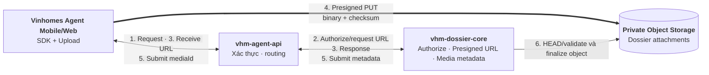
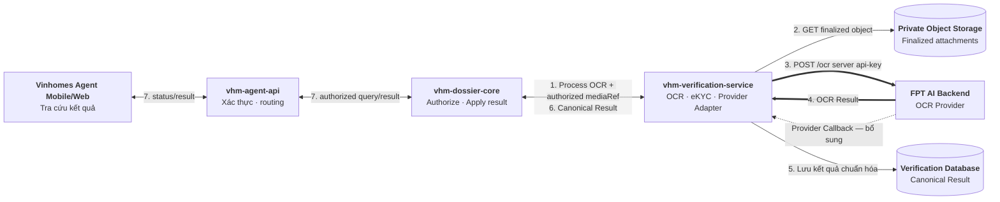
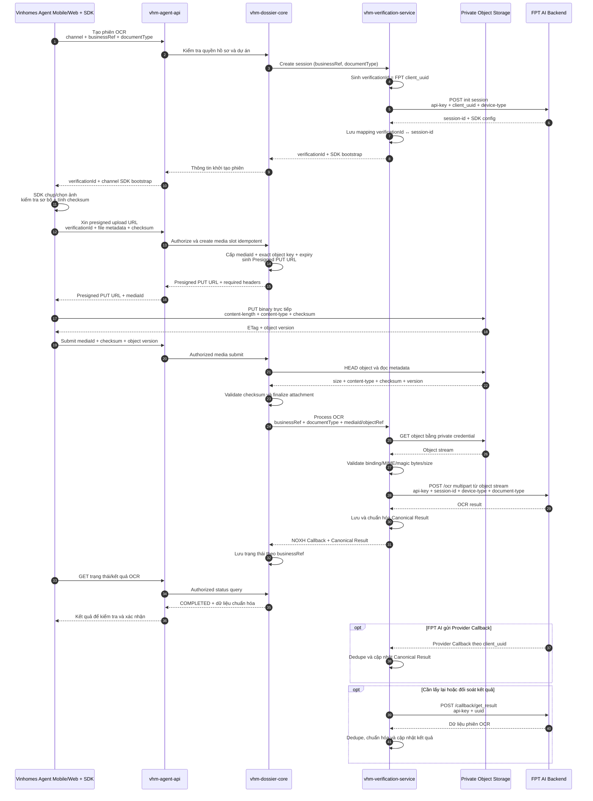
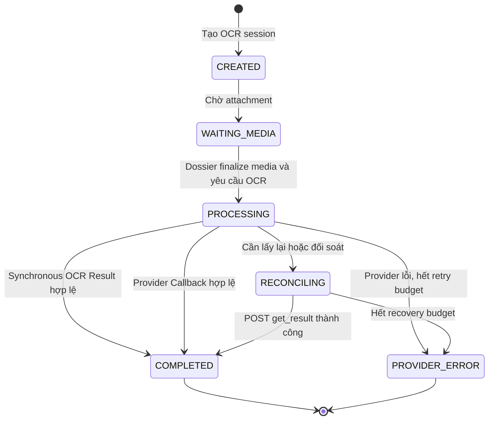
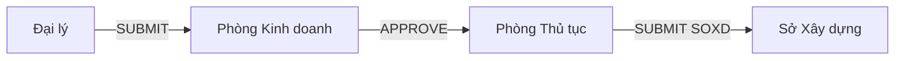
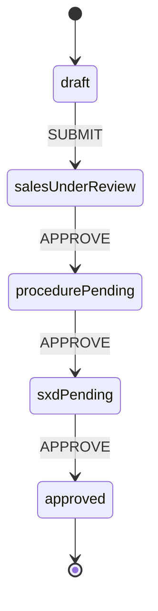
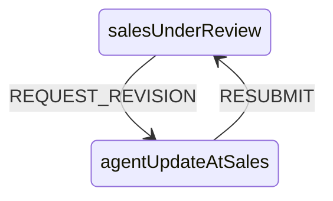
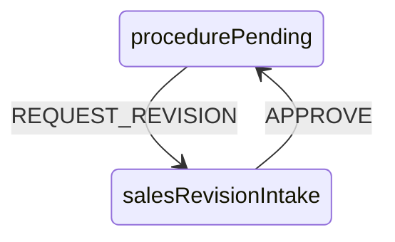
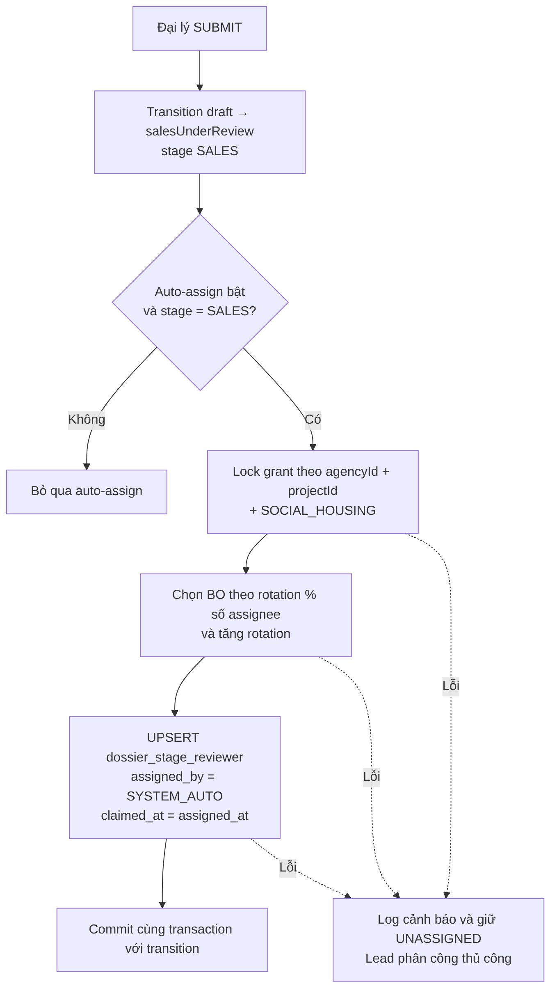
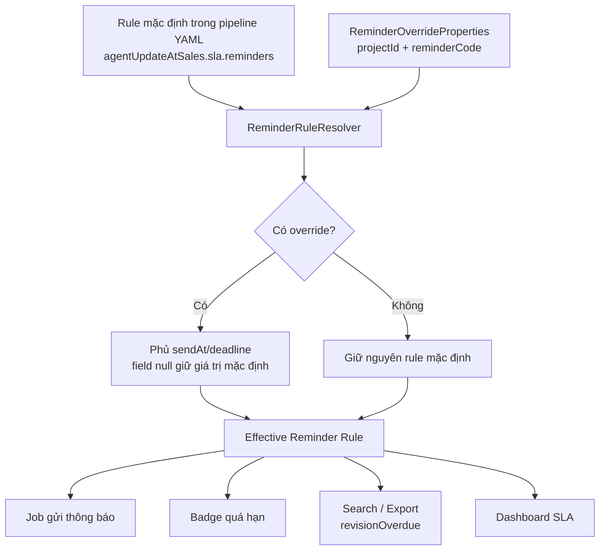

# Nhà ở Xã hội

# NOXH

 

## 1. Tổng quan hệ thống

### 1.1. Đặt vấn đề

Chức năng **Nhà ở xã hội** được xây dựng nhằm hỗ trợ quá trình **rà soát hồ sơ đăng ký nhà ở xã hội Happy Home** của Vinhomes theo hình thức trực tuyến.

Hiện nay, khách hàng có nhu cầu đăng ký **mua / thuê mua / thuê nhà ở xã hội** phải chuẩn bị nhiều loại giấy tờ theo quy định. Tuy nhiên, phần lớn khách hàng chưa quen với quy trình chuẩn bị hồ sơ, dẫn đến việc hồ sơ thường thiếu hoặc sai thông tin. Điều này khiến quá trình tiếp nhận và xử lý hồ sơ mất nhiều thời gian.

Trong bối cảnh Vingroup cam kết cung cấp **61.000 căn nhà ở xã hội vào năm 2026 và 500.000 căn vào năm 2030**, số lượng hồ sơ đăng ký dự kiến sẽ rất lớn. Nếu tiếp tục quản lý thủ công, **Phòng Quản lý đại lý** sẽ gặp khó khăn trong việc:

- Tiếp nhận và kiểm tra hồ sơ
- Thống kê và theo dõi trạng thái hồ sơ
- Quản lý tiến độ xử lý hồ sơ của khách hàng

Do đó, cần xây dựng một hệ thống hỗ trợ **số hóa quá trình rà soát hồ sơ nhà ở xã hội**, giúp nâng cao hiệu quả xử lý và cải thiện trải nghiệm của khách hàng.

### 1.2. Mục tiêu

#### 1.2.1. Yêu cầu chức năng

- Tạo mới và quản lý hồ sơ đăng ký mua Nhà ở Xã hội (NOXH) trên ứng dụng Agent cho Đại lý.
- Phân quyền đại lý theo dự án.
- Phê duyệt hồ sơ NOXH trên ứng dụng Agent cho Phòng Thủ Tục và Phòng Kinh doanh:
    - Đại lý thực hiện khởi tạo hồ sơ đẩy hồ sơ vào hệ thống và khởi tạo 1 luồng duyệt mới
    - Đảm bảo thứ tự duyệt hồ sơ đúng với SRS
    - Đảm bảo đáp ứng được flow diagram định nghĩa trong SRS
-  Nhắc hẹn tự động đến đại lý theo rule cố định và phía BO cung cấp.
- Gửi thông báo nhắc hẹn tự động đến đại lý để bổ sung hồ sơ.
- Cấu hình và áp dụng checklist hồ sơ theo Dự án – Đối tượng khách hàng – Tỉnh/Thành trong quá trình quản lý hồ sơ NOXH:
    - CRDU nhiều mẫu checklist để có thể áp dụng cho từng dự án
- Thống kê và báo cáo danh sách hồ sơ đã được tạo.
- Điền tự động các biểu mẫu liên quan dựa trên dữ liệu hồ sơ sau khi hồ sơ được phê duyệt.

#### 1.2.2. Yêu cầu phi chức năng

- Hiệu năng
    - Yêu cầu tối thiểu 200 req/s, latency P95 \< 300ms 
    - Multi-layer caching để giảm tải database và external calls 
- Khả năng mở rộng
    - Hệ thống có thể scale ngang 
- Tính sẵn sàng
    - Đảm bảo uptime \>99.9% 
    - Graceful degradation khi external service không khả dụng — trả dữ liệu từ DB 
- Bảo mật
    - Rate limiting chống spam API 

## 2. Hướng tiếp cận

Liệt kê các** vấn đề về kỹ thuật **và hướng tiếp cận, đưa ra ưu nhược điểm (pros/cons) và phương án đề xuất.

### Vấn đề 1: Xử lý flow phê duyệt hồ sơ nhiều cấp

User case: Hồ sơ đăng ký mua NOXH từ Agent đăng ký trên hệ thống cần được đi qua các cấp phê duyệt hồ sơ như PKD/ PTT/ SXD

- Bảng so sánh Ưu/ Nhược điểm camunda 7 & 8:

| **Lựa chọn nền tảng BPMN** | **Hướng tiếp cận** | **Ưu điểm** | **Nhược điểm** | **Lựa chọn (Yes/No)** |
| --- | --- | --- | --- | --- |
| Camunda 7 | Sử dụng **Camunda 7 embedded engine** tích hợp trực tiếp vào ứng dụng backend (Spring Boot) để quản lý BPMN workflow duyệt hồ sơ | - Dễ triển khai và tích hợp với Spring Boot - Kiến trúc đơn giản, ít thành phần hệ thống - Dễ debug và phát triển - Phù hợp workflow approval vừa và nhỏ | - Khả năng scale hạn chế khi số lượng workflow rất lớn - Khi trển khai deploy trên K8s gặp nhiều vấn đề khi chạy nhiều Pods và dễ **failed** **test failover** - Cách định nghĩ BPMN và implement trong code của 7 và 8 khác nhau nên sau migrate từ 7 lên 8 sẽ phải làm lại. | **No** |
| Camunda 8 | Sử dụng **Zeebe workflow engine** theo kiến trúc distributed, worker service xử lý các task trong BPMN | - Có 2 mode sử dụng là cloud-native/ Self-Managed - Hiệu năng cao, xử lý được lượng workflow lớn - Phù hợp kiến trúc microservice - Hỗ trợ Authen Keycloack, Message event | - Setup phức tạp (Zeebe, Gateway, Elasticsearch, Opersate, Tasklist) - ở mode PROD sẽ cần license cho Opersate/ Tasklist - Khó debug hơn Camunda 7 - Không embed trực tiếp vào Spring Boot | **No** |

### Vấn đề 2: Quản lý phân quyền dự án với Agent

- User case: BO sẽ thực hiện phân quyền dự án được đánh dấu là NOXH với agent đủ điều kiện tạo hồ sơ đăng ký NOXH
- Yêu cầu: Phần quyền theo Agent và dự án đảm bảo chỉ nhưng Agent có quyền mới được CRUD hồ sơ liên quan đến dự án được UQ

| **Hướng tiếp cận** | **Ưu điểm** | **Nhược điểm** | **Lựa chọn (Yes/No)** |
| --- | --- | --- | --- |
| **RBAC (Role-Based Access Control)** – Phân quyền theo vai trò Agent (VD: Agent\_NOXH\_ProjectA) | Đơn giản, dễ hiểu; Dễ audit; Gán/thu hồi quyền nhanh; Phù hợp khi số lượng role cố định | Không linh hoạt khi cần phân quyền theo từng dự án cụ thể; Số lượng role tăng nhanh theo dự án | **No** |
| **Permission Table (DB-level)** – Bảng `agent_project_permission` lưu quan hệ Agent ↔ Project ↔ Permission | Linh hoạt cao, BO tự cấu hình qua UI; Dễ audit lịch sử phân quyền; Kiểm tra realtime tại API layer | Cần query DB mỗi request (cần cache); Thiết kế schema phức tạp hơn; Cần UI quản lý phân quyền riêng | **Yes** |

### Vấn đề 3: Xử lý upload ảnh, tài liệu đính kèm

- User case: Khi Agent thực hiện tạo mới Khách Hàng, Tạo mới hồ sơ đăng ký mua NOXH cần upload CCCD trước/ sau, và tài liệu đính kèm khi tạo lập Hồ Sơ.
- Yêu cầu tốc độ upload và đảm bảo chỉ agent nào được UQ tạo hồ sơ cho dự án mới xem được file tài liệu đính kèm liên quan đến khách hàng và hồ sơ đăng ký.

| **Hướng tiếp cận** | **Ưu điểm** | **Nhược điểm** | **Lựa chọn (Yes/No)** |
| --- | --- | --- | --- |
| **Presigned URL** – Client upload thẳng lên S3 | Upload nhanh, không qua server; Giảm tải băng thông; URL có TTL an toàn; Scale tốt | Cần server cấp URL trước; Khó kiểm soát nội dung file; Cần validate quyền agent trước khi cấp | **Yes** |
| **Upload qua Backend Server** – Server nhận file rồi đẩy lên S3 | Kiểm soát nội dung/định dạng tập trung; Dễ gắn metadata (agentId, projectId) | Chậm hơn (qua 2 bước); Tốn băng thông server; Server dễ thành bottleneck khi tải cao | **No** |

### Vấn đề 4: Xử lý thông báo nhắc hẹn

- User case: Gửi thông báo nhắc hẹn tới Agent theo rule của BO hoặc nhắc nhở cập nhật hồ sơ
- Yêu cầu: Gửi thông báo đến Agent vào thời gian T+6 và T+18. Nhắc hẹn 1 lần duy nhất vào 9h sáng ngày nhắc hẹn.

| **Hướng tiếp cận** | **Ưu điểm** | **Nhược điểm** | **Lựa chọn (Yes/No)** |
| --- | --- | --- | --- |
| **Spring Scheduler → Kafka Message → Consumer Service xử lý** – Scheduler trigger lúc 9h, publish event `REMINDER_T6` / `REMINDER_T18` vào Kafka topic, Notification Service consume và gửi thông báo | Decoupled hoàn toàn; Retry tự động nếu consumer fail; Không mất message khi service down; Scale consumer độc lập; Dễ audit message history; Phù hợp hệ thống nhiều service | Phức tạp hơn, cần maintain Kafka; Latency nhỏ do qua broker; Cần xử lý idempotent ở consumer tránh gửi 2 lần | **Yes** |
| **Spring Scheduler → Direct API Call tới Notification Service** – Scheduler gọi thẳng REST/gRPC sang Notification Service lúc 9h để xử lý | Đơn giản, ít component; Dễ debug, trace log trực tiếp; Phù hợp hệ thống nhỏ hoặc MVP | Tight coupling giữa scheduler và notification service; Nếu Notification Service down → mất thông báo; Không có retry tự động; Scheduler phải xử lý timeout/error | **No** |

### Vấn đề 5: Quản lý bộ biểu mẫu hồ sơ đăng ký NOXH

Uses case: Trên Vinhome Agent Admin cần tạo danh sách biểu mẫu giấy tờ và bộ biểu mẫu cho từng dự án, đối tượng áp dụng và, tên nhóm đối tượng đăng ký. Múc đích khi Đại Lý thực hiện đăng ký hồ sơ NOXH sẽ load lên bộ biểu mẫu hồ sơ tương ứng với dự án.

| **Hướng tiếp cận** | **Ưu điểm** | **Nhược điểm** | **Lựa chọn (Yes/No)** |
| --- | --- | --- | --- |
| Sử dụng lại chức năng “Biểu mẫu” và “Bộ Biểu mẫu” trên trang Thủ tục Online | - Đã có sẵn UI CRUD không cần impliment mới | - Hiện tại biểu mẫu đang gắn cứng với từ Dự Án → Mỗi dự án NOXH lại phải tạo lại danh sách các biểu mẫu tương ứng - Bộ Biểu mẫu chưa có thuộc tính setting cho “Nhóm Đối Tượng Đăng Ký”, “Đối tượng áp dụng”, đang required một số field không cần thiết cho context NOXH - Mục tạo Biểu Mẫu/ Bộ Biểu Mẫu đang ở trang TTOL nên cần access TTOL để CRUD | **No** |
| Xây dựng mới chức năng “Biểu mẫu” và “Bộ Biểu mẫu” trên Vinhome Agent | - Thiết kế dynamic để sau này có thể sử dụng chung cho nhưng biểu mẫu khác cần tạo hồ sơ từ agent  - Sử dụng properties cho “Đối tượng áp dụng” và “Nhóm đối tượng đk” để linh hoạt trong việc query + sử dụng cho những hồ sơ về sau - Impliment trong service vhm-definetion-center-service quản lý tập trung | - Tốn thời gian impliment | **Yes** |
|  |  |  |  |

### Vấn đề 6: Lựa chọn nền tảng tích hợp OCR tập trung

**User case:** Đại lý chụp hoặc upload giấy tờ trên Agent để hệ thống OCR, phân loại và gợi ý dữ liệu khi tạo hồ sơ NOXH.

**Loại tài liệu dự kiến:**

- CCCD mặt trước/sau.
- Giấy đăng ký kết hôn.
- Bản sao có chứng thực giấy chứng nhận hộ gia đình nghèo/cận nghèo.
- Các giấy tờ khác trong checklist hồ sơ NOXH khi có mẫu OCR tương ứng.

`vhm-verification-service` chỉ đọc, phân loại và trích xuất dữ liệu tài liệu; kết quả luôn cần Đại lý kiểm tra trước khi cập nhật hồ sơ.

**Các use case OCR:**

1. **OCR CCCD:** Đại lý chụp đủ mặt trước/sau. Hệ thống trích xuất số định danh, họ tên, ngày sinh, giới tính, quốc tịch, quê quán, nơi thường trú, ngày cấp/hết hạn và cảnh báo chất lượng hoặc hai mặt không khớp.
2. **OCR giấy đăng ký kết hôn:** Đại lý upload đầy đủ các trang. Hệ thống trích xuất số giấy chứng nhận, thông tin hai bên, ngày đăng ký, nơi đăng ký và thông tin người ký/cơ quan cấp nếu mẫu tài liệu hỗ trợ.
3. **OCR giấy chứng nhận hộ nghèo/cận nghèo:** Đại lý upload bản sao có chứng thực. Hệ thống trích xuất số văn bản/chứng thực, chủ hộ, địa chỉ, loại xác nhận, thời gian hiệu lực, cơ quan cấp và ngày cấp.
4. **OCR giấy tờ khác:** NOXH truyền `documentType`; `vhm-verification-service` chỉ xử lý khi đã có model/template và schema kết quả tương ứng. Tài liệu chưa được hỗ trợ hoặc có confidence thấp được chuyển sang nhập liệu/kiểm tra thủ công.

OCR chỉ hỗ trợ số hóa và kiểm tra dữ liệu theo khả năng của model. Việc xác nhận bản sao có giá trị pháp lý, giấy tờ còn hiệu lực hoặc hồ sơ đáp ứng điều kiện NOXH vẫn do nghiệp vụ và người duyệt quyết định.

**Bối cảnh:** Nếu `vhm-dossier-core` tự tích hợp FPT AI, toàn bộ logic quản lý credential, session, callback, retry, error mapping, audit và dữ liệu định danh sẽ nằm trong service nghiệp vụ NOXH và phụ thuộc trực tiếp vào contract của provider.

| **Hướng tiếp cận** | **Ưu điểm** | **Nhược điểm** | **Lựa chọn (Yes/No)** |
| --- | --- | --- | --- |
| **`vhm-dossier-core` tích hợp trực tiếp FPT AI** | Ít thành phần; thời gian triển khai ban đầu ngắn | `vhm-dossier-core` phải xử lý credential, callback, retry và mã lỗi riêng của FPT AI; thay đổi provider tác động trực tiếp nghiệp vụ NOXH; tăng rủi ro dữ liệu định danh trong service hồ sơ | **No** |
| **`vhm-verification-service`** (vai trò Verification Provider Proxy) | `vhm-dossier-core` chỉ cần tạo phiên, cung cấp media đã finalize và nhận kết quả; toàn bộ provider integration, credential, session, callback, retry, quota, lưu trữ kết quả, bảo mật, audit và chuẩn hóa được xử lý tại service; thay provider không yêu cầu sửa nghiệp vụ NOXH | Thêm một service và một network hop; `vhm-verification-service` phải đáp ứng HA/SLA vì là dependency của NOXH | **Yes** |

**Phương án chọn:** Sử dụng **`vhm-verification-service`** làm lớp tích hợp tập trung cho cả OCR và eKYC, với vai trò kiến trúc là Verification Provider Proxy. `vhm-dossier-core` kiểm tra quyền nghiệp vụ, tạo phiên và nhận Canonical Result; không gọi trực tiếp hoặc phụ thuộc contract của FPT AI.

**Luồng 1 — Upload tài liệu:**



**Luồng 2 — Xử lý OCR:**



Giải pháp này tách nghiệp vụ NOXH khỏi chi tiết tích hợp FPT AI. Chi phí của một service và một network hop được chấp nhận để credential, quota, callback, provider result, audit và vận hành provider được quản lý tập trung tại `vhm-verification-service`; attachment upload vẫn thuộc `vhm-dossier-core`.

**Phân định ownership:**

| **Năng lực** | **`vhm-dossier-core`** | **`vhm-verification-service`** |
| --- | --- | --- |
| Nghiệp vụ | Kiểm tra quyền trên hồ sơ/dự án; gửi `businessRef`; quyết định sử dụng kết quả | Không xử lý rule nghiệp vụ NOXH |
| Upload tài liệu | Sở hữu `mediaId`, object key, Presigned URL, attachment metadata, finalize và retention; binary nằm trong Private Object Storage | Không cấp Presigned URL và không sở hữu attachment; chỉ đọc object đã finalize khi có yêu cầu OCR được ủy quyền |
| API tích hợp | Gọi API nội bộ `create/process/status/result` với `businessRef`, `documentType` và authorized `mediaRef` | Quản lý provider API contract, model/template và credential FPT AI |
| Phiên xử lý | Không quản lý state machine OCR | Sinh `verificationId` và sử dụng làm `client_uuid` khi gọi FPT AI; quản lý session, attempt, timeout, idempotency và trạng thái |
| Kết quả | Chỉ nhận Canonical Result theo loại tài liệu | Nhận synchronous result từ FPT AI Backend; Provider Callback và Result API dùng để lấy/đối soát bổ sung; chuẩn hóa field, confidence, warning và error code |
| Dữ liệu | Database lưu attachment metadata/reference, checksum, object version và retention; không lưu binary hoặc raw provider payload | Database chỉ lưu verification session, Canonical Result và provider metadata tối thiểu; không lưu binary hoặc sở hữu attachment reference lâu dài |
| Resilience | Không retry trực tiếp với FPT AI | Retry, reconciliation, circuit breaker, rate limit và quota |
| Audit/Monitoring | Chỉ audit việc áp dụng kết quả vào nghiệp vụ | Audit toàn bộ vòng đời OCR và vận hành provider |

Nhờ đó, `vhm-dossier-core` không phải triển khai provider adapter, callback FPT AI, database verification, retry, security và monitoring cho provider.

**Trách nhiệm của `vhm-verification-service`:**

- Quản lý phiên OCR; sinh `verificationId` dùng làm `client_uuid` của FPT AI và liên kết với `businessRef` của NOXH.
- Chỉ nhận `mediaId/mediaRef` đã được `vhm-dossier-core` authorize và finalize; không cấp Presigned URL, không nhận object path từ Mobile/Web và không quản lý attachment nghiệp vụ.
- Đọc object từ Private Object Storage bằng quyền read-only giới hạn theo exact object; kiểm tra lại binding, MIME/magic bytes và kích thước trước khi gửi provider.
- Nhận `documentType`, chọn model/template OCR tương ứng và chuẩn hóa kết quả theo schema của từng loại tài liệu.
- Là điểm tích hợp duy nhất với FPT AI: giữ API key, khởi tạo provider session, forward request/response, nhận Provider Callback và gọi Result API khi cần đối soát.
- Ghi nhận và chuẩn hóa synchronous result từ FPT AI Backend mà không bắt buộc chờ Provider Callback.
- Xử lý Provider Callback idempotent; cơ chế xác thực callback phải chốt theo contract FPT AI (custom header/signature và network allowlist).
- Gửi NOXH Callback đã chuẩn hóa, có xác thực và idempotency về `vhm-dossier-core` khi phiên hoàn tất.
- Chuẩn hóa payload và error code của FPT AI thành contract nội bộ ổn định, không trả raw provider payload cho NOXH.
- Quản lý retry, timeout, circuit breaker, quota/rate limit và cô lập sự cố provider khỏi `vhm-dossier-core`.
- Áp dụng kiểm soát truy cập, mã hóa dữ liệu nhạy cảm, masking, audit và chính sách lưu/xóa verification session, Canonical Result và provider payload tối thiểu.
- Cung cấp API để NOXH tạo phiên, yêu cầu xử lý media đã finalize, tra cứu trạng thái và lấy kết quả OCR.

**Trách nhiệm tối thiểu của `vhm-dossier-core`:**

- Kiểm tra Đại lý có quyền thao tác hồ sơ/dự án.
- Sinh `mediaId` và exact object key, cấp Presigned PUT URL sau authorization, lưu attachment metadata và finalize object sau khi HEAD/validate checksum/version thành công.
- Quản lý orphan cleanup, retention và quyền truy cập attachment theo hồ sơ/dự án.
- Gửi `businessRef=dossierId`, `documentType` và authorized `mediaRef` khi yêu cầu `vhm-verification-service` xử lý; không truyền object path do client cung cấp.
- Lấy Canonical Result từ `vhm-verification-service` và bind lại với đúng hồ sơ/media trước khi sử dụng.
- Cho Đại lý xác nhận dữ liệu trước khi cập nhật khách hàng hoặc hồ sơ NOXH.

**Cách hoạt động:**



**Luồng capture/upload tài liệu:**

- Vinhomes Agent Mobile/Web luôn tạo phiên OCR trước khi chụp hoặc upload. Mỗi phiên chỉ thuộc một channel; mọi request media phải bind với `verificationId`, caller, channel, `businessRef`, `documentType`, attempt và môi trường.
- Mobile SDK/Web SDK chụp hoặc chọn ảnh và trả file/Blob cho client. Cả ảnh chụp và file có sẵn đều dùng chung cơ chế Presigned URL đã chọn tại Vấn đề 3.
- Mobile/Web gọi `vhm-agent-api` để xin upload URL. `vhm-agent-api` chỉ xác thực/routing; `vhm-dossier-core` authorize hồ sơ, sinh `mediaId`/exact object key và trả Presigned URL. `vhm-verification-service` không tham gia luồng cấp URL.
- Presigned URL phải có TTL ngắn và bind exact object key, method, content type, content length, checksum, `mediaId`, `verificationId` và attempt. Client không có quyền list/read object hoặc tự chọn object key.
- Sau upload, Mobile/Web submit `mediaId`, checksum và object version qua `vhm-agent-api`. `vhm-dossier-core` kiểm tra lại quyền, HEAD/validate object rồi chuyển attachment sang `FINALIZED`; chỉ sau đó mới gọi `vhm-verification-service` với authorized `mediaRef` để xử lý OCR.
- Chỉ cho phép loại file, dung lượng, số trang/mặt và độ phân giải đã cấu hình theo từng `documentType`; PDF hoặc tài liệu nhiều trang chỉ được bật khi model/template và FPT AI contract tương ứng đã được xác nhận.
- Mobile SDK và Web SDK không gọi thẳng FPT AI Backend hoặc `vhm-verification-service`, không nhận provider API key và không gửi binary qua `vhm-agent-api`.
- `vhm-verification-service` không tin object path từ client. Service chỉ đọc exact object do `vhm-dossier-core` ủy quyền, kiểm tra lại binding phiên, MIME/magic bytes, kích thước, thứ tự mặt/trang và trạng thái attempt trước khi forward. Với CCCD gửi từng mặt, mặt trước phải được xử lý trước mặt sau theo contract `side-type` của FPT AI.
- Provider `api-key`, `session-id`, `device-type` và `document-type` chỉ được `vhm-verification-service` inject ở outbound request. Mobile/Web không nhìn thấy provider credential.
- Binary upload nằm trong Private Object Storage do `vhm-dossier-core` quản lý. Dossier database chỉ lưu protected object reference, checksum, object version, media metadata và thời hạn xóa; upload chưa finalize được orphan-cleanup theo TTL, object đã finalize được purge theo retention policy.
- Không retry tự động request OCR sau khi `vhm-verification-service` đã bắt đầu stream media sang FPT AI. Retry nghiệp vụ tạo attempt/run mới hoặc tái sử dụng object đã validate chỉ khi provider contract xác nhận idempotency, để tránh tính phí và kết quả trùng.
- Flow này yêu cầu Mobile SDK/Web SDK cung cấp được file/Blob sau bước capture. Nếu phiên bản SDK chỉ tự gửi media vào endpoint FPT AI và không expose dữ liệu capture, phải xác nhận lại capability với FPT AI trước khi implement.

**Cơ chế trả kết quả:**

- **Synchronous OCR Result — happy path:** Sau khi đọc object đã validate, `vhm-verification-service` gọi FPT AI, lưu và chuẩn hóa response rồi gửi NOXH Callback. Mobile/Web lấy trạng thái/kết quả qua `vhm-agent-api` và `vhm-dossier-core`; không nhận provider response trực tiếp từ SDK.
- **Provider Callback — supplemental path:** FPT AI có thể gửi dữ liệu phiên tới callback URL đã cấu hình. `vhm-verification-service` tiếp nhận theo `client_uuid`, dedupe và cập nhật Canonical Result.
- **Provider Result API — recovery/reconciliation:** Khi cần lấy lại hoặc đối soát dữ liệu, `vhm-verification-service` gọi `POST /callback/get_result` với header `api-key` và `uuid`. Mobile/Web và `vhm-dossier-core` không gọi API FPT AI trực tiếp.
- **NOXH Callback:** Sau khi có kết quả hợp lệ từ bất kỳ nguồn nào, `vhm-verification-service` callback Canonical Result về `vhm-dossier-core`. Nếu NOXH Callback thất lạc, `vhm-dossier-core` gọi API trạng thái/kết quả của `vhm-verification-service`.
- Không tự động retry request OCR chứa ảnh sau khi body đã được gửi, trừ khi FPT AI xác nhận idempotency. Chỉ retry lỗi kết nối trước khi gửi body và các tác vụ callback/result reconciliation theo bounded policy.



`vhm-verification-service` chịu trách nhiệm capability OCR/eKYC và dữ liệu verification. Quyết định sử dụng kết quả, cập nhật khách hàng và phê duyệt hồ sơ NOXH vẫn thuộc `vhm-dossier-core`.

### Vấn đề 8: Quản lý Pipline/ Phase/ Stage

Uses case: Từ bước tạo mới hồ sơ ĐK NOXH đến bước phê duyệt và hoàn tất hồ sơ đăng ký cần qua nhiều cấp phê duyệt. Mỗi step cần có một số công việc cần phải thực hiện

Yêu cầu: Quản lý được hồ sơ đăng ký khi qua từng Phase

| **Hướng tiếp cận** | **Ưu điểm** | **Nhược điểm** | **Lựa chọn (Yes/No)** |
| --- | --- | --- | --- |
| Sử dụng phối hợp các service: - Definition Center Service → Định nghĩa pipeline/phase/stage - Pipeline orchestration → quản lý từng pipeline state, pipeline state task - Camunda 8 → Quản lý next Phase trong pipeline sẽ là gì dự vào từ ĐK định nghĩa trong BPMN - Online Procedure → Quản lý thông tin hồ sơ | - Generic sau này có thể tận dụng DC và Pipline-Orchestrator để định nghĩa những nghiệp vụ khác | - Đối với nghiệp vụ NOXH qua từng Phase đang chỉ approve/reject/update trên hồ sơ không cần thực hiện danh sách task list - Tạo ra nhiều pipeline cho nhiều bộ hồ sơ và nhiều loại đối tượng khách hàng ĐK | Yes |
| Sử dụng phối hợp các service: - Camunda 8 → Quản lý pipeline và Phase của Hồ Sơ - Online Procedure → Quản lý thông tin hồ sơ, mẫu hồ sơ theo từng Đối Tượng ĐK và Dự Án | - Impliment nhanh gọn, tập trung quản lý pipeline trên camunda - Giảm latency call giữa các service - 1 pipeline phê duyệt áp dụng cho nhiều mẫu hồ sơ | - Khi thay đổi pipeline - Chỉ tập trung quản lý pipeline phê duyệt của hồ sơ không quản lý mẫu hồ sơ cho theo từ dự án và đối tượng KH ĐK | No |
|  |  |  |  |

- Dataflow cho hợp sử dụng DC & Pipeline

### Vấn đề 9: Export file hợp đồng từ thông tin hồ sơ NOXH đã phê duyệt

User case: Sau khi hợp đồng được các cấp PKD, PTT, SXD phê duyệt thì đại lý cần in đơn đăng ký mua NOXH theo template mẫu và data trên hồ sơ đăng ký để cho người mua ký.

Yêu cầu: Từ mẫu template hợp đồng và thông tin hồ sơ trên hệ thống xuất file PDF cho đại lý để thực hiện lý với khách hàng

| **Hướng tiếp cận** | **Ưu điểm** | **Nhược điểm** | **Lựa chọn (Yes/No)** |
| --- | --- | --- | --- |
| Sử dụng service TTOL để xuất file: - Phía TTOL expose đầu API để call truyền data dạng Map\<String, Object\>, template, định dạng file output sau khi xử lý trả về file với định dạng tương ứng | - Đã có sẵn login export file theo template word, chỉ cần expose đầu API cho service sử dụng call | - Dependency với service TTOL  - Cần expose thêm 1 đầu API internal để call service-to-service - TTOL đang không hỗ trợ expose API cho phía service call qua xuất file | **No** |
| Impliment lại export hợp đồng trên servive java: - Lựa chọn thư viện để impliment     - Syncfusion | - Đã có sẵn license phía TTOL,     Syncfusion có hỗ trợ lib java | - Tốn thời gian impliment lại | **Yes** |

### Vấn đề 11: Authentication/ Authorization giữa hệ thống TTOL và Vinhome Agent

Usercase: Phòng TT muốn phê duyệt hồ sơ trên TTOL, PKD/Đại Lý khởi tạo và PD trên VinhomeAgent

Hiện tại: Phía TTOL đang Authen bằng jwt từ service TTOL .Net quản lý, phía Vinhome Agent đang authen bằng SSID

| **Hướng tiếp cận** | **Ưu điểm** | **Nhược điểm** | **Lựa chọn (Yes/No)** |
| --- | --- | --- | --- |
| Tạo mới service ttol-bff để validate jwt từ TTOL và Authen/ Author trước khi call vào service core | - Không impact tới service TTOL hiện tại | - Cần impliment service bff với, TTOL BE cần expose api trả về public key để BFF validate jwt | **No** |
| Sử dụng Agent BFF để auth jwt từ thủ tục online |  |  | **Yes** |

**Component diagram**

### Vấn đề 13: Quản lý cấu hình ngày nghỉ lễ & Ngày làm việc bù

**User case:** Hệ thống cần xác định ngày nghỉ lễ và ngày làm việc bù để tính toán ngày T (T+6, T+18) cho job thông báo nhắc hẹn ở Vấn đề 4, đồng thời phục vụ tính toán SLA phê duyệt hồ sơ NOXH. Admin (BO) cần cấu hình thủ công trên UI 2 loại ngày đặc biệt:

1. **Ngày nghỉ lễ (HOLIDAY)**: Tết Dương lịch, Tết Nguyên Đán, 30/4, 1/5, 2/9... và các đợt nghỉ riêng theo phòng ban/nhân viên (team building, nghỉ riêng dự án...)
2. **Ngày làm việc bù (WORKING\_DAY)**: Một số T7/CN trong năm mà một số phòng ban hoặc nhân viên vẫn đi làm (vd: làm bù để nghỉ lễ dài ngày, ca cuối tuần của phòng vận hành...)

**Yêu cầu:**

- Admin tạo/sửa/xóa cấu hình ngày đặc biệt trên UI, không phụ thuộc hệ thống bên thứ 3, không cần cron job
- 1 cấu hình có thể gồm 1 ngày hoặc nhiều ngày
- Hỗ trợ đợt nghỉ vắt năm (vd: Tết Dương từ 30/12/2026 đến 02/01/2027)
- Phân loại scope áp dụng: toàn công ty / phòng ban / nhân viên cụ thể
- Hỗ trợ 4 loại `day_type`:
    - `FULL_DAY`: cả ngày
    - `HALF_DAY_AM`: nửa ngày sáng
    - `HALF_DAY_PM`: nửa ngày chiều
    - `CUSTOM_HOURS`: cấu hình một hoặc nhiều khoảng giờ cụ thể trong ngày (vd: làm sáng 8h-12h + chiều 14h-17h, hoặc nghỉ trưa từ 11h30-13h30)
- **Working day có ưu tiên cao hơn Holiday**: Nếu 1 ngày vừa là holiday vừa được cấu hình là working day cho 1 scope cụ thể → scope đó vẫn đi làm
- Query nhanh cho use case: "ngày X có phải làm việc/nghỉ không" và "list cấu hình trong năm Y"

| **Hướng tiếp cận** | **Ưu điểm** | **Nhược điểm** | **Lựa chọn (Yes/No)** |
| --- | --- | --- | --- |
| **2 bảng riêng** `holidays` + `working_days` – Tách hoàn toàn 2 use case | Schema rõ ràng, không nhầm lẫn nghiệp vụ | Duplicate logic scope/dates; Code CRUD lặp lại 2 lần; Khó query tổng hợp lịch của 1 nhân viên | No |
| **1 bảng **`special_days` với field `type` (`HOLIDAY` / `WORKING_DAY`) + scope gộp JSONB | Schema gọn, reuse logic CRUD; Dễ query tổng hợp; JSONB linh hoạt mở rộng metadata | Cần filter `type` ở mọi query; Query scope qua JSONB operator | Yes |
| **Lưu row-per-date** – Mỗi ngày = 1 record | Query check 1 ngày native, đơn giản | Schema phức tạp; Tốn nhiều record khi đợt Tết 7 ngày = 7 rows | No |

**Phương án chọn:** 1 bảng `special_days` với JSONB `dates` + `years` để cân bằng simplicity và flexibility.

### Vấn đề 14: Xây dựng luồng phê duyệt qua các phòng ban trong vòng đời của hồ sơ nhà ở xã hội

**User case: **Một hồ sơ đăng ký mua nhà ở xã hội phải trải qua nhiều bước thẩm định và phê duyệt từ các phòng ban khác nhau trước khi được phê duyệt cuối cùng.

Ví dụ:

1. Đại lý

- Tạo mới hồ sơ nhà ở xã hội
- Cập nhật thông tin hồ sơ
- Upload chứng từ
- Bổ sung hồ sơ theo yêu cầu từ Phòng Kinh doanh hoặc Phòng Thủ tục
- Theo dõi trạng thái xử lý hồ sơ

2\. Phòng Kinh doanh (KD)

- Phê duyệt chứng từ
- Phê duyệt/ từ chối hồ sơ
- Yêu cầu đại lý bổ sung hồ sơ
- Xác nhận đã nhận bản cứng giấy tờ của hồ sơ

 3. Phòng Thủ tục (TT)

- Kiểm tra và phê duyệt chứng từ
- Phê duyệt hoặc từ chối hồ sơ
- Yêu cầu Phòng Kinh doanh bổ sung thông tin
- Gửi hồ sơ tới Sở Xây dựng
- Nhận kết quả từ Sở Xây dựng
- Cập nhật kết quả phê duyệt cuối cùng

**Yêu cầu:**

**Yêu cầu 1: Quản lý trạng thái hồ sơ**

Hệ thống phải quản lý đầy đủ trạng thái của hồ sơ trong toàn bộ vòng đời xử lý.

```
DRAFT
SUBMITTED
UNDER_REVIEW,
ADD_INFO_REQUESTED,
APPROVED,
REJECTED
```

**Yêu cầu 2: Luân chuyển hồ sơ giữa các phòng ban**

Hệ thống phải tự động xác định đơn vị xử lý tiếp theo sau mỗi thao tác.



**Yêu cầu 3: Bổ sung hồ sơ nhiều vòng**

Trong quá trình xử lý:

- Phòng KD có thể yêu cầu Đại lý bổ sung hồ sơ
- Phòng TT có thể yêu cầu Phòng KD bổ sung thông tin
- Một hồ sơ có thể trải qua nhiều vòng bổ sung

**Yêu cầu 4: Quản lý chứng từ theo từng bước**

Mỗi phòng ban có thể:

- Phê duyệt chứng từ
- Từ chối chứng từ
- Yêu cầu bổ sung chứng từ

Việc phê duyệt chứng từ phải độc lập với việc phê duyệt hồ sơ.

**Yêu cầu 5: Audit Trail**

Hệ thống phải ghi nhận đầy đủ:

- Ai thực hiện
- Vai trò thực hiện
- Hành động thực hiện
- Thời điểm thực hiện
- Nội dung ghi chú

**Hướng tiếp cận giải quyết**

| **Hướng tiếp cận** | **Ưu điểm** | **Nhược điểm** | **Lựa chọn (Yes/No)** |
| --- | --- | --- | --- |
| State machine | Đơn giải dễ phát triểnHiệu năng tốt hơn vì không có BPMN parsing | Khi có nhiều cấp phong ban sẽ khó bảo trìDynamic workflow rất khó | Yes |
| Workflow engine | Hỗ trợ nhiều luồng phê duyệt phức tạpBusiness thay đổi không cần code | Learning curve caoVận hành phức tạpOverkill nếu quy trình ĐL → KD → TT | No |

Design luồng phê duyệt hồ sơ:

```
# Social Housing Standard Pipeline v1 
pipelineCode: socialHousingStandard
pipelineVersion: 1
productCode: SOCIAL_HOUSING
initialState: draft

roles:
  - { code: APPLICANT_AGENT, labelVi: "Nhân viên tạo hồ sơ" }
  - { code: PKD,             labelVi: "Phồng Kinh doanh" }
  - { code: PKD_LEAD,        labelVi: "Lead P. Kinh doanh" }
  - { code: PTT,             labelVi: "Phòng Thủ tục" }
  - { code: PTT_LEAD,        labelVi: "Lead P. Thủ tục" }

stages:
  - { code: SALES,     labelVi: "P. Kinh doanh" }
  - { code: PROCEDURE, labelVi: "P. Thủ tục" }
  - { code: SXD,       labelVi: "Sở xây dựng (ngoài, PTT ghi nhận thay)" }

states:
  # ============================================================
  # 1. draft 
  # ============================================================
  - code: draft
    labelVi: "Bản nháp"
    stage: null
    dossierStatus: DRAFT
    isEditable: true
    isDeletable: true
    terminal: false
    editableByRoles: [APPLICANT_AGENT]
    transitions:
      - { action: UPDATE,   toState: draft,            requiredRoles: [APPLICANT_AGENT], ownershipRule: OWNER, requiresComment: false }
      - { action: SUBMIT,   toState: salesUnderReview, requiredRoles: [APPLICANT_AGENT], ownershipRule: OWNER, requiresComment: false }

  # ============================================================
  # 2. salesUnderReview 
  # ============================================================
  - code: salesUnderReview
    labelVi: "P. Kinh doanh đang duyệt"
    stage: SALES
    dossierStatus: UNDER_REVIEW
    uiBadgeColor: "#F59E0B"
    isEditable: false
    isDeletable: false
    terminal: false

    transitions:
      - { action: ASSIGN,            toState: salesUnderReview,    requiredRoles: [PKD_LEAD], ownershipRule: NONE,    requiresComment: false }
      - { action: REASSIGN,          toState: salesUnderReview,    requiredRoles: [PKD_LEAD], ownershipRule: NONE,    requiresComment: false }
      - { action: CLAIM,             toState: salesUnderReview,    requiredRoles: [PKD_LEAD],           ownershipRule: NONE }
      - { action: ALLOCATE_UNIT,     toState: salesUnderReview,    requiredRoles: [PKD, PKD_LEAD],      ownershipRule: CLAIMER, requiresComment: false }
      - { action: APPROVE,           toState: procedurePending,    requiredRoles: [PKD, PKD_LEAD],      ownershipRule: CLAIMER, requiresComment: false }
      - { action: SUBMIT_HARDCOPY,             toState: salesUnderReview, requiredRoles: [APPLICANT_AGENT], ownershipRule: OWNER, requiresComment: false }
      - { action: CONFIRM_HARDCOPY_RECEIVED,   toState: salesUnderReview, requiredRoles: [PTT, PTT_LEAD, PKD, PKD_LEAD], ownershipRule: NONE, requiresComment: false }
      - { action: REQUEST_REVISION,  toState: agentUpdateAtSales,  requiredRoles: [PKD, PKD_LEAD],      ownershipRule: CLAIMER, requiresComment: false }
      - { action: REJECT,            toState: rejected,            requiredRoles: [PKD, PKD_LEAD],      ownershipRule: CLAIMER, requiresComment: false }

  # ============================================================
  # 4. agentUpdateAtSales
  # ============================================================
  - code: agentUpdateAtSales
    labelVi: "Bổ sung hồ sơ (KD yêu cầu)"
    stage: SALES
    dossierStatus: ADD_INFO_REQUESTED
    uiBadgeColor: "#EF4444"
    isEditable: true
    isDeletable: false
    terminal: false
    editableByRoles: [APPLICANT_AGENT]
    sla:
      reminders:
        - { code: REVISION_D6, atHoursAfterEntry: 144, recipients: [ OWNER ] }
        - { code: REVISION_D18, atHoursAfterEntry: 432, recipients: [OWNER] }
    transitions:
      - { action: UPDATE,   toState: agentUpdateAtSales, requiredRoles: [APPLICANT_AGENT], ownershipRule: OWNER, requiresComment: false }
      - { action: RESUBMIT, toState: salesUnderReview, requiredRoles: [APPLICANT_AGENT], ownershipRule: OWNER, requiresComment: false }

  # ============================================================
  # 5. procedurePending 
  # ============================================================
  - code: procedurePending
    labelVi: "Chờ P. Thủ tục"
    stage: PROCEDURE
    dossierStatus: UNDER_REVIEW
    uiBadgeColor: "#3B82F6"
    isEditable: false
    isDeletable: false
    terminal: false
    transitions:
      - { action: ASSIGN,           toState: procedurePending,        requiredRoles: [PTT, PTT_LEAD], ownershipRule: NONE,    requiresComment: false }
      - { action: REASSIGN,         toState: procedurePending,        requiredRoles: [PTT_LEAD], ownershipRule: NONE,    requiresComment: false }
      - { action: CLAIM,            toState: procedurePending,        requiredRoles: [PTT_LEAD],           ownershipRule: NONE }
      - { action: APPROVE,          toState: sxdPending,              requiredRoles: [PTT, PTT_LEAD],      ownershipRule: CLAIMER, requiresComment: false, cascadeReviewer: true }
      - { action: SUBMIT_HARDCOPY,             toState: procedurePending, requiredRoles: [APPLICANT_AGENT], ownershipRule: OWNER, requiresComment: false }
      - { action: CONFIRM_HARDCOPY_RECEIVED,   toState: procedurePending, requiredRoles: [PTT, PTT_LEAD, PKD, PKD_LEAD], ownershipRule: NONE, requiresComment: false }
      - { action: REQUEST_REVISION, toState: salesRevisionIntake,     requiredRoles: [PTT, PTT_LEAD],      ownershipRule: CLAIMER, requiresComment: false }
      - { action: REJECT,           toState: rejected,                requiredRoles: [PTT, PTT_LEAD],      ownershipRule: CLAIMER, requiresComment: false }
      - { action: RETURN_TO_SALES,  toState: salesUnderReview,        requiredRoles: [PTT, PTT_LEAD],      ownershipRule: CLAIMER, requiresComment: false }
      - { action: REVOKE_UNIT,      toState: rejected,                requiredRoles: [PKD, PKD_LEAD, PTT, PTT_LEAD], ownershipRule: NONE, requiresComment: false }
  
  # ============================================================
  # 6. salesRevisionIntake 
  # ============================================================
  - code: salesRevisionIntake
    labelVi: "KD tiếp nhận yêu cầu bổ sung"
    stage: SALES
    dossierStatus: UNDER_REVIEW
    uiBadgeColor: "#F97316"
    isEditable: false
    isDeletable: false
    terminal: false
    transitions:
      - { action: ASSIGN,           toState: salesRevisionIntake, requiredRoles: [PKD_LEAD], ownershipRule: NONE, requiresComment: false }
      - { action: REASSIGN,         toState: salesRevisionIntake, requiredRoles: [PKD_LEAD], ownershipRule: NONE, requiresComment: false }
      - { action: CLAIM,            toState: salesRevisionIntake, requiredRoles: [PKD_LEAD], ownershipRule: NONE, requiresComment: false }
      - { action: SUBMIT_HARDCOPY,             toState: salesRevisionIntake, requiredRoles: [APPLICANT_AGENT], ownershipRule: OWNER, requiresComment: false }
      - { action: CONFIRM_HARDCOPY_RECEIVED,   toState: salesRevisionIntake, requiredRoles: [PTT, PTT_LEAD, PKD, PKD_LEAD], ownershipRule: NONE, requiresComment: false }
      - { action: APPROVE,          toState: procedurePending,     requiredRoles: [PKD, PKD_LEAD], ownershipRule: CLAIMER, requiresComment: false }
      - { action: REQUEST_REVISION, toState: agentUpdateAtSales,  requiredRoles: [PKD, PKD_LEAD], ownershipRule: CLAIMER, requiresComment: false }
      - { action: REJECT,           toState: rejected,            requiredRoles: [PKD, PKD_LEAD], ownershipRule: CLAIMER, requiresComment: false }

  # ============================================================
  # 8. sxdPending
  # ============================================================
  - code: sxdPending
    labelVi: "Chờ ghi nhận kết quả SXD"
    stage: SXD
    dossierStatus: UNDER_REVIEW
    uiBadgeColor: "#8B5CF6"
    isEditable: false
    isDeletable: false
    terminal: false
    transitions:
      - { action: ASSIGN,           toState: sxdPending,        requiredRoles: [PTT, PTT_LEAD], ownershipRule: NONE,    requiresComment: false }
      - { action: REASSIGN,         toState: sxdPending,        requiredRoles: [PTT_LEAD], ownershipRule: NONE,    requiresComment: false }
      - { action: CLAIM,            toState: sxdPending,        requiredRoles: [PTT_LEAD],           ownershipRule: NONE }
      - { action: APPROVE,          toState: approved,          requiredRoles: [PTT, PTT_LEAD],      ownershipRule: CLAIMER, requiresComment: false }
      - { action: SUBMIT_HARDCOPY,             toState: sxdPending, requiredRoles: [APPLICANT_AGENT], ownershipRule: OWNER, requiresComment: false }
      - { action: CONFIRM_HARDCOPY_RECEIVED,   toState: sxdPending, requiredRoles: [PTT, PTT_LEAD, PKD, PKD_LEAD], ownershipRule: NONE, requiresComment: false }
      - { action: REQUEST_REVISION, toState: procedureRevisionIntake, requiredRoles: [PTT, PTT_LEAD], ownershipRule: CLAIMER, requiresComment: false }
      - { action: REJECT,           toState: rejected,          requiredRoles: [PTT, PTT_LEAD],      ownershipRule: CLAIMER, requiresComment: false }
      - { action: REVOKE_UNIT,      toState: rejected,          requiredRoles: [PTT, PTT_LEAD], ownershipRule: NONE, requiresComment: false }

  # ============================================================
  # 9. procedureRevisionIntake 
  # ============================================================
  - code: procedureRevisionIntake
    labelVi: "TT tiếp nhận yêu cầu bổ sung từ SXD"
    stage: PROCEDURE
    dossierStatus: UNDER_REVIEW
    uiBadgeColor: "#60A5FA"
    isEditable: false
    isDeletable: false
    terminal: false
    transitions:
      - { action: ASSIGN,                       toState: procedureRevisionIntake, requiredRoles: [PTT_LEAD], ownershipRule: NONE, requiresComment: false }
      - { action: REASSIGN,                     toState: procedureRevisionIntake, requiredRoles: [PTT_LEAD], ownershipRule: NONE, requiresComment: false }
      - { action: CLAIM,                        toState: procedureRevisionIntake, requiredRoles: [PTT_LEAD], ownershipRule: NONE, requiresComment: false }
      - { action: SUBMIT_HARDCOPY,              toState: procedureRevisionIntake, requiredRoles: [APPLICANT_AGENT], ownershipRule: OWNER, requiresComment: false }
      - { action: CONFIRM_HARDCOPY_RECEIVED,    toState: procedureRevisionIntake, requiredRoles: [PTT, PTT_LEAD, PKD, PKD_LEAD], ownershipRule: NONE, requiresComment: false }
      - { action: APPROVE,                       toState: sxdPending,              requiredRoles: [PTT, PTT_LEAD], ownershipRule: CLAIMER, requiresComment: false, cascadeReviewer: true }
      - { action: REQUEST_REVISION,             toState: salesRevisionIntake,     requiredRoles: [PTT, PTT_LEAD], ownershipRule: CLAIMER, requiresComment: false }
      - { action: REJECT,                       toState: rejected,                requiredRoles: [PTT, PTT_LEAD], ownershipRule: CLAIMER, requiresComment: false }

  - code: approved
    labelVi: "phê duyệt"
    stage: null
    dossierStatus: APPROVED
    uiBadgeColor: "#10B981"
    isEditable: false
    isDeletable: false
    terminal: false
    transitions:
      - { action: REVOKE_UNIT, toState: rejected, requiredRoles: [PKD, PKD_LEAD, PTT, PTT_LEAD], ownershipRule: NONE, requiresComment: false }
  
  # ============================================================
  # Terminal states
  # ============================================================
  - code: rejected
    labelVi: "Bị từ chối"
    stage: null
    dossierStatus: REJECTED
    uiBadgeColor: "#EF4444"
    isEditable: false
    isDeletable: false
    terminal: true
    transitions: []
```

**Ý tưởng kỹ thuật**

Hồ sơ NOXH sẽ được quản lý bằng **Finite State Machine - FSM**.

Mỗi hồ sơ chỉ có **một trạng thái hiện tại**:

```
draft
salesUnderReview
agentUpdateAtSales
procedurePending
salesRevisionIntake
sxdPending
procedureRevisionIntake
approved
rejected
```

Người dùng không được tự ý đổi trạng thái trực tiếp. Mọi thay đổi phải đi qua **action hợp lệ**.

```
salesUnderReview + APPROVE -> procedurePending
salesUnderReview + REQUEST_REVISION -> agentUpdateAtSales
salesUnderReview + REJECT -> rejected
```

**Thành phần chính**

**State**

State đại diện cho bước hiện tại của hồ sơ.

```
code: salesUnderReview
labelVi: "P. Kinh doanh đang duyệt"
stage: SALES
dossierStatus: UNDER_REVIEW
isEditable: false
terminal: false
```

**Ý nghĩa:**

- `code`: mã trạng thái nội bộ
- `labelVi`: label hiển thị UI
- `stage`: phòng ban đang xử lý
- `dossierStatus`: trạng thái tổng quát của hồ sơ
- `isEditable`: hồ sơ có được sửa không
- `terminal`: trạng thái kết thúc hay chưa

**Action**

Action là hành động người dùng thực hiện.

```
SUBMIT
APPROVE
REJECT
REQUEST_REVISION
RESUBMIT
ALLOCATE_UNIT
REVOKE_UNIT
```

Action không đứng độc lập, mà phải được kiểm tra theo **current state**.

Ví dụ: 

```
APPROVE ở salesUnderReview -> hợp lệ
APPROVE ở rejected -> không hợp lệ
```

**Transition**

Transition định nghĩa rule chuyển trạng thái

Ví dụ:

```
action: APPROVE
toState: procedurePending
requiredRoles: [PKD, PKD_LEAD]
ownershipRule: CLAIMER
requiresComment: false
```

Ý nghĩa: Nếu hồ sơ đang ở salesUnderReview, người dùng có role PKD hoặc PKD\_LEAD, và là người đang claim xử lý hồ sơ, thì được APPROVE để chuyển sang procedurePending.

**Luồng xử lý chính**



**Luồng bổ sung hồ sơ:**



Luồng PTT yêu cầu KD bổ sung:



**Ownership Rule:**

| **Rule** | **Ý nghĩa** |
| --- | --- |
| OWNER | Chỉ người tạo hồ sơ/đại lý sở hữu hồ sơ được thao tác |
| CLAIM | Chỉ người đã claim hồ sơ được thao tác |
| NONE | Chỉ cần đúng role, không cần là owner/claimer |

Ví dụ:

```
Đại lý UPDATE hồ sơ -> OWNER
PKD APPROVE hồ sơ -> CLAIMER
PTT_LEAD REASSIGN hồ sơ -> NONE
```

### Vấn đề 15:  Ý tưởng để build from data của module quản lý hồ sơ

**Đặt vấn đề:**  cần quản lý nhiều loại hồ sơ khác nhau như nhả ở xã hội và tương lai sẽ có các loại hồ sơ khác như mua bán thương mại, thuê, chuyển nhượng,… Mỗi loại hồ sơ có bộ thông tin, giấy tờ, điều kiện và quy trình khác nhau.

Nếu thiết kế mỗi field của form thành cột của DB cố định có thể sẽ gặp các vấn đề như:

- Mỗi product mới phải thay đổi schema DB và code backend.
- Form thay đổi theo nghiệp vụ sẽ kéo theo migration liên tục.
- Core bị phụ thuộc quá sâu vào chi tiết từng loại hồ sơ.
- Khó hỗ trợ nhiều version form song song.
- FE/BFF khó render form động theo product.

Vì vậy cần một cơ chế lưu form data linh hoạt, có version, có validate, nhưng vẫn đủ kiểm soát để query, audit và vận hành.

**User Case**

1. Tạo hồ sơ nhà ở xã hội

Agent gửi hồ sơ với `productCode = SOCIAL_HOUSING`, `schemaVersion = v1`, và `formData` gồm thông tin người đăng ký, dự án, căn mong muốn, danh sách giấy tờ.

1. Cập nhật hồ sơ nháp

Khi hồ sơ còn `DRAFT`, user có thể cập nhật toàn bộ `formData`. Backend validate lại theo schema trước khi lưu.

1. Submit hồ sơ

Khi user submit, hệ thống dùng dữ liệu trong `formData` để kiểm tra điều kiện tối thiểu, tạo mã hồ sơ, bind workflow và chuyển trạng thái.

1. Duyệt giấy tờ

Reviewer duyệt từng giấy tờ trong `formData.documents[]`. Kết quả duyệt được ghi lại để FE hiển thị trạng thái hồ sơ.

1. Tìm kiếm, lọc, báo cáo

BO/Lead cần lọc hồ sơ theo project, applicant, mã hồ sơ, căn được phân, stage, status. Một số field nằm trong JSON nên cần index/projection.

**Yêu Cầu:**

- Lưu được form data động theo từng `productCode`.
- Mỗi form phải gắn với `schemaVersion`.
- Validate `formData` trước khi persist.
- Hỗ trợ nhiều version schema cùng tồn tại.
- Cho phép query/filter trên một số field nghiệp vụ quan trọng.
- Không để Dossier Core phải hard-code toàn bộ field của từng product.
- Hỗ trợ dữ liệu legacy khi schema thay đổi.

**Hướng tiếp cận:**

Sử dụng mô hình hybrid:

- Các field lifecycle ổn định lưu thành cột riêng.
- Dữ liệu form động lưu trong `form_data JSONB`.
- Metadata phụ trợ lưu trong `metadata JSONB`.
- Mỗi product có JSON Schema riêng theo version.
- Backend validate `formData` bằng JSON Schema trước khi lưu.

**Ý tưởng kỹ thuật:**

1. JSON Schema làm contract cho form

Mỗi product có schema riêng:

Ví dụ:

```
schemas/social_housing.v1.json
```

Trong Schema sẽ kiểm soát:

- Object shape
- Field type
- Enum
- Format date/email/time
- Max length
- Required field

1. Product Pack

Mỗi product sẽ khai báo các thông tin:

```
productCode 
schemaVersion
business validator
pipeline code/version
```

Dossier Core chỉ gọi qua registry, không import logic cụ thể của từng product vào lifecycle core.

1. Validation nhiều lớp

Ví dụ cho hồ sơ nhà ở xã hội

Layer 1: Request validation

- Required product code
- forma data not null

Layer 2: JSON schema validation

- type
- enum
- format
- max length

Layer 3: Business validation

- projectId (dự án) hợp lệ 
- applicant không có hồ sơ đang active trong cùng dự án 
- assignedUnitCode (mã căn được cấp) không bị trùng 

​Layer 4:

- Chỉ cho submit hồ sơ khi đủ điều kiện
- Chỉ cho phê duyệt khi đúng stage 

   4. Chiến lược update

- `DRAFT` cho phép full replace form\_data
- Sau `SUBMITTED` không cho phép replace tự do
- Chỉ cho update qua command 
- Dùng optimistic lock bằng `version`

### Vấn đề 16: Phân công tự động hồ sơ cho BO PKD khi Đại lý submit

**User case:** Khi Đại lý SUBMIT hồ sơ đăng ký NOXH, hồ sơ đổ vào hàng đợi P. Kinh doanh (stage SALES) ở trạng thái **chờ phân công**. Với khối lượng hồ sơ dự kiến rất lớn (61.000 căn vào 2026), nếu Lead PKD phải ASSIGN tay từng hồ sơ sẽ thành nút thắt cổ chai: hồ sơ nằm chờ trong inbox Lead, SLA tiếp nhận bị kéo dài, phân bổ workload giữa các BO không đều.

**Yêu cầu:**

- Ngay khi Đại lý SUBMIT, hệ thống tự phân công hồ sơ cho 1 BO PKD trong danh sách BO được cấu hình theo grant **(team đại lý × dự án × scope SOCIAL\_HOUSING)** trên bảng `agent_project_permission` (field `assignee_user_ids`).
- Phân bổ **chia đều theo lượt** giữa các BO trong danh sách; 2 SUBMIT đồng thời cùng grant không được cấp trùng lượt.
- **Best-effort**: auto-assign lỗi (không có grant, danh sách BO rỗng, lỗi bất ngờ) → chỉ log, hồ sơ giữ trạng thái chờ phân công để Lead assign tay như flow cũ — **không được fail transition SUBMIT** của Đại lý.
- Lead PKD vẫn REASSIGN được bình thường sau khi hệ thống đã phân công.
- Có cờ bật/tắt tính năng theo môi trường (`dossier.pkd-auto-assign.enabled`).
- Audit: phân công bởi hệ thống phải phân biệt được với phân công tay (`assigned_by = SYSTEM_AUTO`, FE hiển thị "Hệ thống").

| **Hướng tiếp cận** | **Ưu điểm** | **Nhược điểm** | **Lựa chọn (Yes/No)** |
| --- | --- | --- | --- |
| **Giữ phân công thủ công** — Lead PKD ASSIGN tay từng hồ sơ (hiện trạng) | Lead chủ động cân workload theo ngữ cảnh; không cần code thêm | Lead thành bottleneck khi volume lớn; hồ sơ chờ trong inbox làm chậm SLA; phân bổ không đều, phụ thuộc người | No |
| **Round-robin trên grant **`agent_project_permission` — thêm cột con trỏ `assign_rotation` sống trên chính grant row; khi SUBMIT, lookup grant theo (teamId = `projectRegistration.agencyId`, projectId, scope) bằng `SELECT ... FOR UPDATE`, chọn BO index = `rotation % size(assignee_user_ids)` rồi tăng rotation; ghi `dossier_stage_reviewer` với `claimed_at = assigned_at` (active luôn, bỏ bước CLAIM) — chạy **cùng transaction** của transition SUBMIT | Chia đều tuyệt đối theo lượt, kết quả dự đoán được, dễ audit; `FOR UPDATE` serialize SUBMIT đồng thời → không trùng lượt; không thêm bảng/component mới (con trỏ sống trên grant — natural key của vòng xoay); cùng transaction → assign + submit atomic; reuse luôn màn cấu hình permission có sẵn của BO | Chưa tính workload thực tế của từng BO (người nghỉ phép vẫn được chia — Lead xử lý bằng REASSIGN hoặc sửa danh sách BO trên grant); lock row grant tăng nhẹ contention khi SUBMIT dồn dập cùng 1 grant | **Yes** |
| **Load-based assignment** — chọn BO đang giữ ít hồ sơ active nhất tại thời điểm SUBMIT | Phân bổ sát workload thực tế | Phải đếm workload realtime mỗi lần SUBMIT (query aggregate nặng trên đường ghi); kết quả khó dự đoán/khó audit; cần định nghĩa "workload" (đếm trạng thái nào?) — over-engineering ở phase này | **No** |
| **Async qua queue/scheduler** — SUBMIT xong publish event, worker riêng phân công sau | Không tăng latency của SUBMIT; retry độc lập | Thêm component + độ trễ phân công; phải xử lý race giữa worker và Lead assign tay trong khoảng trễ; phức tạp không tương xứng (logic assign chỉ là 1 UPDATE + 1 INSERT) | **No** |

**Phương án chọn:** Round-robin trên grant `agent_project_permission` (cột `assign_rotation` + `SELECT ... FOR UPDATE`), chạy cùng transaction SUBMIT, best-effort fallback về phân công tay.

**Flow tóm tắt:**



### Vấn đề 17: Cấu hình tự động nhắc nhở bổ sung hồ sơ theo dự án bằng file ConfigMap

**User case:** Vấn đề 4 đã chốt cơ chế nhắc hẹn bổ sung hồ sơ theo rule cố định khai báo trong pipeline YAML (state `agentUpdateAtSales` → `sla.reminders[]` với mốc V — giờ gửi mail và T — hạn bổ sung, tính theo giờ kể từ khi vào state). Thực tế vận hành, **mỗi dự án NOXH có chính sách SLA bổ sung hồ sơ khác nhau** (dự án mở bán gấp cần nhắc sớm hơn, dự án khác giữ mốc chuẩn). BO cần đổi mốc nhắc/hạn **theo từng dự án** mà không phải sửa code, build lại image hay chờ release.

**Yêu cầu:**

- Override được `sendAtHoursAfterEntry` (V — giờ gửi mail) và/hoặc `deadlineAtHoursAfterEntry` (T — hạn bổ sung) theo khóa **(projectId, reminderCode)**.
- Dự án không khai báo override → dùng nguyên giá trị default trong pipeline YAML (fallback tự động).
- Override **không** được thêm reminder mới, đổi recipients hay tắt reminder — chỉ tinh chỉnh 2 mốc giờ; `reminderCode` phải tồn tại sẵn trong YAML.
- Giá trị override phải đồng bộ với filter/báo cáo "quá hạn bổ sung" (search/export/dashboard) — 1 nguồn cấu hình duy nhất cho cả job nhắc và predicate quá hạn.
- Thay đổi cấu hình không yêu cầu build/deploy code; validate cấu hình khi service khởi động (sai → fail fast, log rõ entry lỗi).

| **Hướng tiếp cận** | **Ưu điểm** | **Nhược điểm** | **Lựa chọn (Yes/No)** |
| --- | --- | --- | --- |
| **Hardcode trong pipeline YAML** (đóng gói trong image — hiện trạng) | 1 nguồn khai báo duy nhất cùng chỗ với pipeline; review qua git | Đổi mốc cho 1 dự án phải sửa code → build image → release đủ vòng; không kịp nhịp vận hành; risk đụng vào file pipeline dùng chung | No |
| **Bảng config DB + UI quản trị cho BO** | BO tự thao tác, áp dụng ngay không cần restart; có audit lịch sử thay đổi | Tốn UI + API + phân quyền + audit riêng; số dự án NOXH ít và tần suất đổi thấp → đầu tư chưa tương xứng; thêm 1 đường đọc DB trên hot path tính SLA (cần cache) | **No** (nâng cấp sau khi nghiệp vụ đổi config đủ thường xuyên) |
| **File config ngoài image, mount qua K8s ConfigMap** — file `reminder-overrides.properties` mount tại `/vhm-dossier-core-extra/`, nạp bằng `spring.config.import=optional:file:...`, bind vào `ReminderOverrideProperties` (`@ConfigurationProperties(prefix="reminder")` + `@Validated`, index O(1) theo `projectId\|reminderCode`) | Đổi config = update ConfigMap + rollout restart, **không build lại image**; tách config vận hành khỏi code nhưng vẫn version-control được ConfigMap theo môi trường; validate khi boot (fail fast khi khai báo sai); `optional:` → môi trường không mount file vẫn chạy với default YAML; cùng 1 nguồn cho cả job nhắc lẫn filter quá hạn | Áp dụng cần **restart pod** (config tĩnh, không hot-reload); không có UI — DevOps/BE sửa ConfigMap thay vì BO tự thao tác; không có audit lịch sử trong app (dựa vào git/k8s history của ConfigMap) | **Yes** |

**Phương án chọn:** File config ngoài image mount qua K8s ConfigMap + `spring.config.import` — cân bằng giữa tốc độ thay đổi vận hành và chi phí đầu tư; nâng cấp lên config DB + UI khi tần suất thay đổi tăng.

**Cú pháp khai báo** (indexed list trong `.properties`, mỗi entry = phủ 1 reminderCode của 1 dự án):

```
# /vhm-dossier-core-extra/reminder-overrides.properties (K8s ConfigMap mount)
reminder.overrides[0].project-id=1773914632712_9788
reminder.overrides[0].reminder-code=REVISION_REMINDER_1
reminder.overrides[0].send-at-hours-after-entry=144
reminder.overrides[0].deadline-at-hours-after-entry=216

reminder.overrides[1].project-id=1740986378862_4411
reminder.overrides[1].reminder-code=REVISION_REMINDER_2
reminder.overrides[1].send-at-hours-after-entry=192
reminder.overrides[1].deadline-at-hours-after-entry=504
```

```
# application.properties — nạp file ngoài image (optional: không mount vẫn chạy default)
spring.config.import=optional:file:/vhm-dossier-core-extra/reminder-overrides.properties
```

**Cơ chế resolve:**




### Vấn đề 18: **Phân công tự động nhân sự Phòng Thủ Tục khi PKD phê duyệt hồ sơ**.

**User case:** Khi PKD APPROVE hồ sơ (transition `salesUnderReview → procedurePending`, stage PROCEDURE), hồ sơ đổ vào hàng đợi Phòng Thủ Tục ở trạng thái chờ phân công. Khác với stage SALES (Vấn đề 16 — danh sách BO nằm sẵn trong grant `agent_project_permission`), **danh sách nhân viên Phòng Thủ Tục đang phụ trách dự án được quản lý ở hệ thống khác** — cần gọi API lấy danh sách `user_id` nhân viên PTT phụ trách theo `projectId` rồi mới phân bổ tự động được.

**Yêu cầu:**

- Khi hồ sơ vào stage PROCEDURE, tự phân công cho 1 nhân viên PTT trong **danh sách nhân viên Phòng Thủ Tục đang phụ trách dự án** (lấy qua API theo `projectId`), chia đều theo lượt (round-robin) — đồng nhất semantics với Vấn đề 16.
- **Không được để hệ thống ngoài làm chậm/fail thao tác APPROVE của PKD**: API timeout/down → hồ sơ giữ chờ phân công cho PTT\_LEAD assign tay (best-effort, giống Vấn đề 16).
- Revision cycle quay lại PROCEDURE giữ nguyên người cũ (row đã có reviewer → skip).
- PTT\_LEAD vẫn REASSIGN được sau khi hệ thống phân công.
- Cờ bật/tắt riêng theo môi trường (`dossier.ptt-auto-assign.enabled`), audit `assigned_by = SYSTEM_AUTO` (FE hiển thị "Hệ thống").
- Con trỏ round-robin **không yêu cầu durable**: chấp nhận mất con trỏ (Redis restart/hết TTL) → vòng xoay quay lại từ đầu danh sách, chỉ lệch phân bổ tạm thời, không sai nghiệp vụ.
- API danh sách nhân viên PTT phụ trách dự án **chưa chốt contract** → triển khai trước bằng **mock data config-driven**, thiết kế để tráo sang API thật không sửa logic phân bổ.

**Điểm khác biệt kỹ thuật so với Vấn đề 16:**

|  | **Stage SALES (Vấn đề 16)** | **Stage PROCEDURE (vấn đề này)** |
| --- | --- | --- |
| **Hardcode trong pipeline YAML** (đóng gói trong image — hiện trạng) | 1 nguồn khai báo duy nhất cùng chỗ với pipeline; review qua git | Đổi mốc cho 1 dự án phải sửa code → build image → release đủ vòng; không kịp nhịp vận hành; risk đụng vào file pipeline dùng chung |
| **Bảng config DB + UI quản trị cho BO** | BO tự thao tác, áp dụng ngay không cần restart; có audit lịch sử thay đổi | Tốn UI + API + phân quyền + audit riêng; số dự án NOXH ít và tần suất đổi thấp → đầu tư chưa tương xứng; thêm 1 đường đọc DB trên hot path tính SLA (cần cache) |
| **File config ngoài image, mount qua K8s ConfigMap** — file `reminder-overrides.properties` mount tại `/vhm-dossier-core-extra/`, nạp bằng `spring.config.import=optional:file:...`, bind vào `ReminderOverrideProperties` (`@ConfigurationProperties(prefix="reminder")` + `@Validated`, index O(1) theo `projectId\|reminderCode`) | Đổi config = update ConfigMap + rollout restart, **không build lại image**; tách config vận hành khỏi code nhưng vẫn version-control được ConfigMap theo môi trường; validate khi boot (fail fast khi khai báo sai); `optional:` → môi trường không mount file vẫn chạy với default YAML; cùng 1 nguồn cho cả job nhắc lẫn filter quá hạn | Áp dụng cần **restart pod** (config tĩnh, không hot-reload); không có UI — DevOps/BE sửa ConfigMap thay vì BO tự thao tác; không có audit lịch sử trong app (dựa vào git/k8s history của ConfigMap) |

**Lựa chọn cách lấy danh sách nhân viên PTT phụ trách dự án**

| **Hướng tiếp cận** | **Ưu điểm** | **Nhược điểm** | **Lựa chọn (Yes/No)** |
| --- | --- | --- | --- |
| **Gọi API inline trong transaction** (mirror y nguyên Vấn đề 16) | Code đơn giản nhất, reuse nguyên pattern; assign + transition atomic | HTTP call nằm trong TX → giữ DB connection + row lock suốt latency của hệ thống ngoài; hệ thống ngoài chậm (dù chưa down) kéo dài mọi APPROVE của PKD; timeout/retry phình thời gian giữ lock | No |
| **Interface **`PttRosterClient`** + cache-first** — trừu tượng hóa nguồn danh sách nhân viên PTT sau 1 interface; implementation thật cache roster theo project TTL 5–15 phút (cache hit → 0 HTTP; miss → gọi API timeout chặt 1–2s, lưu cache); **giai đoạn chờ chốt contract dùng **`MockPttRosterClient` — roster giả lập khai báo qua config properties | Latency APPROVE bounded; hệ thống ngoài flap → dùng last-known-good cache vẫn phân công được; **mock chỉ là 1 implementation sau interface** → logic round-robin/Redis/upsert chạy thật và test được ngay từ giờ, khi có API thật chỉ thêm REST client + flip config, service không đổi; mock data lái bằng ConfigMap → QC đổi danh sách user test theo môi trường không cần build image | Roster có độ trễ theo TTL (nhân viên mới vào dự án có thể chưa được chia trong ≤TTL — chấp nhận, Lead REASSIGN); giai đoạn mock chưa phản ánh tổ chức nhân sự thật | **Yes** |
| **Async qua outbox/worker** — APPROVE commit xong (PROCEDURE unassigned), worker consume event, gọi API rồi assign sau | APPROVE hoàn toàn không phụ thuộc hệ thống ngoài; retry/backoff thoải mái | Có khoảng trễ hồ sơ unassigned → phải xử lý race với PTT\_LEAD assign tay (conditional update); thêm component; PKD approve xong chưa thấy người nhận ngay | **No** (phương án nâng cấp nếu SLA API quá tệ để gọi sync) |
| **Sync định kỳ danh sách nhân viên PTT về bảng local** — job đồng bộ về DB, assign chỉ đọc local | Không phụ thuộc runtime vào hệ thống ngoài; pattern giống hệt Vấn đề 16 | Thêm sync job + bảng mirror (duplicate source of truth); stale theo chu kỳ sync; phải xử lý sync fail/partial — chi phí cao hơn cache TTL mà không thêm giá trị | **No** |

**Lựa chọn nơi lưu con trỏ round-robin**

| **Hướng tiếp cận** | **Ưu điểm** | **Nhược điểm** | **Lựa chọn (Yes/No)** |
| --- | --- | --- | --- |
| **Bảng DB **`stage_assign_rotation` + `SELECT ... FOR UPDATE` (mirror Vấn đề 16) | Durable, không bao giờ mất con trỏ; cùng transaction với assign | Thêm migration + bảng chỉ để giữ 1 counter; thêm row lock trong TX; durability là **thừa** với nhu cầu "chia đủ đều" | No |
| **Redis counter **`INCR`** + TTL 3 tháng** — key theo `(stage, projectId)`, mỗi lần `INCR` set lại TTL = 3 tháng; index = `(value − 1) % size(roster)` | `INCR` atomic sẵn → concurrent APPROVE không cấp trùng lượt **mà không cần lock DB**; không migration, không bảng mới; TTL tự dọn rác dự án ngừng hoạt động ≥3 tháng; Redisson đã có sẵn trong service (đang dùng cho idempotency) | Mất con trỏ khi Redis restart/hết TTL → vòng xoay reset về đầu danh sách (lệch phân bổ tạm thời — **chấp nhận**, tự cân bằng lại); `INCR` nằm ngoài TX → TX rollback sau đó "tốn" 1 lượt xoay (vô hại); Redis down → fallback assign tay (đã nằm trong best-effort sẵn) | **Yes** |

**Phương án chọn:** Interface `PttRosterClient` (mock config-driven trước, REST + cache khi chốt contract) + con trỏ round-robin trên **Redis **`INCR`** TTL 3 tháng** (refresh TTL mỗi lần tăng), best-effort fallback PTT\_LEAD assign tay.

## 3. Kiến trúc tổng quan

### 3.1. Techstack

- Ngôn ngữ: Java 25
- Framework: SpringBoot 4
- Database: PostgreSQL version 17.9
- Message queue: Kafka
- Caching: Redis
- Quản lý & Trực quan hoá quy trình: Camunda 8

### 3.2. **Kiến trúc hệ thống**


### 3.3. Kiến trúc triển khai

### 3.4. Bảo mật

Mô tả các biện pháp bảo mật mà hệ thống phải tuân thủ theo chính sách bảo mật:

- **Authentication:** Mọi REST request từ client đều phải đi qua Cloudflare để tới Kong Gateway kèm Bearer token để authenticate, notification sử dụng user id đã phân giải từ Kong để định danh user
- **Authorization: **Đối với Open API cho PnL, sau khi authenticate từ Kong, hệ thống Notification sẽ nhận được thông tin phân giải của user, bao gồm user id và scope, scope này thể hiện user có quyền bắn notification hay không, hệ thống reject những user không có quyền bắn notification
- **DDOS và Ratelimiter:** Hạ tầng sử dụng CF WAF để chống DDOS và Kong để rate limit cho các API

## 4. Luồng dữ liệu

### 4.1. Các bảng dữ liệu

#### 4.1.1. Các bảng giữ liệu cho “Thủ tục Online - Online Procedure”

#### 4.1.2. Các bảng giữ liệu cho “vhm-definition-service”

#### 4.1.3. Các bảng dữ liệu cho "Quản lý ngày nghỉ lễ & Ngày làm việc bù"

```
-- Bảng duy nhất: mỗi record là 1 đợt cấu hình ngày đặc biệt (holiday hoặc working day)
CREATE TABLE special_days (
    id              UUID DEFAULT gen_random_uuid() PRIMARY KEY,
    name            VARCHAR(255) NOT NULL,                   -- "Tết Nguyên Đán 2026", "Làm bù T7 02/05"
    type            VARCHAR(30) NOT NULL,                    -- 'HOLIDAY' | 'WORKING_DAY'
    years           JSONB NOT NULL,                          -- Danh sách năm: [2026] hoặc [2026, 2027]
    dates           JSONB NOT NULL,                          -- Danh sách ngày trong đợt
    scope_metadata  JSONB NOT NULL,                          -- Object chứa type + target_ids + metadata khác
    status          VARCHAR(30) NOT NULL DEFAULT 'ACTIVE',    -- Trạng thái cấu hình
    description     TEXT,

    -- Audit
    created_by      VARCHAR(100) NOT NULL,
    created_at      TIMESTAMPTZ NOT NULL DEFAULT NOW(),
    updated_by      VARCHAR(100) NOT NULL,
    updated_at      TIMESTAMPTZ NOT NULL DEFAULT NOW()
);

CREATE INDEX idx_special_days_years ON special_days USING GIN (years);
CREATE INDEX idx_special_days_dates ON special_days USING GIN (dates);
CREATE INDEX idx_special_days_scope ON special_days USING GIN (scope);
CREATE INDEX idx_special_days_type_status ON special_days(type, status); 
```

### 4.2. **Sequence Diagram**

\[TODO\]

## 5. Action Plan

| **No** | **Action** | **PIC** | **Timeline** |
| --- | --- | --- | --- |
| 1 | Thiết kế TDD | linhnd91 |  |
| 2 | CRUD document\_template trong definition-center-service |  |  |
| 3 | CRUD pipline template hồ sơ đăng ký mua NOXH theo đối tượng ĐK và Dự án |  |  |
| 4 | Tích hợp Tìm kiếm/ĐK khách hàng với systerm Agent |  |  |
| 4 | Tích hợp một số API với Agent: - Tìm kiếm dự án với ĐK filter là NOXH - Lấy danh sách Agent đủ ĐK Đăng Ký HS NOXH |  |  |
| 5 | CRUD Hồ sơ ĐK |  |  |
| 6 | Tạo flow BPMN phê duyệt theo định nghĩa trong SRS |  |  |
| 7 | Dựng Worker Service xử lý các service task từ BPMN |  |  |
| 8 | Khởi tạo Job thông báo theo rule BO - Lấy danh sách ngày nghỉ lễ từ “Thủ tục Online” để tính ngày T |  |  |
|  |  |  |  |
