# TỰ ĐỘNG HÓA SOFTWARE ENGINEERING VỚI OPENAI CODEX VÀ AGENTS API

> **Mục tiêu tài liệu:** Thiết kế một hệ thống trong đó AI có thể tự nhận công việc từ ticket/CI/PR/alert, tự đọc repository, triển khai thay đổi, chạy kiểm thử, review, đề xuất sửa lỗi và tạo Merge Request/Pull Request; con người chỉ tham gia ở các điểm cần phê duyệt hoặc có rủi ro cao.

---

## 1. Executive Summary

Nếu hiện tại quy trình là:

```text
Developer
   ↓
mở terminal
   ↓
gõ codex
   ↓
mô tả task
   ↓
Codex sửa code
   ↓
Developer kiểm tra
```

thì mục tiêu của hệ thống trong tài liệu này là chuyển thành:

```text
Event xảy ra
   ↓
Agent tự được kích hoạt
   ↓
Agent tự lấy context
   ↓
Agent tự thực hiện công việc
   ↓
Agent tự verify
   ↓
Agent tự tạo kết quả
   ↓
Human chỉ review / approve khi cần
```

Ví dụ:

```text
Jira Ticket READY FOR AI
        ↓
Agent Orchestrator
        ↓
Coding Agent
        ↓
Clone repository
        ↓
Đọc AGENTS.md + docs + spec
        ↓
Implement
        ↓
Run tests
        ↓
Fix nếu fail
        ↓
Create branch + commit
        ↓
Create Merge Request
        ↓
Review Agent
        ↓
CI
        ↓
Human approval
        ↓
Merge
```

Có ba mức triển khai chính:

| Mức | Công nghệ chính | Phù hợp khi |
|---|---|---|
| Level 1 | `codex exec` | Tự động hóa task đơn giản trong CI/script |
| Level 2 | Codex + CI/CD + webhook | Ticket/PR/CI event tự trigger coding workflow |
| Level 3 | OpenAI Agents API + Orchestrator | Xây platform agent hoàn chỉnh, persistent session, multi-agent, tool integration |

**Khuyến nghị:** bắt đầu từ Level 1, chứng minh workflow end-to-end, sau đó mới tiến lên Agents API.

---

# 2. Vấn đề cần giải quyết

## 2.1. Cách sử dụng Codex thủ công

Thông thường developer làm như sau:

```bash
cd my-service
codex
```

sau đó nhập:

```text
Implement ticket ABC-123.
Read AGENTS.md.
Run tests before finishing.
```

Cách này tốt cho cá nhân, nhưng có một hạn chế lớn:

> **Con người vẫn là trigger của toàn bộ workflow.**

Developer vẫn phải:

- mở terminal;
- chọn repository;
- nhập task;
- đợi;
- đọc kết quả;
- chạy lại nếu cần;
- commit;
- push;
- tạo MR;
- xử lý CI fail;
- yêu cầu Codex sửa tiếp.

Nếu mục tiêu là tăng mạnh mức độ tự động hóa, ta phải loại bỏ con người khỏi các bước có thể deterministic hóa.

---

# 3. Tư duy cốt lõi: Event-Driven Agent

Thay vì:

```text
Human → Agent
```

ta chuyển thành:

```text
Event → Agent
```

Event có thể là:

- Jira ticket đổi trạng thái;
- GitLab issue được gắn label;
- Pull Request được tạo;
- CI build fail;
- Sonar phát hiện lỗi;
- dependency scan phát hiện vulnerability;
- Grafana alert;
- Sentry error;
- cron job;
- release preparation;
- migration request.

Kiến trúc tổng quát:

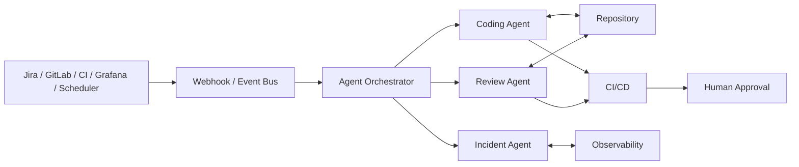

---

# 4. Codex đóng vai trò gì?

## 4.1. Codex CLI

Codex CLI là một coding agent chạy trong môi trường terminal.

Nó có thể:

- đọc repository;
- đọc `AGENTS.md`;
- search code;
- edit file;
- chạy command;
- chạy test;
- đọc lỗi;
- tiếp tục sửa;
- review code;
- làm việc trong Git repository.

Interactive usage:

```bash
codex
```

phù hợp cho developer trực tiếp làm việc.

---

## 4.2. `codex exec`

`codex exec` là chế độ non-interactive.

Ví dụ:

```bash
codex exec "
Read AGENTS.md.

Implement the requested task.
Run ./gradlew test.
If tests fail, diagnose and fix the problem.
Do not stop until verification succeeds.
"
```

Điểm quan trọng:

```text
codex
```

cần con người tương tác.

Trong khi:

```text
codex exec
```

có thể được gọi bởi:

```text
CI
cron
script
webhook
backend service
automation pipeline
```

Do đó `codex exec` là bước đầu tiên để biến Codex thành một automation worker.

---

# 5. Agents API đóng vai trò gì?

Agents API phù hợp khi ta muốn xây một **Agent Platform**, không chỉ chạy một command.

Kiến trúc khái niệm:

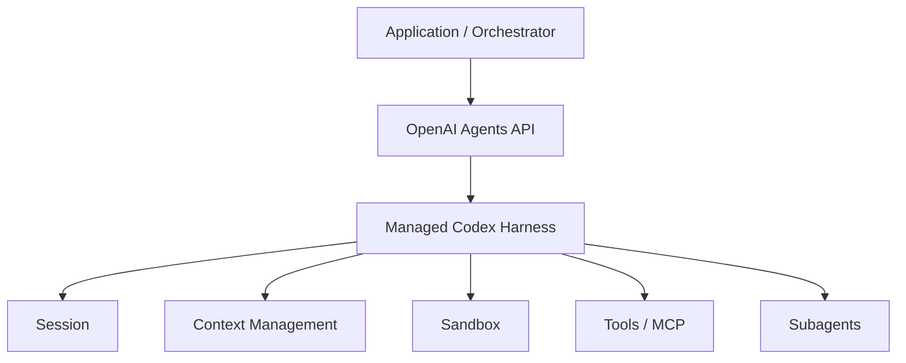

Agents API có thể quản lý:

- session;
- conversation state;
- context compaction;
- orchestration;
- sandbox;
- command execution;
- file editing;
- tools;
- MCP;
- subagents;
- resume long-running workflow.

Tư duy đơn giản:

```text
codex exec
=
"Chạy một coding agent automation"

Agents API
=
"Xây một nền tảng agent"
```

---

# 6. Kiến trúc mục tiêu

Kiến trúc nên có một lớp trung tâm:

```text
Agent Orchestrator
```

Orchestrator không cần thông minh.

Nó chịu trách nhiệm:

- nhận event;
- xác định loại task;
- chọn agent;
- chuẩn bị workspace;
- inject credentials có scope phù hợp;
- theo dõi trạng thái;
- ghi audit;
- yêu cầu human approval;
- retry;
- cleanup.

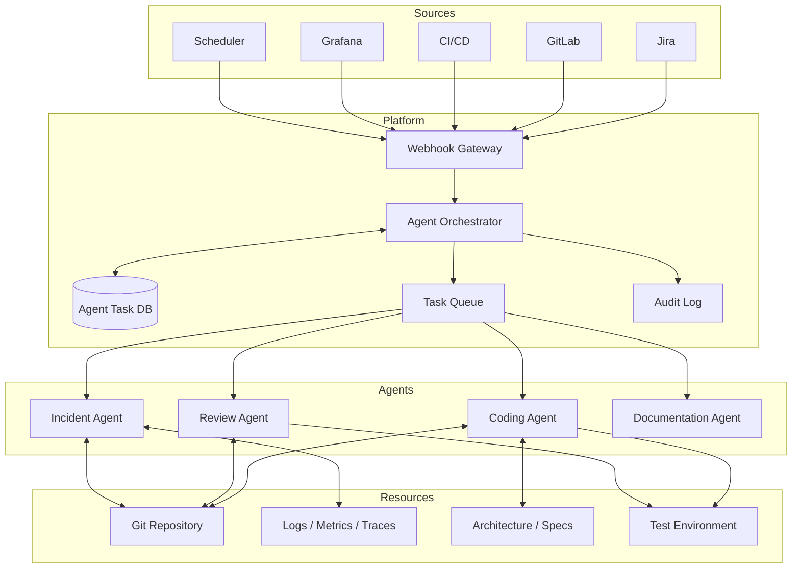

---

# 7. Repository phải được chuẩn bị cho Agent

AI coding không chỉ phụ thuộc model.

Chất lượng agent phụ thuộc rất lớn vào repository context.

Repository nên có cấu trúc:

```text
repository/
├── AGENTS.md
│
├── docs/
│   ├── architecture.md
│   ├── domain-glossary.md
│   ├── coding-conventions.md
│   ├── security.md
│   ├── testing.md
│   └── adr/
│
├── specs/
│   ├── ABC-101.md
│   └── ABC-102.md
│
├── scripts/
│   ├── verify.sh
│   ├── lint.sh
│   └── integration-test.sh
│
├── src/
└── build.gradle
```

---

# 8. Vai trò của AGENTS.md

`AGENTS.md` là instruction dành cho coding agent.

Ví dụ:

```md
# Engineering Instructions

## Technology

- Java 21
- Spring Boot
- PostgreSQL
- Gradle
- JPA/Hibernate

## Architecture

- Controller handles HTTP only.
- Business logic belongs in services.
- Persistence logic belongs in repositories.
- Domain rules must not depend on HTTP models.

## Coding Rules

- Do not use Lombok.
- Do not introduce a new dependency without justification.
- Prefer immutable DTOs.
- Use existing project conventions.
- Do not duplicate utilities.

## Database

- Never modify production data.
- New schema changes require migration scripts.
- Avoid N+1 queries.

## Testing

Every behavior change requires tests.

Before finishing run:

./gradlew clean test

## Security

Never print:
- passwords
- tokens
- API keys
- PII

## Completion Criteria

The task is complete only when:

1. implementation matches the specification;
2. tests pass;
3. no unrelated code is modified;
4. the final response explains changed files;
5. risks and assumptions are documented.
```

Mục tiêu là biến kiến thức đang nằm trong đầu senior developer thành **machine-readable engineering policy**.

---

# 9. Không dùng prompt để chứa mọi thứ

Sai:

```text
Prompt dài 10.000 dòng
+
architecture
+
rules
+
domain knowledge
+
ticket
```

Nên:

```text
AGENTS.md
    ↓
global engineering rules

docs/
    ↓
architecture/domain/conventions

specs/
    ↓
task-specific requirements

Git history/code
    ↓
actual implementation context
```

Prompt chỉ nên nói:

```text
Implement specs/ABC-123.md.

Follow AGENTS.md and repository documentation.

Run scripts/verify.sh before completion.
```

---

# 10. Workflow 1 — Ticket → Code → Merge Request

Đây là use case quan trọng nhất.

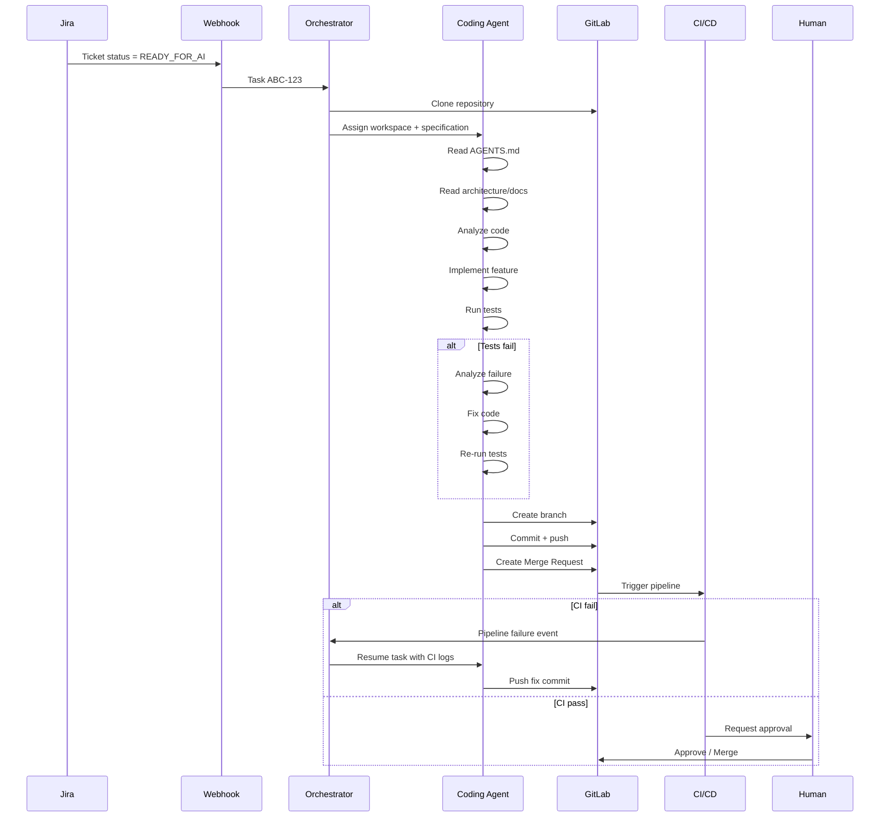

---

# 11. Trạng thái task

Agent workflow cần state machine.

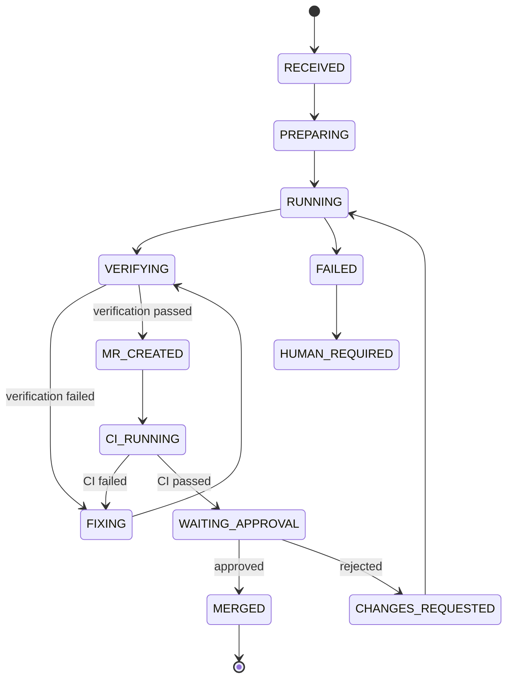

Không nên chỉ có:

```text
running / done
```

vì production workflow cần biết agent đang ở bước nào.

---

# 12. Workflow 2 — CI Fail → Agent tự sửa

Thay vì developer nhìn log rồi quay lại Codex:

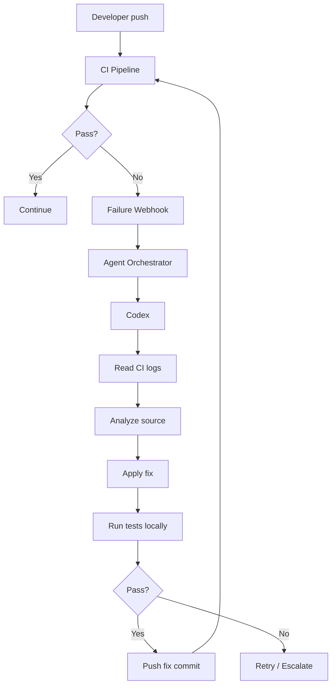

Agent cần được gửi:

- pipeline ID;
- branch;
- commit SHA;
- failed job;
- log;
- previous agent session nếu có.

---

# 13. Ví dụ `codex exec` cho CI fail

```bash
codex exec "
You are fixing a CI failure.

Read:
- AGENTS.md
- docs/
- ci-failure.log

Goals:
1. Determine the actual root cause.
2. Fix only the relevant code.
3. Do not disable or weaken tests.
4. Run ./gradlew clean test.
5. Stop if the required fix would violate repository policies.
6. Summarize changed files and root cause.
"
```

Không nên viết:

```text
Make CI green.
```

vì agent có thể chọn giải pháp không mong muốn như xóa test hoặc giảm validation.

Ta cần chỉ rõ invariant:

```text
Do not:
- delete failing tests;
- skip tests;
- disable lint;
- lower coverage threshold;
- suppress compiler errors;
```

---

# 14. Workflow 3 — Automatic Code Review

Coding Agent và Review Agent nên là hai execution context khác nhau.

Không nên để cùng một agent:

```text
tự code
→ tự review
→ tự kết luận code tốt
```

Nên:

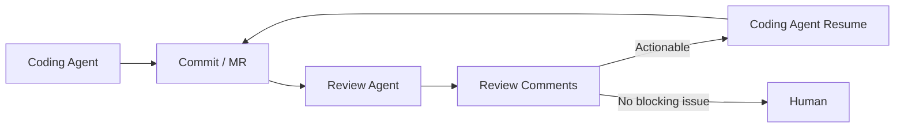

Review Agent tập trung vào:

- correctness;
- edge cases;
- concurrency;
- transaction;
- data integrity;
- security;
- backward compatibility;
- performance;
- API contract;
- test quality.

---

# 15. Prompt cho Review Agent

```text
Review this merge request as a senior backend engineer.

Read:
- AGENTS.md
- docs/architecture.md
- docs/security.md

Focus on:
- correctness;
- regressions;
- transaction boundaries;
- concurrency;
- security;
- database performance;
- API compatibility;
- missing tests.

Do not comment on formatting already enforced by tools.

For every issue provide:
- severity;
- file;
- line/range;
- why it is a problem;
- concrete failure scenario;
- recommended fix.

Do not approve or reject the MR.
Return evidence-based findings only.
```

---

# 16. Workflow 4 — Incident Investigation

Một agent khác có thể xử lý production incident.

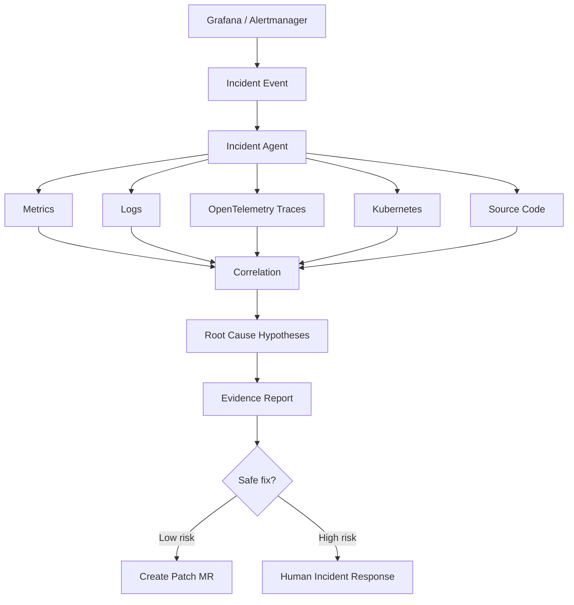

Ví dụ alert:

```text
POST /registrations
p99 > 2 seconds
for 10 minutes
```

Agent có thể:

1. tìm trace chậm;
2. xác định span DB chiếm phần lớn latency;
3. lấy SQL;
4. xem query plan nếu được phép;
5. tìm code repository;
6. so sánh deployment gần nhất;
7. đưa ra root-cause hypothesis;
8. tạo MR nếu fix đủ an toàn.

---

# 17. Agent không được trực tiếp production write

Permission boundary quan trọng hơn prompt.

Không nên cho Coding Agent:

```text
Production DB credentials
Production Kubernetes admin
Cloud admin token
main branch force push
merge permission
```

Permission nên theo least privilege.

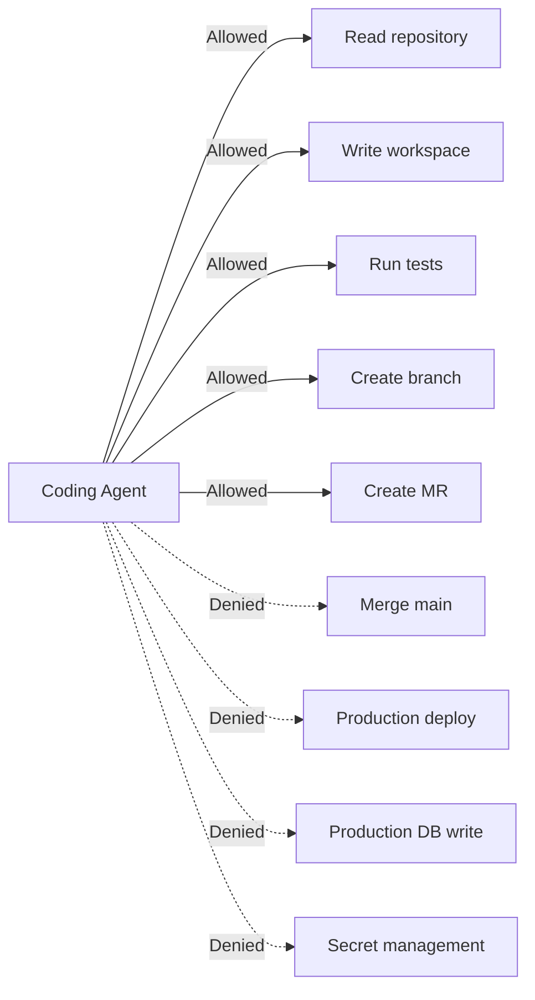

---

# 18. Human-in-the-loop

Tự động hóa không có nghĩa là bỏ con người hoàn toàn.

Hợp lý:

```text
AI làm execution
Human giữ authority
```

Agent:

```text
✓ đọc ticket
✓ code
✓ test
✓ commit
✓ push
✓ create MR
✓ review
✓ fix CI
```

Human:

```text
✓ approve business-sensitive changes
✓ merge critical repository
✓ production deploy
✓ schema destructive migration
✓ secrets/security policy changes
✓ production data migration
```

---

# 19. Risk Classification

Orchestrator có thể phân loại task.

| Risk | Ví dụ | Automation |
|---|---|---|
| LOW | test, refactor nhỏ, docs | auto code + auto MR |
| MEDIUM | API feature, query change | AI code + human review |
| HIGH | DB migration, auth | senior approval |
| CRITICAL | prod data delete, IAM, secrets | agent chỉ phân tích |

Ví dụ:

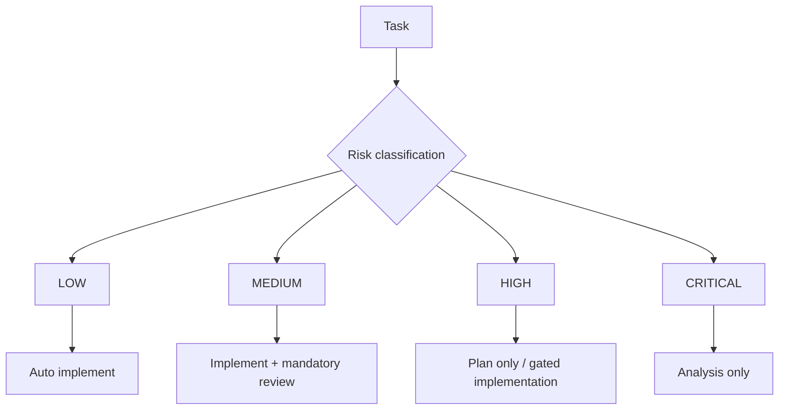

---

# 20. Kiến trúc tối thiểu — Không cần Agents API ngay

Phiên bản đầu:

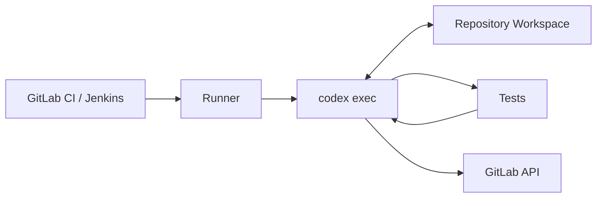

Đây là MVP tốt nhất.

Không cần:

- message queue;
- multi-agent;
- persistent database;
- agent platform;
- dashboard riêng.

---

# 21. Ví dụ shell wrapper

```bash
#!/usr/bin/env bash

set -euo pipefail

TASK_FILE="$1"

if [ ! -f "$TASK_FILE" ]; then
  echo "Task file not found: $TASK_FILE"
  exit 1
fi

codex exec "
You are an autonomous software engineering agent.

Read:
- AGENTS.md
- docs/
- ${TASK_FILE}

Perform the task.

Rules:
- modify only files required for the task;
- never disable tests;
- do not change security controls;
- do not commit secrets;
- run ./scripts/verify.sh;
- if verification fails, diagnose and fix it;
- stop and report if the task cannot be safely completed.

At the end return:
1. root cause / implementation summary;
2. changed files;
3. tests executed;
4. remaining risks.
"
```

Sau đó:

```bash
./scripts/run-agent.sh specs/ABC-123.md
```

CI gọi command này thay cho developer.

---

# 22. GitLab Pipeline concept

Ví dụ kiến trúc pipeline:

```yaml
stages:
  - prepare
  - agent
  - verify
  - publish

agent_implement:
  stage: agent
  script:
    - ./scripts/run-agent.sh "$TASK_SPEC"
  artifacts:
    paths:
      - agent-result.md
  rules:
    - if: '$RUN_AI_AGENT == "true"'

verify:
  stage: verify
  script:
    - ./gradlew clean test

publish_branch:
  stage: publish
  script:
    - ./scripts/push-agent-branch.sh
```

Lưu ý:

- secret không hard-code trong YAML;
- runner nên ephemeral;
- agent workspace nên isolate;
- token Git phải giới hạn scope.

---

# 23. GitHub Actions

OpenAI có Codex GitHub Action chính thức:

```text
openai/codex-action@v1
```

Nó phù hợp để:

- chạy Codex trong CI;
- review Pull Request;
- chạy repeated automation;
- apply patch;
- thực hiện release/migration preparation.

Nếu tổ chức dùng GitHub, nên ưu tiên Action này thay vì tự cài CLI + expose API key trực tiếp trong shell.

---

# 24. Khi nào chuyển sang Agents API?

Không nên dùng Agents API chỉ vì nó mới hơn.

Chuyển khi bắt đầu có các nhu cầu:

```text
Multiple event sources
+
Persistent sessions
+
Long-running tasks
+
Resume
+
Subagents
+
Multiple tools
+
MCP
+
Central audit
+
Agent dashboard
+
Task routing
```

Lúc đó kiến trúc:

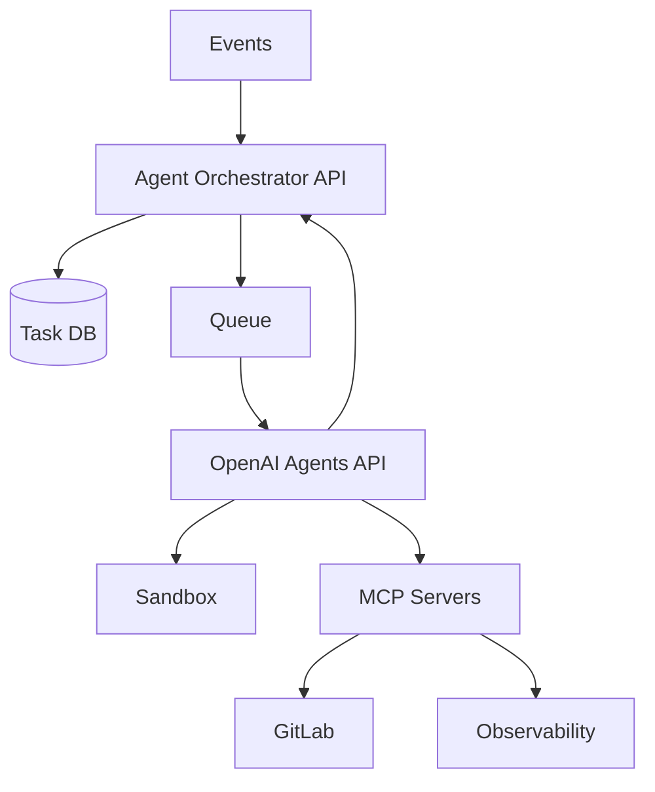

---

# 25. Agents API — Example concept

Pseudo Python:

```python
from openai import OpenAI

client = OpenAI()

with client.beta.agents.sessions.create(
    agent={
        "model": "<supported-coding-model>",
        "instructions": """
        You are a senior backend engineer.

        Follow repository AGENTS.md.
        Follow architecture documentation.
        Do not weaken tests.
        Always verify your work.
        """,
    },
    environment={
        "type": "openai_hosted"
    },
    input="""
        Implement ticket ABC-123.

        Run the repository verification commands
        and report actual results.
    """,
    stream=True,
) as events:
    for event in events:
        print(event)
```

Agents API quản lý phần harness như:

```text
session
context
orchestration
sandbox
resume
tool execution
subagents
```

App của ta vẫn quản lý:

```text
business trigger
permissions
repository authorization
task routing
policy
approval
audit
```

---

# 26. Self-hosted execution

Một số công ty không muốn source code chạy trong hosted environment.

Khi đó có thể chọn kiến trúc:

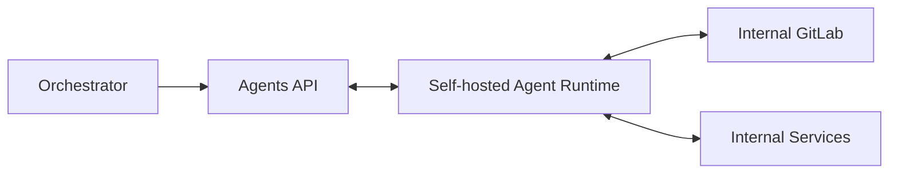

Điểm quan trọng:

> Managed orchestration không đồng nghĩa mọi dữ liệu bắt buộc phải nằm cùng một execution model.

Việc lựa chọn hosted/self-hosted cần dựa trên:

- source code policy;
- data classification;
- network isolation;
- compliance;
- secret policy;
- audit requirements.

---

# 27. Tool Layer

Agent không nên có một token có thể làm mọi thứ.

Nên expose tool có mục đích rõ ràng.

Ví dụ:

```text
GitTool
- clone()
- createBranch()
- commit()
- push()
- createMergeRequest()

JiraTool
- getTicket()
- addComment()
- transition()

CITool
- getPipeline()
- getFailedLogs()
- retryPipeline()

ObservabilityTool
- queryMetrics()
- queryLogs()
- getTrace()

DatabaseTool
- explainQuery()
- queryReadReplica()
```

Không nên expose:

```text
shell with root
+
all cloud credentials
```

nếu task chỉ cần đọc ticket.

---

# 28. MCP

MCP giúp agent truy cập external capability theo interface chuẩn.

Ví dụ:

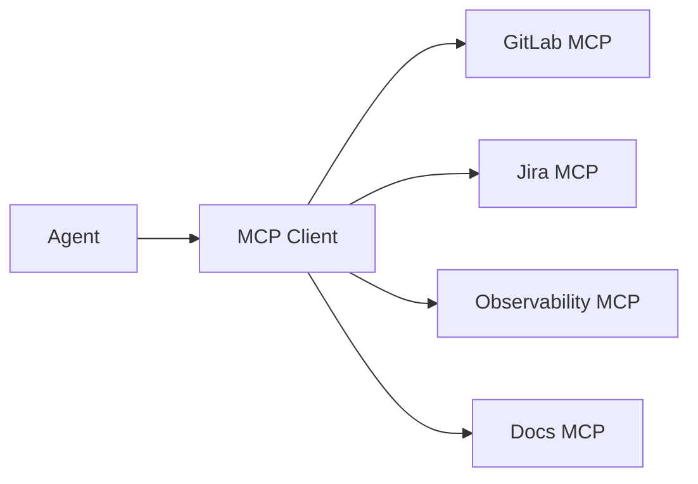

MCP phù hợp khi:

- nhiều agent cần dùng cùng một integration;
- muốn chuẩn hóa tools;
- muốn tách tool lifecycle khỏi agent;
- muốn kiểm soát permission tốt hơn.

---

# 29. Context Architecture

Một coding agent cần nhiều lớp context.

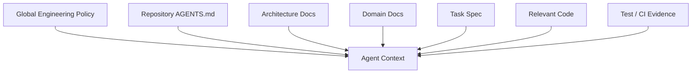

Không phải context nào cũng load ngay lập tức.

Agent nên retrieve theo nhu cầu.

---

# 30. Specification phải machine-readable

Ticket kiểu:

```text
Làm API assign lead giống bên cũ.
```

rất khó cho automation.

Spec nên có:

```md
# ABC-123 Assign Lead

## Goal

Allow an eligible sale to be assigned to an unassigned lead.

## API

POST /api/v1/leads/{leadId}/assign

## Request

{
  "saleId": "..."
}

## Rules

1. Lead must exist.
2. Sale must exist.
3. Sale must be eligible.
4. Already assigned lead returns HTTP 409.
5. Assignment history must be stored.

## Acceptance Criteria

- successful assignment returns 200;
- duplicate assignment returns 409;
- ineligible sale returns 422;
- history record is created;
- unit tests exist;
- integration test exists.

## Out of Scope

- bulk assignment;
- reassignment.
```

Chất lượng spec ảnh hưởng trực tiếp chất lượng agent.

---

# 31. Verification là bắt buộc

Không được tin câu:

```text
"Implementation completed successfully."
```

Agent phải cung cấp evidence.

Ví dụ:

```text
Verification:
./gradlew clean test

Result:
324 tests completed
324 passed
0 failed
```

Nguyên tắc:

```text
No verification
=
Not completed
```

---

# 32. scripts/verify.sh

Nên chuẩn hóa một command duy nhất:

```bash
#!/usr/bin/env bash

set -euo pipefail

./gradlew clean test
./gradlew check
```

Sau này có thể thêm:

```text
unit test
integration test
lint
format check
architecture test
security test
dependency check
```

Agent chỉ cần biết:

```bash
./scripts/verify.sh
```

---

# 33. Completion Contract

Mọi Coding Agent nên trả về cấu trúc nhất quán.

```text
STATUS: COMPLETED

TASK:
ABC-123

CHANGED FILES:
- LeadController.java
- LeadAssignmentService.java
- LeadAssignmentRepository.java
- LeadAssignmentServiceTest.java

IMPLEMENTATION:
...

VERIFICATION:
./scripts/verify.sh
PASS

RISKS:
...

ASSUMPTIONS:
...

FOLLOW-UP:
...
```

Machine-readable hơn nữa:

```json
{
  "status": "completed",
  "task": "ABC-123",
  "verification": {
    "command": "./scripts/verify.sh",
    "result": "passed"
  },
  "risks": []
}
```

Orchestrator có thể parse kết quả thay vì đọc prose.

---

# 34. Retry Policy

Không nên cho agent loop vô hạn.

Ví dụ:

```text
MAX_AGENT_ITERATIONS = 10
MAX_CI_FIX_ATTEMPTS = 3
MAX_TASK_RUNTIME = policy-defined
```

Flow:

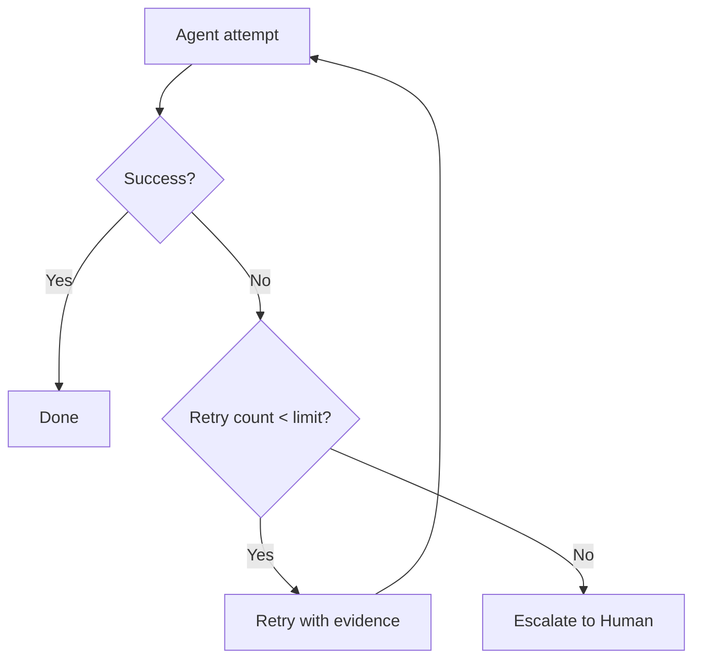

---

# 35. Không để Agent tự quyết định mọi thứ

Một lỗi architecture phổ biến:

```text
"Agent tự nhìn rồi tự quyết định tất cả."
```

Nên tách:

```text
Policy
=
deterministic code

Reasoning
=
agent
```

Ví dụ:

```text
Can merge?
```

không hỏi agent.

Code kiểm tra:

```text
CI == PASS
AND approvals >= 2
AND security_scan == PASS
AND branch_protection == PASS
```

Agent dùng cho:

```text
- implementation
- diagnosis
- review reasoning
- root-cause analysis
```

System code dùng cho:

```text
- authorization
- policy enforcement
- state transition
- rate limit
- risk gates
```

---

# 36. Security Architecture

## 36.1. Secret isolation

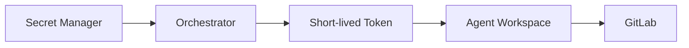

Agent chỉ nhận short-lived scoped credential.

Ví dụ:

```text
Git token:
✓ clone
✓ push agent branch
✓ create MR

✗ delete repository
✗ admin
✗ protected branch write
```

---

# 37. Network Policy

Coding Agent thường chỉ cần:

```text
Git
Artifact repository
dependency repository
selected documentation
```

Không cần unrestricted internet trong nhiều môi trường enterprise.

Policy:

```text
default deny
+
explicit allowlist
```

---

# 38. Sandbox

Mỗi task nên có workspace riêng:

```text
/task-ABC-123
```

Không dùng workspace lâu dài chứa secrets của task cũ.

Lifecycle:

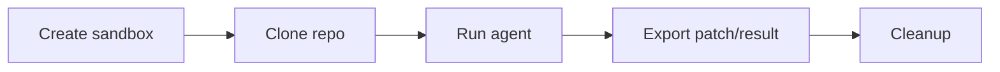

---

# 39. Audit

Cần lưu:

```text
task_id
trigger
actor
agent version
model
prompt/instructions version
repository
commit SHA
tool calls
commands executed
files modified
test results
MR
approval
final status
```

Không nhất thiết lưu raw secret/tool payload.

---

# 40. Observability cho Agent Platform

Agent system cũng cần observability.

Metrics:

```text
agent_tasks_total
agent_tasks_success_total
agent_tasks_failed_total
agent_task_duration_seconds
agent_retry_total
agent_ci_fix_attempts
agent_human_escalation_total
agent_token_usage
agent_cost
```

Dashboard:

```text
Success rate
Average task duration
MR acceptance rate
Human intervention rate
Cost per completed task
CI failure recovery rate
```

---

# 41. KPI nên đo

Không đo:

```text
"AI viết bao nhiêu dòng code?"
```

Nên đo:

```text
Lead time
Cycle time
Human intervention
Rework
Defect rate
MR acceptance
CI pass rate
Cost per completed task
```

Ví dụ:

```text
Ticket READY
→
MR Ready for Review

before: 8 hours

after: 45 minutes
```

đó mới là business value.

---

# 42. Multi-Agent — Chỉ dùng khi cần

Không nên bắt đầu:

```text
Architect Agent
Backend Agent
Test Agent
Security Agent
Reviewer Agent
Database Agent
```

Multi-agent làm tăng:

- cost;
- latency;
- coordination;
- duplicated context;
- debugging complexity.

Dùng khi task có thể tách độc lập.

Ví dụ investigation:

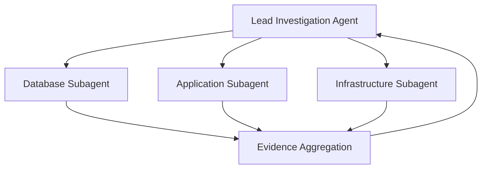

Đây là trường hợp multi-agent hợp lý vì ba nhánh có thể chạy song song.

---

# 43. Một kiến trúc production đầy đủ

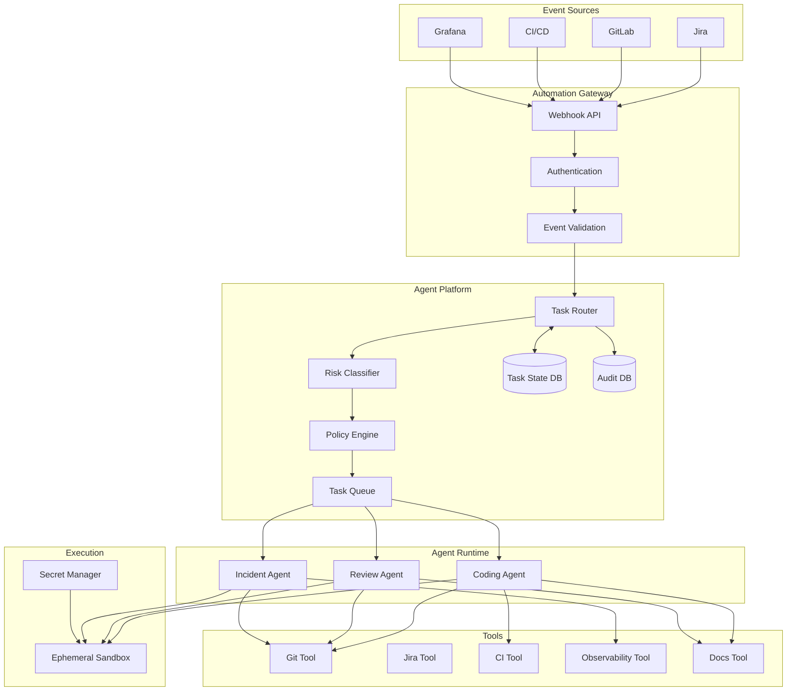

---

# 44. Roadmap triển khai thực tế

## Phase 0 — Repository readiness

Mục tiêu:

```text
AI hiểu project
```

Làm:

```text
AGENTS.md
docs/architecture.md
docs/coding-conventions.md
docs/domain-glossary.md
scripts/verify.sh
```

Chưa automation.

---

## Phase 1 — Codex automation local

Mục tiêu:

```text
script → codex exec → code → test
```

Flow:

```mermaid
flowchart LR
    A[Spec]
    B[run-agent.sh]
    C[codex exec]
    D[Code]
    E[verify.sh]
    F[Result]

    A --> B --> C --> D --> E --> F
```

Success criteria:

- agent hiểu project;
- agent sửa đúng;
- verify chạy ổn;
- output có cấu trúc.

---

## Phase 2 — CI integration

Flow:

```text
CI event
→
codex exec
→
patch
→
verify
```

Use case đầu tiên nên là:

```text
CI fail → agent diagnose
```

Ban đầu chỉ **report**, chưa tự push.

Sau khi tin cậy:

```text
CI fail
→
agent fix
→
push agent branch
```

---

# 45. Phase 3 — Ticket → Merge Request

Bắt đầu automation development lifecycle.

```mermaid
flowchart TD
    A[Ticket READY_FOR_AI]
    B[Webhook]
    C[Create workspace]
    D[Clone repo]
    E[Create agent branch]
    F[Codex]
    G[Test]
    H{Pass?}
    I[Fix]
    J[Commit]
    K[Push]
    L[Create MR]
    M[Human Review]

    A --> B --> C --> D --> E --> F --> G --> H

    H -->|No| I --> F
    H -->|Yes| J --> K --> L --> M
```

---

# 46. Phase 4 — Review Agent

Thêm independent review.

```text
Coding Agent
→
MR
→
Review Agent
→
findings
→
Coding Agent fix
→
CI
→
Human
```

---

# 47. Phase 5 — Agent Orchestrator

Khi workflow lớn hơn:

Xây service:

```text
engineering-agent-service
```

Modules:

```text
event/
orchestrator/
policy/
agent/
git/
jira/
ci/
observability/
audit/
```

API ví dụ:

```text
POST /events/jira
POST /events/gitlab
POST /events/ci
POST /events/grafana

GET /tasks/{id}
POST /tasks/{id}/approve
POST /tasks/{id}/retry
POST /tasks/{id}/cancel
```

---

# 48. Database schema concept

```text
agent_task
----------
id
type
source
source_ref
repository
branch
status
risk_level
created_at
started_at
completed_at

agent_run
---------
id
task_id
agent_type
session_id
attempt
status
started_at
completed_at

agent_artifact
--------------
id
run_id
type
location

agent_approval
--------------
id
task_id
approval_type
approved_by
status
created_at
```

---

# 49. Phase 6 — Agents API

Sau khi business workflow đã rõ mới thay execution engine:

```text
codex exec
```

bằng hoặc kết hợp:

```text
Agents API
```

Orchestrator không cần thay đổi nhiều nếu abstraction tốt:

```text
interface AgentExecutor {
    AgentResult execute(AgentTask task);
}
```

Implementations:

```text
CodexCliExecutor
AgentsApiExecutor
```

---

# 50. Phase 7 — Incident Automation

Sau coding lifecycle ổn mới kết nối observability.

```text
Grafana
→
Agent
→
metrics + logs + traces + code
→
root cause
→
patch MR
```

Production remediation vẫn human gated.

---

# 51. Kiến trúc khuyến nghị ban đầu

Nếu bắt đầu hôm nay, không cần over-engineer.

Làm:

```text
                 GitLab
                   │
              CI / Webhook
                   │
                   ▼
          small orchestrator
                   │
                   ▼
              codex exec
                   │
                   ▼
          isolated workspace
                   │
            ┌──────┴──────┐
            ▼             ▼
           Git           Test
            │
            ▼
       Merge Request
            │
            ▼
          Human
```

Không cần ngay:

```text
Kafka
Kubernetes
multi-agent
vector DB
complex RAG
custom memory
20 microservices
```

---

# 52. MVP đầu tiên nên làm

Use case:

> **Ticket → AI implement → Test → Merge Request**

Input:

```text
Ticket ID
Repository
Branch
Specification
```

Output:

```text
Merge Request
Test report
Agent summary
```

MVP definition:

```text
1 repo
1 agent
1 task type
1 CI pipeline
1 approval gate
```

Đừng bắt đầu 10 use case cùng lúc.

---

# 53. MVP repository

```text
sample-service/
├── AGENTS.md
├── docs/
│   ├── architecture.md
│   └── coding-conventions.md
├── specs/
│   └── TASK-001.md
├── scripts/
│   ├── run-agent.sh
│   └── verify.sh
├── src/
└── build.gradle
```

---

# 54. Definition of Done cho MVP

MVP thành công nếu một ticket:

```text
TASK-001
```

có thể đi từ:

```text
READY_FOR_AI
```

đến:

```text
Merge Request Ready
```

mà developer không cần:

```text
mở Codex
gõ prompt
sửa code
chạy test
commit
push
tạo MR
```

Developer chỉ:

```text
review MR
```

---

# 55. Những thứ không nên tự động ngay

Giai đoạn đầu không cho AI:

```text
merge protected branch
production deployment
production DB migration
IAM changes
secret rotation
infrastructure destroy
production rollback
```

Sau này có thể automation nhưng vẫn cần policy gate riêng.

---

# 56. Failure Modes

## 56.1. Agent hiểu sai requirement

Giải pháp:

```text
structured spec
acceptance criteria
examples
out-of-scope
```

---

## 56.2. Agent sửa quá nhiều file

Policy:

```text
Keep changes minimal.
Do not refactor unrelated code.
```

Orchestrator có thể giới hạn:

```text
max changed files
max diff size
```

và chuyển sang human review nếu vượt threshold.

---

## 56.3. Agent làm test pass bằng cách disable test

Guardrails:

```text
Do not delete tests.
Do not skip tests.
Do not weaken assertions.
```

Review pipeline detect:

```text
@Test(disabled)
skip
xskip
coverage threshold change
```

---

## 56.4. Infinite repair loop

Giới hạn attempts.

Ví dụ:

```text
3 CI repair attempts
```

sau đó:

```text
HUMAN_REQUIRED
```

---

## 56.5. Hallucinated success

Không tin text của agent.

CI là source of truth.

```text
Agent says PASS
```

không có giá trị nếu:

```text
CI = FAIL
```

---

# 57. Source of Truth

Nên định nghĩa:

```text
Requirement:
Ticket/Spec

Code:
Git

Build:
CI

Security:
Security scanner

Deployment:
CD platform

Production state:
Observability platform
```

Agent chỉ là worker.

Agent không trở thành source of truth.

---

# 58. Vai trò con người thay đổi

Developer không biến mất.

Vai trò chuyển từ:

```text
manual implementation
```

sang:

```text
specification
architecture
review
risk control
system design
agent policy
```

Senior engineer đặc biệt quan trọng ở:

```text
"What should be built?"
"Which invariants must hold?"
"What risks are unacceptable?"
"How do we verify correctness?"
```

---

# 59. End-State Vision

Mục tiêu cuối:

```mermaid
flowchart LR
    B[Business Requirement]
    S[Structured Spec]
    A[Coding Agent]
    R[Review Agent]
    C[CI]
    H[Human Approval]
    D[Deploy]
    O[Observability]
    I[Incident Agent]

    B --> S
    S --> A
    A --> R
    R --> C
    C --> H
    H --> D
    D --> O

    O -->|Incident| I
    I -->|Patch MR| R
```

Developer chủ yếu làm:

```text
specify
review
approve
architect
```

AI làm:

```text
search
implement
test
diagnose
review
document
repeat
```

---

# 60. Lộ trình triển khai đề xuất

```text
WAVE 1

AGENTS.md
+
docs/
+
verify.sh

        ↓

WAVE 2

codex exec local automation

        ↓

WAVE 3

CI Fail → AI diagnosis

        ↓

WAVE 4

Ticket → AI → MR

        ↓

WAVE 5

Review Agent

        ↓

WAVE 6

Agent Orchestrator

        ↓

WAVE 7

Agents API / persistent agent

        ↓

WAVE 8

Incident Investigation Agent

        ↓

WAVE 9

Broader engineering automation
```

---

# 61. Quyết định công nghệ

## Dùng Codex CLI / `codex exec` khi

- automation trong repository;
- CI script;
- one-shot task;
- prototype;
- team nhỏ;
- chưa cần state phức tạp.

## Dùng Agents API khi

- nhiều workflow;
- persistent session;
- resume;
- long-running tasks;
- subagents;
- centralized orchestration;
- platform phục vụ nhiều team;
- cần sandbox/tool architecture rõ ràng.

---

# 62. Nguyên tắc quan trọng nhất

> **Đừng bắt đầu bằng việc xây một hệ thống multi-agent phức tạp.**

Bắt đầu bằng:

```text
ONE EVENT
+
ONE AGENT
+
ONE REPOSITORY
+
ONE VERIFICATION COMMAND
+
ONE OUTPUT
```

Cụ thể:

```text
Ticket READY
        ↓
codex exec
        ↓
Implement
        ↓
./scripts/verify.sh
        ↓
Merge Request
```

Nếu workflow này hoạt động ổn định, mới mở rộng.

---

# 63. Checklist bắt đầu

## Repository

- [ ] Có `AGENTS.md`
- [ ] Có architecture documentation
- [ ] Có coding conventions
- [ ] Có domain glossary
- [ ] Có verification script
- [ ] Test có thể chạy tự động

## Agent

- [ ] Có completion criteria
- [ ] Có explicit prohibited actions
- [ ] Có structured output
- [ ] Có max retries
- [ ] Có audit

## Security

- [ ] Ephemeral workspace
- [ ] Short-lived token
- [ ] Least privilege
- [ ] Không production credential
- [ ] Protected branch
- [ ] Human approval

## CI

- [ ] CI là source of truth
- [ ] Agent không được bypass CI
- [ ] Failure logs được cung cấp cho agent
- [ ] Agent fix attempts có limit

---

# 64. Kiến trúc nên triển khai đầu tiên

Nếu phải chọn duy nhất một solution để triển khai ngay:

```mermaid
flowchart TB
    T[Ticket]
    W[Webhook]
    O[Simple Orchestrator]
    G[Git Clone]
    C[codex exec]
    V[verify.sh]
    B{Pass?}
    F[Agent fixes]
    MR[Create MR]
    CI[CI Pipeline]
    H[Human Review]

    T --> W
    W --> O
    O --> G
    G --> C

    C --> V
    V --> B

    B -->|No| F
    F --> C

    B -->|Yes| MR
    MR --> CI
    CI --> H
```

Stack tối thiểu:

```text
GitLab/Jenkins
+
Codex CLI (`codex exec`)
+
AGENTS.md
+
scripts/verify.sh
+
small webhook/orchestrator
```

Đây là điểm cân bằng tốt nhất giữa:

```text
automation
simplicity
security
cost
maintainability
```

---

# 65. Kết luận

Codex không chỉ nên được xem như:

```text
AI pair programmer
```

mà có thể trở thành:

```text
Software Engineering Worker
```

khi ta đặt nó vào một hệ thống event-driven.

Con đường nên đi:

```text
Manual Codex
    ↓
codex exec
    ↓
CI automation
    ↓
Ticket automation
    ↓
Review automation
    ↓
Agent Orchestrator
    ↓
Agents API
    ↓
Engineering Agent Platform
```

Mục tiêu không phải:

> "AI tự làm mọi thứ không kiểm soát."

Mục tiêu là:

> **Để AI tự thực hiện phần công việc có thể kiểm chứng, trong một hệ thống có policy, sandbox, permissions, audit và human approval rõ ràng.**

Khi làm đúng, developer không còn phải dành phần lớn thời gian cho:

```text
boilerplate
search
repeat
test-fix-test
CI diagnosis
routine review
```

mà tập trung nhiều hơn vào:

```text
requirements
architecture
domain
trade-offs
risk
quality
decision making
```

---

# 66. Tài liệu OpenAI tham khảo

Thông tin trong tài liệu này dựa trên tài liệu OpenAI hiện hành tại thời điểm biên soạn, đặc biệt:

1. **Codex non-interactive mode** — hướng dẫn sử dụng `codex exec`, resume session và CI automation.
2. **Codex GitHub Action** — `openai/codex-action@v1` cho workflow GitHub Actions.
3. **Agents API Overview** — managed Codex harness, session, orchestration, context management, sandbox, tools và subagents.
4. **Agents API Quickstart** — tạo agent session, sử dụng OpenAI-hosted environment và streaming execution.
5. **Codex model guidance / AGENTS.md** — cách Codex tự đọc và áp dụng `AGENTS.md`.

Các trang chính thức:

- https://developers.openai.com/docs/non-interactive-mode
- https://developers.openai.com/docs/github-action
- https://developers.openai.com/api/docs/guides/agents-api/overview
- https://developers.openai.com/api/docs/guides/agents-api/quickstart
- https://developers.openai.com/api/docs/guides/latest-model

---

**Document version:** 1.0  
**Updated:** 2026-09-21  
**Scope:** Codex CLI, `codex exec`, CI/CD automation, Agents API, Agent Orchestrator, Engineering Agent Platform
