# Phân quyền và phạm vi dữ liệu hồ sơ Nhà ở xã hội

> Tài liệu phân tích cho `BDSKD-8791`. Phạm vi gồm API danh sách/chi tiết/duyệt
> hồ sơ NOXH đi qua `vhm-agent-api` (BFF) và `vhm-dossier-core` (Core).

## Đọc phần này trước: mô hình từ nguyên lý đầu tiên

Phân quyền danh sách không bắt đầu từ câu hỏi "role 910 gọi API nào?". Nó bắt
đầu từ câu hỏi đơn giản hơn:

> Với một người dùng và một hồ sơ cụ thể, hệ thống dựa vào bằng chứng nào để
> quyết định cho phép hồ sơ đó xuất hiện trong kết quả?

Hệ thống cần bốn nhóm dữ liệu độc lập:

1. **Người dùng là ai?** — `userId` từ phiên đăng nhập.
2. **Người dùng mang quyền gì?** — tập role ID, ví dụ `{910}`.
3. **Người dùng có quan hệ gì với hồ sơ?** — người tạo, Sale phụ trách hay
   reviewer được giao duyệt.
4. **Hồ sơ có thuộc tab đang xem không?** — trạng thái và stage có thuộc
   `PKD_ALL` hay không.

Một hồ sơ chỉ xuất hiện khi tất cả điều kiện bắt buộc cùng đúng:

```text
VISIBLE
= đúng queue
AND đúng phạm vi dữ liệu của user
AND đúng các filter người dùng nhập
AND request có actor context hợp lệ
```

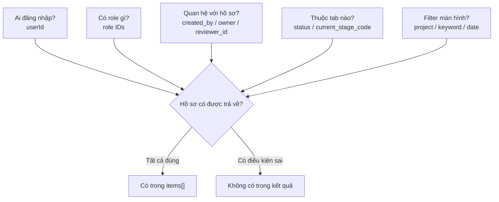

### Ba sự thật gốc cần nhớ

#### Role không phải câu SQL

`910` chỉ là mã quyền. Trước khi query DB, BFF phải dịch nó thành:

```text
910
→ công việc PKD (pipelineRole=PKD)
→ chỉ dữ liệu được giao (visibility=ASSIGNED)
→ danh tính cần so khớp (userId=sale_4)
```

Nếu bước dịch này sai thì mọi API phía sau đều nhận sai phạm vi.

#### "Liên quan tới hồ sơ" có ba nghĩa khác nhau

```text
created_by  = người khởi tạo hồ sơ
owner       = Sale phụ trách khách hàng/hồ sơ
reviewer_id = người được giao duyệt ở một stage
```

Ba field có thể chứa ba user khác nhau. Không được suy luận `owner = reviewer_id`.

#### Xem được và thao tác được là hai quyết định riêng

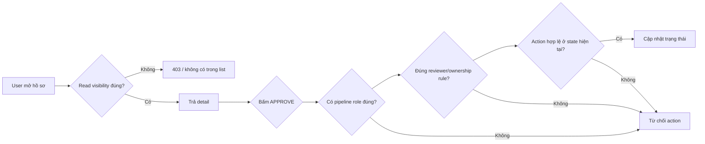

Role 910 có capability phê duyệt, nhưng không được duyệt hồ sơ chưa giao cho
mình hoặc hồ sơ đang ở stage không cho phép `APPROVE`.

## Dòng chảy dữ liệu hoàn chỉnh của một request

Theo một request cụ thể:

```http
GET /api/v2/social-housing/registrations?page=1&pageSize=20&queue=PKD_ALL
```

Người đăng nhập:

```text
userId = sale_4
roles  = {910}
```

### Bước 1 — FE chỉ gửi ý định màn hình

FE nói: "Tôi muốn xem tab `PKD_ALL`, trang 1". FE không gửi và không được tự
quyết định security scope như `everReviewerId=sale_4`.

### Bước 2 — BFF lấy identity đã xác thực

| Dữ liệu | Nguồn | FE được sửa? |
|---|---|:---:|
| `userId=sale_4` | Access token/security context | Không |
| `roleIds={910}` | Profile/auth service | Không |
| `queue=PKD_ALL` | Query string | Có |

### Bước 3 — BFF dịch role thành scope

`DossierScopeResolver` tạo dữ liệu dẫn xuất:

```json
{
  "level": "ASSIGNED",
  "userId": "sale_4",
  "pipelineRoles": ["PKD"],
  "trackHistoricalAssignment": true,
  "allowedDepartments": ["PKD", "PTT"]
}
```

Object này không phải row DB. Nó là quyết định authorization được tính lại từ
identity ở mỗi request.

### Bước 4 — Scope tạo hai đầu ra

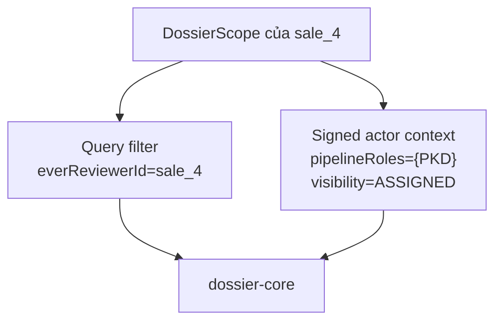

- Query filter mô tả tập dữ liệu BFF muốn lấy.
- Signed actor context để Core tự enforce security, kể cả khi query string bị sửa.

### Bước 5 — Core biến queue thành điều kiện dữ liệu

`PKD_ALL` không có nghĩa "mọi row trong bảng". Nó là tập trạng thái/stage được
định nghĩa trong `DossierQueue`. Core nối queue với visibility bằng `AND`.

### Bước 6 — Core tìm bằng chứng assignment

Với role 910, bằng chứng được giao hiện lấy từ
`dossier_stage_reviewer.reviewer_id`:

```sql
SELECT d.*
FROM dossier d
WHERE <d thuộc PKD_ALL>
  AND EXISTS (
      SELECT 1
      FROM dossier_stage_reviewer sr
      WHERE sr.dossier_id = d.id
        AND sr.reviewer_id = 'sale_4'
  );
```

### Bước 7 — Dựng response

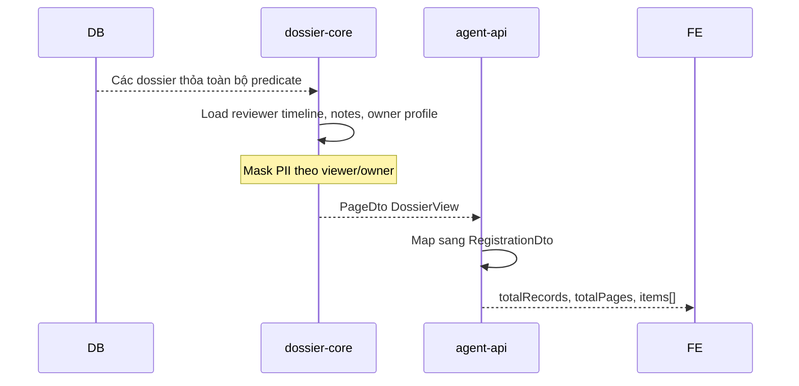

Không có reviewer row cho `sale_4` thì DB trả zero row. Response `200` với
`items=[]` nghĩa là scope hợp lệ nhưng không có dữ liệu phù hợp.

## Data lineage: một giá trị đi từ đâu đến đâu

| Giá trị | Nơi sinh | Qua BFF | Sang Core | Cuối cùng dùng vào |
|---|---|---|---|---|
| `sale_4` | Auth context | `scope.userId` | Actor context + `everReviewerId` | So với `reviewer_id` |
| `910` | Profile/auth | Input scope resolver | Không gửi role số | Dịch thành `PKD` + `ASSIGNED` |
| `PKD` | BFF resolver | `pipelineRoles` | Signed actor context | Gate action PKD |
| `ASSIGNED` | BFF resolver | `visibility.level` | Signed actor context | Core bắt buộc reviewer scope |
| `PKD_ALL` | FE | Validate audience | Query param | Queue predicate |
| `reviewer_id` | Pipeline ASSIGN/REASSIGN | Không đi qua BFF | Đọc từ DB | Bằng chứng hồ sơ đã giao |
| `owner` | API đổi Sale phụ trách | Trả trong DTO | Đọc từ DB | Không chứng minh reviewer assignment |
| `items[]` | Kết quả dẫn xuất | BFF map DTO | Core dựng từ DB rows | Hiển thị bảng FE |

## 1. Mục tiêu

Tài liệu trả lời bốn câu hỏi:

1. Mỗi role NOXH được thực hiện nghiệp vụ nào?
2. Khi gọi API danh sách, role đó được nhìn thấy những hồ sơ nào?
3. BFF chuyển role thành scope/filter gì và Core chuyển filter thành SQL ra sao?
4. Hành vi hiện tại đang lệch ma trận nghiệp vụ ở đâu?

Hai khái niệm phải được phân biệt:

- **Action authorization**: người dùng có được tạo, phân công, phê duyệt,
  xem báo cáo... hay không.
- **Data visibility**: người dùng được nhìn thấy tập hồ sơ nào.

Có quyền `Phê duyệt` không đồng nghĩa được duyệt mọi hồ sơ. Hồ sơ vẫn phải nằm
trong scope và thỏa stage, pipeline role, ownership rule của action.

## 2. Kiến trúc tổng thể

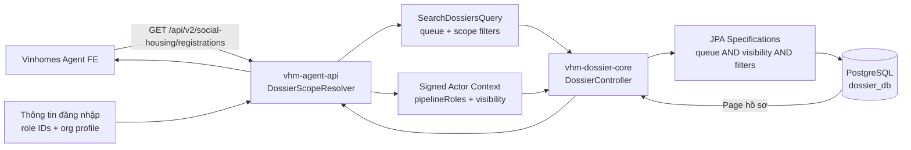

### Trách nhiệm từng service

| Thành phần | Trách nhiệm |
|---|---|
| FE | Chọn tab/queue và gửi filter do người dùng nhập. Không quyết định security scope. |
| BFF | Đọc role đã xác thực, resolve scope, loại queue không thuộc audience, stamp filter và ký actor context. |
| Core | Xác minh actor context, áp visibility bắt buộc, queue semantics và authorization cho từng action. |
| DB | Lưu hồ sơ, owner hiện tại và reviewer theo từng stage. |

## 3. API danh sách

API public mà FE gọi:

```http
GET /api/v2/social-housing/registrations
    ?page=1
    &pageSize=20
    &queue=PKD_ALL
```

BFF gọi tiếp Core bằng các filter đã chuẩn hóa:

```http
GET /internal/v1/dossiers
    ?queue=PKD_ALL
    &createdBy=...
    &assignedReviewerId=...
    &everReviewerId=...
```

Không phải request nào cũng có ba filter scope trên. `DossierScope.applyTo()` chọn
filter theo level:

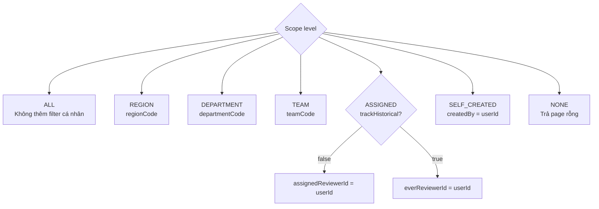

## 4. Ma trận nghiệp vụ kỳ vọng

Ma trận dưới đây là yêu cầu nghiệp vụ của ticket, không phải khẳng định rằng
code hiện tại đã enforce đúng hoàn toàn.

| Role | Tên | Tạo | Xem | Phân công | Phê duyệt | Xem báo cáo | Xuất báo cáo | Phân quyền dự án |
|---:|---|:---:|:---:|:---:|:---:|:---:|:---:|:---:|
| 900 | Region Management | ✓ | ✓ | ✓ | ✓ | ✓ | ✓ | ✓ |
| 901 | Region Viewer |  | ✓ |  |  |  |  |  |
| 902 | Region Distribute |  | ✓ | ✓ |  |  |  |  |
| 903 | Department Management | ✓ | ✓ | ✓ | ✓ | ✓ | ✓ | ✓ |
| 904 | Department Viewer |  | ✓ |  |  |  |  |  |
| 905 | Department Distribute |  | ✓ | ✓ |  |  |  |  |
| 906 | Team Management | ✓ | ✓ | ✓ | ✓ | ✓ |  | ✓ |
| 907 | Team Viewer |  | ✓ |  |  |  |  |  |
| 908 | Team Distribute |  | ✓ | ✓ |  |  |  |  |
| 909 | Creator | ✓ | ✓ |  |  |  |  |  |
| 910 | Member |  | ✓ |  | ✓ |  |  |  |

Code còn khai báo hai role PTT ngoài bảng ticket:

| Role | Tên | Ý nghĩa hiện tại |
|---:|---|---|
| 911 | PTT Officer | Xem và xử lý hồ sơ đang được phân công tại PTT. |
| 912 | PTT Manager | Xem hàng đợi PTT, phân công/reassign và thực hiện action `PTT_LEAD`. |

## 5. Mapping role sang scope trong code hiện tại

| Role | BFF scope | Pipeline role | Scope filter | Dữ liệu `queue=PKD_ALL` hiện tại |
|---:|---|---|---|---|
| 900 | `ALL` | `PKD_LEAD` | Không có | Toàn bộ PKD_ALL |
| 901 | `REGION` | Không có | Có metadata region | Core chưa enforce region; có nguy cơ thấy toàn bộ PKD_ALL |
| 902 | `ALL` | `PKD_LEAD` | Không có | Toàn bộ PKD_ALL |
| 903 | `ALL` | `PKD_LEAD` | Không có | Toàn bộ PKD_ALL |
| 904 | `DEPARTMENT` | Không có | Có metadata department | Core chưa enforce department; có nguy cơ thấy toàn bộ PKD_ALL |
| 905 | `ALL` | `PKD_LEAD` | Không có | Toàn bộ PKD_ALL |
| 906 | `ALL` | `PKD_LEAD` | Không có | Toàn bộ PKD_ALL |
| 907 | `TEAM` | Không có | Có metadata team | Core chưa enforce team; có nguy cơ thấy toàn bộ PKD_ALL |
| 908 | `ALL` | `PKD_LEAD` | Không có | Toàn bộ PKD_ALL |
| 909 | `SELF_CREATED` | `APPLICANT_AGENT` | `createdBy=userId` + Core creator/owner guard | Hồ sơ do mình tạo hoặc đang là owner, nằm trong queue |
| 910 | `ASSIGNED` | `PKD` | `everReviewerId=userId` | Hồ sơ có reviewer row khớp user, nằm trong queue |
| 911 | `ASSIGNED` | `PTT` | `assignedReviewerId=userId` | Không được dùng PKD audience; chỉ dữ liệu PTT đang giao cho mình |
| 912 | `ALL` | `PTT_LEAD` | Department/queue PTT | Toàn bộ hàng đợi PTT được phép |

### Vì sao Management/Distribute đang là `ALL`?

`DossierScopeResolver` ghi rõ Core chưa có mô hình org dimension hoàn chỉnh cho
hồ sơ PKD. Vì vậy các role management/distribute đang tạm dùng `ALL` và dựa
vào semantic queue. Đây là giải pháp tạm, không đúng nghĩa scope region/
department/team trong tên role.

### Vì sao Viewer tier có rủi ro nhìn quá rộng?

Actor context vẫn mang `REGION`, `DEPARTMENT` hoặc `TEAM`, nhưng
`DossierAccessGuard.visibilitySpec()` hiện trả `null` cho các level này. Trong
JPA composition, `null` nghĩa là không thêm predicate security tương ứng.

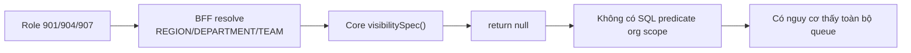

## 6. Ý nghĩa các bảng và field liên quan

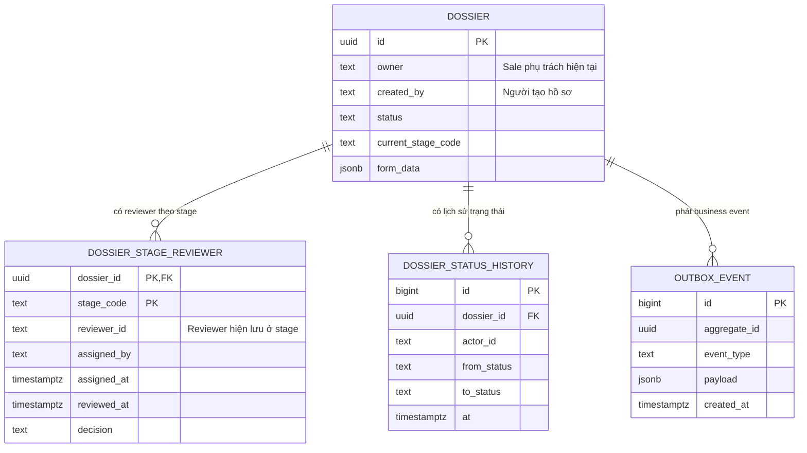

### `created_by`, `owner` và `reviewer_id` không đồng nghĩa

| Field | Ý nghĩa | Ai sử dụng làm visibility |
|---|---|---|
| `dossier.created_by` | Người tạo hồ sơ | Role 909 (`SELF_CREATED`) |
| `dossier.owner` | Sale phụ trách hồ sơ | Role 909 được Core cho đọc khi là owner |
| `dossier_stage_reviewer.reviewer_id` | Người duyệt/xử lý tại một stage | Role 910/911 (`ASSIGNED`) |

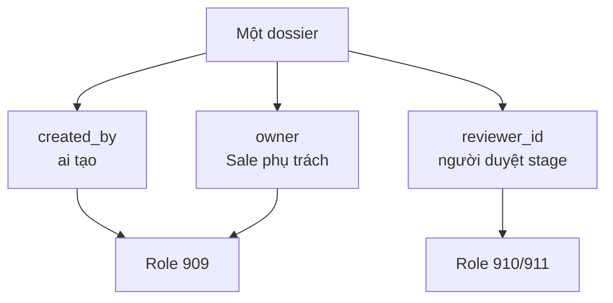

Việc chỉ cập nhật `owner` không tự tạo reviewer assignment. Vì vậy một user role
910 có thể được hiển thị là "Sale phụ trách" nhưng vẫn không thấy hồ sơ trong
danh sách ASSIGNED.

## 7. Phân tích chi tiết role 910

Role 910 được map:

```text
roleId                  = 910
scope.level             = ASSIGNED
scope.pipelineRoles     = {PKD}
trackHistoricalAssignment = true
allowedDepartments      = {PKD, PTT}
```

Luồng request:

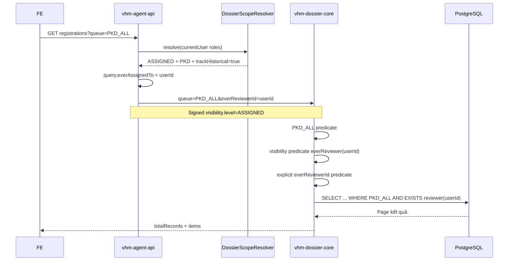

Predicate giản lược:

```sql
SELECT d.*
FROM dossier d
WHERE <PKD_ALL predicate>
  AND EXISTS (
      SELECT 1
      FROM dossier_stage_reviewer sr
      WHERE sr.dossier_id = d.id
        AND sr.reviewer_id = :current_user
  );
```

### Trường hợp kiểm tra `sale_4`

Tại thời điểm kiểm tra staging ngày 10/09/2026:

| Quan hệ | Số hồ sơ |
|---|---:|
| `dossier.owner = 'sale_4'` | 0 |
| `dossier.created_by = 'sale_4'` | 0 |
| `dossier_stage_reviewer.reviewer_id = 'sale_4'` | 0 |

Do đó API trả `totalRecords=0` là phù hợp với implementation hiện tại. Để test
role 910, phải assign reviewer PKD cho `sale_4`; chỉ đổi owner chưa đủ.

## 8. Các sai lệch/defect đã xác định

### 8.1 Org scope chưa được enforce

| Scope | Kỳ vọng | Hiện tại |
|---|---|---|
| REGION | Chỉ hồ sơ trong vùng | Core không thêm predicate region |
| DEPARTMENT | Chỉ hồ sơ trong phòng ban | Core không thêm predicate department |
| TEAM | Chỉ hồ sơ trong team | Core không thêm predicate team |

### 8.2 Owner assignment và reviewer assignment là hai luồng khác nhau

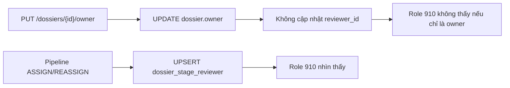

Cần BA xác nhận từ "phân công" trong ma trận là:

- Phân công Sale phụ trách (`dossier.owner`), hay
- Phân công reviewer xử lý stage (`dossier_stage_reviewer.reviewer_id`).

### 8.3 `everReviewer` chưa phải lịch sử đầy đủ

Khóa chính reviewer là `(dossier_id, stage_code)`. Khi reassign nhiều lần trong
cùng stage, row bị cập nhật và reviewer cũ không còn trong bảng.

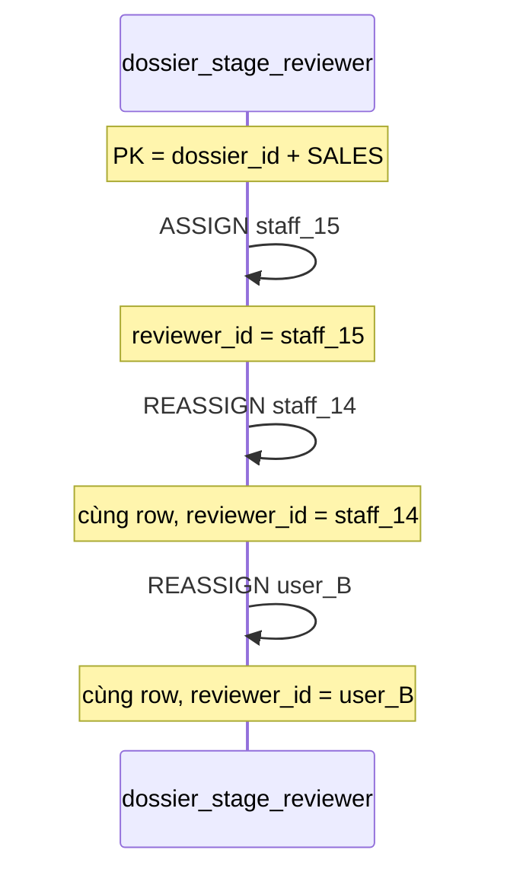

Vì vậy query tên `everReviewer` thực tế chỉ tìm reviewer cuối cùng đang còn lưu
ở mỗi stage, không đảm bảo tìm được mọi reviewer từng được assign.

### 8.4 Visibility và action authorization có thể lệch nhau

- Viewer role có thể nhìn dữ liệu rộng vì thiếu org predicate, nhưng không có
  pipeline role để thực hiện action duyệt.
- Member có pipeline role `PKD`, nhưng chỉ được action khi hồ sơ thỏa ownership
  rule/reviewer guard.
- Lead có `PKD_LEAD`, được assign/reassign và có scope rộng.

## 9. Hướng thiết kế đề xuất

### Quyết định 1: chuẩn hóa khái niệm assignment

Nếu role 910 phải xử lý hồ sơ theo reviewer assignment, giữ scope reviewer và
đảm bảo mọi thao tác phân công nghiệp vụ dùng pipeline `ASSIGN/REASSIGN`.

Nếu role 910 phải xử lý hồ sơ theo Sale phụ trách, visibility cần là:

```sql
d.owner = :actor_id
OR EXISTS (
    SELECT 1
    FROM dossier_stage_reviewer sr
    WHERE sr.dossier_id = d.id
      AND sr.reviewer_id = :actor_id
)
```

Không nên tự động mở quyền duyệt chỉ vì user là owner; action guard vẫn phải
kiểm tra stage reviewer/ownership rule riêng.

### Quyết định 2: lưu lịch sử reviewer bất biến

Nên có bảng assignment history hoặc event projection:

```text
dossier_reviewer_assignment_history
  id
  dossier_id
  stage_code
  reviewer_id
  assigned_by
  assigned_at
  unassigned_at
```

Sau đó:

- `assignedReviewerId`: đọc reviewer hiện tại.
- `everReviewerId`: đọc bảng history.

### Quyết định 3: enforce org scope bằng dữ liệu có nguồn rõ ràng

Cần xác định dossier thuộc region/department/team theo field nào và snapshot hay
join động. Sau khi chốt nguồn dữ liệu, Core phải tạo predicate thật thay vì
`return null`.

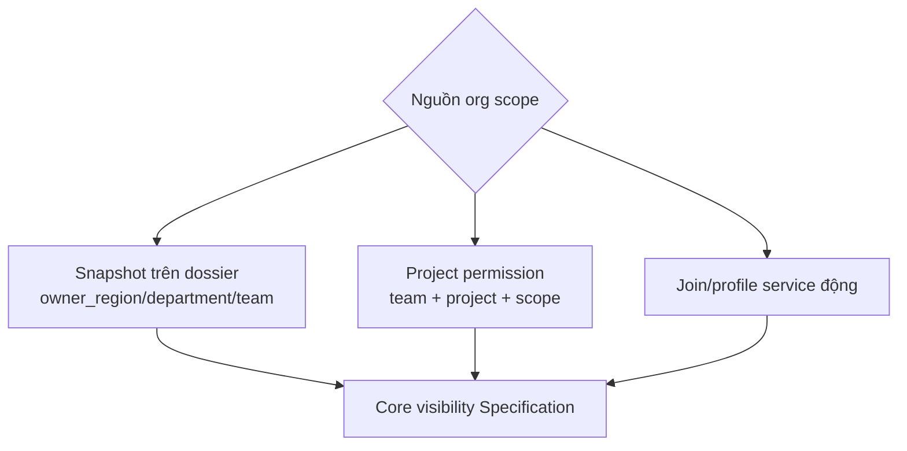

Ưu tiên snapshot hoặc local grant để list query không phụ thuộc RPC profile cho
từng row.

## 10. Checklist kiểm thử cho từng role

Mỗi role cần ít nhất các bộ dữ liệu sau:

1. Hồ sơ nằm trong scope và ngoài scope.
2. Hồ sơ chưa assign, assign cho mình, assign cho người khác.
3. Hồ sơ đã reassign khỏi mình.
4. Hồ sơ ở từng department/stage PKD, PTT, SXD và terminal.
5. Kiểm tra đồng thời list, detail và action API.

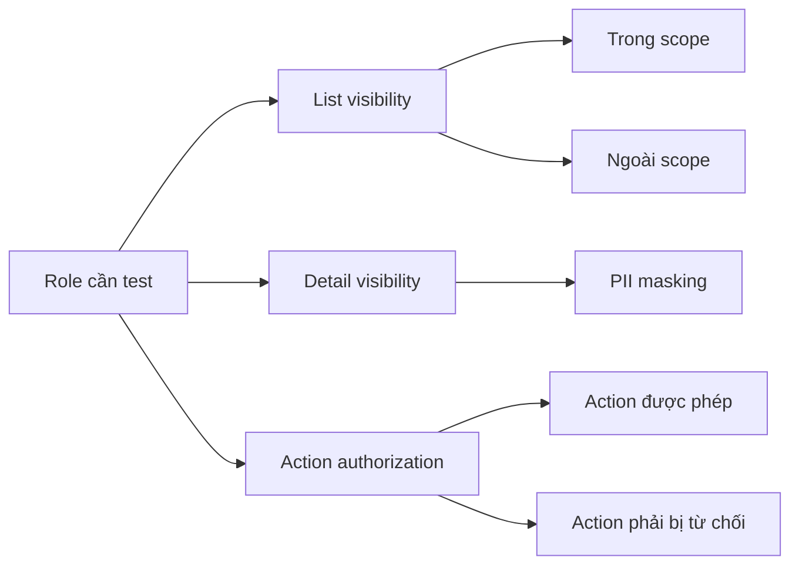

Kỳ vọng quan trọng:

- List và detail phải dùng cùng định nghĩa visibility.
- Không trả `200 + empty` cho lỗi authorization thật; empty chỉ dùng khi scope
  hợp lệ nhưng không có dữ liệu.
- FE ẩn nút chỉ là UX. BFF/Core vẫn phải enforce quyền server-side.
- Một role chỉ-xem không được nhận pipeline role có khả năng mutate.
- Reassign không được làm sai semantics của `everAssignedTo`.

## 11. Vị trí code tham chiếu

### `vhm-agent-api`

- `Role.java`: khai báo role ID và các role group.
- `DossierScopeResolver.java`: role → scope/pipeline role.
- `DossierScope.java`: scope → query filter.
- `RegistrationServiceImpl.list()`: gate audience, build query và gọi Core.
- `DossierActorContextInterceptor`: ký actor context gửi Core.

### `vhm-dossier-core`

- `DossierController.search()`: parse request danh sách.
- `DossierServiceImpl.search()`: compose queue/filter/visibility specs.
- `DossierAccessGuard`: enforce read/detail/action visibility.
- `DossierSpecs`: SQL/JPA predicates.
- `DossierQueue`: semantics của `PKD_ALL`, `PTT_ALL`, các tab con.
- `DossierStageReviewerEntity`: reviewer hiện tại theo dossier/stage.

## 12. Kết luận

Ma trận role mô tả **nghiệp vụ được phép**, còn tập data trả về được quyết định
bởi chuỗi `role → scope → BFF filter → signed visibility → Core predicate`.

Defect `BDSKD-8791` không nên sửa bằng cách chỉ ẩn/hiện nút FE. Cần chốt lại
semantics assignment của role 910, bổ sung lịch sử reviewer thật và enforce
REGION/DEPARTMENT/TEAM tại Core. Sau đó dùng cùng một policy cho list, detail và
action để tránh mỗi API hiểu scope theo một cách khác nhau.
