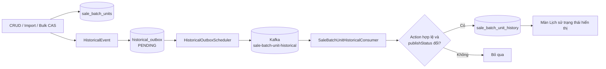
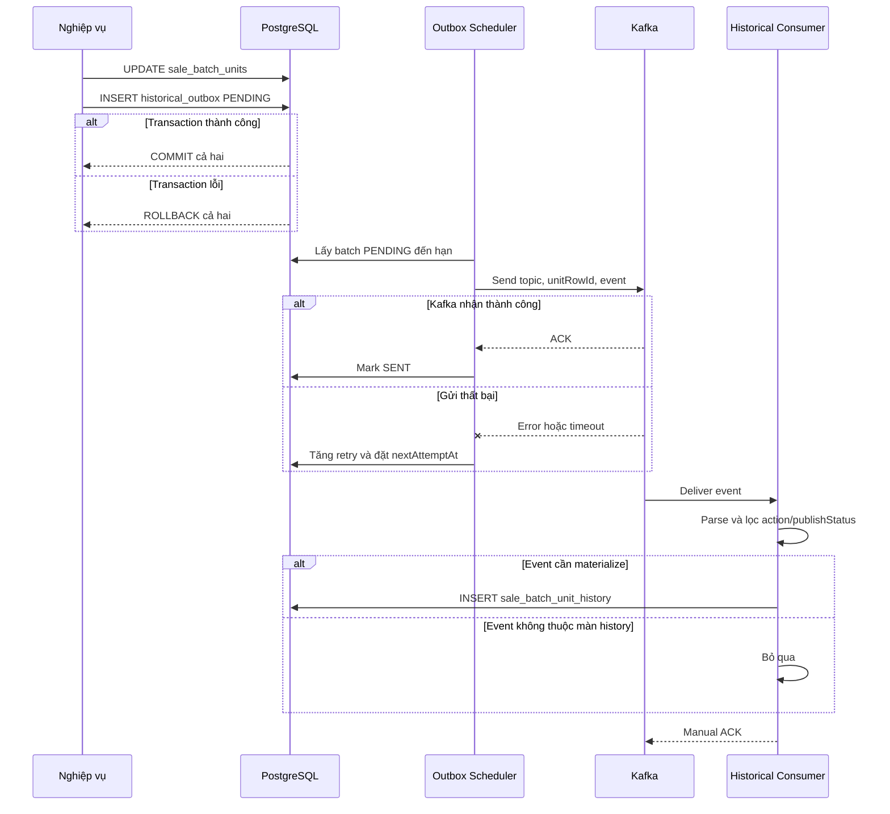
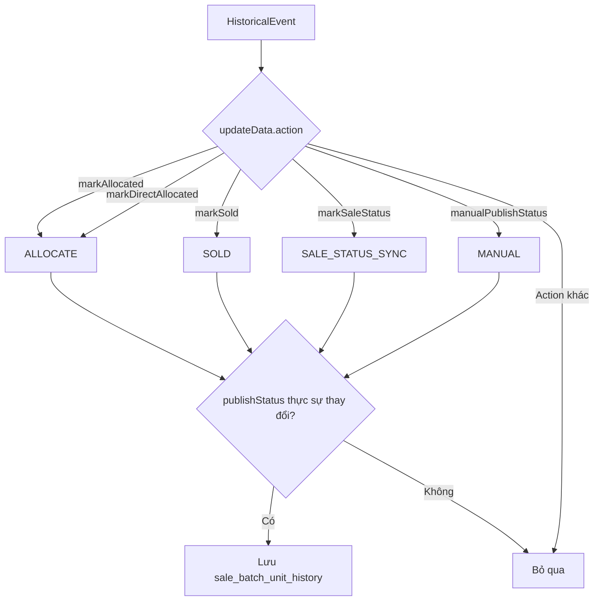
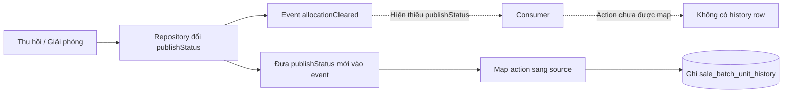

# SaleBatchUnit historical flow review

## 1. Mục đích

Luồng historical của `sale_batch_units` có hai mục đích khác nhau:

1. Phát mọi thay đổi quan trọng của căn lên Kafka dưới dạng `HistoricalEvent`.
2. Consume lại một phần event để tạo bảng `sale_batch_unit_history` phục vụ màn **Lịch sử thay đổi trạng thái hiển thị**.

Vì vậy, topic chứa nhiều loại thay đổi hơn dữ liệu được ghi vào bảng history.

```text
Nghiệp vụ thay đổi sale_batch_units
        -> historical_outbox
        -> Kafka sale-batch-unit-historical
        -> SaleBatchUnitHistoricalConsumer
        -> lọc event đổi publishStatus
        -> sale_batch_unit_history
```



## 2. Producer

### 2.1 CRUD thông thường

`SaleBatchUnitWithHistoricalService` phát event cho:

| Nghiệp vụ | Event |
|---|---|
| Thêm/import căn | `CREATE` |
| Sửa căn | `UPDATE` |
| Xóa một hoặc nhiều căn khả dụng | `DELETE` |

`CREATE` chứa `data`; `UPDATE` chứa `oldData`, `updateData`, `data`; `DELETE` chứa `oldData`.

### 2.2 Bulk update/CAS

Các câu update trực tiếp repository không đi qua decorator. `SaleBatchUnitCasHistoryRecorder` chụp snapshot trước CAS và chỉ phát event khi CAS thành công.

| Action | Thay đổi chính |
|---|---|
| `markAllocated` | Cấp căn qua YCPB, đặt `publishStatus=PUBLISHED` |
| `markDirectAllocated` | Cấp căn trực tiếp, đặt `publishStatus=PUBLISHED` |
| `markSold` | Chuyển căn thành SOLD, đặt `publishStatus=PUBLISHED` |
| `markUnsold` | Đảo SOLD về ALLOCATED |
| `markSaleStatus` | Đồng bộ trạng thái bán; SOLD/BOOKING/DEPOSITED đặt `publishStatus=PUBLISHED` |
| `manualPublishStatus` | Người dùng đổi PUBLISHED/HIDDEN |
| `reclaimAllocated` | Thu hồi căn |
| `releaseAllocation` | Giải phóng căn |
| `clearAllocatedByUnitId` | Xóa allocation theo property/unit id |
| `markDistributed` | Đánh dấu đã phân phối |
| `clearDistributed` | Xóa trạng thái đã phân phối |

## 3. Transactional outbox

`HistoricalOutboxService.enqueue()` không gửi Kafka trực tiếp. Nó insert một row `PENDING` vào `historical_outbox` trong cùng transaction với thay đổi nghiệp vụ.

- Transaction rollback: thay đổi căn và outbox cùng rollback.
- Transaction commit: event chắc chắn còn trong database để gửi sau.

`HistoricalOutboxScheduler` định kỳ:

1. Lấy các row đến hạn.
2. Gửi JSON lên topic cấu hình bởi `KAFKA_TOPIC_SALE_BATCH_UNIT_HISTORICAL`.
3. Kafka key là `sale_batch_units.id`.
4. Thành công chuyển row thành `SENT`.
5. Thất bại retry theo exponential backoff; quá giới hạn thành `FAILED_PERMANENT`.

Delivery là **at-least-once**, nên consumer phải chịu được event trùng.



## 4. Consumer

`SaleBatchUnitHistoricalConsumer` parse `HistoricalEvent` và gọi `SaleBatchUnitHistoryService.record()`.

Consumer chỉ tạo history khi:

1. Action được map sang một `UnitHistorySource`.
2. `objectId` là UUID hợp lệ.
3. `updateData.publishStatus` tồn tại.
4. `oldData.publishStatus != updateData.publishStatus`.

### Action hiện được ghi history

| Action | Source | Performer lưu vào history |
|---|---|---|
| `markAllocated` | `ALLOCATE` | `system` |
| `markDirectAllocated` | `ALLOCATE` | `system` |
| `markSold` | `SOLD` | `system` |
| `markSaleStatus` | `SALE_STATUS_SYNC` | `system` |
| `manualPublishStatus` | `MANUAL` | User thực hiện |



### Action được publish nhưng consumer bỏ qua

| Action/event | Lý do |
|---|---|
| `CREATE` | Không có action CAS được map |
| `DELETE` | Không có action CAS được map |
| Update category/thông tin khác | Không thuộc history `publishStatus` |
| `markUnsold` | Không gửi `publishStatus` mới |
| `reclaimAllocated` | Chưa map source và payload recorder không chứa `publishStatus` |
| `releaseAllocation` | Chưa map source và payload recorder không chứa `publishStatus` |
| `clearAllocatedByUnitId` | Chưa map source và payload recorder không chứa `publishStatus` |
| `markDistributed` | Không đổi `publishStatus` |
| `clearDistributed` | Không đổi `publishStatus` |

## 5. Dữ liệu được materialize

Một event hợp lệ tạo row trong `sale_batch_unit_history` gồm:

- `batchId`
- `unitRowId`
- `unitCode`
- `projectId`, `projectName`
- `sapId`
- `field=publishStatus`
- `oldValue`, `newValue`
- `source`
- `performer`
- `eventAt`

Các trường mô tả căn lấy từ `oldData`, nên history giữ snapshot tại thời điểm event thay vì đọc trạng thái hiện tại.

## 6. ACK, retry và deduplication

- JSON không hợp lệ: log lỗi và ACK để tránh poison message chặn partition.
- Ghi DB thành công: ACK.
- `historyService.record()` lỗi DB: exception thoát ra trước ACK, record có thể được Kafka xử lý lại.
- Event trùng được kiểm tra theo `(unitRowId, eventAt, field, newValue)`.

Hiện deduplication là `exists` trước `insert`; migration chưa có unique constraint tương ứng. Hai consumer xử lý đồng thời vẫn có thể tạo row trùng. Nên bổ sung unique index nếu cần bảo đảm ở tầng DB.

## 7. Điểm cần review

### 7.1 Tên consumer rộng hơn chức năng thực tế

`SaleBatchUnitHistoricalConsumer` không lưu toàn bộ lịch sử căn. Nó chỉ materialize lịch sử đổi `publishStatus`.

Có thể giữ tên hiện tại, nhưng cần thống nhất rằng topic là lịch sử tổng quát còn bảng `sale_batch_unit_history` là projection riêng cho màn trạng thái hiển thị.

### 7.2 Thiếu lịch sử khi thu hồi/giải phóng làm đổi publishStatus

Repository có thể đổi `publishStatus` khi chạy:

- `reclaimAllocated`
- `releaseAllocation`
- `clearAllocatedByUnitId`

Nhưng `allocationCleared()` chưa đưa `publishStatus` vào `updateData`, đồng thời consumer chưa map ba action này. Nếu SRS yêu cầu màn lịch sử ghi nhận các lần chuyển trạng thái hiển thị này, cần:

1. Truyền trạng thái `publishStatus` sau CAS vào `allocationCleared()`.
2. Đưa field đó vào `oldData/updateData/data` đúng giá trị.
3. Map ba action sang source nghiệp vụ phù hợp.
4. Bổ sung test producer, consumer và redelivery.



### 7.3 At-least-once cần unique constraint

Nên thêm unique constraint theo dedup key hoặc tốt hơn bổ sung `eventId` ổn định vào contract và unique theo `eventId`.

## 8. Kết luận

Thiết kế producer -> transactional outbox -> Kafka -> consumer là đúng hướng và tránh mất event giữa DB/Kafka. Phần cần xác nhận nghiệp vụ là liệu history UI có phải ghi cả thay đổi `publishStatus` do thu hồi/giải phóng hay không. Nếu có, implementation hiện tại chưa phủ đủ ba action nêu trên.
