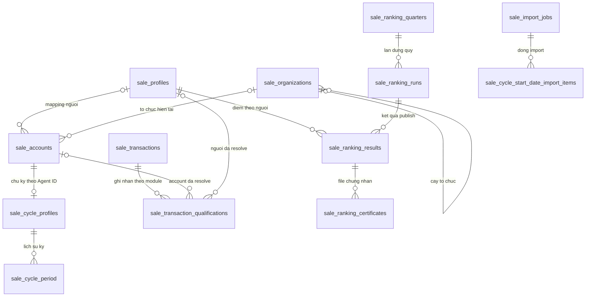

# sale_performance_db — Schema và luồng dữ liệu chung 9531/9533

Cập nhật 05/10/2026. DB này thuộc một service `vhm-sale-performance`. [TDD chung](sale-performance-TDD.md) giải thích kiến trúc; tài liệu này là định nghĩa chuẩn của bảng dùng chung. Tất cả bảng là đề xuất, chưa có migration/DB đã tạo.

## 1. Quy ước và ownership

Một PostgreSQL DB, một migration chain. Prefix `sale_` cho dữ liệu dùng chung, `sale_ranking_` cho module 9531, `sale_cycle_` cho module 9533. Prefix không phải một service hoặc datasource riêng.

ID nội bộ UUID, tenant scope bắt buộc, timestamp UTC TIMESTAMPTZ, ngày nghiệp vụ DATE. Tiền NUMERIC(24,4), weights NUMERIC(9,6), score NUMERIC(38,10) theo contract đã giới hạn scale; không float/double. Phân quý và lịch ngày dùng Asia/Ho_Chi_Minh. FK chỉ trong DB này, cùng tenant; ID user/org của profile-mw là external reference.

Common adapter ghi hồ sơ/tổ chức; common consumer ghi ledger/qualifier; từng engine chỉ ghi bảng/kết quả của module mình. Shared task/audit/outbox chứa module để phân handler, dedupe, quyền vận hành và metric.

## 2. Bảng dùng chung

### 2.1. sale_profiles — người ổn định

| Field | Ý nghĩa |
| --- | --- |
| id, tenant_id | Khóa người nội bộ và tenant |
| source, stable_source_identity | Khóa người hoặc mapping được nguồn xác nhận, giữ qua account nếu đúng nghiệp vụ |
| mapping_status | VERIFIED/PENDING/CONFLICT; không tự gộp theo tên/phone |
| current_account_id nullable | Account đại diện hiện tại theo nguồn/mapping rõ |
| input_version, created_at, updated_at | Version mapping và dấu vết thay đổi |

UNIQUE tenant/source/stable identity khi có khóa đã xác nhận. Account có thể chưa resolve về người, để cycle vẫn tính theo account; ranking chưa chốt người thiếu mapping. Không coi employee_id/cobroker_profile_id mặc định là khóa mọi đối tượng.

### 2.2. sale_accounts — tài khoản Agent và bản đọc hồ sơ

| Field | Ý nghĩa |
| --- | --- |
| id, tenant_id, agent_profile_id | Account nội bộ; UNIQUE tenant/Agent ID |
| profile_id nullable, external_user_id, source | Người ổn định và ID user nguồn |
| audience, organization_id, agency_external_id, agency_name | Đại lý/O2O/Tự doanh và tổ chức hiện tại |
| display_name, name_search, employee_code, identity_code, phone, email | Whitelist field phục vụ báo cáo SRS |
| account_status, source_status | Trạng thái đã mapping và giá trị nguồn để truy nguyên |
| source_start_date nullable, start_date_provenance | Ngày bán nhận từ nguồn nếu field/mốc đúng nghĩa; đầu vào nguồn, không phải manual override |
| snapshot_hash, source_updated_at, synced_at, input_version | Nhận diện snapshot/độ trễ; input_version thay đổi theo đầu vào dùng tính |

Không sao chép user/role/session đầy đủ. Không lưu password/token. API mới không sửa danh tính nguồn. Ngày áp dụng/override nằm ở cycle profile; ranking không dùng ngày bán này.

### 2.3. sale_organizations — cây tổ chức nguồn

id, tenant_id, source, external_org_id, parent_id nullable, name, type, source_status, snapshot_hash, synced_at. UNIQUE tenant/source/external_org_id. Parent FK tới tổ chức trong DB này, không tạo chu trình; parent thiếu giữ chờ resolve. User.team varchar cần resolve đúng mã/ID, không cast mọi chuỗi thành team.id.

### 2.4. sale_transactions — khóa GD chung và thông tin vận hành

id, tenant_id, source, business_transaction_id, source_reference, business_status nullable, master_source_revision nullable, last_event_id, received_at, updated_at. UNIQUE tenant/source/business_transaction_id.

Một GD nghiệp vụ có một header, dù tới qua nhiều milestone hoặc được hai module dùng. Header giữ ID/reference/trạng thái vận hành nguồn, **không có business_date hoặc qualified/revoked dùng chung để đếm**. Phần MASTER nếu có phải có revision riêng; event chỉ có section module không tự ghi đè business_status/master revision. Không lưu toàn payload chứa PII không cần thiết.

### 2.5. sale_transaction_qualifications — đầu vào tính của GD theo module

| Field | Ý nghĩa |
| --- | --- |
| id, tenant_id, transaction_id, module | Một ghi nhận hiện hành của một GD cho RANKING hoặc CYCLE |
| source_sale_id, account_id nullable, profile_id nullable | Attribution và mapping tài khoản/người của section nguồn |
| qualification_date, qualified_at nullable, milestone | Ngày/mốc tính riêng: cycle TTĐC/TTKQ hoặc ranking xác nhận HĐMB/VBCN |
| recognition_status, reason | PENDING/RECOGNIZED/REVOKED/INVALID_CORRECTION; allowed transition theo module |
| purchase_type nullable, net_revenue nullable, currency nullable | RANKING kiểm mua sơ cấp và cần giá trị không VAT/KPBT; không cộng giá tổng không rõ thuế/phí |
| project_id nullable, agency_at_transaction nullable | Snapshot attribution/dự án do nguồn gửi, không lấy agency hiện tại thay lịch sử |
| source_revision, source_event_id, source_occurred_at, received_at | Revision theo transaction/module và dấu vết tiếp nhận |
| resolution_status | UNRESOLVED/ACCOUNT_ONLY/RESOLVED; có thể đủ cho cycle nhưng chưa đủ cho ranking |

UNIQUE transaction/module. Hai rows không phải hai bản sao GD: chúng lưu **hai cách ghi nhận nghiệp vụ khác nhau**, có thể khác mốc/trạng thái/revision. Worker cycle đếm qualifier module=CYCLE, account đã resolve; worker ranking cộng qualifier module=RANKING, profile đã resolve và net revenue hợp lệ. Mỗi worker join header để biết khóa GD, không đọc business_status làm eligibility.

Section module phải có snapshot đầu vào đủ theo contract. Event chưa có ranking section không được coi là ranking invalid/revoked. Nếu source_revision chỉ có nghĩa trong mỗi topic/producer, hợp đồng phải chuẩn hóa revision namespace trước ingest; không so revision CYCLE với RANKING hoặc MASTER.

Ranking cancellation thường chỉ đổi header hoặc giữ qualifier RECOGNIZED, không trừ count/revenue. Ranking INVALID_CORRECTION phải là correction sai fact được phân biệt rõ. Cycle REVOKED chỉ từ quyết định ghi nhận/thu hồi của pipeline, không suy từ flag cancellation chung.

### 2.6. sale_tasks — việc nền chung, handler riêng

id, tenant_id, module COMMON/RANKING/CYCLE, type, ref_id, payload JSON, input_revision nullable, dedupe_key, status PENDING/PROCESSING/RETRY/DONE/FAILED, attempts, available_at, lease_until, error, created_at, completed_at.

UNIQUE tenant/module/dedupe_key; key gồm loại/ref/revision/ngày xét khi cần. Claim/CAS và lease cho task kẹt. Queue/index có module/type/status/available_at để worker dành năng lực riêng. COMMON xử lý sync/resolve; RANKING xử lý quarterly rebuild/close; CYCLE evaluate/rebuild/import. Không dùng task RANKING để sửa cycle period hoặc task CYCLE để sửa ranking run.

### 2.7. sale_audit_logs — truy nguyên chung

id, tenant_id, module COMMON/RANKING/CYCLE, actor, action, entity_type, entity_id, before/after JSON, metadata JSON, correlation_id, occurred_at. Append-only, tenant scope; index module/entity/time. Export log cũng ở đây, metadata có filter/quarters hoặc cycle scope/row count/file reference. Không nhân thêm audit hoặc export-log table mỗi module.

### 2.8. sale_import_jobs — header lần import

id, tenant_id, module, import_type, actor, file_reference/hash, status, total_rows, valid_rows, failed_rows, applied_rows, created_at, completed_at. Hiện module=CYCLE/import_type=START_DATE. Items nằm ở sale_cycle_start_date_import_items: job_id,row_number,cycle_profile_id,proposed_date,expected_version,status VALID/FAILED/APPLIED,error,applied_at.

UNIQUE job/row ở items. Không tạo ranking import hoặc handler chỉ vì đã có bảng header chung; SRS 9531 không có US import ngày bán.

### 2.9. sale_event_outbox — event kết quả ra bên ngoài

id/event_id, tenant_id, module, aggregate_id, result_revision, event_type, destination, payload JSON, status, attempts, next_attempt_at, lease_until, published_at, error. UNIQUE event_id và business dedupe key phù hợp aggregate/type/revision.

Hiện CYCLE phát SaleCycleEligibilityChanged để bên room dùng; RANKING badge lấy qua API, không bắt buộc phát event. Ghi outbox cùng transaction publish kết quả; publisher có thể resend, consumer ngoài dùng eventId/revision. Certificate/delivery đã có queue riêng, không tạo thêm outbox cho cùng một công việc gửi/file.

## 3. Bảng nghiệp vụ riêng

| Module | Bảng | Ý nghĩa |
| --- | --- | --- |
| CYCLE | sale_cycle_profiles | Đầu vào và hiện trạng chu kỳ theo một sale_account_id, UNIQUE account |
| CYCLE | sale_cycle_policy, sale_cycle_policy_rule | Policy ngày hiệu lực và rule tháng/chỉ tiêu theo audience |
| CYCLE | sale_cycle_period | Kỳ official/trial và generation/lịch sử/kết quả |
| CYCLE | sale_cycle_start_date_import_items | Dòng import đã áp dụng/version/error |
| CYCLE | sale_cycle_notification_delivery | Lịch gửi và SENT/FAILED theo kỳ/receiver/kênh/mốc |
| RANKING | sale_ranking_policy, sale_ranking_policy_rule | Policy quý/audience, weights và min_score/quota ba hạng |
| RANKING | sale_ranking_quarters, sale_ranking_runs, sale_ranking_results | Kỳ quý, lần dựng toàn tập và kết quả từng sale_profiles |
| RANKING | sale_ranking_certificates | File/queue render gắn result và template version |

Cycle profile: id, tenant_id, sale_account_id, audience áp dụng, source_start_date/applied_start_date/start_date_source/manual_override, input_revision, published_generation/result_revision, classification, current_period_id/latest_official_period_id/latest_challenge_period_id, room_excluded nullable, data_status/calculated_at, source_complete_through_date/source_watermark riêng cycle. Source_start_date ở đây là giá trị đầu vào đã tiếp nhận cho chu kỳ, còn account giữ ngày nguồn mới nhất để so override/version; không copy tên/phone/org.

Policy cycle có mode tuần tự/tức thì và lịch nhắc, khác hoàn toàn policy ranking theo quý. Chưa tính/thiếu nguồn khác với đã chốt không đạt hoặc NONE. Các field và luật bảng riêng vẫn theo TDD từng module.

## 4. Quan hệ toàn DB



Qualifier không FK tới cycle profile: account_id là khóa nối chung; engine cycle resolve cycle profile theo account. Ranking dùng profile_id. Những ref task/audit/outbox đa loại không bắt buộc FK tới mọi bảng.

## 5. Luồng sync hồ sơ dùng chung

Read-only profile-mw user/roles/team → gom một account cho mỗi Agent ID → resolve person/org/nhóm/ngày → transaction DB mới cập nhật account/profile/org/hash → audit COMMON nếu thay mapping/đầu vào quan trọng → task module bị ảnh hưởng → commit.

Full batch có thứ tự ổn định, không chạy chồng; đối soát role/team dù user.updated_time không đổi. Đồng bộ không gọi API nội bộ giữa hai module. Tạo cycle profile chỉ khi account thuộc tập theo dõi 9533; tạo ranking candidate theo tập 9531. Không coi tập hai module luôn bằng nhau.

Thiếu stable person mapping không chặn cycle theo Agent ID nếu account đã đủ. Resolver khi mapping có gắn qualifier profile_id và invalidates ranking; không tự gộp chu kỳ của hai account. Tên/contact mới không rewrite result FINAL/certificate đã công nhận.

## 6. Luồng Kafka chung và router hai module

```text
Kafka → validate ID GD + section module + revision namespace
  → transaction:
      upsert sale_transactions theo khóa nguồn
      upsert qualifier CYCLE nếu có section CYCLE
      upsert qualifier RANKING nếu có section RANKING
      audit theo section đã đổi
      bump input revisions + task đúng module/ref
  → commit
  → ack Kafka
```

Khóa writer theo GD và các aggregate cần invalidate có thứ tự thống nhất module/ref để giảm deadlock. Receiver khóa header/qualifier khi so revision; worker chỉ đọc snapshot và khóa aggregate ngắn khi publish. Không gọi provider/Kafka output trong transaction.

Event cũ/duplicate cùng module no-op. Cùng revision khác nội dung là lỗi hợp đồng. Event partial chỉ cập nhật section có mặt; không NULL hoặc revoke section khác. Payload invalid đưa DLT bền vững với reason/namespace; DB/DLT publish lỗi chưa ack. Header được tạo kể cả chưa resolve account; qualifier PENDING giữ dữ liệu để đối soát.

| Qualifier thay đổi | Công việc CYCLE | Công việc RANKING |
| --- | --- | --- |
| CYCLE ghi nhận/thu hồi/ngày/sale | Evaluate/rebuild account cũ/mới | Không tạo task ranking |
| RANKING doanh số/ngày/người/correction | Không tạo task cycle | Rebuild Q và Q+1; đổi ngày còn ảnh hưởng quý cũ/mới |
| Cả hai section được nguồn sửa | Task cycle theo section cycle | Task ranking theo section ranking |
| Chỉ MASTER business_status=CANCELED | Không suy ra thu hồi cycle | Không trừ score/count ranking |
| Account resolve nhưng person chưa resolve | Có thể tính cycle nếu đủ đầu vào | Chờ mapping, không chốt tier NONE |

Completeness/watermark phải theo tenant/module/phạm vi nguồn và mốc dữ liệu cần tính. Ranking đủ Q2/Q3 không chứng minh cycle đã có đủ lịch sử từ ngày bán. Không dùng một backfill_complete chung cho hai module.

## 7. Publish kết quả: hai transaction nghiệp vụ riêng

**Cycle:** cycle task đọc account + cycle profile/policy + qualifier CYCLE → dựng generation → khóa cycle profile/so input revision → publish period/pointers/classification/exclusion → audit CYCLE + delivery + outbox eligibility → commit.

**Ranking:** ranking task đọc person/accounts + ranking policy + qualifier RANKING → dựng run toàn quý → khóa quarter/so input revision+policy hash → publish quarterly results → audit RANKING + certificates PENDING → commit.

Không yêu cầu cycle và ranking publish cùng lúc. Hạng Kim cương không làm sale đạt chu kỳ; thử thách không loại sale khỏi bảng hạng. Task lỗi một module không đổi trạng thái kết quả module kia.

## 8. Ví dụ cùng một GD đi qua hai module

Giả sử pipeline đã xác nhận cùng ID G1, sale account A, person P. Ngày/mốc dưới đây chỉ minh họa, không thay contract nguồn.

| Sự kiện | Ledger chung | Cycle | Ranking |
| --- | --- | --- | --- |
| 05/08 TTĐC đủ điều kiện cycle | Header G1 + CYCLE RECOGNIZED ngày 05/08 | Count kỳ chứa 05/08 tăng từ qualifier | Chưa có qualifier ranking; không cộng doanh số |
| 20/08 KH xác nhận HĐMB, giá net 10 tỷ | Cùng header G1 + RANKING RECOGNIZED ngày 20/08 | Không đếm thêm lần thứ hai | Q3 count=1, revenue=10 tỷ; ảnh hưởng score Q3/Q4 |
| Resend event ranking | Cùng khóa/revision, no-op | Không thay đổi | Không đếm đôi |
| Hủy GD sau đó | Header business_status=CANCELED | Chỉ đổi nếu pipeline gửi CYCLE REVOKED riêng | Giữ qualifier RECOGNIZED theo SRS |
| Pipeline gửi CYCLE REVOKED | Chỉ revision qualifier CYCLE tăng | Rebuild chu kỳ account A | Count/revenue vẫn giữ |
| Correction net ranking 9 tỷ được duyệt | Chỉ qualifier RANKING snapshot/revision đổi | Không trừ count cycle | Rebuild Q3/Q4; quý đã final giữ pending correction đến khi duyệt publish |

Mỗi module đếm một lần theo transaction_id/module của mình, không đếm tổng số qualifier trong ledger.

## 9. Quyền, queue và file chung

Identity/tenant chung nhưng endpoint guard theo SRS module. API export ranking không lấy guard cycle để cấp role 21 quyền xuất. Task/admin action kiểm module và actor/reason; certificate owner kiểm person mapping, cycle sửa ngày kiểm role/expectedVersion.

Lease/retry shared nhưng handler/task types riêng. Certificate renderer và notification sender claim chính bảng certificate/delivery; outbox publisher claim sale_event_outbox. Không tạo task và queue row để cùng làm một lần gửi/render, trừ task chỉ chuẩn bị dữ liệu.

Cùng object storage, key chia tenant/module/entity/version. File import/export/cert có ACL và thời hạn tải; không public path. Restore cùng DB phải đối soát file reference và kết quả hai module, không chỉ bật API một phần không kiểm completeness.

## 10. Mapping thiết kế cũ sang thiết kế hiện hành

| Bảng/cách chia cũ | Thiết kế hiện hành |
| --- | --- |
| Hồ sơ/tổ chức riêng cho mỗi US | sale_profiles, sale_accounts, sale_organizations chung |
| Hai ledger transactions riêng | sale_transactions chung + sale_transaction_qualifications theo module |
| Hai task/audit riêng | sale_tasks/sale_audit_logs chung có module |
| Import header cycle riêng | sale_import_jobs, module CYCLE |
| Outbox cycle riêng | sale_event_outbox, module CYCLE |
| Sale cycle profile chứa tên/contact/org | Chỉ account FK + đầu vào/kết quả cycle; tên/contact/org từ sale_accounts |
| Hai service/DB sở hữu riêng | vhm-sale-performance / sale_performance_db |

Đây là thay đổi **tài liệu thiết kế**, không có SQL rename/migrate dữ liệu thực tế. Chỉ tạo bảng cần cho bước triển khai tương ứng. Các tài liệu từng US phải dùng tên và ownership ở đây, không tạo lại hạ tầng theo prefix module.
