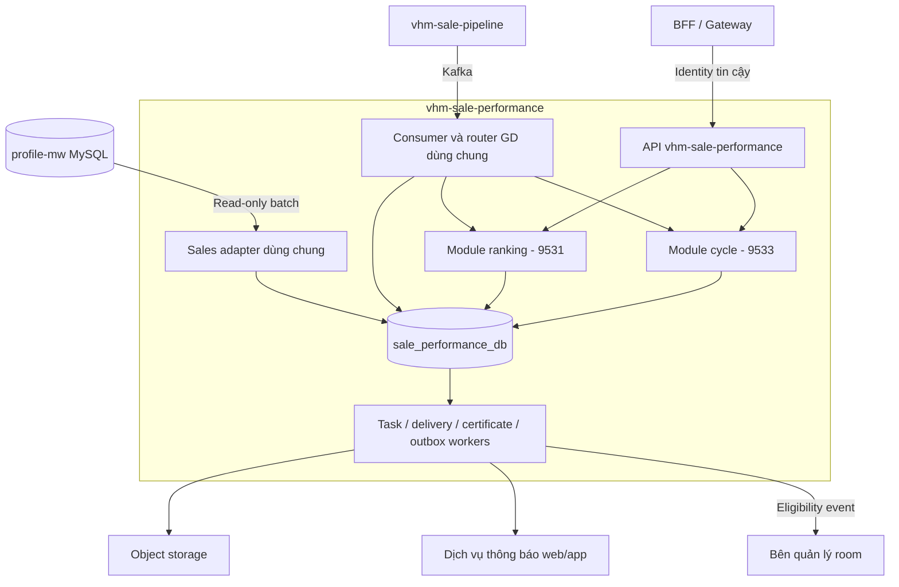

# vhm-sale-performance — TDD quản lý hiệu quả bán hàng của sale

Cập nhật 05/10/2026. Người dùng chốt BDSKD-9531 và BDSKD-9533 trong **cùng một service và một DB**. Tài liệu này thay thế các phương án tách `ranking` và `cycle` thành service/DB riêng trước đó.

## 1. Tên và phạm vi

| Thành phần | Tên chuẩn | Ý nghĩa |
| --- | --- | --- |
| Service/repository/artifact | `vhm-sale-performance` | Quản lý hiệu quả bán hàng của sale: xếp hạng doanh số và kết quả chu kỳ |
| DB nghiệp vụ PostgreSQL | `sale_performance_db` | Một DB ghi dữ liệu của cả hai module |
| Module 9531 | `ranking` | Chỉ số theo quý, điểm/hạng, badge và chứng nhận |
| Module 9533 | `cycle` | Chính thức/thử thách, kết quả chu kỳ, điều kiện room và thông báo |
| Thành phần dùng chung | `sales`, `transactions`, `identity`, `jobs`, `audit` | Hồ sơ/định danh/tổ chức, nhận nguồn và hạ tầng xử lý |

Tên service dùng tiền tố vhm và dấu gạch ngang theo cách đặt tên service hiện hữu. DB dùng snake_case và hậu tố _db, thuận tiện cấu hình PostgreSQL. Performance diễn tả kết quả/hiệu quả bán hàng, bao phủ cả hai nghiệp vụ; không giới hạn tên theo một US hoặc theo doanh số đơn thuần.

DB này hoàn toàn độc lập với core-broker. Các bảng profile-mw vẫn là dữ liệu nguồn bên ngoài, **chỉ đọc**, không nằm trong DB nghiệp vụ mới. Không triển khai hai datasource ghi riêng cho 9531/9533.

## 2. Kiến trúc tổng thể

Một codebase/artifact, migration chain và DB ownership. API/scheduler/worker có thể có replica và cấu hình runtime role riêng từ cùng artifact. Ranh giới module ở package, service interface, task type và bảng nghiệp vụ; không cần HTTP/Kafka nội bộ giữa ranking và cycle.

## 3. Phần dùng chung và phần riêng

| Dữ liệu/cơ chế | Dùng chung | Riêng theo module |
| --- | --- | --- |
| Hồ sơ/tài khoản/tổ chức | sale_profiles, sale_accounts, sale_organizations | cycle profile chỉ lưu đầu vào/kết quả chu kỳ theo account |
| Tiếp nhận GD | sale_transactions giữ khóa GD nguồn; consumer/dedupe chung | sale_transaction_qualifications có row RANKING/CYCLE và đầu vào tính riêng |
| Policy | Chung quy ước immutable/version/request_id | sale_ranking_policy/rule và sale_cycle_policy/rule, khác cấu trúc/ngày hiệu lực |
| Kết quả | Chung quy ước publish nguyên tử/audit | ranking quarters/runs/results; cycle period và hiện trạng chu kỳ |
| Việc nền | sale_tasks, lease/retry/dedupe, module discriminator | Handler/rate/flag riêng ranking/cycle; certificate và delivery có queue bền vững riêng |
| Audit | sale_audit_logs với module/action/entity | Snapshot nghiệp vụ tương ứng |
| Import | sale_import_jobs header trong cùng DB | Hiện chỉ cycle có import ngày bán và bảng items riêng |
| Event kết quả | sale_event_outbox | Hiện cycle phát room eligibility; ranking đọc badge qua API |
| File | Object storage/config/quyền dùng chung | Certificate 9531, Excel hai module, file import 9533 |

Policy riêng vì 9531 dùng quý/trọng số/ngưỡng/quota; 9533 dùng ngày hiệu lực/số tháng/chỉ tiêu/mode tuần tự-tức thì. Không gom vào một bảng policy JSON khiến hai engine dùng nhầm rule.

Không tạo thêm bảng request/export/badge generic. Policy có request_id/hash, export audit dùng bảng chung, badge suy ra từ result quý. Không sao chép toàn bộ user/role/session của profile-mw.

## 4. Định danh chung, vòng đời khác nhau

`Sale profile` là người ổn định; `sale account` là tài khoản Agent có tổ chức/đại lý theo nguồn. Một người có thể có nhiều account qua chuyển đại lý. Nguồn/mapping phải xác nhận liên kết người; không nối theo tên/phone.

- **Ranking:** cộng GD theo sale_profiles để giữ điểm xuyên account theo PRD; hiển thị account thích hợp và kiểm scope như tài liệu 9531.
- **Cycle:** sale_cycle_profiles UNIQUE sale_account_id; mỗi Agent ID giữ chu kỳ riêng theo thiết kế hiện hành của 9533. Mapping hai account cùng người không tự gộp/reset chu kỳ; luật nối lịch sử còn cần PO chốt.

Thông tin tên/contact/org/role được adapter dùng chung cập nhật trên account/org. Cycle profile không chứa bản sao danh tính. Ranking result giữ snapshot tại lần công nhận để giải thích hạng và render certificate, không phải master user thứ hai.

## 5. Ledger chung và ghi nhận theo module

Một GD nguồn có một sale_transactions row theo tenant + source + business_transaction_id. Một GD có thể có tối đa một bản ghi hiện hành cho mỗi module trong sale_transaction_qualifications. Qualifier lưu **đầu vào đã chuẩn hóa của module**: sale nguồn/account/profile, ngày tính, trạng thái ghi nhận, revision và snapshot cần tính; ranking thêm net revenue/currency/project/đại lý lịch sử.

| Luật | RANKING | CYCLE |
| --- | --- | --- |
| Mốc được tính | KH xác nhận HĐMB/VBCN | GD TTĐC/TTKQ đủ điều kiện do pipeline xác định |
| Số tiền | Net revenue không VAT/KPBT | Chủ yếu count GD |
| Phân thời gian | Quý Q và Q−1 theo ngày ranking | Kỳ theo ngày bắt đầu/official/trial |
| GD hủy sau ghi nhận | Vẫn tính; correction sai fact là luồng khác | Pipeline có thể thu hồi ghi nhận theo luật cycle được chốt |
| Đối tượng tính | Người ổn định | Account/Agent ID có cycle profile |

**Không có cờ qualified/revoked chung cho hai module.** Hai qualifier có namespace revision độc lập; event chỉ chứa CYCLE không được ghi đè RANKING, field thiếu không đồng nghĩa thu hồi. Worker mỗi module chỉ đọc qualifier của mình. Trạng thái GD vận hành trên header không tự đổi eligibility.

Topic/payload chưa cung cấp: cần hợp đồng ID GD thống nhất và payload chung hoặc từng section/topic có module/revision rõ. Không giả định Kafka của 9533 đã có net revenue/milestone cho ranking. Nếu nguồn không thể thống nhất khóa GD thì phải hoàn tất normalization với pipeline trước gom ledger, không ghép bằng căn/tên sale.

## 6. Luồng ghi DB và xử lý nền

Consumer validate module sections → transaction upsert GD header + qualifier phần có mặt → tăng input revision aggregate bị ảnh hưởng → audit chung → task theo module → commit → ack Kafka. DB lỗi chưa ack; payload invalid/DLT phải lưu/phát bền vững trước ack. Duplicate theo source ID/revision không đếm lại và không tạo task mới.

Task key gồm tenant/module/type/ref/input_revision/ngày xét. Handler cycle không đụng ranking run; handler ranking không sửa cycle period. Một event ảnh hưởng cả hai module tạo hai task trong transaction tiếp nhận, nhưng mỗi task hoàn tất/retry riêng.

Engine cycle publish profile/period + audit + delivery + room outbox cùng transaction. Engine ranking publish toàn quý + audit + certificate rows cùng transaction. Bên gửi provider/storage/Kafka chạy sau commit. Input đổi khi dựng thì bỏ run/generation cũ; không publish kết quả dở dang.

Chi tiết schema và các ví dụ đi qua cả hai module xem [DB và luồng dùng chung](sale-performance-DB-va-luong-du-lieu.md).

## 7. API, quyền và vận hành

Giữ hai base path nghiệp vụ trên cùng service:

| Base path | Chức năng |
| --- | --- |
| /internal/v1/sale-rankings | Báo cáo quý, policy, export, badge/certificate — 9531 |
| /internal/v1/sale-cycles | Báo cáo chu kỳ, policy, ngày bán/import, eligibility — 9533 |

Identity/tenant/scope middleware dùng chung; mỗi API có quyền nghiệp vụ riêng. Role 21 có thể xem bảng ranking bộ phận nhưng không export; quyền báo cáo cycle theo SRS 9533. Không union quyền của một module thành quyền toàn service. Tải cert kiểm owner; sửa ngày/policy kiểm role và expectedVersion.

One DB pool cho nghiệp vụ, read-only pool profile-mw cho nguồn. Rate/concurrency/index riêng cho ranking rebuild và cycle scheduler để tính toàn quý không làm trễ thông báo/chuyển kỳ. Worker claim task có module filter/fairness, lease và backoff; task FAILED của module này không khóa queue module kia.

Cờ: shared.profile-sync/shared.transaction-ingest; ranking.preview/ranking.finalize/ranking.certificate; cycle.engine/cycle.eligibility-publish/cycle.notification. Tắt side effect một module không dừng ingest qualifier của module khác. Không dùng một flag engine chung cho hai nghiệp vụ.

Theo dõi lag/checkpoint/qualification gaps/task tuổi theo module, cycle rebuild/delivery/outbox, ranking run/cert. Backup/restore cùng DB và object storage, đối soát kết quả hai module theo revision trước mở side effects. Một deployment version áp dụng cho cả hai module; migration backward compatible với API/worker cùng artifact.

## 8. Lộ trình chung

| Bước | Công việc | Đầu ra |
| --- | --- | --- |
| 1 | Tạo repo/service/DB/identity/config/migrations chung | vhm-sale-performance chạy độc lập core-broker |
| 2 | Adapter profile-mw + account/person/org + audit/task | Hai module đọc cùng bản dữ liệu nguồn |
| 3 | Kafka header/qualifier và router theo module | Chống trùng, mapping và revision không chéo |
| 4 | Policy/đầu vào/tính thử từng module | Ranking score hai quý; cycle ngày bán và official/trial |
| 5 | API/list/filter/export từng US | Một service, scope riêng và phân trang đúng |
| 6 | Ranking final/quota/ties + cycle rebuild được BO xác nhận | Kết quả publish nguyên tử từng module |
| 7 | Badge/certificate và room eligibility/notification | Side effects mở độc lập sau đối soát |
| 8 | UAT/rollout cùng service | Đủ nguồn và luật của cả 9531/9533, vận hành theo module |

Chi tiết từng US: [9531 TDD](../9531/BDSKD-9531-xep-hang-sale-theo-doanh-so-TDD.md), [9533 TDD](../9533/BDSKD-9533-theo-doi-chu-ky-ban-hang-TDD.md). Các câu hỏi PO vẫn giữ ở từng bộ SRS; gộp service không giải quyết thay những luật còn mở. Đợt này chỉ sửa tài liệu, không tạo DB/migration/code hoặc triển khai service.
