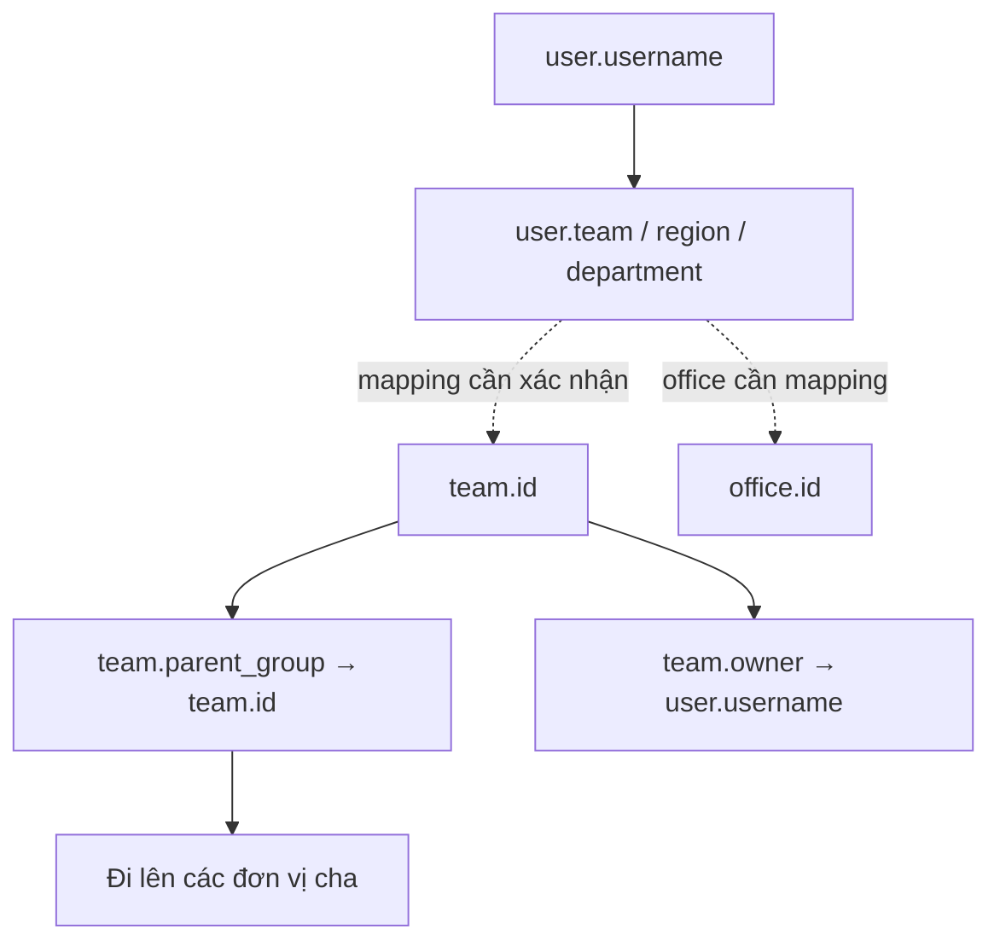
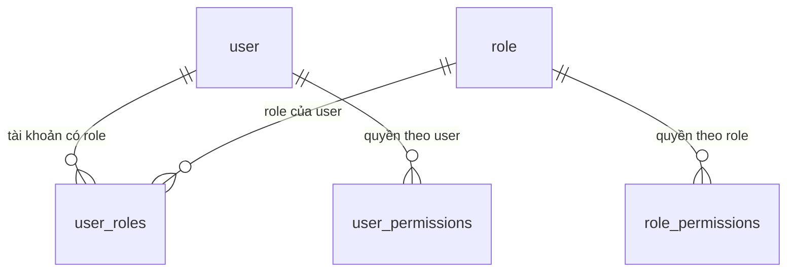
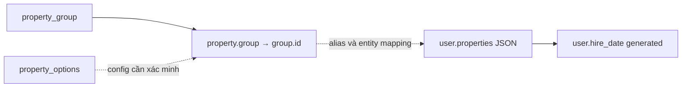
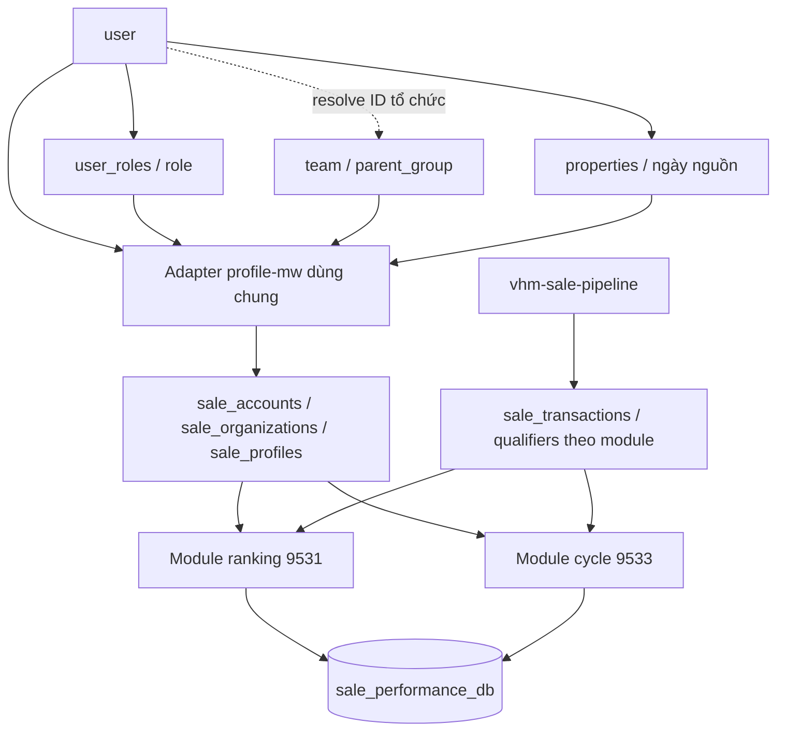

# vhm-sale-performance — Schema và luồng dữ liệu MySQL vhm-profile

Đọc metadata trực tiếp ngày 05/10/2026. Database `vhm-profile`, MySQL 8.0.18: **24 bảng, 231 cột, FK vật lý tại 7 bảng**. Không đọc dữ liệu tài khoản/token/password, không ghi DB.

Tài liệu gồm giải thích theo nhóm bảng, quan hệ, flow và cấu trúc cột/index/FK đầy đủ ở cuối. **Quan hệ FK và biểu thức generated là dữ liệu đã kiểm chứng; flow ứng dụng là cách diễn giải từ schema/comment, chưa xác nhận bằng code profile-mw.** Các giá trị số của type/status không có comment phải kiểm tra enum, không tự suy nghĩa từ default.

## 1. Các nhóm dữ liệu

| Nhóm | Bảng | Mục đích |
| --- | --- | --- |
| Tài khoản | user, user_settings | Danh tính, thông tin nhân viên và setting |
| Tổ chức | team, team_distribute_setting, office | Cây đơn vị, người quản lý, cấu hình phân phối và văn phòng |
| Quyền | role, user_roles, role_permissions, user_permissions, permission_setting | Role/quyền tài khoản và cấu hình phạm vi hành động |
| Trường động | property, property_group, property_options | Định nghĩa trường, nhóm trường và nguồn lựa chọn |
| Session | session, user_sessions | Phiên truy cập và credential/session rotation |
| OAuth | oauth2_app, oauth2_app_client, oauth_client, self_oauth_app, verify_oauth_token | App/client, scopes, TTL và thông tin xác minh token |
| Liên kết hệ ngoài | external_service, user_external_service_data | Cấu hình dịch vụ ngoài và định danh người dùng bên ngoài |
| Danh mục | administrative_division, bank | Danh mục hành chính và ngân hàng |

## 2. Tài khoản và tổ chức

### 2.1. user — tài khoản và hồ sơ nhân viên

Một row có `id` bigint PK và `username` UNIQUE. Username được các bảng role/session/settings dùng để nối tài khoản; không thay bằng user.id khi join những bảng đó.

| Nhóm field | Ý nghĩa |
| --- | --- |
| username, status, created_time/updated_time | Tài khoản, trạng thái và thời điểm thay đổi |
| first_name, last_name, full_name và các field slug | Tên và tên phục vụ tra cứu; full_name/full_name_slug là generated |
| phone, personal_email, work_email, user_principal_name | Liên hệ/định danh hệ doanh nghiệp; work_email UNIQUE; index UPN thực tế non-unique dù tên có chữ UNI |
| employee_id | Mã nhân viên, UNIQUE nullable |
| team, region, department, office, job_report_to | Liên kết tổ chức/người báo cáo, hiện không có FK trên user |
| properties, properties_slug | Dữ liệu trường động JSON |
| birthday, hire_date, hire_date_str | Generated từ properties; không nhập độc lập như cột thường |
| cobroker_profile_id | Dấu vết liên kết hồ sơ co-broker; varchar, chưa có FK cross-service |
| is_receive_lead, sales_member_tier | Comment: nhận lead 1/0; tier 1=A, 2=B, 3=C, 4=D |
| sale_score, governance_penalties, customer_relationship_manager | JSON thông tin điểm/quản trị/quan hệ; không tự dùng làm kết quả ranking/cycle |
| password, 2fa_*, avatar, last_login_time | Thuộc tính xác thực/hồ sơ/truy cập; không đưa vào báo cáo ranking/cycle |

`hire_date = JSON_UNQUOTE(JSON_EXTRACT(properties,'$.hire_date'))`. `hire_date_str` chuyển chuỗi dd/MM/yyyy thành yyyyMMdd. Đây là nguồn vật lý đã thấy, **chưa xác nhận đúng nghĩa Ngày BC/ngày bắt đầu bán**.

### 2.2. team — đơn vị trong cây tổ chức

Một row là một đơn vị; `type` có comment division/department/team nhưng chưa biết mã số tương ứng. `parent_group` có FK tới team.id, vì vậy bảng tự tạo cây cha–con. `owner` có FK tới user.username.

| Field | Ý nghĩa |
| --- | --- |
| id, alias, name/name_slug | ID/alias/tên đơn vị; alias UNIQUE |
| parent_group | Đơn vị cha, nullable ở nút gốc; quan hệ FK đã xác nhận |
| owner | Tài khoản phụ trách, nullable; không tự suy là tất cả quyền của người này |
| region, department | Các ID tổ chức liên quan, chưa có FK tương ứng |
| properties/properties_slug | Thuộc tính động của đơn vị |
| sap_sale_department, tax_code | Dấu vết mapping bộ phận bán SAP/MST |
| allow_cobroker_registration, cobroker_registration_public, cobroker_registration_invite_code | Cấu hình đăng ký co-broker; không là phân loại chu kỳ |

Ví dụ minh họa cây: khối → miền → phòng → nhóm. Schema cho phép quan hệ cha–con nhưng chưa chứng minh cây thực tế luôn đúng bốn cấp hoặc không có vòng; cần dữ liệu/code để xác nhận.

### 2.3. office — văn phòng/địa điểm

Lưu id/name/description/status; địa chỉ, lat/lon, market_centers JSON, static_ips JSON và max_distance_clock_in_out. Các field cho thấy có thông tin địa điểm/chấm công, không mặc định office chính là “phòng KD” trong SRS. Không có FK vật lý được trả về.

### 2.4. team_distribute_setting — cấu hình theo đơn vị

Một row có `team_id` UNIQUE, `project_ids`, `managed_team_ids`, `owners` đều JSON và thông tin người/thời gian tạo/sửa. Theo tên/cấu trúc, đây là cấu hình dự án/đơn vị quản lý/người phụ trách của một team; ý nghĩa các danh sách phải xác nhận bằng service.

Liên kết team_id → team.id là **quan hệ logic cần xác minh**, chưa có FK. Không coi managed_team_ids là cây cha–con thay parent_group; không coi owners thay toàn bộ ACL.

### 2.5. Flow xác định người thuộc tổ chức



1. Đọc user theo username.
2. Resolve các mã team/region/department theo hợp đồng nguồn; user lưu varchar, team.id là int nên không cast mọi chuỗi rồi join mặc định.
3. Khi đã có team ID đúng, lần theo parent_group để tìm tổ tiên/subtree.
4. Đối chiếu role và scope quản lý ở phần quyền; membership tổ chức không tự đồng nghĩa được xem mọi người trong subtree.

## 3. Role và quyền

| Bảng | Ý nghĩa và quan hệ |
| --- | --- |
| role | Danh mục role: role_id PK, role_name/title, status |
| user_roles | Gán role cho tài khoản. PK(role_id,username); FK tới role.role_id và user.username. Một user có nhiều role |
| role_permissions | Quyền theo role. Có role_id/permission/updated_time; FK role_id → role.role_id |
| user_permissions | Quyền gán ở user. Có username/permission/updated_time; FK username → user.username |
| permission_setting | Một cấu hình action với teams/roles/users/list_team_manage JSON; không có FK tới các ID trong JSON |



**Flow đọc quyền theo schema:** user → user_roles → role → role_permissions; đọc thêm user_permissions và permission_setting khi action có cấu hình. Đây là đường truy dữ liệu, **chưa phải thuật toán quyết định quyền**. Thứ tự ưu tiên role/user/action, allow/deny và scope mở rộng cần code xác nhận.

SQL minh họa join đã có FK; đây là query mẫu, chưa chạy đọc tài khoản:

```sql
SELECT ur.username, r.role_id, r.role_name
FROM `vhm-profile`.user_roles ur
JOIN `vhm-profile`.role r ON r.role_id = ur.role_id
WHERE ur.username = :username;
```

`:username` là tham số của ứng dụng, không chạy nguyên văn bằng MySQL client. Role 21/20/23/60 trong SRS phải đối chiếu row role/service; tên bảng/PK chưa chứng minh mã role đã khớp.

## 4. Trường động

### 4.1. property_group — nhóm hiển thị trường

Lưu id/entity_type/section/name/description/status/order và thời gian. Nhóm giúp gom các field của một loại entity/section. Chưa xác nhận mã entity_type/section và cách hiển thị.

### 4.2. property — định nghĩa một trường

Lưu alias/name/data_type, entity_type/section, group, validation_type, extra_data, required/secret/read_only/system, status/order. FK group → property_group.id; UNIQUE(entity_type,alias).

Đây là **định nghĩa field**, không là giá trị của một người. Comment data_type liệt kê number/date/file/select/text… nhưng chưa có mapping số → kiểu. Field có secret/read_only là cấu hình, không được mặc định xuất toàn bộ properties ra báo cáo.

### 4.3. property_options — cấu hình lựa chọn

Lưu alias PK, name/desc/type/status/config JSON và thời gian. Có thể liên quan nguồn options của field động, nhưng **không có property_id/FK tới property**. Chưa thể vẽ property → options như một FK hoặc mặc định hai alias cùng nghĩa; cần xem extra_data/config và code.

### 4.4. Flow định nghĩa field → giá trị user



1. Lấy định nghĩa field cho đúng entity_type/section và group.
2. Xác nhận alias được dùng làm key trong user.properties theo code nguồn.
3. Giá trị từng user nằm trong properties; generated columns có thể lấy key đã biết để query/index.
4. Với hire_date, biểu thức metadata chứng minh key vật lý $.hire_date. Với “Ngày BC”, cần đọc định nghĩa/ý nghĩa field trước dùng làm ngày bán cho cycle.

## 5. Session và OAuth

### 5.1. session — phiên có serialized data

session_id PK; username có FK tới user.username; created_time, last_access_time, timeout và serialize. Một user có nhiều session. Metadata chưa xác định đơn vị của timestamp/timeout hoặc thư viện session.

### 5.2. user_sessions — credential của phiên và rotation

Comment DB giải thích rõ: credential_hash là SHA-256 của sid/refresh token, raw credential không lưu ở cột này. credential_type nhận web_cookie/app_refresh. family_id UNIQUE ổn định qua rotation; prev_credential_hash lưu hash bị thay. status: 1 active, 2 revoked.

Flow suy từ comment:

```text
Phát credential → lưu hash, username, family_id, expires_at
Rotation        → credential mới thành hash hiện tại; hash cũ vào prev_credential_hash
                  giữ family_id, first_issued_at và expires_at
Truy cập        → cập nhật last_access_at theo cơ chế service
Logout/thu hồi  → status revoked
```

Chưa xác minh code nên không kết luận thời điểm rotation, grace window hoặc session và user_sessions luôn được ghi cùng một transaction. user_sessions.username hiện không có FK vật lý, dù có index để truy theo user.

### 5.3. Các bảng OAuth

| Bảng | Lưu gì? |
| --- | --- |
| oauth2_app | app_id PK, tên/status, scopes JSON, token_ttl_second và token_expire_type |
| oauth2_app_client | app_id/client_id, secret/key và status; UNIQUE(app_id,client_id). Quan hệ app_id → oauth2_app.app_id là logic, không có FK |
| oauth_client | client_id UNIQUE, redirect_uri/scopes/audience JSON, secret, TTL và người tạo/sửa |
| self_oauth_app | Một nhóm cấu hình OAuth khác: client_id/secret/redirect/scopes, RSA keys và TTL |
| verify_oauth_token | username PK, token, token_gen_at, oauth_type/oauth_id/oauth_info; theo cấu trúc lưu thông tin xác minh OAuth của user |

Các bảng này có cấu hình trùng tên field nhưng chưa thể coi là trùng nghiệp vụ hoặc gom chúng. Phân biệt service phát token/nhận token hay app nội bộ cần code, không suy chắc chắn từ tên self/oauth_client.

**Flow đọc cấu hình ở mức schema:** nhận định danh app/client → chọn bảng cấu hình tương ứng trong service → đọc scopes/TTL/redirect và trạng thái → xử lý xác thực/token → sử dụng session/credential nếu luồng đó có. Schema không chứng minh tất cả bảng đều được dùng trong mỗi lần login.

Không đọc/đưa dữ liệu token, client_secret, password hoặc RSA private key vào tài liệu; ở phần schema chỉ liệt kê tên và kiểu cột.

## 6. Dịch vụ ngoài và danh mục

### 6.1. external_service và user_external_service_data

external_service lưu id/name/description/type/status/config JSON và thời gian. user_external_service_data lưu username/external_service_id/external_id/status/thời gian.

Flow logic: xác định cấu hình external_service → tìm mapping username + external_service_id → lấy external_id tương ứng để trao đổi với dịch vụ ngoài. Không có FK ở hai bảng; phải kiểm tra mapping/orphan ở code hoặc dữ liệu trước sử dụng. Không mặc định external_id chính là Agent ID hoặc mã nhân viên.

### 6.2. administrative_division

Danh mục id/alias/name/level/status/order. Cột level cho biết có phân cấp mô tả, nhưng bảng không có parent_id/FK cây. Không tự nối level của bảng này với team.type hoặc coi đây là vùng kinh doanh.

### 6.3. bank

Danh mục id/alias/name/status/order. Không có FK metadata nối bank với user; nếu dùng trong trường động, mapping nằm ở field/config/JSON và cần xác nhận.

## 7. Toàn bộ FK đã kiểm chứng

Có 9 liên kết FK thuộc 7 bảng:

| Bảng.cột | Trỏ tới | Ý nghĩa |
| --- | --- | --- |
| team.parent_group | team.id | Đơn vị cha |
| team.owner | user.username | Người phụ trách |
| user_roles.username | user.username | Người được gán role |
| user_roles.role_id | role.role_id | Role được gán |
| role_permissions.role_id | role.role_id | Role sở hữu quyền |
| user_permissions.username | user.username | Người được gán quyền riêng |
| session.username | user.username | Chủ phiên |
| user_settings.username | user.username | Chủ setting |
| property.group | property_group.id | Nhóm định nghĩa field |

Số 7 là số bảng có FK. Những liên kết như user.team → team.id, oauth2_app_client.app_id → oauth2_app.app_id và mapping external service chưa có FK, được mô tả riêng như quan hệ logic cần kiểm chứng.

`||`: một; `o{`: không có hoặc nhiều. FK chỉ bảo đảm tham chiếu, không xác nhận ACL, ý nghĩa enum hoặc chất lượng đầy đủ của dữ liệu.

## 8. Dùng schema nguồn cho một service, hai module



Profile-mw đã được chọn làm nguồn hồ sơ/tổ chức. Mapping Agent ID/người ổn định, role/nhóm/org và field ngày bán cần đặc tả; khảo sát metadata chưa xác minh giá trị từng row. Ngày bán chỉ là đầu vào cycle; ranking cần mapping người ổn định và GD hai quý, không dùng hire_date làm ngày GD.

Một service vhm-sale-performance, một DB nghiệp vụ sale_performance_db cho 9531/9533. Datasource profile-mw chỉ đọc; không tạo FK xuyên DB, không ghi score/tier/cycle vào user nguồn và không dùng code/API/DB core-broker. Không đồng bộ password/token/session/properties toàn bộ. Credential ứng dụng cấu hình riêng theo môi trường qua secret.

[Schema nghiệp vụ chung](sale-performance-DB-va-luong-du-lieu.md) là cấu trúc DB mới; các bảng MySQL bên dưới chỉ là schema nguồn đã khảo sát. Adapter/common sales ownership chung, hai engine dùng qualifier và policy riêng.

## 9. Đọc phần schema chi tiết

Mỗi bảng bên dưới có cột/kiểu/nullability/default, generated expression, index và FK. Non-unique=0 là UNIQUE, =1 là không unique. Index nhiều cột được liệt kê từng dòng theo thứ tự. Default — là metadata SQL NULL; ô trống là chuỗi rỗng. created_time/updated_time dạng bigint chưa xác nhận đơn vị giây/millisecond.


## 10. Schema chi tiết: danh sách bảng

| Bảng | Loại | Engine | Số cột | Ghi chú DB |
| --- | --- | --- | --- | --- |
| `administrative_division` | BASE TABLE | InnoDB | 6 |  |
| `bank` | BASE TABLE | InnoDB | 5 |  |
| `external_service` | BASE TABLE | InnoDB | 8 |  |
| `oauth2_app` | BASE TABLE | InnoDB | 8 |  |
| `oauth2_app_client` | BASE TABLE | InnoDB | 8 |  |
| `oauth_client` | BASE TABLE | InnoDB | 14 |  |
| `office` | BASE TABLE | InnoDB | 15 |  |
| `permission_setting` | BASE TABLE | InnoDB | 8 |  |
| `property` | BASE TABLE | InnoDB | 18 |  |
| `property_group` | BASE TABLE | InnoDB | 9 |  |
| `property_options` | BASE TABLE | InnoDB | 8 |  |
| `role` | BASE TABLE | InnoDB | 5 |  |
| `role_permissions` | BASE TABLE | InnoDB | 3 |  |
| `self_oauth_app` | BASE TABLE | InnoDB | 13 |  |
| `session` | BASE TABLE | InnoDB | 6 |  |
| `team` | BASE TABLE | InnoDB | 19 |  |
| `team_distribute_setting` | BASE TABLE | InnoDB | 9 |  |
| `user` | BASE TABLE | InnoDB | 37 |  |
| `user_external_service_data` | BASE TABLE | InnoDB | 6 |  |
| `user_permissions` | BASE TABLE | InnoDB | 3 |  |
| `user_roles` | BASE TABLE | InnoDB | 3 |  |
| `user_sessions` | BASE TABLE | InnoDB | 11 |  |
| `user_settings` | BASE TABLE | InnoDB | 3 |  |
| `verify_oauth_token` | BASE TABLE | InnoDB | 6 |  |

### administrative_division

| Cột | Kiểu MySQL | Nullable | Default | Key | Extra | Ghi chú DB | Generated expression |
| --- | --- | --- | --- | --- | --- | --- | --- |
| id | int(11) | NO | — | PRI | auto_increment |  |  |
| alias | varchar(500) | NO | — | UNI |  |  |  |
| name | varchar(256) | NO | — |  |  |  |  |
| level | varchar(10) | NO | — |  |  |  |  |
| status | tinyint(4) | NO | 1 |  |  |  |  |
| order | int(11) | NO | 1 |  |  |  |  |

Index (mỗi dòng là một cột theo thứ tự trong index):

| Index | Non-unique | Thứ tự | Cột | Prefix length | Loại | Expression |
| --- | --- | --- | --- | --- | --- | --- |
| PRIMARY | 0 | 1 | id | — | BTREE | — |
| unique_alias | 0 | 1 | alias | — | BTREE | — |

Không có FK vật lý được trả về trong metadata.

### bank

| Cột | Kiểu MySQL | Nullable | Default | Key | Extra | Ghi chú DB | Generated expression |
| --- | --- | --- | --- | --- | --- | --- | --- |
| id | int(11) | NO | — | PRI | auto_increment |  |  |
| alias | varchar(500) | NO | — | UNI |  |  |  |
| name | varchar(256) | NO | — |  |  |  |  |
| status | tinyint(4) | NO | 1 |  |  |  |  |
| order | int(11) | NO | 1 |  |  |  |  |

Index (mỗi dòng là một cột theo thứ tự trong index):

| Index | Non-unique | Thứ tự | Cột | Prefix length | Loại | Expression |
| --- | --- | --- | --- | --- | --- | --- |
| PRIMARY | 0 | 1 | id | — | BTREE | — |
| unique_alias | 0 | 1 | alias | — | BTREE | — |

Không có FK vật lý được trả về trong metadata.

### external_service

| Cột | Kiểu MySQL | Nullable | Default | Key | Extra | Ghi chú DB | Generated expression |
| --- | --- | --- | --- | --- | --- | --- | --- |
| id | int(11) | NO | — | PRI | auto_increment |  |  |
| name | varchar(200) | NO | — |  |  |  |  |
| description | varchar(500) | YES | — |  |  |  |  |
| type | tinyint(4) | NO | — |  |  |  |  |
| status | tinyint(2) | NO | — |  |  |  |  |
| config | json | YES | — |  |  |  |  |
| created_time | bigint(20) | NO | — |  |  |  |  |
| updated_time | bigint(20) | NO | — |  |  |  |  |

Index (mỗi dòng là một cột theo thứ tự trong index):

| Index | Non-unique | Thứ tự | Cột | Prefix length | Loại | Expression |
| --- | --- | --- | --- | --- | --- | --- |
| PRIMARY | 0 | 1 | id | — | BTREE | — |

Không có FK vật lý được trả về trong metadata.

### oauth2_app

| Cột | Kiểu MySQL | Nullable | Default | Key | Extra | Ghi chú DB | Generated expression |
| --- | --- | --- | --- | --- | --- | --- | --- |
| app_id | varchar(36) | NO | — | PRI |  |  |  |
| app_name | varchar(64) | NO | — |  |  |  |  |
| status | int(2) | YES | — |  |  |  |  |
| token_ttl_second | int(11) | NO | — |  |  |  |  |
| token_expire_type | int(2) | NO | 0 |  |  |  |  |
| scopes | json | YES | — |  |  |  |  |
| created_time | bigint(20) | NO | 0 |  |  |  |  |
| updated_time | bigint(20) | NO | 0 |  |  |  |  |

Index (mỗi dòng là một cột theo thứ tự trong index):

| Index | Non-unique | Thứ tự | Cột | Prefix length | Loại | Expression |
| --- | --- | --- | --- | --- | --- | --- |
| PRIMARY | 0 | 1 | app_id | — | BTREE | — |

Không có FK vật lý được trả về trong metadata.

### oauth2_app_client

| Cột | Kiểu MySQL | Nullable | Default | Key | Extra | Ghi chú DB | Generated expression |
| --- | --- | --- | --- | --- | --- | --- | --- |
| id | int(11) | NO | — | PRI | auto_increment |  |  |
| app_id | varchar(36) | NO | — | MUL |  |  |  |
| client_id | varchar(64) | NO | — |  |  |  |  |
| rsa_private_key | varchar(3072) | NO | — |  |  |  |  |
| status | int(2) | YES | — |  |  |  |  |
| created_time | bigint(20) | NO | 0 |  |  |  |  |
| updated_time | bigint(20) | NO | 0 |  |  |  |  |
| client_secret | varchar(256) | YES | — |  |  |  |  |

Index (mỗi dòng là một cột theo thứ tự trong index):

| Index | Non-unique | Thứ tự | Cột | Prefix length | Loại | Expression |
| --- | --- | --- | --- | --- | --- | --- |
| id_UNIQUE | 0 | 1 | app_id | — | BTREE | — |
| id_UNIQUE | 0 | 2 | client_id | — | BTREE | — |
| PRIMARY | 0 | 1 | id | — | BTREE | — |

Không có FK vật lý được trả về trong metadata.

### oauth_client

| Cột | Kiểu MySQL | Nullable | Default | Key | Extra | Ghi chú DB | Generated expression |
| --- | --- | --- | --- | --- | --- | --- | --- |
| id | int(11) | NO | — | PRI | auto_increment |  |  |
| name | varchar(64) | NO |  |  |  |  |  |
| status | int(2) | YES | — |  |  |  |  |
| client_id | varchar(64) | NO | — | UNI |  |  |  |
| client_secret | varchar(1000) | NO | — |  |  |  |  |
| redirect_uri | json | YES | — |  |  |  |  |
| scopes | json | YES | — |  |  |  |  |
| token_ttl_second | int(2) | NO | — |  |  |  |  |
| token_expire_type | int(2) | NO | 0 |  |  |  |  |
| created_time | bigint(20) | NO | 0 |  |  |  |  |
| updated_time | bigint(20) | NO | 0 |  |  |  |  |
| audience | json | YES | — |  |  |  |  |
| created_by | varchar(100) | YES | — |  |  |  |  |
| updated_by | varchar(100) | YES | — |  |  |  |  |

Index (mỗi dòng là một cột theo thứ tự trong index):

| Index | Non-unique | Thứ tự | Cột | Prefix length | Loại | Expression |
| --- | --- | --- | --- | --- | --- | --- |
| client_id_UNIQUE | 0 | 1 | client_id | — | BTREE | — |
| PRIMARY | 0 | 1 | id | — | BTREE | — |

Không có FK vật lý được trả về trong metadata.

### office

| Cột | Kiểu MySQL | Nullable | Default | Key | Extra | Ghi chú DB | Generated expression |
| --- | --- | --- | --- | --- | --- | --- | --- |
| id | int(11) | NO | — | PRI | auto_increment |  |  |
| name | varchar(500) | NO | — |  |  |  |  |
| description | text | YES | — |  |  |  |  |
| status | tinyint(4) | NO | 1 |  |  |  |  |
| created_time | bigint(20) | YES | — |  |  |  |  |
| updated_time | bigint(20) | YES | — |  |  |  |  |
| created_by | varchar(64) | YES | — |  |  |  |  |
| updated_by | varchar(64) | YES | — |  |  |  |  |
| market_centers | json | YES | — |  |  |  |  |
| address | text | YES | — |  |  |  |  |
| lat | double | YES | — |  |  |  |  |
| lon | double | YES | — |  |  |  |  |
| max_distance_clock_in_out | double | YES | — |  |  |  |  |
| static_ips | json | YES | — |  |  |  |  |
| order | int(11) | NO | 1 |  |  |  |  |

Index (mỗi dòng là một cột theo thứ tự trong index):

| Index | Non-unique | Thứ tự | Cột | Prefix length | Loại | Expression |
| --- | --- | --- | --- | --- | --- | --- |
| PRIMARY | 0 | 1 | id | — | BTREE | — |

Không có FK vật lý được trả về trong metadata.

### permission_setting

| Cột | Kiểu MySQL | Nullable | Default | Key | Extra | Ghi chú DB | Generated expression |
| --- | --- | --- | --- | --- | --- | --- | --- |
| id | int(11) | NO | — | PRI | auto_increment |  |  |
| action | varchar(255) | NO | — |  |  |  |  |
| teams | json | YES | — |  |  |  |  |
| roles | json | YES | — |  |  |  |  |
| users | json | YES | — |  |  |  |  |
| list_team_manage | json | NO | — |  |  |  |  |
| created_time | bigint(20) | NO | 0 |  |  |  |  |
| updated_time | bigint(20) | NO | 0 |  |  |  |  |

Index (mỗi dòng là một cột theo thứ tự trong index):

| Index | Non-unique | Thứ tự | Cột | Prefix length | Loại | Expression |
| --- | --- | --- | --- | --- | --- | --- |
| PRIMARY | 0 | 1 | id | — | BTREE | — |

Không có FK vật lý được trả về trong metadata.

### property

| Cột | Kiểu MySQL | Nullable | Default | Key | Extra | Ghi chú DB | Generated expression |
| --- | --- | --- | --- | --- | --- | --- | --- |
| id | int(11) | NO | — | PRI | auto_increment |  |  |
| entity_type | tinyint(4) | NO | — | MUL |  |  |  |
| section | tinyint(4) | YES | — |  |  |  |  |
| alias | varchar(200) | NO |  |  |  |  |  |
| name | varchar(500) | NO | — |  |  |  |  |
| description | varchar(1000) | YES | — |  |  |  |  |
| group | int(11) | YES | — | MUL |  |  |  |
| data_type | smallint(6) | NO | — |  |  | - number - date - date time - time - file upload - multi select - single select - single-line text - multi-line text |  |
| status | tinyint(2) | NO | 1 |  |  | deleted, enable, disable |  |
| created_time | bigint(20) | NO | — |  |  |  |  |
| updated_time | bigint(20) | NO | — |  |  |  |  |
| validation_type | smallint(6) | YES | — |  |  | Validation: - none - number - email  |  |
| extra_data | text | YES | — |  |  |  |  |
| order | int(11) | NO | 1 |  |  |  |  |
| required | tinyint(1) | NO | 0 |  |  |  |  |
| secret | tinyint(1) | NO | 0 |  |  |  |  |
| read_only | tinyint(1) | NO | 0 |  |  |  |  |
| system | tinyint(4) | NO | 0 |  |  |  |  |

Index (mỗi dòng là một cột theo thứ tự trong index):

| Index | Non-unique | Thứ tự | Cột | Prefix length | Loại | Expression |
| --- | --- | --- | --- | --- | --- | --- |
| entity_type_alias_status_IDX | 1 | 1 | entity_type | — | BTREE | — |
| entity_type_alias_status_IDX | 1 | 2 | alias | — | BTREE | — |
| entity_type_alias_status_IDX | 1 | 3 | status | — | BTREE | — |
| entity_type_alias_UNI | 0 | 1 | entity_type | — | BTREE | — |
| entity_type_alias_UNI | 0 | 2 | alias | — | BTREE | — |
| entity_type_IDX | 1 | 1 | entity_type | — | BTREE | — |
| fk_group_idx | 1 | 1 | group | — | BTREE | — |
| fk_group_idx | 1 | 2 | entity_type | — | BTREE | — |
| fk_group_idx | 1 | 3 | section | — | BTREE | — |
| PRIMARY | 0 | 1 | id | — | BTREE | — |

Khóa ngoại:

| Constraint | Cột | Schema đích | Bảng đích | Cột đích |
| --- | --- | --- | --- | --- |
| fk_group | group | vhm-profile | property_group | id |

### property_group

| Cột | Kiểu MySQL | Nullable | Default | Key | Extra | Ghi chú DB | Generated expression |
| --- | --- | --- | --- | --- | --- | --- | --- |
| id | int(11) | NO | — | PRI | auto_increment |  |  |
| entity_type | tinyint(4) | NO | — | MUL |  |  |  |
| section | tinyint(4) | YES | — |  |  |  |  |
| name | varchar(500) | NO | — |  |  |  |  |
| description | varchar(1000) | YES | — |  |  |  |  |
| created_time | bigint(20) | NO | — |  |  |  |  |
| updated_time | bigint(20) | NO | — |  |  |  |  |
| status | tinyint(2) | NO | 1 |  |  |  |  |
| order | int(11) | NO | 1 |  |  |  |  |

Index (mỗi dòng là một cột theo thứ tự trong index):

| Index | Non-unique | Thứ tự | Cột | Prefix length | Loại | Expression |
| --- | --- | --- | --- | --- | --- | --- |
| entity_type_IDX | 1 | 1 | entity_type | — | BTREE | — |
| PRIMARY | 0 | 1 | id | — | BTREE | — |

Không có FK vật lý được trả về trong metadata.

### property_options

| Cột | Kiểu MySQL | Nullable | Default | Key | Extra | Ghi chú DB | Generated expression |
| --- | --- | --- | --- | --- | --- | --- | --- |
| alias | varchar(200) | NO | — | PRI |  |  |  |
| name | varchar(200) | NO | — |  |  |  |  |
| desc | varchar(500) | YES | — |  |  |  |  |
| type | tinyint(4) | NO | — |  |  |  |  |
| status | tinyint(2) | NO | 1 |  |  |  |  |
| config | json | YES | — |  |  |  |  |
| created_time | bigint(20) | NO | — |  |  |  |  |
| updated_time | bigint(20) | NO | — |  |  |  |  |

Index (mỗi dòng là một cột theo thứ tự trong index):

| Index | Non-unique | Thứ tự | Cột | Prefix length | Loại | Expression |
| --- | --- | --- | --- | --- | --- | --- |
| PRIMARY | 0 | 1 | alias | — | BTREE | — |

Không có FK vật lý được trả về trong metadata.

### role

| Cột | Kiểu MySQL | Nullable | Default | Key | Extra | Ghi chú DB | Generated expression |
| --- | --- | --- | --- | --- | --- | --- | --- |
| role_id | int(11) | NO | — | PRI |  |  |  |
| role_name | varchar(255) | NO | — |  |  |  |  |
| updated_time | bigint(20) | YES | — |  |  |  |  |
| role_title | varchar(255) | YES | — |  |  |  |  |
| status | tinyint(4) | NO | 1 |  |  |  |  |

Index (mỗi dòng là một cột theo thứ tự trong index):

| Index | Non-unique | Thứ tự | Cột | Prefix length | Loại | Expression |
| --- | --- | --- | --- | --- | --- | --- |
| PRIMARY | 0 | 1 | role_id | — | BTREE | — |

Không có FK vật lý được trả về trong metadata.

### role_permissions

| Cột | Kiểu MySQL | Nullable | Default | Key | Extra | Ghi chú DB | Generated expression |
| --- | --- | --- | --- | --- | --- | --- | --- |
| role_id | int(11) | NO | — | PRI |  |  |  |
| permission | varchar(255) | NO | — | PRI |  |  |  |
| updated_time | bigint(20) | YES | — |  |  |  |  |

Index (mỗi dòng là một cột theo thứ tự trong index):

| Index | Non-unique | Thứ tự | Cột | Prefix length | Loại | Expression |
| --- | --- | --- | --- | --- | --- | --- |
| PRIMARY | 0 | 1 | role_id | — | BTREE | — |
| PRIMARY | 0 | 2 | permission | — | BTREE | — |

Khóa ngoại:

| Constraint | Cột | Schema đích | Bảng đích | Cột đích |
| --- | --- | --- | --- | --- |
| FK_role_permissions_0 | role_id | vhm-profile | role | role_id |

### self_oauth_app

| Cột | Kiểu MySQL | Nullable | Default | Key | Extra | Ghi chú DB | Generated expression |
| --- | --- | --- | --- | --- | --- | --- | --- |
| id | int(11) | NO | — | PRI | auto_increment |  |  |
| name | varchar(64) | NO |  |  |  |  |  |
| status | int(2) | YES | — |  |  |  |  |
| client_id | varchar(64) | NO | — | UNI |  |  |  |
| client_secret | varchar(64) | NO | — |  |  |  |  |
| redirect_uri | json | YES | — |  |  |  |  |
| scopes | json | YES | — |  |  |  |  |
| rsa_private_keys | json | YES | — |  |  |  |  |
| rsa_private_key | varchar(256) | YES | — |  |  |  |  |
| token_ttl_second | int(2) | NO | — |  |  |  |  |
| token_expire_type | int(2) | NO | 0 |  |  |  |  |
| created_time | bigint(20) | NO | 0 |  |  |  |  |
| updated_time | bigint(20) | NO | 0 |  |  |  |  |

Index (mỗi dòng là một cột theo thứ tự trong index):

| Index | Non-unique | Thứ tự | Cột | Prefix length | Loại | Expression |
| --- | --- | --- | --- | --- | --- | --- |
| client_id_UNIQUE | 0 | 1 | client_id | — | BTREE | — |
| PRIMARY | 0 | 1 | id | — | BTREE | — |

Không có FK vật lý được trả về trong metadata.

### session

| Cột | Kiểu MySQL | Nullable | Default | Key | Extra | Ghi chú DB | Generated expression |
| --- | --- | --- | --- | --- | --- | --- | --- |
| session_id | varchar(64) | NO | — | PRI |  |  |  |
| username | varchar(64) | YES | — | MUL |  |  |  |
| created_time | bigint(20) | NO | — |  |  |  |  |
| last_access_time | bigint(20) | NO | — |  |  |  |  |
| timeout | bigint(20) | NO | — |  |  |  |  |
| serialize | text | YES | — |  |  |  |  |

Index (mỗi dòng là một cột theo thứ tự trong index):

| Index | Non-unique | Thứ tự | Cột | Prefix length | Loại | Expression |
| --- | --- | --- | --- | --- | --- | --- |
| PRIMARY | 0 | 1 | session_id | — | BTREE | — |
| username | 1 | 1 | username | — | BTREE | — |

Khóa ngoại:

| Constraint | Cột | Schema đích | Bảng đích | Cột đích |
| --- | --- | --- | --- | --- |
| fk_session_1 | username | vhm-profile | user | username |

### team

| Cột | Kiểu MySQL | Nullable | Default | Key | Extra | Ghi chú DB | Generated expression |
| --- | --- | --- | --- | --- | --- | --- | --- |
| id | int(11) | NO | — | PRI | auto_increment |  |  |
| alias | varchar(200) | YES | — | UNI |  |  |  |
| status | tinyint(4) | NO | 1 |  |  |  |  |
| type | int(4) | NO | — |  |  | division, department, team |  |
| parent_group | int(11) | YES | — | MUL |  |  |  |
| owner | varchar(64) | YES | — | MUL |  |  |  |
| created_time | bigint(20) | NO | — |  |  |  |  |
| updated_time | bigint(20) | NO | — |  |  |  |  |
| name | varchar(500) | YES | — |  |  |  |  |
| name_slug | varchar(500) | YES | — |  |  |  |  |
| properties | json | YES | — |  |  |  |  |
| properties_slug | json | YES | — |  |  |  |  |
| region | int(11) | YES | — | MUL |  |  |  |
| department | int(11) | YES | — | MUL |  |  |  |
| sap_sale_department | json | YES | — |  |  |  |  |
| tax_code | varchar(100) | YES | — |  |  |  |  |
| allow_cobroker_registration | tinyint(4) | YES | — |  |  |  |  |
| cobroker_registration_public | tinyint(4) | YES | — |  |  |  |  |
| cobroker_registration_invite_code | varchar(255) | YES | — | UNI |  |  |  |

Index (mỗi dòng là một cột theo thứ tự trong index):

| Index | Non-unique | Thứ tự | Cột | Prefix length | Loại | Expression |
| --- | --- | --- | --- | --- | --- | --- |
| alias_UNI | 0 | 1 | alias | — | BTREE | — |
| department_IDX | 1 | 1 | department | — | BTREE | — |
| fk_user_group_user | 1 | 1 | owner | — | BTREE | — |
| parent_group_IDX | 1 | 1 | parent_group | — | BTREE | — |
| PRIMARY | 0 | 1 | id | — | BTREE | — |
| region_IDX | 1 | 1 | region | — | BTREE | — |
| unique_cobroker_registration_invite_code | 0 | 1 | cobroker_registration_invite_code | — | BTREE | — |

Khóa ngoại:

| Constraint | Cột | Schema đích | Bảng đích | Cột đích |
| --- | --- | --- | --- | --- |
| fk_team_team | parent_group | vhm-profile | team | id |
| fk_user_group_user | owner | vhm-profile | user | username |

### team_distribute_setting

| Cột | Kiểu MySQL | Nullable | Default | Key | Extra | Ghi chú DB | Generated expression |
| --- | --- | --- | --- | --- | --- | --- | --- |
| id | int(4) | NO | — | PRI | auto_increment |  |  |
| team_id | int(4) | NO | — | UNI |  |  |  |
| project_ids | json | NO | — |  |  |  |  |
| managed_team_ids | json | NO | — |  |  |  |  |
| owners | json | NO | — |  |  |  |  |
| created_by | varchar(64) | NO | — |  |  |  |  |
| updated_by | varchar(64) | NO | — |  |  |  |  |
| created_time | bigint(20) | NO | — |  |  |  |  |
| updated_time | bigint(20) | NO | — |  |  |  |  |

Index (mỗi dòng là một cột theo thứ tự trong index):

| Index | Non-unique | Thứ tự | Cột | Prefix length | Loại | Expression |
| --- | --- | --- | --- | --- | --- | --- |
| PRIMARY | 0 | 1 | id | — | BTREE | — |
| team_id_UNIQUE | 0 | 1 | team_id | — | BTREE | — |

Không có FK vật lý được trả về trong metadata.

### user

| Cột | Kiểu MySQL | Nullable | Default | Key | Extra | Ghi chú DB | Generated expression |
| --- | --- | --- | --- | --- | --- | --- | --- |
| id | bigint(20) | NO | — | PRI | auto_increment |  |  |
| username | varchar(64) | NO | — | UNI |  |  |  |
| created_time | bigint(20) | NO | — |  |  |  |  |
| updated_time | bigint(20) | NO | — |  |  |  |  |
| status | tinyint(4) | NO | 1 |  |  |  |  |
| password | varchar(255) | YES | — |  |  |  |  |
| properties | json | YES | — |  |  |  |  |
| properties_slug | json | YES | — |  |  |  |  |
| avatar | varchar(250) | YES | — |  |  |  |  |
| first_name | varchar(100) | YES | — |  |  |  |  |
| last_name | varchar(100) | YES | — |  |  |  |  |
| full_name | varchar(201) | YES | — |  | VIRTUAL GENERATED |  | coalesce(concat(`last_name`,_utf8mb3\' \',`first_name`),`last_name`,`first_name`) |
| first_name_slug | varchar(100) | YES | — |  |  |  |  |
| last_name_slug | varchar(100) | YES | — |  |  |  |  |
| full_name_slug | varchar(201) | YES | — |  | VIRTUAL GENERATED |  | coalesce(concat(`last_name_slug`,_utf8mb3\' \',`first_name_slug`),`last_name_slug`,`first_name_slug`) |
| phone | varchar(30) | YES | — |  |  |  |  |
| personal_email | varchar(100) | YES | — |  |  |  |  |
| user_principal_name | varchar(100) | YES | — | MUL |  |  |  |
| work_email | varchar(100) | YES | — | UNI |  |  |  |
| employee_id | varchar(100) | YES | — | UNI |  |  |  |
| team | varchar(20) | YES | — |  |  |  |  |
| job_report_to | varchar(64) | YES | — |  |  |  |  |
| birthday | varchar(5) | YES | — |  | VIRTUAL GENERATED |  | date_format(str_to_date(json_unquote(json_extract(`properties`,_utf8mb3\'$.birthday\')),_utf8mb3\'%d/%m/%Y\'),_utf8mb3\'%d-%m\') |
| hire_date | varchar(10) | YES | — |  | VIRTUAL GENERATED |  | json_unquote(json_extract(`properties`,_utf8mb3\'$.hire_date\')) |
| hire_date_str | varchar(8) | YES | — |  | VIRTUAL GENERATED |  | date_format(str_to_date(json_unquote(json_extract(`properties`,_utf8mb3\'$.hire_date\')),_utf8mb3\'%d/%m/%Y\'),_utf8mb3\'%Y%m%d\') |
| region | varchar(10) | YES | — | MUL |  |  |  |
| department | varchar(10) | YES | — | MUL |  |  |  |
| office | varchar(10) | YES | — |  |  |  |  |
| is_receive_lead | tinyint(1) | YES | — |  |  | Can receive lead: 1=on, 0=off |  |
| sales_member_tier | tinyint(4) | YES | — |  |  | Sales member tier: 1=A, 2=B, 3=C, 4=D |  |
| 2fa_verify_email | varchar(100) | YES | — |  |  |  |  |
| 2fa_enable | tinyint(4) | NO | 1 |  |  |  |  |
| customer_relationship_manager | json | YES | — |  |  |  |  |
| sale_score | json | YES | — |  |  | Sales score which consists of 3 components G1, G2, G3 |  |
| cobroker_profile_id | varchar(255) | YES | — |  |  |  |  |
| last_login_time | bigint(20) | YES | — |  |  |  |  |
| governance_penalties | json | YES | — |  |  |  |  |

Index (mỗi dòng là một cột theo thứ tự trong index):

| Index | Non-unique | Thứ tự | Cột | Prefix length | Loại | Expression |
| --- | --- | --- | --- | --- | --- | --- |
| department_IDX | 1 | 1 | department | — | BTREE | — |
| employee_id_UNI | 0 | 1 | employee_id | — | BTREE | — |
| idx_governance_penalties_lock_state | 1 | 1 | — | — | BTREE | cast(json_extract(`governance_penalties`,_utf8mb4\'$[*].lock_state\') as char(16) array) |
| PRIMARY | 0 | 1 | id | — | BTREE | — |
| region_IDX | 1 | 1 | region | — | BTREE | — |
| user_principal_name_UNI | 1 | 1 | user_principal_name | — | BTREE | — |
| username_UNI | 0 | 1 | username | — | BTREE | — |
| work_email_UNI | 0 | 1 | work_email | — | BTREE | — |

Không có FK vật lý được trả về trong metadata.

### user_external_service_data

| Cột | Kiểu MySQL | Nullable | Default | Key | Extra | Ghi chú DB | Generated expression |
| --- | --- | --- | --- | --- | --- | --- | --- |
| username | varchar(64) | NO | — | PRI |  |  |  |
| external_service_id | int(11) | NO | — | PRI |  |  |  |
| external_id | varchar(200) | NO | — |  |  |  |  |
| status | tinyint(2) | NO | — |  |  |  |  |
| created_time | bigint(20) | NO | — |  |  |  |  |
| updated_time | bigint(20) | NO | — |  |  |  |  |

Index (mỗi dòng là một cột theo thứ tự trong index):

| Index | Non-unique | Thứ tự | Cột | Prefix length | Loại | Expression |
| --- | --- | --- | --- | --- | --- | --- |
| PRIMARY | 0 | 1 | username | — | BTREE | — |
| PRIMARY | 0 | 2 | external_service_id | — | BTREE | — |

Không có FK vật lý được trả về trong metadata.

### user_permissions

| Cột | Kiểu MySQL | Nullable | Default | Key | Extra | Ghi chú DB | Generated expression |
| --- | --- | --- | --- | --- | --- | --- | --- |
| username | varchar(64) | NO | — | PRI |  |  |  |
| permission | varchar(255) | NO | — | PRI |  |  |  |
| updated_time | bigint(20) | YES | — |  |  |  |  |

Index (mỗi dòng là một cột theo thứ tự trong index):

| Index | Non-unique | Thứ tự | Cột | Prefix length | Loại | Expression |
| --- | --- | --- | --- | --- | --- | --- |
| FK_user_permissions_0 | 1 | 1 | username | — | BTREE | — |
| PRIMARY | 0 | 1 | permission | — | BTREE | — |
| PRIMARY | 0 | 2 | username | — | BTREE | — |

Khóa ngoại:

| Constraint | Cột | Schema đích | Bảng đích | Cột đích |
| --- | --- | --- | --- | --- |
| FK_user_permissions_0 | username | vhm-profile | user | username |

### user_roles

| Cột | Kiểu MySQL | Nullable | Default | Key | Extra | Ghi chú DB | Generated expression |
| --- | --- | --- | --- | --- | --- | --- | --- |
| role_id | int(11) | NO | — | PRI |  |  |  |
| username | varchar(64) | NO | — | PRI |  |  |  |
| updated_time | bigint(20) | YES | — |  |  |  |  |

Index (mỗi dòng là một cột theo thứ tự trong index):

| Index | Non-unique | Thứ tự | Cột | Prefix length | Loại | Expression |
| --- | --- | --- | --- | --- | --- | --- |
| FK_user_roles_1 | 1 | 1 | username | — | BTREE | — |
| PRIMARY | 0 | 1 | role_id | — | BTREE | — |
| PRIMARY | 0 | 2 | username | — | BTREE | — |

Khóa ngoại:

| Constraint | Cột | Schema đích | Bảng đích | Cột đích |
| --- | --- | --- | --- | --- |
| FK_user_roles_0 | role_id | vhm-profile | role | role_id |
| FK_user_roles_1 | username | vhm-profile | user | username |

### user_sessions

| Cột | Kiểu MySQL | Nullable | Default | Key | Extra | Ghi chú DB | Generated expression |
| --- | --- | --- | --- | --- | --- | --- | --- |
| credential_hash | char(64) | NO | — | PRI |  | SHA-256 hex of the live sid or refresh token; raw never stored |  |
| prev_credential_hash | char(64) | YES | — | MUL |  | the one it replaced; NULL until the first rotation |  |
| credential_type | varchar(16) | NO | — |  |  | web_cookie \| app_refresh |  |
| username | varchar(64) | NO | — | MUL |  |  |  |
| family_id | varchar(64) | NO | — | UNI |  | stable id of the session across every rotation |  |
| status | tinyint(4) | NO | 1 | MUL |  | 1=active, 2=revoked (logout/disable/reuse) |  |
| first_issued_at | bigint(20) | NO | — |  |  | when the session began; never rewritten by a rotation |  |
| issued_at | bigint(20) | NO | — |  |  | when the live credential was issued = the last rotation instant |  |
| prev_issued_at | bigint(20) | YES | — |  |  | when the previous credential was issued |  |
| expires_at | bigint(20) | NO | — | MUL |  | absolute cap of the session; carried UNCHANGED across rotation |  |
| last_access_at | bigint(20) | NO | — |  |  | web idle-timeout basis, and the reaper age for both types |  |

Index (mỗi dòng là một cột theo thứ tự trong index):

| Index | Non-unique | Thứ tự | Cột | Prefix length | Loại | Expression |
| --- | --- | --- | --- | --- | --- | --- |
| idx_user_sessions_expires | 1 | 1 | expires_at | — | BTREE | — |
| idx_user_sessions_prev | 1 | 1 | prev_credential_hash | — | BTREE | — |
| idx_user_sessions_reap | 1 | 1 | status | — | BTREE | — |
| idx_user_sessions_reap | 1 | 2 | last_access_at | — | BTREE | — |
| idx_user_sessions_username | 1 | 1 | username | — | BTREE | — |
| PRIMARY | 0 | 1 | credential_hash | — | BTREE | — |
| uq_user_sessions_family | 0 | 1 | family_id | — | BTREE | — |

Không có FK vật lý được trả về trong metadata.

### user_settings

| Cột | Kiểu MySQL | Nullable | Default | Key | Extra | Ghi chú DB | Generated expression |
| --- | --- | --- | --- | --- | --- | --- | --- |
| username | varchar(64) | NO | — | PRI |  |  |  |
| updated_time | bigint(20) | NO | — |  |  |  |  |
| get_user_properties | text | YES | — |  |  |  |  |

Index (mỗi dòng là một cột theo thứ tự trong index):

| Index | Non-unique | Thứ tự | Cột | Prefix length | Loại | Expression |
| --- | --- | --- | --- | --- | --- | --- |
| PRIMARY | 0 | 1 | username | — | BTREE | — |

Khóa ngoại:

| Constraint | Cột | Schema đích | Bảng đích | Cột đích |
| --- | --- | --- | --- | --- |
| fk_user_setting_1 | username | vhm-profile | user | username |

### verify_oauth_token

| Cột | Kiểu MySQL | Nullable | Default | Key | Extra | Ghi chú DB | Generated expression |
| --- | --- | --- | --- | --- | --- | --- | --- |
| username | varchar(64) | NO | — | PRI |  |  |  |
| token | varchar(100) | NO | — | UNI |  |  |  |
| token_gen_at | bigint(20) | NO | — |  |  |  |  |
| oauth_type | varchar(20) | NO | — |  |  |  |  |
| oauth_id | varchar(100) | NO | — |  |  |  |  |
| oauth_info | text | YES | — |  |  |  |  |

Index (mỗi dòng là một cột theo thứ tự trong index):

| Index | Non-unique | Thứ tự | Cột | Prefix length | Loại | Expression |
| --- | --- | --- | --- | --- | --- | --- |
| PRIMARY | 0 | 1 | username | — | BTREE | — |
| token_UNIQUE | 0 | 1 | token | — | BTREE | — |
| username_UNIQUE | 0 | 1 | username | — | BTREE | — |

Không có FK vật lý được trả về trong metadata.
