> **TÀI LIỆU NỘI BỘ** — Tài liệu mô tả kiến trúc mục tiêu L2 của năng lực quản lý hồ sơ Nhà ở Xã hội. Không chia sẻ ra ngoài phạm vi dự án khi chưa được phê duyệt.

# L2 - VHMKDO2O - Dịch vụ quản lý hồ sơ Nhà ở Xã hội

| **Trường** | **Nội dung** |
| --- | --- |
| **Trạng thái** | **ĐANG THẨM ĐỊNH (UNDER REVIEW)** |
| **Phiên bản & lịch sử thay đổi** | `v0.9.13` — 26/08/2026 — Cập nhật TDD theo feedback thẩm định kiến trúc: chuẩn hóa scope, component, integration/DFD/sequence và deployment; chốt idempotency hai kênh, timeout/resilience, admission control, logging correlation, Basic Auth + HMAC và các risk liên quan; làm rõ OCR CCCD, consent/third-party attestation, dữ liệu trẻ em, data residency, retention và purge. |
| **Chủ sở hữu tài liệu** | TBD |
| **Chủ sở hữu hệ thống** | TBD |
| **Hệ thống** | `vhm-dossier-core` — modular monolith quản lý hồ sơ và pipeline NOXH |
| **Hệ thống liên quan** | Market Landing Page, Agent/Market BFF, `vhm-ocr-ekyc`, PostgreSQL, Redis, Kafka, File Management, Market/Project, Message Delivery, TTOL |
| **Đội ngũ/PIC** | Backend: TBD · Kiến trúc: TBD · Tích hợp: TBD · ANBM: TBD · Quyền riêng tư dữ liệu: TBD · Vận hành: TBD |
| **Người rà soát/phê duyệt** | Sản phẩm/BA: TBD · Kiến trúc: TBD · ANBM: TBD · DBA/Vận hành: TBD · QA: TBD |
| **Mốc thiết kế** | Kiến trúc mục tiêu phục vụ thẩm định giải pháp và làm đầu vào cho thiết kế L3 |
| **Phạm vi hệ thống** | Dossier Core và các ranh giới tích hợp thể hiện trong sơ đồ ngữ cảnh |
| **Tài liệu nguồn** | SRS/BRD NOXH: TBD · [TDD gốc Dossier](https://vin3s.atlassian.net/wiki/spaces/VARW/pages/3009027308/L2+-+VHMKDO2O+-+Nh+x+h+i) · [L2 capability `vhm-ocr-ekyc` — NOXH chỉ tham chiếu contract OCR](https://vin3s.atlassian.net/wiki/spaces/VARW/pages/3014268156/L2+-+VHMKDO2O+-+D+ch+v+OCR+eKYC) |
| **Lần rà soát gần nhất** | 26/08/2026 |

## Approval & Review Gates

| **Vai trò rà soát/phê duyệt** | **Phạm vi rà soát** | **Quyết định** | **Ngày xác nhận** |
| --- | --- | --- | --- |
| Chủ sở hữu Sản phẩm/Nghiệp vụ | Luồng đăng ký, checklist, duyệt PKD/PTT/SXD, SLA nhắc bổ sung | Chờ rà soát | — |
| Kiến trúc Ứng dụng/Giải pháp | Ranh giới modular monolith, API, pipeline và tính nhất quán | Chờ rà soát | — |
| Kiến trúc Tích hợp | BFF, File, Market, OCR, Message Delivery, TTOL, Kafka | Chờ rà soát | — |
| ANBM | IAM nội bộ, actor context, chống phát lại, PII và file | Chờ rà soát | — |
| Quyền riêng tư/Pháp chế | Consent cho hành trình NOXH, dữ liệu CCCD, lưu giữ, truy cập và xóa dữ liệu | Chờ rà soát | — |
| DBA/Vận hành/QA | Migration, dung lượng, quan sát, DR và bằng chứng kiểm thử | Chờ rà soát | — |

## Governance Gates

| **Chuyển trạng thái** | **Điều kiện đầu vào** |
| --- | --- |
| `DRAFT → UNDER REVIEW` | Scope, requirement, sơ đồ và decision đủ điều kiện rà soát; mọi deviation, phụ thuộc và rủi ro có định danh. |
| `UNDER REVIEW → APPROVED` | Có owner/reviewer đích danh; ownership, invariant, interface và failure policy đã được chốt; security, privacy, NFR và rủi ro mở có quyết định. |
| `APPROVED → IMPLEMENTATION BASELINE` | OpenAPI, migration, contract test, E2E, load test, DR/runbook và production configuration có bằng chứng. |

## L3 Deliverables

L2 chốt nguyên tắc, ownership, invariant và ranh giới tích hợp. Các artefact dưới đây cụ thể hóa thiết kế khi triển khai; trạng thái thực hiện được quản lý trong kế hoạch delivery, không dùng để hạ trạng thái của quyết định L2.

| **Deliverable** | **Chủ sở hữu** | **Cổng sử dụng** | **Nguồn đặc tả L2** |
| --- | --- | --- | --- |
| OpenAPI BFF ↔ Dossier Core | Backend/Tích hợp | Trước duyệt và triển khai API | Mục 6.1.3, 6.2–6.7 và 8.2 |
| Form Data Contract Social Housing v1 | Backend/BA | Trước triển khai form và UAT | Mục 6.6, 7.1 và 8.3 |
| Pipeline Definition Social Housing v1 | Backend/BA | Trước triển khai workflow và UAT | Mục 2.3, 6.5 và 8.1 |
| Consent & Third-party Attestation UX/Evidence Specification | Product/Market/Backend/Privacy/Legal | Trước UAT hành trình khách hàng | Mục 3.2, 7.3.3 và 8.1.2–8.1.4 |
| Data Retention, Deletion & Legal-hold Schedule | Privacy/Legal/ANBM/Backend/Platform và service owner liên quan | Trước UAT dữ liệu thật | Mục 7.3.2, 7.4 và 9.4; thời hạn số, mốc bắt đầu, cơ chế purge và bằng chứng xóa theo từng nhóm dữ liệu |
| Database Schema & Migration Plan | Backend/DBA | Trước integration/OAT | Mục 7.1, 7.4 và 10.5 |
| Runtime Capacity & Resilience Matrix, bao gồm Outbound Timeout & Resilience Matrix | Backend/DBA/SRE/Tích hợp | Trước duyệt L3 integration; xác nhận bằng contract/load test trước OAT | Mục 4.1, 6.1.3, 11.1 và 12.2; phải có giá trị số theo từng outbound operation, DB pool và dependency quota |
| Logging & Incident Correlation Contract | Backend/BFF/Platform/SRE/ANBM | Trước OAT | Mục 9.4 và 13; field ownership, header sanitization, retention/access và E2E correlation evidence |
| Platform Deployment & Data Residency SAD | Platform/SRE/ANBM | Trước OAT | Mục 7.4, 10.2.2 và 12.2; landing zone, network/AZ, replica, platform HA và region lưu trữ được xác nhận bởi owner hạ tầng |

## Quy ước trạng thái thiết kế

| **Nhãn** | **Ý nghĩa** |
| --- | --- |
| `BẮT BUỘC` | Phải hoàn thành và có bằng chứng trước production. |
| `ĐỀ XUẤT` | Quyết định kiến trúc đang chờ phê duyệt. |
| `BÊN NGOÀI` | Do dependency quy định; cần contract test và SLA. |
| `TBD` | Cần owner xác nhận trước cổng tương ứng. |

Tài liệu này mô tả **kiến trúc mục tiêu L2**. Dossier được thiết kế theo modular monolith với pipeline thực thi nội bộ.

# 1. Business Objectives & Scope

### Business Context & Objectives

`vhm-dossier-core` số hóa việc tiếp nhận, cập nhật, kiểm tra và phê duyệt hồ sơ đăng ký Nhà ở Xã hội. Khách hàng có thể tự tạo và nộp hồ sơ trên Market Landing Page; đại lý vẫn có thể thao tác trên kênh nghiệp vụ. Landing Page hiển thị/thu lựa chọn, BFF xác thực và phân quyền ở biên kênh rồi chuyển request, còn Core lưu evidence và quyết định hiệu lực consent tại các business gate. Hồ sơ được xử lý qua các nhóm PKD, PTT và đầu mối SXD; mọi hành động hợp lệ được quyết định bởi pipeline nội bộ và actor context đã ký.

#### Current Business Problem

- Hồ sơ giấy/Excel/email khó kiểm soát tính đầy đủ, phiên bản và lịch sử xử lý.
- Nhập tay CCCD và thông tin khách hàng dễ sai; tài liệu thiếu hoặc không tồn tại chỉ được phát hiện muộn.
- Nhiều người có thể tạo hồ sơ cho cùng khách hàng và dự án, dẫn đến trùng nghiệp vụ và tranh chấp căn.
- BFF thực thi quyền truy cập theo kênh/public API; Core thực thi quyền trên hồ sơ, đội nhóm, dự án, state và action nghiệp vụ.
- Luồng trả bổ sung cần SLA, nhắc hẹn, lịch sử và khả năng tiếp tục đúng cấp duyệt.
- Các tích hợp File, OCR, Market, TTOL và Message Delivery có độ sẵn sàng khác nhau; không được làm mất trạng thái đã commit.

#### Business Objectives

- Tạo hồ sơ `DRAFT` nhanh với form rỗng hoặc một phần; create không tự động submit.
- Duy trì một snapshot `formData`/`metadata` có version, lịch sử trạng thái và projection pipeline.
- Ngăn hồ sơ active trùng theo `(applicant.idNumber, projectRegistration.projectId)` kể cả khi có race.
- Bảo đảm checklist bắt buộc đã được upload trước `SUBMIT`.
- Thực thi pipeline PKD → PTT → SXD, bao gồm trả bổ sung, phân công, nhận xử lý, cấp/thu hồi căn và hồ sơ giấy.
- Cung cấp list/detail/statistics/export và progress checklist cho kênh nghiệp vụ qua BFF.
- Tách việc gửi sự kiện và notification khỏi transaction nghiệp vụ bằng outbox.
- Bảo vệ PII bằng actor context, visibility, ownership, masking và xác thực nội bộ có chữ ký.
- Lưu bằng chứng consent có thể kiểm chứng, hỗ trợ rút consent và chặn upload/submit khi consent không hợp lệ.
- Khi hồ sơ có dữ liệu vợ/chồng hoặc thành viên hộ gia đình, lưu riêng bằng chứng người nộp xác nhận đã thông báo và có sự đồng ý/ủy quyền cần thiết trước khi cung cấp dữ liệu của họ.

## 1.1 In Scope

| **Capability** | **Phạm vi** | **Yêu cầu thiết kế** |
| --- | --- | --- |
| Hồ sơ | Create/read/list/update/delete DRAFT, statistics, lookup theo contact | `BẮT BUỘC` |
| Luồng đăng ký công khai | Create DRAFT → prepare upload → PATCH snapshot → submit | `BẮT BUỘC` |
| Consent hành trình NOXH | Landing Page hiển thị/thu lựa chọn; BFF xác thực, phân quyền kênh và chuyển request; Core lưu evidence, quyết định hiệu lực tại điểm nhận dữ liệu/prepare-upload/OCR create/submit và xử lý rút consent | `BẮT BUỘC` |
| Checklist | Core quản lý definition/version, snapshot theo dossier, progress, missing/invalid và readiness submit | `BẮT BUỘC` |
| Pipeline | State/action/role/ownership trong modular monolith | `BẮT BUỘC` |
| Phân công reviewer | Manual, round-robin PKD và roster TTOL cho PTT/SXD | `BẮT BUỘC` |
| Quyền dự án | Grant/revoke/list/group theo team/project/scope | `BẮT BUỘC` |
| OCR CCCD | Core phân quyền business object, gọi `vhm-ocr-ekyc` để prepare-upload/create/thăm dò status-result; Web PUT media trực tiếp bằng presigned URL, Core chỉ lưu `ocrId`/status và không persist media/result | `BẮT BUỘC` |
| File | Chuẩn bị upload, validate tồn tại và quyền attach | `BẮT BUỘC` |
| Notification/reminder | Transactional outbox và nhắc bổ sung T+6/T+18 | `BẮT BUỘC` |
| Báo cáo/tải file | Export danh sách NOXH; tải hợp đồng/tệp đính kèm | `BẮT BUỘC` |
| Notes/hardcopy | Ghi chú và theo dõi hồ sơ giấy | `BẮT BUỘC` |

## 1.2 Out of Scope

- Camunda/Zeebe hoặc BPMN engine bên ngoài; pipeline được thiết kế chạy trong cùng ứng dụng và transaction.
- Sở hữu master data dự án, người dùng, đội nhóm, ngày nghỉ hoặc file binary.
- Lưu media, thực thi OCR, sở hữu/persist canonical result, downstream credential, queue/worker và retention media; toàn bộ thuộc `vhm-ocr-ekyc`. Core sở hữu business authorization và gọi prepare-upload/create/status-result, nhưng chỉ persist `ocrId`/status projection.
- Việc `vhm-ocr-ekyc` tự hiển thị hoặc lưu consent gốc; capability không có kênh tương tác trực tiếp với khách hàng.
- Quyết định pháp lý về đủ điều kiện NOXH dựa riêng vào OCR.
- Giao diện Back Office để biên soạn checklist chuẩn; Dossier Core vẫn sở hữu dữ liệu, version và API quản lý checklist.
- Thanh toán, ký điện tử và tích hợp tự động trực tiếp với cơ quan SXD.
- Chứng minh người upload sở hữu file nếu File Service chưa trả owner/upload-grant.

### Assumptions, Constraints & Dependencies

| **ID** | **Giả định/Ràng buộc** | **Trạng thái** | **Ảnh hưởng** |
| --- | --- | --- | --- |
| A-01 | BFF là public boundary; core chỉ cung cấp `/internal/v1/**` | Quyết định kiến trúc | Client không gọi core trực tiếp. |
| A-02 | PostgreSQL là nguồn sự thật của hồ sơ, checklist, projection pipeline và outbox | Quyết định kiến trúc | Mọi mutation trọng yếu dùng cùng transaction DB. |
| A-03 | Create chỉ tạo `DRAFT`; submit là lệnh riêng | Contract bắt buộc | Kênh gọi các command riêng qua BFF; Core sở hữu và kiểm tra thứ tự/trạng thái nghiệp vụ tại mục 6.2.1. |
| A-04 | Kafka có thể giao lặp; relay/consumer phải idempotent | Giả định nền tảng | Outbox chấp nhận publish lặp, không làm lặp quyết định nghiệp vụ. |
| A-05 | File path là opaque; namespace upload độc lập với dossier ID | Đã xác minh STG | Không áp dụng kiểm tra prefix `registrations/{dossierId}/`. |
| A-06 | Mỗi dossier phải nhận một pipeline ID/version xác định | `BẮT BUỘC` | Không lựa chọn pipeline theo thứ tự cấu hình. |
| A-07 | Structural guard và Form Data Contract phải được thực thi trước persistence | `BẮT BUỘC` | Production không được bỏ qua schema validation. |
| A-08 | Luồng kênh bắt buộc đi `Web → BFF → Core → vhm-ocr-ekyc`; Core gọi prepare-upload/create và thăm dò `/ocr/result`, lưu `ocrId`/status projection | Quyết định kiến trúc | BFF không gọi capability trực tiếp; Core không lưu media/presigned URL/raw OCR result. |
| A-09 | External services có contract/SLA riêng | `BÊN NGOÀI` | Cần timeout, retry hữu hạn, circuit breaker/bulkhead theo operation, monitoring và contract test. |
| A-10 | `vhm-dossier-core` là Domain Backend Service sở hữu consent cho hành trình NOXH; BFF không là consent authority | Quyết định kiến trúc | Bằng chứng và workflow được chốt tại mục 7.3.3. |
| A-11 | Trong hành trình khách hàng trên Market Landing, Core chỉ gọi prepare-upload OCR/File, OCR create và submit khi consent evidence hợp lệ | `BẮT BUỘC` | BFF xác thực, phân quyền kênh và chuyển request; không dùng cờ `consent=true` từ UI/BFF làm authority. |
| A-12 | Dossier Core là authority của checklist chuẩn có version và snapshot áp dụng cho từng hồ sơ | Quyết định kiến trúc | Client không được quyết định `isRequired` hoặc readiness submit. |
| A-13 | Trước khi gửi dữ liệu của vợ/chồng hoặc thành viên hộ gia đình, người nộp phải xác nhận đã thông báo và có sự đồng ý/ủy quyền cần thiết của các chủ thể liên quan theo nội dung được Privacy/Legal phê duyệt | `BẮT BUỘC` | Evidence chỉ chứng minh cam kết của người nộp, không được biểu diễn như consent do Core trực tiếp thu từ bên thứ ba. |

### Stakeholders & Personas

| **Nhóm** | **Trách nhiệm/quyền** |
| --- | --- |
| Khách hàng / `APPLICANT` | Cung cấp hoặc rút consent của mình; trước khi gửi dữ liệu vợ/chồng/thành viên hộ gia đình, xác nhận đã có sự đồng ý/ủy quyền cần thiết của các chủ thể liên quan. |
| Đại lý / `APPLICANT_AGENT` | Tạo và cập nhật DRAFT, upload, submit/resubmit, xem hồ sơ trong phạm vi. |
| PKD / `PKD`, `PKD_LEAD` | Phân công/nhận hồ sơ, cấp căn, duyệt, trả bổ sung, từ chối, hồ sơ giấy. |
| PTT / `PTT`, `PTT_LEAD` | Kiểm tra thủ tục, duyệt/trả bổ sung/từ chối, chuyển SXD. |
| Đầu mối SXD | Được mô hình hóa bằng stage `SXD`; role và roster thực thi theo Pipeline Definition. |
| BO/Admin | Quản lý quyền dự án, tra cứu/báo cáo và vận hành. |
| Market Landing Page | Hiển thị notice/form/kết quả do backend cung cấp, thu thao tác và xác nhận của khách hàng; không quyết định consent, checklist, OCR status hoặc quyền nghiệp vụ. |
| Market BFF | Xác thực và phân quyền ở biên kênh, map presentation contract, ký workload/actor context và chuyển request/response giữa Landing Page với Core; không gọi trực tiếp `vhm-ocr-ekyc` hoặc sở hữu business rule. |
| Agent/BO BFF | Xác thực và phân quyền ở biên kênh nghiệp vụ, map presentation contract, ký workload/actor context và chuyển request/response; không gọi trực tiếp `vhm-ocr-ekyc` hoặc sở hữu business rule. |
| Privacy/Legal | Phê duyệt notice/copy, purpose, retention/deletion và điều kiện phải xin lại consent. |
| File/Market/`vhm-ocr-ekyc`/Message Delivery/TTOL | Cung cấp năng lực tích hợp không thuộc sở hữu core. |

### Personal Data Processing Summary

| **Dữ liệu** | **Mục đích** | **Vị trí** | **Kiểm soát yêu cầu** |
| --- | --- | --- | --- |
| CCCD, họ tên, ngày sinh, địa chỉ | Định danh và xử lý hồ sơ | `dossier.form_data` JSONB | Actor visibility, masking, XSS guard, mã hóa khi lưu/truyền và retention/deletion theo schedule được phê duyệt tại mục 7.3.2. |
| Ảnh CCCD hai mặt của người nộp/vợ chồng | Chứng từ định danh, OCR điền trước và đối chiếu thông tin trong bộ hồ sơ | Media, media reference, retention/deletion thuộc `vhm-ocr-ekyc`; Core chỉ lưu `ocrId`, trạng thái/outcome tối thiểu | Chỉ yêu cầu theo checklist NOXH hiệu lực; Core không lưu byte ảnh, storage path, presigned URL hoặc media reference và không đưa media vào log/event/report. |
| Thông tin vợ/chồng/người liên quan được Form Data Contract định nghĩa | Chứng minh thành phần và điều kiện của hồ sơ NOXH | `dossier.form_data` JSONB, checklist/file reference | Chỉ nhận dữ liệu khi có third-party attestation hợp lệ; visibility/masking; không ghi body nhạy cảm vào log. Baseline không có trường riêng cho trẻ em/người chưa thành niên. |
| Đường dẫn file hồ sơ ngoài media OCR | Gắn tài liệu vào checklist hồ sơ | JSONB/checklist và File Service | Chỉ lưu `s3PathFile`; không persist presigned URL; ownership còn thiếu. Media OCR không đi qua contract này. |
| Bằng chứng notice/consent/attestation | Chứng minh nội dung đã hiển thị, lựa chọn của người nộp, việc rút consent và cam kết đối với dữ liệu thành viên hộ gia đình | `dossier_consent_evidence` | Phân biệt consent của người nộp với `THIRD_PARTY_ATTESTATION`; có version/thời điểm/chủ thể/phạm vi kiểm chứng được; không lưu CCCD, media hoặc raw OCR trong evidence. |
| Kết quả/phê duyệt tài liệu | Readiness và quyết định | JSONB/checklist/history | Chỉ actor có quyền được mutation; lịch sử append trong snapshot. |
| Actor/reviewer | Audit và routing | audit columns, status history, stage reviewer | Actor context có chữ ký; không tin actor do client truyền. |

### System Criticality

Đề xuất **Cấp 2 — nghiệp vụ trọng yếu, xử lý dữ liệu cá nhân nhạy cảm**. Phân loại chính thức, RTO/RPO, retention và yêu cầu mã hóa phải được System Owner, ANBM, Privacy và Vận hành ký duyệt trước production.

# 2. Architecture Overview & Principles

## 2.1 Nguyên tắc thiết kế

| **Mã** | **Nguyên tắc** |
| --- | --- |
| ARCH-01 | Dossier domain và pipeline được quản lý thống nhất trong cùng ranh giới giao dịch. |
| ARCH-02 | PostgreSQL là nguồn sự thật; mutation hồ sơ, checklist, history và outbox cùng transaction. |
| ARCH-03 | Create và submit tách biệt; mọi create thành công trả về `DRAFT`. |
| ARCH-04 | Pipeline được cấu hình bằng phiên bản và thực thi trong cùng process/transaction với dossier. |
| ARCH-05 | Không tin actor/role từ request body; dùng actor context có chữ ký. |
| ARCH-06 | Dùng optimistic lock cho update/command và DB constraint cho race cuối. |
| ARCH-07 | Idempotency replay được kiểm tra trước validation và được serialize bằng advisory lock. |
| ARCH-08 | Event/notification dùng transactional outbox, chấp nhận at-least-once. |
| ARCH-09 | File path là tham chiếu opaque; không suy luận ownership từ prefix. |
| ARCH-10 | Mọi khoảng trống production phải được quản lý bằng risk/open issue, không mô tả như đã triển khai. |
| ARCH-11 | Core là caller trực tiếp của contract prepare-upload, `POST /ocr` và `/ocr/result` do `vhm-ocr-ekyc` công bố; polling hữu hạn theo `ocrId`/`Retry-After`, không persist media/presigned URL/raw result. |
| ARCH-12 | Market Landing Page hiển thị/thu consent và third-party attestation; BFF xác thực, phân quyền kênh và chuyển request; Dossier Domain lưu/kiểm tra evidence và sở hữu business gate. |
| ARCH-13 | Core chỉ nhận dữ liệu người liên quan, cho phép upload và submit hồ sơ trực tuyến khi các evidence bắt buộc còn hiệu lực. |
| ARCH-14 | BFF xử lý authentication/authorization theo kênh và presentation contract; Core thực hiện business authorization và gọi capability; Web PUT media trực tiếp vào private storage bằng presigned URL, byte media không đi qua BFF/Core. |
| ARCH-15 | Dossier Core sở hữu checklist chuẩn có version và snapshot theo hồ sơ; dữ liệu `isRequired` từ client không có giá trị thẩm quyền. |
| ARCH-16 | Outbound dependency phải có circuit breaker và bulkhead độc lập theo dependency/operation; circuit mở thì fail-fast hoặc dùng fallback đã được phê duyệt, không tiếp tục dồn request. |
| ARCH-17 | Core persist OCR create intent trước outbound và xử lý outcome chưa rõ bằng stable idempotency key; sau khi có `ocrId`, Core polling `/ocr/result`, chỉ lưu status projection và không persist result payload. |

## 2.2 Sơ đồ kiến trúc ứng dụng

### 2.2.1 Sơ đồ ngữ cảnh hệ thống

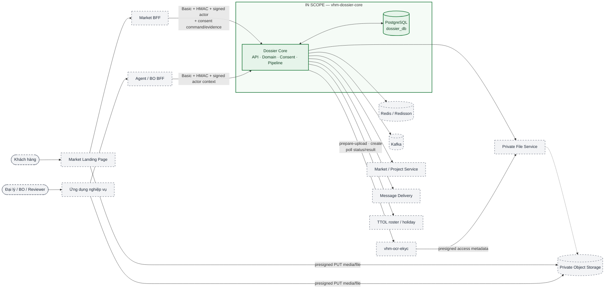

Khung xanh liền là phạm vi thiết kế của `vhm-dossier-core`; các node xám nét đứt là
kênh, nền tảng hoặc capability bên ngoài được sử dụng qua contract.

### 2.2.2 Sơ đồ thành phần

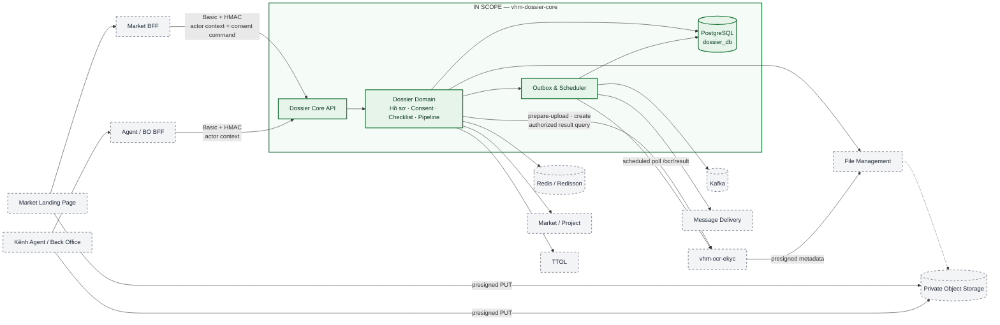

Các component trong khung xanh cùng nằm trong một deployable
`vhm-dossier-core`; đường biên trong hình là ranh giới logic, không phải service
hoặc deployment độc lập.

### 2.2.3 Sơ đồ kiến trúc pipeline nội bộ

Pipeline Social Housing là cấu hình có phiên bản được nạp cùng ứng dụng. Khi tạo hồ sơ, core ghi phiên bản pipeline và trạng thái khởi tạo; mỗi command được kiểm tra role, ownership và guard nghiệp vụ rồi cập nhật projection, history, reviewer và outbox trong một transaction. Không có process instance Camunda và không có ranh giới eventual consistency với workflow engine ngoài.

### 2.2.4 Phân định trách nhiệm module

`Dossier Domain` là module logic nằm bên trong `vhm-dossier-core` như thể hiện tại
mục 2.2.2; đây không phải một service hoặc deployable độc lập.

| **Khối kiến trúc** | **Trách nhiệm** | **Dữ liệu quản lý** | **Không chịu trách nhiệm** |
| --- | --- | --- | --- |
| Market Landing/Agent UI | Hiển thị notice/form/result và thu thao tác/xác nhận của người dùng theo response backend | Chỉ giữ trạng thái UI tạm thời | Đánh giá consent, phân quyền dossier, checklist, OCR lifecycle hoặc persistence. |
| Market/Agent BFF | Xác thực/phân quyền ở biên kênh, map presentation contract, ký workload/actor context và chuyển request/response | Không sở hữu dữ liệu nghiệp vụ | Business invariant, consent gate, OCR orchestration và gọi trực tiếp `vhm-ocr-ekyc`. |
| Dossier Core API | Internal contract, xác thực workload/actor context, validation request và điều phối command/query | Không sở hữu aggregate riêng | Dữ liệu authoritative của dependency. |
| Dossier Domain | Vòng đời hồ sơ, consent gate/bằng chứng, business authorization, validation, checklist, pipeline, OCR prepare-upload/create/status-result integration và phân công | Aggregate dossier, checklist definition/version/snapshot, `ocrId`/`ocrStatus` và consent evidence | Identity kênh, media, presigned URL và persistence raw/canonical OCR result. |
| Outbox/Scheduler | Phát sự kiện, gửi notification, nhắc SLA và polling/reconciliation OCR sau commit | Trạng thái delivery/dedup và lịch poll; cập nhật OCR status projection theo guard của Core | Thay đổi quyết định nghiệp vụ đã commit hoặc persist OCR result. |
| `vhm-ocr-ekyc` | Nhận prepare-upload/create/status-result từ Core, quản lý media reference và thực thi OCR lifecycle | OCR lifecycle, media reference, kết quả authoritative và retention media | Phân quyền dossier, hiển thị/thu consent hoặc tự áp kết quả vào hồ sơ. |
| Enterprise services | File, Market, TTOL, Message Delivery | Dữ liệu thuộc từng miền | Sở hữu aggregate dossier. |

### 2.2.5 Ranh giới tin cậy

| **Ranh giới** | **Mức tin cậy** | **Kiểm soát** | **Khoảng trống** |
| --- | --- | --- | --- |
| Client → BFF | Không tin cậy | Auth kênh, role, validation, rate limit tầng gateway | Thuộc phạm vi kênh/platform. |
| BFF → core | Zero Trust nội bộ | Basic Auth, HMAC, timestamp/nonce/body hash, actor signature | Cần vận hành secret rotation. |
| Actor context → business | Chỉ tin sau verify | `subject`, role, visibility, expiry, JTI | JTI replay đang có thể tắt theo môi trường. |
| Market consent command → Core | Sau workload authentication | Signed actor context, lựa chọn consent/evidence payload và idempotency | Legal copy do Privacy/Legal phê duyệt; Core sở hữu evidence schema và consent gate. |
| Web → Private Object Storage | Media bytes không tin cậy | Presigned PUT chính xác, TTL ngắn, signed headers/checksum, không list/read | URL đi ngược qua `vhm-ocr-ekyc` → Core → BFF; byte media không đi qua BFF/Core. |
| Core → `vhm-ocr-ekyc` | Nội bộ có xác thực | HTTPS + Basic Authentication theo caller/environment; Core kiểm tra business object/media role trước khi gọi endpoint prepare-upload/create/status-result | OpenAPI/credential contract thuộc L3; BFF/client không gọi capability trực tiếp. |
| Core → File/Market/TTOL/Message | Dependency ngoài process | Credential server-side, timeout/retry/config | Contract/SLA và ownership file cần chốt. |
| Core → Kafka | At-least-once | Transactional outbox, retry, idempotent consumer | Production publisher phải có config gate và backlog monitoring. |

## 2.3 Vòng đời hồ sơ

### 2.3.1 Trạng thái công bố

Pipeline Social Housing v1 tách `pipelineState` chi tiết khỏi `dossier.status` công bố
cho kênh. `SUBMIT` là command; baseline chuyển nguyên tử từ `DRAFT` vào
`SALES_REVIEW` với projection `UNDER_REVIEW`, không tạo một trạng thái pipeline
`SUBMITTED` trung gian. Giá trị `SUBMITTED` chỉ được giữ trong contract tương thích
nếu có dữ liệu/consumer cũ và không làm thay đổi state machine bên dưới.

| **Pipeline state logic** | **Stage** | **`dossier.status` projection** |
| --- | --- | --- |
| `DRAFT` | — | `DRAFT` |
| `SALES_REVIEW`, `PROCEDURE_REVIEW`, `SALES_REVISION_INTAKE`, `SXD_REVIEW`, `PROCEDURE_REVISION_INTAKE` | SALES/PROCEDURE/SXD tương ứng | `UNDER_REVIEW` |
| `AGENT_UPDATE_SALES` | SALES | `ADD_INFO_REQUESTED` |
| `APPROVED` | SXD hoàn tất | `APPROVED` |
| `REJECTED` | — | `REJECTED` — terminal |

`APPROVED` vẫn cho phép action thu hồi căn theo Pipeline Definition; khi action này
hợp lệ, state chuyển sang `REJECTED` và giải phóng căn trong cùng transaction.

### 2.3.2 State machine

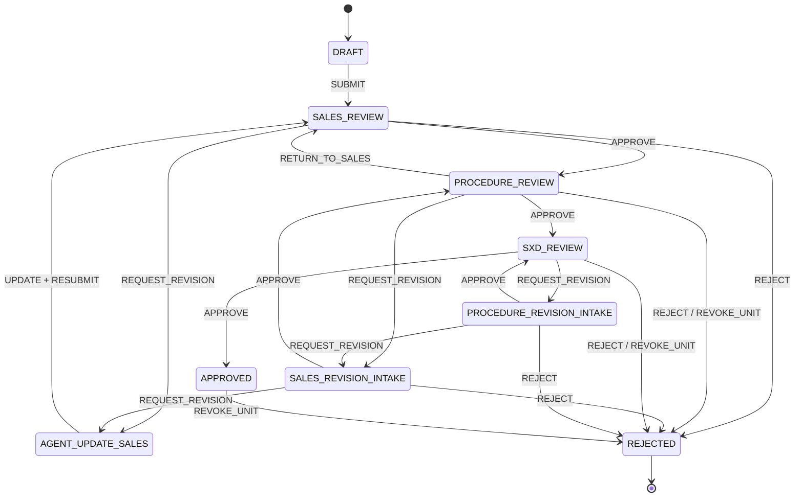

## 2.4 Tính nhất quán và Idempotency

### 2.4.1 Tạo tài nguyên và idempotency

- Mọi lệnh create từ `MARKET` và `AGENT` bắt buộc có header `Idempotency-Key` khác rỗng; không có miễn trừ theo kênh.
- Caller phải tái sử dụng đúng key khi retry cùng một lệnh create logic sau timeout hoặc mất response; BFF chuyển nguyên key, không tự sinh hoặc thay key theo lần retry.
- Core lấy PostgreSQL transaction advisory lock trên key trước khi kiểm tra replay và trước các validation tốn chi phí.
- Replay được tra theo `(idempotencyKey, createdBy)` **trước** form/schema/file validation; cùng actor nhận lại dossier đã tạo.
- Nếu key toàn cục đã thuộc actor khác, request bị từ chối; DB có unique constraint cuối trên `idempotency_key`.
- Sau pipeline initialization, entity được `flush` trước khi dựng response để `version` trả về bằng version trong DB.

### 2.4.2 Transactional outbox

Create/update/transition/delete ghi business row và `outbox_event` trong cùng transaction. Relay khóa theo batch (`FOR UPDATE SKIP LOCKED`), publish Kafka và cập nhật trạng thái gửi. `notification_outbox` là outbox riêng cho ý định gửi thông báo qua kênh đã được phê duyệt; retry exponential có giới hạn và chuyển `FAILED` khi hết số lần thử.

### 2.4.3 Ranh giới nhất quán

| **Thao tác** | **Cùng transaction** | **Ngoài transaction** |
| --- | --- | --- |
| Create/update | Dossier, pipeline projection, status history, checklist, outbox | Kafka publish, downstream processing |
| Command pipeline | Dossier/status, reviewer, history, unit, outbox, notification intent | Gửi message và consumer ngoài hệ thống |
| Reminder | Claim/dedup reminder và notification intent | Message Delivery |
| OCR prepare/create/status-result | Core kiểm tra business context, commit local create intent, `ocrId` và status projection; không persist media/presigned URL/result | Web PUT media trực tiếp; `vhm-ocr-ekyc` quản lý media/lifecycle/kết quả authoritative; BFF chỉ chuyển contract kênh |

### 2.4.4 Concurrency guards

- `@Version` và `If-Match` ngăn lost update; mutation snapshot/command yêu cầu version kỳ vọng và không chấp nhận last-write-wins.
- Unique partial index ngăn race hồ sơ active trùng CCCD+dự án; conflict ánh xạ `11011`.
- Unique partial index căn được cấp ngăn hai hồ sơ active giữ cùng căn.
- Reviewer assignment PKD dùng row lock/rotation trong DB; PTT/SXD dùng atomic counter Redis và sticky assignment khi quay lại.
- Command pipeline kiểm tra current state/action trong transaction; mọi side effect chỉ commit khi toàn bộ guard thành công.

# 3. Functional Requirements

## 3.1 Ma trận năng lực chức năng

| **ID** | **Năng lực/yêu cầu** | **Thiết kế** | **Mức bắt buộc** |
| --- | --- | --- | --- |
| FR-01 | Tạo hồ sơ nháp | BFF map sang core create `SOCIAL_HOUSING`; trả `DRAFT` | `BẮT BUỘC` |
| FR-02 | Upload tài liệu | Core kiểm tra quyền dossier trước khi xin upload reference; client PUT byte trực tiếp vào private object storage bằng presigned URL | `BẮT BUỘC` |
| FR-03 | Cập nhật snapshot | Full update ở DRAFT/ADD_INFO; contact-only khi đã submit/review | `BẮT BUỘC` |
| FR-04 | Nộp hồ sơ | Command `SUBMIT`, duplicate guard, checklist readiness, sinh mã | `BẮT BUỘC` |
| FR-05 | Chống trùng | Application precheck + database race guard | `BẮT BUỘC` |
| FR-06 | Checklist/progress | Core resolve definition/version, tạo snapshot theo dossier và tính counts/missing/invalid | `BẮT BUỘC` |
| FR-07 | Phê duyệt nhiều cấp | Pipeline versioned thực thi trong core | `BẮT BUỘC` |
| FR-08 | Phân công reviewer | Manual/reassign/claim + auto round-robin | `BẮT BUỘC` |
| FR-09 | Cấp/thu hồi căn | Atomic allocation/approve; unique active unit | `BẮT BUỘC` |
| FR-10 | Hồ sơ giấy | Submit/confirm hardcopy và timeline | `BẮT BUỘC` |
| FR-11 | OCR CCCD | Core authorize và gọi capability cho prepare-upload/create/status-result, lưu `ocrId`/status; Web PUT media trực tiếp, người dùng xác nhận trước khi request PATCH `formData` đi qua BFF vào Core; Core không persist result | `BẮT BUỘC` |
| FR-12 | Notification/reminder | Outbox, kênh được phê duyệt, T+6/T+18 và manual trigger | `BẮT BUỘC` |
| FR-13 | Tra cứu/báo cáo | List/detail/statistics/by-contact/export | `BẮT BUỘC` |
| FR-14 | Xóa bản nháp | Chỉ DRAFT; xóa checklist và dữ liệu phụ thuộc | `BẮT BUỘC` |
| FR-15 | PIC hồ sơ | Use case, permission và audit semantics | `TBD` |
| FR-16 | Consent | Landing Page hiển thị/thu consent, BFF xác thực, phân quyền kênh và chuyển request; Core lưu evidence và chỉ gọi prepare-upload/OCR create hoặc submit khi evidence hợp lệ, đồng thời xử lý rút consent | `BẮT BUỘC` |
| FR-17 | Dữ liệu chủ thể liên quan | Khi hồ sơ có dữ liệu vợ/chồng/thành viên hộ gia đình, Market thu xác nhận riêng; Core lưu evidence và chặn nhận dữ liệu/OCR create/prepare-upload/submit khi xác nhận không hợp lệ | `BẮT BUỘC` |

## 3.2 Quy tắc nghiệp vụ

| **ID** | **Quy tắc** |
| --- | --- |
| BR-01 | Public create không được submit; trạng thái sau create luôn là `DRAFT`. |
| BR-02 | Create từ `MARKET` và `AGENT` bắt buộc có `Idempotency-Key`; retry cùng actor/key phải trả lại cùng dossier, không tạo thêm `DRAFT`. |
| BR-03 | Một cặp CCCD người nộp + dự án chỉ có một hồ sơ chưa terminal. |
| BR-04 | Core resolve và khởi tạo checklist khi hồ sơ có đủ selector nghiệp vụ; thiếu selector thì giữ `DRAFT` chưa đủ điều kiện submit. `documents[]` do client gửi không được dùng để định nghĩa checklist. |
| BR-05 | Identity checklist là `(dossierId, documentTemplateId, groupCode)`. |
| BR-06 | Submit cần tồn tại ít nhất một required item trong snapshot checklist do Core sở hữu và mọi required item ở `COMPLETE`. |
| BR-07 | Full update chỉ ở DRAFT/ADD_INFO; SUBMITTED/UNDER_REVIEW chỉ cho sửa contact email/phone. |
| BR-08 | Update không được ghi đè `source`, `assignedUnitCode` hoặc `assignedUnitId` do server quản lý. |
| BR-09 | File identity applicant/spouse và `documents[].s3PathFile` phải tồn tại khi file-validation được bật. |
| BR-10 | Không kiểm tra file path prefix theo dossier ID. |
| BR-11 | Mọi command phải hợp lệ theo state, role và ownership (`OWNER`, `CLAIMER`, `NONE`). |
| BR-12 | Lần submit đầu sinh mã `<sapId>-<agencyId>-<ddMMyy>-<sequence4>`; PKD approve chuẩn hóa thành `<sapId>-<sequence5>`. |
| BR-13 | Reject/revoke unit phải giải phóng căn đang cấp. |
| BR-14 | DRAFT delete xóa checklist tường minh; FK checklist cũng có `ON DELETE CASCADE`. |
| BR-15 | Comment là optional trừ khi Pipeline Definition của action quy định bắt buộc. |
| BR-16 | Với hồ sơ thao tác từ Market Landing, Core từ chối prepare-upload OCR/File, OCR create và submit khi consent không hợp lệ hoặc đã bị rút; BFF không đánh giá hoặc override quyết định này. |
| BR-17 | Xác nhận submit là xác nhận nộp hồ sơ, không được dùng để suy diễn consent. |
| BR-18 | Sau khi khách hàng đăng nhập và vào hành trình NOXH, Market phải hiển thị notice trước lần upload đầu tiên, cung cấp lựa chọn đồng ý/không đồng ý rõ ràng và không chọn sẵn quyết định. |
| BR-19 | Mỗi quyết định đồng ý, không đồng ý hoặc rút consent phải được lưu thành bằng chứng bất biến; trạng thái hiệu lực được xác định từ quyết định hợp lệ mới nhất theo subject, purpose và notice version. |
| BR-20 | Nếu request chứa dữ liệu hoặc tài liệu của vợ/chồng/thành viên hộ gia đình, Core chỉ nhận mutation, OCR create, prepare-upload và submit khi có `THIRD_PARTY_ATTESTATION` hợp lệ của người nộp; checkbox xác nhận phải tách biệt và không được tích sẵn. |
| BR-21 | `THIRD_PARTY_ATTESTATION` chỉ ghi nhận người nộp cam kết đã thông báo và có sự đồng ý/ủy quyền cần thiết; không được gọi hoặc biểu diễn đây là consent do hệ thống trực tiếp thu từ vợ/chồng/thành viên hộ gia đình. Khi phạm vi chủ thể hoặc notice version thay đổi, người nộp phải xác nhận lại trước khi gửi dữ liệu tiếp theo. |

# 4. Non-Functional Requirements

Các mục tiêu `200 req/s`, P95 cụ thể và availability `99.9%` chưa có workload/capacity evidence được phê duyệt nên chưa được coi là baseline. Trước production phải chốt NFR theo workload thực tế.

| **ID** | **Nhóm** | **Yêu cầu** | **Cổng** |
| --- | --- | --- | --- |
| NFR-01 | Availability | Core stateless, có thể scale ngang; Redis nonce/replay là dependency đồng bộ fail-closed và phải được tính trong availability end-to-end của hành trình | `BẮT BUỘC` |
| NFR-02 | Consistency | Không mất mutation đã commit; outbox cho event/notification | `BẮT BUỘC` |
| NFR-03 | Concurrency | Idempotency, optimistic lock, unique index, row/Redis lock | `BẮT BUỘC` |
| NFR-T04 | Performance/Timeout | P95/P99 theo endpoint phải được đo; outbound call tuân thủ timeout budget tại mục 4.1 | `BẮT BUỘC` |
| NFR-05 | Scalability | Scale ngang API/relay; không dùng session cục bộ làm authority | `BẮT BUỘC` |
| NFR-06 | Security | Signed request/actor, least privilege, PII masking, secret rotation | `BẮT BUỘC` |
| NFR-07 | Privacy | Consent evidence, purpose-bound processing, retention/deletion theo policy và kiểm soát truy cập dữ liệu hồ sơ | `BẮT BUỘC` |
| NFR-08 | Recoverability | PostgreSQL PITR, outbox replay, backup/restore drill; RTO/RPO do owner phê duyệt tại mục 14.1 | `BẮT BUỘC` |
| NFR-09 | Observability | Metrics/log/trace/correlation và alert có owner | `BẮT BUỘC` |
| NFR-10 | Maintainability | Versioned migration/schema/pipeline; backward-compatible API | `BẮT BUỘC` |
| NFR-11 | Admission control | Giới hạn inbound theo caller và operation; quá ngưỡng trả `429 + Retry-After`, không bắt đầu mutation | `BẮT BUỘC` |

## 4.1 Nguyên tắc phân bổ deadline và timeout — NFR-T04

Ngân sách timeout cho từng outbound operation được dẫn xuất từ end-to-end
deadline, dependency SLO và latency P99 đã được phê duyệt. Mọi outbound operation
của Core phải tuân thủ các invariant sau:

- Có `connect timeout`, `read/response timeout` và `total outbound budget` hữu hạn; không dùng timeout vô hạn hoặc default không được kiểm soát.
- Deadline từ BFF phải được truyền xuống Core. Trước mỗi hop, Core tính remaining deadline và không bắt đầu call/retry nếu budget còn lại không đủ.
- `outbound budget ≤ remaining deadline − core processing reserve`; tổng `attempt timeout + backoff` không được vượt outbound budget.
- Thứ tự deadline phải bảo đảm `dependency call < Core < BFF < client`, để lớp ngoài còn thời gian map lỗi và kết thúc response có kiểm soát.
- Mutation có delivery outcome không xác định không được retry mù. Query/idempotent operation chỉ retry khi còn budget và đúng error class đã được phê duyệt.
- Timeout, retry exhaustion, circuit state và latency phải được đo riêng theo dependency/operation; không dùng một cấu hình chung cho mọi outbound call.

`Runtime Capacity & Resilience Matrix` tại L3 phải công bố cho từng operation tối
thiểu: connect timeout, read timeout, total budget, max attempts, backoff,
retryable error classes, circuit-breaker policy và owner. Giá trị được dẫn xuất từ
end-to-end deadline, dependency SLO và latency P99; phải hoàn tất trước duyệt L3
integration và được xác nhận bằng contract/load test trước OAT.

L2 không tự đặt giá trị timeout tạm khi chưa có dependency SLO/latency evidence.
Comment về timeout chỉ được coi là đóng khi Outbound Timeout & Resilience Matrix có
giá trị số cho tối thiểu File prepare/verify/download-presign và
`vhm-ocr-ekyc` prepare-upload/create/status-result, kèm version và owner phê duyệt.

Core không truyền file binary trong các call File nêu tại mục 6; upload/download
binary đi trực tiếp giữa client và Object Storage theo presigned URL.

# 5. Technology Stack & Justification

| **Công nghệ** | **Vai trò** | **Cơ sở lựa chọn/hệ quả** |
| --- | --- | --- |
| Java 25, Spring Boot 4.1 | Runtime/service framework | Stack nền tảng của dịch vụ; cần image/JVM production được chứng nhận. |
| Spring Data JPA/Hibernate | Aggregate persistence, optimistic lock | Phù hợp transaction domain; cần tránh N+1 và giữ `open-in-view=false`. |
| PostgreSQL, Liquibase | Source of truth, JSONB, constraint, advisory lock | Hỗ trợ transaction/partial index; migration phải forward-safe. |
| Redis/Redisson | Replay/nonce, counter phân công, cache/lock hỗ trợ | Không được là source of truth của dossier. |
| Kafka | Phát domain event từ outbox | At-least-once; consumer cần idempotent. |
| Caffeine | Cache cục bộ cho dữ liệu tham chiếu | Giảm latency; cần invalidation/TTL rõ ràng. |
| JSON Schema 2020-12 | Validate form Social Housing v1 | Cho phép evolution schema; production bắt buộc enforce schema/version đã phê duyệt. |
| Thrift/HTTP clients | File, `vhm-ocr-ekyc` và tích hợp nội bộ | Contract bên ngoài cần timeout/retry/test. |
| Syncfusion/Apache POI | Export/tạo tài liệu | Cần quản lý license, template và kiểm thử output. |

## 5.1 ADR Log

ADR chi tiết nằm tại Phụ lục D. Các quyết định nền tảng: modular monolith, pipeline nội bộ bằng YAML, PostgreSQL source of truth, snapshot JSONB có schema version, transactional outbox, signed actor context, database constraint là race guard cuối.

# 6. Integration Architecture

## 6.1 Danh mục component và giao diện tích hợp

### 6.1.1 Danh sách component

| **ID** | **Component** | **Phạm vi** | **Trách nhiệm trong tích hợp** | **Authority/Dữ liệu chính** |
| --- | --- | --- | --- | --- |
| CMP-01 | Market Landing Page / Agent UI | Bên ngoài | Hiển thị/thu input theo presentation contract; PUT media bằng presigned URL | Không là authority của hồ sơ, consent, quyền hoặc OCR status/result |
| CMP-02 | Market / Agent / BO BFF | Bên ngoài | Xác thực/phân quyền ở biên kênh, map presentation contract, ký workload/actor context và chuyển request/response | Không sở hữu business rule và không gọi trực tiếp `vhm-ocr-ekyc` |
| CMP-03 | `vhm-dossier-core` | **IN SCOPE** | Business authorization, hồ sơ, consent, checklist, pipeline, OCR prepare-upload/create/status-result integration và outbox | Authority của aggregate hồ sơ, checklist và consent NOXH; chỉ chiếu `ocrId`/status, không sở hữu media/result OCR |
| CMP-04 | PostgreSQL `dossier_db` | **IN SCOPE — owned data store** | Lưu aggregate, checklist definition/snapshot, history, consent evidence và outbox | Source of truth của Dossier Domain |
| CMP-05 | Redis / Redisson | Shared platform | Nonce/replay security, counter, cache và coordination | Không là source of truth nghiệp vụ |
| CMP-06 | Kafka | Shared platform | Phân phối domain event sau commit | Outbox/PostgreSQL là nguồn replay |
| CMP-07 | Private File Service | Bên ngoài | Presigned upload, kiểm tra tồn tại, download và ownership contract | Authority của file binary/upload grant |
| CMP-08 | Market / Project Service | Bên ngoài | Project/SAP/unit và special-day reference | Authority của master data tương ứng |
| CMP-09 | `vhm-ocr-ekyc` | Bên ngoài | Capability OCR dùng chung; quản lý media/lifecycle/kết quả OCR | Authority của tài nguyên OCR |
| CMP-10 | Message Delivery | Bên ngoài | Gửi notification từ intent đã commit | Authority của delivery outcome |
| CMP-11 | TTOL | Bên ngoài | Roster reviewer và lịch nghỉ | Authority của roster/calendar được công bố |

### 6.1.2 Sơ đồ context/integration

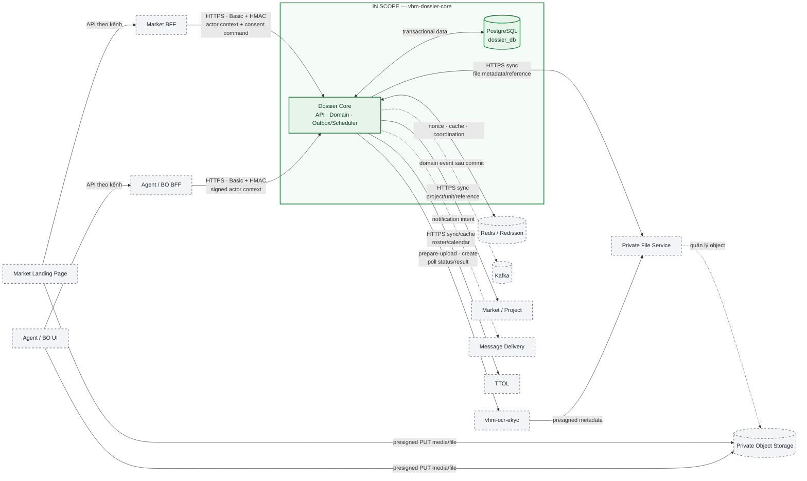

Sơ đồ chỉ thể hiện contract mà `vhm-dossier-core` trực tiếp sở hữu hoặc sử dụng;
topology nội bộ phía sau các capability bên ngoài không thuộc phạm vi TDD này.

### 6.1.3 Danh mục giao diện tích hợp

| **ID** | **Tích hợp** | **Hướng** | **Kiểu** | **Mục đích** | **Failure policy** |
| --- | --- | --- | --- | --- | --- |
| INT-01 | Market/Agent/BO BFF | Inbound | HTTPS sync | Registration, consent, list/detail và action | Signature/actor fail closed |
| INT-02 | Private File Service | Core outbound | HTTPS sync | Prepare upload, existence, download/presign | Fail hard cho validation bắt buộc; timeout theo NFR-T04 |
| INT-03 | Market/Project | Outbound | HTTP sync + cache | SAP/project/unit/special days | Tùy use case: fail hard hoặc best effort |
| INT-04A | `vhm-ocr-ekyc` | Core outbound | HTTPS sync + async resource | Prepare presigned upload, create OCR và thăm dò status/result theo business authorization | Idempotent create, polling hữu hạn; Core không persist presigned URL/media/result |
| INT-04B | Private Object Storage | Web/client outbound, ngoài Core/BFF | HTTPS PUT | Upload byte media/file bằng presigned URL và signed headers | Byte media không đi qua BFF/Core; URL/path/retention do File/OCR contract sở hữu |
| INT-05 | TTOL | Outbound | HTTP/cache | Roster reviewer/holiday | Auto-assign best effort; manual fallback |
| INT-06 | Message Delivery | Outbound | Outbox relay | Email notification | Retry/backoff → FAILED |
| INT-07 | Kafka | Outbound | Async | Domain event đã commit | Outbox retry; publish có feature flag |
| INT-08 | PostgreSQL `dossier_db` | Internal data | SQL transaction | Aggregate, checklist, projection, history, consent và outbox | Fail request; phục hồi theo RPO/RTO nền tảng |
| INT-09 | Redis / Redisson | Shared platform | Sync | Nonce/replay, cache, counter và coordination | Security path fail closed; nghiệp vụ phụ trợ degrade theo use case |

### 6.1.4 Outbound circuit-breaker và chống cascading failure

Mỗi synchronous outbound operation phải có circuit breaker riêng theo
`dependency + operation`; không dùng một circuit chung làm cô lập sai các chức
năng độc lập. Circuit breaker được đánh giá trước retry và phối hợp với timeout,
rate limiter cùng bulkhead theo NFR-T04 và mục 11.1.3.

- `CLOSED`: cho phép call trong quota/bulkhead và ghi nhận outcome theo error classification đã phê duyệt.
- `OPEN`: không tạo outbound call; request fail-fast hoặc dùng fallback trong bảng dưới đây. Retry không được chạy khi circuit đang mở.
- `HALF_OPEN`: chỉ cho phép probe có concurrency giới hạn; các replica áp dụng jitter/probe budget để tránh đồng loạt thăm dò gây thundering herd.
- Connect/read timeout, connection error và dependency `5xx` được phân loại là failure signal. Business `4xx` không làm mở circuit; `429` phải tuân thủ `Retry-After` và kích hoạt admission/backoff theo quota policy.
- Circuit chỉ đóng lại sau khi probe đạt recovery criteria. Mọi state transition, rejected call, probe result và thời gian open phải có metric/alert.

| **Dependency/operation** | **Hành vi khi circuit OPEN** | **Fallback/khôi phục** |
| --- | --- | --- |
| File prepare/verify/download-presign cho tài liệu dossier | Fail-fast; không cấp upload/download reference và không attach path chưa xác minh | Người dùng thử lại sau; half-open probe có giới hạn, không bypass ownership/existence guard |
| `vhm-ocr-ekyc` prepare-upload/create | Không cấp media upload mới hoặc tạo OCR; không làm thay đổi trạng thái hồ sơ | Người dùng thử lại sau hoặc nhập/kiểm tra thủ công nếu use case đã phê duyệt; không tự reject dossier |
| `vhm-ocr-ekyc` `/ocr/result` | Tạm dừng poll/query result và giữ last-known status, không suy diễn thành `FAILED` | Tôn trọng `Retry-After`; tiếp tục poll sau khi circuit phục hồi, không tạo OCR trùng |
| Market/Project validation | Guard bắt buộc fail-fast; read-only chỉ được dùng cache còn hiệu lực theo freshness policy | Thử lại sau khi dependency phục hồi; không dùng dữ liệu stale để submit/cấp căn |
| TTOL roster/calendar | Tạm dừng auto-assignment phụ thuộc TTOL | Chuyển manual assignment theo quyền; probe lại có giới hạn |
| Message Delivery/Kafka relay | Dừng dispatch ra dependency; business transaction vẫn commit vào outbox | Giữ backlog bền vững, phát lại sau recovery và cảnh báo oldest age |

Ngưỡng failure window, open duration, half-open probe budget, error classification
và fallback owner của từng operation phải được công bố trong L3 Runtime Capacity &
Resilience Matrix và xác nhận bằng failure-injection/load test trước OAT.

## 6.2 Contract API hồ sơ VHM

### 6.2.1 Public registration flow

| **Bước** | **API qua BFF** | **Kết quả bắt buộc** |
| --- | --- | --- |
| 1 | `POST /v1/social-housing/registrations` + `Idempotency-Key` | Tạo duy nhất một `DRAFT`, nhận `dossierId`. |
| 2 | Ghi quyết định consent cho dossier | Lưu bằng chứng theo subject, purpose và notice version trước upload. |
| 3 | `POST /v1/social-housing/registrations/{id}/prepare-upload` rồi PUT file | Chỉ cấp URL khi caller đọc được dossier và consent hợp lệ; giữ `s3PathFile`. |
| 4 | `PATCH /v1/social-housing/registrations/{id}` | Ghi snapshot form/documents đầy đủ; client không định nghĩa requiredness. |
| 5 | `POST /v1/social-housing/registrations/{id}/submit` | Chuyển vào pipeline nếu consent, checklist và các guard còn lại đều đạt. |

### 6.2.2 Nhóm năng lực API nội bộ

Core công bố API nội bộ có version cho các nhóm năng lực: quản lý hồ sơ, command pipeline, quyết định tài liệu, quyền dự án, notes/hardcopy, download/export, statistics và reminder. Public contract không phản chiếu nguyên xi endpoint nội bộ; BFF chịu trách nhiệm map DTO, HTTP semantics và ẩn cấu trúc nội bộ. Danh sách path/field đầy đủ thuộc OpenAPI L3, không lặp lại trong tài liệu L2 này.

### 6.2.3 Envelope và phân trang

Core trả `ServiceResponse { code, message, data }`, trong đó `code=0` là thành công. Danh sách dùng `PageDto { items, pagination }`, page number là 1-based. HTTP status và application error code phải cùng biểu đạt một kết quả; client không được chỉ dựa vào message tiếng Việt.

## 6.3 Contract presigned upload

### 6.3.1 Tài liệu đính kèm dossier

- Request phải chứa registration ID hợp lệ dạng UUID và metadata file được allowlist.
- Định dạng hỗ trợ trong core gồm JPEG, PNG, PDF, DOC/DOCX và XLS/XLSX; extension được dẫn xuất từ content type đã chấp nhận.
- Object key có dạng `registrations/{registrationUuid}/{slug}_{randomUuid}.{ext}` nhưng không dùng prefix này làm bằng chứng ownership khi attach.
- Core phải xác minh actor context, quyền trên dossier và metadata trước khi gọi File Service xin URL; BFF chỉ chuyển request đã xác thực.
- Với hành trình khách hàng qua Market Landing, Core chỉ cấp upload reference khi consent NOXH còn hiệu lực.
- Sau upload, create/update kiểm tra file tồn tại khi feature bật; contract File Service phải bổ sung uploader/upload-grant owner trước production.

### 6.3.2 Media dùng cho OCR

Media OCR dùng prepare-upload contract do `vhm-ocr-ekyc` sở hữu. Web gửi metadata
qua BFF; BFF xác thực kênh và chuyển request tới Core. Core xác minh actor, quyền
dossier, consent/attestation, checklist context và media role trước khi gọi
`vhm-ocr-ekyc`. Capability gọi File Management và trả `presignedUrl`, signed headers
cùng `s3PathFile` ngược qua Core/BFF cho Web PUT trực tiếp vào private storage.

Core/BFF không nhận byte media, không tự dựng storage path và không persist
`presignedUrl` hoặc media reference. Sau upload, Web gửi `s3PathFile` qua BFF trong
lệnh create; Core chỉ validate business context rồi chuyển reference sang
`vhm-ocr-ekyc`. `vhm-ocr-ekyc` không thực thi consent hoặc business RBAC của hồ sơ.

Media role (loại mặt giấy tờ), MIME, size, checksum, media storage và
retention/deletion thuộc contract của `vhm-ocr-ekyc`; media role không phải role
người dùng. Business RBAC luôn được Dossier Core thực thi trước khi gọi capability.

## 6.4 Contract OCR dùng chung

### 6.4.1 Ranh giới tích hợp

Luồng kênh bắt buộc đi `Web → BFF → Core → vhm-ocr-ekyc`; BFF/client không gọi trực
tiếp capability. Core sở hữu business authorization/context và là caller của
prepare-upload, `POST /ocr` cùng `/ocr/result`. Byte media là ngoại lệ duy nhất:
Web PUT trực tiếp vào private storage bằng presigned URL đã được trả qua chuỗi trên.

Core không lưu file, presigned URL hoặc raw/canonical OCR result và không tự trích
xuất field. Core chỉ truyền result theo request đã phân quyền về Landing Page qua
BFF để người dùng kiểm tra. Sau xác nhận, request PATCH `formData + ocrId` đi qua BFF
vào Core theo contract hồ sơ; Core đối chiếu `ocrId` và terminal status đã lưu trước
khi áp dụng rule readiness.

### 6.4.2 Tạo tài nguyên OCR

Sau khi Web upload media, lệnh create đi qua BFF tới Core. Core kiểm tra actor, quyền
dossier, consent và document/checklist context rồi gọi `POST /ocr` với
`Idempotency-Key` bắt buộc. Context tối thiểu:

| **Trường** | **Ý nghĩa/kiểm soát** |
| --- | --- |
| `source` | `DOSSIER`; dùng cho authorization, quota và idempotency scope. |
| `referenceId` | Dossier ID dạng opaque business reference. |
| `requestBy` | Opaque actor reference, không nhúng PII. |
| `subjectRef` | Opaque applicant/customer reference. |
| `channel`, `platform` | Context kênh đã allowlist. |
| `documentType`/loại OCR | `NATIONAL_ID` hoặc contract CCCD hai mặt được đóng băng ở OpenAPI L3. |
| `s3PathFile`/media refs theo role | Reference do prepare-upload contract phát hành; Core chỉ chuyển tiếp trong create call, không tự dựng hoặc persist path/URL. |

Cùng idempotency key và cùng request phải trả tài nguyên hiện hữu; cùng key nhưng
request khác trả `409`. Thành công trả HTTP `202`, `ocrId`, status hiện hành và
`Retry-After`. Core lưu `ocrId`/status; cách triển khai phía sau capability không phải
tham số do Core/BFF lựa chọn.

### 6.4.3 Polling trạng thái và áp dụng formData

Core định kỳ gọi `/ocr/result` theo `ocrId` cho các trạng thái chưa terminal, tôn trọng
`Retry-After`, backoff và circuit breaker. Trạng thái công bố cho Core gồm
`QUEUED`, `PROCESSING`, `COMPLETED`, `FAILED`, `EXPIRED`; Core chỉ lưu projection
status và thời điểm poll, không persist `result` payload.

BFF chỉ chuyển query/response giữa kênh và Core. Khi projection là `COMPLETED`, một
query result đã phân quyền tại Core gọi `/ocr/result` và trả canonical result qua
BFF cho Landing Page; BFF không gọi capability hoặc đánh giá status/result.

Landing Page cho người dùng kiểm tra/xác nhận rồi gửi PATCH `formData` cùng `ocrId`
qua BFF vào Core. Core chỉ nhận field thuộc Form Data Contract và chỉ chấp nhận
binding có `ocrId` khớp projection
`COMPLETED`; không tin `ocrStatus` do request body tự khai và không lưu raw result
hoặc downstream job ID.

Các field được Core chấp nhận chỉ nằm trong allowlist Form Data Contract (`họ tên`,
`số CCCD`, `ngày sinh`, `giới tính`, `ngày/nơi cấp` và `địa chỉ thường trú` khi áp
dụng). Việc trích xuất, so khớp và cung cấp result thuộc `vhm-ocr-ekyc`; Dossier
không xử lý chữ ký, khuôn mặt hoặc thuộc tính ngoài contract.

### 6.4.4 Tính nhất quán và failure semantics

- Trước create call, Core commit local intent gồm `dossierId`, document context,
  `idempotencyKey`, `requestHash`, `attemptNo`, create deadline và `CREATE_PENDING`;
  không giữ DB transaction trong khi chờ mạng và không persist `s3PathFile`.
- Khi nhận `202`, Core lưu `ocrId`, status và `nextPollAt`. Nếu timeout/disconnect
  hoặc lỗi lưu acknowledgement khi remote có thể đã nhận, chuyển `CREATE_UNKNOWN`,
  không suy diễn thành `FAILED`.
- Caller retry qua BFF phải gửi lại cùng key/payload, gồm media reference. Core đối
  chiếu `requestHash` rồi replay đúng `POST /ocr`. Idempotency tại
  `vhm-ocr-ekyc` bảo đảm trả lại cùng resource thay vì tạo OCR trùng. Cùng key/khác
  payload trả `409`. Khi chưa có `ocrId`, Core không tự replay create trong
  background vì không lưu media reference.
- Khi đã có `ocrId`, scheduler chỉ poll `/ocr/result`. Poll lỗi giữ last-known status
  và dời `nextPollAt`; không chuyển OCR thành `FAILED`, không tạo attempt mới và
  không persist result payload.
- Chỉ terminal `FAILED/EXPIRED` mới cho phép caller yêu cầu một attempt create mới.
  `COMPLETED` không tự động sửa hoặc duyệt/từ chối dossier.
- Watchdog chỉ phát hiện operation quá create/poll deadline, phát cảnh báo và chuyển
  `RECONCILIATION_REQUIRED`; không tự dựng lại create payload. Việc đối soát chỉ dùng
  request được replay qua BFF đúng key/payload hoặc `/ocr/result` theo `ocrId`.

| **Local state tại Core** | **Ý nghĩa** | **Hành động tiếp theo** |
| --- | --- | --- |
| `CREATE_PENDING` | Intent đã commit, create call chưa có acknowledgement | Request đang xử lý gọi `POST /ocr`; sau crash chờ caller retry cùng key/payload qua BFF |
| `CREATE_UNKNOWN` | Delivery outcome chưa xác định | Khi caller retry, đối chiếu hash rồi replay cùng key/payload; không cấp key mới |
| `QUEUED`, `PROCESSING` | Đã có `ocrId`, chưa terminal | Scheduler poll `/ocr/result` theo `Retry-After` |
| `COMPLETED` | OCR đã hoàn tất | Cho phép query result có phân quyền; chờ `formData` người dùng đã xác nhận |
| `FAILED`, `EXPIRED` | Terminal do `/ocr/result` xác nhận | Cho phép caller yêu cầu create attempt mới |
| `RECONCILIATION_REQUIRED` | Create/status không hội tụ trong deadline | Cảnh báo và đối soát control plane bằng replay hợp lệ hoặc `ocrId`; không truy cập result |

## 6.5 Contract pipeline

### 6.5.1 Action contract

Các action chính gồm `UPDATE`, `SUBMIT`, `RESUBMIT`, `ASSIGN`, `REASSIGN`, `CLAIM`, `ALLOCATE_UNIT`, `APPROVE`, `REJECT`, `REQUEST_REVISION`, `RETURN_TO_SALES`, `SUBMIT_HARDCOPY`, `CONFIRM_HARDCOPY`, `REVOKE_UNIT`. Tập action khả dụng phải lấy từ response `availableActions`, không hard-code theo status ở kênh.

### 6.5.2 Role và ownership

Pipeline kiểm tra cả role (`APPLICANT_AGENT`, `PKD`, `PKD_LEAD`, `PTT`, `PTT_LEAD`) và ownership:

- `OWNER`: actor tạo hồ sơ.
- `CLAIMER`: reviewer đang claim stage.
- `NONE`: không yêu cầu ownership nhưng vẫn yêu cầu role.

### 6.5.3 Pipeline selection

Tại create, pipeline phải được xác định bằng pipeline ID/version authoritative từ contract nghiệp vụ hoặc một rule selection duy nhất. Trường hợp không tìm thấy hoặc có nhiều kết quả phải bị từ chối bằng lỗi cấu hình rõ ràng; không chọn theo thứ tự khai báo.

## 6.6 Mô hình checklist chuẩn hóa

Dossier Core sở hữu checklist chuẩn và version áp dụng cho Social Housing:

- `checklist_definition` là cấu hình có version bất biến, trạng thái hiệu lực và tiêu chí áp dụng như project, nhóm đối tượng cùng các selector nghiệp vụ đã được phê duyệt.
- Khi dossier có đủ selector, Core phải resolve đúng một definition đang hiệu lực. Không tìm thấy hoặc có nhiều kết quả đều là lỗi cấu hình và không được cho submit.
- Core snapshot `definitionId`, `definitionVersion` và các item vào `dossier_checklist` trong cùng transaction với thay đổi hồ sơ. Thay đổi definition không hồi tố hồ sơ đã submit; DRAFT chỉ đổi version qua thao tác resolve lại có kiểm soát.
- `documentTemplateId`, `groupCode`, thứ tự hiển thị và requiredness là dữ liệu do server sở hữu. BFF chỉ gửi file reference/metadata; nếu contract trả `isRequired` thì đây là field chỉ đọc và giá trị client gửi lên bị từ chối.
- Submit tính readiness từ snapshot checklist trong Core, không từ `formData.documents[].isRequired`.

| **Thuộc tính** | **Giá trị/ngữ nghĩa** |
| --- | --- |
| Identity | `dossierId + documentTemplateId + groupCode` |
| Upload status | `NOT_STARTED`, `COMPLETE` |
| OCR tracking | `ocrId` và `ocrStatus`; Core không lưu OCR result payload |
| Review status | `NOT_REVIEWED`, `VALID`, `INVALID` |
| Completed required | Upload `COMPLETE`; nếu template yêu cầu OCR thì `ocrStatus=COMPLETED` và formData xác nhận đã được cập nhật |
| Invalid item | OCR terminal `FAILED/EXPIRED` hoặc review/constraint tương ứng không đạt |
| Progress | `completedRequired / requiredCount`, làm tròn 2 chữ số |

Khi caller yêu cầu attempt OCR mới qua BFF và Core nhận `ocrId` mới cho cùng item,
Core reset status projection theo operation mới; Core không so sánh hoặc lưu media
path OCR. Item không còn trong snapshot bị xóa. Duplicate
`documentTemplateId + groupCode` trong cùng request bị từ chối.

## 6.7 Contract lỗi chuẩn

| **Code** | **Ý nghĩa** | **HTTP kỳ vọng** |
| --- | --- | --- |
| `10501` | Vượt admission/rate limit của caller và operation | 429 + header `Retry-After` |
| `10509` | Thiếu header bắt buộc, gồm `Idempotency-Key` cho MARKET hoặc AGENT create | 400 |
| `11003` | Không tìm thấy dossier | 400/404 theo public mapping |
| `11005` | Dossier không ở trạng thái cho phép sửa | 400 |
| `11006` | Optimistic version conflict | 409 nên được chuẩn hóa ở public API |
| `11010` | Dossier không cho phép xóa | 400 |
| `11011` | Hồ sơ active trùng CCCD+dự án | 409 |
| `11017` | Không có checklist required để submit | 400/422 |
| `11018` | Thiếu required document | 400/422 |

Khi admission control từ chối request, Core trả HTTP `429`, envelope
`ServiceResponse.code=10501` và `Retry-After` theo số giây trước thời điểm caller
được phép thử lại. Request bị từ chối trước transaction/mutation. BFF không tự
retry mutation; lần thử lại của create phải giữ nguyên `Idempotency-Key`.

# 7. Data Architecture & Data Flow

## 7.1 Data Model

### 7.1.1 Sở hữu dữ liệu logic

| **Bảng/aggregate** | **Mục đích** | **Invariant chính** |
| --- | --- | --- |
| `dossier` | Aggregate hồ sơ, JSONB form/metadata, source, PIC, pipeline projection, version | UUIDv7; source AGENT/MARKET; active duplicate/unit uniqueness. |
| `dossier_status_history` | Lịch sử trạng thái/action | Tạo trong cùng transaction với transition. |
| `checklist_definition` | Checklist chuẩn có version và tiêu chí áp dụng | Mỗi version bất biến; rule resolve phải cho đúng một kết quả hiệu lực. |
| `dossier_checklist` | Snapshot item/readiness/progress và liên kết OCR tối thiểu | Tham chiếu definition/version; PK logic template+group; requiredness do Core sở hữu; FK cascade; chỉ chiếu `ocrId`/status, không chứa media hoặc OCR result. |
| `dossier_consent_evidence` | Bằng chứng consent của người nộp và xác nhận nghĩa vụ đối với dữ liệu thành viên hộ gia đình | Append-only; phân biệt `APPLICANT_CONSENT` và `THIRD_PARTY_ATTESTATION`; gắn với dossier, actor người nộp, purpose, notice version, phạm vi chủ thể, decision và capturedAt. |
| `dossier_ocr_operation` | Local create intent và status projection để correlate, poll/reconcile và chống tạo OCR trùng | Unique idempotency key; một active operation cho mỗi dossier/document type; lưu `ocrId` nullable, `ocrStatus`, `nextPollAt` và technical state; không lưu `s3PathFile`, presigned URL hoặc OCR result. |
| `dossier_stage_reviewer` | Người xử lý theo stage | Assignment/claim/review/decision metadata. |
| `dossier_reminder_sent` | Dedup reminder theo cycle | Dossier/state/rule/cycle unique. |
| `agent_project_permission` | ACL team/project/scope và rotation | Chỉ một permission active theo key. |
| `outbox_event` | Domain event chưa/đã publish | Không mất event khi business commit. |
| `notification_outbox` | Ý định notification và retry | Dedupe key/attempt/status. |
| `dossier_note` | Ghi chú general/hardcopy | Soft-delete theo use case. |
| `audit_log` | Audit nghiệp vụ/privacy cho các operation tại mục 9.4, gồm PIC khi use case được phê duyệt | Append-only; actor/action/resource/result/time/trace theo schema có version; không thay thế access/security log của nền tảng. |

### 7.1.2 Sơ đồ sở hữu dữ liệu logic

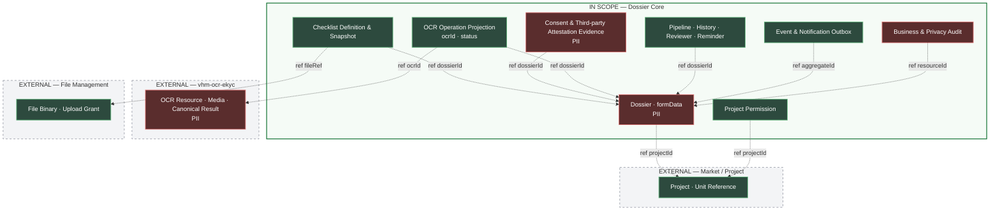

Mỗi ô là một khối dữ liệu logic; cạnh nét đứt là tham chiếu bằng ID, không biểu diễn
FK vật lý xuyên ownership boundary. Dossier Core sở hữu các khối trong khung xanh;
media và canonical OCR result chỉ thuộc `vhm-ocr-ekyc`, còn file binary/upload grant
thuộc File Management.

### 7.1.3 Database invariants

- Partial unique index trên normalized JSON path `applicant.idNumber + projectRegistration.projectId` cho dossier chưa terminal.
- Partial unique index trên unit được cấp cho dossier active.
- Check constraint cho `source`; cả MARKET và AGENT create đều yêu cầu idempotency key.
- Checklist snapshot lưu definition ID/version; requiredness chỉ được sinh từ definition do Core sở hữu.
- Checklist có constraint enum và `invalid_reason` phù hợp trạng thái.
- OCR operation có unique `idempotency_key`, lưu `request_hash` để chặn cùng key/khác payload và partial unique guard ngăn nhiều active attempt trên cùng dossier/document type.
- Optimistic `version` được JPA quản lý; response create được dựng sau flush.
- Không có FK đến user/PIC/project master vì các định danh này thuộc hệ thống ngoài.

## 7.2 Data Flow Diagram

### 7.2.1 Luồng đăng ký và nộp hồ sơ

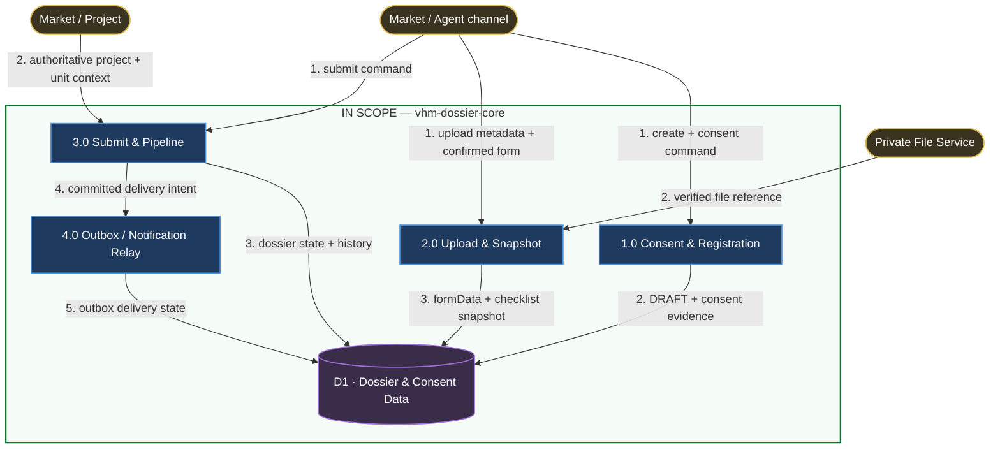

DFD chỉ thể hiện chiều dữ liệu đi vào process và dữ liệu được ghi vào store; không
vẽ chiều đọc database hoặc thứ tự request/response. Các luồng ra khỏi ranh giới
được đối chiếu ở bảng sau:

| **Luồng ra biên** | **Dữ liệu** | **Tham chiếu chi tiết** |
| --- | --- | --- |
| Core → Market/Agent BFF | `dossierId`, consent state, upload reference, dossier state và business error | Sequence mục 8.1.1–8.1.4 |
| Core → File Service | Metadata prepare-upload/verify; không có file binary | Mục 6.3 |
| Outbox/Relay → Kafka/Message Delivery | Opaque ID và event/notification metadata theo allowlist | Mục 6.1.3, 9.4 |
| Web → Private Object Storage | File byte bằng presigned URL; không đi qua BFF/Core | Mục 6.3 và 8.1.2 |

### 7.2.2 Luồng phê duyệt

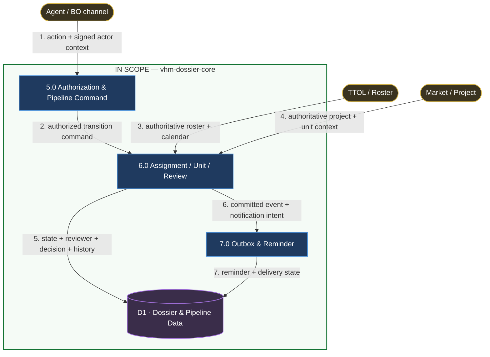

Response trạng thái/`availableActions` về BFF và metadata phát sang Kafka/Message
Delivery là luồng ra biên; contract và trình tự được thể hiện tại mục 6.1.3 và
sequence 8.1.5, không đảo chiều external entity trong DFD.

### 7.2.3 Luồng OCR CCCD qua capability dùng chung

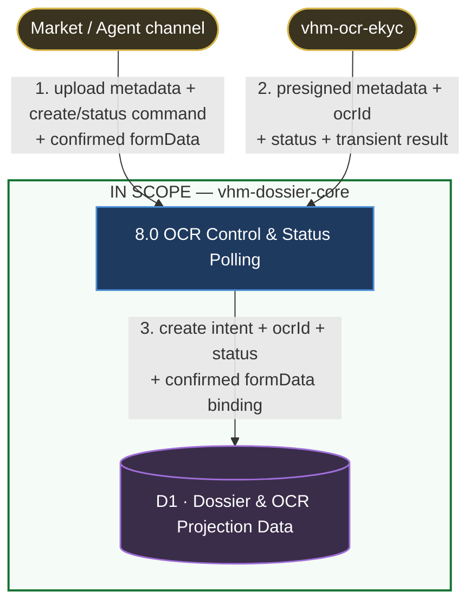

Core là business boundary và caller trực tiếp của `vhm-ocr-ekyc`; BFF chỉ xử lý
authentication/authorization ở biên kênh và presentation contract. Byte media đi
trực tiếp Web → storage bằng presigned URL.
Core chỉ persist `ocrId`/status; result được trả transient qua Core/BFF và `formData`
chỉ được ghi sau xác nhận, bind với `ocrId` có status `COMPLETED`. Không có đường ghi
trực tiếp từ OCR service vào PostgreSQL của dossier.

| **Luồng ra biên không vẽ trong DFD** | **Dữ liệu** | **Tham chiếu chi tiết** |
| --- | --- | --- |
| Core → `vhm-ocr-ekyc` | Prepare-upload metadata, `POST /ocr` cùng key/media reference và `/ocr/result` theo `ocrId` | Mục 6.3.2, 6.4 và 8.1.6 |
| Core → BFF/Channel | Presigned metadata, status và result transient đã phân quyền | Mục 6.4.3 |
| Web → Private Object Storage | Byte media bằng presigned URL | Mục 6.3.2 và 8.1.2 |

## 7.3 Data Privacy & PII

### 7.3.1 Phân loại và tối thiểu hóa

- CCCD, ngày sinh, địa chỉ, phone/email là PII; ảnh CCCD là dữ liệu nhạy cảm.
- Kafka/outbox/event/log chỉ nên chứa identifier và metadata tối thiểu, không chứa raw binary, presigned URL còn hiệu lực hoặc full formData.
- `idNumber`, `phone`, `email` không được dùng làm metric label hoặc correlation ID.
- PKD/PKD_LEAD nhận dữ liệu liên hệ đã mask theo policy response.
- Export/download cần cùng visibility/ownership guard như detail.

### 7.3.2 Danh mục dữ liệu và yêu cầu quản lý

Thời hạn retention số, legal hold, quyền của data subject và phạm vi audit phải được
Privacy/Legal/ANBM phê duyệt theo từng nhóm dữ liệu trước khi dùng dữ liệu thật. Xóa
DRAFT là hard delete nghiệp vụ, không thay thế chính sách xóa PII cho hồ sơ đã
submit/terminal và các bản sao backup/outbox/log.

| **Nhóm dữ liệu** | **Authority thời hạn/mốc bắt đầu** | **Cơ chế xóa hoặc hết hiệu lực bắt buộc** |
| --- | --- | --- |
| Hồ sơ, `formData`, checklist và history | Privacy/Legal + Product | Scheduled purge/anonymization theo trạng thái và legal hold; xóa nhất quán reference/index liên quan và ghi bằng chứng thực thi không chứa payload DLCN. |
| Consent/third-party attestation evidence | Privacy/Legal | Append-only trong thời hạn hiệu lực/pháp lý; hết hạn được purge theo schedule đã duyệt, không sửa lịch sử để giả lập withdrawal. |
| Business audit | ANBM/Privacy/Legal | Append-only, giới hạn truy cập; purge bằng audit-store lifecycle sau retention và legal hold. |
| Outbox/notification metadata | Backend/Platform | Purge row đã terminal theo delivery/audit window; topic/log downstream áp lifecycle của owner và không chứa full form/CCCD. |
| Log/trace kỹ thuật | Platform/SRE/ANBM | Central log lifecycle/ILM; loại PII và secret trước ingest, purge theo security-log policy. |
| Tài liệu hồ sơ tại File Service | File Service Owner + Privacy/Legal | Dùng delete/retention contract của File Service và đối soát reference; Core không xóa object bằng storage path suy diễn. |
| Media/kết quả OCR | `vhm-ocr-ekyc` Service Owner + Privacy/Legal | Theo compliance attestation và retention/deletion contract của capability; Core chỉ purge `ocrId`/status projection cùng hồ sơ. |
| Backup/PITR | DBA/Platform + Privacy/Legal | Hết hạn qua backup lifecycle; restore phải tái áp purge tombstone/schedule để dữ liệu hết hạn không tái xuất hiện lâu dài. |

Data Retention, Deletion & Legal-hold Schedule L3 phải ghi giá trị thời hạn, sự kiện
bắt đầu tính, `eligibleAt`, ngoại lệ legal hold, owner job, tần suất, retry/alert và
evidence query cho từng dòng trên. Purge phải idempotent: chạy lại không làm sai
trạng thái, không bỏ sót dữ liệu phụ thuộc/reference/index và không tái tạo dữ liệu
đã hết hạn sau restore. Production gate không đạt nếu bất kỳ nhóm dữ liệu nào chưa
có policy số hoặc không chứng minh được luồng purge/restore.

Baseline hiện tại không định nghĩa trường dữ liệu, collection hoặc loại tài liệu
nghiệp vụ bắt buộc riêng cho trẻ em/người chưa thành niên. Do đó phạm vi này được
xác định là **Không phát sinh/Không lưu**; Dossier không trích xuất, lập chỉ mục hoặc
giữ file reference với mục đích thu thập riêng dữ liệu trẻ em. Nếu nghiệp vụ bổ sung
phạm vi này, Form Data Contract, checklist, document template/data inventory,
notice/consent và Privacy assessment phải được cập nhật, phê duyệt theo change
control trước khi tiếp nhận dữ liệu thật; không suy diễn danh sách trường từ tên tài
liệu.

| **Loại dữ liệu** | **Phát sinh trong baseline** | **Lưu tại Dossier Core** | **Ranh giới** |
| --- | :---: | :---: | --- |
| Thông tin trẻ em/người chưa thành niên | **Không phát sinh trong baseline** | **Không lưu** | Không có field, collection hoặc document template bắt buộc riêng; mọi bổ sung phải qua Form Data Contract, checklist, consent notice và Privacy assessment trước dữ liệu thật. |
| Ảnh CCCD mặt trước/mặt sau của người nộp | **Có điều kiện** | **Không lưu byte ảnh/media reference** | Chỉ phát sinh khi checklist NOXH hiệu lực yêu cầu OCR/đối chiếu; `vhm-ocr-ekyc` sở hữu media lifecycle, Core chỉ lưu `ocrId`/status. |
| Ảnh CCCD mặt trước/mặt sau của vợ/chồng | **Có điều kiện** | **Không lưu byte ảnh/media reference** | Chỉ phát sinh khi hồ sơ có vợ/chồng và checklist yêu cầu; `vhm-ocr-ekyc` sở hữu media lifecycle/retention, Core chỉ lưu `ocrId`/status. |
| Ảnh chữ ký trong tài liệu hồ sơ | **Không thu thành trường riêng** | **Không** | Core không trích xuất, so khớp hoặc lập chỉ mục chữ ký; binary nếu có thuộc capability quản lý tài liệu tương ứng. |

Việc hồ sơ đã có các trường định danh không làm ảnh CCCD trở thành dữ liệu trùng
lặp: các trường là dữ liệu khai báo/đã xác nhận, còn ảnh là đầu vào cho OCR và đối
chiếu. Tuy nhiên, checklist chỉ được yêu cầu ảnh khi mục đích này còn hiệu lực;
nếu Product/Privacy phê duyệt một nguồn định danh có thẩm quyền thay thế đạt cùng
mục đích, phải bỏ yêu cầu upload ảnh thay vì tiếp tục thu thập theo mặc định.

### 7.3.3 Nguyên tắc quản lý consent và dữ liệu người liên quan

#### Ownership và bằng chứng

- Market Landing Page hiển thị notice và thu lựa chọn sau khi khách hàng đăng nhập,
  trước lần upload đầu tiên; BFF xác thực, phân quyền kênh và chuyển request.
  `vhm-dossier-core` là
  nguồn thẩm quyền lưu bằng chứng, xác định hiệu lực, xử lý rút consent và quyết định
  có gọi prepare-upload/OCR create hay không. Không có đường BFF → `vhm-ocr-ekyc`
  trực tiếp.
- Mỗi quyết định được ghi bất biến tại `dossier_consent_evidence` với tối thiểu `{dossierId, subjectId, evidenceType, noticeVersion, purposeCode, subjectScopeVersion, decision, capturedAt, channel}`. `capturedAt` do Core sinh; subject lấy từ actor context đã xác thực, không lấy từ request body làm authority.
- Với `APPLICANT_CONSENT`, `decision` gồm `ACCEPTED`, `DECLINED` và `WITHDRAWN`; trạng thái hiện hành được suy ra từ quyết định hợp lệ mới nhất theo subject, purpose và notice version. Chỉ `ACCEPTED` còn hiệu lực mới cho phép tiếp tục xử lý dữ liệu trong hành trình trực tuyến. Với `THIRD_PARTY_ATTESTATION`, `decision=CONFIRMED`; hiệu lực phụ thuộc notice version và phạm vi chủ thể được xác nhận. Mọi evidence đều append-only.
- Core kiểm tra consent tại OCR create, prepare-upload và submit. Thiếu consent, sai subject/purpose/version hoặc đã rút đều bị từ chối; BFF không được tự khai `consent=true` để vượt gate.
- Xác nhận submit là một hành động riêng, chỉ thể hiện ý chí nộp hồ sơ và không thay thế consent.
- Notice phải nêu riêng việc xử lý ảnh CCCD hai mặt cho mục đích chứng minh định
  danh bằng OCR có sử dụng AI, phương thức xử lý tự động, capability
  `vhm-ocr-ekyc`, downstream sub-processor đang có hiệu lực (bao gồm FPT khi được
  compliance attestation phê duyệt), quốc gia/region và thời hạn lưu áp dụng. Nội
  dung provider/AI phải lấy theo ID/version attestation do OCR Owner và
  Privacy/Legal công bố; TDD Dossier không tự xác nhận hoặc định nghĩa lại thông tin
  phía sau capability. Không dùng mô tả chung “xử lý hồ sơ” để mở rộng sang mục đích
  khác.
- Khách hàng phải có lựa chọn không đồng ý việc xử lý CCCD bằng OCR/AI. Lựa chọn này
  không được tích sẵn; khi `DECLINED`, Core không cấp prepare-upload, không tạo OCR
  và không nhận submit của hành trình trực tuyến phụ thuộc OCR. UI phải nêu hệ quả và
  phương thức thay thế thủ công nếu đã được Product/Privacy phê duyệt.

#### Cam kết đối với dữ liệu vợ/chồng/thành viên hộ gia đình

- Khi hồ sơ có dữ liệu của vợ/chồng hoặc thành viên hộ gia đình, Market phải hiển thị một xác nhận riêng, không tích sẵn, trước khi dữ liệu hoặc tài liệu của các chủ thể này được gửi khỏi trình duyệt.
- Nội dung phải thể hiện rõ người nộp có trách nhiệm thông báo và có sự đồng ý/ủy quyền cần thiết của các chủ thể liên quan trước khi cung cấp dữ liệu. Copy nguyên tắc: “Tôi xác nhận đã thông báo đầy đủ và đã có sự đồng ý/ủy quyền cần thiết của vợ/chồng và các thành viên hộ gia đình có thông tin trong hồ sơ này trước khi cung cấp dữ liệu của họ lên hệ thống; tôi chịu trách nhiệm về việc cung cấp các dữ liệu đó.” Copy phát hành do Privacy/Legal phê duyệt và version hóa.
- Core lưu xác nhận với `evidenceType=THIRD_PARTY_ATTESTATION`. Đây là bằng chứng về cam kết của người nộp, không phải bằng chứng Core đã trực tiếp thu consent từ vợ/chồng hoặc thành viên hộ gia đình; evidence không chứa CCCD hoặc dữ liệu định danh của họ.
- Core từ chối mutation chứa dữ liệu người liên quan, OCR create, prepare-upload tài liệu tương ứng và submit nếu thiếu xác nhận hợp lệ. Khi danh sách/phạm vi chủ thể hoặc notice version thay đổi, xác nhận cũ không còn bao phủ phạm vi mới và người nộp phải xác nhận lại.

#### Thiết kế UI bắt buộc

| **Điểm trong hành trình** | **Thành phần UI** | **Hành vi bắt buộc** |
| --- | --- | --- |
| Sau đăng nhập, trước upload đầu tiên | Tiêu đề notice, tóm tắt mục đích xử lý dữ liệu; disclosure OCR/AI, capability và sub-processor theo attestation; liên kết “Xem chi tiết” và hai lựa chọn “Đồng ý xử lý bằng OCR/AI và tiếp tục”/“Không đồng ý” | Không tích sẵn hoặc chọn mặc định. `ACCEPTED` được ghi thành công rồi mới mở upload/OCR; `DECLINED` không cấp prepare-upload, không tạo OCR, dừng xử lý/upload trực tuyến phụ thuộc OCR và hiển thị hệ quả cùng kênh thay thế nếu đã được Product/Privacy phê duyệt. |
| Trước khi nhập/upload dữ liệu vợ/chồng hoặc thành viên hộ gia đình | Nội dung nghĩa vụ và checkbox xác nhận riêng, chưa chọn | Chỉ mở trường dữ liệu/prepare-upload sau khi Core ghi nhận `THIRD_PARTY_ATTESTATION`; không gộp hoặc trình bày đây là consent trực tiếp của người liên quan. |
| Màn hình rà soát trước submit | Trạng thái “Đã ghi nhận đồng ý”, notice version/liên kết xem lại và nút “Nộp hồ sơ” riêng | Core kiểm tra lại consent khi submit; không yêu cầu checkbox khác để suy diễn consent mới. |
| Quản lý consent | Hành động “Rút lại đồng ý” và thông báo hậu quả | Sau xác nhận rút, ghi `WITHDRAWN`; chặn upload mới và submit cho đến khi có quyết định hợp lệ mới. |

Privacy/Legal sở hữu nội dung notice, purpose và chính sách retention; các nội dung pháp lý này được version hóa để Core tham chiếu nhưng không làm thay đổi ownership kỹ thuật nêu trên.

## 7.4 Data Stores & Ownership

| **Store** | **Authority** | **Failure impact** | **Phục hồi** |
| --- | --- | --- | --- |
| PostgreSQL `dossier_db` | Dossier/checklist/pipeline/history/outbox | Core không thể mutate an toàn | PITR/backup/restore theo RTO/RPO đã được phê duyệt; restore drill có evidence. |
| Redis | Nonce/replay, counter, cache/coordination | Mất nonce/replay chặn request BFF → Core khi security required; counter/cache chỉ làm suy giảm chức năng phụ trợ | Nền tảng phục hồi theo SLO/runbook; không bypass replay control; cache rebuild và assignment có manual path |
| Kafka | Distribution của event đã commit | Downstream trễ; business data không mất do outbox | Relay replay từ outbox; topic retention theo policy Kafka đã được phê duyệt. |
| Private File Store | Binary tài liệu hồ sơ và media OCR theo namespace/contract tương ứng | Upload/download hoặc xử lý OCR phụ thuộc media bị gián đoạn | File Service quản lý object; Dossier gọi File cho tài liệu hồ sơ, còn media OCR chỉ đi qua contract `vhm-ocr-ekyc` |
| External OCR data boundary | `vhm-ocr-ekyc` Service Owner | Không được kích hoạt `INT-04A` với dữ liệu CCCD thật nếu thiếu compliance attestation hợp lệ | Phục hồi theo capability SLO/runbook; hành trình Dossier chuyển sang phương thức thủ công đã được phê duyệt |

### 7.4.1 Compliance boundary cho dữ liệu OCR CCCD

Khai báo có thẩm quyền về downstream sub-processor, quốc gia/region xử lý và lưu
trữ, cùng hồ sơ DPA/DPIA thuộc `vhm-ocr-ekyc` Service Owner và Privacy/Legal. Dossier
không định nghĩa hoặc xác nhận thay các thông tin phía sau capability boundary.

Trước khi kích hoạt `INT-04A` với dữ liệu CCCD thật, OCR owner phải cung cấp một
compliance attestation có version và được Privacy/Legal/ANBM phê duyệt, tối thiểu
bao gồm:

- data flow của OCR CCCD hai mặt từ lúc nhận media đến khi trả kết quả, gồm log, backup và luồng xóa;
- danh sách downstream sub-processor và vai trò xử lý;
- quốc gia/region xử lý, lưu trữ, backup và điều kiện chuyển dữ liệu xuyên biên giới nếu có;
- mã tham chiếu, version, hiệu lực và phạm vi của DPA/DPIA, chứng minh bao phủ đúng use case OCR CCCD hai mặt;
- retention/deletion schedule, cơ chế thực thi quyền data subject và đầu mối xử lý sự cố.

Dossier release evidence chỉ tham chiếu ID/version của attestation đã phê duyệt,
không sao chép nội dung pháp lý của capability. Khi attestation thiếu, hết hiệu lực
hoặc không bao phủ đúng use case, `INT-04A` phải bị disable và không gửi media/CCCD ra
capability; phương thức thủ công đã được Product/Privacy phê duyệt là fallback duy
nhất.

### 7.4.2 Data residency của Dossier

Quốc gia, cloud region/location label và vùng backup/DR của PostgreSQL, log/audit,
backup và tài liệu hồ sơ phía Vinhomes phải lấy từ Platform Deployment & Data
Residency SAD đã được Platform/ANBM phê duyệt; TDD ứng dụng không suy đoán region từ
endpoint hoặc cấu hình môi trường phát triển. Trước OAT, release evidence phải tham
chiếu đúng version của SAD và chứng minh các store/luồng egress tại mục 10.4 nằm
trong region đã duyệt. Đây là thông tin riêng với processing/storage region phía sau
`vhm-ocr-ekyc` tại mục 7.4.1.

# 8. Business Flow Diagrams

## 8.1 Sequence/State Diagram

### 8.1.1 Create DRAFT và replay

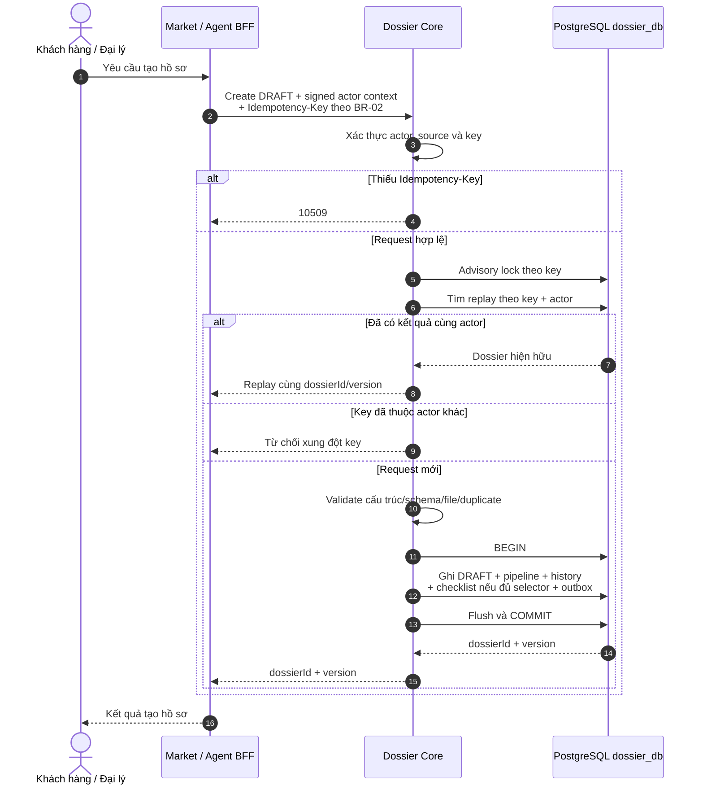

Unique constraint tại DB là race guard cuối; conflict được map về lỗi nghiệp vụ và
không để lại một phần aggregate.

### 8.1.2 Thu consent và upload tài liệu

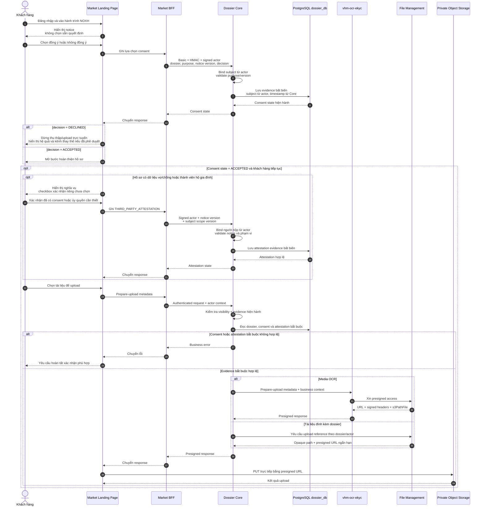

Xác nhận submit không thay thế consent hoặc `THIRD_PARTY_ATTESTATION`; Core luôn dùng
evidence đã lưu làm nguồn thẩm quyền cho gate mutation dữ liệu người liên quan,
prepare-upload, OCR create và submit. BFF chỉ xử lý authentication/authorization ở
boundary kênh và chuyển request/response; không quyết định nhánh business trong
sequence.

### 8.1.3 Update snapshot

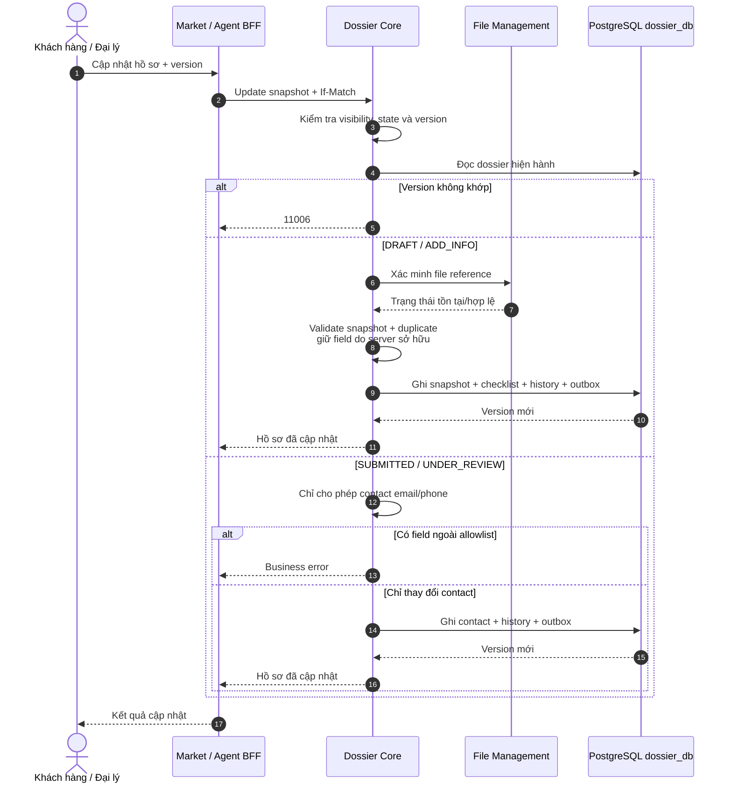

### 8.1.4 Submit và sinh mã

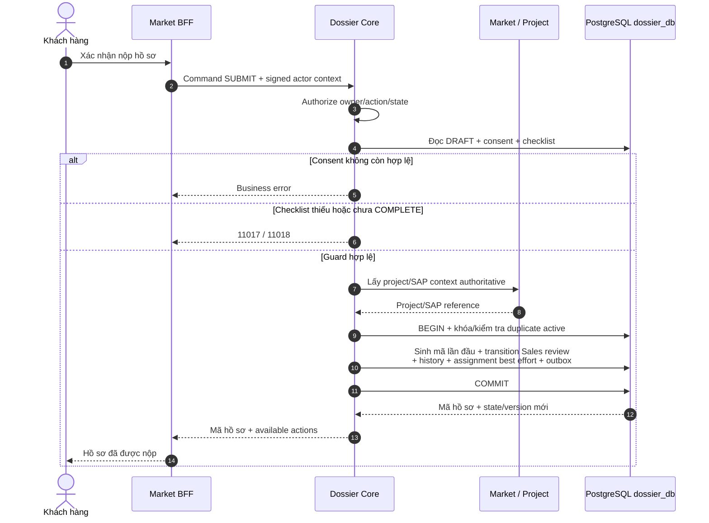

### 8.1.5 Phê duyệt, yêu cầu bổ sung và reminder

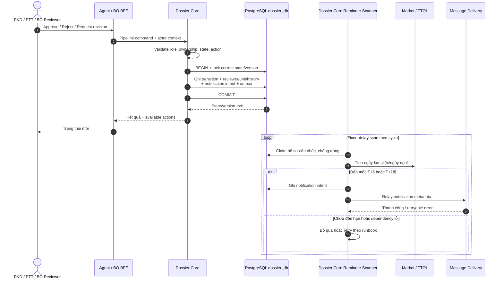

Reminder không tự động reject hồ sơ. Rule dùng các mốc 144/216 giờ và
432/504 giờ, loại trừ ngày nghỉ; manual trigger chỉ dành cho `PKD/PKD_LEAD`.

### 8.1.6 OCR create, outcome unknown và reconciliation

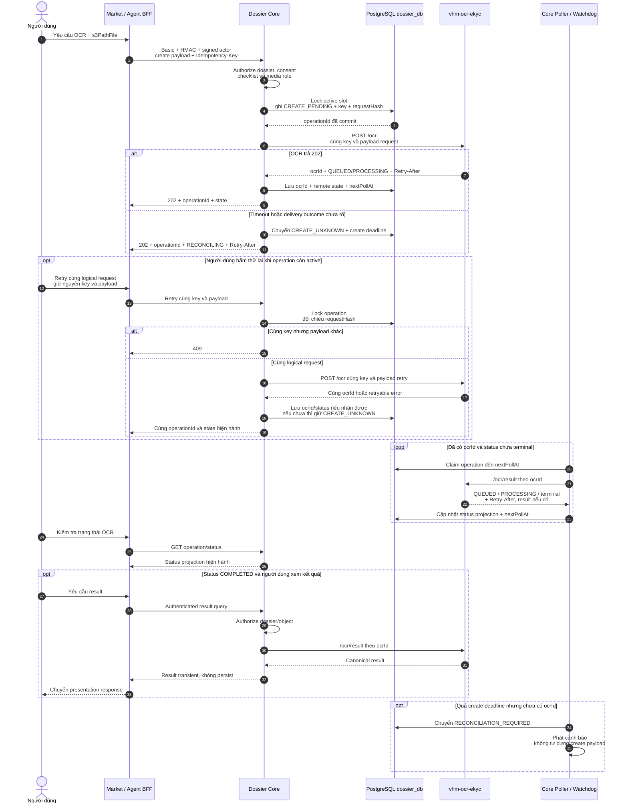

Core trả trạng thái `RECONCILING` cho kênh thay vì báo OCR đã thất bại khi chưa
xác định được delivery outcome. Local intent giữ stable idempotency key và request
hash; caller cung cấp lại cùng payload qua BFF khi retry. Sau khi thu hồi được
`ocrId`, Core tự polling `/ocr/result` và chỉ đồng bộ status projection trong DB.

## 8.2 Ma trận xử lý lỗi

| **Tình huống** | **Hành vi** | **Retry** | **Tính nhất quán** |
| --- | --- | --- | --- |
| File không tồn tại | Reject create/full update | Sau khi upload đúng | Không ghi dossier/update |
| Duplicate precheck | Trả `11011` | Không, trừ khi hồ sơ cũ terminal | Không ghi |
| Duplicate race tại unique index | Map `11011` | Như trên | Transaction rollback |
| Version mismatch | Trả `11006` | Caller reload rồi quyết định | Không ghi |
| Checklist thiếu | `11017/11018` | Upload/sync rồi submit lại | Dossier giữ nguyên state |
| External reviewer roster lỗi | Bỏ auto-assign, cho manual path | Best effort | Transition có thể vẫn commit theo action |
| Kafka down | Outbox giữ pending | Relay retry | Business commit không mất |
| Message Delivery lỗi | Notification outbox retry/backoff | Hữu hạn rồi FAILED | Transition không rollback |
| OCR create timeout/outcome unknown | Trả local operation ở `RECONCILING` | Caller retry cùng key/payload qua BFF; Core kiểm tra hash và không tạo attempt mới | Một remote resource tối đa; không ghi `FAILED` khi chưa có terminal outcome |
| OCR `FAILED`/`EXPIRED` đã xác nhận | Kết thúc polling, hiển thị retry/manual review | Retry tường minh tạo attempt/key mới | Không tự sửa/reject dossier |
| Redis security nonce lỗi khi required | Fail closed | Theo runbook | Không xử lý request |

## 8.3 Chuẩn hóa dữ liệu

- Chuẩn hóa CCCD/project ID trước duplicate lookup; không coi chuỗi trắng là identity hợp lệ.
- XSS sanitizer áp dụng cho form/metadata và dữ liệu đưa vào tài liệu/thông báo.
- Server giữ quyền sở hữu `source`, `assignedUnitCode`, `assignedUnitId`, pipeline projection và audit fields.
- `documents[].documentTemplateId` phải là UUID hợp lệ; `groupCode` rỗng được chuẩn hóa nhất quán.
- Timestamps lưu theo kiểu thời gian thống nhất của persistence; API phải biểu diễn ISO-8601 có timezone.

# 9. Security & Compliance Architecture

## 9.1 Identity & Authentication

Public client xác thực tại BFF. Mọi request từ BFF vào `/internal/**` của core phải có hai lớp danh tính độc lập:

1. **Workload identity**: Basic Auth kết hợp HMAC request signature trên client ID, timestamp, nonce, body SHA-256 và signature.
2. **Business actor**: actor context được ký riêng, chứa `subject`, display name, pipeline roles, visibility, thời hạn và JTI.

Ở STAG/PROD, chữ ký nội bộ và actor context là bắt buộc. Timestamp giới hạn replay window; nonce được kiểm tra qua Redis. Basic username phải khớp client ID. Cơ chế bypass dành cho local không được cấu hình hoặc kích hoạt ở STAG/PROD.

`clientId`/internal service name là identifier, không phải secret và không được dùng
độc lập làm bằng chứng xác thực hoặc phân quyền. Việc lộ identifier không đủ tạo
request hợp lệ nếu không có Basic credential và HMAC key tương ứng. Core chỉ chấp
nhận caller khi đồng thời đạt credential, signature, timestamp/nonce, body hash và
caller allowlist; response lỗi không được tiết lộ secret hoặc giúp phân biệt phần
credential nào hợp lệ.

Baseline của trust boundary BFF → Core giữ `HTTPS + Basic Auth + HMAC`; mTLS và
JWT ký bất đối xứng không thuộc wire contract hiện tại. Mỗi caller Market/Agent và
mỗi môi trường phải có Basic credential cùng HMAC signing key riêng, chỉ có hiệu
lực cho audience/direction BFF → Dossier Core và không được tái sử dụng cho chiều
ngược lại hoặc dependency khác. Basic credential và HMAC key là hai secret độc
lập. Rủi ro còn lại khi credential của caller bị lộ phải có risk acceptance của
System Owner/ANBM trước production nếu tiêu chuẩn áp dụng yêu cầu workload identity
bất đối xứng.

## 9.2 Authorization & Access Control

Authorization áp dụng defense in depth:

| **Lớp** | **Kiểm soát** |
| --- | --- |
| Kênh/BFF | Xác thực end-user, channel/public-API scope, abuse control và signed actor context; không quyết định business object/action. |
| Visibility core | `ALL`, `TEAM`, `SELF_CREATED`, `ASSIGNED`; các mode chưa hỗ trợ phải deny by default. |
| Project permission | Team/project/scope active quyết định phạm vi đại lý và nguồn auto-assignment. |
| Pipeline role | Mỗi action chỉ dành cho role đã cấu hình. |
| Ownership | `OWNER` hoặc `CLAIMER` khi action yêu cầu. |
| Dữ liệu | Mask phone/email theo persona; download/export dùng cùng phạm vi với detail. |
| Consent gate | Core kiểm tra theo subject/scope trước prepare-upload OCR/File, OCR create và submit; BFF chỉ chuyển request/response, giá trị do client/BFF tự khai không phải nguồn thẩm quyền. |

Các scope chưa có semantics nghiệp vụ đầy đủ như `REGION` và `DEPARTMENT` phải bị từ chối, không được mở rộng bằng fallback `ALL`. Lịch sử assignment chỉ được dùng cho read visibility khi contract quyền quy định rõ.

Business RBAC thuộc hoàn toàn `vhm-dossier-core`: Core xác minh actor, role,
visibility, ownership và action trên dossier trước mọi thao tác đọc/sửa/export,
upload, submit hoặc gọi OCR. `vhm-ocr-ekyc` không ánh xạ role người dùng, không
nhận role từ request làm authority và không quyết định người dùng nào được truy
cập hồ sơ. Xác thực workload giữa Core và capability, nếu áp dụng, chỉ bảo vệ
service boundary và không được mô tả như business RBAC của `vhm-ocr-ekyc`.

## 9.3 Secrets & Credential Management

- HMAC secret, Basic credential, File/OCR/Market/Message/TTOL credential và encryption key không được nằm trong source, image hoặc tài liệu này.
- Basic credential và HMAC key phải tách theo caller/environment, lưu trong secret manager, cấp cho đúng workload, có owner, rotation period và emergency revocation runbook; không dùng chung giữa Market và Agent.
- Core và `vhm-ocr-ekyc` dùng danh tính workload riêng, audience/scope tối thiểu; Dossier không nhận credential của các dependency phía sau capability.
- Không copy cookie STG vào code/config/log; credential từng được chia sẻ ngoài luồng phải được rotate/revoke.
- Startup/readiness phải fail khi capability bắt buộc được bật nhưng thiếu secret/config hợp lệ.

## 9.4 Application Security & Data Protection

### Kiểm soát request và file

- Body bị từ chối nếu chứa các trường giả mạo actor như `actorId`, `actorDisplayName`, `roles` ở bất kỳ cấp lồng nhau.
- Structural guard giới hạn shape/kích thước; JSON Schema bảo vệ semantic khi feature được bật; XSS sanitizer chạy trước persistence/render.
- File type/size/magic/checksum phải được kiểm soát ở File/OCR contract; chỉ path opaque được lưu.
- Presigned URL có TTL ngắn, phạm vi object chính xác, không cho list và không được persist/log.
- File existence không đồng nghĩa ownership; attach authorization chỉ được coi là hoàn chỉnh khi có upload-grant/owner contract.

### Ma trận bảo vệ dữ liệu

| **Trạng thái dữ liệu** | **Kiểm soát bắt buộc** |
| --- | --- |
| In transit | TLS và cơ chế workload authentication đã chốt theo từng ranh giới; BFF → Core dùng Basic Auth + HMAC; không gửi credential trong query. |
| At rest | PostgreSQL/object storage encryption theo chuẩn VHM; backup cũng phải mã hóa. |
| In use | Least privilege, không dump formData/raw OCR vào log/APM; giới hạn export/download. |
| Event | Chỉ opaque ID và metadata tối thiểu; không PII, media path hoặc presigned URL. |
| Retention/deletion | Policy theo purpose/legal hold; purge cả primary, object, outbox đã hết hạn và backup theo lịch. |
| Consent evidence | Giữ nội dung/version và quyết định có thể kiểm chứng; tách khỏi debug log và không chứa media/raw OCR. |

### Nhật ký kỹ thuật

Log kỹ thuật tại Core tối thiểu gồm `trace_id` nhận qua header `X_TRACE_ID`, client
ID, actor subject dạng opaque, dossier ID, action, kết quả, duration, error code và
`peer_ip` do trusted ingress/transport quan sát. Vì Core chỉ nhận request từ BFF,
`peer_ip` là địa chỉ peer nội bộ và không được biểu diễn như IP gốc của khách hàng.

WAF/edge hoặc BFF là nguồn thẩm quyền của `origin_ip`. Thành phần này phải loại bỏ
header network-origin do client tự gửi, ghi origin đã quan sát và truyền cùng
`X_TRACE_ID` xuyên suốt để điều tra viên correlate WAF/edge → BFF → Core.
Core không tin trực tiếp `X-Forwarded-For` hoặc trường IP do request nghiệp vụ tự
khai. Không log request/response body chứa PII, CCCD, contact, file URL,
HMAC/actor token hoặc OCR result. Audit quyết định nghiệp vụ phải tách khỏi debug
log và có quyền truy cập/retention riêng.

| **Trường điều tra** | **Nguồn thẩm quyền** | **Nguyên tắc sử dụng** |
| --- | --- | --- |
| `origin_ip` | WAF/edge hoặc BFF sau trusted ingress | Không chuyển thành dữ liệu nghiệp vụ của Core; truy xuất theo quyền và retention của security log. |
| `peer_ip` | Trusted ingress/transport trước Core | Địa chỉ peer nội bộ quan sát được; không gắn nhãn là IP khách hàng. |
| `trace_id` / `X_TRACE_ID` | Edge/BFF sinh hoặc chuẩn hóa | Truyền nguyên vẹn qua BFF → Core và ghi ở mọi hop; đây là khóa correlation của luồng hiện tại. |
| `actor_id`, `action`, `resource_id`, `result_code` | Dossier Core | Correlate với `trace_id`; dùng opaque identifier và không ghi payload DLCN. |

Logging & Incident Correlation Contract L3 phải chốt schema/field name, nguồn sinh,
quy tắc overwrite header, quyền truy cập, retention và truy vấn điều tra xuyên các
hop. Đây là release artefact bắt buộc; implementation phải được chứng minh bằng
E2E test trước OAT.

### Audit nghiệp vụ và thao tác trên DLCN

`vhm-dossier-core` sở hữu business/privacy audit cho các thao tác đọc hoặc làm thay
đổi dữ liệu hồ sơ. Tối thiểu phải audit: xem chi tiết, tìm kiếm có trả dữ liệu định
danh, create/update/delete, prepare-upload/attach/download/export, OCR create/status
binding, consent/withdrawal/third-party attestation, submit và các quyết định
pipeline/assignment có thay đổi quyền tiếp cận hồ sơ.

Mỗi audit event là JSON structured, append-only và tối thiểu gồm
`timestamp_utc_ms`, `environment`, `service`, `actor_id`, `actor_type`, `client_id`,
`action`, `resource_type`, `resource_id`, `result_code`, `trace_id` và
`reason/error_code` khi thất bại. `result_code=0` biểu diễn thành công; thất bại dùng
application error code có thẩm quyền. Audit không chứa request/response body, giá
trị CCCD, contact, file URL, media hoặc OCR result.

IP gốc không được suy diễn tại Core: audit event correlate qua `trace_id` tới
`origin_ip` ở WAF/BFF và `peer_ip` ở Core theo bảng trên. Schema/version, danh sách
action, central collection, quyền truy cập, retention và kiểm thử truy vấn điều tra
được đóng băng trong Logging & Incident Correlation Contract cùng Data Retention,
Deletion & Legal-hold Schedule trước OAT.

### Mô hình mối đe dọa

| **ID** | **Mối đe dọa** | **Kiểm soát** | **Tồn dư** |
| --- | --- | --- | --- |
| TH-01 | IDOR đọc/sửa dossier ngoài phạm vi | Signed actor, visibility, project ACL, ownership | Cần E2E negative matrix. |
| TH-02 | Giả mạo request nội bộ/replay | HMAC body hash, timestamp, nonce, Redis | Cần kiểm thử outage/recovery của nonce store. |
| TH-03 | Race tạo hồ sơ/cấp căn trùng | Advisory lock, optimistic lock, partial unique index | Cần load/concurrency test. |
| TH-04 | Attach file của actor khác | Access-before-upload + existence check | Chưa có owner/upload-grant; rủi ro cao. |
| TH-05 | Client giả mạo requiredness của checklist | Core resolve definition/version, snapshot server-side và từ chối field authority từ client | Cần negative contract test. |
| TH-06 | PII/secret lọt log/event | Allowlist log/event, scan CI/APM, runbook incident | Cần evidence production. |
| TH-07 | OCR result tự động gây quyết định sai | Người dùng/người có thẩm quyền xác nhận trước khi áp dụng; không auto reject | UX/contract cần UAT. |
| TH-08 | Bỏ qua consent hoặc dùng consent sai subject/scope | Consent gate và evidence bất biến tại Core | Cần negative E2E cho thiếu/sai version/rút consent. |

# 10. Deployment & Infrastructure Topology

## 10.1 Environments

| **Môi trường** | **Mục đích** | **Đặc điểm/điều kiện** |
| --- | --- | --- |
| Local | Phát triển và E2E cục bộ | Core và dependency cục bộ; không dùng dữ liệu/credential thật. |
| STAG | Contract/UAT/integration | Security nội bộ bật như PROD; external sandbox; migration rehearsal; synthetic/masked data. |
| PROD | Nghiệp vụ thật | Secrets runtime, signature/actor required, file validation, outbox relay, alert/runbook và policy privacy đã duyệt. |

## 10.2 Production Deployment Diagram (CI/CD)

### 10.2.1 CI/CD và promotion artefact

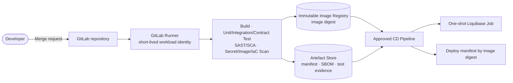

CI build một lần; CD quảng bá đúng image digest và manifest đã được phê duyệt,
không build lại giữa các môi trường. Credential pipeline dùng workload identity
ngắn hạn, không nằm trong source, image hoặc artefact.

### 10.2.2 Production runtime topology

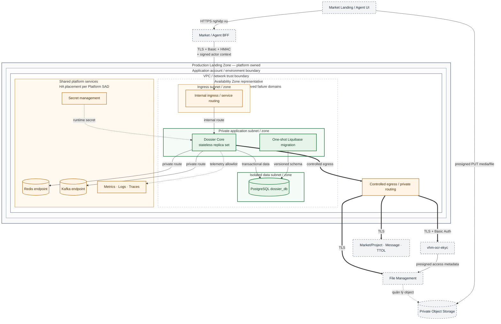

TDD ứng dụng chốt placement logic: internal ingress, private application/data zone,
controlled egress, workload stateless có replica và production phải trải trên các
failure domain đã được phê duyệt. Tên account/region, CIDR, số AZ/subnet, replica
count, node group và HA/failover mode của PostgreSQL/Redis/Kafka thuộc
Platform/Infrastructure SAD; TDD tham chiếu artefact đó và không tự gán giá trị.

## 10.3 Deployment Strategy

- Build artifact/image bất biến; cùng artifact đi qua STAG và PROD, khác nhau bằng externalized configuration.
- Triển khai rolling hoặc canary với readiness, graceful shutdown và backward-compatible DB changes.
- Migration chạy một lần trước app version cần schema; không để mọi replica tự tranh DDL production.
- Feature flag cho JSON Schema enforcement, file validation, Kafka publish, actor replay và auto-assignment phải có owner/default production được duyệt.
- Rollback ứng dụng chỉ an toàn khi migration tương thích ngược; destructive cleanup thực hiện ở release sau khi hết compatibility window.

### Quản lý cấu hình

| **Nhóm** | **Production gate** |
| --- | --- |
| Security signature/actor | Bật và required; secret khác local; nonce store dùng endpoint nền tảng được phê duyệt. |
| Form validation | Chốt bật JSON Schema sau compatibility test; structural guard luôn bật. |
| File validation | Bật; không dùng local default `false`. |
| Outbox Kafka | Chốt topic/ACL/schema rồi bật publisher; dashboard backlog trước go-live. |
| Notification relay | Template/recipient/dedupe/retry được contract test. |
| OCR | Base URL, workload IAM và timeout trỏ `vhm-ocr-ekyc`; không cho phép cấu hình đường tích hợp bỏ qua capability. |
| Auto-assignment | Roster/permission/counter có fallback manual và alert. |

## 10.4 Infrastructure & Network Security

- Chỉ BFF/workload được allow mới gọi core internal ingress.
- DB, Redis, Kafka và external credentials dùng network identity/ACL tối thiểu; không public internet nếu không bắt buộc.
- Egress allowlist tới File, Market, TTOL, Message Delivery và `vhm-ocr-ekyc`; Core không mở egress tới dependency phía sau capability OCR.
- TLS termination và re-encryption tuân theo platform standard; không hạ cấp clear text qua trust boundary.
- Backup, log, trace và exported report phải ở vùng dữ liệu được duyệt.

### Ma trận luồng mạng

| **Nguồn** | **Đích** | **Luồng** | **Kiểm soát bắt buộc** |
| --- | --- | --- | --- |
| Khách hàng/Đại lý | Market/Agent BFF | HTTPS nghiệp vụ | Xác thực end-user, session/rate limit tại public boundary; BFF ngoài scope Core. |
| Market/Agent BFF | Internal ingress → Dossier Core | HTTPS JSON | Private route, workload allowlist, Basic Auth + HMAC, actor context, timestamp/nonce và admission control theo `client_id + operation`; không có đường public trực tiếp tới Core. |
| Dossier Core | PostgreSQL endpoint | Kết nối DB mã hóa | Private route, ACL tối thiểu, credential riêng và rotation. |
| Dossier Core | Redis endpoint | Nonce/replay, counter, coordination | Private route, auth/TLS; lỗi security path phải fail closed, không bypass. |
| Dossier Core | Kafka | Domain event từ outbox | Private route, TLS, ACL theo topic/producer; payload theo allowlist. |
| Dossier Core | File, Market/Project, Message, TTOL, `vhm-ocr-ekyc` | HTTPS API | Controlled egress/private endpoint, workload identity, destination allowlist và timeout theo use case. |
| Web/client | Private Object Storage | HTTPS PUT bằng presigned URL | Chỉ đúng object/method, TTL ngắn, không list; presigned response cấp qua File contract hoặc chuỗi `Core → vhm-ocr-ekyc → File` tùy loại tài liệu. |
| Core/Platform | Nền tảng quan sát | Metric/log/trace | Kết nối mã hóa, field allowlist; không gửi PII, file URL, token hoặc OCR result. |

## 10.5 Migration Strategy

Liquibase quản lý schema theo phiên bản cho dossier, permissions, pipeline projection, notification outbox, checklist, consent evidence, source/PIC/audit và race guards. Migration production phải:

1. Chạy thử trên snapshot có kích thước gần production và kiểm tra lock duration.
2. Dùng expand/migrate/contract cho thay đổi không tương thích.
3. Xác minh unique partial index bằng preflight duplicate report trước create index.
4. Có backup/PITR marker và rollback application plan; rollback DDL chỉ dùng khi thực sự an toàn.
5. Đối soát row count, constraint/index, version và sample business query sau deploy.

Không được gọi trực tiếp `vhm-ocr-ekyc` từ BFF/client; Core không được bỏ qua
capability để gọi dependency phía sau và không dual-write kết quả OCR vào Dossier.
Tuyến API hợp lệ là
`Web → BFF → Dossier Core → vhm-ocr-ekyc`; chỉ byte media/file dùng presigned PUT
trực tiếp `Web → Private Object Storage`.

# 11. Cost & Capacity/Performance

## 11.1 Capacity/Performance

Capacity baseline được dẫn xuất từ workload model đã được phê duyệt và bằng chứng
load/soak test. Capacity plan phải tách ít nhất:

| **Workload** | **Đơn vị đo bắt buộc** | **Điểm nghẽn cần kiểm thử** |
| --- | --- | --- |
| Create/update/submit | TPS, P95/P99, error rate | DB transaction, JSONB, file validation, external project call. |
| List/detail/statistics | Concurrent users, page size, P95 | JSONB query/index, visibility predicate, N+1. |
| Pipeline action | Actions/minute, contention | Optimistic lock, reviewer/unit unique, notification intent. |
| Outbox/reminder | Events/minute, oldest age, recovery time | Batch lock, Kafka/Message quota. |
| Report/download | Rows/file size/concurrency | Memory, temp storage, File/Syncfusion latency. |
| OCR CCCD | Request/minute và polling rate | Core phải backoff theo `Retry-After`; quota/worker thuộc capacity `vhm-ocr-ekyc`. |

### 11.1.1 Inbound admission control

Rate-limit tại boundary Market/Agent BFF → Core được cấu hình theo
`client_id + operation/endpoint class`, tách ít nhất mutation, read/search,
upload-preparation, submit và report/export. Mỗi policy phải có `limit`, `window`,
`burst` và semantics global hoặc per-replica rõ ràng; không dùng một ngưỡng chung
che khuất endpoint tốn tài nguyên.

Giá trị production được dẫn xuất từ peak workload đã phê duyệt, capacity Core,
PostgreSQL connection budget và quota dependency, sau đó ghi vào L3 Runtime
Capacity & Resilience Matrix có version. Production không được mở traffic khi
thiếu profile cho Market/Agent hoặc khi tổng hạn mức cấu hình vượt safe capacity đã
được load/soak test xác nhận. Hành vi vượt ngưỡng tuân thủ contract mục 6.7.

### 11.1.2 PostgreSQL connection budget

Connection pool được tính theo connection budget của database và concurrency thực
tế, không lấy trực tiếp từ tổng HTTP RPS:

- `dbConnectionBudget = maxConnections − adminReserve − migrationReserve − otherClientBudget`.
- `poolUpperBoundPerReplica = floor(dbConnectionBudget / maxActiveCoreReplicas)`.
- Nhu cầu pool được dẫn xuất từ `peakDbBoundRps × p99DbConnectionHoldTime × headroomFactor`; configured pool không được vượt `poolUpperBoundPerReplica`.
- Pool wait phải hữu hạn. Khi pool bão hòa, Core trả lỗi quá tải có kiểm soát; không tạo hàng đợi chờ connection không giới hạn.

L3 Runtime Capacity & Resilience Matrix phải công bố `maxConnections`, phần
reserve, số Core replica tối đa, pool min/max, acquire timeout, transaction P99 và
ngưỡng saturation/alert. DBA và SRE xác nhận tổng pool của mọi replica không vượt
connection budget của database.

TDD không công bố một con số connection pool khi `maxConnections`, reserve, số
replica và P99 giữ connection chưa được owner phê duyệt. Comment về pool chỉ được
coi là đóng khi matrix chứa đủ các giá trị số trên và load test chứng minh pool wait,
saturation cùng headroom đạt ngưỡng đã duyệt.

### 11.1.3 Dependency quota và backpressure

Core phải tính demand riêng cho từng dependency thay vì đồng nhất Core throughput
với downstream throughput:

- `dependencyDemandRps = coreRps × dependencyCallRatio × callsPerRequest + retryRps`.
- `excessRps = max(0, dependencyDemandRps − dependencyQuotaRps)`.
- Rate limiter/bulkhead tại Core không được cấp vượt quota đã công bố. Phần vượt quota phải fast-fail với lỗi retryable/`Retry-After` hoặc vào bounded queue nếu use case cho phép; không block thread hay queue vô hạn.
- Retry cũng tiêu thụ quota và chỉ được thực hiện trong remaining deadline theo NFR-T04.
- Upload/download file binary đi trực tiếp Client ↔ Object Storage và không được tính như traffic binary qua Core; chỉ các call metadata/presign/validation mới tính vào File quota của Core.

Ví dụ kiểm tra bottleneck theo comment thẩm định: nếu toàn bộ `400 req/s` của Core
đều phát sinh đúng một File call và File quota là `50 req/s`, thì
`excessRps = 350 req/s`. Core chỉ được chuyển tối đa `50 req/s` tới File; phần vượt
không được block thread hoặc xếp hàng vô hạn mà phải fast-fail với lỗi
retryable/`Retry-After`, hoặc vào bounded queue khi use case và queue capacity đã
được phê duyệt. Đây là ví dụ kiểm tra công thức, không phải capacity baseline
production.

L3 matrix phải công bố quota, burst, concurrency, dependency call ratio, queue
policy và overload response theo từng operation. Product cung cấp MAU/DAU, hồ
sơ/ngày, peak factor và số tài liệu/hồ sơ; Backend/DBA/SRE xác nhận bằng load/soak
test trước OAT.

## 11.2 Cost

Cost drivers gồm PostgreSQL/backup, Redis, Kafka retention, object storage/egress, Message Delivery, document rendering và mức sử dụng `vhm-ocr-ekyc`. Dossier chỉ hạch toán mức sử dụng capability theo contract nội bộ, không mô hình hóa chi phí phía sau capability. Cost model phải có unit cost trên một hồ sơ hoàn tất, storage growth theo retention, peak compute và alert ngân sách; giá trị tiền tệ do FinOps/System Owner phê duyệt.

# 12. Scalability & Reliability

## 12.1 Scaling Strategy

- Scale ngang HTTP replicas; không lưu session/actor state trong process.
- Scale relay/scanner theo leader/DB claim để không xử lý một row đồng thời.
- Dùng pagination có giới hạn và index cho filter phổ biến; report lớn chạy với quota/batch phù hợp.
- Cache chỉ tối ưu read; DB vẫn là authority. Cache miss/stale không được mở rộng quyền.
- Core phải tôn trọng `Retry-After` của OCR, tránh polling storm; OCR worker/capacity thuộc service dùng chung.
- Auto-assignment Redis counter không được chặn manual assignment khi Redis/roster suy giảm.

## 12.2 Reliability

| **Failure mode** | **Hành vi an toàn** | **Phục hồi** |
| --- | --- | --- |
| Core replica dừng giữa request | Transaction rollback hoặc commit nguyên tử | Client retry create bằng idempotency key; reload version. |
| PostgreSQL không sẵn sàng | Fail request; không nhận mutation giả thành công | Nền tảng phục hồi theo RPO/RTO và runbook. |
| Kafka không sẵn sàng | Outbox backlog tăng, hồ sơ vẫn commit | Relay phát lại; alert oldest age. |
| Message Delivery lỗi | Notification retry/FAILED | Manual replay/runbook; không rollback transition. |
| Redis nonce/replay không sẵn sàng | Mọi request đã ký từ BFF vào Core bị fail closed; không bypass kiểm tra replay | Cảnh báo, phục hồi theo SLO/runbook nền tảng; downtime được tính vào availability end-to-end. |
| Redis counter/cache không sẵn sàng | Auto-assignment/cache suy giảm nhưng không mở rộng quyền hoặc làm sai dossier authority | Manual assignment, đọc nguồn authority và rebuild cache/counter theo runbook. |
| Market/TTOL lỗi | Guard bắt buộc fail hoặc auto-assign best effort | Cache/manual path và alert tùy use case. |
| OCR create timeout hoặc Core lỗi sau khi remote có thể đã nhận | Ghi `CREATE_UNKNOWN`, không ghi `FAILED` và không cấp attempt mới | Khi caller retry cùng key/payload qua BFF, Core đối chiếu hash rồi replay để thu hồi đúng `ocrId`; quá deadline chuyển `RECONCILIATION_REQUIRED` và cảnh báo. |
| `vhm-ocr-ekyc` lỗi khi polling | Giữ local operation chưa terminal và báo tạm thời không khả dụng | Poll lại theo `Retry-After`/circuit policy; không reject dossier hoặc tạo OCR trùng. |
| File Service lỗi | Không prepare/validate/download được | Retry hữu hạn; không attach path chưa xác minh. |

## 12.3 Sao lưu và phục hồi

- PostgreSQL cần automated backup, PITR và restore drill có bằng chứng.
- RPO phải bao phủ dossier, pipeline history, checklist, reviewer và outbox trong cùng database.
- Object file do File Service backup/retention; restore phải bảo toàn reference hoặc có reconciliation.
- Redis cache/counter có thể rebuild; nonce/replay trong cửa sổ security phải fail closed và phục hồi theo runbook nền tảng, không được reset/bypass để mở traffic không kiểm soát.
- Kafka không thay thế DB backup; outbox là nguồn replay event trong retention window.
- Kiểm thử DR phải bao gồm backlog relay, notification và consistency sau restore, không chỉ khởi động ứng dụng.

# 13. Observability & Monitoring

## 13.1 Yêu cầu nền tảng

- Correlation ID xuyên BFF → core → external calls/outbox, không dùng PII.
- Structured log có schema/version, environment, service, action, outcome và error code.
- Metrics cho HTTP, DB pool/query, external dependency, cache, outbox, notification, reminder và pipeline.
- Distributed trace với sampling phù hợp; body/PII/file URL/token luôn bị loại.
- Dashboard/cảnh báo có owner, route on-call và link runbook.

## 13.2 Chỉ số bắt buộc

| **Nhóm** | **Chỉ số** |
| --- | --- |
| API | Request rate, P50/P95/P99, 4xx/5xx, timeout theo operation. |
| Business | DRAFT created, submit success/fail theo reason, transition count, revision age, duplicate conflict. |
| Checklist | Missing/invalid distribution, submit blocked `11017/11018`, progress anomaly. |
| Data | DB pool saturation, transaction/lock time, unique conflict, slow query, storage growth. |
| Outbox | Pending count, oldest age, publish/send rate, retry, FAILED. |
| Assignment | Auto/manual rate, roster/Redis failure, unassigned stage age. |
| External | File/Market/TTOL/Message/OCR availability, latency, timeout, error class, circuit state/open count, rejected call và half-open probe result. |
| Security | Invalid signature, stale timestamp, nonce replay, actor expiry/role/visibility denial. |

Label không được chứa dossier ID, actor ID, project ID có cardinality cao hoặc PII. Business drill-down dùng log/audit có kiểm soát thay vì metric label.

## 13.3 Cảnh báo

| **Cảnh báo** | **Điều kiện nguyên tắc** | **Ưu tiên** |
| --- | --- | --- |
| Mutation error/latency burn | Vượt SLO theo nhiều cửa sổ | P1/P2 theo burn rate |
| PostgreSQL saturation/lock | Pool gần cạn, lock/transaction bất thường | P1 |
| Outbox/notification backlog | Oldest age vượt delivery SLO | P1/P2 |
| Reviewer chưa được assign | Stage age vượt ngưỡng nghiệp vụ | P2 |
| Signature/replay anomaly | Tăng đột biến hoặc client bị deny liên tục | Security incident |
| File/OCR/Market/TTOL dependency | Error/timeout vượt budget hoặc circuit chuyển OPEN kéo dài | P2; P1 nếu chặn toàn bộ submit |
| Reminder missed | Scan không chạy hoặc due row quá hạn | P2 |

## 13.4 SLI/SLO

SLI bắt buộc: availability của read/mutation, successful submit/transition, event delivery latency, notification intent delivery, reminder timeliness và data consistency. Giá trị mục tiêu, measurement window, error budget, maintenance exclusion và owner đều `TBD`; không được chuyển trạng thái `APPROVED` nếu chưa có baseline đo trên STAG/load test.

# 14. Operational Readiness

## 14.1 RTO & RPO

| **Hạng mục** | **Mục tiêu** | **Trạng thái** |
| --- | --- | --- |
| RTO dossier core | TBD | System Owner/Vận hành phê duyệt và diễn tập |
| RPO PostgreSQL | TBD | DBA phê duyệt và có bằng chứng PITR |
| Event/notification recovery | Trong delivery SLO được duyệt | Cần backlog replay drill |
| File/object recovery | Theo File Service SLA và retention | Contract ngoài |
| OCR recovery | Theo `vhm-ocr-ekyc` SLO; không mất `ocrId` đã nhận | Contract ngoài |

## 14.2 Runbook bắt buộc

- Invalid HMAC/actor signature, Redis nonce store lỗi/phục hồi và luân chuyển/revoke secret; không có thủ tục bypass replay control.
- PostgreSQL backup/restore/PITR, Liquibase lỗi, unique-index migration và data reconciliation.
- Kafka down, outbox backlog, duplicate publish và poison event.
- Message Delivery lỗi, notification `FAILED`, dedupe và manual replay.
- Reviewer roster/Redis counter lỗi, unassigned dossier và manual assignment.
- Market/special-day cache lỗi ảnh hưởng sinh mã/SLA reminder.
- File ownership/existence/download incident và object mồ côi.
- `vhm-ocr-ekyc` unavailable, OCR stuck/terminal error và migration rollback.
- PII/credential xuất hiện trong log, export hoặc event.
- Rollback release khi migration đã chạy.

## 14.3 Danh sách kiểm tra sẵn sàng cơ sở

- Owner/on-call/escalation matrix cho core và từng dependency.
- Production config review chứng minh signature, actor, file validation, schema validation và relays đúng default.
- Dashboard/cảnh báo đã fire thử và route đúng người.
- Backup/restore, deployment rollback, secret rotation và backlog replay đã diễn tập.
- OpenAPI/event/schema/pipeline version được đóng băng và contract test.
- Privacy retention/deletion/export access được phê duyệt.
- `INT-04A` chỉ được enable khi release evidence tham chiếu compliance attestation còn hiệu lực của `vhm-ocr-ekyc`, bao phủ đúng OCR CCCD hai mặt.
- Mọi vấn đề Critical/High tại mục 16 đã đóng hoặc có risk acceptance hữu hạn, owner và expiry.

# 15. Testing & Quality Strategy

## 15.1 Phạm vi kiểm thử bắt buộc

Bộ kiểm thử phải bao phủ invariant domain, database concurrency, API/security contract, external integration, outbox/recovery, performance và OAT/DR. Unit test không thay thế PostgreSQL integration test, contract test, E2E hoặc failure drill.

## 15.2 Cổng chất lượng

| **Lớp kiểm thử** | **Phạm vi bắt buộc** | **Cổng** |
| --- | --- | --- |
| Unit/domain | State/action/role/ownership, checklist, code/unit, masking, error mapping | Bắt buộc |
| Database integration | Migration, JSONB, partial index, advisory/row lock, optimistic lock, cascade | Bắt buộc |
| Concurrency | Concurrent idempotent create, duplicate identity/project, allocate unit, reviewer claim | Bắt buộc |
| API/contract | Market/Agent BFF ↔ Core DTO/header/status/error/backward compatibility | Bắt buộc |
| Security | Signature, nonce replay, Redis outage/recovery không bypass control, actor expiry/role/visibility/IDOR, body actor injection | Bắt buộc |
| Privacy/consent | Consent, third-party attestation, evidence, UI, gate và withdrawal theo mục 7.3.3 | Bắt buộc |
| External contract | File, Market, TTOL, Message Delivery và `vhm-ocr-ekyc` | Bắt buộc |
| Outbox/reliability | Rollback, broker/send lỗi, publish lặp, retry/FAILED, backlog recovery | Bắt buộc |
| E2E | Create DRAFT → upload → PATCH → submit → multi-stage decision/revision | Bắt buộc |
| Performance/soak | Workload model mục 11, report/download và polling OCR | Bắt buộc |
| OAT/DR | Deploy/rollback, dependency outage/recovery, restore, secret rotation, alert/runbook | Bắt buộc |

## 15.3 Kịch bản kiểm thử trọng yếu

- Create `{}` trả DRAFT/version đúng DB; create không sinh checklist.
- Concurrent create cùng actor/key trả cùng dossier; actor khác không replay được key.
- `MARKET` hoặc `AGENT` thiếu key đều bị từ chối; caller machine identity phải có allowlist/scope, audit và negative test.
- MARKET/Agent timeout sau khi Core đã commit rồi retry cùng key phải nhận lại cùng dossier.
- Hai hồ sơ active cùng CCCD+dự án bị chặn ở create, full update, submit và DB race guard.
- Full update file không tồn tại rollback cả dossier/checklist/outbox; xóa documents reset/delete projection đúng.
- Submit không checklist/thiếu required trả `11017/11018`; required complete mới chuyển trạng thái.
- If-Match cũ, concurrent command, allocate cùng căn và double claim không làm lost update.
- Mọi state/action/role/ownership branch của pipeline, gồm revision loop và revoke sau approve.
- Signature/body hash/timestamp/nonce/actor JTI/visibility negative matrix và không có body actor spoofing.
- Logging E2E phải chứng minh ingress loại bỏ network-origin header do client tự khai, WAF/BFF ghi `origin_ip`, Core ghi `peer_ip` và cùng `X_TRACE_ID` truy vấn được xuyên WAF/edge → BFF → Core; không được suy diễn peer nội bộ thành IP khách hàng.
- Khi Redis nonce store không sẵn sàng, request phải fail closed; sau phục hồi không chấp nhận nonce lặp hoặc mở bypass, và outage được tính vào availability end-to-end.
- Outbox crash trước/sau broker acknowledgement có thể phát lặp nhưng không mất event.
- Notification retry/dedupe/FAILED và reminder T+6/T+18 qua ngày nghỉ/cycle mới.
- OCR: idempotent create, `202`/`Retry-After`, polling `QUEUED/PROCESSING/terminal`, user-confirm-before-apply, timeout và service unavailable.
- Topology E2E phải chứng minh Web/BFF không gọi trực tiếp `vhm-ocr-ekyc`; prepare-upload/create/result đi qua Core, còn Web chỉ PUT byte media vào đúng object bằng presigned URL.
- OCR create timeout sau khi remote đã commit phải để Core ở `CREATE_UNKNOWN`; caller retry cùng key/payload qua BFF để Core thu hồi đúng `ocrId` và chỉ có một OCR resource.
- OCR create timeout trước khi remote nhận request, Core crash sau remote acknowledgement và concurrent user retry đều phải hội tụ về một active operation; chỉ terminal `FAILED/EXPIRED` mới cho attempt/key mới.
- Watchdog phải đưa operation quá hạn sang `RECONCILIATION_REQUIRED`, phát cảnh báo và chặn attempt/key mới cho đến khi đối soát, không để operation treo im lặng.
- Contract/load test phải chứng minh timeout từng outbound operation khớp L3 matrix, retry dừng khi hết remaining deadline và mutation không bị retry mù.
- Failure-injection phải chứng minh dependency suy giảm kéo dài làm circuit mở và request sau đó fail-fast; half-open chỉ phát probe giới hạn có jitter, phục hồi không tạo request storm hoặc mutation trùng.
- Load test phải chứng minh tổng pool của mọi Core replica nằm trong DB connection budget; pool saturation dùng bounded wait và trả lỗi quá tải có kiểm soát.
- Admission-control test phải bao phủ từng `client_id + operation` ở dưới, bằng và vượt ngưỡng; nhiều replica vẫn tuân thủ semantics đã công bố, response vượt ngưỡng có HTTP `429`, code `10501`, `Retry-After` hợp lệ và không bắt đầu mutation.
- Kiểm thử quota File phải bao phủ demand thấp hơn, bằng và vượt quota; phần vượt phải được rate-limit/fast-fail hoặc đưa vào bounded queue đúng policy, không block thread vô hạn.
- Negative contract/E2E phải chứng minh Core không gọi prepare-upload/OCR create và không trả presigned response khi consent thiếu, `DECLINED`, sai subject/purpose/version hoặc đã bị rút; BFF không được override business error của Core.
- UI phải kiểm thử không có quyết định mặc định, `ACCEPTED` mới mở bước tiếp theo, `DECLINED` dừng xử lý/upload trực tuyến, withdrawal được ghi nhận và xác nhận submit không bị dùng để suy diễn consent.
- Mutation, prepare-upload và submit có dữ liệu vợ/chồng/thành viên hộ gia đình phải bị từ chối khi thiếu/sai phạm vi `THIRD_PARTY_ATTESTATION`; thay đổi phạm vi chủ thể hoặc notice version phải yêu cầu xác nhận lại.
- UI phải kiểm thử checkbox attestation tách biệt, không tích sẵn; evidence và nội dung hiển thị không được biểu diễn cam kết của người nộp như consent do Core trực tiếp thu từ người liên quan.
- Privacy/E2E phải chứng minh ảnh CCCD chỉ được yêu cầu theo checklist áp dụng, Core không lưu byte ảnh và không đưa media vào log/event/report; OCR/apply-result chỉ nhận các trường allowlist tại mục 6.4.3 và không xử lý chữ ký/sinh trắc học ngoài phạm vi.
- Audit/E2E phải chứng minh các action DLCN tại mục 9.4 sinh event đủ actor/action/resource/result/time/trace, thất bại giữ error code và không chứa payload DLCN; `trace_id` correlate được tới network-origin log.
- Retention test phải chứng minh legal hold, purge từng nhóm dữ liệu và restore không làm dữ liệu đã hết hạn tái xuất hiện ngoài policy.
- File cross-owner/cross-reference, path traversal, MIME/magic/checksum, expired presign và upload grant.
- Migration trên dữ liệu trùng, rollback application và restore/PITR reconciliation.

## 15.4 Dữ liệu kiểm thử và quản lý bằng chứng

Test tự động/SIT chỉ dùng CCCD/file tổng hợp hoặc đã làm sạch. Dữ liệu cá nhân thật cần phê duyệt, kho cô lập, purpose/retention đích danh và bằng chứng xóa. Fixture của dependency phải có version, không chứa credential/PII và bao phủ cả success, timeout, malformed response, duplicate và permission denial.

Bằng chứng quality gate phải được lưu theo release, tối thiểu gồm test report, migration rehearsal, contract/E2E result, security scan, load/soak report, restore drill, dashboard/alert verification và danh sách risk acceptance còn hiệu lực.

# 16. Risks & Open Issues

## 16.1 Architecture Risks

| **Mã** | **Nhóm** | **Mô tả/ảnh hưởng** | **Mức độ** | **Giảm thiểu/điều kiện đóng** |
| --- | --- | --- | --- | --- |
| AR-002 | An toàn file | File response chưa chứng minh uploader/upload-grant owner | Nghiêm trọng | File contract trả owner/grant và verify khi attach; negative E2E. |
| AR-003 | Determinism | Thiếu pipeline ID/version authoritative có thể route hồ sơ sai quy trình | Cao | Bắt buộc unique selection rule và fail khi kết quả không xác định. |
| AR-004 | Security | Nếu `source=MARKET` không bị ràng buộc theo machine identity, caller khác có thể nhận quyền sai kênh | Cao | Client allowlist/scope tại BFF và Core, audit/test. |
| AR-005 | Tích hợp OCR | Đường tích hợp bỏ qua capability dùng chung làm sai trust boundary và ownership | Cao | Chỉ tích hợp `vhm-ocr-ekyc`; contract/E2E bắt buộc trước go-live. |
| AR-006 | Audit/PIC | Ownership và use case gán/chuyển `picId` chưa đủ rõ để công bố contract | Trung bình | Chốt owner, API, permission và audit semantics hoặc loại khỏi contract. |
| AR-008 | Notification | Chưa chốt kênh và nguồn thẩm quyền recipient có thể gây gửi sai hoặc bỏ sót | Trung bình | Chốt contract channel/dedupe/template/recipient và contract test. |
| AR-009 | Validation | Schema evolution không tương thích có thể chặn hoặc nhận sai snapshot hồ sơ | Cao | Versioned schema, compatibility matrix, regression test và config gate. |
| AR-010 | Event delivery | Outbox relay lỗi hoặc backlog kéo dài làm downstream nhận sự kiện trễ | Cao | At-least-once relay, readiness/metric, backlog alert và replay runbook. |
| AR-011 | Privacy | Thời hạn retention số, legal hold và audit access theo từng nhóm DLCN chưa được Privacy/Legal phê duyệt | Nghiêm trọng | Đóng Data Retention, Deletion & Legal-hold Schedule theo mục 7.3.2 và có bằng chứng purge/restore. |
| AR-012 | Availability | Full E2E phụ thuộc File Service và nhiều enterprise dependency | Cao | Quota-aware admission, circuit breaker, bulkhead/bounded queue, timeout/degradation, synthetic probe và runbook. |
| AR-013 | Privacy | Nội dung notice, purpose, retention hoặc cam kết đối với dữ liệu thành viên hộ gia đình chưa được Privacy/Legal phê duyệt có thể làm evidence không đủ cơ sở sử dụng | Nghiêm trọng | Version hóa nội dung đã phê duyệt; phân biệt consent của người nộp với third-party attestation và đạt E2E theo mục 7.3.3 trước dữ liệu thật. |
| AR-015 | Availability/Security | Redis nonce/replay là dependency đồng bộ fail-closed; khi endpoint không sẵn sàng, request đã xác thực từ BFF vào Core bị chặn | Nghiêm trọng | Owner: Platform/SRE/ANBM + Backend. Đưa dependency vào platform HA/SLO/monitoring/runbook, kiểm thử outage/recovery và không bypass security. |
| AR-016 | Privacy/Third-party processing | Chưa có authoritative evidence trong phạm vi Dossier chứng minh downstream sub-processor, processing/storage region và DPA/DPIA bao phủ đúng luồng OCR CCCD hai mặt | Nghiêm trọng | Owner: `vhm-ocr-ekyc` Service Owner + Privacy/Legal/ANBM. Đóng khi attestation có version/effective date, region/sub-processor và DPA/DPIA reference được phê duyệt; trước đó `INT-04A` bị disable với dữ liệu thật. |
| AR-017 | Workload identity | Basic Auth + HMAC dùng symmetric secrets tại BFF → Core; lộ credential của một caller cho phép giả mạo caller đó trong phạm vi secret còn hiệu lực | Cao | Credential và HMAC key độc lập, tách theo caller/environment/audience, lưu secret manager, ingress allowlist, timestamp/nonce/body hash, rotation/revoke và negative test. System Owner/ANBM sign-off risk trước production nếu chuẩn áp dụng yêu cầu mTLS hoặc signed JWT. |

## 16.2 Vấn đề thiết kế cần quyết định

| **Vấn đề cần quyết định** | **Owner đề xuất** | **Điều kiện đóng** |
| --- | --- | --- |
| File ownership/upload-grant khi attach | File Team/ANBM | Response/verify API và E2E cross-owner đạt. |
| Pipeline selection authoritative | BA/Kiến trúc/Backend | Một pipeline ID/version rõ ràng từ contract/config. |
| Machine identity cho MARKET | Kiến trúc IAM/Backend | Client scope allowlist, audit và negative test. |
| Contract Dossier Core ↔ `vhm-ocr-ekyc` cho CCCD hai mặt và apply result | OCR Team/Backend/Tích hợp | OpenAPI L3, opaque refs, IAM, status/result mapping và E2E ký duyệt; BFF chỉ map presentation contract của kênh. |
| Compliance attestation của `vhm-ocr-ekyc` cho OCR CCCD hai mặt | OCR Service Owner/Privacy/Legal/ANBM | Công bố và phê duyệt sub-processor, processing/storage region, DPA/DPIA reference, retention/deletion; release evidence tham chiếu đúng version trước khi enable `INT-04A`. Comment region/DPA/DPIA chỉ được đóng khi có giá trị và reference cụ thể, không đóng bằng một giá trị `TBD`. |
| Data residency production của Dossier | Platform/SRE/ANBM | Platform SAD công bố country, cloud region/location label, backup/DR region và egress boundary; TDD/release evidence tham chiếu đúng version trước OAT. |
| Ý nghĩa/ownership của `picId` so với stage reviewer | Product/BA/Backend | Use case và permission/audit rõ hoặc bỏ field. |
| SLO, peak workload, RTO/RPO và capacity/cost | Product/Vận hành/DBA/FinOps | Baseline số được duyệt và load/DR đạt. |
| Retention, deletion, legal hold, encryption và audit access | Privacy/Pháp chế/ANBM | Policy/DPIA/runbook được phê duyệt. |
| Notification channels và recipient authority | Product/Message Team | Contract channel/dedupe/template/address và test đạt. |
| Form schema enforcement và backward compatibility | BA/Backend/QA | Bật trên STAG, clean data report và regression đạt. |

Vấn đề mở không mặc nhiên được chấp nhận. Risk acceptance phải có owner, phạm vi, kiểm soát bù trừ, người phê duyệt và ngày hết hạn.

# Appendix

## A. Glossary

| **Thuật ngữ** | **Định nghĩa** |
| --- | --- |
| NOXH | Nhà ở Xã hội. |
| Dossier | Aggregate hồ sơ đăng ký một applicant cho một project. |
| BFF | Public boundary xác thực/phân quyền kênh, map presentation contract và gọi Core bằng signed workload/actor context; không sở hữu business rule. |
| PKD/PTT/SXD | Các cấp Sales/Procedure/Department-of-Construction trong pipeline. |
| Checklist | Definition có version và snapshot tài liệu/readiness theo dossier, do Dossier Core sở hữu. |
| Pipeline | Cấu hình state/action/role/ownership có phiên bản, thực thi trong core. |
| Actor context | Payload danh tính nghiệp vụ được BFF ký và core xác minh. |
| Visibility | Phạm vi hồ sơ actor được phép đọc/xử lý. |
| Idempotency key | Khóa opaque để replay an toàn create/OCR. |
| Transactional outbox | Ghi business state và ý định phát/gửi trong cùng transaction DB. |
| `vhm-ocr-ekyc` | Capability dùng chung; phạm vi NOXH chỉ sử dụng OCR CCCD. Capability sở hữu lifecycle và kết quả OCR chuẩn. |
| Opaque reference | Identifier tương quan không nhúng PII hoặc secret. |

## B. References

| **Tài liệu/artefact** | **Tham chiếu** |
| --- | --- |
| L2 capability `vhm-ocr-ekyc` | [Tài liệu capability — NOXH chỉ tham chiếu contract OCR](https://vin3s.atlassian.net/wiki/spaces/VARW/pages/3014268156/L2+-+VHMKDO2O+-+D+ch+v+OCR+eKYC) |
| TDD gốc - Dịch vụ quản lý hồ sơ NOXH | [L2 - VHMKDO2O - Nhà ở xã hội](https://vin3s.atlassian.net/wiki/spaces/VARW/pages/3009027308/L2+-+VHMKDO2O+-+Nh+x+h+i) |
| Luật Bảo vệ dữ liệu cá nhân số 91/2025/QH15 | [Cổng TTĐT Chính phủ](https://vanban.chinhphu.vn/?classid=1&docid=214590&pageid=27160&typegroup=) — hiệu lực 01/01/2026 |
| Nghị định 356/2025/NĐ-CP | [Cổng TTĐT Chính phủ](https://vanban.chinhphu.vn/?classid=1&docid=216387&pageid=27160) |
| Pipeline Definition Social Housing v1 | Tài liệu L3 chính thức: TBD |
| Form Data Contract Social Housing v1 | Tài liệu L3 chính thức: TBD |
| Database model và migration plan | Tài liệu L3/DBA chính thức: TBD |

## C. Đầu vào bắt buộc trước production

| **Đầu vào** | **Chủ sở hữu** | **Cổng** |
| --- | --- | --- |
| File ownership/upload-grant | File Team/ANBM | Attachment security |
| Pipeline ID/version selection | BA/Kiến trúc | Cấu hình pipeline |
| OCR OpenAPI/IAM/two-side CCCD/apply-result | OCR Team/Backend/Tích hợp | E2E OCR |
| OCR compliance attestation cho CCCD hai mặt | OCR Service Owner/Privacy/Legal/ANBM | Enable `INT-04A` với dữ liệu thật |
| MARKET workload scope | IAM/Backend | Security approval |
| Privacy retention/deletion/encryption và nội dung notice/purpose | Privacy/Pháp chế/ANBM/Product | Dữ liệu thật |
| Platform Deployment & Data Residency SAD | Platform/SRE/ANBM | OAT và dữ liệu thật |
| Workload/SLO/capacity/cost | Product/Vận hành/FinOps | Load/OAT |
| RTO/RPO/backup/restore | DBA/Vận hành | DR/OAT |
| Dashboard/alert/on-call/runbook | Vận hành | Go-live |
| Contract test File/Market/TTOL/Message/Kafka | Tích hợp/QA | Release |

## D. Danh mục quyết định kiến trúc (ADR)

| **ID** | **Quyết định** | **Cơ sở/hệ quả** | **Trạng thái** |
| --- | --- | --- | --- |
| ADR-001 | PostgreSQL là source of truth | Dossier/checklist/pipeline/history/outbox nhất quán; phục hồi theo RPO/RTO nền tảng | CHẤP NHẬN |
| ADR-002 | Pipeline versioned thực thi trong process | Không cần Camunda/Zeebe; transition nguyên tử với dossier | CHẤP NHẬN |
| ADR-003 | Create luôn DRAFT, submit là command riêng | Hỗ trợ upload và hoàn thiện snapshot trước nộp | CHẤP NHẬN |
| ADR-004 | JSONB snapshot + schema version | Linh hoạt form; đổi lại cần schema/guard/index JSON rõ ràng | CHẤP NHẬN |
| ADR-005 | MARKET và AGENT cùng bắt buộc idempotency; advisory lock + actor-scoped replay + DB unique | Chống retry/concurrent forwarding race và key reuse sai actor | CHẤP NHẬN |
| ADR-006 | Partial unique index là race guard cuối cho CCCD+dự án | Service precheck cho UX, DB bảo đảm invariant | CHẤP NHẬN |
| ADR-007 | Transactional outbox cho event/notification | Không mất intent sau commit; chấp nhận at-least-once | CHẤP NHẬN |
| ADR-008 | Signed actor context và deny-by-default visibility | Không tin identity/role từ client body | CHẤP NHẬN |
| ADR-009 | File path opaque, không kiểm tra dossier-prefix | Upload namespace độc lập; ownership phải dựa contract File Service | CHẤP NHẬN có điều kiện |
| ADR-010 | OCR qua capability dùng chung `vhm-ocr-ekyc` | Dossier không sở hữu worker/raw result hoặc dependency phía sau capability; không gọi bỏ qua capability | CHẤP NHẬN |
| ADR-011 | OCR chỉ áp dụng sau xác nhận và PATCH dossier | OCR không tự quyết định nghiệp vụ; giữ optimistic/business guards | CHẤP NHẬN |
| ADR-012 | Domain sở hữu consent và third-party attestation cho hành trình NOXH | Market Landing hiển thị/thu lựa chọn; BFF xác thực, phân quyền kênh và chuyển request; Core lưu evidence, phân biệt consent của người nộp với cam kết về dữ liệu người liên quan và kiểm tra tại mutation/upload/submit theo mục 7.3.3 | CHẤP NHẬN |
| ADR-013 | Dossier Core sở hữu checklist definition/version và snapshot theo dossier | Client không quyết định requiredness; submit dùng snapshot server-side | CHẤP NHẬN |
| ADR-014 | Persist OCR intent trước outbound; caller replay create qua BFF bằng stable key/payload, Core polling sau khi có `ocrId` | Outcome unknown không bị ghi `FAILED`; không cần persist `s3PathFile`, retry/crash hội tụ về cùng OCR resource và operation treo được watchdog phát hiện | CHẤP NHẬN |
| ADR-015 | BFF → Core giữ HTTPS + Basic Auth + HMAC | Phù hợp wire contract hiện tại; Basic credential/HMAC key tách theo caller, môi trường và một chiều. Không tuyên bố mTLS/JWT; residual shared-secret risk phải có sign-off theo AR-017 | CHẤP NHẬN |
