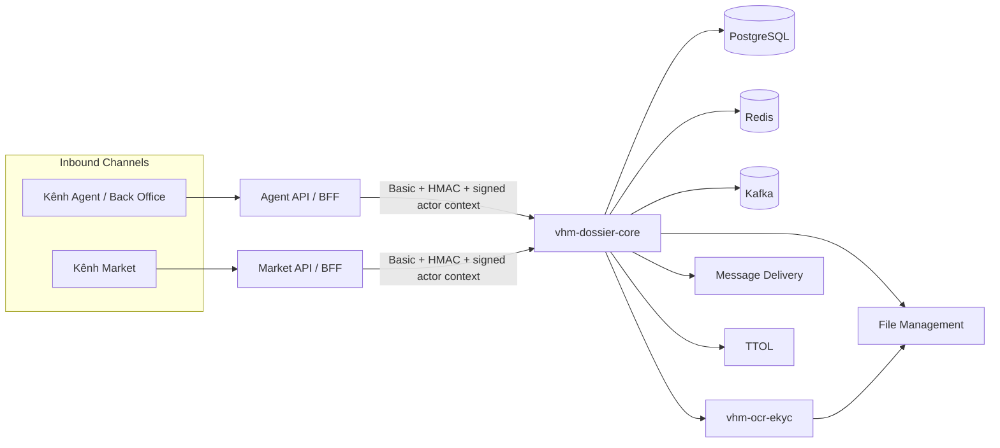
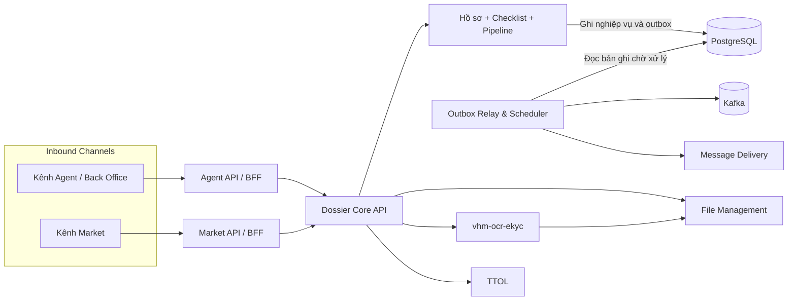
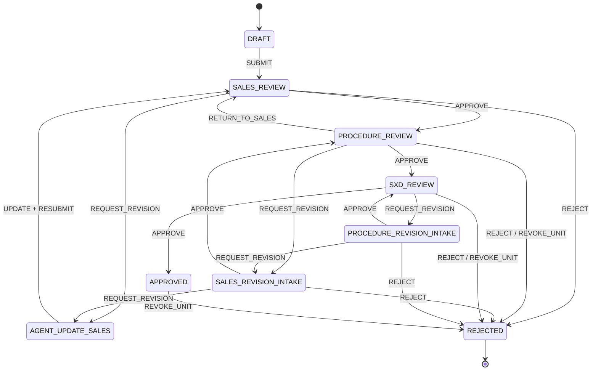
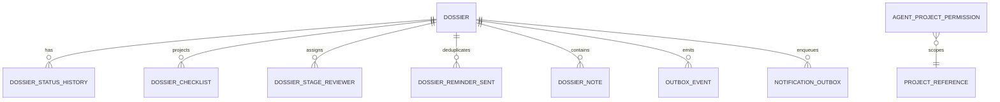
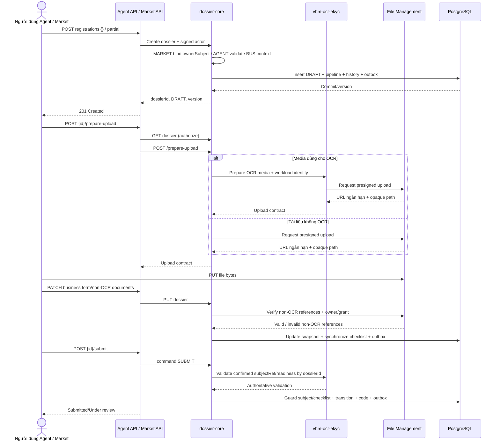
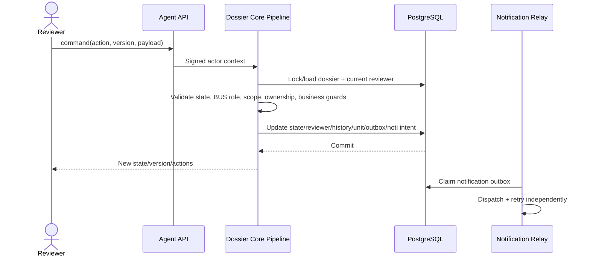
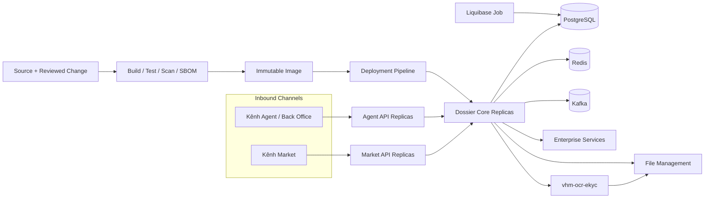

> **TÀI LIỆU NỘI BỘ** — Tài liệu mô tả kiến trúc mục tiêu L2 của năng lực quản lý hồ sơ Nhà ở Xã hội. Không chia sẻ ra ngoài phạm vi dự án khi chưa được phê duyệt.

# L2 - VHMKDO2O - Dịch vụ quản lý hồ sơ Nhà ở Xã hội

| **Trường** | **Nội dung** |
| --- | --- |
| **Trạng thái** | **ĐANG THẨM ĐỊNH (UNDER REVIEW)** |
| **Phiên bản & lịch sử thay đổi** | `v0.9.0` — 15/08/2026 — Thiết lập kiến trúc mục tiêu cho dịch vụ quản lý hồ sơ NOXH |
| **Chủ sở hữu tài liệu** | TBD |
| **Chủ sở hữu hệ thống** | TBD |
| **Hệ thống** | `vhm-dossier-core` — modular monolith quản lý hồ sơ và pipeline NOXH |
| **Hệ thống liên quan** | Kênh Agent/Back Office, Agent API (BFF), kênh Market, Market API (BFF), `vhm-ocr-ekyc`, PostgreSQL, Redis, Kafka, File Management, Message Delivery, TTOL |
| **Đội ngũ/PIC** | Backend: TBD · Kiến trúc: TBD · Tích hợp: TBD · ANBM: TBD · Quyền riêng tư dữ liệu: TBD · Vận hành: TBD |
| **Người rà soát/phê duyệt** | Sản phẩm/BA: TBD · Kiến trúc: TBD · ANBM: TBD · DBA/Vận hành: TBD · QA: TBD |
| **Mốc thiết kế** | Kiến trúc mục tiêu phục vụ thẩm định giải pháp và làm đầu vào cho thiết kế L3 |
| **Phạm vi hệ thống** | Dossier Core và các ranh giới tích hợp thể hiện trong sơ đồ ngữ cảnh |
| **Tài liệu nguồn** | SRS/BRD NOXH: TBD · L2 OCR/eKYC dùng chung |
| **Lần rà soát gần nhất** | 15/08/2026 |

## Approval & Review Gates

| **Vai trò rà soát/phê duyệt** | **Phạm vi rà soát** | **Quyết định** | **Ngày xác nhận** |
| --- | --- | --- | --- |
| Chủ sở hữu Sản phẩm/Nghiệp vụ | Luồng đăng ký, checklist, duyệt PKD/PTT/SXD, SLA nhắc bổ sung | Chờ rà soát | — |
| Kiến trúc Ứng dụng/Giải pháp | Ranh giới modular monolith, API, pipeline và tính nhất quán | Chờ rà soát | — |
| Kiến trúc Tích hợp | Agent API, Market API, File Management, `vhm-ocr-ekyc`, Message Delivery, TTOL, Kafka | Chờ rà soát | — |
| ANBM | IAM nội bộ, actor context, chống phát lại, PII và file | Chờ rà soát | — |
| Quyền riêng tư/Pháp chế | CCCD, thông tin liên hệ, lưu giữ, truy cập và xóa dữ liệu | Chờ rà soát | — |
| DBA/Vận hành/QA | Migration, dung lượng, quan sát, DR và bằng chứng kiểm thử | Chờ rà soát | — |

## Governance Gates

| **Chuyển trạng thái** | **Điều kiện đầu vào** |
| --- | --- |
| `DRAFT → UNDER REVIEW` | Scope, requirement, sơ đồ và decision đủ điều kiện rà soát; mọi deviation, phụ thuộc và rủi ro có định danh. |
| `UNDER REVIEW → APPROVED` | Có owner/reviewer đích danh; contract Checklist/File/Pipeline được chốt; security, privacy, NFR và vận hành có phê duyệt. |
| `APPROVED → IMPLEMENTATION BASELINE` | OpenAPI, migration, contract test, E2E, load test, DR/runbook và production configuration có bằng chứng. |

## L3 Artefact Register

| **Tài liệu L3** | **Trạng thái** | **Chủ sở hữu** | **Cổng bắt buộc** | **Tham chiếu** |
| --- | --- | --- | --- | --- |
| OpenAPI Agent API/Market API ↔ Dossier Core | DRAFT | Backend/Tích hợp/ANBM | Trước duyệt API | Cùng business API nhưng signed claims khác theo channel; liên kết chính thức: TBD |
| Form Data Contract Social Housing v1 | DRAFT | Backend/BA | Trước UAT | Liên kết tài liệu chính thức: TBD |
| Pipeline Definition Schema, Social Housing v1 và activation/migration policy | DRAFT | Backend/BA/Kiến trúc/Vận hành | Trước UAT | Liên kết tài liệu chính thức: TBD |
| Contract Checklist chuẩn | **CHƯA CÓ** | BA/Tích hợp/Backend | Trước production | Chưa chốt nguồn authority và version |
| Contract File Management cho tài liệu không OCR | **CHƯA ĐỦ** | File Team/ANBM | Trước production | Chưa có owner/upload-grant contract |
| OpenAPI Dossier Core ↔ `vhm-ocr-ekyc` | DRAFT | OCR Team/Backend/ANBM | Trước production | Cần chốt media CCCD hai mặt, IAM, confirm, `subjectRef`, read/search/export và delete |
| Runbook migration/rollback/DR | Planned | DBA/Vận hành | Trước OAT | TBD |
| Runbook dashboard/cảnh báo/sự cố | Planned | Vận hành | Trước go-live | TBD |

## Quy ước trạng thái thiết kế

| **Nhãn** | **Ý nghĩa** |
| --- | --- |
| `BẮT BUỘC` | Phải hoàn thành và có bằng chứng trước production. |
| `ĐỀ XUẤT` | Quyết định kiến trúc đang chờ phê duyệt. |
| `BÊN NGOÀI` | Do dependency quy định; cần contract test và SLA. |
| `TBD` | Cần owner xác nhận trước cổng tương ứng. |

Tài liệu này mô tả **kiến trúc mục tiêu L2**. Dossier được thiết kế theo modular monolith với pipeline thực thi nội bộ.

# 1. Business Objectives & Scope

### Business Context & Objectives

`vhm-dossier-core` số hóa việc tiếp nhận, cập nhật, kiểm tra và phê duyệt hồ sơ đăng ký Nhà ở Xã hội. Kênh Agent hoặc Market tạo bản nháp, tải tài liệu, hoàn thiện snapshot hồ sơ rồi chủ động nộp. Hồ sơ được xử lý qua các nhóm PKD, PTT và đầu mối SXD. Kênh Market kiểm soát theo authenticated data subject tại Market API; kênh Agent/Back Office kiểm soát theo role do BUS định nghĩa, scope và pipeline policy.

#### Current Business Problem

- Hồ sơ giấy/Excel/email khó kiểm soát tính đầy đủ, phiên bản và lịch sử xử lý.
- Nhập tay CCCD và thông tin khách hàng dễ sai; tài liệu thiếu hoặc không tồn tại chỉ được phát hiện muộn.
- Nhiều người có thể tạo hồ sơ cho cùng khách hàng và dự án, dẫn đến trùng nghiệp vụ và tranh chấp căn.
- Market API phải xác thực customer và ràng buộc đúng chủ thể dữ liệu; Agent API phải truyền role BUS và scope đã xác thực. Core áp dụng signed context tương ứng cùng state/invariant nghiệp vụ.
- Luồng trả bổ sung cần SLA, nhắc hẹn, lịch sử và khả năng tiếp tục đúng cấp duyệt.
- Các tích hợp File, OCR, TTOL và Message Delivery có độ sẵn sàng khác nhau; không được làm mất trạng thái đã commit.

#### Business Objectives

- Tạo hồ sơ `DRAFT` nhanh với form rỗng hoặc một phần; create không tự động submit.
- Tiếp nhận hồ sơ từ kênh Agent/Back Office qua Agent API (`source=AGENT`) và từ kênh Market qua Market API (`source=MARKET`).
- Duy trì một snapshot `formData`/`metadata` có version, lịch sử trạng thái và projection pipeline.
- Ngăn hồ sơ active trùng theo `(subjectRef, projectId)`; `subjectRef` là định danh opaque, ổn định do `vhm-ocr-ekyc` cấp, Core không lưu CCCD để đối chiếu.
- Bảo đảm checklist bắt buộc đã được upload trước `SUBMIT`.
- Thực thi pipeline PKD → PTT → SXD, bao gồm trả bổ sung, phân công, nhận xử lý, cấp/thu hồi căn và hồ sơ giấy.
- Cung cấp list/detail/statistics/export và progress checklist cho hai BFF nghiệp vụ.
- Tách việc gửi sự kiện và notification khỏi transaction nghiệp vụ bằng outbox.
- Không persist PII/OCR của applicant/spouse tại Dossier Core; dữ liệu chỉ được proxy theo actor context, visibility, ownership và xác thực nội bộ có chữ ký.

## 1.1 In Scope

| **Capability** | **Phạm vi** | **Yêu cầu thiết kế** |
| --- | --- | --- |
| Hồ sơ | Create/read/list/update/delete DRAFT, statistics; lookup applicant được proxy tới nguồn authoritative | `BẮT BUỘC` |
| Nguồn tạo hồ sơ | Kênh Agent/Back Office qua Agent API; kênh Market qua Market API | `BẮT BUỘC` |
| Luồng đăng ký công khai | Create DRAFT → prepare upload → PATCH snapshot → submit | `BẮT BUỘC` |
| Checklist | Snapshot từ nguồn chuẩn, progress, missing/invalid, readiness submit | `BẮT BUỘC` |
| Pipeline | State/action; Market dùng data-subject ownership, Agent/Back Office dùng BUS role/scope/ownership | `BẮT BUỘC` |
| Phân công reviewer | Manual, round-robin PKD và danh sách nhân sự TTOL cho PTT/SXD | `BẮT BUỘC` |
| Quyền dự án | Grant/revoke/list/group theo team/project/scope | `BẮT BUỘC` |
| OCR CCCD | Tích hợp capability dùng chung `vhm-ocr-ekyc` theo mô hình bất đồng bộ | `BẮT BUỘC` |
| Tài liệu/media | Chuẩn bị upload, xác minh reference/quyền attach, download và lưu artefact xuất | `BẮT BUỘC` |
| Notification/reminder | Transactional outbox và nhắc bổ sung T+6/T+18 | `BẮT BUỘC` |
| Báo cáo/tải file | Export danh sách NOXH; tải hợp đồng/tệp đính kèm | `BẮT BUỘC` |
| Notes/hardcopy | Ghi chú và theo dõi hồ sơ giấy | `BẮT BUỘC` |

## 1.2 Out of Scope

- Camunda/Zeebe hoặc BPMN engine bên ngoài; pipeline hiện chạy trong cùng ứng dụng và transaction.
- Sở hữu master data dự án, người dùng, đội nhóm, ngày nghỉ hoặc file binary.
- Thuật toán, provider credential, queue/worker và dữ liệu raw OCR; toàn bộ thuộc `vhm-ocr-ekyc`.
- Quyết định pháp lý về đủ điều kiện NOXH dựa riêng vào OCR.
- Quản trị checklist chuẩn ở trình duyệt; `isRequired` do client gửi chưa thể là authority production.
- Thanh toán, ký điện tử và tích hợp tự động trực tiếp với cơ quan SXD.
- Chứng minh người upload sở hữu file nếu File Contract hoặc OCR media contract chưa trả owner/upload-grant đã xác minh.

### Assumptions, Constraints & Dependencies

| **ID** | **Giả định/Ràng buộc** | **Trạng thái** | **Ảnh hưởng** |
| --- | --- | --- | --- |
| A-01 | Agent API và Market API là hai inbound BFF ngang hàng của Dossier Core | Quyết định kiến trúc | Hai kênh không gọi trực tiếp Core và không gọi chéo BFF. |
| A-02 | PostgreSQL là nguồn sự thật của hồ sơ, checklist, projection pipeline và outbox | Quyết định hiện hành | Mọi mutation trọng yếu dùng cùng transaction DB. |
| A-03 | Create chỉ tạo `DRAFT`; submit là lệnh riêng | Contract bắt buộc | Agent API và Market API phải điều phối đủ bốn bước đăng ký. |
| A-04 | Kafka có thể giao lặp; relay/consumer phải idempotent | Giả định nền tảng | Outbox chấp nhận publish lặp, không làm lặp quyết định nghiệp vụ. |
| A-05 | File path là opaque; namespace upload độc lập với dossier ID | Đã xác minh STG | Không áp dụng kiểm tra prefix `registrations/{dossierId}/`. |
| A-06 | Mỗi dossier phải nhận một pipeline ID/version xác định | `BẮT BUỘC` | Không lựa chọn pipeline theo thứ tự cấu hình. |
| A-07 | Structural guard và Form Data Contract phải được thực thi trước persistence | `BẮT BUỘC` | Production không được bỏ qua schema validation. |
| A-08 | OCR tài liệu đi qua `vhm-ocr-ekyc`; dossier không gọi provider trực tiếp | Quyết định kiến trúc mục tiêu | Cần OpenAPI L3, workload IAM và migration khỏi client OCR legacy. |
| A-09 | Tài liệu không OCR đi trực tiếp File Management; media OCR đi qua `vhm-ocr-ekyc` | Quyết định kiến trúc mục tiêu | Phân tuyến theo mục đích sử dụng, không theo extension hoặc lựa chọn từ client. |
| A-10 | External services có contract/SLA riêng | `BÊN NGOÀI` | Cần timeout, retry hữu hạn, monitoring và contract test. |
| A-11 | Market Customer không dùng business role | Quyết định phân quyền | Market API xác thực và kiểm tra data-subject ownership; Core không yêu cầu role Agent cho request Market. |
| A-12 | Agent/Back Office dùng role catalogue do BUS định nghĩa | Quyết định phân quyền | Role/scope phải đến từ nguồn tin cậy, được Agent API ký và được pipeline map tới action. |

### Stakeholders & Personas

| **Nhóm** | **Trách nhiệm/quyền** |
| --- | --- |
| Market Customer | Không có business role; Market API xác thực và chỉ cho thao tác trên hồ sơ của đúng data subject theo trạng thái nghiệp vụ. |
| Agent / `APPLICANT_AGENT` | Role thuộc catalogue BUS; tạo/cập nhật/upload/submit/resubmit và xem hồ sơ trong project/scope được cấp. |
| PKD / `PKD`, `PKD_LEAD` | Phân công/nhận hồ sơ, cấp căn, duyệt, trả bổ sung, từ chối, hồ sơ giấy. |
| PTT / `PTT`, `PTT_LEAD` | Kiểm tra thủ tục, duyệt/trả bổ sung/từ chối, chuyển SXD. |
| Đầu mối SXD | Được mô hình hóa bằng stage `SXD` nhưng xử lý qua roster/role PTT hiện hành. |
| BO/Admin | Quản lý quyền dự án, tra cứu/báo cáo và vận hành. |
| BUS | Chủ sở hữu catalogue role Agent/Back Office và mapping semantics nghiệp vụ; cơ chế phân phối/runtime source cần được đóng băng ở contract L3. |
| Agent API | BFF Agent/Back Office; xác thực actor, lấy/kiểm tra role BUS và scope, map DTO, gán `source=AGENT`, ký request/actor context. |
| Market API | BFF Market; xác thực customer, kiểm tra data-subject/object ownership, map DTO, gán `source=MARKET`, ký request/data-subject context; không phát sinh role Agent giả. |
| File/`vhm-ocr-ekyc`/Message Delivery/TTOL | Cung cấp năng lực tích hợp không thuộc sở hữu core. |

### Personal Data Processing Summary

| **Dữ liệu** | **Mục đích** | **Vị trí** | **Kiểm soát hiện hành/yêu cầu** |
| --- | --- | --- | --- |
| CCCD, họ tên, ngày sinh, giới tính, ngày/nơi cấp, địa chỉ và thông tin liên hệ applicant/spouse | Định danh, OCR/eKYC và hiển thị có thẩm quyền | `vhm-ocr-ekyc` | Nguồn dữ liệu tập trung; Dossier Core chỉ proxy khi cần và không persist/cache. Xem TDD OCR/eKYC. |
| Định danh applicant trong Dossier | Duplicate guard và liên kết nghiệp vụ | `dossier.subject_ref` dạng opaque | Không chứa PII; phải ổn định và không đảo ngược được về CCCD. |
| Reviewer/recipient | Phân công và notification | Actor/recipient ID dạng opaque | Không lưu tên/email trong Dossier; resolve tại nguồn IAM/TTOL/Message khi hiển thị hoặc gửi. |
| Đường dẫn file | Gắn tài liệu | Tài liệu không OCR: JSONB/checklist + File Management; media OCR: chỉ `vhm-ocr-ekyc` | Core chỉ lưu `s3PathFile` của tài liệu không OCR; không persist media path/presigned URL OCR. |
| Kết quả/phê duyệt tài liệu | Readiness và quyết định | JSONB/checklist/history | Chỉ actor có quyền được mutation; lịch sử append trong snapshot. |
| Actor/reviewer | Audit và routing | audit columns, status history, stage reviewer | Actor context có chữ ký; không tin actor do client truyền. |

### System Criticality

Đề xuất **Cấp 2 — nghiệp vụ trọng yếu, xử lý dữ liệu cá nhân nhạy cảm**. Phân loại chính thức, RTO/RPO, retention và yêu cầu mã hóa phải được System Owner, ANBM, Privacy và Vận hành ký duyệt trước production.

# 2. Architecture Overview & Principles

## 2.1 Nguyên tắc thiết kế

| **Mã** | **Nguyên tắc** |
| --- | --- |
| ARCH-01 | Dossier domain và pipeline được quản lý thống nhất trong cùng ranh giới giao dịch. |
| ARCH-02 | PostgreSQL là nguồn sự thật; mutation hồ sơ, checklist, history và outbox cùng transaction. |
| ARCH-03 | Create và submit tách biệt; mọi create thành công trả về `DRAFT`. |
| ARCH-04 | Pipeline được cấu hình bằng phiên bản và thực thi trong cùng process/transaction với dossier. |
| ARCH-05 | Không tin actor/role từ request body; dùng actor context có chữ ký. |
| ARCH-06 | Dùng optimistic lock cho update/command và DB constraint cho race cuối. |
| ARCH-07 | Idempotency replay được kiểm tra trước validation và được serialize bằng advisory lock. |
| ARCH-08 | Event/notification dùng transactional outbox, chấp nhận at-least-once. |
| ARCH-09 | File path là tham chiếu opaque; không suy luận ownership từ prefix. |
| ARCH-10 | Mọi khoảng trống production phải được quản lý bằng risk/open issue, không mô tả như đã triển khai. |
| ARCH-11 | Dossier chỉ tích hợp contract chuẩn của `vhm-ocr-ekyc`; không biết provider, credential, queue hoặc raw response. |
| ARCH-12 | Core gọi File Management cho tài liệu không OCR; media OCR chỉ đi qua `vhm-ocr-ekyc`, không gọi provider hoặc File Management trực tiếp trong nhánh OCR. |
| ARCH-13 | Cấp duyệt là cấu hình có phiên bản; không gắn cứng số lượng hoặc thứ tự cấp duyệt vào API, database hay kênh. |
| ARCH-14 | Pipeline đã công bố là bất biến theo `(pipelineCode, pipelineVersion)`; thay đổi luồng phải tạo phiên bản mới. |
| ARCH-15 | `vhm-ocr-ekyc` là source of truth duy nhất cho media, lifecycle, kết quả OCR và PII applicant/spouse; Dossier Core chỉ lưu opaque reference, không tạo bản sao. |

## 2.2 Sơ đồ kiến trúc ứng dụng

### 2.2.1 Sơ đồ ngữ cảnh hệ thống



### 2.2.2 Sơ đồ thành phần



### 2.2.3 Sơ đồ kiến trúc pipeline nội bộ

Pipeline Social Housing là cấu hình có phiên bản được nạp cùng ứng dụng. Khi tạo hồ sơ, core ghi phiên bản pipeline và trạng thái khởi tạo. Command Market được kiểm tra channel/data-subject ownership và state; command Agent/Back Office được kiểm tra BUS role, scope, pipeline ownership và guard nghiệp vụ. Projection, history, reviewer và outbox được cập nhật trong một transaction. Không có process instance Camunda và không có ranh giới eventual consistency với workflow engine ngoài.

### 2.2.4 Phân định trách nhiệm module

| **Khối kiến trúc** | **Trách nhiệm** | **Dữ liệu quản lý** | **Không chịu trách nhiệm** |
| --- | --- | --- | --- |
| Agent API | BFF Agent/Back Office; xác thực actor, BUS role/project scope, public authorization và ký actor context | Không sở hữu dossier aggregate hoặc tự định nghĩa role | State/invariant, pipeline mapping và persistence cuối. |
| Market API | BFF Market; xác thực customer, data-subject/object authorization và ký subject context | Không sở hữu dossier aggregate hoặc role catalogue | State/invariant, signed subject binding và persistence cuối. |
| Dossier domain | Vòng đời hồ sơ, validation, duplicate, checklist, pipeline, phân công và điều phối OCR | Aggregate dossier và projection liên quan | Identity kênh, file binary, OCR raw. |
| Outbox/Scheduler | Phát sự kiện, gửi notification và nhắc SLA sau commit | Trạng thái delivery/dedup | Thay đổi quyết định nghiệp vụ đã commit. |
| `vhm-ocr-ekyc` | Quản lý media phục vụ OCR, tài nguyên OCR bất đồng bộ và chuẩn hóa kết quả | OCR lifecycle, media OCR và kết quả chuẩn | Sở hữu dossier, xử lý tài liệu không OCR hoặc tự áp kết quả vào form. |
| File Management | Upload, kiểm tra, lưu trữ và download tài liệu không OCR | File binary và metadata thuộc contract File | Sở hữu dossier hoặc xử lý OCR. |
| Enterprise services | TTOL, Message Delivery | Dữ liệu thuộc từng miền | Sở hữu aggregate dossier. |

### 2.2.5 Ranh giới tin cậy

| **Ranh giới** | **Mức tin cậy** | **Kiểm soát** | **Khoảng trống** |
| --- | --- | --- | --- |
| Customer → Market API | Không tin cậy | Authentication, data-subject/object ownership, validation và rate limit; không dùng business role | Market public boundary. |
| Agent/BO → Agent API | Không tin cậy | Authentication, BUS role, project/team scope, validation và rate limit | Agent public boundary. |
| Agent API/Market API → Core | Zero Trust nội bộ | Client identity riêng, Basic Auth, HMAC, timestamp/nonce/body hash, actor signature | Cần allowlist và secret rotation độc lập cho từng BFF. |
| Market subject context → business | Chỉ tin sau verify | `channel=MARKET`, actor subject, data-subject binding, expiry, JTI; không chứa Agent roles | Core kiểm tra client/channel và subject–dossier binding. |
| Agent actor context → business | Chỉ tin sau verify | `channel=AGENT`, actor subject, BUS roles, project/team scope, visibility, expiry, JTI | Role/scope không nhận từ request body. |
| Core → `vhm-ocr-ekyc` | Zero Trust nội bộ | Workload identity, audience/scope, object context, idempotency | OpenAPI/IAM L3 và E2E chưa hoàn tất. |
| Core → File Management | Dependency ngoài process | Workload identity, object scope, checksum và owner/upload grant | Chỉ dành cho tài liệu không OCR. |
| Core → TTOL/Message | Dependency ngoài process | Credential server-side, timeout/retry/config | Contract/SLA cần chốt. |
| `vhm-ocr-ekyc` → File Management | Ranh giới được ủy quyền | Workload identity và object scope của media OCR | Core không tham gia contract File của nhánh OCR. |
| Core → Kafka | At-least-once | Transactional outbox, retry, idempotent consumer | Publish mặc định có thể tắt theo config. |

## 2.3 Vòng đời hồ sơ

### 2.3.1 Trạng thái công bố

Pipeline Social Housing v1 sử dụng các business status chính: `DRAFT`, `SUBMITTED`, `UNDER_REVIEW`, `ADD_INFO_REQUESTED`, `APPROVED`, `REJECTED`. `APPROVED` vẫn cho phép thu hồi căn theo pipeline hiện tại; `REJECTED` là terminal. Enum tổng quát có thêm trạng thái legacy nhưng không mặc nhiên thuộc flow NOXH v1.

### 2.3.2 State machine



Sơ đồ trên là snapshot của Social Housing pipeline v1, không phải giới hạn cố định ba cấp duyệt. Việc thêm hoặc bỏ một cấp duyệt được thực hiện bằng pipeline version mới; API vẫn trả stage timeline và `availableActions` theo definition đã gắn với từng hồ sơ.

## 2.4 Tính nhất quán và Idempotency

### 2.4.1 Tạo tài nguyên và idempotency

- Agent API gán `source=AGENT`; Market API gán `source=MARKET`. MARKET bắt buộc header `Idempotency-Key` (`10509`), còn AGENT không bắt buộc.
- Với idempotency key, core lấy PostgreSQL transaction advisory lock trên key trước khi kiểm tra replay.
- Replay được tra theo `(idempotencyKey, createdBy)` **trước** form/schema/file validation; cùng actor nhận lại dossier đã tạo.
- Nếu key toàn cục đã thuộc actor khác, request bị từ chối; DB có unique constraint cuối trên `idempotency_key`.
- Sau pipeline initialization, entity được `flush` trước khi dựng response để `version` trả về bằng version trong DB.

### 2.4.2 Transactional outbox

Create/update/transition/delete ghi business row và `outbox_event` trong cùng transaction. Relay khóa theo batch (`FOR UPDATE SKIP LOCKED`), publish Kafka khi tính năng được bật và cập nhật trạng thái gửi. `notification_outbox` là outbox riêng cho ý định gửi thông báo; relay hiện dispatch kênh `EMAIL`, retry exponential có giới hạn và chuyển `FAILED` khi hết số lần thử.

### 2.4.3 Ranh giới nhất quán

| **Thao tác** | **Cùng transaction** | **Ngoài transaction** |
| --- | --- | --- |
| Create/update | Dossier, pipeline projection, status history, checklist, outbox | Kafka publish, downstream processing |
| Command pipeline | Dossier/status, reviewer, history, unit, outbox, notification intent | Gửi message và consumer ngoài hệ thống |
| Reminder | Claim/dedup reminder và notification intent | Message Delivery |
| OCR bất đồng bộ | Không thay đổi dossier khi tạo/poll OCR | `vhm-ocr-ekyc` quản lý media, lifecycle và kết quả chuẩn |

### 2.4.4 Concurrency guards

- `@Version` và `If-Match` ngăn lost update khi caller cung cấp version; bỏ header đồng nghĩa chấp nhận last-write-wins ở API hiện hành.
- Unique partial index ngăn race hồ sơ active trùng `subjectRef+dự án`; conflict ánh xạ `11011`.
- Unique partial index căn được cấp ngăn hai hồ sơ active giữ cùng căn.
- Reviewer assignment PKD dùng row lock/rotation trong DB; PTT/SXD dùng atomic counter Redis và sticky assignment khi quay lại.
- Command pipeline kiểm tra current state/action trong transaction; mọi side effect chỉ commit khi toàn bộ guard thành công.

# 3. Functional Requirements

## 3.1 Ma trận năng lực chức năng

| **ID** | **Năng lực/yêu cầu** | **Thiết kế** | **Mức bắt buộc** |
| --- | --- | --- | --- |
| FR-01 | Tạo hồ sơ nháp | Agent API hoặc Market API gọi Core create `SOCIAL_HOUSING`; luôn trả `DRAFT` | `BẮT BUỘC` |
| FR-02 | Upload tài liệu | Core kiểm tra quyền; tài liệu không OCR gọi File Management, media OCR gọi `vhm-ocr-ekyc`; kênh PUT theo presigned contract | `BẮT BUỘC` |
| FR-03 | Cập nhật snapshot | Chỉ business snapshot không chứa OCR/PII; cập nhật applicant/contact được forward tới `vhm-ocr-ekyc` | `BẮT BUỘC` |
| FR-04 | Nộp hồ sơ | Command `SUBMIT`, duplicate guard, checklist readiness, sinh mã | `BẮT BUỘC` |
| FR-05 | Chống trùng | Application precheck + database race guard | `BẮT BUỘC` |
| FR-06 | Checklist/progress | Snapshot theo template+group; counts/missing/invalid | `BẮT BUỘC` |
| FR-07 | Phê duyệt nhiều cấp | Pipeline versioned thực thi trong core | `BẮT BUỘC` |
| FR-08 | Phân công reviewer | Manual/reassign/claim + auto round-robin | `BẮT BUỘC` |
| FR-09 | Cấp/thu hồi căn | Atomic allocation/approve; unique active unit | `BẮT BUỘC` |
| FR-10 | Hồ sơ giấy | Submit/confirm hardcopy và timeline | `BẮT BUỘC` |
| FR-11 | OCR CCCD | `vhm-ocr-ekyc`: tạo `202`, poll và xác nhận tại nguồn tập trung; Dossier không persist media/kết quả OCR | `BẮT BUỘC` |
| FR-12 | Notification/reminder | Outbox, kênh được phê duyệt, T+6/T+18 và manual trigger | `BẮT BUỘC` |
| FR-13 | Tra cứu/báo cáo | List/detail/statistics tại Core; by-contact/hydrate applicant/export dùng API authoritative, không persist projection PII | `BẮT BUỘC` |
| FR-14 | Xóa bản nháp | Chỉ DRAFT; xóa checklist và dữ liệu phụ thuộc | `BẮT BUỘC` |
| FR-15 | PIC hồ sơ | Use case, permission và audit semantics | `TBD` |
| FR-16 | Thêm/bớt cấp duyệt | Công bố pipeline version mới; không đổi schema DB/public API và không làm đổi luồng hồ sơ đang chạy | `BẮT BUỘC` |
| FR-17 | Phân quyền theo kênh | Market dùng authenticated data-subject ownership tại Market API; Agent/Back Office dùng BUS role/scope | `BẮT BUỘC` |

## 3.2 Quy tắc nghiệp vụ

| **ID** | **Quy tắc** |
| --- | --- |
| BR-01 | Public create không được submit; trạng thái sau create luôn là `DRAFT`. |
| BR-02 | Agent API gán `source=AGENT`, Market API gán `source=MARKET` từ channel context tin cậy; MARKET create phải có `Idempotency-Key`, AGENT không bắt buộc key. |
| BR-03 | Một cặp `subjectRef` authoritative + dự án chỉ có một hồ sơ chưa terminal; Core không dùng CCCD rõ làm khóa. |
| BR-04 | Create `{}` không tạo checklist; create có `documents[]` và mọi full update DRAFT/ADD_INFO phải synchronize checklist. |
| BR-05 | Identity checklist là `(dossierId, documentTemplateId, groupCode)`. |
| BR-06 | Submit cần tồn tại ít nhất một required item và mọi required item ở `COMPLETE`. |
| BR-07 | Full update business snapshot chỉ ở DRAFT/ADD_INFO; OCR/PII/contact không thuộc `formData` và luôn đi qua contract authoritative. |
| BR-08 | Update không được ghi đè `source`, `assignedUnitCode` hoặc `assignedUnitId` do server quản lý. |
| BR-09 | Media identity applicant/spouse được xác minh qua `vhm-ocr-ekyc`; `documents[].s3PathFile` không OCR được xác minh qua File Management khi file-validation bật. |
| BR-10 | Không kiểm tra file path prefix theo dossier ID. |
| BR-11 | Mọi command phải hợp lệ theo state và channel policy: Market cần signed data-subject ownership; Agent/Back Office cần BUS role, scope và ownership tương ứng. |
| BR-12 | Lần submit đầu sinh mã `<sapId>-<agencyId>-<ddMMyy>-<sequence4>`; PKD approve chuẩn hóa thành `<sapId>-<sequence5>`. |
| BR-13 | Reject/revoke unit phải giải phóng căn đang cấp. |
| BR-14 | DRAFT delete xóa checklist tường minh; FK checklist cũng có `ON DELETE CASCADE`. |
| BR-15 | Comment hiện là optional theo pipeline/config; không mô tả là bắt buộc nếu chưa bật guard. |
| BR-16 | Mỗi dossier được gắn bất biến với đúng `(pipelineCode, pipelineVersion)` trong suốt vòng đời, trừ migration có kiểm soát được phê duyệt. |
| BR-17 | Không sửa hoặc xóa definition đã có hồ sơ tham chiếu; ngừng dùng một cấp duyệt chỉ áp dụng cho pipeline version mới. |
| BR-18 | Hồ sơ `source=MARKET` phải bind `ownerSubject` opaque từ signed Market context tại create; field này server-owned, không nhận từ body và mọi Market access phải khớp binding. |

# 4. Non-Functional Requirements

Các mục tiêu `200 req/s`, P95 cụ thể và availability `99.9%` chưa có workload/capacity evidence được phê duyệt nên chưa được coi là baseline. Trước production phải chốt NFR theo workload thực tế.

| **ID** | **Nhóm** | **Yêu cầu** | **Cổng** |
| --- | --- | --- | --- |
| NFR-01 | Availability | Core stateless ở tầng HTTP; DB/Redis/Kafka/external có health và degradation policy | `BẮT BUỘC` |
| NFR-02 | Consistency | Không mất mutation đã commit; outbox cho event/notification | `BẮT BUỘC` |
| NFR-03 | Concurrency | Idempotency, optimistic lock, unique index, row/Redis lock | `BẮT BUỘC` |
| NFR-04 | Performance | P95/P99 theo endpoint và peak TPS phải được đo | TBD |
| NFR-05 | Scalability | Scale ngang API/relay; không dùng session cục bộ làm authority | `BẮT BUỘC` |
| NFR-06 | Security | Signed request/actor, least privilege, không persist/cache/log dữ liệu OCR/PII được proxy | `BẮT BUỘC` |
| NFR-07 | Privacy | Data minimization tại Core; purpose/retention/deletion của OCR/PII theo TDD `vhm-ocr-ekyc` | TBD/BẮT BUỘC |
| NFR-08 | Recoverability | PostgreSQL PITR, outbox replay, backup/restore drill | TBD/BẮT BUỘC |
| NFR-09 | Observability | Metrics/log/trace/correlation và alert có owner | `BẮT BUỘC` |
| NFR-10 | Maintainability | Versioned migration/schema/pipeline; backward-compatible API | `BẮT BUỘC` |
| NFR-11 | Workflow configurability | Thêm/bớt một cấp duyệt bằng definition mới, không cần đổi DB/public API; hồ sơ version cũ tiếp tục xử lý được | `BẮT BUỘC` |

# 5. Technology Stack & Justification

| **Công nghệ** | **Vai trò** | **Cơ sở lựa chọn/hệ quả** |
| --- | --- | --- |
| Java 25, Spring Boot 4.1 | Runtime/service framework | Stack nền tảng của dịch vụ; cần image/JVM production được chứng nhận. |
| Spring Data JPA/Hibernate | Aggregate persistence, optimistic lock | Phù hợp transaction domain; cần tránh N+1 và giữ `open-in-view=false`. |
| PostgreSQL, Liquibase | Source of truth, JSONB, constraint, advisory lock | Hỗ trợ transaction/partial index; migration phải forward-safe. |
| Redis | Replay/nonce, counter phân công, cache/lock hỗ trợ | Không được là source of truth của dossier. |
| Kafka | Phát domain event từ outbox | At-least-once; consumer cần idempotent. |
| Caffeine | Cache cục bộ cho dữ liệu tham chiếu | Giảm latency; cần invalidation/TTL rõ ràng. |
| JSON Schema 2020-12 | Validate form Social Housing v1 | Cho phép evolution schema; enforcement hiện phụ thuộc config. |
| Thrift/HTTP clients | File Management, `vhm-ocr-ekyc` và các tích hợp nội bộ | Tách client/config theo ranh giới; contract bên ngoài cần timeout/retry/test. |
| Syncfusion/Apache POI | Export/tạo tài liệu | Cần quản lý license, template và kiểm thử output. |

## 5.1 ADR Log

ADR chi tiết nằm tại Phụ lục D. Các quyết định nền tảng: modular monolith, pipeline nội bộ bằng YAML, PostgreSQL source of truth, snapshot JSONB có schema version, transactional outbox, signed actor context, database constraint là race guard cuối.

## 5.2 Trade-off Analysis

`Phương án được chọn` là baseline thiết kế của TDD này; trạng thái phê duyệt chính
thức và điều kiện còn mở được quản lý tại Phụ lục D. Khi workload, contract hoặc
yêu cầu nền tảng thay đổi, quyết định liên quan phải được đánh giá lại thay vì đổi
stack ngầm trong implementation.

| **ID/ADR** | **Vấn đề cần quyết định** | **Phương án A (Ưu–Nhược)** | **Phương án B (Ưu–Nhược)** | **Phương án được chọn** | **Lý do/đánh đổi còn lại** |
| --- | --- | --- | --- | --- | --- |
| BASELINE-01 | Runtime và application framework | **Java 25 + Spring Boot 4.1** — Ưu: phù hợp baseline VHM, hệ sinh thái transaction/security/observability và năng lực đội ngũ. Nhược: footprint JVM, startup/memory và image/JDK mới cần được chứng nhận. | **Go/Node.js hoặc runtime khác** — Ưu: có thể nhẹ hơn cho API stateless. Nhược: lệch baseline, phải xây lại domain/persistence/security integration và tăng stack vận hành. | Phương án A | Đây là baseline tổ chức, không phải tối ưu bằng benchmark riêng của Dossier; production image, GC/memory và compatibility phải được kiểm thử tải/chứng nhận. |
| TECH-01 | Cách truy cập PostgreSQL | **Spring Data JPA/Hibernate cho aggregate, native/JDBC cho truy vấn lock/outbox đặc thù** — Ưu: mapping domain, transaction và optimistic lock thuận tiện nhưng vẫn giữ quyền kiểm soát SQL nóng. Nhược: hai style persistence, nguy cơ N+1/flush ngoài ý muốn và cần review query plan. | **SQL-first hoàn toàn bằng jOOQ/JDBC** — Ưu: SQL minh bạch, batch/query phức tạp dễ tối ưu. Nhược: tăng mapping/boilerplate và trách nhiệm quản lý aggregate/version thủ công. | Phương án A có điều kiện | Use case mutation phù hợp aggregate JPA; outbox, advisory/row lock và report được phép dùng SQL chuyên biệt. Bắt buộc `open-in-view=false`, query-count test và explain plan cho endpoint nóng. |
| ADR-001 | Source of truth cho dossier/pipeline/history/outbox | **PostgreSQL + Liquibase** — Ưu: ACID, constraint/partial index, JSONB, advisory lock và outbox trong cùng transaction. Nhược: cần HA/PITR, migration forward-safe, capacity/index/vacuum được vận hành chặt. | **Document/NoSQL store** — Ưu: scale ngang và document model tự nhiên hơn cho form linh hoạt. Nhược: business invariant, join/report, optimistic concurrency và atomic outbox phức tạp hơn; thêm một stack dữ liệu. | Phương án A | Invariant hồ sơ/cấp căn/checklist và ranh giới commit quan trọng hơn lợi ích scale document store; JSONB đáp ứng phần snapshot linh hoạt. |
| ADR-002/ADR-013 | Thực thi workflow và khả năng thêm/bớt cấp duyệt | **Pipeline YAML versioned chạy trong modular monolith** — Ưu: transition và dossier commit nguyên tử, ít hạ tầng, hồ sơ pin đúng version. Nhược: Core tự chịu validation/tooling/migration/observability workflow và không có UI BPMN sẵn có. | **Camunda/Zeebe hoặc processor service riêng** — Ưu: engine/tooling workflow, timer và visualization chuyên dụng; cô lập scale/runtime. Nhược: distributed consistency, thêm deployable/contract và chi phí vận hành; tăng rủi ro lệch trạng thái Core–engine. | Phương án A | UC-01–UC-06 ở modular monolith; chưa có bằng chứng cần engine/service riêng. Definition mới phải immutable, có validation gate và giữ được hồ sơ version cũ. |
| ADR-004 | Mô hình lưu form Social Housing | **JSONB snapshot + `schemaVersion` + JSON Schema** — Ưu: evolve form ít migration cột, giữ snapshot theo thời điểm và hỗ trợ nhiều product version. Nhược: query/index/constraint field-level khó hơn, payload dễ nhận field ngoài contract nếu guard lỏng. | **Bảng/cột strongly typed cho từng trường form** — Ưu: type/constraint/query/report rõ ở DB. Nhược: migration dày, coupling release với thay đổi biểu mẫu và số bảng/cột tăng theo product/version. | Phương án A | Form thay đổi theo policy/product nhưng invariant lõi vẫn được đưa thành cột/index riêng. Structural denylist, versioned schema, size limit và index allowlist là điều kiện bắt buộc. |
| TECH-02 | Replay/nonce, counter, lock hỗ trợ và cache phân tán | **Redis cho state ngắn hạn/atomic TTL; PostgreSQL vẫn là authority** — Ưu: nonce/replay TTL, counter và coordination nhanh; giảm tải DB. Nhược: thêm HA/degradation/runbook và có thể fail security nếu dùng sai fallback. | **Chỉ dùng PostgreSQL** — Ưu: giảm dependency và một nguồn vận hành. Nhược: tăng contention/cleanup cho nonce-counter, latency cao hơn và trộn state ngắn hạn với business data. | Phương án A có điều kiện | Redis phù hợp dữ liệu có thể rebuild hoặc security state có fail-closed policy; không được quyết định dossier ownership/status hay thay race guard DB. |
| ADR-007 | Nhất quán giữa mutation và phát event/notification | **Transactional outbox + Kafka/relay** — Ưu: business row và intent commit cùng transaction, replay được và scale consumer. Nhược: eventual consistency, at-least-once, backlog/cleanup/duplicate phải được vận hành. | **Publish Kafka trực tiếp hoặc gọi downstream đồng bộ sau DB write** — Ưu: ít bảng/relay và latency thấp hơn khi thành công. Nhược: dual-write gap, request bị phụ thuộc downstream và khó phục hồi khi DB commit nhưng publish/call lỗi. | Phương án A | Không chấp nhận mất intent sau commit. Consumer/relay phải idempotent, có retry/DLQ, lag alert, retention và reconciliation runbook. |
| TECH-03 | Cache dữ liệu tham chiếu trong process | **Caffeine TTL-bounded cho dữ liệu read-mostly** — Ưu: latency thấp, không thêm network hop. Nhược: cache khác nhau giữa pod, invalidation chậm và mất khi restart. | **Redis-only hoặc không cache** — Ưu: shared view giữa pod hoặc luôn đọc authoritative. Nhược: network/dependency/latency cao hơn; Redis cache vẫn có bài toán invalidation. | Phương án A có điều kiện | Chỉ cache reference không phải authority, không chứa OCR/PII và chấp nhận stale có giới hạn. Role/scope/ownership, pipeline version đã pin và security decision không được dựa vào local cache thiếu freshness contract. |
| ADR-009/ADR-010/ADR-012 | Sở hữu file và OCR/eKYC | **Dùng File Management và `vhm-ocr-ekyc`, Core chỉ giữ reference/metadata tối thiểu** — Ưu: tập trung media/PII/provider/credential, giảm binary và dữ liệu nhạy cảm tại Core. Nhược: thêm network hop, phụ thuộc SLA/contract/authorization/delete orchestration và khó chứng minh ownership nếu dependency thiếu claim. | **Core lưu file/OCR result hoặc tích hợp provider trực tiếp** — Ưu: ít hop và Core tự chủ luồng. Nhược: nhân bản PII/media, tăng storage/key/provider scope, coupling và chi phí compliance/vận hành. | Phương án A | Capability dùng chung là ranh giới authoritative. Trước production cần OpenAPI L3, owner/upload-grant, timeout/degradation, retention/delete và E2E cross-owner; không fallback sang bản sao local. |
| TECH-04 | Sinh báo cáo/tài liệu | **Syncfusion/Apache POI trong Core** — Ưu: đáp ứng template Excel/DOCX hiện hữu và giữ business projection gần domain. Nhược: license, memory/CPU, xử lý template/file không tin cậy và coupling release template với service. | **Document/report service chuyên biệt** — Ưu: cô lập tài nguyên, template và security sandbox; tái sử dụng đa domain. Nhược: thêm service/contract, network hop và consistency của dữ liệu export. | Phương án A cho phạm vi hiện tại | Chưa có capability tài liệu authoritative được chốt. Phải pin version/license, giới hạn row/file/time/memory, sanitize template value và chuyển sang async/service riêng nếu capacity test vượt budget Core. |

# 6. Integration Architecture

## 6.1 Danh mục giao diện tích hợp

| **ID** | **Tích hợp** | **Hướng** | **Kiểu** | **Mục đích** | **Failure policy** |
| --- | --- | --- | --- | --- | --- |
| INT-01 | Agent API → Dossier Core | Inbound | HTTP sync | Agent/Back Office registration/list/detail/action với signed BUS role/scope, `source=AGENT` | Signature/role/scope fail closed |
| INT-02 | Market API → Dossier Core | Inbound | HTTP sync | Market registration/list/detail/action với signed data-subject context, `source=MARKET`; không business role | Signature/subject binding fail closed |
| INT-03 | Dossier Core → File Management | Outbound | Client sync | Tài liệu không OCR: prepare upload, existence/ownership, download và lưu artefact xuất | Fail hard cho validation bắt buộc |
| INT-04 | Dossier Core → `vhm-ocr-ekyc` | Outbound | HTTP async resource | Tạo/poll/confirm OCR và proxy dữ liệu chuẩn; không persist bản sao | Idempotent create, polling hữu hạn, không retry mù |
| INT-05 | TTOL | Outbound | HTTP sync | Lấy danh sách nhân sự PTT/SXD theo dự án và vai trò để auto-assign reviewer | Best effort; manual assignment fallback |
| INT-06 | Message Delivery | Outbound | Outbox relay | Email notification | Retry/backoff → FAILED |
| INT-07 | Kafka | Outbound | Async | Domain event đã commit | Outbox retry; publish có feature flag |

## 6.2 Contract API hồ sơ VHM

### 6.2.1 Registration flow qua Agent API/Market API

Kênh Agent/Back Office đi qua Agent API; kênh Market đi qua Market API. Hai BFF ngang hàng sử dụng cùng internal business API nhưng mang security context khác nhau. Agent API gửi signed actor context chứa BUS role/scope; Market API gửi signed data-subject context và không gửi Agent roles. Mỗi BFF gán `source` tương ứng từ channel context đã xác thực rồi gọi Core bằng workload identity riêng; client không được tự chọn `source`, role, scope, owner hoặc data subject trong request body.

| **Bước** | **API Agent/Market** | **Kết quả bắt buộc** |
| --- | --- | --- |
| 1 | `POST /v1/social-housing/registrations` | Tạo duy nhất một `DRAFT`, nhận `dossierId`. |
| 2 | `POST /v1/social-housing/registrations/{id}/prepare-upload` rồi PUT file | Chỉ cấp URL sau khi caller đọc được dossier; giữ `s3PathFile`. |
| 3 | `PATCH /v1/social-housing/registrations/{id}` | Ghi snapshot form/documents đầy đủ. |
| 4 | `POST /v1/social-housing/registrations/{id}/submit` | Chuyển vào pipeline nếu mọi guard đạt. |

### 6.2.2 Nhóm năng lực API nội bộ

Core công bố API nội bộ có version cho các nhóm năng lực: quản lý hồ sơ, command pipeline, quyết định tài liệu, quyền dự án, notes/hardcopy, download/export, statistics và reminder. Public contract không phản chiếu nguyên xi endpoint nội bộ; Agent API và Market API chịu trách nhiệm map DTO, HTTP semantics và ẩn cấu trúc nội bộ. Danh sách path/field đầy đủ thuộc OpenAPI L3, không lặp lại trong tài liệu L2 này.

### 6.2.3 Envelope và phân trang

Core trả `ServiceResponse { code, message, data }`, trong đó `code=0` là thành công. Danh sách dùng `PageDto { items, pagination }`, page number là 1-based. HTTP status và application error code phải cùng biểu đạt một kết quả; client không được chỉ dựa vào message tiếng Việt.

## 6.3 Contract tài liệu và phân tuyến file/OCR

### 6.3.1 Phân loại tài liệu

| **Nhóm tài liệu** | **Ví dụ trong hồ sơ NOXH** | **Có xử lý OCR** | **Năng lực sử dụng** |
| --- | --- | --- | --- |
| Media định danh | Mặt trước/sau CCCD của người đăng ký và vợ/chồng | Có | `Dossier Core → vhm-ocr-ekyc → File Management`; tạo tài nguyên OCR. |
| Giấy tờ checklist | File gắn với `documents[].s3PathFile` | Không mặc định | `Dossier Core → File Management`; upload, xác minh ownership/tồn tại, duyệt và tải xuống. |
| Gói hợp đồng | Mẫu hợp đồng/phiếu được render và đóng gói ZIP | Không | `Dossier Core → File Management`; lưu artefact và cấp quyền tải xuống. |
| Gói tài liệu đính kèm | ZIP tổng hợp giấy tờ của hồ sơ | Không | `Dossier Core → File Management`; đọc source hợp lệ, lưu snapshot ZIP và tải xuống. |
| Báo cáo NOXH | File XLSX kết quả tra cứu/xuất báo cáo | Không | `Dossier Core → File Management`; lưu báo cáo và cấp quyền tải xuống có kiểm soát. |

Quy tắc phân tuyến do use case phía server quyết định. Client không được chọn `useOcr` để đổi đường tích hợp. Media định danh hoặc tài liệu được nghiệp vụ chỉ định mới đi qua `vhm-ocr-ekyc`; checklist, ZIP và XLSX không OCR gọi File Management trực tiếp.

### 6.3.2 Luồng tài liệu không OCR

- Request chuẩn bị upload phải chứa dossier ID hợp lệ và metadata file được allowlist; Core kiểm tra quyền hồ sơ trước khi gọi File Management.
- Upload contract gồm presigned URL ngắn hạn, headers bắt buộc và `s3PathFile`; kênh PUT bytes trực tiếp tới object URL được cấp.
- Core chỉ persist opaque reference như `s3PathFile`; không giữ presigned URL và không dùng path prefix làm bằng chứng ownership.
- Khi create/update/attach, Core gọi File Management để xác minh batch existence, owner hoặc upload grant. Existence đơn thuần không đủ để cho phép attach.
- ZIP/XLSX do Core sinh ra được upload và cấp download URL qua File Management; cùng authorization/visibility của dossier áp dụng cho export/download.
- MIME, size, magic bytes, checksum, TTL, retention và quyền download phải được chốt trong File Contract L3.

### 6.3.3 Media dùng cho OCR

Media OCR đi theo luồng `Kênh → Agent API/Market API → Dossier Core → vhm-ocr-ekyc → File Management`. Dossier Core xác thực quyền hồ sơ và gửi context nghiệp vụ tới `vhm-ocr-ekyc`; service này sở hữu bước chuẩn bị/lấy media với File Management và vòng đời OCR. Core không gọi File Management trực tiếp cho media thuộc request OCR.

Role và MIME baseline lấy từ L2 OCR/eKYC dùng chung (`OCR_DOCUMENT`, `DOCUMENT_FRONT`, `DOCUMENT_BACK`, `LABOR_CONTRACT`; JPEG/PNG/PDF). Dossier không được mở rộng role/MIME hoặc tự dựng object path nếu chưa cập nhật contract OCR L3.

## 6.4 Contract OCR dùng chung

### 6.4.1 Ranh giới tích hợp

Dossier Core là consumer duy nhất của `vhm-ocr-ekyc` trong luồng hồ sơ NOXH và gọi service này bằng workload identity. Capability OCR tự quản lý media OCR với File Management, lifecycle, processor, provider credential, polling provider, dữ liệu OCR thô và chính sách bảo vệ dữ liệu trong capability. Các yêu cầu đó thuộc [L2 - VHMKDO2O - Dịch vụ OCR/eKYC](https://vin3s.atlassian.net/wiki/spaces/VARW/pages/3014268156/L2+-+VHMKDO2O+-+D+ch+v+OCR+eKYC), không được định nghĩa lại trong TDD Dossier. Agent API và Market API không gọi trực tiếp OCR service; Dossier Core chỉ biết contract OCR VHM và các opaque reference, không biết contract provider.

Tích hợp OCR trực tiếp từ dossier tới provider không được phép trong kiến trúc mục tiêu. Mọi đường OCR legacy phải được loại bỏ hoặc vô hiệu hóa trước go-live sau khi E2E với `vhm-ocr-ekyc` đạt quality gate.

### 6.4.2 Tạo tài nguyên OCR

Contract mục tiêu dùng `POST /ocr` với `Idempotency-Key` bắt buộc và trả HTTP `202` cùng `Retry-After`. Context tối thiểu:

| **Trường** | **Ý nghĩa/kiểm soát** |
| --- | --- |
| `source` | `DOSSIER`; dùng cho authorization, quota và idempotency scope. |
| `referenceId` | Dossier ID dạng opaque business reference. |
| `requestBy` | Opaque actor reference, không nhúng PII. |
| `subjectRef` | Opaque applicant/customer reference. |
| `channel`, `platform` | Context kênh đã allowlist. |
| `documentType`/loại OCR | `NATIONAL_ID` hoặc contract CCCD hai mặt được đóng băng ở OpenAPI L3. |
| `s3PathFile`/media roles | Chỉ reference do service chấp nhận; không gửi presigned URL vào DB/event. |

Cùng idempotency key và cùng request trả tài nguyên hiện hữu; cùng key nhưng request khác trả `409`. Provider không phải tham số do dossier/client lựa chọn.

### 6.4.3 Vòng đời và áp dụng kết quả

Trạng thái OCR gồm `QUEUED`, `PROCESSING`, `COMPLETED`, `FAILED`, `EXPIRED`. Agent API hoặc Market API thăm dò qua API của Dossier Core; Dossier Core gọi `/ocr/result` của `vhm-ocr-ekyc` và trả trạng thái chuẩn về BFF tương ứng. `nextAction` hướng dẫn `POLL`, `RETRY` hoặc `CONFIRM_AND_APPLY`.

Khi `COMPLETED`, kênh cho người dùng kiểm tra và xác nhận kết quả tại `vhm-ocr-ekyc` thông qua Dossier Core. Media, dữ liệu trích xuất, confidence, outcome, lịch sử xác nhận, `ocrId` và provider metadata tiếp tục được lưu tập trung tại OCR capability; không PATCH/copy các trường này vào snapshot dossier. Core chỉ nhận `subjectRef` opaque đã được OCR capability xác lập để liên kết hồ sơ và thực thi duplicate guard. Contract phải bảo đảm client không thể tự khai hoặc sửa `subjectRef`.

### 6.4.4 Tính nhất quán và failure semantics

- `vhm-ocr-ekyc` tạo request, media refs và outbox trong một transaction rồi mới trả `202`.
- Kafka chỉ chứa OCR ID tối thiểu; worker idempotent và trạng thái terminal bất biến.
- Dossier Core không retry mù khi kết quả submit không rõ; caller gửi lại cùng idempotency key/`ocrId` và Core đối soát trực tiếp với nguồn authoritative, không lưu bản sao trạng thái.
- OCR thất bại/timeout không tự động biến hồ sơ thành `REJECTED`; người dùng có thể retry theo policy hoặc nhập/đối chiếu thủ công.
- Các giới hạn MIME, size, checksum, retention và deadline dùng đúng baseline của tài liệu L2 `vhm-ocr-ekyc`; không định nghĩa lại khác trong dossier.

## 6.5 Contract pipeline

### 6.5.1 Action contract

Các action chính gồm `UPDATE`, `SUBMIT`, `RESUBMIT`, `ASSIGN`, `REASSIGN`, `CLAIM`, `ALLOCATE_UNIT`, `APPROVE`, `REJECT`, `REQUEST_REVISION`, `RETURN_TO_SALES`, `SUBMIT_HARDCOPY`, `CONFIRM_HARDCOPY`, `REVOKE_UNIT`. Tập action khả dụng phải lấy từ response `availableActions`, không hard-code theo status ở kênh.

### 6.5.2 Channel policy, role và ownership

Pipeline không áp dụng một ma trận role chung cho cả hai kênh:

| **Principal** | **Điều kiện authorization** | **Không được làm** |
| --- | --- | --- |
| Market Customer | Market API đã xác thực customer và object ownership; Core verify signed `channel=MARKET`, data subject khớp dossier và action hợp lệ theo state | Không yêu cầu hoặc tự gán `APPLICANT_AGENT`; không dùng `ALL/TEAM/ASSIGNED`; không thực hiện reviewer/lead action. |
| Agent/Back Office | Agent API xác thực actor; Core kiểm tra signed BUS role, project/team scope, pipeline action và ownership | Không nhận role/scope từ body; role không tự mở quyền ngoài project/scope hoặc ownership. |

Catalogue minh họa hiện gồm `APPLICANT_AGENT`, `PKD`, `PKD_LEAD`, `PTT`, `PTT_LEAD`; BUS là authority chốt danh sách và semantics chính thức. Pipeline Definition map role BUS tới stage/action, không để Agent API tự diễn giải state machine.

Ownership policy gồm:

- `DATA_SUBJECT`: chỉ dùng cho Market; data subject trong signed context khớp owner subject đã bind server-side với dossier.
- `OWNER`: actor Agent tạo/được giao quản lý hồ sơ trong scope hợp lệ.
- `CLAIMER`: reviewer Agent/Back Office đang claim stage.
- `NONE`: không yêu cầu object ownership nhưng với Agent vẫn cần BUS role/scope; không dùng để mở quyền Market.

`availableActions` được Core tính theo state/invariant và policy tương ứng của channel. Market API có thể tiếp tục lọc UX nhưng không được mở rộng action ngoài response Core.

### 6.5.3 Pipeline selection

Tại create, pipeline phải được xác định bằng pipeline ID/version authoritative từ contract nghiệp vụ hoặc một rule selection duy nhất. Trường hợp không tìm thấy hoặc có nhiều kết quả phải bị từ chối bằng lỗi cấu hình rõ ràng; không chọn theo thứ tự khai báo.

### 6.5.4 Mô hình cấp duyệt có thể cấu hình

Một cấp duyệt không chỉ là một state `APPROVE`. Pipeline Definition L3 phải mô tả đầy đủ các policy sau để runtime và các consumer không phụ thuộc tên stage cụ thể:

| **Nhóm cấu hình** | **Nội dung bắt buộc** |
| --- | --- |
| Định danh và hiển thị | Stage code bất biến trong một version, thứ tự, nhãn hiển thị và business status ánh xạ. |
| Quyền xử lý | Market subject action/ownership policy; Agent reviewer/lead BUS role, scope, ownership rule và tập action được phép. |
| Phân công | `MANUAL`, `ROUND_ROBIN` hoặc `EXTERNAL_ROSTER`; nguồn candidate và chính sách giữ reviewer khi quay lại stage. |
| Quyết định | Đích của `APPROVE`, `REJECT`, `REQUEST_REVISION`, `RETURN` và các guard nghiệp vụ áp dụng. |
| Bổ sung hồ sơ | Stage nhận yêu cầu bổ sung, actor được cập nhật, stage tiếp nhận lại và điểm tiếp tục sau resubmit. |
| SLA và thông báo | Deadline/reminder, recipient policy và event/template intent theo transition. |
| Audit và hiển thị | Reviewer decision, lịch sử transition, timeline stage, report/export semantics. |

Kênh không hard-code chuỗi `SALES → PROCEDURE → SXD`; kênh render timeline theo danh sách stage và chỉ hiển thị action do Core trả. Database lưu stage code dạng tham chiếu và không tạo cột riêng cho từng cấp duyệt. Assignment, notification, reminder, audit và report phải dùng metadata/policy của pipeline thay vì rẽ nhánh theo tên stage.

Nếu một cấp không hỗ trợ yêu cầu bổ sung, definition có thể không khai báo `REQUEST_REVISION`. Nếu có hỗ trợ, definition bắt buộc chỉ rõ toàn bộ đường đi yêu cầu bổ sung và quay lại review; không suy luận theo cấp đứng trước hoặc đứng sau.

### 6.5.5 Phiên bản và thay đổi số cấp duyệt

| **Tình huống** | **Cách thực hiện bắt buộc** | **Ảnh hưởng hồ sơ đang chạy** |
| --- | --- | --- |
| Thêm một cấp duyệt | Tạo version mới, khai báo stage/state/role/assignment/transition/revision/SLA/notification, validate rồi mới activate | Không ảnh hưởng; hồ sơ cũ tiếp tục dùng version cũ. |
| Bỏ một cấp duyệt | Tạo version mới và nối lại rõ các transition/guard giữa hai phía của cấp bị bỏ | Không tự động bỏ qua stage của hồ sơ cũ. |
| Đổi role hoặc chính sách phân công | Tạo version mới nếu làm thay đổi quyền hoặc routing nghiệp vụ | Reviewer/history của version cũ được giữ nguyên. |
| Sửa nhãn không đổi semantics | Cho phép bản vá metadata có audit nếu policy quản trị chấp thuận; không đổi code/transition | Không thay đổi state hoặc quyền. |
| Chuyển hồ sơ đang chạy sang version mới | Chỉ dùng migration plan riêng có state mapping, reviewer mapping, precondition, dry-run, audit và rollback | Không hỗ trợ migration ngầm hoặc hàng loạt mặc định. |

Pipeline registry phải tra cứu chính xác bằng `(pipelineCode, pipelineVersion)`, cho phép nhiều version cùng tồn tại và chỉ có một version active cho create theo rule đã duyệt. Version cũ chỉ được ngừng phục vụ sau khi không còn hồ sơ active tham chiếu và retention/audit cho phép.

### 6.5.6 Cổng kiểm tra Pipeline Definition

Definition phải bị từ chối trước khi activate nếu vi phạm một trong các điều kiện: trùng stage/state/action trong cùng scope; initial state không tồn tại; transition trỏ tới state không tồn tại; stage/role reference không hợp lệ; có state không thể tới từ initial state; non-terminal state bị cụt; không có đường hợp lệ tới kết quả cuối; revision loop thiếu đường quay lại; business status mapping không hợp lệ; assignment/recipient policy thiếu dữ liệu bắt buộc; hoặc thay đổi một published version.

## 6.6 Mô hình checklist chuẩn hóa

| **Thuộc tính** | **Giá trị/ngữ nghĩa** |
| --- | --- |
| Identity | `dossierId + documentTemplateId + groupCode` |
| Upload status | `NOT_STARTED`, `COMPLETE` |
| Review status | `NOT_REVIEWED`, `VALID`, `INVALID` |
| Completed required | Upload `COMPLETE` và các constraint tài liệu không OCR đạt |
| Invalid item | Review/constraint tài liệu không OCR tương ứng không đạt |
| Progress | `completedRequired / requiredCount`, làm tròn 2 chữ số |

Khi file không OCR không đổi, synchronization giữ review state; khi path đổi hoặc bị xóa, trạng thái được reset; item không còn trong snapshot bị xóa. Duplicate `documentTemplateId + groupCode` trong cùng request bị từ chối. Readiness OCR được kiểm tra trực tiếp tại `vhm-ocr-ekyc` khi use case yêu cầu, không projection vào checklist.

## 6.7 Contract lỗi chuẩn

| **Code** | **Ý nghĩa** | **HTTP kỳ vọng** |
| --- | --- | --- |
| `10509` | Thiếu header bắt buộc, gồm idempotency cho MARKET | 400 |
| `11003` | Không tìm thấy dossier | 400/404 theo public mapping |
| `11005` | Dossier không ở trạng thái cho phép sửa | 400 |
| `11006` | Optimistic version conflict | 409 nên được chuẩn hóa ở public API |
| `11010` | Dossier không cho phép xóa | 400 |
| `11011` | Hồ sơ active trùng `subjectRef`+dự án | 409 |
| `11017` | Không có checklist required để submit | 400/422 |
| `11018` | Thiếu required document | 400/422 |

# 7. Data Architecture & Data Flow

## 7.1 Data Model

### 7.1.1 Sở hữu dữ liệu logic

| **Bảng/aggregate** | **Mục đích** | **Invariant chính** |
| --- | --- | --- |
| `dossier` | Aggregate hồ sơ, JSONB business form/metadata, opaque `subjectRef`, Market `ownerSubject`, source, PIC, pipeline projection, version | Không chứa media/kết quả/PII OCR; `ownerSubject` server-owned cho MARKET; active subject/project và unit uniqueness. |
| `dossier_status_history` | Lịch sử trạng thái/action | Tạo trong cùng transaction với transition. |
| `dossier_checklist` | Projection readiness/progress tài liệu nghiệp vụ | PK logic template+group; FK cascade; không chứa OCR status/result/evidence. |
| `dossier_stage_reviewer` | Người xử lý theo stage | Chỉ lưu reviewer ID/role và decision metadata cần thiết; tên/email resolve từ nguồn authoritative. |
| `dossier_reminder_sent` | Dedup reminder theo cycle | Dossier/state/rule/cycle unique. |
| `agent_project_permission` | ACL team/project/scope và rotation | Chỉ một permission active theo key. |
| `outbox_event` | Domain event chưa/đã publish | Không mất event khi business commit. |
| `notification_outbox` | Ý định notification và retry | Chỉ lưu recipient ID, template và business reference; Message Delivery resolve địa chỉ, không copy PII/OCR. |
| `dossier_note` | Ghi chú general/hardcopy | Soft-delete; validation ngăn nhập PII/OCR vào free text. |
| `audit_log` | Nền tảng audit cho PIC/operation | Không lưu snapshot PII rõ; table có nhưng writer/use case PIC chưa hoàn chỉnh. |

### 7.1.2 Sơ đồ quan hệ dữ liệu logic



### 7.1.3 Database invariants

- Partial unique index trên `subject_ref + project_id` cho dossier chưa terminal; `subject_ref` do `vhm-ocr-ekyc` cấp và không chứa/khôi phục được PII.
- Partial unique index trên unit được cấp cho dossier active.
- Check constraint cho `source`; MARKET yêu cầu idempotency key.
- Dossier `source=MARKET` yêu cầu `owner_subject` không rỗng; giá trị chỉ được bind từ signed Market context và không cho update.
- Checklist có constraint enum và `invalid_reason` phù hợp trạng thái.
- Optimistic `version` được JPA quản lý; response create được dựng sau flush.
- `pipeline_code + pipeline_version` xác định duy nhất definition của dossier; `current_stage_code/group` phải tồn tại trong đúng version đó.
- Stage reviewer dùng khóa `(dossier_id, stage_code)`, vì vậy thêm cấp duyệt không yêu cầu thêm cột hoặc bảng nghiệp vụ mới.
- Không có FK đến user/PIC/project master vì các định danh này thuộc hệ thống ngoài.

## 7.2 Data Flow Diagram

### 7.2.1 Luồng đăng ký và nộp hồ sơ



### 7.2.2 Luồng phê duyệt



### 7.2.3 Luồng OCR CCCD qua capability dùng chung

```mermaid
sequenceDiagram
    actor U as Người dùng
    participant B as Agent API / Market API
    participant C as Dossier Core
    participant O as vhm-ocr-ekyc
    participant F as File Management

    U->>B: Yêu cầu chuẩn bị media OCR
    B->>C: Prepare upload + signed actor context
    C->>C: Kiểm tra quyền hồ sơ và media context
    C->>O: Prepare upload + workload identity
    O->>F: Xin presigned PUT
    F-->>O: URL ngắn hạn + s3PathFile
    O-->>C: Upload contract
    C-->>B: Upload contract
    U->>F: PUT media trực tiếp
    B->>C: Tạo OCR + Idempotency-Key
    C->>O: POST /ocr + opaque context
    O-->>C: 202 + ocrId + Retry-After
    C-->>B: 202 + ocrId + Retry-After
    loop Cho tới terminal/deadline
        B->>C: Lấy trạng thái OCR
        C->>O: /ocr/result
        O-->>C: QUEUED / PROCESSING / terminal
        C-->>B: Trạng thái chuẩn
    end
    B-->>U: Hiển thị kết quả chuẩn để xác nhận
    U->>B: Xác nhận kết quả OCR
    B->>C: Xác nhận OCR + ocrId
    C->>O: Xác nhận trên nguồn authoritative
    O-->>C: CONFIRMED + opaque subjectRef
    C-->>B: Thành công; không trả/persist raw result
```

Không có đường ghi dữ liệu OCR/PII vào PostgreSQL của dossier. `vhm-ocr-ekyc` liên kết OCR resource với `referenceId=dossierId` và giữ toàn bộ media, lifecycle, kết quả, xác nhận và audit OCR. Core chỉ persist `subjectRef` opaque do service trả trực tiếp; các business field không thuộc OCR tiếp tục đi qua PATCH dossier bình thường.

## 7.3 Data Privacy & PII

### 7.3.1 Checklist dữ liệu cá nhân

Nghiệp vụ hồ sơ NOXH có liên quan dữ liệu cá nhân, nhưng **Dossier Core không thực
hiện OCR/eKYC, không là source of truth và không lưu nội dung PII của
applicant/spouse**. Tương tự checklist trong TDD mẫu của `vhm-ocr-ekyc`, cột
**Phát sinh trong use case** cho biết loại dữ liệu có xuất hiện trong toàn bộ luồng
nghiệp vụ hay không; cột **Lưu tại Dossier Core** xác định ranh giới persistence
của service. Dữ liệu ngoài contract không được chủ đích thu thập; nếu phát sinh
trong file/free text thì phải bị từ chối hoặc xử lý theo policy được Privacy phê
duyệt.

| **Loại dữ liệu cá nhân** | **Phân nhóm** | **Phát sinh trong use case** | **Lưu tại Dossier Core** | **Nơi xử lý/source of truth** |
| --- | --- | :---: | :---: | --- |
| Họ, chữ đệm, tên applicant/spouse/người liên quan | Cơ bản | **Có** | **Không** | `vhm-ocr-ekyc`; File Management với tài liệu không OCR |
| Ngày, tháng, năm sinh | Cơ bản | **Có** | **Không** | `vhm-ocr-ekyc` |
| Giới tính | Cơ bản | **Có** | **Không** | `vhm-ocr-ekyc` |
| Nơi sinh, quê quán, nơi cư trú, địa chỉ liên hệ | Cơ bản | **Có** | **Không** | `vhm-ocr-ekyc`; File Management với tài liệu không OCR |
| Quốc tịch | Cơ bản | **Có** | **Không** | `vhm-ocr-ekyc` |
| Số và thông tin giấy tờ định danh; ngày/nơi cấp; ngày hết hạn | Cơ bản | **Có** | **Không** | `vhm-ocr-ekyc` |
| Số điện thoại, thư điện tử của applicant/spouse | Cơ bản | **Có** | **Không** | Nguồn authoritative cho applicant/spouse theo OCR Contract L3 |
| Tình trạng hôn nhân, quan hệ vợ/chồng/đồng đăng ký và thông tin hộ gia đình/người phụ thuộc | Cơ bản | **Có** | **Không** | Nguồn authoritative cho applicant/spouse; File Management với tài liệu chứng minh |
| Tình trạng nhà ở, sở hữu bất động sản và nhóm đối tượng được hưởng chính sách NOXH | Cơ bản | **Có** | **Không** | Nguồn authoritative được Product/Privacy chốt; File Management giữ tài liệu chứng minh |
| Nghề nghiệp, đơn vị công tác, quan hệ lao động, mã số thuế/BHXH trong hồ sơ chứng minh điều kiện | Cơ bản | **Có** | **Không** | File Management/nguồn dữ liệu nghiệp vụ authoritative |
| Thu nhập, bảng lương, tài khoản hoặc nội dung tài chính trong tài liệu chứng minh | Nhạy cảm | **Có** | **Không** | File Management/nguồn dữ liệu nghiệp vụ authoritative |
| Thông tin trẻ em/người chưa thành niên trong giấy tờ hộ gia đình hoặc tài liệu chứng minh | Cơ bản | **Có** | **Không** | File Management/nguồn dữ liệu nghiệp vụ authoritative |
| `subjectRef`, `ownerSubject`, actor/reviewer/recipient ID và định danh kỹ thuật có thể liên kết tới cá nhân | Cơ bản/giả danh | **Có** | **Có** | Core chỉ lưu opaque reference tối thiểu; nguồn phát hành reference nằm ngoài Core |
| Họ tên, email/số điện thoại công việc của agent/reviewer/recipient phục vụ phân công và thông báo | Cơ bản | **Có** | **Không** | IAM/TTOL/Message Delivery; Core chỉ lưu opaque recipient/actor ID |
| Ảnh giấy tờ định danh, ảnh chân dung và chữ ký có trong tài liệu hồ sơ | Nhạy cảm | **Có** | **Không** | `vhm-ocr-ekyc` với media OCR; File Management với tài liệu không OCR |
| Selfie/video, liveness, face matching hoặc NFC eKYC | Nhạy cảm | **Không** | **Không** | Ngoài phạm vi Dossier |
| Dữ liệu vị trí thời gian thực hoặc lịch sử di chuyển | Nhạy cảm | **Không** | **Không** | Ngoài phạm vi Dossier |
| Nguồn gốc chủng tộc, dân tộc | Nhạy cảm | **Không** | **Không** | Ngoài phạm vi Dossier |
| Quan điểm chính trị, tôn giáo, tín ngưỡng | Nhạy cảm | **Không** | **Không** | Ngoài phạm vi Dossier |
| Đời sống riêng tư, bí mật cá nhân/bí mật gia đình ngoài thông tin quan hệ và điều kiện NOXH đã nêu | Nhạy cảm | **Không** | **Không** | Ngoài phạm vi Dossier |
| Tình trạng sức khỏe, hồ sơ y tế hoặc dữ liệu di truyền | Nhạy cảm | **Không** | **Không** | Ngoài phạm vi Dossier |
| Xu hướng tính dục | Nhạy cảm | **Không** | **Không** | Ngoài phạm vi Dossier |
| Dữ liệu về hành vi phạm tội, tiền án, tiền sự | Nhạy cảm | **Không** | **Không** | Ngoài phạm vi Dossier |

`Lưu tại Dossier Core = Không` không loại bỏ trách nhiệm Privacy nếu một API của
Core vẫn proxy/stream raw PII: truyền dữ liệu transient vẫn phải được xem xét như
một hoạt động xử lý. Target contract phải ưu tiên chỉ trả readiness/status và
opaque reference cho Core; nếu bắt buộc proxy PII thì ANBM/Privacy phải duyệt riêng
field projection, authorization, masking và no-cache/no-log evidence.

Checklist này ở trạng thái **DRAFT — chờ ANBM và Privacy/Pháp chế xác nhận và ký
duyệt**. Product/System Owner phải chốt purpose/lawful basis cho từng dòng **Có**
ở cột use case; Backend, OCR, File và Message owner phải cung cấp contract/evidence
chứng minh các dòng **Không** không được persist, log, phát event hoặc thu thập
ngoài mục đích.

### 7.3.2 Phân loại và tối thiểu hóa

- `vhm-ocr-ekyc` sở hữu tập trung media CCCD, dữ liệu applicant/spouse, kết quả trích xuất, confidence, lịch sử xác nhận và audit OCR.
- Dossier Core chỉ persist `subjectRef` opaque và dữ liệu nghiệp vụ không thuộc OCR; request form chứa CCCD, họ tên, ngày sinh, phone/email, media path hoặc OCR result phải bị từ chối tại persistence boundary.
- Dữ liệu OCR được proxy chỉ tồn tại trong memory trong thời gian request, không cache, không đưa vào Kafka/outbox/event/log/trace/audit snapshot và không ghi vào report tạm.
- Reviewer/recipient dùng opaque ID; tên/email được resolve từ IAM/TTOL/Message tại thời điểm sử dụng và không persist trong Dossier Core.
- Detail, search, export hoặc notification cần dữ liệu applicant phải gọi API được phân quyền của nguồn authoritative; không tạo local projection/cache chứa PII.

### 7.3.3 Ranh giới bảo vệ dữ liệu với `vhm-ocr-ekyc`

Media CCCD, PII applicant/spouse, provider payload, storage, retention, encryption và key rotation được xử lý tập trung tại `vhm-ocr-ekyc`; xem [L2 - VHMKDO2O - Dịch vụ OCR/eKYC](https://vin3s.atlassian.net/wiki/spaces/VARW/pages/3014268156/L2+-+VHMKDO2O+-+D+ch+v+OCR+eKYC). TDD Dossier không định nghĩa lại cơ chế mã hóa hoặc vòng đời khóa của OCR capability.

Trách nhiệm của Dossier Core giới hạn ở:

1. Xác thực/ủy quyền request trước khi gọi OCR; truyền `dossierId`, actor và purpose dạng signed/opaque context.
2. Chỉ stream/proxy đúng field mà persona được phép xem; response PII không đi qua cache, persistence, log, event hoặc APM body capture.
3. Persist duy nhất `subjectRef` opaque do OCR capability trả trực tiếp. Client không được gửi hoặc sửa reference này trong form body.
4. Duplicate guard dùng `subjectRef + projectId`; tính ổn định, uniqueness và non-reversibility của `subjectRef` phải được đóng băng trong OCR Contract L3.
5. Search theo họ tên/CCCD, export và hydrate detail dùng API batch/read có phân quyền của OCR capability. Khi OCR unavailable, fail/degrade theo contract; không fallback sang bản sao local.
6. Dossier Core không sở hữu encryption key/salt cho OCR data. Rotation, emergency revocation và cryptographic erasure thuộc runbook của `vhm-ocr-ekyc`.

### 7.3.4 Danh mục dữ liệu và yêu cầu quản lý

Retention/legal hold/purge/quyền data subject đối với OCR/PII tuân theo TDD và policy của `vhm-ocr-ekyc`. Dossier Core chỉ quản retention của aggregate nghiệp vụ và opaque reference; purge dossier không được hiểu là đã purge dữ liệu tại OCR capability, vì vậy cần orchestration/delete contract hoặc runbook đối soát giữa hai nguồn.

## 7.4 Data Privacy

Việc ủy quyền OCR/media/PII cho `vhm-ocr-ekyc` và File Management không loại bỏ
trách nhiệm Privacy của Dossier Core. Core vẫn sở hữu aggregate có thể liên kết
với cá nhân, opaque reference, metadata checklist/quyết định và ranh giới
authorization/orchestration tới các nguồn authoritative.

| **Chủ thể DL** | **Hệ thống lưu trữ** | **Số lượng bản ghi** | **Tổng dung lượng** | **Truyền sang bên ngoài** | **Khu vực DL đi qua** | **Kiểu DL thu thập** | **Mục đích** | **Mã hóa lưu trữ** | **Vị trí khóa** | **Xoay khóa** | **Mã hóa đường truyền** | **Masking** | **Vòng đời DL** | **Tự động xóa** | **Xóa theo yêu cầu KH** | **Ẩn danh** |
| --- | --- | --- | --- | --- | --- | --- | --- | --- | --- | --- | --- | --- | --- | --- | --- | --- |
| Applicant/spouse gắn với hồ sơ NOXH | PostgreSQL `dossier_db` chỉ lưu aggregate nghiệp vụ, `subjectRef`, `ownerSubject`, project/unit, trạng thái, checklist/quyết định và audit metadata; không lưu raw PII/media/kết quả OCR | `TBD` — theo forecast Product; tối đa một hồ sơ active cho một `subjectRef + projectId` | `TBD` — theo số hồ sơ, checklist/history/outbox và retention; không tính binary/OCR payload | **Không trực tiếp từ Core** — chỉ trao đổi nội bộ với OCR/File/Message; mọi onward transfer của dependency phải được đánh giá trong DPA/DPIA của service owner | Agent/Market API → Dossier Core → PostgreSQL/Redis/Kafka; tuyến tới OCR/File/Message và region triển khai: `TBD` theo topology được duyệt | Opaque/pseudonymous subject/owner reference; dossier/project/unit/status; checklist, reviewer/decision và business metadata allowlist | Quản lý vòng đời hồ sơ, phân quyền object, chống trùng, readiness, phê duyệt và audit nghiệp vụ | **Có — yêu cầu thiết kế**; PostgreSQL, volume và backup phải mã hóa theo chuẩn nền tảng, cấu hình/evidence `TBD` | KMS/key service do nền tảng quản lý; account/key/owner cụ thể `TBD`, không lưu key trong source/config | `TBD` — theo policy KMS/ANBM; phải có rotation/revocation runbook | TLS 1.2 trở lên; ưu tiên TLS 1.3; signed actor/workload context trên tuyến nội bộ | Không hiển thị opaque ID nếu không cần; field projection theo persona; không ghi body/reference nhạy cảm vào log/APM/event | Tạo DRAFT → xử lý/phê duyệt → terminal → giữ theo retention/legal hold → purge/unlink; thời hạn từng trạng thái `TBD` | **Có — yêu cầu thiết kế**; lịch/SLA purge idempotent cho primary, outbox hết hạn và backup `TBD` | **Có — yêu cầu thiết kế**; orchestration với OCR/File/Message, trừ legal hold; SLA và bằng chứng đối soát `TBD` | Không ẩn danh hồ sơ active; sau retention phải purge hoặc unlink không thể tái liên kết theo policy được duyệt |
| Applicant/spouse có PII được đọc/search/export/hydrate qua nguồn authoritative | Không persist/cache tại Dossier Core; chỉ tồn tại trong memory/stream trong thời gian request nếu proxy contract được giữ. Source of truth và nơi lưu là `vhm-ocr-ekyc` | **0 bản ghi persistent tại Core**; concurrency/request volume `TBD` | **0 dung lượng at rest tại Core**; giới hạn field/payload transient `TBD` trong OpenAPI | **Không trực tiếp từ Core tới bên thứ ba**; `vhm-ocr-ekyc` chịu trách nhiệm provider/sub-processor và data residency theo TDD/DPA riêng | Agent/Market API → Dossier Core → `vhm-ocr-ekyc` nếu proxy; phương án ưu tiên chỉ cho Core nhận readiness/status/opaque reference. Region/VPC/egress: `TBD` | Projection tối thiểu của họ tên, CCCD, ngày sinh, contact hoặc trường OCR đúng purpose/persona; cấm provider payload/raw media | Authorize và phục vụ read/search/export/hydrate đã được duyệt; Core không OCR, không xác nhận semantic và không tạo local projection | **Không áp dụng at rest tại Core**; mọi spill/heap dump/body capture/cache phải tắt. At-rest tại OCR theo TDD `vhm-ocr-ekyc` | Core không sở hữu key/salt OCR; key thuộc KMS/key service của OCR owner | Do OCR owner quản lý; Core cần evidence contract, không thực hiện rotation key OCR | TLS 1.2 trở lên; ưu tiên TLS 1.3; workload identity và signed actor/purpose context | Field-level projection/masking theo persona; `Cache-Control: no-store`; cấm body log, trace/APM capture, export không kiểm soát | Chỉ trong vòng đời request rồi giải phóng; dữ liệu persistent tuân retention của OCR source | Không áp dụng cho Core vì không persist; cần test không có cache/spill. Purge authoritative do OCR thực hiện | Core authorize/orchestrate yêu cầu; OCR source thực thi access/correction/export/delete và trả bằng chứng, trừ legal hold | Không ẩn danh khi phục vụ use case định danh; chỉ cho phép dữ liệu tổng hợp đã được Privacy phê duyệt |
| Applicant/spouse/người phụ thuộc trong tài liệu không OCR | Binary lưu tại kho riêng tư do File Management quản lý; Core chỉ lưu `s3PathFile`/folder/reference opaque và checklist metadata | `TBD` — theo forecast số hồ sơ × catalogue tài liệu/version | `TBD` — Core chỉ tính reference/metadata; dung lượng binary do File owner capacity, quota file theo File Contract | **Không trực tiếp từ Core**; upload/download qua File Management. File owner phải công bố mọi antivirus/DLP/sub-processor hoặc transfer khác | Client → presigned File endpoint; Dossier Core ↔ File Management để prepare/verify; region/object residency `TBD` | Giấy tờ hôn nhân/hộ gia đình, cư trú, nhà ở, việc làm, thu nhập/tài chính và PII phát sinh trong binary; Core không đọc/index nội dung | Chứng minh điều kiện NOXH, kiểm tra checklist và review tài liệu có thẩm quyền | **Có — yêu cầu thiết kế** cho object, metadata Core và backup; cấu hình/evidence File `TBD` | Key object storage/KMS thuộc File owner; key DB Core thuộc platform owner; không trả key/presigned credential cho Core lâu dài | `TBD` theo File/KMS policy; presigned URL TTL ngắn và không persist | TLS 1.2 trở lên; presigned URL scope đúng object, TTL ngắn, không cho list | Không log path/presigned URL/tên file chứa PII; download chỉ sau object authorization; UI masking theo loại tài liệu/persona | Prepare/upload → attach/verify → review → terminal → giữ/xóa theo purpose/legal hold; orphan upload TTL `TBD` | **Có — yêu cầu thiết kế**; dọn orphan và purge object/reference idempotent, schedule/SLA `TBD` | **Có — yêu cầu thiết kế**; Core–File delete orchestration và đối soát object/reference, trừ legal hold | Không ẩn danh binary đang phục vụ hồ sơ; hết retention phải purge object và unlink reference |
| Agent/reviewer/recipient nội bộ | Core chỉ lưu actor/reviewer/recipient ID opaque, role/stage/decision và audit metadata; tên/email/số điện thoại công việc thuộc IAM/TTOL/Message Delivery | `TBD` — theo số dossier, stage, lần phân công/quyết định/notification | `TBD` — metadata nhỏ theo dossier/history/outbox retention | **Không** — chỉ trao đổi với dịch vụ nội bộ được duyệt; Message Delivery chịu trách nhiệm kênh/provider nếu có | Agent API/Dossier Core ↔ BUS/IAM/TTOL/Message Delivery; region và egress `TBD` | Opaque staff ID, role/scope, stage, assignment, decision, recipient ID và notification intent; không lưu contact address tại Core | Phân quyền, phân công, phê duyệt, audit và gửi notification | **Có — yêu cầu thiết kế** cho DB/backup; contact authoritative được bảo vệ tại IAM/TTOL/Message | KMS/key service của platform và từng source authoritative; chi tiết `TBD` | `TBD` theo policy ANBM của từng owner | TLS 1.2 trở lên; signed actor context; service identity tới IAM/TTOL/Message | UI chỉ hiển thị thông tin cần thiết sau resolve; log dùng opaque ID; không đưa email/phone vào event/outbox Core | Theo vòng đời assignment/audit và retention hồ sơ; thay đổi hồ sơ nhân sự được cập nhật tại source authoritative | **Có — yêu cầu thiết kế** cho outbox/assignment hết hạn; audit giữ theo policy/legal hold | Rectify contact tại source; delete/unlink ID tại Core theo policy và nghĩa vụ audit, không xóa trái legal hold | Pseudonymize bằng opaque ID; dữ liệu audit active không ẩn danh nếu còn mục đích hợp lệ |

Các giá trị `TBD` là đầu vào bắt buộc trước khi dùng dữ liệu thật. **Product/System
Owner** chốt forecast, purpose và lawful basis; **Backend/DBA/Vận hành** chốt
capacity, encryption, backup và purge; **OCR/File/Message owner** cung cấp
retention/delete/transfer evidence; **ANBM và Privacy/Pháp chế** phê duyệt data
residency, masking, key lifecycle, legal hold, quyền data subject và residual risk.

## 7.5 Data Stores & Ownership

| **Store** | **Authority** | **Failure impact** | **Phục hồi** |
| --- | --- | --- | --- |
| PostgreSQL `dossier_db` | Dossier/checklist/pipeline/history/outbox | Core không thể mutate an toàn | PITR/backup/restore TBD |
| Redis | Nonce/replay, counter, cache/coordination | Auto-assign/cache suy giảm; security replay có thể fail closed | Rebuild cache; HA/runbook TBD |
| Kafka | Distribution của event đã commit | Downstream trễ; business data không mất do outbox | Replay relay/topic retention TBD |
| Private File Store | Binary tài liệu | Upload/OCR/download không hoạt động | File Management quản lý; Core truy cập trực tiếp cho tài liệu không OCR, còn media OCR qua `vhm-ocr-ekyc`. |

# 8. Business Flow Diagrams

## 8.1 Sequence/State Diagram

### 8.1.1 Create DRAFT và replay

1. Xác thực actor và chuẩn hóa `source`/key.
2. Với key, lấy advisory lock và kiểm tra replay theo actor.
3. Chỉ khi không replay mới chạy structural guard, optional JSON Schema, XSS sanitizer và file validation.
4. Kiểm tra trùng friendly trước insert.
5. Persist DRAFT, pipeline projection, history, checklist nếu documents không rỗng và outbox.
6. Flush để lấy đúng version; unique conflict cuối được map thành lỗi nghiệp vụ.

### 8.1.2 Update snapshot

1. Kiểm tra dossier visibility và editable state.
2. Nếu có `If-Match`, so với version hiện hành.
3. DRAFT/ADD_INFO: validate business snapshot không chứa OCR/PII, file không OCR và duplicate theo `subjectRef`; giữ server-owned unit; synchronize checklist kể cả danh sách rỗng.
4. Thay đổi dữ liệu applicant/spouse được forward tới contract của `vhm-ocr-ekyc`; không PATCH vào `formData` của Dossier ở bất kỳ trạng thái nào.
5. Ghi status/form update history/outbox trong cùng transaction.

### 8.1.3 Submit và sinh mã

1. Pipeline xác nhận actor là owner và action `SUBMIT` hợp lệ ở `DRAFT`.
2. Social Housing guard yêu cầu `subjectRef` authoritative và kiểm tra duplicate active lại trong transaction.
3. Checklist phải có required item và toàn bộ required đã upload.
4. Core kiểm tra và snapshot các trường server-owned cần thiết theo contract nghiệp vụ đã được phê duyệt.
5. Sinh mã submit đầu, transition sang Sales review, auto-assign PKD best effort và ghi outbox.

### 8.1.4 Revision và reminder

Khi reviewer request revision, hồ sơ đi về stage intake tương ứng hoặc `agentUpdateAtSales`. Rule YAML hiện dùng mốc nhắc sau 144 giờ/deadline 216 giờ và sau 432 giờ/deadline 504 giờ, loại trừ ngày nghỉ theo nguồn lịch được phê duyệt. Scanner chạy theo fixed delay, dedup theo cycle; manual trigger chỉ dành cho PKD/PKD_LEAD. Nếu lịch/notification dependency lỗi, hồ sơ không được tự động reject.

## 8.2 Ma trận xử lý lỗi

| **Tình huống** | **Hành vi** | **Retry** | **Tính nhất quán** |
| --- | --- | --- | --- |
| File không tồn tại | Reject create/full update | Sau khi upload đúng | Không ghi dossier/update |
| Duplicate precheck | Trả `11011` | Không, trừ khi hồ sơ cũ terminal | Không ghi |
| Duplicate race tại unique index | Map `11011` | Như trên | Transaction rollback |
| Version mismatch | Trả `11006` | Caller reload rồi quyết định | Không ghi |
| Checklist thiếu | `11017/11018` | Upload/sync rồi submit lại | Dossier giữ nguyên state |
| External reviewer roster lỗi | Bỏ auto-assign, cho manual path | Best effort | Transition có thể vẫn commit theo action |
| Kafka down | Outbox giữ pending | Relay retry | Business commit không mất |
| Message Delivery lỗi | Notification outbox retry/backoff | Hữu hạn rồi FAILED | Transition không rollback |
| OCR `FAILED`/`EXPIRED`/timeout | Kết thúc polling, hiển thị retry/manual review | Theo `nextAction` và cùng idempotency policy | Không tự sửa/reject dossier |
| Redis security nonce lỗi khi required | Fail closed | Theo runbook | Không xử lý request |

## 8.3 Chuẩn hóa dữ liệu

- Chuẩn hóa `subjectRef`/project ID trước duplicate lookup; không chấp nhận reference rỗng, do client tự khai hoặc không xác minh được với OCR capability.
- XSS sanitizer áp dụng cho form/metadata và dữ liệu đưa vào tài liệu/thông báo.
- Server giữ quyền sở hữu `source`, `assignedUnitCode`, `assignedUnitId`, pipeline projection và audit fields.
- `documents[].documentTemplateId` phải là UUID hợp lệ; `groupCode` được chuẩn hóa rỗng cho legacy.
- Timestamps lưu theo kiểu thời gian thống nhất của persistence; API phải biểu diễn ISO-8601 có timezone.

# 9. Security & Compliance Architecture

## 9.1 Identity & Authentication

Kênh Agent/Back Office xác thực tại Agent API; kênh Market Customer xác thực tại Market API. Hai BFF xác định channel/source, thực thi public authorization rồi gọi Dossier Core bằng workload identity độc lập. Request vào Core có Basic Auth/HMAC và security context được ký, nhưng claim theo channel khác nhau:

| **Context** | **Claim bắt buộc** | **Claim không hợp lệ** |
| --- | --- | --- |
| Market | `channel=MARKET`, actor subject, data-subject ID/owner binding, issued/expiry, JTI | Agent/PKD/PTT role, `ALL/TEAM/ASSIGNED` visibility hoặc owner do request body cung cấp. |
| Agent/Back Office | `channel=AGENT`, actor subject, BUS roles, project/team scope, visibility, issued/expiry, JTI | Role/scope/visibility tự khai trong request body. |

Khi Market tạo hồ sơ, Core bind owner subject từ signed Market context vào dossier; không lấy từ form. Market API phải kiểm tra data subject trước mỗi list/detail/mutation, còn Core xác minh lại client/channel, chữ ký và subject–dossier binding. Khi Agent/Back Office xử lý hồ sơ, Core dùng BUS roles và scope đã ký; `source` của dossier không tự cấp hoặc tước quyền reviewer.

Ở STAG/PROD, chữ ký nội bộ và actor context là bắt buộc. Timestamp giới hạn replay window; nonce được kiểm tra qua Redis. Basic username phải khớp client ID đã đăng ký riêng cho Agent API hoặc Market API. `source=AGENT|MARKET` do BFF tương ứng gán từ channel context đã xác thực, không lấy trực tiếp từ body của client. Local bypass chỉ hợp lệ khi active profile chính xác là `local`; bypass không được xuất hiện ở STAG/PROD.

## 9.2 Authorization & Access Control

Authorization áp dụng defense in depth nhưng ma trận khác nhau theo channel:

| **Kiểm soát** | **Market Customer** | **Agent/Back Office** |
| --- | --- | --- |
| Public boundary | Market API verify authentication và customer là đúng data subject/object owner. | Agent API verify authentication, BUS roles và project/team scope. |
| Context vào Core | Signed subject context, không có business role. | Signed actor context có BUS roles, scope và visibility. |
| List/detail | Luôn ép filter owner subject; client filter không được mở rộng phạm vi. | `ALL`, `TEAM`, `SELF_CREATED`, `ASSIGNED` theo role/scope được ký. |
| Mutation hồ sơ | Chỉ dossier của data subject và action dành cho Market ở state hiện tại. | Role + project/team scope + pipeline action + `OWNER/CLAIMER/NONE`. |
| Review/lead/admin | Không được phép. | Chỉ role BUS tương ứng và scope hợp lệ. |
| Dữ liệu OCR/PII | Market API/Core proxy đúng subject và purpose; không persist/cache. | Chỉ persona nghiệp vụ được BUS/pipeline cho phép; không persist/cache tại Core. |
| Core defense | Verify workload, HMAC, channel, signed subject và subject–dossier binding; thực thi state/invariant. | Verify workload, HMAC, BUS role/scope/visibility, ownership và state/invariant. |

Các visibility `REGION` và `DEPARTMENT` hiện chưa có semantics đầy đủ cho Agent nên bị từ chối, không fallback `ALL`. Chúng không áp dụng cho Market. Lịch sử assignment chỉ mở read visibility Agent khi feature tương ứng được bật và phê duyệt. `source=MARKET|AGENT` là nguồn tạo hồ sơ, không thay thế data-subject ownership hoặc BUS authorization.

### 9.2.1 Role × Function matrix

Ký hiệu: **✓** là role/principal có capability nhưng vẫn phải qua channel,
project/team scope, visibility, state/invariant và ownership tương ứng; **△** là
capability có điều kiện chưa đủ contract hoặc chỉ áp dụng cho một phần chức năng;
**—** là không được phép. Role là điều kiện cần, không tự tạo quyền nếu action
không có trong `availableActions` của dossier.

| **Function** | **Market Customer** | **`APPLICANT_AGENT`** | **`PKD`** | **`PKD_LEAD`** | **`PTT`** | **`PTT_LEAD`** | **BO/Admin** |
| --- | --- | --- | --- | --- | --- | --- | --- |
| List/search hồ sơ | **✓** `DATA_SUBJECT`, luôn ép owner filter | **✓** project/scope + visibility được ký | **✓** project/team/assigned theo scope | **✓** project/team scope của PKD | **✓** project/team/assigned theo scope | **✓** project/team scope của PTT/SXD | **△** chỉ khi BUS cấp role/scope tra cứu chính thức |
| Xem detail/progress/timeline và download được phép | **✓** đúng owner subject | **✓** `OWNER` + scope | **✓** stage/scope/visibility hợp lệ | **✓** scope PKD hợp lệ | **✓** stage/scope/visibility hợp lệ | **✓** scope PTT/SXD hợp lệ | **△** purpose, field projection và audit access phải được chốt |
| Tạo DRAFT | **✓** Market API bind `ownerSubject`; không business role | **✓** project/scope hợp lệ | **—** | **—** | **—** | **—** | **—** trừ khi đồng thời mang role tạo hồ sơ được BUS cấp |
| Update business snapshot, upload/attach và xóa DRAFT | **✓** `DATA_SUBJECT` + state/action Market | **✓** `OWNER` + DRAFT/ADD_INFO; delete chỉ DRAFT | **—** | **—** | **—** | **—** | **—** |
| Tạo/poll/xác nhận OCR applicant/spouse | **✓** đúng subject/dossier và purpose | **✓** `OWNER` + scope | **—** không xác nhận thay applicant | **—** | **—** | **—** | **—**; support access cần contract riêng |
| `SUBMIT`/`RESUBMIT` hồ sơ | **✓** `DATA_SUBJECT` + action Market được công bố | **✓** `OWNER` + readiness/state guard | **—** | **—** | **—** | **—** | **—** |
| `SUBMIT_HARDCOPY` | **△** chỉ khi Market channel policy công bố action | **✓** `OWNER` tại stage hỗ trợ | **—** | **—** | **—** | **—** | **—** |
| `ASSIGN`/`REASSIGN`/`CLAIM` reviewer | **—** | **—** | **—**; nhận auto-assignment không cấp quyền reassign | **✓** tại stage PKD; theo slot và assignee guard | **△** `ASSIGN` tại stage PTT/SXD khi definition cho phép; không `REASSIGN/CLAIM` | **✓** tại stage PTT/SXD; theo slot và assignee guard | **—** trừ khi đồng thời có Lead role phù hợp |
| Duyệt checklist/tài liệu | **—** | **—**; chỉ upload/view được phép | **✓** stage PKD + `CLAIMER` | **✓** stage PKD + `CLAIMER` | **✓** stage PTT/SXD + `CLAIMER` | **✓** stage PTT/SXD + `CLAIMER` | **—** trừ khi đồng thời có reviewer role phù hợp |
| `APPROVE`/`REJECT`/`REQUEST_REVISION` | **—** | **—** | **✓** stage PKD + `CLAIMER` | **✓** stage PKD + `CLAIMER` | **✓** stage PTT/SXD + `CLAIMER` | **✓** stage PTT/SXD + `CLAIMER` | **—** trừ khi đồng thời có reviewer role phù hợp |
| `RETURN_TO_SALES` | **—** | **—** | **—** | **—** | **✓** stage thủ tục + `CLAIMER` | **✓** stage thủ tục + `CLAIMER` | **—** |
| `ALLOCATE_UNIT`/`REVOKE_UNIT` | **—** | **—** | **✓** allocate tại PKD khi `CLAIMER`; revoke ở state được định nghĩa | **✓** như PKD | **△** chỉ `REVOKE_UNIT` ở state PTT/SXD được định nghĩa | **△** chỉ `REVOKE_UNIT` ở state PTT/SXD được định nghĩa | **—** trừ khi đồng thời có functional role phù hợp |
| `CONFIRM_HARDCOPY_RECEIVED` | **—** | **—** | **✓** tại stage được định nghĩa | **✓** tại stage được định nghĩa | **✓** tại stage được định nghĩa | **✓** tại stage được định nghĩa | **—** trừ khi đồng thời có reviewer role phù hợp |
| Statistics/report/export/hydrate PII | **△** chỉ dữ liệu của chính subject và contract data-subject export | **△** owner/project scope và field projection được duyệt | **△** scope PKD; contact/PII masking theo persona | **△** scope PKD; contact/PII masking theo persona | **△** scope PTT/SXD và purpose được duyệt | **△** scope PTT/SXD và purpose được duyệt | **△** cần BUS admin role, purpose, export limit và audit contract |
| Quản lý `agent_project_permission` | **—** | **—** | **—** | **—** | **—** | **—** | **△** BO/Admin role code và scope quản trị còn phải đóng băng trong BUS Contract L3 |
| Trigger reminder thủ công | **—** | **—** | **✓** theo rule/endpoint được phép | **✓** theo rule/endpoint được phép | **—** | **—** | **△** chỉ với operations role được phê duyệt, không mặc định theo nhãn Admin |

Đầu mối SXD là một **stage**, không phải role độc lập trong catalogue hiện tại;
quyền tại `sxdPending` dùng `PTT`/`PTT_LEAD` theo Pipeline Definition đã pin.
`PKD_LEAD` không có quyền ở stage PTT/SXD và `PTT_LEAD` không có quyền ở stage
PKD chỉ vì là Lead. BO/Admin không bypass pipeline: nếu thực hiện action nghiệp vụ
thì signed context phải đồng thời có functional BUS role, scope và ownership phù
hợp. Ma trận chính thức phải được xuất từ BUS Role Catalogue + Pipeline Definition
L3 và được contract-test để tránh drift với bảng này.

## 9.3 Secrets & Credential Management

- HMAC secret, Basic credential và File/OCR/Message/TTOL credential không được nằm trong source, image, application config rõ hoặc tài liệu này. Agent API và Market API dùng credential nội bộ riêng khi gọi Core. Credential File của Core chỉ có scope cho tài liệu không OCR; encryption key và credential File/provider của nhánh OCR thuộc `vhm-ocr-ekyc`.
- Secret phải được cấp qua secret manager/runtime, có owner, rotation period và emergency revocation runbook.
- Core và `vhm-ocr-ekyc` dùng danh tính workload riêng, audience/scope tối thiểu; dossier không nhận provider credential OCR.
- Không copy cookie STG vào code/config/log; credential từng được chia sẻ ngoài luồng phải được rotate/revoke.
- Startup/readiness phải fail khi capability bắt buộc được bật nhưng thiếu secret/config hợp lệ.

## 9.4 Application Security & Data Protection

### Kiểm soát request và file

- Body bị từ chối nếu chứa các trường giả mạo security context như `actorId`, `actorDisplayName`, `roles`, `scope`, `visibility`, `dataSubjectId` hoặc `ownerSubject` ở bất kỳ cấp lồng nhau.
- Dossier persistence API từ chối CCCD, họ tên, ngày sinh, phone/email, media OCR, OCR result/confidence/provider metadata và `subjectRef` do client tự khai; dữ liệu applicant đi qua OCR contract chuyên biệt.
- Structural guard giới hạn shape/kích thước; JSON Schema bảo vệ semantic khi feature được bật; XSS sanitizer chạy trước persistence/render.
- File type/size/magic/checksum phải được kiểm soát tại File Contract cho tài liệu không OCR và OCR Contract cho media OCR; Core chỉ lưu path opaque của tài liệu không OCR.
- Presigned URL có TTL ngắn, phạm vi object chính xác, không cho list và không được persist/log.
- File existence không đồng nghĩa ownership; attach authorization chỉ được coi là hoàn chỉnh khi có upload-grant/owner contract.

### Ma trận bảo vệ dữ liệu

| **Trạng thái dữ liệu** | **Kiểm soát bắt buộc** |
| --- | --- |
| In transit | TLS; HMAC/mTLS/JWT theo ranh giới; không gửi credential trong query. |
| At rest | PostgreSQL Dossier không chứa OCR/PII applicant; dữ liệu nghiệp vụ/backup vẫn mã hóa theo chuẩn VHM. Bảo vệ at-rest của OCR theo TDD `vhm-ocr-ekyc`. |
| In use | Dữ liệu OCR/PII chỉ tồn tại transient khi proxy, không dump/cache/log/APM; giới hạn export/download. |
| Event | Chỉ opaque ID và metadata tối thiểu; không PII, media path hoặc presigned URL. |
| Retention/deletion | Policy theo purpose/legal hold; purge cả primary, object, outbox đã hết hạn và backup theo lịch. |

### Nhật ký kỹ thuật

Log tối thiểu gồm correlation ID, client ID, actor subject dạng opaque, dossier ID, action, kết quả, duration và error code. Không log request/response body chứa PII, CCCD, contact, file URL, HMAC/actor token hoặc OCR result. Audit quyết định nghiệp vụ phải tách khỏi debug log và có quyền truy cập/retention riêng.

### Mô hình mối đe dọa

| **ID** | **Mối đe dọa** | **Kiểm soát** | **Tồn dư** |
| --- | --- | --- | --- |
| TH-01 | IDOR đọc/sửa dossier ngoài phạm vi | Market: signed data subject + owner binding; Agent: BUS role/scope/visibility/ownership | Cần E2E negative matrix riêng theo channel. |
| TH-02 | Giả mạo request nội bộ/replay | HMAC body hash, timestamp, nonce, Redis | Rotation/HA Redis cần runbook. |
| TH-03 | Race tạo hồ sơ/cấp căn trùng | Advisory lock, optimistic lock, partial unique index | Cần load/concurrency test. |
| TH-04 | Attach file của actor khác | Access-before-upload + existence check | Chưa có owner/upload-grant; rủi ro cao. |
| TH-05 | Client tự khai required checklist | Có thể làm sai submit readiness nếu server tin snapshot client | Checklist authority và version server-side. |
| TH-06 | PII/secret lọt log/event | Allowlist log/event, scan CI/APM, runbook incident | Cần evidence production. |
| TH-07 | OCR result tự động gây quyết định sai | Người dùng xác nhận tại OCR capability; Dossier không copy/apply result vào snapshot và không auto reject | Manual review UX/contract cần UAT. |
| TH-08 | Client giả mạo `source=MARKET` | Agent API/Market API gán source theo client identity; Core không tin source do client tự khai | Cần negative contract test chéo hai BFF. |
| TH-09 | OCR/PII bị nhân bản vào Dossier DB/outbox/log/report | Persistence denylist, opaque reference, no-cache/no-body-log và data scan quality gate | Cần migration xóa dữ liệu legacy và E2E chứng minh không còn bản sao. |
| TH-10 | Market Customer truy cập dossier của data subject khác | Market API object authorization, signed subject context, Core subject–dossier binding và forced owner filter | Cần test list/detail/mutation/export chéo customer. |
| TH-11 | Agent tự khai/nâng role hoặc vượt project scope | BUS authority, Agent API ký role/scope, Core allowlist/mapping deny-by-default | Cần contract/version và negative test role/scope. |

# 10. Deployment & Infrastructure Topology

## 10.1 Environments

| **Môi trường** | **Mục đích** | **Đặc điểm/điều kiện** |
| --- | --- | --- |
| Local | Phát triển và E2E cục bộ | Core và dependency cục bộ; không dùng dữ liệu/credential thật. |
| STAG | Contract/UAT/integration | Security nội bộ bật như PROD; external sandbox; migration rehearsal; synthetic/masked data. |
| PROD | Nghiệp vụ thật | HA, secrets runtime, signature/actor required, file validation, outbox relay, alert/runbook và policy privacy đã duyệt. |

## 10.2 Production Deployment Diagram (CI/CD)



Sơ đồ là topology logic. Số replica, AZ, CPU/RAM, connection pool, Kafka partition, Redis mode và ingress/network policy phải được capacity model và platform baseline phê duyệt; không suy diễn từ môi trường local.

## 10.3 Deployment Strategy

- Build artifact/image bất biến; cùng artifact đi qua STAG và PROD, khác nhau bằng externalized configuration.
- Triển khai rolling hoặc canary với readiness, graceful shutdown và backward-compatible DB changes.
- Migration chạy một lần trước app version cần schema; không để mọi replica tự tranh DDL production.
- Feature flag cho JSON Schema enforcement, file validation, Kafka publish, actor replay và auto-assignment phải có owner/default production được duyệt.
- Rollback ứng dụng chỉ an toàn khi migration tương thích ngược; destructive cleanup thực hiện ở release sau khi hết compatibility window.

### Quản lý cấu hình

| **Nhóm** | **Production gate** |
| --- | --- |
| Security signature/actor | Bật và required; secret khác local; nonce store HA. |
| Form validation | Chốt bật JSON Schema sau compatibility test; structural guard luôn bật. |
| File validation | Bật; non-OCR qua File Management, media OCR qua `vhm-ocr-ekyc`. |
| Outbox Kafka | Chốt topic/ACL/schema rồi bật publisher; dashboard backlog trước go-live. |
| Notification relay | Template/recipient/dedupe/retry được contract test. |
| OCR | Base URL, workload IAM và timeout trỏ `vhm-ocr-ekyc`; direct provider config bị loại bỏ. |
| Auto-assignment | Roster/permission/counter có fallback manual và alert. |

## 10.4 Infrastructure & Network Security

- Chỉ workload Agent API và Market API đã được allowlist riêng mới gọi Core internal ingress; hai kênh không gọi Core trực tiếp.
- DB, Redis, Kafka và external credentials dùng network identity/ACL tối thiểu; không public internet nếu không bắt buộc.
- Dossier Core được egress tới File Management cho tài liệu không OCR và tới `vhm-ocr-ekyc` cho nhánh OCR, cùng TTOL và Message Delivery; provider OCR chỉ do `vhm-ocr-ekyc` truy cập.
- TLS termination và re-encryption tuân theo platform standard; không hạ cấp clear text qua trust boundary.
- Backup, log, trace và exported report phải ở vùng dữ liệu được duyệt.

## 10.5 Migration Strategy

Liquibase quản lý schema theo phiên bản. Baseline hiện có các nhóm migration cho dossier, permissions, pipeline projection, notification outbox, checklist, source/PIC/audit và race guards. Migration production phải:

1. Chạy thử trên snapshot có kích thước gần production và kiểm tra lock duration.
2. Dùng expand/migrate/contract cho thay đổi không tương thích.
3. Xác minh unique partial index bằng preflight duplicate report trước create index.
4. Có backup/PITR marker và rollback application plan; rollback DDL chỉ dùng khi thực sự an toàn.
5. Đối soát row count, constraint/index, version và sample business query sau deploy.

Phát hành pipeline: version mới được validate và deploy ở trạng thái inactive, chạy contract/E2E trên STAG rồi mới activate cho hồ sơ tạo mới. Rollback chỉ chuyển active version về definition trước đó cho hồ sơ mới; không đổi version của hồ sơ đã tạo. Definition cũ phải tiếp tục được phục vụ cho đến khi hết hồ sơ active và hoàn tất retention/audit. Migration hồ sơ đang chạy là quy trình ngoại lệ, cần mapping state/reviewer, dry-run, đối soát, audit và rollback riêng.

Migration OCR: Dossier Core thay direct OCR provider bằng client `vhm-ocr-ekyc` sau khi OCR contract, IAM và E2E được duyệt; các client File Management tiếp tục phục vụ tài liệu không OCR. Agent API và Market API tiếp tục chỉ gọi Dossier Core. Có thể chạy so sánh OCR ở chế độ quan sát nếu được phê duyệt nhưng không dual-write kết quả vào hai nguồn; sau khi ổn định phải loại bỏ provider credential, endpoint và client OCR legacy khỏi Dossier Core.

Migration tập trung OCR/PII dùng expand/migrate/contract: đóng băng OCR Contract L3 và `subjectRef`, chuyển read/search/export/notification sang API authoritative, backfill `subject_ref`, sau đó chặn new-write PII và purge các trường OCR/PII legacy khỏi `form_data`, checklist, outbox, audit/report staging. Job purge phải idempotent, có checkpoint/đối soát và tuyệt đối không ghi giá trị bị xóa vào log/dead-letter. Unique guard chỉ chuyển từ CCCD sang `subjectRef+projectId` sau khi mapping đầy đủ và constraint mới đã validate. Backup cũ chứa PII phải được cô lập và hết hạn theo policy phối hợp với OCR/Privacy; rollback không được tái tạo luồng dual-write.

# 11. Cost & Capacity/Performance

## 11.1 Capacity/Performance

Không dùng mục tiêu `200 req/s` hoặc P95 làm cam kết khi chưa có workload model được phê duyệt. Capacity plan phải tách ít nhất:

| **Workload** | **Đơn vị đo bắt buộc** | **Điểm nghẽn cần kiểm thử** |
| --- | --- | --- |
| Create/update/submit | TPS, P95/P99, error rate | DB transaction, JSONB, File validation và external project call. |
| List/detail/statistics | Concurrent users, page size, P95 | JSONB query/index, visibility predicate, N+1. |
| Pipeline action | Actions/minute, contention | Optimistic lock, reviewer/unit unique, notification intent. |
| Outbox/reminder | Events/minute, oldest age, recovery time | Batch lock, Kafka/Message quota. |
| Report/download | Rows/file size/concurrency | Memory, temp storage, File/Syncfusion latency. |
| OCR | Request/minute và polling rate | Dossier Core và `vhm-ocr-ekyc`; Core truyền `Retry-After`, Agent API/Market API phải tuân thủ. |

Trước production, Product cung cấp MAU/DAU, hồ sơ/ngày, peak factor, tài liệu/hồ sơ, retention và report size. Vận hành/DBA chốt pool, timeout, batch, resource request/limit và headroom; QA lưu bằng chứng load/soak test.

## 11.2 Cost

Cost drivers gồm PostgreSQL HA/backup, Redis, Kafka retention, object storage/egress, Message Delivery, document rendering và mức sử dụng `vhm-ocr-ekyc`. Dossier không hạch toán trực tiếp provider OCR. Cost model phải có unit cost trên một hồ sơ hoàn tất, storage growth theo retention, peak compute và alert ngân sách; giá trị tiền tệ là TBD do FinOps/System Owner phê duyệt.

# 12. Scalability & Reliability

## 12.1 Scaling Strategy

- Scale ngang HTTP replicas; không lưu session/actor state trong process.
- Scale relay/scanner theo leader/DB claim để không xử lý một row đồng thời.
- Dùng pagination có giới hạn và index cho filter phổ biến; report lớn chạy với quota/batch phù hợp.
- Cache chỉ tối ưu read; DB vẫn là authority. Cache miss/stale không được mở rộng quyền.
- Dossier Core điều phối polling và truyền `Retry-After`; Agent API/Market API phải tuân thủ để tránh polling storm. OCR worker/capacity thuộc service dùng chung.
- Auto-assignment Redis counter không được chặn manual assignment khi Redis/roster suy giảm.

## 12.2 Reliability

| **Failure mode** | **Hành vi an toàn** | **Phục hồi** |
| --- | --- | --- |
| Core replica dừng giữa request | Transaction rollback hoặc commit nguyên tử | Client retry create bằng idempotency key; reload version. |
| PostgreSQL không sẵn sàng | Fail request; không nhận mutation giả thành công | HA/failover/PITR theo runbook. |
| Kafka không sẵn sàng | Outbox backlog tăng, hồ sơ vẫn commit | Relay phát lại; alert oldest age. |
| Message Delivery lỗi | Notification retry/FAILED | Manual replay/runbook; không rollback transition. |
| Redis lỗi | Security replay fail closed; assignment/cache suy giảm | HA/failover; manual assignment. |
| TTOL lỗi | Không lấy được danh sách nhân sự để auto-assign PTT/SXD | Giữ hồ sơ ở trạng thái chưa phân công; lead phân công thủ công và có cảnh báo. |
| `vhm-ocr-ekyc` lỗi | Không tạo/poll/confirm hoặc không hydrate được dữ liệu OCR | Retry/manual verification tại OCR/eKYC UX; không nhập/lưu PII thay thế tại Dossier và không tự reject. |
| File Management lỗi | Không prepare/verify/download tài liệu không OCR; nhánh OCR cũng có thể suy giảm | Retry hữu hạn; không attach path chưa xác minh; không bypass qua đường tích hợp khác. |

## 12.3 Sao lưu và phục hồi

- PostgreSQL cần automated backup, PITR và restore drill có bằng chứng.
- RPO phải bao phủ dossier, pipeline history, checklist, reviewer và outbox trong cùng database.
- Object file do File Management backup/retention; restore phải bảo toàn reference của cả tài liệu thường và media OCR hoặc có reconciliation.
- Redis cache/counter có thể rebuild; nonce/replay trong cửa sổ security cần fail-safe khi phục hồi.
- Kafka không thay thế DB backup; outbox là nguồn replay event trong retention window.
- Kiểm thử DR phải bao gồm backlog relay, notification và consistency sau restore, không chỉ khởi động ứng dụng.

# 13. Observability & Monitoring

## 13.1 Yêu cầu nền tảng

- Correlation ID xuyên kênh → Agent API/Market API → Core → external calls/outbox, không dùng PII.
- Structured log có schema/version, environment, service, action, outcome và error code.
- Metrics cho HTTP, DB pool/query, external dependency, cache, outbox, notification, reminder và pipeline.
- Distributed trace với sampling phù hợp; body/PII/file URL/token luôn bị loại.
- Dashboard/cảnh báo có owner, route on-call và link runbook.

## 13.2 Chỉ số bắt buộc

| **Nhóm** | **Chỉ số** |
| --- | --- |
| API | Request rate, P50/P95/P99, 4xx/5xx, timeout theo operation. |
| Business | DRAFT created, submit success/fail theo reason, transition count, revision age, duplicate conflict. |
| Checklist | Missing/invalid distribution, submit blocked `11017/11018`, progress anomaly. |
| Data | DB pool saturation, transaction/lock time, unique conflict, slow query, storage growth. |
| Outbox | Pending count, oldest age, publish/send rate, retry, FAILED. |
| Assignment | Auto/manual rate, roster/Redis failure, unassigned stage age. |
| External | File Management, `vhm-ocr-ekyc`, TTOL và Message availability, latency, timeout và error class. |
| Security | Invalid signature, stale timestamp, nonce replay, Market subject-binding denial hoặc Agent actor expiry/role/scope/visibility denial. |

Label không được chứa dossier ID, actor ID, project ID có cardinality cao hoặc PII. Business drill-down dùng log/audit có kiểm soát thay vì metric label.

## 13.3 Cảnh báo

| **Cảnh báo** | **Điều kiện nguyên tắc** | **Ưu tiên** |
| --- | --- | --- |
| Mutation error/latency burn | Vượt SLO theo nhiều cửa sổ | P1/P2 theo burn rate |
| PostgreSQL saturation/lock | Pool gần cạn, lock/transaction bất thường | P1 |
| Outbox/notification backlog | Oldest age vượt delivery SLO | P1/P2 |
| Reviewer chưa được assign | Stage age vượt ngưỡng nghiệp vụ | P2 |
| Signature/replay anomaly | Tăng đột biến hoặc client bị deny liên tục | Security incident |
| Media/OCR/TTOL dependency | Error/timeout vượt budget | P2; P1 nếu chặn toàn bộ submit |
| Reminder missed | Scan không chạy hoặc due row quá hạn | P2 |

## 13.4 SLI/SLO

SLI bắt buộc: availability của read/mutation, successful submit/transition, event delivery latency, notification intent delivery, reminder timeliness và data consistency. Giá trị mục tiêu, measurement window, error budget, maintenance exclusion và owner đều `TBD`; không được chuyển trạng thái `APPROVED` nếu chưa có baseline đo trên STAG/load test.

# 14. Operational Readiness

## 14.1 RTO & RPO

| **Hạng mục** | **Mục tiêu** | **Trạng thái** |
| --- | --- | --- |
| RTO dossier core | TBD | System Owner/Vận hành phê duyệt và diễn tập |
| RPO PostgreSQL | TBD | DBA phê duyệt và có bằng chứng PITR |
| Event/notification recovery | Trong delivery SLO được duyệt | Cần backlog replay drill |
| File/object recovery | Theo File Management SLA và retention | Contract ngoài |
| OCR recovery | Theo `vhm-ocr-ekyc` SLO; OCR capability giữ lifecycle/result theo `referenceId` | Contract ngoài |

## 14.2 Runbook bắt buộc

- Invalid HMAC/Agent actor/Market subject signature, subject-binding denial, nonce store lỗi và luân chuyển/revoke secret.
- PostgreSQL failover/PITR, Liquibase lỗi, unique-index migration và data reconciliation.
- Kafka down, outbox backlog, duplicate publish và poison event.
- Message Delivery lỗi, notification `FAILED`, dedupe và manual replay.
- Reviewer roster/Redis counter lỗi, unassigned dossier và manual assignment.
- Nguồn lịch nghiệp vụ/cache lỗi ảnh hưởng SLA reminder.
- File ownership/existence/download incident và object mồ côi.
- `vhm-ocr-ekyc` unavailable, OCR stuck/terminal error, `subjectRef` mismatch và migration rollback.
- OCR/PII xuất hiện trong Dossier DB/cache/log/export staging/event hoặc credential xuất hiện ngoài secret manager.
- Rollback release khi migration đã chạy.

## 14.3 Danh sách kiểm tra sẵn sàng cơ sở

- Owner/on-call/escalation matrix cho core và từng dependency.
- Production config review chứng minh signature, actor, file validation, schema validation và relays đúng default.
- Dashboard/cảnh báo đã fire thử và route đúng người.
- Backup/restore, deployment rollback, purge dữ liệu OCR/PII legacy và backlog replay đã diễn tập.
- OpenAPI/event/schema/pipeline version được đóng băng và contract test.
- Privacy retention/deletion/export access được phê duyệt.
- Mọi vấn đề Critical/High tại mục 16 đã đóng hoặc có risk acceptance hữu hạn, owner và expiry.

# 15. Testing & Quality Strategy

## 15.1 Phạm vi kiểm thử bắt buộc

Bộ kiểm thử phải bao phủ invariant domain, database concurrency, API/security contract, external integration, outbox/recovery, performance và OAT/DR. Unit test không thay thế PostgreSQL integration test, contract test, E2E hoặc failure drill.

## 15.2 Cổng chất lượng

| **Lớp kiểm thử** | **Phạm vi bắt buộc** | **Cổng** |
| --- | --- | --- |
| Unit/domain | State/action, Market subject ownership, Agent BUS role/scope/ownership, checklist, code/unit, OCR/PII persistence denylist và error mapping | Bắt buộc |
| Database integration | Migration/purge legacy, `subjectRef` partial index, advisory/row lock, optimistic lock, cascade | Bắt buộc |
| Concurrency | Concurrent idempotent create, duplicate identity/project, allocate unit, reviewer claim | Bắt buộc |
| Pipeline definition | Schema, graph integrity, reachability, role/stage reference, revision loop và published-version immutability | Bắt buộc |
| API/contract | Agent API/Market API ↔ Core: DTO/header/status/error, channel-specific signed claims, source mapping và backward compatibility | Bắt buộc |
| Security | Market subject binding/IDOR; Agent role/scope/visibility; signature, nonce replay, actor expiry, body context injection và no-copy PII | Bắt buộc |
| External contract | File Management, `vhm-ocr-ekyc`, TTOL và Message Delivery | Bắt buộc |
| Outbox/reliability | Rollback, broker/send lỗi, publish lặp, retry/FAILED, backlog recovery | Bắt buộc |
| E2E | Create DRAFT → upload → PATCH → submit → multi-stage decision/revision | Bắt buộc |
| Performance/soak | Workload model mục 11, report/download và polling OCR | Bắt buộc |
| OAT/DR | Deploy/rollback, restore, legacy PII purge, OCR outage/degradation, alert/runbook | Bắt buộc |

## 15.3 Kịch bản kiểm thử trọng yếu

- Create `{}` trả DRAFT/version đúng DB; create không sinh checklist.
- Concurrent create cùng actor/key trả cùng dossier; actor khác không replay được key.
- `MARKET` thiếu key bị từ chối; Agent API/Market API phải gán đúng source theo channel context và từ chối client tự khai nguồn khác.
- Market Customer không có role vẫn tạo/xem/sửa/submit đúng dossier của mình theo state; customer khác hoặc subject mismatch bị từ chối ở list/detail/mutation/export.
- Market request mang `APPLICANT_AGENT`, `ALL/TEAM/ASSIGNED`, owner hoặc data subject tự khai phải bị từ chối; Core không yêu cầu role Agent hợp lệ cho Market owner action.
- Agent action phải khớp BUS role, project/team scope và ownership; role hợp lệ nhưng sai scope, role hết hiệu lực hoặc role lạ đều bị deny-by-default.
- Agent reviewer xử lý dossier `source=MARKET` chỉ khi policy BUS/project scope cho phép; `source` không tự cấp quyền.
- Hai hồ sơ active cùng `subjectRef` authoritative+dự án bị chặn ở create, full update, submit và DB race guard.
- Client tự khai/sửa `subjectRef` hoặc gửi CCCD, họ tên, ngày sinh, contact, OCR result/media metadata vào persistence API phải bị từ chối.
- Database dump, outbox, audit, cache, log và report staging không chứa media/kết quả/PII applicant; chỉ có opaque reference và business metadata allowlist.
- Search/detail/export/notification hydrate từ OCR/IAM/Message đúng quyền, không persist response; OCR unavailable không được fallback sang bản sao local.
- Full update file không tồn tại rollback cả dossier/checklist/outbox; xóa documents reset/delete projection đúng.
- Submit không checklist/thiếu required trả `11017/11018`; required complete mới chuyển trạng thái.
- If-Match cũ, concurrent command, allocate cùng căn và double claim không làm lost update.
- Mọi state/action/role/ownership branch của pipeline, gồm revision loop và revoke sau approve.
- Thêm một cấp duyệt vào version mới: hồ sơ mới đi qua đủ assignment/approve/revision/notification/timeline; hồ sơ version cũ không đổi hành vi.
- Bỏ một cấp duyệt ở version mới: transition được nối lại, không có state cụt; hồ sơ cũ đang ở cấp bị bỏ vẫn tiếp tục xử lý bằng version cũ.
- Definition lỗi, sửa published version hoặc thiếu policy bắt buộc phải fail trước activation; rollback active version không remap hồ sơ đã tạo.
- Signature/body hash/timestamp/nonce/actor JTI/visibility negative matrix và không có body actor spoofing.
- Outbox crash trước/sau broker acknowledgement có thể phát lặp nhưng không mất event.
- Notification retry/dedupe/FAILED và reminder T+6/T+18 qua ngày nghỉ/cycle mới.
- OCR: media reference sai quyền/không tồn tại, idempotent create, `202`/`Retry-After`, polling `QUEUED/PROCESSING/terminal`, confirm tại OCR source, stable/non-reversible `subjectRef`, timeout và service unavailable.
- File Management: cross-owner/cross-reference, path traversal, MIME/magic/checksum, expired presign và upload grant cho tài liệu không OCR.
- Migration trên dữ liệu trùng, rollback application và restore/PITR reconciliation.

## 15.4 Dữ liệu kiểm thử và quản lý bằng chứng

Test tự động/SIT chỉ dùng CCCD/file tổng hợp hoặc đã làm sạch. Dữ liệu cá nhân thật cần phê duyệt, kho cô lập, purpose/retention đích danh và bằng chứng xóa. Fixture của dependency phải có version, không chứa credential/PII và bao phủ cả success, timeout, malformed response, duplicate và permission denial.

Bằng chứng quality gate phải được lưu theo release, tối thiểu gồm test report, migration rehearsal, contract/E2E result, security scan, load/soak report, restore drill, dashboard/alert verification và danh sách risk acceptance còn hiệu lực.

# 16. Risks & Open Issues

## 16.1 Architecture Risks

| **Mã** | **Nhóm** | **Mô tả/ảnh hưởng** | **Mức độ** | **Giảm thiểu/điều kiện đóng** |
| --- | --- | --- | --- | --- |
| AR-001 | Toàn vẹn nghiệp vụ | Tin `documents[].isRequired` từ client có thể làm sai bộ hồ sơ được phép submit | Nghiêm trọng | Tích hợp nguồn Checklist chuẩn, snapshot/version server-side, contract test. |
| AR-002 | An toàn file | File response chưa chứng minh uploader/upload-grant owner | Nghiêm trọng | File Contract trả owner/grant và verify khi attach; negative E2E. |
| AR-003 | Determinism | Thiếu pipeline ID/version authoritative có thể route hồ sơ sai quy trình | Cao | Bắt buộc unique selection rule và fail khi kết quả không xác định. |
| AR-004 | Security | Tin `source=MARKET` từ request body có thể làm sai chính sách theo kênh | Cao | Agent API/Market API gán source server-side; Core kiểm tra signed context/client identity và có negative test chéo kênh. |
| AR-005 | Tích hợp OCR | Duy trì direct synchronous OCR sẽ phá vỡ ranh giới capability dùng chung | Cao | Chỉ tích hợp `vhm-ocr-ekyc`; E2E/contract đạt và loại bỏ legacy trước go-live. |
| AR-006 | Audit/PIC | Có `picId`/audit table nhưng chưa có use case gán/chuyển PIC hoàn chỉnh | Trung bình | Chốt owner, API, permission và audit semantics hoặc bỏ khỏi contract. |
| AR-007 | Contract | Dùng không nhất quán `required` và `isRequired` có thể tạo quyết định duyệt khác nhau | Cao | Chỉ công bố một field chuẩn trong Form/Checklist Contract và có regression test. |
| AR-008 | Notification | Schema có nhiều kênh nhưng relay hiện chỉ dispatch email | Trung bình | Chốt scope kênh; triển khai hoặc loại khỏi contract công bố. |
| AR-009 | Validation | JSON Schema enforcement có thể mặc định tắt | Cao | Chốt production default bật, compatibility test và alert config drift. |
| AR-010 | Event delivery | Kafka outbox publish có thể mặc định tắt | Cao | Production config gate, readiness/metric và backlog verification. |
| AR-011 | Privacy | Retention/deletion/legal hold/audit access giữa Dossier và OCR source chưa được định nghĩa | Nghiêm trọng | DPIA/policy, delete orchestration/runbook và bằng chứng purge/restore liên hệ thống. |
| AR-012 | Availability | Full E2E phụ thuộc File Management, `vhm-ocr-ekyc` và nhiều enterprise dependency | Cao | Sandbox/SLA, timeout/degradation, synthetic probe và runbook. |
| AR-013 | Linh động pipeline | State machine có cấu hình nhưng assignment, notification, reminder, report hoặc audit vẫn gắn cứng tên stage sẽ làm cấp duyệt mới chạy thiếu side effect | Cao | Mọi consumer dùng stage policy/metadata; quality gate bắt buộc chứng minh add/remove một cấp chỉ bằng definition mới. |
| AR-014 | Trùng lặp dữ liệu | `form_data`, checklist, outbox/reviewer/note/audit/report legacy có thể nhân bản OCR/PII khỏi nguồn tập trung | Nghiêm trọng | Chỉ lưu opaque reference, persistence denylist, migrate/purge bản sao và data scan gate trước dữ liệu thật. |
| AR-015 | Phân quyền theo kênh | Gộp Market Customer vào role `APPLICANT_AGENT` hoặc áp visibility Agent cho Market có thể gây cấp quyền sai/IDOR | Nghiêm trọng | Tách signed context/matrix; Market subject binding, Agent BUS role/scope và negative E2E riêng. |

## 16.2 Vấn đề thiết kế cần quyết định

| **Vấn đề cần quyết định** | **Owner đề xuất** | **Điều kiện đóng** |
| --- | --- | --- |
| Nguồn Checklist chuẩn, contract và version/snapshot | BA/Checklist Team/Backend | API/schema/authority được duyệt; client không tự quyết `isRequired`. |
| File ownership/upload-grant cho checklist, ZIP và XLSX | File Team/ANBM | File Contract bao phủ prepare, verify, store và download; E2E cross-owner đạt. |
| Pipeline selection authoritative | BA/Kiến trúc/Backend | Một pipeline ID/version rõ ràng từ contract/config. |
| Governance activate/deactivate/retention và migration hồ sơ đang chạy | Product/Kiến trúc/Vận hành | Quy trình phê duyệt version, rollback activation, thời gian giữ definition cũ và tiêu chí migration ngoại lệ được ký duyệt. |
| Quy tắc ánh xạ kênh sang `source=AGENT\|MARKET` | Agent API/Market API/Backend | Mỗi BFF chỉ được gán source của chính kênh mình, được ký và có negative contract test. |
| Claim định danh data subject của Market và cách bind `ownerSubject` | Market API/ANBM/Backend | Claim authoritative, ổn định, signed; create/list/detail/mutation và cross-customer E2E được duyệt. |
| Catalogue role BUS, runtime source, version và mapping role → scope/action | BUS/Agent API/Backend/ANBM | Role codes/semantics/expiry, signed context, pipeline mapping và deny-by-default contract được duyệt. |
| Agent/Back Office review dossier `source=MARKET` | BUS/Product/Backend | Chốt role/project scope và policy cross-channel; source không được dùng thay authorization. |
| Contract Dossier Core ↔ `vhm-ocr-ekyc` cho CCCD hai mặt, confirm, `subjectRef`, batch read/search/export và delete | OCR Team/Backend/ANBM | OpenAPI L3, IAM, stable/non-reversible reference, failure/SLA và E2E ký duyệt. |
| Ý nghĩa/ownership của `picId` so với stage reviewer | Product/BA/Backend | Use case và permission/audit rõ hoặc bỏ field. |
| SLO, peak workload, RTO/RPO và capacity/cost | Product/Vận hành/DBA/FinOps | Baseline số được duyệt và load/DR đạt. |
| Retention, deletion, legal hold, encryption và audit access tại OCR source | Privacy/Pháp chế/ANBM/OCR Team | Policy/DPIA/runbook và orchestration với Dossier được phê duyệt. |
| Search/detail/export/notification không tạo projection PII tại Dossier | OCR Team/Message Team/Backend/Product | Batch/read contract, authorization, performance/degradation và data scan được duyệt. |
| Notification channels và recipient authority | Product/Message Team | Contract channel/dedupe/template/address và test đạt. |
| Form schema enforcement và backward compatibility | BA/Backend/QA | Bật trên STAG, clean data report và regression đạt. |

Vấn đề mở không mặc nhiên được chấp nhận. Risk acceptance phải có owner, phạm vi, kiểm soát bù trừ, người phê duyệt và ngày hết hạn.

# Appendix

## A. Glossary

| **Thuật ngữ** | **Định nghĩa** |
| --- | --- |
| NOXH | Nhà ở Xã hội. |
| Dossier | Aggregate hồ sơ đăng ký một applicant cho một project. |
| BFF | Public boundary xác thực kênh và gọi Core bằng workload identity cùng signed security context theo channel; gồm Agent API và Market API. |
| BUS role | Role catalogue và semantics nghiệp vụ cho Agent/Back Office do BUS làm authority; được map tới scope/action của pipeline. |
| Data subject | Customer/chủ thể dữ liệu đã được Market API xác thực và dùng để giới hạn object access. |
| `ownerSubject` | Định danh data subject opaque được Core bind server-side cho dossier MARKET; khác `subjectRef` dùng liên kết OCR/duplicate. |
| PKD/PTT/SXD | Các cấp Sales/Procedure/Department-of-Construction trong pipeline. |
| Checklist | Projection tài liệu bắt buộc/trạng thái upload/review của dossier; không lưu OCR status/result. |
| Pipeline | Cấu hình state/action/role/ownership có phiên bản, thực thi trong core. |
| Agent actor context | Payload actor, BUS role, scope và visibility được Agent API ký và Core xác minh. |
| Market subject context | Payload customer/data-subject ownership không chứa business role, được Market API ký và Core xác minh. |
| Visibility | Phạm vi hồ sơ Agent/Back Office được phép đọc/xử lý; không dùng cho Market Customer. |
| Idempotency key | Khóa opaque để replay an toàn create/OCR. |
| Transactional outbox | Ghi business state và ý định phát/gửi trong cùng transaction DB. |
| `vhm-ocr-ekyc` | Capability OCR/eKYC dùng chung, sở hữu media OCR, lifecycle và kết quả OCR chuẩn. |
| Kênh Market | Kênh nghiệp vụ đi qua Market API; Market API là BFF ngang hàng với Agent API và gắn `source=MARKET`. |
| Opaque reference | Identifier tương quan không nhúng PII hoặc secret. |
| PII | Dữ liệu có thể nhận diện trực tiếp hoặc gián tiếp một cá nhân. |
| `subjectRef` | Định danh applicant opaque, ổn định, không đảo ngược về PII và do `vhm-ocr-ekyc` cấp trực tiếp cho Core. |

## B. References

| **Tài liệu/artefact** | **Tham chiếu** |
| --- | --- |
| L2 - Dịch vụ OCR/eKYC dùng chung | [L2 - VHMKDO2O - Dịch vụ OCR/eKYC](https://vin3s.atlassian.net/wiki/spaces/VARW/pages/3014268156/L2+-+VHMKDO2O+-+D+ch+v+OCR+eKYC) |
| Pipeline Definition Social Housing v1 | Tài liệu L3 chính thức: TBD |
| Form Data Contract Social Housing v1 | Tài liệu L3 chính thức: TBD |
| Database model và migration plan | Tài liệu L3/DBA chính thức: TBD |

## C. Đầu vào bắt buộc trước production

| **Đầu vào** | **Chủ sở hữu** | **Cổng** |
| --- | --- | --- |
| Checklist authority/version/snapshot | BA/Checklist Team | Submit/UAT |
| File Management contract và ownership/upload-grant | File Team/ANBM | Attachment security và export/download không OCR |
| Pipeline schema, ID/version selection, activation và retention | BA/Kiến trúc/Vận hành | Cấu hình và thay đổi số cấp duyệt |
| OCR OpenAPI, IAM, CCCD hai mặt, confirm, `subjectRef`, batch read/search/export và delete | OCR Team/Backend/ANBM | E2E media/OCR và data ownership |
| Channel-to-source mapping cho AGENT/MARKET | Agent API/Market API/Backend | Security/API approval |
| Market subject claim và `ownerSubject` binding contract | Market API/ANBM/Backend | Market authorization/IDOR gate |
| BUS role catalogue, scope và signed Agent context | BUS/Agent API/ANBM/Backend | Agent authorization/pipeline gate |
| Privacy retention/deletion, no-copy policy và purge dữ liệu legacy | Privacy/Pháp chế/ANBM/OCR Team | Dữ liệu thật |
| Workload/SLO/capacity/cost | Product/Vận hành/FinOps | Load/OAT |
| RTO/RPO/backup/restore | DBA/Vận hành | DR/OAT |
| Dashboard/alert/on-call/runbook | Vận hành | Go-live |
| Contract test File/`vhm-ocr-ekyc`/TTOL/Message/Kafka | Tích hợp/QA | Release |

## D. Danh mục quyết định kiến trúc (ADR)

| **ID** | **Quyết định** | **Cơ sở/hệ quả** | **Trạng thái** |
| --- | --- | --- | --- |
| ADR-001 | PostgreSQL là source of truth | Dossier/checklist/pipeline/history/outbox nhất quán; cần HA/PITR | CHẤP NHẬN |
| ADR-002 | Pipeline versioned thực thi trong process | Không cần Camunda/Zeebe; transition nguyên tử với dossier | CHẤP NHẬN |
| ADR-003 | Create luôn DRAFT, submit là command riêng | Hỗ trợ upload và hoàn thiện snapshot trước nộp | CHẤP NHẬN |
| ADR-004 | JSONB snapshot + schema version | Linh hoạt form; đổi lại cần schema/guard/index JSON rõ ràng | CHẤP NHẬN |
| ADR-005 | Advisory lock + actor-scoped replay + DB unique | Chống concurrent forwarding race và key reuse sai actor | CHẤP NHẬN |
| ADR-006 | Partial unique index là race guard cuối cho `subjectRef`+dự án | Không persist CCCD; OCR capability bảo đảm reference ổn định/non-reversible, DB bảo đảm invariant local | ĐỀ XUẤT — chờ OCR Contract L3 |
| ADR-007 | Transactional outbox cho event/notification | Không mất intent sau commit; chấp nhận at-least-once | CHẤP NHẬN |
| ADR-008 | Signed context theo channel và deny-by-default | Market ký data subject không role; Agent ký BUS role/scope; Core không tin security claim từ body | ĐỀ XUẤT — chờ contract ANBM/BUS/Market |
| ADR-009 | File path opaque, không kiểm tra dossier-prefix | Upload namespace độc lập; ownership phải dựa File Contract | CHẤP NHẬN có điều kiện |
| ADR-010 | OCR qua capability dùng chung `vhm-ocr-ekyc` | Dossier không sở hữu provider/worker/raw result; cần migration legacy | ĐỀ XUẤT — chờ phê duyệt |
| ADR-011 | Kết quả OCR được xác nhận và lưu tại `vhm-ocr-ekyc`, không PATCH vào snapshot dossier | Một nguồn authoritative; Core chỉ proxy và giữ opaque `subjectRef` | ĐỀ XUẤT — chờ phê duyệt |
| ADR-012 | Phân tuyến file theo mục đích nghiệp vụ | Tài liệu không OCR đi File Management; media OCR đi `vhm-ocr-ekyc`, không để client tự chọn đường | ĐỀ XUẤT — chờ phê duyệt |
| ADR-013 | Cấp duyệt cấu hình và pipeline version bất biến | Add/remove bằng version mới; hồ sơ pin đúng version, consumer dùng policy/metadata thay vì tên stage | ĐỀ XUẤT — chờ phê duyệt |
| ADR-014 | Không nhân bản OCR/PII tại Dossier Core | Media/result/PII, encryption và key lifecycle tập trung ở `vhm-ocr-ekyc`; Core lưu opaque reference và dùng API authoritative cho read/search/export/delete | ĐỀ XUẤT — chờ OCR/ANBM/Privacy phê duyệt |
| ADR-015 | Tách ma trận authorization Market và Agent | Market authorization tại Market API theo authenticated data subject và Core recheck owner binding; Agent dùng BUS role/scope/pipeline ownership | ĐỀ XUẤT — chờ BUS/Market/ANBM phê duyệt |
