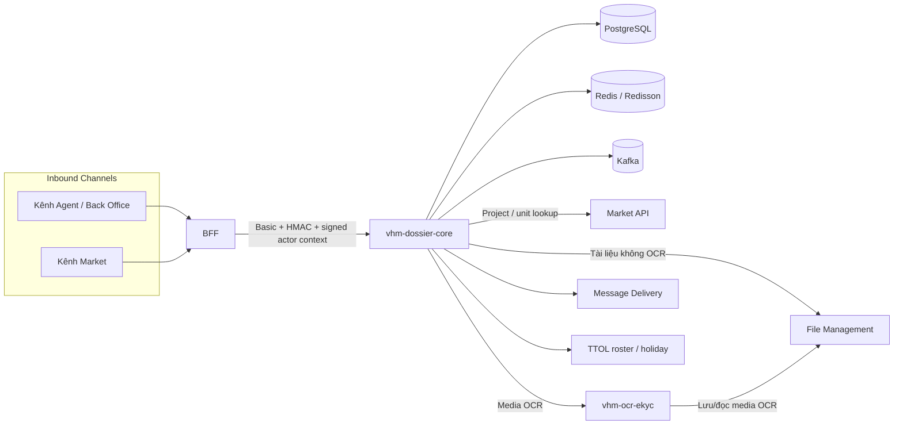
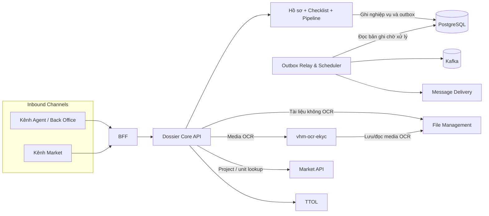
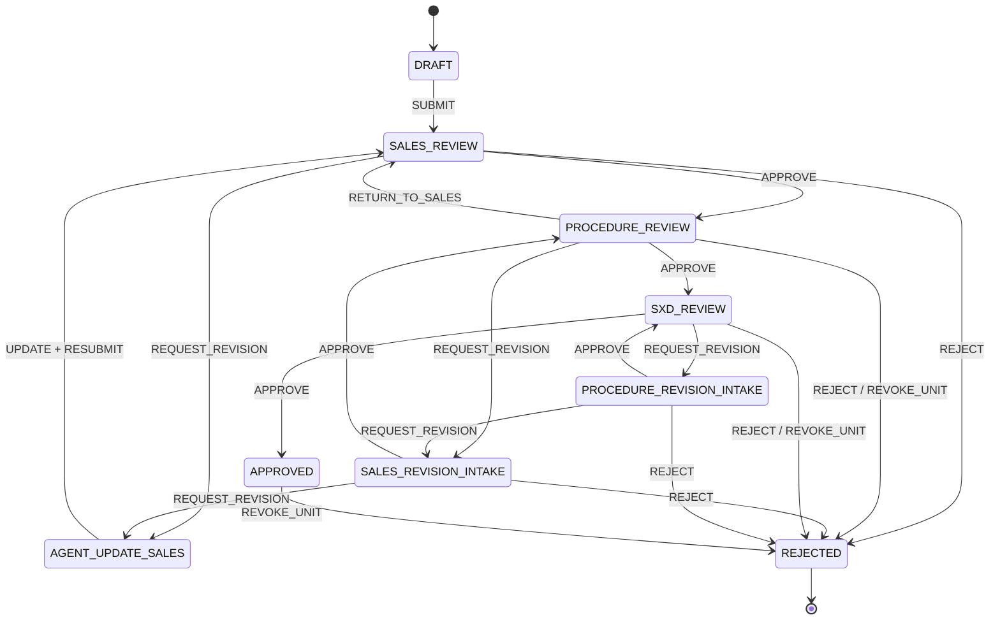
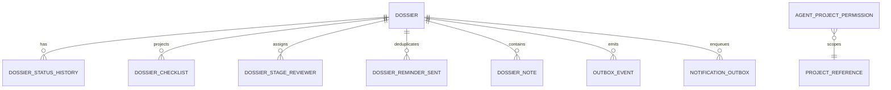
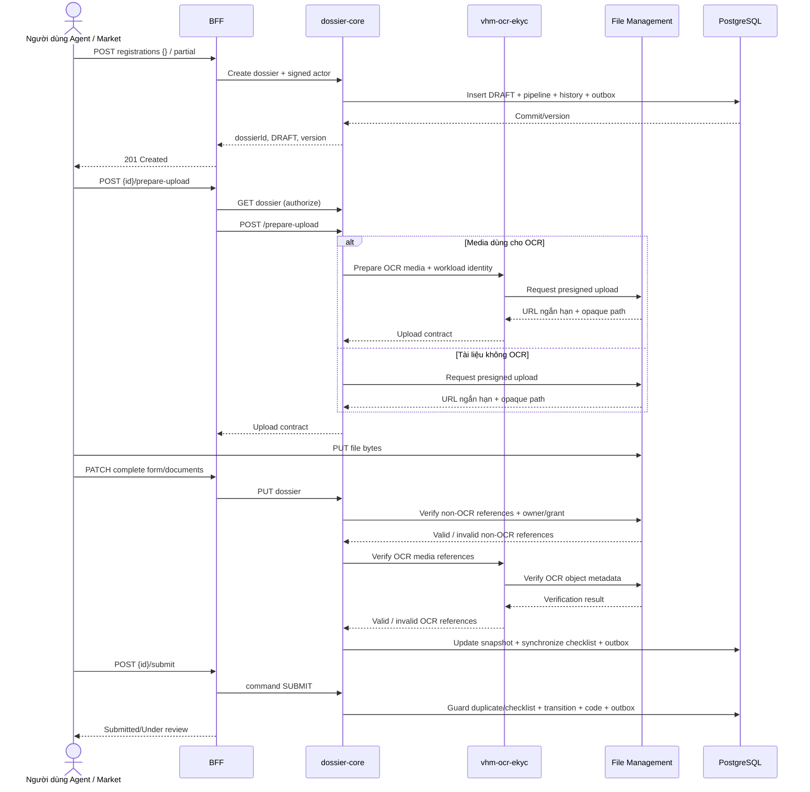
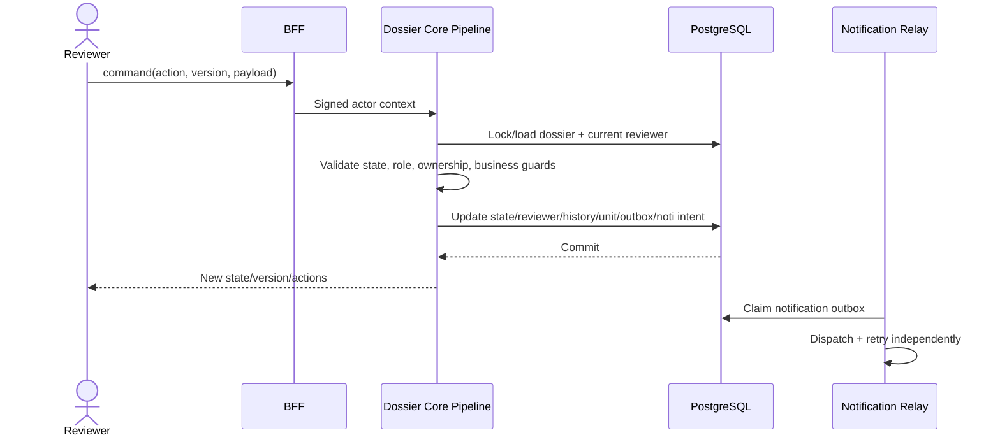
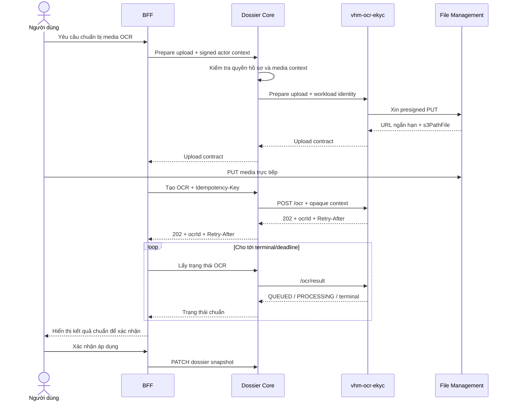
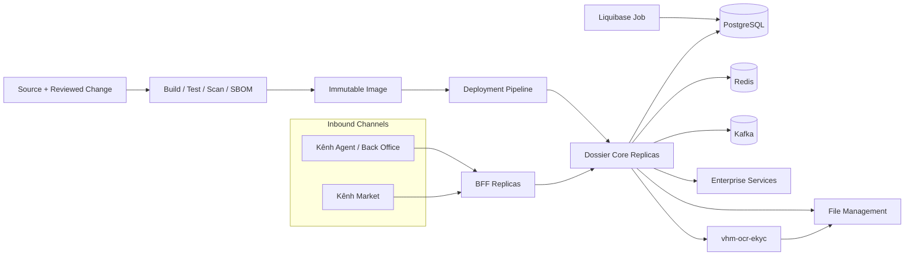

> **TÀI LIỆU NỘI BỘ** — Tài liệu mô tả kiến trúc mục tiêu L2 của năng lực quản lý hồ sơ Nhà ở Xã hội. Không chia sẻ ra ngoài phạm vi dự án khi chưa được phê duyệt.

# L2 - VHMKDO2O - Dịch vụ quản lý hồ sơ Nhà ở Xã hội

| **Trường** | **Nội dung** |
| --- | --- |
| **Trạng thái** | **ĐANG THẨM ĐỊNH (UNDER REVIEW)** |
| **Phiên bản & lịch sử thay đổi** | `v0.9.0` — 15/08/2026 — Thiết lập kiến trúc mục tiêu cho dịch vụ quản lý hồ sơ NOXH |
| **Chủ sở hữu tài liệu** | TBD |
| **Chủ sở hữu hệ thống** | TBD |
| **Hệ thống** | `vhm-dossier-core` — modular monolith quản lý hồ sơ và pipeline NOXH |
| **Hệ thống liên quan** | BFF/kênh tích hợp, `vhm-ocr-ekyc`, PostgreSQL, Redis, Kafka, File Management, Market, Message Delivery, TTOL |
| **Đội ngũ/PIC** | Backend: TBD · Kiến trúc: TBD · Tích hợp: TBD · ANBM: TBD · Quyền riêng tư dữ liệu: TBD · Vận hành: TBD |
| **Người rà soát/phê duyệt** | Sản phẩm/BA: TBD · Kiến trúc: TBD · ANBM: TBD · DBA/Vận hành: TBD · QA: TBD |
| **Mốc thiết kế** | Kiến trúc mục tiêu phục vụ thẩm định giải pháp và làm đầu vào cho thiết kế L3 |
| **Phạm vi hệ thống** | Dossier Core và các ranh giới tích hợp thể hiện trong sơ đồ ngữ cảnh |
| **Tài liệu nguồn** | SRS/BRD NOXH: TBD · L2 OCR/eKYC dùng chung |
| **Lần rà soát gần nhất** | 15/08/2026 |

## Approval & Review Gates

| **Vai trò rà soát/phê duyệt** | **Phạm vi rà soát** | **Quyết định** | **Ngày xác nhận** |
| --- | --- | --- | --- |
| Chủ sở hữu Sản phẩm/Nghiệp vụ | Luồng đăng ký, checklist, duyệt PKD/PTT/SXD, SLA nhắc bổ sung | Chờ rà soát | — |
| Kiến trúc Ứng dụng/Giải pháp | Ranh giới modular monolith, API, pipeline và tính nhất quán | Chờ rà soát | — |
| Kiến trúc Tích hợp | BFF, File Management, `vhm-ocr-ekyc`, Market, Message Delivery, TTOL, Kafka | Chờ rà soát | — |
| ANBM | IAM nội bộ, actor context, chống phát lại, PII và file | Chờ rà soát | — |
| Quyền riêng tư/Pháp chế | CCCD, thông tin liên hệ, lưu giữ, truy cập và xóa dữ liệu | Chờ rà soát | — |
| DBA/Vận hành/QA | Migration, dung lượng, quan sát, DR và bằng chứng kiểm thử | Chờ rà soát | — |

## Governance Gates

| **Chuyển trạng thái** | **Điều kiện đầu vào** |
| --- | --- |
| `DRAFT → UNDER REVIEW` | Scope, requirement, sơ đồ và decision đủ điều kiện rà soát; mọi deviation, phụ thuộc và rủi ro có định danh. |
| `UNDER REVIEW → APPROVED` | Có owner/reviewer đích danh; contract Checklist/File/Pipeline được chốt; security, privacy, NFR và vận hành có phê duyệt. |
| `APPROVED → IMPLEMENTATION BASELINE` | OpenAPI, migration, contract test, E2E, load test, DR/runbook và production configuration có bằng chứng. |

## L3 Artefact Register

| **Tài liệu L3** | **Trạng thái** | **Chủ sở hữu** | **Cổng bắt buộc** | **Tham chiếu** |
| --- | --- | --- | --- | --- |
| OpenAPI BFF ↔ Dossier Core | DRAFT | Backend/Tích hợp | Trước duyệt API | Liên kết tài liệu chính thức: TBD |
| Form Data Contract Social Housing v1 | DRAFT | Backend/BA | Trước UAT | Liên kết tài liệu chính thức: TBD |
| Pipeline Definition Social Housing v1 | DRAFT | Backend/BA | Trước UAT | Liên kết tài liệu chính thức: TBD |
| Contract Checklist chuẩn | **CHƯA CÓ** | BA/Tích hợp/Backend | Trước production | Chưa chốt nguồn authority và version |
| Contract File Management cho tài liệu không OCR | **CHƯA ĐỦ** | File Team/ANBM | Trước production | Chưa có owner/upload-grant contract |
| OpenAPI Dossier Core ↔ `vhm-ocr-ekyc` | DRAFT | OCR Team/Backend/ANBM | Trước production | Cần chốt media CCCD hai mặt, IAM và apply-result |
| Runbook migration/rollback/DR | Planned | DBA/Vận hành | Trước OAT | TBD |
| Runbook dashboard/cảnh báo/sự cố | Planned | Vận hành | Trước go-live | TBD |

## Quy ước trạng thái thiết kế

| **Nhãn** | **Ý nghĩa** |
| --- | --- |
| `BẮT BUỘC` | Phải hoàn thành và có bằng chứng trước production. |
| `ĐỀ XUẤT` | Quyết định kiến trúc đang chờ phê duyệt. |
| `BÊN NGOÀI` | Do dependency quy định; cần contract test và SLA. |
| `TBD` | Cần owner xác nhận trước cổng tương ứng. |

Tài liệu này mô tả **kiến trúc mục tiêu L2**. Dossier được thiết kế theo modular monolith với pipeline thực thi nội bộ.

# 1. Business Objectives & Scope

### Business Context & Objectives

`vhm-dossier-core` số hóa việc tiếp nhận, cập nhật, kiểm tra và phê duyệt hồ sơ đăng ký Nhà ở Xã hội. Kênh Agent hoặc Market tạo bản nháp, tải tài liệu, hoàn thiện snapshot hồ sơ rồi chủ động nộp. Hồ sơ được xử lý qua các nhóm PKD, PTT và đầu mối SXD; mọi hành động hợp lệ được quyết định bởi pipeline nội bộ và actor context đã ký.

#### Current Business Problem

- Hồ sơ giấy/Excel/email khó kiểm soát tính đầy đủ, phiên bản và lịch sử xử lý.
- Nhập tay CCCD và thông tin khách hàng dễ sai; tài liệu thiếu hoặc không tồn tại chỉ được phát hiện muộn.
- Nhiều người có thể tạo hồ sơ cho cùng khách hàng và dự án, dẫn đến trùng nghiệp vụ và tranh chấp căn.
- Quyền xem/xử lý theo người dùng, đội nhóm, dự án và cấp duyệt phải được thực thi nhất quán giữa BFF và core.
- Luồng trả bổ sung cần SLA, nhắc hẹn, lịch sử và khả năng tiếp tục đúng cấp duyệt.
- Các tích hợp File, OCR, Market, TTOL và Message Delivery có độ sẵn sàng khác nhau; không được làm mất trạng thái đã commit.

#### Business Objectives

- Tạo hồ sơ `DRAFT` nhanh với form rỗng hoặc một phần; create không tự động submit.
- Tiếp nhận hồ sơ từ kênh Agent/Back Office (`source=AGENT`) và kênh Market (`source=MARKET`) qua cùng BFF.
- Duy trì một snapshot `formData`/`metadata` có version, lịch sử trạng thái và projection pipeline.
- Ngăn hồ sơ active trùng theo `(applicant.idNumber, projectRegistration.projectId)` kể cả khi có race.
- Bảo đảm checklist bắt buộc đã được upload trước `SUBMIT`.
- Thực thi pipeline PKD → PTT → SXD, bao gồm trả bổ sung, phân công, nhận xử lý, cấp/thu hồi căn và hồ sơ giấy.
- Cung cấp list/detail/statistics/export và progress checklist cho kênh nghiệp vụ qua BFF.
- Tách việc gửi sự kiện và notification khỏi transaction nghiệp vụ bằng outbox.
- Bảo vệ PII bằng actor context, visibility, ownership, masking và xác thực nội bộ có chữ ký.

## 1.1 In Scope

| **Capability** | **Phạm vi** | **Yêu cầu thiết kế** |
| --- | --- | --- |
| Hồ sơ | Create/read/list/update/delete DRAFT, statistics, lookup theo contact | `BẮT BUỘC` |
| Nguồn tạo hồ sơ | Kênh Agent/Back Office và kênh Market cùng đi qua BFF | `BẮT BUỘC` |
| Luồng đăng ký công khai | Create DRAFT → prepare upload → PATCH snapshot → submit | `BẮT BUỘC` |
| Checklist | Snapshot từ nguồn chuẩn, progress, missing/invalid, readiness submit | `BẮT BUỘC` |
| Pipeline | State/action/role/ownership trong modular monolith | `BẮT BUỘC` |
| Phân công reviewer | Manual, round-robin PKD và roster TTOL cho PTT/SXD | `BẮT BUỘC` |
| Quyền dự án | Grant/revoke/list/group theo team/project/scope | `BẮT BUỘC` |
| OCR CCCD | Tích hợp capability dùng chung `vhm-ocr-ekyc` theo mô hình bất đồng bộ | `BẮT BUỘC` |
| Tài liệu/media | Chuẩn bị upload, xác minh reference/quyền attach, download và lưu artefact xuất | `BẮT BUỘC` |
| Notification/reminder | Transactional outbox và nhắc bổ sung T+6/T+18 | `BẮT BUỘC` |
| Báo cáo/tải file | Export danh sách NOXH; tải hợp đồng/tệp đính kèm | `BẮT BUỘC` |
| Notes/hardcopy | Ghi chú và theo dõi hồ sơ giấy | `BẮT BUỘC` |

## 1.2 Out of Scope

- Camunda/Zeebe hoặc BPMN engine bên ngoài; pipeline hiện chạy trong cùng ứng dụng và transaction.
- Sở hữu master data dự án, người dùng, đội nhóm, ngày nghỉ hoặc file binary.
- Thuật toán, provider credential, queue/worker và dữ liệu raw OCR; toàn bộ thuộc `vhm-ocr-ekyc`.
- Quyết định pháp lý về đủ điều kiện NOXH dựa riêng vào OCR.
- Quản trị checklist chuẩn ở trình duyệt; `isRequired` do client gửi chưa thể là authority production.
- Thanh toán, ký điện tử và tích hợp tự động trực tiếp với cơ quan SXD.
- Chứng minh người upload sở hữu file nếu File Contract hoặc OCR media contract chưa trả owner/upload-grant đã xác minh.

### Assumptions, Constraints & Dependencies

| **ID** | **Giả định/Ràng buộc** | **Trạng thái** | **Ảnh hưởng** |
| --- | --- | --- | --- |
| A-01 | BFF là inbound boundary duy nhất của Dossier Core cho cả kênh Agent/Back Office và kênh Market | Quyết định kiến trúc | Các kênh không gọi trực tiếp core. |
| A-02 | PostgreSQL là nguồn sự thật của hồ sơ, checklist, projection pipeline và outbox | Quyết định hiện hành | Mọi mutation trọng yếu dùng cùng transaction DB. |
| A-03 | Create chỉ tạo `DRAFT`; submit là lệnh riêng | Contract bắt buộc | BFF phải điều phối đủ bốn bước đăng ký. |
| A-04 | Kafka có thể giao lặp; relay/consumer phải idempotent | Giả định nền tảng | Outbox chấp nhận publish lặp, không làm lặp quyết định nghiệp vụ. |
| A-05 | File path là opaque; namespace upload độc lập với dossier ID | Đã xác minh STG | Không áp dụng kiểm tra prefix `registrations/{dossierId}/`. |
| A-06 | Mỗi dossier phải nhận một pipeline ID/version xác định | `BẮT BUỘC` | Không lựa chọn pipeline theo thứ tự cấu hình. |
| A-07 | Structural guard và Form Data Contract phải được thực thi trước persistence | `BẮT BUỘC` | Production không được bỏ qua schema validation. |
| A-08 | OCR tài liệu đi qua `vhm-ocr-ekyc`; dossier không gọi provider trực tiếp | Quyết định kiến trúc mục tiêu | Cần OpenAPI L3, workload IAM và migration khỏi client OCR legacy. |
| A-09 | Tài liệu không OCR đi trực tiếp File Management; media OCR đi qua `vhm-ocr-ekyc` | Quyết định kiến trúc mục tiêu | Phân tuyến theo mục đích sử dụng, không theo extension hoặc lựa chọn từ client. |
| A-10 | External services có contract/SLA riêng | `BÊN NGOÀI` | Cần timeout, retry hữu hạn, monitoring và contract test. |

### Stakeholders & Personas

| **Nhóm** | **Trách nhiệm/quyền** |
| --- | --- |
| Agent / `APPLICANT_AGENT` | Tạo và cập nhật DRAFT, upload, submit/resubmit, xem hồ sơ trong phạm vi. |
| PKD / `PKD`, `PKD_LEAD` | Phân công/nhận hồ sơ, cấp căn, duyệt, trả bổ sung, từ chối, hồ sơ giấy. |
| PTT / `PTT`, `PTT_LEAD` | Kiểm tra thủ tục, duyệt/trả bổ sung/từ chối, chuyển SXD. |
| Đầu mối SXD | Được mô hình hóa bằng stage `SXD` nhưng xử lý qua roster/role PTT hiện hành. |
| BO/Admin | Quản lý quyền dự án, tra cứu/báo cáo và vận hành. |
| BFF | Xác thực kênh, map DTO, ký request và actor context khi gọi core. |
| Market | Kênh tạo/quản lý hồ sơ qua BFF với `source=MARKET`; đồng thời cung cấp dữ liệu dự án/căn qua Market API. |
| File/`vhm-ocr-ekyc`/Message Delivery/TTOL | Cung cấp năng lực tích hợp không thuộc sở hữu core. |

### Personal Data Processing Summary

| **Dữ liệu** | **Mục đích** | **Vị trí** | **Kiểm soát hiện hành/yêu cầu** |
| --- | --- | --- | --- |
| CCCD, họ tên, ngày sinh, địa chỉ | Định danh và xử lý hồ sơ | `dossier.form_data` JSONB | Actor visibility, masking, XSS guard, mã hóa hạ tầng/TBD retention. |
| SĐT/email người nộp và vợ/chồng | Liên hệ, tìm kiếm, notification | JSONB và notification outbox | PKD masking; không ghi body nhạy cảm vào log. |
| Đường dẫn file | Gắn tài liệu và yêu cầu OCR | JSONB/checklist, File Management và OCR service | Chỉ lưu `s3PathFile`; không persist presigned URL; ownership còn thiếu. |
| Kết quả/phê duyệt tài liệu | Readiness và quyết định | JSONB/checklist/history | Chỉ actor có quyền được mutation; lịch sử append trong snapshot. |
| Actor/reviewer | Audit và routing | audit columns, status history, stage reviewer | Actor context có chữ ký; không tin actor do client truyền. |

### System Criticality

Đề xuất **Cấp 2 — nghiệp vụ trọng yếu, xử lý dữ liệu cá nhân nhạy cảm**. Phân loại chính thức, RTO/RPO, retention và yêu cầu mã hóa phải được System Owner, ANBM, Privacy và Vận hành ký duyệt trước production.

# 2. Architecture Overview & Principles

## 2.1 Nguyên tắc thiết kế

| **Mã** | **Nguyên tắc** |
| --- | --- |
| ARCH-01 | Dossier domain và pipeline được quản lý thống nhất trong cùng ranh giới giao dịch. |
| ARCH-02 | PostgreSQL là nguồn sự thật; mutation hồ sơ, checklist, history và outbox cùng transaction. |
| ARCH-03 | Create và submit tách biệt; mọi create thành công trả về `DRAFT`. |
| ARCH-04 | Pipeline được cấu hình bằng phiên bản và thực thi trong cùng process/transaction với dossier. |
| ARCH-05 | Không tin actor/role từ request body; dùng actor context có chữ ký. |
| ARCH-06 | Dùng optimistic lock cho update/command và DB constraint cho race cuối. |
| ARCH-07 | Idempotency replay được kiểm tra trước validation và được serialize bằng advisory lock. |
| ARCH-08 | Event/notification dùng transactional outbox, chấp nhận at-least-once. |
| ARCH-09 | File path là tham chiếu opaque; không suy luận ownership từ prefix. |
| ARCH-10 | Mọi khoảng trống production phải được quản lý bằng risk/open issue, không mô tả như đã triển khai. |
| ARCH-11 | Dossier chỉ tích hợp contract chuẩn của `vhm-ocr-ekyc`; không biết provider, credential, queue hoặc raw response. |
| ARCH-12 | Core gọi File Management cho tài liệu không OCR; media OCR chỉ đi qua `vhm-ocr-ekyc`, không gọi provider hoặc File Management trực tiếp trong nhánh OCR. |

## 2.2 Sơ đồ kiến trúc ứng dụng

### 2.2.1 Sơ đồ ngữ cảnh hệ thống

### 2.2.2 Sơ đồ thành phần

### 2.2.3 Sơ đồ kiến trúc pipeline nội bộ

Pipeline Social Housing là cấu hình có phiên bản được nạp cùng ứng dụng. Khi tạo hồ sơ, core ghi phiên bản pipeline và trạng thái khởi tạo; mỗi command được kiểm tra role, ownership và guard nghiệp vụ rồi cập nhật projection, history, reviewer và outbox trong một transaction. Không có process instance Camunda và không có ranh giới eventual consistency với workflow engine ngoài.

### 2.2.4 Phân định trách nhiệm module

| **Khối kiến trúc** | **Trách nhiệm** | **Dữ liệu quản lý** | **Không chịu trách nhiệm** |
| --- | --- | --- | --- |
| BFF | Public contract, xác thực kênh, object authorization và truyền actor context | Không sở hữu hồ sơ | Business invariant và persistence cuối. |
| Kênh Market | Sử dụng public contract qua BFF; BFF gán `source=MARKET` từ channel context tin cậy | Không sở hữu hồ sơ | Business invariant và persistence cuối. |
| Dossier domain | Vòng đời hồ sơ, validation, duplicate, checklist, pipeline, phân công và điều phối OCR | Aggregate dossier và projection liên quan | Identity kênh, file binary, OCR raw. |
| Outbox/Scheduler | Phát sự kiện, gửi notification và nhắc SLA sau commit | Trạng thái delivery/dedup | Thay đổi quyết định nghiệp vụ đã commit. |
| `vhm-ocr-ekyc` | Quản lý media phục vụ OCR, tài nguyên OCR bất đồng bộ và chuẩn hóa kết quả | OCR lifecycle, media OCR và kết quả chuẩn | Sở hữu dossier, xử lý tài liệu không OCR hoặc tự áp kết quả vào form. |
| File Management | Upload, kiểm tra, lưu trữ và download tài liệu không OCR | File binary và metadata thuộc contract File | Sở hữu dossier hoặc xử lý OCR. |
| Enterprise services | Market, TTOL, Message Delivery | Dữ liệu thuộc từng miền | Sở hữu aggregate dossier. |

### 2.2.5 Ranh giới tin cậy

| **Ranh giới** | **Mức tin cậy** | **Kiểm soát** | **Khoảng trống** |
| --- | --- | --- | --- |
| Client → BFF | Không tin cậy | Auth kênh, role, validation, rate limit tầng gateway | Thuộc phạm vi kênh/platform. |
| BFF → core | Zero Trust nội bộ | Basic Auth, HMAC, timestamp/nonce/body hash, actor signature | Cần vận hành secret rotation. |
| Actor context → business | Chỉ tin sau verify | `subject`, role, visibility, expiry, JTI | JTI replay đang có thể tắt theo môi trường. |
| Core → `vhm-ocr-ekyc` | Zero Trust nội bộ | Workload identity, audience/scope, object context, idempotency | OpenAPI/IAM L3 và E2E chưa hoàn tất. |
| Core → File Management | Dependency ngoài process | Workload identity, object scope, checksum và owner/upload grant | Chỉ dành cho tài liệu không OCR. |
| Core → Market/TTOL/Message | Dependency ngoài process | Credential server-side, timeout/retry/config | Contract/SLA cần chốt. |
| `vhm-ocr-ekyc` → File Management | Ranh giới được ủy quyền | Workload identity và object scope của media OCR | Core không tham gia contract File của nhánh OCR. |
| Core → Kafka | At-least-once | Transactional outbox, retry, idempotent consumer | Publish mặc định có thể tắt theo config. |

## 2.3 Vòng đời hồ sơ

### 2.3.1 Trạng thái công bố

Pipeline Social Housing v1 sử dụng các business status chính: `DRAFT`, `SUBMITTED`, `UNDER_REVIEW`, `ADD_INFO_REQUESTED`, `APPROVED`, `REJECTED`. `APPROVED` vẫn cho phép thu hồi căn theo pipeline hiện tại; `REJECTED` là terminal. Enum tổng quát có thêm trạng thái legacy nhưng không mặc nhiên thuộc flow NOXH v1.

### 2.3.2 State machine

## 2.4 Tính nhất quán và Idempotency

### 2.4.1 Tạo tài nguyên và idempotency

- BFF xác định `source` từ channel context; `MARKET` bắt buộc header `Idempotency-Key` (`10509`), còn `AGENT` không bắt buộc.
- Với idempotency key, core lấy PostgreSQL transaction advisory lock trên key trước khi kiểm tra replay.
- Replay được tra theo `(idempotencyKey, createdBy)` **trước** form/schema/file validation; cùng actor nhận lại dossier đã tạo.
- Nếu key toàn cục đã thuộc actor khác, request bị từ chối; DB có unique constraint cuối trên `idempotency_key`.
- Sau pipeline initialization, entity được `flush` trước khi dựng response để `version` trả về bằng version trong DB.

### 2.4.2 Transactional outbox

Create/update/transition/delete ghi business row và `outbox_event` trong cùng transaction. Relay khóa theo batch (`FOR UPDATE SKIP LOCKED`), publish Kafka khi tính năng được bật và cập nhật trạng thái gửi. `notification_outbox` là outbox riêng cho ý định gửi thông báo; relay hiện dispatch kênh `EMAIL`, retry exponential có giới hạn và chuyển `FAILED` khi hết số lần thử.

### 2.4.3 Ranh giới nhất quán

| **Thao tác** | **Cùng transaction** | **Ngoài transaction** |
| --- | --- | --- |
| Create/update | Dossier, pipeline projection, status history, checklist, outbox | Kafka publish, downstream processing |
| Command pipeline | Dossier/status, reviewer, history, unit, outbox, notification intent | Gửi message và consumer ngoài hệ thống |
| Reminder | Claim/dedup reminder và notification intent | Message Delivery |
| OCR bất đồng bộ | Không thay đổi dossier khi tạo/poll OCR | `vhm-ocr-ekyc` quản lý media, lifecycle và kết quả chuẩn |

### 2.4.4 Concurrency guards

- `@Version` và `If-Match` ngăn lost update khi caller cung cấp version; bỏ header đồng nghĩa chấp nhận last-write-wins ở API hiện hành.
- Unique partial index ngăn race hồ sơ active trùng CCCD+dự án; conflict ánh xạ `11011`.
- Unique partial index căn được cấp ngăn hai hồ sơ active giữ cùng căn.
- Reviewer assignment PKD dùng row lock/rotation trong DB; PTT/SXD dùng atomic counter Redis và sticky assignment khi quay lại.
- Command pipeline kiểm tra current state/action trong transaction; mọi side effect chỉ commit khi toàn bộ guard thành công.

# 3. Functional Requirements

## 3.1 Ma trận năng lực chức năng

| **ID** | **Năng lực/yêu cầu** | **Thiết kế** | **Mức bắt buộc** |
| --- | --- | --- | --- |
| FR-01 | Tạo hồ sơ nháp | BFF tiếp nhận từ kênh Agent/Back Office hoặc Market và gọi core create `SOCIAL_HOUSING`; luôn trả `DRAFT` | `BẮT BUỘC` |
| FR-02 | Upload tài liệu | Core kiểm tra quyền; tài liệu không OCR gọi File Management, media OCR gọi `vhm-ocr-ekyc`; kênh PUT theo presigned contract | `BẮT BUỘC` |
| FR-03 | Cập nhật snapshot | Full update ở DRAFT/ADD_INFO; contact-only khi đã submit/review | `BẮT BUỘC` |
| FR-04 | Nộp hồ sơ | Command `SUBMIT`, duplicate guard, checklist readiness, sinh mã | `BẮT BUỘC` |
| FR-05 | Chống trùng | Application precheck + database race guard | `BẮT BUỘC` |
| FR-06 | Checklist/progress | Snapshot theo template+group; counts/missing/invalid | `BẮT BUỘC` |
| FR-07 | Phê duyệt nhiều cấp | Pipeline versioned thực thi trong core | `BẮT BUỘC` |
| FR-08 | Phân công reviewer | Manual/reassign/claim + auto round-robin | `BẮT BUỘC` |
| FR-09 | Cấp/thu hồi căn | Atomic allocation/approve; unique active unit | `BẮT BUỘC` |
| FR-10 | Hồ sơ giấy | Submit/confirm hardcopy và timeline | `BẮT BUỘC` |
| FR-11 | OCR CCCD | `vhm-ocr-ekyc`: tạo `202`, poll trạng thái/kết quả, người dùng xác nhận trước khi áp dụng | `BẮT BUỘC` |
| FR-12 | Notification/reminder | Outbox, kênh được phê duyệt, T+6/T+18 và manual trigger | `BẮT BUỘC` |
| FR-13 | Tra cứu/báo cáo | List/detail/statistics/by-contact/export | `BẮT BUỘC` |
| FR-14 | Xóa bản nháp | Chỉ DRAFT; xóa checklist và dữ liệu phụ thuộc | `BẮT BUỘC` |
| FR-15 | PIC hồ sơ | Use case, permission và audit semantics | `TBD` |

## 3.2 Quy tắc nghiệp vụ

| **ID** | **Quy tắc** |
| --- | --- |
| BR-01 | Public create không được submit; trạng thái sau create luôn là `DRAFT`. |
| BR-02 | BFF xác định `source=AGENT\|MARKET` từ channel context tin cậy; `MARKET` create phải có `Idempotency-Key`, `AGENT` không bắt buộc key. |
| BR-03 | Một cặp CCCD người nộp + dự án chỉ có một hồ sơ chưa terminal. |
| BR-04 | Create `{}` không tạo checklist; create có `documents[]` và mọi full update DRAFT/ADD_INFO phải synchronize checklist. |
| BR-05 | Identity checklist là `(dossierId, documentTemplateId, groupCode)`. |
| BR-06 | Submit cần tồn tại ít nhất một required item và mọi required item ở `COMPLETE`. |
| BR-07 | Full update chỉ ở DRAFT/ADD_INFO; SUBMITTED/UNDER_REVIEW chỉ cho sửa contact email/phone. |
| BR-08 | Update không được ghi đè `source`, `assignedUnitCode` hoặc `assignedUnitId` do server quản lý. |
| BR-09 | Media identity applicant/spouse được xác minh qua `vhm-ocr-ekyc`; `documents[].s3PathFile` không OCR được xác minh qua File Management khi file-validation bật. |
| BR-10 | Không kiểm tra file path prefix theo dossier ID. |
| BR-11 | Mọi command phải hợp lệ theo state, role và ownership (`OWNER`, `CLAIMER`, `NONE`). |
| BR-12 | Lần submit đầu sinh mã `<sapId>-<agencyId>-<ddMMyy>-<sequence4>`; PKD approve chuẩn hóa thành `<sapId>-<sequence5>`. |
| BR-13 | Reject/revoke unit phải giải phóng căn đang cấp. |
| BR-14 | DRAFT delete xóa checklist tường minh; FK checklist cũng có `ON DELETE CASCADE`. |
| BR-15 | Comment hiện là optional theo pipeline/config; không mô tả là bắt buộc nếu chưa bật guard. |

# 4. Non-Functional Requirements

Các mục tiêu `200 req/s`, P95 cụ thể và availability `99.9%` chưa có workload/capacity evidence được phê duyệt nên chưa được coi là baseline. Trước production phải chốt NFR theo workload thực tế.

| **ID** | **Nhóm** | **Yêu cầu** | **Cổng** |
| --- | --- | --- | --- |
| NFR-01 | Availability | Core stateless ở tầng HTTP; DB/Redis/Kafka/external có health và degradation policy | `BẮT BUỘC` |
| NFR-02 | Consistency | Không mất mutation đã commit; outbox cho event/notification | `BẮT BUỘC` |
| NFR-03 | Concurrency | Idempotency, optimistic lock, unique index, row/Redis lock | `BẮT BUỘC` |
| NFR-04 | Performance | P95/P99 theo endpoint và peak TPS phải được đo | TBD |
| NFR-05 | Scalability | Scale ngang API/relay; không dùng session cục bộ làm authority | `BẮT BUỘC` |
| NFR-06 | Security | Signed request/actor, least privilege, PII masking, secret rotation | `BẮT BUỘC` |
| NFR-07 | Privacy | Purpose, retention, deletion, audit access cho CCCD | TBD/BẮT BUỘC |
| NFR-08 | Recoverability | PostgreSQL PITR, outbox replay, backup/restore drill | TBD/BẮT BUỘC |
| NFR-09 | Observability | Metrics/log/trace/correlation và alert có owner | `BẮT BUỘC` |
| NFR-10 | Maintainability | Versioned migration/schema/pipeline; backward-compatible API | `BẮT BUỘC` |

# 5. Technology Stack & Justification

| **Công nghệ** | **Vai trò** | **Cơ sở lựa chọn/hệ quả** |
| --- | --- | --- |
| Java 25, Spring Boot 4.1 | Runtime/service framework | Stack nền tảng của dịch vụ; cần image/JVM production được chứng nhận. |
| Spring Data JPA/Hibernate | Aggregate persistence, optimistic lock | Phù hợp transaction domain; cần tránh N+1 và giữ `open-in-view=false`. |
| PostgreSQL, Liquibase | Source of truth, JSONB, constraint, advisory lock | Hỗ trợ transaction/partial index; migration phải forward-safe. |
| Redis/Redisson | Replay/nonce, counter phân công, cache/lock hỗ trợ | Không được là source of truth của dossier. |
| Kafka | Phát domain event từ outbox | At-least-once; consumer cần idempotent. |
| Caffeine | Cache cục bộ cho dữ liệu tham chiếu | Giảm latency; cần invalidation/TTL rõ ràng. |
| JSON Schema 2020-12 | Validate form Social Housing v1 | Cho phép evolution schema; enforcement hiện phụ thuộc config. |
| Thrift/HTTP clients | File Management, `vhm-ocr-ekyc` và các tích hợp nội bộ | Tách client/config theo ranh giới; contract bên ngoài cần timeout/retry/test. |
| Syncfusion/Apache POI | Export/tạo tài liệu | Cần quản lý license, template và kiểm thử output. |

## 5.1 ADR Log

ADR chi tiết nằm tại Phụ lục D. Các quyết định nền tảng: modular monolith, pipeline nội bộ bằng YAML, PostgreSQL source of truth, snapshot JSONB có schema version, transactional outbox, signed actor context, database constraint là race guard cuối.

# 6. Integration Architecture

## 6.1 Danh mục giao diện tích hợp

| **ID** | **Tích hợp** | **Hướng** | **Kiểu** | **Mục đích** | **Failure policy** |
| --- | --- | --- | --- | --- | --- |
| INT-01 | BFF | Inbound | HTTP sync | Agent/Back Office và Market registration/list/detail/action | Signature/actor fail closed |
| INT-02 | Dossier Core → File Management | Outbound | Client sync | Tài liệu không OCR: prepare upload, existence/ownership, download và lưu artefact xuất | Fail hard cho validation bắt buộc |
| INT-03 | Dossier Core → `vhm-ocr-ekyc` | Outbound | HTTP async resource | Media OCR, OCR CCCD và kết quả chuẩn | Idempotent create, polling hữu hạn, không retry mù |
| INT-04 | Dossier Core → Market API | Outbound | HTTP sync + cache | SAP/project/unit/special days | Tùy use case: fail hard hoặc best effort |
| INT-05 | TTOL | Outbound | HTTP/cache | Roster reviewer/holiday | Auto-assign best effort; manual fallback |
| INT-06 | Message Delivery | Outbound | Outbox relay | Email notification | Retry/backoff → FAILED |
| INT-07 | Kafka | Outbound | Async | Domain event đã commit | Outbox retry; publish có feature flag |

## 6.2 Contract API hồ sơ VHM

### 6.2.1 Registration flow qua BFF

Kênh Agent/Back Office và kênh Market dùng cùng public contract và cùng chuỗi xử lý. BFF xác định `source` từ channel context đã xác thực, sau đó gọi Dossier Core bằng workload identity và signed actor context; client không được tự chọn `source` trong request body.

| **Bước** | **API BFF** | **Kết quả bắt buộc** |
| --- | --- | --- |
| 1 | `POST /v1/social-housing/registrations` | Tạo duy nhất một `DRAFT`, nhận `dossierId`. |
| 2 | `POST /v1/social-housing/registrations/{id}/prepare-upload` rồi PUT file | Chỉ cấp URL sau khi caller đọc được dossier; giữ `s3PathFile`. |
| 3 | `PATCH /v1/social-housing/registrations/{id}` | Ghi snapshot form/documents đầy đủ. |
| 4 | `POST /v1/social-housing/registrations/{id}/submit` | Chuyển vào pipeline nếu mọi guard đạt. |

### 6.2.2 Nhóm năng lực API nội bộ

Core công bố API nội bộ có version cho các nhóm năng lực: quản lý hồ sơ, command pipeline, quyết định tài liệu, quyền dự án, notes/hardcopy, download/export, statistics và reminder. Public contract không phản chiếu nguyên xi endpoint nội bộ; BFF chịu trách nhiệm map DTO, HTTP semantics và ẩn cấu trúc nội bộ. Danh sách path/field đầy đủ thuộc OpenAPI L3, không lặp lại trong tài liệu L2 này.

### 6.2.3 Envelope và phân trang

Core trả `ServiceResponse { code, message, data }`, trong đó `code=0` là thành công. Danh sách dùng `PageDto { items, pagination }`, page number là 1-based. HTTP status và application error code phải cùng biểu đạt một kết quả; client không được chỉ dựa vào message tiếng Việt.

## 6.3 Contract tài liệu và phân tuyến file/OCR

### 6.3.1 Phân loại tài liệu

| **Nhóm tài liệu** | **Ví dụ trong hồ sơ NOXH** | **Có xử lý OCR** | **Năng lực sử dụng** |
| --- | --- | --- | --- |
| Media định danh | Mặt trước/sau CCCD của người đăng ký và vợ/chồng | Có | `Dossier Core → vhm-ocr-ekyc → File Management`; tạo tài nguyên OCR. |
| Giấy tờ checklist | File gắn với `documents[].s3PathFile` | Không mặc định | `Dossier Core → File Management`; upload, xác minh ownership/tồn tại, duyệt và tải xuống. |
| Gói hợp đồng | Mẫu hợp đồng/phiếu được render và đóng gói ZIP | Không | `Dossier Core → File Management`; lưu artefact và cấp quyền tải xuống. |
| Gói tài liệu đính kèm | ZIP tổng hợp giấy tờ của hồ sơ | Không | `Dossier Core → File Management`; đọc source hợp lệ, lưu snapshot ZIP và tải xuống. |
| Báo cáo NOXH | File XLSX kết quả tra cứu/xuất báo cáo | Không | `Dossier Core → File Management`; lưu báo cáo và cấp quyền tải xuống có kiểm soát. |

Quy tắc phân tuyến do use case phía server quyết định. Client không được chọn `useOcr` để đổi đường tích hợp. Media định danh hoặc tài liệu được nghiệp vụ chỉ định mới đi qua `vhm-ocr-ekyc`; checklist, ZIP và XLSX không OCR gọi File Management trực tiếp.

### 6.3.2 Luồng tài liệu không OCR

- Request chuẩn bị upload phải chứa dossier ID hợp lệ và metadata file được allowlist; Core kiểm tra quyền hồ sơ trước khi gọi File Management.
- Upload contract gồm presigned URL ngắn hạn, headers bắt buộc và `s3PathFile`; kênh PUT bytes trực tiếp tới object URL được cấp.
- Core chỉ persist opaque reference như `s3PathFile`; không giữ presigned URL và không dùng path prefix làm bằng chứng ownership.
- Khi create/update/attach, Core gọi File Management để xác minh batch existence, owner hoặc upload grant. Existence đơn thuần không đủ để cho phép attach.
- ZIP/XLSX do Core sinh ra được upload và cấp download URL qua File Management; cùng authorization/visibility của dossier áp dụng cho export/download.
- MIME, size, magic bytes, checksum, TTL, retention và quyền download phải được chốt trong File Contract L3.

### 6.3.3 Media dùng cho OCR

Media OCR đi theo luồng `Kênh → BFF → Dossier Core → vhm-ocr-ekyc → File Management`. Dossier Core xác thực quyền hồ sơ và gửi context nghiệp vụ tới `vhm-ocr-ekyc`; service này sở hữu bước chuẩn bị/lấy media với File Management và vòng đời OCR. Core không gọi File Management trực tiếp cho media thuộc request OCR.

Role và MIME baseline lấy từ L2 OCR/eKYC dùng chung (`OCR_DOCUMENT`, `DOCUMENT_FRONT`, `DOCUMENT_BACK`, `LABOR_CONTRACT`; JPEG/PNG/PDF). Dossier không được mở rộng role/MIME hoặc tự dựng object path nếu chưa cập nhật contract OCR L3.

## 6.4 Contract OCR dùng chung

### 6.4.1 Ranh giới tích hợp

Dossier Core là consumer duy nhất của `vhm-ocr-ekyc` trong luồng hồ sơ NOXH và gọi service này bằng workload identity. Capability OCR tự quản lý media OCR với File Management, lifecycle, processor, provider credential, polling provider và kết quả chuẩn. BFF không gọi trực tiếp OCR service; Dossier Core chỉ biết contract OCR VHM và các opaque reference, không biết contract provider.

Tích hợp OCR trực tiếp từ dossier tới provider không được phép trong kiến trúc mục tiêu. Mọi đường OCR legacy phải được loại bỏ hoặc vô hiệu hóa trước go-live sau khi E2E với `vhm-ocr-ekyc` đạt quality gate.

### 6.4.2 Tạo tài nguyên OCR

Contract mục tiêu dùng `POST /ocr` với `Idempotency-Key` bắt buộc và trả HTTP `202` cùng `Retry-After`. Context tối thiểu:

| **Trường** | **Ý nghĩa/kiểm soát** |
| --- | --- |
| `source` | `DOSSIER`; dùng cho authorization, quota và idempotency scope. |
| `referenceId` | Dossier ID dạng opaque business reference. |
| `requestBy` | Opaque actor reference, không nhúng PII. |
| `subjectRef` | Opaque applicant/customer reference. |
| `channel`, `platform` | Context kênh đã allowlist. |
| `documentType`/loại OCR | `NATIONAL_ID` hoặc contract CCCD hai mặt được đóng băng ở OpenAPI L3. |
| `s3PathFile`/media roles | Chỉ reference do service chấp nhận; không gửi presigned URL vào DB/event. |

Cùng idempotency key và cùng request trả tài nguyên hiện hữu; cùng key nhưng request khác trả `409`. Provider không phải tham số do dossier/client lựa chọn.

### 6.4.3 Vòng đời và áp dụng kết quả

Trạng thái OCR gồm `QUEUED`, `PROCESSING`, `COMPLETED`, `FAILED`, `EXPIRED`. BFF thăm dò qua API của Dossier Core; Dossier Core gọi `/ocr/result` của `vhm-ocr-ekyc` và trả trạng thái chuẩn về BFF. `nextAction` hướng dẫn `POLL`, `RETRY` hoặc `CONFIRM_AND_APPLY`.

Khi `COMPLETED`, kênh phải cho người dùng kiểm tra kết quả chuẩn trước khi áp dụng. Việc áp dụng chỉ diễn ra qua PATCH snapshot dossier bình thường; OCR service không ghi trực tiếp vào database dossier. Dossier lưu bằng chứng tối thiểu gồm `ocrId`, outcome chuẩn, thời điểm và actor xác nhận để trace/readiness; không lưu raw provider response hoặc provider job ID. Field/schema cụ thể thuộc Form/Checklist Contract L3.

### 6.4.4 Tính nhất quán và failure semantics

- `vhm-ocr-ekyc` tạo request, media refs và outbox trong một transaction rồi mới trả `202`.
- Kafka chỉ chứa OCR ID tối thiểu; worker idempotent và trạng thái terminal bất biến.
- Dossier Core không retry mù khi kết quả submit không rõ; dùng cùng idempotency key hoặc đối soát theo `ocrId`.
- OCR thất bại/timeout không tự động biến hồ sơ thành `REJECTED`; người dùng có thể retry theo policy hoặc nhập/đối chiếu thủ công.
- Các giới hạn MIME, size, checksum, retention và deadline dùng đúng baseline của tài liệu L2 `vhm-ocr-ekyc`; không định nghĩa lại khác trong dossier.

## 6.5 Contract pipeline

### 6.5.1 Action contract

Các action chính gồm `UPDATE`, `SUBMIT`, `RESUBMIT`, `ASSIGN`, `REASSIGN`, `CLAIM`, `ALLOCATE_UNIT`, `APPROVE`, `REJECT`, `REQUEST_REVISION`, `RETURN_TO_SALES`, `SUBMIT_HARDCOPY`, `CONFIRM_HARDCOPY`, `REVOKE_UNIT`. Tập action khả dụng phải lấy từ response `availableActions`, không hard-code theo status ở kênh.

### 6.5.2 Role và ownership

Pipeline kiểm tra cả role (`APPLICANT_AGENT`, `PKD`, `PKD_LEAD`, `PTT`, `PTT_LEAD`) và ownership:

- `OWNER`: actor tạo hồ sơ.
- `CLAIMER`: reviewer đang claim stage.
- `NONE`: không yêu cầu ownership nhưng vẫn yêu cầu role.

### 6.5.3 Pipeline selection

Tại create, pipeline phải được xác định bằng pipeline ID/version authoritative từ contract nghiệp vụ hoặc một rule selection duy nhất. Trường hợp không tìm thấy hoặc có nhiều kết quả phải bị từ chối bằng lỗi cấu hình rõ ràng; không chọn theo thứ tự khai báo.

## 6.6 Mô hình checklist chuẩn hóa

| **Thuộc tính** | **Giá trị/ngữ nghĩa** |
| --- | --- |
| Identity | `dossierId + documentTemplateId + groupCode` |
| Upload status | `NOT_STARTED`, `COMPLETE` |
| OCR result | `NOT_OCR`, `MATCH`, `MISMATCH`, `INSUFFICIENT_DATA`, `FAILED` |
| Review status | `NOT_REVIEWED`, `VALID`, `INVALID` |
| Completed required | Upload `COMPLETE` và OCR khác `FAILED` |
| Invalid item | OCR `FAILED` hoặc review/constraint tương ứng không đạt |
| Progress | `completedRequired / requiredCount`, làm tròn 2 chữ số |

Khi file không đổi, synchronization giữ OCR/review state; khi path đổi hoặc bị xóa, trạng thái được reset; item không còn trong snapshot bị xóa. Duplicate `documentTemplateId + groupCode` trong cùng request bị từ chối.

## 6.7 Contract lỗi chuẩn

| **Code** | **Ý nghĩa** | **HTTP kỳ vọng** |
| --- | --- | --- |
| `10509` | Thiếu header bắt buộc, gồm idempotency cho MARKET | 400 |
| `11003` | Không tìm thấy dossier | 400/404 theo public mapping |
| `11005` | Dossier không ở trạng thái cho phép sửa | 400 |
| `11006` | Optimistic version conflict | 409 nên được chuẩn hóa ở public API |
| `11010` | Dossier không cho phép xóa | 400 |
| `11011` | Hồ sơ active trùng CCCD+dự án | 409 |
| `11017` | Không có checklist required để submit | 400/422 |
| `11018` | Thiếu required document | 400/422 |

# 7. Data Architecture & Data Flow

## 7.1 Data Model

### 7.1.1 Sở hữu dữ liệu logic

| **Bảng/aggregate** | **Mục đích** | **Invariant chính** |
| --- | --- | --- |
| `dossier` | Aggregate hồ sơ, JSONB form/metadata, source, PIC, pipeline projection, version | UUIDv7; source AGENT/MARKET; active duplicate/unit uniqueness. |
| `dossier_status_history` | Lịch sử trạng thái/action | Tạo trong cùng transaction với transition. |
| `dossier_checklist` | Projection readiness/progress và OCR evidence tối thiểu | PK logic template+group; FK cascade; không chứa raw provider result. |
| `dossier_stage_reviewer` | Người xử lý theo stage | Assignment/claim/review/decision metadata. |
| `dossier_reminder_sent` | Dedup reminder theo cycle | Dossier/state/rule/cycle unique. |
| `agent_project_permission` | ACL team/project/scope và rotation | Chỉ một permission active theo key. |
| `outbox_event` | Domain event chưa/đã publish | Không mất event khi business commit. |
| `notification_outbox` | Ý định notification và retry | Dedupe key/attempt/status. |
| `dossier_note` | Ghi chú general/hardcopy | Soft-delete theo use case. |
| `audit_log` | Nền tảng audit cho PIC/operation | Table có nhưng writer/use case PIC chưa hoàn chỉnh. |

### 7.1.2 Sơ đồ quan hệ dữ liệu logic

### 7.1.3 Database invariants

- Partial unique index trên normalized JSON path `applicant.idNumber + projectRegistration.projectId` cho dossier chưa terminal.
- Partial unique index trên unit được cấp cho dossier active.
- Check constraint cho `source`; MARKET yêu cầu idempotency key.
- Checklist có constraint enum và `invalid_reason` phù hợp trạng thái.
- Optimistic `version` được JPA quản lý; response create được dựng sau flush.
- Không có FK đến user/PIC/project master vì các định danh này thuộc hệ thống ngoài.

## 7.2 Data Flow Diagram

### 7.2.1 Luồng đăng ký và nộp hồ sơ

### 7.2.2 Luồng phê duyệt

### 7.2.3 Luồng OCR CCCD qua capability dùng chung

Không có đường ghi trực tiếp từ OCR service vào PostgreSQL của dossier. Ranh giới xác nhận giúp OCR không tự trở thành quyết định nghiệp vụ và giữ optimistic version/duplicate/file guards tại dossier core.

## 7.3 Data Privacy & PII

### 7.3.1 Phân loại và tối thiểu hóa

- CCCD, ngày sinh, địa chỉ, phone/email là PII; ảnh CCCD là dữ liệu nhạy cảm.
- Kafka/outbox/event/log chỉ nên chứa identifier và metadata tối thiểu, không chứa raw binary, presigned URL còn hiệu lực hoặc full formData.
- `idNumber`, `phone`, `email` không được dùng làm metric label hoặc correlation ID.
- PKD/PKD_LEAD nhận dữ liệu liên hệ đã mask theo response mapping hiện hành.
- Export/download cần cùng visibility/ownership guard như detail.

### 7.3.2 Danh mục dữ liệu và yêu cầu quản lý

Retention, legal hold, purge, quyền của data subject và phạm vi audit chưa có baseline được phê duyệt; đây là điều kiện production. Xóa DRAFT là hard delete nghiệp vụ, không thay thế chính sách xóa PII cho hồ sơ đã submit/terminal và các bản sao backup/outbox/log.

## 7.4 Data Stores & Ownership

| **Store** | **Authority** | **Failure impact** | **Phục hồi** |
| --- | --- | --- | --- |
| PostgreSQL `dossier_db` | Dossier/checklist/pipeline/history/outbox | Core không thể mutate an toàn | PITR/backup/restore TBD |
| Redis | Nonce/replay, counter, cache/coordination | Auto-assign/cache suy giảm; security replay có thể fail closed | Rebuild cache; HA/runbook TBD |
| Kafka | Distribution của event đã commit | Downstream trễ; business data không mất do outbox | Replay relay/topic retention TBD |
| Private File Store | Binary tài liệu | Upload/OCR/download không hoạt động | File Management quản lý; Core truy cập trực tiếp cho tài liệu không OCR, còn media OCR qua `vhm-ocr-ekyc`. |

# 8. Business Flow Diagrams

## 8.1 Sequence/State Diagram

### 8.1.1 Create DRAFT và replay

1. Xác thực actor và chuẩn hóa `source`/key.
2. Với key, lấy advisory lock và kiểm tra replay theo actor.
3. Chỉ khi không replay mới chạy structural guard, optional JSON Schema, XSS sanitizer và file validation.
4. Kiểm tra trùng friendly trước insert.
5. Persist DRAFT, pipeline projection, history, checklist nếu documents không rỗng và outbox.
6. Flush để lấy đúng version; unique conflict cuối được map thành lỗi nghiệp vụ.

### 8.1.2 Update snapshot

1. Kiểm tra dossier visibility và editable state.
2. Nếu có `If-Match`, so với version hiện hành.
3. DRAFT/ADD_INFO: validate toàn bộ snapshot, file và duplicate; giữ server-owned unit; synchronize checklist kể cả danh sách rỗng.
4. SUBMITTED/UNDER_REVIEW: chỉ chấp nhận thay đổi phone/email của applicant/spouse; metadata hoặc field khác bị từ chối.
5. Ghi status/form update history/outbox trong cùng transaction.

### 8.1.3 Submit và sinh mã

1. Pipeline xác nhận actor là owner và action `SUBMIT` hợp lệ ở `DRAFT`.
2. Social Housing guard kiểm tra duplicate active lại trong transaction.
3. Checklist phải có required item và toàn bộ required đã upload.
4. Core lấy SAP/project context từ Market, snapshot server-owned field cần thiết.
5. Sinh mã submit đầu, transition sang Sales review, auto-assign PKD best effort và ghi outbox.

### 8.1.4 Revision và reminder

Khi reviewer request revision, hồ sơ đi về stage intake tương ứng hoặc `agentUpdateAtSales`. Rule YAML hiện dùng mốc nhắc sau 144 giờ/deadline 216 giờ và sau 432 giờ/deadline 504 giờ, loại trừ ngày nghỉ từ Market/TTOL. Scanner chạy theo fixed delay, dedup theo cycle; manual trigger chỉ dành cho PKD/PKD_LEAD. Nếu lịch/notification dependency lỗi, hồ sơ không được tự động reject.

## 8.2 Ma trận xử lý lỗi

| **Tình huống** | **Hành vi** | **Retry** | **Tính nhất quán** |
| --- | --- | --- | --- |
| File không tồn tại | Reject create/full update | Sau khi upload đúng | Không ghi dossier/update |
| Duplicate precheck | Trả `11011` | Không, trừ khi hồ sơ cũ terminal | Không ghi |
| Duplicate race tại unique index | Map `11011` | Như trên | Transaction rollback |
| Version mismatch | Trả `11006` | Caller reload rồi quyết định | Không ghi |
| Checklist thiếu | `11017/11018` | Upload/sync rồi submit lại | Dossier giữ nguyên state |
| External reviewer roster lỗi | Bỏ auto-assign, cho manual path | Best effort | Transition có thể vẫn commit theo action |
| Kafka down | Outbox giữ pending | Relay retry | Business commit không mất |
| Message Delivery lỗi | Notification outbox retry/backoff | Hữu hạn rồi FAILED | Transition không rollback |
| OCR `FAILED`/`EXPIRED`/timeout | Kết thúc polling, hiển thị retry/manual review | Theo `nextAction` và cùng idempotency policy | Không tự sửa/reject dossier |
| Redis security nonce lỗi khi required | Fail closed | Theo runbook | Không xử lý request |

## 8.3 Chuẩn hóa dữ liệu

- Chuẩn hóa CCCD/project ID trước duplicate lookup; không coi chuỗi trắng là identity hợp lệ.
- XSS sanitizer áp dụng cho form/metadata và dữ liệu đưa vào tài liệu/thông báo.
- Server giữ quyền sở hữu `source`, `assignedUnitCode`, `assignedUnitId`, pipeline projection và audit fields.
- `documents[].documentTemplateId` phải là UUID hợp lệ; `groupCode` được chuẩn hóa rỗng cho legacy.
- Timestamps lưu theo kiểu thời gian thống nhất của persistence; API phải biểu diễn ISO-8601 có timezone.

# 9. Security & Compliance Architecture

## 9.1 Identity & Authentication

Kênh Agent/Back Office và kênh Market đều xác thực tại BFF. BFF xác định channel/source, thực thi public authorization rồi gọi Dossier Core bằng cùng internal contract. Request vào core có workload identity bằng Basic Auth/HMAC và business actor context được ký, chứa `subject`, display name, pipeline roles, visibility, thời hạn và JTI.

Ở STAG/PROD, chữ ký nội bộ và actor context là bắt buộc. Timestamp giới hạn replay window; nonce được kiểm tra qua Redis. Basic username phải khớp client ID. `source=AGENT|MARKET` do BFF gán từ channel context đã xác thực, không lấy trực tiếp từ body của client. Local bypass chỉ hợp lệ khi active profile chính xác là `local`; bypass không được xuất hiện ở STAG/PROD.

## 9.2 Authorization & Access Control

Authorization áp dụng defense in depth:

| **Lớp** | **Kiểm soát** |
| --- | --- |
| Kênh/BFF | Xác thực actor, nhận diện channel, gán `source`, kiểm tra public scope và object-level authorization. |
| Visibility core | `ALL`, `TEAM`, `SELF_CREATED`, `ASSIGNED`; các mode chưa hỗ trợ phải deny by default. |
| Project permission | Team/project/scope active quyết định phạm vi người dùng và nguồn auto-assignment. |
| Pipeline role | Mỗi action chỉ dành cho role đã cấu hình. |
| Ownership | `OWNER` hoặc `CLAIMER` khi action yêu cầu. |
| Dữ liệu | Mask phone/email theo persona; download/export dùng cùng phạm vi với detail. |

`REGION` và `DEPARTMENT` hiện không có semantics đầy đủ trong core nên bị từ chối, không được mở rộng bằng fallback `ALL`. Lịch sử assignment có thể được dùng cho read visibility nếu feature tương ứng được bật và phê duyệt.

## 9.3 Secrets & Credential Management

- HMAC secret, Basic credential, File/OCR/Market/Message/TTOL credential và encryption key không được nằm trong source, image hoặc tài liệu này. Credential File của Core chỉ có scope cho tài liệu không OCR; credential File của nhánh OCR thuộc `vhm-ocr-ekyc`.
- Secret phải được cấp qua secret manager/runtime, có owner, rotation period và emergency revocation runbook.
- Core và `vhm-ocr-ekyc` dùng danh tính workload riêng, audience/scope tối thiểu; dossier không nhận provider credential OCR.
- Không copy cookie STG vào code/config/log; credential từng được chia sẻ ngoài luồng phải được rotate/revoke.
- Startup/readiness phải fail khi capability bắt buộc được bật nhưng thiếu secret/config hợp lệ.

## 9.4 Application Security & Data Protection

### Kiểm soát request và file

- Body bị từ chối nếu chứa các trường giả mạo actor như `actorId`, `actorDisplayName`, `roles` ở bất kỳ cấp lồng nhau.
- Structural guard giới hạn shape/kích thước; JSON Schema bảo vệ semantic khi feature được bật; XSS sanitizer chạy trước persistence/render.
- File type/size/magic/checksum phải được kiểm soát tại File Contract cho tài liệu không OCR và OCR Contract cho media OCR; chỉ path opaque được lưu.
- Presigned URL có TTL ngắn, phạm vi object chính xác, không cho list và không được persist/log.
- File existence không đồng nghĩa ownership; attach authorization chỉ được coi là hoàn chỉnh khi có upload-grant/owner contract.

### Ma trận bảo vệ dữ liệu

| **Trạng thái dữ liệu** | **Kiểm soát bắt buộc** |
| --- | --- |
| In transit | TLS; HMAC/mTLS/JWT theo ranh giới; không gửi credential trong query. |
| At rest | PostgreSQL/object storage encryption theo chuẩn VHM; backup cũng phải mã hóa. |
| In use | Least privilege, không dump formData/raw OCR vào log/APM; giới hạn export/download. |
| Event | Chỉ opaque ID và metadata tối thiểu; không PII, media path hoặc presigned URL. |
| Retention/deletion | Policy theo purpose/legal hold; purge cả primary, object, outbox đã hết hạn và backup theo lịch. |

### Nhật ký kỹ thuật

Log tối thiểu gồm correlation ID, client ID, actor subject dạng opaque, dossier ID, action, kết quả, duration và error code. Không log request/response body chứa PII, CCCD, contact, file URL, HMAC/actor token hoặc OCR result. Audit quyết định nghiệp vụ phải tách khỏi debug log và có quyền truy cập/retention riêng.

### Mô hình mối đe dọa

| **ID** | **Mối đe dọa** | **Kiểm soát** | **Tồn dư** |
| --- | --- | --- | --- |
| TH-01 | IDOR đọc/sửa dossier ngoài phạm vi | Signed actor, visibility, project ACL, ownership | Cần E2E negative matrix. |
| TH-02 | Giả mạo request nội bộ/replay | HMAC body hash, timestamp, nonce, Redis | Rotation/HA Redis cần runbook. |
| TH-03 | Race tạo hồ sơ/cấp căn trùng | Advisory lock, optimistic lock, partial unique index | Cần load/concurrency test. |
| TH-04 | Attach file của actor khác | Access-before-upload + existence check | Chưa có owner/upload-grant; rủi ro cao. |
| TH-05 | Client tự khai required checklist | Có thể làm sai submit readiness nếu server tin snapshot client | Checklist authority và version server-side. |
| TH-06 | PII/secret lọt log/event | Allowlist log/event, scan CI/APM, runbook incident | Cần evidence production. |
| TH-07 | OCR result tự động gây quyết định sai | Người dùng xác nhận trước PATCH; không auto reject | Manual review UX/contract cần UAT. |
| TH-08 | Client giả mạo `source=MARKET` | BFF gán source từ channel context; core không tin source do client tự khai | Cần negative contract test cho cả hai kênh. |

# 10. Deployment & Infrastructure Topology

## 10.1 Environments

| **Môi trường** | **Mục đích** | **Đặc điểm/điều kiện** |
| --- | --- | --- |
| Local | Phát triển và E2E cục bộ | Core và dependency cục bộ; không dùng dữ liệu/credential thật. |
| STAG | Contract/UAT/integration | Security nội bộ bật như PROD; external sandbox; migration rehearsal; synthetic/masked data. |
| PROD | Nghiệp vụ thật | HA, secrets runtime, signature/actor required, file validation, outbox relay, alert/runbook và policy privacy đã duyệt. |

## 10.2 Production Deployment Diagram (CI/CD)

Sơ đồ là topology logic. Số replica, AZ, CPU/RAM, connection pool, Kafka partition, Redis mode và ingress/network policy phải được capacity model và platform baseline phê duyệt; không suy diễn từ môi trường local.

## 10.3 Deployment Strategy

- Build artifact/image bất biến; cùng artifact đi qua STAG và PROD, khác nhau bằng externalized configuration.
- Triển khai rolling hoặc canary với readiness, graceful shutdown và backward-compatible DB changes.
- Migration chạy một lần trước app version cần schema; không để mọi replica tự tranh DDL production.
- Feature flag cho JSON Schema enforcement, file validation, Kafka publish, actor replay và auto-assignment phải có owner/default production được duyệt.
- Rollback ứng dụng chỉ an toàn khi migration tương thích ngược; destructive cleanup thực hiện ở release sau khi hết compatibility window.

### Quản lý cấu hình

| **Nhóm** | **Production gate** |
| --- | --- |
| Security signature/actor | Bật và required; secret khác local; nonce store HA. |
| Form validation | Chốt bật JSON Schema sau compatibility test; structural guard luôn bật. |
| File validation | Bật; non-OCR qua File Management, media OCR qua `vhm-ocr-ekyc`. |
| Outbox Kafka | Chốt topic/ACL/schema rồi bật publisher; dashboard backlog trước go-live. |
| Notification relay | Template/recipient/dedupe/retry được contract test. |
| OCR | Base URL, workload IAM và timeout trỏ `vhm-ocr-ekyc`; direct provider config bị loại bỏ. |
| Auto-assignment | Roster/permission/counter có fallback manual và alert. |

## 10.4 Infrastructure & Network Security

- Chỉ BFF workload đã được allowlist mới gọi core internal ingress; kênh Agent/Back Office và Market không gọi core trực tiếp.
- DB, Redis, Kafka và external credentials dùng network identity/ACL tối thiểu; không public internet nếu không bắt buộc.
- Dossier Core được egress tới File Management cho tài liệu không OCR và tới `vhm-ocr-ekyc` cho nhánh OCR, cùng Market, TTOL và Message Delivery; provider OCR chỉ do `vhm-ocr-ekyc` truy cập.
- TLS termination và re-encryption tuân theo platform standard; không hạ cấp clear text qua trust boundary.
- Backup, log, trace và exported report phải ở vùng dữ liệu được duyệt.

## 10.5 Migration Strategy

Liquibase quản lý schema theo phiên bản. Baseline hiện có các nhóm migration cho dossier, permissions, pipeline projection, notification outbox, checklist, source/PIC/audit và race guards. Migration production phải:

1. Chạy thử trên snapshot có kích thước gần production và kiểm tra lock duration.
2. Dùng expand/migrate/contract cho thay đổi không tương thích.
3. Xác minh unique partial index bằng preflight duplicate report trước create index.
4. Có backup/PITR marker và rollback application plan; rollback DDL chỉ dùng khi thực sự an toàn.
5. Đối soát row count, constraint/index, version và sample business query sau deploy.

Migration OCR: Dossier Core thay direct OCR provider bằng client `vhm-ocr-ekyc` sau khi OCR contract, IAM và E2E được duyệt; các client File Management tiếp tục phục vụ tài liệu không OCR. BFF tiếp tục chỉ gọi Dossier Core. Có thể chạy so sánh OCR ở chế độ quan sát nếu được phê duyệt nhưng không dual-write kết quả vào hai nguồn; sau khi ổn định phải loại bỏ provider credential, endpoint và client OCR legacy khỏi Dossier Core.

# 11. Cost & Capacity/Performance

## 11.1 Capacity/Performance

Không dùng mục tiêu `200 req/s` hoặc P95 làm cam kết khi chưa có workload model được phê duyệt. Capacity plan phải tách ít nhất:

| **Workload** | **Đơn vị đo bắt buộc** | **Điểm nghẽn cần kiểm thử** |
| --- | --- | --- |
| Create/update/submit | TPS, P95/P99, error rate | DB transaction, JSONB, File validation và external project call. |
| List/detail/statistics | Concurrent users, page size, P95 | JSONB query/index, visibility predicate, N+1. |
| Pipeline action | Actions/minute, contention | Optimistic lock, reviewer/unit unique, notification intent. |
| Outbox/reminder | Events/minute, oldest age, recovery time | Batch lock, Kafka/Message quota. |
| Report/download | Rows/file size/concurrency | Memory, temp storage, File/Syncfusion latency. |
| OCR | Request/minute và polling rate | Dossier Core và `vhm-ocr-ekyc`; Core truyền `Retry-After`, BFF phải tuân thủ. |

Trước production, Product cung cấp MAU/DAU, hồ sơ/ngày, peak factor, tài liệu/hồ sơ, retention và report size. Vận hành/DBA chốt pool, timeout, batch, resource request/limit và headroom; QA lưu bằng chứng load/soak test.

## 11.2 Cost

Cost drivers gồm PostgreSQL HA/backup, Redis, Kafka retention, object storage/egress, Message Delivery, document rendering và mức sử dụng `vhm-ocr-ekyc`. Dossier không hạch toán trực tiếp provider OCR. Cost model phải có unit cost trên một hồ sơ hoàn tất, storage growth theo retention, peak compute và alert ngân sách; giá trị tiền tệ là TBD do FinOps/System Owner phê duyệt.

# 12. Scalability & Reliability

## 12.1 Scaling Strategy

- Scale ngang HTTP replicas; không lưu session/actor state trong process.
- Scale relay/scanner theo leader/DB claim để không xử lý một row đồng thời.
- Dùng pagination có giới hạn và index cho filter phổ biến; report lớn chạy với quota/batch phù hợp.
- Cache chỉ tối ưu read; DB vẫn là authority. Cache miss/stale không được mở rộng quyền.
- Dossier Core điều phối polling và truyền `Retry-After`; BFF phải tuân thủ để tránh polling storm. OCR worker/capacity thuộc service dùng chung.
- Auto-assignment Redis counter không được chặn manual assignment khi Redis/roster suy giảm.

## 12.2 Reliability

| **Failure mode** | **Hành vi an toàn** | **Phục hồi** |
| --- | --- | --- |
| Core replica dừng giữa request | Transaction rollback hoặc commit nguyên tử | Client retry create bằng idempotency key; reload version. |
| PostgreSQL không sẵn sàng | Fail request; không nhận mutation giả thành công | HA/failover/PITR theo runbook. |
| Kafka không sẵn sàng | Outbox backlog tăng, hồ sơ vẫn commit | Relay phát lại; alert oldest age. |
| Message Delivery lỗi | Notification retry/FAILED | Manual replay/runbook; không rollback transition. |
| Redis lỗi | Security replay fail closed; assignment/cache suy giảm | HA/failover; manual assignment. |
| Market/TTOL lỗi | Guard bắt buộc fail hoặc auto-assign best effort | Cache/manual path và alert tùy use case. |
| `vhm-ocr-ekyc` lỗi | Không tạo/poll OCR hoặc không xử lý được media OCR | Retry/manual entry theo UX; OCR lỗi không tự reject dossier. |
| File Management lỗi | Không prepare/verify/download tài liệu không OCR; nhánh OCR cũng có thể suy giảm | Retry hữu hạn; không attach path chưa xác minh; không bypass qua đường tích hợp khác. |

## 12.3 Sao lưu và phục hồi

- PostgreSQL cần automated backup, PITR và restore drill có bằng chứng.
- RPO phải bao phủ dossier, pipeline history, checklist, reviewer và outbox trong cùng database.
- Object file do File Management backup/retention; restore phải bảo toàn reference của cả tài liệu thường và media OCR hoặc có reconciliation.
- Redis cache/counter có thể rebuild; nonce/replay trong cửa sổ security cần fail-safe khi phục hồi.
- Kafka không thay thế DB backup; outbox là nguồn replay event trong retention window.
- Kiểm thử DR phải bao gồm backlog relay, notification và consistency sau restore, không chỉ khởi động ứng dụng.

# 13. Observability & Monitoring

## 13.1 Yêu cầu nền tảng

- Correlation ID xuyên kênh → BFF → core → external calls/outbox, không dùng PII.
- Structured log có schema/version, environment, service, action, outcome và error code.
- Metrics cho HTTP, DB pool/query, external dependency, cache, outbox, notification, reminder và pipeline.
- Distributed trace với sampling phù hợp; body/PII/file URL/token luôn bị loại.
- Dashboard/cảnh báo có owner, route on-call và link runbook.

## 13.2 Chỉ số bắt buộc

| **Nhóm** | **Chỉ số** |
| --- | --- |
| API | Request rate, P50/P95/P99, 4xx/5xx, timeout theo operation. |
| Business | DRAFT created, submit success/fail theo reason, transition count, revision age, duplicate conflict. |
| Checklist | Missing/invalid distribution, submit blocked `11017/11018`, progress anomaly. |
| Data | DB pool saturation, transaction/lock time, unique conflict, slow query, storage growth. |
| Outbox | Pending count, oldest age, publish/send rate, retry, FAILED. |
| Assignment | Auto/manual rate, roster/Redis failure, unassigned stage age. |
| External | File Management, `vhm-ocr-ekyc`, Market, TTOL và Message availability, latency, timeout và error class. |
| Security | Invalid signature, stale timestamp, nonce replay, actor expiry/role/visibility denial. |

Label không được chứa dossier ID, actor ID, project ID có cardinality cao hoặc PII. Business drill-down dùng log/audit có kiểm soát thay vì metric label.

## 13.3 Cảnh báo

| **Cảnh báo** | **Điều kiện nguyên tắc** | **Ưu tiên** |
| --- | --- | --- |
| Mutation error/latency burn | Vượt SLO theo nhiều cửa sổ | P1/P2 theo burn rate |
| PostgreSQL saturation/lock | Pool gần cạn, lock/transaction bất thường | P1 |
| Outbox/notification backlog | Oldest age vượt delivery SLO | P1/P2 |
| Reviewer chưa được assign | Stage age vượt ngưỡng nghiệp vụ | P2 |
| Signature/replay anomaly | Tăng đột biến hoặc client bị deny liên tục | Security incident |
| Media/OCR/Market/TTOL dependency | Error/timeout vượt budget | P2; P1 nếu chặn toàn bộ submit |
| Reminder missed | Scan không chạy hoặc due row quá hạn | P2 |

## 13.4 SLI/SLO

SLI bắt buộc: availability của read/mutation, successful submit/transition, event delivery latency, notification intent delivery, reminder timeliness và data consistency. Giá trị mục tiêu, measurement window, error budget, maintenance exclusion và owner đều `TBD`; không được chuyển trạng thái `APPROVED` nếu chưa có baseline đo trên STAG/load test.

# 14. Operational Readiness

## 14.1 RTO & RPO

| **Hạng mục** | **Mục tiêu** | **Trạng thái** |
| --- | --- | --- |
| RTO dossier core | TBD | System Owner/Vận hành phê duyệt và diễn tập |
| RPO PostgreSQL | TBD | DBA phê duyệt và có bằng chứng PITR |
| Event/notification recovery | Trong delivery SLO được duyệt | Cần backlog replay drill |
| File/object recovery | Theo File Management SLA và retention | Contract ngoài |
| OCR recovery | Theo `vhm-ocr-ekyc` SLO; không mất `ocrId` đã nhận | Contract ngoài |

## 14.2 Runbook bắt buộc

- Invalid HMAC/actor signature, nonce store lỗi và luân chuyển/revoke secret.
- PostgreSQL failover/PITR, Liquibase lỗi, unique-index migration và data reconciliation.
- Kafka down, outbox backlog, duplicate publish và poison event.
- Message Delivery lỗi, notification `FAILED`, dedupe và manual replay.
- Reviewer roster/Redis counter lỗi, unassigned dossier và manual assignment.
- Market/special-day cache lỗi ảnh hưởng sinh mã/SLA reminder.
- File ownership/existence/download incident và object mồ côi.
- `vhm-ocr-ekyc` unavailable, OCR stuck/terminal error và migration rollback.
- PII/credential xuất hiện trong log, export hoặc event.
- Rollback release khi migration đã chạy.

## 14.3 Danh sách kiểm tra sẵn sàng cơ sở

- Owner/on-call/escalation matrix cho core và từng dependency.
- Production config review chứng minh signature, actor, file validation, schema validation và relays đúng default.
- Dashboard/cảnh báo đã fire thử và route đúng người.
- Backup/restore, deployment rollback, secret rotation và backlog replay đã diễn tập.
- OpenAPI/event/schema/pipeline version được đóng băng và contract test.
- Privacy retention/deletion/export access được phê duyệt.
- Mọi vấn đề Critical/High tại mục 16 đã đóng hoặc có risk acceptance hữu hạn, owner và expiry.

# 15. Testing & Quality Strategy

## 15.1 Phạm vi kiểm thử bắt buộc

Bộ kiểm thử phải bao phủ invariant domain, database concurrency, API/security contract, external integration, outbox/recovery, performance và OAT/DR. Unit test không thay thế PostgreSQL integration test, contract test, E2E hoặc failure drill.

## 15.2 Cổng chất lượng

| **Lớp kiểm thử** | **Phạm vi bắt buộc** | **Cổng** |
| --- | --- | --- |
| Unit/domain | State/action/role/ownership, checklist, code/unit, masking, error mapping | Bắt buộc |
| Database integration | Migration, JSONB, partial index, advisory/row lock, optimistic lock, cascade | Bắt buộc |
| Concurrency | Concurrent idempotent create, duplicate identity/project, allocate unit, reviewer claim | Bắt buộc |
| API/contract | Agent ↔ core DTO/header/status/error/backward compatibility | Bắt buộc |
| Security | Signature, nonce replay, actor expiry/role/visibility/IDOR, body actor injection | Bắt buộc |
| External contract | File Management, `vhm-ocr-ekyc`, Market, TTOL và Message Delivery | Bắt buộc |
| Outbox/reliability | Rollback, broker/send lỗi, publish lặp, retry/FAILED, backlog recovery | Bắt buộc |
| E2E | Create DRAFT → upload → PATCH → submit → multi-stage decision/revision | Bắt buộc |
| Performance/soak | Workload model mục 11, report/download và polling OCR | Bắt buộc |
| OAT/DR | Deploy/rollback, restore, secret rotation, alert/runbook | Bắt buộc |

## 15.3 Kịch bản kiểm thử trọng yếu

- Create `{}` trả DRAFT/version đúng DB; create không sinh checklist.
- Concurrent create cùng actor/key trả cùng dossier; actor khác không replay được key.
- `MARKET` thiếu key bị từ chối; BFF phải gán source theo channel context và từ chối client tự khai nguồn khác.
- Hai hồ sơ active cùng CCCD+dự án bị chặn ở create, full update, submit và DB race guard.
- Full update file không tồn tại rollback cả dossier/checklist/outbox; xóa documents reset/delete projection đúng.
- Submit không checklist/thiếu required trả `11017/11018`; required complete mới chuyển trạng thái.
- If-Match cũ, concurrent command, allocate cùng căn và double claim không làm lost update.
- Mọi state/action/role/ownership branch của pipeline, gồm revision loop và revoke sau approve.
- Signature/body hash/timestamp/nonce/actor JTI/visibility negative matrix và không có body actor spoofing.
- Outbox crash trước/sau broker acknowledgement có thể phát lặp nhưng không mất event.
- Notification retry/dedupe/FAILED và reminder T+6/T+18 qua ngày nghỉ/cycle mới.
- OCR: media reference sai quyền/không tồn tại, idempotent create, `202`/`Retry-After`, polling `QUEUED/PROCESSING/terminal`, user-confirm-before-apply, timeout, File Management phía sau lỗi và service unavailable.
- File Management: cross-owner/cross-reference, path traversal, MIME/magic/checksum, expired presign và upload grant cho tài liệu không OCR.
- Migration trên dữ liệu trùng, rollback application và restore/PITR reconciliation.

## 15.4 Dữ liệu kiểm thử và quản lý bằng chứng

Test tự động/SIT chỉ dùng CCCD/file tổng hợp hoặc đã làm sạch. Dữ liệu cá nhân thật cần phê duyệt, kho cô lập, purpose/retention đích danh và bằng chứng xóa. Fixture của dependency phải có version, không chứa credential/PII và bao phủ cả success, timeout, malformed response, duplicate và permission denial.

Bằng chứng quality gate phải được lưu theo release, tối thiểu gồm test report, migration rehearsal, contract/E2E result, security scan, load/soak report, restore drill, dashboard/alert verification và danh sách risk acceptance còn hiệu lực.

# 16. Risks & Open Issues

## 16.1 Architecture Risks

| **Mã** | **Nhóm** | **Mô tả/ảnh hưởng** | **Mức độ** | **Giảm thiểu/điều kiện đóng** |
| --- | --- | --- | --- | --- |
| AR-001 | Toàn vẹn nghiệp vụ | Tin `documents[].isRequired` từ client có thể làm sai bộ hồ sơ được phép submit | Nghiêm trọng | Tích hợp nguồn Checklist chuẩn, snapshot/version server-side, contract test. |
| AR-002 | An toàn file | File response chưa chứng minh uploader/upload-grant owner | Nghiêm trọng | File Contract trả owner/grant và verify khi attach; negative E2E. |
| AR-003 | Determinism | Thiếu pipeline ID/version authoritative có thể route hồ sơ sai quy trình | Cao | Bắt buộc unique selection rule và fail khi kết quả không xác định. |
| AR-004 | Security | Tin `source=MARKET` từ request body có thể làm sai chính sách theo kênh | Cao | BFF gán source server-side từ channel context; core kiểm tra signed context và có negative test. |
| AR-005 | Tích hợp OCR | Duy trì direct synchronous OCR sẽ phá vỡ ranh giới capability dùng chung | Cao | Chỉ tích hợp `vhm-ocr-ekyc`; E2E/contract đạt và loại bỏ legacy trước go-live. |
| AR-006 | Audit/PIC | Có `picId`/audit table nhưng chưa có use case gán/chuyển PIC hoàn chỉnh | Trung bình | Chốt owner, API, permission và audit semantics hoặc bỏ khỏi contract. |
| AR-007 | Contract | Dùng không nhất quán `required` và `isRequired` có thể tạo quyết định duyệt khác nhau | Cao | Chỉ công bố một field chuẩn trong Form/Checklist Contract và có regression test. |
| AR-008 | Notification | Schema có nhiều kênh nhưng relay hiện chỉ dispatch email | Trung bình | Chốt scope kênh; triển khai hoặc loại khỏi contract công bố. |
| AR-009 | Validation | JSON Schema enforcement có thể mặc định tắt | Cao | Chốt production default bật, compatibility test và alert config drift. |
| AR-010 | Event delivery | Kafka outbox publish có thể mặc định tắt | Cao | Production config gate, readiness/metric và backlog verification. |
| AR-011 | Privacy | Retention/deletion/legal hold/audit access cho CCCD chưa được định nghĩa | Nghiêm trọng | DPIA/policy/runbook và bằng chứng purge/restore. |
| AR-012 | Availability | Full E2E phụ thuộc File Management, `vhm-ocr-ekyc` và nhiều enterprise dependency | Cao | Sandbox/SLA, timeout/degradation, synthetic probe và runbook. |

## 16.2 Vấn đề thiết kế cần quyết định

| **Vấn đề cần quyết định** | **Owner đề xuất** | **Điều kiện đóng** |
| --- | --- | --- |
| Nguồn Checklist chuẩn, contract và version/snapshot | BA/Checklist Team/Backend | API/schema/authority được duyệt; client không tự quyết `isRequired`. |
| File ownership/upload-grant cho checklist, ZIP và XLSX | File Team/ANBM | File Contract bao phủ prepare, verify, store và download; E2E cross-owner đạt. |
| Pipeline selection authoritative | BA/Kiến trúc/Backend | Một pipeline ID/version rõ ràng từ contract/config. |
| Quy tắc ánh xạ kênh sang `source=AGENT\|MARKET` | BFF/Backend | Source do BFF gán server-side, được ký và có negative contract test. |
| Contract Dossier Core ↔ `vhm-ocr-ekyc` cho CCCD hai mặt và apply result | OCR Team/Backend | OpenAPI L3, opaque refs, IAM, status/result mapping và E2E ký duyệt. |
| Ý nghĩa/ownership của `picId` so với stage reviewer | Product/BA/Backend | Use case và permission/audit rõ hoặc bỏ field. |
| SLO, peak workload, RTO/RPO và capacity/cost | Product/Vận hành/DBA/FinOps | Baseline số được duyệt và load/DR đạt. |
| Retention, deletion, legal hold, encryption và audit access | Privacy/Pháp chế/ANBM | Policy/DPIA/runbook được phê duyệt. |
| Notification channels và recipient authority | Product/Message Team | Contract channel/dedupe/template/address và test đạt. |
| Form schema enforcement và backward compatibility | BA/Backend/QA | Bật trên STAG, clean data report và regression đạt. |

Vấn đề mở không mặc nhiên được chấp nhận. Risk acceptance phải có owner, phạm vi, kiểm soát bù trừ, người phê duyệt và ngày hết hạn.

# Appendix

## A. Glossary

| **Thuật ngữ** | **Định nghĩa** |
| --- | --- |
| NOXH | Nhà ở Xã hội. |
| Dossier | Aggregate hồ sơ đăng ký một applicant cho một project. |
| BFF | Public boundary xác thực kênh và gọi core bằng signed workload/actor context. |
| PKD/PTT/SXD | Các cấp Sales/Procedure/Department-of-Construction trong pipeline. |
| Checklist | Projection tài liệu bắt buộc/trạng thái upload/OCR/review của dossier. |
| Pipeline | Cấu hình state/action/role/ownership có phiên bản, thực thi trong core. |
| Actor context | Payload danh tính nghiệp vụ được BFF ký và core xác minh. |
| Visibility | Phạm vi hồ sơ actor được phép đọc/xử lý. |
| Idempotency key | Khóa opaque để replay an toàn create/OCR. |
| Transactional outbox | Ghi business state và ý định phát/gửi trong cùng transaction DB. |
| `vhm-ocr-ekyc` | Capability OCR/eKYC dùng chung, sở hữu media OCR, lifecycle và kết quả OCR chuẩn. |
| Kênh Market | Kênh nghiệp vụ sử dụng cùng BFF và public contract như kênh Agent/Back Office; hồ sơ được gắn `source=MARKET`. |
| Opaque reference | Identifier tương quan không nhúng PII hoặc secret. |

## B. References

| **Tài liệu/artefact** | **Tham chiếu** |
| --- | --- |
| L2 - Dịch vụ OCR/eKYC dùng chung | [L2 - VHMKDO2O - Dịch vụ OCR/eKYC](https://vin3s.atlassian.net/wiki/spaces/VARW/pages/3014268156/L2+-+VHMKDO2O+-+D+ch+v+OCR+eKYC) |
| Pipeline Definition Social Housing v1 | Tài liệu L3 chính thức: TBD |
| Form Data Contract Social Housing v1 | Tài liệu L3 chính thức: TBD |
| Database model và migration plan | Tài liệu L3/DBA chính thức: TBD |

## C. Đầu vào bắt buộc trước production

| **Đầu vào** | **Chủ sở hữu** | **Cổng** |
| --- | --- | --- |
| Checklist authority/version/snapshot | BA/Checklist Team | Submit/UAT |
| File Management contract và ownership/upload-grant | File Team/ANBM | Attachment security và export/download không OCR |
| Pipeline ID/version selection | BA/Kiến trúc | Cấu hình pipeline |
| OCR OpenAPI, IAM, two-side CCCD và apply-result | OCR Team/Backend | E2E media/OCR |
| Channel-to-source mapping cho AGENT/MARKET | BFF/Backend | Security/API approval |
| Privacy retention/deletion/encryption | Privacy/Pháp chế/ANBM | Dữ liệu thật |
| Workload/SLO/capacity/cost | Product/Vận hành/FinOps | Load/OAT |
| RTO/RPO/backup/restore | DBA/Vận hành | DR/OAT |
| Dashboard/alert/on-call/runbook | Vận hành | Go-live |
| Contract test File/`vhm-ocr-ekyc`/Market/TTOL/Message/Kafka | Tích hợp/QA | Release |

## D. Danh mục quyết định kiến trúc (ADR)

| **ID** | **Quyết định** | **Cơ sở/hệ quả** | **Trạng thái** |
| --- | --- | --- | --- |
| ADR-001 | PostgreSQL là source of truth | Dossier/checklist/pipeline/history/outbox nhất quán; cần HA/PITR | CHẤP NHẬN |
| ADR-002 | Pipeline versioned thực thi trong process | Không cần Camunda/Zeebe; transition nguyên tử với dossier | CHẤP NHẬN |
| ADR-003 | Create luôn DRAFT, submit là command riêng | Hỗ trợ upload và hoàn thiện snapshot trước nộp | CHẤP NHẬN |
| ADR-004 | JSONB snapshot + schema version | Linh hoạt form; đổi lại cần schema/guard/index JSON rõ ràng | CHẤP NHẬN |
| ADR-005 | Advisory lock + actor-scoped replay + DB unique | Chống concurrent forwarding race và key reuse sai actor | CHẤP NHẬN |
| ADR-006 | Partial unique index là race guard cuối cho CCCD+dự án | Service precheck cho UX, DB bảo đảm invariant | CHẤP NHẬN |
| ADR-007 | Transactional outbox cho event/notification | Không mất intent sau commit; chấp nhận at-least-once | CHẤP NHẬN |
| ADR-008 | Signed actor context và deny-by-default visibility | Không tin identity/role từ client body | CHẤP NHẬN |
| ADR-009 | File path opaque, không kiểm tra dossier-prefix | Upload namespace độc lập; ownership phải dựa File Contract | CHẤP NHẬN có điều kiện |
| ADR-010 | OCR qua capability dùng chung `vhm-ocr-ekyc` | Dossier không sở hữu provider/worker/raw result; cần migration legacy | ĐỀ XUẤT — chờ phê duyệt |
| ADR-011 | OCR chỉ áp dụng sau xác nhận và PATCH dossier | OCR không tự quyết định nghiệp vụ; giữ optimistic/business guards | ĐỀ XUẤT — chờ phê duyệt |
| ADR-012 | Phân tuyến file theo mục đích nghiệp vụ | Tài liệu không OCR đi File Management; media OCR đi `vhm-ocr-ekyc`, không để client tự chọn đường | ĐỀ XUẤT — chờ phê duyệt |
