# L2 - VHMKDO2O - Dịch vụ OCR/eKYC

> **TÀI LIỆU MẬT**
> Tài liệu mô tả thiết kế kỹ thuật mục tiêu của capability OCR/eKYC
> dùng chung trong hệ sinh thái VHM. Không chia sẻ ngoài phạm vi dự án khi chưa
> được phê duyệt.

| **Trường** | **Nội dung** |
| --- | --- |
| **Trạng thái** | **ĐANG THẨM ĐỊNH (UNDER REVIEW)** |
| **Phiên bản & Lịch sử thay đổi** | `v0.9.32` — 24/08/2026 — Baseline hóa các quyết định kiến trúc và chuyển các artefact API/FPT đủ nội dung sang trạng thái sẵn sàng thẩm định |
| **Chủ sở hữu tài liệu** | TBD — một cá nhân chịu trách nhiệm tài liệu |
| **Chủ sở hữu hệ thống** | TBD |
| **Hệ thống** | `vhm-ocr-ekyc` — năng lực OCR/eKYC dùng chung |
| **Đội ngũ/PIC** | Backend: TBD · Kiến trúc: TBD · Tích hợp: TBD · ANBM: TBD · Quyền riêng tư dữ liệu: TBD · Vận hành: TBD |
| **Người rà soát / Phê duyệt** | Sản phẩm: TBD · Kiến trúc: TBD · Tích hợp: TBD · ANBM: TBD · Quyền riêng tư/Pháp chế: TBD · Vận hành: TBD |
| **Mốc thiết kế** | Baseline kiến trúc OCR/eKYC đã đủ nội dung kỹ thuật để thẩm định; việc phê duyệt chính thức tiếp tục được quản lý tại Approval & Review Gates |
| **Tài liệu L1** | Liên kết Confluence chính thức: TBD |
| **Tài liệu L3** | Theo phần **L3 Artefact Register** của tài liệu này |
| **Tiêu chuẩn tham chiếu** | Tiêu chuẩn thiết kế kiến trúc L2, IAM, ANBM, Quyền riêng tư dữ liệu và Quan sát hệ thống của VHM: phiên bản/liên kết chính thức TBD |
| **Lần rà soát gần nhất** | 24/08/2026 |
| **Mục lục** | Tự động tạo từ các heading cấp 1–4 khi xuất bản lên Confluence. <!-- CONFLUENCE_TOC --> |

**Approval & Review Gates**

| **Vai trò rà soát/phê duyệt** | **Họ tên** | **Phạm vi rà soát** | **Quyết định** | **Ngày xác nhận** |
| --- | --- | --- | --- | --- |
| Chủ sở hữu Sản phẩm/Nghiệp vụ | TBD | Use case OCR thường, CCCD hai mặt, hồ sơ Sale và eKYC | Chờ rà soát | — |
| Kiến trúc Ứng dụng/Giải pháp | TBD | Ranh giới API/processor/shared, NFR và ADR | Chờ rà soát | — |
| Kiến trúc Tích hợp | TBD | File Management, kho object riêng tư, Kafka, FPT và contract client | Chờ rà soát | — |
| ANBM | TBD | IAM, secret, media, mã hóa, bảo vệ dữ liệu và kiểm soát mối đe dọa | Chờ rà soát | — |
| Quyền riêng tư/Pháp chế | TBD | Consent, PII/sinh trắc, mục đích, vị trí dữ liệu, lưu giữ và xóa | Chờ rà soát | — |
| Vận hành/Cloud/DBA | TBD | Dung lượng, triển khai, giám sát, sao lưu, phục hồi và runbook | Chờ rà soát | — |

Trạng thái trong bảng trên theo dõi **quyết định governance và bằng chứng ký duyệt**;
không biểu thị mức độ hoàn thiện của nội dung thiết kế. Các artefact đã đủ nội dung
kỹ thuật được đánh dấu `READY FOR REVIEW` hoặc `BASELINED` bên dưới nhưng không mặc
nhiên thay thế phê duyệt của chủ sở hữu tương ứng.

**Governance Gates**

| **Chuyển trạng thái** | **Điều kiện đầu vào** |
| --- | --- |
| `DRAFT → UNDER REVIEW` | Nội dung và sơ đồ đủ điều kiện rà soát; mọi giả định, phụ thuộc và rủi ro có ID, người chịu trách nhiệm và biện pháp kiểm soát. |
| `UNDER REVIEW → APPROVED` | Owner/reviewer đích danh; các điều kiện production đã có bằng chứng hoặc risk acceptance hữu hạn; L1/L3/standard link truy cập được. |
| `APPROVED → IMPLEMENTATION BASELINE` | API/provider contract, migration, security/privacy, capacity/cost và quality gate đã có evidence. |

**L3 Artefact Register**

| **Tài liệu L3** | **Trạng thái** | **Chủ sở hữu** | **Cổng bắt buộc** | **Liên kết** |
| --- | --- | --- | --- | --- |
| Đặc tả OpenAPI — OCR/eKYC/Upload | READY FOR REVIEW | Trưởng nhóm Backend | Trước khi duyệt API | OpenAPI tại artefact dự án; liên kết tài liệu chính thức: TBD |
| Contract eKYC FPT & Ma trận tương thích kênh | READY FOR REVIEW | Tích hợp/Mobile/Web | Trước production eKYC | Nội dung contract tại các mục tích hợp, API và kiểm thử của TDD; liên kết chính thức: TBD |
| Bộ kiểm thử contract FPT Sale OCR | READY FOR REVIEW | Tích hợp/QA | Trước production Sale OCR | Tài liệu API OCR FPT tại mục B; evidence thực thi chính thức được gắn tại quality gate |
| Đặc tả Upload/Download media & Lưu giữ | PLANNED | Backend/ANBM/Quyền riêng tư | Trước khi duyệt media production | TBD |
| Contract Kafka & Runbook phục hồi | PLANNED | Backend/Vận hành | Trước khi duyệt độ tin cậy | TBD |
| Runbook migration & phục hồi CSDL | PLANNED | DBA/Vận hành | Trước OAT | TBD |
| Runbook dashboard, cảnh báo & sự cố | PLANNED | Vận hành | Trước go-live | TBD |

**Quy ước trạng thái thiết kế**

| **Nhãn** | **Ý nghĩa** |
| --- | --- |
| `BẮT BUỘC` | Yêu cầu thiết kế phải được hiện thực và kiểm thử trước production. |
| `BÊN NGOÀI` | Hành vi do tài liệu hoặc contract của dependency quy định; phải kiểm thử contract. |
| `READY FOR REVIEW` | Artefact đã đủ nội dung kỹ thuật để thẩm định; quyết định phê duyệt và evidence chính thức được theo dõi tại review gate tương ứng. |
| `BASELINED` | Quyết định đã được chốt trong baseline thiết kế đang thẩm định; thay đổi phải được quản lý qua review/ADR, nhưng trạng thái này không thay thế sign-off governance. |
| `TBD` | Tham số hoặc quyết định cần chủ sở hữu xác nhận trước cổng tương ứng. |

Tài liệu phân biệt rõ **OCR document** và **eKYC**:

- OCR tài liệu là tài nguyên bất đồng bộ của VHM, sử dụng PostgreSQL schema
  `ocr_ekyc`, Kafka và worker, hỗ trợ
  OCR một tài liệu, CCCD hai mặt và hồ sơ Sale ba tài liệu.
- eKYC là proxy đồng bộ cho các thao tác do FPT SDK điều phối; không tạo tài nguyên
  OCR, không đưa vào hàng đợi và không tự thử lại thao tác làm thay đổi phiên.
- Proxy giữ contract truyền thông tương thích FPT SDK: chuyển tiếp request tới FPT,
  giữ nguyên HTTP status/body và chuyển tiếp các end-to-end header bắt buộc theo ma
  trận SDK đã duyệt; không bọc envelope hoặc chuẩn hóa response. Request và kết quả
  eKYC được lưu trong PostgreSQL schema `ocr_ekyc` theo mục 6.5.

# 1. Business Objectives & Scope

### Business Context & Objectives

`vhm-ocr-ekyc` là năng lực tích hợp tập trung giúp các miền nghiệp vụ VHM sử dụng OCR và
eKYC mà không phân tán thông tin xác thực nhà cung cấp, contract giao tiếp, ánh xạ lỗi và dữ
liệu nhạy cảm sang từng ứng dụng.

#### Current Business Problem

- Nhập liệu giấy tờ thủ công dễ sai số định danh, họ tên, ngày và địa chỉ.
- Từng miền nghiệp vụ tự tích hợp nhà cung cấp sẽ lặp thông tin xác thực, retry, quota, giám sát và logic ánh xạ.
- Độ trễ/tính sẵn sàng của nhà cung cấp OCR không phù hợp để giữ HTTP request của miền nghiệp vụ.
- CCCD hai mặt cần giữ đúng thứ tự và tương quan giữa hai lần tải lên nhà cung cấp.
- Hồ sơ Sale phải nhận đủ CCCD trước/sau và PLHĐ, sau đó đối chiếu dữ liệu, chữ ký
  và con dấu theo contract riêng.
- eKYC chứa media định danh/sinh trắc và nằm trên đường xử lý đồng bộ trọng yếu; sai
  header, multipart field hoặc timeout có thể làm SDK/API không hoạt động.
- Payload thô của nhà cung cấp không ổn định và không phù hợp làm contract cho miền nghiệp vụ.

#### Business Objectives

- Cung cấp OCR tài liệu bất đồng bộ với contract tạo/trạng thái/kết quả ổn định.
- Bảo đảm tạo OCR và phát sự kiện xử lý nhất quán, xử lý thông điệp trùng an toàn.
- Tích hợp tập trung FPT qua khối tích hợp; cố định nhà cung cấp trên tài nguyên OCR.
- Chuẩn hóa OCR thường thành kết quả chuẩn; chỉ công bố các trường thuộc danh sách cho phép.
- Hỗ trợ FPT Sale OCR gửi/thăm dò mà không giữ luồng worker khi provider đang xử lý.
- Cung cấp proxy eKYC đồng bộ, chèn credential FPT phía server, giữ nguyên status/body,
  chuyển tiếp header cần thiết cho SDK và lưu request/kết quả eKYC trong PostgreSQL.
- Không đưa thông tin xác thực, provider job ID, presigned URL, media thô hoặc PII vào Kafka/log.
- Xác lập kiểm soát production cho xác thực, quyền riêng tư media, phục hồi,
  quan sát hệ thống, lưu giữ và dung lượng.

## 1.1 In Scope

| **Capability** | **Phạm vi** | **Yêu cầu thiết kế** |
| --- | --- | --- |
| OCR một tài liệu | Presigned upload/reference → FPT bất đồng bộ → kết quả chuẩn | `BẮT BUỘC` |
| OCR hồ sơ Sale | CCCD trước/sau + PLHĐ; gửi hồ sơ và thăm dò kết quả FPT | `BẮT BUỘC` |
| OCR status/result | Tài nguyên VHM, polling, kết quả được mã hóa | `BẮT BUỘC` |
| eKYC qua FPT SDK | Proxy đồng bộ; giữ nguyên HTTP status/body, chuyển tiếp end-to-end header theo contract SDK; lưu request/kết quả eKYC trong PostgreSQL | `BẮT BUỘC` |
| File Management | `vhm-ocr-ekyc` xin presigned URL và trả qua Domain Backend Service/Domain BFF; Mobile/Web PUT trực tiếp lên kho riêng tư | `BẮT BUỘC` |

## 1.2 Out of Scope

- Huấn luyện/tinh chỉnh OCR, liveness hoặc face-matching model.
- Quyết định pháp lý/đủ điều kiện nghiệp vụ chỉ từ OCR confidence.
- Lưu face template hoặc xây kho nhận diện khuôn mặt.
- QR, passport, driving licence nếu chưa có contract/approval riêng.
- eKYC callback, Get Result reconciliation và eKYC lifecycle/canonical decision.
- Retry API, cancel API, batch result API VHM và manual-review media reveal.
- Tự động chuyển sang provider khác sau khi OCR đã tạo.
- Giao diện và endpoint hỗ trợ kiểm thử nội bộ.
- Hạ tầng production/IaC cụ thể khi chưa có mốc nền tảng được duyệt.

### Assumptions, Constraints & Dependencies

| **ID** | **Giả định/Ràng buộc** | **Trạng thái** | **Ảnh hưởng** |
| --- | --- | --- | --- |
| A-01 | OCR luôn bất đồng bộ từ góc nhìn kênh, kể cả khi lời gọi provider đồng bộ | Quyết định kiến trúc | API trả `202`; Domain Backend Service thăm dò OCR, chiếu kết quả nghiệp vụ qua Domain BFF cho Mobile/Web. |
| A-02 | eKYC init/OCR/liveness đồng bộ và không tự thử lại mutation | Quyết định kiến trúc | Timeout/không rõ sau khi gửi phải trả lỗi, không phát lại mù. |
| A-03 | `vhm-ocr-ekyc` gọi File Management để lấy presigned URL ngắn hạn và trả qua Domain Backend Service/Domain BFF; Mobile/Web PUT trực tiếp lên kho riêng tư | Quyết định kiến trúc | Processor lấy URL tải xuống qua File Management bằng tham chiếu đã lưu. |
| A-04 | Kafka chuyển phát at-least-once; consumer phải idempotent | Giả định nền tảng | Thông điệp trùng không gọi FPT sau khi OCR đã được nhận xử lý hoặc đã kết thúc. |
| A-05 | FPT Sale giữ kết quả 30 ngày, thăm dò tối thiểu mỗi 3 giây, xử lý tối đa 5 phút | Theo tài liệu API OCR FPT cung cấp cho Vinhomes | Cần kiểm thử contract/SLA chính thức trước production. |
| A-06 | Mỗi file Sale ≤20 MB; đúng 3 file; provider tổng request ≤60 MB | `BÊN NGOÀI` | Bộ nhớ/dung lượng phải được tính theo ba file. |
| A-07 | Luồng phiên FPT eKYC duy trì cùng ngữ cảnh phiên và thông tin thiết bị xuyên suốt các bước | Yêu cầu tích hợp FPT | Domain BFF, Domain Backend Service và `vhm-ocr-ekyc` giữ nguyên dữ liệu phiên/thiết bị, status/body và các header cần thiết theo contract SDK. |
| A-08 | Luồng kênh đi theo `Mobile/Web → Domain BFF → Domain Backend Service → vhm-ocr-ekyc` | Yêu cầu kiến trúc | Domain BFF xác thực kênh; Domain Backend Service phân quyền đối tượng/ngữ cảnh nghiệp vụ và là caller trực tiếp được `vhm-ocr-ekyc` xác thực bằng danh tính workload. Backend process có thể đi vào Domain Backend Service mà không qua Domain BFF. |
| A-09 | Credential provider/khóa mã hóa được cấp qua secret manager/runtime | `BẮT BUỘC` | Không được có secret trong source code, image, manifest hoặc log. |
| A-10 | Purpose, consent, retention, residency và deletion policy được duyệt | Yêu cầu tuân thủ | Áp dụng trước khi xử lý dữ liệu thật trên production. |
| A-11 | `source`, `referenceId`, `requestBy`, `subjectRef` là opaque reference, không nhúng PII | Contract | Vi phạm làm tăng rò rỉ ở DB/log. |

### Stakeholders & Personas

| **Nhóm người dùng** | **Trách nhiệm/quyền** |
| --- | --- |
| End User | Upload/capture media và nhận trạng thái/kết quả qua ứng dụng Mobile/Web VHM. |
| Mobile/Web | Giao tiếp với Domain BFF của miền; không gọi trực tiếp Domain Backend Service, dịch vụ OCR/eKYC hoặc FPT. |
| Domain BFF | Ingress theo kênh của một miền nghiệp vụ: xác thực phiên/token, kiểm soát kênh và chuyển đổi contract presentation; không sở hữu quyết định nghiệp vụ hoặc gọi trực tiếp `vhm-ocr-ekyc`. |
| Domain Backend Service | Phân quyền business object, cấp opaque context, gọi trực tiếp OCR/eKYC và áp dụng kết quả sau xác nhận; tên service cụ thể phụ thuộc domain, ví dụ `vhm-dossier-core`. |
| Platform Operator | Vận hành queue, worker, provider, DB, dashboard và incident. |
| Security/Data Privacy | Phê duyệt purpose, access, encryption, retention và bằng chứng tuân thủ. |
| FPT | Đơn vị xử lý/nhà cung cấp bên ngoài theo contract và DPA/SLA. |

### Personal Data Processing Summary

| **Dữ liệu** | **Mục đích** | **Nơi lưu/truyền theo kiến trúc** | **Kiểm soát bắt buộc** |
| --- | --- | --- | --- |
| Ảnh CCCD/CMND/PLHĐ | OCR, đối chiếu hồ sơ | Kho object riêng tư do File Management quản lý; processor đọc transiently | Private, TLS, size/type/checksum, retention và purge. |
| Video/ảnh selfie | Liveness/face match | Multipart đi qua service tới FPT; không lưu media raw trong PostgreSQL | Đồng thuận sinh trắc, giới hạn bộ nhớ, không ghi log và DPA. |
| Trường OCR/confidence/cảnh báo | Tự động điền/rà soát | Dữ liệu mã hóa trong PostgreSQL schema `ocr_ekyc` | Danh sách trường cố định, che dữ liệu, quản lý khóa và lưu giữ. |
| Request/kết quả eKYC | Duy trì tương quan và trả kết quả đồng bộ về FPT SDK | Request nghiệp vụ và kết quả lưu trong PostgreSQL; media raw chỉ truyền tới FPT | Mã hóa khi lưu; status/body không bị sửa; header theo allowlist contract SDK. |
| Tham chiếu nghiệp vụ/người dùng | Tương quan/phân quyền | Bản rõ trong `ocr_ekyc.ocr_ekyc_requests` | Dạng opaque, truy cập theo phạm vi, không nhúng PII. |
| ID job/request của FPT | Tương quan xử lý nội bộ | `ocr_ekyc.ocr_ekyc_provider_calls` | Không lộ ra API/event/log. |

`subjectRef` dạng opaque phải được lưu trong `ocr_ekyc.ocr_ekyc_requests` để duy trì
tương quan và hỗ trợ phân quyền sau khi tạo OCR.

### System Criticality

Đề xuất **Cấp 2 — Nghiệp vụ trọng yếu, dữ liệu cá nhân nhạy cảm**. Giá trị chính thức,
RTO/RPO và phân loại an toàn thông tin cần Chủ sở hữu hệ thống, ANBM và đơn vị
Quyền riêng tư dữ liệu ký duyệt.
Lỗi OCR/eKYC không được tự biến thành quyết định nghiệp vụ `REJECTED`.

# 2. Architecture Overview & Principles

## 2.1 Nguyên tắc thiết kế

| **Mã kiểm soát** | **Nguyên tắc** |
| --- | --- |
| ARCH-01 | Tách luồng điều khiển/worker OCR bất đồng bộ khỏi luồng eKYC đồng bộ. |
| ARCH-02 | Trạng thái OCR và tham chiếu media được lưu nhất quán trong PostgreSQL schema `ocr_ekyc`. |
| ARCH-03 | Worker không giữ tài nguyên xử lý trong lúc chờ FPT Sale; việc thăm dò được thực hiện theo lịch. |
| ARCH-04 | Khối tích hợp FPT cô lập endpoint/xác thực/payload; nhà cung cấp được lưu trên OCR. |
| ARCH-05 | Kafka chỉ chứa định danh OCR tối thiểu, không chứa đường dẫn media/PII/kết quả. |
| ARCH-06 | eKYC không đưa vào hàng đợi và không tự động thử lại thao tác init/OCR/liveness. |
| ARCH-07 | Kết quả OCR/eKYC nhạy cảm được mã hóa trong PostgreSQL theo tiêu chuẩn VHM. |
| ARCH-08 | eKYC giữ nguyên status/body FPT, chỉ chuyển tiếp end-to-end header theo contract SDK và lưu request/kết quả theo chính sách dữ liệu; credential và provider job ID không thuộc contract công khai. |
| ARCH-09 | Thay đổi PostgreSQL schema phải được quản lý bằng migration có phiên bản và có phương án rollback. |
| ARCH-10 | Consumer Kafka phải idempotent; proxy eKYC không thay đổi response FPT và không tự phát lại mutation khi kết quả gửi chưa rõ. |
| ARCH-11 | Với luồng Mobile/Web, Domain BFF là ingress còn Domain Backend Service là caller trực tiếp của `vhm-ocr-ekyc`; backend process có thể gọi Domain Backend Service mà không bắt buộc đi qua Domain BFF. |

## 2.2 Sơ đồ kiến trúc ứng dụng

### 2.2.1 Sơ đồ ngữ cảnh hệ thống

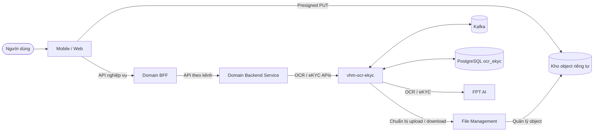

### 2.2.2 Sơ đồ thành phần

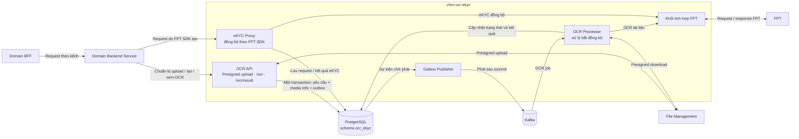

Đọc sơ đồ từ trái sang phải: OCR đi theo luồng bất đồng bộ
`Domain BFF → Domain Backend Service → OCR API → PostgreSQL/Outbox → Kafka → OCR Processor → FPT`;
eKYC đi theo luồng đồng bộ `Domain BFF → Domain Backend Service → eKYC Proxy → FPT` và
không đi qua Kafka/OCR Processor. Khi chuẩn bị upload, OCR API gọi File Management
và trả presigned URL qua Domain Backend Service/Domain BFF. Domain Backend Service là tên
vai trò bao quát; triển khai cụ thể có thể là `vhm-dossier-core` hoặc backend của miền khác.

### 2.2.3 Sơ đồ kiến trúc eKYC đồng bộ

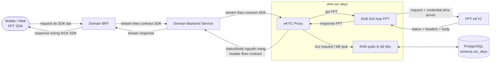

eKYC là luồng đồng bộ, không đi qua Transactional Outbox, Kafka, OCR Processor hoặc
File Management. Proxy phải tuân theo ranh giới lưu trữ và chính sách header tại
mục 6.5.2; sơ đồ không hàm ý HTTP FPT và PostgreSQL nằm trong cùng transaction.

### 2.2.4 Phân định trách nhiệm module

| **Component** | **Trách nhiệm** | **Dữ liệu quản lý** | **Lưu trữ** | **Giao tiếp ngoài component** |
| --- | --- | --- | --- | --- |
| OCR API | Chuẩn bị upload, tiếp nhận yêu cầu OCR và trả trạng thái/kết quả cho Domain Backend Service. | Yêu cầu OCR, tham chiếu media và outbox event trong cùng transaction. | PostgreSQL schema `ocr_ekyc` | Domain Backend Service và File Management; không phát Kafka trực tiếp trong request. |
| Outbox Publisher | Phát sự kiện OCR đã commit sang Kafka và ghi nhận kết quả phát. | Trạng thái phát sự kiện; không chứa media/PII. | PostgreSQL schema `ocr_ekyc` | PostgreSQL và Kafka; chấp nhận phát lặp theo mô hình at-least-once. |
| eKYC Proxy | Chuyển tiếp đồng bộ request do FPT SDK tạo; giữ nguyên status/body và header cần thiết theo contract. | Request/kết quả eKYC và metadata tương quan nội bộ. | PostgreSQL schema `ocr_ekyc` | Domain Backend Service và FPT; không đưa request eKYC vào Kafka. |
| OCR Processor | Nhận công việc OCR, tải media, gửi/thăm dò FPT và chuẩn hóa kết quả. | Trạng thái xử lý, kết quả OCR và metadata lần gọi FPT. | PostgreSQL schema `ocr_ekyc` | Kafka, File Management và FPT; không tiếp nhận request từ Mobile/Web. |
| Tích hợp FPT | Quản lý contract, thông tin xác thực, timeout và ánh xạ kỹ thuật với FPT. | Không sở hữu dữ liệu nghiệp vụ. | Không có kho riêng | Được OCR Processor và eKYC Proxy sử dụng; OCR được chuẩn hóa, eKYC tuân theo mục 6.5.2. |

### 2.2.5 Ranh giới tin cậy

| **Ranh giới** | **Mức tin cậy** | **Kiểm soát bắt buộc** | **Tiêu chí phê duyệt** |
| --- | --- | --- | --- |
| Mobile/Web → Domain BFF | Không tin cậy | OIDC/JWT, kiểm soát phiên/kênh, giới hạn tần suất/body | Domain BFF phải vượt kiểm thử xác thực và lạm dụng. |
| Domain BFF → Domain Backend Service | Zero Trust nội bộ | Danh tính workload/mTLS/JWT, audience/scope; truyền actor context có kiểm soát | Bắt buộc kiểm thử giả mạo actor context và sai phạm vi. |
| Domain Backend Service → `vhm-ocr-ekyc` | Zero Trust nội bộ | Danh tính workload/mTLS/JWT, audience/scope, chống phát lại; phân quyền business object trước lời gọi | Bắt buộc kiểm thử danh tính workload, IDOR và sai phạm vi. |
| Mobile/Web → kho riêng tư | Đầu vào media không tin cậy | Presigned PUT chính xác, hạn ngắn, checksum, không đọc/liệt kê | URL phải đi theo File Management → `vhm-ocr-ekyc` → Domain Backend Service → Domain BFF. |
| Service/processor → File Management/kho riêng tư | Hạn chế | Danh tính workload, TLS, phạm vi object và giới hạn byte | Bắt buộc kiểm thử truy cập chéo object và giới hạn dữ liệu. |
| Service/processor → FPT | Bên ngoài | TLS, endpoint cố định, credential bí mật, timeout, quota | Bắt buộc kiểm thử contract, timeout và quota. |
| Service → PostgreSQL/Kafka | Hạn chế | Mạng riêng, TLS/xác thực, đặc quyền tối thiểu | Bắt buộc có bằng chứng cấu hình và kiểm thử truy cập. |

## 2.3 Vòng đời OCR

### 2.3.1 Trạng thái công bố cho Domain Backend Service

Vòng đời OCR mà Domain Backend Service cần xử lý chỉ gồm năm trạng thái. Việc gửi hồ sơ, chờ FPT và
thăm dò kết quả là hoạt động nội bộ của processor, đều được biểu diễn ra ngoài bằng
`PROCESSING`.

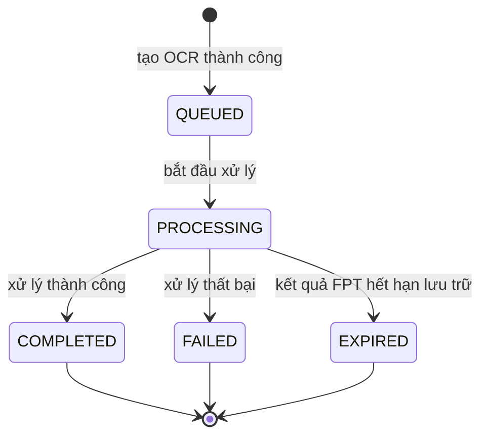

| **Trạng thái** | **Ý nghĩa** | **Kết quả** | **`errorCode`** |
| --- | --- | --- | --- |
| `QUEUED` | Đã tiếp nhận yêu cầu và đang chờ xử lý. | `null` | `null` |
| `PROCESSING` | Đang xử lý OCR; với hồ sơ Sale, trạng thái này bao gồm cả thời gian chờ và thăm dò FPT. | `null` | `null` |
| `COMPLETED` | Xử lý thành công. | Đầy đủ | `SUCCESS` |
| `FAILED` | Xử lý thất bại. | `null`; riêng lỗi sai loại tài liệu có thể giữ khối `completeness` theo contract FPT. | Mã lỗi xử lý |
| `EXPIRED` | Kết quả FPT đã hết thời hạn lưu trữ 30 ngày. | `null` | `SUCCESS` |

`status` là trường Domain Backend Service sử dụng để quyết định tiếp tục thăm dò hay kết thúc. Các
trường `currentStep`, `outcome` và `errorCode` chỉ cung cấp thêm ngữ cảnh, không tạo
thêm trạng thái vòng đời cho bên gọi.

### 2.3.2 Thời hạn xử lý

- OCR thường/CCCD: thời hạn xử lý tối đa 15 phút kể từ khi tiếp nhận; worker phải
  kết thúc an toàn khi vượt thời hạn.
- FPT Sale: deadline `5 phút`; worker kiểm tra trước mỗi lần thăm dò và chuyển sang
  `FAILED` với `errorCode=PROCESSING_TIMEOUT` khi vượt thời hạn.
- Ngân sách timeout phải được cấu hình theo từng thao tác và thỏa mãn thứ tự:
  timeout FPT < deadline `vhm-ocr-ekyc` < deadline Domain Backend Service < deadline Domain BFF < deadline Mobile/Web. Giá trị cụ
  thể phải được xác nhận bằng SLA FPT và kiểm thử tải trước production.

## 2.4 Tính nhất quán và Idempotency

### 2.4.1 Tạo tài nguyên và idempotency

- Header `Idempotency-Key` bắt buộc ở mọi request tạo OCR.
- PostgreSQL schema `ocr_ekyc` bảo đảm một khóa idempotency duy nhất trong từng nguồn.
- Dấu vân tay request bao gồm toàn bộ tham chiếu media của use case tương ứng.
- Cùng khóa/cùng request trả tài nguyên hiện hữu; cùng khóa khác request trả
  HTTP `409`, mã `40901`.
- Xử lý tạo đồng thời phải trả kết quả idempotent nhất quán và được kiểm thử tích hợp.

### 2.4.2 Transactional Outbox, Kafka và worker

- API phải ghi `ocr_ekyc_requests`, các `ocr_ekyc_media_refs` và một
  `ocr_ekyc_outbox_events` ở trạng thái chờ phát trong **cùng một transaction
  PostgreSQL**. API chỉ trả `202` sau khi transaction commit thành công.
- API không phát Kafka trực tiếp. Outbox Publisher chỉ đọc sự kiện đã commit, phát
  định danh OCR tối thiểu sang Kafka và chỉ đánh dấu đã phát sau khi broker xác nhận.
- Lỗi trước khi Kafka xác nhận phải để sự kiện ở trạng thái có thể phát lại. Lỗi sau
  khi Kafka nhận nhưng trước khi cập nhật outbox có thể tạo thông điệp trùng; đây là
  hành vi được dự kiến của mô hình at-least-once.
- Worker phải nhận quyền xử lý bằng cập nhật trạng thái có điều kiện. Thông điệp trùng
  không được tạo thêm lời gọi FPT hoặc ghi đè trạng thái/kết quả đã kết thúc.
- Sự kiện outbox chỉ chứa `eventId`, `ocrId`, loại sự kiện và phiên bản contract;
  không chứa media, presigned URL, PII, kết quả hoặc định danh giao dịch FPT.
- Sự kiện không phát được phải có backoff hữu hạn, cảnh báo theo tuổi bản ghi và
  quy trình xử lý sự kiện lỗi; không được xóa trước khi đạt chính sách lưu giữ.
- Khi FPT Sale chưa hoàn tất, worker giải phóng tài nguyên và ghi lịch thăm dò tiếp.

### 2.4.3 Ranh giới nhất quán

| **Thao tác** | **Yêu cầu nhất quán** | **Nguyên tắc** |
| --- | --- | --- |
| Tạo OCR | Yêu cầu, tham chiếu media và outbox event cùng commit hoặc cùng rollback | Không có OCR đã tiếp nhận nhưng thiếu công việc xử lý, hoặc sự kiện không có OCR tương ứng. |
| Phát Kafka | Chỉ phát outbox event đã commit; đánh dấu sau broker acknowledgement | Có thể phát lặp nhưng không được mất sự kiện. |
| Nhận xử lý | Chỉ một worker được quyền xử lý tại một thời điểm | Thông điệp trùng phải an toàn. |
| Gọi FPT | Không giữ transaction PostgreSQL trong khi chờ mạng | Giới hạn timeout và tài nguyên. |
| Hoàn tất | Kết quả và trạng thái kết thúc phải nhất quán | Không ghi đè kết quả đã kết thúc. |
| eKYC đồng bộ | Request đã lưu và kết quả trả SDK phải tương ứng cùng một lần gọi FPT | PostgreSQL và HTTP FPT không có transaction chung; quy tắc lỗi lưu tuân theo mục 6.5.2. |

### 2.4.4 Đối soát và phục hồi OCR

| **Trường hợp phát hiện** | **Hành vi phục hồi** | **Nguyên tắc an toàn** |
| --- | --- | --- |
| `QUEUED` quá thời gian chờ | Phát lại công việc theo cùng định danh OCR | Không tạo tài nguyên OCR hoặc lời gọi FPT mới nếu request đã được nhận xử lý. |
| `PROCESSING` nhưng chưa gửi FPT | Đưa yêu cầu về hàng đợi để worker khác tiếp tục | Chỉ thực hiện khi có bằng chứng request chưa rời khỏi hệ thống. |
| `PROCESSING` và FPT đã cấp mã giao dịch Sale | Tiếp tục thăm dò bằng đúng mã giao dịch đã lưu | Không gửi lại ba tài liệu và không tạo job FPT thứ hai. |
| `PROCESSING` nhưng không xác định FPT đã nhận hồ sơ Sale hay chưa | Kết thúc `FAILED` với `errorCode=PROVIDER_SUBMIT_OUTCOME_UNKNOWN`, đồng thời phát cảnh báo để đối soát | Không tự động gửi lại; chỉ tạo OCR mới sau khi đã xác nhận theo runbook. |
| Đã vượt deadline xử lý | Kết thúc `FAILED` với `errorCode=PROCESSING_TIMEOUT` | Không tiếp tục chiếm worker hoặc gọi FPT sau deadline. |
| Trạng thái đã kết thúc | Không xử lý lại | Kết quả/trạng thái kết thúc là bất biến. |

Bộ đối soát chỉ nhận quyền xử lý bằng cập nhật trạng thái có điều kiện và không giữ
tài nguyên xử lý hoặc transaction PostgreSQL trong thời gian chờ FPT.

# 3. Functional Requirements

## 3.1 Ma trận năng lực chức năng

| **FR ID** | **Năng lực** | **Yêu cầu** | **Tiêu chí nghiệm thu** |
| --- | --- | --- | --- |
| FR-001 | Chuẩn bị upload | `vhm-ocr-ekyc` kiểm tra role/MIME/size, tạo path do server kiểm soát, gọi File Management và trả presigned URL qua Domain Backend Service/Domain BFF | Bắt buộc kiểm thử allowlist, kích thước và path. |
| FR-002 | Media sẵn sàng | Chỉ chấp nhận managed path tồn tại và đúng metadata/checksum trước khi tạo OCR | Bắt buộc kiểm thử media giả mạo, thiếu và truy cập chéo. |
| FR-003 | Tạo OCR | Commit yêu cầu, tham chiếu media và outbox event trong cùng transaction; trả `202 + Retry-After: 3` sau commit | Bắt buộc kiểm thử rollback, phát lại outbox và Kafka trùng. |
| FR-004 | Idempotency | Cùng key/payload trả tài nguyên cũ; khác payload trả xung đột | Bắt buộc kiểm thử request tuần tự và đồng thời. |
| FR-005 | Định tuyến provider | FPT là provider duy nhất trong phạm vi tài liệu và được lưu trên OCR; caller không được tự đổi provider | Bắt buộc kiểm thử contract và không cho override. |
| FR-006 | Hồ sơ Sale | Đúng ba refs; FPT submit/poll 3 giây; deadline 5 phút | Bắt buộc kiểm thử đủ trạng thái và deadline. |
| FR-007 | Trạng thái | Trả lifecycle, outcome, error, next action và resource URI | Bắt buộc kiểm thử toàn bộ chuyển trạng thái hợp lệ. |
| FR-008 | Kết quả | Chỉ trả khi có kết quả đã mã hóa; nếu chưa có trả `409` | Bắt buộc kiểm thử phân quyền, giải mã và trạng thái chưa sẵn sàng. |
| FR-009 | OCR chuẩn hóa | Allowlist field/confidence/warning, không trả raw provider payload | Bắt buộc contract test theo schema kết quả chuẩn. |
| FR-010 | Kết quả Sale | Chỉ giữ các khối allowlist `processing_time_ms`, `completeness`, `documents`, `matching`, `signature_seal` trong `details` | Bắt buộc contract test với mọi trạng thái FPT Sale. |
| FR-011 | eKYC đồng bộ | FPT SDK gọi qua Domain BFF, Domain Backend Service và proxy; các hop trung gian stream có backpressure, service chèn credential, giữ nguyên status/body và chuyển tiếp end-to-end header theo ma trận contract | Bắt buộc E2E theo từng phiên bản SDK hỗ trợ, gồm cả non-2xx. |
| FR-012 | Lưu request/kết quả eKYC | Lưu request nghiệp vụ trước khi gọi FPT và lưu response FPT mã hóa; không lưu media raw/credential; lỗi lưu response không được thay response FPT hoặc kích hoạt gọi lại mutation | Bắt buộc kiểm thử lỗi DB trước/sau lời gọi FPT và cảnh báo vận hành. |
| FR-013 | Đối soát/phục hồi OCR | Phát hiện yêu cầu quá hạn, tiếp tục job FPT đã biết và không gửi lại khi kết quả lần gửi chưa rõ | Bắt buộc kiểm thử dừng worker và kết quả gửi không rõ. |
| FR-014 | Tương quan chủ thể | Lưu `subjectRef` opaque trong `ocr_ekyc.ocr_ekyc_requests` và dùng cùng `source`/`referenceId` cho kiểm soát phạm vi | Bắt buộc kiểm thử tương quan, phân quyền và idempotency. |

## 3.2 Quy tắc nghiệp vụ

| **Mã quy tắc** | **Quy tắc** |
| --- | --- |
| BR-001 | OCR/eKYC là capability kỹ thuật; domain chịu trách nhiệm authorize và apply kết quả. |
| BR-002 | `OCR_COMPLETED` không đồng nghĩa danh tính đã được xác minh. |
| BR-003 | Caller không được gửi provider credential, provider job ID hoặc raw provider URL. |
| BR-004 | Provider được pin tại create; không failover tự động giữa chừng. |
| BR-005 | CCCD hai mặt phải có front/back cùng request; không ghép media từ OCR khác. |
| BR-006 | Hồ sơ Sale phải có đúng CCCD trước, CCCD sau và PLHĐ. |
| BR-007 | Sale `signature_seal.WARNING` không tự chặn OCR completed; domain quyết định manual review. |
| BR-008 | Confidence chỉ là tín hiệu ưu tiên review, không là xác suất pháp lý đã hiệu chuẩn. |
| BR-009 | Kafka/event/log không chứa media path, raw media, result, credential hoặc PII. |
| BR-010 | eKYC mutation không tự retry sau timeout/unknown delivery. |
| BR-011 | Response eKYC phải tương thích wire contract FPT SDK theo mục 6.5.2; quyết định nghiệp vụ VHM phải được đặc tả riêng và không sửa status/body FPT. |
| BR-012 | Terminal OCR không bị xử lý lại bởi duplicate Kafka message. |
| BR-013 | File/path chỉ được tạo hoặc xác minh bởi `vhm-ocr-ekyc` theo managed prefix. |
| BR-014 | Chỉ chấp nhận `WEB/WEB`, `MOBILE/ANDROID`, `MOBILE/IOS`; luồng kênh bắt buộc đi `Mobile/Web → Domain BFF → Domain Backend Service → vhm-ocr-ekyc`. Domain BFF không bắt buộc cho backend process, nhưng mọi lời gọi capability vẫn đi qua Domain Backend Service. |

# 4. Non-Functional Requirements

Response Time chỉ áp dụng cho API OCR trả `202` và API đọc dữ liệu nội bộ. Thời gian
OCR chạy nền và eKYC chờ FPT được đo riêng; hai khoảng thời gian này không cộng vào
Response Time của API OCR.

| **Hạng mục** | **Chỉ số đo lường** | **Giá trị mục tiêu (Target)** | **Ghi chú** |
| --- | --- | --- | --- |
| NFR-001 — Tính sẵn sàng | Tỷ lệ HTTP request không trả `5xx` theo tháng | ≥99,9% | Đo tại service ingress bằng HTTP metric/Prometheus; không tính `4xx` do caller. Health/readiness probe phục vụ kiểm tra trạng thái instance. |
| NFR-002 — Response Time | Thời gian xử lý API OCR tạo/đọc tại `vhm-ocr-ekyc`, không gồm upload media và xử lý provider | p95 <2.000 ms | API tạo OCR commit request, media reference và outbox rồi trả `202`. Kiểm chứng bằng load test trên cấu hình production-like. |
| NFR-003 — Processing SLA OCR | Thời gian từ lúc tạo OCR đến processing deadline | OCR thường ≤900.000 ms; Sale OCR ≤300.000 ms | Đo riêng cho tác vụ chạy nền, không cộng vào Response Time của HTTP request. |
| NFR-004 — Timeout và giới hạn tích hợp | Connect timeout, response timeout, poll interval và kích thước request | FPT/eKYC: connect 2.000 ms, response 600.000 ms, request ≤20 MiB; FPT Sale: connect 2.000 ms, response 30.000 ms, poll 3.000 ms; File Management: connect 2.000 ms, read 30.000 ms, object ≤20 MiB | eKYC đồng bộ trả nguyên status/body của FPT và không tự retry mutation. |
| NFR-005 — Throughput | Tổng request/giây của API không mang media | ≥5.000 req/s | Không áp dụng cho upload/download media hoặc throughput FPT. Kiểm chứng bằng load test và tách kết quả theo từng endpoint. |
| NFR-006 — Tính toàn vẹn và idempotency | Xử lý request tạo OCR lặp và phát outbox | 100% request đồng thời hoặc tuần tự có cùng `source` + `Idempotency-Key` + payload trả lại cùng một OCR; cùng key nhưng khác payload trả `409`; Kafka producer `acks=all` và `enable.idempotence=true` | Request, media reference và outbox phải được ghi trong cùng transaction. Outbox quét mỗi 1.000 ms, tối đa 20 event/lần, lease 30 giây và phát lại sau 5 giây khi lỗi. |
| NFR-007 — Bảo vệ dữ liệu | Kết quả OCR/eKYC lưu trong PostgreSQL được mã hóa; giới hạn response FPT được lưu | 100% result được mã hóa AES-GCM trước khi persist; khóa AES dài 128/192/256 bit; response FPT chỉ được lưu khi ≤2 MiB | eKYC request body được stream tới FPT và không lưu raw media. |
| NFR-008 — Logging và observability | Correlation HTTP, endpoint quan sát và cấu hình ghi response body | 100% HTTP request có `X-Correlation-Id`; expose đúng 3 endpoint `health`, `info`, `prometheus`; không ghi response body của FPT trong production | Application log dùng ECS và MDC correlation ID. Dashboard sử dụng HTTP, JVM, database pool và function metric từ Prometheus. |
| NFR-009 — Kiểm thử | Kết quả test suite tại quality gate | 100% test phải pass; 0 test bị skip tại thời điểm nghiệm thu | Phạm vi test gồm unit, integration, contract, security và performance theo Mục 15. |

# 5. Technology Stack & Justification

| **Lĩnh vực** | **Giải pháp lựa chọn** | **Cơ sở lựa chọn** | **Đánh đổi/trạng thái** |
| --- | --- | --- | --- |
| Ứng dụng | Java 25, Spring Boot 4.1.0 | Theo baseline công nghệ của dự án VHM | Một image bất biến, cấu hình thành vai trò API và processor có thể mở rộng độc lập. |
| Cơ sở dữ liệu | PostgreSQL schema `ocr_ekyc` | Nguồn dữ liệu chính cho vòng đời và kết quả OCR/eKYC | Cần HA, PITR và chính sách lưu giữ được duyệt. |
| Thông điệp | Kafka | Tách thời gian xử lý OCR khỏi request nghiệp vụ | Yêu cầu consumer idempotent và giám sát độ trễ. |
| Tích hợp FPT | HTTPS API, contract có phiên bản | Quản lý tập trung thông tin xác thực, timeout và ánh xạ lỗi | Phụ thuộc SLA/quota/tính tương thích FPT. |
| Lưu trữ media | File Management và kho object riêng tư | `vhm-ocr-ekyc` lấy presigned URL; Mobile/Web upload trực tiếp, không truyền media qua Kafka hoặc lưu binary trong PostgreSQL | Cần checksum, thời hạn lưu và kiểm soát truy cập. |
| Mã hóa | Tiêu chuẩn mã hóa và quản lý khóa của VHM | Bảo vệ kết quả OCR/eKYC được lưu trữ | Cần bằng chứng quản lý/luân chuyển khóa trước production. |
| Quan sát hệ thống | Metric và log theo nền tảng VHM | Theo dõi API, outbox, Kafka, worker và FPT | Không ghi PII hoặc dữ liệu sinh trắc. |
| Tài liệu API | OpenAPI có phiên bản | Contract giữa Domain Backend Service và capability OCR/eKYC; contract kênh Domain BFF thuộc domain | Cần xuất bản đặc tả L3 trước go-live. |

## 5.1 ADR Log

| **ADR ID** | **Tiêu đề quyết định** | **Trạng thái** | **Ngày quyết định** | **Link chi tiết** |
| --- | --- | --- | --- | --- |
| ADR-001 | Tập trung tích hợp OCR/eKYC tại `vhm-ocr-ekyc` | Proposed | — | [Chi tiết](#adr-001-detail) |
| ADR-002 | OCR tài liệu bất đồng bộ qua queue/worker | Proposed | — | [Chi tiết](#adr-002-detail) |
| ADR-003 | eKYC đồng bộ, không enqueue hoặc tự retry mutation | Proposed | — | [Chi tiết](#adr-003-detail) |
| ADR-004 | PostgreSQL schema `ocr_ekyc` là nguồn dữ liệu chính | Proposed | — | [Chi tiết](#adr-004-detail) |
| ADR-005 | Chọn FPT khi tạo và lưu provider trên OCR | Proposed | — | [Chi tiết](#adr-005-detail) |
| ADR-006 | Kết quả OCR chuẩn với danh sách trường cố định | Proposed | — | [Chi tiết](#adr-006-detail) |
| ADR-007 | Lưu provider job và thăm dò định kỳ FPT Sale | Proposed | — | [Chi tiết](#adr-007-detail) |
| ADR-008 | Media qua File Management, chỉ lưu tham chiếu path | Proposed | — | [Chi tiết](#adr-008-detail) |
| ADR-009 | Lưu request/kết quả eKYC trong PostgreSQL | Proposed | — | [Chi tiết](#adr-009-detail) |
| ADR-010 | Một đơn vị triển khai với ranh giới logic API/worker | Proposed | — | [Chi tiết](#adr-010-detail) |
| ADR-011 | Proxy đồng bộ tương thích FPT SDK | Proposed | — | [Chi tiết](#adr-011-detail) |
| ADR-012 | Tuyến `Domain BFF → Domain Backend Service → vhm-ocr-ekyc` | Proposed | — | [Chi tiết](#adr-012-detail) |
| ADR-013 | Kafka làm broker cho OCR bất đồng bộ | Proposed | — | [Chi tiết](#adr-013-detail) |
| ADR-014 | Transactional Outbox bảo đảm nhất quán DB/broker | Proposed | — | [Chi tiết](#adr-014-detail) |

ADR ở trạng thái `Proposed` chưa có ngày quyết định. Ngày được ghi khi ADR chuyển
sang `Accepted`; ADR bị thay thế hoặc không còn áp dụng chuyển sang `Deprecated`.
Danh mục trạng thái đầy đủ được quản lý tại Phụ lục D.

## 5.2 Trade-off Analysis

`Phương án được chọn` là phương án thiết kế áp dụng cho TDD này; trạng thái phê
duyệt của từng quyết định được quản lý tại Phụ lục D.

| **ADR ID** | **Vấn đề cần quyết định** | **Phương án A (Ưu-Nhược)** | **Phương án B (Ưu-Nhược)** | **Phương án được chọn** | **Lý do** |
| --- | --- | --- | --- | --- | --- |
| <a id="adr-001-detail"></a>ADR-001 | Vị trí sở hữu tích hợp FPT | **Tập trung tại `vhm-ocr-ekyc`** — Ưu: một nơi quản lý credential, contract, quota và ánh xạ lỗi; giảm lặp giữa các miền. Nhược: trở thành phụ thuộc dùng chung, phải bảo đảm HA và capacity. | **Mỗi Domain Backend Service gọi FPT trực tiếp** — Ưu: miền tự chủ triển khai. Nhược: phân tán credential, lặp adapter, khó giữ contract và chính sách bảo mật nhất quán. | Phương án A | FPT là năng lực dùng chung; ranh giới tích hợp và thông tin xác thực phải được quản lý tập trung. |
| <a id="adr-002-detail"></a>ADR-002 | Mô hình xử lý OCR tài liệu | **Bất đồng bộ qua queue/worker** — Ưu: API trả sớm, cô lập độ trễ/quota FPT, worker mở rộng độc lập. Nhược: eventual consistency, cần trạng thái, retry và vận hành queue. | **Đồng bộ trong HTTP request** — Ưu: luồng đơn giản, có kết quả ngay nếu FPT trả nhanh. Nhược: giữ kết nối lâu, dễ timeout và lan truyền sự cố FPT tới caller. | Phương án A | OCR không cần phản hồi tức thời trong cùng request và thời gian xử lý provider có thể kéo dài. |
| <a id="adr-003-detail"></a>ADR-003 | Mô hình xử lý các thao tác FPT eKYC SDK | **Đồng bộ proxy status/body FPT** — Ưu: tương thích cách SDK điều phối phiên và xử lý response. Nhược: giữ kết nối, cần timeout và capacity chặt chẽ. | **Bất đồng bộ qua queue, callback hoặc polling** — Ưu: tách caller khỏi thời gian xử lý. Nhược: thay đổi contract SDK, không trả được response FPT trong cùng thao tác và làm phức tạp quản lý phiên. | Phương án A | FPT SDK yêu cầu response đồng bộ cho từng bước init, OCR, liveness và NFC. |
| <a id="adr-004-detail"></a>ADR-004 | Nguồn dữ liệu chính cho vòng đời OCR/eKYC | **PostgreSQL schema `ocr_ekyc`** — Ưu: transaction quan hệ, ràng buộc duy nhất, truy vấn trạng thái và Transactional Outbox trong cùng DB. Nhược: cần HA/PITR, capacity planning và quản lý tăng trưởng. | **DynamoDB** — Ưu: mở rộng ngang và vận hành hạ tầng thấp. Nhược: mô hình truy vấn/ràng buộc khác, tăng độ phức tạp cho transaction/outbox và tạo thêm phụ thuộc nền tảng. | Phương án A | Vòng đời, idempotency và outbox cần transaction nhất quán; không cần thêm một mô hình lưu trữ riêng. |
| <a id="adr-005-detail"></a>ADR-005 | Cách lựa chọn provider OCR | **FPT do capability quản lý và cố định trên OCR khi tạo** — Ưu: retry/định tuyến xác định, caller không phụ thuộc provider. Nhược: không tự động chuyển provider khi FPT lỗi. | **Caller chọn provider hoặc đổi provider khi retry** — Ưu: linh hoạt định tuyến/failover. Nhược: lộ chi tiết provider, kết quả không đồng nhất và khó kiểm soát credential/contract. | Phương án A | TDD chỉ định FPT là provider duy nhất và không cho phép failover mù quáng giữa một vòng đời OCR. |
| <a id="adr-006-detail"></a>ADR-006 | Contract kết quả OCR trả cho domain | **Kết quả chuẩn VHM** — Ưu: ổn định contract, giới hạn dữ liệu công bố và giảm vendor lock-in ở caller. Nhược: cần mapping/versioning khi FPT thay đổi. | **Trả nguyên payload FPT** — Ưu: ít mapping, tiếp cận đầy đủ trường provider. Nhược: caller phụ thuộc schema FPT, tăng phạm vi PII và rủi ro breaking change. | Phương án A | Domain chỉ cần contract nghiệp vụ ổn định, không cần biết cấu trúc nội bộ của FPT. |
| <a id="adr-007-detail"></a>ADR-007 | Theo dõi kết quả OCR hồ sơ Sale | **Lưu provider job ID và polling định kỳ** — Ưu: chủ động tra cứu, phục hồi được sau restart và không phụ thuộc việc callback được giao thành công. Nhược: phát sinh polling traffic và có độ trễ theo chu kỳ poll. | **Webhook/callback từ FPT** — Ưu: giảm độ trễ nhận kết quả và số lần polling. Nhược: khi bật callback, VHM và FPT phải thống nhất cơ chế xác thực cho chiều lấy token và chiều gửi callback, đồng thời xử lý idempotency, retry và chống replay. | Phương án A; callback là tín hiệu bổ sung | FPT có hỗ trợ callback. Polling theo `request_id` được giữ làm đường đối soát khi callback bị trễ, gửi lặp hoặc không đến. |
| <a id="adr-008-detail"></a>ADR-008 | Vận chuyển và lưu trữ media OCR | **File Management/object storage riêng tư, chỉ truyền path** — Ưu: không đưa binary vào PostgreSQL/Kafka, hỗ trợ upload trực tiếp và kiểm soát thời hạn truy cập. Nhược: phụ thuộc presigned URL, checksum và vòng đời object. | **Nhúng media vào DB, API OCR hoặc Kafka** — Ưu: giảm một bước tham chiếu. Nhược: tăng payload, memory, dung lượng DB/broker và phạm vi dữ liệu nhạy cảm. | Phương án A | Media lớn và nhạy cảm phải tách khỏi dữ liệu giao dịch và message điều phối. |
| <a id="adr-009-detail"></a>ADR-009 | Có lưu request/kết quả eKYC hay không | **Lưu metadata request và response FPT đã mã hóa** — Ưu: đối soát, truy vết trạng thái và cung cấp kết quả qua service VHM. Nhược: tăng dữ liệu nhạy cảm, yêu cầu mã hóa và chính sách lưu giữ/xóa. | **Chỉ proxy, không lưu kết quả** — Ưu: giảm lưu trữ và phạm vi dữ liệu. Nhược: không có nguồn kết quả phía VHM để đối soát hoặc phục vụ bước nghiệp vụ sau. | Phương án A | Kết quả cuối phải được lấy qua service VHM; dữ liệu lưu phải tuân thủ mã hóa và retention. |
| <a id="adr-010-detail"></a>ADR-010 | Ranh giới triển khai API và processor | **Một artifact/deployable với hai vai trò logic** — Ưu: dùng chung domain/contract và giảm chi phí phát hành ban đầu; mỗi vai trò vẫn có thể scale riêng bằng cấu hình triển khai. Nhược: cần giữ ranh giới package và kiểm soát tài nguyên theo vai trò. | **Hai service/artifact độc lập** — Ưu: cô lập release và failure domain rõ hơn. Nhược: tăng pipeline, versioning contract và chi phí vận hành. | Phương án A | Chưa có nhu cầu tách vòng đời phát hành; ranh giới logic đủ để triển khai và scale API/processor độc lập. |
| <a id="adr-011-detail"></a>ADR-011 | Hình thức proxy eKYC cho FPT SDK | **Giữ nguyên status/body và allowlist header** — Ưu: tương thích SDK, không làm sai semantic FPT. Nhược: chuỗi VHM phải kiểm thử theo phiên bản SDK/FPT. | **Bọc envelope và chuẩn hóa response** — Ưu: đồng nhất API VHM. Nhược: làm thay đổi wire contract mà SDK sử dụng và có thể phá vỡ phiên eKYC. | Phương án A | Tương thích SDK quan trọng hơn việc đồng nhất envelope của API OCR. |
| <a id="adr-012-detail"></a>ADR-012 | Tuyến gọi từ Mobile/Web tới capability | **Domain BFF → Domain Backend Service → `vhm-ocr-ekyc`** — Ưu: BFF xử lý concern theo kênh, domain giữ business authorization/context. Nhược: thêm network hop và ngân sách timeout. | **Domain BFF gọi thẳng `vhm-ocr-ekyc`** — Ưu: ít hop và giảm latency. Nhược: bỏ qua ranh giới nghiệp vụ của domain và đẩy business authorization vào capability dùng chung. | Phương án A | Domain Backend Service phải sở hữu quyền nghiệp vụ và ngữ cảnh trước khi gọi capability OCR/eKYC. |
| <a id="adr-013-detail"></a>ADR-013 | Broker cho luồng OCR bất đồng bộ | **Kafka** — Ưu: durable log, replay, partitioning và scale consumer; phù hợp event/outbox. Nhược: vận hành phức tạp hơn và consumer phải idempotent. | **RabbitMQ** — Ưu: work queue/routing và acknowledgement trực quan. Nhược: replay lịch sử và mô hình retained event kém phù hợp hơn cho điều phối/reconciliation. | Phương án A | Luồng cần lưu vết event, replay và mở rộng consumer theo partition bên cạnh cơ chế outbox. |
| <a id="adr-014-detail"></a>ADR-014 | Bảo đảm nhất quán giữa PostgreSQL và broker | **Transactional Outbox** — Ưu: request, trạng thái và event commit trong một DB transaction; publisher có thể retry. Nhược: tăng độ trễ nhỏ, cần lease, cleanup và giám sát backlog. | **Publish trực tiếp sau khi ghi DB** — Ưu: ít thành phần và độ trễ thấp hơn. Nhược: dual-write gap có thể làm DB đã commit nhưng event bị mất, hoặc event phát khi transaction thất bại. | Phương án A | Không chấp nhận mất công việc OCR tại ranh giới commit DB và publish broker. |

# 6. Integration Architecture

## 6.1 Danh mục giao diện tích hợp

| **ID** | **Mô tả** | **Contract** | **Nguồn** | **Đích** | **Giao thức** | **Chế độ** | **Dữ liệu chính** |
| --- | --- | --- | --- | --- | --- | --- | --- |
| API-01 | Tạo OCR một hoặc nhiều tài liệu | `POST /ocr` | Domain Backend Service | `vhm-ocr-ekyc` | HTTPS/JSON | Đồng bộ tiếp nhận; xử lý bất đồng bộ | Ngữ cảnh opaque, loại OCR, tham chiếu media, `Idempotency-Key` |
| API-02 | Thăm dò trạng thái và nhận kết quả OCR | `/ocr/result` | Domain Backend Service | `vhm-ocr-ekyc` | HTTPS/JSON | Đồng bộ | Định danh OCR, trạng thái, lỗi và kết quả chuẩn |
| UPLOAD-01 | Chuẩn bị presigned upload; route chi tiết thuộc đặc tả L3 | Domain Backend Service → `vhm-ocr-ekyc` → File Management | Domain Backend Service | File Management qua `vhm-ocr-ekyc` | HTTPS/JSON | Đồng bộ | Metadata file, presigned URL/headers và `s3PathFile`; không truyền media bytes |
| EVT-01 | Điều phối OCR sau khi tiếp nhận | `vhm.ocr-ekyc.job.created.v1` | Outbox Publisher | OCR Processor qua Kafka | Kafka | Bất đồng bộ | `eventId`, định danh OCR và phiên bản contract |
| FPT-01 | Nhận dạng một tài liệu | Contract FPT được quản lý nội bộ | OCR Processor | FPT | HTTPS/multipart | Đồng bộ bên trong luồng OCR bất đồng bộ | Media tài liệu và kết quả FPT |
| FPT-02 | Gửi và thăm dò hồ sơ Sale | Contract FPT được quản lý nội bộ | OCR Processor | FPT | HTTPS/multipart/JSON | Bất đồng bộ theo nghiệp vụ | Ba tài liệu, mã giao dịch nội bộ và kết quả FPT |
| EKYC-01 | Proxy các thao tác do FPT SDK điều phối | Nhóm API tại mục 6.5 | FPT SDK qua Domain BFF và Domain Backend Service | FPT qua `vhm-ocr-ekyc` | HTTPS/JSON hoặc multipart | Đồng bộ | Request SDK; status/body FPT và end-to-end header theo ma trận contract |

## 6.2 Contract API OCR VHM

Contract OCR mà `vhm-ocr-ekyc` công bố cho Domain Backend Service chỉ gồm hai đường dẫn: `POST /ocr` để tạo yêu cầu
và `/ocr/result` để thăm dò trạng thái/nhận kết quả. Không công bố endpoint OCR
riêng theo use case hoặc endpoint tài nguyên chứa định danh trên path.

Mọi response OCR và chuẩn bị upload thành công dùng envelope:

```json
{"code": 0, "msg": "success", "data": {}, "meta": null}
```

Lỗi dùng `data=null`; `meta` chứa `correlationId` và chi tiết kiểm tra. Thao tác tạo
trả HTTP `202` và `Retry-After: 3`.

### 6.2.1 Tạo một tài liệu

```http
POST /ocr
Idempotency-Key: <opaque-key>
Content-Type: application/json

{
  "source": "DOSSIER",
  "referenceId": "opaque-business-ref",
  "requestBy": "opaque-actor-ref",
  "subjectRef": "opaque-subject-ref",
  "channel": "WEB",
  "platform": "WEB",
  "documentType": "NATIONAL_ID",
  "s3PathFile": "ocr-media/dossier/opaque-ref/ocr_document/file.jpg"
}
```

FPT là nhà cung cấp duy nhất thuộc contract TDD này. Production không cho bên gọi tự
chọn nhà cung cấp qua query parameter. Danh sách loại tài liệu cho phép theo bên
gọi/use case phải được đặc tả trong OpenAPI L3 và cưỡng chế trước khi tạo OCR.

### 6.2.2 Tạo OCR hồ sơ nhiều tài liệu

Hồ sơ nhiều tài liệu sử dụng cùng `POST /ocr`, không có endpoint riêng theo use
case. Domain Backend Service gửi loại OCR, ngữ cảnh nghiệp vụ và ba tham chiếu tài liệu gồm CCCD mặt
trước, CCCD mặt sau và PLHĐ. Dịch vụ ghi nhận một tài nguyên OCR duy nhất, bảo toàn
vai trò của từng tài liệu và áp dụng thời hạn xử lý 5 phút.

### 6.2.3 Trạng thái/kết quả

Dữ liệu trạng thái:

```json
{
  "ocrId": "0198...",
  "type": "OCR",
  "status": "PROCESSING",
  "currentStep": "POLL_PROVIDER",
  "outcome": null,
  "errorCode": null,
  "resultAvailable": false,
  "result": null,
  "nextAction": "POLL",
  "updatedAt": "2026-08-14T03:00:00Z"
}
```

`nextAction`: kết quả có sẵn → `CONFIRM_AND_APPLY`; kết thúc không có kết quả →
`RETRY`; còn lại → `POLL`. Khi OCR chưa kết thúc, `/ocr/result` trả trạng thái
gần nhất và `result=null` để Domain Backend Service tiếp tục thăm dò.

## 6.3 Contract presigned upload

Mobile/Web không gọi File Management trực tiếp. Mobile/Web gửi yêu cầu qua Domain BFF tới
Domain Backend Service; Domain Backend Service gọi `vhm-ocr-ekyc`, service kiểm tra
metadata và gọi File Management để nhận presigned URL rồi trả ngược qua hai tầng.
Đầu vào logic gồm `source`, `referenceId`,
`role`, `fileName`, `contentType`, `fileSize`; route chi tiết thuộc đặc tả L3.

- Role allowlist: `OCR_DOCUMENT`, `DOCUMENT_FRONT`, `DOCUMENT_BACK`, `LABOR_CONTRACT`.
- MIME allowlist bắt buộc: `image/jpeg`, `image/png`, `application/pdf`.
- Path do server tạo:
  `<basePath>/<source>/<referenceId>/<role>/<slug>_<UUIDv7>.<ext>`.
- Response: `presignedUrl`, `presignHeaders`, `s3PathFile`.
- TDD contract chỉ cho persist/truyền `s3PathFile`; không persist presigned URL.

## 6.4 Contract với FPT

### 6.4.1 FPT ID Recognition

- Worker gọi năng lực nhận dạng giấy tờ của FPT thông qua lớp tích hợp nội bộ.
- Endpoint và thông tin xác thực FPT được quản lý theo cấu hình môi trường, không
  thuộc contract L2 công bố cho bên sử dụng VHM.
- Lời gọi FPT là đồng bộ bên trong luồng OCR bất đồng bộ của VHM.

### 6.4.2 FPT OCR hồ sơ Sale

| **Thao tác** | **Contract** | **Hành vi worker** |
| --- | --- | --- |
| Đăng ký | Gửi đúng ba tài liệu CCCD trước, CCCD sau và PLHĐ | FPT tiếp nhận thành công và trả `request_id` → lưu mã giao dịch nội bộ |
| Kết quả đơn | Truy vấn theo `request_id` | Thăm dò mỗi 3 giây |
| Kết quả lô | FPT hỗ trợ truy vấn tối đa 100 ID | Không sử dụng trong baseline VHM; chỉ đánh giá khi có nhu cầu dung lượng được duyệt |
| Kết thúc | `COMPLETED`, `FAILED`; `EXPIRED` sau thời hạn lưu | Ánh xạ thành công/kết quả hoặc lỗi FPT |
| Giới hạn | 20 MB/file, 60 MB/request, xử lý 5 phút | Phải cưỡng chế kiểm tra media/dung lượng xuyên suốt |

Luồng tích hợp giữ nguyên mô hình bất đồng bộ: VHM gửi hồ sơ, nhận `request_id`,
sau đó chủ động thăm dò FPT theo chu kỳ tối thiểu 3 giây cho tới trạng thái kết
thúc. FPT có hỗ trợ callback; khi bật callback, VHM và FPT phải thống nhất cơ chế
xác thực cho chiều lấy token và chiều gửi callback. Callback phải được xử lý
idempotent; tra cứu theo `request_id` vẫn là đường đối soát khi callback bị trễ,
gửi lặp hoặc không đến.

| **Trạng thái FPT** | **Ý nghĩa** | **Khối kết quả** | **`error_code`** | **Ánh xạ vòng đời VHM** |
| --- | --- | --- | --- | --- |
| `QUEUED` | FPT đã tiếp nhận hồ sơ và đang chờ xử lý | `null` hoặc mảng rỗng | `SUCCESS` | Giữ OCR ở `PROCESSING` và tiếp tục thăm dò. |
| `PROCESSING` | FPT đang thực hiện OCR | `null` hoặc mảng rỗng | `SUCCESS` | Giữ OCR ở `PROCESSING` và tiếp tục thăm dò. |
| `COMPLETED` | FPT xử lý thành công | Đầy đủ các khối kết quả | `SUCCESS` | Chuẩn hóa, lưu kết quả và kết thúc OCR thành công. |
| `FAILED` | FPT xử lý thất bại | Thông thường `null` hoặc mảng rỗng; riêng `DOCUMENT_TYPE_MISMATCH` có `completeness` | Mã lỗi xử lý của FPT | Chuyển OCR sang `FAILED` và lưu mã lỗi FPT. |
| `EXPIRED` | Kết quả đã quá hạn lưu trữ 30 ngày kể từ khi nộp | `null` hoặc mảng rỗng | `SUCCESS` | Chuyển OCR sang `EXPIRED`, không coi là OCR thành công. |

`error_code=SUCCESS` chỉ thể hiện request lấy trạng thái thành công. Quyết định kết
thúc OCR phải dựa đồng thời vào `status`; đặc biệt `QUEUED`, `PROCESSING` và
`EXPIRED` không được ánh xạ thành kết quả OCR thành công.

Response FPT khi hoàn tất chứa `completeness`, `documents`, `matching` và
`signature_seal`. `matching.status` gồm `MATCH`, `MISMATCH`, `NEW`; exact,
similarity và fuzzy dealer mapping là hành vi FPT, không được VHM tự suy
diễn lại. Cảnh báo chữ ký/con dấu chỉ là bằng chứng hỗ trợ rà soát.

## 6.5 Contract proxy eKYC tương thích FPT SDK

FPT SDK chạy trên Mobile/Web và được cấu hình gọi theo tuyến
`Domain BFF → Domain Backend Service → vhm-ocr-ekyc`. Service làm proxy đồng bộ tới FPT,
quản lý credential phía server và không điều phối
thứ tự các bước thay SDK. Contract proxy và việc lưu PostgreSQL là hai trách nhiệm
riêng: lỗi lưu sau khi nhận response không được làm thay đổi response dành cho SDK.

### 6.5.1 Danh mục API eKYC VHM

Các đường dẫn dưới đây là contract giữa Domain Backend Service và `vhm-ocr-ekyc`;
contract presentation giữa Domain BFF và Domain Backend Service thuộc từng miền. Đây không phải
endpoint OCR document bất đồng bộ tại mục 6.2 và không công bố địa chỉ downstream
của FPT.

| **Thao tác** | **API VHM** | **Đầu vào chính từ FPT SDK** | **Vai trò trong phiên** |
| --- | --- | --- | --- |
| Khởi tạo phiên | `POST /v1/ekyc-sdk/init_session` | JSON metadata thiết bị; `device-type`; tùy chọn `client_uuid`, `only-engine`, `sdk-version` | Nhận cấu hình SDK, thời hạn và `session-id` cho hành trình eKYC. |
| OCR giấy tờ eKYC | `POST /v1/ekyc-sdk/ocr` | Multipart `files`; `session-id`, `device-type`, `document-type`; tùy chọn `side-type`, `lang`, `get-detail-response`, `sdk-version` | Trích xuất giấy tờ trong phiên; hai mặt phải giữ thứ tự mặt trước rồi mặt sau. |
| Liveness và face match | `POST /v1/ekyc-sdk/face/liveness` | Multipart dùng `selfies` hoặc `video`; `session-id`, `device-type`; tùy chọn `auto`, `lang`, `sdk-version` | Kiểm tra sống và đối sánh khuôn mặt với giấy tờ đã OCR trong cùng phiên. |
| Kiểm tra NFC | `POST /v1/ekyc-sdk/check_chip` | JSON các data group NFC; `session-id`, `device-type`, `auto`; tùy chọn `lang`, `sdk-version` | Kiểm tra dữ liệu chip trong phiên trên kênh Mobile được hỗ trợ. |

`api-key` FPT không thuộc contract Domain BFF/Domain Backend Service và không được gửi từ Mobile/Web. Thông tin
xác thực này được `vhm-ocr-ekyc` bổ sung ở biên tích hợp. Bốn thao tác trên là đồng
bộ; SDK quyết định thứ tự gọi và xử lý response.

FPT eKYC hỗ trợ callback server-to-server và API Get Result. Khi bật callback, VHM
và FPT phải thống nhất cơ chế xác thực cho chiều lấy token và chiều gửi callback.
Với topology proxy, response FPT được lưu tại `vhm-ocr-ekyc`; callback và Get Result
là đường đối soát phía server, không phải API công bố cho Mobile/Web. Request
nghiệp vụ được ghi nhận trước khi gọi FPT; response FPT được lưu trong cùng vòng
xử lý theo quy tắc nhất quán dưới đây.

### 6.5.2 Quy tắc request/response và lưu trữ

| **Nội dung** | **Contract bắt buộc** |
| --- | --- |
| Request tới FPT | Domain BFF và Domain Backend Service stream có backpressure, không full-buffer hoặc dựng lại body. `vhm-ocr-ekyc` giữ nguyên method, path logic, body/multipart và các end-to-end header được liệt kê theo từng thao tác/phiên bản SDK; xác thực workload Domain Backend Service, loại credential phía client và tự chèn credential FPT. |
| Response về SDK | Giữ nguyên HTTP status và body FPT; không bọc envelope, đổi mã lỗi hoặc chuẩn hóa payload. Chỉ chuyển tiếp end-to-end header thuộc allowlist của contract SDK. |
| Header không được chuyển tiếp | Không chuyển tiếp hop-by-hop header (`Connection`, `Keep-Alive`, `Transfer-Encoding`, `TE`, `Trailer`, `Upgrade`, `Proxy-*`), `Host`, `Content-Length` gốc, credential/cookie hoặc header nội bộ VHM. `Content-Length` phải do HTTP stack tính lại. |
| Ma trận header | L3 `INT-01` phải ghim allowlist request/response cho từng API và phiên bản Android/iOS/Web. Tối thiểu bảo toàn `Content-Type` và các header phiên/thiết bị mà SDK/FPT quy định; thay đổi allowlist phải qua kiểm thử contract. |
| Lưu trước khi gọi FPT | Lưu request nghiệp vụ và metadata tương quan trong PostgreSQL. Nếu bước này thất bại thì không gọi FPT và trả lỗi dịch vụ theo contract VHM. Media raw, credential và header bị loại không được lưu. |
| Lưu sau khi FPT trả response | Lưu status, tập header được phép và body response mã hóa, liên kết đúng request/lần gọi FPT. Việc lưu có ngân sách thời gian hữu hạn và không được gọi lại FPT mutation. |
| Lỗi lưu response | Khi đã nhận response FPT, proxy vẫn trả chính status/body và header hợp lệ đó cho SDK. Lỗi lưu phải phát metric/cảnh báo tức thời và được xử lý theo runbook; không thể tuyên bố tính nguyên tử giữa HTTP FPT và PostgreSQL. |

### 6.5.3 INT-01 — Nguyên tắc tương thích phiên FPT eKYC

Một hành trình eKYC do FPT SDK điều phối và phải giữ thống nhất ngữ cảnh phiên giữa
các bước khởi tạo, OCR giấy tờ và kiểm tra sống/đối sánh khuôn mặt.

- Domain BFF, Domain Backend Service và `vhm-ocr-ekyc` không đổi tên hoặc dựng lại dữ liệu mà SDK/FPT cần để duy trì
  phiên và phân tích response, ngoại trừ việc loại các header bị cấm tại mục 6.5.2.
- Thông tin phiên/kênh/thiết bị do SDK gửi được chuyển tiếp theo contract của phiên
  bản SDK hỗ trợ; credential FPT chỉ được chèn tại `vhm-ocr-ekyc`.
- Status/body FPT và các header thuộc allowlist được chuyển tiếp trên cả nhánh thành
  công và lỗi để callback/parser của SDK xử lý đúng contract.
- Không tự thử lại thao tác làm thay đổi phiên khi chưa biết FPT đã nhận request hay chưa.
- Ma trận phiên bản Android/iOS/Web và contract request/response được kiểm thử E2E
  trước khi phát hành phiên bản client tương ứng.

## 6.6 Mô hình kết quả chuẩn

OCR thường:

```json
{
  "provider": "FPT",
  "documentType": "NATIONAL_ID",
  "providerCode": "0",
  "providerMessage": "",
  "fields": {"idNumber": "...", "fullName": "..."},
  "confidence": {"idNumber": 0.98},
  "warnings": [],
  "valid": true,
  "details": null
}
```

Các khóa chuẩn cố định: `idNumber`, `fullName`, `dateOfBirth`, `gender`, `address`,
`hometown`, `issueDate`, `expiryDate`, `issuePlace`, `nationality`. Thiếu
`idNumber`/`fullName` tạo warning và `valid=false`.

Kết quả Sale giữ `fields/confidence/warnings` rỗng và đặt các khối FPT thuộc
danh sách cho phép vào `details`. `request_id` thô và trường ngoài danh sách không được sao chép.

## 6.7 Contract lỗi chuẩn

| **HTTP/mã lỗi** | **Ý nghĩa** |
| --- | --- |
| `400 / 40000` | Lỗi kiểm tra/header/đường dẫn media |
| `403 / 40300` | Bị từ chối do không đủ quyền hoặc sai phạm vi truy cập |
| `404 / 40400` | Không tìm thấy OCR |
| `409 / 40900` | Kết quả chưa sẵn sàng/xung đột |
| `409 / 40901` | Tái sử dụng idempotency key với payload khác |
| `413 / 41300` | Multipart/media vượt giới hạn |
| `502 / 50200` | Lỗi FPT |
| `503 / 50300` | Phụ thuộc không sẵn sàng |
| `504 / 50400` | FPT hết thời gian chờ |
| `500 / 50000` | Lỗi nội bộ ngoài dự kiến |

Lỗi phía FPT trong OCR bất đồng bộ không trả 5xx cho thao tác tạo; Domain Backend Service nhận
`status=FAILED`, `result=null` và `errorCode=<canonical/provider code>` khi thăm dò
`/ocr/result`.

# 7. Data Architecture & Data Flow

## 7.1 Data Model

### 7.1.1 Sở hữu dữ liệu logic

PostgreSQL schema `ocr_ekyc` là nguồn dữ liệu chính cho vòng đời và kết quả OCR/eKYC.
TDD L2 chỉ mô tả vai trò của các bảng;
cấu trúc cột, index và migration chi tiết thuộc đặc tả L3 của CSDL.

| **Bảng PostgreSQL** | **Mục đích** | **Phân loại** | **Kiểm soát kiến trúc** |
| --- | --- | --- | --- |
| `ocr_ekyc.ocr_ekyc_requests` | Yêu cầu OCR/eKYC, tham chiếu nghiệp vụ, provider, trạng thái và request eKYC đã mã hóa | Metadata/dữ liệu nhạy cảm | Bắt buộc lưu `subjectRef`; request eKYC loại media raw, credential và header bị cấm trước khi mã hóa. |
| `ocr_ekyc.ocr_ekyc_media_refs` | Tham chiếu object media theo vai trò và thứ tự tài liệu | Dữ liệu nhạy cảm | Không lưu binary/presigned URL; kiểm soát truy cập và thời hạn lưu. |
| `ocr_ekyc.ocr_ekyc_results` | Kết quả OCR chuẩn; status, header được phép và body response eKYC | PII/sinh trắc hạn chế | Mã hóa, phân quyền và lưu giữ theo mục đích. |
| `ocr_ekyc.ocr_ekyc_provider_calls` | Metadata kỹ thuật của các lần gọi FPT | Metadata vận hành | Không công bố ID FPT; giới hạn truy cập và thời hạn lưu. |
| `ocr_ekyc.ocr_ekyc_outbox_events` | Sự kiện điều phối OCR được ghi cùng transaction tạo/cập nhật yêu cầu | Metadata nội bộ | Trạng thái phát, lịch thử lại và tính duy nhất của `eventId`; payload không chứa media, kết quả, PII hoặc ID FPT. |

`subjectRef` phải được lưu cùng tài nguyên OCR và tham gia kiểm soát tương quan,
phân quyền theo phạm vi nghiệp vụ.

### 7.1.2 Sơ đồ quan hệ dữ liệu logic

ERD dưới đây thể hiện khóa và thuộc tính chính phục vụ rà soát kiến trúc. Kiểu dữ
liệu, ràng buộc, index và migration chi tiết thuộc thiết kế CSDL mức L3. Tất cả
entity nằm trong PostgreSQL schema `ocr_ekyc`.

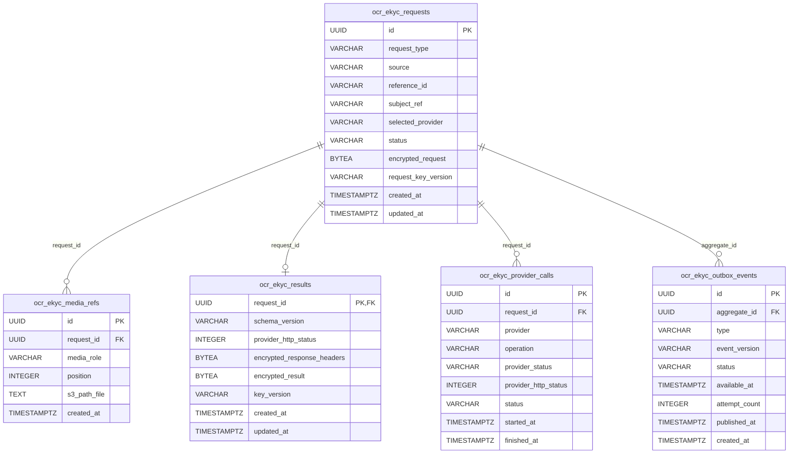

## 7.2 Data Flow Diagram

### 7.2.1 Luồng điều khiển/dữ liệu OCR

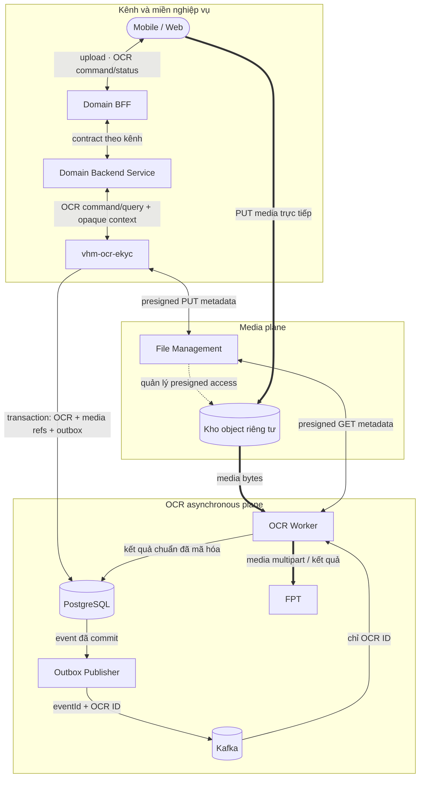

### 7.2.2 Luồng eKYC đồng bộ

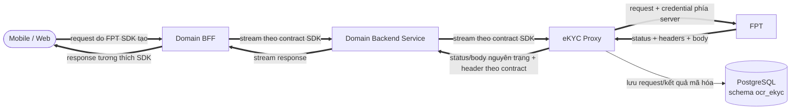

Ký hiệu `==>` biểu diễn luồng có media hoặc response nhạy cảm. Dữ liệu này phải
được giới hạn kích thước, không ghi log và không lưu ngoài mục đích đã duyệt.

## 7.3 Data Privacy & PII

### 7.3.1 Checklist dữ liệu cá nhân

Hệ thống có xử lý dữ liệu cá nhân. `Có` trong bảng dưới đây nghĩa là loại dữ liệu
nằm trong input, media hoặc result contract của một trong các flow OCR/eKYC; dữ
liệu không phục vụ các flow này không được thu thập thêm.

| **Loại dữ liệu cá nhân** | **Phân nhóm** | **Có/Không** |
| --- | --- | --- |
| Họ, chữ đệm, tên khai sinh; tên gọi khác | Cơ bản | Có |
| Ngày, tháng, năm sinh | Cơ bản | Có |
| Giới tính | Cơ bản | Có |
| Nơi sinh, quê quán, nơi cư trú, địa chỉ liên hệ | Cơ bản | Có |
| Quốc tịch | Cơ bản | Có |
| Số và thông tin giấy tờ định danh; ngày/nơi cấp; ngày hết hạn | Cơ bản | Có |
| Số điện thoại, thư điện tử | Cơ bản | Không |
| Dữ liệu vị trí hoặc lịch sử di chuyển | Cơ bản | Không |
| Định danh thiết bị, phiên eKYC và định danh kỹ thuật có thể liên kết tới cá nhân | Cơ bản | Có |
| Nguồn gốc chủng tộc, dân tộc | Nhạy cảm | Không |
| Quan điểm chính trị, tôn giáo, tín ngưỡng | Nhạy cảm | Không |
| Đời sống riêng tư, bí mật cá nhân, bí mật gia đình | Nhạy cảm | Không |
| Tình trạng sức khỏe và hồ sơ y tế | Nhạy cảm | Không |
| Dữ liệu sinh trắc học: ảnh khuôn mặt, selfie/video, liveness và face matching | Nhạy cảm | Có |
| Dữ liệu tài chính: thu nhập, tài khoản hoặc nội dung tài chính trong PLHĐ | Nhạy cảm | Có |
| Dữ liệu việc làm và quan hệ lao động trong PLHĐ | Cơ bản | Có |
| Dữ liệu về hành vi phạm tội, tiền án, tiền sự | Nhạy cảm | Không |

### 7.3.2 Phân loại và tối thiểu hóa dữ liệu

| **Phân loại** | **Ví dụ** | **Cách xử lý được phép** |
| --- | --- | --- |
| Bí mật | FPT API key, mật khẩu File Management, khóa mã hóa | Chỉ ở secret manager/runtime; không vào DB/event/log/client. |
| Media sinh trắc hạn chế | Selfie/video đầu vào | Chỉ truyền tới FPT theo mục đích eKYC đã duyệt; không lưu raw media trong PostgreSQL và không ghi log. |
| Kết quả eKYC hạn chế | Kết quả liveness/đối sánh khuôn mặt và response FPT liên quan | Lưu mã hóa trong PostgreSQL, phân quyền và xóa theo chính sách. |
| Định danh hạn chế | Ảnh CCCD/CMND, trường OCR, PLHĐ, địa chỉ, số giấy tờ | Kho riêng tư/DB mã hóa, truy cập theo object, lưu giữ/xóa. |
| Metadata nhạy cảm | Đường dẫn object, provider job/session/request ID, confidence/cảnh báo | Chỉ nội bộ; không đưa vào API/event/log công khai nếu có thể tránh. |
| Nội bộ | OCR ID, trạng thái, enum FPT, taxonomy lỗi không PII | Có thể xuất hiện trong log/metric được kiểm soát; không làm nhãn metric có cardinality cao. |

### 7.3.3 Danh mục dữ liệu và yêu cầu quản lý

- Kết quả OCR/eKYC được lưu và mã hóa trong PostgreSQL schema `ocr_ekyc`.
- Tham chiếu media phải được tối thiểu hóa, giới hạn truy cập và bảo vệ dữ liệu lưu
  trữ theo tiêu chuẩn VHM; không lưu presigned URL.
- Khóa mã hóa phải do nền tảng quản lý và có quy trình luân chuyển/thu hồi.
- Chính sách lưu giữ và cơ chế xóa tự động cho kết quả OCR/eKYC, metadata và media
  phải được phê duyệt trước production.
- `referenceId` và `requestBy` phải luôn là giá trị opaque, không nhúng PII.

Thời hạn 30 ngày của FPT Sale không phải retention mặc định cho VHM. Chính sách
lưu giữ/xóa phải tách theo kết quả OCR, eKYC, media, metadata, log và bản sao lưu;
có phiên bản theo mục đích/đồng thuận/legal hold và được kiểm thử xóa idempotent.

## 7.4 Data Privacy

| **Chủ thể DL** | **Hệ thống lưu trữ** | **Số lượng bản ghi** | **Tổng dung lượng** | **Truyền sang bên ngoài** | **Khu vực DL đi qua** | **Kiểu DL thu thập** | **Mục đích** | **Mã hóa lưu trữ** | **Vị trí khóa** | **Xoay khóa** | **Mã hóa đường truyền** | **Masking** | **Vòng đời DL** | **Tự động xóa** | **Xóa theo yêu cầu KH** | **Ẩn danh** |
| --- | --- | --- | --- | --- | --- | --- | --- | --- | --- | --- | --- | --- | --- | --- | --- | --- |
| Khách hàng/người có thông tin trên CCCD, CMND hoặc PLHĐ | Kho object riêng tư lưu media OCR; PostgreSQL schema `ocr_ekyc` lưu tham chiếu, trạng thái và kết quả; FPT xử lý theo contract | `TBD` — theo dự báo sản phẩm | `TBD` — theo số hồ sơ, kích thước media và kết quả; trần 20 MiB/file, hồ sơ Sale tối đa 60 MiB, response lưu tối đa 2 MiB | Có — truyền media và dữ liệu cần thiết tới FPT để OCR/đối chiếu | Mobile/Web → hệ thống VHM → FPT; region của VHM và vùng xử lý/lưu trữ của FPT: `TBD` theo DPA/DPIA | Ảnh giấy tờ, số giấy tờ, họ tên, ngày sinh, giới tính, địa chỉ, quê quán, quốc tịch, ngày/nơi cấp, ngày hết hạn; nội dung PLHĐ và kết quả đối chiếu/chữ ký | Nhận dạng giấy tờ, kiểm tra đầy đủ/đối chiếu hồ sơ và trả kết quả cho nghiệp vụ đã được phê duyệt | Có — kết quả trong PostgreSQL dùng AES-GCM; media ở kho object riêng tư phải bật mã hóa theo tiêu chuẩn nền tảng | AWS Secrets Manager/KMS; chỉ cấp cho workload được phép | `TBD` — theo chính sách KMS/ANBM được phê duyệt | TLS 1.2 trở lên; ưu tiên TLS 1.3 | Domain áp dụng projection/masking trước khi trả qua Domain BFF; không ghi PII/media/path vào log | Upload → OCR/đối chiếu → lưu kết quả trong thời hạn theo mục đích → xóa; thời hạn cụ thể `TBD` theo retention policy/DPIA | Có — yêu cầu thiết kế; lịch và SLA purge idempotent: `TBD` | Có — yêu cầu thiết kế; phối hợp PostgreSQL, object storage, FPT và bản sao lưu, trừ legal hold | Không ẩn danh dữ liệu giao dịch đang hoạt động; metric/log kỹ thuật không chứa PII |
| Khách hàng thực hiện eKYC | PostgreSQL schema `ocr_ekyc` lưu metadata và response FPT đã mã hóa; raw selfie/video chỉ đi qua memory/stream, không lưu trong PostgreSQL; FPT xử lý theo contract | `TBD` — theo dự báo sản phẩm | `TBD` — theo số phiên và kích thước response; request tối đa 20 MiB, response lưu tối đa 2 MiB | Có — truyền request SDK, giấy tờ và media sinh trắc tới FPT | Mobile/Web → Domain BFF → Domain Backend Service → `vhm-ocr-ekyc` → FPT; region của VHM và vùng xử lý/lưu trữ của FPT: `TBD` theo DPA/DPIA | Ảnh giấy tờ, selfie/video, thông tin phiên/thiết bị, OCR, liveness, face matching và NFC khi flow sử dụng | Xác minh danh tính, kiểm tra sống và đối sánh khuôn mặt theo nghiệp vụ/đồng thuận đã được phê duyệt | Có — response lưu trong PostgreSQL dùng AES-GCM; raw media không persist tại `vhm-ocr-ekyc` | AWS Secrets Manager/KMS; chỉ cấp cho workload được phép | `TBD` — theo chính sách KMS/ANBM được phê duyệt | TLS 1.2 trở lên; ưu tiên TLS 1.3 | Không ghi media, sinh trắc, định danh phiên hoặc response FPT vào log; Domain chịu trách nhiệm masking khi hiển thị | Khởi tạo phiên → OCR/liveness/NFC → lưu kết quả → phục vụ nghiệp vụ → xóa; thời hạn cụ thể `TBD` theo consent, retention policy và DPIA | Có — yêu cầu thiết kế; lịch và SLA purge idempotent: `TBD` | Có — yêu cầu thiết kế; phối hợp PostgreSQL, FPT và bản sao lưu, trừ legal hold | Không ẩn danh kết quả eKYC đang phục vụ nghiệp vụ; dữ liệu tổng hợp chỉ được dùng khi có mục đích được duyệt |

Các giá trị `TBD` là đầu vào bắt buộc của Product, Vận hành, ANBM và Pháp chế/Quyền
riêng tư trước khi sử dụng dữ liệu thật.

## 7.5 Data Stores & Ownership

| **Kho** | **Dữ liệu** | **Nguồn sự thật** | **Phục hồi** |
| --- | --- | --- | --- |
| PostgreSQL schema `ocr_ekyc` | `ocr_ekyc_requests`, `ocr_ekyc_media_refs`, `ocr_ekyc_results`, `ocr_ekyc_provider_calls`, `ocr_ekyc_outbox_events`; lưu trạng thái và kết quả OCR/eKYC | Có đối với dữ liệu OCR/eKYC | Multi-AZ/PITR; RTO/RPO và diễn tập phục hồi phải được phê duyệt. |
| Kho object riêng tư | Tài liệu/media đã tải lên | Có đối với byte media | DR File Management/kho lưu trữ + bằng chứng lưu giữ TBD |
| Kafka | Tham chiếu điều phối OCR | Không | Phát lại an toàn nhờ trạng thái DB; lưu giữ topic TBD |
| Bộ nhớ tiến trình | Byte media, response FPT, token | Không | Có giới hạn/dọn theo request; cần tính dung lượng bộ nhớ |
| FPT | Job/kết quả FPT | Phụ thuộc bên ngoài | Thăm dò/đối soát theo từng contract |

# 8. Luồng nghiệp vụ chi tiết

## 8.1 Bảng tổng hợp luồng nghiệp vụ

| **STT** | **Actor/System** | **Hành động** | **Thành phần liên quan** | **Mô tả chi tiết** |
| --- | --- | --- | --- | --- |
| 1 | Mobile/Web | Yêu cầu chuẩn bị upload | Domain BFF, Domain Backend Service | Gửi metadata file, loại tài liệu, kích thước và MIME theo kênh nghiệp vụ. |
| 2 | Domain Backend Service | Phân quyền hồ sơ và media | Domain BFF, `vhm-ocr-ekyc` | Kiểm tra quyền trên business object và media role trước khi chuyển yêu cầu vào capability. |
| 3 | `vhm-ocr-ekyc` | Chuẩn bị upload | File Management, kho object riêng tư | Kiểm tra metadata, tạo path phía server và lấy presigned URL cùng signed headers. |
| 4 | Mobile/Web | Upload media | Kho object riêng tư | PUT media trực tiếp bằng presigned URL và đúng signed headers; binary không đi qua Kafka. |
| 5 | Mobile/Web | Yêu cầu tạo OCR | Domain BFF, Domain Backend Service, `vhm-ocr-ekyc` | Gửi tham chiếu media và `Idempotency-Key` sau khi upload hoàn tất. |
| 6 | `vhm-ocr-ekyc` | Tạo OCR và công việc xử lý | File Management, PostgreSQL, outbox | Xác minh media tồn tại; ghi request, media reference và outbox event trong cùng transaction; trả `202 Accepted`. |
| 7 | Outbox Publisher | Phát công việc OCR | PostgreSQL, Kafka | Đọc event đã commit, phát `eventId` và OCR ID lên Kafka, sau đó đánh dấu event đã phát. |
| 8 | OCR Worker | Nhận và giữ quyền xử lý | Kafka, PostgreSQL | Nhận OCR ID, claim bản ghi; bỏ qua an toàn khi message trùng hoặc request đã terminal. |
| 9 | OCR Worker | Xử lý OCR tài liệu thông thường | File Management, kho object riêng tư, FPT, PostgreSQL | Lấy media bằng presigned URL ngắn hạn, gọi FPT đồng bộ, chuẩn hóa trường cho phép và lưu kết quả mã hóa cùng trạng thái kết thúc. |
| 10 | OCR Worker | Gửi hồ sơ FPT Sale | Kho object riêng tư, FPT Sale OCR, PostgreSQL | Tải ba tài liệu, gửi hồ sơ một lần, lưu FPT request ID, trạng thái xử lý và lịch thăm dò. |
| 11 | OCR Worker | Thăm dò kết quả FPT Sale | Kafka, PostgreSQL, FPT Sale OCR | Thăm dò theo lịch đến khi hoàn tất, thất bại, hết hạn hoặc quá deadline; lưu kết quả mã hóa hoặc mã lỗi terminal. |
| 12 | FPT SDK trên Mobile/Web | Gửi request eKYC đồng bộ | Domain BFF, Domain Backend Service, `vhm-ocr-ekyc` | Request được stream qua các lớp; Domain Backend Service phân quyền hành trình và capability chèn credential FPT phía server. |
| 13 | `vhm-ocr-ekyc` | Gọi FPT eKYC | PostgreSQL, FPT | Lưu request và metadata lần gọi trước khi gọi FPT; nếu bước lưu thất bại thì dừng và không tạo giao dịch FPT. |
| 14 | `vhm-ocr-ekyc` | Lưu và trả response eKYC | PostgreSQL, Domain Backend Service, Domain BFF, FPT SDK | Lưu status, header thuộc allowlist và body mã hóa; trả nguyên status/body cùng header hợp lệ cho SDK, không tự retry mutation. |

## 8.2 Sequence/State Diagram

### 8.2.1 Chuẩn bị upload và tạo OCR

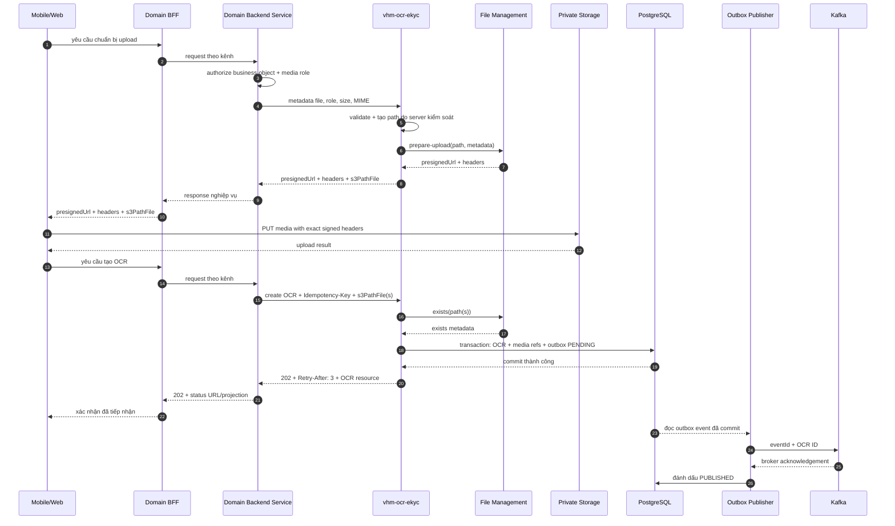

### 8.2.2 OCR tài liệu thông thường

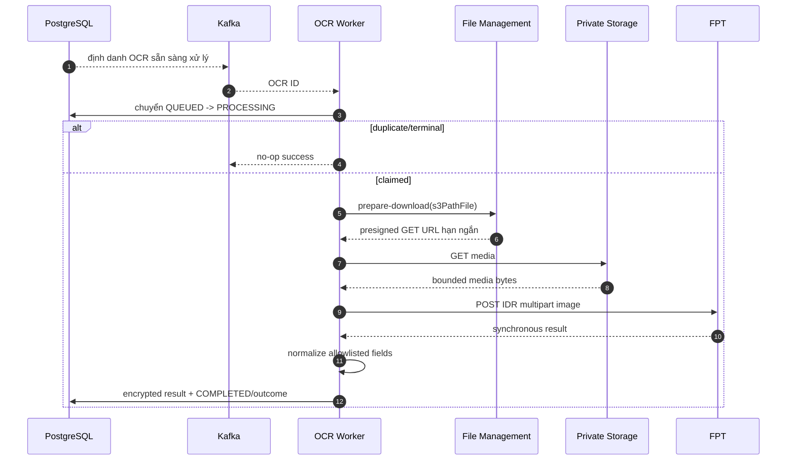

### 8.2.3 Gửi/thăm dò FPT Sale

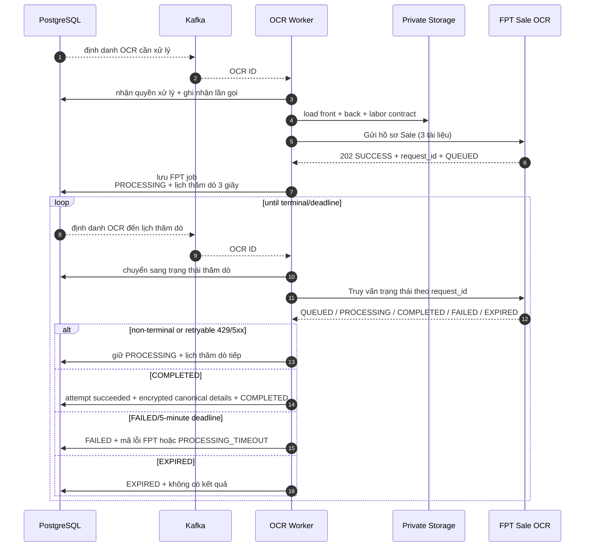

### 8.2.4 Request eKYC đồng bộ

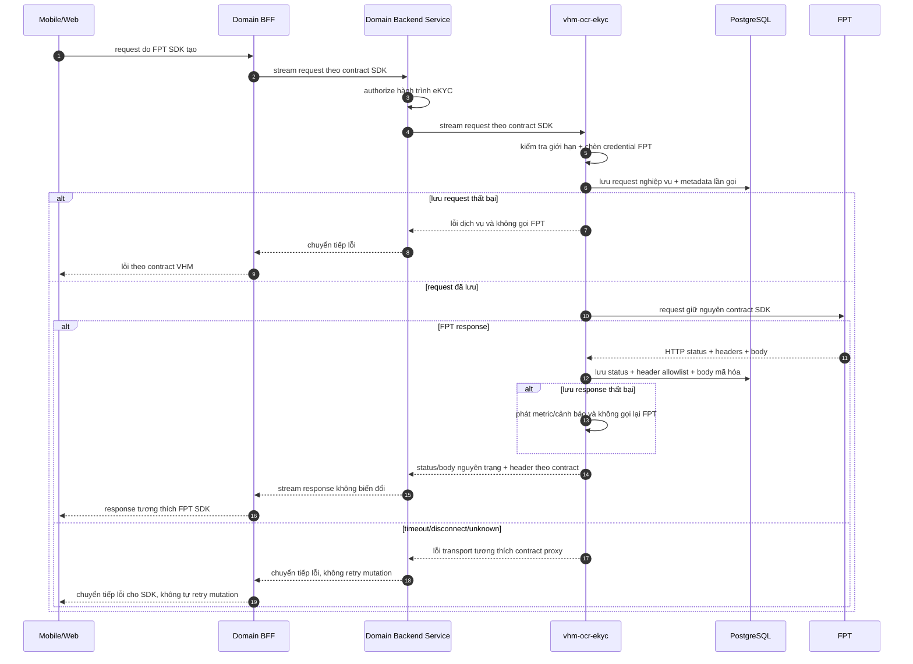

## 8.3 Ma trận xử lý lỗi

| **Sự cố** | **Hành vi yêu cầu** | **Phục hồi/kiểm soát bắt buộc** |
| --- | --- | --- |
| Media thiếu/nằm ngoài prefix | Từ chối tạo với 400 | Giới hạn tần suất đối với hành vi lạm dụng lặp lại. |
| Kafka trùng thông điệp | Claim thất bại, worker bỏ qua | Duy trì kiểm thử contract. |
| Phát sự kiện gián đoạn | Sự kiện có thể được phát lại | Worker loại trùng; giám sát tỷ lệ trùng. |
| Worker dừng ở `PROCESSING` | Bộ đối soát phát hiện theo thời hạn trạng thái | Tiếp tục job FPT đã biết; chỉ đưa lại vào hàng đợi khi xác định chưa gửi FPT; kết thúc timeout theo mục 2.4.4. |
| FPT synchronous timeout | OCR đóng với `PROVIDER_ERROR` | Phân loại không rõ sau khi gửi; chính sách thử lại an toàn, hữu hạn theo contract FPT. |
| Gửi Sale không rõ sau khi gửi | Không tự động gửi lại; kết thúc `FAILED/PROVIDER_SUBMIT_OUTCOME_UNKNOWN` | Đối soát theo mã tương quan nếu FPT hỗ trợ; nếu không, chỉ tạo OCR mới sau xác nhận vận hành theo runbook. |
| Thăm dò Sale gặp 429/5xx | Thăm dò trễ | Thêm exponential backoff/jitter và bảo vệ quota. |
| Thăm dò Sale gặp lỗi I/O | Thăm dò lại sau 3 giây | Lưu lỗi/số lần; thử lại hữu hạn đến deadline. |
| Hết deadline Sale | `PROCESSING_TIMEOUT`, lỗi FPT kết thúc | Công bố hướng dẫn thử lại/idempotency key mới. |
| FPT eKYC trả non-2xx | Giữ nguyên status/body và chuyển tiếp header thuộc allowlist | Kiểm thử callback/parser lỗi theo từng phiên bản SDK. |
| Proxy đổi body/status hoặc sai chính sách header | SDK có thể không phân tích được kết quả hoặc lộ header nhạy cảm | Kiểm thử byte/status và allowlist/denylist header đầu-cuối theo `INT-01`. |
| PostgreSQL lỗi trước khi gọi FPT eKYC | Không gọi FPT; trả lỗi dịch vụ theo contract VHM | Không tạo phiên/giao dịch FPT khi request nội bộ chưa được ghi nhận. |
| PostgreSQL lỗi sau khi đã nhận response eKYC từ FPT | Thử lưu hữu hạn, không gọi lại FPT; vẫn trả response FPT theo mục 6.5.2 | Phát metric/cảnh báo tức thời và xử lý theo runbook; chấp nhận không có tính nguyên tử xuyên HTTP–PostgreSQL. |
| Không giải mã được kết quả/thiếu khóa | API 500 | Runbook phục hồi/luân chuyển khóa; đóng an toàn. |

## 8.4 Chuẩn hóa dữ liệu

- Tên trường FPT chỉ được ánh xạ qua danh sách cho phép tường minh.
- Số giấy tờ luôn là chuỗi; không chuyển thành số.
- Giá trị FPT null/rỗng bị loại; confidence chỉ được sao chép khi có giá trị.
- FPT accepts legacy item `{key,value,score}` and flat object fields with `_prob`.
- `valid=true` chỉ có nghĩa provider success và không thiếu `idNumber/fullName`; nó
  không phải document authenticity/eKYC decision.
- Chi tiết Sale là bằng chứng có cấu trúc do FPT định nghĩa. VHM không làm phẳng
  hoặc thay đổi ngữ nghĩa đối sánh/chữ ký.

# 9. Security & Compliance Architecture

## 9.1 Identity & Authentication

| **Kiểm soát** | **Yêu cầu** | **Tiêu chí nghiệm thu** |
| --- | --- | --- |
| Xác thực bên ngoài | OIDC/JWT tại Domain BFF | Domain BFF vượt kiểm thử token thiếu/sai/hết hạn và kiểm soát kênh; Domain Backend Service vượt kiểm thử phân quyền object. |
| Xác thực liên dịch vụ | mTLS hoặc workload JWT với issuer, audience và scope được duyệt | Phương án IAM được phê duyệt và vượt kiểm thử trước production. |

## 9.2 Authorization & Access Control

- Domain BFF xác thực phiên/token và áp dụng kiểm soát theo kênh trước khi chuyển yêu cầu.
- Domain Backend Service thực thi phân quyền theo vai trò, business object và ngữ cảnh nghiệp vụ trước khi gọi `vhm-ocr-ekyc`.
- Dịch vụ kiểm tra phạm vi truy cập theo chủ thể, nguồn yêu cầu, hồ sơ và tài nguyên media;
  không chỉ dựa vào việc biết định danh OCR.
- Quyền ứng dụng và quyền truy cập PostgreSQL schema `ocr_ekyc`
  được tách biệt theo nguyên tắc đặc quyền tối thiểu.
- Dịch vụ chỉ cho phép truy cập request/kết quả trong đúng phạm vi do Domain Backend
  Service và danh tính workload cung cấp; không triển khai chức năng lưu vết nghiệp vụ riêng.

## 9.3 Secrets & Credential Management

- FPT API key, thông tin xác thực File Management và khóa mã hóa phải lấy từ
  secret manager/biến môi trường; cấu hình rỗng phải làm readiness thất bại đối với
  năng lực đang bật.
- Không để khóa production trong source, ConfigMap, image, giao diện test hoặc ví dụ OpenAPI.
- Dữ liệu nhạy cảm phải được mã hóa theo tiêu chuẩn VHM; cần quy trình luân chuyển,
  thu hồi và khôi phục khóa.
- Token/thông tin xác thực FPT không được xuất hiện trong thông báo exception/log.
- Tối thiểu TLS 1.2, ưu tiên TLS 1.3; phải lập tài liệu quyết định kiểm tra/ghim
  chứng thư cho FPT và Mobile SDK.

## 9.4 Data Masking & Encryption

### Kiểm soát media và request

| **Kiểm soát** | **Phạm vi áp dụng** | **Yêu cầu kiến trúc** |
| --- | --- | --- |
| Đường dẫn upload do server kiểm soát | Có | Gắn bên gọi/phạm vi nghiệp vụ bằng cơ chế có thẩm quyền hoặc mật mã. |
| Danh sách MIME cho phép | JPEG/PNG/PDF | Áp dụng ma trận theo vai trò và kiểm tra magic byte. |
| Kích thước | Cấu hình 20 MB cho mỗi object tải xuống | Kiểm tra metadata tồn tại, tổng Sale 60 MB, giới hạn giải nén/số trang. |
| Checksum | Bắt buộc | Checksum có chữ ký + xác minh bằng bước hoàn tất/HEAD. |
| Path traversal | Prefix + từ chối `..` | Chuẩn hóa đường dẫn và gắn source/reference/role. |
| Multipart | Không tin cậy tên file/body | Xử lý streaming hoặc spooling có giới hạn; giới hạn part/header/bộ nhớ. |
| Presigned URL | Không lưu trong bảng OCR | Không để URL trong log/lỗi; hạn ngắn/chính xác method/key. |

Vì tên file có thể chứa PII, hệ thống chỉ được log media ID do hệ thống sinh và
thao tác; không log tên file gốc, nội dung multipart hoặc dữ liệu nhận diện.

### Data Masking

`vhm-ocr-ekyc` không sở hữu UI. Domain UI/BFF phải ánh xạ role nghiệp vụ vào ba mức
hiển thị: `FULL` chỉ dành cho role được phép xem đầy đủ dữ liệu của đúng hồ sơ;
`MASKED` dành cho màn hình danh sách/tóm tắt; `NONE` áp dụng cho role vận hành và
role không có quyền trên hồ sơ. Đây là mức hiển thị dữ liệu, không phải role mới
trong ma trận phân quyền tại mục 9.2.

| **Trường dữ liệu** | **Hiển thị trên UI (theo Role)** | **Ghi vào Log** | **Format masking** |
| --- | --- | --- | --- |
| Họ tên | `FULL`: đầy đủ; `MASKED`: che; `NONE`: không hiển thị | Không | Giữ ký tự đầu mỗi từ, thay phần còn lại bằng `*`; ví dụ `N***** V** A*` |
| Số CCCD/CMND/hộ chiếu | `FULL`: đầy đủ; `MASKED`: che; `NONE`: không hiển thị | Không | Chỉ giữ 4 ký tự cuối; ví dụ `********1234` |
| Ngày sinh | `FULL`: đầy đủ; `MASKED`: che ngày và tháng; `NONE`: không hiển thị | Không | `**/**/YYYY`; ví dụ `**/**/1990` |
| Nơi cư trú, quê quán, địa chỉ | `FULL`: đầy đủ; `MASKED`: chỉ giữ tỉnh/thành phố; `NONE`: không hiển thị | Không | `***, <Tỉnh/Thành phố>` |
| Dữ liệu tài chính trong PLHĐ | `FULL`: chỉ xem trong tài liệu khi domain có chức năng và quyền tương ứng; `MASKED`: che toàn bộ; `NONE`: không hiển thị | Không | `******` |
| Kết quả liveness/face match và điểm sinh trắc | `FULL`: kết quả nghiệp vụ và score theo contract; `MASKED`: chỉ kết quả nghiệp vụ, không hiển thị score; `NONE`: không hiển thị | Chỉ ghi enum trạng thái; không ghi score | Score được thay bằng `***` ở mức `MASKED` |
| Ảnh giấy tờ, PLHĐ, selfie và video | Không hiển thị từ capability này ở mọi mức; chức năng xem media thủ công nằm ngoài phạm vi mục 1.2 | Không | Không áp dụng vì không công bố trên UI |
| Raw response FPT, provider job/request/session ID | Raw response chỉ được FPT SDK xử lý theo contract mục 6.5.2, không render trực tiếp; trường do Domain UI chọn hiển thị phải áp dụng các mức `FULL`/`MASKED`/`NONE` ở trên | Không | Không áp dụng cho raw response và provider ID |
| OCR ID và correlation ID nội bộ | Không hiển thị trên UI nghiệp vụ; chỉ dùng cho hỗ trợ kỹ thuật | Có, ghi nguyên dạng | Không masking; giá trị phải opaque và không chứa PII |

### Encryption

| **Phạm vi** | **Cơ chế mã hóa** | **Thuật toán** | **Quản lý khóa** |
| --- | --- | --- | --- |
| Request, kết quả OCR/eKYC và response FPT nhạy cảm lưu trong PostgreSQL | Mã hóa cấp payload trước khi persist; mỗi bản mã dùng nonce riêng và lưu kèm phiên bản khóa | AES-256-GCM | CMK lưu trong hệ thống quản lý khóa VHM; workload chỉ nhận quyền encrypt/decrypt cần thiết; đội dự án/vận hành thực hiện phân quyền, xoay và thu hồi khóa |
| Media, payload lớn và recovery object trong kho object riêng tư | Server-side encryption bằng KMS; bucket/object không public; PostgreSQL chỉ giữ tham chiếu và metadata cần thiết | AES-256 qua SSE-KMS | CMK do hệ thống quản lý khóa VHM quản lý; đội dự án/vận hành quản lý quyền sử dụng và thực hiện xoay/thu hồi khóa |
| Dữ liệu truyền giữa các thành phần VHM | HTTPS; mTLS tại trust boundary yêu cầu xác thực hai chiều | TLS 1.2 trở lên hoặc TLS 1.3; không cho phép protocol/cipher yếu | Chứng thư do nền tảng quản lý chứng thư VHM cấp, tự động gia hạn và thu hồi; workload không lưu private key trong source/config |
| Dữ liệu truyền tới FPT | HTTPS bắt buộc và kiểm tra chứng thư máy chủ | Phiên bản TLS/cipher suite theo endpoint HTTPS do FPT công bố; không tự ấn định giá trị khi contract FPT chưa quy định | FPT quản lý chứng thư endpoint; VHM quản lý trust store và thông tin xác thực phía client |
| FPT credential, khóa payload và secret tích hợp | Không lưu trong PostgreSQL, Kafka, log, image hoặc source; chỉ cấp cho workload tại runtime qua secret manager/KMS | Mã hóa của secret manager/KMS VHM | Đội dự án/vận hành quản lý quyền truy cập, phiên bản, xoay và thu hồi; không giao khóa cho Domain UI/BFF hoặc API consumer |

### Nhật ký kỹ thuật

Hệ thống không triển khai chức năng hoặc kho lưu vết nghiệp vụ riêng.
PostgreSQL lưu request do Domain Backend Service gửi vào, trạng thái xử lý cần thiết và kết quả
OCR/eKYC; nhật ký kỹ thuật không phải nguồn dữ liệu nghiệp vụ.

Các trường log vận hành được phép: thời gian, ứng dụng/môi trường/phiên bản, thao tác,
OCR ID theo chính sách được duyệt, enum FPT/status code, thời lượng, Kafka
partition/offset, correlation ID và nhóm lỗi chuẩn.

Cấm: thông tin xác thực/token, trường OCR, số giấy tờ,
họ tên/địa chỉ, media thô, tên file gốc, `s3PathFile`, presigned URL, provider
job/request/session ID và điểm sinh trắc.

Nhật ký kỹ thuật chỉ phục vụ giám sát và xử lý sự cố, không dùng để lưu request body,
response body hoặc tái dựng lịch sử thay đổi nghiệp vụ.

### Quản trị và tuân thủ

- Đồng thuận/cơ sở xử lý hợp pháp phải bao phủ riêng mục đích OCR tài liệu và eKYC sinh trắc.
- DPA/DPIA phải xác định FPT, vùng lưu trữ, bên xử lý phụ, truy cập hỗ trợ từ xa,
  hỗ trợ, sao lưu và SLA xóa dữ liệu.
- Trường kết quả cố định, vai trò/che dữ liệu, lớp lưu giữ và mục đích phải được duyệt.
- Không tái sử dụng dữ liệu OCR/eKYC cho phân tích/huấn luyện mô hình nếu chưa có mục đích mới được duyệt.
- Xuất/xóa dữ liệu chủ thể phải phối hợp DB VHM, object storage, FPT và bản sao lưu.

### Mô hình mối đe dọa

| **Mối đe dọa** | **Vector** | **Giảm thiểu/trạng thái** |
| --- | --- | --- |
| IDOR/xuyên miền | Đoán OCR ID hoặc gửi đường dẫn object của đối tượng khác | Domain Backend Service phân quyền object; `vhm-ocr-ekyc` xác thực workload và phạm vi caller. |
| SSRF/open proxy | Bên gọi điều khiển URL đích | Endpoint/path cố định; không nhận URL đích từ bên gọi. |
| Lộ thông tin xác thực | Cấu hình/log/gói client | Secret manager, quét secret và che dữ liệu; phải có bằng chứng trước production. |
| Lộ presigned URL/path | DB/log/event | Không lưu/phát presigned URL; tham chiếu path được tối thiểu hóa và giới hạn truy cập. |
| Media độc hại | Polyglot/giải nén/PDF bomb | Quét MIME/magic/số trang/kích thước và cô lập đường tới FPT. |
| Lộ dữ liệu Kafka | Payload chứa path/PII/kết quả | Payload chỉ chứa OCR ID; cưỡng chế bằng schema và contract test. |
| Lặp thao tác FPT | At-least-once/timeout | Kiểm soát trạng thái, lưu job FPT và không tự gửi lại khi kết quả gửi Sale chưa rõ. |
| Worker treo | Pod dừng sau khi nhận xử lý | Bộ đối soát phải phát hiện quá hạn và phục hồi theo mục 2.4.4. |
| Nhầm contract eKYC | Proxy đổi status/body, thiếu header bắt buộc hoặc chuyển tiếp header bị cấm | Áp dụng allowlist/denylist và kiểm thử contract theo phiên bản `INT-01`. |
| Log response PII | Đưa nhầm cờ debug/cấu hình thử nghiệm lên môi trường thật | Chính sách cấu hình production + quét DLP/log. |
| Cạn bộ nhớ | Ba file 20 MB + bản sao multipart/response | Giới hạn đồng thời/body, thiết kế streaming/spooling và kiểm thử tải. |
| Can thiệp dữ liệu mã hóa | Dữ liệu mã hóa không được gắn đúng bản ghi/mục đích | Áp dụng cơ chế bảo vệ toàn vẹn theo tiêu chuẩn VHM và kiểm thử can thiệp. |
| Truy cập trái phép kết quả eKYC | Kết quả lưu trong PostgreSQL chứa dữ liệu định danh/sinh trắc | Mã hóa, phân quyền tối thiểu, lưu giữ/xóa và kiểm thử DLP. |

# 10. Deployment & Infrastructure Topology

## 10.1 Environments

| **Môi trường** | **Availability** | **Infrastructure** | **Internet Exposure** | **Data Type** | **HA/DR** | **Key Differences so với Production** |
| --- | --- | --- | --- | --- | --- | --- |
| SIT | Không áp dụng SLO; chỉ yêu cầu sẵn sàng trong cửa sổ kiểm thử đã lập lịch | Cụm non-production tách biệt; API, OCR Processor, PostgreSQL, Kafka, File Management/kho object và FPT staging | Không public trực tiếp `vhm-ocr-ekyc`; truy cập qua kênh nội bộ/VPN và Domain BFF non-production; egress chỉ tới các endpoint non-production được cho phép | Dữ liệu tổng hợp hoặc đã che; không dùng PII/sinh trắc production | Không yêu cầu HA; được phép cấu hình tối thiểu một instance; phục hồi bằng triển khai lại, migration và test fixture | Quy mô nhỏ, credential riêng, FPT staging, cho phép bật công cụ kiểm thử; không mang dữ liệu production và không dùng để xác nhận SLO production |
| UAT | Không áp dụng SLO production; phải sẵn sàng trong toàn bộ cửa sổ nghiệm thu đã công bố | Topology logic tương đương production nhưng tách biệt tài nguyên, credential và endpoint; sử dụng FPT non-production | Không public trực tiếp `vhm-ocr-ekyc`; chỉ nhận lưu lượng qua Domain BFF/Domain Backend Service UAT; egress theo allowlist | Dữ liệu tổng hợp hoặc đã che được phê duyệt cho nghiệm thu; không dùng credential hay dữ liệu production | Cấu hình dự phòng có thể giảm so với production; bắt buộc kiểm thử backup/restore và quy trình triển khai/rollback | Giữ nguyên contract, migration và security control của production nhưng giảm capacity, redundancy; dùng endpoint/credential non-production và không xử lý dữ liệu thật |
| Production | ≥99,9% theo tháng theo NFR-001 | AWS/EKS; API và OCR Processor mở rộng độc lập; PostgreSQL, Kafka, File Management/kho object riêng tư, secret manager/KMS và FPT production | Không public trực tiếp `vhm-ocr-ekyc`; ingress qua Domain BFF và Domain Backend Service; egress chỉ tới FPT, File Management và nền tảng quan sát theo allowlist | Dữ liệu cá nhân, giấy tờ, hợp đồng và dữ liệu sinh trắc thật; dữ liệu nhạy cảm phải mã hóa và phân quyền | Triển khai đa instance/đa AZ; PostgreSQL PITR, Kafka replication, sao lưu kho object và runbook DR; mục tiêu RTO/RPO theo mục 14.1 | Môi trường chuẩn đối chiếu: đầy đủ capacity, HA/DR, giám sát/cảnh báo, security gate, retention/xóa dữ liệu và credential FPT production |

## 10.2 Production Deployment Diagram (CI/CD)

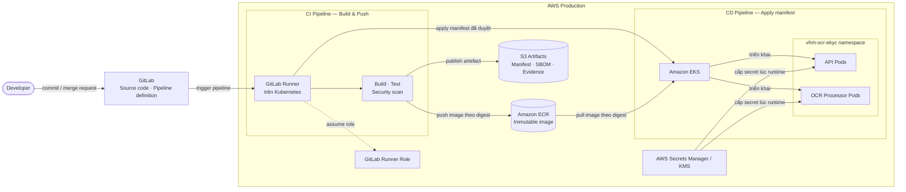

CI tạo một image bất biến, đẩy image lên ECR và lưu manifest, SBOM cùng bằng chứng
kiểm thử trong kho artefact. CD chỉ triển khai image đã qua cổng phê duyệt bằng
digest; không build lại khi quảng bá lên production. GitLab Runner sử dụng IAM role
ngắn hạn để push image và triển khai manifest, không lưu access key tĩnh trong
pipeline.

API Pods và OCR Processor Pods dùng chung image nhưng được cấu hình thành hai vai
trò runtime, triển khai và mở rộng độc lập. Secret được cấp cho workload tại runtime
từ AWS Secrets Manager/KMS; không đóng gói trong image, manifest hoặc artefact CI.
PostgreSQL, Kafka, File Management và FPT là phụ thuộc runtime đã mô tả tại các sơ
đồ kiến trúc/luồng dữ liệu, không lặp lại trong sơ đồ CI/CD này.

## 10.3 Deployment Strategy

| **Component** | **Deployment Type (Blue-Green/Canary/Rolling)** | **Expected Downtime** | **Rollback Strategy** | **Deployment Window** | **Approval Required (Y/N)** |
| --- | --- | --- | --- | --- | --- |
| API Pods | Canary, sau khi đạt health/error/latency gate thì tiếp tục Rolling | 0 ms downtime có kế hoạch; pod chỉ nhận traffic sau khi readiness đạt | Chuyển traffic khỏi canary, dừng rollout và triển khai lại image digest liền trước; schema phải còn tương thích với phiên bản cũ | Cửa sổ phát hành production đã phê duyệt, ngoài giờ cao điểm nghiệp vụ | Y |
| OCR Processor Pods và Outbox Publisher | Rolling có drain Kafka consumer | 0 ms downtime có kế hoạch; có thể tạm giảm tốc độ xử lý trong lúc rebalance nhưng không mất job | Dừng rollout, drain consumer của phiên bản mới và triển khai lại image digest liền trước; tiếp tục xử lý từ trạng thái PostgreSQL/Kafka, không phát lại mù lời gọi FPT có kết quả chưa rõ | Cùng cửa sổ phát hành API, ngoài giờ cao điểm OCR và không trùng thời gian bảo trì FPT | Y |
| Flyway/PostgreSQL schema | Rolling-compatible theo expand/contract; Flyway chạy một lần trước khi pod mới nhận traffic | 0 ms downtime ứng dụng đối với migration tương thích ngược; migration có khóa chặn vượt ngưỡng phải bị từ chối trước production | Rollback application về phiên bản còn tương thích và thực hiện forward-fix migration; không chạy down migration phá hủy hoặc xóa dữ liệu trong cửa sổ rollback | Đầu cửa sổ phát hành production, trước rollout API/OCR Processor | Y |

Giá trị `Y` áp dụng cho production. Mọi đợt triển khai cần Chủ sở hữu ứng dụng và
Vận hành phê duyệt; migration PostgreSQL cần thêm DBA, thay đổi quyền truy cập hoặc
cơ chế bảo vệ dữ liệu nhạy cảm cần thêm ANBM.

- Pipeline CI phải chạy `mvn clean test` và chỉ cho phép đóng gói khi toàn bộ kiểm
  thử bắt buộc thành công.
- Các cổng bắt buộc: biên dịch/unit, kiểm tra thay đổi PostgreSQL schema, quét secret,
  SAST/SCA/license, quét container/IaC, contract FPT, integration, an toàn thông tin,
  kiểm thử tải và quét PII trong log.
- Build artifact bất biến một lần; quảng bá qua môi trường mà không build lại.

### Quản lý cấu hình

| **Nhóm cấu hình** | **Yêu cầu kiến trúc** | **Cổng production** |
| --- | --- | --- |
| Kafka | Topic/group tách theo môi trường; ACL, retention và DLT có tài liệu | Kiểm thử chuyển phát trùng, lag và phục hồi. |
| FPT | Endpoint, credential, timeout và quota tách theo môi trường | Contract test và phê duyệt Tích hợp/ANBM. |
| FPT Sale | Thăm dò tối thiểu 3 giây, deadline tối đa 5 phút theo contract | Test backoff/quota/deadline. |
| Media | Tối đa 20 MB/file và 60 MB/hồ sơ Sale | Kiểm tra MIME/magic/checksum và tổng dung lượng. |
| Log vận hành | Chỉ ghi metadata kỹ thuật cần thiết | Chính sách lưu giữ và quét PII/DLP. |

## 10.4 Infrastructure & Network Security

### Hạng mục bảo mật hạ tầng

| **Hạng mục bảo mật** | **Giải pháp** | **Thông số cấu hình** | **Phạm vi áp dụng** |
| --- | --- | --- | --- |
| WAF | WAF tại public edge của Domain BFF; `vhm-ocr-ekyc` không mở public ingress | Production chạy block mode với managed rules cho SQL injection, XSS, LFI/RFI và HTTP protocol anomaly; chỉ cho phép method/path đã công bố; multipart route vẫn phải kiểm tra size, MIME và magic byte tại ứng dụng | Mobile/Web → Domain BFF; không đặt WAF trực tiếp trước API nội bộ `vhm-ocr-ekyc` |
| DDoS Protection | Bảo vệ DDoS luôn bật tại public edge và lớp mạng của nền tảng VHM | Tự động phát hiện/giảm thiểu L3/L4; tải L7 vượt giới hạn được WAF và rate limiting xử lý; capacity bảo vệ không được thấp hơn target ≥5.000 req/s của API không mang media tại NFR-005 | Public endpoint của Domain BFF và hạ tầng ingress production |
| Rate Limiting | Token bucket/quota tách theo route và chủ thể gọi | Domain BFF giới hạn theo user/session/IP; Domain Backend Service và `vhm-ocr-ekyc` giới hạn theo workload/route; trả `429` và `Retry-After`; tách quota OCR, eKYC và polling; giá trị quota phải đạt NFR-005 và không vượt quota FPT được chốt tại OI-002 | Domain BFF, Domain Backend Service, API và các outbound call tới FPT |
| Anti-Bot | Bot management tại Domain BFF kết hợp xác thực phiên/kênh | Chặn bot/scanner đã biết; Web được challenge trước khi bắt đầu upload/eKYC khi có tín hiệu rủi ro; Mobile dùng app/device attestation và session control; không chèn CAPTCHA/challenge vào giữa contract FPT SDK | Public Web/Mobile route tại Domain BFF; không áp dụng cho service-to-service route đã xác thực workload |
| Network Segmentation | Private subnet/namespace và policy deny-by-default | API/processor không có public IP hoặc public route; inbound API chỉ nhận từ Domain Backend Service được cấp quyền; PostgreSQL, Kafka và kho object chỉ nhận từ workload thuộc allowlist | EKS namespace, API/processor, PostgreSQL, Kafka và File Management/kho object |
| Egress Control | Firewall/security policy với danh sách đích cho phép | Mặc định từ chối egress; chỉ mở đúng giao thức/đích tới FPT, File Management, PostgreSQL, Kafka, secret manager/KMS và nền tảng quan sát; không nhận URL downstream do caller cung cấp | API Pods và OCR Processor Pods |
| Workload Identity & IAM | Danh tính workload ngắn hạn và nguyên tắc đặc quyền tối thiểu | Tách quyền API/processor; không dùng cloud access key tĩnh; quyền PostgreSQL schema, Kafka topic/group, object path và secret được cấp riêng theo vai trò runtime | API, OCR Processor/Outbox Publisher và pipeline triển khai |
| Secrets & Key Protection | Secret manager/KMS cấp secret tại runtime | Không lưu secret/key trong source, image, manifest, ConfigMap, PostgreSQL, Kafka hoặc log; đội dự án/vận hành quản lý phân quyền, xoay và thu hồi khóa theo mục 9.3/9.4 | FPT credential, File Management credential, khóa mã hóa payload và chứng thư workload |
| Security Monitoring | Thu thập sự kiện WAF/DDoS/IAM/network và cảnh báo tập trung | Gửi metadata sự kiện về nền tảng quan sát/SIEM; không ghi request/response body, PII, media, token, path hoặc provider job/session ID; cảnh báo khi WAF block, rate-limit, auth failure hoặc egress bị từ chối tăng bất thường | Public edge, Domain BFF, EKS, IAM và network control plane |

### Ma trận luồng mạng

| **Nguồn** | **Đích** | **Giao thức/dữ liệu** | **Kiểm soát** |
| --- | --- | --- | --- |
| Mobile/Web | Domain BFF | HTTPS nghiệp vụ | Xác thực người dùng, giới hạn tần suất và kiểm soát phiên |
| Domain BFF | Domain Backend Service | HTTPS JSON/multipart | Xác thực workload, actor context có kiểm soát, giới hạn route/tần suất/kích thước body; streaming có backpressure cho eKYC |
| Domain Backend Service | API | HTTPS JSON/multipart | Xác thực workload, phân quyền business object và phạm vi; streaming có backpressure cho eKYC |
| API/worker | PostgreSQL schema `ocr_ekyc` | Kết nối mã hóa | Mạng riêng và quyền theo nguyên tắc tối thiểu |
| API/worker | Kafka | Kết nối mã hóa | Phân quyền theo topic và consumer group |
| API/worker | File Management | HTTPS metadata/media | Danh tính workload, giới hạn phạm vi truy cập |
| API/worker | FPT | HTTPS media/kết quả | Danh sách đích cho phép, secret, timeout và quota |
| Các thành phần | Nền tảng quan sát | Kết nối mã hóa, chỉ metadata | Danh sách trường cho phép, che dữ liệu và lưu giữ có thời hạn |

## 10.5 Migration Strategy (Optional)

Migration dữ liệu legacy không thuộc phạm vi thiết kế này. Thay đổi PostgreSQL schema
có ảnh hưởng dữ liệu nhạy cảm phải tương thích ngược, có kế hoạch chuyển đổi dữ
liệu, xác minh toàn vẹn và rollback. Không xóa cấu trúc hoặc dữ liệu cũ trước khi
hết cửa sổ rollback/lưu giữ được phê duyệt.

# 11. Cost & Capacity/Performance

## 11.1 Capacity/Performance

| **Component** | **Metric** | **Current Value** | **Target Value** | **Headroom** |
| --- | --- | --- | --- | --- |
| API OCR/status/result | Throughput API không mang media | Chưa có production baseline vì hệ thống chưa triển khai; theo dõi tại CAP-02 | ≥5.000 req/s theo NFR-005 | ≥30%; kiểm thử đạt ≥6.500 req/s mà không vi phạm NFR-001/NFR-002 |
| API OCR/status/result | Response time | Chưa có production baseline; theo dõi tại CAP-02 | p95 <2.000 ms tại tải mục tiêu theo NFR-002 | Giữ p95 <2.000 ms tại mức tải 6.500 req/s |
| Outbox Publisher/Kafka | Tốc độ phát và tiêu thụ OCR event | Chưa có workload mix; theo dõi tại CAP-01/CAP-02 | ≥1,3 × peak OCR create rate đã được Sản phẩm phê duyệt | 30% trên peak OCR create rate; backlog phải được xử lý hết sau burst trong cửa sổ kiểm thử CAP-02 |
| OCR Processor — OCR thường | Thời gian hoàn tất và concurrency FPT | Chưa có baseline; quota FPT theo dõi tại CAP-03 | Deadline ≤900.000 ms theo NFR-003; concurrency ≥1,3 × `peakArrivalRate × durationP99`, không vượt quota FPT | 30% concurrency so với peak đã phê duyệt |
| OCR Processor — FPT Sale | Thời gian hoàn tất hồ sơ | Contract FPT tối đa 300.000 ms | ≤300.000 ms theo NFR-003; polling không ngắn hơn 3.000 ms | Không cộng thêm thời gian vượt contract FPT; tài nguyên worker duy trì 30% concurrency headroom |
| eKYC Proxy | Số request đang hoạt động đồng thời | Chưa có forecast và quota FPT; theo dõi tại CAP-01/CAP-03 | ≥1,3 × `peakArrivalRate × responseDurationP99`, connect timeout 2.000 ms và response timeout 600.000 ms | 30% trên peak concurrency; quota eKYC tách khỏi OCR worker |
| Media ingress/worker | Kích thước object và working set | Giới hạn contract 20 MiB/object, hồ sơ Sale tối đa 60 MiB; phân bố thực tế theo dõi tại CAP-02 | Không nhận object >20 MiB hoặc hồ sơ Sale >60 MiB; memory limit không được thấp hơn working set p99 đo được | ≥30% memory so với working set p99 tại concurrency mục tiêu |
| PostgreSQL | Bản ghi/ngày, dung lượng kết quả và tăng trưởng lưu trữ | Chưa có forecast sản lượng/retention; theo dõi tại CAP-01/CAP-04 | Dung lượng provisioned ≥1,3 × dữ liệu phát sinh trong retention window; PITR đáp ứng RPO ≤15 phút | ≥30% dung lượng, IOPS và connection headroom tại peak |
| Kho object riêng tư | Media, payload lớn, recovery object và backup | Chưa có forecast sản lượng/retention; theo dõi tại CAP-01/CAP-04 | Dung lượng provisioned ≥1,3 × tổng byte trong retention window; không public object | ≥30% dung lượng và request-rate headroom tại peak |

Các công thức bắt buộc:

- `peakConcurrency = peakArrivalRate × operationDurationP99 × safetyFactor`.
- `workerReplicas = ceil(requiredProviderConcurrency / measuredConcurrencyPerPod) + HA headroom`.
- `maxSaleMemory ≈ concurrency × (sum input bytes + multipart copies + response + safety overhead)`.
- Dung lượng thăm dò phải tính riêng Mobile/Web → Domain BFF, Domain BFF → Domain Backend Service,
  Domain Backend Service → OCR/eKYC và worker → FPT Sale.

Số replica, kích thước heap, connection pool, rate-limit và concurrency limit được
xác định bằng kiểm thử tải để đạt NFR-002/NFR-005 và không vượt quota FPT.

### Theo dõi đầu vào capacity/cost chưa có baseline

| **ID** | **Đầu vào phải chốt** | **Owner** | **Deadline** | **Bằng chứng bắt buộc** |
| --- | --- | --- | --- | --- |
| CAP-01 | Forecast OCR/eKYC theo ngày, peak-hour, kênh và tỷ lệ từng use case | Sản phẩm/Nghiệp vụ và Vận hành | Trước cổng `UNDER REVIEW → APPROVED` của TDD | Forecast được phê duyệt và workload mix dùng cho capacity model |
| CAP-02 | Baseline throughput/latency, media p50/p95/p99, concurrency/pod, heap và thời gian xử lý backlog | QA Performance và Vận hành | Trước OAT | Capacity Test Report chứng minh NFR-001/NFR-002/NFR-005 và headroom trong bảng 11.1 |
| CAP-03 | Quota đồng thời/RPS, SLA và giới hạn 429 của từng API FPT | Tích hợp và FPT | Trước cổng `UNDER REVIEW → APPROVED` của TDD | Contract/quota FPT được hai bên xác nhận |
| CAP-04 | Retention, số bản ghi, dung lượng request/result/media và tốc độ tăng trưởng | Sản phẩm/Nghiệp vụ, Quyền riêng tư và DBA | Trước cổng `UNDER REVIEW → APPROVED` của TDD | Retention policy và storage sizing sheet được phê duyệt |
| COST-01 | AWS estimate cho Compute, Storage và Network theo CAP-01/CAP-04 | Cloud Platform/FinOps và Vận hành | Trước cổng `APPROVED → IMPLEMENTATION BASELINE` | Saved AWS Pricing Calculator estimate và dự toán tháng/năm |
| COST-02 | Đơn giá FPT OCR thường, FPT Sale, eKYC/liveness và quota mua | Mua sắm, Tích hợp và Sản phẩm | Trước cổng `APPROVED → IMPLEMENTATION BASELINE` | Báo giá/hợp đồng FPT và cost model theo workload mix CAP-01 |

## 11.2 Cost

**AWS Pricing Calculator:** [Tạo/lưu estimate](https://calculator.aws/#/addService).
Saved estimate của dự án phải được gắn vào COST-01; không sử dụng estimate mẫu của
hệ thống khác làm số liệu thẩm định.

| **Hạng mục** | **Phạm vi chi phí** | **Cơ sở tính** | **Chi phí/tháng** | **Chi phí/năm** | **Owner / Deadline** |
| --- | --- | --- | --- | --- | --- |
| Compute | EKS control plane/worker node, API Pods và OCR Processor Pods | Replica, vCPU, memory, autoscaling và 730 giờ/tháng theo CAP-01/CAP-02 | Chốt tại COST-01 | `12 × chi phí/tháng` | Cloud Platform/FinOps và Vận hành / trước `APPROVED → IMPLEMENTATION BASELINE` |
| Storage | PostgreSQL, Kafka storage, kho object, backup/PITR, KMS/secret và lưu trữ log/metric | Dung lượng, IOPS, retention, request count và backup theo CAP-04 | Chốt tại COST-01 | `12 × chi phí/tháng` | Cloud Platform/FinOps, DBA và Vận hành / trước `APPROVED → IMPLEMENTATION BASELINE` |
| Network | Load balancer/WAF/DDoS, NAT/egress, inter-AZ và truyền media/response tới FPT | GB ingress/egress, request count và topology production theo CAP-01/CAP-02 | Chốt tại COST-01 | `12 × chi phí/tháng` | Cloud Platform/FinOps và Vận hành / trước `APPROVED → IMPLEMENTATION BASELINE` |
| 3rd party | FPT OCR thường, FPT Sale, eKYC/liveness và phí File Management nếu có chargeback | Đơn giá × số giao dịch theo use case; quota và cam kết tối thiểu theo CAP-01/COST-02 | Chốt tại COST-02 | `12 × chi phí/tháng` | Mua sắm, Tích hợp và Sản phẩm / trước `APPROVED → IMPLEMENTATION BASELINE` |
| **Tổng chi phí** | Tổng Compute + Storage + Network + 3rd party | Saved estimate COST-01 + báo giá COST-02 | Chốt tại COST-01/COST-02 | `12 × tổng chi phí/tháng` | FinOps và Sản phẩm / trước `APPROVED → IMPLEMENTATION BASELINE` |

Saved AWS estimate, báo giá FPT, ngưỡng cảnh báo ngân sách/quota và tổng dự toán
tháng/năm là điều kiện bắt buộc trước khi chốt implementation baseline.

# 12. Scalability & Reliability

## 12.1 Scaling Strategy

| **Thành phần** | **Tín hiệu mở rộng** | **Kiểm soát bắt buộc** |
| --- | --- | --- |
| API OCR/eKYC | RPS, p95 latency, DB pool | Stateless HPA; idempotency and DB limit |
| API eKYC | Request đang hoạt động, byte, độ trễ FPT, bộ nhớ | Tách concurrency/bulkhead khỏi luồng điều khiển OCR |
| OCR Worker | Độ trễ Kafka, tuổi lớn nhất, độ trễ FPT | Concurrency/token bucket/quota riêng cho FPT |
| Thăm dò Sale | Số job đến hạn, số lần thăm dò, nguy cơ quá deadline | Backoff/jitter; ưu tiên deadline; không thăm dò dồn dập |
| PostgreSQL | CPU/IOPS/kết nối/tăng trưởng dữ liệu | Giới hạn kết nối, HA/PITR và kế hoạch dung lượng |
| Kafka | partition lag/throughput | Partition count and key distribution sizing |

OCR backlog and interactive eKYC must have independent resource/quota pools. A
burst of 20–60 MB OCR files must not exhaust memory/connections serving eKYC.

## 12.2 Reliability

| **Thành phần/phụ thuộc** | **Mẫu bảo đảm độ tin cậy** | **Hành vi khi lỗi** | **Phục hồi** |
| --- | --- | --- | --- |
| OCR API | Stateless, nhiều replica và tạo yêu cầu idempotent | Không để lại tài nguyên OCR dở dang khi tiếp nhận thất bại | Domain Backend Service gửi lại cùng `Idempotency-Key`; dịch vụ trả tài nguyên đã tạo nếu request tương đương |
| eKYC Proxy | Đồng bộ, không qua Kafka và không tự thử lại mutation | Trước lời gọi FPT phải lưu request; sau khi nhận response phải tuân theo mục 6.5.2 | SDK nhận response tương thích contract qua Domain Backend Service/Domain BFF; lỗi lưu được cảnh báo và xử lý theo runbook |
| Outbox/Kafka/OCR Processor | Outbox cùng transaction tạo OCR; chuyển phát ít nhất một lần; worker idempotent | Không mất công việc đã tiếp nhận; thông điệp trùng không tạo lần xử lý thứ hai | Phát lại outbox chưa xác nhận và áp dụng ma trận phục hồi tại mục 2.4.4 |
| PostgreSQL | HA/PITR và cập nhật trạng thái–kết quả nhất quán | Không công bố hoàn tất OCR nếu kết quả chưa được lưu bền vững | Failover/khôi phục theo RPO/RTO; kiểm tra phiên bản schema và khóa mã hóa trước khi mở lưu lượng |
| File Management/kho object | Object riêng tư, presigned URL hạn ngắn | Không tạo OCR từ tham chiếu media không hợp lệ; lỗi tải xuống không làm mất khả năng xử lý lại an toàn | Cấp lại quyền tải xuống trong thời hạn xử lý và phục hồi theo chính sách media |
| FPT OCR/Sale | Timeout, giới hạn đồng thời và thăm dò hữu hạn | Không gửi trùng hồ sơ khi kết quả lần gửi chưa rõ; lỗi thăm dò có thể thử lại trong deadline | Dùng cùng mã giao dịch đã lưu để thăm dò; kết quả gửi không rõ được kết thúc tường minh và chuyển sang đối soát vận hành |

Kết quả và trạng thái kết thúc không được ghi đè bởi xử lý đồng thời. Mã giao dịch
FPT Sale phải được lưu trước khi thăm dò và mọi lần thăm dò tiếp theo sử dụng cùng
mã đó. Tài nguyên xử lý OCR và request eKYC đồng bộ sử dụng vùng tài nguyên/quota
độc lập để tồn đọng OCR không làm gián đoạn hành trình eKYC.

## 12.3 Sao lưu và phục hồi

Phạm vi sao lưu: schema/dữ liệu PostgreSQL, object media được duyệt, cấu hình có
phiên bản và artifact bất biến. Kafka và token/cache tiến trình không phải nguồn
sự thật nghiệp vụ.

Phục hồi phải xác minh:

- phiên bản PostgreSQL schema và tính sẵn sàng của khóa mã hóa;
- tính nhất quán OCR/media/kết quả và metadata kỹ thuật FPT;
- khả năng xử lý lại an toàn các công việc chưa hoàn tất;
- phục hồi `PROCESSING` quá hạn theo cơ chế đối soát được duyệt;
- không tạo lại/ghi đè kết quả đã kết thúc;
- xóa dữ liệu phục hồi đã quá hạn lưu trước khi mở lưu lượng;
- không in secret/PII bản rõ trong quá trình phục hồi.

# 13. Observability & Monitoring

## 13.1 Yêu cầu nền tảng

- Dịch vụ phải công bố health, readiness/liveness và metric cho nền tảng giám sát.
- Log phải có cấu trúc và hỗ trợ correlation ID.
- Metric phải có nhãn chung theo ứng dụng, môi trường và vùng triển khai.
- Endpoint health/management phải được loại khỏi chỉ số nghiệp vụ.
- Log và metric phải bao phủ outbox, Kafka, processor, FPT, eKYC đồng bộ, đối soát
  và lưu kết quả mà không chứa dữ liệu nhạy cảm.

## 13.2 Chỉ số bắt buộc

| **Metric** | **Loại** | **Nhãn được phép** |
| --- | --- | --- |
| `ocr_requests_total` | Counter | use_case, provider, channel, outcome |
| `ocr_lifecycle_duration_seconds` | Histogram | use_case, provider, outcome |
| `ocr_provider_requests_total` | Counter | provider, operation, outcome, http_class |
| `ocr_provider_duration_seconds` | Histogram | provider, operation |
| `ocr_jobs_pending` / `ocr_jobs_oldest_age_seconds` | Gauge | use_case, status |
| `ocr_outbox_pending` / `ocr_outbox_oldest_age_seconds` | Gauge | event_type, status |
| `ocr_outbox_publish_failures_total` | Counter | event_type, error_class |
| `ocr_kafka_consumer_lag` | Gauge | topic, consumer_group, partition |
| `ocr_jobs_stuck` | Gauge | step, age_bucket |
| `ocr_reconciliation_total` | Counter | reason, outcome |
| `ocr_sale_poll_count` | Histogram | terminal_status |
| `ocr_result_decrypt_failures_total` | Counter | key_version, error_class |
| `ekyc_provider_requests_total` | Counter | operation, outcome, http_class |
| `ekyc_provider_duration_seconds` | Histogram | operation |
| `ekyc_active_requests` / `ekyc_request_bytes` | Gauge/Histogram | operation |
| `ekyc_result_persistence_failures_total` | Counter | operation, error_class |
| `media_download_bytes` / `media_download_failures_total` | Histogram/Counter | role, outcome |

Không dùng OCR ID, reference/subject/requestBy, provider job/session ID, filename,
path, correlation ID hoặc PII làm metric label.

## 13.3 Cảnh báo

| **Cảnh báo** | **Tín hiệu** | **Mức độ** |
| --- | --- | --- |
| Lỗi xác thực FPT | Lặp lại 401/403 | Nghiêm trọng |
| FPT không sẵn sàng/timeout | Tỷ lệ lỗi/timeout vượt cửa sổ đã duyệt | Cao |
| Tồn đọng OCR | Tuổi công việc chờ lớn nhất vượt SLO | Cao/Nghiêm trọng |
| Tồn đọng outbox | Tuổi sự kiện chưa phát hoặc lỗi phát liên tiếp vượt ngưỡng | Cao/Nghiêm trọng |
| Kafka trễ/xử lý treo | Lag hoặc `PROCESSING` quá hạn vượt ngưỡng | Cao |
| Đối soát OCR thất bại | Yêu cầu quá hạn không được phục hồi hoặc kết thúc trong cửa sổ đã duyệt | Nghiêm trọng |
| Nguy cơ quá deadline Sale | Job đang chờ không thể xử lý hết trước deadline 5 phút | Nghiêm trọng |
| eKYC bão hòa | Request đang hoạt động/bộ nhớ/timeout vượt ngưỡng | Cao |
| Lỗi lưu kết quả eKYC | Bất kỳ lỗi lưu kết quả nào sau khi đã nhận response FPT | Nghiêm trọng |
| Pool/lock/lưu trữ DB | Vượt ngưỡng bão hòa/tăng trưởng | Cao |
| Lỗi mã hóa kết quả OCR/eKYC | Bất kỳ lỗi kéo dài nào | Nghiêm trọng |
| DLP phát hiện PII/secret | Bất kỳ phát hiện nào ở production | Nghiêm trọng |
| Tồn đọng lưu giữ/xóa | Tuổi dữ liệu đủ điều kiện xóa lớn nhất vượt SLA chính sách | Cao/Nghiêm trọng |

## 13.4 SLI/SLO

SLI phải tách: API tiếp nhận OCR, hoàn tất OCR đầu-cuối, thao tác FPT, độ trễ
Kafka, thời gian chờ FPT Sale, response eKYC đồng bộ và đọc
trạng thái/kết quả. Thời gian FPT phải quan sát được, không bị ẩn trong tính sẵn
sàng nền tảng. Mục 4 định nghĩa target Availability, Response Time và Throughput.
HTTP metric, Prometheus và dashboard cung cấp SLI; load test và OAT cung cấp bằng
chứng nghiệm thu.

# 14. Operational Readiness

## 14.1 RTO & RPO

| **Hạng mục** | **Mục tiêu** | **Bằng chứng nghiệm thu** |
| --- | --- | --- |
| RTO | ≤4 giờ | Cần Chủ sở hữu hệ thống/Vận hành phê duyệt + diễn tập |
| RPO | ≤15 phút | Cần DBA/Vận hành phê duyệt + bằng chứng PITR |
| Phục hồi job Sale đã được nhận | Trước deadline xử lý 5 phút nếu FPT cho phép | Yêu cầu kiểm thử phục hồi |
| Phục hồi secret/khóa | Runbook luân chuyển/thu hồi được duyệt | TBD |
| Phục hồi media | Trong thời hạn lưu theo mục đích; không khôi phục dữ liệu đã xóa | TBD |

## 14.2 Runbook bắt buộc

- FPT trả 401/403 và luân chuyển/thu hồi thông tin xác thực.
- Sự cố FPT, quota/429 và chế độ an toàn của circuit breaker.
- Kafka lag, UUID/thông điệp độc, retry/DLT và rollback consumer.
- OCR `PROCESSING` quá hạn và không rõ kết quả sau khi gửi FPT.
- Thăm dò/deadline/nguy cơ hết hạn lưu của FPT Sale.
- Lỗi lưu kết quả eKYC sau khi đã nhận response FPT: định vị bằng correlation ID
  nội bộ, không gọi lại FPT mutation, xác minh khả năng khôi phục và ghi nhận sự cố dữ liệu.
- Failover DB/phục hồi PITR và phục hồi khóa mã hóa.
- Sự cố File Management/kho lưu trữ, media mồ côi và xóa dữ liệu.
- Sự cố PII/secret xuất hiện trong log.
- Suy giảm tương thích eKYC và rollback theo phiên bản client/SDK.

## 14.3 Danh sách kiểm tra sẵn sàng cơ sở

- Health/readiness phải thất bại khi thiếu thông tin xác thực/cấu hình bắt buộc của năng lực đang bật.
- Dịch vụ phải có khả năng ngừng nhận OCR/eKYC mới trong khi vẫn cho đọc trạng thái an toàn và
  phục hồi/thăm dò job đã nhận theo chính sách sự cố.
- Phải chỉ định on-call, đầu mối FPT, ma trận leo thang và bảo trì.
- Dashboard/cảnh báo phải có chủ sở hữu và vượt kiểm thử định tuyến.
- Phải diễn tập sao lưu/phục hồi, luân chuyển, rollback và xử lý backlog theo RTO/RPO/SLO.
- Mỗi điều kiện production phải có bằng chứng nghiệm thu hoặc kế hoạch kiểm soát được phê duyệt.

# 15. Testing & Quality Strategy

## 15.1 Phạm vi kiểm thử bắt buộc

Khi triển khai, bộ kiểm thử phải bao phủ API contract, mã hóa, chuẩn hóa OCR, tích
hợp FPT/FPT Sale, media, Kafka/processor và các nhánh phục hồi trọng yếu. Kiểm thử
unit không thay thế bằng chứng tích hợp PostgreSQL/Kafka/FPT, an toàn thông tin,
hiệu năng hoặc phục hồi. Bằng chứng thực thi phải được lưu cùng pipeline/release.

## 15.2 Cổng chất lượng

| **Lớp kiểm thử** | **Phạm vi bắt buộc** | **Cổng** |
| --- | --- | --- |
| Unit | Nhánh trạng thái/idempotency/chuẩn hóa/mã hóa/lỗi | 100% test pass và không có test bị skip tại quality gate |
| Tích hợp dữ liệu | PostgreSQL schema `ocr_ekyc`, migration, tính nhất quán và test đồng thời | Bắt buộc |
| Outbox/Kafka/worker | Rollback, crash window trước/sau broker acknowledgement, phát trùng, retry/DLT và phục hồi công việc treo | Bắt buộc |
| Contract provider | FPT IDR, mọi trạng thái/lỗi FPT Sale và wire contract eKYC theo `INT-01` | Bắt buộc |
| Contract API | OpenAPI/envelope/chuyển tiếp/header/kích thước/tương thích ngược | Bắt buộc |
| An toàn thông tin | Authn/authz/IDOR, secret, SSRF, multipart, PII-log, can thiệp/luân chuyển mật mã | Bắt buộc |
| E2E | Upload → tạo → hàng đợi → FPT → trạng thái/kết quả cho từng use case | Bắt buộc |
| Hiệu năng | Một/hai file 20 MB, Sale 60 MB, eKYC đồng thời, quota DB/Kafka/FPT | Bắt buộc |
| Khả năng chịu lỗi | Pod dừng ở từng giai đoạn, DB/Kafka/storage/FPT lỗi, chuyển phát không rõ | Bắt buộc |
| OAT/DR | Triển khai/rollback, phục hồi, luân chuyển, xóa, cảnh báo/runbook | Bắt buộc |

## 15.3 Kịch bản kiểm thử trọng yếu

- Đồng thời cùng idempotency key/cùng body và cùng key/body khác nhau.
- Lỗi trước commit phải rollback request/media/outbox; lỗi phát Kafka phải giữ outbox
  để phát lại; crash sau broker acknowledgement có thể phát trùng nhưng không mất job.
- Worker dừng trong từng giai đoạn không được tạo lời gọi FPT hoặc kết quả trùng.
- Thông điệp gửi/thăm dò trùng không được tạo provider job/kết quả thứ hai.
- Bộ đối soát phải phục hồi đúng các nhánh `QUEUED` quá hạn, `PROCESSING` chưa gửi,
  đã có mã giao dịch FPT, kết quả gửi không rõ và vượt deadline.
- FPT Sale `QUEUED`, `PROCESSING`, `COMPLETED`, `FAILED`, `EXPIRED`, 404, 429,
  5xx, JSON không hợp lệ, thiếu request ID và timeout năm phút.
- Sale PDF/image MIME, exactly three files, per-file/total limits and memory pressure.
- FPT canonical mapping flat/list/optional/unknown fields and missing required fields.
- Ma trận header/form/path/response chính xác theo phiên bản Android/Web/iOS sau `INT-01`.
- eKYC timeout sau khi gửi, client ngắt kết nối, non-2xx, bảo toàn status/body và
  chính sách header phải tương thích FPT SDK.
- Kết quả eKYC được mã hóa/lưu đúng một lần mà không làm thay đổi response trả về SDK.
- PostgreSQL lỗi trước/sau lời gọi FPT phải tuân theo mục 6.5.2, phát metric/cảnh báo
  và không kích hoạt gọi lại FPT mutation.
- Cross-source/reference media path, path traversal, wrong MIME/magic/checksum and
  presigned URL expiry/reuse.
- Authentication missing/invalid/wrong audience/scope và IDOR theo tài nguyên.
- Kiểm thử mã hóa, can thiệp dữ liệu, sai khóa và luân chuyển khóa.
- Quét mã nguồn/image/cấu hình/log/APM không có secret, PII, path, ID FPT hoặc body media.

## 15.4 Dữ liệu kiểm thử

Sử dụng giấy tờ định danh và video tổng hợp/tự sinh trong kiểm thử tự động/SIT.
Dữ liệu cá nhân/sinh trắc thật cần phê duyệt bằng văn bản, kho cô lập, mục đích/
lưu giữ đích danh và bằng chứng xóa. Fixture response FPT phải có phiên bản và đã làm sạch.

# 16. Risks & Open Issues

## 16.1 Architecture Risks

| **Mã rủi ro** | **Nhóm** | **Mô tả/ảnh hưởng** | **Mức độ** | **Giảm thiểu** | **Chủ sở hữu/trạng thái** |
| --- | --- | --- | --- | --- | --- |
| AR-001 | An toàn thông tin | Kênh bỏ qua Domain BFF/Domain Backend Service hoặc caller capability không được xác thực có thể lộ dữ liệu/thao tác | Nghiêm trọng | Bắt buộc topology kênh đã chốt, IAM/JWT/mTLS workload, phân quyền object tại domain và kiểm thử IDOR | ANBM/Backend — kiểm soát trước production |
| AR-002 | Tích hợp | Sai lệch metadata phiên eKYC qua nhiều hop có thể làm gián đoạn hành trình | Nghiêm trọng | Áp dụng nguyên tắc `INT-01`, streaming có backpressure, ghim phiên bản contract và kiểm thử E2E | Tích hợp/Domain BFF/Domain Backend — kiểm thử contract |
| AR-003 | Quyền riêng tư | Xử lý dữ liệu thiếu mục đích, đồng thuận, lưu giữ hoặc xóa phù hợp | Nghiêm trọng | DPIA/DPA và chính sách lưu giữ/xóa có bằng chứng | Pháp chế/Quyền riêng tư — kiểm soát trước production |
| AR-004 | Độ tin cậy | Worker dừng đột ngột có thể làm OCR kẹt ở `PROCESSING` | Nghiêm trọng | Bộ đối soát định kỳ theo mục 2.4.4, cập nhật trạng thái có điều kiện và kiểm thử phục hồi | Backend/Vận hành — triển khai và diễn tập |
| AR-005 | Toàn vẹn | Timeout gửi hồ sơ sau khi FPT đã nhận có thể tạo giao dịch mồ côi hoặc trùng | Cao | Không tự gửi lại; kết thúc bằng lỗi tường minh, đối soát theo mã tương quan và yêu cầu xác nhận trước khi tạo OCR mới | FPT/Tích hợp — kiểm thử nhánh không rõ kết quả |
| AR-006 | An toàn dữ liệu | Tham chiếu media thiếu kiểm tra toàn vẹn có thể bị thay thế sai tài liệu | Cao | Tham chiếu opaque, checksum và kiểm tra theo vai trò | Backend/ANBM — kiểm soát trước production |
| AR-007 | Hiệu năng | Hồ sơ ba tài liệu có thể tạo áp lực bộ nhớ khi xử lý đồng thời | Nghiêm trọng | Giới hạn đồng thời, kích thước và kiểm thử tải | Backend/Vận hành — kiểm thử tải |
| AR-008 | Quyền riêng tư | Log có thể chứa PII OCR/eKYC do cấu hình hoặc xử lý lỗi không phù hợp | Nghiêm trọng | Tối thiểu hóa trường log, quét DLP và runbook sự cố | Vận hành/ANBM — kiểm soát cấu hình |
| AR-009 | Độ tin cậy | Xử lý OCR vượt deadline làm tăng tài nguyên treo | Cao | Deadline, hủy và đối soát hữu hạn | Backend — kiểm thử deadline |
| AR-010 | Tích hợp | Quota FPT hoặc tải tăng đột biến có thể lan truyền suy giảm | Cao | Giới hạn đồng thời, backoff và bảo vệ quota | Vận hành/Tích hợp — kiểm thử tải |
| AR-011 | Tương thích | Proxy đổi status/body, thiếu header SDK cần hoặc chuyển tiếp header nhạy cảm có thể làm hỏng SDK/rò rỉ dữ liệu | Cao | Allowlist/denylist theo `INT-01` và kiểm thử contract đầu-cuối | Backend/Tích hợp — kiểm thử contract |
| AR-012 | Sẵn sàng | FPT là phụ thuộc bên ngoài duy nhất cho OCR/eKYC | Cao | SLA, giám sát, dừng nhận mới an toàn và phương án nghiệp vụ | Sản phẩm/Vận hành — theo dõi SLA |
| AR-013 | Toàn vẹn/phân quyền | Thiếu tương quan chủ thể có thể làm giảm khả năng phân quyền theo hồ sơ | Cao | Lưu tham chiếu chủ thể opaque trong PostgreSQL schema và kiểm thử phân quyền | Backend/ANBM — triển khai theo contract |
| AR-014 | Toàn vẹn | API commit OCR nhưng sự kiện Kafka bị mất hoặc phát trùng có thể làm OCR không chạy/chạy lặp | Nghiêm trọng | Transactional Outbox, broker acknowledgement, consumer idempotent và cảnh báo tuổi outbox | Backend/Kiến trúc — kiểm thử crash window |
| AR-015 | Toàn vẹn eKYC | PostgreSQL lỗi sau khi FPT đã trả response có thể làm thiếu bản lưu kết quả eKYC | Cao | Không đổi response SDK; retry lưu hữu hạn không gọi lại FPT, cảnh báo tức thời và runbook đối soát sự cố dữ liệu | Backend/Vận hành — kiểm thử lỗi lưu và cảnh báo |

## 16.2 Tech Debt

Tech Debt chỉ ghi nhận thỏa hiệp kỹ thuật được chủ động quản lý và có kế hoạch đánh giá
lại. Rủi ro kiến trúc nằm tại mục 16.1; quyết định hoặc đầu vào chưa chốt tiếp tục
được quản lý dưới Open Issues tại mục 16.3.

| **Debt ID** | **Hệ thống** | **Mô tả** | **Lý do phát sinh** | **Ảnh hưởng** | **Ưu tiên** | **Kế hoạch xử lý** | **Effort** | **Owner** | **Ngày dự kiến** | **Trạng thái** |
| --- | --- | --- | --- | --- | --- | --- | --- | --- | --- | --- |
| TD-001 | Build/deployment `vhm-ocr-ekyc` | API Pods và OCR Processor Pods triển khai độc lập nhưng dùng chung một build artifact và container image | Phương án delivery ban đầu ưu tiên một pipeline/image để giảm độ phức tạp quản lý dependency và phát hành | Bản vá hoặc thay đổi riêng cho một runtime vẫn phải build/test/phát hành chung; tăng phạm vi ảnh hưởng của dependency/CVE và chi phí rollback | Trung bình | Duy trì hai runtime role, deployment và autoscaling tách biệt; đánh giá lại build time, dependency/CVE, tần suất release và sự cố rollback sau go-live. Tách module/image khi API hoặc Processor cần dependency, lịch phát hành hoặc rollback độc lập | M | Backend Lead và Solution Architect | Go-live + 90 ngày | Proposed — chờ thẩm định |

Không ghi nhận thêm Tech Debt tại thời điểm thẩm định. Khoản mới chỉ được thêm khi
có mô tả ảnh hưởng, owner, kế hoạch xử lý và mốc đánh giá như bảng trên.

## 16.3 Open Issues

| **ID** | **Vấn đề cần quyết định** | **Ảnh hưởng/ưu tiên** | **Điều kiện đóng** |
| --- | --- | --- | --- |
| OI-001 | Chủ sở hữu và liên kết chính thức của L1, L3 và tiêu chuẩn VHM | Cao | Hoàn thiện metadata và xác nhận quyền truy cập trong quá trình thẩm định. |
| OI-002 | Lưu lượng đỉnh theo use case, quota FPT và mô hình dung lượng | Cao | Capacity Test Report chứng minh đạt NFR-002/NFR-005; Sản phẩm, Vận hành và FPT xác nhận các đầu vào thuộc phạm vi sở hữu. |
| OI-003 | Chính sách lưu giữ/xóa, legal hold, DPA/DPIA và vị trí dữ liệu | Nghiêm trọng | Pháp chế/Quyền riêng tư phê duyệt trước khi dùng dữ liệu thật. |
| OI-004 | Phiên bản Android/iOS/Web SDK được hỗ trợ và ma trận tương thích request/response | Cao | FPT, Mobile/Web và Tích hợp ký xác nhận contract; E2E đạt yêu cầu. |
| OI-005 | Cơ chế xác thực workload và truyền actor context trên tuyến Domain BFF → Domain Backend Service → `vhm-ocr-ekyc` | Nghiêm trọng | Kiến trúc IAM/ANBM phê duyệt issuer, audience, scope, chống giả mạo/chống phát lại và ma trận trust. |
| OI-006 | Chính sách retry, hủy, đối soát và hết hạn cho từng loại OCR | Cao | Đặc tả L3 và runbook được phê duyệt, bao phủ kết quả gửi FPT không rõ. |
| OI-007 | Ngữ nghĩa `valid`, ngưỡng chất lượng và quy tắc rà soát thủ công | Cao | Sản phẩm/Nghiệp vụ phê duyệt schema kết quả và hành động theo outcome. |
| OI-008 | RTO/RPO, Multi-AZ, PITR và phạm vi phục hồi dữ liệu nhạy cảm | Cao | DBA/Vận hành phê duyệt và diễn tập đạt yêu cầu trước production. |

Vấn đề mở không mặc nhiên được chấp nhận. Chấp nhận rủi ro phải ghi rõ chủ sở hữu,
phạm vi, ngày hết hạn, người phê duyệt và kiểm soát bù trừ.

# Appendix

## A. Glossary

| **Thuật ngữ** | **Định nghĩa** |
| --- | --- |
| OCR | Nhận dạng ký tự quang học; trích xuất dữ liệu có cấu trúc từ media tài liệu. |
| eKYC | Định danh điện tử bằng OCR giấy tờ, kiểm tra sống và đối sánh khuôn mặt. |
| Domain BFF | Backend for Frontend dành cho một miền/kênh; ingress của Mobile/Web, sở hữu xác thực phiên/token và chuyển đổi contract presentation. |
| Domain Backend Service | Backend sở hữu ngữ cảnh, phân quyền và hành vi của một miền nghiệp vụ; là caller trực tiếp của capability OCR/eKYC. |
| Tài nguyên OCR | Aggregate bất đồng bộ VHM được định danh bởi `ocrId`. |
| Kết quả chuẩn | Kết quả OCR ổn định được công bố cho bên gọi VHM. |
| Lần gọi FPT | Một thao tác kỹ thuật tới FPT; metadata lời gọi và kết quả eKYC được lưu theo chính sách bảo mật/lưu giữ. |
| Thăm dò định kỳ | Cơ chế kiểm tra trạng thái FPT Sale theo khoảng thời gian đã quy định. |
| Idempotency Key | Khóa opaque do bên gọi cung cấp để ngăn tạo tài nguyên trùng. |
| Dấu vân tay request | SHA-256 của payload tạo đã tuần tự hóa, dùng phát hiện xung đột khóa. |
| Provider job ID | `request_id` FPT Sale; chỉ dùng nội bộ. |
| PII | Thông tin nhận diện cá nhân. |
| Dữ liệu sinh trắc | Ảnh/video khuôn mặt và suy luận kiểm tra sống/đối sánh liên quan. |
| Không rõ sau khi gửi | Lỗi truyền tải khi FPT có thể đã nhận thao tác thay đổi. |
| DPA/DPIA | Thỏa thuận xử lý dữ liệu / Đánh giá tác động bảo vệ dữ liệu. |

## B. References

| **Tài liệu** | **Liên kết/phiên bản** |
| --- | --- |
| Tài liệu L1 OCR/eKYC | Liên kết Confluence chính thức: TBD |
| Tiêu chuẩn thiết kế kiến trúc L2 VHM | Phiên bản/liên kết Confluence chính thức: TBD |
| Tài liệu API OCR hồ sơ Sale của FPT cho Vinhomes | Bản do FPT cung cấp cho Vinhomes, ngày 13/08/2026; liên kết kho tài liệu chính thức: TBD |
| FPT eKYC update-information API | <https://docs-vision.fpt.ai/en/ekyc/III-integration/III-2-APIs/a-APIs%20of%20eKYC%20Flows/APIs-in-update-information-flow/> |
| FPT eKYC result/callback | <https://docs-vision.fpt.ai/en/ekyc/III-integration/III-2-APIs/a-APIs%20of%20eKYC%20Flows/APIs-result/> |
| FPT SDK integration architecture | <https://docs-vision.fpt.ai/en/ekyc/III-integration/III-1-SDKs/kien-truc-tich-hop> |
| FPT Android SDK | <https://docs-vision.fpt.ai/ekyc/III-integration/III-1-SDKs/android-sdk> |
| FPT Web SDK | <https://docs-vision.fpt.ai/en/ekyc/III-integration/III-1-SDKs/web-sdk/> |
| FPT ID Recognition | <https://docs.fpt.ai/docs/en/vision/tutorials/id-recognition/> |
| Tiêu chuẩn VHM về IAM, ANBM, Quyền riêng tư dữ liệu và Quan sát hệ thống | Phiên bản/liên kết chính thức: TBD |

## C. Đầu vào bắt buộc trước production

| **Đầu vào cần phê duyệt** | **Chủ sở hữu** | **Cổng** |
| --- | --- | --- |
| Use case, trường kết quả, quy tắc áp dụng và rà soát thủ công | Sản phẩm/Nghiệp vụ | API/UAT |
| Đồng thuận sinh trắc, DPA/DPIA, vị trí dữ liệu, lưu giữ và xóa | Pháp chế/Quyền riêng tư | Dữ liệu thật |
| `INT-01`, phiên bản SDK và allowlist/denylist header theo từng API | FPT/Tích hợp/Mobile/Web | E2E eKYC |
| Contract Sale: quota, SLA, idempotency/tra cứu, lưu giữ và fixture | FPT/Tích hợp | Contract test |
| Lưu lượng, kích thước media, p95/p99 và ngân sách timeout | Sản phẩm/Vận hành | Kiểm thử tải |
| Kafka/outbox retry, lưu giữ, DLT và quota | Nền tảng/Vận hành | Độ tin cậy |
| PostgreSQL HA/PITR, dung lượng, RTO/RPO và quản lý khóa | DBA/Vận hành/ANBM | OAT |
| Dashboard, cảnh báo, on-call, chi phí và leo thang FPT | Vận hành/Tài chính | Go-live |

## D. Danh mục quyết định kiến trúc (ADR)

| **ID** | **Quyết định** | **Cơ sở/hệ quả** | **Trạng thái** |
| --- | --- | --- | --- |
| ADR-001 | Tập trung tích hợp OCR/eKYC tại `vhm-ocr-ekyc` | Miền nghiệp vụ không sở hữu thông tin xác thực/contract FPT; năng lực này trở thành phụ thuộc trung tâm. | BASELINED |
| ADR-002 | OCR tài liệu bất đồng bộ qua queue/worker | Cô lập độ trễ/quota FPT và cho phép API trả sớm; lựa chọn broker và cơ chế nhất quán được tách tại ADR-013/ADR-014. | BASELINED |
| ADR-003 | eKYC đồng bộ, không đưa vào hàng đợi/tự động thử lại thao tác thay đổi | Cần cho luồng tương tác/FPT; đòi hỏi timeout/dung lượng chặt chẽ. | BASELINED |
| ADR-004 | PostgreSQL schema `ocr_ekyc` là nguồn dữ liệu chính của OCR/eKYC | Cho phép quản lý nhất quán vòng đời, kết quả và idempotency; cần HA/PITR. | BASELINED |
| ADR-005 | Chọn FPT khi tạo và lưu trên OCR | Retry và định tuyến xác định; không failover trong suốt. | BASELINED |
| ADR-006 | Kết quả OCR chuẩn với danh sách trường cố định | Ổn định contract VHM và giảm dữ liệu FPT bị công bố. | BASELINED |
| ADR-007 | FPT Sale lưu provider job và thăm dò định kỳ | Worker không giữ tài nguyên trong khi FPT đang xử lý. | BASELINED |
| ADR-008 | Kiểm soát presigned media qua File Management; chỉ lưu tham chiếu path | Không đưa binary vào request tạo OCR/Kafka; kiểm soát path/checksum theo mục 6.3. | BASELINED |
| ADR-009 | Lưu request/kết quả eKYC trong PostgreSQL theo ranh giới tại mục 6.5.2 | Không có transaction chung giữa HTTP FPT và PostgreSQL; response SDK được ưu tiên sau khi FPT trả lời, lỗi lưu phải được cảnh báo. | BASELINED |
| ADR-010 | Một đơn vị triển khai với ranh giới logic API/worker | Vận hành ban đầu đơn giản; vai trò production cần mở rộng độc lập. | BASELINED |
| ADR-011 | Dùng proxy đồng bộ tương thích FPT SDK với chính sách header tường minh | Giữ nguyên status/body, chỉ chuyển tiếp end-to-end header cần thiết; credential chỉ ở server. | BASELINED |
| ADR-012 | Chuẩn hóa luồng kênh `Domain BFF → Domain Backend Service → vhm-ocr-ekyc` | Domain BFF tập trung concern theo kênh; Domain Backend Service giữ business authorization/context và là caller trực tiếp. Backend process không bắt buộc qua Domain BFF nhưng vẫn đi qua domain. | BASELINED |
| ADR-013 | Dùng Kafka làm broker cho luồng OCR bất đồng bộ | Hỗ trợ durable event, replay và scale consumer theo partition; consumer phải idempotent. | BASELINED |
| ADR-014 | Dùng Transactional Outbox thay cho publish trực tiếp sau khi ghi DB | Loại bỏ dual-write gap giữa PostgreSQL và broker; cần giám sát backlog, retry và cleanup. | BASELINED |
