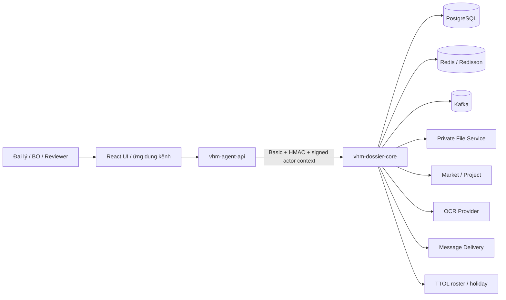
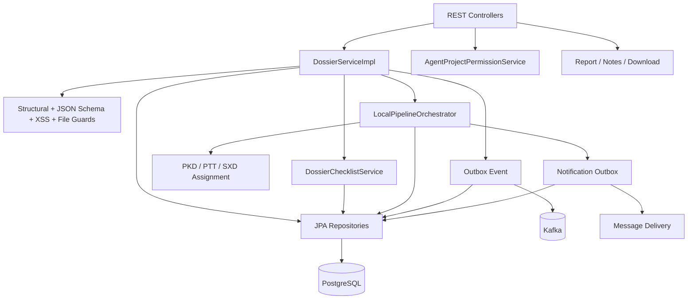
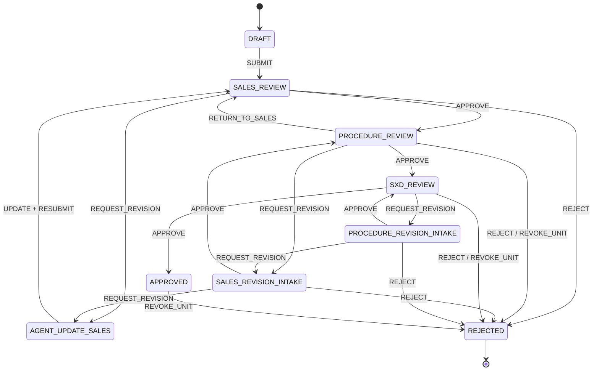
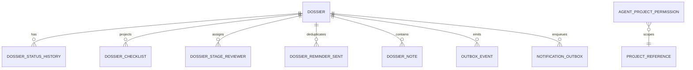
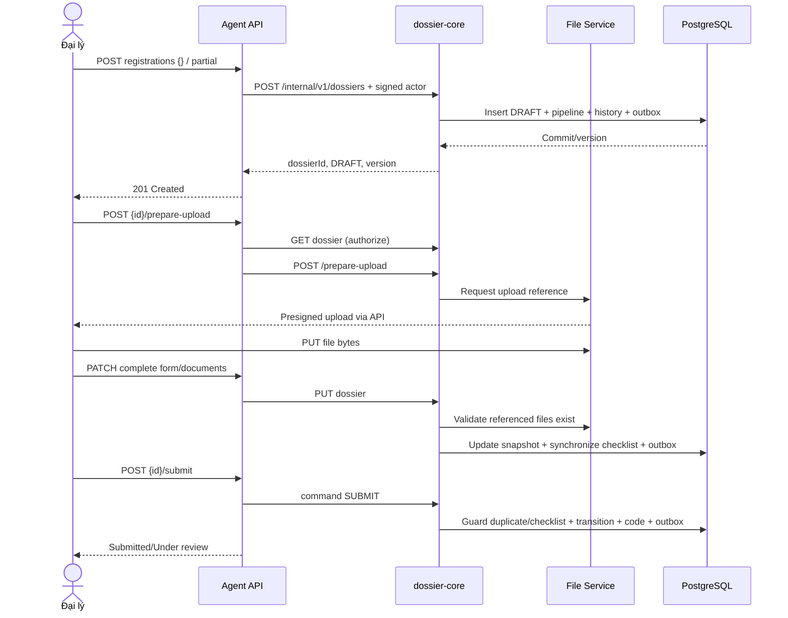
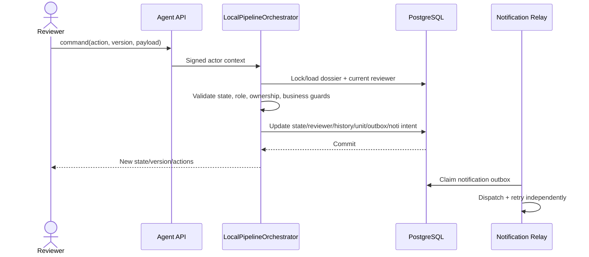

> **TÀI LIỆU NỘI BỘ** — Tài liệu mô tả thiết kế kỹ thuật L2 và hiện trạng triển khai của năng lực quản lý hồ sơ Nhà ở Xã hội. Không chia sẻ ra ngoài phạm vi dự án khi chưa được phê duyệt.

# L2 - VHMKDO2O - Dịch vụ quản lý hồ sơ Nhà ở Xã hội

| **Trường** | **Nội dung** |
| --- | --- |
| **Trạng thái** | **ĐANG THẨM ĐỊNH (UNDER REVIEW)** |
| **Phiên bản & lịch sử thay đổi** | `v0.9.0` — 15/08/2026 — Viết lại theo mẫu L2, đối chiếu trực tiếp code, migration và kiểm thử hiện hành |
| **Chủ sở hữu tài liệu** | `linhnd91` theo tài liệu cũ — cần xác nhận lại |
| **Chủ sở hữu hệ thống** | TBD |
| **Hệ thống** | `vhm-dossier-core` — modular monolith quản lý hồ sơ và pipeline NOXH |
| **Hệ thống liên quan** | `vhm-agent-api`, React UI, PostgreSQL, Redis/Redisson, Kafka, File Service, Market, OCR, Message Delivery, TTOL |
| **Đội ngũ/PIC** | Backend: TBD · Kiến trúc: TBD · Tích hợp: TBD · ANBM: TBD · Quyền riêng tư dữ liệu: TBD · Vận hành: TBD |
| **Người rà soát/phê duyệt** | Sản phẩm/BA: TBD · Kiến trúc: TBD · ANBM: TBD · DBA/Vận hành: TBD · QA: TBD |
| **Mốc thiết kế** | Baseline `as-built` tại ngày 15/08/2026; các khoảng trống production được quản lý tại mục 16 |
| **Codebase chính** | `vhm-dossier-core`; BFF công khai ở `../vhm-agent-api`; UI kiểm thử cục bộ ở `../ui` |
| **Tài liệu nguồn** | `ttd/tdd-dossier-old.md`, trang mẫu L2 OCR/eKYC, `AGENTS.md`, mã nguồn và Liquibase trong repository |
| **Lần rà soát gần nhất** | 15/08/2026 |

## Approval & Review Gates

| **Vai trò rà soát/phê duyệt** | **Phạm vi rà soát** | **Quyết định** | **Ngày xác nhận** |
| --- | --- | --- | --- |
| Chủ sở hữu Sản phẩm/Nghiệp vụ | Luồng đăng ký, checklist, duyệt PKD/PTT/SXD, SLA nhắc bổ sung | Chờ rà soát | — |
| Kiến trúc Ứng dụng/Giải pháp | Ranh giới modular monolith, API, pipeline và tính nhất quán | Chờ rà soát | — |
| Kiến trúc Tích hợp | Agent API, File, Market, OCR, Message Delivery, TTOL, Kafka | Chờ rà soát | — |
| ANBM | IAM nội bộ, actor context, chống phát lại, PII và file | Chờ rà soát | — |
| Quyền riêng tư/Pháp chế | CCCD, thông tin liên hệ, lưu giữ, truy cập và xóa dữ liệu | Chờ rà soát | — |
| DBA/Vận hành/QA | Migration, dung lượng, quan sát, DR và bằng chứng kiểm thử | Chờ rà soát | — |

## Governance Gates

| **Chuyển trạng thái** | **Điều kiện đầu vào** |
| --- | --- |
| `DRAFT → UNDER REVIEW` | Nội dung khớp code; các giả định, phụ thuộc, rủi ro và vấn đề mở có định danh. |
| `UNDER REVIEW → APPROVED` | Có owner/reviewer đích danh; contract Checklist/File/Pipeline được chốt; security, privacy, NFR và vận hành có phê duyệt. |
| `APPROVED → IMPLEMENTATION BASELINE` | OpenAPI, migration, contract test, E2E, load test, DR/runbook và production configuration có bằng chứng. |

## L3 Artefact Register

| **Tài liệu L3** | **Trạng thái** | **Chủ sở hữu** | **Cổng bắt buộc** | **Tham chiếu** |
| --- | --- | --- | --- | --- |
| OpenAPI Agent API và dossier-core | Có trong code, cần đóng băng phiên bản | Backend | Trước duyệt API | Swagger/OpenAPI của hai repository |
| Đặc tả JSON Schema Social Housing v1 | Đã triển khai | Backend/BA | Trước UAT | `src/main/resources/schemas/social_housing.v1.json` |
| Định nghĩa pipeline Social Housing v1 | Đã triển khai | Backend/BA | Trước UAT | `src/main/resources/pipelines/social-housing-standard-v1.yaml` |
| Contract Checklist chuẩn | **CHƯA CÓ** | BA/Tích hợp/Backend | Trước production | OI-001 |
| Contract sở hữu/quyền upload file | **CHƯA ĐỦ** | File Team/ANBM/Backend | Trước production | OI-002 |
| Runbook migration/rollback/DR | Planned | DBA/Vận hành | Trước OAT | TBD |
| Runbook dashboard/cảnh báo/sự cố | Planned | Vận hành | Trước go-live | TBD |

## Quy ước trạng thái thiết kế

| **Nhãn** | **Ý nghĩa** |
| --- | --- |
| `ĐÃ TRIỂN KHAI` | Có mã nguồn/migration/test tương ứng trong snapshot hiện tại. |
| `MỘT PHẦN` | Có implementation nhưng contract hoặc coverage production chưa hoàn chỉnh. |
| `BẮT BUỘC` | Phải hoàn thành và có bằng chứng trước production. |
| `BÊN NGOÀI` | Do dependency quy định; cần contract test và SLA. |
| `TBD` | Cần owner xác nhận trước cổng tương ứng. |

Tài liệu này là **as-built L2**, không phải bản mô tả kiến trúc mong muốn. Khi nội dung cũ mâu thuẫn với code, thứ tự ưu tiên là: migration và ràng buộc cơ sở dữ liệu → service/domain hiện hành → pipeline YAML → controller/OpenAPI → tài liệu cũ. Kiến trúc Camunda 8, Definition Center, processor service riêng và các bảng `application_*` trong bản cũ **không thuộc baseline hiện tại**.

# 1. Business Objectives & Scope

### Business Context & Objectives

`vhm-dossier-core` số hóa việc tiếp nhận, cập nhật, kiểm tra và phê duyệt hồ sơ đăng ký Nhà ở Xã hội. Đại lý tạo bản nháp, tải tài liệu, hoàn thiện snapshot hồ sơ rồi chủ động nộp. Hồ sơ được xử lý qua các nhóm PKD, PTT và đầu mối SXD; mọi hành động hợp lệ được quyết định bởi pipeline nội bộ và actor context đã ký.

#### Current Business Problem

- Hồ sơ giấy/Excel/email khó kiểm soát tính đầy đủ, phiên bản và lịch sử xử lý.
- Nhập tay CCCD và thông tin khách hàng dễ sai; tài liệu thiếu hoặc không tồn tại chỉ được phát hiện muộn.
- Nhiều người có thể tạo hồ sơ cho cùng khách hàng và dự án, dẫn đến trùng nghiệp vụ và tranh chấp căn.
- Quyền xem/xử lý theo đại lý, đội nhóm, dự án và cấp duyệt phải được thực thi nhất quán giữa Agent API và core.
- Luồng trả bổ sung cần SLA, nhắc hẹn, lịch sử và khả năng tiếp tục đúng cấp duyệt.
- Các tích hợp File, OCR, Market, TTOL và Message Delivery có độ sẵn sàng khác nhau; không được làm mất trạng thái đã commit.

#### Business Objectives

- Tạo hồ sơ `DRAFT` nhanh với form rỗng hoặc một phần; create không tự động submit.
- Duy trì một snapshot `formData`/`metadata` có version, lịch sử trạng thái và projection pipeline.
- Ngăn hồ sơ active trùng theo `(applicant.idNumber, projectRegistration.projectId)` kể cả khi có race.
- Bảo đảm checklist bắt buộc đã được upload trước `SUBMIT`.
- Thực thi pipeline PKD → PTT → SXD, bao gồm trả bổ sung, phân công, nhận xử lý, cấp/thu hồi căn và hồ sơ giấy.
- Cung cấp list/detail/statistics/export và progress checklist cho Agent API/UI.
- Tách việc gửi sự kiện và notification khỏi transaction nghiệp vụ bằng outbox.
- Bảo vệ PII bằng actor context, visibility, ownership, masking và xác thực nội bộ có chữ ký.

## 1.1 In Scope

| **Capability** | **Phạm vi** | **Hiện trạng** |
| --- | --- | --- |
| Hồ sơ | Create/read/list/update/delete DRAFT, statistics, lookup theo contact | `ĐÃ TRIỂN KHAI` |
| Luồng đăng ký công khai | Create DRAFT → prepare upload → PATCH snapshot → submit | `ĐÃ TRIỂN KHAI` qua Agent API |
| Checklist | Đồng bộ từ `documents[]`, progress, missing/invalid, readiness submit | `MỘT PHẦN` — chưa có nguồn Checklist chuẩn |
| Pipeline | State/action/role/ownership trong modular monolith | `ĐÃ TRIỂN KHAI` |
| Phân công reviewer | Manual, round-robin PKD và roster TTOL cho PTT/SXD | `ĐÃ TRIỂN KHAI`, best effort |
| Quyền dự án | Grant/revoke/list/group theo team/project/scope | `ĐÃ TRIỂN KHAI` |
| OCR CCCD | Validate hai mặt đồng bộ qua một provider cấu hình | `MỘT PHẦN` — không ghi checklist |
| File | Chuẩn bị upload, validate tồn tại trước create/update | `MỘT PHẦN` — chưa chứng minh ownership |
| Notification/reminder | Transactional outbox email và nhắc bổ sung T+6/T+18 | `MỘT PHẦN` — kênh khác chưa dispatch |
| Báo cáo/tải file | Export danh sách NOXH; tải hợp đồng/tệp đính kèm | `ĐÃ TRIỂN KHAI` |
| Notes/hardcopy | Ghi chú và theo dõi hồ sơ giấy | `ĐÃ TRIỂN KHAI` |

## 1.2 Out of Scope

- Tách UC-01 đến UC-06 thành processor/microservice mới.
- Camunda/Zeebe hoặc BPMN engine bên ngoài; pipeline hiện chạy trong cùng ứng dụng và transaction.
- Sở hữu master data dự án, người dùng, đội nhóm, ngày nghỉ hoặc file binary.
- Thuật toán OCR; core chỉ điều phối client OCR được chọn bằng cấu hình.
- Quyết định pháp lý về đủ điều kiện NOXH dựa riêng vào OCR.
- Quản trị checklist chuẩn ở trình duyệt; `isRequired` do client gửi chưa thể là authority production.
- Thanh toán, ký điện tử và tích hợp tự động trực tiếp với cơ quan SXD.
- Chứng minh người upload sở hữu file nếu File Service chưa trả owner/upload-grant.

### Assumptions, Constraints & Dependencies

| **ID** | **Giả định/Ràng buộc** | **Trạng thái** | **Ảnh hưởng** |
| --- | --- | --- | --- |
| A-01 | UC-01…UC-06 nằm trong một modular monolith | Quyết định hiện hành | Không triển khai processor service riêng. |
| A-02 | Agent API là public boundary; core chỉ cung cấp `/internal/v1/**` | Quyết định hiện hành | Client không gọi core trực tiếp. |
| A-03 | PostgreSQL là nguồn sự thật của hồ sơ, checklist, projection pipeline và outbox | Quyết định hiện hành | Mọi mutation trọng yếu dùng cùng transaction DB. |
| A-04 | Create chỉ tạo `DRAFT`; submit là lệnh riêng | Contract bắt buộc | UI/BFF phải thực hiện đủ bốn bước đăng ký. |
| A-05 | Kafka có thể giao lặp; relay/consumer phải idempotent | Giả định nền tảng | Outbox chấp nhận publish lặp, không làm lặp quyết định nghiệp vụ. |
| A-06 | File path là opaque; namespace upload độc lập với dossier ID | Đã xác minh STG | Không áp dụng kiểm tra prefix `registrations/{dossierId}/`. |
| A-07 | Chỉ một pipeline Social Housing khớp sản phẩm | Giả định tạm thời | Nếu có nhiều pipeline, selection hiện lấy bản đầu tiên; phải đóng OI-003. |
| A-08 | Schema validation nâng cao có thể bật/tắt bằng cấu hình | Hiện trạng | Structural guard luôn chạy; JSON Schema mặc định tắt nếu không cấu hình. |
| A-09 | External services có contract/SLA riêng | `BÊN NGOÀI` | Cần timeout, retry hữu hạn, monitoring và contract test. |

### Stakeholders & Personas

| **Nhóm** | **Trách nhiệm/quyền** |
| --- | --- |
| Đại lý / `APPLICANT_AGENT` | Tạo và cập nhật DRAFT, upload, submit/resubmit, xem hồ sơ trong phạm vi. |
| PKD / `PKD`, `PKD_LEAD` | Phân công/nhận hồ sơ, cấp căn, duyệt, trả bổ sung, từ chối, hồ sơ giấy. |
| PTT / `PTT`, `PTT_LEAD` | Kiểm tra thủ tục, duyệt/trả bổ sung/từ chối, chuyển SXD. |
| Đầu mối SXD | Được mô hình hóa bằng stage `SXD` nhưng xử lý qua roster/role PTT hiện hành. |
| BO/Admin | Quản lý quyền dự án, tra cứu/báo cáo và vận hành. |
| Agent API | Xác thực kênh, map DTO, ký request và actor context khi gọi core. |
| File/Market/OCR/Message Delivery/TTOL | Cung cấp năng lực tích hợp không thuộc sở hữu core. |

### Personal Data Processing Summary

| **Dữ liệu** | **Mục đích** | **Vị trí** | **Kiểm soát hiện hành/yêu cầu** |
| --- | --- | --- | --- |
| CCCD, họ tên, ngày sinh, địa chỉ | Định danh và xử lý hồ sơ | `dossier.form_data` JSONB | Actor visibility, masking, XSS guard, mã hóa hạ tầng/TBD retention. |
| SĐT/email người nộp và vợ/chồng | Liên hệ, tìm kiếm, notification | JSONB và notification outbox | PKD masking; không ghi body nhạy cảm vào log. |
| Đường dẫn file | Gắn tài liệu và gọi OCR | JSONB/checklist | Chỉ lưu path; kiểm tra tồn tại; ownership còn thiếu. |
| Kết quả/phê duyệt tài liệu | Readiness và quyết định | JSONB/checklist/history | Chỉ actor có quyền được mutation; lịch sử append trong snapshot. |
| Actor/reviewer | Audit và routing | audit columns, status history, stage reviewer | Actor context có chữ ký; không tin actor do client truyền. |

### System Criticality

Đề xuất **Cấp 2 — nghiệp vụ trọng yếu, xử lý dữ liệu cá nhân nhạy cảm**. Phân loại chính thức, RTO/RPO, retention và yêu cầu mã hóa phải được System Owner, ANBM, Privacy và Vận hành ký duyệt trước production.

# 2. Architecture Overview & Principles

## 2.1 Nguyên tắc thiết kế

| **Mã** | **Nguyên tắc** |
| --- | --- |
| ARCH-01 | Core là modular monolith; không tạo service xử lý pipeline riêng. |
| ARCH-02 | PostgreSQL là nguồn sự thật; mutation hồ sơ, checklist, history và outbox cùng transaction. |
| ARCH-03 | Create và submit tách biệt; mọi create thành công trả về `DRAFT`. |
| ARCH-04 | Pipeline được cấu hình bằng YAML nhưng thực thi trong process bởi `LocalPipelineOrchestrator`. |
| ARCH-05 | Không tin actor/role từ request body; dùng actor context có chữ ký. |
| ARCH-06 | Dùng optimistic lock cho update/command và DB constraint cho race cuối. |
| ARCH-07 | Idempotency replay được kiểm tra trước validation và được serialize bằng advisory lock. |
| ARCH-08 | Event/notification dùng transactional outbox, chấp nhận at-least-once. |
| ARCH-09 | File path là tham chiếu opaque; không suy luận ownership từ prefix. |
| ARCH-10 | Mọi khoảng trống production phải được quản lý bằng risk/open issue, không mô tả như đã triển khai. |

## 2.2 Sơ đồ kiến trúc ứng dụng

### 2.2.1 Sơ đồ ngữ cảnh hệ thống

### 2.2.2 Sơ đồ thành phần

### 2.2.3 Sơ đồ kiến trúc pipeline nội bộ

Core tải `social-housing-standard-v1.yaml` từ classpath qua repository in-memory. Khi tạo hồ sơ, service chọn pipeline hỗ trợ `SOCIAL_HOUSING`, ghi `pipeline_code`, `pipeline_version`, state hiện tại và khởi tạo history trong cùng transaction. Mỗi command tiếp theo được `LocalPipelineOrchestrator` kiểm tra role, ownership, guard nghiệp vụ, version rồi cập nhật projection/history/reviewer/outbox một cách nguyên tử. Không có process instance Camunda và không có eventual consistency giữa core với workflow engine.

### 2.2.4 Phân định trách nhiệm module

| **Component** | **Trách nhiệm** | **Dữ liệu quản lý** | **Không chịu trách nhiệm** |
| --- | --- | --- | --- |
| `vhm-agent-api` | Public API, auth kênh, DTO mapping, ký request/actor, kiểm tra quyền trước prepare-upload | Không sở hữu dossier | Business invariant cuối và persistence. |
| `DossierServiceImpl` | CRUD, validation, duplicate/idempotency, transaction aggregate | `dossier`, children, create/update outbox | UI/session authentication. |
| `DossierChecklistService` | Đồng bộ checklist snapshot và tính progress | `dossier_checklist` | Nguồn checklist chuẩn bên ngoài. |
| `LocalPipelineOrchestrator` | State/action/role/ownership, code, unit, reviewer, reminder intent | pipeline projection/history/reviewer | Workflow engine bên ngoài. |
| Relays/scanners | Publish Kafka, gửi email, quét reminder | outbox/reminder sent | Thay đổi quyết định nghiệp vụ đã commit. |
| External clients | File, OCR, Market, Message Delivery, TTOL | Cache/response transient | Sở hữu aggregate dossier. |

### 2.2.5 Ranh giới tin cậy

| **Ranh giới** | **Mức tin cậy** | **Kiểm soát** | **Khoảng trống** |
| --- | --- | --- | --- |
| Client → Agent API | Không tin cậy | Auth kênh, role, validation, rate limit tầng gateway | Thuộc phạm vi Agent API/platform. |
| Agent API → core | Zero Trust nội bộ | Basic Auth, HMAC, timestamp/nonce/body hash, actor signature | Cần vận hành secret rotation. |
| Actor context → business | Chỉ tin sau verify | `subject`, role, visibility, expiry, JTI | JTI replay đang có thể tắt theo môi trường. |
| Core → File/OCR/Market/TTOL/Message | Dependency ngoài process | Credential server-side, timeout/retry/config | Contract/SLA và ownership file cần chốt. |
| Core → Kafka | At-least-once | Transactional outbox, retry, idempotent consumer | Publish mặc định có thể tắt theo config. |

## 2.3 Vòng đời hồ sơ

### 2.3.1 Trạng thái công bố

Pipeline Social Housing v1 sử dụng các business status chính: `DRAFT`, `SUBMITTED`, `UNDER_REVIEW`, `ADD_INFO_REQUESTED`, `APPROVED`, `REJECTED`. `APPROVED` vẫn cho phép thu hồi căn theo pipeline hiện tại; `REJECTED` là terminal. Enum tổng quát có thêm trạng thái legacy nhưng không mặc nhiên thuộc flow NOXH v1.

### 2.3.2 State machine

## 2.4 Tính nhất quán và Idempotency

### 2.4.1 Tạo tài nguyên và idempotency

- `source` mặc định `AGENT`; `MARKET` bắt buộc header `Idempotency-Key` (`10509`).
- Với idempotency key, core lấy PostgreSQL transaction advisory lock trên key trước khi kiểm tra replay.
- Replay được tra theo `(idempotencyKey, createdBy)` **trước** form/schema/file validation; cùng actor nhận lại dossier đã tạo.
- Nếu key toàn cục đã thuộc actor khác, request bị từ chối; DB có unique constraint cuối trên `idempotency_key`.
- Sau pipeline initialization, entity được `flush` trước khi dựng response để `version` trả về bằng version trong DB.

### 2.4.2 Transactional outbox

Create/update/transition/delete ghi business row và `outbox_event` trong cùng transaction. Relay khóa theo batch (`FOR UPDATE SKIP LOCKED`), publish Kafka khi tính năng được bật và cập nhật trạng thái gửi. `notification_outbox` là outbox riêng cho ý định gửi thông báo; relay hiện dispatch kênh `EMAIL`, retry exponential có giới hạn và chuyển `FAILED` khi hết số lần thử.

### 2.4.3 Ranh giới nhất quán

| **Thao tác** | **Cùng transaction** | **Ngoài transaction** |
| --- | --- | --- |
| Create/update | Dossier, pipeline projection, status history, checklist, outbox | Kafka publish, downstream processing |
| Command pipeline | Dossier/status, reviewer, history, unit, outbox, notification intent | Gửi message và consumer ngoài hệ thống |
| Reminder | Claim/dedup reminder và notification intent | Message Delivery |
| OCR validate | Không thay đổi dossier/checklist | File download/presign và OCR provider |

### 2.4.4 Concurrency guards

- `@Version` và `If-Match` ngăn lost update khi caller cung cấp version; bỏ header đồng nghĩa chấp nhận last-write-wins ở API hiện hành.
- Unique partial index ngăn race hồ sơ active trùng CCCD+dự án; conflict ánh xạ `11011`.
- Unique partial index căn được cấp ngăn hai hồ sơ active giữ cùng căn.
- Reviewer assignment PKD dùng row lock/rotation trong DB; PTT/SXD dùng atomic counter Redis và sticky assignment khi quay lại.
- Command pipeline kiểm tra current state/action trong transaction; mọi side effect chỉ commit khi toàn bộ guard thành công.

# 3. Functional Requirements

## 3.1 Ma trận năng lực chức năng

| **ID** | **Năng lực/yêu cầu** | **Thiết kế hiện hành** | **Trạng thái** |
| --- | --- | --- | --- |
| FR-01 | Tạo hồ sơ nháp | Agent API map sang core create `SOCIAL_HOUSING`; trả `DRAFT` | Đạt |
| FR-02 | Upload tài liệu | Đọc quyền dossier trước; core cấp path theo UUID; client PUT File Service | Đạt một phần |
| FR-03 | Cập nhật snapshot | Full update ở DRAFT/ADD_INFO; contact-only khi đã submit/review | Đạt |
| FR-04 | Nộp hồ sơ | Command `SUBMIT`, duplicate guard, checklist readiness, sinh mã | Đạt |
| FR-05 | Chống trùng | Service precheck + partial unique index | Đạt |
| FR-06 | Checklist/progress | Sync theo template+group; counts/missing/invalid | Đạt một phần |
| FR-07 | Phê duyệt nhiều cấp | Pipeline YAML và `LocalPipelineOrchestrator` | Đạt |
| FR-08 | Phân công reviewer | Manual/reassign/claim + auto round-robin | Đạt |
| FR-09 | Cấp/thu hồi căn | Atomic allocation/approve; unique active unit | Đạt |
| FR-10 | Hồ sơ giấy | Submit/confirm hardcopy và timeline | Đạt |
| FR-11 | OCR CCCD | Validate hai mặt đồng bộ, provider chọn bằng config | Đạt một phần |
| FR-12 | Notification/reminder | Outbox, email, T+6/T+18 và manual trigger | Đạt một phần |
| FR-13 | Tra cứu/báo cáo | List/detail/statistics/by-contact/export | Đạt |
| FR-14 | Xóa bản nháp | Chỉ DRAFT; xóa checklist và child rows | Đạt |
| FR-15 | PIC hồ sơ | Cột/DTO/audit table đã có | Chưa có use case gán PIC hoàn chỉnh |

## 3.2 Quy tắc nghiệp vụ

| **ID** | **Quy tắc** |
| --- | --- |
| BR-01 | Public create không được submit; trạng thái sau create luôn là `DRAFT`. |
| BR-02 | `MARKET` create phải có `Idempotency-Key`; `AGENT` không bắt buộc. |
| BR-03 | Một cặp CCCD người nộp + dự án chỉ có một hồ sơ chưa terminal. |
| BR-04 | Create `{}` không tạo checklist; create có `documents[]` và mọi full update DRAFT/ADD_INFO phải synchronize checklist. |
| BR-05 | Identity checklist là `(dossierId, documentTemplateId, groupCode)`. |
| BR-06 | Submit cần tồn tại ít nhất một required item và mọi required item ở `COMPLETE`. |
| BR-07 | Full update chỉ ở DRAFT/ADD_INFO; SUBMITTED/UNDER_REVIEW chỉ cho sửa contact email/phone. |
| BR-08 | Update không được ghi đè `source`, `assignedUnitCode` hoặc `assignedUnitId` do server quản lý. |
| BR-09 | File identity applicant/spouse và `documents[].s3PathFile` phải tồn tại khi file-validation được bật. |
| BR-10 | Không kiểm tra file path prefix theo dossier ID. |
| BR-11 | Mọi command phải hợp lệ theo state, role và ownership (`OWNER`, `CLAIMER`, `NONE`). |
| BR-12 | Lần submit đầu sinh mã `<sapId>-<agencyId>-<ddMMyy>-<sequence4>`; PKD approve chuẩn hóa thành `<sapId>-<sequence5>`. |
| BR-13 | Reject/revoke unit phải giải phóng căn đang cấp. |
| BR-14 | DRAFT delete xóa checklist tường minh; FK checklist cũng có `ON DELETE CASCADE`. |
| BR-15 | Comment hiện là optional theo pipeline/config; không mô tả là bắt buộc nếu chưa bật guard. |

# 4. Non-Functional Requirements

Các mục tiêu số trong bản cũ (`200 req/s`, P95 cụ thể, `99.9%`) chưa có bằng chứng capacity/SLO được phê duyệt nên không được coi là baseline. Trước production phải chốt NFR theo workload thực tế.

| **ID** | **Nhóm** | **Yêu cầu** | **Baseline/Gap** |
| --- | --- | --- | --- |
| NFR-01 | Availability | Core stateless ở tầng HTTP; DB/Redis/Kafka/external có health và degradation policy | MỘT PHẦN |
| NFR-02 | Consistency | Không mất mutation đã commit; outbox cho event/notification | ĐÃ TRIỂN KHAI |
| NFR-03 | Concurrency | Idempotency, optimistic lock, unique index, row/Redis lock | ĐÃ TRIỂN KHAI |
| NFR-04 | Performance | P95/P99 theo endpoint và peak TPS phải được đo | TBD |
| NFR-05 | Scalability | Scale ngang API/relay; không dùng session cục bộ làm authority | MỘT PHẦN |
| NFR-06 | Security | Signed request/actor, least privilege, PII masking, secret rotation | MỘT PHẦN |
| NFR-07 | Privacy | Purpose, retention, deletion, audit access cho CCCD | TBD/BẮT BUỘC |
| NFR-08 | Recoverability | PostgreSQL PITR, outbox replay, backup/restore drill | TBD/BẮT BUỘC |
| NFR-09 | Observability | Metrics/log/trace/correlation và alert có owner | MỘT PHẦN |
| NFR-10 | Maintainability | Versioned migration/schema/pipeline; backward-compatible API | ĐÃ TRIỂN KHAI một phần |

# 5. Technology Stack & Justification

| **Công nghệ** | **Vai trò** | **Cơ sở lựa chọn/hệ quả** |
| --- | --- | --- |
| Java 25, Spring Boot 4.1 | Runtime/service framework | Stack repository hiện hành; cần image/JVM production được chứng nhận. |
| Spring Data JPA/Hibernate | Aggregate persistence, optimistic lock | Phù hợp transaction domain; cần tránh N+1 và giữ `open-in-view=false`. |
| PostgreSQL, Liquibase | Source of truth, JSONB, constraint, advisory lock | Hỗ trợ transaction/partial index; migration phải forward-safe. |
| Redis/Redisson | Replay/nonce, counter phân công, cache/lock hỗ trợ | Không được là source of truth của dossier. |
| Kafka | Phát domain event từ outbox | At-least-once; consumer cần idempotent. |
| Caffeine | Cache cục bộ cho dữ liệu tham chiếu | Giảm latency; cần invalidation/TTL rõ ràng. |
| JSON Schema 2020-12 | Validate form Social Housing v1 | Cho phép evolution schema; enforcement hiện phụ thuộc config. |
| Thrift/HTTP clients | File, OCR và tích hợp nội bộ | Contract bên ngoài cần timeout/retry/test. |
| Syncfusion/Apache POI | Export/tạo tài liệu | Cần quản lý license, template và kiểm thử output. |

## 5.1 ADR Log

ADR chi tiết nằm tại Phụ lục D. Các quyết định nền tảng: modular monolith, pipeline nội bộ bằng YAML, PostgreSQL source of truth, snapshot JSONB có schema version, transactional outbox, signed actor context, database constraint là race guard cuối.

# 6. Integration Architecture

## 6.1 Danh mục giao diện tích hợp

| **ID** | **Tích hợp** | **Hướng** | **Kiểu** | **Mục đích** | **Failure policy** |
| --- | --- | --- | --- | --- | --- |
| INT-01 | Agent API | Inbound | HTTP sync | Public registration/list/detail/action | Signature/actor fail closed |
| INT-02 | Private File Service | Outbound | Client sync | Prepare upload, existence, download/presign | Fail hard cho validation bắt buộc |
| INT-03 | OCR provider | Outbound | HTTP sync | Validate CCCD trước/sau | Không auto failover; trả lỗi tường minh |
| INT-04 | Market/Project | Outbound | HTTP sync + cache | SAP/project/unit/special days | Tùy use case: fail hard hoặc best effort |
| INT-05 | TTOL | Outbound | HTTP/cache | Roster reviewer/holiday | Auto-assign best effort; manual fallback |
| INT-06 | Message Delivery | Outbound | Outbox relay | Email notification | Retry/backoff → FAILED |
| INT-07 | Kafka | Outbound | Async | Domain event đã commit | Outbox retry; publish có feature flag |

## 6.2 Contract API hồ sơ VHM

### 6.2.1 Public registration flow

| **Bước** | **API Agent** | **Kết quả bắt buộc** |
| --- | --- | --- |
| 1 | `POST /v1/social-housing/registrations` | Tạo duy nhất một `DRAFT`, nhận `dossierId`. |
| 2 | `POST /v1/social-housing/registrations/{id}/prepare-upload` rồi PUT file | Chỉ cấp URL sau khi caller đọc được dossier; giữ `s3PathFile`. |
| 3 | `PATCH /v1/social-housing/registrations/{id}` | Ghi snapshot form/documents đầy đủ. |
| 4 | `POST /v1/social-housing/registrations/{id}/submit` | Chuyển vào pipeline nếu mọi guard đạt. |

### 6.2.2 Core dossier endpoints

Base path: `/internal/v1/dossiers`.

| **Method/path** | **Mục đích** | **Ghi chú contract** |
| --- | --- | --- |
| `POST /` | Create DRAFT | `source`, idempotency và signed actor. |
| `GET /`, `GET /{id}` | List/detail | Visibility, masking, progress/actions. |
| `PUT /{id}` | Full/contact update | `If-Match` optional; Agent PATCH được map sang đây. |
| `DELETE /{id}` | Hard delete DRAFT | `If-Match` optional. |
| `POST /{id}/commands/{action}` | Pipeline action | State/role/ownership/version guards. |
| `POST /{id}/documents/approve` | Document decision | Ghi approval/history trong form snapshot. |
| `POST /prepare-upload` | Tạo upload path/URL | Core nhận registration UUID. |
| `POST /validate-identity-document` | OCR/validate CCCD | Sync, không persistence checklist. |
| `GET /statistics`, `GET /by-contact` | Thống kê/tra cứu | Theo visibility của actor. |
| `GET /{id}/download` | Contracts/attachments | `type=CONTRACTS|ATTACHMENTS`. |
| `POST /{id}/revision-reminders/trigger` | Nhắc thủ công | Role PKD/PKD_LEAD. |

Các endpoint hỗ trợ khác gồm `/internal/v1/agent-project-permissions`, `/internal/v1/dossiers/{id}/notes` và `/internal/v1/reports/social-housing/export`.

### 6.2.3 Envelope và phân trang

Core trả `ServiceResponse { code, message, data }`, trong đó `code=0` là thành công. Danh sách dùng `PageDto { items, pagination }`, page number là 1-based. HTTP status và application error code phải cùng biểu đạt một kết quả; client không được chỉ dựa vào message tiếng Việt.

## 6.3 Contract presigned upload

- Request phải chứa registration ID hợp lệ dạng UUID và metadata file được allowlist.
- Định dạng hỗ trợ trong core gồm JPEG, PNG, PDF, DOC/DOCX và XLS/XLSX; extension được dẫn xuất từ content type đã chấp nhận.
- Object key có dạng `registrations/{registrationUuid}/{slug}_{randomUuid}.{ext}` nhưng không dùng prefix này làm bằng chứng ownership khi attach.
- Agent API phải đọc dossier bằng actor context trước khi xin URL.
- Sau upload, create/update kiểm tra file tồn tại khi feature bật; response File Service hiện chưa có uploader/grant owner nên OI-002 vẫn mở.

## 6.4 Contract OCR

- `ocr-model-active` chọn **chính xác một** provider `IN_HOUSE` hoặc `VINBIGDATA` tại runtime; không tự động chuyển provider.
- Request cần path mặt trước và mặt sau.
- In-house dùng presigned download rồi gọi OCR client; VinBigData tải binary từ private file và gửi hai mặt theo contract vendor.
- Core kiểm tra số giấy tờ/ngày sinh, tuổi tối thiểu 18, ngày hết hạn, ngày/nơi cấp và trả dữ liệu chuẩn hóa cùng URL xem ngắn hạn.
- Kết quả OCR không tự động ghi vào `dossier_checklist.ocr_result` và không tự sửa `formData`; caller phải quyết định áp dụng.

## 6.5 Contract pipeline

### 6.5.1 Action contract

Các action chính gồm `UPDATE`, `SUBMIT`, `RESUBMIT`, `ASSIGN`, `REASSIGN`, `CLAIM`, `ALLOCATE_UNIT`, `APPROVE`, `REJECT`, `REQUEST_REVISION`, `RETURN_TO_SALES`, `SUBMIT_HARDCOPY`, `CONFIRM_HARDCOPY`, `REVOKE_UNIT`. Tập action khả dụng phải lấy từ response `availableActions`, không hard-code theo status ở UI.

### 6.5.2 Role và ownership

Pipeline kiểm tra cả role (`APPLICANT_AGENT`, `PKD`, `PKD_LEAD`, `PTT`, `PTT_LEAD`) và ownership:

- `OWNER`: actor tạo hồ sơ.
- `CLAIMER`: reviewer đang claim stage.
- `NONE`: không yêu cầu ownership nhưng vẫn yêu cầu role.

### 6.5.3 Pipeline selection

Tại create, core tìm pipeline đầu tiên hỗ trợ sản phẩm `SOCIAL_HOUSING`. Đây là behavior hiện hành, không phải contract đủ mạnh khi có nhiều pipeline. Trước khi cấu hình pipeline thứ hai phải có pipeline ID/version authoritative từ upstream hoặc rule selection duy nhất.

## 6.6 Mô hình checklist chuẩn hóa

| **Thuộc tính** | **Giá trị/ngữ nghĩa** |
| --- | --- |
| Identity | `dossierId + documentTemplateId + groupCode` |
| Upload status | `NOT_STARTED`, `COMPLETE` |
| OCR result | `NOT_OCR`, `MATCH`, `MISMATCH`, `INSUFFICIENT_DATA`, `FAILED` |
| Review status | `NOT_REVIEWED`, `VALID`, `INVALID` |
| Completed required | Upload `COMPLETE` và OCR khác `FAILED` |
| Invalid item | OCR `FAILED` hoặc review/constraint tương ứng không đạt |
| Progress | `completedRequired / requiredCount`, làm tròn 2 chữ số |

Khi file không đổi, synchronization giữ OCR/review state; khi path đổi hoặc bị xóa, trạng thái được reset; item không còn trong snapshot bị xóa. Duplicate `documentTemplateId + groupCode` trong cùng request bị từ chối.

## 6.7 Contract lỗi chuẩn

| **Code** | **Ý nghĩa** | **HTTP kỳ vọng** |
| --- | --- | --- |
| `10509` | Thiếu header bắt buộc, gồm idempotency cho MARKET | 400 |
| `11003` | Không tìm thấy dossier | 400/404 theo public mapping |
| `11005` | Dossier không ở trạng thái cho phép sửa | 400 |
| `11006` | Optimistic version conflict | 409 nên được chuẩn hóa ở public API |
| `11010` | Dossier không cho phép xóa | 400 |
| `11011` | Hồ sơ active trùng CCCD+dự án | 409 |
| `11017` | Không có checklist required để submit | 400/422 |
| `11018` | Thiếu required document | 400/422 |

# 7. Data Architecture & Data Flow

## 7.1 Data Model

### 7.1.1 Sở hữu dữ liệu logic

| **Bảng/aggregate** | **Mục đích** | **Invariant chính** |
| --- | --- | --- |
| `dossier` | Aggregate hồ sơ, JSONB form/metadata, source, PIC, pipeline projection, version | UUIDv7; source AGENT/MARKET; active duplicate/unit uniqueness. |
| `dossier_status_history` | Lịch sử trạng thái/action | Tạo trong cùng transaction với transition. |
| `dossier_checklist` | Projection readiness/progress | PK logic template+group; FK cascade. |
| `dossier_stage_reviewer` | Người xử lý theo stage | Assignment/claim/review/decision metadata. |
| `dossier_reminder_sent` | Dedup reminder theo cycle | Dossier/state/rule/cycle unique. |
| `agent_project_permission` | ACL team/project/scope và rotation | Chỉ một permission active theo key. |
| `outbox_event` | Domain event chưa/đã publish | Không mất event khi business commit. |
| `notification_outbox` | Ý định notification và retry | Dedupe key/attempt/status. |
| `dossier_note` | Ghi chú general/hardcopy | Soft-delete theo use case. |
| `audit_log` | Nền tảng audit cho PIC/operation | Table có nhưng writer/use case PIC chưa hoàn chỉnh. |

### 7.1.2 Sơ đồ quan hệ dữ liệu logic

### 7.1.3 Database invariants

- Partial unique index trên normalized JSON path `applicant.idNumber + projectRegistration.projectId` cho dossier chưa terminal.
- Partial unique index trên unit được cấp cho dossier active.
- Check constraint cho `source`; MARKET yêu cầu idempotency key.
- Checklist có constraint enum và `invalid_reason` phù hợp trạng thái.
- Optimistic `version` được JPA quản lý; response create được dựng sau flush.
- Không có FK đến user/PIC/project master vì các định danh này thuộc hệ thống ngoài.

## 7.2 Data Flow Diagram

### 7.2.1 Luồng đăng ký và nộp hồ sơ

### 7.2.2 Luồng phê duyệt

## 7.3 Data Privacy & PII

### 7.3.1 Phân loại và tối thiểu hóa

- CCCD, ngày sinh, địa chỉ, phone/email là PII; ảnh CCCD là dữ liệu nhạy cảm.
- Kafka/outbox/event/log chỉ nên chứa identifier và metadata tối thiểu, không chứa raw binary, presigned URL còn hiệu lực hoặc full formData.
- `idNumber`, `phone`, `email` không được dùng làm metric label hoặc correlation ID.
- PKD/PKD_LEAD nhận dữ liệu liên hệ đã mask theo response mapping hiện hành.
- Export/download cần cùng visibility/ownership guard như detail.

### 7.3.2 Danh mục dữ liệu và yêu cầu quản lý

Retention, legal hold, purge, quyền của data subject và phạm vi audit chưa có baseline trong code; đây là điều kiện production. Xóa DRAFT hiện là hard delete nghiệp vụ, không thay thế chính sách xóa PII cho hồ sơ đã submit/terminal và các bản sao backup/outbox/log.

## 7.4 Data Stores & Ownership

| **Store** | **Authority** | **Failure impact** | **Phục hồi** |
| --- | --- | --- | --- |
| PostgreSQL `dossier_db` | Dossier/checklist/pipeline/history/outbox | Core không thể mutate an toàn | PITR/backup/restore TBD |
| Redis | Nonce/replay, counter, cache/coordination | Auto-assign/cache suy giảm; security replay có thể fail closed | Rebuild cache; HA/runbook TBD |
| Kafka | Distribution của event đã commit | Downstream trễ; business data không mất do outbox | Replay relay/topic retention TBD |
| Private File Store | Binary tài liệu | Upload/OCR/download không hoạt động | Do File Service quản lý |

# 8. Business Flow Diagrams

## 8.1 Sequence/State Diagram

### 8.1.1 Create DRAFT và replay

1. Xác thực actor và chuẩn hóa `source`/key.
2. Với key, lấy advisory lock và kiểm tra replay theo actor.
3. Chỉ khi không replay mới chạy structural guard, optional JSON Schema, XSS sanitizer và file validation.
4. Kiểm tra trùng friendly trước insert.
5. Persist DRAFT, pipeline projection, history, checklist nếu documents không rỗng và outbox.
6. Flush để lấy đúng version; unique conflict cuối được map thành lỗi nghiệp vụ.

### 8.1.2 Update snapshot

1. Kiểm tra dossier visibility và editable state.
2. Nếu có `If-Match`, so với version hiện hành.
3. DRAFT/ADD_INFO: validate toàn bộ snapshot, file và duplicate; giữ server-owned unit; synchronize checklist kể cả danh sách rỗng.
4. SUBMITTED/UNDER_REVIEW: chỉ chấp nhận thay đổi phone/email của applicant/spouse; metadata hoặc field khác bị từ chối.
5. Ghi status/form update history/outbox trong cùng transaction.

### 8.1.3 Submit và sinh mã

1. Pipeline xác nhận actor là owner và action `SUBMIT` hợp lệ ở `DRAFT`.
2. Social Housing guard kiểm tra duplicate active lại trong transaction.
3. Checklist phải có required item và toàn bộ required đã upload.
4. Core lấy SAP/project context từ Market, snapshot server-owned field cần thiết.
5. Sinh mã submit đầu, transition sang Sales review, auto-assign PKD best effort và ghi outbox.

### 8.1.4 Revision và reminder

Khi reviewer request revision, hồ sơ đi về stage intake tương ứng hoặc `agentUpdateAtSales`. Rule YAML hiện dùng mốc nhắc sau 144 giờ/deadline 216 giờ và sau 432 giờ/deadline 504 giờ, loại trừ ngày nghỉ từ Market/TTOL. Scanner chạy theo fixed delay, dedup theo cycle; manual trigger chỉ dành cho PKD/PKD_LEAD. Nếu lịch/notification dependency lỗi, hồ sơ không được tự động reject.

## 8.2 Ma trận xử lý lỗi

| **Tình huống** | **Hành vi** | **Retry** | **Tính nhất quán** |
| --- | --- | --- | --- |
| File không tồn tại | Reject create/full update | Sau khi upload đúng | Không ghi dossier/update |
| Duplicate precheck | Trả `11011` | Không, trừ khi hồ sơ cũ terminal | Không ghi |
| Duplicate race tại unique index | Map `11011` | Như trên | Transaction rollback |
| Version mismatch | Trả `11006` | Caller reload rồi quyết định | Không ghi |
| Checklist thiếu | `11017/11018` | Upload/sync rồi submit lại | Dossier giữ nguyên state |
| External reviewer roster lỗi | Bỏ auto-assign, cho manual path | Best effort | Transition có thể vẫn commit theo action |
| Kafka down | Outbox giữ pending | Relay retry | Business commit không mất |
| Message Delivery lỗi | Notification outbox retry/backoff | Hữu hạn rồi FAILED | Transition không rollback |
| OCR timeout/provider lỗi | Trả lỗi sync | Caller retry có kiểm soát | Không ghi checklist/form |
| Redis security nonce lỗi khi required | Fail closed | Theo runbook | Không xử lý request |

## 8.3 Chuẩn hóa dữ liệu

- Chuẩn hóa CCCD/project ID trước duplicate lookup; không coi chuỗi trắng là identity hợp lệ.
- XSS sanitizer áp dụng cho form/metadata và dữ liệu đưa vào tài liệu/thông báo.
- Server giữ quyền sở hữu `source`, `assignedUnitCode`, `assignedUnitId`, pipeline projection và audit fields.
- `documents[].documentTemplateId` phải là UUID hợp lệ; `groupCode` được chuẩn hóa rỗng cho legacy.
- Timestamps lưu theo kiểu thời gian thống nhất của persistence; API phải biểu diễn ISO-8601 có timezone.
