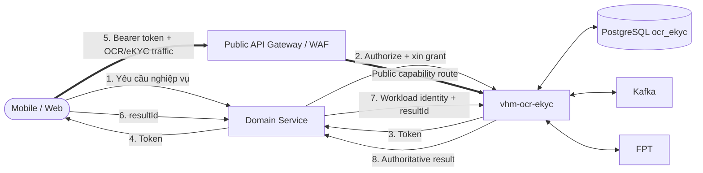
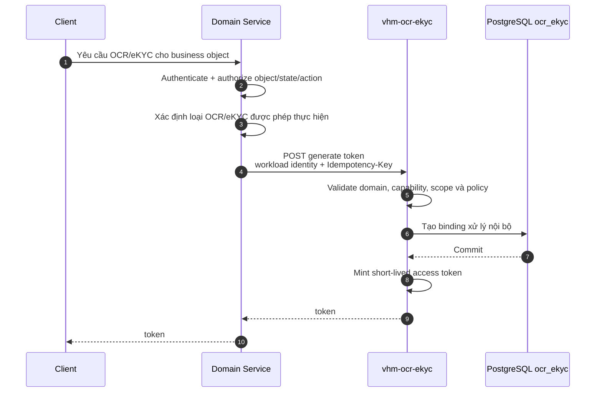
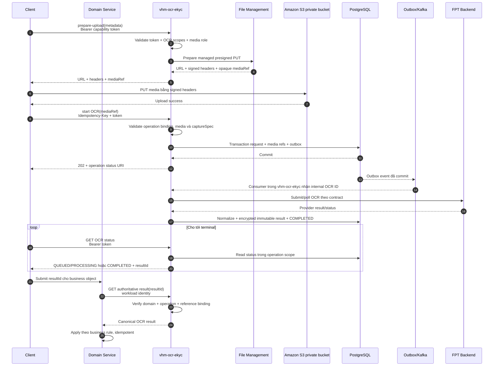
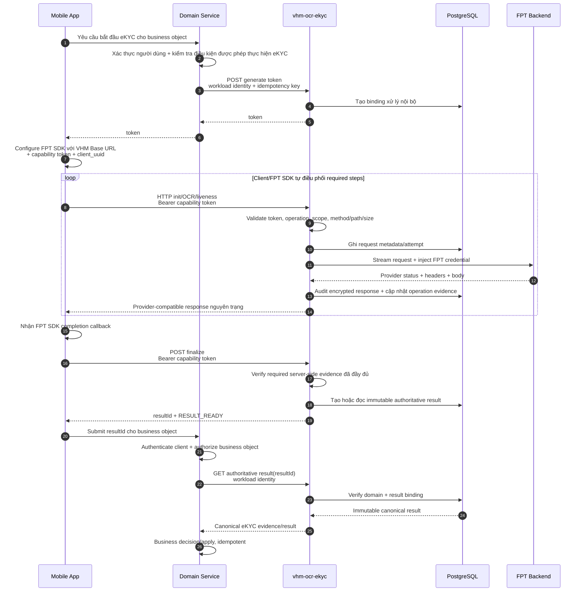
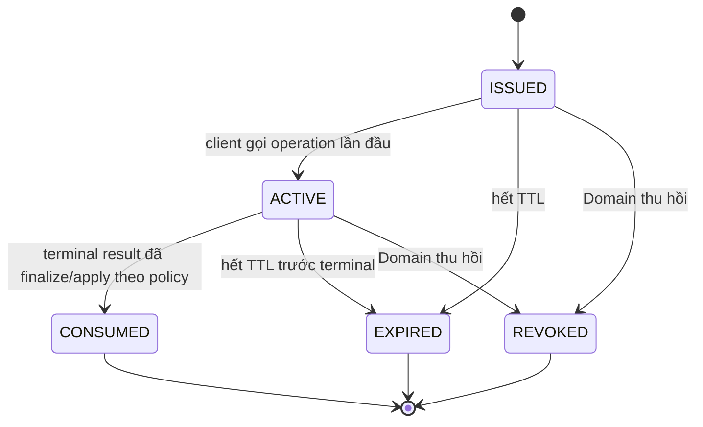
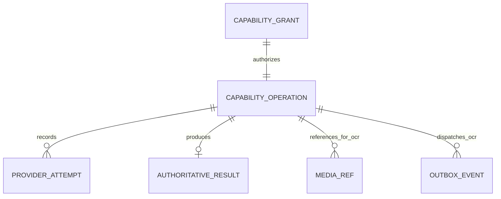

# L2 Delta TDD — OCR/eKYC với delegated client token

| **Trường** | **Nội dung** |
| --- | --- |
| **Trạng thái** | **DRAFT — cần thẩm định Kiến trúc/IAM/ANBM/Mobile/Tích hợp FPT** |
| **Phiên bản** | `v0.1.0` — 17/08/2026 |
| **Tài liệu cơ sở** | `docs/tdd-ocr-ekyc.md` |
| **Mục đích** | Đặc tả topology mới: Domain authorize nghiệp vụ, `vhm-ocr-ekyc` phát capability token, client gọi trực tiếp `vhm-ocr-ekyc`, sau đó Domain lấy authoritative result bằng `resultId` |
| **Phạm vi thay đổi** | Luồng kênh, IAM, API, trạng thái tương quan và cách bàn giao kết quả cho Domain |
| **Không thay đổi** | OCR document vẫn bất đồng bộ; eKYC SDK vẫn đồng bộ và passthrough nguyên contract FPT |

Tài liệu này là **architecture delta** của `docs/tdd-ocr-ekyc.md`. Khi có khác biệt,
các quyết định về delegated token và topology client trong tài liệu này được ưu tiên;
các yêu cầu còn lại của TDD cơ sở tiếp tục áp dụng.

---

# 1. Tóm tắt quyết định

## 1.1 Yêu cầu nghiệp vụ mới

Luồng được yêu cầu:

1. Client gọi Domain Service để yêu cầu thực hiện một nghiệp vụ OCR hoặc eKYC.
2. Domain Service xác thực người dùng, kiểm tra quyền trên business object và xác
   định loại thao tác được phép.
3. Domain Service gọi `vhm-ocr-ekyc` bằng workload identity để sinh token ngắn hạn.
4. `vhm-ocr-ekyc` tự tạo binding xử lý ở phía server và chỉ trả token cho Domain Service.
5. Domain Service trả token cho client.
6. Trong thời gian token còn hiệu lực, client gọi trực tiếp public ingress của
   `vhm-ocr-ekyc`; Domain Service không nằm trên data path OCR/eKYC.
7. `vhm-ocr-ekyc` xử lý OCR hoặc proxy eKYC tới FPT, lưu authoritative result và
   tạo `resultId` opaque.
8. Client thông báo `resultId` cho Domain Service.
9. Domain Service không tin dữ liệu kết quả từ client; Domain Service gọi
   `vhm-ocr-ekyc` bằng workload identity và dùng `resultId` để lấy authoritative
   result, kiểm tra binding rồi mới áp dụng vào business object.

## 1.2 Mục tiêu kiến trúc

- Domain Service vẫn là nơi duy nhất quyết định **ai được làm gì trên hồ sơ nào**.
- `vhm-ocr-ekyc` chịu trách nhiệm phát và cưỡng chế capability grant theo quyết
  định đã được Domain Service xác nhận.
- Raw media và FPT SDK traffic không đi qua Domain Service sau bước cấp quyền.
- Client chỉ chuyển `resultId`; client không phải nguồn sự thật của OCR/eKYC result.
- FPT credential chỉ tồn tại phía server tại `vhm-ocr-ekyc`.
- Không thay đổi request/response mà FPT SDK cần để hoạt động.
- Giảm băng thông, thời gian giữ connection và phạm vi dữ liệu nhạy cảm tại Domain Service.

## 1.3 Không phải mục tiêu

- Token không thay thế business authorization của Domain Service.
- `resultId` không phải bằng chứng đủ quyền và không được dùng như bearer secret.
- `vhm-ocr-ekyc` không quyết định hồ sơ được duyệt/từ chối theo nghiệp vụ.
- Không chuyển OCR document sang xử lý đồng bộ.
- Không đưa init/OCR/liveness của FPT SDK vào Kafka hoặc tự retry mutation.
- Không cho client chọn provider, upstream URL hoặc credential FPT.

---

# 2. Nguyên tắc bắt buộc

| **ID** | **Nguyên tắc** |
| --- | --- |
| DT-ARCH-01 | Domain Service authorize business object trước khi xin token. |
| DT-ARCH-02 | `vhm-ocr-ekyc` chỉ phát token cho workload Domain đã được allowlist và đã xác thực. |
| DT-ARCH-03 | Token chỉ cấp quyền cho một `operationId`, capability và tập scope hữu hạn. |
| DT-ARCH-04 | Client chỉ gọi endpoint public qua API Gateway/WAF/Ingress; không gọi trực tiếp pod/private service address. |
| DT-ARCH-05 | OCR document vẫn dùng PostgreSQL + Transactional Outbox + Kafka + OCR Processor. |
| DT-ARCH-06 | FPT SDK eKYC vẫn đồng bộ; proxy giữ nguyên status/body và header end-to-end theo contract SDK. |
| DT-ARCH-07 | Domain Service lấy kết quả bằng internal server-to-server API; không nhận raw result từ client. |
| DT-ARCH-08 | `resultId` phải opaque, không chứa PII/provider ID và được bind với operation/domain/business context đã cấp quyền. |
| DT-ARCH-09 | Token, provider ID, credential, PII, signed URL và raw media không xuất hiện trong log/event. |
| DT-ARCH-10 | Terminal result là bất biến; finalize và business submit phải idempotent. |
| DT-ARCH-11 | Token hết hạn hoặc bị thu hồi phải bị từ chối trước khi đọc multipart body khi có thể. |
| DT-ARCH-12 | Không có distributed transaction giữa Domain, `vhm-ocr-ekyc`, FPT và client; mọi ranh giới phải có trạng thái/idempotency rõ ràng. |

---

# 3. Phân định trách nhiệm

| **Thành phần** | **Trách nhiệm trong topology mới** | **Không chịu trách nhiệm** |
| --- | --- | --- |
| Client Mobile/Web | Yêu cầu Domain mở nghiệp vụ; nhận token; upload/capture; gọi public capability API; theo dõi operation; gửi `resultId` về Domain | Không giữ FPT credential; không tự tạo verdict; không cung cấp raw provider result cho Domain |
| FPT SDK | Capture, kiểm tra chất lượng đầu vào và tự điều phối init/OCR/liveness theo SDK contract | Không authorize business object; không phát VHM result |
| Domain BFF/API ingress của miền | Xác thực kênh và presentation contract cho bước bắt đầu/kết thúc nghiệp vụ nếu topology miền yêu cầu | Không nằm trên media/data path sau khi token được cấp |
| Domain Service | Authorize hồ sơ/người dùng; xác định capture spec; xin/revoke grant; lưu binding operation; nhận `resultId`; lấy authoritative result; apply nghiệp vụ | Không stream raw media; không giữ FPT credential; không parse provider payload |
| Public API Gateway/WAF/Ingress | TLS termination theo chuẩn nền tảng, WAF/rate limit/body limit sơ bộ và route public capability API | Không thay đổi multipart/body hoặc FPT SDK response |
| `vhm-ocr-ekyc` API | Xác thực workload khi phát grant; mint/validate/revoke token; quản lý operation; public OCR command/status; synchronous eKYC proxy; tạo result; internal result query | Không quyết định quyền nghiệp vụ ban đầu; không apply kết quả vào hồ sơ Domain |
| OCR Processor | Xử lý OCR document bất đồng bộ, gọi/poll FPT, normalize và ghi terminal result | Không xử lý FPT SDK eKYC request |
| FPT integration | Endpoint/credential/timeout/provider contract; inject FPT credential | Không công bố provider credential/ID cho client/domain |
| PostgreSQL `ocr_ekyc` | Grant, operation, request, provider attempt và authoritative result | Không lưu raw eKYC media hoặc access token bản rõ |

Ba câu hỏi được tách rõ:

- Domain Service trả lời: **người dùng có được chạy OCR/eKYC cho hồ sơ này không?**
- Capability grant trả lời: **client được gọi thao tác nào, trên operation nào và đến khi nào?**
- `vhm-ocr-ekyc` trả lời: **gọi FPT thế nào và result chính thức là gì?**

---

# 4. Kiến trúc tổng thể

## 4.1 Control plane và data plane



`==>` biểu diễn data plane có thể chứa media hoặc response nhạy cảm. Domain Service
chỉ tham gia control plane trước operation và result/application plane sau operation.

## 4.2 Ranh giới tin cậy mới

| **Ranh giới** | **Mức tin cậy** | **Kiểm soát bắt buộc** |
| --- | --- | --- |
| Client → Domain Service | Không tin cậy | OIDC/JWT, session/channel control, object-level authorization |
| Domain Service → internal endpoint của `vhm-ocr-ekyc` | Zero Trust nội bộ | mTLS/workload JWT, issuer/audience/scope, allowlist domain, idempotency |
| Client → public `vhm-ocr-ekyc` | Không tin cậy, media nhạy cảm | Capability token, TLS, WAF, rate/concurrency/body limit, scope/operation binding |
| Public ingress → `vhm-ocr-ekyc` | Zero Trust nội bộ | Xác thực ingress/workload, bảo toàn body, trusted forwarding headers |
| Domain Service → result endpoint của `vhm-ocr-ekyc` | Zero Trust nội bộ | Workload identity, domain/result binding, audit access, không chỉ dựa vào `resultId` |
| `vhm-ocr-ekyc` → FPT | Bên ngoài | TLS, fixed allowlist endpoint, secret injection, timeout/quota |

---

# 5. Luồng chung: authorize và phát capability token

## 5.1 Sequence



## 5.2 Quy tắc cấp grant

- Domain Service phải hoàn tất authentication/authorization trước khi gọi grant endpoint
  của `vhm-ocr-ekyc`.
- Domain Service gửi opaque `source`, `referenceId`, `subjectRef`, `requestBy`; không
  nhúng PII vào các tham chiếu này.
- `vhm-ocr-ekyc` không thực hiện lại business rule nhưng phải kiểm tra workload domain
  có quyền xin đúng capability/scope/document type.
- Mỗi token chỉ bind server-side với một lần xử lý và một capability:
  `DOCUMENT_OCR` hoặc `IDENTITY_EKYC`; client không cần biết ID binding nội bộ.
- Capture spec/required steps được cố định tại thời điểm phát grant; client không được
  mở rộng scope sau đó.
- Domain Service không phải nhận hoặc lưu ID xử lý nội bộ của `vhm-ocr-ekyc`.
- Token không được truyền qua query string, URL, cookie hoặc log; dùng header đã được
  SDK/client hỗ trợ.
- Khi token hết hạn trong flow bình thường, client phải quay lại Domain Service để
  được authorize và cấp grant/token mới; public API không tự gia hạn quyền nghiệp vụ.

---

# 6. Luồng OCR document bất đồng bộ

## 6.1 Nguyên tắc

Việc client gọi trực tiếp `vhm-ocr-ekyc` chỉ thay đổi caller/data path của API. Cơ chế
xử lý OCR phía sau không thay đổi:

```text
Public OCR API → PostgreSQL + Outbox → Kafka → OCR Processor → FPT
```

API không giữ HTTP request trong lúc FPT xử lý. Client theo dõi operation bằng public
status API và chỉ nhận `resultId` khi terminal result đã được lưu bền vững.

## 6.2 Sequence



## 6.3 Public OCR response

Public status response chỉ cần dữ liệu tối thiểu:

```json
{
  "operationId": "019...",
  "status": "COMPLETED",
  "resultAvailable": true,
  "resultId": "019...",
  "nextAction": "SUBMIT_TO_DOMAIN",
  "updatedAt": "2026-08-17T03:00:00Z"
}
```

Không trả provider job ID, raw provider result hoặc PII nếu client không có use case
đã được duyệt. Domain Service lấy canonical result bằng internal API.

---

# 7. Luồng eKYC FPT SDK đồng bộ

## 7.1 Nguyên tắc tương thích SDK

- FPT SDK là thư viện được nhúng và chạy trong tiến trình Mobile App, không phải
  endpoint FPT mà App gọi trực tiếp. Mọi HTTP request của SDK phải dùng Base URL
  `vhm-ocr-ekyc`; Client/SDK không được kết nối thẳng tới FPT backend.
- Mobile/Web cấu hình FPT SDK với public proxy base URL của `vhm-ocr-ekyc` và
  capability token trong custom header được phiên bản SDK hỗ trợ.
- SDK tự điều phối `init_session`, OCR, liveness và các bước được capture spec cho phép.
- `vhm-ocr-ekyc` validate token trước khi forward, loại credential phía client và
  inject FPT credential phía server.
- Capability token/custom authorization header chỉ được dùng tại biên VHM và phải
  bị loại trước upstream call; tuyệt đối không chuyển token này tới FPT.
- Request body/multipart do SDK tạo không được parse rồi rebuild hoặc thay đổi.
- Response về SDK giữ nguyên HTTP status/body và header end-to-end thuộc allowlist.
- Không bọc response FPT bằng VHM envelope và không thêm `resultId` vào body FPT.
- Mỗi provider response được audit/lưu mã hóa và bind với `operationId`.
- eKYC mutation không đi qua Kafka và không tự retry khi delivery outcome không rõ.

## 7.2 Vì sao cần finalize API riêng

FPT SDK phụ thuộc provider-compatible response. Chèn `resultId` vào JSON response hoặc
đổi status/header có thể làm SDK lỗi. Vì vậy `resultId` được lấy qua một API VHM riêng,
sau khi SDK callback hoàn tất; API này không nằm trong FPT SDK wire contract.

## 7.3 Sequence



## 7.4 Finalize semantics

- `finalize` là API của VHM App, không phải endpoint do FPT SDK tự gọi.
- Client chỉ gọi `finalize` sau SDK completion callback.
- Service chỉ trả `RESULT_READY` khi các required steps trong capture spec đã có
  authoritative provider response được lưu và kiểm tra thành công.
- Nếu evidence chưa đủ, trả `409 RESULT_NOT_READY`; không gọi lại FPT mutation.
- Gọi finalize lặp lại cho cùng terminal operation phải trả cùng `resultId`.
- Nếu SDK callback báo thành công nhưng response audit chưa lưu được, operation phải
  ở trạng thái cần đối soát; không tạo false-success result.
- Exact canonical eKYC result schema cần L3 riêng và không được đồng nhất với business
  approval/rejection của Domain.

---

# 8. Bàn giao result cho Domain

## 8.1 Nguyên tắc

Client chỉ vận chuyển một opaque `resultId`. Domain Service phải coi mọi dữ liệu từ
client là không tin cậy và luôn dereference result server-to-server.

## 8.2 Sequence kiểm tra binding

Khi nhận `resultId`, Domain Service:

1. Xác thực client và authorize business object hiện tại.
2. Gọi internal result endpoint của `vhm-ocr-ekyc` bằng workload identity và
   `resultId`.
3. `vhm-ocr-ekyc` kiểm tra:
   - result tồn tại và terminal;
   - result thuộc token/binding do Domain này đã yêu cầu tạo;
   - capability/source/reference binding khớp;
   - result chưa bị revoke/expired/deleted;
   - result chưa bị apply trái phép vào business object khác.
4. Domain áp dụng canonical result theo business rule và ghi idempotency/CAS.

Biết hoặc đoán được `resultId` không đủ quyền đọc result.

---

# 9. API contract logic

Đường dẫn chính xác phải được xuất bản trong OpenAPI L3. Các route dưới đây là
logical contract của thiết kế.

## 9.1 Domain → token endpoint của vhm-ocr-ekyc

```http
POST /internal/v1/tokens
Authorization: Bearer <domain-workload-token>
Idempotency-Key: <opaque-key>
Content-Type: application/json

{
  "capability": "DOCUMENT_OCR",
  "source": "DOSSIER",
  "referenceId": "opaque-business-ref",
  "subjectRef": "opaque-subject-ref",
  "requestBy": "opaque-actor-ref",
  "channel": "MOBILE",
  "platform": "ANDROID",
  "purposeCode": "DOSSIER_IDENTITY_VERIFICATION",
  "captureSpec": {
    "documentType": "NATIONAL_ID",
    "mediaRoles": ["DOCUMENT_FRONT", "DOCUMENT_BACK"]
  }
}
```

eKYC dùng `capability=IDENTITY_EKYC` và capture spec ví dụ:

```json
{
  "requiredSteps": ["INIT_SESSION", "OCR", "LIVENESS"],
  "documentType": "IDR",
  "sdkPlatform": "ANDROID",
  "sdkVersion": "approved-version"
}
```

Response:

```json
{
  "token": "<signed-short-lived-token>"
}
```

Domain trả nguyên giá trị `token` cho client. Base URL của `vhm-ocr-ekyc` và cấu hình
SDK là cấu hình cố định của ứng dụng, không sinh động theo từng lần xin token.

## 9.2 Client → Public capability API

Mọi request dùng:

```http
Authorization: Bearer <capability-token>
```

Logical routes:

| **Capability** | **Route** | **Scope** | **Kết quả** |
| --- | --- | --- | --- |
| OCR prepare upload | `POST /v1/client/ocr/uploads:prepare` | `ocr:upload` | Presigned PUT metadata |
| OCR start | `POST /v1/client/ocr:start` | `ocr:start` | `202` + status URI |
| OCR status | `GET /v1/client/ocr/status` | `operation:read` | Status; terminal có `resultId` |
| eKYC init | `POST /v1/ekyc-sdk/init_session` | `ekyc:init` | Provider-compatible response |
| eKYC OCR | `POST /v1/ekyc-sdk/ocr` | `ekyc:ocr` | Provider-compatible response |
| eKYC liveness | `POST /v1/ekyc-sdk/face/liveness` | `ekyc:liveness` | Provider-compatible response |
| eKYC NFC | `POST /v1/ekyc-sdk/check_chip` | `ekyc:nfc` | Provider-compatible response |
| eKYC finalize | `POST /v1/client/ekyc:finalize` | `ekyc:finalize` | VHM `resultId` response |

Client không được truyền `source`, `referenceId`, `subjectRef`, provider hoặc
document type ngoài giá trị đã bind trong operation/capture spec.

## 9.3 Domain → internal result endpoint của vhm-ocr-ekyc

```http
GET /internal/v1/results/{resultId}
Authorization: Bearer <domain-workload-token>
```

Response OCR minh họa:

```json
{
  "resultId": "019...",
  "capability": "DOCUMENT_OCR",
  "status": "COMPLETED",
  "schemaVersion": "ocr-result.v1",
  "result": {
    "documentType": "NATIONAL_ID",
    "fields": {},
    "confidence": {},
    "warnings": [],
    "valid": true
  },
  "completedAt": "2026-08-17T03:00:00Z"
}
```

Response eKYC minh họa:

```json
{
  "resultId": "019...",
  "capability": "IDENTITY_EKYC",
  "status": "COMPLETED",
  "schemaVersion": "ekyc-result.v1",
  "result": {
    "documentCheck": "PASSED",
    "liveness": "PASSED",
    "faceMatch": "PASSED",
    "warnings": []
  },
  "completedAt": "2026-08-17T03:00:00Z"
}
```

Các enum/field eKYC chính thức là TBD và cần Product/Tích hợp/Pháp chế phê duyệt.

## 9.4 Revoke API

Domain Service phải có khả năng thu hồi operation khi hồ sơ bị hủy hoặc quyền thay đổi:

```http
POST /internal/v1/capability-grants/{grantId}:revoke
Authorization: Bearer <domain-workload-token>
Idempotency-Key: <opaque-key>
```

Revoke không hoàn tác provider mutation đã hoàn tất; nó chặn request mới, finalize
và apply ngoài policy, đồng thời ghi audit nội bộ không chứa PII.

---

# 10. Thiết kế token và authorization

## 10.1 Token claims tối thiểu

Nếu dùng signed JWT, claims logic gồm:

```json
{
  "iss": "vhm-ocr-ekyc",
  "aud": "vhm-ocr-ekyc-client-api",
  "sub": "opaque-client-or-subject-ref",
  "gid": "grant-id",
  "oid": "operation-id",
  "cap": "IDENTITY_EKYC",
  "scp": ["ekyc:init", "ekyc:ocr", "ekyc:liveness", "ekyc:finalize"],
  "jti": "unique-token-id",
  "iat": 0,
  "nbf": 0,
  "exp": 0
}
```

Không đưa business reference, PII, provider ID, media path hoặc
credential vào token. Chi tiết binding được lưu server-side theo `grantId/operationId`.

## 10.2 Kiểm soát bắt buộc

- Ưu tiên chữ ký bất đối xứng và quản lý key/version/JWKS theo chuẩn IAM VHM; cơ chế
  JWT/opaque token cuối cùng cần IAM/ANBM phê duyệt.
- Validate signature, issuer, audience, `nbf`, `exp`, token version và scope trên
  mọi request.
- Kiểm tra `operationId` trên path khớp claim và state server-side.
- Kiểm tra capability/scope theo allowlist method/path; token OCR không gọi được eKYC.
- Rate limit theo grant/domain/channel/IP ở mức không đưa PII vào metric label.
- Chặn request khi grant `REVOKED`, `EXPIRED` hoặc `CONSUMED`.
- Token eKYC được tái sử dụng cho nhiều SDK call trong cùng operation; chống replay
  mutation phải dựa thêm vào operation state/idempotency/provider contract, không
  đánh dấu token one-time sau request đầu.
- Không persist access token bản rõ; chỉ lưu hash/JTI/token version cần cho revoke/audit.
- Không log Authorization/custom token header hoặc trả token trong error.
- CORS/CSRF policy cho Web phải được phê duyệt; Mobile không làm giảm yêu cầu TLS/WAF.
- Token TTL phải bao phủ thời gian flow dự kiến nhưng vẫn hữu hạn. Giá trị cụ thể là TBD
  sau khi có p99 duration và FPT session TTL.

---

# 11. Lifecycle và idempotency

## 11.1 Grant lifecycle



## 11.2 OCR operation lifecycle

```text
AUTHORIZED → UPLOADING → QUEUED → PROCESSING
           → COMPLETED(resultId)
           → FAILED | EXPIRED | CANCELLED
```

## 11.3 eKYC operation lifecycle

```text
AUTHORIZED → STARTED → SESSION_INITIALIZED
           → REQUIRED_EVIDENCE_RECORDED
           → RESULT_READY(resultId)
           → FAILED | EXPIRED | CANCELLED | RECONCILIATION_REQUIRED
```

Không hardcode thứ tự mọi flow eKYC. `captureSpec.requiredSteps` và contract SDK/FPT
quyết định evidence nào phải có trước `RESULT_READY`.

## 11.4 Idempotency

| **Thao tác** | **Yêu cầu** |
| --- | --- |
| Phát grant | `Idempotency-Key` theo domain/business action; retry không tạo operation thứ hai |
| Prepare upload | Cùng operation/role/file metadata trả hoặc cấp lại quyền upload theo policy mà không đổi object binding |
| Start OCR | Cùng operation và request fingerprint không tạo OCR/provider job thứ hai |
| OCR worker | Giữ at-least-once/idempotency của TDD cơ sở |
| eKYC mutation | Không tự retry khi không rõ FPT đã nhận; SDK/provider contract sở hữu retry behavior |
| eKYC finalize | Gọi lặp trả cùng immutable `resultId` |
| Domain submit/apply | Cùng business object/result trả cùng outcome; result khác trên cùng step phải theo conflict policy |
| Revoke | Gọi lặp cho cùng grant trả trạng thái đã revoke |

---

# 12. Data architecture và quyền riêng tư

## 12.1 Thay đổi mô hình logic

TDD L3 có thể hiện thực bằng bảng mới hoặc mở rộng bảng hiện tại, nhưng phải biểu
diễn được các entity logic sau:

| **Entity logic** | **Mục đích** | **Dữ liệu tối thiểu** |
| --- | --- | --- |
| Capability grant | Quyền client được Domain ủy quyền | grant ID, operation ID, authorized domain, capability/scopes, token JTI/hash/version, issued/expiry/revoke/consume timestamps |
| Capability operation | Tương quan toàn bộ flow | operation ID, source/reference/subject opaque, capture spec, status/version, deadline |
| Provider attempts | Audit từng call FPT | operation/request link, operation enum, delivery state, status, timestamps; provider ID bảo vệ nội bộ |
| Authoritative result | Result immutable để Domain dereference | result ID, operation ID, schema version, encrypted result, terminal status, created/retention timestamps |

Quan hệ logic:



## 12.2 Ranh giới dữ liệu

- Raw OCR media nằm trong private object storage theo File Management; không vào DB/Kafka.
- Raw eKYC media chỉ stream tới FPT; không persist trong PostgreSQL/local disk/log.
- Response eKYC cần cho authoritative result/audit được mã hóa khi lưu.
- Public status trả metadata tối thiểu; full result chỉ trả qua internal result endpoint
  của `vhm-ocr-ekyc` cho Domain workload đã được authorize.
- Token, media URL, media path, provider session/job/request ID và PII không vào event/log.
- `resultId`, `operationId`, `grantId` là opaque nhưng vẫn được coi là metadata nhạy
  cảm; không dùng làm metric label có cardinality cao.
- Retention/purge phải bao phủ grant, operation, provider attempt, result, media và
  backup; xóa phải idempotent và tôn trọng legal hold đã duyệt.

---

# 13. Xử lý lỗi và phục hồi

| **Tình huống** | **Hành vi bắt buộc** |
| --- | --- |
| Domain từ chối nghiệp vụ | Không gọi grant endpoint của `vhm-ocr-ekyc` hoặc không trả token cho client |
| Grant endpoint lỗi trước commit | Không phát token; Domain có thể retry cùng `Idempotency-Key` |
| Response token mất sau commit | Retry trả cùng operation theo idempotency policy; không tạo operation mới |
| Token sai/hết hạn/revoke | `401/403`; từ chối trước khi đọc body; không gọi FPT |
| Token đúng nhưng sai operation/scope | `403`; ghi metric security không chứa PII |
| Client bỏ dở | Operation hết hạn; Domain có thể đối soát bằng operation ID đã lưu |
| OCR start trùng | Không tạo outbox/provider job thứ hai |
| OCR đang xử lý khi token hết hạn | Worker tiếp tục theo operation đã được chấp nhận; client cần grant/token hợp lệ để đọc status theo policy |
| FPT eKYC non-2xx | Giữ nguyên status/body/header allowlist về SDK |
| eKYC timeout/unknown after send | Không tự retry mutation; ghi attempt `UNKNOWN`/`RECONCILIATION_REQUIRED` |
| Lỗi lưu request trước FPT | Không gọi FPT; trả lỗi service-compatible |
| Lỗi lưu response sau FPT | Vẫn trả response FPT cho SDK, cảnh báo; finalize không false-success khi thiếu evidence |
| Finalize trước khi đủ evidence | `409 RESULT_NOT_READY`; không gọi FPT lại |
| Client gửi result ID của operation khác | `vhm-ocr-ekyc` trả `403/404`; Domain không apply |
| Domain apply trùng | Idempotent return; không ghi business state/result lần hai |
| Result bị xóa/hết retention | Trả trạng thái tường minh theo policy; không phục hồi trái phép |

Một rủi ro mới là client có thể hoàn tất tại `vhm-ocr-ekyc` nhưng không gọi lại Domain.
Domain phải lưu operation ID từ bước grant và có timeout/reconciliation nghiệp vụ.
Server callback/event từ `vhm-ocr-ekyc` về Domain không thuộc baseline này; có thể
được đánh giá như cơ chế tăng độ tin cậy nhưng không thay thế kiểm tra authorization.

---

# 14. Non-functional requirements

| **Nhóm** | **Yêu cầu mới/bổ sung** |
| --- | --- |
| Availability | Public capability API phải HA/Multi-AZ; outage không được làm Domain mất binding operation đã cấp |
| Latency | Token issue nằm trong control path; public OCR acceptance và eKYC proxy có SLO riêng; Domain không nằm trong media timeout chain |
| Capacity | Tính eKYC active streams/bytes trực tiếp tại `vhm-ocr-ekyc`; OCR API/processor dùng bulkhead riêng |
| Security | Internet-facing attack surface mới phải qua WAF/API Gateway, penetration test, abuse/rate/body/concurrency controls |
| Privacy | DPIA/data-flow phải cập nhật vì client truyền dữ liệu nhạy cảm trực tiếp tới capability service |
| Reliability | Grant/operation/result state phải bền vững; finalize/result query idempotent; không false-success khi audit/evidence thiếu |
| Compatibility | Contract test theo từng SDK Android/iOS/Web, đặc biệt custom header, Base URL, session header, multipart và non-2xx |
| Observability | Theo dõi grant issue/deny/expire/revoke, public token reject, operation lifecycle, finalize và internal result fetch |

Timeout eKYC target:

```text
FPT outbound timeout
  < vhm-ocr-ekyc operation deadline
  < public ingress deadline
  < FPT SDK/client timeout
```

Domain Service không còn nằm trong eKYC media timeout chain sau khi grant được cấp.

---

# 15. Observability

Metric tối thiểu bổ sung:

| **Metric** | **Nhãn được phép** |
| --- | --- |
| `capability_grants_total` | domain, capability, outcome |
| `capability_grant_duration_seconds` | capability, outcome |
| `capability_token_rejections_total` | capability, reason |
| `capability_operations_active` | capability, status |
| `capability_operations_expired_total` | capability, last_step |
| `capability_finalize_total` | capability, outcome |
| `capability_result_fetch_total` | domain, capability, outcome |
| `capability_result_binding_rejections_total` | domain, capability, reason |

Không dùng token/JTI, operation ID, result ID, business/subject reference, session ID,
filename, path hoặc PII làm metric label. Log không được chứa các giá trị này nếu
chính sách VHM chưa cho phép; correlation sử dụng internal correlation ID đã kiểm soát.

Cảnh báo mới:

- tỷ lệ token invalid/replay/scope mismatch tăng;
- grant được cấp nhưng operation không bắt đầu hoặc không terminal vượt ngưỡng;
- operation terminal nhưng Domain không apply trong SLA nghiệp vụ;
- finalize thất bại do thiếu persisted evidence;
- result binding rejection/IDOR attempt;
- public ingress/body/concurrency bão hòa;
- FPT SDK compatibility error tăng theo client/SDK version.

---

# 16. Testing strategy

## 16.1 Contract/E2E bắt buộc

- Domain authorize → issue grant → client direct call → result ID → Domain fetch/apply.
- Grant issue idempotency khi timeout/retry đồng thời.
- Token signature/issuer/audience/expiry/nbf/scope/operation mismatch.
- Revoke trước khi bắt đầu, giữa operation và sau terminal.
- Token OCR không gọi được eKYC và ngược lại.
- Client thay operation ID trên path hoặc gửi result ID của user/hồ sơ/domain khác.
- Public ingress không buffer/ghi log multipart nhạy cảm ngoài giới hạn được duyệt.
- OCR upload/start/status hoàn chỉnh qua client token; worker/outbox/Kafka vẫn
  idempotent và không chứa dữ liệu nhạy cảm.
- FPT SDK Android/iOS/Web gọi init/OCR/liveness qua public proxy, giữ nguyên
  request body, multipart, status, response body và header bắt buộc.
- FPT non-2xx, timeout, disconnect và unknown delivery không bị proxy tự retry.
- eKYC finalize trước/sau đủ evidence và finalize trùng trả cùng result ID.
- PostgreSQL lỗi trước/sau FPT response không làm thay đổi provider-compatible SDK response.
- Domain result fetch bắt buộc workload identity và binding; chỉ biết result ID không đủ quyền.
- Domain business apply idempotent và không đồng nhất OCR/eKYC technical success với
  business approval.
- DLP/secret scan xác nhận token, provider credential, PII, raw media, media path,
  signed URL và provider ID không có trong log/event/APM.

## 16.2 Performance/resilience

- Load test public token validation, OCR status polling và eKYC active streaming.
- Đo CPU/latency của signature validation và revocation lookup/cache.
- Test token hết hạn giữa upload, OCR processing và FPT SDK journey.
- Test client disconnect trong multipart upload và sau khi FPT đã nhận mutation.
- Test public ingress/pod restart mà không tạo duplicate OCR/FPT mutation.
- Test DB/KMS/FPT/File Management outage và recovery theo operation state.
- Test result ready nhưng client không quay lại Domain; xác minh expiration/reconciliation.

---

# 17. Phạm vi triển khai bổ sung

So với TDD cơ sở, cần triển khai thêm:

1. Internal grant/revoke endpoints trong `vhm-ocr-ekyc`.
2. Capability token issuer, key management, validation middleware và revocation state.
3. Public ingress/WAF/rate/body/concurrency policy cho `vhm-ocr-ekyc`.
4. Public client OCR upload/start/status API được bind theo operation.
5. Cấu hình FPT SDK Base URL/custom authorization header cho từng client version.
6. Operation/journey correlation xuyên init/OCR/liveness/provider attempts.
7. eKYC finalize API nằm ngoài SDK provider contract.
8. Immutable result ID và internal result endpoint trong `vhm-ocr-ekyc` với
   domain/business binding.
9. Database migration cho grant/operation/result binding và encrypted result.
10. Domain persistence của operation/grant binding, result submit và idempotent apply.
11. Runbook token/key rotation/revoke, abandoned operation, unknown eKYC delivery và
    result-not-applied reconciliation.
12. Contract, security, load, privacy và E2E test cho topology public mới.

Không cần thêm eKYC queue/worker. OCR Processor hiện tại tiếp tục sở hữu luồng OCR
document bất đồng bộ.

---

# 18. Migration và rollout

Khuyến nghị rollout theo feature flag/capability/client version:

1. Xây grant/result endpoints cùng operation/result binding trong `vhm-ocr-ekyc`,
   nhưng chưa mở public traffic.
2. Mở public OCR flow cho một domain/client test, giữ flow cũ làm rollback path.
3. Chốt FPT SDK proxy/custom-header contract trên Android; E2E và load test.
4. Mở eKYC delegated flow Android theo allowlist version/domain.
5. Chốt iOS/Web riêng; không mặc định suy luận tương thích từ Android.
6. Theo dõi token rejection, incomplete operation, result-not-applied và SDK errors.
7. Chỉ loại bỏ flow cũ sau khi hết client version cũ và có bằng chứng production ổn định.

Rollback phải có khả năng tắt phát grant mới/public route theo client version mà không
làm hỏng operation đã được nhận. Operation đã bắt đầu tiếp tục hoặc kết thúc theo
state/runbook; không tự phát lại FPT mutation.

---

# 19. Open issues và cổng phê duyệt

| **ID** | **Vấn đề** | **Điều kiện đóng** |
| --- | --- | --- |
| DT-OI-01 | JWT hay opaque token; issuer/key/JWKS/revocation/cache strategy | IAM + ANBM phê duyệt và security test đạt |
| DT-OI-02 | Token TTL theo OCR upload và FPT SDK p99/session TTL | Product/Mobile/FPT/Vận hành chốt bằng số đo |
| DT-OI-03 | Public hostname/API Gateway/WAF/rate/concurrency/body limits | Cloud/ANBM/Vận hành phê duyệt |
| DT-OI-04 | Exact SDK Android/iOS/Web hỗ trợ Base URL và custom header | FPT/Mobile/Tích hợp sign-off + E2E đạt |
| DT-OI-05 | Canonical eKYC result/evidence schema và required-step completion rules | Product/Tích hợp/Pháp chế phê duyệt |
| DT-OI-06 | Client bỏ dở hoặc không submit result về Domain | Domain timeout/reconciliation policy được duyệt |
| DT-OI-07 | Có cần callback/event server-to-server cho Domain ngoài baseline client-submit | Architecture/Product quyết định |
| DT-OI-08 | Retention/residency/deletion cho public direct processing | DPA/DPIA và Privacy gate hoàn tất |
| DT-OI-09 | Domain có được đọc full result hay chỉ projection theo capability | Product/Privacy/API contract được duyệt |
| DT-OI-10 | Cơ chế bind token với app instance/device key để giảm bearer theft | Mobile/IAM/ANBM quyết định |

---

# Appendix A. So sánh topology

| **Nội dung** | **TDD cơ sở** | **Delegated client flow** |
| --- | --- | --- |
| Business authorization | Domain trên mỗi capability call | Domain một lần trước grant; revoke khi cần |
| OCR/eKYC data path | Client → BFF → Domain → `vhm-ocr-ekyc` | Client → public ingress → `vhm-ocr-ekyc` |
| Credential client | VHM channel token tới BFF | Short-lived capability token do `vhm-ocr-ekyc` phát theo yêu cầu Domain |
| Domain bandwidth/latency | Domain stream media/SDK response | Domain không stream media sau grant |
| OCR processing | Outbox/Kafka/worker | Không đổi |
| eKYC processing | Synchronous FPT SDK proxy | Không đổi; bỏ Domain khỏi SDK data path |
| SDK response | Provider-compatible passthrough | Không đổi |
| Result handoff | Domain gọi capability và nhận/poll result | Client đưa opaque result ID; Domain dereference server-to-server |
| Thành phần mới | Không | Grant/token, operation binding, finalize, internal result API, public security edge |

# Appendix B. Quyết định kiến trúc đề xuất

| **ID** | **Quyết định** | **Trạng thái** |
| --- | --- | --- |
| DT-ADR-001 | Domain authorize nghiệp vụ; `vhm-ocr-ekyc` mint scoped client capability token theo request workload đã xác thực | ĐỀ XUẤT |
| DT-ADR-002 | Client gọi public `vhm-ocr-ekyc` sau grant; Domain không nằm trong media/SDK data path | ĐỀ XUẤT |
| DT-ADR-003 | OCR document giữ nguyên async outbox/Kafka/processor | BẮT BUỘC |
| DT-ADR-004 | eKYC giữ synchronous provider-compatible proxy; result ID lấy qua finalize API riêng | BẮT BUỘC |
| DT-ADR-005 | Client chỉ chuyển opaque result ID; Domain luôn lấy authoritative result server-to-server và kiểm tra binding | BẮT BUỘC |
| DT-ADR-006 | Grant/operation/result state nằm trong PostgreSQL schema `ocr_ekyc`; terminal result bất biến | ĐỀ XUẤT |
