# L2 - VHMKDO2O - Dịch vụ OCR/eKYC

> **TÀI LIỆU MẬT**
> Tài liệu mô tả thiết kế kỹ thuật và trạng thái triển khai của capability OCR/eKYC
> dùng chung trong hệ sinh thái VHM. Không chia sẻ ngoài phạm vi dự án khi chưa
> được phê duyệt.

| **Trường** | **Nội dung** |
| --- | --- |
| **Trạng thái** | **ĐANG THẨM ĐỊNH (UNDER REVIEW)** |
| **Phiên bản & Lịch sử thay đổi** | `v0.9.0` — 14/08/2026 — Mốc L2 theo code, Flyway, tài liệu luồng và contract FPT |
| **Chủ sở hữu tài liệu** | TBD — một cá nhân chịu trách nhiệm tài liệu |
| **Chủ sở hữu hệ thống** | TBD |
| **Hệ thống/Artifact** | `vhm-ocr-ekyc` / Maven artifact `vn.vhm:vhm-ocr-ekyc:0.1.0` |
| **Đội ngũ/PIC** | Backend: TBD · Kiến trúc: TBD · Tích hợp: TBD · ANBM: TBD · Quyền riêng tư dữ liệu: TBD · Vận hành: TBD |
| **Người rà soát / Phê duyệt** | Sản phẩm: TBD · Kiến trúc: TBD · Tích hợp: TBD · ANBM: TBD · Quyền riêng tư/Pháp chế: TBD · Vận hành: TBD |
| **Mốc triển khai** | Source tree, `pom.xml`, `V1__initialize.sql`, cấu hình ứng dụng và kiểm thử tự động tại ngày 14/08/2026 |
| **Tài liệu L1** | `../noxh-ocr-ekyc.md`, `../orc-ekyc-full.md`; liên kết Confluence chính thức: TBD |
| **Tài liệu L3** | Theo Danh mục sản phẩm L3 tại mục 0.2 |
| **Tiêu chuẩn tham chiếu** | `docs/ttd-mau-chuan.md`; tiêu chuẩn VHM về IAM/ANBM/Quyền riêng tư dữ liệu/Quan sát hệ thống: phiên bản TBD |
| **Lần rà soát gần nhất** | 14/08/2026 |

## Mục lục

0. [Thông tin tài liệu & Phê duyệt](#muc-0)
1. [Mục tiêu nghiệp vụ & Phạm vi](#muc-1)
2. [Tổng quan kiến trúc & Nguyên tắc](#muc-2)
3. [Yêu cầu chức năng](#muc-3)
4. [Yêu cầu phi chức năng](#muc-4)
5. [Nền tảng công nghệ & Cơ sở lựa chọn](#muc-5)
6. [Kiến trúc tích hợp](#muc-6)
7. [Kiến trúc dữ liệu & Luồng dữ liệu](#muc-7)
8. [Sơ đồ luồng nghiệp vụ](#muc-8)
9. [Kiến trúc an toàn thông tin & Tuân thủ](#muc-9)
10. [Triển khai & Cấu trúc hạ tầng](#muc-10)
11. [Chi phí & Dung lượng/Hiệu năng](#muc-11)
12. [Khả năng mở rộng & Độ tin cậy](#muc-12)
13. [Khả năng quan sát & Giám sát](#muc-13)
14. [Sẵn sàng vận hành](#muc-14)
15. [Chiến lược kiểm thử & Chất lượng](#muc-15)
16. [Rủi ro & Vấn đề mở/Nợ kỹ thuật](#muc-16)
17. [Phụ lục](#phu-luc)

<a id="muc-0"></a>

# 0. Thông tin tài liệu & Phê duyệt

## 0.1 Cổng rà soát và phê duyệt

| **Vai trò rà soát/phê duyệt** | **Họ tên** | **Phạm vi rà soát** | **Quyết định** | **Ngày xác nhận** |
| --- | --- | --- | --- | --- |
| Chủ sở hữu Sản phẩm/Nghiệp vụ | TBD | Use case OCR thường, CCCD hai mặt, hồ sơ Sale và eKYC | Chờ rà soát | — |
| Kiến trúc Ứng dụng/Giải pháp | TBD | Ranh giới API/processor/shared, NFR và ADR | Chờ rà soát | — |
| Kiến trúc Tích hợp | TBD | File Management, Kafka, FPT và contract client | Chờ rà soát | — |
| ANBM | TBD | IAM, secret, media, mã hóa, audit và kiểm soát mối đe dọa | Chờ rà soát | — |
| Quyền riêng tư/Pháp chế | TBD | Consent, PII/sinh trắc, mục đích, vị trí dữ liệu, lưu giữ và xóa | Chờ rà soát | — |
| Vận hành/Cloud/DBA | TBD | Dung lượng, triển khai, giám sát, sao lưu, phục hồi và runbook | Chờ rà soát | — |

### Các cổng quản trị

| **Chuyển trạng thái** | **Điều kiện đầu vào** |
| --- | --- |
| `DRAFT → UNDER REVIEW` | Nội dung và sơ đồ đủ điều kiện rà soát; mọi giả định/khoảng trống có ID, người chịu trách nhiệm và cổng kiểm soát. |
| `UNDER REVIEW → APPROVED` | Owner/reviewer đích danh; P1 và go-live blocker đã đóng hoặc có risk acceptance hữu hạn; L1/L3/standard link truy cập được. |
| `APPROVED → IMPLEMENTATION BASELINE` | API/provider contract, migration, security/privacy, capacity/cost và quality gate đã có evidence. |

## 0.2 Danh mục sản phẩm L3

| **Tài liệu L3** | **Trạng thái** | **Chủ sở hữu** | **Cổng bắt buộc** | **Liên kết** |
| --- | --- | --- | --- | --- |
| Đặc tả OpenAPI — OCR/Media/Admin | PLANNED | Trưởng nhóm Backend | Trước khi duyệt API | `/v3/api-docs` runtime; tài liệu xuất bản TBD |
| Contract wire eKYC FPT & Ma trận tương thích SDK | BLOCKED | Tích hợp/Mobile/Web | Trước production eKYC | TBD |
| Bộ kiểm thử contract FPT Sale OCR | DRAFT | Tích hợp/QA | Trước production Sale OCR | PDF tại mục B; cần bổ sung fixture tự động |
| Đặc tả Upload/Download media & Lưu giữ | PLANNED | Backend/ANBM/Quyền riêng tư | Trước khi duyệt media production | TBD |
| Contract Kafka/Outbox & Runbook phục hồi | PLANNED | Backend/Vận hành | Trước khi duyệt độ tin cậy | TBD |
| Runbook migration & phục hồi CSDL | PLANNED | DBA/Vận hành | Trước OAT | TBD |
| Runbook dashboard, cảnh báo & sự cố | PLANNED | Vận hành | Trước go-live | TBD |

## 0.3 Chỉ mục bao phủ mẫu L2

| **Mục L2** | **Nội dung trong tài liệu này** |
| --- | --- |
| Mục tiêu nghiệp vụ & Phạm vi | Mục 1 |
| Tổng quan kiến trúc & Nguyên tắc | Mục 2 |
| Yêu cầu chức năng | Mục 3 |
| Yêu cầu phi chức năng | Mục 4 |
| Nền tảng công nghệ & ADR | Mục 5 và Phụ lục D |
| Kiến trúc tích hợp | Mục 6 |
| Kiến trúc dữ liệu & Luồng dữ liệu | Mục 7 |
| Sơ đồ luồng nghiệp vụ | Mục 8 |
| An toàn thông tin & Tuân thủ | Mục 9 |
| Triển khai & Hạ tầng | Mục 10 |
| Chi phí & Dung lượng/Hiệu năng | Mục 11 |
| Khả năng mở rộng & Độ tin cậy | Mục 12 |
| Khả năng quan sát & Giám sát | Mục 13 |
| Sẵn sàng vận hành | Mục 14 |
| Chiến lược kiểm thử & Chất lượng | Mục 15 |
| Rủi ro & Vấn đề mở/Nợ kỹ thuật | Mục 16 |

### Quy ước trạng thái thiết kế

| **Nhãn** | **Ý nghĩa** |
| --- | --- |
| `HIỆN TRẠNG` | Đã được xác minh trong code/migration/config/test tại mốc triển khai. |
| `MỤC TIÊU` | Kiểm soát bắt buộc hoặc kiến trúc đích nhưng chưa đủ bằng chứng trong code hiện tại. |
| `KHOẢNG TRỐNG` | Sai khác/rủi ro cụ thể giữa triển khai và mục tiêu/contract. |
| `BÊN NGOÀI` | Hành vi do tài liệu hoặc contract của dependency quy định; phải kiểm thử contract. |
| `TBD/BLOCKING` | Chưa có quyết định/evidence; không phải giá trị mặc định để đội triển khai tự chọn. |

Tài liệu phân biệt rõ **OCR document** và **eKYC**:

- OCR tài liệu là tài nguyên bất đồng bộ của VHM, có DB/outbox/Kafka/worker, hỗ trợ
  OCR một tài liệu, CCCD hai mặt và hồ sơ Sale ba tài liệu.
- eKYC là façade đồng bộ cho `init-session`, OCR định danh và liveness/face match;
  không tạo tài nguyên OCR, không đưa vào hàng đợi và không tự thử lại mutation.
- Tên route `/v1/ekyc-sdk/*` là contract VHM hiện tại. Nó **không tự chứng minh**
  tương thích với mọi FPT Mobile/Web SDK; tính tương thích phải được chốt theo
  `INT-01` và Danh mục rủi ro.

<a id="muc-1"></a>

# 1. Mục tiêu nghiệp vụ & Phạm vi

## 1.1 Tên hệ thống, Bối cảnh và Mục tiêu

`vhm-ocr-ekyc` là năng lực tích hợp tập trung giúp các miền nghiệp vụ VHM sử dụng OCR và
eKYC mà không phân tán thông tin xác thực nhà cung cấp, contract giao tiếp, ánh xạ lỗi và dữ
liệu nhạy cảm sang từng ứng dụng.

### 1.1.1 Vấn đề hiện tại

- Nhập liệu giấy tờ thủ công dễ sai số định danh, họ tên, ngày và địa chỉ.
- Từng miền nghiệp vụ tự tích hợp nhà cung cấp sẽ lặp thông tin xác thực, retry, quota, audit và logic ánh xạ.
- Độ trễ/tính sẵn sàng của nhà cung cấp OCR không phù hợp để giữ HTTP request của miền nghiệp vụ.
- CCCD hai mặt cần giữ đúng thứ tự và tương quan giữa hai lần tải lên nhà cung cấp.
- Hồ sơ Sale phải nhận đủ CCCD trước/sau và PLHĐ, sau đó đối chiếu dữ liệu, chữ ký
  và con dấu theo contract riêng.
- eKYC chứa media định danh/sinh trắc và nằm trên đường xử lý đồng bộ trọng yếu; sai
  header, multipart field hoặc timeout có thể làm SDK/API không hoạt động.
- Payload thô của nhà cung cấp không ổn định và không phù hợp làm contract cho miền nghiệp vụ.

### 1.1.2 Mục tiêu

- Cung cấp OCR tài liệu bất đồng bộ với contract tạo/trạng thái/kết quả ổn định.
- Bảo đảm tạo OCR và outbox commit nguyên tử, xử lý thông điệp at-least-once an toàn.
- Tích hợp tập trung FPT qua adapter; cố định nhà cung cấp trên tài nguyên OCR.
- Chuẩn hóa OCR thường thành kết quả chuẩn; chỉ công bố các trường thuộc danh sách cho phép.
- Hỗ trợ FPT Sale OCR gửi/thăm dò mà không giữ luồng worker khi provider đang xử lý.
- Cung cấp façade eKYC đồng bộ, chèn credential FPT phía server và audit response đã mã hóa.
- Không đưa thông tin xác thực, provider job ID, presigned URL, media thô hoặc PII vào Kafka/log.
- Xác lập kiểm soát production cho xác thực, quyền riêng tư media, phục hồi,
  quan sát hệ thống, lưu giữ và dung lượng.

## 1.2 Trong phạm vi

| **Capability** | **Phạm vi** | **Trạng thái** |
| --- | --- | --- |
| OCR một tài liệu | Presigned upload/reference → FPT bất đồng bộ → kết quả chuẩn | `HIỆN TRẠNG` |
| OCR hồ sơ Sale | CCCD trước/sau + PLHĐ; FPT `/sale-ocr/register` và thăm dò kết quả | `HIỆN TRẠNG` — cần gia cố production |
| OCR status/result | Tài nguyên VHM, polling, kết quả AES-GCM | `HIỆN TRẠNG` |
| eKYC init/OCR/liveness | Ba API đồng bộ, response tương thích provider và audit mã hóa | `HIỆN TRẠNG` — compatibility chưa sign-off |
| File Management | Chuẩn bị upload, kiểm tra tồn tại, chuẩn bị download | `HIỆN TRẠNG` khi bật tính năng |
| Admin metadata UI/API | Danh sách metadata OCR/kết quả, không giải mã kết quả | `HIỆN TRẠNG` khi `vhm.admin-ui.enabled=true` |
| Thư viện client | `OcrClient`, `EkycClient` và Spring Boot auto-configuration | `HIỆN TRẠNG` |

## 1.3 Ngoài phạm vi

- Huấn luyện/tinh chỉnh OCR, liveness hoặc face-matching model.
- Quyết định pháp lý/đủ điều kiện nghiệp vụ chỉ từ OCR confidence.
- Lưu face template hoặc xây kho nhận diện khuôn mặt.
- NFC, QR, passport, driving licence nếu chưa có contract/approval riêng.
- eKYC callback, Get Result reconciliation, eKYC lifecycle/canonical decision trong
  implementation hiện tại.
- Retry API, cancel API, batch result API VHM và manual-review media reveal.
- Tự động chuyển sang provider khác sau khi OCR đã tạo.
- Hạ tầng production/IaC cụ thể khi chưa có mốc nền tảng được duyệt.

## 1.4 Giả định, Ràng buộc & Phụ thuộc

| **ID** | **Giả định/Ràng buộc** | **Trạng thái** | **Ảnh hưởng** |
| --- | --- | --- | --- |
| A-01 | OCR luôn bất đồng bộ từ góc nhìn bên gọi, kể cả khi lời gọi provider đồng bộ | Quyết định kiến trúc | API trả `202`; client thăm dò VHM. |
| A-02 | eKYC init/OCR/liveness đồng bộ và không tự thử lại mutation | Quyết định kiến trúc | Timeout/không rõ sau khi gửi phải trả lỗi, không phát lại mù. |
| A-03 | File Management quản lý object riêng tư và trả presigned URL ngắn hạn | Phụ thuộc | Thiếu prepare-download thì worker không đọc được media. |
| A-04 | Kafka chuyển phát at-least-once; consumer phải idempotent | Giả định nền tảng | Thông điệp trùng không gọi nhà cung cấp sau trạng thái kết thúc/đã claim. |
| A-05 | FPT Sale giữ kết quả 30 ngày, poll tối thiểu mỗi 3 giây, processing tối đa 5 phút | `BÊN NGOÀI` theo PDF v0.2.0 | Cần kiểm thử contract/SLA chính thức trước production. |
| A-06 | Mỗi file Sale ≤20 MB; đúng 3 file; provider tổng request ≤60 MB | `BÊN NGOÀI` | Bộ nhớ/dung lượng phải được tính theo ba file. |
| A-07 | Luồng phiên FPT eKYC cần cùng `session-id`, `device-type` và endpoint/header đúng phiên bản | `BÊN NGOÀI` | Code hiện tại chưa forward đủ header; `BLOCKING`. |
| A-08 | Bên gọi/BFF chịu trách nhiệm xác thực, phân quyền và phạm vi đối tượng nghiệp vụ | Giả định hiện tại | Service chưa cưỡng chế Spring Security; production cần phòng thủ nhiều lớp. |
| A-09 | Credential provider/khóa mã hóa được cấp qua secret manager/environment | `MỤC TIÊU` | Không được có secret dự phòng trong repo/image/log. |
| A-10 | Purpose, consent, retention, residency và deletion policy được duyệt | `BLOCKING` | Không được go-live với dữ liệu thật nếu thiếu. |
| A-11 | `source`, `referenceId`, `requestBy`, `subjectRef` là opaque reference, không nhúng PII | Contract | Vi phạm làm tăng rò rỉ ở DB/admin/log. |

## 1.5 Các bên liên quan & Nhóm người dùng

| **Nhóm người dùng** | **Trách nhiệm/quyền** |
| --- | --- |
| End User | Upload/capture media và nhận trạng thái/kết quả qua ứng dụng VHM. |
| Domain/BFF Service | Xác thực, authorize business object, cấp opaque context, apply kết quả sau xác nhận. |
| Business Operator | Tra cứu metadata đã được phân quyền; không mặc định xem raw result/media. |
| Platform Operator | Vận hành queue, worker, provider, DB, dashboard và incident. |
| Security/Data Privacy/Auditor | Phê duyệt purpose, access, encryption, retention, log và evidence. |
| FPT | Đơn vị xử lý/nhà cung cấp bên ngoài theo contract và DPA/SLA. |

## 1.6 Tóm tắt xử lý dữ liệu cá nhân

| **Dữ liệu** | **Mục đích** | **Nơi lưu/truyền hiện tại** | **Kiểm soát bắt buộc** |
| --- | --- | --- | --- |
| Ảnh CCCD/CMND/PLHĐ | OCR, đối chiếu hồ sơ | Private object qua File Management; worker tải transiently | Private, TLS, size/type/checksum, retention và purge. |
| Video khuôn mặt/ảnh `cmnd` | Liveness/face match | Multipart đi qua service tới FPT; không persist raw body trong DB | Biometric-purpose consent, bounded memory, no log, DPA. |
| OCR fields/confidence/warnings | Autofill/review | AES-GCM ciphertext trong `ocr_results` | Fixed field allowlist, mask, key rotation, retention. |
| Response eKYC FPT | Audit/xử lý sự cố provider | Bản mã AES-GCM trong `provider_attempts` nếu không quá 2 MB | Hạn chế truy cập, TTL/xóa, không log body ở production. |
| Tham chiếu nghiệp vụ/người dùng | Tương quan/phân quyền | Bản rõ trong `ocrs` | Dạng opaque, truy cập theo phạm vi, không nhúng PII. |
| ID job/request của provider | Tương quan nội bộ | `provider_attempts` | Không lộ ra API/event/log. |

`subjectRef` hiện được DTO tiếp nhận và tham gia dấu vân tay idempotency nhưng chưa
được lưu vào bảng `ocrs`; vì vậy chưa thể dùng làm bằng chứng tương quan/phân quyền
sau khi tạo OCR. Khoảng trống này được theo dõi tại `TD-016`.

## 1.7 Mức độ trọng yếu của hệ thống

Đề xuất **Cấp 2 — Nghiệp vụ trọng yếu, dữ liệu cá nhân nhạy cảm**. Giá trị chính thức,
RTO/RPO và phân loại an toàn thông tin cần Chủ sở hữu hệ thống, ANBM và đơn vị
Quyền riêng tư dữ liệu ký duyệt.
Lỗi OCR/eKYC không được tự biến thành quyết định nghiệp vụ `REJECTED`.

<a id="muc-2"></a>

# 2. Tổng quan kiến trúc & Nguyên tắc

## 2.1 Nguyên tắc thiết kế

| **Mã kiểm soát** | **Nguyên tắc** |
| --- | --- |
| ARCH-01 | Tách luồng điều khiển/worker OCR bất đồng bộ khỏi luồng eKYC đồng bộ. |
| ARCH-02 | Tạo OCR, các bản ghi media và outbox được commit trong một transaction ngắn. |
| ARCH-03 | Không giữ transaction DB hoặc lease worker trong lúc chờ FPT Sale xử lý; thăm dò bằng delayed outbox. |
| ARCH-04 | Adapter FPT cô lập endpoint/xác thực/payload; nhà cung cấp được lưu trên OCR. |
| ARCH-05 | Kafka/outbox chỉ chứa tham chiếu tối thiểu, không chứa đường dẫn media/PII/kết quả. |
| ARCH-06 | eKYC không đưa vào hàng đợi và không tự động thử lại thao tác init/OCR/liveness. |
| ARCH-07 | Response FPT/kết quả chuẩn nhạy cảm phải được mã hóa; phiên bản khóa được lưu. |
| ARCH-08 | Thông tin xác thực, provider job ID và payload thô không thuộc contract công khai/nghiệp vụ. |
| ARCH-09 | Flyway chỉ chạy khi ứng dụng khởi động; processor/worker không tự quản lý migration. |
| ARCH-10 | Kafka consumer, outbox publisher và audit response FPT phải idempotent và có khả năng phục hồi. |

## 2.2 Sơ đồ kiến trúc ứng dụng

### 2.2.1 Sơ đồ ngữ cảnh hệ thống

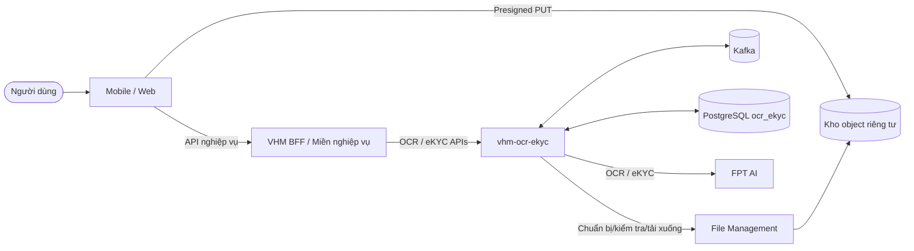

### 2.2.2 Sơ đồ thành phần

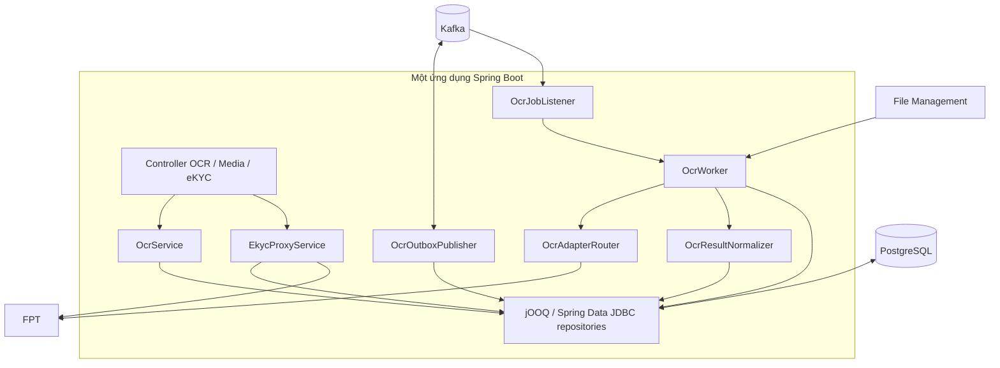

### 2.2.3 Phân định trách nhiệm module

| **Module logic** | **Package/lớp hiện tại** | **Trách nhiệm sở hữu** |
| --- | --- | --- |
| API | `controller`, `service.OcrService`, `service.EkycProxyService` | Lệnh/truy vấn, chuyển tiếp eKYC đồng bộ, audit response và envelope lỗi. |
| Processor | `service.OcrOutboxPublisher`, `kafka.OcrJobListener`, `worker.OcrWorker` | Phát/nhận thông điệp, gửi/thăm dò FPT và chuẩn hóa OCR. |
| Dùng chung | `adapter`, `repository`, `storage`, `security`, `common`, `util`, `client` | Trừu tượng hóa FPT, lưu trữ, mã hóa và contract sự kiện/lỗi/client. |

Cây mã nguồn hiện chưa tách package `vn.vhm.ocrekyc.api` và
`vn.vhm.ocrekyc.processor` theo ranh giới sở hữu mục tiêu trong `AGENTS.md`; đây là `TD-002`.

### 2.2.4 Hai luồng thực thi

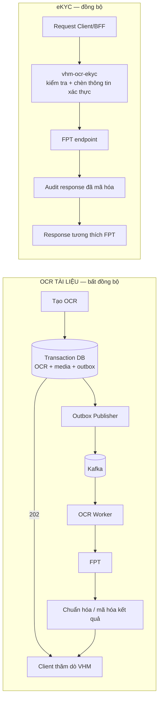

### 2.2.5 Ranh giới tin cậy

| **Ranh giới** | **Mức tin cậy** | **Kiểm soát bắt buộc** | **Hiện trạng** |
| --- | --- | --- | --- |
| Mobile/Web → BFF | Không tin cậy | OIDC/JWT, phân quyền object, giới hạn tần suất/body | Ngoài repository |
| BFF → `vhm-ocr-ekyc` | Zero Trust nội bộ | Danh tính workload/mTLS/JWT, audience/scope, chống phát lại | `KHOẢNG TRỐNG`: chưa có Spring Security |
| Client → kho riêng tư | Đầu vào media không tin cậy | Presigned PUT chính xác, hạn ngắn, checksum, không đọc/liệt kê | Một phần qua File Management |
| Service/worker → File Management/kho lưu trữ | Hạn chế | Thông tin xác thực Basic/workload, danh sách cho phép, TLS, giới hạn byte | `HIỆN TRẠNG`; mục tiêu là danh tính workload |
| Service/worker → FPT | Bên ngoài | TLS, endpoint cố định, credential bí mật, timeout, quota | `HIỆN TRẠNG` một phần |
| Service → PostgreSQL/Kafka | Hạn chế | Mạng riêng, TLS/xác thực, đặc quyền tối thiểu | Bằng chứng triển khai TBD |

## 2.3 Cấu hình vòng đời OCR

### 2.3.1 Máy trạng thái

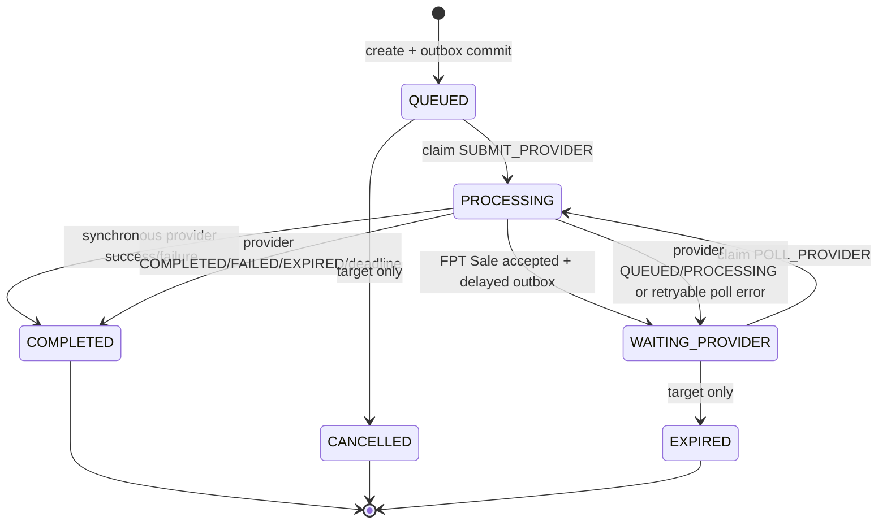

| **Trạng thái** | **Ngữ nghĩa hiện tại** |
| --- | --- |
| `QUEUED` | OCR/media/outbox đã commit; chờ Kafka worker. |
| `PROCESSING` | Worker đã claim bằng CAS và đang gửi/thăm dò/gọi FPT. |
| `WAITING_PROVIDER` | Chỉ dùng FPT Sale; delayed outbox đã lên lịch poll tiếp. |
| `COMPLETED` | Trạng thái kết thúc cho cả thành công và thất bại; phân biệt bằng `outcome`/`errorCode`. |
| `CANCELLED`, `EXPIRED` | Có trong schema/enum nhưng chưa có chuyển trạng thái/API tương ứng. |

`currentStep`: `VALIDATE_MEDIA`, `SUBMIT_PROVIDER`, `POLL_PROVIDER`,
`FETCH_RESULT`, `NORMALIZE`, `DONE`. Code hiện dùng
`VALIDATE_MEDIA`, `SUBMIT_PROVIDER`, `POLL_PROVIDER`, `DONE`.

`outcome`: thành công là `OCR_COMPLETED`; mọi lỗi FPT/nghiệp vụ/truyền tải hiện
được đóng bằng `PROVIDER_ERROR`. `NEED_REVIEW`/`NEED_RETRY` chưa được triển khai.

### 2.3.2 Thời hạn xử lý

- OCR thường/CCCD: `processingDeadlineAt = createdAt + 15 phút`, nhưng worker hiện
  chưa cưỡng chế deadline trên adapter đồng bộ (`KHOẢNG TRỐNG`).
- FPT Sale: deadline `5 phút`; worker kiểm tra trước mỗi poll và kết thúc với
  `PROCESSING_TIMEOUT`.
- HTTP timeout: FPT OCR 10 phút mặc định; FPT Sale 30 giây; connect timeout 2 giây.

## 2.4 Concurrency, Idempotency và Transaction

### 2.4.1 Tạo tài nguyên và idempotency

- Header `Idempotency-Key` bắt buộc ở mọi request tạo OCR.
- Unique DB `(source, idempotency_key)`.
- `request_fingerprint = SHA-256(JSON request)`; CCCD hai mặt bao gồm back path;
  Sale bao gồm đủ ba path.
- Cùng key/fingerprint trả resource hiện hữu; cùng key khác fingerprint trả
  HTTP `409`, mã `40901`.
- Tranh chấp giữa `findIdempotent` và insert vẫn dựa vào unique constraint nhưng chưa ánh xạ
  lỗi vi phạm duy nhất thành response idempotent (`TD-004`).

### 2.4.2 Outbox/Kafka/worker

- Create lưu `ocrs`, `ocr_media`, `outbox_events` trong cùng transaction.
- Publisher claim tối đa 20 bản ghi bằng `FOR UPDATE SKIP LOCKED`, lease 30 giây, gửi
  Kafka đồng bộ rồi đánh dấu `PUBLISHED`; lỗi lên lịch lại sau 5 giây.
- Thông điệp Kafka hiện chỉ là UUID OCR ở key/value. `EventEnvelope` tồn tại nhưng
  chưa được publisher dùng (`TD-005`).
- Worker claim bằng conditional update `QUEUED/WAITING_PROVIDER → PROCESSING`.
  Thông điệp trùng sau khi claim/trạng thái kết thúc sẽ bị bỏ qua.
- OCR row chưa có worker lease; pod chết ở `PROCESSING` sẽ làm job treo (`AR-004`).
- FPT Sale poll non-terminal commit `WAITING_PROVIDER` và delayed outbox, không
  `sleep`, không giữ DB transaction trong thời gian chờ provider.

### 2.4.3 Transaction boundary

| **Thao tác** | **Trong transaction DB** | **Ngoài transaction** |
| --- | --- | --- |
| Tạo OCR | OCR, tham chiếu media, outbox | Kiểm tra file tồn tại xảy ra trước transaction service |
| Claim | Conditional status/step update, read persisted refs | — |
| Gọi FPT | Không được giữ transaction DB | Tải media, gửi/thăm dò FPT qua HTTP |
| Sale checkpoint | Attempt/job/status + OCR waiting + delayed outbox | Provider call đã kết thúc |
| Hoàn tất | Chèn kết quả mã hóa nếu chưa có + cập nhật OCR kết thúc | Chuẩn hóa xảy ra trước commit |

<a id="muc-3"></a>

# 3. Yêu cầu chức năng

## 3.1 Ma trận năng lực chức năng

| **FR ID** | **Năng lực** | **Yêu cầu** | **Trạng thái/bằng chứng** |
| --- | --- | --- | --- |
| FR-001 | Chuẩn bị media | Kiểm tra role/MIME/size, tạo path do server kiểm soát, trả contract presign | `HIỆN TRẠNG` — `OcrMediaService` |
| FR-002 | Media sẵn sàng | Chỉ chấp nhận managed path tồn tại trước khi tạo OCR | `HIỆN TRẠNG`; còn thiếu kiểm tra metadata/checksum |
| FR-003 | Tạo OCR | Persist tài nguyên/media/outbox, trả `202 + Retry-After: 3` | `HIỆN TRẠNG` |
| FR-004 | Idempotency | Cùng key/payload trả tài nguyên cũ; khác payload trả xung đột | `HIỆN TRẠNG` với khoảng trống xử lý đồng thời |
| FR-005 | Định tuyến provider | FPT là provider duy nhất trong phạm vi tài liệu và được persist trên OCR | `HIỆN TRẠNG` mặc định; production không cho caller tự đổi provider |
| FR-006 | Hồ sơ Sale | Đúng ba refs; FPT submit/poll 3 giây; deadline 5 phút | `HIỆN TRẠNG` |
| FR-007 | Trạng thái | Trả lifecycle, outcome, error, next action và resource URI | `HIỆN TRẠNG` |
| FR-008 | Kết quả | Chỉ trả khi có kết quả mã hóa; nếu chưa có trả `409` | `HIỆN TRẠNG` |
| FR-009 | OCR chuẩn hóa | Allowlist field/confidence/warning, không trả raw provider payload | `HIỆN TRẠNG` cho OCR thường |
| FR-010 | Kết quả Sale | Chỉ giữ các khối allowlist `processing_time_ms`, `completeness`, `documents`, `matching`, `signature_seal` trong `details` | `HIỆN TRẠNG` |
| FR-011 | eKYC đồng bộ | Init/OCR/liveness gọi FPT đồng bộ, inject API key, chuyển tiếp response allowlist | `HIỆN TRẠNG` |
| FR-012 | Audit eKYC | Một provider attempt/call; response mã hóa nếu ≤2 MB; trạng thái unknown khi lỗi I/O | `HIỆN TRẠNG` |
| FR-013 | Quản trị | Liệt kê metadata OCR/kết quả, phân trang tối đa 100, không giải mã kết quả | `HIỆN TRẠNG` local/conditional |
| FR-014 | Hủy/thử lại/đối soát | Phục hồi hữu hạn và tạo tài nguyên mới khi retry | `MỤC TIÊU`, chưa có API/worker |

## 3.2 Quy tắc nghiệp vụ

| **Mã quy tắc** | **Quy tắc** |
| --- | --- |
| BR-001 | OCR/eKYC là capability kỹ thuật; domain chịu trách nhiệm authorize và apply kết quả. |
| BR-002 | `OCR_COMPLETED` không đồng nghĩa danh tính đã được xác minh. |
| BR-003 | Caller không được gửi provider credential, provider job ID hoặc raw provider URL. |
| BR-004 | Provider được pin tại create; không failover tự động giữa chừng. |
| BR-005 | CCCD hai mặt phải có front/back cùng request; không ghép media từ OCR khác. |
| BR-006 | Hồ sơ Sale phải có đúng CCCD trước, CCCD sau và PLHĐ. |
| BR-007 | Sale `signature_seal.WARNING` không tự chặn OCR completed; domain quyết định manual review. |
| BR-008 | Confidence chỉ là tín hiệu ưu tiên review, không là xác suất pháp lý đã hiệu chuẩn. |
| BR-009 | Kafka/event/log không chứa media path, raw media, result, credential hoặc PII. |
| BR-010 | eKYC mutation không tự retry sau timeout/unknown delivery. |
| BR-011 | eKYC response passthrough không được dùng làm trusted business result trước khi `RESULT-01` được quyết định. |
| BR-012 | Production không bật ghi log body response của FPT. |
| BR-013 | Terminal OCR không bị xử lý lại bởi duplicate Kafka message. |
| BR-014 | File/path chỉ được tạo bởi Media API hoặc xác minh thuộc managed prefix. |

## 3.3 Ma trận trạng thái/hành động

| **Trạng thái** | Đọc trạng thái | Đọc kết quả | Worker gửi | Worker thăm dò | Hành động client |
| --- | --- | --- | --- | --- | --- |
| `QUEUED` | Có | `409` | Claim một lần | Không | Thăm dò |
| `PROCESSING` | Có | `409` | Không claim trùng | Không claim trùng | Thăm dò |
| `WAITING_PROVIDER` | Có | `409` | Không | Claim một lần | Thăm dò |
| `COMPLETED + OCR_COMPLETED` | Có | Có | Không | Không | Xác nhận/áp dụng |
| `COMPLETED + PROVIDER_ERROR` | Có | `409` | Không | Không | Tạo request/key mới; chưa có API retry |
| `CANCELLED/EXPIRED` | Chỉ có trong schema | Không | Không | Không | Chính sách mục tiêu TBD |

## 3.4 Quy tắc kênh

- DB constraint chỉ cho `WEB/WEB`, `MOBILE/ANDROID`, `MOBILE/IOS`.
- Request code upper-case channel/platform trước persist; invalid pair bị DB reject.
- Mobile/Web không gọi provider trực tiếp và không giữ provider credential.
- eKYC client phải giữ `session-id` giữa các bước và truyền đúng `device-type`.
- Web/Mobile SDK compatibility là L3 gate; route name VHM không thay thế exact
  multipart/header contract theo phiên bản SDK.

<a id="muc-4"></a>

# 4. Yêu cầu phi chức năng

| **NFR ID** | **Nhóm** | **Hiện trạng/Mục tiêu** | **Trạng thái** |
| --- | --- | --- | --- |
| NFR-001 | Tính sẵn sàng | Đo riêng SLO dịch vụ và SLA FPT; mục tiêu nhiều replica/Multi-AZ | Mục tiêu TBD |
| NFR-002 | Độ trễ tiếp nhận OCR | Không gọi FPT khi tạo; mục tiêu p95 theo SLO API VHM | Kiến trúc đã đáp ứng; mục tiêu TBD |
| NFR-003 | Hoàn tất OCR | Sale ≤5 phút theo contract FPT; OCR thường có mục tiêu TBD | Một phần |
| NFR-004 | Độ trễ eKYC | Timeout FPT < deadline service/BFF/client; mục tiêu theo từng thao tác | Thứ tự TBD; timeout response mặc định hiện tại 10 phút |
| NFR-005 | Tính toàn vẹn | Transaction DB + idempotency + outbox + loại trùng ở trạng thái kết thúc | Một phần; còn khoảng trống `PROCESSING` quá hạn |
| NFR-006 | An toàn thông tin | TLS, xác thực workload, secret manager, endpoint cố định, không log body | Một phần; bằng chứng xác thực/secret là điểm chặn |
| NFR-007 | Quyền riêng tư | Mã hóa, tối thiểu hóa dữ liệu, lưu giữ/xóa, DPA/DPIA | Đã có mã hóa; còn khoảng trống quản trị/xóa |
| NFR-008 | Khả năng mở rộng | API stateless, mở rộng Kafka worker, outbox `SKIP LOCKED`, bảo vệ quota FPT | Một phần; chưa có bằng chứng quota/bulkhead |
| NFR-009 | Khả năng quan sát | Health/info/Prometheus, log có cấu trúc, tương quan, metric/cảnh báo nghiệp vụ | Một phần |
| NFR-010 | Phục hồi | Phục hồi lease outbox, worker treo và sao lưu/khôi phục | Outbox đã có; còn khoảng trống worker/DR |
| NFR-011 | Khả năng bảo trì | Adapter FPT + DTO chuẩn + Flyway/jOOQ | Hiện có |
| NFR-012 | Khả năng kiểm thử | Bộ test unit/component/contract/integration/tải/an toàn thông tin | Unit hiện có; các cổng còn lại chưa đóng |

<a id="muc-5"></a>

# 5. Nền tảng công nghệ & Cơ sở lựa chọn

| **Lĩnh vực** | **Giải pháp lựa chọn** | **Cơ sở lựa chọn** | **Đánh đổi/trạng thái** |
| --- | --- | --- | --- |
| Runtime | Java 25, Spring Boot 4.1.0, bật virtual thread | Mốc công nghệ của repository, kiểu dữ liệu chặt, tích hợp servlet/Kafka | Body FPT/file vẫn được đệm thành mảng byte. |
| Build | Maven, một `pom.xml` | Một artifact/cây mã nguồn, build tái lập được | API/processor cùng deployable. |
| Lưu trữ | PostgreSQL schema `ocr_ekyc`, Spring Data JDBC + jOOQ 3.21.5 | ACID/outbox/CAS, SQL tường minh | Không dùng JPA. |
| Migration | Flyway khi ứng dụng khởi động | Một chủ thể quản lý migration | Processor không tự chạy migration. |
| Thông điệp | Kafka, producer idempotent, record ack | OCR bất đồng bộ và gửi trễ | Thăm dò trễ được mô phỏng bằng DB `available_at`. |
| HTTP | JDK `HttpClient`, Spring `RestClient` | Ít phụ thuộc, timeout tường minh | Đệm multipart/body và khả năng resilience còn hạn chế. |
| FPT | Các adapter FPT | Cô lập tập trung thông tin xác thực/contract | Client Sale riêng do contract bất đồng bộ đặc thù. |
| Mã hóa | AES-GCM, nonce ngẫu nhiên 12 byte, phiên bản khóa | Bí mật + toàn vẹn | Chưa có AAD/envelope KMS/migration luân chuyển khóa. |
| Quan sát hệ thống | Actuator, Micrometer/Prometheus, log ECS | Telemetry tương thích nền tảng | Chưa có đủ metric nghiệp vụ/FPT. |
| Tài liệu API | Springdoc OpenAPI 3.0.3 | Khám phá API khi chạy | Cần xuất bản đặc tả L3 có phiên bản. |

## 5.1 Tóm tắt ADR

Chỉ mục ADR đầy đủ tại Phụ lục D. Các quyết định trọng yếu: kết hợp bất đồng bộ/đồng bộ,
transactional outbox, lưu định tuyến FPT, kết quả OCR chuẩn, media qua presigned URL,
kết quả/audit mã hóa và không thử lại eKYC một cách mù quáng.

<a id="muc-6"></a>

# 6. Kiến trúc tích hợp

## 6.1 Danh mục giao diện tích hợp

| **ID** | **Nguồn → Đích** | **Giao diện** | **Chế độ/Xác thực** | **Trạng thái** |
| --- | --- | --- | --- | --- |
| API-01 | BFF/miền nghiệp vụ → service | `POST /v1/ocrs` | JSON, `Idempotency-Key`; mục tiêu xác thực service | Hiện có |
| API-02 | BFF/domain → service | `POST /v1/ocrs/sale-profile` | JSON, `Idempotency-Key` | Hiện có |
| API-03 | BFF/domain → service | `GET /v1/ocrs/{ocrId}` và `/result` | JSON | Hiện có |
| MEDIA-01 | BFF → service → File Management | `POST /v1/media/prepare-upload`, kiểm tra/tải xuống | JSON + Basic Auth ở hạ nguồn | Có điều kiện/hiện có |
| EVT-01 | Outbox → Kafka → worker | `vhm.ocr-ekyc.job.created.v1` | UUID key/value | Hiện có |
| FPT-01 | Worker → FPT IDR | `POST /vision/idr/vnm`, multipart `image` | `api-key` | Adapter đồng bộ hiện có |
| FPT-02 | Worker → FPT Sale | `POST /sale-ocr/register`, `GET /sale-ocr/result/{id}` | `api_key` | Gửi/thăm dò bất đồng bộ hiện có |
| EKYC-01 | Client/BFF → service → FPT | `/v1/ekyc-sdk/init-session`, `/ocr`, `/liveness` | Mục tiêu xác thực VHM; chèn khóa FPT | Hiện có nhưng còn khoảng trống tương thích |
| ADM-01 | Vận hành viên → service | `/internal/v1/admin/ocrs`, `/ocr-results` | Mục tiêu xác thực quản trị | Có điều kiện; xác thực là điểm chặn |

## 6.2 Contract API OCR VHM

Mọi response OCR/media thành công dùng envelope:

```json
{"code": 0, "msg": "success", "data": {}, "meta": null}
```

Lỗi dùng `data=null`; `meta` chứa `correlationId` và chi tiết kiểm tra. Thao tác tạo
trả HTTP `202` và `Retry-After: 3`.

### 6.2.1 Tạo một tài liệu

```http
POST /v1/ocrs
Idempotency-Key: <opaque-key>
Content-Type: application/json

{
  "source": "DOSSIER",
  "referenceId": "opaque-business-ref",
  "requestBy": "opaque-actor-ref",
  "subjectRef": "opaque-subject-ref",
  "channel": "WEB",
  "platform": "WEB",
  "documentType": "NATIONAL_ID",
  "s3PathFile": "ocr-media/dossier/opaque-ref/ocr_document/file.jpg"
}
```

FPT là nhà cung cấp duy nhất thuộc contract TDD này. Production không cho bên gọi tự
chọn nhà cung cấp qua query parameter. Danh sách loại tài liệu cho phép theo bên gọi/use case
chưa có trong code và phải được bổ sung trước khi mở API production.

### 6.2.2 Tạo hồ sơ Sale

`POST /v1/ocrs/sale-profile` nhận:

```json
{
  "source": "SALE",
  "referenceId": "opaque-sale-ref",
  "requestBy": "opaque-actor-ref",
  "subjectRef": "opaque-subject-ref",
  "channel": "WEB",
  "platform": "WEB",
  "idCardFrontS3PathFile": "ocr-media/.../front.jpg",
  "idCardBackS3PathFile": "ocr-media/.../back.jpg",
  "laborContractS3PathFile": "ocr-media/.../contract.pdf"
}
```

Service lưu `documentType=SALE_PROFILE`, `selectedProvider=FPT`, ba media ở
vị trí 1/2/3 và deadline 5 phút.

### 6.2.3 Trạng thái/kết quả

Dữ liệu trạng thái:

```json
{
  "ocrId": "0198...",
  "type": "OCR",
  "status": "WAITING_PROVIDER",
  "currentStep": "POLL_PROVIDER",
  "outcome": null,
  "errorCode": null,
  "resultAvailable": false,
  "nextAction": "POLL",
  "updatedAt": "2026-08-14T03:00:00Z",
  "resourceUri": "/v1/ocrs/0198..."
}
```

`nextAction`: kết quả có sẵn → `CONFIRM_AND_APPLY`; kết thúc không có kết quả →
`RETRY`; còn lại → `POLL`. Result chưa có trả HTTP `409`, code `40900`.

## 6.3 Contract API media

`POST /v1/media/prepare-upload` chỉ hoạt động khi File Management được bật. Đầu vào gồm
`source`, `referenceId`, `role`, `fileName`, `contentType`, `fileSize`.

- Role allowlist: `OCR_DOCUMENT`, `DOCUMENT_FRONT`, `DOCUMENT_BACK`, `LABOR_CONTRACT`.
- MIME allowlist hiện tại: `image/jpeg`, `image/png`, `application/pdf`.
- Path do server tạo:
  `<basePath>/<source>/<referenceId>/<role>/<slug>_<UUIDv7>.<ext>`.
- Response: `presignedUrl`, `presignHeaders`, `s3PathFile`.
- TDD contract chỉ cho persist/truyền `s3PathFile`; không persist presigned URL.

## 6.4 Contract với FPT

### 6.4.1 FPT ID Recognition

- `POST https://api.fpt.ai/vision/idr/vnm` mặc định.
- Header credential `api-key`; multipart field `image`.
- Adapter coi provider code `0` hoặc `200` và HTTP 2xx là success.
- Đây là synchronous call bên trong async VHM worker; chưa có provider attempt/poll.

### 6.4.2 FPT Sale OCR v0.2.0

| **Thao tác** | **Contract** | **Hành vi worker** |
| --- | --- | --- |
| Đăng ký | `POST /sale-ocr/register`; đúng ba trường `id_card_front`, `id_card_back`, `labor_contract` | HTTP 202 + `SUCCESS` + `request_id` → checkpoint |
| Kết quả đơn | `GET /sale-ocr/result/{request_id}` | Thăm dò mỗi 3 giây |
| Kết quả lô | `POST /sale-ocr/result-batch`, tối đa 100 ID | FPT hỗ trợ; VHM chưa triển khai |
| Kết thúc | `COMPLETED`, `FAILED`; `EXPIRED` sau thời hạn lưu | Ánh xạ thành công/kết quả hoặc lỗi FPT |
| Giới hạn | 20 MB/file, 60 MB/request, xử lý 5 phút | Phải cưỡng chế kiểm tra media/dung lượng xuyên suốt |

Response FPT khi hoàn tất chứa `completeness`, `documents`, `matching` và
`signature_seal`. `matching.status` gồm `MATCH`, `MISMATCH`, `NEW`; exact,
similarity và fuzzy dealer mapping là hành vi FPT, không được VHM tự suy
diễn lại. Cảnh báo chữ ký/con dấu chỉ là bằng chứng hỗ trợ rà soát.

## 6.5 Contract chuyển tiếp eKYC

| **API VHM** | **Đầu vào hiện tại** | **Đích FPT mặc định được cấu hình** |
| --- | --- | --- |
| `POST /v1/ekyc-sdk/init-session` | Request body/header stream, giới hạn 20 MB | `/vision/ekyc-be/session/init` |
| `POST /v1/ekyc-sdk/ocr` | Multipart `image` | `/vision/idr/vnm` |
| `POST /v1/ekyc-sdk/liveness` | Multipart `video` + `cmnd` | `/dmp/liveness/v3` |

Service chèn `api-key`, không nhận thông tin xác thực từ bên gọi; chỉ sao chép header
request/response thuộc danh sách cho phép và trả status/body HTTP của FPT. Mỗi lần gọi tạo một
`provider_attempts` row theo correlation ID.

### INT-01 — Quyết định tương thích FPT (điểm chặn go-live)

Tài liệu FPT update-information flow mô tả một session thống nhất:

- init: `POST base_url/session/init`; SDK dùng `base_url/init_session`;
- OCR: `POST base_url/ocr`, cần `session-id`, `device-type`, `document-type`;
- liveness: `POST base_url/face/liveness`, dùng `selfies` hoặc `video`;
- SDK/version có thể cần `client_uuid`, `sdk-version`, `side-type`, `auto`, `lang`.

Web SDK cho phép cấu hình riêng endpoint init/OCR/liveness; tên form OCR mặc định
là `files/files`, liveness là `cmnd/video`. Android SDK cho phép proxy base URL và
header tùy biến. Code hiện tại không chuyển tiếp một số header trên và đường dẫn FPT
đang ghép ba API engine khác nhau. Trước production phải chọn và xác nhận một trong:

1. **Contract proxy FPT SDK**: sửa path/header/form/response đúng chính xác phiên bản SDK.
2. **VHM backend façade contract**: không tuyên bố SDK-wire-compatible; VHM client
   gọi ba API engine theo contract L3 riêng.

Không được để đội client tự suy đoán lựa chọn từ tên route.

## 6.6 Mô hình kết quả chuẩn

OCR thường:

```json
{
  "provider": "FPT",
  "documentType": "NATIONAL_ID",
  "providerCode": "0",
  "providerMessage": "",
  "fields": {"idNumber": "...", "fullName": "..."},
  "confidence": {"idNumber": 0.98},
  "warnings": [],
  "valid": true,
  "details": null
}
```

Các khóa chuẩn cố định: `idNumber`, `fullName`, `dateOfBirth`, `gender`, `address`,
`hometown`, `issueDate`, `expiryDate`, `issuePlace`, `nationality`. Thiếu
`idNumber`/`fullName` tạo warning và `valid=false`.

Kết quả Sale giữ `fields/confidence/warnings` rỗng và đặt các khối FPT thuộc
danh sách cho phép vào `details`. `request_id` thô và trường ngoài danh sách không được sao chép.

## 6.7 Contract lỗi chuẩn

| **HTTP/mã lỗi** | **Ý nghĩa** |
| --- | --- |
| `400 / 40000` | Lỗi kiểm tra/header/đường dẫn media |
| `403 / 40300` | Bị từ chối (đã có taxonomy; mục tiêu cưỡng chế còn thiếu) |
| `404 / 40400` | Không tìm thấy OCR |
| `409 / 40900` | Kết quả chưa sẵn sàng/xung đột |
| `409 / 40901` | Tái sử dụng idempotency key với payload khác |
| `413 / 41300` | Multipart/media vượt giới hạn |
| `502 / 50200` | Lỗi FPT |
| `503 / 50300` | Phụ thuộc không sẵn sàng |
| `504 / 50400` | FPT hết thời gian chờ |
| `500 / 50000` | Lỗi nội bộ ngoài dự kiến |

Lỗi phía FPT trong OCR bất đồng bộ không trả 5xx cho thao tác tạo; client thấy
`status=COMPLETED`, `outcome=PROVIDER_ERROR`, `errorCode=<canonical/provider code>`.

<a id="muc-7"></a>

# 7. Kiến trúc dữ liệu & Luồng dữ liệu

## 7.1 Mô hình dữ liệu

### 7.1.1 Sở hữu dữ liệu logic

PostgreSQL schema `ocr_ekyc` là nguồn sự thật cho vòng đời OCR, tham chiếu media,
kết quả chuẩn, lần gọi FPT và outbox. Flyway migration hiện có đúng năm
bảng; không có entity JPA hoặc bảng job riêng.

| **Bảng** | **Chủ sở hữu/mục đích** | **Trường nhạy cảm** | **Kiểm soát hiện tại** |
| --- | --- | --- | --- |
| `ocrs` | Aggregate OCR, ánh xạ nghiệp vụ, FPT, trạng thái/deadline/idempotency | `reference_id`, `request_by`; phải là mã opaque; chưa có `subject_ref` | UUIDv7, ràng buộc kiểm tra, idempotency duy nhất |
| `ocr_media` | Tham chiếu object riêng tư có thứ tự | `s3_path_file` bản rõ | FK + duy nhất `(ocr_id, position)`; còn khoảng trống mã hóa |
| `ocr_results` | Một kết quả chuẩn/OCR | `encrypted_result` | AES-GCM + `key_version`; PK/FK `ocr_id` |
| `provider_attempts` | Job/thăm dò FPT Sale và audit request/response eKYC | ID FPT, response mã hóa | Kiểm tra chủ sở hữu, ciphertext/khóa, provider job duy nhất |
| `outbox_events` | Điều phối OCR/thăm dò trễ | Payload phải chỉ chứa OCR ID | Kiểm tra trạng thái/lease, partial index |

### 7.1.2 Sơ đồ quan hệ dữ liệu logic

```mermaid
erDiagram
    OCRS ||--o{ OCR_MEDIA : has
    OCRS ||--o| OCR_RESULTS : produces
    OCRS ||--o{ PROVIDER_ATTEMPTS : tracks
    OCRS ||--o{ OUTBOX_EVENTS : dispatches

    OCRS {
      uuid id PK
      varchar source
      varchar reference_id
      varchar selected_provider
      varchar status
      varchar current_step
      varchar outcome
      varchar idempotency_key UK
      char request_fingerprint
      timestamptz processing_deadline_at
      bigint row_version
    }
    OCR_MEDIA {
      uuid id PK
      uuid ocr_id FK
      int position UK
      text s3_path_file
    }
    OCR_RESULTS {
      uuid ocr_id PK_FK
      varchar schema_version
      bytea encrypted_result
      varchar key_version
    }
    PROVIDER_ATTEMPTS {
      uuid id PK
      uuid ocr_id FK_nullable
      varchar transport
      varchar operation
      varchar provider_job_id UK_nullable
      bytea response_payload_ciphertext
      varchar status
      varchar delivery_state
    }
    OUTBOX_EVENTS {
      uuid id PK
      uuid aggregate_id
      varchar type
      jsonb payload
      varchar status
      timestamptz available_at
      timestamptz lease_until
    }
```

Lưu ý: migration hiện không khai báo FK từ `provider_attempts.ocr_id` và
`outbox_events.aggregate_id` tới `ocrs.id`. Repository tạo đúng reference nhưng
database chưa ngăn bản ghi mồ côi (`TD-006`).

## 7.2 Sơ đồ luồng dữ liệu

### 7.2.1 Luồng điều khiển/dữ liệu OCR

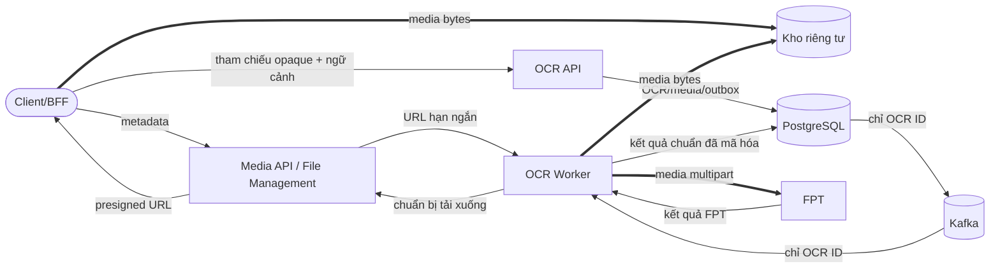

### 7.2.2 Luồng eKYC đồng bộ

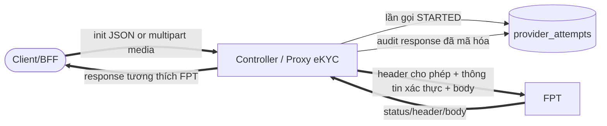

Triển khai hiện tại đệm response FPT trong bộ nhớ. Multipart eKYC OCR/liveness đã
phân tích và các adapter FPT cũng tạo mảng byte; ký hiệu `==>` biểu diễn
luồng mang media, không khẳng định truyền trực tiếp không sao chép.

## 7.3 Quyền riêng tư dữ liệu & PII

### 7.3.1 Phân loại và tối thiểu hóa dữ liệu

| **Phân loại** | **Ví dụ** | **Cách xử lý được phép** |
| --- | --- | --- |
| Bí mật | FPT API key, mật khẩu File Management, khóa mã hóa | Chỉ ở secret manager/runtime; không vào DB/event/log/client. |
| Sinh trắc hạn chế | Selfie/video, kết quả liveness/đối sánh khuôn mặt | Chỉ dùng cho mục đích eKYC đã duyệt; body tạm thời; không log response body. |
| Định danh hạn chế | Ảnh CCCD/CMND, trường OCR, PLHĐ, địa chỉ, số giấy tờ | Kho riêng tư/DB mã hóa, truy cập theo object, lưu giữ/xóa. |
| Metadata nhạy cảm | Đường dẫn object, provider job/session/request ID, confidence/cảnh báo | Chỉ nội bộ; không đưa vào API/event/log công khai nếu có thể tránh. |
| Nội bộ | OCR ID, trạng thái, enum FPT, taxonomy lỗi không PII | Có thể xuất hiện trong log/metric được kiểm soát; không làm nhãn metric có cardinality cao. |

### 7.3.2 Danh mục dữ liệu và khoảng trống

- `ocr_results.encrypted_result` và response audit eKYC dùng AES-GCM với nonce
  ngẫu nhiên và phiên bản khóa (`HIỆN TRẠNG`).
- `ocr_media.s3_path_file` là bản rõ (`KHOẢNG TRỐNG` so với mục tiêu tham chiếu
  media mã hóa/opaque). Chuyển sang ciphertext cần ADR và migration mở rộng/backfill/thu hẹp.
- Mã hóa dùng khóa cấu hình thô và không có AAD. Mục tiêu production là
  envelope/luân chuyển khóa dựa trên KMS/HSM/Vault, dùng AAD gắn bản ghi/mục đích.
- Audit eKYC âm thầm bỏ qua body >2 MB nhưng vẫn lưu trạng thái/metadata; chưa có
  job lưu giữ và xóa.
- Metadata quản trị gồm `referenceId` và `requestBy`; các trường này phải luôn
  opaque, endpoint quản trị phải được phân quyền và audit.

## 7.4 Chính sách lưu giữ và xóa dữ liệu

| **Dữ liệu** | **Giới hạn kỹ thuật/đầu vào contract** | **Cơ chế xóa** | **Trạng thái** |
| --- | --- | --- | --- |
| Kết quả FPT Sale | Tài liệu FPT quy định 30 ngày | FPT quản lý | `BÊN NGOÀI`; cần bằng chứng DPA |
| DB/kết quả OCR | TBD theo mục đích | Xóa/ẩn danh theo lô định kỳ + chính sách tombstone | `BLOCKING` |
| Media OCR riêng tư | TBD theo loại tài liệu/mục đích/legal hold | Vòng đời File Management/object + dọn tham chiếu DB | `BLOCKING` |
| Audit response eKYC | Cửa sổ xử lý sự cố ngắn TBD | Xóa ciphertext/metadata sau TTL | `BLOCKING` |
| Lần gọi FPT/outbox | Chính sách vận hành/audit TBD | Phân vùng/xóa theo lô sau cửa sổ an toàn | `BLOCKING` |
| Log/APM | Tiêu chuẩn VHM TBD | Vòng đời index | `BLOCKING` |
| Sao lưu/PITR | Chính sách RPO/lưu giữ TBD | Hết hạn bản sao + quét xóa sau phục hồi | `BLOCKING` |

Không dùng thời hạn 30 ngày của FPT Sale làm retention mặc định cho VHM. Retention
phải versioned theo purpose, consent và legal hold. Purge job phải bounded,
idempotent, có oldest-eligible-age metric và không log PII/path.

## 7.5 Kho dữ liệu và quyền sở hữu

| **Kho** | **Dữ liệu** | **Nguồn sự thật** | **Phục hồi** |
| --- | --- | --- | --- |
| PostgreSQL | Trạng thái/kết quả/lần gọi/outbox OCR | Có | Mục tiêu Multi-AZ/PITR; diễn tập phục hồi TBD |
| Kho object riêng tư | Tài liệu/media đã tải lên | Có đối với byte media | DR File Management/kho lưu trữ + bằng chứng lưu giữ TBD |
| Kafka | Tham chiếu điều phối OCR | Không | Phát lại an toàn nhờ trạng thái DB; lưu giữ topic TBD |
| Bộ nhớ tiến trình | Byte media, response FPT, token | Không | Có giới hạn/dọn theo request; cần tính dung lượng bộ nhớ |
| FPT | Job/kết quả FPT | Phụ thuộc bên ngoài | Thăm dò/đối soát theo từng contract |

<a id="muc-8"></a>

# 8. Sơ đồ luồng nghiệp vụ

## 8.1 Các luồng nghiệp vụ trọng yếu

### 8.1.1 Chuẩn bị upload và tạo OCR

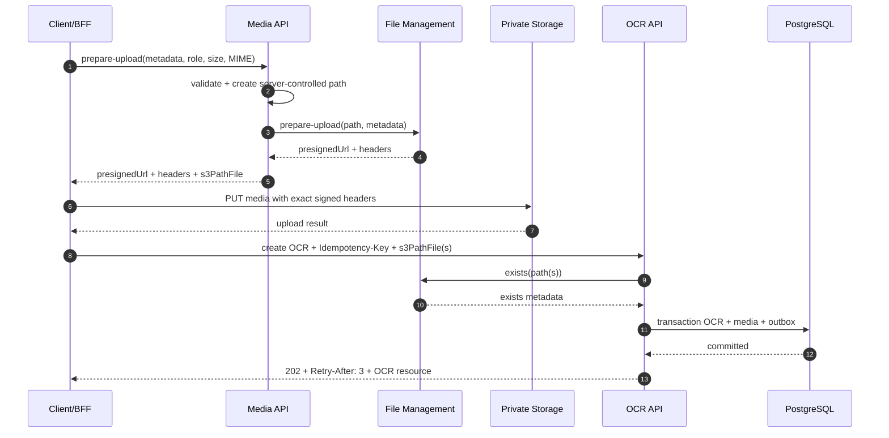

### 8.1.2 OCR tài liệu thông thường

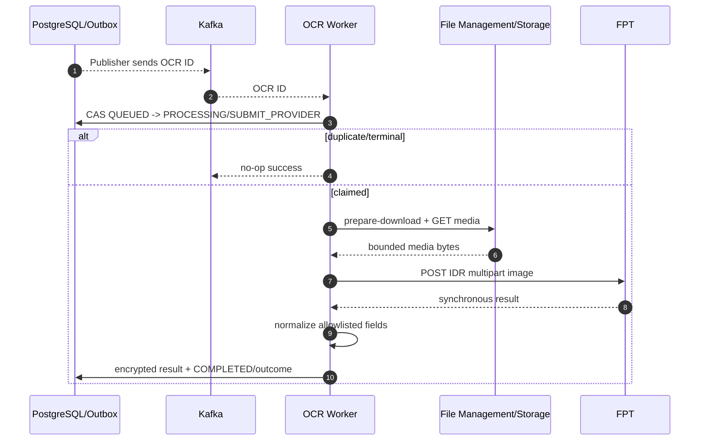

### 8.1.3 Gửi/thăm dò FPT Sale

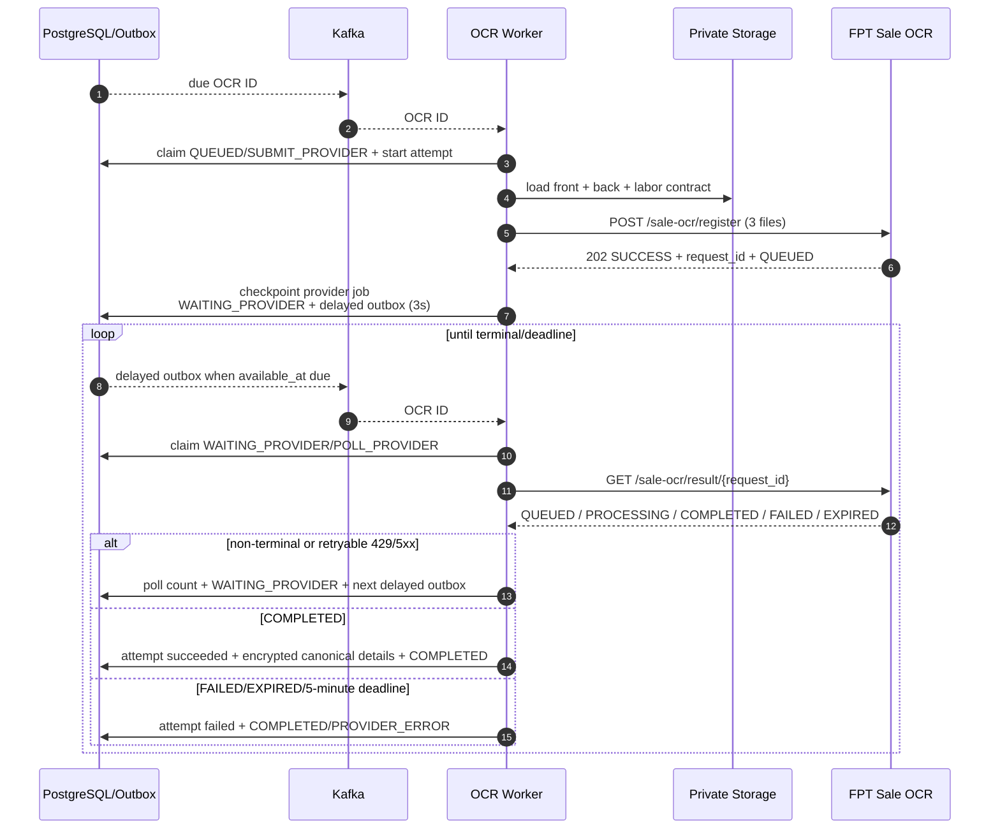

### 8.1.4 Request eKYC đồng bộ

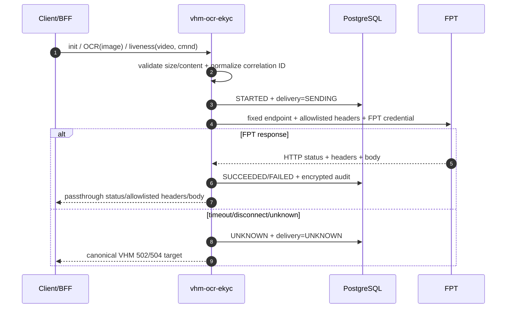

## 8.2 Ma trận xử lý lỗi

| **Sự cố** | **Hành vi hiện tại** | **Phục hồi/kiểm soát bắt buộc** |
| --- | --- | --- |
| Media thiếu/nằm ngoài prefix | Từ chối tạo với 400 | Audit/giới hạn tần suất hành vi lạm dụng lặp lại. |
| Kafka trùng thông điệp | Claim thất bại, worker bỏ qua | Duy trì kiểm thử contract. |
| Publisher dừng sau Kafka ack nhưng trước khi đánh dấu DB | Sự kiện được phát lại | Worker loại trùng; giám sát tỷ lệ trùng. |
| Worker dừng ở `PROCESSING` | Job bị treo | Thêm lease/reaper worker hoặc đối soát (`P1`). |
| FPT synchronous timeout | OCR đóng với `PROVIDER_ERROR` | Phân loại không rõ sau khi gửi; chính sách thử lại an toàn, hữu hạn theo contract FPT. |
| Gửi Sale không rõ sau khi gửi | Lần gọi thất bại, OCR kết thúc | Cần idempotency/tra cứu từ FPT để tránh gửi trùng; nếu không phải chấp nhận rủi ro. |
| Thăm dò Sale gặp 429/5xx | Thăm dò trễ | Thêm exponential backoff/jitter và bảo vệ quota. |
| Thăm dò Sale gặp lỗi I/O | Thăm dò lại sau 3 giây | Lưu lỗi/số lần; thử lại hữu hạn đến deadline. |
| Hết deadline Sale | `PROCESSING_TIMEOUT`, lỗi FPT kết thúc | Công bố hướng dẫn thử lại/idempotency key mới. |
| FPT eKYC trả non-2xx | Chuyển tiếp và audit thất bại | Kiểm thử contract lỗi SDK/façade. |
| Lỗi audit DB sau response FPT | Có thể biến response thành lỗi adapter | Chốt chính sách sẵn sàng audit; không che response FPT đã biết (`P1`). |
| Không giải mã được kết quả/thiếu khóa | API 500 | Runbook phục hồi/luân chuyển khóa; đóng an toàn. |
| Bật log response body | PII có thể vào log | Ép tắt ở production và đặt cổng chính sách/quét. |

## 8.3 Chuẩn hóa dữ liệu

- Tên trường FPT chỉ được ánh xạ qua danh sách cho phép tường minh.
- Số giấy tờ luôn là chuỗi; không chuyển thành số.
- Giá trị FPT null/rỗng bị loại; confidence chỉ được sao chép khi có giá trị.
- FPT accepts legacy item `{key,value,score}` and flat object fields with `_prob`.
- `valid=true` hiện nghĩa provider success và không thiếu `idNumber/fullName`; nó
  không phải document authenticity/eKYC decision.
- Chi tiết Sale là bằng chứng có cấu trúc do FPT định nghĩa. Phiên bản hiện tại
  không làm phẳng hoặc thay đổi ngữ nghĩa đối sánh/chữ ký.

<a id="muc-9"></a>

# 9. Kiến trúc an toàn thông tin & Tuân thủ

## 9.1 Các lớp an toàn thông tin

### 9.1.1 Danh tính, phân quyền và mạng

| **Kiểm soát** | **Mục tiêu** | **Hiện trạng/bằng chứng** |
| --- | --- | --- |
| Xác thực bên ngoài | OIDC/JWT tại BFF | Ngoài repository |
| Xác thực service | mTLS/workload JWT, issuer/audience/scope | `KHOẢNG TRỐNG`: không có dependency/filter Spring Security |
| Phân quyền object | Gắn bên gọi/source/reference/prefix media | Đang giả định BFF xử lý; service chỉ kiểm tra prefix quản lý |
| Xác thực quản trị | Vai trò đặc quyền, giới hạn mạng, audit | `KHOẢNG TRỐNG`; chỉ feature flag là không đủ |
| Egress | Danh sách đích FPT/File Management cố định | Đường dẫn cố định trong properties; bằng chứng mạng TBD |
| Bảo vệ ingress | WAF/API gateway, giới hạn tần suất/body theo route | Bằng chứng triển khai TBD |
| DB/Kafka/kho lưu trữ | Mạng riêng, TLS/xác thực, workload đặc quyền tối thiểu | Bằng chứng triển khai TBD |

### 9.1.2 Bí mật và mật mã

- FPT API key, thông tin xác thực File Management và khóa mã hóa phải lấy từ
  secret manager/biến môi trường; cấu hình rỗng phải làm readiness thất bại đối với
  năng lực đang bật.
- Không để khóa production trong source, ConfigMap, image, giao diện test hoặc ví dụ OpenAPI.
- Phiên bản khóa AES-GCM được lưu cạnh ciphertext; luân chuyển cần đọc khóa cũ/ghi
  khóa mới và kế hoạch mã hóa lại.
- Token/thông tin xác thực FPT không được xuất hiện trong thông báo exception/log.
- Tối thiểu TLS 1.2, ưu tiên TLS 1.3; phải lập tài liệu quyết định kiểm tra/ghim
  chứng thư cho FPT và Mobile SDK.

### 9.1.3 Kiểm soát media/request

| **Kiểm soát** | **Hiện trạng** | **Khoảng trống/mục tiêu** |
| --- | --- | --- |
| Đường dẫn upload do server kiểm soát | Có | Gắn bên gọi/phạm vi nghiệp vụ bằng cơ chế có thẩm quyền hoặc mật mã. |
| Danh sách MIME cho phép | JPEG/PNG/PDF | Áp dụng ma trận theo vai trò và kiểm tra magic byte. |
| Kích thước | Cấu hình 20 MB cho mỗi object tải xuống | Kiểm tra metadata tồn tại, tổng Sale 60 MB, giới hạn giải nén/số trang. |
| Checksum | Chưa cưỡng chế | Checksum có chữ ký + xác minh bằng bước hoàn tất/HEAD. |
| Path traversal | Prefix + từ chối `..` | Chuẩn hóa đường dẫn và gắn source/reference/role. |
| Multipart | Tên file đã làm sạch | Triển khai hiện tại có đệm; giới hạn part/header/bộ nhớ. |
| Presigned URL | Không lưu trong bảng OCR | Không để URL trong log/audit/lỗi; hạn ngắn/chính xác method/key. |

`EkycProxyService` hiện log tên file đã làm sạch, kích thước và content type khi lỗi.
Vì tên file có thể chứa PII, mục tiêu production chỉ log media ID do hệ thống sinh
và thao tác, không log tên file gốc (`TD-010`).

### 9.1.4 Ghi log và audit

Các trường log vận hành được phép: thời gian, ứng dụng/môi trường/phiên bản, thao tác,
OCR ID theo chính sách được duyệt, enum FPT/status code, thời lượng, Kafka
partition/offset, correlation/trace ID và nhóm lỗi chuẩn.

Cấm: thông tin xác thực/token, request/response body, trường OCR, số giấy tờ,
họ tên/địa chỉ, media thô, tên file gốc, `s3PathFile`, presigned URL, provider
job/request/session ID và điểm sinh trắc.

`provider.fpt.log-response-body` phải là `false` ở mọi môi trường giống production.
Dữ liệu debug local phải là dữ liệu tổng hợp và log phải có thời gian lưu ngắn.
Code hiện còn ghi `providerRequestId` trong một số log adapter; phải loại bỏ hoặc
băm/che theo chính sách trước production (`TD-010`).

### 9.1.5 Quản trị và tuân thủ

- Đồng thuận/cơ sở xử lý hợp pháp phải bao phủ riêng mục đích OCR tài liệu và eKYC sinh trắc.
- DPA/DPIA phải xác định FPT, vùng lưu trữ, bên xử lý phụ, truy cập hỗ trợ từ xa,
  hỗ trợ, sao lưu và SLA xóa dữ liệu.
- Trường kết quả cố định, vai trò/che dữ liệu, lớp lưu giữ và mục đích phải được duyệt.
- Không tái sử dụng dữ liệu OCR/eKYC cho phân tích/huấn luyện mô hình nếu chưa có mục đích mới được duyệt.
- Xuất/xóa dữ liệu chủ thể phải phối hợp DB VHM, object storage, FPT và bản sao lưu.

## 9.2 Mô hình mối đe dọa

| **Mối đe dọa** | **Vector** | **Giảm thiểu/trạng thái** |
| --- | --- | --- |
| IDOR/xuyên miền | Đoán OCR ID hoặc gửi đường dẫn object của đối tượng khác | Cần phân quyền object tại BFF + ngữ cảnh workload service; điểm chặn hiện tại. |
| SSRF/open proxy | Bên gọi điều khiển URL đích | Endpoint/path cố định; không nhận URL đích từ bên gọi (`HIỆN TRẠNG`). |
| Lộ thông tin xác thực | Cấu hình/log/gói client | Secret manager, quét, che dữ liệu; bằng chứng TBD. |
| Lộ presigned URL/path | DB/log/event/admin | Không lưu/phát URL; đường dẫn DB bản rõ là rủi ro tồn dư. |
| Media độc hại | Polyglot/giải nén/PDF bomb | Quét MIME/magic/số trang/kích thước và cô lập đường tới FPT; một phần. |
| Lộ dữ liệu Kafka | Payload chứa path/PII/kết quả | Payload hiện chỉ có OCR ID; cưỡng chế bằng test schema. |
| Lặp thao tác FPT | At-least-once/timeout | Claim trạng thái, checkpoint job; chưa giải quyết gửi Sale không rõ kết quả. |
| Worker treo | Pod dừng sau claim | Thiếu lease/reaper worker. |
| Nhầm contract eKYC | SDK gửi header/form không được chuyển tiếp | Test contract chính xác theo phiên bản và quyết định `INT-01`. |
| Log response PII | Đưa nhầm cờ debug/cấu hình local lên môi trường thật | Chính sách cấu hình production + quét DLP/log. |
| Cạn bộ nhớ | Ba file 20 MB + bản sao multipart/response | Giới hạn đồng thời/body, thiết kế streaming/spooling và kiểm thử tải. |
| Hoán đổi ciphertext | Không có AAD AES-GCM gắn bản ghi/mục đích | Thêm định dạng AAD/envelope và test can thiệp/hoán đổi bản ghi. |
| Bỏ qua/che audit | Lỗi DB audit che response FPT | Chốt fail-open/closed theo thao tác mà không mất dấu vết; rủi ro hiện tại. |

<a id="muc-10"></a>

# 10. Triển khai & Cấu trúc hạ tầng

## 10.1 Môi trường

| **Môi trường** | **Dữ liệu/FPT** | **Kiểm soát** |
| --- | --- | --- |
| Local/Dev | Chỉ dữ liệu tổng hợp; mock/sandbox FPT khi có thể | `.env.local`, không commit secret; chỉ log body tổng hợp. |
| SIT | Dữ liệu tổng hợp/đã che; FPT staging | Giới hạn ingress/egress, fixture contract, test migration/an toàn thông tin. |
| UAT | Dữ liệu tổng hợp/đã che được duyệt | Cấu hình giống production, nghiệm thu nghiệp vụ/quyền riêng tư. |
| Production | Dữ liệu cá nhân/sinh trắc thật | WAF, IAM workload, secret manager, data plane riêng, HA, sao lưu và giám sát. |

## 10.2 Sơ đồ triển khai production

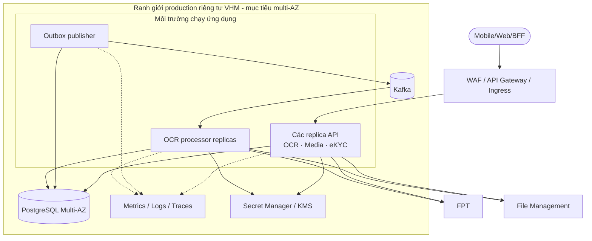

Code hiện đóng gói một Spring Boot artifact và có thể chạy API/publisher/consumer
cùng tiến trình. Mục tiêu production nên cho phép bật/tắt vai trò theo deployment
để mở rộng độc lập và cô lập phạm vi ảnh hưởng; cơ chế cờ vai trò hiện chưa có (`TD-011`).

## 10.3 Ma trận luồng mạng

| **Nguồn** | **Đích** | **Giao thức/dữ liệu** | **Kiểm soát** |
| --- | --- | --- | --- |
| BFF | API | HTTPS JSON/multipart | Workload auth, route/rate/body policy |
| API/worker | PostgreSQL | TLS SQL | Private SG/network policy, DB role |
| Publisher/worker | Kafka | TLS/SASL | ACL per topic/group |
| API/worker | File Management | HTTPS metadata/điều khiển | Danh tính workload; Basic Auth là kiểm soát chuyển tiếp hiện tại |
| Worker | Presigned download URL | HTTPS media | URL chính xác, hạn ngắn, không log, giới hạn byte |
| API/worker | FPT | HTTPS media/kết quả | Allowlist egress, secret, timeout, quota |
| Các thành phần | Nền tảng quan sát | TLS, chỉ metadata | Danh sách trường cho phép/che/lưu giữ |

## 10.4 Chiến lược CI/CD và triển khai

- `mvn clean test` là lệnh kiểm tra repository.
- Các cổng bắt buộc: biên dịch/unit, sinh jOOQ, kiểm tra migration, quét secret,
  SAST/SCA/license, quét container/IaC, contract FPT, integration, an toàn thông tin,
  kiểm thử tải và quét PII trong log.
- Build artifact bất biến một lần; quảng bá qua môi trường mà không build lại.
- API rolling/canary; processor rolling có drain consumer; outbox publisher không
  cần singleton vì claim DB dùng `SKIP LOCKED`.
- Thay đổi database theo expand/contract và code tương thích ngược. Flyway chỉ chạy
  khi ứng dụng khởi động; cần runbook sở hữu/khóa migration ở production.
- Rollback không được hoàn tác schema theo cách phá hủy hoặc phát lại mù thao tác FPT.

## 10.5 Quản lý cấu hình

| **Cấu hình** | **Mặc định hiện tại** | **Quy tắc production** |
| --- | --- | --- |
| Kafka topic | `vhm.ocr-ekyc.job.created.v1` | Pre-created, ACL/retention/DLT decision documented. |
| Kafka consumer | group `vhm-ocr-ekyc`, record ack, max poll 1 | Unique group per environment/role; lag alerts. |
| Multipart servlet | 20 MB/file, 21 MB/request | Áp dụng cho ingress eKYC; media Sale dùng tham chiếu object và tính riêng 60 MB. |
| Timeout FPT OCR | kết nối 2 giây, response 10 phút | Căn chỉnh với liveness worker, Kafka max poll và SLA FPT. |
| FPT Sale | response 30 giây, thăm dò 3 giây | Test contract backoff/quota/deadline. |
| File Management | tải xuống tối đa 20 MB | Chính sách vai trò/MIME/checksum và giới hạn tổng Sale. |
| Response audit | max 2 MB | Retention, quota and behavior when omitted. |
| Body logging | false global; local true currently | Must be false in SIT/UAT/Prod. |

## 10.6 Chiến lược migration

Migration dữ liệu legacy không thuộc phạm vi hiện tại. Thay đổi để mã hóa tham
chiếu media/thêm lease worker/FK cần thực hiện theo giai đoạn:

1. Mở rộng cột/index nullable và triển khai đọc/ghi song song.
2. Backfill có giới hạn, metric an toàn với PII và có thể khởi động lại.
3. Xác minh số lượng/hash/bất biến và tính tương thích của ứng dụng.
4. Chuyển đường đọc và cưỡng chế ràng buộc.
5. Thu hẹp/xóa bản rõ cũ chỉ sau khi cửa sổ lưu giữ/rollback được duyệt.

<a id="muc-11"></a>

# 11. Chi phí & Dung lượng/Hiệu năng

## 11.1 Mục tiêu dung lượng/hiệu năng

| **Chỉ số/đầu vào** | **Giá trị thiết kế** | **Cổng/bằng chứng** |
| --- | --- | --- |
| OCR hằng ngày theo use case/FPT/kênh | `CHƯA XÁC ĐỊNH` | Dự báo sản phẩm |
| TPS đỉnh của tạo/trạng thái/kết quả | `CHƯA XÁC ĐỊNH` | Mô hình tải |
| Bùng tải/độ trễ/tuổi lớn nhất Kafka | `CHƯA XÁC ĐỊNH` | Kiểm thử hiệu năng + SLO vận hành |
| Lời gọi FPT đồng thời | `UNRESOLVED` | Quota/SLA của FPT |
| Request eKYC đồng thời | `CHƯA XÁC ĐỊNH` | Dự báo SDK/client + kiểm thử tải |
| Kích thước media p50/p95/p99 | `CHƯA XÁC ĐỊNH`; trần cứng 20 MB/object | Đo tại staging |
| Bộ nhớ làm việc Sale | Tối thiểu ba file cộng bản sao multipart/HTTP cho mỗi job đồng thời | Kiểm thử heap/native memory; phải đo mức đệm hiện tại |
| Hoàn tất Sale | Contract FPT tối đa 5 phút | E2E với chờ/kết thúc/timeout |
| eKYC/FPT p95/p99 | `CHƯA XÁC ĐỊNH` | SLA FPT và ngân sách timeout client |
| Bản ghi DB/ngày/tăng trưởng lưu trữ | `CHƯA XÁC ĐỊNH` | Lưu giữ + phân bố payload kết quả/audit |
| Ciphertext kết quả/audit p95/p99 | `CHƯA XÁC ĐỊNH`; audit tối đa 2 MB | Tính dung lượng DB/kho lưu trữ |

Các công thức bắt buộc:

- `peakConcurrency = peakArrivalRate × operationDurationP99 × safetyFactor`.
- `workerReplicas = ceil(requiredProviderConcurrency / measuredConcurrencyPerPod) + HA headroom`.
- `maxSaleMemory ≈ concurrency × (sum input bytes + multipart copies + response + safety overhead)`.
- Poll traffic must include client→VHM polling and worker→FPT Sale polling separately.

Không có số replica, kích thước heap, connection pool hay giới hạn TPS nào trong
bản nháp này được xem là giá trị production đã phê duyệt.

## 11.2 Chi phí

| **Nguồn chi phí** | **Đầu vào tính dung lượng** | **Trạng thái** |
| --- | --- | --- |
| Tài nguyên tính toán ứng dụng | Replica API/publisher/worker, bộ nhớ cho media | TBD |
| PostgreSQL | rows, ciphertext size, indexes, backup/PITR | TBD |
| Kafka | messages, poll amplification, retention | TBD |
| Object storage/File Management | upload/download/storage/retention | TBD |
| Egress | Media tới FPT và response FPT | TBD |
| KMS/Secret | Request mã hóa/giải mã/luân chuyển | TBD |
| Quan sát hệ thống | Thu nhận và lưu giữ log/metric/trace | TBD |
| FPT | Giao dịch FPT IDR, FPT Sale, eKYC/liveness | Báo giá TBD |

Bản xuất công cụ tính chi phí AWS/nền tảng, báo giá FPT, cảnh báo ngân sách/quota
và dự toán tháng là các điểm chặn sẵn sàng production.

<a id="muc-12"></a>

# 12. Khả năng mở rộng & Độ tin cậy

## 12.1 Chiến lược mở rộng

| **Thành phần** | **Tín hiệu mở rộng** | **Kiểm soát bắt buộc** |
| --- | --- | --- |
| OCR/Media API | RPS, p95 latency, DB pool | Stateless HPA; idempotency and DB limit |
| API eKYC | Request đang hoạt động, byte, độ trễ FPT, bộ nhớ | Tách concurrency/bulkhead khỏi luồng điều khiển OCR |
| Outbox Publisher | Số bản ghi đến hạn, tuổi lớn nhất, độ trễ phát | Claim đa instance an toàn; lô có giới hạn |
| OCR Worker | Độ trễ Kafka, tuổi lớn nhất, độ trễ FPT | Concurrency/token bucket/quota riêng cho FPT |
| Thăm dò Sale | Tuổi outbox đến hạn, số lần thăm dò, nguy cơ quá deadline | Backoff/jitter; ưu tiên deadline; không thăm dò dồn dập |
| PostgreSQL | CPU/IOPS/connections/locks/table growth | Pool cap, indexes, vacuum/partition plan |
| Kafka | partition lag/throughput | Partition count and key distribution sizing |

OCR backlog and interactive eKYC must have independent resource/quota pools. A
burst of 20–60 MB OCR files must not exhaust memory/connections serving eKYC.

## 12.2 Quyết định về độ tin cậy

- Outbox publish is at-least-once; Kafka consumer is idempotent by OCR state.
- Chèn kết quả cuối dùng `ON CONFLICT DO NOTHING`; cập nhật trạng thái kết thúc
  phải được bảo vệ khỏi kết quả xung đột đồng thời trong triển khai mục tiêu.
- Provider job FPT Sale được checkpoint trước thăm dò trễ; mọi lần thăm dò dùng cùng job ID.
- Không thử lại eKYC mù quáng; trạng thái chuyển phát không rõ được ghi nhận.
- Bổ sung lease/reaper worker cho `PROCESSING` quá hạn và phục hồi khi dừng giữa
  claim/gọi FPT/checkpoint.
- Bổ sung topic retry/DLT hoặc quyết định thành văn. Đã có quy ước tên helper nhưng
  chưa cấu hình listener retry/hành vi DLT.
- Circuit breaker phải phân biệt lần gửi mới với thăm dò provider job hiện hữu;
  sự cố không được bỏ job Sale đã nhận nếu chưa phục hồi theo deadline.

## 12.3 Sao lưu và phục hồi

Phạm vi sao lưu: schema/dữ liệu PostgreSQL, object media được duyệt, cấu hình có
phiên bản và artifact bất biến. Kafka và token/cache tiến trình không phải nguồn
sự thật nghiệp vụ.

Phục hồi phải xác minh:

- phiên bản schema/Flyway, check/index/FK và tính sẵn sàng của khóa mã hóa;
- tính nhất quán OCR/media/kết quả/lần gọi/outbox;
- phục hồi lease outbox `PUBLISHING` và phát lại an toàn khi trùng;
- phục hồi `PROCESSING` quá hạn sau khi tính năng lease được triển khai;
- không tạo lại/ghi đè kết quả đã kết thúc;
- xóa dữ liệu phục hồi đã quá hạn lưu trước khi mở lưu lượng;
- không in secret/PII bản rõ trong quá trình phục hồi.

<a id="muc-13"></a>

# 13. Khả năng quan sát & Giám sát

## 13.1 Hiện trạng nền tảng

- Actuator công bố `health`, `info`, `prometheus`; đã bật probe readiness/liveness.
- Log console có cấu trúc ECS và filter correlation ID.
- Tag Micrometer chung: application, environment, region.
- Metric HTTP server loại trừ URI health/management đã cấu hình.
- Đã có log cho phát outbox, nhận Kafka, thao tác worker/FPT và lời gọi eKYC FPT;
  chưa có bộ metric miền nghiệp vụ đầy đủ.

## 13.2 Chỉ số bắt buộc

| **Metric** | **Loại** | **Nhãn được phép** |
| --- | --- | --- |
| `ocr_requests_total` | Counter | use_case, provider, channel, outcome |
| `ocr_lifecycle_duration_seconds` | Histogram | use_case, provider, outcome |
| `ocr_provider_requests_total` | Counter | provider, operation, outcome, http_class |
| `ocr_provider_duration_seconds` | Histogram | provider, operation |
| `ocr_outbox_due` / `ocr_outbox_oldest_age_seconds` | Gauge | event_type, status |
| `ocr_kafka_consumer_lag` | Gauge | topic, consumer_group, partition |
| `ocr_jobs_stuck` | Gauge | step, age_bucket |
| `ocr_sale_poll_count` | Histogram | terminal_status |
| `ocr_result_decrypt_failures_total` | Counter | key_version, error_class |
| `ekyc_provider_requests_total` | Counter | operation, outcome, http_class |
| `ekyc_provider_duration_seconds` | Histogram | operation |
| `ekyc_active_requests` / `ekyc_request_bytes` | Gauge/Histogram | operation |
| `provider_audit_failures_total` | Counter | operation, failure_stage |
| `media_download_bytes` / `media_download_failures_total` | Histogram/Counter | role, outcome |

Không dùng OCR ID, reference/subject/requestBy, provider job/session ID, filename,
path, correlation ID hoặc PII làm metric label.

## 13.3 Cảnh báo

| **Cảnh báo** | **Tín hiệu** | **Mức độ** |
| --- | --- | --- |
| Lỗi xác thực FPT | Lặp lại 401/403 | Nghiêm trọng |
| FPT không sẵn sàng/timeout | Tỷ lệ lỗi/timeout vượt cửa sổ đã duyệt | Cao |
| Tồn đọng outbox | Tuổi bản ghi đến hạn lớn nhất vượt SLO | Cao/Nghiêm trọng |
| Kafka trễ/xử lý treo | Lag hoặc `PROCESSING` quá hạn vượt ngưỡng | Cao |
| Nguy cơ quá deadline Sale | Job đang chờ không thể xử lý hết trước deadline 5 phút | Nghiêm trọng |
| eKYC bão hòa | Request đang hoạt động/bộ nhớ/timeout vượt ngưỡng | Cao |
| Pool/lock/lưu trữ DB | Vượt ngưỡng bão hòa/tăng trưởng | Cao |
| Lỗi mã hóa/audit | Bất kỳ lỗi kéo dài nào | Nghiêm trọng |
| DLP phát hiện PII/secret | Bất kỳ phát hiện nào ở production | Nghiêm trọng |
| Tồn đọng lưu giữ/xóa | Tuổi dữ liệu đủ điều kiện xóa lớn nhất vượt SLA chính sách | Cao/Nghiêm trọng |

## 13.4 SLI/SLO

SLI phải tách: API tiếp nhận OCR, hoàn tất OCR đầu-cuối, thao tác FPT, độ trễ
outbox, độ trễ Kafka, thời gian chờ FPT Sale, response eKYC đồng bộ và đọc
trạng thái/kết quả. Thời gian FPT phải quan sát được, không bị ẩn trong tính sẵn
sàng nền tảng. Mục tiêu vẫn `CHƯA XÁC ĐỊNH` đến khi duyệt NFR/dung lượng.

<a id="muc-14"></a>

# 14. Sẵn sàng vận hành

## 14.1 RTO & RPO

| **Hạng mục** | **Mốc cơ sở đề xuất** | **Trạng thái** |
| --- | --- | --- |
| RTO | ≤4 giờ | Cần Chủ sở hữu hệ thống/Vận hành phê duyệt + diễn tập |
| RPO | ≤15 phút | Cần DBA/Vận hành phê duyệt + bằng chứng PITR |
| Phục hồi job Sale đã được nhận | Trước deadline xử lý 5 phút nếu FPT cho phép | Khoảng trống kiến trúc/contract FPT |
| Phục hồi secret/khóa | Runbook luân chuyển/thu hồi được duyệt | TBD |
| Phục hồi media | Trong thời hạn lưu theo mục đích; không khôi phục dữ liệu đã xóa | TBD |

## 14.2 Runbook bắt buộc

- FPT trả 401/403 và luân chuyển/thu hồi thông tin xác thực.
- Sự cố FPT, quota/429 và chế độ an toàn của circuit breaker.
- Lease outbox `PUBLISHING` quá hạn và sự cố Kafka.
- Kafka lag, UUID/thông điệp độc, retry/DLT và rollback consumer.
- OCR `PROCESSING` quá hạn và không rõ kết quả sau khi gửi FPT.
- Thăm dò/deadline/nguy cơ hết hạn lưu của FPT Sale.
- Failover DB/phục hồi PITR và phục hồi khóa mã hóa.
- Sự cố File Management/kho lưu trữ, media mồ côi và xóa dữ liệu.
- Sự cố PII/secret trong log và cấu hình sai log response body.
- Suy giảm tương thích eKYC và rollback theo phiên bản client/SDK.

## 14.3 Danh sách kiểm tra sẵn sàng cơ sở

- Health/readiness phải thất bại khi thiếu thông tin xác thực/cấu hình bắt buộc của năng lực đang bật.
- Service có thể ngừng nhận OCR/eKYC mới trong khi vẫn cho đọc trạng thái an toàn và
  phục hồi/thăm dò job đã nhận theo chính sách sự cố.
- Đã chỉ định on-call, đầu mối FPT, ma trận leo thang và bảo trì.
- Dashboard/cảnh báo có chủ sở hữu và đã kiểm thử định tuyến.
- Diễn tập sao lưu/phục hồi, luân chuyển, rollback và xử lý backlog đạt RTO/RPO/SLO.
- Mọi điểm chặn go-live trong Phụ lục E đã đóng hoặc được chấp nhận chính thức kèm hạn.

<a id="muc-15"></a>

# 15. Chiến lược kiểm thử & Chất lượng

## 15.1 Phạm vi kiểm thử tự động hiện tại

Bộ kiểm thử JUnit hiện tại bao phủ application context, API envelope/controller,
client auto-configuration/contract, nền tảng tương quan, AES-GCM, chuẩn hóa/router
OCR, hành vi adapter FPT/FPT Sale, đường dẫn media/presign, worker thành công/lỗi/
trùng/gửi-thăm dò Sale, metadata quản trị và ánh xạ repository. Lệnh của repository là:

```bash
mvn clean test
```

Kiểm thử unit không thay thế bằng chứng tích hợp PostgreSQL/Kafka/FPT, an toàn
thông tin, hiệu năng hoặc phục hồi.

## 15.2 Cổng chất lượng

| **Lớp kiểm thử** | **Phạm vi bắt buộc** | **Cổng** |
| --- | --- | --- |
| Unit | Nhánh trạng thái/idempotency/chuẩn hóa/mã hóa/lỗi | Mục tiêu nhánh trọng yếu ≥80% |
| Tích hợp DB | PostgreSQL thật, Flyway, check/unique/FK, transaction, `SKIP LOCKED`, test tranh chấp | Bắt buộc |
| Kafka/outbox | Cửa sổ publisher dừng, trùng, thăm dò trễ, khởi động lại, retry/DLT | Bắt buộc |
| Contract provider | FPT IDR, mọi trạng thái/lỗi FPT Sale và exact wire eKYC | Bắt buộc |
| Contract API | OpenAPI/envelope/chuyển tiếp/header/kích thước/tương thích ngược | Bắt buộc |
| An toàn thông tin | Authn/authz/IDOR, secret, SSRF, multipart, PII-log, can thiệp/luân chuyển mật mã | Bắt buộc |
| E2E | Upload → tạo → hàng đợi → FPT → trạng thái/kết quả cho từng use case | Bắt buộc |
| Hiệu năng | Một/hai file 20 MB, Sale 60 MB, eKYC đồng thời, quota DB/Kafka/FPT | Bắt buộc |
| Khả năng chịu lỗi | Pod dừng ở mỗi checkpoint, DB/Kafka/storage/FPT lỗi, chuyển phát không rõ | Bắt buộc |
| OAT/DR | Triển khai/rollback, phục hồi, luân chuyển, xóa, cảnh báo/runbook | Bắt buộc |

## 15.3 Kịch bản kiểm thử trọng yếu

- Đồng thời cùng idempotency key/cùng body và cùng key/body khác nhau.
- Commit/rollback thao tác tạo trên OCR/media/outbox; không có aggregate mồ côi khi lỗi.
- Publisher crash before/after Kafka ack and stale publisher lease.
- Worker dừng sau claim, sau khi FPT nhận, trước checkpoint và trước commit kết quả.
- Thông điệp gửi/thăm dò trùng không được tạo provider job/kết quả thứ hai.
- FPT Sale `QUEUED`, `PROCESSING`, `COMPLETED`, `FAILED`, `EXPIRED`, 404, 429,
  5xx, JSON không hợp lệ, thiếu request ID và timeout năm phút.
- Sale PDF/image MIME, exactly three files, per-file/total limits and memory pressure.
- FPT canonical mapping flat/list/optional/unknown fields and missing required fields.
- Ma trận header/form/path/response chính xác theo phiên bản Android/Web/iOS sau `INT-01`.
- eKYC timeout sau khi gửi, client ngắt kết nối, lỗi DB audit và response audit quá lớn.
- Cross-source/reference media path, path traversal, wrong MIME/magic/checksum and
  presigned URL expiry/reuse.
- Authentication missing/invalid/wrong audience/scope and admin IDOR.
- Tính duy nhất nonce AES-GCM, can thiệp, sai khóa/phiên bản, hoán đổi bản ghi/mục tiêu AAD.
- Quét repository/image/cấu hình/log/APM không có secret, PII, path, ID FPT hoặc body media.

## 15.4 Dữ liệu kiểm thử

Sử dụng giấy tờ định danh và video tổng hợp/tự sinh trong kiểm thử tự động/SIT.
Dữ liệu cá nhân/sinh trắc thật cần phê duyệt bằng văn bản, kho cô lập, mục đích/
lưu giữ đích danh và bằng chứng xóa. Fixture response FPT phải có phiên bản và đã làm sạch.

<a id="muc-16"></a>

# 16. Rủi ro & Vấn đề mở/Nợ kỹ thuật

## 16.1 Danh mục rủi ro kiến trúc

| **Mã rủi ro** | **Nhóm** | **Mô tả/ảnh hưởng** | **Mức độ** | **Giảm thiểu** | **Chủ sở hữu/trạng thái** |
| --- | --- | --- | --- | --- | --- |
| AR-001 | An toàn thông tin | Endpoint service/admin thiếu authn/authz tại service; bỏ qua BFF có thể lộ dữ liệu/thao tác | Nghiêm trọng | IAM/JWT/mTLS workload + phạm vi object + test vai trò quản trị | ANBM/Backend — MỞ, điểm chặn |
| AR-002 | Tích hợp | Chưa chứng minh contract route/path/header/form eKYC tương thích luồng phiên/SDK FPT | Nghiêm trọng | Đóng `INT-01`, ghim phiên bản SDK/API, test contract/E2E | Tích hợp/Client — MỞ, điểm chặn |
| AR-003 | Quyền riêng tư | Chưa duyệt/triển khai mục đích, đồng thuận, vị trí dữ liệu, DPA, lưu giữ, xóa | Nghiêm trọng | DPIA/DPA, registry chính sách, job/bằng chứng xóa | Pháp chế/Quyền riêng tư — MỞ, điểm chặn |
| AR-004 | Độ tin cậy | Worker claim bằng CAS nhưng không có lease; dừng tiến trình làm OCR kẹt vĩnh viễn ở `PROCESSING` | Nghiêm trọng | Lease owner/until, reaper/đối soát và test dừng tiến trình | Backend/Vận hành — MỞ P1 |
| AR-005 | Toàn vẹn | Timeout gửi Sale sau khi FPT có thể đã nhận làm job FPT mồ côi/trùng | Cao | Idempotency/tra cứu FPT, tương quan request, phục hồi `UNKNOWN` tường minh | FPT/Tích hợp — MỞ |
| AR-006 | An toàn dữ liệu | `s3_path_file` bản rõ trong DB; không gắn checksum/magic/bước hoàn tất | Cao | Tham chiếu opaque/mã hóa, checksum, kiểm tra theo vai trò và migration | Backend/ANBM — MỞ |
| AR-007 | Hiệu năng | Media/multipart/response được đệm; Sale có thể vượt 60 MB cộng các bản sao/worker | Nghiêm trọng | Thiết kế streaming/spool giới hạn, bulkhead, test heap và HPA | Backend/Vận hành — MỞ, điểm chặn |
| AR-008 | Quyền riêng tư | Log response body debug có thể lưu PII OCR/eKYC | Nghiêm trọng | Ép tắt bằng chính sách production, test/cảnh báo DLP và runbook sự cố | Vận hành/ANBM — MỞ, điểm chặn |
| AR-009 | Độ tin cậy | Chưa cưỡng chế deadline OCR thường và không có bản ghi lần gọi FPT | Cao | Deadline/hủy, trạng thái lần gọi và taxonomy retry an toàn | Backend — MỞ |
| AR-010 | Tích hợp | Không có bảo vệ quota/circuit breaker FPT; 429/bùng tải có thể lan truyền | Cao | Concurrency/token bucket/backoff/jitter cho FPT | Vận hành/Tích hợp — MỞ |
| AR-011 | Toàn vẹn | Lỗi lưu audit có thể che response FPT đã biết và trả lỗi chung | Cao | Chính sách transaction/lỗi, audit bất đồng bộ bền vững hoặc fallback an toàn | Backend/Kiến trúc — MỞ |
| AR-012 | Sẵn sàng | FPT là phụ thuộc duy nhất cho Sale và eKYC | Cao | SLA, dừng nhận mới an toàn, giám sát, retry/phục hồi và phương án nghiệp vụ | Sản phẩm/Vận hành — MỞ |
| AR-013 | Toàn vẹn/phân quyền | `subjectRef` tham gia idempotency nhưng không được lưu, làm mất tương quan đối tượng sau khi tạo | Cao | Thêm `subject_ref` bằng Flyway, ánh xạ repository/API quản trị và kiểm thử IDOR | Backend/ANBM — MỞ |
| AR-014 | Toàn vẹn | Đóng attempt Sale và hoàn tất OCR/kết quả không nằm trong cùng một transaction bao ngoài; lỗi giữa hai bước có thể tạo trạng thái lệch | Cao | Gộp điểm commit hoặc thêm đối soát idempotent; test lỗi DB ở từng ranh giới | Backend/Kiến trúc — MỞ |

## 16.2 Danh mục vấn đề mở và nợ kỹ thuật

| **ID** | **Vấn đề** | **Ảnh hưởng/Ưu tiên** | **Khắc phục/cổng** |
| --- | --- | --- | --- |
| TD-001 | Liên kết/chủ sở hữu L1/L3/tiêu chuẩn còn TBD | Cao | Hoàn tất trước khi phê duyệt L2. |
| TD-002 | Cây package chưa tách namespace sở hữu `api`/`processor` | Trung bình | Refactor không đổi artifact/contract; rà soát kiến trúc. |
| TD-003 | Thiếu API hủy/thử lại/đối soát/hết hạn trạng thái | Cao | Định nghĩa chính sách L3/trạng thái và triển khai trước khi duyệt độ tin cậy nếu cần. |
| TD-004 | Tranh chấp unique khi tạo đồng thời chưa được chuẩn hóa thành response idempotent | Cao | Insert trước/đọc khi xung đột + test tích hợp đồng thời. |
| TD-005 | Kafka publisher gửi UUID thô; chưa dùng `EventEnvelope`; chưa định nghĩa retry/DLT | Trung bình/Cao | Envelope tối thiểu có phiên bản hoặc duyệt UUID thô; định nghĩa retry/DLT. |
| TD-006 | Thiếu FK cho attempt/aggregate outbox | Trung bình | Migration mở rộng, dọn bản ghi mồ côi rồi cưỡng chế FK. |
| TD-007 | Có `row_version` nhưng cập nhật vòng đời jOOQ không dùng phiên bản lạc quan | Cao | CAS theo version/status và test hoàn tất xung đột. |
| TD-008 | Giá trị schema `CANCELLED/EXPIRED/FETCH_RESULT/NORMALIZE` chưa dùng | Trung bình | Chỉ triển khai hoặc xóa qua thay đổi migration/contract được duyệt. |
| TD-009 | Chưa dùng endpoint kết quả Sale theo lô | Thấp/Chi phí | Đánh giá hiệu quả thăm dò so với độ phức tạp/giới hạn tần suất FPT. |
| TD-010 | Log lỗi chứa tên file multipart gốc/provider request ID; có cờ debug response body | Quyền riêng tư nghiêm trọng | Loại bỏ/che tên file, ID và body ở production; quét PII. |
| TD-011 | Không thể bật API/publisher/consumer thành các vai trò runtime độc lập | Trung bình/Cao | Thêm cờ/profile vai trò và test triển khai. |
| TD-012 | Chưa triển khai lưu giữ/xóa OCR/audit/outbox/media | Quyền riêng tư nghiêm trọng | Chính sách có phiên bản và xóa định kỳ kèm bằng chứng. |
| TD-013 | Không có quy tắc MIME media theo vai trò/kiểm tra magic/checksum | An toàn thông tin cao | Triển khai contract hoàn tất/kiểm tra media. |
| TD-014 | Ngữ nghĩa `valid` chuẩn quá thô cho tính xác thực/rà soát thủ công | Trung bình | Phiên bản hóa schema kết quả và định nghĩa chính sách chất lượng/outcome. |
| TD-015 | Timeout response FPT mặc định 10 phút xung đột ngân sách eKYC tương tác | Cao | Timeout theo thao tác, căn chỉnh SLA BFF/client/FPT. |
| TD-016 | DTO nhận `subjectRef` và đưa vào fingerprint nhưng entity/schema không lưu | Cao | Bổ sung cột/migration/ánh xạ và test truy vấn, phân quyền, idempotency. |
| TD-017 | Đóng attempt FPT Sale và `store.complete` là hai ranh giới commit riêng | Cao | Thiết kế transaction/đối soát nguyên tử, bảo đảm thử lại không ghi trạng thái xung đột. |

Vấn đề mở không mặc nhiên được chấp nhận. Chấp nhận rủi ro phải ghi rõ chủ sở hữu,
phạm vi, ngày hết hạn, người phê duyệt và kiểm soát bù trừ.

<a id="phu-luc"></a>

# Phụ lục

## A. Thuật ngữ

| **Thuật ngữ** | **Định nghĩa** |
| --- | --- |
| OCR | Nhận dạng ký tự quang học; trích xuất dữ liệu có cấu trúc từ media tài liệu. |
| eKYC | Định danh điện tử bằng OCR giấy tờ, kiểm tra sống và đối sánh khuôn mặt. |
| Tài nguyên OCR | Aggregate bất đồng bộ VHM được định danh bởi `ocrId`. |
| Kết quả chuẩn | Kết quả OCR ổn định được công bố cho bên gọi VHM. |
| Lần gọi FPT | Bản ghi bền vững cho một thao tác/job/audit với FPT. |
| Outbox | Bản ghi DB commit cùng aggregate và được phát lên Kafka sau đó. |
| Thăm dò trễ | Bản ghi outbox có `available_at` trong tương lai, dùng để thăm dò trạng thái FPT Sale. |
| Idempotency Key | Khóa opaque do bên gọi cung cấp để ngăn tạo tài nguyên trùng. |
| Dấu vân tay request | SHA-256 của payload tạo đã tuần tự hóa, dùng phát hiện xung đột khóa. |
| Provider job ID | `request_id` FPT Sale; chỉ dùng nội bộ. |
| PII | Thông tin nhận diện cá nhân. |
| Dữ liệu sinh trắc | Ảnh/video khuôn mặt và suy luận kiểm tra sống/đối sánh liên quan. |
| Không rõ sau khi gửi | Lỗi truyền tải khi FPT có thể đã nhận thao tác thay đổi. |
| DPA/DPIA | Thỏa thuận xử lý dữ liệu / Đánh giá tác động bảo vệ dữ liệu. |

## B. Tài liệu tham khảo

| **Tài liệu** | **Liên kết/phiên bản** |
| --- | --- |
| L2 standard template | [`ttd-mau-chuan.md`](./ttd-mau-chuan.md) |
| OCR/eKYC activity design | [`tdd-luong-hoat-dong.md`](./tdd-luong-hoat-dong.md) |
| Danh sách tài liệu FPT nội bộ | [`tai-lieu-tham-khao-fpt.md`](./tai-lieu-tham-khao-fpt.md) |
| Repository overview | [`../README.md`](../README.md) |
| FPT Sale OCR for Vinhomes | `[VSF-eKYC] Tài liệu API OCR cho Vinhomes.pdf`, v0.2.0, 13/08/2026 |
| FPT eKYC update-information API | <https://docs-vision.fpt.ai/en/ekyc/III-integration/III-2-APIs/a-APIs%20of%20eKYC%20Flows/APIs-in-update-information-flow/> |
| FPT eKYC result/callback | <https://docs-vision.fpt.ai/en/ekyc/III-integration/III-2-APIs/a-APIs%20of%20eKYC%20Flows/APIs-result/> |
| FPT SDK integration architecture | <https://docs-vision.fpt.ai/en/ekyc/III-integration/III-1-SDKs/kien-truc-tich-hop> |
| FPT Android SDK | <https://docs-vision.fpt.ai/ekyc/III-integration/III-1-SDKs/android-sdk> |
| FPT Web SDK | <https://docs-vision.fpt.ai/en/ekyc/III-integration/III-1-SDKs/web-sdk/> |
| FPT ID Recognition | <https://docs.fpt.ai/docs/en/vision/tutorials/id-recognition/> |
| Architecture history | `../agent.md` |
| VHM IAM/ANBM/Data Privacy/Observability standards | TBD version/link |

## C. Thông tin đầu vào và xác nhận bên ngoài

### C.1 Nghiệp vụ và quyền riêng tư

| **Đầu vào** | **Chủ sở hữu** | **Cổng** |
| --- | --- | --- |
| Use case OCR/eKYC, mục đích và chủ sở hữu nghiệp vụ đã duyệt | Sản phẩm/Pháp chế | Trước khi công bố API production |
| Trường kết quả cố định, che dữ liệu và quy tắc áp dụng/xác nhận | Sản phẩm/Quyền riêng tư | Trước khi xác nhận API kết quả |
| Chính sách rà soát thủ công khi Sale sai lệch/cảnh báo chữ ký/con dấu | Nghiệp vụ Sale/Rủi ro | Trước UAT Sale |
| Nội dung/phiên bản/thu hồi đồng thuận và cơ sở hợp pháp cho sinh trắc | Pháp chế/Quyền riêng tư | Điểm chặn go-live |
| Chính sách lưu giữ/legal hold/yêu cầu của chủ thể dữ liệu | Pháp chế/Quyền riêng tư/Vận hành | Điểm chặn go-live |
| Vị trí dữ liệu, DPA FPT, bên xử lý phụ, SLA xóa | Pháp chế/FPT | Điểm chặn go-live |

### C.2 FPT và client

| **Đầu vào** | **Chủ sở hữu** | **Cổng** |
| --- | --- | --- |
| `INT-01`: quyết định proxy FPT SDK hay façade backend | Kiến trúc/Tích hợp | Xác nhận triển khai eKYC |
| Phiên bản Android/iOS/Web SDK chính xác và tính tương thích endpoint/header/form | Client/FPT | E2E eKYC |
| TTL phiên FPT, ngữ nghĩa lỗi/retry, UUID client/mô hình tin cậy kết quả | FPT/Tích hợp | Xác nhận an toàn/phục hồi |
| Endpoint/base URL FPT Sale, xác thực, quota, SLA, idempotency/tra cứu, lưu giữ | FPT/Vận hành | Production Sale |
| Fixture kết quả chuẩn và thông báo thay đổi schema FPT | FPT/QA | Cổng contract |

### C.3 Yêu cầu phi chức năng và vận hành

| **Đầu vào** | **Chủ sở hữu** | **Cổng** |
| --- | --- | --- |
| Lưu lượng ngày/đỉnh, phân bố kênh/use case/FPT | Sản phẩm/Vận hành | Kiểm thử dung lượng |
| Kích thước/phân bố media, concurrency và băng thông mạng | Client/Vận hành | Kiểm thử tải |
| p95/p99 API/FPT, tính sẵn sàng và ngân sách timeout | Chủ sở hữu/FPT/Vận hành | Xác nhận NFR |
| Partition/lưu giữ/retry/DLT Kafka và quota | Nền tảng/Vận hành | Xác nhận độ tin cậy |
| Dung lượng PostgreSQL, sao lưu/PITR, RTO/RPO | DBA/Vận hành | OAT |
| Dashboard/cảnh báo/on-call/leo thang FPT | Vận hành | Go-live |
| Công cụ tính chi phí/báo giá FPT/cảnh báo ngân sách | Tài chính/Sản phẩm/Vận hành | Sẵn sàng production |

## D. Danh mục quyết định kiến trúc (ADR)

| **ID** | **Quyết định** | **Cơ sở/hệ quả** | **Trạng thái** |
| --- | --- | --- | --- |
| ADR-001 | Tập trung tích hợp OCR/eKYC tại `vhm-ocr-ekyc` | Miền nghiệp vụ không sở hữu thông tin xác thực/contract FPT; năng lực này trở thành phụ thuộc trung tâm. | Mốc cơ sở đã chấp nhận |
| ADR-002 | OCR tài liệu bất đồng bộ qua DB outbox/Kafka/worker | Cô lập độ trễ/quota FPT; cần vận hành DB/hàng đợi/worker. | Mốc cơ sở đã chấp nhận |
| ADR-003 | eKYC đồng bộ, không đưa vào hàng đợi/tự động thử lại thao tác thay đổi | Cần cho luồng tương tác/FPT; đòi hỏi timeout/dung lượng chặt chẽ. | Mốc cơ sở đã chấp nhận |
| ADR-004 | PostgreSQL là nguồn sự thật OCR | Cho phép transaction/idempotency/outbox; cần HA/PITR. | Mốc cơ sở đã chấp nhận |
| ADR-005 | Chọn FPT khi tạo và lưu trên OCR | Retry/audit xác định; không failover trong suốt. | Mốc cơ sở đã chấp nhận |
| ADR-006 | Kết quả OCR chuẩn với danh sách trường cố định | Ổn định contract VHM và giảm dữ liệu FPT bị công bố. | Mốc cơ sở đã chấp nhận |
| ADR-007 | FPT Sale dùng checkpoint provider job + thăm dò trễ qua DB outbox | Worker không ngủ/giữ lease khi FPT đang xử lý. | Mốc cơ sở đã chấp nhận |
| ADR-008 | Kiểm soát presigned media qua File Management; chỉ lưu tham chiếu path | Không đưa binary vào request tạo OCR/Kafka; mã hóa/hoàn tất path là mục tiêu. | Chấp nhận có khoảng trống |
| ADR-009 | AES-GCM mã hóa kết quả chuẩn và audit response eKYC | Bảo vệ payload nhạy cảm; còn phải gia cố KMS/AAD/luân chuyển. | Chấp nhận có khoảng trống |
| ADR-010 | Một artifact/cây mã nguồn Maven với ranh giới logic API/processor | Build/triển khai đơn giản; vai trò production cần mở rộng độc lập. | Mốc cơ sở đã chấp nhận |
| ADR-011 | Proxy FPT SDK hay façade backend | Cần quyết định chính xác theo `INT-01`. | Đề xuất / `BLOCKING` |

## E. Danh sách kiểm tra trước khi vận hành chính thức

### E.1 Chức năng và tích hợp

- [ ] Contract OpenAPI/L3 đã có phiên bản và được rà soát.
- [ ] Luồng FPT một tài liệu và hồ sơ Sale vượt qua kiểm thử E2E.
- [ ] Vượt qua kiểm thử idempotency đồng thời và chuyển phát Kafka trùng.
- [ ] Vượt qua mọi nhánh trạng thái/lỗi/deadline/không rõ sau khi gửi của FPT Sale.
- [ ] Danh sách trường/chi tiết chuẩn được duyệt và tương thích ngược.
- [ ] Đã đóng `INT-01`; ma trận client/SDK FPT được hỗ trợ chính xác vượt qua kiểm thử.
- [ ] Hành vi retry/hủy/hết hạn đã triển khai hoặc được loại rõ khỏi contract công khai.
- [ ] Không lộ ID FPT/thông tin xác thực/path/payload thô trong API/event/log.

### E.2 An toàn thông tin và quyền riêng tư

- [ ] Vượt qua kiểm thử xác thực/phân quyền workload và truy cập quản trị đặc quyền.
- [ ] Vượt qua kiểm thử IDOR đường dẫn object/media và xuyên source/reference.
- [ ] Quét secret sạch; thông tin xác thực/khóa do secret manager cấp và đã luân chuyển.
- [ ] Ép tắt log body ở production; quét PII/DLP log sạch.
- [ ] Vượt qua kiểm soát MIME/magic/kích thước/checksum theo vai trò và presigned URL.
- [ ] Vượt qua test mã hóa media/kết quả/audit, luân chuyển khóa, can thiệp và phục hồi.
- [ ] Bằng chứng đồng thuận, DPA/DPIA, vị trí dữ liệu, bên xử lý phụ và xóa đã duyệt.
- [ ] Đã test job lưu giữ/xóa/legal hold/yêu cầu của chủ thể dữ liệu.
- [ ] Không còn lỗi an toàn thông tin Nghiêm trọng/Cao chưa xử lý nếu thiếu chấp nhận có thời hạn.

### E.3 Độ tin cậy và vận hành

- [ ] Đã triển khai và test dừng tiến trình cho lease/phục hồi `PROCESSING` quá hạn.
- [ ] Runbook Kafka retry/DLT và thông điệp độc đã duyệt.
- [ ] Quota FPT, timeout, circuit breaker và backoff đã cấu hình/kiểm thử.
- [ ] Bulkhead API/eKYC/worker ngăn cạn tài nguyên chéo luồng.
- [ ] Bảng tính dung lượng và test bộ nhớ/tải 20/60 MB đạt yêu cầu.
- [ ] Dashboard/cảnh báo/on-call/leo thang FPT đã hoạt động và diễn tập.
- [ ] Sao lưu/PITR/phục hồi đạt RTO/RPO đã duyệt và xóa sau phục hồi.
- [ ] Runbook triển khai/rollback, migration DB và luân chuyển secret/khóa đạt OAT.
- [ ] Dự toán chi phí, báo giá FPT và cảnh báo ngân sách/quota đã duyệt.

### E.4 Hoàn tất phê duyệt

- [ ] Đã ghi Chủ sở hữu tài liệu/hệ thống và họ tên/ngày xác nhận của mọi người rà soát.
- [ ] Liên kết L1/L3/tiêu chuẩn truy cập được.
- [ ] Mọi hạng mục `BLOCKING`/P1 đã đóng hoặc có chủ sở hữu/phạm vi/hạn được duyệt.
- [ ] Phiên bản được chuyển từ `UNDER REVIEW` sang mốc triển khai đã phê duyệt.
