# L2 - VHMKDO2O - Dịch vụ OCR/eKYC

> **TÀI LIỆU MẬT**
> Tài liệu mô tả thiết kế kỹ thuật và trạng thái triển khai của capability OCR/eKYC
> dùng chung trong hệ sinh thái VHM. Không chia sẻ ngoài phạm vi dự án khi chưa
> được phê duyệt.

| **Trường** | **Nội dung** |
| --- | --- |
| **Trạng thái** | **ĐANG THẨM ĐỊNH (UNDER REVIEW)** |
| **Phiên bản & Lịch sử thay đổi** | `v0.9.20` — 14/08/2026 — Hoàn thiện ma trận component, tích hợp, bảo vệ dữ liệu và độ tin cậy theo mẫu L2 tham khảo |
| **Chủ sở hữu tài liệu** | TBD — một cá nhân chịu trách nhiệm tài liệu |
| **Chủ sở hữu hệ thống** | TBD |
| **Hệ thống** | `vhm-ocr-ekyc` — năng lực OCR/eKYC dùng chung |
| **Đội ngũ/PIC** | Backend: TBD · Kiến trúc: TBD · Tích hợp: TBD · ANBM: TBD · Quyền riêng tư dữ liệu: TBD · Vận hành: TBD |
| **Người rà soát / Phê duyệt** | Sản phẩm: TBD · Kiến trúc: TBD · Tích hợp: TBD · ANBM: TBD · Quyền riêng tư/Pháp chế: TBD · Vận hành: TBD |
| **Mốc triển khai** | Mã nguồn, PostgreSQL schema `ocr_ekyc`, cấu hình ứng dụng và kiểm thử tự động tại ngày 14/08/2026 |
| **Tài liệu L1** | `../noxh-ocr-ekyc.md`, `../orc-ekyc-full.md`; liên kết Confluence chính thức: TBD |
| **Tài liệu L3** | Theo phần **L3 Artefact Register** của tài liệu này |
| **Tiêu chuẩn tham chiếu** | `docs/ttd-mau-chuan.md`; tiêu chuẩn VHM về IAM/ANBM/Quyền riêng tư dữ liệu/Quan sát hệ thống: phiên bản TBD |
| **Lần rà soát gần nhất** | 14/08/2026 |

**Mục lục**

1. [Business Objectives & Scope](#muc-1)
2. [Architecture Overview & Principles](#muc-2)
3. [Functional Requirements](#muc-3)
4. [Non-Functional Requirements](#muc-4)
5. [Technology Stack & Justification](#muc-5)
6. [Integration Architecture](#muc-6)
7. [Data Architecture & Data Flow](#muc-7)
8. [Business Flow Diagrams](#muc-8)
9. [Security & Compliance Architecture](#muc-9)
10. [Deployment & Infrastructure Topology](#muc-10)
11. [Cost & Capacity/Performance](#muc-11)
12. [Scalability & Reliability](#muc-12)
13. [Observability & Monitoring](#muc-13)
14. [Operational Readiness](#muc-14)
15. [Testing & Quality Strategy](#muc-15)
16. [Risks & Open Issues/Tech Debt](#muc-16)
17. [Appendix](#phu-luc)

**Approval & Review Gates**

| **Vai trò rà soát/phê duyệt** | **Họ tên** | **Phạm vi rà soát** | **Quyết định** | **Ngày xác nhận** |
| --- | --- | --- | --- | --- |
| Chủ sở hữu Sản phẩm/Nghiệp vụ | TBD | Use case OCR thường, CCCD hai mặt, hồ sơ Sale và eKYC | Chờ rà soát | — |
| Kiến trúc Ứng dụng/Giải pháp | TBD | Ranh giới API/processor/shared, NFR và ADR | Chờ rà soát | — |
| Kiến trúc Tích hợp | TBD | File Management, kho object riêng tư, Kafka, FPT và contract client | Chờ rà soát | — |
| ANBM | TBD | IAM, secret, media, mã hóa, audit và kiểm soát mối đe dọa | Chờ rà soát | — |
| Quyền riêng tư/Pháp chế | TBD | Consent, PII/sinh trắc, mục đích, vị trí dữ liệu, lưu giữ và xóa | Chờ rà soát | — |
| Vận hành/Cloud/DBA | TBD | Dung lượng, triển khai, giám sát, sao lưu, phục hồi và runbook | Chờ rà soát | — |

**Governance Gates**

| **Chuyển trạng thái** | **Điều kiện đầu vào** |
| --- | --- |
| `DRAFT → UNDER REVIEW` | Nội dung và sơ đồ đủ điều kiện rà soát; mọi giả định, phụ thuộc và rủi ro có ID, người chịu trách nhiệm và biện pháp kiểm soát. |
| `UNDER REVIEW → APPROVED` | Owner/reviewer đích danh; các điều kiện production đã có bằng chứng hoặc risk acceptance hữu hạn; L1/L3/standard link truy cập được. |
| `APPROVED → IMPLEMENTATION BASELINE` | API/provider contract, migration, security/privacy, capacity/cost và quality gate đã có evidence. |

**L3 Artefact Register**

| **Tài liệu L3** | **Trạng thái** | **Chủ sở hữu** | **Cổng bắt buộc** | **Liên kết** |
| --- | --- | --- | --- | --- |
| Đặc tả OpenAPI — OCR/eKYC/Upload | PLANNED | Trưởng nhóm Backend | Trước khi duyệt API | `/v3/api-docs` runtime; tài liệu xuất bản TBD |
| Contract eKYC FPT & Ma trận tương thích kênh | DRAFT | Tích hợp/Mobile/Web | Trước production eKYC | TBD |
| Bộ kiểm thử contract FPT Sale OCR | DRAFT | Tích hợp/QA | Trước production Sale OCR | Tài liệu API OCR FPT tại mục B; cần bổ sung fixture tự động |
| Đặc tả Upload/Download media & Lưu giữ | PLANNED | Backend/ANBM/Quyền riêng tư | Trước khi duyệt media production | TBD |
| Contract Kafka & Runbook phục hồi | PLANNED | Backend/Vận hành | Trước khi duyệt độ tin cậy | TBD |
| Runbook migration & phục hồi CSDL | PLANNED | DBA/Vận hành | Trước OAT | TBD |
| Runbook dashboard, cảnh báo & sự cố | PLANNED | Vận hành | Trước go-live | TBD |

**L2 Template Coverage Index**

| **Mục L2** | **Nội dung trong tài liệu này** |
| --- | --- |
| Mục tiêu nghiệp vụ & Phạm vi | Mục 1 |
| Tổng quan kiến trúc & Nguyên tắc | Mục 2 |
| Yêu cầu chức năng | Mục 3 |
| Yêu cầu phi chức năng | Mục 4 |
| Nền tảng công nghệ & ADR | Mục 5 và Phụ lục D |
| Kiến trúc tích hợp | Mục 6 |
| Kiến trúc dữ liệu & Luồng dữ liệu | Mục 7 |
| Sơ đồ luồng nghiệp vụ | Mục 8 |
| An toàn thông tin & Tuân thủ | Mục 9 |
| Triển khai & Hạ tầng | Mục 10 |
| Chi phí & Dung lượng/Hiệu năng | Mục 11 |
| Khả năng mở rộng & Độ tin cậy | Mục 12 |
| Khả năng quan sát & Giám sát | Mục 13 |
| Sẵn sàng vận hành | Mục 14 |
| Chiến lược kiểm thử & Chất lượng | Mục 15 |
| Rủi ro & Vấn đề mở/Nợ kỹ thuật | Mục 16 |

**Quy ước trạng thái thiết kế**

| **Nhãn** | **Ý nghĩa** |
| --- | --- |
| `HIỆN TRẠNG` | Năng lực đã có bằng chứng triển khai tại mốc tài liệu. |
| `MỤC TIÊU` | Kiến trúc đích hoặc kiểm soát phải được hiện thực và kiểm thử trước production. |
| `BÊN NGOÀI` | Hành vi do tài liệu hoặc contract của dependency quy định; phải kiểm thử contract. |
| `TBD` | Tham số vận hành cần chủ sở hữu xác nhận trong giai đoạn triển khai. |

Tài liệu phân biệt rõ **OCR document** và **eKYC**:

- OCR tài liệu là tài nguyên bất đồng bộ của VHM, sử dụng PostgreSQL schema
  `ocr_ekyc`, Kafka và worker, hỗ trợ
  OCR một tài liệu, CCCD hai mặt và hồ sơ Sale ba tài liệu.
- eKYC là proxy đồng bộ cho các thao tác do FPT SDK điều phối; không tạo tài nguyên
  OCR, không đưa vào hàng đợi và không tự thử lại thao tác làm thay đổi phiên.
- Proxy giữ contract truyền thông tương thích FPT SDK: chuyển tiếp request tới FPT
  và trả đầy đủ HTTP status, headers, body của FPT về SDK qua BFF, không bọc envelope,
  không chuẩn hóa; kết quả eKYC đồng thời được lưu trong PostgreSQL schema `ocr_ekyc`.

<a id="muc-1"></a>

# 1. Business Objectives & Scope

### Business Context & Objectives

`vhm-ocr-ekyc` là năng lực tích hợp tập trung giúp các miền nghiệp vụ VHM sử dụng OCR và
eKYC mà không phân tán thông tin xác thực nhà cung cấp, contract giao tiếp, ánh xạ lỗi và dữ
liệu nhạy cảm sang từng ứng dụng.

#### Current Business Problem

- Nhập liệu giấy tờ thủ công dễ sai số định danh, họ tên, ngày và địa chỉ.
- Từng miền nghiệp vụ tự tích hợp nhà cung cấp sẽ lặp thông tin xác thực, retry, quota, giám sát và logic ánh xạ.
- Độ trễ/tính sẵn sàng của nhà cung cấp OCR không phù hợp để giữ HTTP request của miền nghiệp vụ.
- CCCD hai mặt cần giữ đúng thứ tự và tương quan giữa hai lần tải lên nhà cung cấp.
- Hồ sơ Sale phải nhận đủ CCCD trước/sau và PLHĐ, sau đó đối chiếu dữ liệu, chữ ký
  và con dấu theo contract riêng.
- eKYC chứa media định danh/sinh trắc và nằm trên đường xử lý đồng bộ trọng yếu; sai
  header, multipart field hoặc timeout có thể làm SDK/API không hoạt động.
- Payload thô của nhà cung cấp không ổn định và không phù hợp làm contract cho miền nghiệp vụ.

#### Business Objectives

- Cung cấp OCR tài liệu bất đồng bộ với contract tạo/trạng thái/kết quả ổn định.
- Bảo đảm tạo OCR và phát sự kiện xử lý nhất quán, xử lý thông điệp trùng an toàn.
- Tích hợp tập trung FPT qua adapter; cố định nhà cung cấp trên tài nguyên OCR.
- Chuẩn hóa OCR thường thành kết quả chuẩn; chỉ công bố các trường thuộc danh sách cho phép.
- Hỗ trợ FPT Sale OCR gửi/thăm dò mà không giữ luồng worker khi provider đang xử lý.
- Cung cấp proxy eKYC đồng bộ, chèn credential FPT phía server, chuyển tiếp đầy đủ
  response FPT về SDK và lưu kết quả eKYC trong PostgreSQL schema `ocr_ekyc`.
- Không đưa thông tin xác thực, provider job ID, presigned URL, media thô hoặc PII vào Kafka/log.
- Xác lập kiểm soát production cho xác thực, quyền riêng tư media, phục hồi,
  quan sát hệ thống, lưu giữ và dung lượng.

## 1.1 In Scope

| **Capability** | **Phạm vi** | **Trạng thái** |
| --- | --- | --- |
| OCR một tài liệu | Presigned upload/reference → FPT bất đồng bộ → kết quả chuẩn | `HIỆN TRẠNG` |
| OCR hồ sơ Sale | CCCD trước/sau + PLHĐ; gửi hồ sơ và thăm dò kết quả FPT | `HIỆN TRẠNG` — cần gia cố production |
| OCR status/result | Tài nguyên VHM, polling, kết quả được mã hóa | `HIỆN TRẠNG` |
| eKYC qua FPT SDK | Proxy đồng bộ; chuyển tiếp đầy đủ HTTP status, headers và body của FPT về SDK; lưu kết quả eKYC trong PostgreSQL | `MỤC TIÊU` — kiểm thử contract theo phiên bản SDK hỗ trợ |
| File Management | `vhm-ocr-ekyc` xin presigned URL cho BFF; Mobile/Web PUT trực tiếp lên kho riêng tư | `HIỆN TRẠNG` |
| Thư viện client | `OcrClient`, `EkycClient` và Spring Boot auto-configuration | `HIỆN TRẠNG` |

## 1.2 Out of Scope

- Huấn luyện/tinh chỉnh OCR, liveness hoặc face-matching model.
- Quyết định pháp lý/đủ điều kiện nghiệp vụ chỉ từ OCR confidence.
- Lưu face template hoặc xây kho nhận diện khuôn mặt.
- NFC, QR, passport, driving licence nếu chưa có contract/approval riêng.
- eKYC callback, Get Result reconciliation, eKYC lifecycle/canonical decision trong
  implementation hiện tại.
- Retry API, cancel API, batch result API VHM và manual-review media reveal.
- Tự động chuyển sang provider khác sau khi OCR đã tạo.
- Giao diện và endpoint hỗ trợ kiểm thử nội bộ.
- Hạ tầng production/IaC cụ thể khi chưa có mốc nền tảng được duyệt.

### Assumptions, Constraints & Dependencies

| **ID** | **Giả định/Ràng buộc** | **Trạng thái** | **Ảnh hưởng** |
| --- | --- | --- | --- |
| A-01 | OCR luôn bất đồng bộ từ góc nhìn kênh, kể cả khi lời gọi provider đồng bộ | Quyết định kiến trúc | API trả `202`; BFF thăm dò OCR và trả trạng thái/kết quả cho Mobile/Web. |
| A-02 | eKYC init/OCR/liveness đồng bộ và không tự thử lại mutation | Quyết định kiến trúc | Timeout/không rõ sau khi gửi phải trả lỗi, không phát lại mù. |
| A-03 | `vhm-ocr-ekyc` gọi File Management để lấy presigned URL ngắn hạn và trả về BFF; Mobile/Web PUT trực tiếp lên kho riêng tư | Quyết định kiến trúc | Processor lấy URL tải xuống qua File Management bằng tham chiếu đã lưu. |
| A-04 | Kafka chuyển phát at-least-once; consumer phải idempotent | Giả định nền tảng | Thông điệp trùng không gọi FPT sau khi OCR đã được nhận xử lý hoặc đã kết thúc. |
| A-05 | FPT Sale giữ kết quả 30 ngày, thăm dò tối thiểu mỗi 3 giây, xử lý tối đa 5 phút | Theo tài liệu API OCR FPT cung cấp cho Vinhomes | Cần kiểm thử contract/SLA chính thức trước production. |
| A-06 | Mỗi file Sale ≤20 MB; đúng 3 file; provider tổng request ≤60 MB | `BÊN NGOÀI` | Bộ nhớ/dung lượng phải được tính theo ba file. |
| A-07 | Luồng phiên FPT eKYC duy trì cùng ngữ cảnh phiên và thông tin thiết bị xuyên suốt các bước | Yêu cầu tích hợp FPT | BFF và dịch vụ giữ nguyên dữ liệu phiên/thiết bị do SDK gửi và chuyển tiếp đầy đủ response FPT về SDK. |
| A-08 | Mobile/Web gọi qua BFF; BFF chịu trách nhiệm xác thực, phân quyền và phạm vi đối tượng nghiệp vụ | Giả định hiện tại | Service chưa cưỡng chế xác thực workload; production cần phòng thủ nhiều lớp. |
| A-09 | Credential provider/khóa mã hóa được cấp qua secret manager/environment | `MỤC TIÊU` | Không được có secret dự phòng trong repo/image/log. |
| A-10 | Purpose, consent, retention, residency và deletion policy được duyệt | Yêu cầu tuân thủ | Áp dụng trước khi xử lý dữ liệu thật trên production. |
| A-11 | `source`, `referenceId`, `requestBy`, `subjectRef` là opaque reference, không nhúng PII | Contract | Vi phạm làm tăng rò rỉ ở DB/log. |

### Stakeholders & Personas

| **Nhóm người dùng** | **Trách nhiệm/quyền** |
| --- | --- |
| End User | Upload/capture media và nhận trạng thái/kết quả qua ứng dụng Mobile/Web VHM. |
| Mobile/Web | Giao tiếp với BFF; không gọi trực tiếp dịch vụ OCR/eKYC hoặc FPT. |
| BFF Service | Xác thực, phân quyền business object, cấp opaque context, gọi OCR/eKYC và áp dụng kết quả sau xác nhận. |
| Platform Operator | Vận hành queue, worker, provider, DB, dashboard và incident. |
| Security/Data Privacy/Auditor | Phê duyệt purpose, access, encryption, retention, log và evidence. |
| FPT | Đơn vị xử lý/nhà cung cấp bên ngoài theo contract và DPA/SLA. |

### Personal Data Processing Summary

| **Dữ liệu** | **Mục đích** | **Nơi lưu/truyền theo kiến trúc** | **Kiểm soát bắt buộc** |
| --- | --- | --- | --- |
| Ảnh CCCD/CMND/PLHĐ | OCR, đối chiếu hồ sơ | Kho object riêng tư do File Management quản lý; processor đọc transiently | Private, TLS, size/type/checksum, retention và purge. |
| Video khuôn mặt/ảnh `cmnd` | Liveness/face match | Multipart đi qua service tới FPT; không persist raw body trong DB | Biometric-purpose consent, bounded memory, no log, DPA. |
| Trường OCR/confidence/cảnh báo | Tự động điền/rà soát | Dữ liệu mã hóa trong PostgreSQL schema `ocr_ekyc` | Danh sách trường cố định, che dữ liệu, quản lý khóa và lưu giữ. |
| Response eKYC FPT | Trả kết quả đồng bộ về FPT SDK và lưu kết quả eKYC | Truyền qua `vhm-ocr-ekyc`/BFF và lưu kết quả trong `ocr_ekyc.ocr_ekyc_results` | Chuyển tiếp đầy đủ cho SDK; mã hóa khi lưu và kiểm soát truy cập. |
| Tham chiếu nghiệp vụ/người dùng | Tương quan/phân quyền | Bản rõ trong `ocr_ekyc.ocr_ekyc_requests` | Dạng opaque, truy cập theo phạm vi, không nhúng PII. |
| ID job/request của FPT | Tương quan xử lý nội bộ | `ocr_ekyc.ocr_ekyc_provider_calls` | Không lộ ra API/event/log. |

`subjectRef` hiện được DTO tiếp nhận và tham gia dấu vân tay idempotency nhưng chưa
được lưu vào bảng `ocr_ekyc.ocr_ekyc_requests`; vì vậy chưa thể dùng làm bằng chứng tương quan/phân quyền
sau khi tạo OCR. Yêu cầu hoàn thiện này được theo dõi tại `TD-016`.

### System Criticality

Đề xuất **Cấp 2 — Nghiệp vụ trọng yếu, dữ liệu cá nhân nhạy cảm**. Giá trị chính thức,
RTO/RPO và phân loại an toàn thông tin cần Chủ sở hữu hệ thống, ANBM và đơn vị
Quyền riêng tư dữ liệu ký duyệt.
Lỗi OCR/eKYC không được tự biến thành quyết định nghiệp vụ `REJECTED`.

<a id="muc-2"></a>

# 2. Architecture Overview & Principles

## 2.1 Nguyên tắc thiết kế

| **Mã kiểm soát** | **Nguyên tắc** |
| --- | --- |
| ARCH-01 | Tách luồng điều khiển/worker OCR bất đồng bộ khỏi luồng eKYC đồng bộ. |
| ARCH-02 | Trạng thái OCR và tham chiếu media được lưu nhất quán trong PostgreSQL schema `ocr_ekyc`. |
| ARCH-03 | Worker không giữ tài nguyên xử lý trong lúc chờ FPT Sale; việc thăm dò được thực hiện theo lịch. |
| ARCH-04 | Adapter FPT cô lập endpoint/xác thực/payload; nhà cung cấp được lưu trên OCR. |
| ARCH-05 | Kafka chỉ chứa định danh OCR tối thiểu, không chứa đường dẫn media/PII/kết quả. |
| ARCH-06 | eKYC không đưa vào hàng đợi và không tự động thử lại thao tác init/OCR/liveness. |
| ARCH-07 | Kết quả OCR/eKYC nhạy cảm được mã hóa trong PostgreSQL theo tiêu chuẩn VHM. |
| ARCH-08 | Response eKYC được chuyển tiếp đầy đủ về SDK và lưu theo chính sách dữ liệu; thông tin xác thực, provider job ID và payload OCR thô không thuộc contract công khai/nghiệp vụ. |
| ARCH-09 | Thay đổi PostgreSQL schema phải được quản lý bằng migration có phiên bản và có phương án rollback. |
| ARCH-10 | Consumer Kafka phải idempotent; proxy eKYC không thay đổi response FPT và không tự phát lại mutation khi kết quả gửi chưa rõ. |

## 2.2 Sơ đồ kiến trúc ứng dụng

### 2.2.1 Sơ đồ ngữ cảnh hệ thống

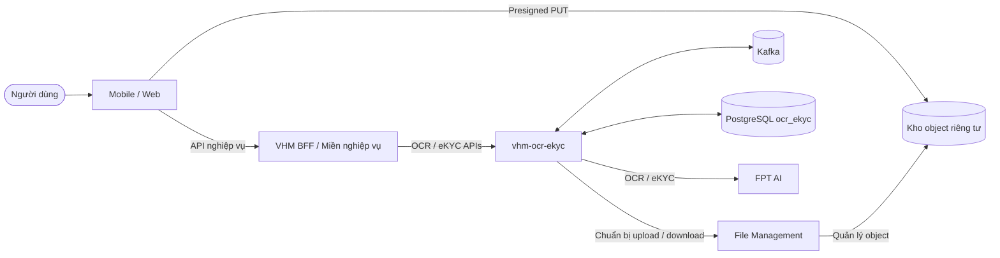

### 2.2.2 Sơ đồ thành phần

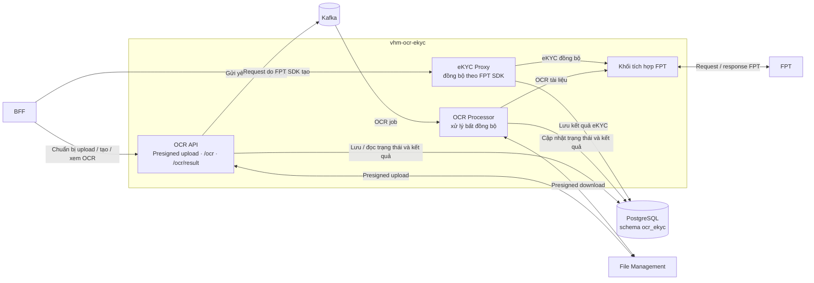

Đọc sơ đồ từ trái sang phải: OCR đi theo luồng bất đồng bộ
`BFF → OCR API → Kafka → OCR Processor → FPT`; eKYC đi theo luồng đồng bộ
`BFF → eKYC Proxy → FPT` và không đi qua Kafka/OCR Processor. Khi chuẩn bị upload,
OCR API gọi File Management và trả presigned URL về BFF, không qua tầng API trung gian khác.

### 2.2.3 Phân định trách nhiệm module

| **Component** | **Trách nhiệm** | **Dữ liệu quản lý** | **Lưu trữ** | **Giao tiếp ngoài component** |
| --- | --- | --- | --- | --- |
| OCR API | Chuẩn bị upload, tiếp nhận yêu cầu OCR và trả trạng thái/kết quả cho BFF. | Yêu cầu OCR, tham chiếu media và trạng thái tiếp nhận. | PostgreSQL schema `ocr_ekyc` | BFF, File Management, Kafka; không xử lý OCR dài trong request. |
| eKYC Proxy | Chuyển tiếp đồng bộ request do FPT SDK tạo và trả nguyên response FPT về SDK qua BFF. | Kết quả eKYC và metadata tương quan nội bộ. | PostgreSQL schema `ocr_ekyc` | BFF và FPT; không đưa request eKYC vào Kafka. |
| OCR Processor | Nhận công việc OCR, tải media, gửi/thăm dò FPT và chuẩn hóa kết quả. | Trạng thái xử lý, kết quả OCR và metadata lần gọi FPT. | PostgreSQL schema `ocr_ekyc` | Kafka, File Management và FPT; không tiếp nhận request từ Mobile/Web. |
| Tích hợp FPT | Quản lý contract, thông tin xác thực, timeout và ánh xạ kỹ thuật với FPT. | Không sở hữu dữ liệu nghiệp vụ. | Không có kho riêng | Được OCR Processor và eKYC Proxy sử dụng; OCR được chuẩn hóa, eKYC giữ nguyên response FPT. |

### 2.2.4 Hai luồng thực thi

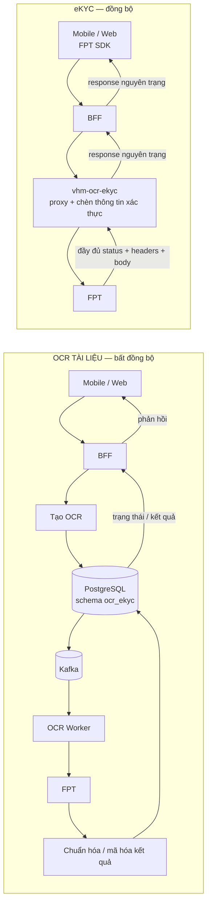

### 2.2.5 Ranh giới tin cậy

| **Ranh giới** | **Mức tin cậy** | **Kiểm soát bắt buộc** | **Hiện trạng** |
| --- | --- | --- | --- |
| Mobile/Web → BFF | Không tin cậy | OIDC/JWT, phân quyền object, giới hạn tần suất/body | Ngoài phạm vi mã nguồn này |
| BFF → `vhm-ocr-ekyc` | Zero Trust nội bộ | Danh tính workload/mTLS/JWT, audience/scope, chống phát lại | Kiểm soát bắt buộc theo kiến trúc đích |
| Mobile/Web → kho riêng tư | Đầu vào media không tin cậy | Presigned PUT chính xác, hạn ngắn, checksum, không đọc/liệt kê | URL đi theo File Management → `vhm-ocr-ekyc` → BFF |
| Service/processor → File Management/kho riêng tư | Hạn chế | Danh tính workload, TLS, phạm vi object và giới hạn byte | Kiểm soát bắt buộc theo kiến trúc đích |
| Service/worker → FPT | Bên ngoài | TLS, endpoint cố định, credential bí mật, timeout, quota | `HIỆN TRẠNG` một phần |
| Service → PostgreSQL/Kafka | Hạn chế | Mạng riêng, TLS/xác thực, đặc quyền tối thiểu | Bằng chứng triển khai TBD |

## 2.3 Vòng đời OCR

### 2.3.1 Trạng thái công bố cho BFF

Vòng đời OCR mà BFF cần xử lý chỉ gồm năm trạng thái. Việc gửi hồ sơ, chờ FPT và
thăm dò kết quả là hoạt động nội bộ của processor, đều được biểu diễn ra ngoài bằng
`PROCESSING`.

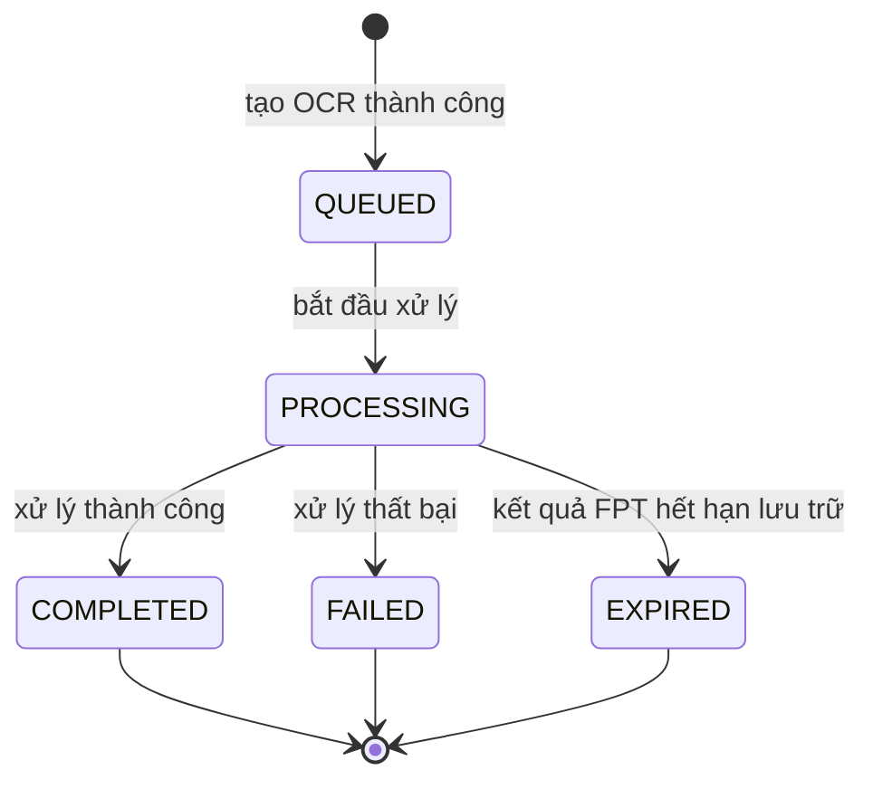

| **Trạng thái** | **Ý nghĩa** | **Kết quả** | **`errorCode`** |
| --- | --- | --- | --- |
| `QUEUED` | Đã tiếp nhận yêu cầu và đang chờ xử lý. | `null` | `null` |
| `PROCESSING` | Đang xử lý OCR; với hồ sơ Sale, trạng thái này bao gồm cả thời gian chờ và thăm dò FPT. | `null` | `null` |
| `COMPLETED` | Xử lý thành công. | Đầy đủ | `SUCCESS` |
| `FAILED` | Xử lý thất bại. | `null`; riêng lỗi sai loại tài liệu có thể giữ khối `completeness` theo contract FPT. | Mã lỗi xử lý |
| `EXPIRED` | Kết quả FPT đã hết thời hạn lưu trữ 30 ngày. | `null` | `SUCCESS` |

`status` là trường BFF sử dụng để quyết định tiếp tục thăm dò hay kết thúc. Các
trường `currentStep`, `outcome` và `errorCode` chỉ cung cấp thêm ngữ cảnh, không tạo
thêm trạng thái vòng đời cho bên gọi.

### 2.3.2 Thời hạn xử lý

- OCR thường/CCCD: thời hạn xử lý tối đa 15 phút kể từ khi tiếp nhận; worker phải
  kết thúc an toàn khi vượt thời hạn.
- FPT Sale: deadline `5 phút`; worker kiểm tra trước mỗi lần thăm dò và chuyển sang
  `FAILED` với `errorCode=PROCESSING_TIMEOUT` khi vượt thời hạn.
- HTTP timeout: FPT OCR 10 phút mặc định; FPT Sale 30 giây; connect timeout 2 giây.

## 2.4 Tính nhất quán và Idempotency

### 2.4.1 Tạo tài nguyên và idempotency

- Header `Idempotency-Key` bắt buộc ở mọi request tạo OCR.
- PostgreSQL schema `ocr_ekyc` bảo đảm một khóa idempotency duy nhất trong từng nguồn.
- Dấu vân tay request bao gồm toàn bộ tham chiếu media của use case tương ứng.
- Cùng khóa/cùng request trả tài nguyên hiện hữu; cùng khóa khác request trả
  HTTP `409`, mã `40901`.
- Xử lý tạo đồng thời phải trả kết quả idempotent nhất quán (`TD-004`).

### 2.4.2 Kafka và worker

- Thông điệp Kafka chỉ chứa định danh OCR, không chứa media hoặc PII.
- Worker chỉ xử lý khi chuyển trạng thái OCR thành công; thông điệp trùng không
  được tạo thêm lời gọi FPT sau khi OCR đã được nhận xử lý hoặc đã kết thúc.
- Cần cơ chế phục hồi OCR bị treo ở `PROCESSING` khi worker dừng đột ngột (`AR-004`).
- Khi FPT Sale chưa hoàn tất, worker trả tài nguyên và hệ thống lên lịch thăm dò tiếp.

### 2.4.3 Ranh giới nhất quán

| **Thao tác** | **Yêu cầu nhất quán** | **Nguyên tắc** |
| --- | --- | --- |
| Tạo OCR | Tài nguyên OCR và tham chiếu media cùng trạng thái | Không tạo bản ghi nghiệp vụ dở dang. |
| Nhận xử lý | Chỉ một worker được quyền xử lý tại một thời điểm | Thông điệp trùng phải an toàn. |
| Gọi FPT | Không giữ transaction PostgreSQL trong khi chờ mạng | Giới hạn timeout và tài nguyên. |
| Hoàn tất | Kết quả và trạng thái kết thúc phải nhất quán | Không ghi đè kết quả đã kết thúc. |
| eKYC đồng bộ | Response trả SDK và kết quả lưu phải tương ứng cùng một lần gọi FPT | Lỗi lưu kết quả không được làm thay đổi response FPT đã nhận; phải phát tín hiệu vận hành và xử lý theo runbook phục hồi. |

<a id="muc-3"></a>

# 3. Functional Requirements

## 3.1 Ma trận năng lực chức năng

| **FR ID** | **Năng lực** | **Yêu cầu** | **Trạng thái/bằng chứng** |
| --- | --- | --- | --- |
| FR-001 | Chuẩn bị upload | `vhm-ocr-ekyc` kiểm tra role/MIME/size, tạo path do server kiểm soát, gọi File Management và trả presigned URL về BFF | `HIỆN TRẠNG` |
| FR-002 | Media sẵn sàng | Chỉ chấp nhận managed path tồn tại trước khi tạo OCR | `HIỆN TRẠNG`; còn thiếu kiểm tra metadata/checksum |
| FR-003 | Tạo OCR | Lưu tài nguyên và tham chiếu media, phát công việc xử lý, trả `202 + Retry-After: 3` | `HIỆN TRẠNG` |
| FR-004 | Idempotency | Cùng key/payload trả tài nguyên cũ; khác payload trả xung đột | Yêu cầu bắt buộc, bao gồm request đồng thời |
| FR-005 | Định tuyến provider | FPT là provider duy nhất trong phạm vi tài liệu và được persist trên OCR | `HIỆN TRẠNG` mặc định; production không cho caller tự đổi provider |
| FR-006 | Hồ sơ Sale | Đúng ba refs; FPT submit/poll 3 giây; deadline 5 phút | `HIỆN TRẠNG` |
| FR-007 | Trạng thái | Trả lifecycle, outcome, error, next action và resource URI | `HIỆN TRẠNG` |
| FR-008 | Kết quả | Chỉ trả khi có kết quả mã hóa; nếu chưa có trả `409` | `HIỆN TRẠNG` |
| FR-009 | OCR chuẩn hóa | Allowlist field/confidence/warning, không trả raw provider payload | `HIỆN TRẠNG` cho OCR thường |
| FR-010 | Kết quả Sale | Chỉ giữ các khối allowlist `processing_time_ms`, `completeness`, `documents`, `matching`, `signature_seal` trong `details` | `HIỆN TRẠNG` |
| FR-011 | eKYC đồng bộ | FPT SDK gọi qua BFF và proxy; service inject credential, chuyển tiếp request và trả đầy đủ HTTP status, headers, body của FPT, không bọc/chuẩn hóa response | `MỤC TIÊU` — kiểm thử contract theo phiên bản SDK hỗ trợ |
| FR-012 | Lưu kết quả eKYC | Lưu kết quả FPT eKYC trong PostgreSQL schema `ocr_ekyc`, mã hóa dữ liệu nhạy cảm và áp dụng phân quyền/lưu giữ | `HIỆN TRẠNG` |
| FR-013 | Hủy/thử lại/đối soát | Phục hồi hữu hạn và tạo tài nguyên mới khi retry | `MỤC TIÊU`, chưa có API/worker |

## 3.2 Quy tắc nghiệp vụ

| **Mã quy tắc** | **Quy tắc** |
| --- | --- |
| BR-001 | OCR/eKYC là capability kỹ thuật; domain chịu trách nhiệm authorize và apply kết quả. |
| BR-002 | `OCR_COMPLETED` không đồng nghĩa danh tính đã được xác minh. |
| BR-003 | Caller không được gửi provider credential, provider job ID hoặc raw provider URL. |
| BR-004 | Provider được pin tại create; không failover tự động giữa chừng. |
| BR-005 | CCCD hai mặt phải có front/back cùng request; không ghép media từ OCR khác. |
| BR-006 | Hồ sơ Sale phải có đúng CCCD trước, CCCD sau và PLHĐ. |
| BR-007 | Sale `signature_seal.WARNING` không tự chặn OCR completed; domain quyết định manual review. |
| BR-008 | Confidence chỉ là tín hiệu ưu tiên review, không là xác suất pháp lý đã hiệu chuẩn. |
| BR-009 | Kafka/event/log không chứa media path, raw media, result, credential hoặc PII. |
| BR-010 | eKYC mutation không tự retry sau timeout/unknown delivery. |
| BR-011 | Response eKYC là response nguyên trạng của FPT dành cho SDK; mọi quyết định nghiệp vụ phía VHM phải được đặc tả riêng, không làm thay đổi wire contract của SDK. |
| BR-012 | Terminal OCR không bị xử lý lại bởi duplicate Kafka message. |
| BR-013 | File/path chỉ được tạo hoặc xác minh bởi `vhm-ocr-ekyc` theo managed prefix. |

## 3.3 Ma trận trạng thái/hành động

| **Trạng thái** | **Phản hồi `/ocr/result`** | **Hành động BFF** |
| --- | --- | --- |
| `QUEUED` | `result=null`; yêu cầu đang chờ xử lý | Tiếp tục thăm dò theo `Retry-After` |
| `PROCESSING` | `result=null`; OCR hoặc FPT đang xử lý | Tiếp tục thăm dò theo `Retry-After` |
| `COMPLETED` | Trạng thái kết thúc; trả kết quả OCR đầy đủ | Xác nhận và áp dụng theo quy tắc nghiệp vụ |
| `FAILED` | Trạng thái kết thúc; trả `errorCode`, không có kết quả đầy đủ | Hiển thị lỗi hoặc tạo yêu cầu mới theo chính sách |
| `EXPIRED` | Trạng thái kết thúc; không có kết quả | Tạo yêu cầu OCR mới nếu nghiệp vụ còn nhu cầu |

## 3.4 Quy tắc kênh

- DB constraint chỉ cho `WEB/WEB`, `MOBILE/ANDROID`, `MOBILE/IOS`.
- Request code upper-case channel/platform trước persist; invalid pair bị DB reject.
- Mobile/Web chỉ gọi BFF cho OCR/eKYC; không gọi trực tiếp `vhm-ocr-ekyc` hoặc FPT.
- BFF quản lý ngữ cảnh phiên eKYC giữa các bước và truyền đúng thông tin kênh/thiết bị.
- Web/Mobile SDK compatibility là L3 gate; route name VHM không thay thế exact
  multipart/header contract theo phiên bản SDK.

<a id="muc-4"></a>

# 4. Non-Functional Requirements

| **NFR ID** | **Nhóm** | **Hiện trạng/Mục tiêu** | **Trạng thái** |
| --- | --- | --- | --- |
| NFR-001 | Tính sẵn sàng | Đo riêng SLO dịch vụ và SLA FPT; mục tiêu nhiều replica/Multi-AZ | Mục tiêu TBD |
| NFR-002 | Độ trễ tiếp nhận OCR | Không gọi FPT khi tạo; mục tiêu p95 theo SLO API VHM | Kiến trúc đã đáp ứng; mục tiêu TBD |
| NFR-003 | Hoàn tất OCR | Sale ≤5 phút theo contract FPT; OCR thường có mục tiêu TBD | Một phần |
| NFR-004 | Độ trễ eKYC | Timeout FPT < deadline service < deadline BFF < deadline Mobile/Web | Mục tiêu theo từng thao tác còn TBD |
| NFR-005 | Tính toàn vẹn | Nhất quán PostgreSQL, idempotency, loại trùng và phục hồi trạng thái quá hạn | Kiểm thử trước production |
| NFR-006 | An toàn thông tin | TLS, xác thực workload, secret manager, endpoint cố định và log không chứa dữ liệu nhạy cảm | Kiểm thử trước production |
| NFR-007 | Quyền riêng tư | Mã hóa, tối thiểu hóa dữ liệu, lưu giữ/xóa, DPA/DPIA | Phê duyệt chính sách trước production |
| NFR-008 | Khả năng mở rộng | API stateless, mở rộng Kafka worker, bảo vệ quota FPT | Một phần; chưa có bằng chứng quota/bulkhead |
| NFR-009 | Khả năng quan sát | Health/info/Prometheus, log có cấu trúc, tương quan, metric/cảnh báo nghiệp vụ | Một phần |
| NFR-010 | Phục hồi | Phục hồi worker treo, sao lưu và khôi phục | Diễn tập trước production |
| NFR-011 | Khả năng bảo trì | Phân tách API, xử lý OCR, tích hợp FPT và contract chuẩn | Hiện có |
| NFR-012 | Khả năng kiểm thử | Bộ test unit/component/contract/integration/tải/an toàn thông tin | Unit hiện có; các cổng còn lại chưa đóng |

<a id="muc-5"></a>

# 5. Technology Stack & Justification

| **Lĩnh vực** | **Giải pháp lựa chọn** | **Cơ sở lựa chọn** | **Đánh đổi/trạng thái** |
| --- | --- | --- | --- |
| Ứng dụng | Java 25, Spring Boot 4.1.0 | Theo baseline công nghệ của dự án VHM | Một artifact triển khai; cần tách vai trò chạy khi mở rộng. |
| Cơ sở dữ liệu | PostgreSQL schema `ocr_ekyc` | Nguồn dữ liệu chính cho vòng đời và kết quả OCR/eKYC | Cần HA, PITR và chính sách lưu giữ được duyệt. |
| Thông điệp | Kafka | Tách thời gian xử lý OCR khỏi request nghiệp vụ | Yêu cầu consumer idempotent và giám sát độ trễ. |
| Tích hợp FPT | HTTPS API, contract có phiên bản | Quản lý tập trung thông tin xác thực, timeout và ánh xạ lỗi | Phụ thuộc SLA/quota/tính tương thích FPT. |
| Lưu trữ media | File Management và kho object riêng tư | `vhm-ocr-ekyc` lấy presigned URL; Mobile/Web upload trực tiếp, không truyền media qua Kafka hoặc lưu binary trong PostgreSQL | Cần checksum, thời hạn lưu và kiểm soát truy cập. |
| Mã hóa | Tiêu chuẩn mã hóa và quản lý khóa của VHM | Bảo vệ kết quả OCR/eKYC được lưu trữ | Cần bằng chứng quản lý/luân chuyển khóa trước production. |
| Quan sát hệ thống | Metric, log và trace theo nền tảng VHM | Theo dõi API, Kafka, worker và FPT | Không ghi PII hoặc dữ liệu sinh trắc. |
| Tài liệu API | OpenAPI có phiên bản | Contract giữa BFF và dịch vụ OCR/eKYC | Cần xuất bản đặc tả L3 trước go-live. |

## 5.1 ADR Log

Chỉ mục ADR đầy đủ tại Phụ lục D. Các quyết định trọng yếu: OCR bất đồng bộ,
eKYC đồng bộ, PostgreSQL schema `ocr_ekyc` là nguồn dữ liệu chính, tích hợp FPT
tập trung, kết quả OCR chuẩn, lưu kết quả eKYC, media riêng tư và không thử lại eKYC mù quáng.

<a id="muc-6"></a>

# 6. Integration Architecture

## 6.1 Danh mục giao diện tích hợp

| **ID** | **Mô tả** | **Contract** | **Nguồn** | **Đích** | **Giao thức** | **Chế độ** | **Dữ liệu chính** |
| --- | --- | --- | --- | --- | --- | --- | --- |
| API-01 | Tạo OCR một hoặc nhiều tài liệu | `POST /ocr` | BFF | `vhm-ocr-ekyc` | HTTPS/JSON | Đồng bộ tiếp nhận; xử lý bất đồng bộ | Ngữ cảnh opaque, loại OCR, tham chiếu media, `Idempotency-Key` |
| API-02 | Thăm dò trạng thái và nhận kết quả OCR | `/ocr/result` | BFF | `vhm-ocr-ekyc` | HTTPS/JSON | Đồng bộ | Định danh OCR, trạng thái, lỗi và kết quả chuẩn |
| UPLOAD-01 | Chuẩn bị presigned upload; route chi tiết thuộc đặc tả L3 | BFF → service → File Management | BFF | File Management qua `vhm-ocr-ekyc` | HTTPS/JSON | Đồng bộ | Metadata file, presigned URL/headers và `s3PathFile`; không truyền media bytes |
| EVT-01 | Điều phối OCR sau khi tiếp nhận | `vhm.ocr-ekyc.job.created.v1` | OCR API | OCR Processor qua Kafka | Kafka | Bất đồng bộ | Chỉ định danh OCR |
| FPT-01 | Nhận dạng một tài liệu | Contract FPT được quản lý nội bộ | OCR Processor | FPT | HTTPS/multipart | Đồng bộ bên trong luồng OCR bất đồng bộ | Media tài liệu và kết quả FPT |
| FPT-02 | Gửi và thăm dò hồ sơ Sale | Contract FPT được quản lý nội bộ | OCR Processor | FPT | HTTPS/multipart/JSON | Bất đồng bộ theo nghiệp vụ | Ba tài liệu, mã giao dịch nội bộ và kết quả FPT |
| EKYC-01 | Proxy các thao tác do FPT SDK điều phối | Contract theo phiên bản SDK hỗ trợ | FPT SDK qua BFF | FPT qua `vhm-ocr-ekyc` | HTTPS/JSON hoặc multipart | Đồng bộ | Request SDK và toàn bộ HTTP status, headers, body của FPT |

## 6.2 Contract API OCR VHM

Contract OCR công khai cho BFF chỉ gồm hai đường dẫn: `POST /ocr` để tạo yêu cầu
và `/ocr/result` để thăm dò trạng thái/nhận kết quả. Không công bố endpoint OCR
riêng theo use case hoặc endpoint tài nguyên chứa định danh trên path.

Mọi response OCR và chuẩn bị upload thành công dùng envelope:

```json
{"code": 0, "msg": "success", "data": {}, "meta": null}
```

Lỗi dùng `data=null`; `meta` chứa `correlationId` và chi tiết kiểm tra. Thao tác tạo
trả HTTP `202` và `Retry-After: 3`.

### 6.2.1 Tạo một tài liệu

```http
POST /ocr
Idempotency-Key: <opaque-key>
Content-Type: application/json

{
  "source": "DOSSIER",
  "referenceId": "opaque-business-ref",
  "requestBy": "opaque-actor-ref",
  "subjectRef": "opaque-subject-ref",
  "channel": "WEB",
  "platform": "WEB",
  "documentType": "NATIONAL_ID",
  "s3PathFile": "ocr-media/dossier/opaque-ref/ocr_document/file.jpg"
}
```

FPT là nhà cung cấp duy nhất thuộc contract TDD này. Production không cho bên gọi tự
chọn nhà cung cấp qua query parameter. Danh sách loại tài liệu cho phép theo bên gọi/use case
chưa có trong code và phải được bổ sung trước khi mở API production.

### 6.2.2 Tạo OCR hồ sơ nhiều tài liệu

Hồ sơ nhiều tài liệu sử dụng cùng `POST /ocr`, không có endpoint riêng theo use
case. BFF gửi loại OCR, ngữ cảnh nghiệp vụ và ba tham chiếu tài liệu gồm CCCD mặt
trước, CCCD mặt sau và PLHĐ. Dịch vụ ghi nhận một tài nguyên OCR duy nhất, bảo toàn
vai trò của từng tài liệu và áp dụng thời hạn xử lý 5 phút.

### 6.2.3 Trạng thái/kết quả

Dữ liệu trạng thái:

```json
{
  "ocrId": "0198...",
  "type": "OCR",
  "status": "PROCESSING",
  "currentStep": "POLL_PROVIDER",
  "outcome": null,
  "errorCode": null,
  "resultAvailable": false,
  "result": null,
  "nextAction": "POLL",
  "updatedAt": "2026-08-14T03:00:00Z"
}
```

`nextAction`: kết quả có sẵn → `CONFIRM_AND_APPLY`; kết thúc không có kết quả →
`RETRY`; còn lại → `POLL`. Khi OCR chưa kết thúc, `/ocr/result` vẫn trả trạng thái
hiện tại và `result=null` để BFF tiếp tục thăm dò.

## 6.3 Contract presigned upload

Mobile/Web không gọi File Management trực tiếp. Mobile/Web gửi yêu cầu qua BFF;
BFF gọi `vhm-ocr-ekyc`, service kiểm tra metadata và gọi File Management để nhận
presigned URL rồi trả ngược về BFF. Đầu vào logic gồm `source`, `referenceId`,
`role`, `fileName`, `contentType`, `fileSize`; route chi tiết thuộc đặc tả L3.

- Role allowlist: `OCR_DOCUMENT`, `DOCUMENT_FRONT`, `DOCUMENT_BACK`, `LABOR_CONTRACT`.
- MIME allowlist hiện tại: `image/jpeg`, `image/png`, `application/pdf`.
- Path do server tạo:
  `<basePath>/<source>/<referenceId>/<role>/<slug>_<UUIDv7>.<ext>`.
- Response: `presignedUrl`, `presignHeaders`, `s3PathFile`.
- TDD contract chỉ cho persist/truyền `s3PathFile`; không persist presigned URL.

## 6.4 Contract với FPT

### 6.4.1 FPT ID Recognition

- Worker gọi năng lực nhận dạng giấy tờ của FPT thông qua lớp tích hợp nội bộ.
- Endpoint và thông tin xác thực FPT được quản lý theo cấu hình môi trường, không
  thuộc contract L2 công bố cho bên sử dụng VHM.
- Lời gọi FPT là đồng bộ bên trong luồng OCR bất đồng bộ của VHM.

### 6.4.2 FPT OCR hồ sơ Sale

| **Thao tác** | **Contract** | **Hành vi worker** |
| --- | --- | --- |
| Đăng ký | Gửi đúng ba tài liệu CCCD trước, CCCD sau và PLHĐ | FPT tiếp nhận thành công và trả `request_id` → lưu mã giao dịch nội bộ |
| Kết quả đơn | Truy vấn theo `request_id` | Thăm dò mỗi 3 giây |
| Kết quả lô | FPT hỗ trợ truy vấn tối đa 100 ID | VHM chưa triển khai |
| Kết thúc | `COMPLETED`, `FAILED`; `EXPIRED` sau thời hạn lưu | Ánh xạ thành công/kết quả hoặc lỗi FPT |
| Giới hạn | 20 MB/file, 60 MB/request, xử lý 5 phút | Phải cưỡng chế kiểm tra media/dung lượng xuyên suốt |

Luồng tích hợp giữ nguyên mô hình bất đồng bộ: VHM gửi hồ sơ, nhận `request_id`,
sau đó chủ động thăm dò FPT theo chu kỳ tối thiểu 3 giây cho tới trạng thái kết
thúc. FPT không cung cấp callback/webhook cho luồng này.

| **Trạng thái FPT** | **Ý nghĩa** | **Khối kết quả** | **`error_code`** | **Ánh xạ vòng đời VHM** |
| --- | --- | --- | --- | --- |
| `QUEUED` | FPT đã tiếp nhận hồ sơ và đang chờ xử lý | `null` hoặc mảng rỗng | `SUCCESS` | Giữ OCR ở `PROCESSING` và tiếp tục thăm dò. |
| `PROCESSING` | FPT đang thực hiện OCR | `null` hoặc mảng rỗng | `SUCCESS` | Giữ OCR ở `PROCESSING` và tiếp tục thăm dò. |
| `COMPLETED` | FPT xử lý thành công | Đầy đủ các khối kết quả | `SUCCESS` | Chuẩn hóa, lưu kết quả và kết thúc OCR thành công. |
| `FAILED` | FPT xử lý thất bại | Thông thường `null` hoặc mảng rỗng; riêng `DOCUMENT_TYPE_MISMATCH` có `completeness` | Mã lỗi xử lý của FPT | Chuyển OCR sang `FAILED` và lưu mã lỗi FPT. |
| `EXPIRED` | Kết quả đã quá hạn lưu trữ 30 ngày kể từ khi nộp | `null` hoặc mảng rỗng | `SUCCESS` | Chuyển OCR sang `EXPIRED`, không coi là OCR thành công. |

`error_code=SUCCESS` chỉ thể hiện request lấy trạng thái thành công. Quyết định kết
thúc OCR phải dựa đồng thời vào `status`; đặc biệt `QUEUED`, `PROCESSING` và
`EXPIRED` không được ánh xạ thành kết quả OCR thành công.

Response FPT khi hoàn tất chứa `completeness`, `documents`, `matching` và
`signature_seal`. `matching.status` gồm `MATCH`, `MISMATCH`, `NEW`; exact,
similarity và fuzzy dealer mapping là hành vi FPT, không được VHM tự suy
diễn lại. Cảnh báo chữ ký/con dấu chỉ là bằng chứng hỗ trợ rà soát.

## 6.5 Contract proxy eKYC tương thích FPT SDK

FPT SDK chạy trên Mobile/Web và được cấu hình gọi qua BFF tới `vhm-ocr-ekyc`.
Service làm proxy đồng bộ tới FPT, quản lý credential phía server và không điều phối
thứ tự các bước thay SDK. Response FPT được chuyển tiếp đầy đủ về SDK, đồng thời kết
quả eKYC được lưu trong PostgreSQL schema `ocr_ekyc` theo chính sách bảo mật và lưu giữ.

| **Chiều truyền** | **Contract bắt buộc** |
| --- | --- |
| SDK → BFF → service → FPT | Chuyển tiếp request theo đúng method, path logic, headers và body/multipart mà phiên bản SDK yêu cầu; service chỉ bổ sung/thay credential phía server. |
| FPT → service → BFF → SDK | Trả đầy đủ HTTP status, headers và body của FPT; không lọc theo danh sách header, không bọc envelope VHM, không đổi mã lỗi và không chuẩn hóa payload. |
| Lưu trữ | Lưu kết quả eKYC trong `ocr_ekyc.ocr_ekyc_results`; metadata lần gọi được quản lý trong `ocr_ekyc.ocr_ekyc_provider_calls`. Dữ liệu nhạy cảm phải được mã hóa và không ghi vào log. Lỗi lưu không được bọc, thay thế hoặc che response FPT đã nhận. |

### INT-01 — Nguyên tắc tương thích phiên FPT eKYC

Một hành trình eKYC do FPT SDK điều phối và phải giữ thống nhất ngữ cảnh phiên giữa
các bước khởi tạo, OCR giấy tờ và kiểm tra sống/đối sánh khuôn mặt.

- BFF và `vhm-ocr-ekyc` không đổi tên, bỏ hoặc dựng lại dữ liệu mà SDK/FPT cần để
  duy trì phiên và phân tích response.
- Thông tin phiên/kênh/thiết bị do SDK gửi được chuyển tiếp theo contract của phiên
  bản SDK hỗ trợ; credential FPT chỉ được chèn tại `vhm-ocr-ekyc`.
- FPT response được chuyển tiếp đầy đủ về SDK trên cả nhánh thành công và lỗi để
  callback/parser của SDK xử lý đúng contract.
- Không tự thử lại thao tác làm thay đổi phiên khi chưa biết FPT đã nhận request hay chưa.
- Ma trận phiên bản Android/iOS/Web và contract request/response được kiểm thử E2E
  trước khi phát hành phiên bản client tương ứng.

## 6.6 Mô hình kết quả chuẩn

OCR thường:

```json
{
  "provider": "FPT",
  "documentType": "NATIONAL_ID",
  "providerCode": "0",
  "providerMessage": "",
  "fields": {"idNumber": "...", "fullName": "..."},
  "confidence": {"idNumber": 0.98},
  "warnings": [],
  "valid": true,
  "details": null
}
```

Các khóa chuẩn cố định: `idNumber`, `fullName`, `dateOfBirth`, `gender`, `address`,
`hometown`, `issueDate`, `expiryDate`, `issuePlace`, `nationality`. Thiếu
`idNumber`/`fullName` tạo warning và `valid=false`.

Kết quả Sale giữ `fields/confidence/warnings` rỗng và đặt các khối FPT thuộc
danh sách cho phép vào `details`. `request_id` thô và trường ngoài danh sách không được sao chép.

## 6.7 Contract lỗi chuẩn

| **HTTP/mã lỗi** | **Ý nghĩa** |
| --- | --- |
| `400 / 40000` | Lỗi kiểm tra/header/đường dẫn media |
| `403 / 40300` | Bị từ chối (đã có taxonomy; mục tiêu cưỡng chế còn thiếu) |
| `404 / 40400` | Không tìm thấy OCR |
| `409 / 40900` | Kết quả chưa sẵn sàng/xung đột |
| `409 / 40901` | Tái sử dụng idempotency key với payload khác |
| `413 / 41300` | Multipart/media vượt giới hạn |
| `502 / 50200` | Lỗi FPT |
| `503 / 50300` | Phụ thuộc không sẵn sàng |
| `504 / 50400` | FPT hết thời gian chờ |
| `500 / 50000` | Lỗi nội bộ ngoài dự kiến |

Lỗi phía FPT trong OCR bất đồng bộ không trả 5xx cho thao tác tạo; BFF nhận
`status=FAILED`, `result=null` và `errorCode=<canonical/provider code>` khi thăm dò
`/ocr/result`.

<a id="muc-7"></a>

# 7. Data Architecture & Data Flow

## 7.1 Data Model

### 7.1.1 Sở hữu dữ liệu logic

PostgreSQL schema `ocr_ekyc` là nguồn dữ liệu chính cho vòng đời và kết quả OCR/eKYC.
TDD L2 chỉ mô tả vai trò của các bảng;
cấu trúc cột, index và migration chi tiết thuộc đặc tả L3 của CSDL.

| **Bảng PostgreSQL** | **Mục đích** | **Phân loại** | **Kiểm soát kiến trúc** |
| --- | --- | --- | --- |
| `ocr_ekyc.ocr_ekyc_requests` | Yêu cầu OCR/eKYC, tham chiếu nghiệp vụ, provider và trạng thái xử lý | Metadata nhạy cảm | Mã tham chiếu opaque, phân quyền theo phạm vi và trạng thái hợp lệ. |
| `ocr_ekyc.ocr_ekyc_media_refs` | Tham chiếu object media theo vai trò và thứ tự tài liệu | Dữ liệu nhạy cảm | Không lưu binary/presigned URL; kiểm soát truy cập và thời hạn lưu. |
| `ocr_ekyc.ocr_ekyc_results` | Kết quả OCR chuẩn và kết quả eKYC được lưu trữ | PII/sinh trắc hạn chế | Mã hóa, phân quyền và lưu giữ theo mục đích. |
| `ocr_ekyc.ocr_ekyc_provider_calls` | Metadata kỹ thuật của các lần gọi FPT | Metadata vận hành | Không công bố ID FPT; giới hạn truy cập và thời hạn lưu. |
| `ocr_ekyc.outbox_events` | Sự kiện điều phối xử lý OCR sau khi yêu cầu được ghi nhận | Metadata nội bộ | Chỉ chứa định danh/tham chiếu tối thiểu, không chứa media, kết quả hoặc PII. |

`subjectRef` hiện có trong request nhưng chưa được lưu cùng tài nguyên OCR; đây là
yêu cầu cần hoàn thiện trước khi dùng trường này cho tương quan hoặc phân quyền (`TD-016`).

### 7.1.2 Sơ đồ quan hệ dữ liệu logic

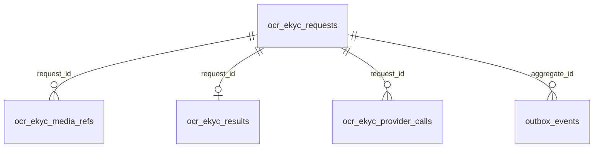

## 7.2 Data Flow Diagram

### 7.2.1 Luồng điều khiển/dữ liệu OCR

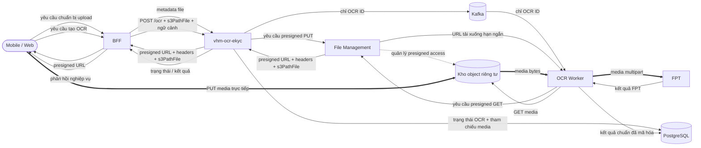

### 7.2.2 Luồng eKYC đồng bộ

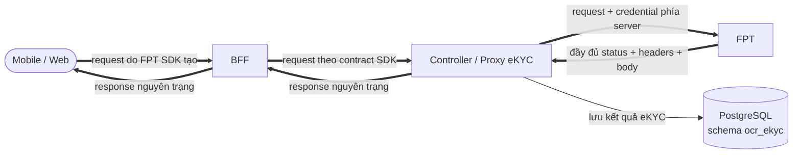

Ký hiệu `==>` biểu diễn luồng có media hoặc response nhạy cảm. Dữ liệu này phải
được giới hạn kích thước, không ghi log và không lưu ngoài mục đích đã duyệt.

## 7.3 Data Privacy & PII

### 7.3.1 Phân loại và tối thiểu hóa dữ liệu

| **Phân loại** | **Ví dụ** | **Cách xử lý được phép** |
| --- | --- | --- |
| Bí mật | FPT API key, mật khẩu File Management, khóa mã hóa | Chỉ ở secret manager/runtime; không vào DB/event/log/client. |
| Media sinh trắc hạn chế | Selfie/video đầu vào | Chỉ truyền tới FPT theo mục đích eKYC đã duyệt; không lưu raw media trong PostgreSQL và không ghi log. |
| Kết quả eKYC hạn chế | Kết quả liveness/đối sánh khuôn mặt và response FPT liên quan | Lưu mã hóa trong PostgreSQL, phân quyền và xóa theo chính sách. |
| Định danh hạn chế | Ảnh CCCD/CMND, trường OCR, PLHĐ, địa chỉ, số giấy tờ | Kho riêng tư/DB mã hóa, truy cập theo object, lưu giữ/xóa. |
| Metadata nhạy cảm | Đường dẫn object, provider job/session/request ID, confidence/cảnh báo | Chỉ nội bộ; không đưa vào API/event/log công khai nếu có thể tránh. |
| Nội bộ | OCR ID, trạng thái, enum FPT, taxonomy lỗi không PII | Có thể xuất hiện trong log/metric được kiểm soát; không làm nhãn metric có cardinality cao. |

### 7.3.2 Danh mục dữ liệu và yêu cầu quản lý

- Kết quả OCR/eKYC được lưu và mã hóa trong PostgreSQL schema `ocr_ekyc`.
- Tham chiếu media hiện được lưu bản rõ; cần đánh giá mã hóa hoặc thay bằng định danh
  opaque theo tiêu chuẩn dữ liệu VHM.
- Khóa mã hóa phải do nền tảng quản lý và có quy trình luân chuyển/thu hồi.
- Chưa có chính sách và cơ chế xóa tự động cho kết quả OCR/eKYC và media được VHM lưu giữ.
- `referenceId` và `requestBy` phải luôn là giá trị opaque, không nhúng PII.

## 7.4 Data Privacy (Optional)

| **Dữ liệu** | **Giới hạn kỹ thuật/đầu vào contract** | **Cơ chế xóa** | **Trạng thái** |
| --- | --- | --- | --- |
| Kết quả FPT Sale | Tài liệu FPT quy định 30 ngày | FPT quản lý | `BÊN NGOÀI`; cần bằng chứng DPA |
| DB/kết quả OCR | Theo mục đích được phê duyệt | Xóa/ẩn danh theo lô định kỳ | Áp dụng chính sách lưu giữ VHM |
| Kết quả eKYC | Theo mục đích eKYC và chính sách dữ liệu sinh trắc được phê duyệt | Xóa/ẩn danh theo lô định kỳ | Mã hóa, phân quyền và có bằng chứng xóa |
| Media OCR riêng tư | Theo loại tài liệu, mục đích và legal hold | Vòng đời File Management/object + dọn tham chiếu DB | Áp dụng chính sách lưu giữ VHM |
| Metadata tích hợp FPT | Theo chính sách vận hành/audit | Xóa theo lô sau cửa sổ an toàn | Tối thiểu hóa dữ liệu |
| Log/APM | Theo tiêu chuẩn VHM | Vòng đời index | Không lưu PII, credential hoặc media nhạy cảm |
| Sao lưu/PITR | Theo RPO và chính sách lưu giữ | Hết hạn bản sao + quét xóa sau phục hồi | Kiểm thử phục hồi và xóa |

Không dùng thời hạn 30 ngày của FPT Sale làm retention mặc định cho VHM. Retention
phải versioned theo purpose, consent và legal hold. Purge job phải bounded,
idempotent, có oldest-eligible-age metric và không log PII/path.

### Data Stores & Ownership

| **Kho** | **Dữ liệu** | **Nguồn sự thật** | **Phục hồi** |
| --- | --- | --- | --- |
| PostgreSQL schema `ocr_ekyc` | `ocr_ekyc_requests`, `ocr_ekyc_media_refs`, `ocr_ekyc_results`, `ocr_ekyc_provider_calls`, `outbox_events`; lưu trạng thái và kết quả OCR/eKYC | Có đối với dữ liệu OCR/eKYC | Mục tiêu Multi-AZ/PITR; diễn tập phục hồi TBD |
| Kho object riêng tư | Tài liệu/media đã tải lên | Có đối với byte media | DR File Management/kho lưu trữ + bằng chứng lưu giữ TBD |
| Kafka | Tham chiếu điều phối OCR | Không | Phát lại an toàn nhờ trạng thái DB; lưu giữ topic TBD |
| Bộ nhớ tiến trình | Byte media, response FPT, token | Không | Có giới hạn/dọn theo request; cần tính dung lượng bộ nhớ |
| FPT | Job/kết quả FPT | Phụ thuộc bên ngoài | Thăm dò/đối soát theo từng contract |

<a id="muc-8"></a>

# 8. Business Flow Diagrams

## 8.1 Sequence/State Diagram

### 8.1.1 Chuẩn bị upload và tạo OCR

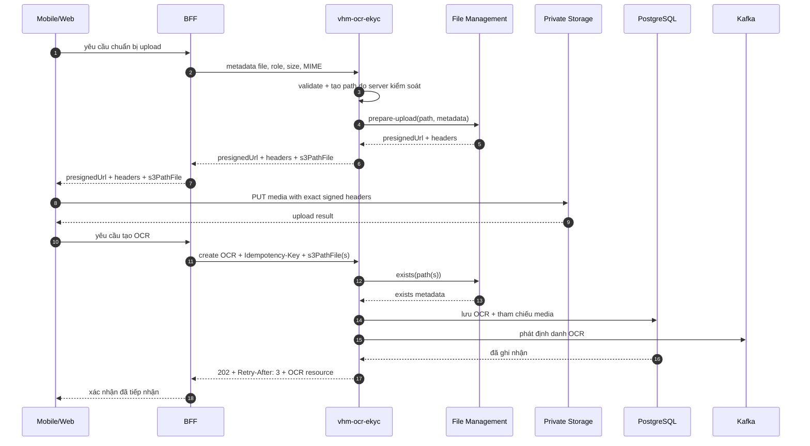

### 8.1.2 OCR tài liệu thông thường

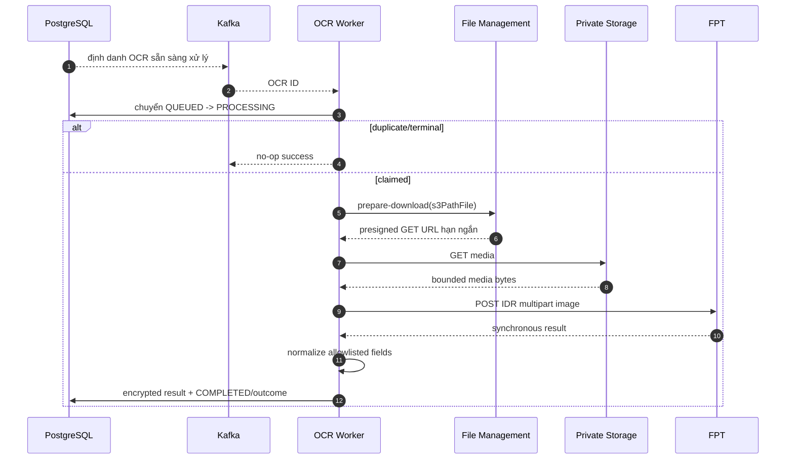

### 8.1.3 Gửi/thăm dò FPT Sale

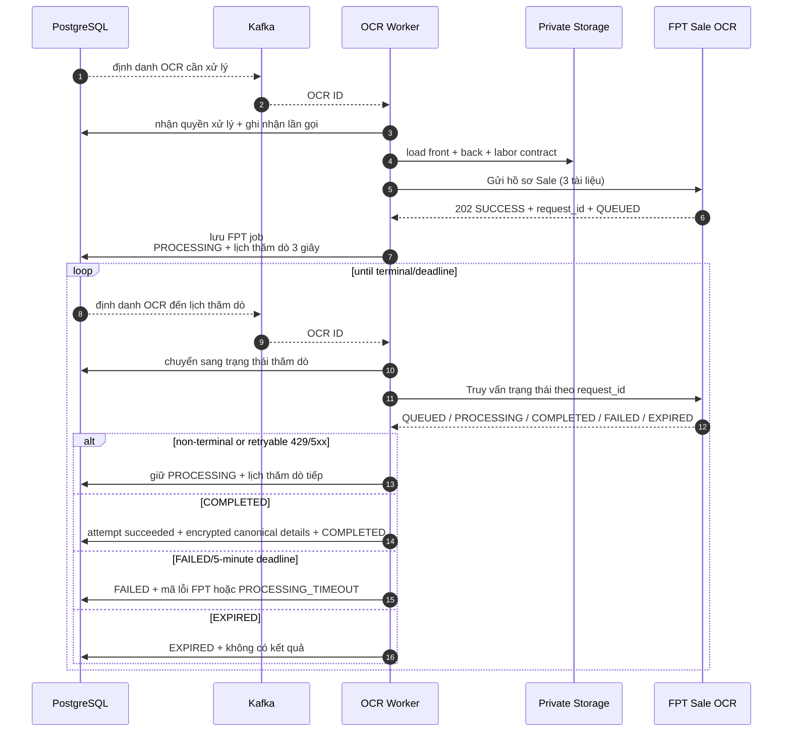

### 8.1.4 Request eKYC đồng bộ

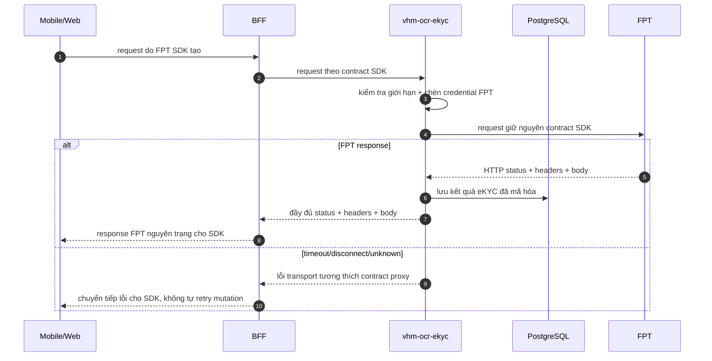

## 8.2 Ma trận xử lý lỗi

| **Sự cố** | **Hành vi hiện tại** | **Phục hồi/kiểm soát bắt buộc** |
| --- | --- | --- |
| Media thiếu/nằm ngoài prefix | Từ chối tạo với 400 | Audit/giới hạn tần suất hành vi lạm dụng lặp lại. |
| Kafka trùng thông điệp | Claim thất bại, worker bỏ qua | Duy trì kiểm thử contract. |
| Phát sự kiện gián đoạn | Sự kiện có thể được phát lại | Worker loại trùng; giám sát tỷ lệ trùng. |
| Worker dừng ở `PROCESSING` | Job bị treo | Thêm cơ chế phát hiện quá hạn và đối soát (`P1`). |
| FPT synchronous timeout | OCR đóng với `PROVIDER_ERROR` | Phân loại không rõ sau khi gửi; chính sách thử lại an toàn, hữu hạn theo contract FPT. |
| Gửi Sale không rõ sau khi gửi | Lần gọi thất bại, OCR kết thúc | Cần idempotency/tra cứu từ FPT để tránh gửi trùng; nếu không phải chấp nhận rủi ro. |
| Thăm dò Sale gặp 429/5xx | Thăm dò trễ | Thêm exponential backoff/jitter và bảo vệ quota. |
| Thăm dò Sale gặp lỗi I/O | Thăm dò lại sau 3 giây | Lưu lỗi/số lần; thử lại hữu hạn đến deadline. |
| Hết deadline Sale | `PROCESSING_TIMEOUT`, lỗi FPT kết thúc | Công bố hướng dẫn thử lại/idempotency key mới. |
| FPT eKYC trả non-2xx | Chuyển tiếp đầy đủ status, headers và body về SDK | Kiểm thử callback/parser lỗi theo từng phiên bản SDK. |
| Proxy lọc/bọc response FPT | SDK có thể không phân tích được kết quả | Cấm lọc header hoặc bọc envelope; kiểm thử byte/status/header tương thích đầu-cuối. |
| PostgreSQL lỗi sau khi đã nhận response eKYC từ FPT | Kết quả eKYC có thể chưa được lưu | Vẫn trả nguyên response FPT cho SDK; phát metric/cảnh báo và xử lý theo runbook phục hồi bằng correlation ID nội bộ. |
| Không giải mã được kết quả/thiếu khóa | API 500 | Runbook phục hồi/luân chuyển khóa; đóng an toàn. |

## 8.3 Chuẩn hóa dữ liệu

- Tên trường FPT chỉ được ánh xạ qua danh sách cho phép tường minh.
- Số giấy tờ luôn là chuỗi; không chuyển thành số.
- Giá trị FPT null/rỗng bị loại; confidence chỉ được sao chép khi có giá trị.
- FPT accepts legacy item `{key,value,score}` and flat object fields with `_prob`.
- `valid=true` hiện nghĩa provider success và không thiếu `idNumber/fullName`; nó
  không phải document authenticity/eKYC decision.
- Chi tiết Sale là bằng chứng có cấu trúc do FPT định nghĩa. Phiên bản hiện tại
  không làm phẳng hoặc thay đổi ngữ nghĩa đối sánh/chữ ký.

<a id="muc-9"></a>

# 9. Security & Compliance Architecture

## 9.1 Identity & Authentication

| **Kiểm soát** | **Mục tiêu** | **Hiện trạng/bằng chứng** |
| --- | --- | --- |
| Xác thực bên ngoài | OIDC/JWT tại BFF | Ngoài phạm vi mã nguồn này |
| Xác thực liên dịch vụ | mTLS hoặc workload JWT với issuer, audience và scope được duyệt | Cần chốt với nền tảng IAM trước production |

## 9.2 Authorization & Access Control

- BFF thực thi phân quyền theo vai trò và ngữ cảnh nghiệp vụ trước khi chuyển yêu cầu.
- Dịch vụ kiểm tra phạm vi truy cập theo chủ thể, nguồn yêu cầu, hồ sơ và tài nguyên media;
  không chỉ dựa vào việc biết định danh OCR.
- Quyền ứng dụng và quyền truy cập PostgreSQL schema `ocr_ekyc`
  được tách biệt theo nguyên tắc đặc quyền tối thiểu.
- Mọi thao tác xem kết quả, tải media, xử lý lại và thay đổi cấu hình phải có audit.

## 9.3 Secrets & Credential Management

- FPT API key, thông tin xác thực File Management và khóa mã hóa phải lấy từ
  secret manager/biến môi trường; cấu hình rỗng phải làm readiness thất bại đối với
  năng lực đang bật.
- Không để khóa production trong source, ConfigMap, image, giao diện test hoặc ví dụ OpenAPI.
- Dữ liệu nhạy cảm phải được mã hóa theo tiêu chuẩn VHM; cần quy trình luân chuyển,
  thu hồi và khôi phục khóa.
- Token/thông tin xác thực FPT không được xuất hiện trong thông báo exception/log.
- Tối thiểu TLS 1.2, ưu tiên TLS 1.3; phải lập tài liệu quyết định kiểm tra/ghim
  chứng thư cho FPT và Mobile SDK.

## 9.4 Application Security & Data Protection

### Kiểm soát media và request

| **Kiểm soát** | **Phạm vi áp dụng** | **Yêu cầu kiến trúc** |
| --- | --- | --- |
| Đường dẫn upload do server kiểm soát | Có | Gắn bên gọi/phạm vi nghiệp vụ bằng cơ chế có thẩm quyền hoặc mật mã. |
| Danh sách MIME cho phép | JPEG/PNG/PDF | Áp dụng ma trận theo vai trò và kiểm tra magic byte. |
| Kích thước | Cấu hình 20 MB cho mỗi object tải xuống | Kiểm tra metadata tồn tại, tổng Sale 60 MB, giới hạn giải nén/số trang. |
| Checksum | Chưa cưỡng chế | Checksum có chữ ký + xác minh bằng bước hoàn tất/HEAD. |
| Path traversal | Prefix + từ chối `..` | Chuẩn hóa đường dẫn và gắn source/reference/role. |
| Multipart | Tên file đã làm sạch | Triển khai hiện tại có đệm; giới hạn part/header/bộ nhớ. |
| Presigned URL | Không lưu trong bảng OCR | Không để URL trong log/audit/lỗi; hạn ngắn/chính xác method/key. |

Luồng eKYC hiện log tên file đã làm sạch, kích thước và content type khi lỗi.
Vì tên file có thể chứa PII, mục tiêu production chỉ log media ID do hệ thống sinh
và thao tác, không log tên file gốc (`TD-010`).

### Ma trận bảo vệ dữ liệu

| **Nhóm dữ liệu** | **Khi lưu trữ** | **Khi truyền** | **Công bố/hiển thị** | **Ghi log** |
| --- | --- | --- | --- | --- |
| Kết quả OCR và trường định danh | Mã hóa trong PostgreSQL schema `ocr_ekyc`, phân quyền theo mục đích | TLS giữa các thành phần | Chỉ trả BFF đã được phân quyền; BFF áp dụng che dữ liệu theo vai trò trước khi hiển thị | Không ghi giá trị trường OCR hoặc PII |
| Response eKYC FPT | Lưu mã hóa trong `ocr_ekyc.ocr_ekyc_results` | TLS trên toàn tuyến SDK → BFF → service → FPT | Proxy không che, lọc hoặc sửa response dành cho FPT SDK; việc hiển thị nghiệp vụ thuộc BFF/SDK | Không ghi dữ liệu định danh, sinh trắc hoặc định danh phiên FPT |
| Media OCR/eKYC | Media OCR ở kho object riêng tư; media eKYC không lưu raw body trong PostgreSQL | Presigned URL hạn ngắn hoặc multipart TLS theo đúng luồng | Không công bố trực tiếp ngoài phiên upload/download đã được cấp quyền | Không ghi media, tên file gốc, đường dẫn hoặc presigned URL |
| Tham chiếu kỹ thuật | Dùng giá trị opaque; giới hạn truy cập trong PostgreSQL | Chỉ truyền khi cần tương quan nội bộ | Không hiển thị provider job/session ID cho Mobile/Web | Chỉ log định danh nội bộ đã được phê duyệt, không dùng làm nhãn metric cardinality cao |
| Credential và khóa mã hóa | Chỉ lưu trong secret manager/KMS theo tiêu chuẩn VHM | Chỉ cấp cho workload được phép | Không trả cho BFF, SDK hoặc API consumer | Không ghi dưới mọi hình thức |

### Ghi log và audit

Các trường log vận hành được phép: thời gian, ứng dụng/môi trường/phiên bản, thao tác,
OCR ID theo chính sách được duyệt, enum FPT/status code, thời lượng, Kafka
partition/offset, correlation/trace ID và nhóm lỗi chuẩn.

Cấm: thông tin xác thực/token, trường OCR, số giấy tờ,
họ tên/địa chỉ, media thô, tên file gốc, `s3PathFile`, presigned URL, provider
job/request/session ID và điểm sinh trắc.

Log production không ghi định danh request/session của FPT; nếu cần tương quan vận
hành phải dùng định danh nội bộ đã được che hoặc băm theo chính sách.

### Quản trị và tuân thủ

- Đồng thuận/cơ sở xử lý hợp pháp phải bao phủ riêng mục đích OCR tài liệu và eKYC sinh trắc.
- DPA/DPIA phải xác định FPT, vùng lưu trữ, bên xử lý phụ, truy cập hỗ trợ từ xa,
  hỗ trợ, sao lưu và SLA xóa dữ liệu.
- Trường kết quả cố định, vai trò/che dữ liệu, lớp lưu giữ và mục đích phải được duyệt.
- Không tái sử dụng dữ liệu OCR/eKYC cho phân tích/huấn luyện mô hình nếu chưa có mục đích mới được duyệt.
- Xuất/xóa dữ liệu chủ thể phải phối hợp DB VHM, object storage, FPT và bản sao lưu.

### Mô hình mối đe dọa

| **Mối đe dọa** | **Vector** | **Giảm thiểu/trạng thái** |
| --- | --- | --- |
| IDOR/xuyên miền | Đoán OCR ID hoặc gửi đường dẫn object của đối tượng khác | Phân quyền object tại BFF kết hợp danh tính workload của service. |
| SSRF/open proxy | Bên gọi điều khiển URL đích | Endpoint/path cố định; không nhận URL đích từ bên gọi (`HIỆN TRẠNG`). |
| Lộ thông tin xác thực | Cấu hình/log/gói client | Secret manager, quét, che dữ liệu; bằng chứng TBD. |
| Lộ presigned URL/path | DB/log/event | Không lưu/phát URL; đường dẫn DB bản rõ là rủi ro tồn dư. |
| Media độc hại | Polyglot/giải nén/PDF bomb | Quét MIME/magic/số trang/kích thước và cô lập đường tới FPT; một phần. |
| Lộ dữ liệu Kafka | Payload chứa path/PII/kết quả | Payload hiện chỉ có OCR ID; cưỡng chế bằng test schema. |
| Lặp thao tác FPT | At-least-once/timeout | Kiểm soát trạng thái và lưu job FPT; chưa giải quyết gửi Sale không rõ kết quả. |
| Worker treo | Pod dừng sau khi nhận xử lý | Thiếu cơ chế phát hiện quá hạn và phục hồi. |
| Nhầm contract eKYC | Proxy lọc header, đổi status hoặc bọc/sửa body FPT | Chuyển tiếp đầy đủ response và test contract chính xác theo phiên bản `INT-01`. |
| Log response PII | Đưa nhầm cờ debug/cấu hình thử nghiệm lên môi trường thật | Chính sách cấu hình production + quét DLP/log. |
| Cạn bộ nhớ | Ba file 20 MB + bản sao multipart/response | Giới hạn đồng thời/body, thiết kế streaming/spooling và kiểm thử tải. |
| Can thiệp dữ liệu mã hóa | Dữ liệu mã hóa không được gắn đúng bản ghi/mục đích | Áp dụng cơ chế bảo vệ toàn vẹn theo tiêu chuẩn VHM và kiểm thử can thiệp. |
| Truy cập trái phép kết quả eKYC | Kết quả lưu trong PostgreSQL chứa dữ liệu định danh/sinh trắc | Mã hóa, phân quyền tối thiểu, lưu giữ/xóa và kiểm thử DLP. |

<a id="muc-10"></a>

# 10. Deployment & Infrastructure Topology

## 10.1 Environments

| **Môi trường** | **Dữ liệu/FPT** | **Kiểm soát** |
| --- | --- | --- |
| SIT | Dữ liệu tổng hợp/đã che; FPT staging | Giới hạn ingress/egress, fixture contract, test migration/an toàn thông tin. |
| UAT | Dữ liệu tổng hợp/đã che được duyệt | Cấu hình giống production, nghiệm thu nghiệp vụ/quyền riêng tư. |
| Production | Dữ liệu cá nhân/sinh trắc thật | WAF, IAM workload, secret manager, data plane riêng, HA, sao lưu và giám sát. |

## 10.2 Production Deployment Diagram (CI/CD)

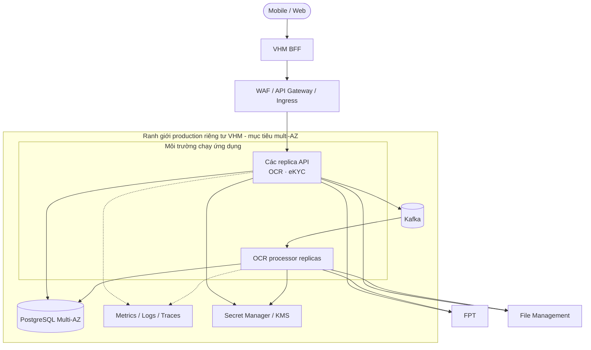

Ứng dụng hiện được đóng gói thành một artifact. Mục tiêu production là cho phép
triển khai và mở rộng độc lập vai trò API và OCR worker để cô lập phạm vi ảnh hưởng.

## 10.3 Deployment Strategy

- `mvn clean test` là lệnh kiểm tra mã nguồn.
- Các cổng bắt buộc: biên dịch/unit, kiểm tra thay đổi PostgreSQL schema, quét secret,
  SAST/SCA/license, quét container/IaC, contract FPT, integration, an toàn thông tin,
  kiểm thử tải và quét PII trong log.
- Build artifact bất biến một lần; quảng bá qua môi trường mà không build lại.
- API rolling/canary; OCR worker rolling có drain consumer.
- Thay đổi PostgreSQL schema theo expand/contract, có phiên bản và tương thích ngược;
  cần runbook migration/rollback ở production.
- Rollback không được hoàn tác schema theo cách phá hủy hoặc phát lại mù thao tác FPT.

### Quản lý cấu hình

| **Nhóm cấu hình** | **Yêu cầu kiến trúc** | **Cổng production** |
| --- | --- | --- |
| Kafka | Topic/group tách theo môi trường; ACL, retention và DLT có tài liệu | Kiểm thử chuyển phát trùng, lag và phục hồi. |
| FPT | Endpoint, credential, timeout và quota tách theo môi trường | Contract test và phê duyệt Tích hợp/ANBM. |
| FPT Sale | Thăm dò tối thiểu 3 giây, deadline tối đa 5 phút theo contract | Test backoff/quota/deadline. |
| Media | Tối đa 20 MB/file và 60 MB/hồ sơ Sale | Kiểm tra MIME/magic/checksum và tổng dung lượng. |
| Log vận hành | Chỉ ghi metadata kỹ thuật cần thiết | Chính sách lưu giữ và quét PII/DLP. |

## 10.4 Infrastructure & Network Security

| **Nguồn** | **Đích** | **Giao thức/dữ liệu** | **Kiểm soát** |
| --- | --- | --- | --- |
| Mobile/Web | BFF | HTTPS nghiệp vụ | Xác thực người dùng, giới hạn tần suất và kiểm soát phiên |
| BFF | API | HTTPS JSON/multipart | Xác thực workload, giới hạn route/tần suất/kích thước body |
| API/worker | PostgreSQL schema `ocr_ekyc` | Kết nối mã hóa | Mạng riêng và quyền theo nguyên tắc tối thiểu |
| API/worker | Kafka | Kết nối mã hóa | Phân quyền theo topic và consumer group |
| API/worker | File Management | HTTPS metadata/media | Danh tính workload, giới hạn phạm vi truy cập |
| API/worker | FPT | HTTPS media/kết quả | Danh sách đích cho phép, secret, timeout và quota |
| Các thành phần | Nền tảng quan sát | Kết nối mã hóa, chỉ metadata | Danh sách trường cho phép, che dữ liệu và lưu giữ có thời hạn |

## 10.5 Migration Strategy (Optional)

Migration dữ liệu legacy không thuộc phạm vi hiện tại. Thay đổi PostgreSQL schema
có ảnh hưởng dữ liệu nhạy cảm phải tương thích ngược, có kế hoạch chuyển đổi dữ
liệu, xác minh toàn vẹn và rollback. Không xóa cấu trúc hoặc dữ liệu cũ trước khi
hết cửa sổ rollback/lưu giữ được phê duyệt.

<a id="muc-11"></a>

# 11. Cost & Capacity/Performance

## 11.1 Capacity/Performance

| **Chỉ số/đầu vào** | **Giá trị thiết kế** | **Cổng/bằng chứng** |
| --- | --- | --- |
| OCR hằng ngày theo use case/FPT/kênh | `CHƯA XÁC ĐỊNH` | Dự báo sản phẩm |
| TPS đỉnh của tạo/trạng thái/kết quả | `CHƯA XÁC ĐỊNH` | Mô hình tải |
| Bùng tải/độ trễ/tuổi lớn nhất Kafka | `CHƯA XÁC ĐỊNH` | Kiểm thử hiệu năng + SLO vận hành |
| Lời gọi FPT đồng thời | `UNRESOLVED` | Quota/SLA của FPT |
| Request eKYC đồng thời | `CHƯA XÁC ĐỊNH` | Dự báo SDK/client + kiểm thử tải |
| Kích thước media p50/p95/p99 | `CHƯA XÁC ĐỊNH`; trần cứng 20 MB/object | Đo tại staging |
| Bộ nhớ làm việc Sale | Tối thiểu ba file cộng bản sao multipart/HTTP cho mỗi job đồng thời | Kiểm thử heap/native memory; phải đo mức đệm hiện tại |
| Hoàn tất Sale | Contract FPT tối đa 5 phút | E2E với chờ/kết thúc/timeout |
| eKYC/FPT p95/p99 | `CHƯA XÁC ĐỊNH` | SLA FPT và ngân sách timeout client |
| Bản ghi DB/ngày/tăng trưởng lưu trữ | `CHƯA XÁC ĐỊNH` | Lưu giữ + phân bố payload kết quả OCR/eKYC |
| Dung lượng kết quả OCR/eKYC p95/p99 | `CHƯA XÁC ĐỊNH` | Tính dung lượng PostgreSQL |

Các công thức bắt buộc:

- `peakConcurrency = peakArrivalRate × operationDurationP99 × safetyFactor`.
- `workerReplicas = ceil(requiredProviderConcurrency / measuredConcurrencyPerPod) + HA headroom`.
- `maxSaleMemory ≈ concurrency × (sum input bytes + multipart copies + response + safety overhead)`.
- Dung lượng thăm dò phải tính riêng Mobile/Web → BFF, BFF → OCR/eKYC và worker → FPT Sale.

Không có số replica, kích thước heap, connection pool hay giới hạn TPS nào trong
bản nháp này được xem là giá trị production đã phê duyệt.

## 11.2 Cost

| **Nguồn chi phí** | **Đầu vào tính dung lượng** | **Trạng thái** |
| --- | --- | --- |
| Tài nguyên tính toán ứng dụng | Replica API/worker, bộ nhớ cho media | TBD |
| PostgreSQL | Dung lượng dữ liệu, tăng trưởng và backup/PITR | TBD |
| Kafka | messages, poll amplification, retention | TBD |
| Object storage/File Management | upload/download/storage/retention | TBD |
| Egress | Media tới FPT và response FPT | TBD |
| KMS/Secret | Request mã hóa/giải mã/luân chuyển | TBD |
| Quan sát hệ thống | Thu nhận và lưu giữ log/metric/trace | TBD |
| FPT | Giao dịch FPT IDR, FPT Sale, eKYC/liveness | Báo giá TBD |

Bản xuất công cụ tính chi phí AWS/nền tảng, báo giá FPT, cảnh báo ngân sách/quota
và dự toán tháng là đầu vào bắt buộc cho kế hoạch vận hành production.

<a id="muc-12"></a>

# 12. Scalability & Reliability

## 12.1 Scaling Strategy

| **Thành phần** | **Tín hiệu mở rộng** | **Kiểm soát bắt buộc** |
| --- | --- | --- |
| API OCR/eKYC | RPS, p95 latency, DB pool | Stateless HPA; idempotency and DB limit |
| API eKYC | Request đang hoạt động, byte, độ trễ FPT, bộ nhớ | Tách concurrency/bulkhead khỏi luồng điều khiển OCR |
| OCR Worker | Độ trễ Kafka, tuổi lớn nhất, độ trễ FPT | Concurrency/token bucket/quota riêng cho FPT |
| Thăm dò Sale | Số job đến hạn, số lần thăm dò, nguy cơ quá deadline | Backoff/jitter; ưu tiên deadline; không thăm dò dồn dập |
| PostgreSQL | CPU/IOPS/kết nối/tăng trưởng dữ liệu | Giới hạn kết nối, HA/PITR và kế hoạch dung lượng |
| Kafka | partition lag/throughput | Partition count and key distribution sizing |

OCR backlog and interactive eKYC must have independent resource/quota pools. A
burst of 20–60 MB OCR files must not exhaust memory/connections serving eKYC.

## 12.2 Reliability

| **Thành phần/phụ thuộc** | **Mẫu bảo đảm độ tin cậy** | **Hành vi khi lỗi** | **Phục hồi** |
| --- | --- | --- | --- |
| OCR API | Stateless, nhiều replica và tạo yêu cầu idempotent | Không để lại tài nguyên OCR dở dang khi tiếp nhận thất bại | BFF gửi lại cùng `Idempotency-Key`; dịch vụ trả tài nguyên đã tạo nếu request tương đương |
| eKYC Proxy | Đồng bộ, không qua Kafka và không tự thử lại mutation | Trả response FPT nguyên trạng khi đã nhận được; trả lỗi transport tương thích khi chưa nhận được response | SDK/BFF xử lý theo contract phiên; kết quả đã nhận được lưu và đối soát theo correlation ID nội bộ |
| OCR Processor/Kafka | Chuyển phát ít nhất một lần, xử lý idempotent theo trạng thái OCR | Thông điệp trùng không tạo lần xử lý thứ hai; worker dừng không làm ghi đè trạng thái kết thúc | Phát lại công việc và phục hồi OCR `PROCESSING` quá hạn theo runbook |
| PostgreSQL | HA/PITR và cập nhật trạng thái–kết quả nhất quán | Không công bố hoàn tất OCR nếu kết quả chưa được lưu bền vững | Failover/khôi phục theo RPO/RTO; kiểm tra phiên bản schema và khóa mã hóa trước khi mở lưu lượng |
| File Management/kho object | Object riêng tư, presigned URL hạn ngắn | Không tạo OCR từ tham chiếu media không hợp lệ; lỗi tải xuống không làm mất khả năng xử lý lại an toàn | Cấp lại quyền tải xuống trong thời hạn xử lý và phục hồi theo chính sách media |
| FPT OCR/Sale | Timeout, giới hạn đồng thời và thăm dò hữu hạn | Không gửi trùng hồ sơ khi kết quả lần gửi chưa rõ; lỗi thăm dò có thể thử lại trong deadline | Dùng cùng mã giao dịch đã lưu để thăm dò/đối soát; kết thúc theo taxonomy lỗi khi hết deadline |

Kết quả và trạng thái kết thúc không được ghi đè bởi xử lý đồng thời. Mã giao dịch
FPT Sale phải được lưu trước khi thăm dò và mọi lần thăm dò tiếp theo sử dụng cùng
mã đó. Tài nguyên xử lý OCR và request eKYC đồng bộ sử dụng vùng tài nguyên/quota
độc lập để tồn đọng OCR không làm gián đoạn hành trình eKYC.

## 12.3 Sao lưu và phục hồi

Phạm vi sao lưu: schema/dữ liệu PostgreSQL, object media được duyệt, cấu hình có
phiên bản và artifact bất biến. Kafka và token/cache tiến trình không phải nguồn
sự thật nghiệp vụ.

Phục hồi phải xác minh:

- phiên bản PostgreSQL schema và tính sẵn sàng của khóa mã hóa;
- tính nhất quán OCR/media/kết quả và metadata kỹ thuật FPT;
- khả năng xử lý lại an toàn các công việc chưa hoàn tất;
- phục hồi `PROCESSING` quá hạn theo cơ chế đối soát được duyệt;
- không tạo lại/ghi đè kết quả đã kết thúc;
- xóa dữ liệu phục hồi đã quá hạn lưu trước khi mở lưu lượng;
- không in secret/PII bản rõ trong quá trình phục hồi.

<a id="muc-13"></a>

# 13. Observability & Monitoring

## 13.1 Hiện trạng nền tảng

- Dịch vụ công bố health, readiness/liveness và metric cho nền tảng giám sát.
- Log có cấu trúc và hỗ trợ correlation ID.
- Metric có nhãn chung theo ứng dụng, môi trường và vùng triển khai.
- Endpoint health/management được loại khỏi chỉ số nghiệp vụ.
- Đã có log cho Kafka, thao tác worker/FPT và lời gọi eKYC FPT;
  chưa có bộ metric miền nghiệp vụ đầy đủ.

## 13.2 Chỉ số bắt buộc

| **Metric** | **Loại** | **Nhãn được phép** |
| --- | --- | --- |
| `ocr_requests_total` | Counter | use_case, provider, channel, outcome |
| `ocr_lifecycle_duration_seconds` | Histogram | use_case, provider, outcome |
| `ocr_provider_requests_total` | Counter | provider, operation, outcome, http_class |
| `ocr_provider_duration_seconds` | Histogram | provider, operation |
| `ocr_jobs_pending` / `ocr_jobs_oldest_age_seconds` | Gauge | use_case, status |
| `ocr_kafka_consumer_lag` | Gauge | topic, consumer_group, partition |
| `ocr_jobs_stuck` | Gauge | step, age_bucket |
| `ocr_sale_poll_count` | Histogram | terminal_status |
| `ocr_result_decrypt_failures_total` | Counter | key_version, error_class |
| `ekyc_provider_requests_total` | Counter | operation, outcome, http_class |
| `ekyc_provider_duration_seconds` | Histogram | operation |
| `ekyc_active_requests` / `ekyc_request_bytes` | Gauge/Histogram | operation |
| `ekyc_result_persistence_failures_total` | Counter | operation, error_class |
| `media_download_bytes` / `media_download_failures_total` | Histogram/Counter | role, outcome |

Không dùng OCR ID, reference/subject/requestBy, provider job/session ID, filename,
path, correlation ID hoặc PII làm metric label.

## 13.3 Cảnh báo

| **Cảnh báo** | **Tín hiệu** | **Mức độ** |
| --- | --- | --- |
| Lỗi xác thực FPT | Lặp lại 401/403 | Nghiêm trọng |
| FPT không sẵn sàng/timeout | Tỷ lệ lỗi/timeout vượt cửa sổ đã duyệt | Cao |
| Tồn đọng OCR | Tuổi công việc chờ lớn nhất vượt SLO | Cao/Nghiêm trọng |
| Kafka trễ/xử lý treo | Lag hoặc `PROCESSING` quá hạn vượt ngưỡng | Cao |
| Nguy cơ quá deadline Sale | Job đang chờ không thể xử lý hết trước deadline 5 phút | Nghiêm trọng |
| eKYC bão hòa | Request đang hoạt động/bộ nhớ/timeout vượt ngưỡng | Cao |
| Lỗi lưu kết quả eKYC | Bất kỳ lỗi lưu kết quả nào sau khi đã nhận response FPT | Nghiêm trọng |
| Pool/lock/lưu trữ DB | Vượt ngưỡng bão hòa/tăng trưởng | Cao |
| Lỗi mã hóa kết quả OCR/eKYC | Bất kỳ lỗi kéo dài nào | Nghiêm trọng |
| DLP phát hiện PII/secret | Bất kỳ phát hiện nào ở production | Nghiêm trọng |
| Tồn đọng lưu giữ/xóa | Tuổi dữ liệu đủ điều kiện xóa lớn nhất vượt SLA chính sách | Cao/Nghiêm trọng |

## 13.4 SLI/SLO

SLI phải tách: API tiếp nhận OCR, hoàn tất OCR đầu-cuối, thao tác FPT, độ trễ
Kafka, thời gian chờ FPT Sale, response eKYC đồng bộ và đọc
trạng thái/kết quả. Thời gian FPT phải quan sát được, không bị ẩn trong tính sẵn
sàng nền tảng. Mục tiêu vẫn `CHƯA XÁC ĐỊNH` đến khi duyệt NFR/dung lượng.

<a id="muc-14"></a>

# 14. Operational Readiness

## 14.1 RTO & RPO

| **Hạng mục** | **Mốc cơ sở đề xuất** | **Trạng thái** |
| --- | --- | --- |
| RTO | ≤4 giờ | Cần Chủ sở hữu hệ thống/Vận hành phê duyệt + diễn tập |
| RPO | ≤15 phút | Cần DBA/Vận hành phê duyệt + bằng chứng PITR |
| Phục hồi job Sale đã được nhận | Trước deadline xử lý 5 phút nếu FPT cho phép | Yêu cầu kiểm thử phục hồi |
| Phục hồi secret/khóa | Runbook luân chuyển/thu hồi được duyệt | TBD |
| Phục hồi media | Trong thời hạn lưu theo mục đích; không khôi phục dữ liệu đã xóa | TBD |

## 14.2 Runbook bắt buộc

- FPT trả 401/403 và luân chuyển/thu hồi thông tin xác thực.
- Sự cố FPT, quota/429 và chế độ an toàn của circuit breaker.
- Kafka lag, UUID/thông điệp độc, retry/DLT và rollback consumer.
- OCR `PROCESSING` quá hạn và không rõ kết quả sau khi gửi FPT.
- Thăm dò/deadline/nguy cơ hết hạn lưu của FPT Sale.
- Failover DB/phục hồi PITR và phục hồi khóa mã hóa.
- Sự cố File Management/kho lưu trữ, media mồ côi và xóa dữ liệu.
- Sự cố PII/secret xuất hiện trong log.
- Suy giảm tương thích eKYC và rollback theo phiên bản client/SDK.

## 14.3 Danh sách kiểm tra sẵn sàng cơ sở

- Health/readiness phải thất bại khi thiếu thông tin xác thực/cấu hình bắt buộc của năng lực đang bật.
- Service có thể ngừng nhận OCR/eKYC mới trong khi vẫn cho đọc trạng thái an toàn và
  phục hồi/thăm dò job đã nhận theo chính sách sự cố.
- Đã chỉ định on-call, đầu mối FPT, ma trận leo thang và bảo trì.
- Dashboard/cảnh báo có chủ sở hữu và đã kiểm thử định tuyến.
- Diễn tập sao lưu/phục hồi, luân chuyển, rollback và xử lý backlog đạt RTO/RPO/SLO.
- Các điều kiện sẵn sàng trong Phụ lục E có đầy đủ bằng chứng hoặc kế hoạch kiểm soát được phê duyệt.

<a id="muc-15"></a>

# 15. Testing & Quality Strategy

## 15.1 Phạm vi kiểm thử tự động hiện tại

Bộ kiểm thử tự động hiện tại bao phủ API, client contract, mã hóa, chuẩn hóa OCR,
tích hợp FPT/FPT Sale, media và các nhánh xử lý worker chính. Lệnh xác minh là:

```bash
mvn clean test
```

Mốc xác minh ngày 14/08/2026: `57` test chạy, `0` failure, `0` error, build thành công.

Kiểm thử unit không thay thế bằng chứng tích hợp PostgreSQL/Kafka/FPT, an toàn
thông tin, hiệu năng hoặc phục hồi.

## 15.2 Cổng chất lượng

| **Lớp kiểm thử** | **Phạm vi bắt buộc** | **Cổng** |
| --- | --- | --- |
| Unit | Nhánh trạng thái/idempotency/chuẩn hóa/mã hóa/lỗi | Mục tiêu nhánh trọng yếu ≥80% |
| Tích hợp dữ liệu | PostgreSQL schema `ocr_ekyc`, migration, tính nhất quán và test đồng thời | Bắt buộc |
| Kafka/worker | Chuyển phát trùng, khởi động lại, retry/DLT và phục hồi công việc treo | Bắt buộc |
| Contract provider | FPT IDR, mọi trạng thái/lỗi FPT Sale và exact wire eKYC | Bắt buộc |
| Contract API | OpenAPI/envelope/chuyển tiếp/header/kích thước/tương thích ngược | Bắt buộc |
| An toàn thông tin | Authn/authz/IDOR, secret, SSRF, multipart, PII-log, can thiệp/luân chuyển mật mã | Bắt buộc |
| E2E | Upload → tạo → hàng đợi → FPT → trạng thái/kết quả cho từng use case | Bắt buộc |
| Hiệu năng | Một/hai file 20 MB, Sale 60 MB, eKYC đồng thời, quota DB/Kafka/FPT | Bắt buộc |
| Khả năng chịu lỗi | Pod dừng ở từng giai đoạn, DB/Kafka/storage/FPT lỗi, chuyển phát không rõ | Bắt buộc |
| OAT/DR | Triển khai/rollback, phục hồi, luân chuyển, xóa, cảnh báo/runbook | Bắt buộc |

## 15.3 Kịch bản kiểm thử trọng yếu

- Đồng thời cùng idempotency key/cùng body và cùng key/body khác nhau.
- Lỗi khi tạo OCR không được để lại dữ liệu hoặc công việc dở dang.
- Worker dừng trong từng giai đoạn không được tạo lời gọi FPT hoặc kết quả trùng.
- Thông điệp gửi/thăm dò trùng không được tạo provider job/kết quả thứ hai.
- FPT Sale `QUEUED`, `PROCESSING`, `COMPLETED`, `FAILED`, `EXPIRED`, 404, 429,
  5xx, JSON không hợp lệ, thiếu request ID và timeout năm phút.
- Sale PDF/image MIME, exactly three files, per-file/total limits and memory pressure.
- FPT canonical mapping flat/list/optional/unknown fields and missing required fields.
- Ma trận header/form/path/response chính xác theo phiên bản Android/Web/iOS sau `INT-01`.
- eKYC timeout sau khi gửi, client ngắt kết nối, non-2xx và response status/headers/body
  phải được chuyển tiếp tương thích FPT SDK.
- Kết quả eKYC được mã hóa/lưu đúng một lần mà không làm thay đổi response trả về SDK.
- PostgreSQL lỗi sau khi FPT trả response phải giữ nguyên response cho SDK, đồng thời
  phát metric/cảnh báo và tạo đủ thông tin tương quan nội bộ cho quy trình phục hồi.
- Cross-source/reference media path, path traversal, wrong MIME/magic/checksum and
  presigned URL expiry/reuse.
- Authentication missing/invalid/wrong audience/scope và IDOR theo tài nguyên.
- Kiểm thử mã hóa, can thiệp dữ liệu, sai khóa và luân chuyển khóa.
- Quét mã nguồn/image/cấu hình/log/APM không có secret, PII, path, ID FPT hoặc body media.

## 15.4 Dữ liệu kiểm thử

Sử dụng giấy tờ định danh và video tổng hợp/tự sinh trong kiểm thử tự động/SIT.
Dữ liệu cá nhân/sinh trắc thật cần phê duyệt bằng văn bản, kho cô lập, mục đích/
lưu giữ đích danh và bằng chứng xóa. Fixture response FPT phải có phiên bản và đã làm sạch.

<a id="muc-16"></a>

# 16. Risks & Open Issues/Tech Debt

## 16.1 Architecture Risks

| **Mã rủi ro** | **Nhóm** | **Mô tả/ảnh hưởng** | **Mức độ** | **Giảm thiểu** | **Chủ sở hữu/trạng thái** |
| --- | --- | --- | --- | --- | --- |
| AR-001 | An toàn thông tin | Truy cập trực tiếp bỏ qua BFF có thể lộ dữ liệu hoặc thao tác | Nghiêm trọng | IAM/JWT/mTLS workload, phạm vi object và kiểm thử phân quyền | ANBM/Backend — kiểm soát trước production |
| AR-002 | Tích hợp | Sai lệch metadata phiên eKYC có thể làm gián đoạn hành trình | Nghiêm trọng | Áp dụng nguyên tắc `INT-01`, ghim phiên bản contract và kiểm thử E2E | Tích hợp/BFF — kiểm thử contract |
| AR-003 | Quyền riêng tư | Xử lý dữ liệu thiếu mục đích, đồng thuận, lưu giữ hoặc xóa phù hợp | Nghiêm trọng | DPIA/DPA và chính sách lưu giữ/xóa có bằng chứng | Pháp chế/Quyền riêng tư — kiểm soát trước production |
| AR-004 | Độ tin cậy | Worker dừng đột ngột có thể làm OCR kẹt ở `PROCESSING` | Nghiêm trọng | Phát hiện quá hạn, đối soát và kiểm thử phục hồi | Backend/Vận hành — ưu tiên triển khai |
| AR-005 | Toàn vẹn | Timeout gửi hồ sơ sau khi FPT đã nhận có thể tạo giao dịch mồ côi hoặc trùng | Cao | Idempotency, tương quan request và trạng thái không rõ tường minh | FPT/Tích hợp — kiểm thử phục hồi |
| AR-006 | An toàn dữ liệu | Tham chiếu media thiếu kiểm tra toàn vẹn có thể bị thay thế sai tài liệu | Cao | Tham chiếu opaque, checksum và kiểm tra theo vai trò | Backend/ANBM — kiểm soát trước production |
| AR-007 | Hiệu năng | Hồ sơ ba tài liệu có thể tạo áp lực bộ nhớ khi xử lý đồng thời | Nghiêm trọng | Giới hạn đồng thời, kích thước và kiểm thử tải | Backend/Vận hành — kiểm thử tải |
| AR-008 | Quyền riêng tư | Log có thể chứa PII OCR/eKYC do cấu hình hoặc xử lý lỗi không phù hợp | Nghiêm trọng | Tối thiểu hóa trường log, quét DLP và runbook sự cố | Vận hành/ANBM — kiểm soát cấu hình |
| AR-009 | Độ tin cậy | Xử lý OCR vượt deadline làm tăng tài nguyên treo | Cao | Deadline, hủy và đối soát hữu hạn | Backend — kiểm thử deadline |
| AR-010 | Tích hợp | Quota FPT hoặc tải tăng đột biến có thể lan truyền suy giảm | Cao | Giới hạn đồng thời, backoff và bảo vệ quota | Vận hành/Tích hợp — kiểm thử tải |
| AR-011 | Tương thích | Proxy lọc header, bọc envelope hoặc thay đổi body có thể làm FPT SDK không phân tích được response | Cao | Chuyển tiếp đầy đủ status/headers/body và kiểm thử contract đầu-cuối | Backend/Tích hợp — kiểm thử contract |
| AR-012 | Sẵn sàng | FPT là phụ thuộc bên ngoài duy nhất cho OCR/eKYC | Cao | SLA, giám sát, dừng nhận mới an toàn và phương án nghiệp vụ | Sản phẩm/Vận hành — theo dõi SLA |
| AR-013 | Toàn vẹn/phân quyền | Thiếu tương quan chủ thể có thể làm giảm khả năng phân quyền theo hồ sơ | Cao | Lưu tham chiếu chủ thể opaque trong PostgreSQL schema và kiểm thử phân quyền | Backend/ANBM — triển khai theo contract |
| AR-014 | Toàn vẹn | Trạng thái FPT và kết quả OCR có thể lệch khi lỗi giữa các bước cập nhật | Cao | Cập nhật nhất quán hoặc đối soát idempotent | Backend/Kiến trúc — kiểm thử tính nhất quán |

## 16.2 Open Issues/Tech Debt

| **ID** | **Vấn đề** | **Ảnh hưởng/Ưu tiên** | **Khắc phục/cổng** |
| --- | --- | --- | --- |
| TD-001 | Liên kết/chủ sở hữu L1/L3/tiêu chuẩn cần cập nhật | Cao | Hoàn thiện metadata trong quá trình thẩm định. |
| TD-003 | Chính sách hủy/thử lại/đối soát/hết hạn cần đặc tả L3 | Cao | Xác nhận theo contract công khai và yêu cầu vận hành. |
| TD-004 | Tranh chấp unique khi tạo đồng thời chưa được chuẩn hóa thành response idempotent | Cao | Insert trước/đọc khi xung đột + test tích hợp đồng thời. |
| TD-009 | Chưa dùng endpoint kết quả Sale theo lô | Thấp/Chi phí | Đánh giá hiệu quả thăm dò so với độ phức tạp/giới hạn tần suất FPT. |
| TD-010 | Log lỗi có thể chứa tên file multipart gốc hoặc provider request ID | Quyền riêng tư nghiêm trọng | Loại bỏ/che tên file và ID; quét PII. |
| TD-011 | Chưa thể triển khai API và OCR worker thành các vai trò runtime độc lập | Trung bình/Cao | Bổ sung cấu hình vai trò và test triển khai. |
| TD-012 | Chưa triển khai lưu giữ/xóa kết quả OCR/eKYC và media | Quyền riêng tư nghiêm trọng | Chính sách có phiên bản và xóa định kỳ kèm bằng chứng. |
| TD-013 | Không có quy tắc MIME media theo vai trò/kiểm tra magic/checksum | An toàn thông tin cao | Triển khai contract hoàn tất/kiểm tra media. |
| TD-014 | Ngữ nghĩa `valid` chuẩn quá thô cho tính xác thực/rà soát thủ công | Trung bình | Phiên bản hóa schema kết quả và định nghĩa chính sách chất lượng/outcome. |
| TD-015 | Timeout response FPT mặc định 10 phút xung đột ngân sách eKYC tương tác | Cao | Timeout theo thao tác, căn chỉnh SLA Mobile/Web, BFF, service và FPT. |
| TD-016 | `subjectRef` có trong request nhưng chưa được lưu trong `ocr_ekyc.ocr_ekyc_requests` | Cao | Bổ sung dữ liệu, contract truy vấn và test phân quyền/idempotency. |
| TD-017 | Trạng thái FPT Sale và hoàn tất OCR chưa có cơ chế bảo đảm nhất quán xuyên suốt | Cao | Thiết kế cập nhật nhất quán hoặc đối soát idempotent. |

Vấn đề mở không mặc nhiên được chấp nhận. Chấp nhận rủi ro phải ghi rõ chủ sở hữu,
phạm vi, ngày hết hạn, người phê duyệt và kiểm soát bù trừ.

<a id="phu-luc"></a>

# Appendix

## A. Glossary

| **Thuật ngữ** | **Định nghĩa** |
| --- | --- |
| OCR | Nhận dạng ký tự quang học; trích xuất dữ liệu có cấu trúc từ media tài liệu. |
| eKYC | Định danh điện tử bằng OCR giấy tờ, kiểm tra sống và đối sánh khuôn mặt. |
| Tài nguyên OCR | Aggregate bất đồng bộ VHM được định danh bởi `ocrId`. |
| Kết quả chuẩn | Kết quả OCR ổn định được công bố cho bên gọi VHM. |
| Lần gọi FPT | Một thao tác kỹ thuật tới FPT; metadata lời gọi và kết quả eKYC được lưu theo chính sách bảo mật/lưu giữ. |
| Thăm dò định kỳ | Cơ chế kiểm tra trạng thái FPT Sale theo khoảng thời gian đã quy định. |
| Idempotency Key | Khóa opaque do bên gọi cung cấp để ngăn tạo tài nguyên trùng. |
| Dấu vân tay request | SHA-256 của payload tạo đã tuần tự hóa, dùng phát hiện xung đột khóa. |
| Provider job ID | `request_id` FPT Sale; chỉ dùng nội bộ. |
| PII | Thông tin nhận diện cá nhân. |
| Dữ liệu sinh trắc | Ảnh/video khuôn mặt và suy luận kiểm tra sống/đối sánh liên quan. |
| Không rõ sau khi gửi | Lỗi truyền tải khi FPT có thể đã nhận thao tác thay đổi. |
| DPA/DPIA | Thỏa thuận xử lý dữ liệu / Đánh giá tác động bảo vệ dữ liệu. |

## B. References

| **Tài liệu** | **Liên kết/phiên bản** |
| --- | --- |
| L2 standard template | [`ttd-mau-chuan.md`](./ttd-mau-chuan.md) |
| OCR/eKYC activity design | [`tdd-luong-hoat-dong.md`](./tdd-luong-hoat-dong.md) |
| Danh sách tài liệu FPT nội bộ | [`tai-lieu-tham-khao-fpt.md`](./tai-lieu-tham-khao-fpt.md) |
| Tổng quan mã nguồn | [`../README.md`](../README.md) |
| Tài liệu API OCR hồ sơ Sale của FPT cho Vinhomes | [`[VSF-eKYC] Tài liệu API OCR cho Vinhomes.pdf`](./%5BVSF-eKYC%5D%20T%C3%A0i%20li%E1%BB%87u%20API%20OCR%20cho%20Vinhomes.pdf), ngày 13/08/2026 |
| FPT eKYC update-information API | <https://docs-vision.fpt.ai/en/ekyc/III-integration/III-2-APIs/a-APIs%20of%20eKYC%20Flows/APIs-in-update-information-flow/> |
| FPT eKYC result/callback | <https://docs-vision.fpt.ai/en/ekyc/III-integration/III-2-APIs/a-APIs%20of%20eKYC%20Flows/APIs-result/> |
| FPT SDK integration architecture | <https://docs-vision.fpt.ai/en/ekyc/III-integration/III-1-SDKs/kien-truc-tich-hop> |
| FPT Android SDK | <https://docs-vision.fpt.ai/ekyc/III-integration/III-1-SDKs/android-sdk> |
| FPT Web SDK | <https://docs-vision.fpt.ai/en/ekyc/III-integration/III-1-SDKs/web-sdk/> |
| FPT ID Recognition | <https://docs.fpt.ai/docs/en/vision/tutorials/id-recognition/> |
| Architecture history | `../agent.md` |
| VHM IAM/ANBM/Data Privacy/Observability standards | TBD version/link |

## C. Thông tin đầu vào và xác nhận bên ngoài

### C.1 Nghiệp vụ và quyền riêng tư

| **Đầu vào** | **Chủ sở hữu** | **Cổng** |
| --- | --- | --- |
| Use case OCR/eKYC, mục đích và chủ sở hữu nghiệp vụ đã duyệt | Sản phẩm/Pháp chế | Trước khi công bố API production |
| Trường kết quả cố định, che dữ liệu và quy tắc áp dụng/xác nhận | Sản phẩm/Quyền riêng tư | Trước khi xác nhận API kết quả |
| Chính sách rà soát thủ công khi Sale sai lệch/cảnh báo chữ ký/con dấu | Nghiệp vụ Sale/Rủi ro | Trước UAT Sale |
| Nội dung/phiên bản/thu hồi đồng thuận và cơ sở hợp pháp cho sinh trắc | Pháp chế/Quyền riêng tư | Điều kiện production |
| Chính sách lưu giữ/legal hold/yêu cầu của chủ thể dữ liệu | Pháp chế/Quyền riêng tư/Vận hành | Điều kiện production |
| Vị trí dữ liệu, DPA FPT, bên xử lý phụ, SLA xóa | Pháp chế/FPT | Điều kiện production |

### C.2 FPT và client

| **Đầu vào** | **Chủ sở hữu** | **Cổng** |
| --- | --- | --- |
| `INT-01`: contract proxy đồng bộ tương thích FPT SDK | Kiến trúc/Tích hợp | Xác nhận triển khai eKYC |
| Phiên bản Android/iOS/Web SDK chính xác và tính tương thích request/response | Client/FPT | E2E eKYC |
| TTL phiên FPT, ngữ nghĩa lỗi/retry, UUID client/mô hình tin cậy kết quả | FPT/Tích hợp | Xác nhận an toàn/phục hồi |
| Endpoint/base URL FPT Sale, xác thực, quota, SLA, idempotency/tra cứu, lưu giữ | FPT/Vận hành | Production Sale |
| Fixture kết quả chuẩn và thông báo thay đổi schema FPT | FPT/QA | Cổng contract |

### C.3 Yêu cầu phi chức năng và vận hành

| **Đầu vào** | **Chủ sở hữu** | **Cổng** |
| --- | --- | --- |
| Lưu lượng ngày/đỉnh, phân bố kênh/use case/FPT | Sản phẩm/Vận hành | Kiểm thử dung lượng |
| Kích thước/phân bố media, concurrency và băng thông mạng | Client/Vận hành | Kiểm thử tải |
| p95/p99 API/FPT, tính sẵn sàng và ngân sách timeout | Chủ sở hữu/FPT/Vận hành | Xác nhận NFR |
| Partition/lưu giữ/retry/DLT Kafka và quota | Nền tảng/Vận hành | Xác nhận độ tin cậy |
| Dung lượng PostgreSQL, sao lưu/PITR, RTO/RPO | DBA/Vận hành | OAT |
| Dashboard/cảnh báo/on-call/leo thang FPT | Vận hành | Go-live |
| Công cụ tính chi phí/báo giá FPT/cảnh báo ngân sách | Tài chính/Sản phẩm/Vận hành | Sẵn sàng production |

## D. Danh mục quyết định kiến trúc (ADR)

| **ID** | **Quyết định** | **Cơ sở/hệ quả** | **Trạng thái** |
| --- | --- | --- | --- |
| ADR-001 | Tập trung tích hợp OCR/eKYC tại `vhm-ocr-ekyc` | Miền nghiệp vụ không sở hữu thông tin xác thực/contract FPT; năng lực này trở thành phụ thuộc trung tâm. | Mốc cơ sở đã chấp nhận |
| ADR-002 | OCR tài liệu bất đồng bộ qua PostgreSQL, Kafka và worker | Cô lập độ trễ/quota FPT; cần vận hành DB/hàng đợi/worker. | Mốc cơ sở đã chấp nhận |
| ADR-003 | eKYC đồng bộ, không đưa vào hàng đợi/tự động thử lại thao tác thay đổi | Cần cho luồng tương tác/FPT; đòi hỏi timeout/dung lượng chặt chẽ. | Mốc cơ sở đã chấp nhận |
| ADR-004 | PostgreSQL schema `ocr_ekyc` là nguồn dữ liệu chính của OCR/eKYC | Cho phép quản lý nhất quán vòng đời, kết quả và idempotency; cần HA/PITR. | Mốc cơ sở đã chấp nhận |
| ADR-005 | Chọn FPT khi tạo và lưu trên OCR | Retry và định tuyến xác định; không failover trong suốt. | Mốc cơ sở đã chấp nhận |
| ADR-006 | Kết quả OCR chuẩn với danh sách trường cố định | Ổn định contract VHM và giảm dữ liệu FPT bị công bố. | Mốc cơ sở đã chấp nhận |
| ADR-007 | FPT Sale lưu provider job và thăm dò định kỳ | Worker không giữ tài nguyên trong khi FPT đang xử lý. | Mốc cơ sở đã chấp nhận |
| ADR-008 | Kiểm soát presigned media qua File Management; chỉ lưu tham chiếu path | Không đưa binary vào request tạo OCR/Kafka; mã hóa/hoàn tất path là mục tiêu. | Đã chấp nhận; kiểm soát bổ sung theo lộ trình |
| ADR-009 | Lưu kết quả eKYC trong PostgreSQL schema `ocr_ekyc` | Duy trì kết quả theo mục đích được duyệt; dữ liệu nhạy cảm phải được mã hóa, phân quyền và xóa theo chính sách. | Mốc cơ sở đã chấp nhận |
| ADR-010 | Một đơn vị triển khai với ranh giới logic API/worker | Vận hành ban đầu đơn giản; vai trò production cần mở rộng độc lập. | Mốc cơ sở đã chấp nhận |
| ADR-011 | Dùng proxy đồng bộ tương thích FPT SDK | Giữ nguyên response FPT cho SDK, credential chỉ ở server; không dùng façade chuẩn hóa cho eKYC. | Mốc cơ sở đã chấp nhận |

## E. Danh sách kiểm tra trước khi vận hành chính thức

### E.1 Chức năng và tích hợp

- [ ] Contract OpenAPI/L3 đã có phiên bản và được rà soát.
- [ ] Luồng FPT một tài liệu và hồ sơ Sale vượt qua kiểm thử E2E.
- [ ] Vượt qua kiểm thử idempotency đồng thời và chuyển phát Kafka trùng.
- [ ] Vượt qua mọi nhánh trạng thái/lỗi/deadline/không rõ sau khi gửi của FPT Sale.
- [ ] Danh sách trường/chi tiết chuẩn được duyệt và tương thích ngược.
- [ ] Contract `INT-01`; ma trận client/SDK FPT được hỗ trợ chính xác vượt qua kiểm thử.
- [ ] Hành vi retry/hủy/hết hạn đã triển khai hoặc được loại rõ khỏi contract công khai.
- [ ] Không lộ ID FPT/thông tin xác thực/path/payload thô trong API/event/log.

### E.2 An toàn thông tin và quyền riêng tư

- [ ] Vượt qua kiểm thử xác thực/phân quyền workload và truy cập dữ liệu theo phạm vi.
- [ ] Vượt qua kiểm thử IDOR đường dẫn object/media và xuyên source/reference.
- [ ] Quét secret sạch; thông tin xác thực/khóa do secret manager cấp và đã luân chuyển.
- [ ] Quét PII/DLP xác nhận log production không chứa dữ liệu nhạy cảm.
- [ ] Vượt qua kiểm soát MIME/magic/kích thước/checksum theo vai trò và presigned URL.
- [ ] Vượt qua test mã hóa media/kết quả OCR/eKYC, luân chuyển khóa, can thiệp và phục hồi.
- [ ] Bằng chứng đồng thuận, DPA/DPIA, vị trí dữ liệu, bên xử lý phụ và xóa đã duyệt.
- [ ] Đã test job lưu giữ/xóa/legal hold/yêu cầu của chủ thể dữ liệu.
- [ ] Không còn lỗi an toàn thông tin Nghiêm trọng/Cao chưa xử lý nếu thiếu chấp nhận có thời hạn.

### E.3 Độ tin cậy và vận hành

- [ ] Đã triển khai và test phục hồi `PROCESSING` quá hạn khi worker dừng.
- [ ] Runbook Kafka retry/DLT và thông điệp độc đã duyệt.
- [ ] Quota FPT, timeout, circuit breaker và backoff đã cấu hình/kiểm thử.
- [ ] Bulkhead API/eKYC/worker ngăn cạn tài nguyên chéo luồng.
- [ ] Bảng tính dung lượng và test bộ nhớ/tải 20/60 MB đạt yêu cầu.
- [ ] Dashboard/cảnh báo/on-call/leo thang FPT đã hoạt động và diễn tập.
- [ ] Sao lưu/PITR/phục hồi đạt RTO/RPO đã duyệt và xóa sau phục hồi.
- [ ] Runbook triển khai/rollback, migration DB và luân chuyển secret/khóa đạt OAT.
- [ ] Dự toán chi phí, báo giá FPT và cảnh báo ngân sách/quota đã duyệt.

### E.4 Hoàn tất phê duyệt

- [ ] Đã ghi Chủ sở hữu tài liệu/hệ thống và họ tên/ngày xác nhận của mọi người rà soát.
- [ ] Liên kết L1/L3/tiêu chuẩn truy cập được.
- [ ] Mọi điều kiện production đã có bằng chứng hoặc có chủ sở hữu/phạm vi/hạn được duyệt.
- [ ] Phiên bản được chuyển từ `UNDER REVIEW` sang mốc triển khai đã phê duyệt.
