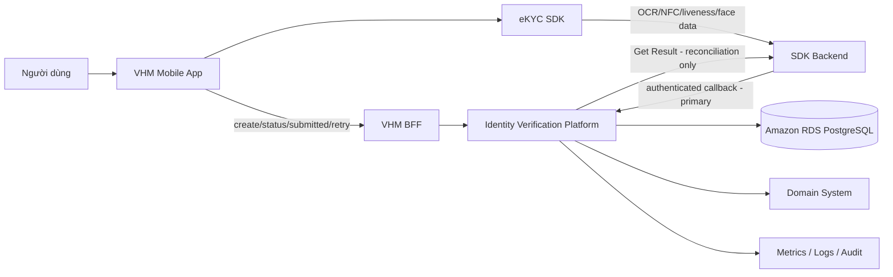
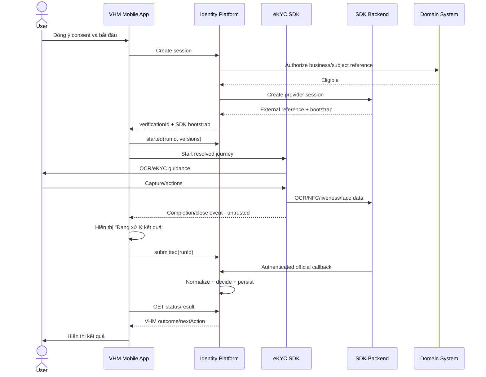
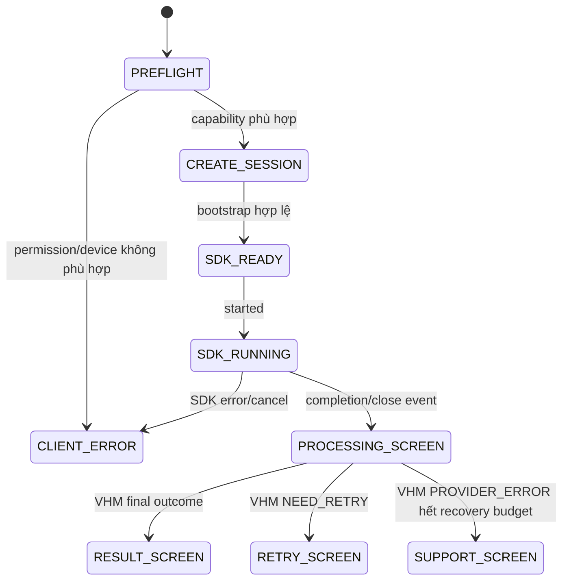
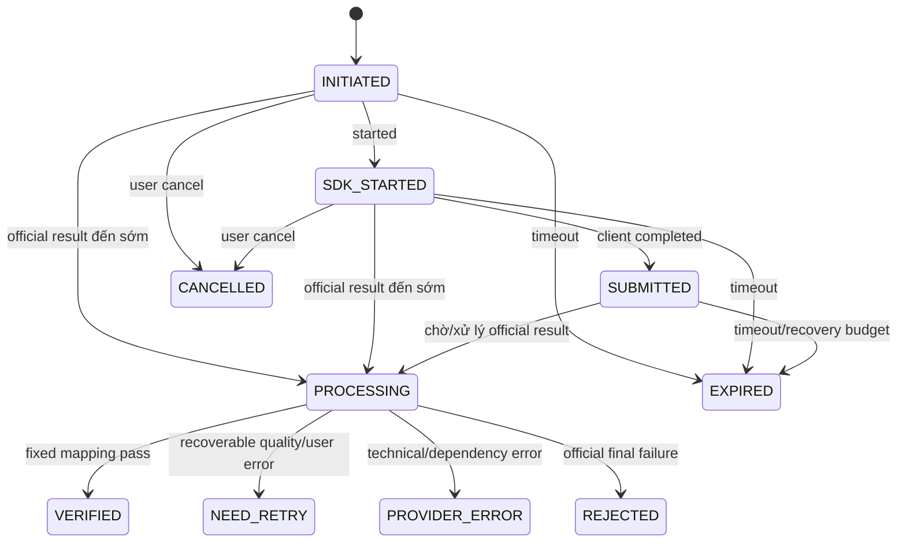
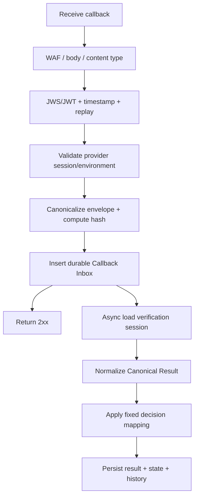
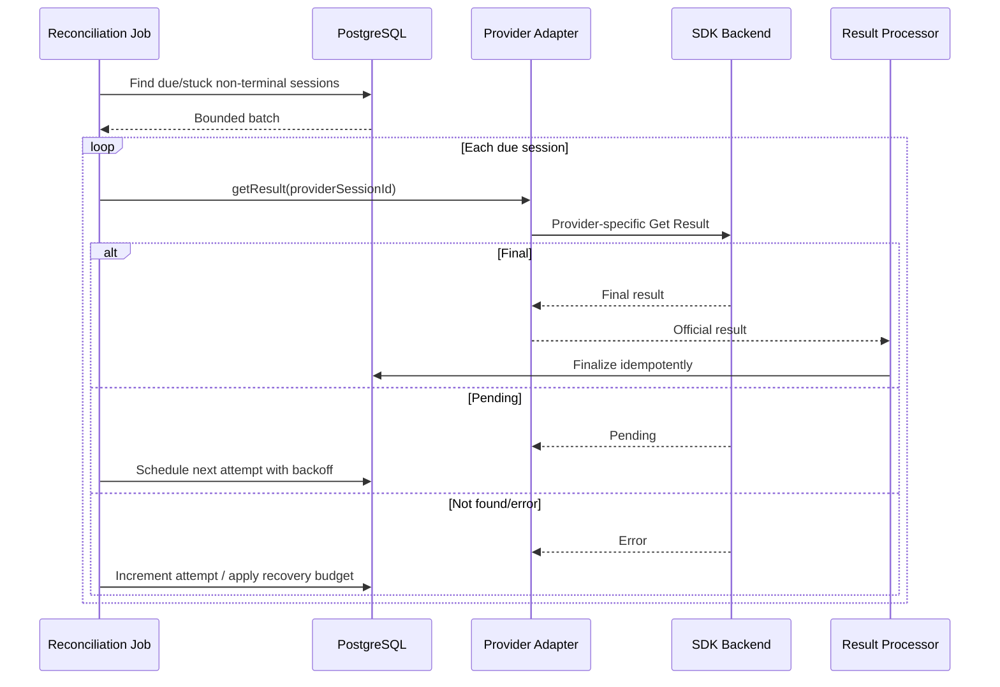
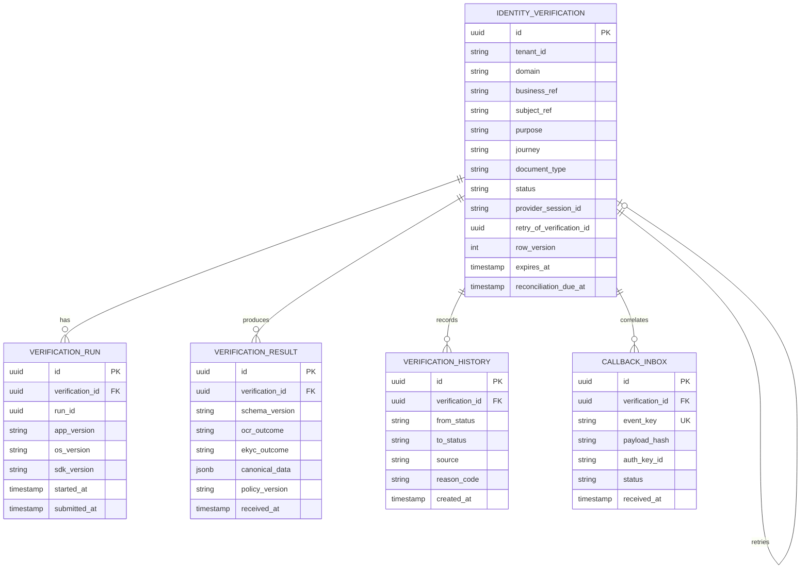
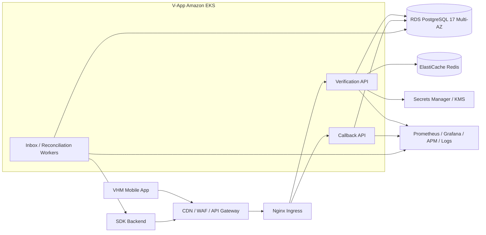

# VHM — OCR & eKYC SDK Core Integration

> **TÀI LIỆU MẬT**  
> Tài liệu mô tả thiết kế kỹ thuật đầy đủ cho phạm vi OCR/eKYC Core Integration
> trên VHM Mobile App. Nội dung được rút và đơn giản hóa từ
> [TDD_OCR_EKYC_SDK.md](./TDD_OCR_EKYC_SDK.md) để dev triển khai và các bên liên
> quan phê duyệt.

| **Thuộc tính** | **Giá trị** |
| --- | --- |
| Tên hệ thống | VHM Identity Verification — Core Integration |
| Kênh | VHM Mobile App |
| Provider | Một SDK/provider đã được phê duyệt |
| Loại giấy tờ | `NATIONAL_ID_CHIP` — CCCD gắn chip |
| Journey | `OCR_ONLY`, `FULL_EKYC` |
| Trạng thái tài liệu | DRAFT / IN REVIEW / APPROVED |
| Document Owner | TBD |
| System Owner | TBD |
| Approval Date | TBD |

| **Version** | **Date** | **Changes** | **Updated by** |
| --- | --- | --- | --- |
| 0.1 | 06/08/2026 | Khởi tạo Core Integration TDD từ thiết kế OCR/eKYC đầy đủ | TBD |
| 1.0 | TBD | Bản được phê duyệt | TBD |

## Quy ước

- **VHM Mobile App**: ứng dụng Flutter tích hợp native eKYC SDK wrapper.
- **Identity Verification Platform**: backend VHM quản lý session, callback,
  Canonical Result, state, retry, reconciliation và Result API.
- **SDK Backend**: hệ thống xử lý OCR, NFC, liveness và face matching.
- **Domain System**: hệ thống nghiệp vụ VHM tạo phiên và sử dụng kết quả đã được
  cấp quyền.
- **Official result**: kết quả server-to-server từ callback đã xác thực; Get Result
  chỉ là cơ chế reconciliation.
- **Canonical Result**: mô hình kết quả chuẩn của VHM, không để Domain System phụ
  thuộc raw provider payload.

---

# 1. System Overview

## 1.1. Mục tiêu

Core Integration cung cấp một luồng OCR/eKYC thống nhất trên VHM Mobile App:

1. Domain System authorize business context và yêu cầu tạo verification session.
2. Identity Verification Platform tạo session và cấp SDK bootstrap ngắn hạn.
3. Mobile App khởi chạy SDK để thực hiện journey đã được backend resolve.
4. SDK Backend gửi official result qua callback đã xác thực.
5. Platform chuẩn hóa kết quả, áp fixed decision mapping và cập nhật state.
6. Mobile/Domain lấy kết quả qua Result API đã mask và authorize.
7. Reconciliation khôi phục session khi callback không tới trong SLA hoặc session treo.

## 1.2. Phạm vi triển khai

| **Nhóm** | **Phạm vi** |
| --- | --- |
| Provider | Một provider, một Provider Adapter và một bộ contract theo environment |
| Client | VHM Mobile App |
| Giấy tờ | `NATIONAL_ID_CHIP`, mặt trước và mặt sau theo SDK contract |
| Journey | `OCR_ONLY`, `FULL_EKYC` |
| Session | Create, bootstrap, started, submitted, error, cancel, status, retry |
| Result | Callback, authentication, dedupe, Canonical Result và Result API |
| Recovery | Whole-attempt retry và reconciliation |
| Control | Masking, encryption, metrics, alert và audit cơ bản |

## 1.3. Ngoài phạm vi

- Tự phát triển OCR, liveness hoặc face-matching engine.
- Lưu automatic-flow document image, selfie, liveness video/frame hoặc raw NFC tại VHM.
- Cho Domain System truy cập raw provider payload, credential hoặc resource URL.
- Sử dụng kết quả cho purpose ngoài consent đã được phê duyệt.
- Xây kho dữ liệu sinh trắc học dài hạn.
- Tự động sửa hoặc đồng bộ master data ngoài Domain contract.

## 1.4. Nguyên tắc thiết kế

| **ID** | **Nguyên tắc bắt buộc** |
| --- | --- |
| P-01 | Client completion không phải official result và không được chuyển session thành `VERIFIED`. |
| P-02 | Callback đã xác thực là official-result ingress chính. |
| P-03 | Get Result chỉ do Reconciliation Job gọi khi callback quá SLA hoặc session treo. |
| P-04 | OCR pass không đồng nghĩa người thao tác đã được xác minh danh tính. |
| P-05 | Lỗi kỹ thuật không được chuyển thành identity rejection. |
| P-06 | Create, callback, retry và result processing phải idempotent. |
| P-07 | Domain contract chỉ sử dụng Canonical Result và fixed approved fields. |
| P-08 | Dữ liệu nhạy cảm phải được minimize, encrypt, mask và audit. |
| P-09 | Mọi config/decision mapping phải version hóa và có change audit. |
| P-10 | Terminal state không bị đảo ngược bởi client event hoặc callback trễ. |

## 1.5. NFR baseline

| **Chỉ số** | **Baseline** |
| --- | --- |
| Platform availability | `>= 99.9%` theo tháng; SDK Backend theo SLA riêng |
| Create session | p95 `<= 1s` không tính external call; p95 `<= 3s` end-to-end |
| Status/Result API | p95 `<= 300ms` với dữ liệu đã persist |
| Callback acknowledgement | Durable receive và trả `2xx <= 2s` |
| Scalability | Horizontal scale; không giữ verification session trong local memory |
| Data integrity | Idempotency, locking, append-only history |
| Security | TLS, Secret Manager, callback authentication, masking và audit |
| Recovery | Reconcile session non-terminal trong provider retention window |
| RTO / RPO | `<= 4 giờ` / `<= 15 phút` với PostgreSQL PITR |

---

# 2. Application Architecture

## 2.1. System Context



## 2.2. Component responsibilities

| **Component** | **Trách nhiệm** | **Ràng buộc** |
| --- | --- | --- |
| VHM Mobile App | Consent UX, capability check, SDK lifecycle, started/submitted/error, processing UX, status/result query | Không quyết định verified; không gửi OCR fields làm dữ liệu tin cậy |
| VHM BFF | User authentication, authorize business object, route API, rate limit | Không giữ provider credential hoặc map raw provider payload |
| Verification API | Create/status/retry/result contract và state guard | Không sở hữu business object của Domain System |
| Provider Adapter | Create external session, Get Result, provider error/result mapping | Provider DTO không đi ra API/domain contract |
| Callback API/Inbox | Auth, replay guard, durable receive, dedupe, async processing | Chỉ ack sau durable insert |
| Result Processor | Normalize, fixed decision mapping, state/history persistence | Chỉ xử lý official result |
| Reconciliation Job | Tìm session due/stuck và gọi Get Result có backoff | Không polling mọi session |
| PostgreSQL | Session, run, result, inbox, history, retry link và reconciliation schedule | Không lưu binary media |
| Domain System | Authorize context và sử dụng fixed Result API contract | Không tích hợp trực tiếp SDK Backend |

## 2.3. Trust Boundary

| **Luồng** | **Mức tin cậy** | **Kiểm soát** |
| --- | --- | --- |
| Mobile → VHM | Untrusted client | OIDC/JWT, object authorization, rate limit, idempotency, schema validation |
| Mobile SDK → SDK Backend | External dependency | TLS, SDK integrity, bootstrap TTL, device-security baseline |
| SDK Backend → VHM | External server | JWS/JWT, timestamp, replay guard, WAF, body limit, durable inbox |
| VHM → SDK Backend | External dependency | Secret Manager, TLS, timeout, circuit breaker, audit |
| Platform → Domain | Zero Trust internal | Workload identity/JWT hoặc mTLS, object scope, fixed schema |
| Platform → Database | Restricted | Private subnet, IAM, TLS, KMS, least privilege |

## 2.4. End-to-end flow



---

# 3. Journey và Mobile Integration

## 3.1. Journey definition

| **Journey** | **Các bước** | **Outcome** | **Quy tắc hiển thị** |
| --- | --- | --- | --- |
| `OCR_ONLY` | OCR front/back; NFC theo approved configuration | `ocrOutcome`; `ekycOutcome=NOT_PERFORMED` | Chỉ hiển thị kết quả đọc giấy tờ, không hiển thị đã xác minh danh tính |
| `FULL_EKYC` | Document verification → NFC theo config → liveness → face matching | `ekycOutcome` và canonical reasons | Chỉ hiển thị VHM outcome sau official result |

Journey được backend resolve từ `domain + useCase + purpose + documentType` và trả
về trong create-session response. Mobile không được tự đổi journey hoặc flow.

## 3.2. Mobile lifecycle



Mobile implementation rules:

- Flutter module gọi native SDK wrapper qua interface được version hóa.
- Preflight camera, NFC, permission, OS/device và SDK compatibility trước start.
- `runId` duy nhất cho một SDK run; không start run mới khi lease hiện tại còn active.
- Bootstrap token chỉ lưu trong memory và xóa khi complete/cancel/expire.
- Result page của SDK đặt `OFF`; completion/close event vẫn phải được SDK phát.
- App background/foreground/reopen phải query backend status trước khi resume hoặc retry.
- Không gửi raw SDK payload, OCR fields, media reference, token hoặc biometric score
  vào API client event, log, analytics và crash reporting.

## 3.3. Document rules

| **Rule** | **Yêu cầu** |
| --- | --- |
| Document type | Chỉ `NATIONAL_ID_CHIP` |
| Sides | Front và back theo SDK contract |
| Capture | SDK điều khiển camera và quality guidance |
| Validation | Type, side, quality, field status và consistency |
| Storage | Automatic-flow image không lưu tại VHM |
| Retry | Quality recoverable tạo whole-attempt retry khi policy cho phép |

## 3.4. SDK configuration baseline

| **Nhóm** | **Baseline** |
| --- | --- |
| Journey | `OCR_ONLY`, `FULL_EKYC` |
| Document | `NATIONAL_ID_CHIP` |
| Result page | `OFF`; VHM Mobile sở hữu post-SDK screen |
| Guidance/progress | `ON` |
| Liveness | Bắt buộc trong `FULL_EKYC` |
| NFC | Thực hiện theo fixed approved profile |
| Screenshot | Block trong production nơi SDK hỗ trợ |
| Device security | Detect/block theo approved Mobile security baseline |
| Session timeout | 30 phút, đồng bộ với backend policy version |

---

# 4. Session và State Machine

## 4.1. Session baseline

| **Thuộc tính** | **Thiết kế** |
| --- | --- |
| Internal ID | `verificationId` UUIDv7 do VHM sinh, không chứa PII |
| External ID | `providerSessionId`, unique theo provider/environment |
| Active uniqueness | Một active session trên tenant/domain/business/subject/purpose/journey |
| Idempotency | `Idempotency-Key` bắt buộc cho create và retry |
| Timeout | 30 phút |
| Retry | Tạo session/provider session mới và link `retryOfVerificationId` |
| Client completion | `SUBMITTED`, không phải verified |
| Provider completion | Callback hợp lệ; Get Result chỉ qua reconciliation |
| Finalization | Sau normalize, fixed decision mapping và durable persistence |

## 4.2. Session state machine



## 4.3. Transition rules

| **From** | **To** | **Điều kiện** | **Side effect** |
| --- | --- | --- | --- |
| `INITIATED` | `SDK_STARTED` | Bootstrap/run hợp lệ | Lưu run ID, app/OS/SDK version, startedAt |
| `SDK_STARTED` | `SUBMITTED` | Client completion hợp lệ | Lưu submittedAt; không lưu decision |
| Non-terminal | `PROCESSING` | Official result processing/pending | Schedule reconciliation nếu cần |
| Non-terminal | `VERIFIED` | Official result + fixed policy pass | Lưu canonical result, history, finalAt |
| Non-terminal | `NEED_RETRY` | Lỗi recoverable và còn attempt | Đóng attempt, trả retry action |
| Non-terminal | `PROVIDER_ERROR` | Timeout/5xx/auth/schema/dependency failure | Reconcile trước user retry |
| Non-terminal | `REJECTED` | Definitive official failure theo mapping đã duyệt | Lưu canonical reason; không dùng cho lỗi kỹ thuật |
| `INITIATED/SDK_STARTED` | `CANCELLED` | User cancel hợp lệ | Đóng session, audit reason |
| Non-terminal | `EXPIRED` | Quá timeout/grace policy | Đóng session và audit |

Terminal states không chuyển ngược qua client API hoặc callback trễ. Mọi transition
phải kiểm tra row version/lock và ghi append-only history.

## 4.4. Whole-attempt retry

API `POST /internal/v1/identity-verifications/{verificationId}/retry`:

- Yêu cầu caller authorization, `Idempotency-Key` và canonical retry reason.
- Chỉ cho retry từ `NEED_RETRY`, `PROVIDER_ERROR` sau reconciliation budget hoặc
  `EXPIRED` theo approved policy.
- Sinh verification ID/provider session mới.
- Link attempt mới với attempt cũ qua `retryOfVerificationId`.
- Không reuse external session, result hoặc history của attempt trước.
- Retry cap và backoff được snapshot tại thời điểm tạo attempt.
- Request retry trùng chỉ tạo một attempt mới.

---

# 5. Internal API Contract

## 5.1. Interface catalogue

| **API** | **Caller** | **Mục đích** |
| --- | --- | --- |
| `POST /internal/v1/identity-verifications` | BFF/Domain | Tạo session và SDK bootstrap |
| `GET /internal/v1/identity-verifications/{id}` | BFF/Domain | Lấy status, next action và masked summary |
| `POST /internal/v1/identity-verifications/{id}/started` | BFF | Ghi Mobile SDK run started |
| `POST /internal/v1/identity-verifications/{id}/submitted` | BFF | Ghi untrusted client completion |
| `POST /internal/v1/identity-verifications/{id}/cancelled` | BFF | Ghi user cancel |
| `POST /internal/v1/identity-verifications/{id}/sdk-error` | BFF | Ghi canonical client/SDK error |
| `POST /internal/v1/identity-verifications/{id}/retry` | BFF/Ops | Tạo whole-attempt retry |
| `GET /internal/v1/identity-verifications/{id}/result` | BFF/Domain | Lấy Canonical Result đã mask |
| `POST /integration/v1/ekyc/callback` | SDK Backend | Nhận official result |

## 5.2. Create session

### Request

```http
POST /internal/v1/identity-verifications
Authorization: Bearer <workload-or-user-token>
Idempotency-Key: <uuid>
Content-Type: application/json
```

```json
{
  "domain": "DOMAIN_CODE",
  "businessRef": "opaque-business-reference",
  "subjectRef": "opaque-subject-reference",
  "purpose": "APPROVED_PURPOSE",
  "journey": "FULL_EKYC",
  "documentType": "NATIONAL_ID_CHIP",
  "channel": "MOBILE_APP",
  "consent": {
    "version": "consent-v1",
    "acceptedAt": "2026-08-06T10:40:00+07:00"
  },
  "clientCapability": {
    "camera": true,
    "nfc": true,
    "platform": "ANDROID",
    "appVersion": "1.20.0"
  }
}
```

Server-side guards:

- Tenant/user lấy từ security principal, không tin body.
- Domain authorize `businessRef` và `subjectRef`.
- Consent đúng subject, purpose, version và còn hiệu lực.
- Journey/document/channel nằm trong allowlist.
- Capability phù hợp SDK compatibility profile.
- Không vượt quota/attempt cap.
- Không có active session khác; cùng idempotency trả session hiện hữu.

### Response

```json
{
  "verificationId": "01989c75-b719-7c0b-a9ef-0d379c4d8b64",
  "status": "INITIATED",
  "resolvedJourney": "FULL_EKYC",
  "resolvedFlow": "DOCUMENT_NFC_LIVENESS",
  "documentType": "NATIONAL_ID_CHIP",
  "channel": "MOBILE_APP",
  "expiresAt": "2026-08-06T11:10:00+07:00",
  "sdkBootstrap": {
    "token": "opaque-short-lived-token",
    "tokenExpiresAt": "2026-08-06T10:45:00+07:00",
    "configurationRef": "mobile-full-ekyc-v1"
  }
}
```

Không trả API key, app secret, callback credential, raw provider configuration,
internal threshold hoặc policy details xuống Mobile.

## 5.3. Client lifecycle APIs

### Started

```json
{
  "runId": "01989c76-224a-7fb5-a6c3-ceec9ee42736",
  "channel": "MOBILE_APP",
  "platform": "ANDROID",
  "sdkVersion": "<approved-version>",
  "osVersion": "15",
  "appVersion": "1.20.0"
}
```

- Cùng `runId` xử lý idempotent.
- Run khác khi lease còn active trả `409 IV_SDK_RUN_ACTIVE`.
- Session expired trả `409 IV_SESSION_EXPIRED`.

### Submitted

```json
{
  "runId": "01989c76-224a-7fb5-a6c3-ceec9ee42736",
  "sdkCompletionStatus": "COMPLETED",
  "sdkCompletionCode": "OPTIONAL_UNTRUSTED_CODE"
}
```

- Chỉ chuyển `SDK_STARTED → SUBMITTED` nếu session chưa terminal.
- Không nhận OCR fields/score/provider result từ Mobile.
- Không đánh dấu `VERIFIED`.
- Nếu callback đã final, giữ terminal state và audit late client event.

### SDK error

```json
{
  "runId": "01989c76-224a-7fb5-a6c3-ceec9ee42736",
  "category": "CAMERA_PERMISSION_DENIED",
  "sdkCode": "MASKED_CLIENT_CODE",
  "retryable": true
}
```

Không nhận raw SDK message, payload, stack trace chứa PII, media reference hoặc token.

## 5.4. Status API

```json
{
  "verificationId": "01989c75-b719-7c0b-a9ef-0d379c4d8b64",
  "status": "PROCESSING",
  "journey": "FULL_EKYC",
  "documentType": "NATIONAL_ID_CHIP",
  "nextAction": "WAIT_FOR_RESULT",
  "expiresAt": "2026-08-06T11:10:00+07:00",
  "retry": {
    "allowed": false,
    "remainingAttempts": 2
  }
}
```

Status API không trả raw provider state hoặc PII không cần cho UX.

## 5.5. Canonical API errors

| **HTTP** | **Code** | **Ý nghĩa** |
| --- | --- | --- |
| 400 | `IV_INVALID_REQUEST` | Schema/business input không hợp lệ |
| 401 | `IV_UNAUTHENTICATED` | Thiếu/sai identity |
| 403 | `IV_FORBIDDEN` | Không có quyền object/domain |
| 404 | `IV_NOT_FOUND` | Session không tồn tại trong scope |
| 409 | `IV_ACTIVE_SESSION_EXISTS` | Đã có session active |
| 409 | `IV_IDEMPOTENCY_CONFLICT` | Cùng key nhưng khác payload |
| 409 | `IV_INVALID_STATE` | Action không hợp lệ với state hiện tại |
| 409 | `IV_SDK_RUN_ACTIVE` | Đã có Mobile SDK run active |
| 422 | `IV_CAPABILITY_REQUIRED` | Mobile thiếu capability bắt buộc |
| 429 | `IV_ATTEMPT_LIMIT_EXCEEDED` | Vượt retry/quota policy |
| 502 | `IV_PROVIDER_BAD_RESPONSE` | Provider response sai contract |
| 503 | `IV_PROVIDER_UNAVAILABLE` | SDK Backend unavailable |
| 504 | `IV_PROVIDER_TIMEOUT` | Dependency timeout |

---

# 6. Provider Callback và Reconciliation

## 6.1. Callback contract

```http
POST /integration/v1/ekyc/callback
Content-Type: application/json
Authorization: <signed-provider-token>
```

Callback envelope tối thiểu:

```json
{
  "eventId": "provider-event-id",
  "eventTime": "2026-08-06T03:45:00Z",
  "providerSessionId": "external-session-reference",
  "resultVersion": "1",
  "status": "FINAL",
  "result": {}
}
```

Callback response semantics:

- `2xx`: callback đã được durable receive hoặc là duplicate đã nhận.
- `400`: schema/envelope không hợp lệ.
- `401/403`: authentication/audience/signature sai.
- `409` chỉ dùng khi provider contract yêu cầu cho event conflict; duplicate bình
  thường vẫn trả 2xx để tránh retry storm.

## 6.2. Authentication và dedupe

| **Control** | **Yêu cầu** |
| --- | --- |
| Authentication | JWS/JWT bất đối xứng với `keyId`; mTLS bổ sung theo hạ tầng |
| Claims | Audience, timestamp, event ID/nonce, provider/environment binding |
| Replay | Timestamp window + event ID/nonce store |
| WAF | Rate, body size/depth, content type, IP policy bổ sung |
| Dedupe key 1 | `provider + providerEventId` |
| Dedupe key 2 | `provider + providerSessionId + resultVersion/payloadHash` theo contract |
| Ack | Durable inbox trước 2xx; p95/p99 theo callback SLA |
| Key rotation | Overlap old/new public key và runbook |

Callback authentication failure không insert business result và không thay đổi session.
Duplicate đã durable trả 2xx nhưng không normalize, update state, ghi final history
hoặc tạo side effect lần hai.

## 6.3. Callback processing



## 6.4. Reconciliation



Reconciliation baseline:

| **Tham số** | **Giá trị** |
| --- | --- |
| Initial delay | 2 phút |
| Interval | 1 phút |
| Max attempts | 5 |
| Batch | Bounded theo provider quota và worker capacity |
| Eligible states | `SUBMITTED`, `PROCESSING`, `PROVIDER_ERROR` theo due schedule |
| Result handling | Cùng normalizer/state guard với callback |

Callback và reconciliation cùng chạy phải lock session trong transaction ngắn.
Session đã terminal chỉ audit late/duplicate source, không finalize hoặc phát side
effect lần hai.

---

# 7. Canonical Result và Result API

## 7.1. Canonical Result model

```json
{
  "provider": "DEFAULT_EKYC",
  "providerSessionId": "external-session-reference",
  "schemaVersion": "1.0",
  "journey": "FULL_EKYC",
  "document": {
    "type": "NATIONAL_ID_CHIP",
    "status": "PASSED",
    "fields": [
      {
        "name": "DOCUMENT_NUMBER",
        "value": "<encrypted-value>",
        "maskedValue": "******1234",
        "confidence": 0.98,
        "status": "VALID"
      }
    ],
    "qualityWarnings": []
  },
  "nfc": {
    "status": "PASSED",
    "dataConsistency": "MATCHED"
  },
  "liveness": {
    "status": "PASSED"
  },
  "faceMatch": {
    "status": "MATCHED"
  },
  "providerConclusion": {
    "status": "PASSED",
    "reasonCodes": []
  },
  "decision": {
    "ocrOutcome": "PASSED",
    "ekycOutcome": "VERIFIED",
    "platformStatus": "VERIFIED",
    "policyVersion": "identity-policy-1.0"
  }
}
```

## 7.2. Normalization rules

- External session/environment phải khớp verification mapping.
- Critical fields (`providerSessionId`, result status/version) thiếu hoặc sai type
  phải quarantine/alert.
- Optional/new provider fields được bỏ qua an toàn và không làm parser fail.
- Date/boolean/score được parse/validate range trước khi lưu.
- Provider code được lưu ở mức audit đã kiểm soát; API chỉ trả canonical code.
- Không tự động fetch provider resource URL.
- Không persist raw callback trong normal operation.
- `ocrOutcome` và `ekycOutcome` luôn tách riêng.

## 7.3. Fixed decision mapping

| **Official result** | **Platform status** | **Next action** |
| --- | --- | --- |
| OCR_ONLY: document pass và đủ fixed required fields | `VERIFIED` với `ocrOutcome=PASSED`, `ekycOutcome=NOT_PERFORMED` | Continue OCR-based business flow |
| FULL_EKYC: document/NFC config/liveness/face pass | `VERIFIED` | Continue approved business flow |
| Ảnh mờ/chói/mất góc và còn attempt | `NEED_RETRY` | Retry whole attempt với hướng dẫn cụ thể |
| Camera permission hoặc SDK init lỗi | Giữ non-terminal hoặc `NEED_RETRY` theo policy | User action/retry |
| Provider timeout/429/5xx | `PROVIDER_ERROR` | Reconciliation trước retry |
| Definitive official identity/document failure | `REJECTED` | Domain hiển thị canonical outcome |
| Callback/schema/auth không hợp lệ | Không đổi business state; technical error/audit | Operations xử lý |
| Không có final result sau recovery budget | `PROVIDER_ERROR` | `CONTACT_SUPPORT` |

Similarity/score đơn lẻ không đủ để tạo `REJECTED`. Fixed mapping phải được
Product/Risk/Architect phê duyệt, version hóa và contract-test.

## 7.4. Result API

```http
GET /internal/v1/identity-verifications/{verificationId}/result
Authorization: Bearer <authorized-token>
```

```json
{
  "verificationId": "01989c75-b719-7c0b-a9ef-0d379c4d8b64",
  "journey": "FULL_EKYC",
  "documentType": "NATIONAL_ID_CHIP",
  "status": "VERIFIED",
  "outcome": {
    "ocr": "PASSED",
    "ekyc": "VERIFIED"
  },
  "reasonCodes": [],
  "document": {
    "documentNumber": "******1234",
    "fullName": "NGUYEN VAN A",
    "dateOfBirth": "1990-01-01"
  },
  "policyVersion": "identity-policy-1.0",
  "completedAt": "2026-08-06T10:46:30+07:00"
}
```

Authorization rules:

- Validate workload/user identity, tenant, domain và business-object ownership.
- Chỉ trả fixed approved field set cho Domain System tích hợp.
- Mask document number và sensitive fields mặc định.
- Unmask nếu được phê duyệt phải có explicit role/scope và access audit.
- Không trả raw provider payload/code, resource URL, media, credential, raw
  biometric data hoặc internal threshold.

---

# 8. Data Model và Persistence

## 8.1. Core ERD



## 8.2. Storage rules

| **Data** | **Storage** | **Control** |
| --- | --- | --- |
| Session/run/history | PostgreSQL Multi-AZ | TLS, KMS, RBAC, PITR |
| Canonical result | PostgreSQL JSONB + encrypted sensitive fields | Fixed schema version, masking, access audit |
| Callback inbox | PostgreSQL | Event key unique, envelope/hash only, retention job |
| Provider credential/key refs | AWS Secrets Manager/KMS | Rotation, least privilege |
| Mobile/bootstrap token | Memory only | Clear on completion/cancel/expiry |
| Automatic-flow media | Không lưu tại VHM | SDK Backend retention theo approved contract |

## 8.3. Required indexes/constraints

- Unique provider session theo provider/environment.
- Partial unique active session theo tenant/domain/business/subject/purpose/journey.
- Unique callback event key.
- Unique `runId` trong verification session.
- Index reconciliation due theo state và `reconciliation_due_at`.
- Index history/result theo verification ID và created/received time.
- Optimistic `row_version` cho API mutation; row lock cho official-result finalization.

---

# 9. Security và Data Privacy

## 9.1. Security controls

| **Hạng mục** | **Baseline bắt buộc** |
| --- | --- |
| Mobile authentication | OIDC/JWT qua Core IAM, validate tại BFF |
| Internal S2S | Workload identity/JWT hoặc mTLS; không dùng shared Basic Auth |
| Callback | JWS/JWT, timestamp, audience, event ID/nonce, replay window |
| Credential | AWS Secrets Manager/KMS; không nằm trong repo/image/ConfigMap/log |
| Mobile SDK | Package/version pin, integrity, device/OS compatibility, security checks |
| API authorization | Tenant/domain/business object và action scope |
| Encryption | TLS in transit; KMS-backed at rest/field encryption |
| Input validation | JSON schema, size/depth/content-type/range/enum validation |
| Output protection | Masking, fixed schema và no-store cho sensitive responses |
| Audit | State, result source, actor, config/policy version, access/unmask |

## 9.2. Data inventory

| **Data** | **Purpose** | **VHM persistence** |
| --- | --- | --- |
| Opaque business/subject reference | Correlation/authorization | Có |
| Consent version/time/purpose | Legal basis/audit | Có |
| Normalized identity fields | Approved business use | Approved fixed fields, encrypted/masked |
| OCR/liveness/face status | Decision/audit | Canonical status only |
| Provider session/event references | Correlation/dedupe | Có |
| Document images | OCR/eKYC processing | Không |
| Selfie/video/frame | Liveness/face matching | Không |
| Raw NFC | Chip verification | Không |
| Raw callback | Provider integration | Không trong normal operation |

## 9.3. Logging and metrics data policy

Cho phép trong log:

- Timestamp, service/environment/version.
- Internal verification ID theo access policy.
- Trace/correlation ID, operation, canonical error category.
- Provider HTTP status, duration, app/OS/SDK version.

Cấm trong log/APM/analytics/metrics:

- Credential, bootstrap/callback token và key material.
- CCCD đầy đủ, normalized identity fields và business PII.
- Document image, selfie, liveness video/frame và resource URL.
- Raw callback/SDK payload và biometric score gắn với danh tính.

## 9.4. Retention and deletion

- Session/history retention theo approved business/audit purpose.
- Canonical sensitive fields có retention ngắn nhất theo Domain purpose.
- Callback inbox có TTL và purge job; payload hash/envelope không giữ quá nhu cầu vận hành.
- SDK Backend retention phải đủ cho reconciliation nhưng ngắn nhất theo contract.
- Data-subject export/delete có authorization, audit và provider coordination.
- DPA/DPIA, data location, subprocessor và deletion evidence là go-live gates.

---

# 10. Deployment và Tech Stack

## 10.1. Tech Stack

| **Layer** | **Technology** |
| --- | --- |
| Backend | Java 25, Spring Boot 4.0.4, Spring Data JPA, Maven |
| Mobile | Flutter + native eKYC SDK wrapper |
| Database | Amazon RDS PostgreSQL 17 (Multi-AZ) |
| Cache | Amazon ElastiCache Redis 7.4; chỉ dùng rate-limit/replay/ephemeral cache |
| CI/CD | Azure DevOps (TFS) |
| Container Orchestration | Amazon EKS + Nginx Ingress Controller |
| DevSecOps | SCA, container vulnerability, secret và IaC scan trong pipeline |
| Secret Management | AWS Secrets Manager + KMS; ConfigMap chỉ chứa non-secret config |
| Monitoring/Logging | Micrometer, Prometheus, Grafana, APM, Fluentd, Elasticsearch |
| Circuit Breaker | Resilience4j |
| Environment | AWS Singapore (`ap-southeast-1`) — V-App EKS Cluster |

## 10.2. Deployment diagram



## 10.3. CI/CD gates

1. Compile/unit test và dependency lock validation.
2. SCA/license scan.
3. Secret scan.
4. SAST và IaC scan.
5. Container vulnerability scan.
6. DB migration compatibility/integration test.
7. API/provider contract test.
8. Mobile real-device/E2E evidence.
9. Security/privacy approval gates.
10. Immutable artifact promotion; không rebuild giữa environment.

## 10.4. Configuration baseline

Configuration phải nằm trong versioned repository, không chứa secret, có schema
validation, owner, approval, before/after evidence và rollback.

```yaml
identity-verification:
  provider: DEFAULT_EKYC
  document-type: NATIONAL_ID_CHIP
  allowed-journeys:
    - OCR_ONLY
    - FULL_EKYC
  session-timeout: 30m
  callback:
    processing-mode: ASYNC_INBOX
    replay-window: 5m
  reconciliation:
    initial-delay: 2m
    interval: 1m
    max-attempts: 5
  retry:
    max-whole-attempts: 3
```

---

# 11. Observability, Operations và Recovery

## 11.1. Metrics

| **Metric** | **Type** | **Labels cho phép** |
| --- | --- | --- |
| `identity_verification_sessions_total` | Counter | journey, status, domain |
| `identity_verification_duration_seconds` | Histogram | journey, final_status |
| `identity_verification_sdk_event_total` | Counter | event, outcome, app_version, sdk_version |
| `identity_verification_callback_total` | Counter | auth_result, processing_result |
| `identity_verification_callback_latency_seconds` | Histogram | provider |
| `identity_verification_callback_duplicate_total` | Counter | provider |
| `identity_verification_provider_request_total` | Counter | operation, outcome |
| `identity_verification_provider_latency_seconds` | Histogram | operation |
| `identity_verification_reconciliation_due` | Gauge | provider |
| `identity_verification_retry_total` | Counter | journey, reason_category |
| `identity_verification_inbox_failed` | Gauge | failure_category |

Không sử dụng verification ID, business reference, subject reference hoặc PII làm
metric label.

## 11.2. Alerts

| **Alert** | **Trigger** | **Severity** |
| --- | --- | --- |
| Callback authentication/replay failure | Bất kỳ production hoặc tăng đột biến | Critical/High |
| Provider authentication failure | 401/403 liên tục | Critical |
| Provider availability | Error rate vượt approved threshold trong 5 phút | High |
| Callback schema/mapping error | Có lỗi kéo dài hoặc sau provider change | High |
| Callback Inbox backlog | Oldest age vượt SLA | High |
| Reconciliation backlog | Oldest due age vượt SLA | High |
| SDK init/crash spike | Tăng theo app/sdk/OS version | High/Medium |
| Retry/error spike | Vượt journey baseline | Medium/High |
| DB connection/lock saturation | Vượt infrastructure threshold | High |

## 11.3. Failure handling

| **Tình huống** | **Platform state** | **Recovery** |
| --- | --- | --- |
| Camera permission denied | Giữ non-terminal/`NEED_RETRY` theo policy | User cấp quyền hoặc retry |
| SDK init error | `NEED_RETRY` hoặc client error state | Retry có giới hạn; alert nếu spike |
| Callback auth fail | Không đổi session | Reject, provider retry theo contract, security alert |
| Callback duplicate | Giữ state | Trả 2xx, metric duplicate |
| Provider timeout/5xx | `PROVIDER_ERROR` | Backoff và reconciliation |
| Provider 401/403 | `PROVIDER_ERROR` | Không retry vô hạn; alert Critical |
| DB lỗi trước durable inbox | Chưa nhận callback | Provider retry |
| DB lỗi sau durable inbox | Inbox failed/pending | Worker reprocess |
| Session stuck | Giữ non-terminal | Reconciliation Get Result |
| Retry cap exceeded | Giữ terminal outcome | Contact support theo canonical action |

## 11.4. Backup and recovery

| **Hạng mục** | **Baseline** |
| --- | --- |
| PostgreSQL | Multi-AZ, automated backup, PITR và restore test |
| Configuration | Versioned repository + approved baseline |
| Secrets/keys | Secret Manager/KMS version và rotation runbook |
| RTO | `<= 4 giờ` |
| RPO | `<= 15 phút` |
| Provider result recovery | Trong provider retention window |

Recovery checklist:

- Schema/version/index/constraint đúng.
- Callback route/auth hoạt động.
- Create session có thể tạm dừng trong khi callback/reconciliation vẫn chạy.
- Non-terminal session được reconcile bounded.
- Terminal result không apply lần hai.
- Inbox backlog giảm theo SLA.
- Retention/deletion jobs resume đúng.
- Restore log không chứa PII/secret.

---

# 12. Testing Strategy và Acceptance Criteria

## 12.1. Test layers

| **Layer** | **Nội dung** | **Gate** |
| --- | --- | --- |
| Unit | State guard, idempotency, mapping, masking, retry rules | Critical branches `>=80%` |
| DB integration | Constraint, index, locking, inbox, history, reconciliation query | Bắt buộc pass |
| Provider contract | Create session, callback, Get Result và error fixtures | Bắt buộc pass |
| Mobile SDK | Permission, lifecycle, result page OFF, device/OS matrix | Bắt buộc pass |
| API security | Authentication, object/tenant authorization, masking, rate limit | Bắt buộc pass |
| E2E | Mobile ↔ SDK Backend staging ↔ VHM Platform ↔ Domain | Happy và failure paths |
| Performance | Create/status/result/callback burst/reconciliation | Đạt NFR baseline |
| Security | Signature/replay/IDOR/PII/XSS/secret/key rotation | Không High/Critical |
| Recovery | DB/provider outage, callback lost, worker restart, PITR | Bắt buộc pass |

## 12.2. Core test matrix

| **ID** | **Scenario** | **Expected result** |
| --- | --- | --- |
| T-01 | OCR_ONLY success | `ocrOutcome=PASSED`, `ekycOutcome=NOT_PERFORMED` |
| T-02 | FULL_EKYC success | `VERIFIED` từ official result |
| T-03 | Blur/glare/missing corner | `NEED_RETRY`, canonical user guidance |
| T-04 | Wrong document type | Request/SDK flow bị từ chối, không tạo pass result |
| T-05 | Permission denied/SDK init fail | Canonical client error, không identity rejection |
| T-06 | Client submitted trước callback | `SUBMITTED/PROCESSING`, sau callback final đúng |
| T-07 | Callback trước submitted | Final state được lưu; submitted trễ không đảo state |
| T-08 | Duplicate/out-of-order callback | Một final state/history; duplicate 2xx |
| T-09 | Invalid signature/audience/timestamp/replay | Reject, không đổi state, alert/audit |
| T-10 | Callback lost, Get Result final | Finalize với result source reconciliation |
| T-11 | Reconciliation pending/not-found/error | Backoff/budget/state đúng |
| T-12 | Create concurrent/idempotent | Một active session, response deterministic |
| T-13 | Whole-attempt retry | Session mới link session cũ, không overwrite history |
| T-14 | Cross-tenant/object Result API access | `403/404`, không lộ data |
| T-15 | Mask/unmask Result API | Mask mặc định; unmask có scope/audit |
| T-16 | Provider timeout/401/schema change | State/alert/recovery đúng, không `REJECTED` sai |
| T-17 | App background/force-close/reopen | Query status và resume/retry đúng, không run trùng |
| T-18 | DB restore và worker recovery | Đạt RTO/RPO, không apply final result trùng |

## 12.3. Definition of Done theo team

| **Team** | **Deliverables bắt buộc** |
| --- | --- |
| Mobile | Flutter/native SDK integration, permission/lifecycle, started/submitted/error, processing/result UX, device matrix, masked telemetry |
| Backend | API/OpenAPI, migration, Provider Adapter, Callback Inbox, normalizer, state guard, retry, reconciliation, Result API, metrics/audit |
| Domain | Business/subject authorization, approved purpose, fixed result fields, result usage và user messaging |
| SDK Technical Team | SDK/profile/version, completion behavior, callback/Get Result fixtures, quota/SLA/retention |
| DevOps/Ops | EKS deployment, Secrets/KMS, CI/CD scans, dashboards/alerts, backup/recovery và incident runbook |
| QA | Traceable test plan, contract/E2E/performance/security/recovery evidence |

---

# 13. Approval và Go-live Gates

## 13.1. Approval matrix

| **Hạng mục** | **Approver** | **Điều kiện phê duyệt** | **Status** |
| --- | --- | --- | --- |
| Journey/document/UX/retry | Product/Risk | Configuration và UAT evidence hoàn chỉnh | ☐ |
| Architecture/state/API/result | Architect/System Owner | Contract, NFR, concurrency và failure handling đạt | ☐ |
| Mobile implementation | Mobile Lead | Device matrix, lifecycle và security evidence đạt | ☐ |
| Backend implementation | Backend Lead | API/provider/callback/state/reconciliation tests đạt | ☐ |
| SDK integration contract | SDK Technical Lead | Profile, callback/Get Result/error fixtures xác nhận | ☐ |
| Security | ANBM | Threat controls, pentest, secret/auth/data checks đạt | ☐ |
| Data Privacy/Legal | Privacy/Legal | Consent, field scope, DPA/DPIA, retention/deletion đạt | ☐ |
| Test acceptance | QA Lead | SIT/UAT/regression/performance/security evidence đạt | ☐ |
| Operations readiness | Operations | Capacity, dashboard, alert, runbook và recovery đạt | ☐ |

## 13.2. External-input gates

| **Input/evidence** | **Owner** | **Gate** |
| --- | --- | --- |
| Mobile SDK package/version và device/OS matrix | SDK/Mobile Team | Trước integration build |
| SDK Configuration Portal profiles cho hai journey | Product/SDK Team | Trước Mobile E2E |
| Completion/close event khi result page OFF | SDK Team | Trước submitted integration test |
| Callback JWS/JWT, keys, event ID, ordering và retry semantics | SDK Backend/ANBM | Trước callback implementation/load test |
| Get Result final/pending/not-found/error và quota | SDK Backend/Ops | Trước reconciliation test |
| Canonical field mapping cho `NATIONAL_ID_CHIP` | Product/Domain/Privacy | Trước Result API contract test |
| Consent text/version/purpose | Product/Legal/Privacy | Trước UAT |
| Data location, DPA/subprocessor, retention/deletion evidence | Privacy/Legal | Go-live blocker |
| Volume, peak TPS, callback burst và cost | Product/Ops | Trước load/capacity test |
| RTO/RPO, PITR và incident contacts | System Owner/Ops | Trước production readiness |

## 13.3. Go-live checklist

- [ ] Tất cả approval matrix items đã được ký duyệt.
- [ ] Mobile device/OS compatibility matrix đã publish.
- [ ] SDK/package/configuration profiles đã pin version.
- [ ] Provider create-session/callback/Get Result contract tests pass.
- [ ] Callback authentication, replay và duplicate tests pass.
- [ ] Callback-lost reconciliation tests pass.
- [ ] Whole-attempt retry/idempotency/concurrency tests pass.
- [ ] Result API authorization/masking tests pass.
- [ ] PII/secret scan sạch trên repo, image, ConfigMap, log, APM và analytics.
- [ ] Dashboard/alerts có owner và routing.
- [ ] Capacity/load/burst test đạt baseline.
- [ ] Backup/PITR/RTO/RPO test pass.
- [ ] Provider incident, stop-create và rollback runbook đã diễn tập.
- [ ] Không còn High/Critical security defect.

---

# Appendix A. Design Decisions

| **ID** | **Decision** | **Rationale** | **Status** |
| --- | --- | --- | --- |
| ADR-C01 | Dùng một eKYC SDK/provider | Giảm integration và operations complexity | Accepted |
| ADR-C02 | VHM Mobile App là client channel | Thống nhất capability và lifecycle baseline | Accepted |
| ADR-C03 | Chỉ `NATIONAL_ID_CHIP` | Thu hẹp mapping, test và data scope | Accepted |
| ADR-C04 | Hai journey `OCR_ONLY` và `FULL_EKYC` | Tách đọc giấy tờ khỏi xác minh danh tính | Accepted |
| ADR-C05 | Callback là official-result ingress chính | Chống giả mạo client result | Accepted |
| ADR-C06 | Get Result chỉ dùng cho reconciliation | Khôi phục callback lost/session stuck | Accepted |
| ADR-C07 | Provider Adapter + Canonical Result | Cô lập provider payload khỏi Domain contract | Accepted |
| ADR-C08 | Retry whole attempt | Giữ history và lifecycle đơn giản/deterministic | Accepted |
| ADR-C09 | Không lưu automatic-flow media tại VHM | Data minimization và giảm security risk | Accepted |
| ADR-C10 | PostgreSQL là source of truth | Transaction, locking, inbox và PITR nhất quán | Accepted |

# Appendix B. Tài liệu tham chiếu nội bộ

1. TDD đầy đủ: [TDD_OCR_EKYC_SDK.md](./TDD_OCR_EKYC_SDK.md).
2. SDK package/API/configuration profile và compatibility matrix đã được phê duyệt.
3. VHM Core IAM, S2S, EKS, RDS, Secrets/KMS và observability standards.
4. ANBM secure SDLC, callback authentication và data-protection standards.
5. Data Privacy consent, field scope, DPA/DPIA, retention và deletion standards.
