# VHM - Nền tảng OCR & eKYC SDK

> **TÀI LIỆU MẬT**  
> Tài liệu mô tả thiết kế kỹ thuật cho năng lực OCR và xác thực danh tính điện tử
> dùng chung trong hệ sinh thái VHM. Không chia sẻ ra ngoài phạm vi dự án khi chưa
> được phê duyệt.

| **Team** | Team Dự án: **TBD** \| Team Kiến trúc: **TBD** \| Team Data Privacy: **TBD** \| Team ANBM: **TBD** \| SDK Technical Contact: **TBD** |
| --- | --- |
| **Status** | **DRAFT** / IN REVIEW / APPROVED |
| **Approval Date** | TBD |
| **Document Owner** | TBD |
| **System Owner** | TBD |

| **VERSION** | **DATE** | **CHANGES** | **UPDATED BY** |
| --- | --- | --- | --- |
| 0.1 | 06/08/2026 | Khởi tạo TDD nền tảng OCR & eKYC SDK dùng chung cho VHM | TBD |
| 0.2 | 06/08/2026 | Chốt phạm vi Core Integration trên Mobile và external-input gates | TBD |
| 1.0 | TBD | Bản được phê duyệt | TBD |

> **Quy ước trong tài liệu**
>
> - **VHM Application**: ứng dụng Mobile và Web của VHM tích hợp eKYC SDK.
> - **Identity Verification Platform**: thành phần backend dùng chung quản lý phiên,
>   tích hợp SDK Backend, chuẩn hóa kết quả và cung cấp kết quả cho Domain System.
> - **Domain System**: hệ thống nghiệp vụ VHM đã được phê
>   duyệt sử dụng OCR/eKYC cho purpose cụ thể.
> - **eKYC SDK**: SDK chạy trên Mobile/Web, điều khiển camera và hành trình xác thực.
> - **SDK Backend**: hệ thống xử lý OCR, liveness và face matching mà SDK giao tiếp.
> - **Provider Adapter**: lớp cô lập chi tiết SDK/API/payload/error khỏi Domain System.
> - **Canonical Result**: mô hình kết quả chuẩn nội bộ, không phụ thuộc SDK/provider cụ thể.
> - Nội dung đánh dấu **TBD** phải được xác nhận trước khi tài liệu được APPROVED.
> - Các quyết định kỹ thuật trong bản DRAFT là baseline triển khai. Mọi thay đổi
>   phải cập nhật TDD/ADR, đánh giá tác động và được phê duyệt theo governance.

---

# **1. System Overview**

## 1.1 Tên hệ thống

**VHM Identity Verification Platform - OCR & eKYC SDK**.

Đây là capability dùng chung cho toàn hệ sinh thái VHM, không thuộc riêng một
domain nghiệp vụ. Giải pháp bao gồm các thành phần logic sau:

1. **VHM Application (Mobile/Web)**
   - Thu thập consent trước khi bắt đầu xác thực.
   - Gọi backend VHM để tạo phiên và nhận SDK bootstrap.
   - Khởi chạy eKYC SDK và hiển thị hành trình cho người dùng.
   - Gửi các trạng thái phía client về backend phục vụ UX và vận hành.
2. **Identity Verification Platform**
   - Quản lý phiên OCR/eKYC dùng chung.
   - Resolve policy theo tenant, domain, use case và journey.
   - Cấp thông tin bootstrap ngắn hạn cho SDK.
   - Nhận official result từ callback đã xác thực.
   - Chủ động gọi Get Result chỉ khi reconciliation phát hiện callback quá SLA hoặc session treo.
   - Chuẩn hóa kết quả thành Canonical Result.
   - Ánh xạ kết quả kỹ thuật thành quyết định xác minh nội bộ.
   - Cung cấp Canonical Result cho Domain System qua Result API.
   - Ghi audit, cung cấp reconciliation và khả năng truy vết.
3. **eKYC SDK**
   - Điều khiển camera và hướng dẫn người dùng chụp giấy tờ.
   - Thực hiện liveness và face matching theo cấu hình.
4. **SDK Backend**
   - Xử lý OCR, liveness và face matching.
   - Gửi official result qua callback.
   - Cung cấp Get Result API cho reconciliation khi callback quá SLA hoặc thất lạc;
     polling không phải happy path.
5. **Domain System**
   - Sở hữu business object và trạng thái nghiệp vụ.
   - Quyết định cách sử dụng kết quả: auto-fill, chấp nhận, yêu cầu thử lại hoặc
     từ chối theo policy đã được phê duyệt.

> **Quyết định kiến trúc:** `Identity Verification Platform` được thiết kế là
> capability dùng chung. Domain System không tích hợp trực tiếp SDK Backend và
> không lưu credential/payload đặc thù của SDK.

## 1.2 Vấn đề giải quyết/Mục đích của hệ thống

### **1.2.1. Vấn đề hiện tại**

Nhiều hành trình trong VHM cần đọc giấy tờ và xác minh người thực hiện có đúng là
chủ thể trên giấy tờ hay không:

- Onboarding người dùng/đối tác trước khi kích hoạt tài khoản hoặc quyền nghiệp vụ.
- Xác minh người đại diện và nhân sự Đại lý.
- Đọc giấy tờ định danh của chủ thể và người liên quan trong quy trình hồ sơ.
- Xác minh khách hàng tại các bước Booking/Hợp đồng có yêu cầu định danh.
- Các hành trình khách hàng/cư dân khác được Product và Risk phê duyệt.

Nếu chỉ nhập tay hoặc upload ảnh thông thường, hệ thống gặp các vấn đề:

- Sai họ tên, số giấy tờ, ngày sinh, ngày cấp và địa chỉ.
- Dữ liệu không đồng nhất về Unicode, dấu tiếng Việt, kiểu ngày và cách viết địa chỉ.
- Ảnh mờ, chói, mất góc, sai mặt hoặc hai mặt không cùng giấy tờ.
- Không có bằng chứng đáng tin cậy rằng người thao tác là người thật.
- Không có cơ chế so khớp khuôn mặt người thao tác với ảnh trên giấy tờ.

Nếu từng domain tự tích hợp SDK, phát sinh thêm các rủi ro:

- Credential bị phân tán trên nhiều service/application.
- Mỗi domain hiểu mã lỗi, score và payload SDK theo một cách khác nhau.
- Cùng một thay đổi SDK phải sửa và kiểm thử ở nhiều hệ thống.
- Callback retry có thể tạo side effect lặp nếu không idempotent.
- Callback thất lạc làm phiên treo nếu không có reconciliation.
- Dữ liệu OCR/sinh trắc bị sao chép vào DB, log, Kafka hoặc analytics ngoài kiểm soát.
- Không có một nơi quản lý consent, quota, retention, audit và chi phí tập trung.

### **1.2.2. Mục đích**

Xây dựng một nền tảng xác minh danh tính dùng chung nhằm:

- Chuẩn hóa hai journey độc lập:
  - **OCR_ONLY**: đọc và chuẩn hóa giấy tờ, không khẳng định danh tính người thực hiện.
  - **FULL_EKYC**: OCR mặt trước/sau → liveness → face matching.
- Quản lý vòng đời phiên từ khởi tạo đến quyết định cuối cùng.
- Chỉ sử dụng kết quả server-to-server làm nguồn tin cậy.
- Chuẩn hóa payload SDK thành Canonical Result trước khi Domain System sử dụng.
- Cung cấp một Result API với bộ field cố định đã được phê duyệt.
- Bảo đảm callback, retry và reconciliation là idempotent.
- Phân biệt lỗi kỹ thuật với kết quả người dùng không đạt.
- Không lưu ảnh giấy tờ, selfie hoặc video/frame liveness của SDK flow tại VHM.
- Quản lý tập trung policy, cấu hình SDK, quota, retention, audit và monitoring.

### **1.2.3. Nguyên tắc thiết kế**

1. **Không phát triển lại thuật toán AI**  
   VHM không tự xây OCR engine, liveness engine hoặc face matching engine trong phạm vi này.

2. **Client không phải nguồn kết quả cuối cùng**  
   Kết quả SDK trả về ứng dụng chỉ phục vụ UX. Quyết định cuối cùng phải dựa trên
   callback server-to-server đã xác thực. Get Result chỉ là cơ chế reconciliation
   fallback khi callback quá SLA hoặc session treo.

3. **OCR khác eKYC**  
   `OCR=PASSED` không đồng nghĩa `eKYC=VERIFIED`. Hai kết quả được lưu và công bố độc lập.

4. **Provider result không phải domain model**  
   Provider Adapter phải ánh xạ payload sang Canonical Result trước khi áp policy.

5. **Mỗi phiên có correlation ID do VHM sở hữu**  
   `verificationId` do backend VHM sinh. `providerSessionId` chỉ là external reference.

6. **Domain-agnostic core**  
   Platform sử dụng `tenantId + domain + businessRef + subjectRef + purpose`, không
   đặt foreign key tới bảng nghiệp vụ của domain.

7. **Idempotent by design**  
   Create, callback, retry và reconciliation không được tạo side effect lặp.

8. **Fail closed về bảo mật, fail safe về trải nghiệm**  
   Callback không xác thực phải bị từ chối; lỗi kỹ thuật không được biến thành `REJECTED`.

9. **Data minimization**  
   Chỉ lưu field cần thiết cho purpose đã phê duyệt. Không lưu raw callback, ảnh
   giấy tờ, selfie hoặc video/frame liveness của SDK flow.

10. **Configuration as controlled change**  
    Flow, threshold, retry, retention và security setting phải version hóa, có owner,
    phê duyệt và rollback plan.

### **1.2.4. Phạm vi thực hiện**

- Tích hợp eKYC SDK trên Mobile và Web.
- Sử dụng một SDK/provider đã được phê duyệt.
- Một loại giấy tờ `NATIONAL_ID_CHIP`, chụp mặt trước và mặt sau.
- Consent guard trước khi tạo phiên.
- Tạo session, sinh `verificationId`, quản lý active session và retry chain.
- Hỗ trợ journey `OCR_ONLY` và `FULL_EKYC`.
- Hỗ trợ OCR giấy tờ, liveness và face matching theo khả năng SDK.
- Callback server-to-server là luồng nhận official result chính; Get Result API chỉ
  phục vụ reconciliation fallback.
- Canonical Result và error taxonomy dùng chung.
- State machine, idempotency và callback inbox.
- Reconciliation cho callback thất lạc hoặc session treo.
- Result API với Canonical Result cơ bản và bộ field cố định đã được phê duyệt.
- Audit, metrics, alert và runbook vận hành.
- Bảo vệ credential, PII và dữ liệu sinh trắc.

### **1.2.5. Ngoài phạm vi**

- Huấn luyện/tinh chỉnh model OCR, liveness hoặc face matching.
- Xây dựng kho dữ liệu sinh trắc học dài hạn.
- Xây dựng hệ thống nhận diện khuôn mặt dùng ngoài purpose eKYC đã phê duyệt.
- Cho Domain System truy cập raw provider payload.
- Tự động áp một decision policy duy nhất cho mọi domain.
- Đồng bộ/sửa dữ liệu master của domain ngoài contract đã thống nhất.

### **1.2.6. Giả định và ràng buộc**

| **ID** | **Giả định/Ràng buộc** | **Trạng thái** | **Ảnh hưởng nếu thay đổi** |
| --- | --- | --- | --- |
| A-01 | Giải pháp sử dụng một eKYC SDK/provider | Quyết định phạm vi | Mọi thay đổi phải cập nhật TDD và đánh giá lại contract/security/privacy |
| A-02 | Kết quả chính thức luôn lấy server-to-server | Quyết định thiết kế | Client result không được dùng cho business decision |
| A-03 | `verificationId` do VHM sinh; external ID không phải primary key | Quyết định thiết kế | External ID chỉ dùng correlation/provider mapping |
| A-04 | Callback có JWS/JWT và replay protection theo baseline | Provider capability input — go-live blocker | Provider không đáp ứng phải có ANBM exception trước production |
| A-05 | FULL_EKYC production luôn có liveness | Quyết định thiết kế/Security gate | Tắt liveness phải đổi journey và có risk acceptance riêng |
| A-06 | SDK Backend giữ kết quả đủ lâu để reconciliation | Provider/Privacy contract input | Retention quá ngắn làm mất khả năng phục hồi callback |
| A-07 | VHM không lưu video liveness/face template | Quyết định Data Minimization | Thay đổi yêu cầu DPIA, encryption, access và retention riêng |
| A-08 | Domain System sử dụng opaque `businessRef/subjectRef` | Quyết định thiết kế | Tránh coupling DB giữa platform và domain |
| A-09 | SDK version và Mobile/Web compatibility matrix được pin theo implementation baseline | Implementation manifest input | Thiếu manifest thì không được tạo build để triển khai |
| A-10 | Volume, peak TPS và dependency SLA phải được cung cấp | Capacity/SLO input | Thiếu input thì không qua production readiness review |
| A-11 | Mỗi domain có owner chịu trách nhiệm business decision | Quyết định ownership | Platform không tự định nghĩa risk rule thay domain |
| A-12 | Mặt trước và mặt sau phải hoàn tất trong cùng một SDK run/attempt | Quyết định Mobile flow | Lỗi ở bất kỳ mặt nào làm attempt thất bại và retry lại toàn bộ attempt |

## 1.3 Đối tượng sử dụng

- **Người dùng cuối**: thực hiện OCR/eKYC trong VHM Application.
- **Người dùng/đối tác/đại diện pháp lý**: thực hiện định danh cho onboarding hoặc hồ sơ được phân quyền.
- **Business Operator/Reviewer**: tra cứu kết quả đã mask và xử lý hậu kiểm theo assignment.
- **Customer Support/Operation**: tra cứu phiên, hỗ trợ lỗi và kích hoạt tác vụ retry/reprocess có kiểm soát.
- **Domain System**: tạo phiên, nhận event, query field theo scope và áp business rule.
- **Platform Administrator**: quản lý consumer, policy, cấu hình và vận hành nền tảng.
- **Security/Data Privacy/Auditor**: kiểm soát consent, retention, access và audit.
- **SDK Backend**: hệ thống ngoài trust boundary gửi callback/cung cấp result API.

## 1.4 Thu thập & xử lý dữ liệu cá nhân

[X] **Có:** Hệ thống xử lý dữ liệu cá nhân và có thể xử lý dữ liệu sinh trắc học.

Các nhóm dữ liệu dự kiến:

- Họ tên, số giấy tờ, ngày sinh, giới tính, quốc tịch.
- Địa chỉ thường trú, quê quán, ngày cấp, nơi cấp, ngày hết hạn.
- Ảnh mặt trước/mặt sau giấy tờ.
- Ảnh chân dung hoặc video/frame phục vụ liveness.
- Kết quả OCR và confidence theo field.
- Kết quả liveness, spoof/deepfake signal nếu SDK cung cấp.
- Kết quả face match và similarity score.
- Warning chất lượng/rủi ro giấy tờ.
- Thông tin thiết bị ở mức tối thiểu phục vụ compatibility và phòng chống gian lận.
- Consent: chủ thể, purpose, version nội dung, channel và thời điểm đồng ý.

Mục **7.2 Data Privacy** phải được APPROVED trước production.

## 1.5 Mức độ quan trọng của hệ thống

- **Cấp độ hệ thống:** Tier 2 - Business Critical.
- **Mô tả:** OCR/eKYC nằm trên các hành trình onboarding/xác minh quan trọng.
  Gián đoạn ngắn có thể chấp nhận nếu người dùng lưu được trạng thái nghiệp vụ và
  thử lại sau; sai kết quả hoặc mất tính toàn vẹn không được chấp nhận.
- **Nguyên tắc ưu tiên:**
  - Bảo mật và toàn vẹn cao hơn tốc độ hoàn tất.
  - Không biến lỗi kỹ thuật thành kết luận người dùng không đạt.
  - Không bypass eKYC khi domain bắt buộc, trừ exception có thẩm quyền và audit.

## 1.6 Non-Functional Requirements tổng quát

| **Nhóm** | **Baseline** | **Trạng thái** |
| --- | --- | --- |
| Availability | Platform >= 99.9% theo tháng; dependency SDK Backend theo SLA riêng | Baseline |
| Create session | p95 <= 1 giây không tính external call; p95 <= 3 giây end-to-end | Baseline |
| Status/result query | p95 <= 300 ms với dữ liệu đã persist | Baseline |
| Callback acknowledgement | Durable receive và trả 2xx <= 2 giây; xử lý nặng async | Baseline |
| Scalability | Horizontal scale; không giữ session trong memory local | Bắt buộc |
| Data integrity | Idempotency, optimistic locking và append-only history | Bắt buộc |
| Security | TLS, secret manager, callback auth, schema validation, masking | Bắt buộc |
| Observability | Metrics, structured log đã mask, trace/correlation | Bắt buộc |
| Recovery | Reconcile non-terminal session; không phụ thuộc callback duy nhất | Bắt buộc |
| Compatibility | Mobile/Web client/SDK matrix và phased rollout | Implementation manifest bắt buộc trước build |
| Maintainability | Domain contract không phụ thuộc SDK payload; policy versioned | Bắt buộc |

---

# **2. Application Architecture**

## 2.1. Application Architecture Diagram

### 2.1.1. System Context Diagram (L1)


### 2.1.2. Container Diagram (L2)

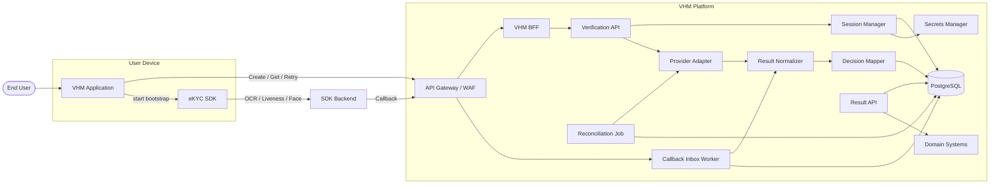

### 2.1.3. Danh sách module và trách nhiệm

| **STT** | **Module** | **Mục đích** | **Không chịu trách nhiệm** |
| --- | --- | --- | --- |
| 1 | **VHM Application (Mobile/Web)** | Hiển thị consent; kiểm tra capability; gọi create session; khởi chạy SDK; báo started/submitted/cancel/error; hiển thị trạng thái trung tính | Không giữ secret; không tự quyết định VERIFIED; không gửi OCR result tin cậy |
| 2 | **eKYC SDK** | Camera UX; thu nhận mặt trước/sau, liveness và face data; giao tiếp SDK Backend | Không sở hữu trạng thái nghiệp vụ VHM |
| 3 | **BFF/API Gateway** | Xác thực user; authorize business object; rate limit; route API | Không map provider payload hoặc lưu session |
| 4 | **Verification API** | API nội bộ; validate request; orchestration application-level | Không thực hiện thuật toán OCR/liveness |
| 5 | **Session Manager** | Tạo session; active guard; state machine; expiry; retry chain; optimistic locking | Không phụ thuộc raw SDK payload |
| 6 | **Provider Adapter** | Create session/Get Result; timeout; error translation; cô lập SDK contract | Không áp business rule domain |
| 7 | **Callback Inbox** | Xác thực, durable receive, dedupe và xử lý callback bất đồng bộ | Chỉ lưu payload tối thiểu đã mã hóa với TTL; không lưu media |
| 8 | **Result Normalizer** | Chuyển document/liveness/face/warning thành Canonical Result | Không cập nhật business object |
| 9 | **Decision Mapper** | Ánh xạ Canonical Result thành decision theo fixed policy version | Không hard-code threshold chưa phê duyệt |
| 10 | **Reconciliation Job** | Tìm session treo, lấy result, backoff và hoàn tất idempotent | Không polling mọi session liên tục |
| 11 | **Result API** | Trả Canonical Result với bộ field cố định, authorization và masking | Không trả raw provider response |
| 12 | **Domain System** | Áp rule nghiệp vụ, auto-fill, chấp nhận, từ chối hoặc yêu cầu retry | Không tích hợp trực tiếp SDK Backend |
| 13 | **PostgreSQL** | Session, run, check, field, inbox, result và history | Không lưu binary media trực tiếp |

### 2.1.4. Luồng dữ liệu OCR/eKYC

eKYC SDK trên Mobile/Web gửi dữ liệu OCR, liveness và face tới SDK Backend.

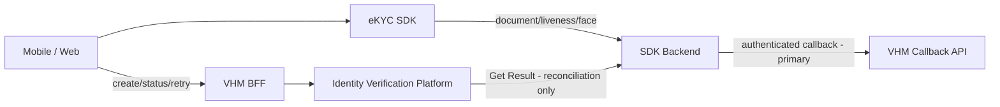

Ràng buộc triển khai bắt buộc:

- Dữ liệu document, selfie và video/frame liveness của SDK flow được truyền
  giữa eKYC SDK và SDK Backend; VHM BFF/Identity Verification Platform chỉ xử lý
  control-plane, session và official result.
- Mặt trước và mặt sau phải thuộc cùng một SDK run. Nếu một mặt thất bại, attempt
  kết thúc và retry phải tạo whole attempt mới; không tái sử dụng ảnh đã pass.
- VHM chỉ cấp bootstrap/configuration ngắn hạn; API key/app secret không đi xuống client.
- Kết quả phía client chỉ phục vụ UX. Official result phải đến từ callback
  server-to-server đã xác thực. Reconciliation Job chỉ gọi Get Result khi callback
  quá SLA hoặc session treo.
- Mobile/Web không log SDK payload, media reference, token hoặc dữ liệu định danh raw.
- Network allowlist, TLS, SDK integrity và callback authentication tuân theo mục Security.
- Data location, retention, subprocessor và incident handling phải được kiểm soát
  bằng hợp đồng và là gate bắt buộc trước production.

### 2.1.5. Trust Boundary

| **Boundary** | **Luồng** | **Mức tin cậy** | **Kiểm soát bắt buộc** |
| --- | --- | --- | --- |
| Device → VHM | Create/get/start/submit/retry | Untrusted client | JWT, object authorization, rate limit, idempotency, schema validation |
| Device → SDK Backend | SDK data-plane | External dependency | TLS, SDK integrity, short-lived bootstrap, device security |
| SDK Backend → VHM | Callback | External server | Strong auth/signature, WAF, timestamp/replay guard, schema, idempotency |
| VHM → SDK Backend | Create session; Get Result chỉ từ Reconciliation Job sau callback SLA | External dependency | Secret Manager, TLS, timeout, circuit breaker, audit |
| Identity Platform → Domain | Internal S2S Result API | Zero Trust internal | Workload identity, domain/object scope, fixed schema |
| Platform → PostgreSQL | Restricted storage | Restricted | Private subnet, IAM, encryption, least privilege |

### 2.1.6. Journey Policy Model

| **Journey** | **Step bắt buộc** | **Kết quả Platform** | **Quy tắc sử dụng** |
| --- | --- | --- | --- |
| `OCR_ONLY` | `OCR_DOCUMENT` | OCR fields, quality/warning và `ekycOutcome=NOT_PERFORMED` | Không được diễn giải là đã xác minh danh tính |
| `FULL_EKYC` | OCR front/back → liveness → face matching | OCR fields + eKYC decision + identity reference | Bắt buộc liveness; không silent downgrade khi thiếu capability |

Backend chỉ chấp nhận `OCR_ONLY` hoặc `FULL_EKYC`, document type
`NATIONAL_ID_CHIP` và channel `MOBILE_APP`/`WEB_APP`. Journey được resolve từ use
case đã được phê duyệt; client không được tự đổi flow.

### 2.1.7. Channel Capability Matrix

| **Capability** | **Mobile** | **Web** | **Quy tắc** |
| --- | --- | --- | --- |
| Camera OCR | SDK kiểm tra permission và chất lượng capture | SDK kiểm tra camera permission và chất lượng capture | Phải pass trước khi start |
| Document sides | Front và back trong cùng SDK run/attempt | Front và back trong cùng SDK run/attempt | Một mặt fail thì whole attempt fail |
| Liveness | SDK thực hiện trong `FULL_EKYC` | SDK thực hiện trong `FULL_EKYC` | Thiếu capability trả `CHANNEL_CAPABILITY_REQUIRED` |
| Face matching | Qua SDK Backend | Qua SDK Backend | Chỉ official result được dùng cho decision |
| Resume | Query backend status trước khi resume | Query backend status sau refresh/reopen | Không lưu bootstrap token dài hạn; unsupported resume chuyển retry |

### 2.1.8. Thông tin dữ liệu

| **Loại dữ liệu** | **Ví dụ** | **Phân loại** | **Quy tắc lưu trữ** | **Bảo mật/Logic** |
| --- | --- | --- | --- | --- |
| Internal session | `verificationId`, domain, purpose | L2 | PostgreSQL | UUID random; tenant/domain isolation |
| Business references | `businessRef`, `subjectRef` | L2 | PostgreSQL | Opaque; không nhúng PII |
| Provider session | `providerSessionId` | L2/Internal | PostgreSQL, unique theo provider | External correlation, không dùng làm PK |
| State/timestamps | status, attempts, expiry | L2 | PostgreSQL | Guard + optimistic lock + append-only history |
| OCR fields | document number, name, DOB, address | L3 | Field-level encrypted; chỉ bộ field cố định đã phê duyệt | Mask theo Result API contract |
| Confidence/warnings | score, reason code | L2/L3 | Check table/JSONB | Versioned mapping, hạn chế UI |
| Liveness/face result | status, score | L3/Biometric-related | Status/score tối thiểu | Không lưu video/template tại VHM |
| Resource URL | front/back/video URL | L3 | Không persist | Không log; không fetch tự động |
| Callback payload | Payload tối thiểu phục vụ normalize | L3/L4 | Mã hóa trong Callback Inbox, TTL ngắn và purge sau xử lý | Không log; không lưu vào result/history |
| Consent | purpose/version/time | L3 | Consent system + reference | Purpose-bound, audit được |
| Credential/token | API key, callback key, SDK token | Secret | VHM Secret Manager; workload memory khi sử dụng | Không DB/log/client binary |

## 2.2. Session Configuration

### 2.2.1. User Authentication Session

- Do IAM/BFF quản lý qua OIDC/JWT.
- Identity Platform không tự quản lý login session.
- Backend phải xác minh user/service có quyền với `businessRef` trước mọi mutation/read.

### 2.2.2. Verification Session

| **Thuộc tính** | **Baseline** |
| --- | --- |
| Internal ID | `verificationId` UUIDv7 do VHM sinh |
| External correlation | `providerSessionId`, unique theo provider/environment |
| Active uniqueness | Một session active trên `(tenant, domain, businessRef, subjectRef, purpose, journey)` |
| Idempotency | `Idempotency-Key` bắt buộc khi create/retry |
| Timeout | 30 phút; backend và SDK config dùng cùng versioned policy |
| Retry | Tạo session mới, link `retryOfVerificationId`; không reuse external session |
| Resume | Chỉ khi SDK contract hỗ trợ; backend không giả định resume |
| Client completion | Chỉ là `SUBMITTED`, không phải verified |
| Provider completion | Callback hợp lệ; Get Result chỉ hoàn tất qua reconciliation fallback |
| Business completion | Sau normalize + fixed decision mapping + durable persistence |
| Channel | `MOBILE_APP` hoặc `WEB_APP`; ghi nhận tại session/run |
| Capability | Camera/liveness capability là client hint; backend validate theo Mobile/Web compatibility policy |

### 2.2.3. State Machine

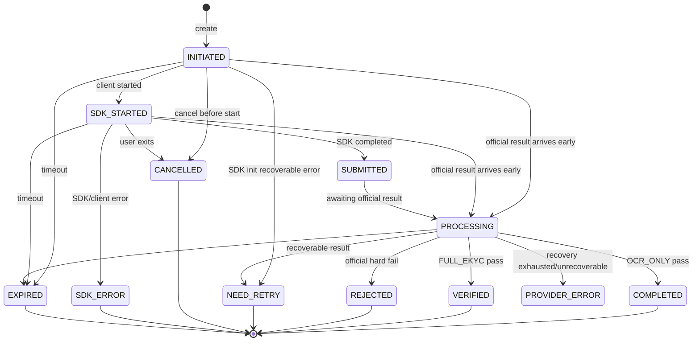

### 2.2.4. State Transition Guard

| **From** | **To** | **Điều kiện** | **Tác động** |
| --- | --- | --- | --- |
| INITIATED | SDK_STARTED | Chưa expire; caller đúng owner; bootstrap hợp lệ | Ghi startedAt/platform/app/sdk version |
| SDK_STARTED | SUBMITTED | Client báo SDK hoàn tất; external reference match | Ghi submittedAt; không cập nhật decision |
| SUBMITTED | PROCESSING | Official result chưa final hoặc processing async | Lập reconciliation schedule |
| INITIATED/SDK_STARTED/SUBMITTED/PROCESSING | COMPLETED | `OCR_ONLY` official result pass | Persist result/history; không diễn giải là đã xác minh danh tính |
| INITIATED/SDK_STARTED/SUBMITTED/PROCESSING | VERIFIED | `FULL_EKYC` official result hợp lệ + policy pass | Persist result/history; chấp nhận callback đến trước client event |
| INITIATED/SDK_STARTED/SUBMITTED/PROCESSING | REJECTED | Hard fail theo policy approved | Lưu canonical reasons; không nhầm timeout |
| INITIATED/SDK_STARTED/SUBMITTED/PROCESSING | NEED_RETRY | Recoverable quality/user error | Đóng attempt; cho tạo session mới nếu còn quota |
| PROCESSING | PROVIDER_ERROR | Hết reconciliation budget hoặc lỗi tích hợp không retryable | Đóng attempt; trả support/retry action theo policy |
| Any non-terminal | EXPIRED | `expiresAt < now`, chưa final | History + retry eligibility |
| Terminal | Any | Không cho chuyển ngược | Callback/client event trễ chỉ ghi audit |

## 2.3. Internal Component Design

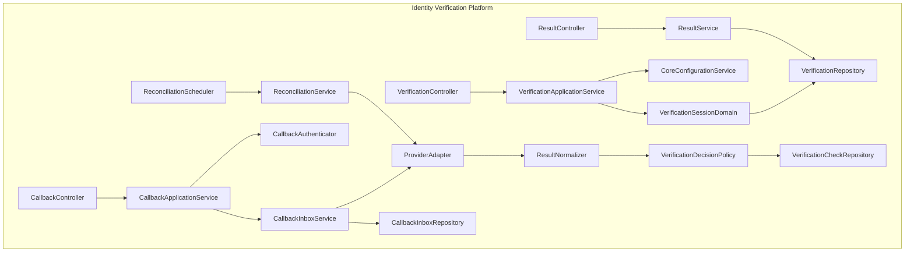

### 2.3.1. VerificationApplicationService

- Kiểm tra consumer/domain/use case đã đăng ký.
- Kiểm tra business reference và quyền caller qua domain authorization contract.
- Validate consent đúng subject, purpose và version.
- Resolve journey, timeout, quota và decision policy version.
- Bảo đảm unique active session và create idempotent.
- Sinh `verificationId`, tạo provider session qua adapter nếu contract yêu cầu.
- Trả SDK bootstrap tối thiểu; không trả credential dài hạn.

### 2.3.2. CoreConfigurationService

Consumer config tối thiểu:

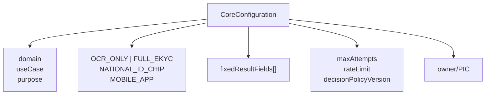

- Config versioned và environment-scoped.
- Thay đổi bộ field cố định/decision policy cần Data Privacy/Risk approval tương ứng.
- Secret không nằm trong consumer config.

### 2.3.3. CallbackAuthenticator

- Callback bắt buộc dùng chữ ký bất đối xứng JWS/JWT với `keyId`, timestamp,
  audience và nonce/event ID. mTLS được áp dụng thêm khi SDK Backend hỗ trợ.
- Fixed token không đáp ứng baseline production; provider không hỗ trợ chữ ký phải
  có security exception được ANBM phê duyệt trước tích hợp.
- Validate timestamp, audience, key ID và replay window cho mọi callback.
- IP allowlist chỉ là lớp bổ sung, không thay authentication.
- Reject trước khi parse sâu nếu payload quá lớn.
- Hỗ trợ key rotation overlap, không gây gián đoạn callback đang bay.

### 2.3.4. CallbackInboxService

- Idempotency key dùng `providerEventId`; chỉ fallback external session + result
  version/payload hash khi provider contract xác nhận không cung cấp event ID.
- Sau khi xác thực, lưu payload tối thiểu đã redaction và mã hóa trước khi xử lý business.
- Duplicate đã nhận durable trả 2xx, không chạy side effect lần hai.
- Inbox states: `RECEIVED`, `PROCESSING`, `PROCESSED`, `FAILED`, `QUARANTINED`.
- Encrypted payload chỉ tồn tại trong inbox theo TTL ngắn và được purge sau xử lý.
  Không lưu payload vào result/history/log; quarantine cần incident ticket và audit.

### 2.3.5. ResultNormalizer

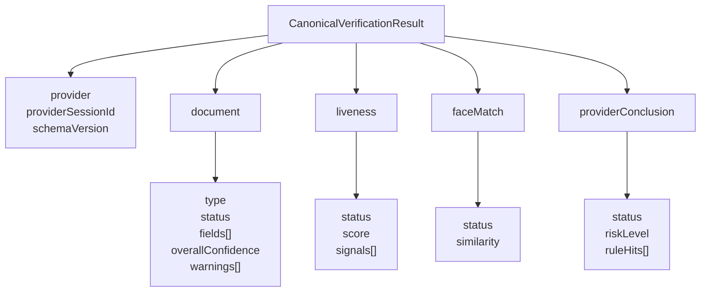

Normalizer phải:

- Chịu được optional field, null, `N/A` và provider thêm field mới.
- Parse score/boolean/date an toàn, validate range.
- Quarantine khi thiếu external session, schema không hỗ trợ hoặc payload sai type nghiêm trọng.
- Giữ provider code phục vụ audit nhưng chỉ trả canonical code cho domain.
- Không fetch resource URL tự động.

### 2.3.6. VerificationDecisionPolicy

Decision model:

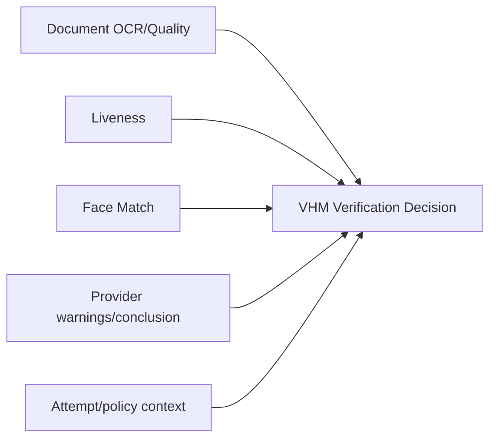

- Sử dụng fixed mapping policy đã được phê duyệt và version hóa.
- Threshold không hard-code trong Java.
- Provider conclusion là input, không tự động là business decision.
- Lưu `decisionPolicyVersion` và canonical reason codes tại thời điểm quyết định.

### 2.3.7. ResultService

- Kiểm tra service identity, tenant, domain và business-object authorization.
- Trả một Canonical Result schema với bộ field cố định đã được phê duyệt.
- Mask mặc định; unmask cần elevated permission + reason + audit.
- Không expose resource URL, raw warning hoặc threshold có thể hỗ trợ gian lận.

## 2.4. Data Model

### 2.4.1. ERD

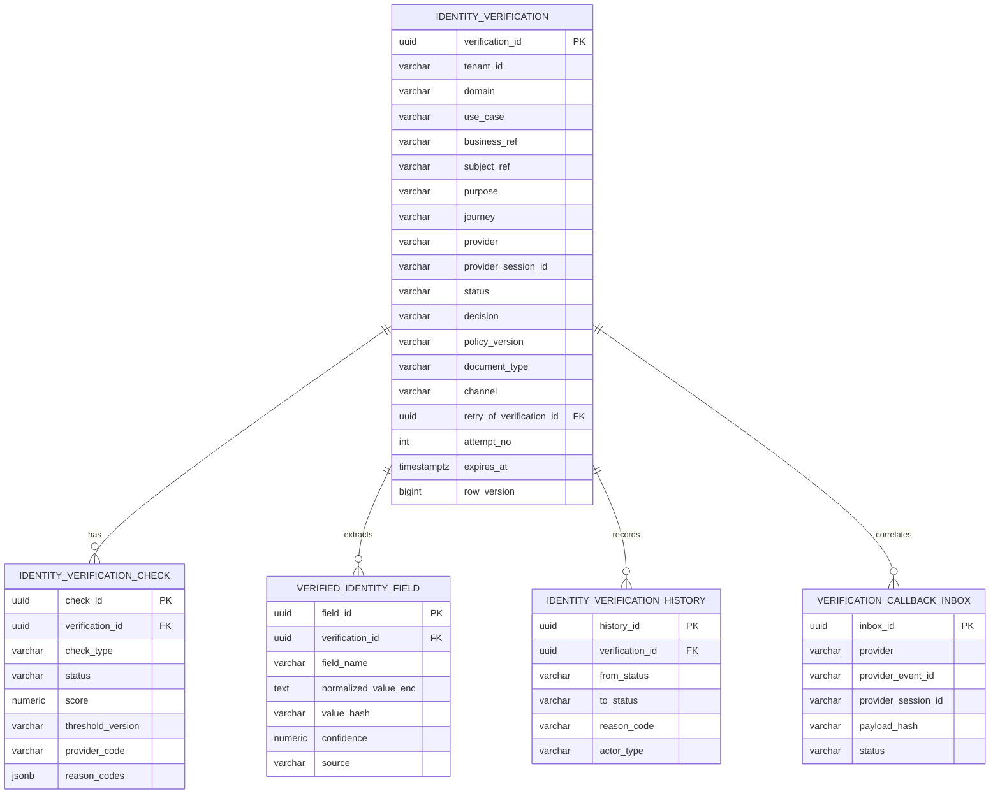

### 2.4.2. Bảng `identity_verification`

```sql
CREATE TABLE identity_verification (
    verification_id             uuid PRIMARY KEY,
    tenant_id                    varchar(50)  NOT NULL,
    domain                       varchar(50)  NOT NULL,
    use_case                     varchar(80)  NOT NULL,
    business_ref                 varchar(150) NOT NULL,
    subject_ref                  varchar(150) NOT NULL,
    purpose                      varchar(80)  NOT NULL,
    journey                      varchar(40)  NOT NULL,
    document_type                varchar(40),
    provider                     varchar(40)  NOT NULL,
    provider_session_id          varchar(150),
    status                       varchar(30)  NOT NULL,
    decision                     varchar(30),
    decision_reason_codes        jsonb        NOT NULL DEFAULT '[]',
    policy_version               varchar(80)  NOT NULL,
    retry_of_verification_id     uuid,
    attempt_no                   integer      NOT NULL DEFAULT 1,
    sdk_version                  varchar(50),
    app_version                  varchar(50),
    expires_at                   timestamptz  NOT NULL,
    started_at                   timestamptz,
    submitted_at                 timestamptz,
    completed_at                 timestamptz,
    created_by                   varchar(150) NOT NULL,
    created_at                   timestamptz  NOT NULL,
    updated_at                   timestamptz  NOT NULL,
    row_version                  bigint       NOT NULL DEFAULT 0,
    CONSTRAINT fk_iv_retry_of FOREIGN KEY (retry_of_verification_id)
      REFERENCES identity_verification(verification_id),
    CONSTRAINT uk_iv_provider_session UNIQUE (provider, provider_session_id)
);

CREATE INDEX idx_iv_business_ref
  ON identity_verification(tenant_id, domain, business_ref, created_at DESC);

CREATE INDEX idx_iv_subject_ref
  ON identity_verification(tenant_id, domain, subject_ref, created_at DESC);

CREATE INDEX idx_iv_reconciliation
  ON identity_verification(status, updated_at)
  WHERE status IN ('SUBMITTED', 'PROCESSING');

CREATE UNIQUE INDEX uk_iv_active_subject
  ON identity_verification(
    tenant_id, domain, business_ref, subject_ref, purpose, journey
  )
  WHERE status IN ('INITIATED', 'SDK_STARTED', 'SUBMITTED', 'PROCESSING');
```

`provider_session_id` có thể null trước khi provider session được tạo. PostgreSQL
cho phép nhiều null dưới unique constraint; adapter phải bổ sung validation khi bind.

### 2.4.3. Bảng `identity_verification_check`

```sql
CREATE TABLE identity_verification_check (
    check_id               uuid PRIMARY KEY,
    verification_id        uuid        NOT NULL
      REFERENCES identity_verification(verification_id),
    check_type              varchar(40) NOT NULL,
    status                  varchar(30) NOT NULL,
    score                   numeric(12,6),
    threshold_version       varchar(80),
    provider_code           varchar(80),
    reason_codes            jsonb       NOT NULL DEFAULT '[]',
    warning_data            jsonb       NOT NULL DEFAULT '[]',
    checked_at              timestamptz,
    created_at              timestamptz NOT NULL,
    updated_at              timestamptz NOT NULL,
    CONSTRAINT uk_iv_check UNIQUE (verification_id, check_type)
);
```

`check_type` baseline:

- `DOCUMENT_OCR`
- `DOCUMENT_QUALITY`
- `LIVENESS`
- `FACE_MATCH`
- `PROVIDER_CONCLUSION`

### 2.4.4. Bảng `verified_identity_field`

```sql
CREATE TABLE verified_identity_field (
    field_id                  uuid PRIMARY KEY,
    verification_id           uuid         NOT NULL
      REFERENCES identity_verification(verification_id),
    field_name                varchar(80)  NOT NULL,
    normalized_value_enc      text,
    value_hash                varchar(128),
    confidence                numeric(12,6),
    source                    varchar(30)   NOT NULL,
    created_at                timestamptz   NOT NULL,
    CONSTRAINT uk_iv_field UNIQUE (verification_id, field_name)
);
```

- `normalized_value_enc`: application/column-level encryption theo platform standard.
- `value_hash`: chỉ tạo cho field exact-match/dedup; dùng HMAC-SHA256 với key riêng,
  không dùng plain SHA-256 cho CCCD.
- Không index plaintext PII.
- Retention field có thể ngắn hơn session metadata và phải có deletion job riêng.

### 2.4.5. Bảng Callback Inbox

```sql
CREATE TABLE verification_callback_inbox (
    inbox_id                 uuid PRIMARY KEY,
    provider                 varchar(40)  NOT NULL,
    provider_event_id        varchar(150),
    provider_session_id      varchar(150) NOT NULL,
    verification_id         uuid REFERENCES identity_verification(verification_id),
    result_version           varchar(80),
    payload_hash             varchar(128) NOT NULL,
    encrypted_payload        bytea        NOT NULL,
    auth_subject             varchar(150),
    status                   varchar(30)  NOT NULL,
    received_at              timestamptz  NOT NULL,
    processing_started_at    timestamptz,
    processed_at             timestamptz,
    failure_code             varchar(80),
    failure_message_masked   varchar(500),
    expires_at               timestamptz  NOT NULL,
    CONSTRAINT uk_callback_event UNIQUE(provider, provider_event_id),
    CONSTRAINT uk_callback_payload UNIQUE(provider, provider_session_id, payload_hash)
);
```

Nếu provider không có event ID, uniqueness fallback theo external session + payload hash.
`encrypted_payload` chỉ chứa dữ liệu tối thiểu sau redaction để worker normalize,
có TTL và purge job; không được sao chép sang result/history/log.

## 2.5. Concurrency, Idempotency và Transaction

### 2.5.1. Tạo phiên đồng thời

Rủi ro: double-click/mobile retry tạo hai session.

Kiểm soát:

- `Idempotency-Key` bắt buộc.
- Lưu request fingerprint; cùng key khác body trả conflict.
- Partial unique active index.
- Nếu cùng idempotency và fingerprint, trả session hiện hữu.

### 2.5.2. Callback đồng thời/trùng lặp

- Insert inbox với unique event/payload key.
- Request thắng insert thực hiện durable receive.
- Duplicate `PROCESSED/PROCESSING` trả 2xx để tránh retry storm.

### 2.5.3. Callback và reconciliation cùng chạy

- Cả hai gọi chung `processOfficialResult()`.
- Callback/reconciliation khóa session bằng `SELECT ... FOR UPDATE` trong transaction
  ngắn; API mutation thông thường dùng optimistic `rowVersion`.
- Nếu terminal, chỉ append audit duplicate/late source, không finalize lần hai.

### 2.5.4. Transaction boundary

Trong một local transaction:

1. Upsert verification checks.
2. Lưu normalized fields được phép.
3. Chuyển session state/decision.
4. Append history.

Không gọi Domain System hoặc SDK Backend bên trong DB transaction.

# **3. Feature List**

## 3.1. OCR & eKYC Platform

| **STT** | **Nhóm chức năng** | **Mô tả** |
| --- | --- | --- |
| 1 | **Core Configuration** | Quản lý domain/use case, owner, hai journey đã duyệt, một document type, quota và fixed decision policy version. |
| 2 | **Consent Guard** | Kiểm tra consent đúng subject, purpose, version, channel và thời hạn trước khi tạo phiên. |
| 3 | **Khởi tạo phiên** | Tạo `verificationId`, external session, active-session guard, expiry và SDK bootstrap; hỗ trợ `Idempotency-Key`. |
| 4 | **Capability Preflight** | Kiểm tra camera, permission, Mobile/Web SDK compatibility và liveness capability trước khi start. |
| 5 | **Mobile/Web SDK Integration** | Quản lý permission, client lifecycle, SDK started/submitted/error, resume và security signal trên hai kênh. |
| 6 | **OCR giấy tờ** | Thu nhận mặt trước/sau trong cùng attempt; trích xuất field, confidence, document quality và warning. |
| 7 | **Liveness** | Thực hiện trong `FULL_EKYC`; official result lấy từ SDK Backend. |
| 8 | **Face Matching** | Chuẩn hóa match result/score/reason; không dùng score đơn lẻ khi threshold chưa được duyệt. |
| 9 | **Callback Reception** | Endpoint server-to-server, authentication, timestamp/replay guard, schema/body limit, durable inbox và dedupe. |
| 10 | **Reconciliation/Get Result** | Chỉ lấy official result khi callback quá SLA hoặc session treo; bounded batch, backoff và circuit breaker. |
| 11 | **Result Normalization** | Chuyển payload SDK Backend thành Canonical Result, tolerant với optional/new fields và strict với critical fields. |
| 12 | **Decision Mapping** | Ánh xạ canonical checks thành `COMPLETED/VERIFIED/REJECTED/NEED_RETRY/PROVIDER_ERROR`; lưu policy version. |
| 13 | **Result API** | Trả Canonical Result với bộ field cố định đã phê duyệt; authorize, mask và audit quyền truy cập. |
| 14 | **Retry Chain** | Tạo whole attempt mới với external session mới; giữ liên kết, reason và attempt count. |
| 15 | **Expiry Management** | Expire session/run theo policy; xử lý callback trễ và grace reconciliation có audit. |
| 16 | **Audit & Traceability** | Lưu state history, result source, config/policy version, actor và access/unmask audit. |
| 17 | **Operations** | Search theo internal reference, reprocess callback inbox và tạm dừng create khi dependency incident. |
| 18 | **Monitoring & Cost Control** | Funnel, latency, error taxonomy, callback/reconcile backlog, quota, attempt và estimated cost. |

## 3.2. Business Rules tổng quát

| **Rule ID** | **Quy tắc** |
| --- | --- |
| BR-001 | Một `(tenant, domain, businessRef, subjectRef, purpose, journey)` chỉ có tối đa một session active. |
| BR-002 | `verificationId` do VHM sinh, unique, không chứa PII và không tái sử dụng. |
| BR-003 | External session ID không được dùng làm public/internal primary key. |
| BR-004 | Kết quả client/SDK phía Mobile/Web không được chuyển trực tiếp thành `COMPLETED`, `VERIFIED` hoặc `REJECTED`. |
| BR-005 | Chỉ official result server-to-server đã xác thực mới được hoàn tất session. |
| BR-006 | `OCR_ONLY` thành công chuyển `COMPLETED`, có `ekycOutcome=NOT_PERFORMED` và không được hiển thị là đã xác minh danh tính. |
| BR-007 | Chỉ `FULL_EKYC` pass mới chuyển `VERIFIED`. |
| BR-008 | Callback trùng không được cập nhật state, result, history hoặc side effect lần hai. |
| BR-009 | Timeout/network/SDK Backend unavailable giữ `PROCESSING` trong recovery budget; hết budget mới thành `PROVIDER_ERROR`, không phải `REJECTED`. |
| BR-010 | Lỗi ảnh, permission hoặc thao tác recoverable có thể chuyển `NEED_RETRY`. |
| BR-011 | Domain chỉ nhận bộ normalized fields cố định đã được Product/Privacy phê duyệt. |
| BR-012 | Auto-fill chỉ ghi field trống; overwrite field đã xác nhận cần explicit confirmation/rule của Domain System. |
| BR-013 | Retry tạo session/provider transaction mới và không ghi đè lịch sử attempt trước. |
| BR-014 | Mặt trước và mặt sau phải thuộc cùng một `runId`; lỗi một mặt làm whole attempt thất bại. |
| BR-015 | Không tái sử dụng ảnh mặt đã pass để ghép với attempt mới. |
| BR-016 | Terminal state không chuyển ngược qua API hoặc callback trễ. |
| BR-017 | Không persist/log resource URL, media SDK flow, token hoặc provider payload ngoài encrypted Callback Inbox TTL ngắn. |
| BR-018 | Client không được gọi external Get Result; chỉ Reconciliation Job được phép gọi khi callback quá SLA hoặc session treo. |
| BR-019 | Mọi threshold/decision/config thay đổi phải version hóa và có change ticket. |
| BR-020 | Mobile/Web capability là untrusted hint; backend đối chiếu compatibility policy. |
| BR-021 | Domain không được dùng OCR/eKYC result cho purpose khác purpose đã consent. |
| BR-022 | Chỉ lỗi kỹ thuật/transient phù hợp mới retry tự động; validation fail/mismatch không retry kỹ thuật. |
| BR-023 | Trang kết quả của SDK phải đặt `OFF`; VHM Application sở hữu processing/result screen. |
| BR-024 | Khi SDK phát completion/close event, Mobile/Web chỉ gửi `submitted` và hiển thị “Đang xử lý kết quả”. |
| BR-025 | Mobile/Web chỉ hiển thị outcome/next action lấy từ Identity Verification Platform sau khi official result đã được xử lý. |

## 3.3. Ma trận trạng thái và hành động

| **Status** | Get status | Start SDK | Client submit | Retry | Result API | Reconcile |
| --- | --- | --- | --- | --- | --- | --- |
| INITIATED | ✔️ | ✔️ | ❌ | ❌ | ❌ | ❌ |
| SDK_STARTED | ✔️ | Idempotent/same run | ✔️ | ❌ | ❌ | Gần timeout theo policy |
| SUBMITTED | ✔️ | ❌ | Idempotent | ❌ | Chưa final | ✔️ sau initial delay |
| PROCESSING | ✔️ | ❌ | Ignore/late audit | ❌ | Chưa final | ✔️ |
| COMPLETED | ✔️ | ❌ | Ignore | ❌ | OCR result | ❌ |
| VERIFIED | ✔️ | ❌ | Ignore | ❌ | eKYC result | ❌ |
| REJECTED | ✔️ | ❌ | Ignore | Theo policy | Canonical outcome | ❌ |
| NEED_RETRY | ✔️ | ❌ | Ignore | ✔️ nếu còn attempt/quota | Canonical outcome | ❌ |
| PROVIDER_ERROR | ✔️ | ❌ | Ignore | Sau recovery/Ops gate | Canonical technical outcome | ❌ |
| CANCELLED | ✔️ | ❌ | Ignore | ✔️ theo policy | ❌ | Grace check nếu provider đã final |
| SDK_ERROR | ✔️ | ❌ | Ignore | ✔️ | ❌ | ❌ |
| EXPIRED | ✔️ | ❌ | Ignore | ✔️ theo policy | ❌ | Grace reconcile theo policy |

## 3.4. Channel Rules

| **Rule ID** | **Mobile** | **Web** |
| --- | --- | --- |
| CH-01 Permission | Camera permission và SDK capability phải được kiểm tra trước start | Camera permission và SDK capability phải được kiểm tra trước start |
| CH-02 Lifecycle | Background/foreground, force-close và resume query backend status | Refresh/reopen/multi-tab query backend status; không tự tạo run mới |
| CH-03 Token storage | Chỉ giữ bootstrap token trong memory | Chỉ giữ bootstrap token trong memory; không lưu browser storage dài hạn |
| CH-04 Compatibility | Mobile app/device/SDK matrix được pin version | Web client/SDK compatibility matrix được pin version |
| CH-05 Capture | Live capture theo SDK; không chọn ảnh có sẵn | Live capture theo SDK; không upload file có sẵn |
| CH-06 Two-side | Front/back thuộc cùng `runId`; fail một mặt kết thúc whole attempt | Áp dụng cùng quy tắc front/back và whole attempt |
| CH-07 Telemetry | Không gửi payload, OCR fields, media reference, token hoặc biometric score vào telemetry | Áp dụng cùng data policy cho log/analytics |
| CH-08 Result UX | SDK result page `OFF`; chỉ hiển thị VHM Result/Status API | Áp dụng cùng result rule |

---

# **4. Integration Architecture**

## 4.1. Danh sách Interfaces

> Endpoint dưới đây là **contract nội bộ bắt buộc của VHM**. Chi tiết
> API/auth/callback bên ngoài được cô lập trong Provider Adapter theo integration pack.

| **STT** | **Miêu tả** | **Endpoint** | **From** | **To** | **Mode** | **Data chính** |
| --- | --- | --- | --- | --- | --- | --- |
| 1 | Tạo session | `POST /internal/v1/identity-verifications` | BFF/Domain | Verification API | REST Sync | Domain context, journey, channel, consent, client capability |
| 2 | Cấp lại SDK bootstrap | `POST /internal/v1/identity-verifications/{id}/bootstrap` | BFF | Verification API | REST Sync | App/SDK version và capability |
| 3 | Lấy status | `GET /internal/v1/identity-verifications/{id}` | BFF/Domain | Verification API | REST Sync | Status, next action, retry và masked summary |
| 4 | Ghi SDK started | `POST /internal/v1/identity-verifications/{id}/started` | BFF | Verification API | REST Sync | runId, appVersion, sdkVersion |
| 5 | Ghi client submitted | `POST /internal/v1/identity-verifications/{id}/submitted` | BFF | Verification API | REST Sync | runId, untrusted completion code |
| 6 | Ghi client cancel | `POST /internal/v1/identity-verifications/{id}/cancelled` | BFF | Verification API | REST Sync | runId, canonical reason |
| 7 | Ghi SDK/client error | `POST /internal/v1/identity-verifications/{id}/sdk-error` | BFF | Verification API | REST Sync | runId, canonical error, masked SDK code |
| 8 | Tạo retry | `POST /internal/v1/identity-verifications/{id}/retry` | BFF/Ops | Verification API | REST Sync | Whole-attempt retry reason |
| 9 | Lấy Canonical Result | `GET /internal/v1/identity-verifications/{id}/result` | BFF/Domain | Result API | REST Sync | Fixed fields, outcome và reason codes |
| 10 | Callback SDK Backend | `POST /integration/v1/ekyc/callback` | SDK Backend | Callback API | REST Async | Authenticated official result |
| 11 | Lấy result chủ động | Provider-specific, internal adapter only | Reconciliation | SDK Backend | REST Sync | External session ID |
| 12 | Lấy history | `GET /internal/v1/identity-verifications/{id}/history` | Ops/Audit | Verification API | REST Sync | State/access history theo quyền |

## 4.2. Internal API Contract

### 4.2.1. Tạo phiên xác thực

```http
POST /internal/v1/identity-verifications
Authorization: Bearer <user-or-service-token>
Idempotency-Key: 6a2ac410-8f08-4c86-bfb6-8f142169483c
X-Correlation-Id: 38de4a70-513a-4f61-80ff-3ea914137f65
Content-Type: application/json
```

```json
{
  "domain": "DOMAIN_CODE",
  "useCase": "SALE_ONBOARDING",
  "businessRef": "registration-20260806-000001",
  "subjectRef": "applicant-01",
  "purpose": "IDENTITY_VERIFICATION",
  "requestedJourney": "FULL_EKYC",
  "documentType": "NATIONAL_ID_CHIP",
  "channel": "MOBILE_APP",
  "client": {
    "appVersion": "<approved-version>",
    "sdkVersion": "<approved-version>"
  },
  "capabilities": {
    "camera": true,
    "liveness": true
  },
  "consentReferenceId": "consent-20260806-000001"
}
```

Validation:

- Domain/use case đã được phê duyệt cho `OCR_ONLY` hoặc `FULL_EKYC`.
- Business/subject reference tồn tại và caller được quyền.
- Consent đúng subject/purpose/version và chưa bị rút.
- `documentType=NATIONAL_ID_CHIP`, `channel` thuộc `MOBILE_APP` hoặc `WEB_APP`.
- Capability và app/SDK version phù hợp compatibility policy của channel.
- Không có active session khác hoặc trả session cùng idempotency.
- Không vượt rate/attempt/quota.

```json
{
  "verificationId": "f47ed948-600b-4cbb-8f72-1306ccae1cf1",
  "status": "INITIATED",
  "resolvedJourney": "FULL_EKYC",
  "resolvedFlow": "DOCUMENT_LIVENESS_FACE",
  "documentType": "NATIONAL_ID_CHIP",
  "channel": "MOBILE_APP",
  "expiresAt": "2026-08-06T11:15:00+07:00",
  "sdkBootstrap": {
    "runId": "03d2866a-c267-47d0-8f49-64b06ef32218",
    "token": "opaque-short-lived-token",
    "tokenExpiresAt": "2026-08-06T10:50:00+07:00",
    "configurationRef": "mobile-full-ekyc-v1"
  }
}
```

Không trả API key, app secret, callback credential, raw provider configuration,
threshold hoặc policy detail xuống client. Create idempotency replay trả cùng
session; token cũ hết hạn không được replay và client gọi Bootstrap API.

Ví dụ trên minh họa `MOBILE_APP`; `WEB_APP` dùng cùng contract và chỉ thay channel,
client version/capability tương ứng, không thay đổi official-result flow.

### 4.2.2. SDK Bootstrap

```http
POST /internal/v1/identity-verifications/{verificationId}/bootstrap
Authorization: Bearer <authorized-token>
Idempotency-Key: <uuid>
Content-Type: application/json
```

```json
{
  "appVersion": "<approved-version>",
  "sdkVersion": "<approved-version>",
  "capabilities": {
    "camera": true,
    "liveness": true
  }
}
```

Server chỉ cấp bootstrap khi session còn hiệu lực, chưa terminal, version/capability
nằm trong allowlist và không có run/bootstrap lease khác đang active. Token bind
với `verificationId`, `runId`, journey, document type, environment và expiry.

### 4.2.3. SDK started

```http
POST /internal/v1/identity-verifications/{id}/started
```

```json
{
  "runId": "03d2866a-c267-47d0-8f49-64b06ef32218",
  "channel": "MOBILE_APP",
  "appVersion": "<approved-version>",
  "sdkVersion": "<approved-version>"
}
```

- `runId` do Create/Bootstrap API cấp và phải bind đúng session/token.
- Cùng `runId` xử lý idempotent.
- Run khác khi lease còn active trả `409 IV_SDK_RUN_ACTIVE` trên cả Mobile và Web.
- Session hết hạn trả `409 IV_SESSION_EXPIRED`.

### 4.2.4. Client submitted

```json
{
  "runId": "03d2866a-c267-47d0-8f49-64b06ef32218",
  "sdkCompletionStatus": "COMPLETED",
  "sdkCompletionCode": "OPTIONAL_UNTRUSTED_CODE"
}
```

- Chỉ chuyển `SDK_STARTED → SUBMITTED` nếu session chưa terminal.
- Không nhận OCR fields, score, provider result, media reference hoặc token từ Mobile/Web.
- Không đánh dấu `COMPLETED`, `VERIFIED` hoặc `REJECTED` từ client event.
- Sau completion/close event, VHM Application hiển thị “Đang xử lý kết quả” và query status.
- Nếu callback đã final, giữ terminal state và audit late client event.

### 4.2.5. SDK error và Cancel

SDK error:

```json
{
  "runId": "03d2866a-c267-47d0-8f49-64b06ef32218",
  "category": "CAMERA_PERMISSION_DENIED",
  "sdkCode": "MASKED_CLIENT_CODE",
  "retryable": true
}
```

`retryable` chỉ là client hint; backend resolve theo canonical policy. SDK error
không tạo identity decision. Không nhận raw message, stack trace chứa PII hoặc SDK payload.

Cancel:

```json
{
  "runId": "03d2866a-c267-47d0-8f49-64b06ef32218",
  "reason": "USER_CANCELLED"
}
```

Cancel hợp lệ từ `INITIATED`/`SDK_STARTED` chuyển `CANCELLED`. Cancel sau
`SUBMITTED` hoặc terminal chỉ được audit, không đảo state.

### 4.2.6. Lấy trạng thái

```json
{
  "verificationId": "f47ed948-600b-4cbb-8f72-1306ccae1cf1",
  "status": "PROCESSING",
  "journey": "FULL_EKYC",
  "documentType": "NATIONAL_ID_CHIP",
  "nextAction": "WAIT_FOR_RESULT",
  "expiresAt": "2026-08-06T11:15:00+07:00",
  "retry": {
    "allowed": false,
    "remainingAttempts": 2
  }
}
```

Status API không trả raw provider state hoặc PII không cần cho UX.

### 4.2.7. Whole-attempt retry

```http
POST /internal/v1/identity-verifications/{verificationId}/retry
Authorization: Bearer <authorized-token>
Idempotency-Key: <uuid>
Content-Type: application/json
```

```json
{
  "reason": "DOCUMENT_QUALITY_RETRY"
}
```

- Chỉ retry từ `NEED_RETRY`, `PROVIDER_ERROR` hoặc `EXPIRED` theo policy.
- Lỗi tích hợp không retryable chỉ cho retry sau khi Ops xác nhận nguyên nhân đã sửa.
- Sinh verification/provider session mới và link `retryOfVerificationId`.
- Không reuse result, history, bootstrap hoặc ảnh của attempt trước.
- Request retry trùng chỉ tạo một attempt mới.

### 4.2.8. Result API

```http
GET /internal/v1/identity-verifications/{verificationId}/result
Authorization: Bearer <authorized-token>
```

```json
{
  "verificationId": "f47ed948-600b-4cbb-8f72-1306ccae1cf1",
  "journey": "FULL_EKYC",
  "documentType": "NATIONAL_ID_CHIP",
  "status": "VERIFIED",
  "outcome": {
    "ocr": "PASSED",
    "ekyc": "VERIFIED"
  },
  "reasonCodes": [],
  "document": {
    "documentNumber": "******1234",
    "fullName": "NGUYEN V** A",
    "dateOfBirth": "1990-**-**"
  },
  "policyVersion": "identity-policy-1.0",
  "completedAt": "2026-08-06T10:46:30+07:00"
}
```

- Validate workload/user identity, tenant, domain và business-object ownership.
- Chỉ trả fixed approved field set; mask sensitive fields mặc định.
- Unmask cần explicit role/scope, reason và access audit.
- Không trả raw provider payload/code, resource URL, media hoặc threshold.
- `200` khi result đã final; `409 IV_RESULT_NOT_READY` khi session chưa final.

### 4.2.9. Error contract

| **HTTP** | **Code** | **Ý nghĩa** | **Retry** |
| --- | --- | --- | --- |
| 400 | `IV_INVALID_REQUEST` | Sai schema/business input | Không, sửa request |
| 401 | `IV_UNAUTHENTICATED` | Thiếu/sai identity | Re-auth |
| 403 | `IV_FORBIDDEN` | Không có quyền object/domain | Không |
| 404 | `IV_NOT_FOUND` | Không tồn tại trong caller scope | Không |
| 409 | `IV_ACTIVE_SESSION_EXISTS` | Đã có session active | Dùng session hiện hữu |
| 409 | `IV_IDEMPOTENCY_CONFLICT` | Cùng key khác payload | Key/request mới |
| 409 | `IV_INVALID_STATE` | Action không hợp lệ với state | Query status |
| 409 | `IV_SDK_RUN_ACTIVE` | Đã có SDK run active | Resume/query status |
| 409 | `IV_RESULT_NOT_READY` | Canonical Result chưa final | Query status |
| 422 | `IV_CHANNEL_CAPABILITY_REQUIRED` | Mobile/Web thiếu capability bắt buộc | Khắc phục permission hoặc dùng client phù hợp |
| 422 | `IV_UNSUPPORTED_CLIENT` | Client/SDK version không tương thích | Upgrade VHM Application |
| 429 | `IV_ATTEMPT_LIMIT_EXCEEDED` | Vượt quota/attempt | Không tự retry |
| 502 | `IV_PROVIDER_BAD_RESPONSE` | Provider response sai contract | Reconciliation/Ops |
| 503 | `IV_PROVIDER_UNAVAILABLE` | SDK Backend unavailable | Retry có backoff |
| 504 | `IV_PROVIDER_TIMEOUT` | Dependency timeout | Retry có backoff |

## 4.3. Callback SDK Backend

### 4.3.1. Endpoint

```http
POST /integration/v1/ekyc/callback
Content-Type: application/json
Authorization: <signed-provider-token>
```

```json
{
  "eventId": "provider-event-id",
  "eventTime": "2026-08-06T03:45:00Z",
  "providerSessionId": "external-session-reference",
  "resultVersion": "1",
  "status": "FINAL",
  "result": {}
}
```

Callback schema không nhận binary document/selfie/video. Resource URL nếu provider
vẫn trả phải được redaction trước khi lưu inbox và không được tự động fetch.

### 4.3.2. Processing flow

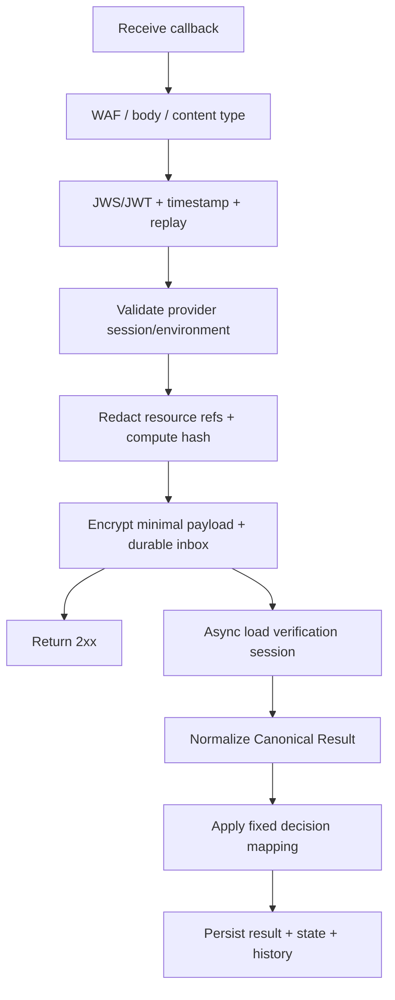

### 4.3.3. Authentication và Idempotency

| **Control** | **Yêu cầu** |
| --- | --- |
| Authentication | JWS/JWT bất đối xứng với `keyId`; mTLS bổ sung theo hạ tầng |
| Claims | Audience, timestamp, event ID/nonce, provider/environment binding |
| Replay | Timestamp window + event ID/nonce store |
| Dedupe key 1 | `provider + providerEventId` |
| Dedupe key 2 | `provider + providerSessionId + resultVersion/payloadHash` theo contract |
| Ack | Durable inbox trước 2xx |
| Key rotation | Overlap old/new public key và có runbook |

Authentication failure không insert business result và không thay đổi session.
Duplicate đã durable trả 2xx nhưng không normalize/finalize lần hai.

### 4.3.4. Callback response

| **HTTP** | **Khi dùng** | **Provider action kỳ vọng** |
| --- | --- | --- |
| 200/202 | Durable receive hoặc duplicate đã nhận | Dừng retry |
| 400 | Schema/envelope không hợp lệ | Không retry cùng payload |
| 401/403 | Authentication/audience/signature sai | Sửa credential/config, security alert |
| 429 | VHM rate limit theo contract | Retry backoff |
| 500/503 | Chưa durable receive | Retry theo provider contract |

## 4.4. Provider Adapter API

```text
createSession(request) -> ProviderSession
getResult(providerSessionId) -> ProviderResult
normalizeResult(providerResult) -> CanonicalVerificationResult
mapError(providerError) -> CanonicalProviderError
```

Provider Adapter phải:

- Cô lập endpoint, credential, timeout, payload và error code.
- Chỉ tích hợp một SDK/provider đã được phê duyệt.
- Không để DTO provider đi vào controller/domain contract.
- Không log request/response raw.
- Dùng timeout, bounded retry, circuit breaker và metrics.
- Get Result chỉ được gọi bởi Reconciliation Job.

### 4.4.1. Timeout/Retry Baseline

| **Operation** | **Timeout** | **Retry** |
| --- | --- | --- |
| Create provider session | Connect 2s, read 5s | Tối đa 2 retry cho timeout/5xx/429, có jitter |
| Get Result | Connect 2s, read 5s | Bounded theo reconciliation policy |
| Callback ack | `<= 2s` sau durable inbox | Provider retry nếu không nhận 2xx |

Không retry tự động cho 4xx business/schema. 401/403 phải alert Critical.

## 4.5. Canonical Result Contract

```json
{
  "provider": "DEFAULT_EKYC",
  "providerSessionId": "external-session-reference",
  "schemaVersion": "1.0",
  "journey": "FULL_EKYC",
  "document": {
    "type": "NATIONAL_ID_CHIP",
    "status": "PASSED",
    "fields": [
      {
        "name": "DOCUMENT_NUMBER",
        "value": "<encrypted-value>",
        "maskedValue": "******1234",
        "confidence": 0.98,
        "status": "VALID"
      }
    ],
    "qualityWarnings": []
  },
  "liveness": {
    "status": "PASSED"
  },
  "faceMatch": {
    "status": "MATCHED"
  },
  "providerConclusion": {
    "status": "PASSED",
    "reasonCodes": []
  },
  "decision": {
    "ocrOutcome": "PASSED",
    "ekycOutcome": "VERIFIED",
    "platformStatus": "VERIFIED",
    "policyVersion": "identity-policy-1.0"
  }
}
```

### 4.5.1. Normalization rules

- External session/environment phải khớp verification mapping.
- Critical fields thiếu hoặc sai type phải quarantine/alert.
- Optional/new fields được bỏ qua an toàn và không làm parser fail.
- Date/boolean/score parse strict và validate range trước khi lưu.
- Provider code chỉ lưu audit có kiểm soát; API trả canonical code.
- Không tự động fetch resource URL.
- Callback payload chỉ lưu mã hóa tạm thời trong inbox và purge theo TTL.
- `ocrOutcome` và `ekycOutcome` luôn tách riêng.

## 4.6. Decision Mapping

### 4.6.1. Baseline

| **Input/result condition** | **Platform status** | **Next action** |
| --- | --- | --- |
| OCR_ONLY: document pass và đủ fixed required fields | `COMPLETED`, `ocrOutcome=PASSED`, `ekycOutcome=NOT_PERFORMED` | Continue OCR-based flow; không hiển thị identity verified |
| FULL_EKYC: document/liveness/face pass | `VERIFIED` | Continue approved business flow |
| Ảnh mờ/chói/mất góc và còn attempt | `NEED_RETRY` | Retry whole attempt với hướng dẫn cụ thể |
| Camera permission hoặc SDK init lỗi | `SDK_ERROR` hoặc `NEED_RETRY` theo policy | User action/retry |
| Provider timeout/429/5xx | Giữ `PROCESSING`; hết recovery budget mới `PROVIDER_ERROR` | Reconciliation trước retry |
| Definitive official identity/document failure | `REJECTED` | Domain hiển thị canonical outcome |
| Callback schema/auth không hợp lệ | Không đổi business state | Operations/security xử lý |
| Không có final result sau recovery budget | `PROVIDER_ERROR` | `CONTACT_SUPPORT` hoặc retry theo policy |

Similarity/score đơn lẻ không đủ tạo `REJECTED`. Fixed mapping phải được
Product/Risk/Architect phê duyệt, version hóa và contract-test.

### 4.6.2. Reason Code Catalogue

| **Canonical reason** | **Ý nghĩa** | **Retryable** |
| --- | --- | --- |
| `DOCUMENT_BLUR` | Ảnh mờ | Có |
| `DOCUMENT_GLARE` | Ảnh chói | Có |
| `DOCUMENT_CROPPED` | Mất góc | Có |
| `DOCUMENT_SIDE_MISSING` | Thiếu front/back trong attempt | Có, whole attempt |
| `DOCUMENT_UNSUPPORTED` | Sai loại giấy tờ | Không |
| `DOCUMENT_EXPIRED` | Giấy tờ hết hạn | Theo policy |
| `LIVENESS_FAILED` | Không đạt liveness | Theo policy |
| `FACE_NOT_MATCHED` | Không khớp khuôn mặt | Theo policy |
| `PROVIDER_TIMEOUT` | SDK Backend timeout | Có kỹ thuật |
| `PROVIDER_UNAVAILABLE` | SDK Backend unavailable | Có kỹ thuật |
| `PROVIDER_AUTH_FAILED` | Credential/config lỗi | Không tự retry |
| `PROVIDER_SCHEMA_INVALID` | Payload sai contract | Không tự retry |
| `CALLBACK_AUTH_FAILED` | Callback không xác thực | Không |
| `CALLBACK_REPLAYED` | Callback replay | Không |
| `CAMERA_PERMISSION_DENIED` | Client thiếu quyền camera | User action |
| `UNSUPPORTED_CLIENT` | Mobile/Web SDK không tương thích | Upgrade VHM Application |

# **5. Data Flow**

## **5.1. Data Flow Diagram tổng quát**

### 5.1.1. Control-plane VHM

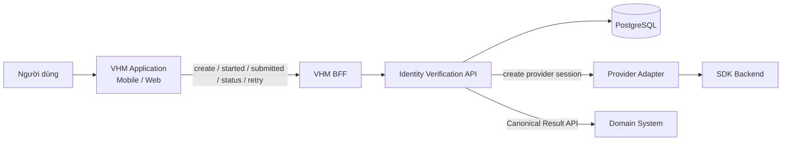

- VHM BFF xác thực user và authorize `businessRef/subjectRef`.
- Identity Verification Platform sở hữu `verificationId`, state, retry và result.
- Provider credential chỉ tồn tại trong backend/Secret Manager.
- Mobile/Web không gọi Provider Get Result API.

### 5.1.2. Data-plane SDK

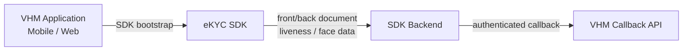

- Media đi trực tiếp từ SDK tới SDK Backend, không qua VHM BFF/Identity Platform.
- VHM không lưu document image, selfie hoặc video/frame liveness của SDK flow.
- Front/back thuộc cùng SDK run/attempt; fail một mặt kết thúc whole attempt.
- SDK completion phía client không phải official result.

### 5.1.3. Official result

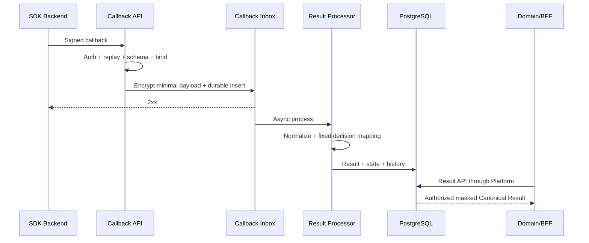

## 5.2. Data Flow quan trọng

### **5.2.1. Khởi tạo session**

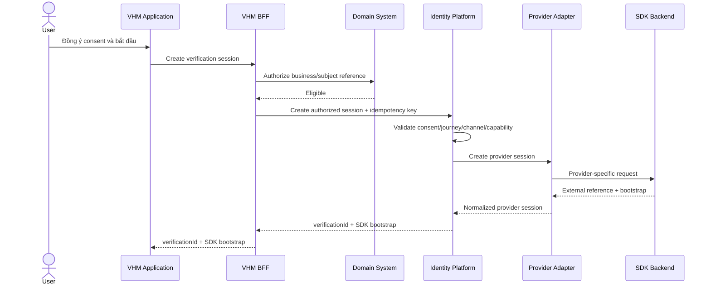

Create-session failure rules:

- Cùng idempotency key và fingerprint trả session hiện hữu.
- Cùng key khác fingerprint trả `IV_IDEMPOTENCY_CONFLICT`.
- External create timeout/5xx áp bounded retry; không tạo hai active session.
- Bootstrap token ngắn hạn, bind session/run/journey/channel/environment.

### **5.2.2. OCR_ONLY trên Mobile/Web**

```mermaid
sequenceDiagram
    actor User
    participant APP as VHM Application
    participant SDK as eKYC SDK
    participant BACKEND as SDK Backend
    participant IV as Identity Platform
    APP->>IV: started(runId)
    APP->>SDK: Start OCR_ONLY
    SDK->>User: Capture document front
    User->>SDK: Front image
    alt Front fail
        SDK-->>APP: Completion/error - untrusted
        APP->>IV: submitted/error
        Note over APP,IV: Whole attempt ends; no reuse of front image
    else Front pass
        SDK->>User: Capture document back
        User->>SDK: Back image
        SDK->>BACKEND: Front/back document data
        BACKEND->>IV: Authenticated official callback
        IV->>IV: Normalize OCR result
        IV->>IV: status=COMPLETED, ekycOutcome=NOT_PERFORMED
        SDK-->>APP: Completion/close - untrusted
        APP->>IV: submitted(runId)
        APP->>IV: GET status/result
        IV-->>APP: OCR outcome + masked fields
    end
```

Mobile và Web dùng cùng result/state contract. Khác biệt lifecycle chỉ nằm ở client
integration; backend không thay đổi official-result rule.

### **5.2.3. FULL_EKYC trên Mobile**

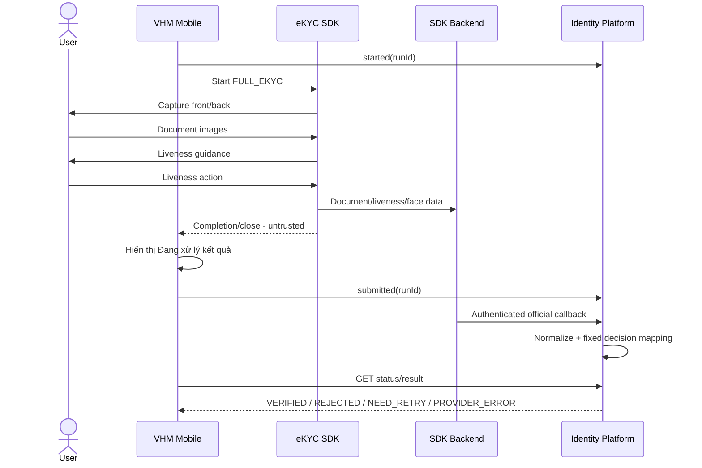

### **5.2.4. FULL_EKYC trên Web**

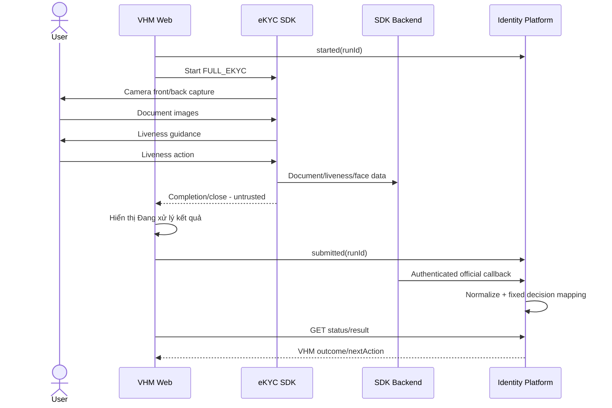

Refresh/reopen/multi-tab phải query backend status. Web không lưu bootstrap token
dài hạn và không tự tạo run mới khi lease còn active.

### **5.2.5. Callback thành công và duplicate**

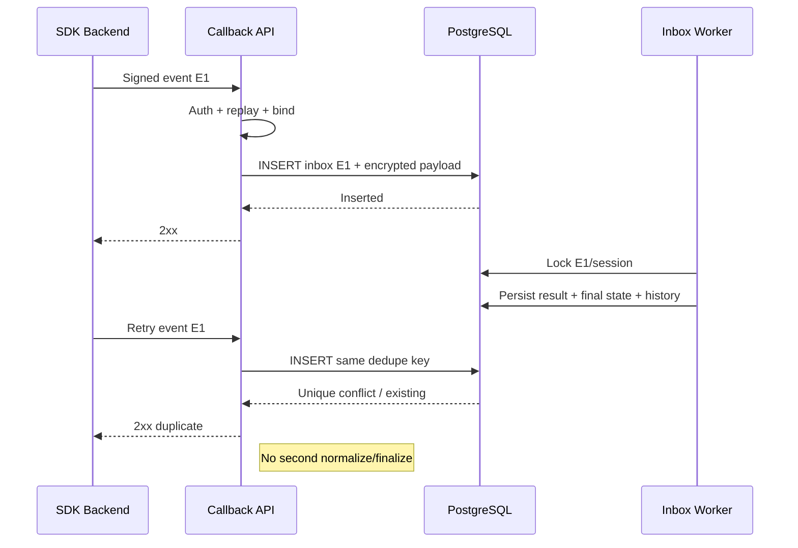

### **5.2.6. Callback đến trước client submitted**

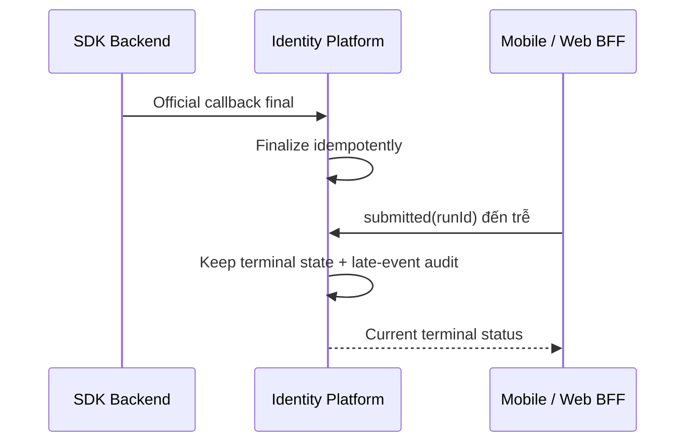

Client event không được đảo state hoặc ghi đè official result.

### **5.2.7. Callback thất lạc - Reconciliation**

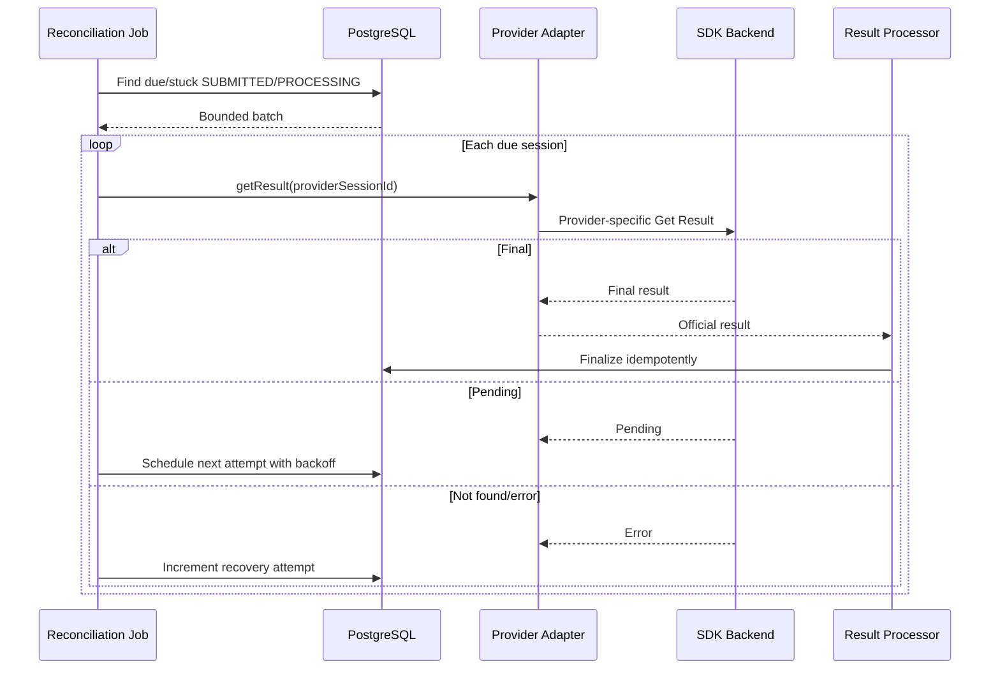

Callback và reconciliation dùng chung normalizer/state guard và session lock ngắn.
Hết recovery budget mới chuyển `PROVIDER_ERROR`.

### **5.2.8. User cancel/client close**

| **Tình huống** | **Client event** | **Backend action** |
| --- | --- | --- |
| User cancel trước submitted | `cancelled` với canonical reason | Chuyển `CANCELLED` nếu state cho phép |
| Mobile force-close | Có thể không có event | Giữ active đến expiry/reconcile; khi mở lại query status |
| Web refresh/reopen | Có thể không có event | Không auto cancel; query status và kiểm tra run lease |
| Mất mạng | Có thể không có event | Session timeout/reconcile theo policy |
| Official result đến sau cancel | Late result | Lưu late-result audit; không đảo `CANCELLED` |

### **5.2.9. Retry session**

```mermaid
sequenceDiagram
    participant APP as VHM Application
    participant IV as Identity Platform
    participant BACKEND as SDK Backend
    APP->>IV: POST retry + Idempotency-Key
    IV->>IV: Authorize + validate terminal retry state/cap
    IV->>BACKEND: Create provider session mới
    BACKEND-->>IV: New external reference/bootstrap
    IV->>IV: Create new verificationId + retry link
    IV-->>APP: New verificationId/bootstrap
```

Attempt mới không reuse provider session, result, history, token hoặc ảnh của attempt cũ.

## 5.3. Failure Handling Matrix

| **Tình huống** | **Detection** | **Platform state** | **Recovery/User action** | **Ops** |
| --- | --- | --- | --- | --- |
| Camera permission denied | Client canonical error | `SDK_ERROR/NEED_RETRY` theo policy | Cấp quyền rồi whole-attempt retry | Metric/spike alert |
| Client/SDK unsupported | Compatibility policy | Không start SDK | Upgrade VHM Application | Metric |
| Front hoặc back quality fail | Official result/client error | `NEED_RETRY` | Retry whole attempt; không reuse ảnh pass | Quality metric |
| SDK init/crash | Client canonical error | `SDK_ERROR/NEED_RETRY` | Retry có giới hạn | Alert nếu spike |
| Provider timeout/5xx | Adapter | Giữ `PROCESSING` trong recovery budget | Reconciliation/backoff | Dependency alert |
| Provider 401/403 | Adapter | `PROVIDER_ERROR` | Không tự retry; Ops sửa credential/config | Critical alert |
| Callback auth fail | CallbackAuthenticator | Không đổi business state | Provider sửa auth/retry | Security alert |
| Callback duplicate | Inbox unique key | Giữ state | Trả 2xx | Duplicate metric |
| Callback schema invalid | Schema validation | Không finalize | Provider sửa contract/payload | High alert |
| DB lỗi trước durable inbox | Insert failure | Chưa nhận callback | Provider retry | DB alert |
| DB lỗi sau durable inbox | Worker/inbox status | Giữ inbox pending/failed | Worker reprocess | Backlog alert |
| Callback lost | Reconciliation due | Giữ `SUBMITTED/PROCESSING` | Get Result bounded | Reconcile metric |
| Session stuck hết budget | Recovery counter | `PROVIDER_ERROR` | Contact support/retry theo policy | Incident review |
| Concurrent create | Unique/idempotency guard | Một active session | Trả session hiện hữu/conflict | Metric |
| Result API access sai scope | Authorization | Không đổi state | `403/404` | Security audit |

## 5.4. Data Normalization

- Unicode normalization, trim và collapse whitespace.
- Họ tên giữ dấu; có `searchValue` riêng nếu use case được phê duyệt.
- Date parse strict ISO-8601; không tự đảo ngày/tháng.
- Document number giữ string, không parse số.
- Address không tự suy diễn tỉnh/quận nếu provider không trả mã chuẩn.
- Field source chỉ thuộc fixed allowlist cho OCR result.
- Confidence validate `0..1`; ngoài range phải quarantine/mapping error.
- Boolean/string parse strict allowlist, không dùng truthy coercion.
- Không dùng `N/A`, empty string và null như cùng một nghĩa nếu contract không quy định.

# **6. Deployment Architecture**

## **6.1. Deployment Diagram**

```mermaid
flowchart LR
    subgraph DEVICE["User Device"]
        MOBILE["VHM Mobile App"]
        WEB["VHM Web App"]
        SDK["Native / Web eKYC SDK"]
    end
    subgraph PROVIDERCLOUD["SDK Provider Cloud"]
        PROVIDER["SDK Backend"]
        PORTAL["Configuration Portal"]
    end
    subgraph VHM["VHM Cloud Region"]
        WAF["CDN / WAF / API Gateway"] --> LB["Load Balancer / Ingress"]
        subgraph K8S["Kubernetes - Private Subnets"]
            BFF["VHM BFFs"] --> IV["Identity Verification API"]
            WORKER["Inbox / Step / Reconciliation / Outbox Workers"]
        end
        RDS[(PostgreSQL Multi-AZ)]
        KAFKA[[Kafka]]
        S3["Private Object Storage<br/>optional evidence"]
        SM["Secrets Manager / KMS"]
        OBS[Observability]
        NAT["Controlled Egress"]
        LB --> BFF
        IV --> RDS
        WORKER --> RDS
        WORKER --> KAFKA
        IV --> S3
        IV --> SM
        IV --> OBS
        IV --> NAT
    end
    MOBILE -->|VHM APIs| WAF
    WEB -->|VHM APIs| WAF
    MOBILE --> SDK
    WEB --> SDK
    SDK -->|SDK data-plane| PROVIDER
    PROVIDER -->|Callback only| WAF
    NAT -->|Control-plane / result API| PROVIDER
    PORTAL --> PROVIDER
```

### 6.1.1. Network topology

- Mobile/Web API đi qua CDN/WAF/API Gateway hiện hữu.
- Callback expose path riêng; không route tới toàn bộ internal API.
- Identity Platform chạy private subnet, không public IP.
- Outbound SDK Backend qua controlled egress.
- DB/Kafka/Object Storage/Secret qua private endpoint/network control.
- Web SDK script/artifact chỉ tải từ origin được duyệt; CSP/SRI áp dụng khi SDK hỗ trợ.
- Nếu có IP allowlist ổn định, dùng như lớp bổ sung, không thay callback auth.

### 6.1.2. Network Flow Matrix

| **From** | **To** | **Protocol** | **Purpose** | **Control** |
| --- | --- | --- | --- | --- |
| Mobile/Web | API Gateway/BFF | HTTPS 443 | Session/status/retry/handoff | JWT, WAF, rate limit |
| Native/Web SDK | SDK Backend | HTTPS 443 | OCR/NFC/liveness/face data | TLS, SDK bootstrap/integrity |
| SDK Backend | Callback Gateway | HTTPS 443 | Official result | Auth/signature, WAF, replay guard |
| Platform | SDK Backend | HTTPS 443 | Create/get/cancel result | Secret, egress, timeout/circuit |
| Platform/Worker | PostgreSQL | TLS | Session/result/audit/outbox | SG/network policy, DB role |
| Worker | Kafka | TLS/SASL | Domain event | ACL/workload identity |
| Platform | Object Storage | HTTPS | Manual evidence | IAM, SSE-KMS, private bucket |
| Platform | Secret Manager | HTTPS/private | Credential/key | Workload identity |

## 6.2. Thành phần lưu trữ dữ liệu

| **Thành phần** | **Công nghệ baseline** | **Lưu trữ** | **Kiểm soát** |
| --- | --- | --- | --- |
| Verification DB | PostgreSQL Multi-AZ | Session, checks, fields, history, inbox, outbox | TLS, at-rest encryption, PITR, RBAC |
| Kafka | Platform Kafka | Event routing/outcome | Replication, ACL, no raw PII |
| Object Storage | Private Object Storage | Manual evidence sau fail-fast | Block public, SSE-KMS, lifecycle, audited access |
| SDK Backend | External | Media/result theo contract retention | DPA, residency, deletion evidence |
| Secrets | Vault/Secrets Manager | Credential, callback key, encryption key refs | Rotation, least privilege, no ConfigMap |
| Browser storage | Không dùng cho PII/token dài hạn | Chỉ ephemeral state tối thiểu | Clear on completion/expiry, XSS controls |

## 6.3. Capacity & Scaling

### 6.3.1. Capacity inputs bắt buộc trước production

- Sessions/ngày theo domain/journey/channel.
- Peak create/status/callback requests/phút.
- Concurrent SDK sessions Mobile/Web.
- Callback payload p50/p95/max và burst behavior.
- Retry rate OCR/NFC/liveness và handoff conversion.
- Provider quota/rate limit và cost unit.
- Number of consumer domains và event throughput.

### 6.3.2. Scaling design

| **Component** | **Scaling** | **Metric** |
| --- | --- | --- |
| Verification API | HPA | CPU, RPS, p95 latency, in-flight |
| Callback worker | HPA/queue based | Inbox backlog/age, processing rate |
| Step outbox worker | HPA/queue based | Due outbox count/age, retry rate, lock wait |
| Reconciliation | Bounded concurrency | Due sessions, provider rate limit |
| Outbox publisher | Worker scale | Pending count/oldest age |
| PostgreSQL | Multi-AZ + bounded pool | CPU, IOPS, connections, lock wait |
| Web delivery | CDN/cache static artifacts | Error rate, SDK load latency, CSP violation |

Không dùng verification ID, business ref, subject ref hoặc PII làm metric label.

## 6.4. CI/CD Architecture

### 6.4.1. DevSecOps gates

- SAST, SCA, secret scan, container/IaC scan.
- SBOM backend, Mobile và Web.
- License/distribution check cho native/Web SDK artifact.
- SDK binary/package lưu repository private theo license; không commit tùy tiện.
- Web dependency integrity, CSP review và dependency lock.

### 6.4.2. Quality gates

| **Layer** | **Nội dung** | **Gate** |
| --- | --- | --- |
| Unit | State machine, policy, mapping, masking, handoff, idempotency | Critical branch >= 80% |
| Pipeline | first/next step, version guard, retry snapshot, ANY/STRICT fan-out, manual aggregate | Bắt buộc pass |
| DB Integration | Constraint/index/locking/inbox/outbox | Bắt buộc pass |
| Provider Contract | Callback primary, Get Result reconciliation và create-session fixtures | Bắt buộc pass |
| Mobile SDK | Permission, lifecycle, deep link, real-device matrix | Bắt buộc |
| Web SDK | Browser/camera, refresh/multi-tab, CSP, responsive | Bắt buộc |
| E2E | Mobile/Web ↔ SDK Backend staging ↔ VHM | Happy + failure paths |
| Performance | Create/status/callback burst/reconciliation | Đạt threshold |
| Security | Auth/replay/IDOR/PII/SSRF/XSS/CSP | Không High/Critical |
| Resilience | Provider/DB/Kafka errors/duplicate callbacks | Bắt buộc |

### 6.4.3. Deployment strategy

- Backend rolling/canary theo platform.
- Callback schema backward-compatible tối thiểu một version.
- Mobile SDK phased rollout theo app version/device/OS.
- Web SDK rollout theo feature flag/cohort/browser; rollback static bundle nhanh.
- Feature flag tắt **create session mới** khi incident nhưng giữ callback/reconciliation.
- Promote immutable artifact qua environments; không rebuild.
- Migration forward-compatible với rolling deployment.

## 6.5. Tech Stack

| **Layer** | **Technology** |
| --- | --- |
| Backend | Java 25, Spring Boot 4.0.4, Spring Data JPA, Maven |
| Frontend | React (Web), Flutter (Mobile), Native/Web eKYC SDK được pin version |
| Database | Amazon RDS PostgreSQL 17 (Multi-AZ) |
| Cache | Amazon ElastiCache Redis 7.4 (Sentinel); chỉ dùng cho rate limit/replay/ephemeral cache, không phải source of truth của verification state |
| Message Queue | Amazon MSK Kafka + Transactional Outbox |
| File Storage | Amazon S3; chỉ lưu manual evidence đã được phê duyệt, mã hóa và có lifecycle TTL |
| Authentication & Authorization | OIDC/JWT qua Core IAM, validate tại BFF; internal service-to-service dùng workload identity/JWT hoặc mTLS theo security baseline |
| CI/CD | Azure DevOps (TFS) |
| Container Orchestration | Amazon EKS (Kubernetes) + Nginx Ingress Controller |
| DevSecOps Tools | SCA scan, container vulnerability scan, secret scan và IaC scan tích hợp trong Azure DevOps pipeline |
| Secret Management | AWS Secrets Manager + KMS; Kubernetes ConfigMap chỉ chứa non-secret configuration |
| Monitoring & Logging | Micrometer + Prometheus + Grafana + APM + Fluentd + Elasticsearch |
| Circuit Breaker | Resilience4j |
| Deployment Environment | AWS Singapore (`ap-southeast-1`) — V-App EKS Cluster |

## 6.6. Configuration Management

### 6.6.1. Application config mẫu

```yaml
identity-verification:
  provider: DEFAULT_EKYC
  session:
    timeout: 30m
    reconciliation-initial-delay: 3m
    reconciliation-max-attempts: 5
  retry:
    max-attempts-default: 3
  handoff:
    token-ttl: 5m
  provider-client:
    base-url: ${EKYC_BASE_URL}
    credential-secret-ref: ${EKYC_CREDENTIAL_SECRET_REF}
    connect-timeout: 2s
    read-timeout: 10s
  callback:
    max-payload-bytes: 2097152
    processing-mode: ASYNC_INBOX
  decision:
    default-policy-version: identity-policy-1.0
```

- Không đặt secret value trong YAML/ConfigMap.
- Startup validate production secret refs và critical config.
- Sensitive threshold/rule không public qua actuator.
- Consumer policy/config có schema validation và version.

### 6.6.2. SDK configuration baseline

| **Nhóm** | **Cấu hình** | **Baseline** | **Owner** |
| --- | --- | --- | --- |
| Journey | OCR/FULL eKYC flow | Theo use case + channel policy | Product/Risk |
| Liveness | Disable/skip | OFF cho FULL_EKYC production | ANBM/Risk |
| NFC | Retry/mandatory/fallback | Tối đa 3 lần; không silent skip | Product/UX/Risk |
| Capture | Automatic SDK/manual evidence | SDK automatic capture; VHM manual capture chỉ sau fail-fast | UX/Mobile |
| Screenshot | Block | ON production nơi SDK hỗ trợ | ANBM |
| Device | Debug/root/jailbreak/emulator | Detect/block theo channel/env | ANBM/Mobile |
| Web | Browser allowlist | Versioned compatibility matrix | Web/SDK Team |
| Guidance | OCR/liveness guide/progress | ON | UX |
| Result page | Hiển thị trang kết quả SDK | OFF trên SDK Configuration Portal; màn hình sau SDK do VHM Application sở hữu | Product/UX |
| Session | Timeout | 30 phút, cùng policy version trên backend/SDK | Platform/SDK Team |
| Callback | Auth/retry/timeout | Strong auth, ack nhanh | Backend/ANBM |
| Retention | SDK Backend data | Ngắn nhất đáp ứng reconciliation | Privacy/Legal |

### 6.6.3. Change governance

Mọi production change cần:

1. Ticket và owner.
2. Before/after value.
3. Mục đích, risk assessment và approver.
4. SIT/UAT evidence trên Mobile/Web liên quan.
5. Compatibility/impact analysis.
6. Rollback value/plan.
7. KPI/error monitoring sau thay đổi.

## 6.7. Observability

### 6.7.1. Metrics

| **Metric** | **Type** | **Labels cho phép** |
| --- | --- | --- |
| `identity_verification_sessions_total` | Counter | provider, journey, channel, status, domain |
| `identity_verification_duration_seconds` | Histogram | provider, journey, channel, final_status |
| `identity_verification_step_total` | Counter | step, outcome, channel |
| `identity_verification_callback_total` | Counter | auth_result, processing_result |
| `identity_verification_callback_latency_seconds` | Histogram | provider |
| `identity_verification_callback_duplicate_total` | Counter | provider |
| `identity_verification_provider_request_total` | Counter | operation, outcome |
| `identity_verification_provider_latency_seconds` | Histogram | operation |
| `identity_verification_reconciliation_due` | Gauge | provider |
| `identity_verification_need_retry_total` | Counter | reason_category, journey, channel |
| `identity_verification_handoff_total` | Counter | source_channel, outcome |
| `identity_verification_step_total` | Counter | step_code, status, execution_mode |
| `identity_verification_step_duration_seconds` | Histogram | step_code, outcome |
| `identity_verification_step_outbox_due` | Gauge | step_code |
| `identity_verification_step_retry_total` | Counter | step_code, reason_category |
| `identity_verification_step_superseded_total` | Counter | step_code |
| `identity_verification_manual_review_total` | Counter | step_code, status, term |
| `identity_verification_manual_review_age_seconds` | Histogram | step_code, status |
| `identity_verification_browser_unsupported_total` | Counter | browser_family, reason |
| `identity_verification_outbox_pending` | Gauge | event_type |
| `identity_verification_inbox_failed` | Gauge | failure_category |

### 6.7.2. Logging

Cho phép: timestamp, service/env/version, trace/correlation, internal verification ID
theo access policy, operation, canonical error code, provider HTTP status, duration,
channel, app/browser/SDK version.

Không cho phép: credential/token, raw callback, OCR fields, CCCD, ảnh/video/resource
URL, consent text đầy đủ, business PII hoặc biometric score gắn với danh tính.

### 6.7.3. Alerts

| **Alert** | **Trigger** | **Severity** |
| --- | --- | --- |
| Callback auth/replay failure | Bất kỳ production hoặc tăng đột biến | Critical/High |
| Provider auth failure | 401/403 liên tục | Critical |
| Provider availability | Error rate vượt threshold 5 phút | High |
| Mapping/schema error | >0 kéo dài/sau provider change | High |
| Inbox/reconciliation backlog | Oldest age vượt SLA | High |
| Outbox backlog | Event age vượt SLA | High |
| Unsupported browser spike | Tăng sau Web deployment | Medium |
| SDK crash/init error spike | Theo app/sdk/browser version | High/Medium |
| Handoff conversion drop | So với baseline | Medium |
| Step outbox backlog | Oldest due age vượt SLA | High |
| Manual review backlog | Oldest PENDING vượt domain SLA | Medium/High |
| Superseded step spike | Tăng bất thường theo domain/version | Medium |
| Liveness/face mismatch spike | Theo journey/channel/version | Security review |

---

# **7. Security**

Yêu cầu tuân thủ tiêu chuẩn ANBM, bảo vệ dữ liệu cá nhân và secure SDLC nội bộ
hiện hành tại thời điểm phê duyệt.

## 7.1. Security Layers

### 7.1.1. Infrastructure & Network Security

- Callback đi qua WAF/API Gateway/integration gateway được phê duyệt.
- Chỉ expose callback/token path cần thiết; deny mặc định path khác.
- TLS 1.2+, ưu tiên TLS 1.3 khi hai bên hỗ trợ.
- Identity Platform, DB, Kafka, Object Storage và Secret không public.
- Network Policy/Security Group theo least privilege.
- Controlled egress chỉ tới SDK Backend endpoint cần thiết khi khả thi.
- IP allowlist chỉ là lớp bổ sung, không thay authentication.
- Rate limit riêng cho create/status/retry/handoff/callback.
- Request body size, JSON depth, content type và timeout limit.
- Production data không dùng ở DEV/SIT; dùng synthetic/approved test data.
- DDoS/bot protection theo risk của hành trình public Web/Mobile.

### 7.1.2. Identity & Access Management

#### Authentication

**User → VHM:**

- OIDC/JWT theo IAM hiện hữu.
- BFF validate issuer, audience, signature, expiry và token type.
- Không tin `userId`, `tenantId`, `domain` từ header/body nếu không đối chiếu principal.

**Internal S2S:**

- Workload identity, service JWT hoặc mTLS theo platform standard.
- Credential riêng theo service/environment; không shared key rộng.
- Kafka ACL theo producer/consumer group/topic.

**SDK Backend → Callback:**

- JWS/JWT bất đối xứng là cơ chế xác thực bắt buộc; key rotation hỗ trợ overlap.
- Validate key ID, issuer, audience, expiry, timestamp và nonce/event ID.
- mTLS là lớp bổ sung khi provider hỗ trợ. Fixed token chỉ được dùng khi có ANBM
  exception ghi rõ compensating controls, rotation và thời hạn loại bỏ.

**VHM → SDK Backend:**

- Credential lấy từ Secret Manager bằng workload identity.
- Không đưa API key/app secret xuống Mobile/Web.
- Rotation hỗ trợ overlap/version để không làm hỏng session active.

#### Authorization

| **Role/Service** | Create | Get status | Retry | Scoped fields | Full audit | Config |
| --- | --- | --- | --- | --- | --- | --- |
| End User | Qua BFF, own business object | Own only | Policy | UX fields, masked | ❌ | ❌ |
| Domain Service | Approved use case | Domain scope | Authorized | Approved scopes | Limited | ❌ |
| Reviewer | ❌ | Assigned cases | Theo quyền | Review-required only | Limited | ❌ |
| Operation Support | ❌ | Search có reason | Controlled | Masked default | Operational | ❌ |
| Security Auditor | ❌ | Audit scope | ❌ | Không cần PII mặc định | Read-only | Read baseline |
| Config Admin | ❌ | ❌ | ❌ | ❌ | Config audit | Dual control |
| Callback Principal | ❌ | ❌ | ❌ | Chỉ callback write | ❌ | ❌ |

### 7.1.3. Application Security & Data Protection

#### Zero Trust cho client result

- Mobile/Web `COMPLETED` chỉ báo UX, không phải official result.
- Không nhận OCR fields/decision do client gửi để apply nghiệp vụ.
- Official result phải bind đúng provider session/internal session/environment.
- Late/duplicate/out-of-order result xử lý theo version/timestamp/state guard.

#### Callback Security

- Authenticate trước khi parse sâu.
- Timestamp/replay window và event/payload dedupe.
- Canonicalize trước khi hash; reject ambiguous duplicate critical JSON keys.
- Validate external session tồn tại, provider/environment match.
- Payload lớn hoặc schema critical sai đưa quarantine/alert.

#### Mobile Security

- Screenshot blocking nếu SDK/platform hỗ trợ và ANBM phê duyệt.
- Detect debugger/emulator/root/jailbreak theo environment policy.
- App hardening/obfuscation theo Mobile standard.
- Không lưu media vào gallery/cache không mã hóa.
- Xóa temporary files sau flow.
- Certificate pinning chỉ khi có rotation/emergency bypass an toàn.
- Deep link/app link dùng verified domain và one-time token.

#### Transmission & Storage Encryption

- TLS in transit; DB/Object Storage/backup mã hóa at rest bằng KMS.
- Field-level/application encryption cho normalized identity fields theo classification.
- HMAC-SHA256 với secret riêng cho exact-match index; không hash plain CCCD.
- Không log ciphertext/key envelope không cần thiết.
- Key rotation có version và re-encryption/dual-read plan.

#### Data Masking

- Document number mask theo role/use case.
- Họ tên/địa chỉ chỉ trả khi purpose thật sự cần.
- Support screen mặc định masked; unmask yêu cầu elevated permission, reason và audit.
- Domain event không chứa PII.
- Presigned/resource URL không log và TTL ngắn.

#### Input/Output Security

- Allowlist enum/length/range; parser limit depth/array size.
- Không phản chiếu raw provider message/code nhạy cảm ra UI.
- Không server-side fetch URL do payload cung cấp; Provider Adapter chỉ gọi
  allowlisted authenticated endpoint đã cấu hình.
- Nếu tải evidence: allowlist host/scheme, chặn private IP/redirect, size/type limit,
  malware scan và lưu private.
- Response projection omit field không có scope, không trả null schema hint.

#### Logging & Audit

- Application log kỹ thuật tách khỏi audit log.
- Audit append-only gồm Who/What/When/Where/Result/Purpose.
- Audit state transition, result source, policy/config version, handoff, unmask,
  manual decision, reprocess và secret/config rotation.
- Không log raw PII, media, token, raw callback hoặc resource URL.
- Đồng bộ thời gian NTP; log/audit retention theo security policy.

### 7.1.4. Governance & Compliance

- Xác định controller/processor role giữa VHM và SDK provider trong DPA.
- Xác nhận data residency, subprocessor, transfer mechanism và breach notification.
- DPIA/PIA bắt buộc nếu policy nội bộ yêu cầu cho dữ liệu sinh trắc.
- Consent tách theo purpose OCR_ONLY/FULL_EKYC nếu mức xử lý khác nhau.
- Thay flow/liveness/NFC/retention/field scope phải qua governance.
- Không dùng dữ liệu cho model training, analytics hoặc purpose mới khi chưa có legal basis/consent.
- Có quy trình quyền chủ thể dữ liệu và xóa dữ liệu ở cả VHM/SDK Backend.

## **7.2. Data Privacy**

### 7.2.1. Data inventory

| **Data Type** | **Nguồn** | **Purpose** | **VHM Persist** | **SDK Backend Persist** | **Retention** |
| --- | --- | --- | --- | --- | --- |
| Session metadata | VHM/SDK Backend | Correlation/operation | Có | Metadata theo contract | Audit/business policy |
| Consent | VHM | Legal basis/purpose proof | Có/reference | Không cần | Legal policy |
| OCR normalized fields | Official result | Auto-fill/compare | Approved fields only | Theo provider retention | Theo domain purpose |
| Raw OCR payload | SDK Backend | Mapping/troubleshoot | Không persist tại VHM | Theo provider | Ngắn nhất có thể |
| ID images | SDK | OCR/verification | Không persist automatic-flow media tại VHM | Theo provider | Ngắn nhất có thể |
| NFC raw/DG2 | SDK | Chip verification | Không | Theo provider/contract | Ngắn nhất có thể |
| Selfie/video/frame | SDK | Liveness/face match | Không persist tại VHM | Theo provider | Ngắn nhất có thể |
| Liveness/face status | Official result | Decision/audit | Tối thiểu | Theo provider | Verification record policy |
| Warning/rule hit | Official result | Quality/risk decision | Canonical only | Theo provider | Verification record policy |
| Resource URL | SDK Backend | Optional evidence | Không dài hạn | Trong provider result | Không log/expire nhanh |
| Device/browser metadata | Client | Compatibility/fraud | Tối thiểu | SDK-dependent | Ops/security policy |
| Audit/access log | VHM | Traceability | Có | Portal audit riêng | Security policy |
| Manual review | VHM | Hậu kiểm/exception | Decision, reason, scoped evidence refs | Không cần | Domain/audit policy |
| Manual evidence bổ sung | Mobile secure capture | Hoàn thiện bộ evidence sau automatic fail-fast | Private Object Storage, object key mã hóa; không DB binary | Không gửi provider | TTL ngắn theo review purpose; purge sau resolve/expiry |
| Step execution/outbox | VHM | Durable pipeline/retry | Metadata, snapshot, errors đã mask | Không | Operational retention |

### 7.2.2. Data lifecycle

```mermaid
flowchart TD
    CONSENT["Consent"] --> SESSION["Create session metadata"]
    SESSION --> COLLECT["SDK collects document/biometric data"]
    COLLECT --> PROCESS["SDK Backend processes"]
    PROCESS --> RESULT["VHM receives official result"]
    RESULT --> NORMALIZE["Normalize + minimize + encrypt"]
    NORMALIZE --> MISSING{"Fail-fast còn thiếu review evidence?"}
    MISSING -->|Có| CAPTURE["Secure capture"]
    CAPTURE --> STORAGE["Short-lived object storage"]
    STORAGE --> DOMAIN["Domain consumes approved result"]
    MISSING -->|Không| DOMAIN
    DOMAIN --> DELETE["Delete temporary/raw data"]
    DELETE --> RETAIN["Retain approved business/audit record"]
    RETAIN --> END["Archive/anonymize/delete<br/>at end of retention"]
```

### 7.2.3. Retention principles

- SDK Backend retention đủ cho callback recovery nhưng ngắn nhất có thể.
- VHM không lưu raw payload/media của automatic SDK flow.
- Manual evidence là ngoại lệ có purpose rõ ràng: chỉ thu đúng loại còn thiếu, mã hóa,
  TTL ngắn, xóa sau review/expiry và lưu deletion audit; không tái sử dụng cho purpose khác.
- Normalized field retention theo purpose/domain record và có expiry bắt buộc.
- Session metadata/check/audit có retention riêng, không đồng nhất với identity field.
- Quarantine raw payload bị tắt trong vận hành bình thường. Chỉ incident ticket đã
  phê duyệt mới được bật tạm thời với encryption, TTL rất ngắn và audited access.
- Backup expiry phải bảo đảm dữ liệu đã hết retention không tồn tại vô thời hạn.

Giá trị ngày cụ thể là **TBD**, cần PO/Data Privacy/Legal/System Owner phê duyệt.

### 7.2.4. Data subject request

Runbook phải bao gồm:

1. Tiếp nhận và xác minh chủ thể.
2. Tìm verification chain theo internal/business references an toàn.
3. Tổng hợp dữ liệu VHM đang giữ.
4. Gửi yêu cầu provider export/delete nếu dữ liệu còn retention.
5. Kiểm tra legal hold/nghĩa vụ lưu trữ.
6. Export định dạng mã hóa/watermark/TTL.
7. Xóa/anonymize và ghi audit đầy đủ.

### 7.2.5. Access controls

- Production DB không phải công cụ tra cứu PII cho Support.
- Evidence/normalized field truy cập qua API có authorization/masking/audit.
- Break-glass access có approval, TTL và post-review.
- Export có encryption, watermark, expiry và download audit.
- Không chia sẻ production sample qua chat/ticket/email không được phê duyệt.

## 7.3. Threat Model

| **Threat** | **Kịch bản** | **Mitigation** |
| --- | --- | --- |
| Client giả VERIFIED | App/Web bị sửa gửi result giả | Server-to-server official result only |
| Lộ credential | Secret trong mobile/web/repo/log | Secret Manager; bootstrap short-lived; scanning/rotation |
| Callback giả | Attacker gọi callback | Strong auth, WAF, timestamp, correlation |
| Replay callback | Payload hợp lệ gửi nhiều lần | Inbox dedupe, replay window, terminal guard |
| IDOR | User A đọc session user B | Object authorization, tenant/domain binding |
| Handoff theft/replay | QR/token bị chụp và claim | TTL, one-time, subject binding, atomic consume |
| XSS lấy Web token/camera flow | Script độc hại trên Web | CSP, output encoding, dependency security, no long-lived storage |
| Clickjacking | Nhúng eKYC page vào iframe độc hại | CSP frame-ancestors/X-Frame-Options |
| Open redirect/deep link abuse | Handoff chuyển sang app/site giả | Allowlist verified links, opaque token |
| Multi-tab race | Hai tab start cùng session | Run lease/nonce + server guard |
| Stale async step | Task cũ apply lên giấy tờ mới | Identity-version snapshot guard + SKIPPED |
| Review privilege abuse | Reviewer ngoài scope approve/reject | Data scope, assignment, reason, audit, maker-checker |
| Config race | Task dùng retry/term mới ngoài dự kiến | Snapshot config/version at enqueue |
| PII trong log/APM | DTO/raw callback bị log | Log filter, DTO toString control, PII scan tests |
| SSRF resource URL | Backend fetch URL attacker kiểm soát | No auto fetch; host/IP/redirect controls |
| JSON bomb/oversize | Callback làm cạn CPU/memory | WAF/body/depth/timeout limits |
| Provider schema drift | Type/field đổi hàng loạt | Tolerant parser, contract monitor, quarantine/alert |
| Insider access | Support unmask không cần thiết | RBAC, reason, audit, dual control |
| Compromised device | Root/debugger/emulator | SDK checks, app hardening, server policy |
| Config drift | Flow/retention bị đổi ngoài change process | Baseline, change audit, periodic reconciliation |
| Over-retention | Media/PII giữ quá purpose | Lifecycle, deletion verification, DPIA |

## 7.4. Security Test Cases tối thiểu

- Callback thiếu/sai/hết hạn credential hoặc signature.
- Callback replay cùng event/payload và cùng external session payload khác.
- Callback external session không tồn tại hoặc thuộc environment khác.
- JSON quá size/depth, duplicate critical keys, invalid numeric/boolean/date.
- API create/get/retry IDOR và tenant/domain spoofing.
- Concurrent create/retry bypass attempt limit.
- Multi-tab Web start conflict và stale lease.
- Web XSS/CSP/clickjacking/CSRF theo auth model.
- Handoff expired, reused, wrong subject, open redirect/deep link spoof.
- Mobile root/jailbreak/emulator/debugger và screenshot behavior.
- SDK token/credential scan trong mobile binary, JS bundle, source map và logs.
- PII scan log/APM/browser analytics/crash report.
- Resource URL SSRF/private IP/redirect/oversize/malware.
- Key/credential rotation khi có active sessions.
- Outbox/inbox duplicate/replay và DB restore behavior.
- Identity-version superseded step không apply result.
- After-commit dispatch mất nhưng scheduler vẫn xử lý outbox.
- `ANY/STRICT` manual-review fan-out và concurrent resolve.
- Unauthorized reviewer/org scope và terminal override controls.

---

# **8. Backup & Recovery**

## 8.1. Phạm vi backup

Backup:

- `identity_verification`.
- `identity_verification_check`.
- `verified_identity_field` trong thời hạn retention.
- `verification_callback_inbox` metadata.
- `identity_verification_step`.
- `identity_verification_step_outbox` chưa hết operational retention.
- `identity_verification_manual_review`.
- `identity_verification_history`.
- `identity_verification_outbox` chưa hết retention.
- Consent reference/data tại hệ thống sở hữu.
- Optional evidence được phê duyệt.
- Configuration repository, policy versions và deployment manifests.

Không backup như business data:

- SDK bootstrap/access token.
- Presigned/resource URL.
- Secret plaintext.
- Temporary Mobile/Web/SDK cache.
- Raw/quarantine payload đã hết TTL.

## 8.2. Backup strategy

- PostgreSQL automated backup + PITR theo platform standard.
- Multi-AZ phục vụ availability, không thay backup.
- Backup mã hóa bằng KMS; key access tách biệt.
- Object Storage lifecycle/versioning phù hợp retention và quyền xóa.
- Cross-region DR theo Tier/SLA được phê duyệt.
- Restore test định kỳ, không chỉ kiểm tra backup job thành công.
- Secret khôi phục qua Secret Manager/PKI, không export plaintext vào DB backup.

## 8.3. Recovery Flow

```mermaid
sequenceDiagram
    participant Operation
    participant BACKUP as DB Backup / PITR
    participant DB as Restored DB
    participant IV as Identity Platform
    participant PROVIDER as SDK Backend
    participant OUTBOX as Outbox Worker
    Operation->>BACKUP: Select approved restore point
    BACKUP->>DB: Restore / PITR
    Operation->>IV: Deploy / connect restored environment
    IV->>DB: Validate schema / constraints / integrity
    IV->>DB: Find non-terminal sessions
    loop Eligible session within provider retention
        IV->>PROVIDER: Get official result
        PROVIDER-->>IV: Final / pending / not found
        IV->>DB: Reconcile idempotently
    end
    OUTBOX->>DB: Resume unpublished events
    OUTBOX->>OUTBOX: Publish with event idempotency
    Operation->>Operation: Domain reconciliation + evidence
```

## 8.4. RTO & RPO

| **Chỉ số** | **Baseline** | **Ghi chú** |
| --- | --- | --- |
| RTO | <= 4 giờ | Tier 2 baseline; System Owner phê duyệt |
| RPO | <= 15 phút/PITR | Session/result nhạy với mất dữ liệu |
| Provider result recovery | Trong provider retention window | Retention phải lớn hơn recovery/reconcile window |
| Event recovery | Outbox + consumer idempotency | Không mất/nhân đôi side effect |
| Configuration recovery | Versioned repo + approved baseline | Bao gồm Mobile/Web SDK compatibility |

## 8.5. Recovery verification checklist

- DB schema/version/index/constraint đúng.
- Encryption/secret/key version đúng environment.
- Callback route/auth hoạt động.
- Create session có thể vẫn bị disable trong khi recovery.
- Non-terminal sessions được reconcile bounded.
- Terminal event không publish trùng.
- Outbox/inbox backlog giảm theo SLA.
- Domain state và verification state được đối soát.
- Handoff token cũ/hết hạn không sống lại sau restore.
- Retention/deletion jobs được resume đúng.
- Restore log không chứa PII/secret.

---

# **Glossary**

| **Term** | **Definition** |
| --- | --- |
| OCR | Optical Character Recognition - trích xuất dữ liệu từ ảnh giấy tờ. |
| eKYC | Electronic Know Your Customer - xác minh danh tính điện tử. |
| OCR_ONLY | Journey đọc giấy tờ, không xác minh người thao tác là chủ giấy tờ. |
| FULL_EKYC | Journey gồm document verification, liveness và face matching; NFC tùy policy. |
| Liveness | Kiểm tra người thực hiện là người thật đang hiện diện. |
| Face Matching | So khớp khuôn mặt người thao tác với ảnh giấy tờ/NFC. |
| NFC | Near Field Communication - đọc chip giấy tờ trên thiết bị hỗ trợ. |
| Verification ID | Correlation ID nội bộ do VHM sinh cho một attempt xác minh. |
| Provider Session ID | External reference của SDK Backend. |
| Canonical Result | Mô hình kết quả chuẩn nội bộ, không phụ thuộc SDK/provider. |
| Provider Adapter | Lớp cô lập SDK API/auth/payload/error. |
| Business Reference | Opaque ID của aggregate/giao dịch do Domain System sở hữu. |
| Subject Reference | Opaque ID của chủ thể cần xác minh trong business context. |
| Result Projection | Cơ chế chỉ trả field domain được cấp scope. |
| Reconciliation | Cơ chế fallback chủ động gọi Get Result khi callback quá SLA hoặc session treo; không phải happy path. |
| Callback Inbox | Durable record chống trùng và hỗ trợ reprocess callback. |
| Transactional Outbox | Lưu event cùng DB transaction rồi publish async. |
| Handoff | Chuyển journey giữa Web và Mobile bằng token one-time có binding. |
| Decision Policy | Rule versioned ánh xạ canonical checks thành quyết định VHM. |
| Verification Pipeline | Chuỗi step có thứ tự được resolve theo domain/use case/journey. |
| Step Outbox | Durable work item để xử lý verification step bất đồng bộ. |
| Identity Version | Version của bộ giấy tờ/chủ thể dùng để loại task superseded. |
| Sub-step Term | `ANY/STRICT` xác định phạm vi fan-out manual review khi step fail. |
| Manual Review | Hậu kiểm có assignment, evidence, decision, reason và audit. |
| PII | Dữ liệu định danh cá nhân. |
| Data Minimization | Chỉ xử lý/lưu dữ liệu tối thiểu cho purpose xác định. |

---

# **Appendix A. External Inputs & Confirmations**

Các mục dưới đây không phải lựa chọn kiến trúc. Đây là input bắt buộc từ owner tương
ứng để cấu hình, kiểm thử và phê duyệt production theo baseline đã quyết định trong TDD.

## A.1. Business & Scope Inputs

| **Input bắt buộc** | **Owner** | **Gate** |
| --- | --- | --- |
| Danh sách domain/use case được phê duyệt và owner của từng use case | Product/System Owner | Trước implementation scope freeze |
| Journey `OCR_ONLY/FULL_EKYC`, enforcement và channel cho từng use case | Product/Risk | Trước config baseline |
| Subject types: customer, partner, employee, legal representative hoặc related party | Product/Domain | Trước API mapping |
| Document types được phép theo domain/use case | Product/Risk | Trước SDK flow config |
| NFC requirement theo use case/channel | Risk/Product | Trước UAT |
| Attempt quota theo subject/business/day/device | Product/Risk | Trước performance/security test |
| Manual review owner, UI, assignment scope, SLA và escalation | Operations/Product | Trước manual-review UAT |
| Incident bypass policy, approver, expiry và audit; mặc định không bypass | System Owner/ANBM | Trước go-live |
| Field projection scope và retention theo domain/purpose | Data Privacy/Domain | Trước result API UAT |
| Use case khởi chạy async và use case chờ user start SDK | Product/Domain | Trước pipeline config |
| Step sequence, active flag, sub-step mode và term theo use case | Product/Risk/Architect | Trước config baseline |
| Domain hook cần identity lock/notification tại từng outcome | Domain Owner | Trước event integration test |

## A.2. Mobile & Web SDK Inputs

| **Input bắt buộc** | **Owner** | **Gate** |
| --- | --- | --- |
| Mobile framework/platform và SDK package/version | Mobile/SDK Team | Trước integration build |
| Web framework, browser allowlist và Web SDK package/version | Web/SDK Team | Trước integration build |
| SDK license, distribution rule và private artifact repository | Procurement/SDK Team | Trước CI/CD |
| Camera/webcam requirement và permission behavior theo SDK version | SDK Team | Trước UX implementation |
| NFC capability matrix theo device/OS | Mobile/SDK Team | Trước device test matrix |
| Client callback/error catalogue và PII classification từng field | SDK Team/Data Privacy | Trước adapter/logging implementation |
| Resume behavior sau force-close, refresh, tab close và browser crash | SDK Team | Trước lifecycle implementation |
| SDK cache, analytics và crash-log behavior | SDK Team/ANBM | Trước security approval |
| Accessibility, localization, branding và device-security behavior | Mobile/Web/Product | Trước UAT |
| Web iframe/script/connect origins | SDK Team/Web/ANBM | Trước CSP baseline |
| Handoff UX, universal/app-link domain và association files | Mobile/Web Team | Trước handoff E2E test |
| Profile SDK Configuration Portal theo environment/channel; trang kết quả SDK đặt `OFF` | Product/SDK Team | Trước Mobile/Web UAT |
| Completion/close event vẫn được SDK phát khi trang kết quả đặt `OFF` | SDK Team | Trước client submitted integration test |

## A.3. SDK Backend Integration Inputs

| **Input bắt buộc** | **Owner** | **Gate** |
| --- | --- | --- |
| Chính thức create-session, Get Result reconciliation và cancel contracts | SDK Backend Team | Trước Provider Adapter implementation |
| Callback JWS/JWT fields, key distribution, event ID, result version và timestamp | SDK Backend/ANBM | Trước callback implementation |
| Callback acknowledgement, retry, timeout và ordering semantics | SDK Backend Team | Trước inbox/load test |
| Rate limit/quota từng operation | SDK Backend Team | Trước resilience/capacity config |
| Callback/result API SLA và incident escalation | Vendor Management/Ops | Trước go-live |
| Error/warning catalogue, versioning và change-notification process | SDK Backend Team | Trước normalization contract test |
| Data location, subprocessors, retention và deletion evidence | Provider/Data Privacy | Trước privacy approval |
| Encryption, key ownership và rotation procedure | Provider/ANBM | Trước security approval |
| Resource-reference authentication, TTL và host allowlist | SDK Backend/ANBM | Trước adapter security test |
| Staging fixtures, document samples và fraud/failure scenarios | SDK Backend/QA | Trước SIT/UAT |

## A.4. Security & Privacy Inputs

| **Input bắt buộc** | **Owner** | **Gate** |
| --- | --- | --- |
| Data classification cho từng biometric-related field | Data Privacy/ANBM | Trước schema approval |
| Consent text, version và legal basis cho từng journey/purpose | Legal/Product | Trước UAT |
| Provider retention và VHM retention theo domain | Data Privacy/System Owner | Trước production config |
| Manual evidence TTL và approved use cases | Data Privacy/ANBM/Product | Trước manual evidence UAT |
| Field-encryption/keyed-hash key owner và rotation | ANBM/Platform | Trước production deployment |
| Audit retention, unmask role và break-glass workflow | ANBM/Audit | Trước operations UAT |
| DPIA/DPA, data residency và subprocessors approval | Data Privacy/Legal | Go-live blocker |
| Provider data-subject export/delete API and runbook | Provider/Data Privacy | Go-live blocker |

## A.5. NFR & Operations Inputs

| **Input bắt buộc** | **Owner** | **Gate** |
| --- | --- | --- |
| Volume/ngày và peak TPS theo channel/domain | Product/Capacity | Trước load test |
| SDK Backend SLA dùng cho dependency SLO/error budget | Vendor Management/Ops | Trước SLO dashboard |
| Callback payload p50/p95/max và burst pattern | SDK Backend Team | Trước callback load test |
| Dashboard, alert và runbook owner | Operations | Trước production readiness review |
| Reconciliation interval phù hợp provider quota/retention | Backend/Ops | Trước resilience test |
| Cost model và abuse-control thresholds | Product/FinOps/Risk | Trước quota config |
| Step-outbox retry cap, backoff và processing SLA theo step | Architect/Ops/Product | Trước pipeline config |
| Manual-review queue capacity, assignment, SLA và escalation | Operations/Product | Trước manual-review UAT |
| `RE_RUN` maker-checker roles và reason catalogue | Risk/Operations | Trước reviewer UAT |

---

# **Appendix B. Design Decisions**

| **ID** | **Decision** | **Lý do** | **Hệ quả/Trade-off** | **Status** |
| --- | --- | --- | --- | --- |
| ADR-001 | Dùng eKYC SDK, không tự xây OCR/liveness | Time-to-market, model expertise | External dependency | Accepted |
| ADR-002 | Identity Platform dùng chung, domain không tích hợp trực tiếp | Central policy/security/audit | Thêm platform dependency | Accepted |
| ADR-003 | Server-to-server là official result | Chống giả mạo client | Cần callback inbox và reconciliation fallback | Accepted |
| ADR-004 | VHM sinh Verification ID, external ID chỉ reference | Correlation và provider portability | Cần mapping table | Accepted |
| ADR-005 | Provider Adapter + Canonical Result | Domain không lock vào SDK payload | Thêm mapping/contract tests | Accepted |
| ADR-006 | Callback Inbox idempotent | Callback retry/duplicate/schema lỗi | Thêm table/worker | Accepted |
| ADR-007 | Callback là luồng chính; Get Result chỉ dùng cho reconciliation | Realtime và recovery | Cần provider retention/quota | Accepted |
| ADR-008 | Không lưu raw payload/media automatic flow tại VHM | Privacy/minimization | Troubleshooting dựa canonical data/audit | Accepted |
| ADR-009 | Transactional Outbox cho domain event | Không mất event | Thêm worker/Kafka ops | Accepted |
| ADR-010 | OCR_ONLY và FULL_EKYC là journey khác nhau | Tránh hiểu sai OCR là verified identity | Domain phải chọn đúng journey | Accepted |
| ADR-011 | Web/Mobile là channel hạng nhất | Hỗ trợ đầy đủ hai kênh | Tăng compatibility/test matrix | Accepted |
| ADR-012 | Không silent downgrade khi thiếu capability | Giữ đúng risk assurance | Cần handoff/UX fallback | Accepted |
| ADR-013 | One-time Web→Mobile handoff | Hỗ trợ NFC/mobile-only securely | Thêm token lifecycle/deep link | Accepted |
| ADR-014 | Result field projection theo consumer scope | Data minimization | Thêm authorization/audit complexity | Accepted |
| ADR-015 | Configurable ordered verification pipeline | Dùng chung cho use case nhiều step | Thêm orchestrator/config governance | Accepted |
| ADR-016 | Step outbox + after-commit fast path + scheduler fallback | Durable async và phản hồi business nhanh | Thêm worker/outbox operations | Accepted |
| ADR-017 | Identity-version guard | Không apply task cũ lên document mới | Domain phải tăng version atomically | Accepted |
| ADR-018 | Snapshot retry/term/sub-step config lúc enqueue | Deterministic execution | Config mới chỉ áp task/session mới | Accepted |
| ADR-019 | Manual fan-out `ANY/STRICT` | Review linh hoạt theo sub-step | Tăng aggregate/assignment complexity | Accepted |
| ADR-020 | Domain hook cho identity lock/notification | Giữ core domain-neutral | Domain consumer phải idempotent | Accepted |
| ADR-021 | Mobile dùng VHM Secure Evidence Capture sau OCR fail-fast | Không phụ thuộc capture lifecycle của provider SDK | VHM lưu manual evidence TTL ngắn | Accepted |
| ADR-022 | Web không capture manual evidence; handoff sang Mobile | Giảm Web media/storage risk | Thêm cross-channel UX | Accepted |
| ADR-023 | Callback dùng JWS/JWT bất đối xứng; mTLS là lớp bổ sung | Auth mạnh và hỗ trợ rotation | Provider không đáp ứng cần ANBM exception | Accepted |

---

# **Appendix C. Go-live Checklist**

## C.1. Functional

- [ ] OCR_ONLY Mobile pass/retry/cancel/expire.
- [ ] OCR_ONLY Web pass/retry/refresh/tab-close.
- [ ] FULL_EKYC Mobile document/NFC/liveness/face pass.
- [ ] FULL_EKYC Web camera/liveness pass trên browser matrix.
- [ ] NFC mandatory và Web→Mobile handoff.
- [ ] Handoff expire/replay/wrong subject.
- [ ] Browser/device unsupported UX.
- [ ] Multi-tab/multi-device run conflict.
- [ ] Callback trước client submitted.
- [ ] Duplicate/out-of-order callback.
- [ ] Callback lost + reconciliation.
- [ ] Provider timeout/auth/schema error.
- [ ] Retry chain/attempt limit.
- [ ] Domain event/projection idempotency.
- [ ] OCR pass nhưng eKYC fail được hiển thị đúng.
- [ ] Pipeline 0 step/first step/next step/final VERIFIED.
- [ ] Outbox after-commit fast path và scheduler recovery.
- [ ] Identity-version task superseded → SKIPPED.
- [ ] Combined và sequential fail-fast sub-step mode.
- [ ] Sequential front fail → back `EVIDENCE_REQUIRED` → Mobile capture → review `PENDING`.
- [ ] Web gặp missing manual evidence → `HANDOFF_TO_MOBILE`, không upload trực tiếp.
- [ ] Manual evidence upload expired/checksum mismatch/duplicate complete/app-kill resume.
- [ ] Manual evidence thuộc identityVersion cũ bị reject.
- [ ] Reviewer không nhận/approve task trước khi đủ evidence bắt buộc.
- [ ] Retry technical-only, cap/backoff snapshot.
- [ ] Manual fan-out ANY/STRICT và aggregate approve.
- [ ] Manual reject/re-run/duplicate resolve.
- [ ] Domain step hooks/notification/identity-lock idempotency.

## C.2. Security

- [ ] Không secret trong Mobile binary/Web bundle/source map/repo/image/ConfigMap/log.
- [ ] Callback auth/signature/replay controls tested.
- [ ] WAF rate/body/depth/content-type limits.
- [ ] Object authorization/IDOR/tenant isolation.
- [ ] Mobile device security baseline approved.
- [ ] Web CSP/XSS/CSRF/clickjacking controls approved.
- [ ] Deep link/app link/handoff threat tests.
- [ ] PII scan clean trên log/APM/analytics/crash report.
- [ ] Resource URL SSRF controls.
- [ ] Manual evidence one-time upload, MIME/size/checksum/version binding tested.
- [ ] Credential/encryption key rotation runbook tested.
- [ ] ANBM approval.

## C.3. Data Privacy

- [ ] Consent text/version/purpose approved cho cả OCR_ONLY/FULL_EKYC.
- [ ] Data inventory và field scopes từng domain approved.
- [ ] Provider/VHM retention configured.
- [ ] DPA, data location, subprocessor confirmed.
- [ ] Media/evidence storage decision documented.
- [ ] Manual evidence TTL, purge và deletion audit tested.
- [ ] Data subject request/delete runbook tested.
- [ ] DPIA/PIA hoàn tất nếu yêu cầu.
- [ ] Data Privacy/Legal approval.

## C.4. Operations

- [ ] Mobile/Web/SDK compatibility matrix published.
- [ ] Step outbox/manual-review dashboards và alerts.
- [ ] Manual review assignment/SLA/escalation runbook.
- [ ] Dashboard và alerts routed đúng owner.
- [ ] SDK/provider escalation contact và SLA documented.
- [ ] Reconciliation/inbox/outbox/DLQ workers healthy.
- [ ] Runbook callback failure/provider outage/config rollback.
- [ ] Feature flag stop-create giữ callback/reconcile hoạt động.
- [ ] Backup/restore/PITR tested.
- [ ] Capacity/load/burst/cost test hoàn tất.
- [ ] Rollback Mobile/Web/backend/config tested.
- [ ] Production configuration baseline captured.

---

# **Appendix D. Tài liệu tham chiếu**

1. Mẫu TDD kiến trúc nội bộ VHM.
2. eKYC SDK Integration Pack: **TBD**.
3. Mobile SDK API/Compatibility Guide: **TBD**.
4. Web SDK API/Browser Compatibility Guide: **TBD**.
5. Callback/Auth Contract và Get Result Reconciliation Contract: **TBD**.
6. VHM IAM/S2S/Kafka/Observability platform standards: **TBD**.
7. VHM ANBM, Data Privacy, retention và secure SDLC standards: **TBD**.
8. Activity overview cho pipeline OCR → Liveness → Manual Review.
9. OCR step activity: async outbox, version guard, sub-step mode và retry semantics.
10. Liveness step activity: provider capability, pose sub-step, advance và manual route.
11. Manual-review activity: scoped list, approve/reject, advance và notification hook.

> Tài liệu không tự điền SDK/provider endpoint, threshold, version, SLA, retention
> pháp lý hoặc volume khi chưa có nguồn đã phê duyệt. Các nội dung đó được đánh dấu
> TBD và phải được chốt trong workshop Product - Mobile - Web - Backend - Architect -
> Risk - ANBM - Data Privacy - Operations - SDK Technical Team.
